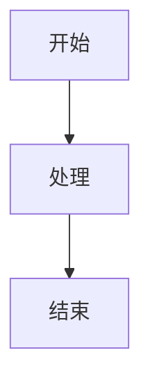

# IdeaSpaces

交互式知识管理平台 - 个人知识库 + 公开教学平台

## ✨ 特性

- 📝 **Markdown 写作** - 使用 Markdown 格式撰写文章，支持代码高亮、流程图
- 💬 **GitHub 评论** - 基于 GitHub Issues 的评论系统，无需自建后端
- 🐍 **代码沙箱** - 本地部署支持 Python 代码在线执行，支持 GPU 加速和 matplotlib 图片输出
- 🚀 **自动部署** - GitHub Actions 自动构建部署到 GitHub Pages
- 🌐 **CDN 加速** - 支持腾讯云 CDN 自动刷新

## 📦 安装

### 前置要求

- Node.js >= 18
- npm >= 9
- Docker >= 20 (本地模式，可选)

### 克隆并安装

```bash
# 克隆仓库
git clone https://github.com/username/ideaspaces.git
cd ideaspaces

# 安装依赖
npm install
```

## 🚀 快速开始

### 互联网模式 (开发预览)

```bash
npm run dev
```

访问 http://localhost:8080

### 本地模式 (带沙箱)

```bash
# 构建 GPU 版本沙箱镜像 (需要 NVIDIA GPU)
npm run build:sandbox

# 或构建 CPU 版本 (无 GPU 环境)
npm run build:sandbox:cpu

# 启动完整服务
npm run local
```

- 网站页面: http://localhost:8080
- API 服务: http://localhost:3001

**沙箱设置**: 点击导航栏右侧的齿轮图标可配置沙箱服务地址，支持连接远程沙箱服务。

## 📁 项目结构

```
ideaspaces/
├── docs/                   # Markdown 文章
│   ├── arch/              # 架构文档
│   └── python/            # Python 教程
├── .vuepress/             # VuePress 配置
│   ├── components/        # Vue 组件
│   └── plugins/           # 自定义插件
├── local-server/          # 本地沙箱服务
├── scripts/               # 构建脚本
└── .github/workflows/     # GitHub Actions
```

## ✍️ 写作指南

### 创建文章

在 `docs/` 目录下创建 `.md` 文件：

```markdown
---
title: "文章标题"
date: 2024-03-24
tags: [标签1, 标签2]
---

# 文章标题

内容...
```

### 代码高亮

````markdown
```python
def hello():
    print("Hello, World!")
```
````

### 流程图

````markdown

````

### 可运行代码块 (本地模式)

支持文本输出和 matplotlib 图片显示：

````markdown
```python runnable
print("点击 Run 按钮执行此代码")
```
````

````markdown
```python runnable
import matplotlib.pyplot as plt
plt.plot([1, 2, 3, 4])
plt.show()  # 图片会自动显示在输出区域
```
````

### GPU 代码块

````markdown
```python runnable gpu
import torch
print(torch.cuda.is_available())
```
````

### 评论配置

在文章 frontmatter 中配置评论：

```yaml
---
title: "文章标题"
issue:
  title: "自定义评论标题"   # 可选
  number: 42               # 或直接指定 Issue 编号
---
```

## 🔧 配置

### GitHub OAuth (评论功能)

1. 在 GitHub 创建 OAuth App
2. 配置环境变量或修改配置

### 腾讯云 CDN

配置 GitHub Secrets:

- `TENCENT_SECRET_ID` - API 密钥 ID
- `TENCENT_SECRET_KEY` - API 密钥 Key
- `CDN_DOMAIN` - CDN 域名

## 📜 命令

| 命令 | 说明 |
|------|------|
| `npm run dev` | 启动开发服务器 |
| `npm run build` | 构建生产版本 |
| `npm run local` | 启动本地完整服务 (VuePress + API) |
| `npm run build:sandbox` | 构建 GPU 版本 Docker 沙箱镜像 |
| `npm run build:sandbox:cpu` | 构建 CPU 版本 Docker 沙箱镜像 |
| `npm run build:sandbox:all` | 构建所有版本沙箱镜像 |

## 📄 许可证

MIT License