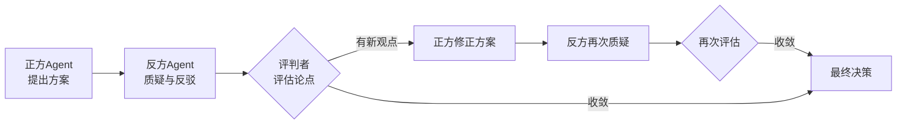
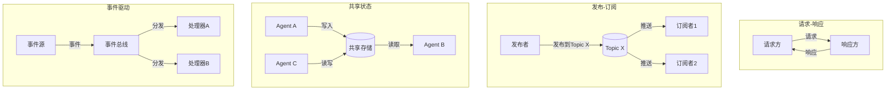

# Agent 间协作通讯

1973 年，MIT 人工智能实验室的卡尔·休伊特（Carl Hewitt）发表了一篇题为《A Universal Modular ACTOR Formalism for Artificial Intelligence》的论文，提出与其让一个庞大的程序包揽一切，不如把系统拆成许多独立的计算实体，每个实体只知道自己的事，通过互相发送消息来协同工作，他给这些实体起名叫 Actor。那时的人工智能研究主流是构建集中式的推理系统，这个想法在当时看近乎异端。但时间逐渐证明了它的价值，Actor 模型直接影响了后来 Erlang 语言的并发模型、Akka 框架的设计哲学，也是今天多智能体系统思想的根源之一。

七年后的 1980 年，MIT 的兰德·戴维斯（Randall Davis）和斯坦福大学的里德·史密斯（Reid Smith）提出了合同网协议（Contract Net Protocol），给出了多 Agent 协作的第一个系统化方案。Agent 管理者将任务分解后广播出去，有能力的 Agent 竞标承包子任务，管理者择优分配。这种"发包 — 竞标 — 签约"的模式很像人类社会的招投标流程。它首次证明了多个计算实体可以自发地组织起来完成复杂任务，而不需要一个全知全能的中央大脑。从 Actors 到合同网，一个共识逐渐成型：让多个小的智能体协作，比拼一个大的智能体，往往更灵活、更鲁棒。

将这两种思想放到当下的大语言模型语境里，会发现它们非但没有过时，反而变得更加紧迫了。单个 LLM Agent 的能力已经相当惊人，但它仍然受限于自身的知识范围、上下文窗口大小和工具集精度。当你面对一个需要同时懂前端设计、后端架构、数据库优化和部署运维的完整项目时，多 Agent 系统将会是一个更加恰当的工程选择。

多 Agent 的协作定义了 Agent 之间的组织关系和分工方式，通信则为这些关系提供了信息传递的基础设施。本章将两者放在一起讨论，尝试回答多个 Agent 如何组织起来，通过合理的分工协作和可靠的信息交换，完成单个 Agent 无法胜任的复杂任务。

## 多智能体的动机

单个 Agent 再怎么聪明，它的知识来自训练数据，而没有任何模型的训练数据能覆盖人类知识的全貌。一个擅长写代码的 Agent 面对 UI 界面的配色和排版时可能会抓瞎，反过来一个理解设计语言的 Agent 也不一定能写出高效的后端查询逻辑。知识边界是硬约束，模型膨胀的参数规模只能缓解这个约束，而不能完全消除。工具集是限制单 Agent 的另一道枷锁。直觉上，给一个 Agent 装上更多工具就可以增强 Agent 的能力，可是当可用工具的数量增加到几十个甚至上百个时，Agent 在每一步都要从琳琅满目的列表中选出合适的那个，选错的概率随着列表变长而急剧上升。另外，上下文窗口也有容量限制。即便今天的 LLM 已经支持百万 Token 级别的上下文，但塞进去的信息越多，模型在关键信息上的注意力就越分散。当一个任务涉及几十个子任务的全部背景信息时，单个 Agent 的上下文会变成一个嘈杂的会议室，每个人都在说话，但谁也听不清重点。从工程上看，单 Agent 天然无法避免可靠性问题。单 Agent 是一个单点，它一旦产生幻觉或做出错误推理，整个过程就崩溃了。没有人帮它校验，没有人质疑它的假设，没有人提出替代方案。在关键任务场景（譬如金融交易、医疗辅助诊断），单点失效的代价是不可接受的。

把以上单 Agent 的短板反过来看，就是多 Agent 系统的发力点。专业化分工让每个 Agent 只负责自己擅长的领域，工具集可以大幅精简。一个前端 Agent 手上只需要设计工具和 UI 组件库，一个数据库 Agent 只需要 SQL 执行器和 Schema 分析工具。工具选得少，选错的空间也就被压缩了，决策准确率自然提升。这个道理和 Agent 设计中的[单一职责原则](llm-to-agent.md#单一职责与组合)相通。并行处理则是多 Agent 系统在时间维度上的红利。独立的子任务可以同时分派给不同 Agent 执行，前端改组件和后端调接口本来就不需要互相等待。三个 Agent 并行做一小时，相比一个 Agent 串行做三小时，用户体验的差距是巨大的。而且并行还天然提供了时间上的冗余度，一个慢的 Agent 不会拖慢其他 Agent 的进度。工程上的单 Agent 可靠性问题也被多 Agent 的交叉验证大幅缓解。当一个 Agent 断言某个 Bug 时，另一个 Agent 可以验证这个判断是否合理。两个 Agent 得出相同结论的正确概率远高于一个 Agent 凭空猜测的概率。反过来说，两个 Agent 得出的结论互相矛盾，就等于发出了警报，说明某个地方可能有问题。这种内置的校验机制大幅降低了幻觉和推理错误对最终输出的侵蚀。

## Agent 的组织方式

协作架构定义了 Agent 之间的层级关系和协调机制，是后面要讨论的协作模式的底层结构。理解架构选型，是设计多 Agent 系统的第一步。

### 集中式架构

集中式架构设有一个**中心协调者**（Orchestrator），让它统揽全局。协调者自己不干具体的活，它的职责是接任务、拆任务、分任务、收结果、把关质量。真正动手的是一群工人 Agent（Worker Agent），每个工人只盯着分配给自己的那一块，做完就把结果交回来。这类似于 MapReduce 里的 Master-Worker 模式，Master 把大数据集切成小块分给 Worker 去算，Worker 算完把中间结果回传，再由 Master 汇总输出。

集中式协作架构最大的吸引力在于简单。因为只有一个大脑在做决策，全局状态一目了然，任务分配不会冲突，结果汇总不会遗漏。一致性也是天然的，不需要共识算法，因为共识就是协调者本人的判断。对开发者来说，调试集中式系统也相对轻松，只需要盯着协调者，看它做了什么决定、什么时候做的决定，就能追溯到绝大部分问题。

但集中式架构的中心协调者既是优点也是阿喀琉斯之踵。协调者本身是一个单点，它崩了整个系统就停摆。它是吞吐瓶颈，任务分解和结果汇总的计算量随 Worker 数量增长，协调者迟早会忙不过来。更微妙的是，集中式架构对协调者的能力有隐性要求。它必须足够聪明，能够准确评估每个 Worker 的能力、合理拆解任务、及时发现偏航的 Worker 并纠正。如果协调者本身在某个领域是外行，它可能做出糟糕的分配决策，譬如让一个不擅长写测试的 Agent 去编写关键模块的单元测试，直到结果出来之前都没人会发现这个错误。

### 去中心化架构

去中心化架构走了完全相反的路线。没有中心协调者，Agent 之间是对等（Peer-to-Peer）关系，任务的分配和结果的整合通过 Agent 之间的直接通信协商完成。去中心化架构的协调依赖一套事先约定的机制。最常见的是市场机制，把任务当成拍卖品，有能力的 Agent 竞标，这其实就是 1980 年合同网协议的思想直接延续。除此之外还有共识机制（Agent 们对某个议题投票，少数服从多数）和契约机制（Agent 之间预先约定服务协议）。无论哪种机制，基本逻辑都是让秩序从局部交互中自发涌现，而不是由一个中央大脑强加。

这种架构的好处是没有单点故障，任何一个 Agent 挂了都不影响整体。新 Agent 随时可以加入网络、老 Agent 也可以随时退出，系统天然适合开放环境，你不需要知道每个 Agent 是谁，只要遵守通信协议就能参与协作。去中心化架构匹配的场景是那些没有明确任务边界、需要多方探索的工作。譬如让多个 Agent 同时调研一个开放问题，各自从不同角度搜集资料、形成观点，最后通过辩论或投票收敛出结论。这种场景下，中心协调者自己也未必知道最优方向在哪，不如让大家各走各的路，用多样性来对冲不确定性。

去中心化的协作架构的代价当然也不小。一致性是第一个需要处理的问题。没有中心协调者拍板，Agent 们对同一件事的判断可能五花八门。想达到"大家一致同意"这件事本身就需要共识算法的支持，而共识算法在异步、不可靠的网络中的复杂度非常之高。

### 层级式架构

层级式架构是一个折中方案，把集中式的全局掌控力和去中心化的局部自主性堆叠在一起。它借鉴了人类组织的天然结构，公司里有 CEO 做战略决策，有部门经理把战略拆成可执行的战术任务，有执行员工完成具体工作。换到多 Agent 系统里，就是高层管理者 Agent 负责定方向、分解大任务；中层协调者 Agent 负责管理一支 Worker 小队，搞定自己辖区内的调度和结果汇总；底层 Worker Agent 老老实实干活。

层级式架构的优雅之处在于其分而治之的策略。一家大型企业不可能让 CEO 直接管理每一个员工，那样 CEO 会成为整个系统的瓶颈。解决问题的办法是引入管理层级，每个经理管几十个人，CEO 只需要管几十个经理。多 Agent 系统也一样，当 Worker 数量增加到集中式协调者无力承担的时候，插一层中间层，让一个高层管理者管几个中层协调者，每个中层协调者再管自己的 Worker 小组，整个系统就重新变得可管理了。

但这种架构也有自己的弱点。信息在层级之间传递时会衰减和失真，每一层在向上汇报时都会摘要和简化，被丢掉的细节可能是上层做决策时需要的关键信号。此外，层级越深，决策周期越长。高层指令要层层下达，底层反馈要层层上传，来回几趟，总延迟就很可观了。

以上三种协作架构并不是互斥的选择，实际系统中，你完全可以在一个层级式架构的内部采用集中式协调（每个部门内部是星形），也可以在集中式框架里让 Worker 之间保留一定的直连通道。选型的关键不是哪种架构最好，而是任务本身的结构是什么样的，任务层次越分明，集中式或层级式越自然；任务越开放和不确定，去中心化的优势就越明显。

## Agent 的分工方式

如果把协作架构比作公司的组织架构图（谁是上级、谁是平级），那协作模式就是组织的工作流程，任务在这些角色之间如何流转、每一步做什么、顺序怎么安排。架构和协作模式之间的关系是松耦合的，同一种架构下可以跑不同的协作模式，同一种协作模式也可以架设在不同的架构上。

### 顺序协作

顺序协作是最直观也最古老的分工方式。把任务切成几个有明确前后依赖的阶段，每个 Agent 负责一个阶段，前一阶段完成再启动后一阶段。这跟 Unix 管道（Pipe）的设计精髓一致，`cat data.txt | grep error | wc -l`，每个命令只做一件事，上一个命令的输出通过管道成为下一个命令的输入。

软件开发的标准流水线也是顺序协作的教科书案例。需求分析 Agent 理解用户要什么，产出需求文档；设计 Agent 根据需求文档绘制系统架构和接口设计；编码 Agent 照着设计写代码；测试 Agent 对代码做验证；部署 Agent 把验证通过的代码推到线上。每一步都依赖前一步的输出，跳了步骤或者步骤顺序搞反，整个流程就没有意义。

顺序协作的优点是流程清晰，谁该做什么、什么时候做、输入输出是什么，全部都一清二楚。任何一步的结果都可以追溯到上游输入，出问题时顺着链条往回找就行。代价则是速度和风险的积累。总延迟等于每一步延迟之和，流水线里最慢的那个 Agent 决定了系统的整体吞吐。而且错误会沿着链条传播和放大，需求分析中的一个误解，经过设计、编码、测试三个环节，等到部署时已经面目全非。这被称为错误传播效应，在顺序依赖链中，没有什么"防火墙"来阻断上游错误对下游的污染。

### 并行协作

并行协作试图解决顺序协作的问题。既然顺序依赖导致延迟累加，那就尽量让 Agent 们同时干活。前提是任务可以被拆成相互独立的子任务，子任务之间不需要实时通信、不共享可变状态，这样也就无所谓执行顺序了。一个典型的并行场景是代码重构。给一个项目里的五个模块各自加一个功能，五个模块之间没有调用关系，那就可以让五个 Agent 同时开工，每人改一个模块，最后人工确认一下结果。又如数据分析中的多表查询，让三个 Agent 分别查用户表、订单表、商品表，各自拿到结果后再汇总。

并行协作的瓶颈开销一般不在执行阶段，而在拆解和汇总阶段。拆解阶段要考虑任务怎么拆才能在保持独立性的同时保证覆盖完整。汇总阶段要怎么处理 Agent 之间的输出冲突。还有资源竞争的管理，多个 Agent 同时读写同一个文件或同一个数据库表时，需要锁机制来避免脏写，但锁本身又可能引入死锁和等待。这些问题在并行编程中早已被反复讨论，多 Agent 并行协作只是把同样的挑战放到了一个更高抽象层次上。

### 辩论式协作

辩论式协作是 LLM Agent 出现后兴起的协作模式，它和前面两种模式的性质完全不同。顺序和并行都假设任务是确定的、可以被分解的，而辩论式协作恰恰是冲着不确定性去的，当问题没有标准答案，或者不同 Agent 基于各自的视角会得出不同结论时，与其让一个 Agent 拍板，不如让多个 Agent 摆出各自的观点，通过辩论逼近更可靠的答案。

这种模式的理论基础来自管理学中一个名为多样性红利（Diversity Bonus）的概念：当问题的空间足够复杂时，一群视角不同的个体共同决策，往往比任何一个个体单独决策更准确。类比人类社会的陪审团制度，不是让一个法官说了算，而是让 12 个来自不同背景的陪审员各自审视证据、发表意见、互相辩论，直到达成共识或多数意见。

辩论式协作的典型流程是一个三角结构，如下图所示。正方 Agent 提出一个方案和它的论证依据；反方 Agent 拿着这个方案仔细挑刺，假设是否成立、逻辑有没有跳跃、忽略了哪些边界情况、有没有更好的替代方案；正方可以反驳，可以修正方案，也可以承认反方的观点并吸收进来；最后由评判者 Agent 综合双方论点做出选择。评判者不一定是另一个 Agent，也可以是量化指标，譬如让两个方案分别在测试集上跑一跑，胜负由数据决定。

*图：辩论式协作的三角流程*

辩论式协作最大的收益在于减少个体偏见。一个 Agent 在独自推理时容易陷入确认偏误，只找支持自己结论的证据，忽略反例。辩论引入了一个对抗性的视角，你的思路里藏着的问题，你自己可能看不见，但对手看得一清二楚。这个过程强迫每个 Agent 进行更深层的推理，产出的方案往往比单 Agent 的初稿更鲁棒。而辩论的代价则是通信开销较大，一轮辩论至少需要两到三个 Agent 各自进行一次完整推理，而且通常不止一轮，可能需要两三轮往复才能收敛。如果没有好的终止机制（譬如最多辩论三轮，或者连续两轮无新论点即终止），辩论可能退化成无休止的争论。

## Agent 的信息交换

如果说协作架构和协作模式定义了 Agent 之间的生产关系，谁指挥谁、怎么分工，那通信协议就是维持这些关系运转的基础设施。它回答的是消息以什么方式发送、由谁发到谁、发完之后发送方等不等回应。没有通信，再精巧的协作设计都只能是纸上蓝图。在多 Agent 系统的日常运行中，至少流淌着五类不同性质的信息。虽然它们在技术上都体现为"消息"，但各自的用途和语义要求截然不同，混在一起处理会产生很多麻烦。

- 任务分配信息是协调者向工人 Agent 派活的主通道，通常包含任务描述、输入数据、约束条件和预期输出格式。
- 状态同步信息则是工人 Agent 向协调者（或向同伴）汇报自己的当前进度，让其他 Agent 知道自己的状态，避免重复工作或盲目等待。
- 结果传递信息是最终产物的搬运工，一个 Agent 算出了结果，要把这份成果交给下一个需要它的 Agent。
- 请求与响应信息处理的是 Agent 之间的服务调用，譬如一个 Agent 需要查询另一个 Agent 维护的知识库。
- 最后还有控制指令信息，暂停、取消、重试，这些是系统级的管理信号，通常由协调者发送给 Worker。

将这五类信息分开设计，是因为它们对可靠性和延迟的要求不一样。控制指令需要高优先级和确认机制（"取消"这条消息绝对不能丢），而状态同步则允许一定的延迟和丢失（少报一次进度不至于让整个任务失败）。在实际系统设计中，通常会为不同类型的消息设置不同的通道或不同的 QoS（服务质量）策略。这五类信息需要通过具体的通信模式来承载，下面来看多 Agent 系统中四种主流的通信模式，以及它们各自适合承载哪类信息。

### 请求 - 响应模式

请求 - 响应模式是最基本的通信模式，也是 HTTP 协议刻在每一位程序员肌肉记忆里的交互方式。客户端发请求，服务端返回响应，一来一回。在多 Agent 系统中，这种模式尤其适合那些问一个问题，等一个答案的场景。按发送方是否要等待响应，请求 - 响应又分为同步和异步两种。同步模式下，发送方发出请求后原地等待，直到接到响应才继续往下走。这种方式实现简单，但延迟较高，因为发送方的整个推理流程被阻塞了。如果 Worker 需要跑一个长任务，发送方就只能一直等待。异步模式解了这个问题，发送方把请求扔出去就继续干自己的事，等响应到了再处理（通过回调、轮询或事件通知）。这样延迟变低了，但代码也变得复杂，必须跟踪哪个请求已经回了、哪个还在等待，状态管理的工作量明显上升。

超时处理是请求 - 响应模式不可或缺的一环。Worker 可能会崩溃、网络可能会中断、LLM 可能会在某一步无限循环，请求可能永远得不到回应。如果不设超时，发送方的请求会变成一个黑洞，既没答案，也不知道还要等多久。设了超时之后，如何处置超时请求同样需要细致考量，是直接重试、是降级为默认方案、还是向上级协调者汇报异常，这些都需要根据任务的性质来提前约定。

### 发布 - 订阅模式

发布 - 订阅模式打破了请求 - 响应模式必须知道向谁发送消息的前提条件。在发布 - 订阅模型中，消息发送方不直接指定接收方，而是把消息投递到一个主题（Topic）上，谁订阅了这个主题，谁就自动收到消息。这是一种从"目标寻址"到"意图寻址"的转变，你不需要知道具体有哪些 Agent 在线，只需要对某个话题进行广播，感兴趣的人自然会听到。

这种模式天然适合一对多通知。譬如代码提交事件，不需要知道当前有多少个 Agent 关心代码提交这件事（审查 Agent、文档 Agent、CI 监控 Agent），只需发一条"仓库 X 的分支 Y 有新提交"，订阅了这个主题的 Agent 各自响应。事件广播、状态公告等都是发布 - 订阅模式的适用场景。

发布 - 订阅模式的两大痛点分别是消息顺序和调试可追踪性。在分布式环境中，消息可能不会按照发送顺序到达，"任务完成"的消息有可能比"任务开始"先到达，订阅者需要能处理这种乱序。另外，发布者和订阅者互相不知道对方的存在，这使得追踪信息流变得困难，当系统出问题时，很难还原谁在什么时候发了什么信息给谁。

### 事件驱动模式

事件驱动模式和发布 - 订阅模式密切相关但侧重点不同。事件驱动的基本思想是状态改变即通知，每当系统中的某些状态发生变化（如任务完成了、文件更新了、Agent 加入了），就发出一个事件，对这个变化感兴趣的 Agent 自动触发相应的响应行为。事件和消息有微妙的语义差异。消息是要求订阅者去做某事，带有指令性，发送方期望接收方采取行动。事件是某事已发生，是声明性的，发送方只是把事实公告出去，会不会有响应、谁来响应，发送方并不关心。理解这个区别对设计通信语义很重要。当你用事件来传递任务指令时，可能会出问题，因为事件的声明性语义不提供任何谁该承接这个任务的保证。

事件模式的主要风险在于规模。事件风暴这个概念来自微服务架构，在多 Agent 系统中同样成立。一个看似无害的状态变更可能触发一连串 Agent 的响应，这些响应又产生新的事件、触发更多的响应，形成一个失控的正反馈链。譬如"文件 A 修改"事件触发审查 Agent 产生新的审查报告，审查报告又触发文档 Agent 更新文档，文档更新又触发翻译 Agent 启动翻译……链条越长，系统中无关的活动越多，真正的有效工作反而被淹没了。抑制事件风暴需要事件治理策略，限制事件传播深度、合并高频事件、对事件设置传播范围。

### 共享状态模式

共享状态走了一条和发送消息完全不同的路线，Agent 之间不直接通信，而是通过一个共享的数据空间来间接协作。Agent A 把结果写进共享存储，Agent B 从同一块存储里读取。就像团队共享文件夹里的文档，你不需要给同事发文件，大家打开同一个文件就能看到最新的版本。

共享状态模式最著名的实现是黑板系统（Blackboard System），它最早在 1970 年代末被提出，用于让多个专家系统协同解决复杂的信号理解问题。在黑板上，每个 Agent 都可以读写一个公共的数据结构，看到别人的中间结果，也可以在别人结果的基础上继续推理。Agent 之间不需要知道彼此的存在，它们只需要知道黑板的地址和读写规则。

共享状态的最大好处是异步协作和时间解耦。Agent A 可以在下午三点写入结果，Agent B 在下午五点读取使用，两者不需要同时在线。状态天然是持久的，这为长周期任务提供了很好的模式支持。共享状态的最大挑战是并发写冲突，如果两个 Agent 同时修改黑板上的同一块会怎样？谁来仲裁？还有状态清理问题，黑板上的中间结果越积越多，什么时候删、由谁删，不清理则空间膨胀，清理太快则可能删掉其他 Agent 还未读取的重要数据。

### 通信模式的选择

四种通信模式不是排他的单选项。请求 - 响应模式适合点对点的确定交互，如"帮我把这个函数的单元测试跑一下"。发布 - 订阅模式适合一对多的广播通知，如"新版本上线了，相关人员请知悉"。共享状态模式适合松耦合的异步产出积累，如多个 Agent 共同撰写一份技术方案。事件驱动适合需要实时感知状态变化的场景，如 CI 流水线中的自动触发链。真实系统几乎总是在混合使用这些模式，如在一个集中式架构中，协调者用请求 - 响应分配任务，Worker 之间通过共享状态交换中间结果，关键状态变更通过事件通知全局。

*图：四种通信模式的交互拓扑*

## 通信的可靠性保障

通信肯定不是扔出消息就万事大吉了。在多 Agent 系统中，网络延迟、Agent 崩溃、LLM 响应超时，任何一环都可能让一条消息石沉大海。而一条丢失的关键消息，譬如消息"取消这个任务"，可能导致连锁故障。可靠性保障不是附加的可选功能，而是通信协议设计中不可分离的组成部分。

### 消息传递保证

消息传递有三层保证级别，从低到高依次是：至多一次（At-Most-Once）、至少一次（At-Least-Once）、恰好一次（Exactly-Once）。

- 至多一次是最低级别的保证，它承诺一条消息不会被重复投递，但不承诺它一定会到达，消息发出去，要是传丢了就算了。这个级别适合低价值的通知类消息，譬如定期的状态同步，少收到一次并不会影响任务整体。

- 至少一次承诺消息不会丢失，发不出去就重试，直到确认对方收到为止。代价是可能重复，网络抖动的瞬间发送方没收到确认，重发了一次，结果两次都到达了，接收方收到两条一模一样的消息。这就需要接收方的处理逻辑具有幂等性（Idempotence），同一条消息处理一次和处理两次的效果必须完全一样。在多 Agent 系统中，至少一次是常规选择，为接收方设计幂等处理的成本通常低于实现恰好一次的复杂度。

- 恰好一次是最理想的保证，也是在分布式系统中最昂贵的承诺，需要协调发送方和接收方的状态，确保即使有重试和网络故障，消息也恰好被处理一次。实现恰好一次通常依赖接收端的幂等去重机制配合至少一次投递，或在发送端借助事务日志（把消息写入与业务处理放到同一个原子事务中）确保消息与状态变更的一致提交。"问询-准备-发送"握手机制本身并不能保证恰好一次语义，若接收方在确认准备就绪后崩溃，消息仍然丢失，而发送方超时重试时若缺乏去重，又会造成重复处理。在多 Agent 通信中，恰好一次通常只在涉及不可逆操作（如扣款、权限变更、重要资源释放）时才应被采用，因为实现成本高昂，多数场景中与任务的业务价值不成正比。

### 消息确认与重传

确认机制（ACK）是保障至少一次语义的基础手段。接收方在成功处理完消息之后，向发送方回发一个确认信号。发送方在发完消息后启动一个计时器，如果在计时器归零之前收到了 ACK，这轮通信就算完成；如果超时没收到，就重发一次。固定间隔重传最简单，每 5 秒重试一次，但如果问题出在网络拥塞上，持续以高频率重试反而会加剧拥塞。指数退避（Exponential Backoff）是这个问题的经典解法。第一次重试等 1 秒，第二次等 2 秒，第三次等 4 秒，每次间隔翻倍，直到达到预设的最大值（通常设在 30 秒或 1 分钟左右）。同时设置最大重传次数（譬如 5 次或 10 次）作为安全上限，超过之后消息被标记为失败并转入死信处理流程。

在 Agent 场景中，确认超时时间的设定需要特别考虑。一个 Agent 在处理请求时可能需要调用外部 API、执行复杂推理、读写文件系统，完成一个响应可能耗时几秒到几分钟不等。如果把确认超时设得太短，大量正常的慢处理都会被误判为失败的请求，触发大量不必要的重传。所以 Agent 通信中的确认超时应该和任务的预期执行时间匹配，一个数据分析 Agent 的响应时间阈值可以设到几分钟级别，而一个简单的信息查询 Agent 几秒钟就够了。

### 死信处理

死信是指那些无论如何也处理不了的消息，如格式非法、接收方不存在、重试了无数次仍在失败、或者消息本身在一个永远不会被满足的条件下被创建。死信不是一个独立的问题，它是系统健康状况的信号。把死信简单地丢弃等于在掩盖问题。标准做法是引入死信队列，一个专门的存储区域，把处理失败的消息从正常处理通道中移出来，放到这个队列里。这样做的目的不是放着不管，而是把问题隔离出来，让正常消息的流通不被阻塞，同时给开发者和运维人员提供一个可以事后分析的窗口。死信队列中的每条消息都应该保留失败原因和时间戳，以便追溯。

对于死信的处理有几种策略可供选择。重试是最直接的，在修复了格式错误或重启了崩溃的接收 Agent 之后，把死信重新投递回正常通道。降级处理是在完全正确的处理不可能的情况下，用简化流程兜底，譬如消息要求生成一份包含 20 个指标的报告，但第 7 个指标的查询超时了，那就生成 19 个指标的报告并标注缺漏。告警则是在死信数量或比率异常时通知人类介入，因为大批量死信通常意味着系统性的故障而非个别消息的问题。死信率本身是一个应该被持续监控的系统健康指标。

## 本章小结

从休伊特的 Actor 模型到史密斯的合同网协议，多 Agent 协作的思想用半个世纪从学术边缘走到了工程实践的中心。本章梳理了构建多 Agent 系统需要面对的几个权衡点：集中式架构的简洁可控与单点脆弱并存，去中心化的弹性背后是共识与调试的高昂代价。顺序协作的清晰流程受制于错误传播，并行协作的效率红利则需要任务可分解为前提。而消息传递的可靠性保障是所有协作设计的底座，再精巧的分工，若消息会丢失或重复，都只是空中楼阁。设计是在这些张力中寻找平衡点，而不是追求某种绝对最优解。

## 练习题

1. 一个五人开发团队用 GitHub Flow 进行协作：每个人在自己的分支上开发，通过 Pull Request 发起代码审查，审查通过后合并到主分支。从多 Agent 协作的视角分析，这个流程对应了哪些协作架构、协作模式和通信协议？团队协作和 Agent 协作之间有哪些相似之处和本质差异？

   

   
参考答案

   
   协作架构上是去中心化的（没有中心调度者，开发者自行认领任务），但通过 PR 的审查机制引入了集中的质量把关（集中式的局部特征）。协作模式上同时涉及并行（多人并行开发）、顺序（代码审查→合并的流水线）和迭代优化（修改→重新审查）。通信模式上，PR 的创建和评论是请求 - 响应，CI 状态的通知（"Build Passed"）是事件驱动，也有发布 - 订阅的特征（团队成员 watch 仓库）。
   
   相似之处：都涉及任务分解、分工、通信、状态同步和质量保证。本质差异：人类开发者有隐含的常识判断和领域经验，不需要显式定义"共享本体"就能互相理解；Agent 则需要显式的角色定义、契约和通信协议，所有隐性知识都必须被转化为显式的规范。
   
   

2. 假设你有一个 LLM Agent 系统，包含以下四个 Agent：需求分析师、UI 设计师、后端工程师、测试工程师。每个 Agent 运行一次完整推理的平均耗时分别是 10 秒、15 秒、20 秒、8 秒。如果任务要求严格按"需求分析→UI 设计→后端编码→测试"的顺序执行，能否改用其他协作方式缩短总完成时间？什么情况下可以改，什么情况下不能改？

   

   
参考答案

   
   按顺序执行的总耗时为 10+15+20+8=53 秒，由最慢阶段串联累加而成。如果能拆开依赖关系，UI 设计和后端编码可以在需求分析确认后并行执行，然后统一进入测试阶段，总耗时为 10+max(15,20)+8=38 秒，节省约 28%的时间。
   
   不能改依赖的情况：UI 设计必须"看到"后端 API 的完整定义才能设计对应的交互（UI 依赖后端），这时后端必须在 UI 之前执行。能改的情况：需求分析产出了足够清晰的接口规范，UI 和后端各自按同一份规范独立推进，这时并行就是可行的。关键不在于"理论上是否可并行"，而在于接口规范是否足够完整和精确到让两个团队（或 Agent）可以独立工作。
   
   
