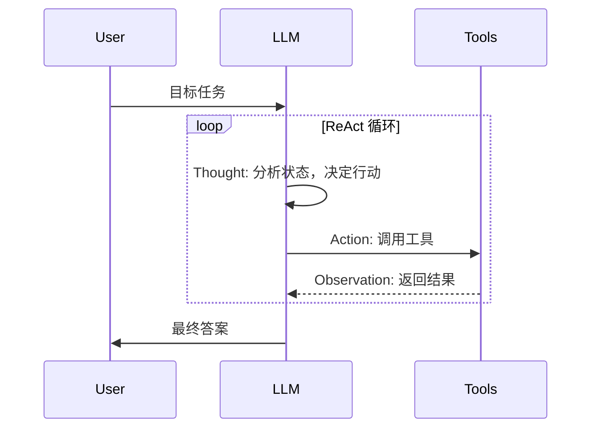
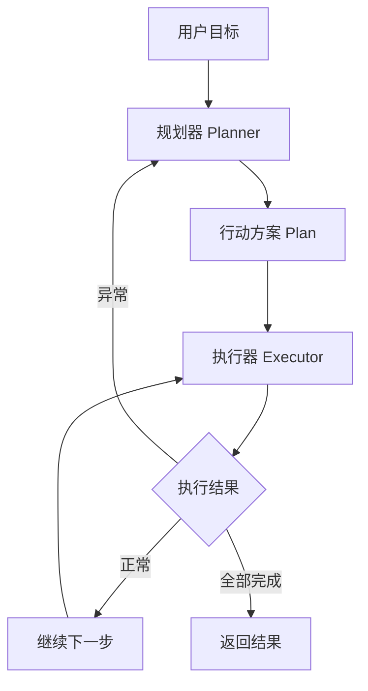
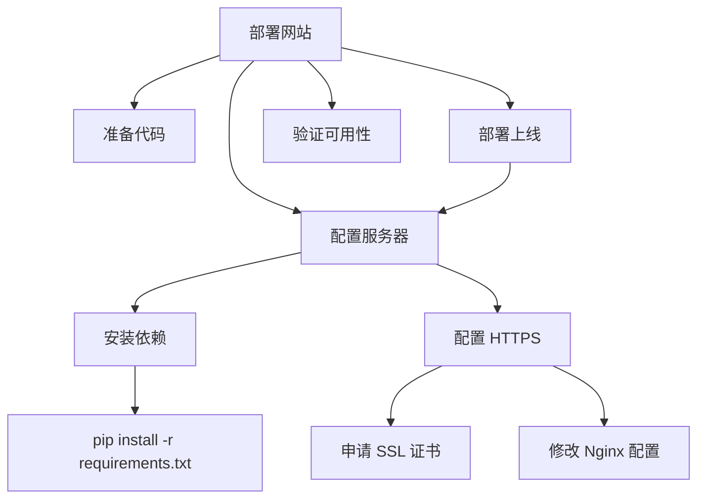

# 从 LLM 到 Agent

语言模型擅长"说"，智能体（Agent）擅长"做"。让一个只会生成文本的系统学会自主行动，这个跨越并不是最近才开始的尝试。早在人工智能研究的初期，研究者们就梦想着建造能感知环境、制定计划、执行行动的自主系统。1950 年代，美国空军上校约翰·博伊德（John Boyd）提出了 OODA 循环（Observe-Orient-Decide-Act），用于描述战斗机飞行员在空战中的决策过程：观察敌机位置、理解战场态势、决定机动策略、执行操作，然后根据新状态重新开始循环。博伊德认为在对抗中，谁能更快地完成这个循环，谁就占据主动权。这个框架后来被借用到 AI 领域，成为智能体架构设计的重要参考。

半个多世纪后，大语言模型的爆发让智能体的梦想有了新的实现路径。2022 年，姚顺雨（Shunyu Yao）等人在论文《ReAct: Synergizing Reasoning and Acting in Language Models》中提出了 ReAct 模式，将语言模型的推理能力与外部工具的行动能力交织在一起，开辟了从 LLM 到 Agent 的技术路线。随后，以 AutoGPT、LangChain 为代表的 Agent 框架在 2023 年集中涌现，标志着 LLM-based Agent 从学术概念走向工程实践。

## LLM 的能力边界

在讨论 Agent 之前，我们需要先诚实地审视语言模型本身不能做什么。理解这些能力边界，才能理解 Agent 架构中每一个组件存在的理由。想象这样一个场景，你向 LLM 输入"帮我检查一下服务器状态"。可能的回复是"你使用 `top` 命令查看 CPU 使用率"这样的建议，也可能直接生成一段模拟的服务器状态文本。但模型不会真的登录服务器、执行命令、读取输出。这就是语言模型的第一个局限，它只是一个被动的文本生成器。输入输出都是 token 序列，而非操作指令。这并非设计缺陷，语言模型的设计目标就应该是专注于语言的理解与生成，行动能力应通过 Agent 的外部机制来补全。

除了行动上的约束外，在 RAG 部分中还提到了语言模型受静态知识时效性的约束。模型的信息截止于训练数据基线定型那一刻，对于训练后发生的事件、私有数据库中的记录、实时变化的传感器读数，模型无从得知。这意味着即便模型有能力生成正确的行动指令，也可能因为信息过时或不完整而做出错误决策。这是 Agent 架构需要加入感知与信息检索能力的根本原因。

补全了行动能力、信息检索能力后，语言模型第三个硬性约束来自于它有限的上下文窗口。上下文窗口的大小决定了模型在一次推理中能看到多少信息。以编程任务为例，一个持续数小时的编码会话会迅速积累大量信息，如用户的需求描述、多轮对话的调整指令、多个源文件的内容、终端的命令输出、调试日志、错误堆栈……这些信息中的每一项都可能被后续决策所使用，但窗口的物理容量不允许全部保留它们。此外，上下文窗口的利用效率本身也随长度增加而下降。Lost in the Middle 现象揭示了模型对上下文中间部分的信息检索准确率会显著降低。这意味着即使能够扩大上下文窗口，也并不能从根本上解决问题，反而可能引入新的可靠性风险。由此可见 Agent 系统需要有外部记忆能力，作为模型上下文窗口的可靠信息来源。

最后，语言模型优化的目标是文本的概率分布上的连贯性，而非基于事实的准确性。模型在生成每个 token 时，选择的是在统计意义上概率最大的下一个词，而不是最正确的那个词，因为"正确"没有办法量化。由此就产生了语言模型的幻觉（Hallucination）现象。在聊天场景中，编造一个不存在的餐馆、虚构一本从未出版的书，最多只是让人啼笑皆非。但在 Agent 场景中幻觉的后果要严重得多。如果让 Agent 去进行证券交易，或者运维云服务器，它可能因幻觉出一条不存在的信息而造成一系列错误决策。即使看似微小无关紧要的幻觉，也可能像滚雪球一样在 Agent 的决策循环中被放大，导致整个任务的偏离。现有模型架构下，幻觉是无法被彻底消除的，务实的态度是接受幻觉的可能性，然后通过 Agent 的自省（Self-Reflection）机制去检查推理链路中的逻辑漏洞，并用外部知识源的交叉验证进行独立的事实确认。

## Agent 的核心架构

理解了 LLM 的能力边界之后，我们来看 Agent 架构如何逐一弥补这些不足。Agent 的核心架构设计围绕如何将一个被动的文本生成器转变为一个能自主决策的行动系统来展开。

### 感知 - 决策 - 行动循环

如果用一个词概括 Agent 的运行方式，那就是"循环"。Agent 不是一个一次性的问答机器，而是一个不断重复"观察 → 思考 → 行动"的循环决策系统。这个循环的思想来源可以追溯到前面提到的约翰·博伊德（John Boyd）的 OODA 循环，Agent 继承了 OODA 循环的基本框架，但赋予了每个环节新的含义。LLM 在循环中扮演的是思考与决策的角色，它接收环境状态的结构化描述，推理当前处境，生成下一步行动的方案。然后由执行引擎（Executor）将行动方案转化为实际操作，调用 API、读写文件、查询数据库，并收集操作结果作为新的观察，反馈给 LLM 进行下一轮推理。


*图：Agent 循环*

上图清晰地展示了 Agent 循环的闭合结构。每一步行动的结果都会成为下一步推理的输入，形成持续的信息回流。图中的每一个环节都对应着架构中的一个组件：LLM 推理模块负责决策，执行引擎负责将决策翻译为具体操作，工具集则是 Agent 与外部世界的接口。

Agent 循环的停止条件是任务已经完成。如果目标描述不够精确，譬如"帮我优化代码"，那 Agent 可能陷入无休止的优化循环。如果过早认为任务完成，又可能遗漏重要步骤。停止条件的判断本身就需要推理能力，这正是 Agent 与简单脚本的本质区别。脚本按固定步骤执行到结束，Agent 需要在执行过程中动态判断目标是否达成。

从更广阔的视角看，OODA 循环与[强化学习](../../language-models/alignment/rlhf.md)中的交互模式在结构上是一致的，区别在于交互的表示方式不同。强化学习使用数值向量（状态向量、动作向量、奖励值）来引导优化方向，而 LLM Agent 使用自然语言文本作为状态描述和动作描述。语言的表达能力远强于数值向量，这意味着 LLM Agent 可以处理远比传统强化学习智能体更复杂、更开放的任务，但同时，它的代价是语言描述的歧义性也为决策引入了新的不确定性。

### ReAct 模式

2022 年，普林斯顿大学的姚顺雨（Shunyu Yao）在论文《ReAct: Synergizing Reasoning and Acting in Language Models》中提出了 ReAct 模式，首次将推理（Reasoning）和行动（Acting）在语言模型内部统一为一个交替进行的流程。ReAct 通俗理解就是让模型在行动之前先"想一想"，在行动之后根据结果再"想一想"，如此反复。具体来说，ReAct 的每一次循环包含思考、行动、观察三个环节：
- **思考**（Thought）环节，模型用自然语言分析当前状态并决定下一步做什么；
- **行动**（Action）环节，模型生成一个工具调用指令，由外部系统执行；
- **观察**（Observation）环节，工具的执行结果以文本形式追加到上下文中，成为下一轮思考的输入；

这个 Thought → Action → Observation → Thought 的循环周而复始，直到模型判断任务已经完成，如下图所示。


*图：ReAct 循环*

为了理解 ReAct 为什么有效，可以对比另外两种策略。纯思维链推理模式（Chain-of-Thought，CoT）让模型一步一步推理，但由于缺少了行动缓解，它缺乏使用工具的能力。这就像让一个人蒙着眼睛解题：他可以一步步思考，但无法查阅任何外部资料来验证自己的想法。纯行动模式（Act-only）则反过来，让模型直接调用工具但不在中间步骤进行显式推理，导致模型在信息不充分时盲目行动。

ReAct 将两者结合，推理帮助模型制定更合理的行动计划，行动帮助模型获取推理所需的实时信息，二者相互增强。举一个具体的例子：当 Agent 被问到"2023 年诺贝尔物理学奖得主是哪个大学的教授"时，ReAct 的思考过程可能是这样的：Thought: "我不知道 2023 年诺贝尔物理学奖得主是谁，需要查一下"；Action: 调用搜索工具查询"2023 Nobel Prize in Physics"；Observation: 搜索结果返回"Pierre Agostini, Ferenc Krausz, Anne L'Huillier"；Thought: "现在我需要查每个人的所属机构"；Action: 分别查询三人信息……这种思考与行动交织的模式，让 Agent 能够像人类一样"边想边查，边查边想"。

ReAct 也有自己的代价。每次 Thought-Action-Observation 循环都会消耗上下文空间，在长任务中早期信息可能被挤出窗口。思考步骤本身也增加了 token 消耗，提高了推理成本。这些局限正是规划器 - 执行器分离模式的产生背景。

### 规划器 - 执行器分离

ReAct 模式是"边想边做"，每走一步都停下来想一想下一步该做什么。这种模式在不确定性高、信息逐步获取的任务中表现良好，但在步骤明确、依赖关系清晰的任务中，每次行动后重新推理全局策略就显得低效了。

规划器 - 执行器（Planner-Executor）分离模式是另一种设计选择：先想好再做。规划器（Planner）在行动开始前对整个任务进行全局规划，生成一份结构化的行动方案（Plan），其中包含子任务的分解、执行顺序和依赖关系。执行器（Executor）拿到这份方案后，按部就班地执行每一步，只有在遇到异常时才上报给规划器请求重新规划。



两种模式代表了不同的决策时机：ReAct 将决策分布在每一步，追求灵活性和实时调整；Planner-Executor 将决策集中在开始阶段，追求全局最优和减少重复推理。它们不是互斥的，实践中更常见的做法是混合策略：先用规划器生成整体方案作为路线图，执行器在执行中遇到意外时触发局部重新规划，而不是推翻整个方案。

分离设计的好处是规划与执行可以独立优化。规划器可以使用更强大的模型来做全局推理，而执行器可以使用更轻量的模型来降低单步成本。规划的粒度也可以根据任务复杂度调整：简单任务只需粗粒度的步骤列表，复杂任务可能需要带条件和循环的结构化方案。此外，分离后执行过程可以被外部监控和中断，这对于需要人类监督的关键任务尤为重要。

分离的代价同样不容忽视。规划器与执行器之间需要明确的通信协议：方案用什么格式？异常如何定义？重新规划的触发条件是什么？这些问题在多轮交互中会逐渐累积复杂度。更根本的问题是，规划器在制定方案时掌握的信息往往是不完整的：它不知道某个工具调用会返回什么结果，也不知道执行中会遇到什么意外。这意味着初始方案大概率需要修正，而修正本身可能需要与从头推理相近的智力成本。

## 从对话到自主行动

拥有了感知 - 决策 - 行动循环和具体的推理模式（ReAct 或 Planner-Executor），Agent 已经具备了基本的行动能力。但行动能力的"自主程度"取决于两个关键环节：Agent 能否将模糊的高层目标分解为可执行的步骤，以及能否在执行中检测到偏差并进行自我修正。

### 目标理解与任务分解

当用户对 Agent 说"帮我部署一个网站"时，这句话在字面上极为简略，但隐含了大量需要 Agent 自行推断的信息：使用什么技术栈？部署到哪台服务器？是否需要配置域名和 SSL？数据库怎么处理？人类助手能理解这个目标的含义，是因为我们共享了大量关于"部署网站"的背景知识。Agent 面临的任务是将一个模糊的高层目标展开为一棵可执行的任务树。

任务分解的核心挑战是粒度的权衡。拆得太粗，每个子任务本身仍然需要复杂的推理和决策，分解的意义大打折扣；拆得太细，规划的开销会超过执行本身，而且过于僵化的步骤清单会丧失应对意外的灵活性。好的分解应该在关键决策点停下来，给执行留白：将"需要判断"的步骤作为独立节点，而将"确定可以执行"的操作放在叶子节点。

分解的层次化策略在实践中被广泛采用。顶层关注"做什么"：将大目标分解为若干子目标，例如部署网站可以分解为"准备代码"、"配置服务器"、"部署上线"、"验证可用性"。中间层关注"依赖什么"：明确子目标之间的先后顺序和并行可能：配置服务器必须先于部署上线，但准备代码和配置服务器可以并行推进。底层关注"怎么做"：将每个子目标拆解为具体的工具调用序列。

有效的分解依赖一组在实践中被反复验证的启发式规则。按时序拆解是最直观的方式，适用于步骤之间有明确先后顺序的任务（先申请 SSL 证书，再配置 HTTPS）。按依赖关系拆解则利用任务之间的数据流和控制流关系来并行化执行：代码构建和数据库迁移可以同时进行，因为它们操作的是不同的资源。按资源约束拆解更为实用导向：将需要相同工具或权限的子任务归为一组，减少工具切换的成本。



上图以"部署网站"为例展示了任务分解的树状结构。根节点是用户的高层目标，中间节点是逐步细化的子目标，叶子节点是可直接执行的工具调用。值得注意的是，`配置服务器` 同时被 `部署上线` 依赖又被并行放置在第一层：这意味着部署任务可以提前启动，但在服务器配置完成之前无法真正上线。这种依赖关系的信息嵌入在树的结构中，执行器在遍历任务树时需要检查每个节点的前置条件是否满足。

这些分解策略并非由 Agent 凭空发明。实践中，Agent 依靠 LLM 在海量训练数据中学习到的"任务模式"来进行分解：模型见过大量人类编写的教程、操作手册、技术文档，从中习得了各种任务的典型步骤。这种模式匹配式的分解无法保证全局最优，但对于绝大多数常见任务而言，它足以产生可用的方案。

### 执行监控与自我修正

规划得再好，执行中也一定会遇到意外。工具调用的 API 可能返回限流错误、查询的网页可能已经不存在、生成的代码可能在运行时抛出异常。如果 Agent 遇到失败后只会按原计划重试，那它和一段死循环的脚本没有区别。自我修正（Self-Correction）能力才是 Agent 区别于简单脚本的核心。

自我修正的机制可以分解为三个步骤：检测、诊断、调整。检测是指 Agent 在每一步行动后判断结果是否符合预期：工具返回成功还是错误？输出的内容与预期格式是否一致？如果有验证手段（如运行测试、检查语法），验证结果是否通过？诊断是在检测到异常后分析原因：是工具调用的参数错误？是外部环境发生变化？还是初始方案本身基于错误假设？调整则是根据诊断结果选择修正策略。

修正策略本身也有层次之分。最简单的策略是重试：同一个操作再来一次。这适用于偶发性故障（网络超时、服务暂时不可用），但需要配合退避策略（如指数退避）防止死循环。重试无效时，可以选择换路：转向替代方案。如果某个 API 不可用，换用另一个功能等价的 API；如果某个步骤总是失败，尝试不同的实现思路。更复杂的修正需要回溯：退回到之前的某个决策点，重新规划从那里到目标的路径。当 Agent 自身无法解决时，应该升级：请求人类介入，说明已尝试的方案和失败原因，由人类做出决策。

修正机制最难的设计点在于判断"何时修正"。过度修正会让 Agent 在轻微偏差时反复调整方案，导致任务永远无法收敛；修正不足则会让 Agent 在错误的路径上越走越远，直到错误累积到不可挽回的程度。实践中常见的一种折中策略是设置修正预算：每个子任务最多尝试若干次修正，超过预算后升级给人类。另一种策略是设置置信度阈值：当 Agent 对当前路径的成功概率评估低于阈值时触发修正。

从更深层的视角看，自我修正本质上是 Agent 在"探索"与"利用"之间的动态平衡：Agent 需要在坚持当前方案（利用已有信息）和尝试新方案（探索未知可能性）之间做出实时判断。这个平衡没有通用的最优解，它取决于任务的容错率、修正的成本和用户对延迟的容忍度。

### 自主性的等级

讨论 Agent 的自主性时，一个常见的误解是把自主性当作一个开关：要么完全手动，要么完全自主。实际上，自主性（Autonomy）是一个从低到高的连续光谱，不同等级适用于不同的任务场景和风险要求。

最低的等级是零自主性（L0），在这个等级中 Agent 只是被动的工具调用器：人类发出每一步的具体指令，Agent 执行并返回结果，不做任何自主决策。实际上这不是 Agent，只是一层自然语言接口。上一级是建议自主性（L1），Agent 可以自行分析任务并生成行动建议，但每一条建议都需要人类确认后才执行。这个等级适合高风险操作（如数据库写操作、生产环境变更），人类保留最终审批权，Agent 的角色是智能助理而非独立决策者。

再上一级是监督自主性（L2），Agent 在常规操作上完全自主执行，仅在遇到不确定情况时请求人类确认。不确定情况的定义是关键："工具返回了意料之外的错误"需要确认，"任务完成了第 3 步，准备执行第 4 步"则不需要。这个等级要求 Agent 有能力判断哪些情况超出了自己的处理能力。更高级的是条件自主性（L3），Agent 在预设边界内完全自主，只在超出边界时暂停。边界可以按操作类型定义（可以读写临时目录但不能修改系统配置）、按资源范围定义（可以操作 staging 环境但不能触碰 production）、按预算定义（单次任务消耗不超过一定费用）。边界的设计质量决定了这个等级的安全性。

最高的等级是完全自主性（L4），人类只设定目标，Agent 自主完成所有操作。这个等级目前仅适用于低风险、高容错率的场景，例如在隔离的沙箱环境中生成代码、在测试环境中运行自动化测试。

选择哪个自主性等级，核心考量是容错率和错误后果的严重性。写代码的 Agent 可以高自主性，因为代码错误可以通过编译器和测试捕获；但管理数据库的 Agent 必须低自主性，因为一次误删除可能无法恢复。这种不对称性意味着在实际系统中，同一个 Agent 在不同操作类型上可能运行在不同的自主性等级上：对读操作给予高自主性，对写操作维持在低自主性。

## 代码实践：实现一个最小 ReAct Agent

前面讨论了 Agent 的架构和原理，现在用代码将这些概念具象化。下面的代码实现了一个最小的 ReAct Agent，包含三个核心组件：工具注册表（Tool Registry）管理可用的外部工具、ReAct 循环引擎执行 Thought-Action-Observation 的交替过程、一个规则驱动的决策模块（在实际系统中替换为真实的 LLM API 调用）。这个最小 Agent 支持四个工具：计算器、搜索、获取当前时间、读取文件内容。Agent 接收用户的自然语言任务，在每个循环中输出它的思考过程，选择合适的工具并调用，根据结果决定是继续执行还是返回最终答案。

```python runnable extract-class="MinimalReActAgent"
import re
import json
import math
from datetime import datetime
from typing import Any, Callable

class MinimalReActAgent:
    """
    最小 ReAct Agent 实现

    核心组件：
    - 工具注册表：管理可调用的外部工具
    - ReAct 循环：Thought → Action → Observation 的交替过程
    - LLM 推理接口：使用规则模拟 LLM 决策（实际应用中替换为真实 LLM）

    参数:
        max_steps : int, 最大循环步数，防止无限循环
        verbose : bool, 是否打印详细的思考过程
    """

    def __init__(self, max_steps: int = 5, verbose: bool = True):
        self.max_steps = max_steps
        self.verbose = verbose
        self.tools: dict[str, dict] = {}

        # 注册内置工具
        self._register_default_tools()

    # ── 工具注册 ──────────────────────────────────────────

    def register_tool(self, name: str, func: Callable, description: str):
        """注册一个新工具到 Agent 的工具集"""
        self.tools[name] = {"func": func, "description": description}

    def _register_default_tools(self):
        """注册默认的内置工具"""

        def calculator(expression: str) -> str:
            """
            安全的数学表达式求值器

            仅允许数字、基本运算符、括号和数学函数，
            防止代码注入。
            """
            # 白名单安全检查：只允许安全字符
            allowed = set("0123456789+-*/().,% ")
            if not all(c in allowed for c in expression):
                return f"错误：表达式包含不安全的字符"
            try:
                # 使用受限的 eval 环境
                safe_dict = {
                    "sin": math.sin, "cos": math.cos,
                    "sqrt": math.sqrt, "abs": abs,
                    "pow": pow, "pi": math.pi
                }
                result = eval(expression, {"__builtins__": {}}, safe_dict)
                return f"计算结果：{result}"
            except Exception as e:
                return f"计算错误：{e}"

        def search(query: str) -> str:
            """模拟搜索工具（实际应用中替换为真实搜索引擎）"""
            knowledge_base = {
                "地球到月球的距离": "约 384,400 公里",
                "光速": "约 299,792,458 米/秒",
                "python": "Python 是一种高级编程语言，由吉多·范罗苏姆创建",
                "react": "ReAct 是一种将推理与行动结合的 AI Agent 模式",
            }
            for key, value in knowledge_base.items():
                if key in query.lower():
                    return f"搜索结果：{value}"
            return f"未找到与'{query}'相关的信息"

        def get_time(_: str = "") -> str:
            """获取当前时间"""
            return f"当前时间：{datetime.now().strftime('%Y-%m-%d %H:%M:%S')}"

        def read_file(path: str) -> str:
            """模拟读取文件"""
            files = {
                "/tmp/data.txt": "温度: 25.3°C\n湿度: 60%\n气压: 1013hPa",
                "/tmp/config.txt": "max_retries=3\ntimeout=30s",
            }
            return files.get(path, f"文件不存在：{path}")

        self.register_tool("calculator", calculator,
            "执行数学计算，参数: expression (数学表达式)")
        self.register_tool("search", search,
            "搜索信息，参数: query (搜索关键词)")
        self.register_tool("get_time", get_time,
            "获取当前日期和时间")
        self.register_tool("read_file", read_file,
            "读取文件内容，参数: path (文件路径)")

    # ── LLM 推理（规则模拟） ──────────────────────────────

    def _llm_think(self, task: str, history: str) -> dict:
        """
        模拟 LLM 的推理过程

        使用简单的关键词匹配来决定使用哪个工具。
        在实际系统中，这里替换为对真实 LLM API 的调用，
        LLM 返回的结构化输出决定下一步行动。
        """
        # 组装工具描述
        tool_list = "\n".join(
            f"  - {name}: {info['description']}"
            for name, info in self.tools.items()
        )

        prompt = f"""你是一个任务执行助手。根据当前任务和历史记录，决定下一步行动。

可用工具：
{tool_list}

任务：{task}

历史记录：
{history}

请按以下格式回复：
Thought: <你的分析>
Action: <工具名称>
Action Input: <参数>

如果任务已完成，回复：
Thought: <总结>
Final Answer: <最终答案>
"""
        # 模拟推理（实际应用中调用 LLM API）
        return self._simple_rule_decision(task, history)

    def _simple_rule_decision(self, task: str, history: str) -> dict:
        """
        简单的规则决策（仅用于演示）

        实际应用中，这里由 LLM 根据 prompt 自主决定。
        """
        task_lower = task.lower()

        # 避免重复调用同一工具
        if history:
            # 如果已经查过搜索，尝试计算
            if "搜索" in history and any(op in task_lower for op in "+-*/"):
                # 尝试提取数字进行计算
                nums = re.findall(r'\d+', task)
                if len(nums) >= 2:
                    return {
                        "thought": "我已经获得了需要的信息，现在进行计算",
                        "action": "calculator",
                        "action_input": f"{nums[0]} {nums[1]}"
                    }

            # 如果已经有了搜索结果或计算结果，返回最终答案
            if len(history.split('\n')) > 3:
                return {
                    "thought": "已获得足够信息，可以给出最终答案",
                    "final_answer": f"根据查询结果，{task}的相关信息已获取完毕。"
                }

        # 根据任务关键词选择工具
        if any(w in task_lower for w in ["计算", "算", "+", "-", "*", "/", "等于"]):
            return {
                "thought": "这个任务需要数学计算，我将使用计算器工具",
                "action": "calculator",
                "action_input": task
            }
        elif any(w in task_lower for w in ["搜索", "查", "什么是", "是什么"]):
            return {
                "thought": "需要查找信息，使用搜索工具",
                "action": "search",
                "action_input": task
            }
        elif any(w in task_lower for w in ["时间", "几点", "日期"]):
            return {
                "thought": "需要获取当前时间",
                "action": "get_time",
                "action_input": ""
            }
        elif any(w in task_lower for w in ["文件", "读取", "查看"]):
            return {
                "thought": "需要读取文件内容",
                "action": "read_file",
                "action_input": "/tmp/data.txt"
            }
        else:
            return {
                "thought": "任务无法用现有工具完成",
                "final_answer": "抱歉，我无法完成这个任务，当前可用的工具不足以处理。"
            }

    # ── ReAct 循环 ────────────────────────────────────────

    def run(self, task: str) -> str:
        """
        执行 ReAct 循环

        核心流程：
        1. LLM 思考（Thought）：分析当前状态，决定行动
        2. 工具调用（Action）：执行选定的工具
        3. 观察结果（Observation）：获取工具返回
        4. 判断是否完成：完成则返回，否则回到步骤 1

        每一步的输出都追加到历史记录中，
        为后续决策提供完整上下文。
        """
        history = f"任务：{task}\n"
        step_count = 0

        while step_count < self.max_steps:
            step_count += 1

            # 步骤 1：LLM 思考
            decision = self._llm_think(task, history)

            if self.verbose:
                print(f"\n{'='*50}")
                print(f"步骤 {step_count}")
                print(f"Thought: {decision.get('thought', '')}")

            # 步骤 2：如果有最终答案，返回
            if "final_answer" in decision:
                if self.verbose:
                    print(f"Final Answer: {decision['final_answer']}")
                return decision["final_answer"]

            # 步骤 3：执行工具调用
            action = decision.get("action", "")
            action_input = decision.get("action_input", "")

            if self.verbose:
                print(f"Action: {action}({action_input})")

            if action in self.tools:
                observation = self.tools[action]["func"]({{LINK_URL_0}})
            else:
                observation = f"错误：未知工具 '{action}'"

            if self.verbose:
                print(f"Observation: {observation}")

            # 步骤 4：更新历史记录
            history += f"Thought: {decision.get('thought', '')}\n"
            history += f"Action: {action}({action_input})\n"
            history += f"Observation: {observation}\n"

        return "已达到最大步数限制，任务未完成。"

    def list_tools(self) -> list[str]:
        """列出所有可用工具"""
        return [
            f"{name}: {info['description']}"
            for name, info in self.tools.items()
        ]


# ── 演示运行 ──────────────────────────────────────────────

if __name__ == "__main__":
    agent = MinimalReActAgent(max_steps=5, verbose=True)

    print("可用工具：")
    for tool in agent.list_tools():
        print(f"  {tool}")

    tasks = [
        "现在是什么时间？",
        "搜索光速是多少",
        "计算 384400 / 299792",
    ]

    for task in tasks:
        print(f"\n{'#'*50}")
        print(f"任务：{task}")
        result = agent.run(task)
        print(f"\n最终结果：{result}")
```

这个最小实现展示了 ReAct Agent 的核心机制。几个关键设计值得注意：工具注册表将工具的元数据（名称、描述、参数规范）与实际执行函数解耦，新增工具只需要一行 `register_tool` 调用；LLM 推理接口被抽象为独立方法，在实际部署时可以无缝替换为真实的 LLM API 调用；最大步数限制作为安全底线防止死循环。

从输出中可以观察到 ReAct 循环的完整路径：Agent 接收"搜索光速是多少"的任务后，在思考阶段判断需要调用搜索工具，执行搜索后获得光速的具体数值，然后在下一轮思考中判断信息已足够，返回最终答案。这个 Thought → Action → Observation → Thought 的循环，正是 ReAct 模式将推理与行动交织进行的具体体现。

## Agent 的设计原则

前面几节讲解了 Agent 的架构和运行机制，但架构设计之外，还有一些贯穿始终的工程原则。这些原则并非某个 Agent 框架的专利，而是在大量工程实践中反复验证后被提炼出来的通用准则。

### 单一职责与组合

在软件工程中，单一职责原则（Single Responsibility Principle）要求一个模块只负责一项功能。这个原则在 Agent 设计中同样适用，甚至更加重要。一个试图包揽所有任务的"万能 Agent"必然面临复杂的决策空间、难以调试的行为和不可预测的失败模式。相比之下，将系统拆分为多个职责明确的 Agent，每个只专注一类任务，然后通过组合来应对复杂场景，是更可行的路径。

组合多个 Agent 的方式有三种基本形态。串联是最简单的组合方式，Agent A 的输出直接作为 Agent B 的输入，形成处理流水线。这种方式适用于任务有明确的顺序依赖关系的情况，例如"分析需求 → 生成代码 → 代码审查"。并行组合让多个 Agent 同时处理不同的子任务，汇总结果后做最终决策，适合子任务之间没有依赖的场景，例如同时搜索多个数据源后合并结果。层级组合引入管理型 Agent（Manager Agent），负责将高层目标分解为子任务并分配给工人型 Agent（Worker Agent），汇总执行结果并做最终决策。层级结构在大型系统中最为常见，因为它能自然地对任务复杂度进行分层管理。

### 最小权限原则

最小权限原则（Principle of Least Privilege）源自操作系统安全设计：一个进程只应获得完成其任务所需的最小权限集合。这个原则直接适用于 Agent 的工具调用控制。

Agent 能做的事情越多，出错时可能造成的损害就越大。如果一个人在聊天框里误操作输入了"帮我删除所有的临时文件"，一个没有权限控制的 Agent 可能真的会执行这个毁灭性的操作。因此，工具调用需要经过精细的权限设计：只向 Agent 暴露必要的工具集合，敏感操作（文件删除、网络请求、系统配置修改）需要额外的确认步骤。例如，一个代码生成 Agent 可能需要读写工作目录的权限，但不应该拥有修改系统文件或访问网络的权限。

权限与自主性之间存在此消彼长的关系。赋予 Agent 越高的自主性（更少的人工干预），就越需要收紧其权限范围（更少的危险操作能力）。反之，如果 Agent 在严格的权限限制下运行，可以适当提高其自主性，因为在限定的安全边界内犯错不会造成严重后果。这种权限 - 自主性的平衡是设计生产级 Agent 系统的核心考量之一。

### 可观测性与可中断性

可观测性（Observability）要求 Agent 的每一步行动都有记录，包括决策理由、工具调用参数和返回结果。这不仅是调试需求，也是安全需求。Agent 行为异常时，开发者需要追溯是哪一步决策出了问题，是什么信息导致了错误的选择。没有充分的日志，Agent 就是一个不可解释的黑箱，出了问题时无从排查。

实践中的可观测性通常包含三个层面：决策日志记录每一步的 Thought 内容和选择的 Action；执行日志记录工具调用的具体入参和出参；状态日志记录 Agent 内部的关键状态变化（如上下文使用率、剩余步骤数、修正次数）。这些日志不仅是事后排查的手段，也可以实时暴露给人类监督者，作为可中断性的判断依据。

可中断性（Interruptibility）是安全底线。人类应能在任意时刻暂停或终止 Agent 的执行，不管 Agent 当前处于什么状态。实现可中断性在技术上并不简单：Agent 在执行工具调用时可能处于不可抢占的状态，需要在架构层面设计中断信号的传递路径，确保中断请求能够被及时响应。良好的可中断性设计还要求 Agent 在被终止后能够优雅地保存当前状态，以便后续恢复执行而非从头开始。

### 优雅降级

优雅降级（Graceful Degradation）的核心理念是：系统在部分功能失效时，应能以降级后的模式继续运行，而非完全崩溃。这个理念来源于分布式系统设计，但在 Agent 场景中同样重要，因为 Agent 面对的外部环境是不确定的：API 可能返回限流错误，文件系统可能空间不足，LLM 服务本身可能暂时不可用。

降级策略的设计需要为每个可能的失败点准备备选方案。工具不可用时，Agent 可以尝试功能等价的替代工具；如果所有替代方案都不可用，Agent 应该向用户明确报告当前可用能力的边界，而非静默地产生不完整的结果。上下文窗口接近上限时，Agent 可以主动压缩历史记录（将详细日志替换为摘要）或将部分信息转存到外部记忆。任务范围过大时，Agent 可以将任务拆分为多轮执行，每轮完成一部分，批次间通过外部存储传递状态。

优雅降级设计中容易被忽视的一点是：降级后的行为本身需要被明确地告知用户。一个静默降级的 Agent，例如在没有告知用户的情况下用简单搜索替代了数据库查询，可能产生难以发现的错误结果。Agent 应该在降级时向用户报告：当前遇到了什么问题，采用了什么替代方案，替代方案对结果可能造成什么影响。

## 应用场景

Agent 系统已经从学术概念走向了广泛的工程实践。以下是当前主要的应用领域及其特点。

| 场景 | 典型 Agent 设计 | 关键挑战 |
|:----:|:--------------:|:--------:|
| 编程助手 | ReAct + 代码执行工具 | 长上下文管理、代码正确性验证 |
| 客服自动化 | Planner-Executor + 知识库检索 | 边界情况处理、升级人工的时机判断 |
| 数据分析 | ReAct + SQL/Python 执行 | 查询安全性、结果可解释性 |
| 研究助手 | 多 Agent 层级组合 | 信息可靠性验证、多源交叉校验 |
| 个人助理 | ReAct + 日历/邮件/文件工具 | 隐私保护、权限边界 |

编程助手是当前 Agent 应用最为成熟的领域。以 Claude Code、GitHub Copilot 等工具为代表，这类 Agent 通过 ReAct 模式接收编程任务，自主读取代码库、编辑文件、运行测试、修复错误，在循环中完成开发任务。它们面临的独特挑战是上下文管理：一个大型项目的代码量远超任何模型的上下文窗口，Agent 需要有效的文件检索策略来确定哪些代码与当前任务相关。

客服自动化是另一个广泛部署的场景。与编程助手不同，客服 Agent 通常采用 Planner-Executor 架构：先分析用户问题意图，确定解决方案路径（退款流程、故障排查步骤、信息查询），然后沿路径逐步执行。这种场景的最大挑战不在技术能力，而在边界判断：Agent 必须知道什么时候问题超出了自己的能力范围，需要升级给人类客服。

数据分析 Agent 将自然语言查询转化为 SQL 或 Python 代码，在数据库中执行后以可视化形式返回结果。这类 Agent 面临的核心风险是安全性：用户自然语言查询的歧义可能导致生成危险的 SQL 语句（如不带 WHERE 的 DELETE），需要额外的安全校验层。

研究助手 Agent 往往需要组合多个专精 Agent：一个负责搜索文献，一个负责提取关键信息，一个负责交叉验证，最后由综合 Agent 生成研究报告。这种层级式多 Agent 架构能并行处理信息量大的任务，但编排复杂度也随之上升。

## 本章小结

从 LLM 到 Agent 的跨越，本质上是为语言模型补全了它天生缺失的三种能力：行动能力（通过工具调用）、记忆能力（通过外部记忆系统）和决策能力（通过循环推理）。理解了这个框架，再去看市面上各种 Agent 产品，就能穿透表面的功能差异看到它们共同的架构基础。

本章从 LLM 的三个能力边界出发：被动性、上下文窗口受限和幻觉问题，解释了 Agent 架构中每个组件的设计动机。感知 - 决策 - 行动循环（OODA）提供了 Agent 运作的宏观框架，ReAct 模式给出了将推理与行动交织进行的具体方法，规划器 - 执行器分离则代表了另一种"先规划后执行"的设计选择。在自主性维度上，我们讨论了从完全手动到完全自主的五个等级，以及容错率如何决定自主性等级的选择。

一个值得记住的核心观点是：Agent 的价值不在于"不犯错"，而在于"犯错后能自我修正"。理解幻觉的存在并设计相应的容错机制，比追求"零幻觉"更加务实。同样，Agent 的设计原则中，单一职责、最小权限、可观测性、优雅降级，表面上看是工程规范，实际上每一条都回应了 Agent 系统特有的风险来源。

Agent 系统仍在快速演化中。ReAct 和 Planner-Executor 是当前主流的两种架构模式，但它们并非最终答案。如何更高效地管理长期记忆、如何在多 Agent 之间分配任务、如何让 Agent 从过往经验中学习改进，这些问题指向了更复杂的多 Agent 协作和记忆管理领域，也是后续章节要探讨的方向。

## 练习题

1. ReAct 模式与纯推理模式（Chain-of-Thought）的核心区别是什么？在什么类型的任务中 ReAct 的"行动"能力会带来显著优势？
   <details>
   <summary>参考答案</summary>

   核心区别在于 ReAct 允许模型在推理过程中调用外部工具与真实世界交互，而 CoT 完全在模型内部进行推理。当任务需要访问模型训练数据之外的信息（如查询实时数据、调用 API、读写文件）时，ReAct 的行动能力带来决定性优势。例如，"查询今天的天气并据此建议穿什么衣服"这类任务，CoT 只能基于训练数据猜测，而 ReAct 可以真正查询天气 API。

   </details>

2. 在规划器 - 执行器分离架构中，如果执行器在执行到第三步时发现规划器生成的方案不可行（比如依赖的 API 不可用），应该如何处理？讨论重试、换路、回溯、升级四种策略各自适用的条件。
   <details>
   <summary>参考答案</summary>

   重试适用于偶发性故障（网络超时），可在短暂等待后再次尝试同一操作。换路适用于有功能等价的替代方案的情况，例如替换一个不可用的 API 为另一个提供相同功能的 API。回溯适用于局部方案失效但不影响全局目标的情况，执行器可以回到上一个决策点，请求规划器重新规划剩余步骤。升级适用于 Agent 自身无法判断最佳行动路径的情况，将当前状态和已尝试方案汇报给人类决策者。

   </details>

3. 修改本章代码实践中的 `MinimalReActAgent`，添加"自我修正"能力：当工具调用返回错误时，Agent 应该分析错误原因并尝试修正（例如修正参数格式后重试），而非直接放弃。提示：可以在 `run` 方法的工具调用步骤后增加错误检测和重试逻辑。
   <details>
   <summary>参考答案</summary>

   ```python runnable
   class SelfCorrectingAgent(MinimalReActAgent):
       """
       具有自我修正能力的 ReAct Agent

       当工具调用返回错误时，在放弃之前尝试分析错误并修正参数。
       """

       def run(self, task: str) -> str:
           history = f"任务：{task}\n"
           step_count = 0

           while step_count < self.max_steps:
               step_count += 1
               decision = self._llm_think(task, history)

               if "final_answer" in decision:
                   return decision["final_answer"]

               action = decision.get("action", "")
               action_input = decision.get("action_input", "")

               if action in self.tools:
                   observation = self.tools[action]["func"]({{LINK_URL_1}})

                   # 自我修正：检测错误并尝试修正
                   retry_count = 0
                   while "错误" in observation and retry_count < 2:
                       retry_count += 1
                       if self.verbose:
                           print(f"检测到错误，尝试修正 (第{retry_count}次)...")
                       # 模拟修正逻辑：对于计算器，尝试提取纯数学表达式
                       if action == "calculator":
                           nums = re.findall(r'[\d.]+', action_input)
                           ops = re.findall(r'[+\-*/]', action_input)
                           if len(nums) >= 2 and len(ops) >= 1:
                               corrected_input = f"{nums[0]} {ops[0]} {nums[1]}"
                               observation = self.tools[action]["func"]({{LINK_URL_2}})
                           else:
                               break
                       else:
                           break
               else:
                   observation = f"错误：未知工具 '{action}'"

               history += f"Action: {action}({action_input})\n"
               history += f"Observation: {observation}\n"

           return "已达到最大步数限制。"

   # 测试自我修正能力
   agent = SelfCorrectingAgent(max_steps=5)
   # 故意给出可能出错的输入
   result = agent.run("计算 光速除以384400")
   print(f"结果：{result}")
   ```

   </details>

4. 自主性等级从 L1（建议自主性）提升到 L2（监督自主性）的核心技术挑战是什么？从可观测性和可中断性的角度分析一个生产级 Agent 系统设计必须解决的最低限度问题。
   <details>
   <summary>参考答案</summary>

   核心挑战在于让 Agent 可靠地判断"什么时候需要请求人类确认"。这要求 Agent 具备对自身能力边界的元认知：理解哪些类型的任务在自己的处理范围内，哪些超出了安全边界。从可观测性角度，L1 到 L2 需要更细粒度的执行日志，因为人类不再逐条审批，但需要事后审计能力。从可中断性角度，L2 要求更完善的中断机制，因为 Agent 可能在人类未关注的情况下自主执行了数步操作，中断后需要能清楚地展示当前进度和状态，而非仅仅中止进程。最低限度上，系统至少需要实现：每步操作的决策理由记录、工具调用的完整入参出参日志、支持任意时刻暂停和恢复的状态保存机制。

   </details>
