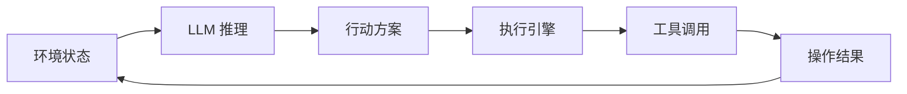
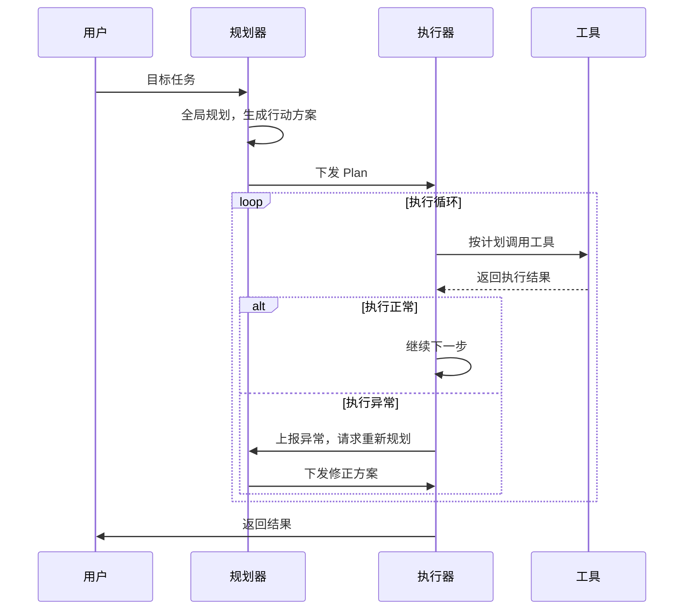
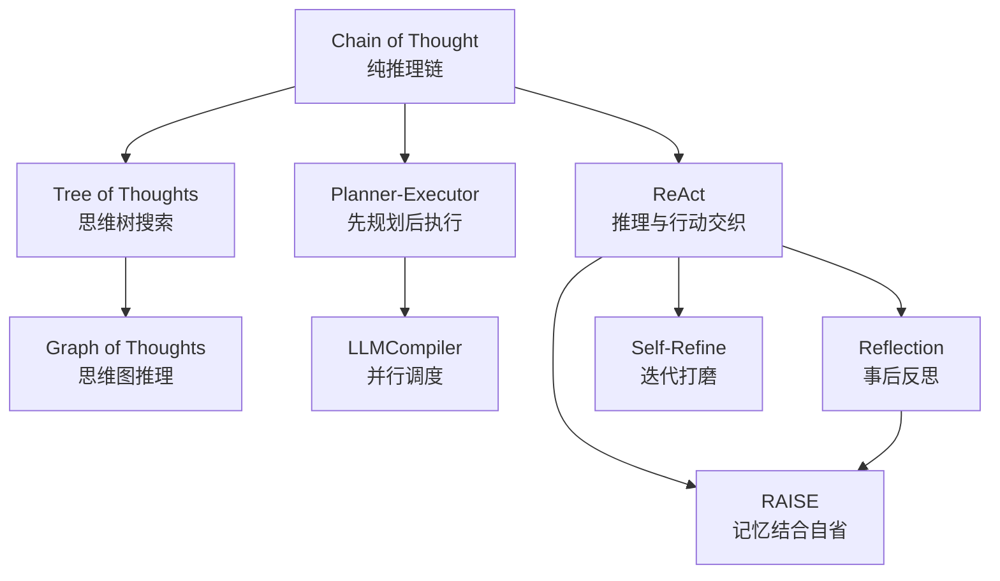

# 从 LLM 到 Agent

语言模型擅长"说"，智能体（Agent）擅长"做"。让一个只会生成文本的系统学会自主行动，这个跨越并不是最近才开始的尝试。早在人工智能研究的初期，研究者们就梦想着建造能感知环境、制定计划、执行行动的自主系统。1970 年代，美国空军上校约翰·博伊德（John Boyd）提出了 OODA 循环（Observe-Orient-Decide-Act），用于描述战斗机飞行员在空战中的决策过程，包括观察敌机位置、理解战场态势、决定机动策略、执行操作，然后根据新状态重新开始循环。这个框架后来被借用到 AI 领域，成为智能体架构设计的重要参考。

半个多世纪后，大语言模型的出现让智能体自主行动的梦想有了新的实现路径。2022 年，姚顺雨（Shunyu Yao）等人在论文《[ReAct: Synergizing Reasoning and Acting in Language Models](https://arxiv.org/abs/2210.03629)》中提出了 ReAct 模式，将语言模型的推理能力与外部工具的行动能力交织在一起，系统化地总结了从 LLM 到 Agent 的技术路线。随后，以 AutoGPT、LangChain 为代表的 Agent 框架在 2023 年集中涌现，标志着 LLM-based Agent 从学术概念走向工程实践。

## LLM 的能力边界

在讨论 Agent 之前，我们需要先诚实地审视语言模型本身不能做什么。理解这些能力边界，才能理解 Agent 架构中每一个组件存在的理由。想象这样一个场景，你向 LLM 输入"帮我检查一下服务器状态"。可能的回复是"使用 `top` 命令查看 CPU 使用率"这样的建议，也可能生成一段模拟的服务器状态文本。但模型不会真的登录服务器、执行命令、读取输出。这就是语言模型的第一个局限，它只是一个被动的文本生成器。输入输出都是 token 序列，而非操作指令。这不是设计缺陷，语言模型的设计目标就该是专注于语言的理解与生成，行动能力应通过 Agent 的外部机制来补全。

除了行动上的约束外，在 [RAG 部分](../vector-retrieval-rag/retrieval-augmented-generation.md)中还提到过语言模型受静态知识时效性的约束。模型的信息截止于训练数据基线定型那一刻，对于训练后发生的事件、私有数据库中的记录、实时变化的传感器读数，模型无从得知。这意味着即便模型有能力生成正确的行动指令，也可能因为信息过时或不完整而做出错误决策。这是 Agent 架构需要加入环境感知与信息检索能力的根本原因。

补全了行动能力、信息检索能力后，语言模型第三个硬性约束来自于它有限的上下文窗口。上下文窗口的大小决定了模型在一次推理中能看到多少信息。以编程任务为例，一个持续数小时的编码会话会迅速积累大量信息，如用户的需求描述、多轮对话的调整指令、多个源文件的内容、终端的命令输出、调试日志、错误堆栈……这些信息中的每一项都可能被后续决策所使用，但窗口的物理容量不可能将它们全部保留下来。此外，上下文窗口的利用效率本身也随长度增加而下降。Lost in the Middle 现象揭示了模型对上下文中间部分的信息检索准确率会显著降低。这意味着即使能够扩大上下文窗口，也并不能从根本上解决问题，反而可能引入新的可靠性风险。由此可见 Agent 系统需要有外部记忆能力，作为上下文窗口的可靠补充。

最后，语言模型优化的目标是文本概率分布上的连贯性，而非基于事实的准确性。模型在生成每个 token 时，选择的是在统计意义上概率最大的下一个词，而不是最正确的那个词，因为"正确"没有办法量化。由此就产生了语言模型的幻觉（Hallucination）现象。在聊天场景中，编造一个不存在的餐馆、虚构一本从未出版的书，最多只是让人啼笑皆非。但在 Agent 场景中幻觉的后果要严重得多。如果让 Agent 去进行证券交易，或者运维云服务器，它可能因幻觉而生成一条不存在的信息而造成一系列错误决策。即使看似微小、无关紧要的幻觉，也可能像滚雪球一样在 Agent 的决策循环中被放大，导致整个任务的偏离。语言模型的原理决定了幻觉是无法被彻底消除的，务实的态度是接受幻觉的可能性，然后通过 Agent 的自省（Self-Reflection）机制去检查推理链路中的逻辑漏洞，并用外部知识源的交叉验证进行独立的事实确认。

## Agent 的设计模式

理解了 LLM 的能力边界之后，我们来看 Agent 如何逐一弥补这些不足。Agent 的架构设计围绕如何将一个被动的文本生成器转变为一个能自主决策的行动系统来展开。

### 感知 - 决策 - 行动循环

如果用一个词概括 Agent 的运行方式，那就是"循环"。Agent 不是一个一次性的问答机器，而是一个不断重复"观察 → 思考 → 行动"的循环决策系统。这个循环的思想来源可以追溯到前面提到的约翰·博伊德（John Boyd）的 OODA 循环，Agent 继承了 OODA 循环的基本框架，但赋予了每个环节新的含义。LLM 在循环中扮演的是思考与决策中枢的角色，它接收环境状态的结构化描述，推理当前处境，生成下一步行动的方案。然后由执行引擎（Executor）将行动方案转化为实际操作，调用 API、读写文件、查询数据库，并收集操作结果作为新的观察，反馈给 LLM 进行下一轮推理。

*图：Agent 循环*

上图清晰地展示了 Agent 循环的闭合结构。每一步行动的结果都会成为下一步推理的输入，形成持续的信息回流。图中的每一个环节都对应着架构中的一个组件，LLM 推理模块负责决策，执行引擎负责将决策翻译为具体操作，工具集则是 Agent 与外部世界的接口。

从更广阔的视角看，OODA 循环与[强化学习](../../language-models/alignment/rlhf.md)中的交互模式在结构上是一致的，区别在于交互的表示方式不同。强化学习使用数值向量（状态向量、动作向量、奖励值）来引导优化方向，而 LLM Agent 使用自然语言文本作为状态描述和动作描述。语言的表达能力远强于数值向量，这意味着 LLM Agent 可以处理远比传统强化学习模型更复杂、更开放的任务。另一方面，用自然语言作为交互媒介，语言描述的歧义性也为决策引入了新的不确定性。

### ReAct 模式

2022 年，普林斯顿大学的姚顺雨（Shunyu Yao）在论文《[ReAct: Synergizing Reasoning and Acting in Language Models](https://arxiv.org/abs/2210.03629)》中提出了 ReAct 模式，首次将推理（Reasoning）和行动（Acting）在语言模型内部统一为一个交替进行的流程。ReAct 通俗理解就是让模型在行动之前先"想一想"，在行动之后根据结果再"想一想"，如此反复。ReAct 的每一次循环包含思考、行动、观察三个环节：
- **思考**（Thought）环节，模型用自然语言分析当前状态并决定下一步做什么。
- **行动**（Action）环节，模型生成一个工具调用指令，由外部系统执行。
- **观察**（Observation）环节，工具的执行结果以文本形式追加到上下文中，成为下一轮思考的输入。

这个 Thought → Action → Observation → Thought 的循环周而复始，直到模型判断任务已经完成。ReAct 模式的流程时序如下图所示。

*图：ReAct 模式*

ReAct 模式提出之前，Agent 已有两种早期的设计模式。纯推理模式（Chain-of-Thought，CoT）让模型一步一步推理，在数学解题、常识问答等任务上效果显著，但由于缺乏使用工具的能力，推理过程完全不接触外部世界。模型一旦在内部知识上有盲区，推理链条就会基于错误的信息一路错下去，而且没有自我纠正的手段。纯行动模式（Act-Only，它从来不是一个被提倡的 Agent 设计模式，一般作为对照基线来使用）则反过来，让模型直接调用工具但不在中间步骤进行显式推理，导致模型在信息不充分时盲目行动。ReAct 将两者结合，推理帮助模型制定更合理的行动计划，行动帮助模型获取推理所需的实时信息。举个例子，当 Agent 被问到 "2023 年诺贝尔物理学奖得主是哪个大学的教授"时，ReAct 的思考过程可能是这样的：

> - Thought: "我不知道 2023 年诺贝尔物理学奖得主是谁，需要查一下"；
> - Action: 调用搜索工具查询"2023 Nobel Prize in Physics"；
> - Observation: 搜索结果返回"Pierre Agostini, Ferenc Krausz, Anne L'Huillier"；
> - Thought: "现在我需要查每个人的所属机构"；
> - Action: 分别查询三人信息……

这种思考与行动交织的模式，让 Agent 能够像人类一样边想边做，边做边想。当然，ReAct 也有自己的不足，每轮 Thought-Action-Observation 循环都会消耗大量的上下文空间，在长任务中早期信息可能被挤出窗口，同时也提高了推理成本。这些局限正是规划器 - 执行器分离模式的产生背景。

### Planner-Executor 模式

ReAct 模式每走一步都停下来想一想下一步该做什么。这种模式在不确定性高、信息逐步获取的任务中表现良好，但在步骤明确、依赖关系清晰的任务中，每次行动后重新推理全局策略就显得十分低效了。**规划器 - 执行器**（Planner-Executor）分离模式是另一种设计 Agent 的选择，通俗来说就是先全部想清楚再动手。规划器（Planner）在行动开始前对整个任务进行全局规划，生成一份结构化的行动方案（Plan），其中包含子任务的分解、执行顺序和依赖关系。执行器（Executor）拿到这份方案后，按部就班地执行每一步，只有在遇到异常时才上报给规划器请求重新规划。Planner-Executor 模式的流程时序如下图所示。

*图：Planner-Executor 模式*

ReAct 和 Planner-Executor 两种模式代表了不同的决策时机。ReAct 将决策分布在每一步，追求灵活性和实时调整；Planner-Executor 将决策集中在初始阶段，追求全局最优和减少重复推理。它们不是互斥的，实践中更常见的做法是混合策略，先用规划器生成整体方案作为路线图，执行器在执行中遇到意外时触发局部重新规划，而不是推翻整个方案。

Planner 与 Executor 分离设计的好处是规划与执行能够被独立优化。规划器可以使用更强大的模型来做全局推理，而执行器可以使用更轻量的模型来降低单步成本。规划的粒度也可以根据任务复杂度调整，简单任务只需粗粒度的步骤列表，复杂任务可能需要带条件和循环的结构化方案。此外，分离后执行过程可以被外部监控和中断，这对于需要人类监督的关键任务尤为重要。

Planner 与 Executor 分离的也带来了额外的成本。规划器与执行器之间需要明确的通信协议，譬如方案用什么格式、异常如何定义、重新规划的触发条件，等等。些问题在多轮交互中会逐渐累积复杂度。更根本的问题是，规划器在制定方案时掌握的信息往往是不完整的，它不知道某个工具调用会返回什么结果，也不知道执行中会遇到什么意外。这意味着初始方案有大概率需要修正，而修正本身可能需要与从头推理相近的成本。

### Agent 设计模式全景

ReAct 和 Planner-Executor 是 Agent 设计模式谱系中的两极，一个将决策分布在每一步，一个将决策集中在初始阶段进行。围绕这两条主线，学术界和工业界在过去几年中演化出了一系列变体模式。理解这些模式之间的演化关系，比记住每一种模式的定义更为重要。

*图：Agent 设计模式全景*

所有基于 LLM 的 Agent 都依赖模型提供的推理能力，今天出现的各种 Agent 设计模式，可以说都是源于改进 CoT 的纯推理链的不足而诞生的。CoT 仅沿着一条线性的思考路径逐步推进，不分支、不回看、不与外部世界交互。上图的三条分支恰好对应了 CoT 这三个缺陷的不同改进方向，它们各自从不同角度扩展了纯推理链的能力边界。

- 左侧的分支（CoT → Tree of Thoughts → Graph of Thoughts）中，[Tree of Thoughts](../../language-models/reasoning/test-time-compute.md#树搜索)（ToT）打破了 CoT 线性思考路径的约束，在推理的关键节点同时展开多个候选思路，像树一样分叉出去，再通过评估机制剪掉低评分分支、深入高评分分支。Graph of Thoughts（GoT）在 ToT 的基础上进一步松弛了树结构的约束，允许任意两个思维节点之间建立连接，支持合并多个推理分支的中间成果，甚至让某个分支的结论反哺到另一个分支的推理中。这条分支的贡献是把推理从一条线变成一张网，让模型具备了探索、比较和回溯的能力，而不必在第一个念头出现时就锁定方向。

- 中间的分支（CoT → Planner-Executor → LLMCompiler）解决了 CoT 没有回顾和修正机制的问题。Planner-Executor 通过引入高层次规划来构建一个可对照的目标框架，执行器在推进时可以不断将实际结果与规划预期做比对，偏差即触发修正。LLMCompiler 将这一思想延伸到并行执行场景，借助依赖分析把规划拆成可并行调度的子任务集，让不同步骤同时推进，缩短端到端延迟。这条分支的贡献是为推理引入了一个高于推理本身的审视层级，让决策过程不再是一次性的单向推导，而是可以被检验、调整和并行的结构化流程。

- 右侧的分支（CoT → ReAct → Reflection → Self-Refine → RAISE）解决的是纯推理不与外部世界交互的问题。ReAct 将工具调用嵌入推理循环，让模型在思考的间隙获取外部信息作为推理的燃料。在这个分支的后续演化中，Reflection 和 Self-Refine 在 ReAct 的循环之上叠加了一层自省机制，让 Agent 不仅能获取外部反馈，还能对自身产出进行事后评估和迭代打磨。RAISE 则进一步将自省与外部记忆结合，使 Agent 从单轮修正走向跨轮次的持续改进。这条分支的贡献是让推理不再闭门造车，而是通过与环境和自身的反复对话来保持信息的新鲜和推理的准确。

这三条分支并非彼此独立，它们在各自解决的问题上存在互补关系。实际的 Agent 系统中，多种设计模式常常是交织在一起运作的，譬如用 Tree of Thoughts 的搜索机制和 Planner-Executor 的重新规划依赖外部信息的反馈来决定方向，ReAct 分支的交互中的自省也可能触发对之前推理路径的重新评估。

## 从对话到自主行动

讨论 Agent 的自主性时，一个常见的误区是把自主性当作一个二元离散值，要么完全手动，要么完全自主。实际上，**自主性**（Autonomy）是一个从低到高变化的连续值，不同等级适用于不同的任务场景和风险要求。华盛顿大学 2025 年发表的论文 《[Levels of Autonomy for AI Agents](https://arxiv.org/abs/2506.12469)》给出了 Agent 自主性等级划分：

- **零自主性**（L1）：在这个等级中 Agent 只是被动的工具调用器。人类发出每一步的具体指令，Agent 执行并返回结果，不做任何自主决策。在这个等级中，Agent 不主导决策流程，用户始终保持对工作流的完全控制。
- **建议自主性**（L2）：Agent 与用户协作规划和执行任务，双方可以相互委派工作，用户可以随时接管 Agent 的工作或直接修改 Agent 的输出。这个等级适合高风险操作（如数据库写操作、生产环境变更），人类保留最终审批权，Agent 的角色是智能助理而非独立决策者。
- **监督自主性**（L3）：Agent 主导任务规划和执行，在需要专业知识、偏好判断或方向性指导时主动咨询用户，用户通过反馈和评论间接影响 Agent 的工作，而非直接接管控制。不确定情况的定义是关键，像"工具返回了意料之外的错误"是需要确认的情况，"任务完成了第 3 步，准备执行第 4 步"则不属于。这个等级要求 Agent 有能力判断哪些情况超出了自己的处理能力。
- **条件自主性**（L4）：Agent 在预设边界内完全自主，只在超出边界时暂停。论文描述的 L4 控制机制包括用户可预先指定哪些类型的操作需要批准、Agent 遇到凭据缺失或高风险操作时请求批准、用户可拒绝 Agent 的提议并让 Agent 提供替代方案。
- **完全自主性**（L5）：人类只设定目标，Agent 自主完成所有操作。这个等级目前仅适用于低风险、高容错率的场景，譬如在隔离的沙箱环境中生成代码、在测试环境中运行自动化测试。L5 Agent 不提供用户介入的机制（仅保留紧急停止开关），用户仅能通过活动日志进行监控和审计。

选择哪个自主性等级，主要考量是容错率和错误后果的严重性。写代码的 Agent 可以采用较高的自主性等级，因为代码错误可以通过编译器和测试捕获；但管理数据库的 Agent 必须维持在较低的自主性等级，因为一次误删除可能无法恢复。这种不对称性意味着在实际系统中，同一个 Agent 在不同操作类型上可能运行在不同的自主性等级上。对读操作给予高自主性，对写操作维持在低自主性。

## Agent 的设计原则

前面几节讲解了 Agent 的架构和运行机制，但架构设计之外，还有一些贯穿始终的工程原则。这些原则并非某个 Agent 框架的专利，而是在大量工程实践中反复验证后被提炼出来的通用准则。

### 单一职责与组合

在软件工程中，**单一职责原则**（Single Responsibility Principle）要求一个模块只负责一项功能。这个原则在 Agent 设计中同样适用，甚至更加重要。一个试图包揽所有任务的"万能 Agent"必然面临复杂的决策空间、难以调试的行为和不可预测的失败模式。相比之下，将系统拆分为多个职责明确的 Agent，每个只专注一类任务，然后通过组合来应对复杂场景，是更可行的路径。组合多个 Agent 的方式有三种基本形态：

- 串联是最简单的组合方式，Agent A 的输出直接作为 Agent B 的输入，形成处理流水线。这种方式适用于任务有明确的顺序依赖关系的情况，譬如"分析需求 → 生成代码 → 代码审查"。
- 并行组合让多个 Agent 同时处理不同的子任务，汇总结果后做最终决策，适合子任务之间没有依赖的场景，譬如同时搜索多个数据源后合并结果。
- 层级组合引入管理型 Agent（Manager Agent），负责将高层目标分解为子任务并分配给执行型 Agent（Worker Agent），汇总执行结果并做最终决策。层级结构在大型系统中最为常见，因为它能自然地对任务复杂度进行分层管理。

### 最小权限原则

**最小权限原则**（Principle of Least Privilege）源自操作系统安全设计，原意是一个进程只应获得完成其任务所需的最小权限集合。这个原则直接适用于 Agent 的工具调用控制。Agent 能做的事情越多，出错时可能造成的损害就越大。如果用户在聊天框里误操作输入了"帮我删除所有的临时文件"，一个没有权限控制的 Agent 可能真的会执行这个破坏性操作。因此，应只向 Agent 暴露必要的工具集合，敏感操作（文件删除、网络请求、系统配置修改）需要额外的确认步骤。

权限与自主性之间存在此消彼长的矛盾关系。赋予 Agent 越高的自主性（更少的人工干预），就越需要收紧其权限范围（更窄的操作边界）。反之，如果 Agent 在严格的权限限制下运行，可以适当提高其自主性，因为在限定的安全边界内犯错不会造成严重后果。这种权限与自主性的平衡是设计生产级 Agent 系统的重要考量之一。

### 可观测性与可中断性

**可观测性**（Observability）要求 Agent 的每一步行动都有有迹可循，包括决策理由、工具调用参数和返回结果。这不仅是调试需求，也是安全需求。Agent 行为异常时，开发者需要追溯是哪一步决策出了问题，是什么信息导致了错误的选择。没有充分的日志，Agent 就是一个不可解释的黑箱。实践中的可观测性记录通常包含多个方面信息，如决策日志记录每一步的 Thought 内容和选择的 Action、执行日志记录工具调用的具体入参和出参、状态日志记录 Agent 内部的关键状态变化（如上下文使用率、剩余步骤数、修正次数）等。这些日志不仅是事后排查的手段，也可以实时暴露给人类监督者，作为可中断性的判断依据。

**可中断性**（Interruptibility）是安全底线。用户应能在任意时刻暂停或终止 Agent 的执行，不管 Agent 当前处于什么状态。实现可中断性在技术上并不简单，Agent 在执行工具调用时可能处于不可抢占的状态，需要在架构层面设计中断信号的传递路径，确保中断请求能够被及时响应。良好的可中断性设计还要求 Agent 在被终止后能够优雅地保存当前状态，以便后续恢复执行而非从头开始。

### 优雅降级

**优雅降级**（Graceful Degradation）的设计理念是系统在部分功能失效时，应能以降级后的模式继续运行，而非完全崩溃。这个理念在分布式系统设计中得到了充分发展，在 Agent 场景中也同样重要，因为 Agent 面对的外部环境是不确定的。API 可能返回限流错误，文件系统可能空间不足，LLM 服务本身可能暂时不可用。

降级策略的设计需要为每个可能的故障点准备备选方案。工具不可用时，Agent 可以尝试功能等价的替代工具。如果所有替代方案都不可用，Agent 应该向用户明确报告当前可用能力的边界，而非静默地产生不完整的结果。当上下文窗口接近上限时，Agent 可以主动压缩历史记录（将详细日志替换为摘要）或将部分信息转存到外部记忆。当任务范围过大时，Agent 可以将任务拆分为多轮执行，每轮完成一部分，批次间通过外部存储传递状态。降级后的行为本身需要被明确地告知用户。一个静默降级的 Agent，譬如在没有告知用户的情况下用简单搜索替代了数据库查询，可能产生难以发现的错误结果。Agent 应该在降级时向用户报告当前遇到了什么问题，采用了什么替代方案，替代方案对结果可能造成什么影响。

## 本章小结

从 LLM 到 Agent 的跨越，本质上是为语言模型补全了它天生缺失的四种能力：感知能力（通过环境状态的持续观察）、行动能力（通过工具调用）、记忆能力（通过外部记忆系统）和自省能力（通过循环检查）。理解了这个框架，再去看市面上各种 Agent 产品，就能穿透表面的功能差异看到它们共同的架构基础。

## 练习题

1. ReAct 模式与纯推理模式（Chain-of-Thought）的核心区别是什么？在什么类型的任务中 ReAct 的"行动"能力会带来显著优势？

   

   
参考答案

   核心区别在于 ReAct 允许模型在推理过程中调用外部工具与真实世界交互，而 CoT 完全在模型内部进行推理。当任务需要访问模型训练数据之外的信息（如查询实时数据、调用 API、读写文件）时，ReAct 的行动能力带来决定性优势。譬如，"查询今天的天气并据此建议穿什么衣服"这类任务，CoT 只能基于其内部知识进行推理，但无法获取实时或外部信息，而 ReAct 可以真正查询天气 API。

   
