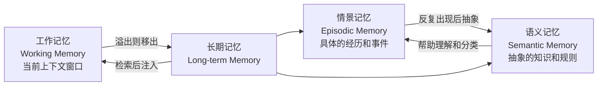
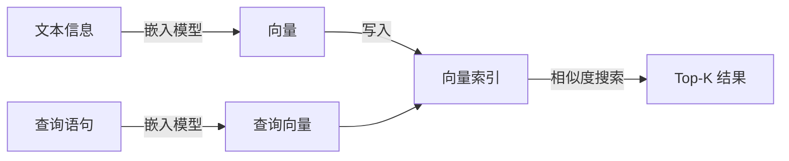
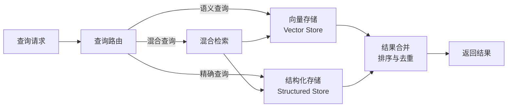

# 记忆系统

LLM 的上下文窗口是有限的，而 Agent 执行的任务可能持续数小时乃至更长，产生的信息量远超窗口容量。一个客服 Agent 与用户对话了 200 轮，讨论了退货流程、订单查询、优惠券使用等多个话题，而上下文窗口只能容纳最近 10 轮对话。当用户突然问"我之前说的那个优惠券还能用吗"，Agent 需要有办法从过去的对话中找回这条信息，哪怕它已经在上下文窗口之外。Agent 如何在上下文窗口之外有效地存储、检索和利用信息，这就是**记忆系统**（Memory System）要解决的问题。

记忆系统这个概念并非 LLM Agent 独创。早在 1968 年，图灵奖得主艾伦·纽厄尔（Allen Newell）和赫伯特·西蒙（Herbert Simon）就在他们的信息加工理论中探讨了人类记忆的分层结构，短期记忆容量有限、需要主动复述才能维持，长期记忆容量巨大、需要通过线索来检索。1972 年，加拿大心理学家恩德尔·塔尔文（Endel Tulving）进一步区分了情景记忆（Episodic Memory）和语义记忆（Semantic Memory），这一分类至今仍是认知科学的基础框架。五十多年后，大语言模型驱动的 Agent 遇到了与人类认知科学相似的问题，解决方案也沿着与生物记忆类似的路径在演进。

## 记忆的分类

在深入具体的存储和检索技术之前，我们先厘清 Agent 的记忆有哪些类型。不同类型的记忆在容量、时效、存取方式上差异巨大，把这些差异理解清楚，才能为每种记忆选择合适的技术方案。

### 工作记忆

想象你在餐厅帮一桌人点菜，脑中同时记住每个人要的菜式、谁忌辣谁不吃海鲜、已经点了冷热各几道，但这些信息只在点菜过程中需要，下完单就可以忘掉。**工作记忆**（Working Memory）就是这种当前正在被使用的信息。对 Agent 而言，工作记忆就对应着 LLM 的上下文窗口。窗口内的每一条消息，系统提示、用户输入、工具调用结果、历史对话，都是工作记忆的一部分。它的最大容量由上下文窗口的大小决定。工作记忆存取速度快，但一旦对话结束或窗口溢出，这部分信息就丢失了。

工作记忆管理的难点在于上下文窗口有限，而对话不断产生新信息，总有一些旧信息需要被移出窗口。最简单的策略是 FIFO（先进先出），像排队一样让最早进入窗口的信息先退出，但这显然不够聪明，因为用户的名字远比"今天天气不错"这类寒暄更值得保留。所以更实用的做法是给每条信息赋予优先级，当窗口容量不足时优先淘汰低优先级内容。优先级可以参考信息的重要性（是否与任务直接相关）、访问频率（最近是否被用到过）、时效性（是否已经过时）等维度综合判定。对于那些重要但不得不移出窗口的信息，常见的处理方式是将其摘要压缩后重新注入窗口，譬如把 20 轮的对话历史压缩成一段简短的摘要，在摘要中保留关键决策和结论而丢弃具体的措辞细节，从而用很少的 token 量维持对任务进展的整体感知。

### 长期记忆

工作记忆只在当前会话中有效，切换到另一个任务或重新启动 Agent 后，之前的工作记忆就消失了。**长期记忆**（Long-term Memory）是为了解决信息持久化的问题，将重要的信息从易失的上下文窗口转移到持久化的存储中，以便在未来需要时重新加载回工作记忆。

长期记忆的存储形式有很多种选择。对话历史可以按时间顺序保存在文档中，用户偏好（如"偏好深色主题"、"时区设置为东八区"）适合用键值对存储，事实性知识（如"某 API 的速率限制是每分钟 60 次"）可以存在关系数据库中，而语义模糊的内容（如"处理超时的最佳实践"）则更适合用向量嵌入进行[语义检索](../vector-retrieval-rag/embedding-and-indexing.md#向量索引)。选择哪种存储形式取决于信息的结构化和查询方式，需要精确匹配的用结构化存储，需要语义匹配的用向量存储，两者兼需的用混合存储。

长期记忆的写入时机是一个需要精心选择的决策项。写入太频繁会增加存储压力和写入成本，写入间隔过长则可能丢失重要信息。常见的写入触发时机包括任务完成后总结经验和关键决策、对话中识别到值得记住的事实、工具调用返回了有价值的中间结果、用户主动要求记住某些信息。在这些时机中，任务完成后的总结是最常见也最可靠的方式，任务结束时的 Agent 拥有完整的上下文，此时提取的经验质量高、噪音少。

从程序员的角度理解，工作记忆像内存，速度快、容量小、断电即丢；长期记忆像硬盘，容量大、持久化、但需要显式的读操作才能将数据加载到内存中使用。两者的协同正是记忆系统设计的挑战。

### 情景记忆与语义记忆

"昨天下午我部署代码时遇到了端口冲突，原因是 Docker 容器占用了 3000 端口"，这是一条**情景记忆**（Episodic Memory），记录了具体的时间、地点、事件和结果。"Node.js 应用默认监听 3000 端口"，这是一条**语义记忆**（Semantic Memory），是一般性的知识，与具体的某次经历无关。

图尔文在 1972 年提出的情景记忆和语义记忆的定义，在 Agent 记忆系统中依然成立。情景记忆回答经历过什么，某次工具调用成功还是失败、某个用户曾提出过什么特殊要求、上个月系统在流量高峰期出现过的具体故障模式。这些记忆是时间绑定的（发生在某个时刻）、上下文绑定的（在特定条件下发生），它们的价值在于提供了丰富的上下文细节，当类似情境再次出现时可以从中找到参考。语义记忆回答知道了什么，如某个 API 的调用格式、Python 列表推导式的语法、Redis 适合做缓存而 Kafka 适合做消息队列。这些记忆不绑定到具体的时间和地点。它们的特点是稳定、可复用，不会因为时间推移而失效。

两种记忆之间存在自然的转化路径。当 Agent 多次经历端口冲突导致部署失败这一情景后，它可以从中抽象出一条语义记忆：部署前应检查目标端口是否被占用。这种从具体经验到抽象规则的提炼正是反思（Reflection）机制的价值所在。反过来，语义记忆也可以帮助理解和分类新的情景记忆，有了"端口冲突"这个语义概念，Agent 才能在遇到相似问题时迅速意识到这和上次是同一类问题。下图展示了不同类型记忆在 Agent 记忆分成模型中的转换：

*图：Agent 记忆的分层模型*

## 记忆的存储

不同的信息类型需要不同的存储方案，而检索效率取决于存储结构的设计。这一节讨论三种主流的长期记忆存储方式：向量存储、结构化存储，以及将两者结合的混合架构。

### 向量存储与语义检索

**向量存储**（Vector Store）是目前 Agent 记忆系统中最常见的存储方式。它将文本信息通过嵌入模型（Embedding Model）编码为高维空间中的向量，存入向量索引。检索时，将查询语句同样编码为向量，通过向量之间的相似度找出语义上最接近的记忆条目。

*图：向量存储的写入与检索流程*

向量存储的优势在于语义检索能力。假设 Agent 的长期记忆中存有一条经验：在处理用户订单查询时，应先核实身份再查看订单状态。当用户问"怎么确保查询订单的人是账号本人"时，向量检索能够匹配到这条经验，虽然"核实身份"和"确保是本人"在字面上不同，但它们在语义空间中很接近。传统的关键词搜索做不到这一点，因为两者没有共同的词汇。

不过向量存储也有明显的局限。嵌入质量直接依赖模型能力，如果嵌入模型对某个领域不熟悉（譬如针对医疗术语的嵌入效果差），检索质量就会下降。更重要的是，向量相似度不等于实际相关性，"猫很可爱"和"狗很忠诚"在语义空间中的距离可能很近（都是关于宠物的正面评价），但在"推荐适合过敏体质的宠物"这个上下文中，只有后者与低过敏性犬种的信息相关。这就是语义检索中常见的"邻居但无关"问题（语义相近但实际不相关）。

### 结构化存储与精确查询

向量存储擅长模糊匹配，但并非所有记忆检索都需要模糊匹配。当用户问"我上次登录是什么时候"时，我们需要的是精确的时间戳，不是'大概上周'这类语义近似。这就是**结构化存储**（Structured Storage）的用武之地。结构化存储包括关系数据库（如 PostgreSQL）、键值存储（如 Redis）、文档数据库（如 MongoDB），适合存储有明确 Schema 的信息。每一条记忆记录都有固定的字段（时间、类型、内容、来源、置信度等），查询时通过精确的 SQL 条件或键值匹配来定位目标，而不是通过语义近似。这类存储的优势在于查询结果确定、支持事务和一致性保证、能够高效地进行聚合查询。

用户偏好（键值对，如 `user:theme:dark`）、任务执行记录（时间序列表，包含任务 ID、开始时间、结束时间、结果状态）、事实性知识（带类型的实体-关系-实体三元组）、工具调用日志（带时间戳的结构化记录，便于审计和调试），这些信息都适合结构化存储，它们的共性是查询需求是可预期的，存储格式是固定的，不需要语义模糊匹配。

### 混合存储架构

在实际的 Agent 系统中，向量存储和结构化存储通常是协同工作的，各自扮演最擅长的角色。**混合存储架构**（Hybrid Storage Architecture）用统一的查询接口屏蔽底层存储差异，由查询路由层根据查询特征自动选择（或组合）合适的存储后端。

*图：混合存储架构的查询流程*

混合检索的典型策略是先语义后精确，先用向量检索从大量记忆中筛出语义相关的候选集，譬如从 100 万条记忆中筛出最相关的 50 条，再用结构化条件对候选集进行精确过滤，譬如只保留"创建时间在最近一周内"或"来源可信度高于 0.8"的记录。这样既利用了向量检索的语义理解能力来缩小搜索范围，又借助结构化条件保证了结果的精确性和可控性。

不过混合架构也带来了数据一致性问题。同一条信息可能同时存在于向量存储和结构化存储中，譬如一条用户偏好既作为键值对存在 Redis 中，又作为向量存在向量索引中。当信息更新时，两处的数据需要同步。解决这一问题通常有两种方案，一种是强一致性方案，将两者封装在同一个事务中更新，代价是增加了写入延迟；另一种是最终一致性方案，接受短暂的窗口不一致，通过后台任务定期将结构化存储中的变更同步到向量索引。在大多数 Agent 场景中，最终一致性是更实际的选择，因为记忆的写入频率不高、几秒的延迟一致性通常不会产生严重后果。

## 记忆的检索

把记忆存进长期存储只是第一步，真正左右 Agent 表现的是能否在正确的时刻检索出正确的那条记忆。记忆检索有一对矛盾。检索本身是昂贵的动作，每次都要调用嵌入模型、访问向量索引，增加延迟和计算开销。但不做检索的 Agent 又可能遗漏执行任务所必需的信息。破解这一矛盾的关键，是把无差别的频繁检索替换为在恰当的时机进行精准检索。

检索的触发方式分为被动和主动两类。被动检索由预定义规则驱动，任务启动时自动加载与当前任务类型相关的背景知识，检测到特定关键词时检索对应的历史经验，对话轮数累积到阈值时触发一次记忆扫描以防止上下文漂移。被动检索的好处是可靠、可预期，且不需要消耗推理 token 来判断该不该检索。主动检索则由 Agent 自主决定何时查记忆。Agent 在执行过程中遇到困难、面临关键决策，或者发现当前信息不足以回答用户问题时，可以自行发起一次记忆检索。这种方式更灵活，但对 Agent 的判断力提出了要求，如果 Agent 不擅长判断时机，要么频繁过度检索浪费资源，要么忘记检索拖累决策质量。实际系统中，主动检索和被动检索通常是搭配在一起的。被动检索提供默认的、可靠的检索覆盖，保证关键节点不会遗漏；主动检索作为补充，在 Agent 察觉信息不够时执行更深层的搜索。两者叠加，既避免了检索过多，也防止了检索不足。

检索出一批候选记忆之后，还需要经过多维排序和过滤，才能敲定最终注入上下文的内容。语义相关性是最基础的维度，反映记忆内容与当前查询的匹配程度，直接由向量相似度得分给出。但只靠语义相似度是不够的，一条语义完美匹配但来源不明的经验，可能比一条语义基本匹配但出自可信插件的文档更危险。排序时还需要一并考虑时效性和来源可靠性。

过滤策略决定了哪些记忆进入上下文、哪些被舍弃。最简单的硬过滤是设定相似度阈值，低于阈值的直接丢弃。更精细的做法是软过滤，对于相关性偏低但可能仍有参考价值的记忆，不直接丢弃，而是压缩成简短摘要保留在候选集中。上下文感知过滤则更进一步，它根据当前对话的主题与推进程度动态调节过滤标准。譬如 Agent 正在深入讨论某个具体技术细节时，过滤标准收紧，只保留高度相关的技术记忆。当处于探索阶段、需要广泛了解各种可能时，过滤标准放宽，允许更多领域的信息进来。

## 记忆的更新与遗忘

记忆系统不是只进不出的仓库。信息会过时，新事实可能与旧记录冲突，无限积累的记忆会拖慢检索并引入噪音。这一节讨论记忆系统中的时效性管理、冲突检测与解决，以及遗忘机制。

### 记忆的时效性

"Node.js 18 将于 2025 年 4 月结束生命周期"，这条记忆在 2024 年是有价值的，到了 2025 年 5 月就变成了一条过时信息。信息有保质期，而且技术文档、API 规范、市场数据这类动态知识的保质期尤其的短。

时效性管理的基础做法是给每条记忆记录加上时间戳，创建时间（何时存入）和最后验证时间（何时最后一次确认该信息仍然有效）。在检索排序时，将时间戳作为排序权重的一个因子，近期创建或验证的信息获得更高的权重，长期未验证的信息权重随时间逐步衰减。信息的衰减曲线可以借鉴艾宾浩斯遗忘曲线（Ebbinghaus Forgetting Curve），人类的记忆遗忘速度先快后慢，Agent 的记忆也可以模拟类似的衰减模式，但衰减速度可以根据信息类型进行调整，譬如用户偏好应该衰减得更慢（用户的习惯不易改变），而技术文档应衰减得更快（版本更新频繁）。

定期验证是时效性管理的另一个重要环节。对于长期未验证但重要性高的记忆，Agent 可以在合适的时机主动验证其有效性，譬如在调用某个 API 之前，先检查记忆中记录的 API 参数是否仍然准确，如果记忆的存放时间较久，可以优先查看最新的文档而非直接依赖记忆。

### 冲突检测与解决

"用户偏好浅色主题"，这条记忆中保存了一个事实。但用户在最近一次对话中说"我现在喜欢深色主题了"。新的用户陈述与旧的记忆记录发生了冲突。如果 Agent 继续按照旧记忆行事，用户体验会变差。但如果每次都无条件相信最新的陈述，偶尔的口误或上下文相关的临时偏好又会覆盖掉长期有效的记录。

冲突检测的工作是在写入新信息时，检索相关的已有记忆并进行比较。这个比较可以交给 LLM 来判断，将新旧两条信息放入 Prompt，让模型判断它们是否矛盾。不过这样做的成本较高，一个更轻量的方式是为每条记忆提取实体和关系，通过结构化匹配检测潜在的冲突，譬如同一用户对同一属性记录了不同的值。

冲突一旦被检测到，就需要做出裁决。最简单的策略是时间优先，新信息直接覆盖旧信息，假设最新的总是最准确的。这个假设在大多数场景下成立，但也有明显的局限，用户偶尔提到的临时偏好不应覆盖长期记录的习惯。更稳健的做法是来源优先，根据信息来源的可靠性决定权重。用户明确声明的信息可信度高于 Agent 推断的信息；经过多次验证的信息可信度高于只出现一次的信息；来自可信工具（如官方文档 API）的信息可信度高于来自非正式渠道的信息。当冲突双方的可信度都很高时，合并是一种更谨慎的策略，保留两条记录，标记为冲突状态，在后续任务中根据上下文选择更合适的一条，或者主动向用户求证。

### 遗忘机制

如果记忆系统只增不减，每条记忆都永久保留，检索索引会越来越庞大，检索延迟越来越高，而过时的、矛盾的、冗余的记忆会干扰检索结果的质量。遗忘（Forgetting）不是缺陷，是维持记忆系统健康的必要功能。

基于时间的遗忘是最直接的方式：设定一个时间阈值或衰减曲线，长期未被访问的记忆权重逐渐降低，降到一定程度后进入遗忘候选池并可以被回收。基于重要性的遗忘更进一步，不是所有记忆都有同等的保留价值。Agent 可以根据记忆的使用频率（被检索和使用的次数）和关联度（与其他重要记忆的关联数量）来判断一条记忆的重要性，低重要性的记忆在空间紧张时优先淘汰。基于冗余的遗忘则针对重复信息，当多条记忆高度重复时（譬如三次不同任务都记录了端口冲突这个相同的教训），只保留一条最具代表性的记录，其余的予以删除。

遗忘可以分为软遗忘和硬遗忘两种模式。软遗忘只是降低记忆的权重或将其移出活跃索引，但数据本身并未删除，如果将来发现需要，可以通过深度检索恢复。硬遗忘则是彻底删除数据，不可恢复。大多数 Agent 系统倾向于使用软遗忘，因为现在看起来不重要不一定等于将来永远不需要。在存储成本不是瓶颈的场景下，软遗忘提供了安全网，让遗忘决策可以更大胆一些。

## 本章小结

记忆系统的本质是在有限的上下文窗口之外为 Agent 构建一个可持久化、可检索的外部信息层。本章受认知科学中多层记忆模型的启发，梳理了工作记忆、长期记忆、情景记忆与语义记忆的分工与协同关系，进而讨论了向量存储与结构化存储各自的适用场景以及混合架构的设计权衡。检索部分强调了触发时机、多维排序和上下文感知过滤对检索质量的决定性影响，而时效性管理、冲突解决与遗忘机制则共同构成记忆系统持续健康运转所必需的维护闭环。从存储到检索再到更新，每一步都在回答如何在正确的时刻将正确的信息送入 Agent 的上下文，让它在信息完备的条件下做出更好的决策。

## 练习题

1. 工作记忆和长期记忆的区别是什么？从容量、存取速度、持久性三个角度进行比较，并结合 Agent 的具体技术实现来说明。
   

   
参考答案

   
   工作记忆对应 LLM 的上下文窗口，容量受限于模型的 context window 大小（如 128K tokens），存取速度极快（每次模型生成都在"看"窗口内容），但会话结束或窗口溢出后信息丢失。长期记忆存储在外部系统（向量数据库、关系数据库等），容量几乎不受限，但存取需要显式的检索操作、有额外延迟，信息持久化存储。从程序员视角理解，工作记忆类比 RAM，长期记忆类比硬盘。
   
   

2. 向量存储支持语义检索，但"语义相似"不等于"实际相关"。请举出一个具体的 Agent 场景，说明向量检索返回了语义相似但无关的结果，并给出一种缓解这一问题的策略。
   

   
参考答案

   
   场景示例：Agent 的记忆中存储了"Python 使用 GIL 限制了多线程的并行性能"和"IronPython 运行时没有 GIL"，如果查询"Python 多线程性能问题怎么解决"，两条结果语义高度相似，但 IronPython 的方案在大多数场景下不实用。
   
   缓解策略：可以在每条记忆中存储元数据标签（如适用场景、技术栈约束），检索后用结构化条件过滤（如"只保留适用于 CPython 的方案"）。也可以在排序阶段引入"实用性评分"维度，让 LLM 判断结果在当前场景下的实际相关性。
   
   

3. 记忆系统为什么需要"遗忘"机制？如果从不遗忘，会产生哪些具体问题？请给出至少两个不同层面的问题并解释。
   

   
参考答案

   
   如果从不遗忘，至少会产生两个层面的问题。检索效率层面：随着记忆数量无限增长，即使向量索引支持 O(log n) 的对数级搜索，log n 的值也会随 n 增长而持续变大，检索延迟越来越长；检索质量层面：过时的信息（如已弃用的 API 参数）与当前有效的信息同时存在于索引中，语义检索可能把过时信息排在前面，引导 Agent 做出错误决策。遗忘机制通过淘汰过时、低价值、冗余的记忆来维持检索效率和质量。
   
   
