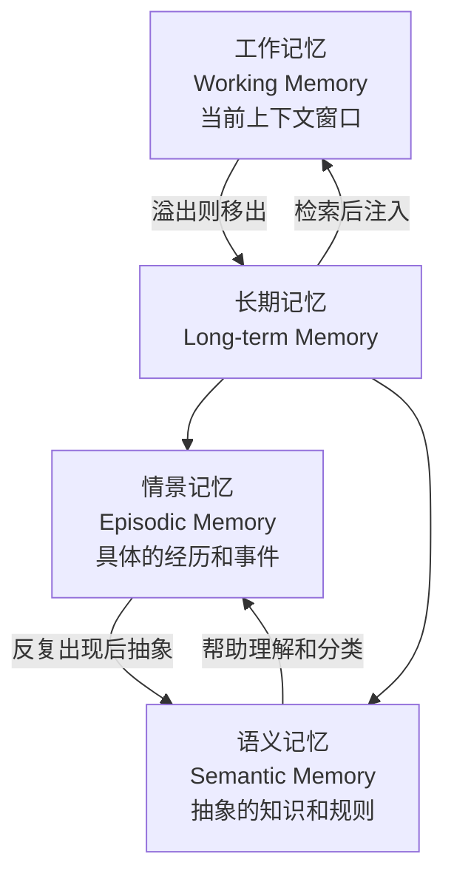
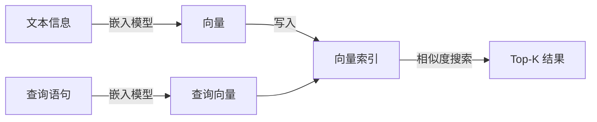
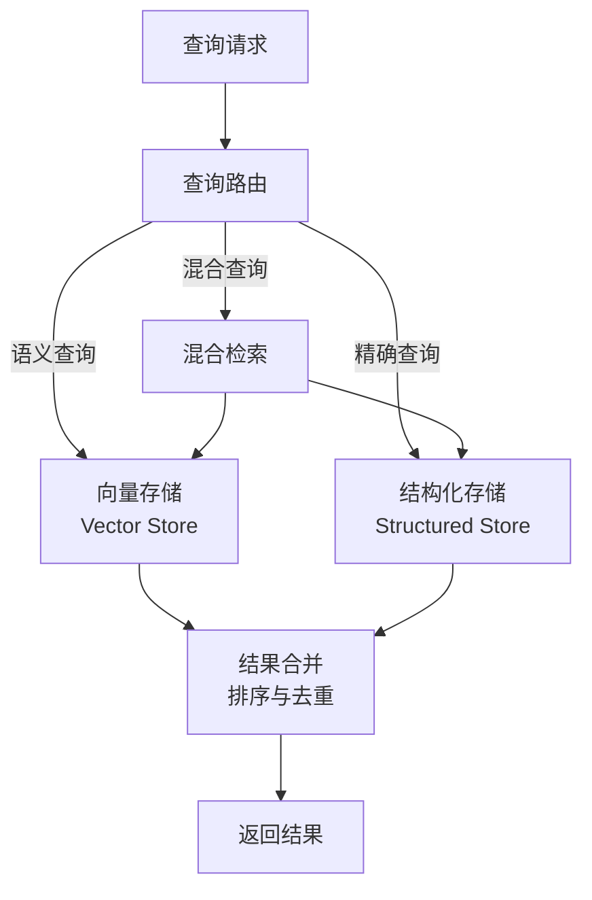
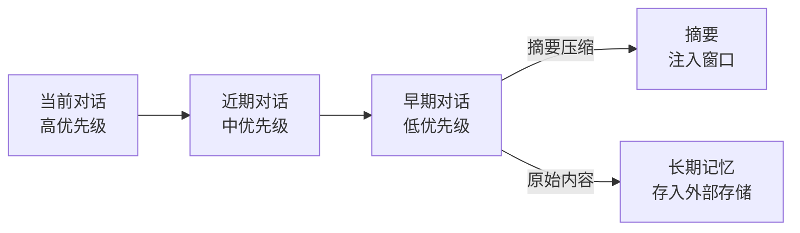

# 记忆系统

LLM 的上下文窗口是有限的，而 Agent 执行的任务可能持续数分钟甚至数小时，产生的信息量远超窗口容量。举个具体的例子，一个客服 Agent 与用户对话了 200 轮，讨论了退货流程、订单查询、优惠券使用等多个话题，而上下文窗口只能容纳最近 30 轮对话。当用户突然问"我之前说的那个优惠券还能用吗"，Agent 需要从过去的对话中找回这条信息，但它在窗口之外。

这就是记忆系统（Memory System）要应对的问题，Agent 如何在上下文窗口之外有效地存储、检索和利用信息。

记忆系统这个概念并非 AI 独创。早在 1970 年代，图灵奖得主艾伦·纽厄尔（Allen Newell）和赫伯特·西蒙（Herbert Simon）就在他们的认知架构理论中提出了人类记忆的多层模型，短期记忆容量有限、需要主动复述才能维持，长期记忆容量巨大、需要通过"线索"检索。1972 年，爱沙尼亚裔加拿大心理学家恩德尔·塔尔文（Endel Tulving）进一步区分了情景记忆（episodic memory）和语义记忆（semantic memory），这一分类至今仍是认知科学的基础框架。四十多年后，大语言模型驱动的 Agent 面临着与人类认知惊人相似的问题，而解决方案也沿着类似的路径演进，将信息分层存储，在需要时按相关性检索而非按时间顺序扫描。

记忆系统的设计直接影响 Agent 的能力边界。没有记忆的 Agent 每次对话都从零开始，像一个永远失忆的对话者；有了记忆的 Agent 能够积累经验、学习用户偏好、在长任务中保持上下文连贯。这篇文章从记忆的分层模型出发，逐一分析存储机制、检索策略、遗忘与更新机制，以及记忆如何与上下文窗口高效协同。

## 记忆的分类

在深入具体的存储和检索技术之前，我们先厘清一个基础问题，Agent 的记忆有哪些类型？不同类型的记忆在容量、时效、存取方式上差异巨大，把这些差异理解清楚，才能为每种记忆选择合适的技术方案。

### 工作记忆

想象你正在心算 37 乘以 58。你需要在脑中同时记住 37、58、乘法的中间结果、进位数字，但这些信息只在计算过程中需要，算完就可以忘掉。工作记忆（Working Memory）就是这种"当前正在用的信息"。

对 Agent 而言，工作记忆对应 LLM 的上下文窗口。窗口内的每一条消息，系统提示、用户输入、工具调用结果、历史对话，都是工作记忆的一部分。它的容量由上下文窗口的大小决定（比如 128K tokens），存取速度快（每次生成都在"看"窗口中的内容），但一旦对话结束或窗口溢出，这部分信息就丢失了。

工作记忆管理的难点在于"留什么、扔什么"。上下文窗口有限，而对话不断产生新信息，总有一些旧信息需要被移出窗口。最简单的策略是 FIFO（先进先出），像排队一样让最早进入窗口的信息先退出，但这显然不够聪明，"用户的名字是什么"这条信息远比"今天天气不错"这类寒暄值得保留。更实用的做法是给每条信息赋予优先级，当窗口容量不足时优先淘汰低优先级内容。优先级可以参考信息的重要性（是否与任务直接相关）、访问频率（最近是否被用到过）、时效性（是否已经过时）等维度综合判定。

对于那些重要但不得不移出窗口的信息，一个常见的处理方式是将其摘要压缩后重新注入窗口，比如把 20 轮的对话历史压缩成一段简短的摘要，在摘要中保留关键决策和结论而丢弃具体的措辞细节，从而用很少的 token 量维持对任务进展的整体感知。

### 长期记忆

工作记忆只在当前会话中有效，切换到另一个任务或重新启动 Agent 后，之前的工作记忆就消失了。长期记忆（Long-term Memory）正是为了解决信息持久化的问题，将重要的信息从易失的上下文窗口转移到持久化的存储中，以便在未来需要时重新加载回工作记忆。

长期记忆的存储形式多种多样。对话历史可以按时间顺序保存在文档中，用户偏好（如"偏好深色主题""时区设置为东八区"）适合用键值对存储，事实性知识（如"某 API 的速率限制是每分钟 60 次"）可以存在关系数据库中，而语义模糊的内容（如"处理超时的最佳实践"）则更适合用向量嵌入进行语义检索。选择哪种存储形式取决于信息的结构化和查询方式，需要精确匹配的用结构化存储，需要语义匹配的用向量存储，两者兼需的用混合存储。

长期记忆的写入时机是一个需要精心设计的决策。写入太频繁会增加存储压力和写入成本，写入太稀疏则可能丢失重要信息。常见的写入触发包括，任务完成后总结经验和关键决策、对话中识别到值得记住的事实（通过 LLM 判断"这条信息将来可能有用"）、工具调用返回了有价值的中间结果、用户主动要求记住某些信息。在这些时机中，任务完成后的总结是最常见也最可靠的方式，任务结束时的 Agent 拥有完整的上下文，此时提取的经验质量高、噪音少。

从程序员的角度理解，工作记忆像 RAM，速度快、容量小、断电即丢；长期记忆像硬盘，容量大、持久化、但需要显式的读操作才能将数据加载到 RAM 中使用。两者的协同正是记忆系统设计的挑战。

### 情景记忆与语义记忆

"昨天下午我部署代码时遇到了端口冲突，原因是 Docker 容器占用了 3000 端口"，这是一条情景记忆（Episodic Memory），记录了具体的时间、地点、事件和结果。"Node.js 应用默认监听 3000 端口"，这是一条语义记忆（Semantic Memory），是一般性的知识，与具体的某次经历无关。

塔尔文在 1972 年提出的这个区分在 Agent 记忆系统中依然成立。情景记忆回答"我经历过什么"，某次工具调用成功还是失败、某个用户曾提出过什么特殊要求、上个月系统在流量高峰期出现过的具体故障模式。这些记忆是时间绑定的（发生在某个时刻）、上下文绑定的（在特定条件下发生），它们的价值在于提供了丰富的上下文细节，当类似情境再次出现时可以从中找到参考。

语义记忆回答"我知道什么"，某个 API 的调用格式、Python 列表推导式的语法、Redis 适合做缓存而 Kafka 适合做消息队列。这些记忆是去上下文的、抽象的知识，不绑定到具体的时间和地点。它们的特点是稳定、可复用，不会因为时间推移而失效（除非底层事实发生变化）。

两种记忆之间存在自然的转化路径。当 Agent 多次经历"端口冲突导致部署失败"这一情景后，它可以从中抽象出一条语义记忆，"部署前应检查目标端口是否被占用"。这种从具体经验到抽象规则的提炼正是反思（Reflection）机制的价值所在。反过来，语义记忆也可以帮助理解和分类新的情景记忆，有了"端口冲突"这个语义概念，Agent 才能在遇到相似问题时迅速意识到"这和上次是同一类问题"。



*图：Agent 记忆的分层模型。工作记忆是当前可用的信息，长期记忆是持久化存储；情景记忆记录具体经历，语义记忆记录抽象知识，二者可以相互转化。*

## 记忆的存储

理解了记忆的分类之后，下一个问题是，长期记忆具体存在哪里、怎么存？不同的信息类型需要不同的存储方案，而检索效率取决于存储结构的设计。这一节讨论三种主流的长期记忆存储方式，向量存储、结构化存储，以及将两者结合的混合架构。

### 向量存储与语义检索

向量存储（Vector Store）是目前 Agent 记忆系统中最常见的存储方式。它的工作流程可以概括为，将文本信息通过嵌入模型（Embedding Model）编码为高维空间中的向量，存入向量索引；检索时，将查询语句同样编码为向量，通过向量之间的相似度找出语义上最接近的记忆条目。



*图：向量存储的写入与检索流程。文本和查询分别通过嵌入模型编码为向量，检索通过向量相似度匹配完成。*

向量存储的优势在于语义检索能力。假设 Agent 的长期记忆中存有一条经验，"在处理用户订单查询时，应先核实身份再查看订单状态"。当用户问"怎么确保查询订单的人是账号本人"，向量检索能够匹配到这条经验，虽然"核实身份"和"确保是本人"在字面上不同，但在语义空间中很接近。传统的关键词搜索做不到这一点，因为两者没有共同的词汇。

但向量存储也有明显的局限。嵌入质量直接依赖模型能力，如果嵌入模型对某个领域不熟悉（比如针对医疗术语的嵌入效果差），检索质量就会下降。更重要的是，向量相似度不等于实际相关性，"猫很可爱"和"狗很忠诚"在语义空间中的距离可能很近（都是关于宠物的正面评价），但在"推荐适合过敏体质的宠物"这个上下文中，只有后者可能与低过敏性犬种的信息相关。这就是语义检索中常见的"邻居但无关"问题。

常用的向量相似度度量是余弦相似度。设记忆向量为 $v$，查询向量为 $q$，余弦相似度定义为，

$$\text{cosine\_sim}(v, q) = \frac{v \cdot q}{\|v\| \|q\|}$$

这个公式看着抽象，拆开来看含义很直观，分子 $v \cdot q$ 是两个向量的点积，衡量它们在方向上的"一致性"，两者指向越接近，点积越大；分母 $\|v\| \|q\|$ 是两个向量长度的乘积，用来做归一化。这样计算出的值在 $-1$ 到 $1$ 之间，1 表示方向完全相同，0 表示正交（无关），-1 表示方向完全相反。归一化后，长度不同的向量只要方向一致就能获得高相似度，这正是我们需要的，一条很长的记忆和一条很短的记忆，只要讨论的是同一个话题，就应该被认为是相似的。

### 结构化存储与精确查询

向量存储擅长模糊匹配，但并非所有记忆检索都需要模糊匹配。当用户问"我上次登录是什么时候"时，我们需要的是精确的时间戳，不是"大约在上周"这类语义近似。这就是结构化存储（Structured Storage）的用武之地。

结构化存储，包括关系数据库（如 PostgreSQL）、键值存储（如 Redis）、文档数据库（如 MongoDB），适合存储有明确 schema 的信息。每一条记忆记录都有固定的字段（时间、类型、内容、来源、置信度等），查询时通过精确的 SQL 条件或键值匹配来定位目标，而不是通过语义近似。这类存储的优势在于查询结果确定、支持事务和一致性保证、能够高效地进行聚合查询（如"过去一个月中平均每天完成多少个任务"）。

哪些记忆适合结构化存储？用户偏好（键值对，如 `user:theme:dark`）、任务执行记录（时间序列表，包含任务 ID、开始时间、结束时间、结果状态）、事实性知识（带类型的实体 - 关系 - 实体三元组）、工具调用日志（带时间戳的结构化记录，便于审计和调试）。这些信息的共性是，查询需求是可预期的，存储格式是固定的，不需要语义模糊匹配。

结构化存储的局限也很明显。它无法处理"和上周那个问题差不多"这种模糊查询，你很难写出一个 SQL 来匹配"类似的问题描述"。schema 需要预先定义，当信息结构发生变化时需要迁移；对于非结构化的长文本（如对话记录、代码片段），结构化存储要么将其整体存为一个大字段（丧失查询能力），要么进行复杂的 ETL 拆解。

### 混合存储架构

在实际的 Agent 系统中，向量存储和结构化存储通常是协同工作的，各自承担最擅长的角色。混合存储架构（Hybrid Storage Architecture）的设计思想是，用统一的查询接口屏蔽底层存储差异，由查询路由层根据查询特征自动选择（或组合）合适的存储后端。



*图：混合存储架构的查询流程。查询路由根据请求特征选择合适的存储后端，混合查询的结果经过合并和排序后返回。*

混合检索的典型策略是"先语义后精确"，先用向量检索从大量记忆中筛出语义相关的候选集（比如从 100 万条记忆中筛出最相关的 50 条），再用结构化条件对候选集进行精确过滤（比如只保留"创建时间在最近一周内"或"来源可信度高于 0.8"的记录）。这样既利用了向量检索的语义理解能力来缩小搜索范围，又借助结构化条件保证了结果的精确性和可控性。

混合架构带来一个棘手的问题，数据一致性。同一条信息可能同时存在于向量存储和结构化存储中（比如一条用户偏好既作为键值对存在 Redis 中，又作为向量存在向量索引中）。当信息更新时，两处的数据需要同步。解决这一问题通常有两种思路，一种是强一致性方案，将两者封装在同一个事务中更新，代价是增加了写入延迟；另一种是最终一致性方案，接受短暂的窗口不一致，通过后台任务定期将结构化存储中的变更同步到向量索引。在大多数 Agent 场景中，最终一致性是更实际的选择，因为记忆的写入频率不高、几秒的延迟通常不会产生严重后果。

## 记忆的检索

将记忆存入长期存储只是第一步，真正影响 Agent 表现的是"在正确的时刻找到正确的那条记忆"。检索系统的设计围绕三个互相关联的问题展开，什么时候触发检索、如何从检索结果中选出最相关的、以及如何压缩大段记忆以提高注入上下文的效率。

### 检索时机与触发

记忆检索面临的一个基本矛盾是，检索是昂贵的（每次检索都要调用嵌入模型、访问向量索引，增加延迟和计算开销），但不检索的 Agent 可能缺少执行任务所需的信息。解决这一矛盾的关键不是无差别的频繁检索，而是在恰当的时机进行精准检索。

检索的触发可以分为主动和被动两类。被动检索由预定义的规则触发，任务开始时自动加载与该任务类型相关的背景知识，检测到特定关键词时检索对应的历史经验，对话轮数达到阈值时触发一次记忆扫描以防止上下文漂移。被动检索的好处是可靠、可预测，不需要消耗推理 token 来判断"是否需要检索"；缺点是缺乏灵活性，无法应对规则未覆盖的情况。

主动检索由 Agent 自行判断是否需要检索记忆。Agent 在执行过程中遇到困难（如工具调用返回错误）、面临关键决策（如选择使用哪种 API 方案）、或发现当前信息不足以回答用户问题时，可以自主发起一次记忆检索。这种方式的灵活性更高，但对 Agent 的判断能力有要求，如果 Agent 不擅长判断何时需要检索，要么频繁地"过度检索"浪费资源，要么"忘记检索"导致决策质量下降。

在实际系统中，主动检索和被动检索通常组合使用，被动检索提供默认的、可靠的检索覆盖，确保关键节点不会遗漏；主动检索作为补充，在 Agent 意识到信息不足时触发更深层的搜索。两者结合，既避免了检索过多也防止了检索不足。

### 相关性排序与过滤

检索到一组候选记忆后，下一个问题是，哪些真正相关？向量相似度只是一个初步的筛选，还需要经过多维度排序和过滤才能确定最终注入上下文的内容。

排序需要在多个维度之间做权衡。语义相关性是最基础的维度，反映记忆内容与当前查询的匹配程度，通常由向量相似度得分直接给出。但仅靠语义相似度不够，一条语义完美匹配但来源不明的"经验"可能比一条语义基本匹配但来自可信插件的文档更危险。因此排序时还需要考虑时效性（一条关于某个 API 的记忆，如果记录于半年前且从未验证过，其有效性存疑）和来源可靠性（来自用户明确确认的信息比来自推断的信息权重更高）。

过滤策略决定了哪些记忆被送入上下文、哪些被丢弃。最简单的硬过滤是设定一个相似度阈值，低于阈值的直接丢弃。更精细的做法是软过滤，对于低相关性但可能仍有价值的记忆，不直接丢弃，而是压缩为简短的摘要保留在候选集中。上下文感知过滤更进一步，根据当前对话的主题和进展动态调整过滤标准。比如当 Agent 正在深入讨论某个具体技术细节时，过滤标准收紧，只保留高度相关的技术记忆；当处于探索阶段、需要广泛了解可能性时，过滤标准放宽，让更多领域的信息进入候选集。

检索结果的数量控制也不容忽视。注入上下文的记忆条数太少，可能遗漏关键信息；注入太多，则会淹没当前对话信号，让模型在嘈杂的背景中难以聚焦。实践中通常将最终注入量控制在 3 到 10 条之间，具体取决于每条记忆的长度和窗口的可用空间。

### 记忆压缩与摘要

长期记忆的原生数据往往冗长。一段任务日志可能包含 50 轮工具调用的完整输出，一场对话可能横跨数小时的交互。如果将这些原始数据原封不动地检索并注入上下文，窗口很快就会被撑满，留给当前推理的空间所剩无几。

记忆压缩（Memory Compression）正是应对这一挑战的手段。压缩的本质是在保留关键信息的前提下减小数据的尺寸，让有限的上下文窗口能容纳更多"有用的记忆"。

写入时压缩（Write-time Compression）在信息存入长期记忆时就进行压缩处理。比如任务完成时，不是保存完整的 100 轮工具调用日志，而是让 LLM 生成一段摘要，"该任务处理了图像分类请求，使用了 ResNet-50 模型，推理耗时 2.3 秒，主要难点在于输入图像的分辨率过低导致特征提取困难，通过图像增强解决了该问题。"这个摘要保留了最重要的结论和决策依据，丢弃了无关的中间步骤，但代价是压缩过程不可逆，原始细节一旦丢弃就无法恢复。

检索时压缩（Retrieval-time Compression）保留了原始数据的完整性，在检索到原始数据后进行动态压缩。比如检索到一条完整的多轮对话记录，由 LLM 根据当前的查询需求提取最相关的片段并生成摘要，其余部分丢弃。这种方式更灵活，可以根据每次检索的上下文动态调整保留哪些信息，但每次检索都多了一次 LLM 调用，增加了延迟和成本。

两种策略可以组合使用，写入存储时做一次轻度压缩（保留更多细节），检索注入上下文前做一次重度压缩（根据当前需求定制摘要）。这种分层压缩在存储效率和检索灵活性之间找到了一个折中点。

## 记忆的更新与遗忘

记忆系统不是只进不出的仓库。信息会过时，新事实可能与旧记录冲突，无限积累的记忆会拖慢检索并引入噪音。这一节讨论记忆系统中三个紧密相关的维护机制，时效性管理、冲突检测与解决，以及遗忘。

### 记忆的时效性

"Node.js 18 将于 2025 年 4 月结束生命周期"，这条记忆在 2024 年是有价值的，到了 2025 年 5 月就变成了一条误导性的过时信息。信息有保质期，而技术文档、API 规范、市场数据这类动态知识的保质期尤其短。

时效性管理的基础做法是给每条记忆记录加上时间戳，创建时间（何时存入）和最后验证时间（何时最后一次确认该信息仍然有效）。在检索排序时，将时间戳作为排序权重的一个因子，近期创建或验证的信息获得更高的权重，长期未验证的信息权重随时间逐步衰减。信息的衰减曲线可以参照艾宾浩斯遗忘曲线（Ebbinghaus Forgetting Curve）的启发，人类的记忆遗忘速度先快后慢，Agent 的记忆也可以模拟类似的衰减模式，但衰减速度可以根据信息类型进行调整，比如用户偏好应该衰减得更慢（用户的习惯不易改变），而技术文档应衰减得更快（版本更新频繁）。

定期验证是时效性管理的另一个重要环节。对于长期未验证但重要性高的记忆，Agent 可以在合适的时机主动验证其有效性，比如在调用某个 API 之前，先检查记忆中记录的 API 参数是否仍然准确，如果记忆的年代较久，可以优先查看最新的文档而非直接依赖记忆。

### 冲突检测与解决

"用户偏好浅色主题"，这条记忆中记录了一个事实。但用户在最近一次对话中说"我现在喜欢深色主题了"。新的用户陈述与旧的记忆记录发生了冲突。如果 Agent 继续按照旧记忆行事，用户体验会很差；但如果每次都无条件相信最新的陈述，偶尔的口误或上下文相关的临时偏好又会覆盖掉长期有效的记录。

冲突检测的工作是在写入新信息时，检索相关的已有记忆并进行比较。这个"比较"可以交给 LLM 来判断，将新旧两条信息放入 prompt，让模型判断它们是否矛盾。但这样做的成本较高，一个更轻量的方式是为每条记忆提取实体和关系，通过结构化匹配检测潜在的冲突（比如同一用户对同一属性记录了不同的值）。

冲突一旦被检测到，需要做出裁决。最简单的策略是时间优先，新信息直接覆盖旧信息，假设最新的总是最准确的。这个假设在大多数场景下成立，但也有明显的漏洞，用户偶尔提到的临时偏好不应覆盖长期记录的习惯。更稳健的做法是来源优先，根据信息来源的可靠性决定权重。用户明确声明的信息可信度高于 Agent 推断的信息；经过多次验证的信息可信度高于只出现一次的信息；来自可信工具（如官方文档 API）的信息可信度高于来自非正式渠道的信息。

当冲突双方的可信度都很高时，合并是一种更谨慎的策略，保留两条记录，标记为冲突状态，在后续任务中根据上下文选择更合适的一条，或者主动向用户求证。

### 遗忘机制

如果记忆系统只增不减，每条记忆都永久保留，检索索引会越来越庞大，检索延迟越来越高，而过时的、矛盾的、冗余的记忆会干扰检索结果的质量。遗忘（Forgetting）不是缺陷，是维持记忆系统健康的必要功能。

基于时间的遗忘是最直接的方式，设定一个时间阈值或衰减曲线，长期未被访问的记忆权重逐渐降低，降到一定程度后进入"遗忘候选池"，可以被回收。基于重要性的遗忘更进一步，不是所有记忆都有同等的保留价值。Agent 可以根据记忆的使用频率（被检索和使用的次数）和关联度（与其他重要记忆的关联数量）来判断一条记忆的重要性，低重要性的记忆在空间紧张时优先淘汰。基于冗余的遗忘则针对重复信息，当多条记忆高度重复时（比如三次不同任务都记录了"端口冲突"这个相同的教训），只保留一条最具代表性的记录，其余删除。

遗忘可以分为软遗忘和硬遗忘两种模式。软遗忘只是降低记忆的权重或将其移出活跃索引，但数据本身并未删除，如果将来发现需要，可以通过深度检索恢复。硬遗忘则是彻底删除数据，不可恢复。大多数 Agent 系统倾向于使用软遗忘，因为"现在看起来不重要"不一定等于"将来永远不需要"。在存储成本不是瓶颈的场景下，软遗忘提供了安全网，让遗忘决策可以更大胆一些。

## 记忆与上下文的协同

记忆系统的最终目的是为 Agent 的当前决策提供支持，而这种支持的形式是将记忆注入上下文窗口。上下文窗口是 Agent 最宝贵也最拥挤的资源，记忆系统与上下文管理的协同是整个 Agent 架构中承上启下的关键环节。

### 上下文窗口管理

上下文窗口的容量是固定的（受限于模型的 context window 大小），而需要占据窗口的内容却有很多，系统提示词（System Prompt）、当前对话历史、工具调用及结果、从长期记忆中检索到的信息，它们共享同一个窗口空间。

窗口管理的基本策略是优先级排序，将窗口中的每条内容赋予一个优先级分数，当需要为新的记忆或对话腾出空间时，从优先级最低的内容开始淘汰。对话中最新的几轮信息通常优先级最高（代表当前任务的即时上下文），而早期的对话内容优先级逐渐降低。系统提示词中不变的部分（如角色定义和行为约束）始终保留，可变的部分（如动态注入的工具列表）可以根据任务需求调整。

滑动窗口（Sliding Window）是最简单直接的实现方式，保留最近 N 轮对话的完整内容，更早的对话内容整体移入长期记忆存储。这个策略的问题在于"一刀切"，第 N+1 轮的对话可能包含了重要信息（比如用户在那一轮透露了自己的偏好），而第 N-5 轮的对话可能只是一句寒暄。这就引出了摘要替换策略，不是机械地把早期对话整体丢弃，而是将它们压缩为一段简短的摘要保留在窗口中。摘要中包含了关键决策、重要事实和任务进展的梗概，占用的 token 远少于原始对话，却能维持 Agent 对任务全局的感知。



*图：上下文窗口的分层管理。不同时段的对话内容具有不同的优先级，早期对话通过摘要压缩保留关键信息。*

### 记忆注入的格式

从长期记忆中检索到的信息需要注入上下文窗口，但如何注入直接影响模型能否有效利用这些信息。在对话中混入"顺便说一下，你的记忆中有一条关于..."这样突兀的插入，会让模型困惑，它不知道这是用户说的、系统说的、还是自己回忆起来的。

记忆注入的位置选择很重要。注入到系统提示词中（如在 system prompt 中加入"用户已知的偏好，偏好深色主题，时区 UTC+8"），适合全局性的、不随对话变化的背景信息，这些信息始终可见，不占用"用户对话"部分的空间。注入到用户消息之前（如在 user message 前添加"以下是从长期记忆中检索到的相关信息..."），适合与当前查询直接相关的历史信息，以"附加背景"的形式提供给模型。注入到工具调用结果后（如将检索到的记忆作为工具返回的一部分），适合在 Agent 执行具体操作时补充上下文。

不论注入位置如何，记忆内容应当使用清晰的结构化标记与对话内容区分开。一种常见做法是用 XML 标签包裹记忆块，

```xml
<memory>
  <source>user_preference</source>
  <timestamp>2025-03-15</timestamp>
  <content>用户偏好深色主题，在夜间编码时经常使用</content>
</memory>
```

这种格式让模型明确知道这段信息来自记忆系统而非当前对话，同时附带了来源和时效元数据，方便模型在判断信息权重时参考。注入的记忆条数也需要控制，通常 3 到 10 条为宜，过多会稀释当前对话的信号。

### 反思与记忆整合

如果记忆系统仅仅是"存储 - 检索"的循环，Agent 的经验就永远停留在零散的记录层面，无法提炼出可复用的模式。反思（Reflection）是 Agent 主动回顾和整合记忆的过程，将分散的情景记忆抽象为结构化的语义知识，将具体的失败经历提炼为一般性的经验规则。

反思的触发时机有几种典型的模式。最常见的是任务完成后反思，单个任务结束后，Agent 回顾整个执行过程，提取出关键决策点、遇到的困难及解决方法、可以改进的地方，生成一份结构化的经验总结。另一种是连续失败后的触发，当 Agent 在同一类问题上连续失败时，触发反思来分析失败模式，避免继续在同一方向上撞墙。还有定期的批量反思，如在完成一定数量的任务或经历一定时间长度的对话后集中处理积累的记忆。

反思的产出物不是简单的"记录"，而是具备指导意义的知识。一条经验规则可能形如"当遇到端口冲突错误时，应先执行 lsof -i:PORT 检查端口占用，再决定是更换端口还是终止占用进程"。这条规则的来源可能是三次独立的部署失败经历，通过反思把它们抽象为同一个模式。反思还可以修正已有记忆中的错误，如果在后续任务中发现某条记忆记录的 API 参数已经过时，反思可以触发对该记忆的更新或标记。

反思机制让 Agent 的记忆系统从被动的"仓库"升级为主动的"学习系统"。它模仿的是人类通过复盘将经历内化为能力的过程，而不仅仅是把一切都"记下来"。

## 代码实践

前面讨论了记忆系统的各种设计理念，对于工程实践来说，将讨论落在代码上会有更清晰的认知。下面实现一个简化但完整的 Agent 记忆系统，包含向量存储、结构化存储和混合检索功能。

代码实现了基于内存的向量存储和结构化存储后端。向量存储使用 NumPy 管理嵌入向量，通过余弦相似度进行语义检索；结构化存储使用字典管理键值对，支持精确匹配和条件筛选。记忆管理器（MemoryManager）封装了这两种存储后端，对外提供统一的写入和检索接口，当检索查询在结构化存储中匹配不到精确结果时自动回退到向量存储进行语义搜索。

```python runnable extract-class="MemoryManager"
import numpy as np
from typing import Optional


class SimpleVectorStore:
    """
    简化的向量存储实现，用于语义记忆检索
    
    参数:
        embedding_dim: int, 嵌入向量的维度
    """
    
    def __init__(self, embedding_dim: int = 4):
        self.embedding_dim = embedding_dim
        self.memories = []       # 存储记忆文本
        self.vectors = []        # 存储对应的嵌入向量
        self.metadata = []       # 存储元数据（时间戳等）
        self._rng = np.random.RandomState(42)
    
    def _simple_embed(self, text: str) -> np.ndarray:
        """
        简化的文本嵌入方法
        
        产出固定维度的伪嵌入向量，用于演示向量存储的工作原理。
        
        实际系统中，这里会调用真实的嵌入模型（如 text-embedding-3-small）。
        伪嵌入使用了字符级哈希来保证相同文本产生相同向量。
        """
        vec = np.zeros(self.embedding_dim)
        for i, ch in enumerate(text):
            vec[i % self.embedding_dim] += (ord(ch) / 1000.0)
        # 归一化到单位长度
        norm = np.linalg.norm(vec)
        if norm > 0:
            vec = vec / norm
        return vec
    
    def add(self, text: str, metadata: Optional[dict] = None) -> None:
        """向向量存储中添加一条记忆"""
        vec = self._simple_embed(text)
        self.memories.append(text)
        self.vectors.append(vec)
        self.metadata.append(metadata or {})
    
    def search(self, query: str, top_k: int = 5) -> list:
        """
        通过余弦相似度检索最相关的记忆
        
        返回格式: [(text, score, metadata), ...]
        score 越接近 1 表示语义越接近
        """
        if not self.vectors:
            return []
        
        query_vec = self._simple_embed(query)
        vectors_matrix = np.array(self.vectors)
        
        # 计算余弦相似度
        dot_products = vectors_matrix @ query_vec
        scores = dot_products  # 向量已归一化，点积即余弦相似度
        
        # 获取 top-k 索引
        top_indices = np.argsort(scores)[-top_k:][::-1]
        
        results = []
        for idx in top_indices:
            if scores[idx] > 0:
                results.append((
                    self.memories[idx],
                    round(float(scores[idx]), 3),
                    self.metadata[idx]
                ))
        
        return results


class SimpleStructuredStore:
    """
    简化的结构化存储实现，用于精确事实查询
    
    使用内存字典存储键值对，支持前缀匹配和条件筛选。
    """
    
    def __init__(self):
        self.store = {}  # key -> value 的映射
    
    def put(self, key: str, value: str) -> None:
        """存入选定键的值"""
        self.store[key] = value
    
    def get(self, key: str) -> Optional[str]:
        """精确键查询"""
        return self.store.get(key)
    
    def search(self, prefix: str) -> list:
        """前缀匹配查询，返回所有以 prefix 开头的键值对"""
        results = []
        for key, value in self.store.items():
            if key.startswith(prefix):
                results.append((key, value))
        return results
    
    def keys(self) -> list:
        """返回所有键"""
        return list(self.store.keys())


class MemoryManager:
    """
    记忆管理器，封装向量存储和结构化存储
    
    对外提供统一的记忆管理接口：
    - 写入：自动判断记忆类型，路由到合适的存储后端
    - 检索：混合检索策略，结构化优先，向量存储兜底
    """
    
    def __init__(self, embedding_dim: int = 4):
        self.vector_store = SimpleVectorStore(embedding_dim)
        self.structured_store = SimpleStructuredStore()
    
    def remember(self, content: str, 
                 memory_type: str = "episodic",
                 key: Optional[str] = None) -> None:
        """
        存储一条记忆
        
        参数:
            content: 记忆内容
            memory_type: 记忆类型（"episodic" 或 "semantic"）
            key: 可选的键，用于结构化存储
        """
        # 写入向量存储（所有记忆都进入向量索引）
        metadata = {"type": memory_type, "key": key}
        self.vector_store.add(content, metadata)
        
        # 有明确键的记忆同时写入结构化存储
        if key:
            self.structured_store.put(key, content)
    
    def recall(self, query: str, 
               top_k: int = 5,
               exact_key: Optional[str] = None) -> dict:
        """
        检索记忆：结构化精确查询优先，向量语义检索兜底
        
        参数:
            query: 查询文本
            top_k: 向量检索返回的最大结果数
            exact_key: 可选的精确键，用于结构化存储查询
        
        返回:
            dict，包含精确匹配结果和语义搜索结果
        """
        result = {
            "exact": None,
            "semantic": []
        }
        
        # 先尝试结构化精确查询
        if exact_key:
            result["exact"] = self.structured_store.get(exact_key)
        
        # 向量语义检索作为补充
        result["semantic"] = self.vector_store.search(query, top_k)
        
        return result
    
    def get_stats(self) -> dict:
        """返回记忆系统的统计信息"""
        return {
            "vector_count": len(self.vector_store.memories),
            "structured_keys": self.structured_store.keys(),
            "total_memories": len(self.vector_store.memories)
        }


# 演示：构建一个 Agent 的记忆系统
memory = MemoryManager(embedding_dim=8)

# 添加情景记忆，Agent 经历的具体事件
memory.remember(
    "2025-03-15: 部署 v2.3 时遇到端口冲突，原因是 Docker 占用了 8080 端口，"
    "解决方法是修改 docker-compose.yml 将端口映射改为 8081",
    memory_type="episodic",
    key="deploy:v2.3:port_conflict"
)
memory.remember(
    "2025-03-17: 用户反馈夜间模式切换有 2 秒延迟，"
    "排查发现是 CSS 变量重算触发了强制同步布局",
    memory_type="episodic",
    key="bug:dark_mode:lag"
)
memory.remember(
    "2025-03-18: 使用 Redis 缓存后 API 响应时间从 350ms 降至 12ms",
    memory_type="episodic",
    key="perf:redis:caching"
)

# 添加语义记忆，Agent 掌握的抽象知识
memory.remember(
    "Docker 端口映射通过 docker-compose.yml 的 ports 字段配置，"
    "格式为 宿主机端口:容器端口",
    memory_type="semantic",
    key="knowledge:docker:port_mapping"
)
memory.remember(
    "数据库查询优化：为高频查询字段创建索引，"
    "使用 EXPLAIN 分析查询计划，避免 SELECT *",
    memory_type="semantic",
    key="knowledge:db:optimization"
)

# 检索演示：精确查询
result = memory.recall(
    "部署问题",
    exact_key="deploy:v2.3:port_conflict"
)
print("【精确查询结果】")
print(f"  键: deploy:v2.3:port_conflict")
if result["exact"]:
    print(f"  内容: {result['exact']}")

# 检索演示：语义查询
print("\n【语义查询: '容器端口冲突怎么处理'】")
result = memory.recall("容器端口冲突怎么处理")
for text, score, meta in result["semantic"]:
    print(f"  [{score:.3f}] ({meta.get('type', '?')}) {text[:50]}...")

print("\n【语义查询: '网站太慢了怎么办'】")
result = memory.recall("网站太慢了怎么办")
for text, score, meta in result["semantic"]:
    print(f"  [{score:.3f}] ({meta.get('type', '?')}) {text[:50]}...")

print("\n【记忆系统统计】")
stats = memory.get_stats()
print(f"  总记忆数: {stats['total_memories']}")
print(f"  结构化键: {stats['structured_keys']}")
```

*图：代码运行结果展示了混合检索的工作方式。精确键查询直接返回完整的记忆内容；语义查询"容器端口冲突怎么处理"能匹配到相关的部署记录；而查询"网站太慢了怎么办"则命中了 Redis 缓存优化和数据库查询优化两条记忆。向量存储不依赖关键词匹配，而是通过语义相似度建立查询与记忆间的关联。*

## 应用场景

记忆系统在不同类型的 Agent 应用中侧重点差异很大。下表对比了三个典型场景下记忆系统的设计侧重，

| 场景 | 记忆类型侧重 | 存储方案 | 检索策略 | 主要挑战 |
|:----:|:----------:|:-------:|:-------:|:-------:|
| 客服 Agent | 情景记忆为主，记录用户历史问题和偏好 | 结构化存储（用户画像）+ 向量存储（对话历史） | 用户身份确定后精确查询偏好，语义检索历史对话 | 用户身份切换时的偏好隔离、隐私合规 |
| 编码助手 Agent | 语义记忆为主，积累项目知识和编码规范 | 向量存储（代码片段、文档、错误日志） | 根据当前编辑上下文语义检索相似代码和解决方案 | 代码版本更新后旧记忆失效、大项目检索性能 |
| 研究分析 Agent | 情景记忆 + 语义记忆并重 | 向量存储 + 图数据库（知识图谱） | 多轮迭代检索、跨文档关联、假设验证 | 信息冲突的消解、长篇文献的有效压缩 |

客服 Agent 的记忆系统首先要解决"用户是谁"的问题。通过用户 ID 匹配结构化存储中的偏好设置（语言偏好、常用服务类型、会员等级），再通过语义检索回找用户历史对话中的上下文。隐私合规是这类场景的特殊约束，不同用户的记忆需要严格隔离，且需要提供"让我忘记我"的功能。

编码助手 Agent 的记忆更像一个持续更新的"项目知识库"。它需要记住项目中的函数签名、模块依赖关系、历史 bug 及修复方案、代码审查中达成的约定。这类记忆的时效性挑战尤其突出，代码仓库每天在变，昨天的 API 调用方式今天可能已经过时。

研究分析 Agent 则面临更复杂的记忆整合需求。它需要从数十份文档中提取关键主张，识别不同文档间的矛盾和共识，在反复的假设验证中积累和修正知识。这类场景下，混合存储架构中的图数据库尤为重要，实体和关系的结构化存储让 Agent 能够精确回答"哪些论文引用了方法 A 但得出了与方法 B 相反的结论"这类需要精确逻辑推理的查询。

## 本章小结

记忆系统是 Agent 在有限的上下文窗口之外扩展"认知能力"的机制。它的设计沿着一条清晰的脉络展开，从信息的分类（工作记忆、长期记忆、情景记忆、语义记忆），到存储技术选型（向量存储提供语义检索能力，结构化存储提供精确查询能力，混合架构兼取两者之长），到检索策略（在恰当的时机检索、对结果进行排序过滤、将冗长记忆压缩为精炼摘要），再到记忆的长期维护（管理时效性、解决冲突、主动遗忘），最终落到与上下文窗口的高效协同上。

记忆系统的设计没有万能的方案，每种选择都是权衡。向量存储给出灵活的语义匹配，代价是检索结果的不确定性；结构化存储给出一致的精确查询，代价是丧失了对模糊意义的理解能力。频繁检索能确保信息充分，但增加了延迟和成本；减少检索能节省资源，但可能导致 Agent 在关键决策时信息不足。理解这些权衡，根据应用场景的特点做出恰当的选择，是设计有效记忆系统的关键能力。

## 练习题

1. 工作记忆和长期记忆的区别是什么？从容量、存取速度、持久性三个角度进行比较，并结合 Agent 的具体技术实现来说明。
   <details>
   <summary>参考答案</summary>
   
   工作记忆对应 LLM 的上下文窗口，容量受限于模型的 context window 大小（如 128K tokens），存取速度极快（每次模型生成都在"看"窗口内容），但会话结束或窗口溢出后信息丢失。长期记忆存储在外部系统（向量数据库、关系数据库等），容量几乎不受限，但存取需要显式的检索操作、有额外延迟，信息持久化存储。从程序员视角理解，工作记忆类比 RAM，长期记忆类比硬盘。
   
   </details>

2. 向量存储支持语义检索，但"语义相似"不等于"实际相关"。请举出一个具体的 Agent 场景，说明向量检索返回了语义相似但无关的结果，并给出一种缓解这一问题的策略。
   <details>
   <summary>参考答案</summary>
   
   场景示例，Agent 的记忆中存储了"Python 使用 GIL 限制了多线程的并行性能"和"IronPython 运行时没有 GIL"，如果查询"Python 多线程性能问题怎么解决"，两条结果语义高度相似，但 IronPython 的方案在大多数场景下不实用。
   
   缓解策略，可以在每条记忆中存储元数据标签（如适用场景、技术栈约束），检索后用结构化条件过滤（如"只保留适用于 CPython 的方案"）。也可以在排序阶段引入"实用性评分"维度，让 LLM 判断结果在当前场景下的实际相关性。
   
   </details>

3. 记忆系统为什么需要"遗忘"机制？如果从不遗忘，会产生哪些具体问题？请给出至少两个不同层面的问题并解释。
   <details>
   <summary>参考答案</summary>
   
   如果从不遗忘，至少会产生两个层面的问题。检索效率层面，随着记忆数量无限增长，向量索引的搜索时间从 O(log n) 逐渐恶化，检索延迟越来越长；检索质量层面，过时的信息（如已弃用的 API 参数）与当前有效的信息同时存在于索引中，语义检索可能把过时信息排在前面，引导 Agent 做出错误决策。遗忘机制通过淘汰过时、低价值、冗余的记忆来维持检索效率和质量。
   
   </details>

4. 修改上面代码实践中的 `SimpleVectorStore`，让它支持按时间衰减的遗忘机制，每条记忆记录创建时间，当检索时，超过一定天数的记忆得分自动衰减。实现后，添加几条不同时间戳的记忆，观察时间衰减对检索排序的影响。
   <details>
   <summary>参考答案</summary>
   
   ```python runnable
   import numpy as np
   import time
   
   
   class TimeDecayVectorStore:
       """
       支持时间衰减的向量存储
       
       参数:
           embedding_dim: int, 嵌入向量的维度
           decay_days: int, 多少天后记忆开始衰减
           decay_rate: float, 衰减速率（每天衰减的比例）
       """
       
       def __init__(self, embedding_dim: int = 4, 
                    decay_days: int = 7, decay_rate: float = 0.1):
           self.embedding_dim = embedding_dim
           self.decay_days = decay_days
           self.decay_rate = decay_rate
           self.memories = []
           self.vectors = []
           self.timestamps = []  # 记录每条记忆的创建时间戳
           self._rng = np.random.RandomState(42)
       
       def _simple_embed(self, text: str) -> np.ndarray:
           """与原文相同的简化嵌入方法"""
           vec = np.zeros(self.embedding_dim)
           for i, ch in enumerate(text):
               vec[i % self.embedding_dim] += (ord(ch) / 1000.0)
           norm = np.linalg.norm(vec)
           if norm > 0:
               vec = vec / norm
           return vec
       
       def add(self, text: str, timestamp: float = None) -> None:
           """
           添加一条记忆
           
           参数:
               text: 记忆内容
               timestamp: Unix 时间戳，默认为当前时间
           """
           vec = self._simple_embed(text)
           self.memories.append(text)
           self.vectors.append(vec)
           self.timestamps.append(timestamp or time.time())
       
       def _decay_factor(self, ts: float, now: float) -> float:
           """
           计算时间衰减因子
           
           在 decay_days 天内不衰减（因子为 1），之后按 decay_rate 每天衰减。
           衰减曲线模拟了信息的"保质期"概念，新鲜信息不衰减，
           过期信息的权重逐步降低。
           """
           age_days = (now - ts) / 86400.0
           if age_days <= self.decay_days:
               return 1.0
           # 超过 decay_days 后指数衰减
           excess_days = age_days - self.decay_days
           return np.exp(-self.decay_rate * excess_days)
       
       def search(self, query: str, top_k: int = 5) -> list:
           """带时间衰减的语义检索"""
           if not self.vectors:
               return []
           
           query_vec = self._simple_embed(query)
           vectors_matrix = np.array(self.vectors)
           now = time.time()
           
           # 计算余弦相似度
           dot_products = vectors_matrix @ query_vec
           
           # 应用时间衰减
           for i in range(len(dot_products)):
               decay = self._decay_factor(self.timestamps[i], now)
               dot_products[i] *= decay
           
           top_indices = np.argsort(dot_products)[-top_k:][::-1]
           
           results = []
           for idx in top_indices:
               if dot_products[idx] > 0:
                   results.append((
                       self.memories[idx],
                       round(float(dot_products[idx]), 3)
                   ))
           
           return results
   
   
   # 演示时间衰减的效果
   store = TimeDecayVectorStore(embedding_dim=8, 
                                 decay_days=7, decay_rate=0.15)
   now = time.time()
   
   # 添加不同时间戳的记忆
   store.add("Docker 端口冲突通过修改 docker-compose.yml 解决", 
             timestamp=now - 86400 * 0.5)   # 半天前
   store.add("Docker 网络配置使用 bridge 模式", 
             timestamp=now - 86400 * 10)     # 10 天前（已开始衰减）
   store.add("Docker 镜像构建时缓存层优化技巧", 
             timestamp=now)                   # 刚刚存入
   
   print("【查询: Docker 相关记忆（带时间衰减）】")
   results = store.search("Docker 相关问题")
   for text, score in results:
       print(f"  [{score:.3f}] {text}")
   print("\n注意：10 天前的记忆与查询语义相关，但因时间衰减得分降低")
   ```
   
   </details>
