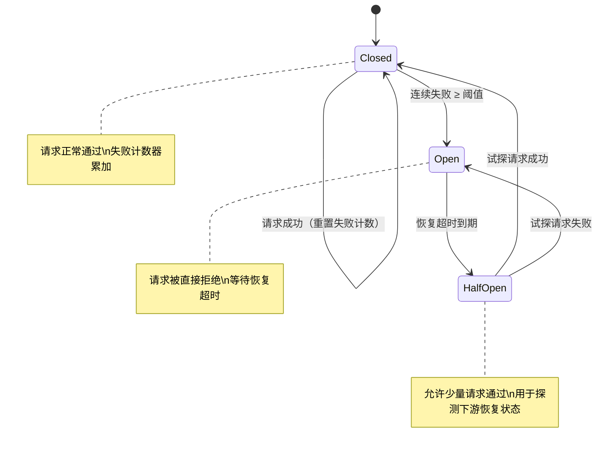

# 编排与容错

1978 年，美国计算机科学家莱斯利·兰波特（Leslie Lamport）在《Time, Clocks, and the Ordering of Events in a Distributed System》这篇论文里，提出了一个看似简单却异常棘手的问题：一群各自独立的计算机节点，没有共享时钟，网络消息可能延迟或丢失，它们如何就"谁先谁后"达成一致？兰波特用逻辑时钟和因果顺序给出了回答。这篇论文为分布式协调奠定了理论基础，四十余年过去，它的思想依然渗透在数据库复制协议、微服务治理和消息队列的底层设计中。

多智能体系统面临的协调问题，本质上与兰波特当年面对的问题同出一源。只不过"节点"从确定性的计算机进程变成了大语言模型驱动的 Agent，它们会给出不确定的答案，会在一段推理中突然跑偏，会在应该调用工具时输出一段散文。这让编排的难度上升了一个台阶：你需要同时处理分布式系统的经典难题和 LLM 引入的非确定性。

2007 年，迈克尔·尼加德（Michael Nygard）在《Release It!》一书中系统总结了生产环境下的容错模式：断路器（Circuit Breaker）、超时退避、隔板隔离、稳态储备。这些原本为面向服务架构总结的经验，被多智能体系统几乎原封不动地继承了下来。编排与容错是一体两面的工程问题，编排决定正常的路径怎么走，容错决定出了问题怎么办。

这篇文章围绕这两个问题展开。我们从编排器的基本职责讲起，逐步展开四种编排模式的设计思路和适用边界，然后深入容错的工具箱，最后讨论一致性和可观测性这两个容易被忽视却影响系统长期可维护性的问题。

## 编排的基础

要理解多智能体系统的编排，不妨从一个熟悉的场景讲起。假设你带领一个四人开发小组交付一个新功能：前端改页面，后端改接口，测试写用例，运维准备发布。你作为组长，手不敲代码，但要确保四个人知道各自该做什么、谁先谁后、出了问题该找谁。这个组长的角色，就是编排器（Orchestrator）在多智能体系统中的镜像。

编排器在宏观上把握任务的依赖关系和执行节奏，它不亲自执行，但执行的所有关键决策都经过它。多智能体系统中的编排器承担着同样的几项职责：将用户给出的复杂目标拆解为可分配给单个 Agent 的子任务；决定分配策略和调度顺序，让没有依赖的任务并行推进、有依赖的任务按序执行；监控执行过程，在某个 Agent 卡住或返回可疑结果时介入调整；最后将分散在各处的产出整合为统一的输出。

编排器的实现形态没有唯一答案。在简单的场景里，编排逻辑可以写在一个协调 Agent 的 system prompt 里，让它根据对话上下文自行调度。在需要审计和可复现性的场景里，编排器更适合作为一个独立的调度服务，借助声明式的工作流定义来执行任务。声明式的好处在于"执行什么"和"怎么执行"是分离的，工作流定义可以被人工审查、版本管理和回滚，这是嵌在 Agent prompt 里的编排逻辑难以做到的。

### 静态编排与动态编排

静态编排（Static Orchestration）和动态编排（Dynamic Orchestration）代表了两种不同的决策哲学：是在出发前把地图画好，还是边走边看。

静态编排在执行开始前就确定了完整的执行流程，运行时严格照章办事。它的表达形式通常是有向无环图（DAG）或有限状态机：每个节点代表一个 Agent 任务，边代表依赖关系或状态转移条件。静态编排的可预测性在需要合规审计或结果可复现的场景里是显著优势，同样的输入每次都能生成同样的流程结构，出了问题也容易追溯到具体的节点。但代价同样明确：真实世界很少按预定剧本走，一个工具接口突然不可用、一个 Agent 返回了意料之外的格式，静态流程就可能卡在原地。它处理不了"计划赶不上变化"的情况。

动态编排把控制权交给运行时推理。编排器本身就是一个 Agent，它根据当前状态判断下一步该做什么、分配给哪个执行 Agent。这种模式灵活，能绕开预定义流程覆盖不了的边缘情况，但同时也更难审计，因为你无法在开始之前预知完整的执行轨迹。

实践中很少走两个极端。更常见的做法是混合编排，用静态的工作流定义出大框架 —— 哪些阶段必须经过、哪些检查点必须触发 —— 框架内部的每一步则由编排器动态决策。这有点像导航：路线的大方向在出发前已经确定，但每个路口的实际转向和是否绕开拥堵，由驾驶员根据实时路况动态判断。框架保证不会遗漏关键步骤，动态决策提供面对意外时的弹性。

### 工作流定义

工作流（Workflow）是对执行流程的形式化描述，也是静态编排的骨架。把任务拆到 Agent 粒度后，编排器需要知道两件事：谁能在什么时候开始工作，以及谁必须等谁完成。工作流就是用结构化的方式回答这两个问题。

工作流常见的三种表达方式各有侧重。DAG 擅长表达任务之间的依赖关系和并行机会，如果几个子任务互不依赖，它们在 DAG 中就是拓扑平行的，编排器一看便知可以并行执行。有限状态机适合描述有状态转移的执行流程，任务在"待执行、执行中、已完成、失败"等状态之间跳转，每种状态下触发不同动作。Petri 网提供了对并发和同步的更精确建模，但实际工程中使用较少，一方面是编排场景通常不需要那么强的建模能力，另一方面是 Petri 网的可读性差，人类调试起来很痛苦。

无论采用哪种表达方式，工作流都由几类基本元素构成。任务节点是 Agent 真正执行工作的单元；控制节点处理条件分支、循环和并行扇出；数据边描述任务之间传递了什么数据；事件触发器定义流程由什么外部信号启动。把这些元素组合起来，就可以描述从简单的线性流水线到复杂的多层嵌套编排在内的各种执行策略。

工作流的可视化在实际工程中格外重要。一张清晰的流程图比几百行任务定义更容易让团队对齐理解，也更容易在事后排查执行路径 —— 比如排查为什么某个 Agent 的输入数据是空值，沿着流程图反向追溯往往比翻日志更快找到上游的根源。

## 编排模式

把任务安排好的方式不止一种，编排模式的选择取决于任务的内在结构：步骤之间的依赖关系是线性的还是分叉的，中间决策点是否需要动态判断，复杂度本身是否是分形的。下面四种编排模式覆盖了从简单到复杂的编排需求。

### 管道编排

管道编排（Pipeline Orchestration）是最直观的编排模式，它把任务组织成一条线性流水线，每个 Agent 专精一个环节，上游的输出作为下游的输入。这种模式天然适合有明确阶段顺序、各阶段职责分明的任务。

以内容生产流水线为例：调研 Agent 负责收集资料并整理为结构化摘要，交给撰写 Agent 根据摘要生成初稿，再由审校 Agent 核对事实和润色措辞，最后交给发布 Agent 排版上线。每个 Agent 只需要关注自己擅长的事，上一个 Agent 的输出格式就是下一个 Agent 的输入契约。管道的优势在于结构清晰、职责边界明确，哪一环出了问题一眼就能定位。

但它有两个不可忽视的局限。吞吐量受最慢环节限制，也就是生产线上的瓶颈效应：如果审校比撰写慢三倍，整个流水线的产出就卡在审校那里，撰写 Agent 大部分时间在空等。失败传播同样致命：任何一个环节失败，后续所有环节都无事可做。除非在每段管道连接处加上缓冲 Agent 或降级策略，但这又会把简洁的管道结构复杂化。此外，管道编排也不支持条件分支：如果流程需要"测试通过就自动部署，否则回退修复"，管道模式就无能为力了，那是条件路由的领地。

### 扇出 - 扇入编排

扇出 - 扇入（Fan-Out / Fan-In）把一个任务拆成多个并行的子任务，分给多个 Agent 同时执行，然后等它们全部（或部分）完成后汇总。这个模式正好解决了管道的吞吐量瓶颈：与其让一个 Agent 逐个审阅十份简历，不如把十份简历扇出给十个 Agent 各自审阅，最后扇入汇总比较结果，理论耗时缩短到原来的十分之一。

扇出阶段的首要决策是"分多少份"和"分给谁"。分得太细，编排协调的开销超过了并行执行节省的时间；分得太粗，并行度上不去，浪费了可用的 Agent 资源。扇入阶段的关键问题是"部分失败怎么办"：十个 Agent 有九个完成了、一个超时了，是死等还是用九个的结果继续？答案取决于任务的性质。如果是为关键决策提供完整信息，必须等待全量结果；如果是多方案比选，九选三已经足够做决策了，等那个慢的反面拖累整体响应时间。

扇出 - 扇入的一个经典变体是映射 - 归约（Map-Reduce）。这个模式由谷歌工程师杰弗里·迪恩（Jeffrey Dean）和桑杰·格马瓦特（Sanjay Ghemawat）在 2004 年的论文《MapReduce: Simplified Data Processing on Large Clusters》中提出，原本用于大规模数据处理，但它的"分解、并行处理、聚合"三段结构恰好与多 Agent 协作的场景吻合。在 Agent 系统中，Map 阶段将复杂任务拆解为多个子任务分发给并行 Agent，Reduce 阶段由汇总 Agent 对各方结果进行整合、去重和冲突消解。映射 - 归约在需要多视角分析、多源信息融合的任务中特别实用，比如同时用多种搜索策略检索同一个问题然后合并去重，或者让多个 Agent 分别从法律、财务、技术三个角度审查同一份合同。

### 条件路由编排

条件路由（Conditional Routing）让编排器根据中间结果动态选择后续路径，用条件判断而不是固定流程来控制走向。这让工作流具备了"做决策"的能力，而不仅仅是"按剧本走"。

一个典型的条件路由场景是自动化代码审查流水线。代码提交后，静态分析 Agent 先扫描代码规范。如果通过，进入测试 Agent 运行单元测试；如果测试通过，触发合并 Agent 自动合入主分支。任何一步失败，提交都会被路由到问题报告 Agent，由它生成详细的修复建议并发给提交者。每一步都是一个条件判断节点，整个流程形成一棵二叉判定树。

条件路由的难点不在于"如何实现条件判断" —— 那就是一行 if-else——而在于"条件本身可能出错"。当判断逻辑依赖 LLM 的推理结果时，误判的风险是一个必须正视的问题。例如一个 Agent 错误地将通过率 98% 的测试判定为"未通过"，后续就会走到错误的分支上，产生一次不必要的代码修复循环。缓解这个问题需要在关键决策点加入额外的校验，对边界结果 —— 接近阈值的判断 —— 进行多次采样确认，或者在影响较大的分支决策上引入人工确认环节。

另一个需要警惕的是工作流的"组合爆炸"。每增加一个条件节点，可能的执行路径数量就翻一倍。当路径数量增长到几十条，测试覆盖变得不可能，调试也变成噩梦。在条件路由设计中，一个实用的原则是保持路径总数在可维护的范围内，宁可有几个宽泛的分支也不要有几十个细碎的分支，除非你配了一套完善的追踪系统来自动记录每条路径的执行轨迹。

### 递归编排

递归编排（Recursive Orchestration）让编排器将一个子任务进一步分解和编排，形成嵌套的编排层次。这种模式适用于任务本身的复杂度就是分形的：一个大项目分解为若干模块，每个模块分解为若干子任务，子任务可能还需要再分解。在代码仓库级别的重构任务中，顶层编排器可能将任务按目录拆分为多个模块级编排器，每个模块级编排器再按文件拆分为多个文件级 Agent。

递归编排的关键在于终止条件。什么时候停止下钻、把任务交给单个 Agent 直接执行？有两个信号可以参考。一个是粒度信号：当任务粒度已经小到可以由单个 Agent 在一次推理中完成时，继续分解的编排成本已经超过了并行执行的收益。另一个是深度信号：设置硬性的最大递归深度作为保险丝，防止编排器在一个非常困难的子问题上无限下钻 —— 这种情况在实际运行中比人们想象得更常见，LLM 有时会执着于一个它不理解的细节，把任务越拆越碎但每个碎片都做不对。

递归编排的实现挑战主要在工程层面。多层嵌套的执行无法用一张平面流程图清晰表达，调试时需要追踪跨越多个层级的执行轨迹，找到"哪个编排器在等哪个 Agent 的结果"本身就成了一个排错的难题。更深层的问题在于编排塔的连锁等待：顶层编排器在等中层编排器返回结果，中层在等下层 Agent 完成，下层 Agent 因为 LLM API 限流在排队重试。这种情境下整个调用链都在空转，对用户来说表现为"系统卡住了但不知道卡在哪"。

### 编排实践：DAG 工作流执行器

四种编排模式的差异最终要落实到代码中。下面这个 DAG 工作流执行器将任务建模为有向无环图中的节点，通过拓扑排序确定执行顺序：无依赖的任务自动并行执行（扇出），有依赖的任务等待前置完成后自动触发（管道），依赖关系本身定义了执行路径的条件约束。它是静态编排的一个最小化实现，但包含了上述四种模式共享的基础设施 —— 依赖解析、并行调度和状态管理。

```python runnable
import time
import random
from collections import deque
from concurrent.futures import ThreadPoolExecutor, as_completed

class DAGWorkflow:
    """基于 DAG 的工作流编排器
    
    将任务建模为有向无环图中的节点，通过拓扑排序确定执行顺序。
    无依赖关系的任务自动并行执行，有依赖关系的任务等待前置完成后触发。
    
    参数:
        max_workers: 最大并行执行的线程数
    """
    
    def __init__(self, max_workers=4):
        self.max_workers = max_workers
        self.tasks = {}          # 任务名 -> 执行函数
        self.deps = {}           # 任务名 -> 前置任务集合
        self.reverse_deps = {}   # 任务名 -> 被依赖任务集合（反向索引，用于通知下游）
        self.results = {}        # 任务名 -> 执行结果
        self.errors = {}         # 任务名 -> 错误信息
    
    def add_task(self, name, func):
        """添加一个任务节点
        
        参数:
            name: 任务名称（唯一标识）
            func: 无参数的可调用对象，执行具体任务
        """
        self.tasks[name] = func
        if name not in self.deps:
            self.deps[name] = set()
        if name not in self.reverse_deps:
            self.reverse_deps[name] = set()
    
    def add_edge(self, from_task, to_task):
        """添加一条依赖边：to_task 必须等待 from_task 完成后才能执行
        
        参数:
            from_task: 前置任务名称
            to_task: 依赖任务名称
        """
        self.deps[to_task].add(from_task)
        self.reverse_deps[from_task].add(to_task)
    
    def run(self):
        """按拓扑顺序执行工作流
        
        入度为 0 的任务可以立即执行（无依赖）。
        每完成一个任务，减少依赖它的下游任务的入度，
        当下游任务入度降至 0 时自动触发执行。
        """
        # 计算每个任务尚待完成的前置任务数（入度）
        pending_deps = {name: len(deps) for name, deps in self.deps.items()}
        
        # 入度为 0 的任务没有依赖，可以直接执行
        ready = deque(name for name, count in pending_deps.items() if count == 0)
        
        with ThreadPoolExecutor(max_workers=self.max_workers) as executor:
            active_futures = {}
            # 持续提交就绪任务，直到所有任务处理完毕
            while ready or active_futures:
                # 提交所有就绪任务
                for name in ready:
                    future = executor.submit(self.tasks[name])
                    active_futures[future] = name
                ready.clear()
                
                # 等待任意一个任务完成
                for future in as_completed(active_futures):
                    name = active_futures.pop(future)
                    try:
                        self.results[name] = future.result()
                        print(f"  [完成] {name}")
                    except Exception as e:
                        self.errors[name] = str(e)
                        print(f"  [失败] {name}: {e}")
                    
                    # 通知所有依赖此任务的下游任务
                    for dependent in self.reverse_deps.get(name, set()):
                        pending_deps[dependent] -= 1
                        if pending_deps[dependent] == 0:
                            ready.append(dependent)
                    break  # 回到外循环，重新提交新就绪的任务
        
        return self.results, self.errors


# 演示：模拟一个内容生产流水线
if __name__ == "__main__":
    # 定义各阶段的任务函数
    def collect_materials():
        """调研阶段：收集资料"""
        time.sleep(random.uniform(0.5, 1.5))
        return {
            "主题": "大语言模型推理优化",
            "来源数": 12,
            "关键词": ["量化", "KV Cache", "投机采样"]
        }
    
    def draft():
        """撰写阶段：基于调研结果生成初稿"""
        materials = wf.results["调研"]
        time.sleep(random.uniform(1.0, 2.0))
        return f"基于{materials['来源数']}个来源撰写初稿（关键词：{', '.join(materials['关键词'])}）"
    
    def review():
        """审校阶段：检查事实和语句"""
        text = wf.results["撰写"]
        time.sleep(random.uniform(0.5, 1.0))
        return f"审校通过：{text[:25]}..."
    
    def translate():
        """翻译阶段：生成英文版本（与审校并行，因为只依赖撰写结果）"""
        text = wf.results["撰写"]
        time.sleep(random.uniform(1.5, 2.5))
        return f"[EN] Translation: {text[:25]}..."
    
    def merge():
        """合并阶段：汇总审校结果和翻译结果"""
        return {
            "中文定稿": wf.results["审校"],
            "英文版本": wf.results["翻译"]
        }
    
    # 构建工作流 DAG
    wf = DAGWorkflow(max_workers=4)
    wf.add_task("调研", collect_materials)
    wf.add_task("撰写", draft)
    wf.add_task("审校", review)
    wf.add_task("翻译", translate)
    wf.add_task("合并", merge)
    
    # 定义依赖关系
    wf.add_edge("调研", "撰写")   # 调研完成后才能撰写
    wf.add_edge("撰写", "审校")   # 撰写完成后才能审校
    wf.add_edge("撰写", "翻译")   # 撰写完成后才能翻译（与审校并行）
    wf.add_edge("审校", "合并")   # 审校完成后才能合并
    wf.add_edge("翻译", "合并")   # 翻译完成后才能合并
    
    print("DAG 工作流执行演示")
    print("依赖结构: 调研 -> 撰写 -> (审校 ∥ 翻译) -> 合并\n")
    results, errors = wf.run()
    print(f"\n执行完毕：成功 {len(results)} 个 / 失败 {len(errors)} 个")
    if "合并" in results:
        print(f"最终产出: {results['合并']}")
```

在这个示例中，`审校`和`翻译`两个任务只依赖`撰写`的结果，彼此之间不相关，因此在 DAG 中它们是拓扑平行的，工作流执行器会自动将它们并行提交。而`合并`必须在`审校`和`翻译`都完成后才能执行，这是通过依赖边自动保证的 —— 工作流执行器在`审校`和`翻译`都完成之前，`合并`的入度不会降为零，因此它不会被提交。这正是扇出 - 扇入模式在 DAG 框架下的自然表达：不需要显式的"扇出"和"扇入"节点，依赖关系本身就定义了并行边界和汇合点。

## 容错机制

编排解决了"正常运行怎么走"的问题，容错则回答"出了事怎么办"。多智能体系统的故障面比传统分布式系统更宽——LLM 的非确定性叠加分布式固有的不确定性，让故障排查的复杂度不是相加而是相乘。在讨论每种容错手段之前，先理清故障的类型图谱，这样后续每种策略的适用边界才会清晰。

### 故障类型

在传统的分布式系统里，故障可以大致分为三类：节点故障（进程崩溃）、网络故障（消息丢失或延迟）和资源故障（磁盘满、内存耗尽）。多智能体系统在这些基础上新增了 LLM 特有的故障范畴，让问题变得更加微妙。

Agent 自身的故障是最棘手的一类。LLM API 可能限流，让 Agent 卡在等待响应的状态；上下文窗口可能溢出，Agent 在推理中途"失忆"，后续输出基于残缺的对话历史；更隐蔽的故障是幻觉导致的无效操作，Agent 信心十足地调用了一个不存在的工具函数，或者返回了一个字段完全错位的 JSON 对象。这些故障在传统分布式系统中几乎没有对应物：一个确定性的微服务不会自己编造一个 REST 接口然后去调用。

工具故障属于比较传统的一类。外部 API 不可用、返回超时、参数格式错误被拒绝，这些都和微服务架构中下游服务挂掉是一个性质的问题。但 Agent 系统里的调用链路通常更长：LLM 先决定调用哪个工具，生成参数，发出调用，等待返回，再根据返回结果决定下一步。这个链条上的任何一环出问题，定位根因都比微服务中单纯的"查下游返回码"复杂。

通信故障在 Agent 间通过消息传递协作的架构中特别常见。消息丢失、乱序到达、队列积压，这些都是分布式消息系统的老朋友了。编排器自身的故障也不容忽视：它可能做出一个错误的调度决策，把任务分给了不擅长某类问题的 Agent，或者工作流定义本身就有逻辑漏洞。最后还有外部环境故障 —— 数据源结构变了导致 Agent 的工具调用参数过时，云资源配额耗尽让新 Agent 实例无法启动，上游依赖的模型版本升级后行为出现了微妙的不兼容。

把故障类型梳理出来的目的不是制造焦虑，而是形成一张"敌情地图"。接下来讨论的每一种容错机制，都是针对这张地图上某一类或某几类故障的应对方式。

### 超时与重试

超时（Timeout）是容错的第一道防线，也是最容易被低估的一道。它的原理简单到近乎粗暴：为每个操作设置一个最大等待时间，超时就视为失败。但"设置多少"这个问题远没有看起来那么简单。

设得太短，正常操作被误判为失败的概率大幅上升，引发不必要的重试，重试又可能压垮本来就脆弱的系统，形成恶性循环。设得太长，故障的影响持续扩大，用户在屏幕前干等，下游资源被无效占用。一个实用的做法是根据操作类型设置梯度超时：工具调用通常不超过 30 秒，Agent 单次推理设为 5 分钟，整个端到端任务的整体超时设为 1 小时。梯度超时的好处在于，越底层的操作越快暴露故障，避免故障自下而上地传染。

超时之后的重试（Retry）是最基本的恢复手段。它的假设是失败是暂时性的——API 暂时限流、网络短暂抖动、某个工具恰好正在重启。重试策略经历了从简单到精细的演化。最简单的固定间隔重试在并发场景下有一个致命的弱点：如果大量请求因为同一个原因同时失败、同时重试、再次同时失败，就形成了"惊群效应"。指数退避重试（Exponential Backoff）让每次重试的等待间隔翻倍，给下游留出恢复时间。进一步，在退避间隔上叠加随机抖动（Jitter），将同时失败的一批重试打散到时间线上，避免"退避了但还是一起重试"的尴尬。

不过重试不是万能药。确定性错误 —— 比如参数格式不合规 —— 重试多少次都不会成功，继续重试只是在浪费时间和 API 额度。有副作用的操作 —— 比如发送邮件、扣款 —— 重试可能导致重复执行。这意味着重试需要和幂等性设计配合使用，这个问题会在后面一致性的章节中展开。

### 降级与兜底

当主要方案确认失败且不在重试能解决的范围时，降级（Degradation）就登场了。降级的思想是牺牲部分质量换取可用性，让系统至少能返回一个"够用"的结果，而不是彻底失败。

降级可以在多个层级上实施。工具层面，当首选搜索 API 不可用时自动切换到备选搜索引擎，切换后的搜索结果可能相关性略差，但不会让整个查询任务中断。Agent 层面，当专门处理法律文本的 Agent 不可用时调度通用 Agent 临时顶上，给出的法律分析可能没有专业 Agent 深入，但至少能产出可用的初步判断。任务层面，当完整任务无法完成时交付部分成果，比如要求生成十页的报告只完成了八页，先把八页交出去比什么都给不出来强。

兜底（Fallback）是降级链条的终点。当所有自动恢复手段都耗尽了，将任务转交给人类处理。兜底机制的设计有一个很容易被忽略的细节：交给人类时必须附带上下文 —— 原始任务是什么、哪些步骤已经完成了、哪些步骤失败了、失败的原因是什么。一份没有上下文的兜底工单，审核者需要从头重建整个执行场景，这本身就是二次浪费。

设计降级和兜底时的一项重要原则是：每个关键操作至少有一条备份路径，备份路径的质量可以低于主路径，但不能完全没有。没有备份路径的容错方案不是容错，只是祈祷。

### 检查点与恢复

重试和降级解决的是"单个操作失败后怎么办"，检查点（Checkpoint）解决的是"整个流程崩溃后怎么接回去"。它的做法简单而有效：在关键位置保存系统的完整状态快照，故障发生后从最近的快照恢复，而不是从头再来。

检查点保存的内容包括已完成任务的输出结果、正在执行中的任务的进度信息，以及工作流本身的状态 —— 哪些节点已完成、哪些正在跑、哪些还在等待前置依赖。保存的粒度是一个需要权衡的问题。任务级检查点（每个 Agent 完成后保存一次）最精细，重做的工作最少，但保存操作的 I/O 开销也最高。阶段级检查点（每经过一个编排阶段保存一次）在开销和恢复效率之间取了折中。全局检查点（整个工作流一次快照）开销最小，但恢复到故障点需要重做大量工作。

恢复的策略也有多种选择。从最近检查点重新开始是最常用的，跳过已完成的任务从断点继续。在某些场景下，完全重新执行反而是更安全的选择，因为检查点保存的状态本身可能就是不一致的 —— 比如检查点保存时恰好有一个 Agent 写入了半个文件，恢复后这个半成品就成了潜在的 bug 来源。

检查点模式在多 Agent 协作中有一个值得注意的变形：检查点不仅保存任务进度，还保存 Agent 之间的共享上下文。如果一个 Agent 故障恢复后继续执行，它需要知道自己在哪里、其他 Agent 做了什么、当前讨论的焦点是什么。没有这部分上下文，恢复后的 Agent 就像一个中途加入会议的迟到者，需要花额外的时间补课才能跟上节奏。

### 断路器模式

断路器（Circuit Breaker）是尼加德在《发布！》中系统阐述的容错模式之一。它的设计初衷是防止故障扩散：当发现某个下游组件持续失败时，主动停止向它发送请求，把资源留给健康的组件，给故障组件留出恢复时间。这个名字来自电气工程中的物理断路器 —— 当电流过载时自动跳闸，保护电路不受损坏。

断路器有三个状态，转移逻辑很清晰。在闭合（Closed）状态下，断路器正常工作，请求正常通过，同时统计失败次数。当连续失败次数达到预设阈值，断路器跳闸到开路（Open）状态，此后所有请求被直接拒绝而不会发给下游，避免在明知会失败的操作上浪费资源。开路状态持续一段恢复超时时间后，断路器进入半开（Half-Open）状态，允许少量请求试探性地通过，用来检测下游是否已经恢复。如果试探请求成功，断路器闭合恢复正常；如果试探请求又失败，断路器重新打开继续等待。



*图：断路器状态机。三个状态之间的转移由失败计数和恢复超时两个参数控制，半开状态充当恢复的"探测针"。*

在 Agent 系统中，断路器的应用场景非常自然：当某个工具连续返回错误、某个 LLM API 持续限流、或者某个专业 Agent 不断产生幻觉输出时，断路器自动打开，编排器切换到备选方案或降级路径。下面这个实现将重试策略和断路器组合在一起，模拟一个可能间歇性故障的工具调用场景。

```python runnable
import time
import random
import functools
from enum import Enum

class CircuitState(Enum):
    CLOSED = "closed"          # 正常：请求通过，统计失败次数
    OPEN = "open"              # 熔断：请求直接拒绝
    HALF_OPEN = "half_open"    # 半开：试探性恢复

class CircuitBreaker:
    """断路器模式实现
    
    监测操作的连续失败次数。超过失败阈值时"跳闸"阻断后续调用，
    给下游留出恢复时间。恢复期后进入半开状态试探恢复。
    
    参数:
        failure_threshold: 连续失败多少次后开路
        recovery_timeout: 开路状态持续多少秒后进入半开
    """
    def __init__(self, failure_threshold=3, recovery_timeout=5.0):
        self.failure_threshold = failure_threshold
        self.recovery_timeout = recovery_timeout
        self.state = CircuitState.CLOSED
        self.failure_count = 0
        self.last_failure_time = 0
    
    def __call__(self, func):
        """作为装饰器使用，包裹目标函数"""
        @functools.wraps(func)
        def wrapper(*args, **kwargs):
            # 开路状态：检查是否已到恢复时间
            if self.state == CircuitState.OPEN:
                elapsed = time.time() - self.last_failure_time
                if elapsed >= self.recovery_timeout:
                    self.state = CircuitState.HALF_OPEN
                    print("  [断路器] 开路 → 半开（开始试探恢复）")
                else:
                    remain = self.recovery_timeout - elapsed
                    raise RuntimeError(
                        f"断路器已开路，拒绝调用（{remain:.1f}秒后可重试）")
            
            try:
                result = func(*args, **kwargs)
                # 调用成功
                if self.state == CircuitState.HALF_OPEN:
                    self.state = CircuitState.CLOSED
                    print("  [断路器] 半开 → 闭合（恢复成功）")
                self.failure_count = 0
                return result
            except Exception as e:
                # 调用失败
                self.failure_count += 1
                self.last_failure_time = time.time()
                if self.state == CircuitState.HALF_OPEN:
                    self.state = CircuitState.OPEN
                    print("  [断路器] 半开 → 开路（试探失败，重新熔断）")
                elif self.failure_count >= self.failure_threshold:
                    self.state = CircuitState.OPEN
                    print(f"  [断路器] 闭合 → 开路（连续失败 {self.failure_count} 次）")
                raise e
        
        return wrapper


def retry_with_backoff(max_retries=3, base_delay=0.5):
    """带指数退避和随机抖动的重试装饰器
    
    每次重试的等待时间为 base_delay * 2^attempt + 随机抖动，
    避免多个并发重试同时发起形成"惊群"。
    
    参数:
        max_retries: 最大重试次数
        base_delay: 基础等待时间（秒）
    """
    def decorator(func):
        @functools.wraps(func)
        def wrapper(*args, **kwargs):
            for attempt in range(max_retries + 1):
                try:
                    return func(*args, **kwargs)
                except Exception as e:
                    if attempt == max_retries:
                        raise  # 重试耗尽，向上抛出
                    delay = base_delay * (2 ** attempt) + random.uniform(0, 0.5)
                    print(f"    重试 {attempt + 1}/{max_retries}，等待 {delay:.1f}s...")
                    time.sleep(delay)
        return wrapper
    return decorator


# 模拟一个可能间歇性故障的远程工具
class SearchTool:
    """模拟的搜索工具：每次调用有一定概率失败"""
    
    def __init__(self, failure_rate=0.6):
        self.failure_rate = failure_rate
        self.call_count = 0
    
    # 断路器在外层，重试在内层
    # 断路器负责"要不要试"，重试负责"失败后怎么试"
    @CircuitBreaker(failure_threshold=3, recovery_timeout=5.0)
    @retry_with_backoff(max_retries=3, base_delay=0.5)
    def search(self, query):
        self.call_count += 1
        if random.random() < self.failure_rate:
            raise ConnectionError(f"搜索 '{query}' 失败（第 {self.call_count} 次调用）")
        return f"'{query}' 的搜索结果（第 {self.call_count} 次调用成功）"


if __name__ == "__main__":
    tool = SearchTool(failure_rate=0.6)
    
    print("=== 断路器与重试联合演示 ===\n")
    print(f"模拟工具失败率: {tool.failure_rate * 100:.0f}%")
    print(f"断路器阈值: 连续失败 3 次后开路")
    print(f"恢复超时: 5 秒\n")
    
    for i in range(10):
        print(f"请求 #{i+1}: ", end="", flush=True)
        try:
            result = tool.search("大语言模型推理优化")
            print(f"✓ {result}")
        except RuntimeError as e:
            print(f"✗ {e}")
        except ConnectionError as e:
            print(f"✗ {e}")
        
        if i < 9:
            time.sleep(1.2)
        # 在连续几次失败后等待足够久以观察断路器状态变化
        if i == 5:
            print("\n  > 等待恢复超时到期...")
            time.sleep(3)
```

在这个示例里，断路器包裹在重试装饰器的外层是有意为之的。断路器关心的是"下游是否还值得尝试"这个宏观判断，而重试关心的是"这次失败是否只是暂时抖动"这个微观判断。如果反过来把重试包在断路器外面，重试本身也会被断路器阻断，失去了重试的意义。两者的协作关系可以这样理解：断路器负责保护系统整体不浪费资源在已知故障的下游上，重试负责给那些尚未被判定为故障的下游一个短暂恢复的机会。

## 一致性与幂等性

容错机制解决了"系统能跑下去"的问题，一致性和幂等性解决的是"跑下去的结果是对的"的问题。在多 Agent 并行执行的场景里，重试、降级、断点恢复都可能引入状态的歧义，需要额外的正确性保障。

### 操作的幂等性

幂等性（Idempotency）是指同一操作执行一次和执行多次的效果相同。这个性质在容错系统中不是锦上添花，而是正确性的底线：只要系统有重试机制，幂等性就必须被纳入设计考量，否则重试本身就是 bug 的来源。

幂等操作在程序员的日常中其实很常见。读取数据天然是幂等的，读十次和读一次看到的是一样的内容。把某个字段设置为固定值也是幂等的，设为 `5` 无论执行多少次结果都是 `5`。但"给计数器加一"不是幂等的 —— 这就是为什么分布式计数通常使用支持幂等递增的专门数据结构（比如 Redis 的 HINCRBY 配合幂等键），而不是简单地 `count += 1`。

在 Agent 系统中，非幂等操作俯拾皆是。发送通知邮件、追加日志条目、创建数据库记录，这些操作如果因为重试被执行了两次，用户就会收到两封一模一样的邮件，日志里就会出现重复条目。将非幂等操作转化为幂等的标准做法是引入唯一请求标识（idempotency key）：Agent 的每次工具调用携带一个全局唯一的 ID，服务端在首次收到时执行并记录该 ID，后续带着相同 ID 的重试请求直接返回缓存的结果而不重复执行。这个方案在 Stripe 和 OpenAI 的 API 中都有实现，Agent 系统的工具调用层完全可以借鉴。

### 结果一致性

多个 Agent 并行执行时，它们各自产出的中间结果可能存在冲突。一致性（Consistency）描述的是系统在并发操作下维持状态满足特定约束的能力。

在分布式系统中，一致性是一个有精确量纲的概念。强一致性要求任何时刻所有节点看到的状态都相同，代价是高昂的协调开销。最终一致性（Eventual Consistency）放松了要求，允许暂时的不一致，但保证只要不再有新的写入，所有副本最终会收敛到相同状态。这个概念的经典阐述来自亚马逊 CTO 维尔纳·沃格尔斯（Werner Vogels）2008 年的博客文章《Eventually Consistent》，它几乎重新定义了大规模互联网系统的正确性标准。

Agent 系统通常选择最终一致性，原因很简单：强一致性要求的分布式锁和两阶段提交协议，在多 Agent 协作中引入的延迟和复杂度远超其收益。Agent 任务的粒度通常比数据库事务粗得多 —— 一个 Agent 可能花几十秒完成一次推理 —— 在这期间锁住共享状态意味着其他 Agent 全部空等，这显然不现实。

当冲突确实发生时，有几种常见的消解策略。时间戳优先最简单，后写入的结果覆盖先写入的。来源优先在特定场景下更有意义，比如法律审查 Agent 对合同条款的判断应当覆盖通用 Agent 对同一问题的判断。合并策略 —— 通过汇总 Agent 将冲突的多方结果合成为一个兼容版本 —— 在需要保留多方视角的场景下最合适。

### 补偿事务

有些操作天然无法原子回滚。已经发送的邮件无法撤回，已经触发的 GitHub webhook 无法取消。补偿事务（Compensating Transaction）是应对这类情况的方案：在无法回滚已完成的步骤时，通过执行语义上相反的操作来中和其影响。

补偿事务与数据库事务回滚有本质区别。数据库回滚是系统自动完成的、原子的，就像按一个撤销键，所有中间状态的痕迹都消失了。补偿事务则是手动的、语义的，它不是在"擦除"已经发生的事情，而是在"对冲"已经发生的事情带来的影响。一封已经发送的邮件无法从收件人的邮箱中消失，但你可以补发一封"请忽略上一封邮件"的更正通知。

补偿事务的设计需要遵循几项原则。每一个有外部副作用 —— 发送通知、创建工单、修改外部系统数据 —— 的操作，在写代码时就应该考虑好它的补偿操作是什么。补偿操作本身也应当是幂等的，因为发送补偿操作的请求同样可能因为网络问题被重试。如果连续两次"请忽略上一封"的邮件发到了同一个收件人那里，不幂等的补偿自身就成了需要再补偿的操作，形成无限递归。

## 可观测性

编排和容错策略再完善，如果出了问题无法追踪，系统的可靠性就无从谈起。可观测性（Observability）不是事后补救的运维工具，而是设计阶段就必须编入系统构造的神经。没有可观测性的多智能体系统就像一个黑箱，用户看到任务失败了，但不知道为什么失败、在哪一步失败、是不是换个策略就能成功。

### 日志与追踪

日志（Logging）是最基础的可观测性手段，每个 Agent 的决策、工具调用、输入输出和状态变化都应当产生日志记录。在单 Agent 场景中，日志主要是按时间排序的线性记录。但在多 Agent 系统中，一个用户请求可能触发跨多个 Agent 的调用链，单个 Agent 的日志只能看到局部的视角，无法还原完整的执行路径。

分布式追踪（Distributed Tracing）正是为了解决这个问题而设计的。它的设计思路是为每一次端到端请求分配一个全局唯一的追踪 ID（Trace ID），Agent 之间传递消息时携带这个 ID，每个 Agent 在处理过程中生成自己的跨度记录（Span）。这样事后检索时，用 Trace ID 就能把所有相关 Agent 的日志串成一条完整的调用链。

追踪系统在实施时需要在"全"和"省"之间做取舍。记录每个 Agent 的每次推理输出固然对调试有帮助，但 LLM 的输出动辄几千个 token，全量记录会迅速吞掉存储空间。一个实用的折中是：日常只记录结构化的元数据（调用了哪个模型、输入输出 token 数、耗时、成功与否），遇到异常时自动将完整上下文持久化，作为"事故快照"留待分析。这样就兼顾了常态下的低开销和异常时的信息密度。

### 指标与告警

如果日志回答的是"某次任务发生了什么"的追溯性问题，指标（Metrics）回答的是"系统整体是否健康"的实时性问题。

多智能体系统需要监控的指标可以分为几类。吞吐类指标包括任务提交速率、完成速率和队列积压深度，它们告诉你系统是否在被任务淹没。延迟类指标包括端到端任务耗时和各阶段的分段耗时，帮助你定位瓶颈在编排层面还是在 Agent 执行层面。可靠性类指标包括任务成功率、Agent 故障率、工具调用失败率和断路器触发频率，这几个指标组合起来能够描绘系统的整体健康态势。成本类指标——token 消耗量、API 调用次数 —— 在多智能体系统中尤为重要，因为 LLM 调用直接关联费用，一个失控的递归编排可能在几分钟内烧掉可观的预算。

告警（Alerting）在指标之上建立。当任务失败率在五分钟窗口内超过 10%、端到端平均延迟超过预期值的两倍、或者断路器连续触发超过设定次数时触发告警，通知运维人员介入。告警规则的设计讲究"信噪比"：太灵敏的阈值会产生大量狼来了式的假告警，导致真正的紧急告警被淹没在通知洪流中；太宽松的阈值又起不到预警作用。一个经验法则是，告警规则上线初期先设为静默模式（只记录不通知），观察一周的实际指标波动后，再根据真实基线设定合理的触发阈值。

指标还可以驱动自适应调整。当 Agent 利用率的波动超过预设范围时自动缩放 Agent 池的大小，当工具调用失败率上升时自动降低重试频率并增大断路器阈值，当 token 消耗速度超过预算时暂停低优先级的批量任务。这些自调整逻辑的理想目标是让系统在不需人工干预的情况下适应负载和环境的波动，但这要求指标本身是准确和及时的，而这两点在实践中都不是免费得来的。

## 本章小结

编排与容错是多智能体系统进入生产环境时无法回避的工程问题。这篇文章从编排器的职责讲起，梳理了静态编排、动态编排和混合编排三种策略的取舍逻辑，以及 DAG、状态机和 Petri 网三种工作流表达的适用场景。在编排模式部分，管道、扇出 - 扇入、条件路由和递归编排覆盖了从简单线性到多层嵌套的编排需求，每种模式都有自己擅长和不适应的场景。

容错部分沿着"发现故障 → 尝试恢复 → 降级兜底 → 断点续传 → 熔断隔离"的梯度展开。超时和重试是代价最小的恢复手段，降级和兜底是关键路径的最后保障，检查点避免了崩溃后的重复劳动，断路器阻止了单点故障的扩散。这些手段不是互斥的，在实际系统中它们通常分层组合使用：断路器在最外层决定是否要尝试，重试在内层处理临时性失败，降级在多次重试无果后接手。

一致性章节讨论了幂等性和最终一致性这两个正确性保障，它们和重试、补偿事务一起构成了闭环：重试要求幂等性，幂等性降低重试的副作用，补偿事务处理那些天然不幂等的操作。可观测性章节强调了一个容易被忽视的事实 —— 没有日志和追踪的多智能体系统是不可调试的，没有指标和告警的系统是不可运维的。

本章的一些问题会在后续章节中找到更深入的答案。Agent 之间的通信协议，包括消息格式、序列化方式和同步/异步模式的选择，将在 Agent 协作与通信一章中展开。记忆系统的设计，包括短期上下文管理和长期知识沉淀，将在记忆系统一章中讨论。编排器的调度策略与强化学习中的探索 - 利用权衡有深刻的内在联系，这个联系会在规划与推理一章中重新出现。

## 练习题

1. 假设你要设计一个代码审查的多 Agent 系统，流程是：代码提交 → 静态分析 → 单元测试 →（通过则自动合并 / 失败则生成修复建议）。请画出这个流程的 DAG 图，判断其中是否存在扇出 - 扇入结构，并指出哪些节点适合作为检查点。

   <details>
   <summary>参考答案</summary>

   流程 DAG 结构为线性加条件分支。不存在扇出 - 扇入结构，因为每一步都只有单个下游节点。但可以在代码扫描完成时引入检查点，因为扫描是整个流程的第一个质量闸门，此时保存原始提交内容、扫描结果和工作流状态的成本较低，后续任何步骤失败都可以从扫描完成点恢复而不需要重新扫描。

   适合作为检查点的节点包括：(1) 静态分析完成后（保存分析结果和原代码），(2) 单元测试完成后（保存测试报告），(3) 合并或报告生成完成后（保存最终状态）。

   </details>

2. 一个扇出 - 扇入编排中，编排器将任务扇出给五个 Agent 并行执行，其中一个 Agent 超时未响应。请提出两种处理策略，并分析各自的适用场景和风险。

   <details>
   <summary>参考答案</summary>

   **策略一：等待全量结果**。继续等待超时 Agent 或启动一个新的 Agent 重新执行该子任务。适用于需要完整信息才能决策的场景（如财务审计需要所有账目对账），风险在于超时可能持续很久，整体延迟不可控。

   **策略二：用部分结果继续**。忽略丢失的子任务结果，用四个 Agent 的结果进行汇总。适用于多方案比选等"信息充裕"的场景（如让五个 Agent 各提一个设计方案，四个方案已经足够覆盖多样性），风险在于缺失的那个子任务可能恰好包含了关键信息。
   
   折中策略是设置两级超时：短超时后先用已有结果产出初步输出，长超时后补充缺失的子任务结果并生成修订版。

   </details>

3. 使用下面的代码框架，实现一个带幂等性保障的工具调用包装器。包装器需要维护已执行请求的记录（使用 request_id 标识），对重复请求直接返回缓存的执行结果而不重复调用工具。

   <details>
   <summary>参考答案</summary>

   ```python
   import hashlib
   import time
   import json
   
   class IdempotentTool:
       """幂等工具调用包装器
       
       通过唯一请求标识（idempotency key）保证工具调用的幂等性：
       相同 request_id 的重复调用直接返回缓存结果，不重复执行。
       """
       
       def __init__(self):
           self.executed = {}  # request_id -> 执行结果
       
       def call(self, tool_name, params, request_id=None):
           """
           幂等调用工具
           
           参数:
               tool_name: 工具名称
               params: 调用参数字典
               request_id: 幂等键（若为空则自动生成，此时不保证幂等）
           
           返回:
               工具执行结果
           """
           # 生成或提取 request_id
           if request_id is None:
               request_id = hashlib.sha256(
                   f"{tool_name}:{json.dumps(params, sort_keys=True)}:{time.time()}".encode()
               ).hexdigest()[:16]
           
           # 如果已执行过，直接返回缓存结果
           if request_id in self.executed:
               print(f"  [幂等命中] request_id={request_id}")
               return self.executed[request_id]
           
           # TODO: 此处调用实际工具，这里用模拟实现
           # 在实际系统中，这里会 call_external_api(tool_name, params)
           result = self._execute_tool(tool_name, params)
           
           # 记录执行结果
           self.executed[request_id] = result
           
           return result
       
       def _execute_tool(self, tool_name, params):
           """模拟工具执行（实际项目中替换为真实的API调用）"""
           print(f"  [工具调用] {tool_name}({params})")
           time.sleep(0.3)
           return {"status": "ok", "tool": tool_name, "params": params, "result": "模拟结果"}
   
   
   # 测试幂等性
   if __name__ == "__main__":
       tool = IdempotentTool()
       
       print("=== 幂等工具调用演示 ===\n")
       
       # 第一次调用
       print("第1次调用 (request_id=req-001):")
       result1 = tool.call("search", {"query": "Python"}, request_id="req-001")
       print(f"  结果: {result1}\n")
       
       # 重复调用（相同 request_id）
       print("第2次调用 (request_id=req-001, 重复):")
       result2 = tool.call("search", {"query": "Python"}, request_id="req-001")
       print(f"  结果: {result2}\n")
       
       # 验证幂等性：两次调用返回的对象应该是同一个引用
       print(f"两次调用返回同一对象: {result1 is result2}")
       
       # 不同 request_id 会正常执行
       print("\n第3次调用 (request_id=req-002, 新请求):")
       result3 = tool.call("search", {"query": "Python"}, request_id="req-002")
       print(f"  结果: {result3}")
       print(f"第二和三次调用返回不同对象: {result2 is not result3}")
   ```

   </details>

4. 断路器模式的三个状态（闭合、开路、半开）各自对应一种系统行为的假设。请解释每个状态的假设是什么，以及在 Agent 系统中哪些场景下你可能会调整默认的断路器参数（失败阈值、恢复超时）。

   <details>
   <summary>参考答案</summary>

   **闭合状态**的假设是"下游大概率正常运行，偶尔的失败是暂时性的抖动"。这个状态下断路器允许请求通过并统计失败次数。

   **开路状态**的假设是"下游已经不可用，继续发送请求只会浪费资源并拖累调用方"。这个状态下所有请求被直接拒绝。

   **半开状态**的假设是"下游可能已经恢复，但需要谨慎验证"。这个状态下只允许少量试探请求通过。

   调整断路器参数的典型场景：调用高成本的 LLM API（如 GPT-4）时，失败阈值应该调低（比如连续 2 次失败就开路），因为每次失败的 API 调用都产生费用，不值得继续试探。调用本地工具或缓存服务时，恢复超时可以设得更短（如 5 秒），因为本地服务的恢复通常很快。调用外部第三方 API 时，恢复超时建议设为分钟级（如 5 分钟），给第三方足够的时间从故障中恢复。

   </details>
