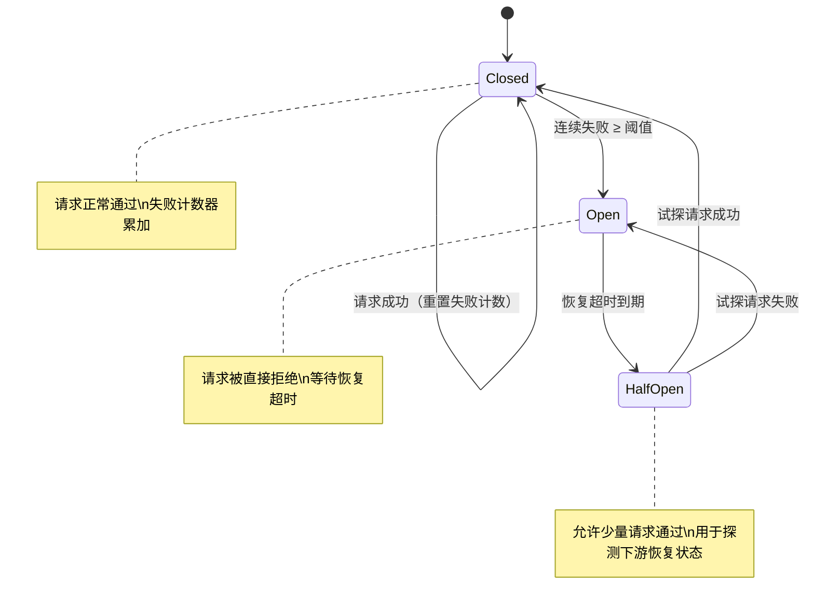

# 编排与容错

1978 年，美国计算机科学家莱斯利·兰波特（Leslie Lamport）在论文《Time, Clocks, and the Ordering of Events in a Distributed System》中提出一个问题：一群各自独立的计算机节点，没有共享时钟，网络消息可能延迟或丢失，它们如何就先后顺序达成一致？兰波特用逻辑时钟和因果顺序给出了答案。这篇论文为分布式协调奠定了理论基础。四十余年过去，它的思想依然渗透在数据库复制协议、微服务治理和消息队列的底层设计中。

多智能体系统面临的协调问题，本质上与兰波特当年面对的问题同出一源。只不过节点从确定性的计算机进程变成了大语言模型驱动的 Agent，它们会给出不确定的答案，会在一段推理中突然偏离方向，会在应该调用工具时输出一段散文。这让编排的难度又上升了一个台阶，需要同时处理分布式系统的经典难题和 LLM 引入的非确定性。

2007 年，迈克尔·尼加德（Michael Nygard）在《Release It!》一书中系统总结了生产环境下的容错模式，如断路器、超时退避、隔板隔离、稳态维持。这些原本为面向服务架构总结的经验，现在被多智能体系统几乎原封不动地继承了下来。编排与容错是一体两面的工程问题，编排决定正常的路径怎么走，容错决定出了问题怎么办。

## 编排的基础

**静态编排**（Static Orchestration）和**动态编排**（Dynamic Orchestration）代表了两种不同的决策哲学。静态编排在执行开始前就确定了完整的执行流程，运行时严格照章办事。它的表达形式通常是有向无环图（DAG）或有限状态机。在 DAG 中每个节点代表一个 Agent 任务，在有限状态机中每个节点代表一个执行状态。边代表依赖关系或状态转移条件。静态编排的可预测性在需要合规审计或结果可复现的场景里是显著优势，相同的输入每次都能生成一致的流程结构，出了问题也容易追溯到具体的节点。但问题是真实世界并不总是按预定剧本走的，一个工具接口突然不可用、一个 Agent 返回了意料之外的格式，静态流程就可能卡在原地，处理不了计划外的突发情况。

动态编排把控制权交给运行时推理，编排器本身就是一个 Agent，它根据当前状态判断下一步该做什么、分配给哪个执行 Agent。这种模式灵活，能绕开预定义流程覆盖不了的边缘情况，但同时也更难审计，因为无法在开始之前预知完整的执行轨迹。

实践中更常见的做法是混合编排，用静态的工作流定义出大框架，描述哪些阶段必须经过、哪些检查点必须触发，框架内部的每一步则由编排器动态决策。这有点像驾驶导航，路线的大方向在出发前已经确定，但每个路口的实际转向和是否绕开拥堵，由驾驶员根据实时路况动态判断。由流程框架保证不会遗漏关键步骤，由动态决策提供面对意外时的弹性。

## 编排模式

把任务安排好的方式不止一种，编排模式的选择取决于任务的内在结构，譬如步骤之间的依赖关系是线性的还是分叉的，中间决策点是否需要动态判断，复杂度本身是否在不同层级上自相似。下面四种编排模式覆盖了从简单到复杂的编排需求。

### 管道编排

**管道编排**（Pipeline Orchestration）是最直观的编排模式，它把任务组织成一条线性流水线，每个 Agent 专精一个环节，上游的输出作为下游的输入。这种模式天然适合有明确阶段顺序、各阶段职责分明的任务。以内容生产流水线为例，调研 Agent 负责收集资料并整理为结构化摘要，交给撰写 Agent 根据摘要生成初稿，再由审校 Agent 核对事实和润色措辞，最后交给发布 Agent 排版上线。每个 Agent 只需要关注自己擅长的事，上一个 Agent 的输出格式就是下一个 Agent 的输入契约。管道的优势在于结构清晰、职责边界明确，哪一环出了问题一眼就能定位。

但管道编排的吞吐量受最慢环节限制，也就是生产线上的瓶颈效应。如果审校比撰写慢三倍，整个流水线的产出就卡在审校那里，撰写 Agent 大部分时间在空等。管道编排的失败传播也是一个严重的限制，任何一个环节失败，后续所有环节都无事可做。除非在每段管道连接处加上缓冲机制（如消息队列或中间缓存）或降级策略，但这又会把简洁的管道结构复杂化。此外，管道编排不支持条件分支，如果流程需要判断'测试通过就自动部署，否则回退修复'，管道模式就无能为力了，那是条件路由的领地。

### 扇出 - 扇入编排

**扇出 - 扇入**（Fan-Out / Fan-In）把一个任务拆成多个并行的子任务，分给多个 Agent 同时执行，然后等它们全部（或部分）完成后汇总。这个模式正好解决了管道的吞吐量瓶颈。扇出阶段的首要决策是"分多少份"和"分配给谁"。如果分得太细，编排协调的开销超过了并行执行节省的时间。如果分得太粗，并行度上不去，浪费了可用的 Agent 资源。扇入阶段的关键问题是部分失败怎么办。十个 Agent 有九个完成了、一个超时了，是持续等待还是用九个的结果继续推进？答案取决于任务的性质。如果是为关键决策提供完整信息，必须等待全量结果；如果是多方案比选，从已完成的结果中挑选几个方案已经足够做决策了，等那个慢的反而拖累整体响应时间。

扇出 - 扇入的一个经典变体是**映射 - 归约**（Map-Reduce）。这个模式由谷歌工程师杰弗里·迪恩（Jeffrey Dean）和桑杰·格马瓦特（Sanjay Ghemawat）在 2004 年的论文《MapReduce: Simplified Data Processing on Large Clusters》中提出，原本用于大规模数据处理，但它的"分解、并行处理、聚合"三段结构（本文按 Agent 协作视角重新诠释，原始 MapReduce 包含 Map、Shuffle、Reduce 三个核心阶段）恰好与多 Agent 协作的场景吻合。在 Agent 系统中，Map 阶段将复杂任务拆解为多个子任务分发给并行 Agent，Reduce 阶段由汇总 Agent 对各方结果进行整合、去重和冲突消解。Map-Reduce 在需要多视角分析、多源信息融合的任务中特别实用，譬如同时用多种搜索策略检索同一个问题然后合并去重，或者让多个 Agent 分别从法律、财务、技术等不同维度审查同一份合同。

### 条件路由编排

**条件路由**（Conditional Routing）让编排器根据中间结果动态选择后续路径，用条件判断而不是固定流程来控制走向。一个典型的条件路由场景是自动化代码审查流水线。代码提交后，静态分析 Agent 先扫描代码规范。如果通过，进入测试 Agent 运行单元测试；如果测试通过，触发合并 Agent 自动合入主分支。任何一步失败，提交都会被路由到问题报告 Agent，由它生成详细的修复建议并发给提交者。每一步都是一个条件判断节点，整个流程形成一棵二叉判定树。

条件路由的难点不在于如何实现条件判断，而在于条件本身可能出错。当判断逻辑依赖 LLM 的推理结果时，误判的风险是一个必须正视的问题。譬如一个 Agent 错误地将通过率 98% 的测试判定为未通过，后续就会走到错误的分支上，产生一次不必要的代码修复循环。缓解这个问题需要在关键决策点加入额外的校验，对边界结果进行多次采样确认，或者在影响较大的分支决策上引入人工确认环节。另一个需要警惕的是工作流的组合爆炸。每增加一个条件节点，可能的执行路径数量就翻一倍。当路径数量增长到几十条，测试覆盖变得不可能，调试也变成噩梦。在条件路由设计中，一个实用的原则是保持路径总数在可维护的范围内，宁可有几个宽泛的分支也不要有几十个细碎的分支，除非你配了一套完善的追踪系统来自动记录每条路径的执行轨迹。

### 递归编排

**递归编排**（Recursive Orchestration）让编排器将一个子任务进一步分解和编排，形成嵌套的编排层次。这种模式适用于任务本身的复杂度在不同粒度层级上呈现自相似结构。一个大项目分解为若干模块，每个模块分解为若干子任务，子任务可能还需要再分解。在代码仓库级别的重构任务中，顶层编排器可能将任务按目录拆分为多个模块级编排器，每个模块级编排器再按文件拆分为多个文件级 Agent。

递归编排要注意递归终止条件。什么时候停止下钻、把任务交给单个 Agent 直接执行，有两个信号可以参考。一个是粒度信号，当任务粒度已经小到可以由单个 Agent 在一次推理中完成时，继续分解的编排成本已经超过了并行执行的收益。另一个是深度信号，设置硬性的最大递归深度作为保险丝，防止编排器在一个非常困难的子问题上无限下钻。这种情况在实际运行中比人们想象得更常见，LLM 有时会执着于一个它不理解的细节，把任务越拆越碎但每个碎片都做不对。

递归编排的实现挑战主要在工程层面。多层嵌套的执行无法用一张平面流程图清晰表达，调试时需要追踪跨越多个层级的执行轨迹，找到哪个编排器在等哪个 Agent 的结果本身就成了一个排错的难题。更深层的问题在于嵌套结构形成的编排塔——顶层编排器在等中层编排器返回结果，中层在等下层 Agent 完成，下层 Agent 因为 LLM API 限流在排队重试。这种情境下整个调用链都在空转，对用户来说表现为系统卡住了但不知道卡在哪。

## 容错机制

编排解决了正常运行怎么走的问题，容错则回答出事怎么办。多智能体系统的故障面比传统分布式系统更宽，LLM 的输出非确定性叠加分布式系统固有的不确定性，让故障排查的复杂度不是相加而是相乘。

### 超时与重试

**超时**（Timeout）是容错的第一道防线，也是最容易被低估的一道。它的原理十分简单，就是为每个操作设置一个最大等待时间，超时就视为失败。但超时时间该设置多少并不容易确定。设得太短，正常操作被误判为失败的概率大幅上升，引发不必要的重试，重试又可能压垮本来就脆弱的系统，形成恶性循环。设得太长，故障的影响持续扩大，用户在屏幕前干等，下游资源被无效占用。一个实用的做法是根据操作类型设置梯度超时，工具调用通常不超过 30 秒，Agent 单次推理设为 5 分钟，整个端到端任务的整体超时设为 1 小时。梯度超时的好处在于，越底层的操作越快暴露故障，在底层就将其截断，避免向上层扩散。

超时之后的**重试**（Retry）是最基本的恢复手段。它的假设是失败是暂时性的，如 API 暂时限流、网络短暂抖动、某个工具恰好正在重启。重试策略经历了从简单到精细的演化。最简单的固定间隔重试在并发场景下有一个致命的弱点，即大量请求可能因为同一个原因同时失败、同时重试、再次同时失败，形成"惊群效应"。指数退避重试（Exponential Backoff）让每次重试的等待间隔按指数增长，给下游留出恢复时间。进一步，在退避间隔上叠加随机抖动（Jitter），将同时失败的一批重试打散到时间线上，避免"退避了但还是一起重试"的尴尬。

不过重试不是万能药。确定性错误（譬如参数格式不合规）重试多少次都不会成功，继续重试只是在浪费时间和 API 额度。有副作用的操作（譬如发送邮件、扣款）重试可能导致重复执行。这意味着重试需要和幂等性设计配合使用，这个问题会在后面一致性的部分中展开。

### 降级与兜底

当主要方案确认失败且重试无法解决时，**降级**（Degradation）就登场了。降级是牺牲部分质量换取可用性，让系统至少能返回一个"够用"的结果，而不是彻底失败。降级可以在多个层级上实施。工具层面，当首选搜索 API 不可用时自动切换到备选搜索引擎，切换后的搜索结果可能相关性略差，但不会让整个查询任务中断。Agent 层面，当专门处理法律文本的 Agent 不可用时调度通用 Agent 临时顶上，给出的法律分析可能没有专业 Agent 深入，但至少能产出可用的初步判断。任务层面，当完整任务无法完成时交付部分成果，譬如要求生成十页的报告只完成了八页，先把八页交出去比什么都给不出来强。

兜底（Fallback）是降级链条的终点。当所有自动恢复手段都耗尽了，可采取预定义的最终替代行为，譬如返回缓存结果、给出默认应答、或将无法自动处理的任务转交给人类。兜底机制的设计有一个很容易被忽略的细节。交给人类时必须附带上下文，包括原始任务是什么、哪些步骤已经完成、哪些步骤失败以及失败的原因。一份没有上下文的兜底工单，审核者需要从头重建整个执行场景，这本身就是二次浪费。

设计降级和兜底时的一项重要原则是，每个关键操作至少有一条备份路径，备份路径的质量可以低于主路径，但不能完全没有。没有备份路径的容错方案不是容错，只是祈祷。

### 检查点与恢复

重试和降级解决的是单个操作失败后怎么办，**检查点**（Checkpoint）解决的是整个流程崩溃后怎么恢复。它在关键位置保存系统的完整状态快照，故障发生后从最近的快照恢复，而不是从头再来。检查点保存的内容包括已完成任务的输出结果、正在执行中的任务的进度信息，以及工作流本身的状态（哪些节点已完成、哪些正在运行、哪些还在等待前置依赖）。保存的粒度是一个需要权衡的问题。任务级检查点（每个 Agent 完成后保存一次）最精细，重做的工作最少，但保存操作的 I/O 开销也最高。阶段级检查点（每经过一个编排阶段保存一次）在开销和恢复效率之间取了折中。全局检查点（整个工作流一次快照）开销最小，但恢复到故障点需要重做大量工作。

恢复的策略也不止一种。从最近检查点重新开始是最常用的，跳过已完成的任务从断点继续。在某些场景下，完全重新执行反而是更安全的选择，因为检查点保存的状态本身可能就是不一致的，譬如检查点保存时恰好有一个 Agent 写入了半个文件，恢复后这个半成品就成了潜在的 Bug 来源。检查点模式在多 Agent 协作中有一个值得注意的变形，即检查点不仅保存任务进度，还保存 Agent 之间的共享上下文。如果一个 Agent 故障恢复后继续执行，它需要知道自己中断在哪个节点、其他 Agent 做了什么、当前讨论的焦点是什么。没有这部分上下文，恢复后的 Agent 就像一个中途加入会议的迟到者，需要花额外的时间了解前情才能跟上节奏。

### 断路器模式

**断路器**（Circuit Breaker）是尼加德在《Release It!》中系统阐述的容错模式之一。它的设计初衷是防止故障扩散。当发现某个下游组件持续失败时，主动停止向它发送请求，把资源留给健康的组件，给故障组件留出恢复时间。电流过载时物理断路器自动跳闸以保护电路不受损坏，这个名字正来源于此。

断路器有三个状态，转移逻辑很清晰。在闭合（Closed）状态下，断路器正常工作，请求正常通过，同时统计失败次数。当连续失败次数达到预设阈值，断路器跳闸到开路（Open）状态，此后所有请求被直接拒绝而不会发给下游，避免在明知会失败的操作上浪费资源。开路状态持续一段恢复超时时间后，断路器进入半开（Half-Open）状态，允许少量请求试探性地通过，用来检测下游是否已经恢复。如果试探请求成功，断路器闭合恢复正常；如果试探请求又失败，断路器重新打开继续等待。

*图：断路器状态机*

在 Agent 系统中，断路器的应用场景十分契合。当某个工具连续返回错误、某个 LLM API 持续限流、或者某个专业 Agent 不断返回异常状态（如超时、格式错误、资源耗尽）时，断路器自动打开，编排器切换到备选方案或降级路径。

## 一致性与幂等性

在多 Agent 并行执行的场景里，重试、降级、断点恢复都可能引入状态的歧义，需要额外的正确性保障，其中最典型的就是一致性与幂等性。

### 操作的幂等性

**幂等性**（Idempotency）是指同一操作执行一次和执行多次的效果相同。这个性质在容错系统中不是锦上添花，而是正确性的底线。只要系统有重试机制，幂等性就必须被纳入设计考量，否则重试本身就会成为 Bug 的来源。

幂等操作在程序员的日常中其实很常见。读取数据天然是幂等的，读十次和读一次看到的是一样的内容。把某个字段设置为固定值也是幂等的，设为 `5` 无论执行多少次结果都是 `5`。但"给计数器加一"这个操作不是幂等的，这就是为什么分布式计数通常需要在应用层配合唯一键实现幂等递增（譬如用 Redis 的 `HINCRBY` 命令结合 SETNX 进行请求去重），而不是简单地 `count += 1`。

在 Agent 系统中，非幂等操作比比皆是。发送通知邮件、追加日志条目、创建数据库记录，这些操作如果因为重试被执行了两次，用户就会收到两封一模一样的邮件，日志里就会出现重复条目。将非幂等操作转化为幂等的标准做法是引入唯一请求标识（idempotency key）。Agent 的每次工具调用携带一个全局唯一的 ID，服务端在首次收到时执行并记录该 ID，后续带着相同 ID 的重试请求直接返回缓存的结果而不重复执行。这个方案在 Stripe 和 OpenAI 的 API 中都有实现，Agent 系统的工具调用层完全可以借鉴。

### 结果一致性

多个 Agent 并行执行时，它们各自产出的中间结果可能存在冲突。**一致性**（Consistency）描述的是系统在并发操作下使状态持续满足特定约束的能力。在分布式系统中，一致性是一个有精确定义的概念。强一致性要求所有操作看起来以某个全局顺序原子地发生，就好像只有一个副本在服务，代价是高昂的协调开销。最终一致性（Eventual Consistency）放松了要求，允许暂时的不一致，但保证只要不再有新的写入，所有副本最终会收敛到相同状态。这个概念的经典阐述来自亚马逊 CTO 维尔纳·沃格尔斯（Werner Vogels）2008 年的博客文章《Eventually Consistent》，它几乎重新定义了大规模互联网系统的正确性标准。

Agent 系统通常选择最终一致性，因为实现强一致性通常需要共识协议（如 Raft/Paxos）或分布式事务协议（如两阶段提交），在多 Agent 协作中引入的延迟和复杂度远超其收益。Agent 任务的粒度通常比数据库事务粗得多，一个 Agent 可能花几十秒完成一次推理，在这期间锁住共享状态意味着其他 Agent 全部空等，这显然不现实。当冲突确实发生时，有几种常见的消解策略。时间戳优先最简单，后写入的结果覆盖先写入的。来源优先在特定场景下更有意义，譬如法律审查 Agent 对合同条款的判断应当覆盖通用 Agent 对同一问题的判断。合并策略通过汇总 Agent 将冲突的多方结果合成为兼容版本，在需要保留多方视角的场景下最合适。

### 补偿事务

有些操作天然无法原子回滚。已经发送的邮件无法撤回，已经触发的 GitHub Webhook，一旦被接收方成功处理，其产生的副作用就无法原子撤销。**补偿事务**（Compensating Transaction）是应对这类情况的方案，即在无法回滚已完成的步骤时，通过执行语义上相反的操作来中和其影响。补偿事务与数据库事务回滚有本质区别。数据库回滚是系统自动完成的、原子的，就像按一个撤销键，所有中间状态的痕迹都消失了。补偿事务则是手动的、语义的，它不是在擦除已经发生的事情，而是在抵消已经发生的事情带来的影响。一封已经发送的邮件无法从收件人的邮箱中消失，但你可以补发一封"请忽略上一封邮件"的更正通知。

补偿事务的设计需要遵循几项原则。每一个有外部副作用的操作（发送通知、创建工单、修改外部系统数据），在写代码时就应该考虑好它的补偿操作是什么。补偿操作本身也应当是幂等的，因为发送补偿操作的请求同样可能因为网络问题被重试。如果连续两次"请忽略上一封"的邮件发到了同一个收件人那里，不幂等的补偿自身就成了需要再补偿的操作，形成无限递归。

## 本章小结

编排与容错是同一个工程问题的两面。编排规划正常路径如何流转，容错决定异常发生时如何应对。在多智能体系统中，LLM 的非确定性叠加分布式固有的不确定性，让故障排查的复杂度成倍放大。从管道、扇出到递归，编排模式的选择取决于任务的内在结构。超时重试、降级兜底、检查点恢复与断路器模式构成了逐层递进的防线。一致性与幂等性确保容错手段本身不会引入新的混乱，可观测性则为所有策略提供了运行的反馈闭环。

## 练习题

1. 假设你要设计一个代码审查的多 Agent 系统，流程是：代码提交 → 静态分析 → 单元测试 →（通过则自动合并 / 失败则生成修复建议）。请画出这个流程的 DAG 图，判断其中是否存在扇出 - 扇入结构，并指出哪些节点适合作为检查点。

   

   
参考答案

   流程 DAG 包含以下节点：代码提交 → 静态分析 → 单元测试（通过则进入自动合并节点，失败则进入修复建议生成节点），整体为线性加条件分支结构。不存在扇出 - 扇入结构，因为条件分支的两个下游节点不会并行执行，每一步在运行时只沿一条路径推进。但可以在静态分析完成时引入检查点，因为静态分析是整个流程的第一个质量闸门，此时保存原始提交内容、静态分析结果和工作流状态的成本较低，后续任何步骤失败都可以从静态分析完成点恢复而不需要重新扫描。

   适合作为检查点的节点包括：(1) 静态分析完成后（保存分析结果和原代码），(2) 单元测试完成后（保存测试报告），(3) 合并或报告生成完成后（保存最终状态）。

   

2. 一个扇出 - 扇入编排中，编排器将任务扇出给五个 Agent 并行执行，其中一个 Agent 超时未响应。请提出两种处理策略，并分析各自的适用场景和风险。

   

   
参考答案

   **策略一：等待全量结果**。继续等待超时 Agent 直至其响应。另一种思路是放弃当前 Agent 并重试：启动一个新的 Agent 重新执行该子任务，这是策略一的变体，但额外引入了重复计算的风险。适用于需要完整信息才能决策的场景（如财务审计需要所有账目对账），风险在于超时可能持续很久，整体延迟不可控。

   **策略二：用部分结果继续**。忽略丢失的子任务结果，用四个 Agent 的结果进行汇总。适用于多方案比选等"信息充裕"的场景（如让五个 Agent 各提一个设计方案，四个方案已经足够覆盖多样性），风险在于缺失的那个子任务可能恰好包含了关键信息。
   
   折中策略是设置两级超时：短超时后先用已有结果产出初步输出，长超时后补充缺失的子任务结果并生成修订版。

   
