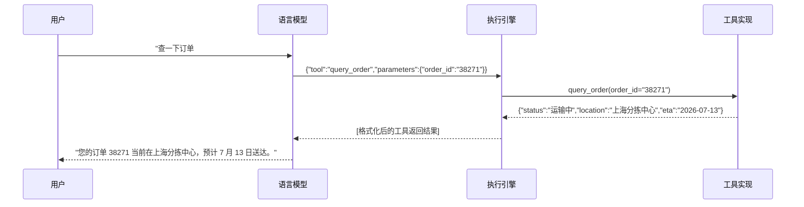
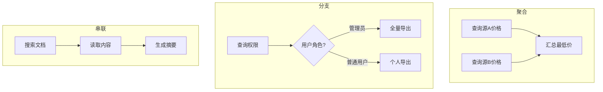

# 工具调用

2023 年初，Meta AI 团队发布了 Toolformer 模型，证明语言模型可以通过自监督学习自主掌握工具使用的能力，无需大量人工标注。同年 6 月，OpenAI 在 GPT-4 中正式推出了函数调用（Function Calling）功能，将工具调用从学术实验推向了工程产品。从那时起，工具调用不再是一个研究课题，而是构建 LLM 应用的必备基础设施。

## 工具调用的基本原理

假设你正在构建一个客服 Agent，用户输入"帮我查一下订单 38271 的物流状态"。语言模型本身只能生成一段关于物流查询的说明文字，指导用户如何操作，或者凭空编造一个物流状态。它无法真的访问你的订单数据库，因为它没有数据库连接，没有 SQL 执行权限，甚至连网络请求都发不出去。在[上一篇文章](llm-to-agent.md)中我们详细讨论了 LLM 的能力边界，其中首要的局限就是模型只能被动生成文本，无法主动操作外部世界。工具调用正是为解决这个局限而设计的机制，它给模型装上"手脚"，让模型能够触及文本之外的真实数据和真实操作。

从工程角度看，工具调用的本质是一种结构化输出。模型并非学会了调用工具，而是学会在特定提示格式下，生成符合预定 Schema 的结构化数据。下面是一个简化的例子，展示同一个用户请求在普通模式和工具调用模式下的不同输出：

- 普通模式：`好的，我来帮您查询订单 38271 的物流状态。您的订单可能正在运输中...`（编造内容）
- 工具调用模式：`{"tool": "query_order", "parameters": {"order_id": "38271"}}`（结构化指令）

第二种输出不再是一段供人阅读的文字，而是一条供机器解析的指令。执行引擎接收到这个 JSON 对象后，调用 `query_order` 函数，将真实的订单数据返回给模型，模型再基于真实数据生成最终回复。整个过程形成一个完整的调用链路，如下图所示：



*图：工具调用的完整时序流程*

这个流程中模型并不直接执行任何操作，它只负责决定调用什么工具、传递什么参数。实际的执行工作由执行引擎和工具实现完成，模型的职责仍然是它最擅长的理解用户意图，然后生成正确的指令。

### 工具描述

模型通过**工具描述**（Tool Description）获得有哪些可用的工具、每个工具能做什么、需要哪些参数。工具描述是在提示词中应当注入的关于可用工具的结构化说明信息，是连接模型推理能力与外部功能之间的桥梁，它的质量直接决定了模型选择工具和填写参数的准确率。一条好的工具描述通常包含三个要素：功能摘要（一句话说明工具做什么）、参数说明（每个参数的类型、含义、取值范围和是否必选）、以及使用场景（什么情况下应该选择这个工具）。一个模糊的描述可能写成：

```
工具：get_weather
参数：location
```

这种描述存在大量致命的歧义，譬如 `location` 可以是城市名、邮政编码、地理坐标、IP 地址，甚至是一个地标名称。模型无法确定该传什么格式的值，在缺乏约束条件的情况下很容易填入错误类型的参数。相比之下，一个精心设计的工具描述会消除这些歧义：

```json
{
  "name": "get_weather",
  "description": "查询指定城市的实时天气信息，返回温度、湿度、风速和天气状况。适用于用户询问'今天天气怎么样''北京会下雨吗'等场景。不适用于查询天气预报或历史天气数据。",
  "parameters": {
    "type": "object",
    "properties": {
      "city": {
        "type": "string",
        "description": "城市名称，使用中文全称，如'北京''上海'。不要使用英文名、缩写或邮政编码。"
      },
      "unit": {
        "type": "string",
        "enum": ["celsius", "fahrenheit"],
        "description": "温度单位，默认为 celsius。仅当用户明确要求华氏度时才传 fahrenheit。",
        "default": "celsius"
      }
    },
    "required": ["city"]
  }
}
```

这个版本相比前者多了几层关键信息。`description` 中明确了工具的适用范围和不适用范围，防止模型在应该使用其他工具（如天气预报 API）时错误选择这个工具。`city` 参数指定了城市名的格式要求，用示例排除了英文名和邮政编码等歧义输入。`unit` 参数通过 `enum` 限制了两个合法取值，并用 `default` 设置了默认值，即使模型不传这个参数，为执行引擎和应用层代码提供了默认行为的参考依据。`required` 数组则标注了 `city` 为必选参数，缺少时系统可以提前拦截错误而非将其传递给工具。

工具描述的工程化实践还需要考虑命名规范的一致性。如果一个天气工具叫 `get_weather`，一个股票工具却叫 `stock_query`，动词位置的不一致会增加模型的选择负担。整个项目中应统一使用"动词 + 名词"（如 `query_weather`、`query_stock`）或"名词 + 动词"（如 `weather_query`、`stock_query`）的命名模式，并在所有工具描述中保持一致。

### 工具选择

模型接收到用户请求和工具列表后，需要在可用的工具中选择最合适的一个，这个过程是隐式进行的，没有显式的"比较各工具优劣"的中间步骤。模型根据用户意图和工具描述的语义匹配度，直接输出选定的工具名称和参数。影响选择准确率的主要因素有工具数量、区分度和用户意图清晰程度。工具数量越多，模型在大量候选项中做出正确选择的难度越大，这类似于一个餐厅菜单有 50 页比只有 5 页更容易让人选错菜。功能相似的工具之间缺乏区分度是另一个常见陷阱，譬如 `web_search` 和 `net_fetch` 的描述如果过于相似，模型很难准确判断应该用哪个。用户意图的明确程度也很重要，"帮我看一下天气"比"帮我查点东西"更容易让模型做出正确选择，因为后者没有提供足够的信息来缩小工具范围。

按功能域对工具进行分组是一种有效的降维手段，先将工具按业务领域（如订单管理、用户管理、数据分析）分类，模型先选择功能域，再在域内选择具体工具，这相当于将一个大菜单拆成几个子菜单。在工具描述中明确标注适用场景和不适用场景能显著提升区分度，譬如 `web_search` 的描述可以注明适用于搜索公开的网页内容，不适用于网络下载。此外，在系统提示中提供一两个工具使用的完整示例，可以让模型通过上下文学习（In-Context Learning）更好地理解工具的选择逻辑。

## 工具调用的协议设计

目前主流的函数调用格式虽然在细节上各有差异，但都围绕相同的要素构建：工具名称（一个标识目标函数的字符串）、参数对象（一组键值对，定义调用时的输入）、以及调用标识（用于将调用与返回结果配对）。2023 年 OpenAI 推出的 Function Calling 是第一个被广泛采用的函数调用格式，它使用 JSON Schema 来描述工具的参数结构，模型输出的调用指令是一个包含 `name` 和 `arguments` 字段的 JSON 对象。Anthropic 的 Tool Use 协议在设计上与之类似，都使用 JSON Schema 来描述参数结构，原生支持嵌套对象和数组。Llama、Qwen 等开源模型的对话模板（Chat Template）也内置了各自的工具调用格式，这些设计虽然语法各不相同，但思想一脉相承。

格式差异给多模型兼容的工程实践带来了实际困难。如果你的 Agent 需要同时支持 GPT 和 Llama 模型，就需要处理两种不同的工具调用格式。曾经一种常见的做法是在系统中建立统一的**内部工具表示**（Canonical Tool Representation），将不同模型的工具格式在输入和输出两端分别转换，从而隔离格式差异对上层业务逻辑的影响。随着 Agent 生态的扩展，这个思路在更大范围内被标准化和产品化。

2024 年 11 月，Anthropic 开源了**模型上下文协议**（Model Context Protocol，MCP），一个用于连接 AI 系统与外部工具和数据源的开放标准。MCP 的协议包含三个组成部分。MCP Server 是工具和数据的提供方，暴露三类能力：
- Tools：可调用的功能，如查询数据库、发送邮件。
- Resources：可读取的静态数据，如文件内容、API 文档。
- Prompts：可复用的提示模板，如"生成周报"的话术框架。

MCP Client 是 AI 应用侧，它连接到 Server 并将后端的工具列表传递给 LLM，由 LLM 决定何时调用哪个工具。传输层支持 STDIO（本地进程通信，适合个人开发环境）和 Streamable HTTP（远程服务通信，适合团队共享的生产服务）两种模式。

MCP 的设计思想与内部工具表示是一致的，都是定义一套所有参与者都认可的通用格式，消除碎片化的集成方式。但两者的作用层次不同。应用层的内部工具表示解决的是同一个 Agent 如何对接多个不同 LLM 提供商的问题，需要把 OpenAI 的 Function Calling 格式和 Anthropic 的 Tool Use 格式都转换为内部统一的格式。MCP 解决的则是同一个工具如何被多个不同的 AI 应用使用的问题。在 MCP 之前，如果你想让 Claude Desktop、Cursor 和自建的 Agent 项目都能访问你的数据库，你需要为每个客户端写一套独立的集成代码，形成 N 个工具源乘以 M 个 AI 应用的集成矩阵。MCP 定义了标准的工具描述格式（`name` + `description` + `inputSchema`）和通信协议（如 JSON-RPC 2.0），工具提供方只需实现一个 MCP Server，任何 MCP 客户端都可以发现并调用其中的工具。这类似于 USB 接口统一了设备连接标准，外设厂商不需要为每种电脑设计不同的接口，电脑厂商也不需要为每种外设写不同的驱动。

## 约束解码

我们此前讨论的工具调用都在假设模型已经生成了完整正确的工具调用命令和参数。模型的生成具有高度随机性，虽然可以对生成结果进行检查和修正，但这毕竟是一种事后校验，能拦截错误，却无法阻止错误的发生。如果模型在生成参数时就已经偏离了工具定义的 Schema，譬如在一个只接受 `"celsius"` 和 `"fahrenheit"` 的 `unit` 参数处生成了 `"kelvin"`，解析器只能报错并要求模型重新生成，这会浪费掉一次完整的推理。

**约束解码**（Constrained Decoding）不是在生成之后校验，而是在生成过程中就限制模型只能输出符合 Schema 的 token。这相当于给模型的输出加上了一道滤网，每一步 token 选择都被限制在合法范围内，从根源上杜绝了格式错误。它的工作原理依赖于语言模型生成文本的基本方式。模型在每一步生成 token 时，会计算整个词表中每个 token 的概率分布，然后从中采样。约束解码在这个采样步骤之前插入一个掩码操作，将不符合当前 Schema 约束的 token 的概率强行置为零，从而确保采样结果永远落在合法范围内。譬如当结果需要的是 JSON 字符串，约束解码下第一个字符就只能是左花括号 `{`，词表的其余词概率都被设置为零。

不同厂商和开源项目对这一机制的实现各有不同。OpenAI 在 2024 年推出的 Structured Outputs 功能是约束解码的产品化实现，它在 API 层面保证模型输出严格符合提供的 JSON Schema，开发者不需要自己编写解析和重试逻辑。开源生态中，llama.cpp 项目通过 GBNF 语法（GGML BNF）来定义输出的文法约束。任何能描述为上下文无关文法的输出格式都可以用 GBNF 来约束。这比 JSON Schema 的覆盖面更广，也更细粒度，可以直接控制 token 级别的生成。Outlines 等开源库则采用了类似的思想，通过将 JSON Schema 编译为有限状态自动机，在每一步推理时用自动机的状态来决定哪些 token 是合法的。

约束解码与事后校验并非替代关系。约束解码提供了生成阶段的格式保证，让模型不会产生格式错误。但对于语义层面的错误，譬如模型在 `city` 参数中传入了 `火星`，约束解码就无法检测，因为`city` 参数符合 `string` 类型且不在 `enum` 约束范围内。这类语义错误仍然需要解析器在事后进行业务层面的校验。在实践中，约束解码负责格式正确性，事后校验负责语义正确性，两者共同构成了参数质量的完整保障体系。


## 高级工具调用模式

实践中复杂的用户需求会需要多个工具的协同、工具的动态扩增，甚至要求模型在没有合适工具时自行创造。这些更高层次的能力构成了工具调用从能用到用好的进阶。

### 工具组合与链式调用

单个工具的能力是有限的。查询天气需要一个工具，预订餐厅需要另一个工具，而"帮我在下雨天预订一家有室内座位的餐厅"则要求两个工具协同工作。这就是工具组合要解决的问题。工具组合中，串联模式是最常见的，工具 A 的输出直接作为工具 B 的输入，形成一条线性的调用链，譬如先用文件搜索工具找到相关文档的路径，再用文件读取工具获取文档内容。分支模式是在某个决策点根据当前结果选择不同的后续工具，譬如先查询用户权限，如果是管理员则调用全部数据导出工具，如果是普通用户则仅调用个人数据导出工具。聚合模式是在收集多个工具的返回结果后进行合并处理，譬如同时查询多个数据源的产品价格，汇总后返回最低价。



*图：三种工具组合模式*

这里值得讨论的是编排权的归属，即谁来决定调用顺序和分支走向。模型自主决策（由 LLM 根据推理结果动态决定下一步调用哪个工具）是最灵活的，但灵活也意味着可预测性差，模型可能会在工具间反复切换，浪费 token 和增加延迟。预定义工作流（提前用有向无环图定义工具的调用顺序）是最可靠的，但僵化的流程无法应对工作流制定时未预见的边界情况。工程实践中，通常会将这两种模式结合使用，各取所长。由框架定义任务的主干流程（如"搜索→阅读→生成报告"），但在每个节点内部由模型自主决定具体的工具参数和重试策略（如"搜索结果不够时是否换关键词重新搜索"）。

### 工具学习与工具创造

工具学习和工具创造代表了工具调用演进的两个方向：横向扩展（通过经验积累提升已有工具的使用效率）和纵向提升（通过创造新工具扩展能力边界）。

工具学习（Tool Learning）是指模型通过使用工具的经验积累，逐渐提升工具使用的效率和准确率。学习这个词听起来像是模型自己在进步，但其实当前的大语言模型本身并不会因为使用过某个工具就永久地学会它，因为模型没有在线学习的机制。实践中的工具学习是通过外部记忆来实现的。将历史成功和失败的工具调用记录存入记忆系统，在后续类似的场景中检索相关经验作为参考示例注入提示词，通过上下文学习来模拟从经验中学习的效果。

工具创造（Tool Creation）是比工具使用更高阶的能力。它不仅要求模型能正确地选择和使用已有工具，还要求模型能识别出当前任务需要一个不存在的工具，并设计出这个工具。譬如，面对一个复杂的数据处理任务，Agent 可能发现没有现成的工具能够一步完成所需的数据转换，于是它编写一个数据处理脚本，然后使用脚本完成后续步骤。工具创造的实现依赖于模型的编程能力、对任务需求的深层理解，以及安全的代码执行环境这三者的结合。

## 本章小结

工具调用让语言模型从只会说话的文本生成器变成了能够操作外部世界的行动者。它的本质是结构化输出，模型在恰当的提示引导下生成可被机器解析的指令，再由执行引擎完成实际操作。无论是工具描述的措辞还是协议格式的选择，无论是约束解码的掩码机制还是多工具协同的编排策略，每一步都是在精确与灵活之间寻找工程上的最优解。

## 练习题

1. 工具调用的本质是什么？它和普通的文本生成有什么区别？
   <details>
   <summary>参考答案</summary>

   工具调用的本质是结构化输出。模型学会的不是真正执行工具，而是在特定提示格式的引导下生成符合预定 Schema 的结构化数据（通常是 JSON 对象），而非自由形式的自然语言文本。与普通文本生成的区别在于目标不同，普通文本生成追求流畅自然，面向人类阅读。工具调用追求精确解析，面向机器执行。一个多余的逗号可能导致 JSON 解析失败，因此对格式正确性的要求远高于普通文本。

   </details>

2. 阅读[上一篇文章](llm-to-agent.md)中关于 LLM 能力边界的讨论，结合本文的工具调用知识，分析为什么工具调用是构建 Agent 的必要基础。
   <details>
   <summary>参考答案</summary>

   LLM 存在三个核心能力边界：无法主动操作外部世界（只能生成文本）、知识截止于训练数据（无法获取实时信息）、上下文窗口有限（无法保存所有历史信息）。工具调用直接弥补了第一个局限，通过结构化输出机制让模型能够生成机器可执行的指令，从而间接地查询数据库、调用 API、操作文件系统。对于知识时效性问题，工具调用使模型能够访问实时的外部数据源（如搜索引擎、数据库），将静态知识扩展为动态知识。对于上下文窗口的限制，工具调用提供了一种外部记忆的能力，模型不必将所有信息都放进上下文，而是可以通过工具将信息写入外部存储，需要时再通过工具读取。因此，工具调用不是 Agent 的可选组件，而是 Agent 从会说话变成能做事的质变关键。

   </details>
