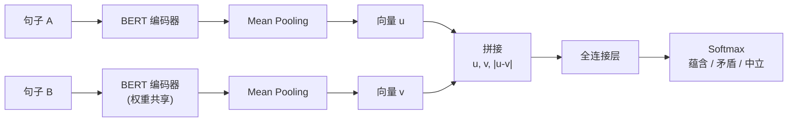
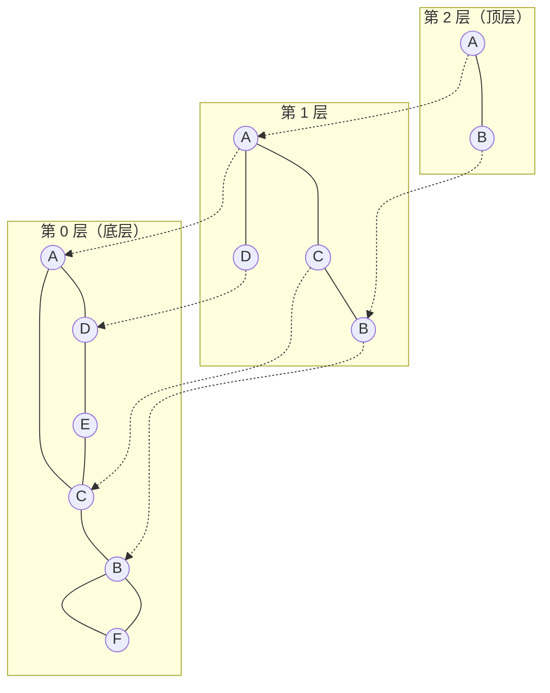
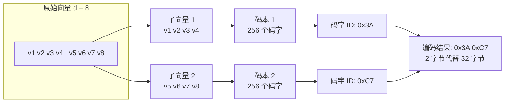

# 嵌入与向量检索

假设你面前有一百万本书，需要从中找出与"深度学习在自然语言处理中的应用"最相关的五本。图书管理员告诉你，他可以在几毫秒内完成这个任务。你可能会想：他是不是对每本书都了如指掌？

实际上，他依赖的不是对内容的记忆，而是一套将文本转换为向量、在向量空间中快速搜索的数学机制。这就是本文要探讨的主题：如何用向量表示文本语义，以及如何在百万甚至亿级向量中实现毫秒级的相似搜索。

将文本转换为向量进行检索的思想，可以追溯到 1970 年代。美国计算机科学家杰拉德·索尔顿（Gerard Salton）在康奈尔大学领导开发了 SMART 信息检索系统，首次提出了向量空间模型（Vector Space Model）。这个模型的核心思想在五十年后的今天看来依然优雅：将文档表示为词频 - 逆文档频率（TF-IDF）加权的稀疏向量，查询与文档的相似度就是两个向量的夹角余弦。尽管这套方法在今天被称为"关键词匹配"，它在当时是革命性的，因为它首次将检索问题纳入了几何计算框架。

1990 年，斯科特·迪尔韦斯特（Scott Deerwester）等人在《美国信息科学学会会刊》上发表了题为《基于潜在语义分析的索引》（Indexing by Latent Semantic Analysis）的论文，引入了潜在语义索引（Latent Semantic Indexing，LSI）。LSI 的洞察是：词频矩阵通过奇异值分解（SVD）降维后，可以在低维空间中捕捉同义词和近义词的语义关联。"汽车"和"轿车"的字面完全不同，但在 LSI 的低维空间中，它们的向量会很接近。这是检索系统从"字面匹配"迈向"语义理解"的关键一步。

真正的范式转移发生在 2013 年。捷克计算机科学家托马斯·米科洛夫（Tomas Mikolov）在谷歌工作期间，发表了题为《在向量空间中高效估计词表示》的论文，提出了 Word2Vec 模型。Word2Vec 的核心发现令整个自然语言处理社区兴奋不已：通过简单的神经网络训练得到的词向量，竟然编码了丰富的语义关系。将"国王"的向量减去"男人"的向量再加上"女人"的向量，结果向量最接近"女王"。词嵌入（Word Embedding）时代就此开启。

2018 年，BERT 的出现将上下文感知的词表示推向了新高度，但 BERT 本身并不直接输出高质量的句子级向量。2019 年，德国达姆施塔特工业大学的尼尔斯·赖默斯（Nils Reimers）和伊琳娜·古列维奇（Iryna Gurevych）提出了 Sentence-BERT，通过孪生网络和对比学习将 BERT 改造为高效的句子嵌入模型，搜索速度比原始 BERT 快了数千倍。

从索尔顿的 VSM 到赖默斯的 Sentence-BERT，再到今天 BGE、E5 等更强大的嵌入模型，这条演进脉络清晰地指向一个方向：让计算机理解文本的"意思"而不仅仅是"字面"。当嵌入模型能够将语义相似的内容映射到向量空间中邻近的位置时，检索就不再是关键词匹配，而是"寻找语义上相关的信息"。这正是 RAG（检索增强生成）系统的基石。

## 从词嵌入到文本嵌入

[前面](../deep-learning/neural-network-structure/forward-propagation.md)已经介绍了词嵌入的基本原理：Word2Vec、GloVe 等模型将每个词映射为一个稠密向量，使得语义相近的词在向量空间中距离相近。然而，在实际的检索场景中，我们需要编码的是句子、段落甚至整篇文档，而非单个词汇。如何从词级嵌入得到文本级嵌入？这是文本检索要解决的第一个问题。

### 词袋式聚合

最朴素的方法是对文本中所有词的嵌入向量取平均。假设一段文本包含 $n$ 个词，每个词的嵌入向量为 $\mathbf{e}_{w_i}$，则文本嵌入 $\mathbf{e}_{\text{doc}}$ 为：

$$\mathbf{e}_{\text{doc}} = \frac{1}{n}\sum_{i=1}^{n} \mathbf{e}_{w_i}$$

这个公式拆开来看含义很直观：将一段文字中所有词的向量在各个维度上取算术平均，得到的向量就是这段文字的"中心"。如果一段文字频繁出现"股票""涨幅""市盈率"等词汇，这些词的向量在金融语义维度上会有较大值，平均后整个文本的向量也被"拉"向了金融方向。

然而，词袋式聚合有一个致命缺陷：它完全丢失了词序信息。"狗咬人"和"人咬狗"由完全相同的词组成，这两个句子的平均词向量完全一致，但语义截然相反。在实际使用中，词袋式聚合通常配合 TF-IDF 权重使用，让关键术语（如专业名词、罕见词）在平均时有更大的发言权，但词序信息的丢失仍无法弥补。这种方法适合对精度要求不高的快速原型验证，难以满足严肃的语义检索需求。

### 句子嵌入模型

要获取更高质量的文本嵌入，需要让模型在编码时"看见"整个上下文。自 2018 年 BERT 问世以来，一个直观的想法是：能否直接用 BERT 输出的 `[CLS]` 向量作为句子表示？毕竟 BERT 在预训练时就被要求用 `[CLS]` 来做句子级分类。

#### Sentence-BERT

遗憾的是，直接用 BERT 的 `[CLS]` 向量做句子相似度计算的效果很差。2020 年，李博（Bohan Li）等人的研究表明，未经微调的 BERT 嵌入存在严重的各向异性（anisotropy）问题：所有句子的向量都倾向于聚集在高维空间中的一个狭窄锥形区域内。这意味着任意两个句子的余弦相似度都偏高（通常在 0.6 到 0.9 之间），相似和不相似的句子难以区分。

Sentence-BERT 的设计就是为了解决这个问题。它的核心思路是：既然原始 BERT 缺乏对句子级语义的判别能力，那就用孪生网络（Siamese Network）结构在句子对数据上做针对性的微调。具体来说，两个句子分别通过同一个 BERT 编码器（权重共享），各自经过 Mean Pooling 层将变长序列转换为固定维度的向量 $\mathbf{u}$ 和 $\mathbf{v}$，然后将这两个向量连同它们的元素差 $|\mathbf{u} - \mathbf{v}|$ 拼接起来，输入一个全连接分类器预测二者的语义关系（蕴含、矛盾、中立）：



Sentence-BERT 在自然语言推理数据集（SNLI、Multi-NLI）上训练后，输出的句子向量在余弦相似度任务上的表现远超原始 BERT。更重要的是，孪生网络结构使得测试时两个句子独立编码，句子向量可以预先计算并存储在索引中，检索时只需编码查询向量即可，相比 BERT 需要将查询与每个候选配对输入的方式，速度提升了数千倍。

#### BGE 与 E5 系列

Sentence-BERT 证明了对比学习微调对句子嵌入质量的决定性作用，此后的发展主要围绕两个方向展开：训练数据的质量和训练目标的精细度。

BGE（BAAI General Embedding）系列由北京智源人工智能研究院（BAAI）推出，其核心贡献是引入了检索场景的硬负例挖掘（Hard Negative Mining）。在训练时，BGE 先从大规模语料中召回与查询"相关但不精确匹配"的文档作为候选负例，再用当前版本的模型筛选出最难区分的负例参与训练。这种"用模型自己的能力挑战模型"的策略让 BGE 学到了更精细的语义边界，在 MTEB（Massive Text Embedding Benchmark）排行榜上取得了领先成绩。

E5（EmbEddings from bidirEctional Encoder rEpresentations）系列由微软提出，强调"文本 - 查询"配对构建方式的重要性。传统做法是对比两个段落，但实际检索场景中查询和文档的分布差异很大（查询往往更短、更口语化）。E5 在训练时显式区分查询侧和文档侧，对查询使用 `query: ` 前缀、对文档使用 `passage: ` 前缀，让模型学会两种不同的编码模式。

#### 主流嵌入模型对比

| 模型 | 维度 | 训练方式 | 语言 | 关键特点 |
|:-----|:----:|:--------:|:----:|:--------:|
| OpenAI text-embedding-3-small | 512/1536 | 闭源对比学习 | 多语言 | 维度可调（Matryoshka 表示） |
| OpenAI text-embedding-3-large | 1024/3072 | 闭源对比学习 | 多语言 | 更高精度，维度可调 |
| BGE-large-zh-v1.5 | 1024 | 对比学习 + 硬负例挖掘 | 中文 | 中文检索任务表现突出 |
| BGE-M3 | 1024 | 多阶段对比学习 | 多语言 | 支持稠密 + 稀疏混合检索 |
| E5-mistral-7b-instruct | 4096 | LLM 监督微调 | 英文 | 基于 Mistral-7B 的高质量嵌入 |
| multilingual-e5-large | 1024 | 对比学习 | 多语言 | 跨语言检索能力 |

### 对比学习：嵌入模型的核心训练范式

无论 Sentence-BERT、BGE 还是 E5，其训练都遵循同一个范式：对比学习（Contrastive Learning）。这个范式的目标可以凝练为一句话：让语义相似的样本在向量空间中靠近，让语义不相似的样本远离。

实现这一目标的核心损失函数是 InfoNCE（Information Noise-Contrastive Estimation）：

$$\mathcal{L} = -\log \frac{\exp(\text{sim}(\mathbf{q}, \mathbf{k}_+)/\tau)}{\sum_{j=1}^{N} \exp(\text{sim}(\mathbf{q}, \mathbf{k}_j)/\tau)}$$

这个公式看着抽象，拆开来看含义很直观：

- $\mathbf{q}$ 是查询（query）向量，可以理解为一个"问题"的嵌入表示
- $\mathbf{k}_+$ 是正样本（positive key）向量，是与查询真正相关的文档的嵌入
- $\mathbf{k}_j$ 是批次中所有 $N$ 个候选向量，其中包含 1 个正样本和 $N-1$ 个负样本
- $\text{sim}(\mathbf{q}, \mathbf{k})$ 是查询与候选之间的相似度得分，通常使用余弦相似度
- $\tau$ 是温度（temperature）参数，控制 softmax 分布的"锐度"
- 分子的 $\exp$ 计算正样本的得分，分母对全部候选的得分求和
- 整体公式可以理解为：在一堆候选文档中，模型有多大把握挑出真正相关的那一篇

温度参数 $\tau$ 的作用值得单独说明。$\tau$ 越小，softmax 分布越"尖锐"，模型对难负例（与查询勉强相关但不是正确答案的样本）的惩罚越重，学到的是更精细的语义区分。$\tau$ 越大，分布越平滑，模型允许一些模糊地带。在 BGE 等模型中，$\tau$ 通常设在 0.01 到 0.05 之间，较小的温度值配合硬负例挖掘能显著提升检索精度。

正负样本的构造质量直接决定嵌入模型的效果。最简单的做法是批次内负采样（In-batch Negatives），将同一批次中其他查询的正样本当作当前查询的负样本，不额外引入计算开销。更高质量的做法是硬负例挖掘：从大规模检索结果中筛选出与查询相关但不匹配的文档作为负例，迫使模型学会区分"似是而非"的语义关系。BGE 的预训练流程就在硬负例挖掘环节投入了大量计算资源，这也是它在 MTEB 排行榜上持续领先的关键原因之一。

### 稀疏嵌入与混合检索

稠密嵌入的语义表达能力毋庸置疑，但在精确匹配场景中它有一个天然短板：用户搜索"PyTorch 2.0 发布说明"时，稠密嵌入可能返回"TensorFlow 最新版本更新"，因为两者在语义空间中都属于"深度学习框架更新"区域。但用户显然需要的是一字不差的 PyTorch 2.0 相关内容。

稀疏嵌入（Sparse Embedding）用另一种思路补上了这个短板。它不再将文本压缩为低维稠密向量，而是保留词汇表大小的维度（通常是数万到数十万维），每个维度对应一个特定词的权重。稀疏嵌入中的非零维度直接告诉我们文本中含有哪些词以及这些词的重要程度。BM25 是稀疏检索的代表性算法，它基于词频和逆文档频率计算词权重，本质上是对 TF-IDF 的概率化改进。SPLADE（SParse Lexical AnD Expansion）更进一步，用神经网络学习词汇权重的分配，同时自动处理同义词扩展。即使原文没有"机器学习"这个词，SPLADE 也可以在对应维度上分配一个恰当的权重。

| 特性 | 稠密嵌入 | 稀疏嵌入 |
|:----:|:--------:|:--------:|
| 维度数 | 128 到 1536 | 数万到数十万（词汇表级别） |
| 语义泛化 | 强，能捕获同义词和释义 | 弱，主要依赖词汇匹配 |
| 精确匹配 | 弱，容易漏掉专有名词和数字 | 强，天然支持逐词匹配 |
| 可解释性 | 差，维度含义不可解释 | 好，维度直接对应词汇 |
| 存储开销 | 低，向量维度小 | 高，需要稀疏存储结构 |

实际检索系统很少在稠密和稀疏之间二选一，而是采用混合检索（Hybrid Search）策略：稠密检索负责语义泛化，稀疏检索负责精确匹配，二者的检索结果通过加权融合得到最终排序。这种"语义理解 + 逐词核对"的组合，正是现代 RAG 系统在检索精度上的关键保障。

## 向量相似度计算

有了文本的向量表示，下一步自然是如何比较两个向量所代表的语义有多"接近"。衡量向量之间关系有三种主流方法，它们各自侧重向量的不同几何属性。

### 余弦相似度

余弦相似度衡量的是两个向量方向的接近程度：

$$\text{cosine}(\mathbf{a}, \mathbf{b}) = \frac{\mathbf{a} \cdot \mathbf{b}}{\|\mathbf{a}\| \|\mathbf{b}\|}$$

这个公式拆开来看含义很直观：分子是向量的点积（方向一致的维度贡献正值，方向相反的贡献负值），分母是两个向量长度的乘积（消除长度的影响）。结果介于 $[-1, 1]$ 之间，1 表示方向完全一致，0 表示正交（不相关），-1 表示方向完全相反。

余弦相似度对向量长度不敏感，这一特性恰好匹配语义检索的需求。当我们说"一个文档与查询相关"时，关注的是文档"谈了什么"（语义方向），而非"谈了多少"（语义强度）。一篇仅 200 字的摘要和一篇 20000 字的综述，只要讨论的是同一主题，它们在语义空间中的方向应该一致。余弦相似度不受篇幅差异的干扰，使其成为语义检索中最常用的相似度度量。

### 欧氏距离

欧氏距离衡量的是向量端点之间的直线距离：

$$d(\mathbf{a}, \mathbf{b}) = \|\mathbf{a} - \mathbf{b}\| = \sqrt{\sum_{i=1}^{d} (a_i - b_i)^2}$$

如果说余弦相似度关心"方向"，欧氏距离则关心"位置"。两个向量即使方向完全相同，如果长度差异巨大，它们的欧氏距离也会很大。在图像检索等场景中，欧氏距离更有优势：两张照片的像素向量若逐像素接近，它们确实应该是同一或相似的图像。当向量已归一化（每个向量的长度均为 1）时，欧氏距离与余弦相似度有确定的关系：$d^2 = 2(1 - \cos)$。此时二者完全等价，选择哪个只看计算习惯。

### 点积

点积是最朴素的向量运算：

$$\mathbf{a} \cdot \mathbf{b} = \sum_{i=1}^{d} a_i b_i$$

它同时受方向、长度两个因素的影响，计算最简单，不需要归一化预处理。当向量已归一化时，点积等价于余弦相似度。点积在推荐系统中特别受欢迎，因为用户和物品向量的长度本身就承载了信息：活跃用户的向量长度更大（有更多行为数据支撑），热门物品的向量长度也更大（被更多人交互过）。点积会自然而然地为热门物品赋予更高得分，这恰好符合推荐系统中"优先推荐经过验证的优质内容"的倾向。语义检索则不应有这种偏差，因此更倾向于使用余弦相似度。

### 度量选择指南

| 度量方式 | 对长度敏感 | 计算复杂度 | 典型应用 | 选择理由 |
|:--------:|:----------:|:----------:|:--------:|:--------:|
| 余弦相似度 | 否 | $O(d)$ | 语义检索、文档相似 | 关注内容方向，消除篇幅影响 |
| 欧氏距离 | 是 | $O(d)$ | 图像检索、聚类 | 对绝对位置差异敏感 |
| 点积 | 是 | $O(d)$ | 推荐系统 | 保留活跃度/热门度信号 |

三种方式的计算复杂度都是 $O(d)$（$d$ 为向量维度），在大规模检索中，计算开销的差异主要来自索引结构而非度量方式本身。因此度量选择的核心考量是应用场景的语义匹配特性，而非计算效率。

## 向量索引：从暴力搜索到近似最近邻

有了相似度计算方法，最直接的检索方式是逐一计算查询向量与数据库中所有向量的距离，排序后取前 $k$ 个结果。这种方法叫暴力搜索（Flat Index），在数据量较小时完全够用：一万条以内，128 维向量的暴力搜索通常能在几毫秒内完成。然而，当数据规模增长到百万、亿级时，每一次查询都需要执行 $n \times d$ 次浮点运算。对于一亿条 768 维的向量，单次查询的计算量约为 768 亿次浮点运算，即便在 GPU 上也要数百毫秒，远超出交互式检索的延迟容忍。

这就是近似最近邻搜索（Approximate Nearest Neighbor，ANN）出场的理由。ANN 做了一个关键妥协：不要求返回"最近的"结果，只要求返回"足够近的"结果。用微小的精度损失（通常低于 1% 的召回率下降）换回数量级的速度提升，这是大规模向量检索在工程上的现实选择。接下来的三节将介绍三种最核心的 ANN 索引技术：倒排索引（IVF）负责缩小搜索范围，图索引（HNSW）负责高效导航，乘积量化（PQ）负责压缩存储。

### 倒排索引 IVF

IVF（Inverted File Index）的思想借鉴了传统搜索引擎中的倒排索引。传统倒排索引是按词找文档，IVF 则是按区域找向量。

IVF 的构建过程如下：先将数据库中的所有向量用 K-Means 聚成 $k$ 个簇，每个簇的质心（Centroid）定义了一个 Voronoi 区域（空间中距离该质心最近的所有点构成的区域）。然后为每个质心维护一个倒排列表（Inverted List），里面存储属于该区域的所有向量的 ID。查询时，不是扫描全部数据库，而是先找到距离查询向量最近的 $n_{\text{probe}}$ 个质心，然后仅在这些质心对应的倒排列表中做精确搜索。

这相当于把整个向量空间分割成了 $k$ 个"辖区"。查询到达时，只派搜索任务到最可能包含答案的那几个辖区，其余辖区一概不理。搜索范围从 $n$ 缩小到了约 $n/k \times n_{\text{probe}}$。

IVF 有两个关键参数需要在召回率和延迟之间权衡。$k$ 是聚类数（也即倒排列表的数量），$k$ 越大意味着每个列表越短，搜索越快，但质心查找的计算开销也会增加。经验法则是 $k = \sqrt{n}$：对于 100 万条向量，设 $k \approx 1000$。$n_{\text{probe}}$ 是查询时需要探测的质心数量，$n_{\text{probe}}$ 越大召回率越高但搜索越慢，经验法则是 $n_{\text{probe}} = \sqrt{k}$。

Voronoi 划分带来效率的同时也带来了一个边界问题：位于两个区域交界处的向量，其真正的最近邻可能恰好落在相邻区域中。如果 $n_{\text{probe}}$ 不够大，没探测到那个相邻区域，真正的最近邻就被遗漏了。针对这个问题，实际使用中常采用残差量化：存储向量时，不存原始向量而存它相对于所属质心的残差（向量减去质心）。残差的分布比原始向量更集中，在边界区域附近的精度损失会减小。

### 图索引 HNSW

如果说 IVF 是对向量空间做显式的分区管理，HNSW（Hierarchical Navigable Small World）则是让向量之间自己"织成一张网"，通过图的邻接关系来引导搜索。

HNSW 的前身是 NSW（Navigable Small World），它的构建方式简单直接：逐个插入向量，每插入一个新向量时，将它连接到图中已有的一些最近邻节点。搜索时从一个随机起点出发，在图上做贪心搜索：每一步跳转到当前节点的邻居中距离查询向量更近的那个节点，无法再靠近时停止。

NSW 的问题是搜索效率高度依赖图结构。如果长距离连接不够多，搜索很容易陷入局部最优。就像用"只走更近一步"的策略从北京导航去上海，走到天津就再也走不动了。

HNSW 的解决方案是为图引入了层级结构。较低的层包含全部节点，连接稠密，负责精确的局部搜索；较高的层只保留部分节点，连接稀疏，负责跨区域的长距离跳跃：



每个节点被分配到第 $l$ 层的概率为 $P(l) = (1/M)^l$，其中 $M$ 是每个节点的最大连接数。这意味着绝大多数节点只存在于最底层，极少数节点"晋升"到高层，恰好对应高速公路网络的结构：大部分路口只在本地道路中出现，只有少部分路口是高速公路的进出口。

搜索从顶层入口点开始，在该层做贪心搜索找到局部最近节点后进入下一层，在新层中从上一层的结束节点继续贪心搜索，如此逐层下降，直到最底层。这种"金字塔逐级缩小范围"的策略让搜索复杂度降至 $O(\log n)$。

HNSW 的参数调优围绕三个量展开：

| 参数 | 含义 | 对索引的影响 |
|:----:|:----:|:-----------:|
| $M$ | 每个节点最大连接数 | 越大，图越稠密，搜索路径越短，内存占用越高；典型值 16 到 64 |
| $ef_{\text{construction}}$ | 构建时候选队列大小 | 越大，图结构质量越高，构建越慢；典型值 100 到 500 |
| $ef_{\text{search}}$ | 搜索时候选队列大小 | 越大，召回率越高，搜索越慢；典型值 16 到 256 |

### 乘积量化 PQ

IVF 和 HNSW 解决了"到哪搜索"的问题，乘积量化（Product Quantization，PQ）则解决"怎么存得更小"的问题。在亿级数据规模下，即便是 128 维的 float32 向量，存储也需要约 50GB，远超单机内存的承受范围。PQ 的目标是将向量压缩 10 到 30 倍，同时尽可能保持搜索精度。

量化的本质是用有限个代表值（码字）近似表示无限的连续值。向量量化（Vector Quantization，VQ）的直接做法是对所有数据库向量做 K-Means 聚类，每个向量用离它最近的码字 ID 来代替。VQ 的问题是码本大小随维度指数增长：若要求近似精度，768 维空间需要的码字数量是天文数字。

PQ 的巧妙之处是将高维分解为低维的组合。将 $d$ 维向量切分为 $m$ 个 $d/m$ 维的子向量，对每个子空间独立做 K-Means 聚类，每个子空间只需 256 个码字（可用 8 bit 索引）。这样一来，原始向量被表示为 $m$ 个 8-bit 码字 ID 的串联：



压缩效果的计算很直观。原始向量占用 $d \times 4$ 字节（float32），PQ 编码后只需 $m \times 1$ 字节（每子空间 8 bit）。压缩比为 $4d/m$：当 $d = 768$、$m = 96$ 时，压缩 32 倍，存储需求从 3KB 降到 96 字节。

搜索时采用非对称距离计算（Asymmetric Distance Computation，ADC）：查询向量保持原始 float32 精度，只压缩数据库向量。先预计算查询向量的每个子向量与对应子空间码本中全部 256 个码字的距离（一个 $m \times 256$ 的查询表），然后对每个数据库向量，查表累加对应码字的距离即可。整个过程不需要将 PQ 编码"解压"回原始向量，距离计算是纯粹的整数索引操作，在 CPU 上非常高效。

## 代码实践：用 FAISS 构建向量检索系统

前面的章节从原理层面讲解了文本嵌入和向量索引的工作机制。理解原理之后，我们需要动手用代码将这些概念串联起来。下面这段代码演示了一个完整的向量检索流程：先生成模拟的文本嵌入，然后分别构建 Flat（暴力搜索）、IVF（倒排索引）和 HNSW（分层图索引）三种索引，最后对比它们在召回率和延迟上的差异。代码使用了 Meta 开源的 FAISS 库，它是目前工业界最广泛使用的向量检索库之一。

```python runnable
import numpy as np
import faiss
import time
import matplotlib.pyplot as plt

# 全局随机种子，保证结果可复现
np.random.seed(42)

# 模拟嵌入数据集
d = 128          # 嵌入向量维度（模拟 BGE-small 的输出）
nb = 100000      # 数据库向量数量
nq = 1000        # 查询向量数量
k = 10           # 返回 Top-K 结果

# 生成归一化的模拟向量（余弦相似度场景）
xb = np.random.random((nb, d)).astype('float32')
xb = xb / np.linalg.norm(xb, axis=1, keepdims=True)
xq = np.random.random((nq, d)).astype('float32')
xq = xq / np.linalg.norm(xq, axis=1, keepdims=True)

print(f"数据集: {nb} 条向量, 维度 {d}")
print(f"查询集: {nq} 条查询, 返回前 {k} 个结果\n")

# ============================================================
# 1. Flat 索引（暴力搜索，100% 召回率，作为基准）
# ============================================================
index_flat = faiss.IndexFlatIP(d)  # IP = Inner Product (归一化后等价余弦相似度)
index_flat.add(xb)

t0 = time.time()
D_flat, I_flat = index_flat.search(xq, k)
flat_time = (time.time() - t0) * 1000 / nq  # 单次查询平均耗时

print(f"[Flat]  单次查询平均耗时: {flat_time:.3f} ms")

# ============================================================
# 2. IVF 索引（倒排索引）
# ============================================================
nlist = int(np.sqrt(nb))  # 聚类数，经验法则 k = sqrt(n)
quantizer = faiss.IndexFlatIP(d)
index_ivf = faiss.IndexIVFFlat(quantizer, d, nlist, faiss.METRIC_INNER_PRODUCT)

index_ivf.train(xb)  # K-Means 聚类训练
index_ivf.add(xb)

# 不同 nprobe 下的召回率和延迟对比
nprobe_list = [1, 2, 5, 10, 20, 50, 100]
ivf_recalls = []
ivf_times = []

for nprobe in nprobe_list:
    index_ivf.nprobe = nprobe
    t0 = time.time()
    D_ivf, I_ivf = index_ivf.search(xq, k)
    t_search = (time.time() - t0) * 1000 / nq

    # 召回率 = IVF 结果与 Flat 基准结果的交集比例
    recall = np.mean([
        len(set(I_ivf[i]) & set(I_flat[i])) / k
        for i in range(nq)
    ])
    ivf_recalls.append(recall)
    ivf_times.append(t_search)

print(f"[IVF]  nlist={nlist}")
for npb, rec, t in zip(nprobe_list, ivf_recalls, ivf_times):
    print(f"  nprobe={npb:3d}: 召回率={rec:.4f}, 延迟={t:.3f} ms")

# ============================================================
# 3. HNSW 索引（分层图索引）
# ============================================================
M = 32  # 每个节点最大连接数
index_hnsw = faiss.IndexHNSWFlat(d, M, faiss.METRIC_INNER_PRODUCT)
index_hnsw.hnsw.efConstruction = 200

index_hnsw.add(xb)

# 不同 ef_search 下的召回率和延迟对比
ef_list = [4, 8, 16, 32, 64, 128, 256]
hnsw_recalls = []
hnsw_times = []

for ef in ef_list:
    index_hnsw.hnsw.efSearch = ef
    t0 = time.time()
    D_hnsw, I_hnsw = index_hnsw.search(xq, k)
    t_search = (time.time() - t0) * 1000 / nq

    recall = np.mean([
        len(set(I_hnsw[i]) & set(I_flat[i])) / k
        for i in range(nq)
    ])
    hnsw_recalls.append(recall)
    hnsw_times.append(t_search)

print(f"\n[HNSW] M={M}, efConstruction=200")
for ef, rec, t in zip(ef_list, hnsw_recalls, hnsw_times):
    print(f"  efSearch={ef:3d}: 召回率={rec:.4f}, 延迟={t:.3f} ms")

# ============================================================
# 可视化：召回率 - 延迟权衡曲线
# ============================================================
fig, ax = plt.subplots(figsize=(10, 6))

ax.plot(ivf_times, ivf_recalls, 'o-', color='#2E86AB', linewidth=2,
        markersize=6, label='IVF (nprobe 递增)')
ax.plot(hnsw_times, hnsw_recalls, 's-', color='#D64045', linewidth=2,
        markersize=6, label='HNSW (efSearch 递增)')

# 标注 Flat 基准
ax.axhline(y=1.0, color='gray', linestyle='--', alpha=0.5, linewidth=1)
ax.text(flat_time + 0.02, 0.997, f'Flat: {flat_time:.2f}ms, 召回率=1.0',
        fontsize=9, color='gray')

ax.set_xlabel('单次查询平均延迟 (ms)', fontsize=12)
ax.set_ylabel('召回率@10', fontsize=12)
ax.set_title('向量索引：召回率与延迟的权衡', fontsize=14)
ax.legend(fontsize=11, loc='lower right')
ax.grid(True, alpha=0.3)
ax.set_xlim(0, max(max(ivf_times), max(hnsw_times)) * 1.15)
ax.set_ylim(0.2, 1.02)

plt.tight_layout()
plt.show()
```

从运行结果可以观察到几个规律。第一，Flat 索引提供 100% 召回率，但延迟最高，它是其他所有索引方法的精度上限。第二，IVF 和 HNSW 都存在清晰的"召回率 - 延迟"权衡曲线：提升参数（`nprobe` 或 `efSearch`）会同时推高召回率和延迟，你需要根据业务场景在这两者之间找到一个合适的平衡点。第三，在相近的召回率水平上，HNSW 通常比 IVF 的延迟更低，代价是索引构建时间和内存占用更高，因为 HNSW 需要在内存中维护完整的图结构。这恰好印证了上一节在索引选型中的判断：没有普适的最优索引，只有最适合当前数据规模和资源约束的选择。

## 索引选型与应用场景

单独使用一种索引技术往往只能覆盖特定规模的需求。实际生产系统通常将多种技术组合起来，取各自的优势互补：

| 组合方式 | 结构 | 核心优势 | 适用场景 |
|:--------:|:----:|:--------:|:--------:|
| IVF-PQ | IVF 聚类 + PQ 压缩 | 搜索范围 + 存储双压缩 | 亿级数据，内存受限 |
| HNSW-PQ | HNSW 图 + PQ 压缩 | 高召回率 + 低存储 | 千万级数据，追求高精度 |
| IVF-HNSW | IVF 分桶 + 桶内 HNSW | 适合分布式部署 | 超大规模分片检索 |

从工程选型的角度看，没有一种索引能在所有场景下胜出。下表按数据规模、内存预算和延迟要求三个维度给出了推荐选择：

| 数据规模 | 内存预算 | 延迟要求 | 推荐索引 | 备注 |
|:--------:|:--------:|:--------:|:--------:|:----:|
| 小于 100 万 | 充足 | 低于 1ms | Flat | 暴力搜索最可靠 |
| 100 万到 1000 万 | 充足 | 低于 5ms | IVF 或 HNSW | HNSW 精度更高 |
| 1000 万到 1 亿 | 有限 | 低于 10ms | IVF-PQ | PQ 压缩必备 |
| 大于 1 亿 | 有限 | 低于 20ms | IVF-HNSW-PQ | 多层分片 + 压缩 |

在实际应用中，不同的业务场景对检索有不同的侧重。RAG 问答系统对召回率要求极高，因为遗漏一篇关键文档可能导致生成出错误答案，通常采用 HNSW 或 IVF-PQ 配合较大的 `efSearch` 或 `nprobe` 参数。推荐系统则更关注延迟，百毫秒级的响应会直接影响用户体验，通常选择轻量级的 IVF 索引并接受小幅度的召回率下降。以图搜图场景中，图像嵌入的维度通常较高（如 2048 维的 ResNet 特征），PQ 压缩带来的存储节省在此时格外重要。去重和版权检测任务要求 100% 精确匹配，稀疏索引（BM25）或 Flat 索引反而比近似索引更合适，因为这类任务不允许任何漏检。

## 本章小结

本文沿着"表示→比较→检索"的技术链路，完整介绍了向量语义检索的核心原理。在表示层，从词袋式聚合的朴素做法出发，看到句子嵌入模型如何通过对比学习将语义编码到向量空间；在比较层，余弦相似度、欧氏距离和点积各有侧重，选择取决于应用场景对向量方向和长度的敏感程度；在检索层，IVF 用聚类缩小搜索范围，HNSW 用层级图高效导航，PQ 用子空间量化压缩存储，三者组合构成了亿级检索的工程标配。

理解这些原理的意义不仅在于能搭建一个向量检索引擎。在 RAG 系统中，检索质量直接影响最终生成答案的准确性，嵌入模型的选择和索引参数的调优是构建高质量 RAG 应用的前置环节。本章尚未覆盖的一个问题是：当检索到的文档过长时，是全部塞入 LLM 的上下文窗口，还是从中提取最相关的片段？这个"后处理"问题将在[下一章](reranking-and-postprocessing.md)中讨论。

## 练习题

1. 使用 Sentence-BERT 或 BGE 模型，将一组你自己选择的句子（至少 10 句，包含语义相似和语义不同的句子对）编码为向量，计算所有句对之间的余弦相似度矩阵。验证语义相似的句子对是否确实获得了更高的相似度得分。

   <details>
   <summary>参考答案</summary>

   ```python
   from sentence_transformers import SentenceTransformer
   import numpy as np

   model = SentenceTransformer('BAAI/bge-small-zh-v1.5')
   sentences = [
       "今天天气很好", "今天是个好天气",       # 语义相似
       "我喜欢吃苹果", "苹果是一种水果",       # 部分相关
       "深度学习改变了NLP", "语言模型的发展",    # 主题相关
       "明天会下雨吗", "天气预报说",            # 语义相关
       "电影很精彩", "这部电影非常无聊",        # 语义相反
   ]
   embeddings = model.encode(sentences, normalize_embeddings=True)
   sim_matrix = embeddings @ embeddings.T
   print("相似度矩阵:")
   print(np.round(sim_matrix, 3))
   ```
   </details>

2. 使用 FAISS 在至少 10 万条随机向量上分别构建 Flat、IVF 和 HNSW 索引，对比三者在不同参数配置下的召回率和搜索延迟。

   <details>
   <summary>参考答案</summary>

   ```python runnable
   import numpy as np
   import faiss, time

   d, nb, nq, k = 128, 100000, 500, 10
   np.random.seed(42)
   xb = np.random.random((nb, d)).astype('float32')
   xq = np.random.random((nq, d)).astype('float32')

   # Flat 基准
   index_flat = faiss.IndexFlatL2(d)
   index_flat.add(xb)
   _, I_gt = index_flat.search(xq, k)

   # IVF
   nlist = 317
   index_ivf = faiss.IndexIVFFlat(faiss.IndexFlatL2(d), d, nlist)
   index_ivf.train(xb); index_ivf.add(xb)

   for nprobe in [1, 5, 10, 50]:
       index_ivf.nprobe = nprobe
       t0 = time.time()
       _, I = index_ivf.search(xq, k)
       t = (time.time() - t0) / nq * 1000
       recall = np.mean([len(set(I[i]) & set(I_gt[i])) / k for i in range(nq)])
       print(f"IVF  nprobe={nprobe:2d}: 召回率={recall:.4f}, 延迟={t:.3f}ms")

   # HNSW
   index_hnsw = faiss.IndexHNSWFlat(d, 32)
   index_hnsw.hnsw.efConstruction = 200
   index_hnsw.add(xb)
   # ... 类似测试
   ```
   </details>

3. 画出 IVF 的 $n_{\text{probe}}$ 和 HNSW 的 $ef_{\text{search}}$ 对应的召回率 - 延迟权衡曲线，找出在你的数据集上达到 95% 召回率所需的最小参数值。

   <details>
   <summary>参考答案</summary>

   参考代码实践一节中的可视化代码。在典型配置（128 维、10 万条向量）下，IVF 达到 95% 召回率约需 `nprobe=50`，HNSW 达到同样召回率约需 `efSearch=32`。这些值因数据分布和嵌入维度的不同而变化，实际使用时应在自己的数据集上做基准测试。
   </details>

4. 使用 IVF-PQ 索引，在 100 万条向量上对比不同 $m$（子向量数）取值下的压缩比和召回率损失。注意观察 $m$ 较小（子空间更大）和 $m$ 较大（子空间更小）时召回率的差异，思考背后的原因。

   <details>
   <summary>参考答案</summary>

   当 $m$ 较小时，每个子空间的维度较高，K-Means 聚类难以用 256 个码字充分覆盖子空间的所有模式，导致量化误差增大、召回率下降。当 $m$ 较大（接近 $d$）时，每个子空间维度极低（甚至只有 1 维），量化精度提升但压缩比下降。实际使用中需要在压缩比和召回率之间折衷，通常取 $m = d/8$ 左右（即每 8 维用一个 8-bit 码字表示）。
   </details>
