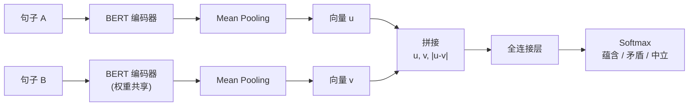
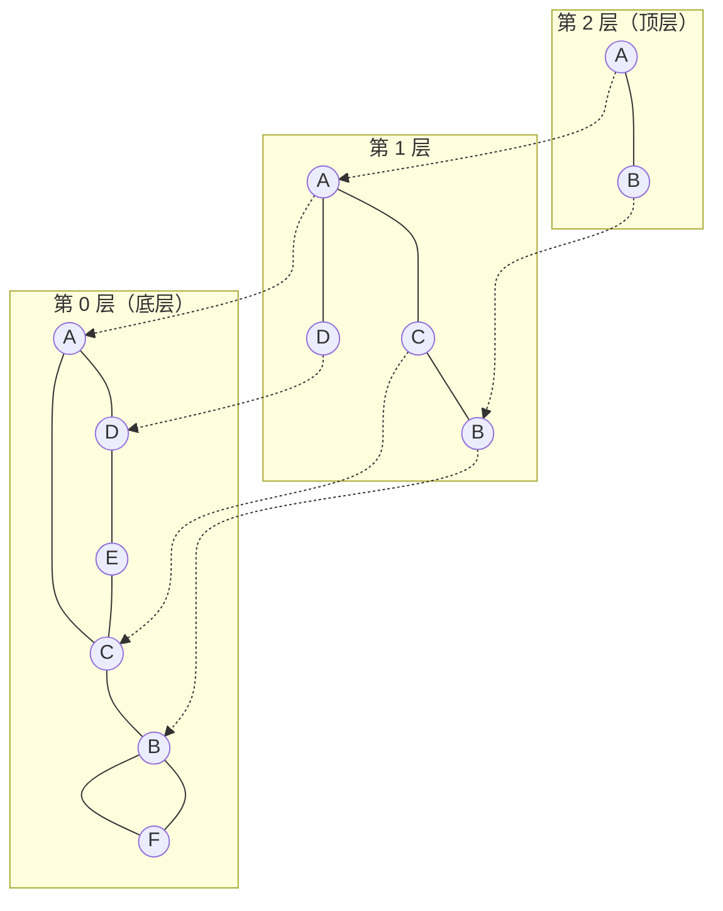
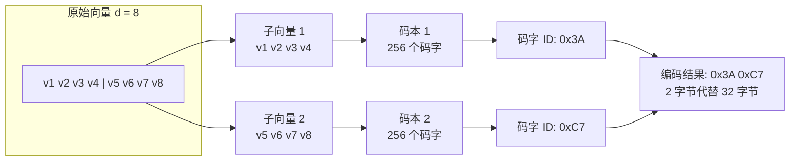

# 嵌入与向量检索

语言模型从海量文本中学习模式和知识，并将这些知识存储在模型参数中。这种知识内化的方式决定了模型知道的一切都来自训练数据，训练数据截止之后发生的事它无从知晓，企业内部的私有文档它从未读过，专业领域的小众知识它也未必在训练时见过。既然模型不可能记住所有知识，当用户提出超过它所知范围的问题时，系统就应该先从外部知识库中检索出相关的信息，然后将这些信息连同问题一起交给语言模型，让模型基于检索到的素材生成答案。这就是**检索增强生成**（Retrieval-Augmented Generation，RAG）的基本思想。

RAG 把问题拆成了生成和检索两件事。生成由语言模型完成，这部分前面已经用大量篇幅详细讲解过。检索则是本章的主题，我们会讨论如何用向量表示文本的语义，以及如何在海量文档中快速找到与查询语义最相关的内容。

## 嵌入模型的发展

将文本转换为向量进行检索的思想，可以追溯到 1970 年代。美国计算机科学家杰拉德·索尔顿（Gerard Salton）在康奈尔大学领导开发的 SMART 信息检索系统，首次提出了**向量空间模型**（Vector Space Model，VSM）。这个模型的思想在五十年后的今天依然出现在教科书中。它将文档表示为[词频 - 逆文档频率](https://en.wikipedia.org/wiki/Tf%E2%80%93idf)（TF-IDF）加权的稀疏向量，查询与文档的相似度就是计算两个向量的[余弦相似度](../../maths/linear/vectors.md#内积与投影)。这套方法在今天看来实际上就是关键词匹配，但在当时是革命性的，因为它首次将检索问题纳入了几何计算框架。

1990 年，斯科特·迪尔韦斯特（Scott Deerwester）等人在 JASIS 上发表了题为《Indexing by Latent Semantic Analysis》的论文，提出了潜在语义索引（Latent Semantic Indexing，LSI）。LSI 发现词频矩阵通过[奇异值分解](../../statistical-learning/unsupervised-learning/dimensionality-reduction.md#奇异值分解)降维后，可以在低维空间中捕捉同义词和近义词的语义关联。"苹果"和"橘子"的字面上完全不同，但在 LSI 的低维空间中，它们的向量会很接近。这是检索系统从字面上的关键词匹配迈向语义理解的重要一步。

真正的范式变革发生在 2013 年。捷克计算机科学家托马斯·米科洛夫（Tomas Mikolov）在谷歌工作期间，发表了题为《Efficient Estimation of Word Representations in Vector Space》的论文，提出了 Word2Vec 模型。通过简单的神经网络训练得到的词向量，却编码了丰富的语义关系。将"国王"的向量减去"男人"的向量再加上"女人"的向量，结果向量最接近"女王"。[词嵌入](../../deep-learning/sequence-models/word-embedding.md)（Word Embedding）时代就此开启。

2018 年，BERT 的出现将上下文感知的词表示推向了新高度。德国达姆施塔特工业大学的尼尔斯·赖默斯（Nils Reimers）和伊琳娜·古列维奇（Iryna Gurevych）在 BERT 基础上提出了 Sentence-BERT，通过孪生网络和对比学习将 BERT 改造为高效的句子嵌入模型，搜索速度比原始 BERT 快了数千倍。

从 VSM 到 Sentence-BERT，再到今天 BGE、E5 等更强大的嵌入模型，这条演进脉络让计算机得以理解文本的内在含义而不仅仅是字面意思。当嵌入模型能够将语义相似的内容映射到向量空间中邻近的位置时，检索就不再是关键词匹配，而是寻找语义上相关的信息。这是检索增强生成系统得以诞生的必要前提条件。

## 从词嵌入到文本嵌入

[在语言模型与分词](../../language-models/architecture-basics/language-model-tokenization.md)中介绍了词嵌入的基本原理，Word2Vec、GloVe 等模型将每个词映射为一个稠密向量，使得语义相近的词在向量空间中距离相近。然而，在实际的检索场景中，我们通常要编码的是句子、段落甚至整篇文档，而非单个词汇。如何从词级嵌入得到文本级嵌入是文本检索要解决的第一个问题。

### 词袋式聚合

最朴素的方法是对文本中所有词的嵌入向量取平均值作为该文本的嵌入向量。将一段文字中所有词的向量在各个维度上取算术平均，得到的向量就是这段文字的"中心"。假设一段文本包含 $n$ 个词，每个词的嵌入向量为 $\mathbf{e}_{w_i}$，则文本嵌入 $\mathbf{e}_{doc}$ 为：

$$\mathbf{e}_{doc} = \frac{1}{n}\sum_{i=1}^{n} \mathbf{e}_{w_i}$$

如果一段文字频繁出现"股票"、"涨幅"、"市盈率"等词汇，这些词的向量在金融语义维度上会有较大值，平均后整个文本的向量也被拉向了金融方向。然而，词袋式聚合有一个致命缺陷：它完全丢失了词序信息。"狗咬人"和"人咬狗"由完全相同的词组成，这两个句子的平均词向量完全一致，但语义截然不同。在实际使用中，词袋式聚合通常会配合 TF-IDF 权重使用，让关键术语（如专业名词、罕见词）在平均时有更大的发言权，但词序信息的丢失仍无法弥补。这种方法适合对精度要求不高的快速原型验证，难以满足严肃的语义检索需求。

### 句子嵌入模型

要获取更高质量的文本嵌入，需要让模型在编码时看见整个上下文。自 2018 年 [BERT](../../language-models/architecture-basics/transformer-architecture.md#纯编码器路线-bert) 问世以来，曾有多位学者尝试过直接用 BERT 输出的 `[CLS]` 向量作为句子表示。毕竟 BERT 在预训练时就被要求用 `[CLS]` 来做句子级的语义分类。

#### Sentence-BERT

遗憾的是，直接用 BERT 的 `[CLS]` 向量做句子相似度计算的效果很差。研究表明，未经微调的 BERT 嵌入存在严重的各向异性（Anisotropy）问题，所有句子的向量都倾向于聚集在高维空间中的一个狭窄锥形区域内。这意味着任意两个句子的余弦相似度都偏高（通常在 0.6 到 0.9 之间），语义相似和不相似的句子难以区分。

Sentence-BERT 就是为了解决这个问题而设计的。原始 BERT 缺乏对句子级语义的判别能力，Sentence-BERT 采用了孪生网络（Siamese Network）结构来做针对性的微调。所谓孪生网络，是指将同一个编码器复制为左右两条前向通路，分别接收两个输入、各自产出向量，然后在顶端汇合比较。两条通路共享同一份权重参数，物理上只有一份模型副本，但计算图拓扑上形成了对称的双分支结构，因此得名"孪生"。Sentence-BERT 让两个句子分别通过同一个 BERT 编码器，再各自经过 Mean Pooling 层，对每个句子中每个 token 的向量逐维度取算术平均值，将变长序列转换为固定维度的向量 $\mathbf{u}$ 和 $\mathbf{v}$。然后将这两个向量连同它们的元素差 $|\mathbf{u} - \mathbf{v}|$ 拼接起来，输入一个全连接分类器预测二者的语义关系（蕴含、矛盾、中立）。如下图所示。


*图：Sentence-BERT 工作过程*

Sentence-BERT 在自然语言推理数据集（SNLI、Multi-NLI）上训练后，输出的句子向量在余弦相似度任务上的表现远超原始 BERT。更重要的是，孪生网络结构使得测试时两个句子独立编码，句子向量可以预先计算并存储在索引中，检索时只需编码查询向量即可，相比 BERT 需要将查询与每个候选配对输入的方式，速度提升了数千倍。

#### BGE 与 E5 系列

Sentence-BERT 证明了对比学习微调对句子嵌入质量的决定性作用，此后的发展主要围绕训练数据的质量和训练目标的精细度两个方向展开。BGE 与 E5 系列模型是其中的代表：

- BGE（BAAI General Embedding）系列由北京智源人工智能研究院（BAAI）推出，其主要贡献是引入了检索场景的硬负例挖掘（Hard Negative Mining）。在训练时，BGE 先从大规模语料中召回与查询相关但未能精确匹配的文档作为候选负例，再用当前版本的模型筛选出最难区分的负例参与训练。这种用模型自己的能力挑战模型的策略让 BGE 学到了更精细的语义边界，在 MTEB（Massive Text Embedding Benchmark）排行榜上取得了领先成绩。

- E5（EmbEddings from bidirEctional Encoder rEpresentations）系列由微软提出，强调"文本 - 查询"配对构建方式的重要性。传统检索的做法是直接对比两个段落的相似度，但实际检索场景中查询和文档的分布差异很大（查询往往更短、更口语化）。E5 在训练时显式区分查询侧和文档侧，对查询使用 `query: ` 前缀、对文档使用 `passage: ` 前缀，让模型学会两种不同的编码模式。

### 对比学习

无论 Sentence-BERT、BGE 还是 E5，其训练都是建立在**对比学习**（Contrastive Learning）的训练范式之上。这个范式的目标是让语义相似的样本在向量空间中靠近，让语义不相似的样本远离。实现这一目标的核心损失函数是 InfoNCE（Information Noise-Contrastive Estimation），其数学表示为：

$$\mathcal{L} = -\log \frac{\exp(sim(\mathbf{q}, \mathbf{k}_+)/\tau)}{\sum_{j=1}^{N} \exp(sim(\mathbf{q}, \mathbf{k}_j)/\tau)}$$

从公式的结构上可以看出 InfoNCE 实质上是一个带温度参数 $\tau$ 的 Softmax 函数。公式中 $\mathbf{q}$ 是查询（Query）向量，可以理解为一个问题的嵌入表示。$\mathbf{k}$ 是批次中所有 $N$ 个候选向量，其中包含 1 个正样本（以 $\mathbf{k}_+$ 表示）和 $N-1$ 个负样本。函数 $sim(\mathbf{q}, \mathbf{k})$ 是查询与候选之间的相似度得分，通常使用余弦相似度来表示。

温度参数 $\tau$ 控制分布的平滑程度。$\tau$ 越小，Softmax 分布越尖锐，模型对难负例（与查询勉强相关但不是正确答案的样本）的惩罚越重，学到的是更精细的语义区分。$\tau$ 越大，分布越平滑，模型允许一些模糊地带。在 BGE 等模型中，$\tau$ 通常设在 0.01 到 0.05 之间，较小的温度值配合硬负例挖掘能显著提升检索精度。

正负样本的构造质量直接决定嵌入模型的效果。比较简单的做法是批次内负采样（In-Batch Negatives），将同一批次中其他查询的正样本当作当前查询的负样本，不额外引入计算开销。更高质量的做法是硬负例挖掘。从大规模检索结果中筛选出与查询相关但不匹配的文档作为负例，迫使模型学会区分似是而非的语义关系。BGE 的预训练流程就在硬负例挖掘环节投入了大量计算资源，这也是它在 MTEB 排行榜上持续领先的关键原因之一。

### 稀疏嵌入与混合检索

稠密嵌入（Dense Embedding）是指将文本映射为低维连续向量（通常是 128 到 1536 维），向量中的每个维度都是一个实数，所有维度共同编码文本的语义信息。这种表示方式得名于向量中几乎没有零值，信息稠密地分布在整个向量空间中。与之相对的是稀疏嵌入（Sparse Embedding），向量中大部分维度为零，只有少数维度携带非零权重。

稠密嵌入的语义表达能力毋庸置疑，但在精确匹配场景中它有一个天然短板，譬如用户搜索"PyTorch 2.0 发布说明"时，稠密嵌入可能返回"TensorFlow 最新版本更新"，因为两者在语义空间中都属于"深度学习框架更新"区域。但用户显然需要的是一字不差的 PyTorch 2.0 相关内容。稀疏嵌入补上了这个短板。它不再将文本压缩为低维稠密向量，而是保留词表大小的维度（这里的词表不是 BPE、WordPiece 这些[分词算法](../../language-models/architecture-basics/language-model-tokenization.md#分词算法)产生的词表，而是指文档中出现的不同词条汇总形成的词汇表，通常是数万到数十万维），每个维度对应一个特定词的权重。稀疏嵌入中的非零维度直接告诉我们文本中含有哪些词以及这些词的重要程度。

BM25 是稀疏检索的代表性算法，它的全称是 Okapi BM25，由英国伦敦城市大学的斯蒂芬·罗伯逊（Stephen Robertson）和凯伦·斯帕克·琼斯（Karen Spärck Jones）等人在 20 世纪 90 年代提出。它的前身可以追溯到斯帕克·琼斯 1972 年提出的 IDF（逆文档频率）概念，琼斯在信息检索领域的开创性贡献为她赢得了 2004 年 ACL 终身成就奖。BM25 是 TF-IDF 的改进版本，引入了文档长度归一化和词频饱和控制，让评分体系更符合实际检索中的直觉：文档中一个词出现一次很重要，出现两次更重要，但出现一千次并不会比出现十次重要一百倍。

逆文档频率含义是一个词如果出现在几乎所有文档中，它区分文档的能力就应该更弱才对。如果用 $IDF(t)$ 表示逆文档频率，$f(t, d)$ 为词项 $t$ 在文档 $d$ 中出现的实际频率，$|d|$ 是当前文档长度，$avgdl$ 是所有文档的平均长度，则 BM25 分数的计算公式为：

$$BM25(q, d) = \sum_{t \in q} IDF(t) \cdot \frac{f(t, d) \cdot (k_1 + 1)}{f(t, d) + k_1 \cdot (1 - b + b \cdot |d| / avgdl)}$$

BM25 公式中有两个控制参数：参数 $k_1$ 控制着词频的饱和速度，通常取 1.2～2.0。当 $k_1 = 0$ 时词频完全不起作用，BM25 退化为 IDF 排序。当 $k_1$ 很大时词频接近线性增长。参数  $b$ 控制文档长度归一化的强度，取值在 $[0, 1]$，通常取 0.75。当 $b = 0$ 时完全不考虑文档长度，当 $b = 1$ 时完全归一化到平均长度。

BM25 在精确匹配场景中至今没有真正的替代者。专有名词、产品编号、技术术语的检索几乎总是稀疏检索更优，这类场景中语义模糊只会带来噪声。如何在保持稀疏索引高效性的同时获得了一定的语义泛化能力，是 BM25 的现代升级方向。下表对比了稠密嵌入与稀疏嵌入在各个维度上的优劣势：

| 特性 | 稠密嵌入 | 稀疏嵌入 |
|:----:|:--------:|:--------:|
| 维度数 | 128 到 1536 | 数万到数十万（词汇表级别） |
| 语义泛化 | 强，能捕获同义词和释义 | 弱，主要依赖词汇匹配 |
| 精确匹配 | 弱，容易漏掉专有名词和数字 | 强，天然支持逐词匹配 |
| 可解释性 | 差，维度含义不可解释 | 好，维度直接对应词汇 |
| 存储开销 | 低，向量维度小 | 高，需要稀疏存储结构 |

实际检索系统很少在稠密和稀疏之间排他性地二选其一，而是采用混合检索（Hybrid Search）策略，稠密检索负责语义泛化，稀疏检索负责精确匹配，二者的检索结果通过加权融合得到最终排序。这种"语义理解 + 逐词核对"的组合，正是现代 RAG 系统在检索精度上的关键保障。

## 向量索引

最直接的向量检索方式是逐一计算查询向量与数据库中所有向量的距离，排序后取前 $k$ 个结果。这种暴力搜索（Flat Index）方法在数据量较小时完全够用。一万条以内，128 维向量的暴力搜索通常能在几毫秒内完成。然而，当数据规模增长到百万、千万甚至亿级时，每一次查询都需要执行 $n \times d$ 次浮点运算。对于一亿条 768 维的向量，单次查询的计算量约为 768 亿次浮点运算，即便在 GPU 上也要数百毫秒，远超出交互式检索的延迟容忍。

面对随着数据膨胀的计算量，学术界提出了**近似最近邻搜索**（Approximate Nearest Neighbor，ANN）算法。ANN 在检索精度上做了一定妥协，不要求返回"最相近"的结果，只要求返回"足够接近的"结果。用微小的精度损失（通常低于 1% 的召回率下降）换回数量级的速度提升，这是大规模向量检索在工程上的现实权衡。接下来将介绍三种最核心的 ANN 索引技术：倒排索引（IVF）负责缩小搜索范围，图索引（HNSW）负责高效导航，乘积量化（PQ）负责压缩存储。

### 倒排索引

**倒排索引**（Inverted File Index，IVF）是从传统搜索引擎中借鉴过来的概念。传统倒排索（Inverted Index，这两个词中文翻译一样，要视语境区分）引是按词找文档，IVF 则是按区域找向量。先将数据库中的所有向量用 [K-Means](../../statistical-learning/unsupervised-learning/clustering.md#k-means-数学原理) 聚成 $k$ 个簇，每个簇的质心（Centroid）定义了一个 Voronoi 区域（空间中距离该质心最近的所有点构成的区域）。然后为每个质心维护一个倒排列表（Inverted List），里面存储属于该区域的所有向量的 ID。查询时，不是扫描全部数据库，而是先找到距离查询向量最近的 $n_{probe}$ 个质心，然后仅在这些质心对应的倒排列表中做精确搜索。这相当于把整个向量空间分割成了 $k$ 个辖区。查询到达时，只派搜索任务到最可能包含答案的那几个辖区，其余辖区一概不理。搜索范围从 $n$ 缩小到了约 $n/k \times n_{probe}$。

IVF 有两个关键参数需要在召回率和延迟之间权衡。$k$ 是聚类数（也即倒排列表的数量），$k$ 越大意味着每个列表越短，搜索越快，但质心查找的计算开销也会增加。经验法则是 $k = \sqrt{n}$，对于 100 万条向量，设 $k \approx 1000$。$n_{probe}$ 是查询时需要探测的质心数量，$n_{probe}$ 越大召回率越高，但搜索越慢，经验法则是 $n_{probe} = \sqrt{k}$。

Voronoi 划分带来效率的同时也带来了一个边界问题。位于两个区域交界处的向量，其真正的最近邻可能恰好落在相邻区域中。如果 $n_{probe}$ 不够大，没探测到那个相邻区域，真正的最近邻就被遗漏了。针对这个问题，实际使用中常采用残差量化。存储向量时，不存原始向量而存它相对于所属质心的残差（向量减去质心）。残差的分布比原始向量更集中，在边界区域附近的精度损失会减小。

### 图索引

如果说倒排索引是对向量空间做显式的分区管理，**图索引**（Hierarchical Navigable Small World，HNSW）则是让向量之间自己织成一张网，通过图的邻接关系来引导搜索。HNSW 的构建和查询用的是同一套贪心搜索逻辑，构建时把新向量当作查询向量在已有的图上搜索最近邻，然后建立连接。查询时用同样的方式在建成后的图上导航。HNSW 改进自更基础的 NSW（Navigable Small World）算法。它的构建过程是逐个插入向量，每插入一个新向量时，以它为查询向量在已建好的部分图上做贪心搜索。从一个随机起点出发，每一步跳转到当前节点的邻居中距离查询向量更近的那个节点，无法再靠近时停止，最后将新节点与这些搜索到的最近邻相连。换句话说，图是边搜索边生长的。已经插入的节点构成了图，新节点借助这张图找到自己的位置，然后把自己织进去，为后续插入的节点提供更多的连接路径。查询阶段的搜索与此完全相同，只是不再修改图结构。

NSW 的问题是搜索效率高度依赖图结构。如果长距离连接不够多，搜索很容易陷入局部最优。就像以"只选择距离目的地直线距离最近的站点"为导航策略，从北京导航去上海，结果是走到天津就没有了陆路，再也走不动了。HNSW 的解决方案是为图引入了层级结构。较低的层包含全部节点，连接稠密，负责精确的局部搜索。较高的层只保留部分节点，连接稀疏，负责跨区域的长距离跳跃，如下图所示：


*图：图层级结构*

每个节点被分配到第 $l$ 层的概率为 $P(l) = (1/M)^l$，其中 $M$ 是每个节点的最大连接数。这意味着绝大多数节点只存在于最底层，极少数节点晋升到高层。这恰好对应高速公路网络的结构，大部分路口只在本地道路中出现，只有少部分路口是高速公路的进出口。搜索从顶层入口点开始，在该层做贪心搜索找到局部最近节点后进入下一层，在新层中从上一层的结束节点继续贪心搜索，如此逐层下降，直到最底层。这种金字塔逐级缩小范围的策略让搜索复杂度降至 $O(\log n)$。

### 乘积量化

倒排索引和图索引解决了如何搜索的问题，**乘积量化**（Product Quantization，PQ）则解决如何存储的问题。在亿级数据规模下，即便是 128 维的 FP32 向量，存储也需要数十 GB 的空间，超过了超单机内存的承受范围。PQ 的目标是大幅压缩向量存储空间（通常为 10 到 30 倍），同时尽可能保持搜索精度。

量化的本质是用有限个代表值（称为"码字"，码字的全集称为"码本"）近似表示无限的连续值。向量量化（Vector Quantization，VQ）的做法是对所有数据库向量做 K-Means 聚类，每个向量用离它最近的码字 ID 来代替。这种做法的缺陷在于码本大小随维度指数增长。假设把一维空间均匀划分，每个维度方向切成 $k$ 段，那么一维空间需要 $k$ 个码字来覆盖，二维空间需要 $k^2$ 个（想象一个 $k \times k$ 的网格），三维空间需要 $k^3$ 个。推广到 $d$ 维，需要 $k^d$ 个码字。即便取最粗糙的 $k = 2$（每个维度只分两段），768 维空间也意味着 $2^{768} \approx 10^{231}$ 个码字，远远超过可观测宇宙中的原子总数（约 $10^{80}$）。若想达到实用级别的近似精度，$k$ 至少需要几十甚至上百，这个数字会更庞大。PQ 的巧妙之处是将高维分解为低维的组合。将 $d$ 维向量切分为 $m$ 个 $d/m$ 维的子向量，对每个子空间独立做 K-Means 聚类，每个子空间只需 256 个码字（可用 8 bit 索引）。这样一来，原始向量被表示为 $m$ 个 8 bit 码字 ID 的串联：



PQ 的压缩效果可以直观地计算出来。假设原始向量占用 $d \times 4$ 字节（FP32 精度），PQ 编码后只需 $m \times 1$ 字节（每子空间 8 bit）。压缩比为 $4d/m$，当 $d = 768$、$m = 96$ 时，压缩 32 倍，存储需求从 3KB 降到 96 字节。

搜索时采用**非对称距离计算**（Asymmetric Distance Computation，ADC），查询向量保持原始 FP32 精度，只压缩数据库向量。先预计算查询向量的每个子向量与对应子空间码本中全部 256 个码字的距离（一个 $m \times 256$ 的查询表），然后对每个数据库向量，查表累加对应码字的距离即可。整个过程中都不需要将 PQ 编码解压回原始向量，距离计算是纯粹的整数索引操作，在 CPU 上有非常高的效率。

## 代码实践：构建向量检索系统

前面的章节从原理层面讲解了文本嵌入和向量索引的工作机制。理解原理之后，我们需要动手用代码将这些概念串联起来。下面这段代码演示了一个完整的向量检索流程：先生成模拟的文本嵌入，然后分别构建 Flat（暴力搜索）和 IVF（倒排索引）两种索引，对比它们在召回率和延迟上的差异。代码使用 SciKit-Learn 提供的近邻搜索模块来实现这些索引结构。

```python runnable
import numpy as np
from sklearn.neighbors import NearestNeighbors
from sklearn.cluster import MiniBatchKMeans
import time
import matplotlib.pyplot as plt

# 全局随机种子，保证结果可复现
np.random.seed(42)

# 模拟嵌入数据集
d = 128          # 嵌入向量维度（模拟某 128 维轻量嵌入模型的输出）
nb = 50000       # 数据库向量数量
nq = 200         # 查询向量数量
k = 10           # 返回 Top-K 结果

# 生成归一化的模拟向量（余弦相似度场景）
xb = np.random.random((nb, d)).astype('float32')
xb = xb / np.linalg.norm(xb, axis=1, keepdims=True)
xq = np.random.random((nq, d)).astype('float32')
xq = xq / np.linalg.norm(xq, axis=1, keepdims=True)

print(f"数据集: {nb} 条向量, 维度 {d}")
print(f"查询集: {nq} 条查询, 返回前 {k} 个结果\n")

# ============================================================
# 1. Flat 索引（暴力搜索，100% 召回率，作为基准）
# ============================================================
# metric='cosine' 使用余弦距离；向量已归一化，余弦距离 = 1 - 内积
nn_flat = NearestNeighbors(n_neighbors=k, algorithm='brute', metric='cosine')
nn_flat.fit(xb)

t0 = time.time()
distances_flat, I_flat = nn_flat.kneighbors(xq)
flat_time = (time.time() - t0) * 1000 / nq  # 单次查询平均耗时

print(f"[Flat]  单次查询平均耗时: {flat_time:.3f} ms")

# ============================================================
# 2. IVF 索引（倒排索引，基于 K-Means 聚类手动实现）
# ============================================================
nlist = int(np.sqrt(nb))  # 聚类数，经验法则 k = sqrt(n)
kmeans = MiniBatchKMeans(n_clusters=nlist, random_state=42, batch_size=1024)
cluster_labels = kmeans.fit_predict(xb)
centroids = kmeans.cluster_centers_.astype('float32')
centroids = centroids / np.linalg.norm(centroids, axis=1, keepdims=True)  # 归一化质心才能用内积算余弦距离

# 为每个簇建立倒排列表：存储属于该簇的所有向量 ID
inverted_lists = {i: np.where(cluster_labels == i)[0] for i in range(nlist)}

# 不同 nprobe 下的召回率和延迟对比
nprobe_list = [1, 2, 5, 10, 20, 50, 100]
ivf_recalls = []
ivf_times = []

for nprobe in nprobe_list:
    t0 = time.time()
    I_ivf = np.full((nq, k), -1, dtype=np.int64)
    
    # 批量计算每个查询到所有质心的余弦距离（归一化后余弦距离 = 1 - 内积）
    centroid_dists = 1.0 - xq @ centroids.T
    nearest_centroids = np.argpartition(centroid_dists, nprobe, axis=1)[:, :nprobe]
    
    for i in range(nq):
        # 收集 nprobe 个最近簇中的所有候选向量 ID
        cand_ids = np.concatenate([inverted_lists[c] for c in nearest_centroids[i]])
        # 在候选集中用内积搜索（归一化后内积越大越相似）
        sims = xb[cand_ids] @ xq[i]
        n_select = min(k, len(sims))
        if n_select == 0:
            continue
        top_k = np.argpartition(-sims, n_select - 1)[:n_select]
        top_k = top_k[np.argsort(-sims[top_k])]
        I_ivf[i, :n_select] = cand_ids[top_k]
    
    t_search = (time.time() - t0) * 1000 / nq
    
    # 召回率 = IVF 结果与 Flat 基准结果的交集比例
    recall = np.mean([
        len(set(I_ivf[i]) & set(I_flat[i])) / k
        for i in range(nq)
    ])
    ivf_recalls.append(recall)
    ivf_times.append(t_search)

print(f"[IVF]  nlist={nlist}")
for npb, rec, t in zip(nprobe_list, ivf_recalls, ivf_times):
    print(f"  nprobe={npb:3d}: 召回率={rec:.4f}, 延迟={t:.3f} ms")

# ============================================================
# 可视化：召回率 - 延迟权衡曲线
# ============================================================
fig, ax = plt.subplots(figsize=(10, 6))

ax.plot(ivf_times, ivf_recalls, 'o-', color='#2E86AB', linewidth=2,
        markersize=6, label='IVF (nprobe 递增)')

# 标注 Flat 基准
ax.axhline(y=1.0, color='gray', linestyle='--', alpha=0.5, linewidth=1)
ax.text(flat_time + 0.02, 0.997, f'Flat: {flat_time:.2f}ms, 召回率=1.0',
        fontsize=9, color='gray')

ax.set_xlabel('单次查询平均延迟 (ms)', fontsize=12)
ax.set_ylabel('召回率@10', fontsize=12)
ax.set_title('向量索引：召回率与延迟的权衡', fontsize=14)
ax.legend(fontsize=11, loc='lower right')
ax.grid(True, alpha=0.3)
ax.set_xlim(0, max(ivf_times) * 1.15)
ax.set_ylim(0.2, 1.02)

plt.tight_layout()
plt.show()
```

从运行结果可以观察到几个规律。Flat 索引提供 100% 召回率，它是其他近似方法的精度上限。IVF 存在清晰的"召回率 - 延迟"权衡曲线。提升 `nprobe` 参数会同时推高召回率和延迟，你需要根据业务场景在两者之间找到一个合适的平衡点。此外，IVF 的召回率增长速度并非线性，`nprobe` 较小时每增加一点探测都能换来显著的召回提升，但接近 1.0 时边际收益递减。

## 索引选型与应用场景

单独使用一种索引技术往往只能覆盖特定规模的需求。实际生产系统通常将多种技术组合起来，取长补短：

| 组合方式 | 结构 | 核心优势 | 适用场景 |
|:--------:|:----:|:--------:|:--------:|
| IVF-PQ | IVF 聚类 + PQ 压缩 | 搜索范围 + 存储双压缩 | 亿级数据，内存受限 |
| HNSW-PQ | HNSW 图 + PQ 压缩 | 高召回率 + 低存储 | 千万级数据，追求高精度 |
| IVF-HNSW | IVF 分桶 + 桶内 HNSW | 适合分布式部署 | 超大规模分片检索 |

从工程选型的角度看，没有一种索引能在所有场景下胜出。下表按数据规模、内存预算和延迟要求三个维度给出了推荐选择：

| 数据规模 | 内存预算 | 延迟要求 | 推荐索引 | 备注 |
|:--------:|:--------:|:--------:|:--------:|:----:|
| 小于 100 万 | 充足 | 低于 1ms | Flat | 暴力搜索最可靠 |
| 100 万到 1000 万 | 充足 | 低于 5ms | IVF 或 HNSW | HNSW 精度更高 |
| 1000 万到 1 亿 | 有限 | 低于 10ms | IVF-PQ | PQ 压缩必备 |
| 大于 1 亿 | 有限 | 低于 20ms | IVF-HNSW-PQ | 多层分片 + 压缩 |

在实际应用中，不同的业务场景对检索有不同的侧重。RAG 问答系统对召回率要求极高，因为遗漏一篇关键文档可能导致生成错误答案。实践中通常采用 HNSW 或 IVF-PQ，并配合较大的 `efSearch` 或 `nprobe` 参数。推荐系统则更关注延迟，百毫秒级的响应会直接影响用户体验，通常选择轻量级的 IVF 索引并接受小幅的召回率下降。以图搜图场景中，图像嵌入的维度通常较高（如 2048 维的 ResNet 特征），PQ 压缩带来的存储节省在此时格外重要。去重和版权检测任务要求 100% 精确匹配，稀疏索引（BM25）或 Flat 索引反而比近似索引更合适，因为这类任务不允许任何漏检。

## 本章小结

本文完整介绍了向量语义检索的基础原理。在表示层，从词袋式聚合的朴素做法出发，看到句子嵌入模型如何通过对比学习将语义编码到向量空间。在检索层，IVF 用聚类缩小搜索范围，HNSW 用层级图高效导航，PQ 用子空间量化压缩存储，三者组合构成了亿级检索的工程标配。这些原理的意义不只是能搭建一个向量检索引擎。在 RAG 系统中，检索质量直接影响最终生成答案的准确性，嵌入模型的选择和索引参数的调优是构建高质量 RAG 应用的前置环节。

## 练习题

1. 画出 IVF 的 $n_{probe}$ 对应的召回率 - 延迟权衡曲线，找出在你的数据集上达到 95% 召回率所需的最小参数值。

   <details>
   <summary>参考答案</summary>

   参考代码实践一节中的可视化代码。在典型配置（128 维、5 万条向量）下，IVF 达到 95% 召回率约需 `nprobe=50`。这个值因数据分布和嵌入维度的不同而变化，实际使用时应在自己的数据集上做基准测试。
   </details>

2. 使用 IVF-PQ 索引，在 100 万条向量上对比不同 $m$（子向量数）取值下的压缩比和召回率损失。注意观察 $m$ 较小（子空间更大）和 $m$ 较大（子空间更小）时召回率的差异，思考背后的原因。

   <details>
   <summary>参考答案</summary>

   当 $m$ 较小时，每个子空间的维度较高，K-Means 聚类难以用 256 个码字充分覆盖子空间的所有模式，导致量化误差增大、召回率下降。当 $m$ 较大（接近 $d$）时，每个子空间维度极低（甚至只有 1 维），量化精度提升但压缩比下降。实际使用中需要在压缩比和召回率之间折衷，通常取 $m = d/8$ 左右（即每 8 维用一个 8-bit 码字表示）。
   </details>
