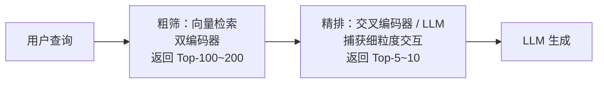

# 检索质量评估与优化

1966 年，英国克兰菲尔德航空学院的图书管理员西里尔·克莱弗登（Cyril Cleverdon）设计了一套包含查询、文档和人工标注的相关性判断结果的测试集。克莱弗登用它系统性地对比了不同索引方法（作者索引、标题索引、受控词表等）的检索效果。这个后来被称为"克兰菲尔德实验"（Cranfield Experiments）的项目奠定了信息检索评估的基本范式：用标准化的查询集、文档集和相关性判断（Relevance Judgments）来度量检索质量，而不是依赖每次评估时重新收集的用户反馈。半个多世纪后的今天，从互联网搜索到 RAG 系统，我们对检索质量的评估依然遵循着克莱弗登当年建立的"先有标准答案，再算差距"的基本思路。

前面我们学习过[模型评估](../../language-models/frontier/evaluation-safety.md)，检索评估与模型评估（如分类准确率、交叉熵损失）最大的不同在于检索的"正确答案"通常是模糊的。判断一篇文章是否与用户查询相关本身就带有主观性，同一个查询在不同场景下可能需要完全不同的文档。这意味着检索评估指标的设计不仅要考虑数学上的严谨性，还要考虑标注成本和实用性。理解了这一前提，才能明白为什么检索领域会有那么多指标，每种指标都在精确性、标注成本和实际业务需求之间做了哪些不同的取舍。

## 检索评估指标

检索评估的指标大致分两个层次：集合级指标关注该找的有没有找到以及找来的对不对，排序级指标则进一步关注找到的文档顺序是否符合相关性排序。两个层次各有应用场景，但背后的设计逻辑相通。先看集合级指标。

### 集合级指标：召回率与精确率

**召回率**（Recall）和**精确率**（Precision）是检索评估中最基础的两个指标。它们的设计意图与分类问题中的混淆矩阵（Confusion Matrix，将结果分为真正例、真负例、假正例、假负例四个象限）一脉相承。把检索返回的文档看作"预测为相关"的分类，把未返回的文档看作"预测为不相关"的分类，检索评估本质上就是按分类问题来在计算召回率和精确率。以 RAG 场景为例，假设用户查询 "Transformer 架构中的位置编码有哪些类型"，知识库中有 10 篇相关文档。检索系统返回了 Top-5 结果，其中 3 篇确实相关，另外 2 篇是讲注意力机制的（不相关）。此时召回率和精确率分别为：

$$Recall@5 = \frac{|\text{相关文档} \cap \text{检索结果前 5}|}{|\text{相关文档}|} = \frac{3}{10} = 0.3$$

$$Precision@5 = \frac{|\text{相关文档} \cap \text{检索结果前 5}|}{5} = \frac{3}{5} = 0.6$$

召回率 30% 意味着还有 70% 的相关文档没有检索到。在 RAG 场景中，召回率低意味着关键信息被遗漏，模型生成时缺少必要依据，典型症状是回答中出现"我不知道"、"没有相关信息"或者答非所问。精确率 60% 意味着返回的 5 篇文档中有 2 篇不相关，这些无关文档不仅浪费了上下文窗口的 Token 配额，还可能干扰 LLM 的判断，典型症状是回答表面上看起来通顺，但细节与事实偏离，因为模型被不相关文档中的信息误导。

召回率和精确率之间存在天然矛盾。如果把检索返回数量 Top-K 从 5 扩大到 20，召回率大概率会上升，因为覆盖了更多相关文档。但精确率会下降，因为引入了更多噪声。它们之间不是一个变好一个变差的简单关系，而是检索系统在覆盖率和信号纯度之间的根本张力。当需要一个单一数值来综合衡量时，F1 分数取两者的调和平均，调和平均的特点是偏向较小的那个值，如果召回率很高但精确率很低，F1 也会被拉低，从而避免只优化一个指标的投机行为：

$$F1 = \frac{2 \times Precision \times Recall}{Precision + Recall}$$

### 排序级指标：MRR、MAP、NDCG

集合级指标只关注文档是否被检索到，完全不关心排序位置。实际上，排在前面的文档对 RAG 生成的影响远大于排在后面的。研究表明，LLM 对上下文开头部分更敏感，这和 "[Lost in the Middle](https://arxiv.org/abs/2307.03172)" 现象一致，模型倾向于关注提示词开头和结尾的信息，中间部分容易被忽略。排序级指标弥补了这一缺陷，它们不仅衡量找到了什么，还评估更相关的结果有没有被排在前面。

**平均倒数排名**（Mean Reciprocal Rank，MRR）是最简单的排序指标，它只关心第一个相关文档的位置。设 $rank_i$ 是第 $i$ 个查询的首个相关文档的排名位置，数字越小排序越靠前。$Q$ 是查询数量，那么 MRR 的数学表达为：

$$MRR = \frac{1}{|Q|} \sum_{i=1}^{|Q|} \frac{1}{rank_i} $$

假设有三个查询，第一个相关文档分别排在第 1 位、第 3 位和第 5 位，则 MRR 计算结果为：

$$MRR = \frac{1}{3} \left( \frac{1}{1} + \frac{1}{3} + \frac{1}{5} \right) \approx 0.51$$

MRR 适用于用户只需要一个正确答案的场景（如问答系统中"法国的首都是什么"），第一个相关结果排在第 1 位得满分，排在第 3 位只得 1/3 分数。但如果用户查询 "Transformer 的优点有哪些"，结果返回有 5 篇相关文档，MRR 则完全不会关注第 2 到第 5 篇被排到什么位置。

**平均精度均值**（Mean Average Precision，MAP）弥补了 MRR 的这项不足，它考虑所有相关文档的位置。MAP 在每个相关文档出现的位置上计算一次此时的精确率，然后取平均。举个例子，假设某查询有 3 篇相关文档，它们在检索结果中分别排在第 1、第 4 和第 7 位。平均精度（Average Precision）的计算过程为：

- 第 1 位：找到第 1 篇相关文档，此时精确率 $= 1/1 = 1.0$
- 第 4 位：找到第 2 篇相关文档，此时精确率 $= 2/4 = 0.5$
- 第 7 位：找到第 3 篇相关文档，此时精确率 $= 3/7 ≈ 0.43$

因此，平均精度为 $(1.0 + 0.5 + 0.43) / 3 ≈ 0.64$，用数学公式表达为：

$$AP = \frac{1}{|\text{相关文档}|} \sum_{k=1}^{n} P(k) \times rel(k)$$

其中 $P(k)$ 是前 $k$ 个结果的精确率，也就是截至第 $k$ 位时，找到的"相关文档数 / $k$"。$rel(k)$ 是一个指示函数，如果第 $k$ 位文档是相关的则为 1，不相关则为 0，它保证了只在相关文档出现的位置上记录精确率。分母是相关文档总数，对多次精确率求和后取平均。整体公式的含义是相关文档出现得越靠前，各个位置上的精确率就越高，平均精度就越高。AP 度量的是单次查询多个文档的平均精度，MAP 将多个查询的 AP 取平均，度量了多次查询中所有相关文档的排序位置精确度。

**归一化折损累积增益**（Normalized Discounted Cumulative Gain，NDCG）进一步支持了多级相关性标注。MRR 和 MAP 都假设相关性是二值的（相关 / 不相关），实际上有些结果高度相关，有些是部分相关，有些则是完全不相关。NDCG 允许标注人员给出 0～4 或 0～3 等级别的多级标注，并通过折损因子让排序靠后的文档权重递减。

假设 $rel_i$ 是排在第 $i$ 位的文档的相关性等级，先通过 $2^{rel_i} - 1$ 将等级指数放大，如等级为 3 的文档贡献 7 个单位，等级为 1 的仅贡献 1 个单位，这样等级差距就被指数级放大。再用 $\frac{1}{\log_2(i+1)}$ 表示折损因子，排在第 1 位除 1，第 3 位除 2，第 100 位除 6.6，模拟了用户注意力从前往后递减的自然规律。DCG 的数学表达为：

$$DCG@k = \sum_{i=1}^{k} \frac{2^{rel_i} - 1}{\log_2(i + 1)}$$

以三个文档为例，假设它们的相关性标注分别为 3（高度相关）、2（相关）、0（不相关），排在检索结果第 1、2、3 位：

$$DCG@3 = \frac{2^{3} - 1}{\log_2(1 + 1)} + \frac{2^{2} - 1}{\log_2(2 + 1)} + \frac{2^{0} - 1}{\log_2(3 + 1)} = 7 + \frac{3}{1.58} + 0 = 8.90$$

由于 DCG 本身没有进行归一化，不同查询的 DCG 无法直接比较。我们只要将 DCG 除以理想排序下的 DCG（称为 IDCG），即得到可相互对比的 NDCG：

$$NDCG@k = \frac{DCG@k}{IDCG@k}$$

在刚才的三文档例子中，理想排序是将相关文档排在前面（3、2、0），即 $IDCG@3 = (7/1) + (3/1.58) + (0/2) = 8.90$。如果实际排序是（2、0、3），则 $DCG = 3/1 + 0 + 7/2 = 6.5，NDCG ≈ 0.73$。NDCG 越接近 1，说明排序越接近理想状态。

## 重排序

前面讨论的[向量检索](embedding-and-indexing.md)流程（查询经由嵌入模型编码为向量，在近似索引中搜索，通过双编码器计算相似度并返回 Top-K 候选）在 RAG 中被统称为**初次检索**（First-Stage Retrieval）。初次检索受到两个约束：一是索引结构用了近似算法，基于聚类的倒排索引（IVF）只搜索少数聚类中心附近的区域，图索引通过贪心搜索遍历图结构，两者都无法保证一定能找到全局最优解，召回率天然存在折损。二是双编码器架构将查询和文档分别独立编码为向量再计算相似度，查询中的"苹果"（手机）和文档中的"苹果"（水果）初次检索阶段可能难以区分，因为双编码器无法在编码阶段看到对方的内容来做消歧。这两个约束叠加在一起，会造成初检结果中排在 Top-K 开外的相关文档会被漏掉，排在 Top-K 以内的不相关文档又难以被甄别出来。

重排序的目标是用更精确的模型对少量候选文档重新排序，实现"粗筛 + 精排"的两阶段架构。粗筛阶段用近似索引和双编码器在毫秒级别召回 100～200 篇候选文档，精排阶段用一个能捕获查询与文档交互的模型从中挑出最好的 5～10 篇。

*图："粗筛 + 精排"的两阶段架构*

此前我们讨论的向量检索都是使用双编码器（Bi-Encoder）实现的，分别把查询和文档喂给编码器，各自输出一个向量，然后在这两个向量的点积上判断相似度。这种"各算各的"方式的优点是文档向量可以提前预计算，检索时只需对查询做一次编码，速度很快。缺点是编码查询时模型完全不知道文档内容，编码文档时也不知道查询意图，两条独立编码路径之间唯一的交汇点是最后的点积操作，这几乎不可能捕获查询中的"苹果"是指公司，而文档中的"苹果"是指水果这种语义差异。

**交叉编码器**（Cross-Encoder）把查询和文档拼接成一个序列一起送入编码器，直接输出一个相关性分数。典型的拼接格式是 `[CLS] 查询 [SEP] 文档 [SEP]`，编码器（通常是 BERT 系的预训练模型）在自注意力层中让查询和文档的每个 token 都能互相看到，模型因此可以轻易判断查询和文档中的"苹果"是指公司还是水果。类似地，查询词在文档中是否出现了、出现的上下文是否符合同一个语义、查询与文档的核心主题是否一致，这些是双编码器架构在难以精确捕获的交互模式，交叉编码器能轻松捕获。

当然，交叉编码器的代价也是显而易见的。每次查询都需要将查询与每一篇候选文档拼接后重新编码，无法预计算。这也是为什么交叉编码器只用在精排阶段，候选集通常控制在 100～200 以内，在这个数量级上，交叉编码器的延迟尚可接受。

交叉编码器虽然精确，但针对特定领域需要微调，没有标注数据就无法发挥它的全部能力。LLM 重排序直接绕过了所有的训练环节，利用大语言模型的指令遵循能力，在提示词中给出查询和候选文档列表，要求 LLM 按相关性排序。提示词通常包括排序指令和输出格式（如"对以下文档按与查询的相关性排序，输出排序后的文档 ID 列表"）。这种方法的泛化能力极强，无需任何领域内标注数据就能工作，而且 LLM 凭借广泛的预训练知识，对文档语义的泛化理解往往优于未微调的交叉编码器。但延迟和计算成本严重限制 LLM 重排序的使用场景。对 20 篇候选文档做排序可能需要数秒和数万 Token 的 API 消耗。它只适用于候选集很小（一般比交叉编码器还要小一个数量级）且对精度有极高要求的场景，或者在缺乏标注数据时作为交叉编码器的替代方案。目前工业界主流的实现之一是 RankGPT，它通过滑动窗口策略让 LLM 能处理稍大一些的候选集。

## 检索架构设计

两阶段架构（粗筛 + 精排）是检索系统的标准设计。粗筛阶段的目标是高召回率，宁可多召回一些不相关的文档，也不能遗漏关键的文档。因此粗筛使用双编码器（文档向量可预计算）配合近似索引，在毫秒级别从海量文档中返回 Top-100～200。精排阶段的目标是高精确率，从 200 篇候选中挑出最能支撑生成的 5～10 篇。精排阶段用交叉编码器做逐对评分，候选集数量不大，所以准确率高而延迟可控。两阶段之间形成一个自然的漏斗状结构，粗筛负责"广撒网"，精排负责"精挑选"，架构简单、调优方向明确，是绝大多数 RAG 系统的选择。

当文档规模超过亿级时，两阶段架构可能不够用。200 篇候选对交叉编码器来说虽然延迟不高，但 200 篇中混入大量明显不相关的文档仍会浪费精排的计算资源。三阶段架构在粗筛和精排之间插入一个轻量级排序器作为粗排阶段。粗筛阶段返回 Top-500～1000，粗排阶段（通常用轻量级交叉编码器的蒸馏版本或多路相似度得分的加权融合）压缩到 100～200，精排再用完整交叉编码器筛选到 10～20。每增加一个阶段，会增加延迟，但也相应提升了质量，最终阶段数量取决于计算配额的预算和业务对延迟的容忍限度。检索架构除了设计之外，在实现上还有几个不应忽视的工程细节：

- 并行度方面，粗筛阶段常用的稠密检索（向量相似度）和稀疏检索（如 BM25）是两支完全独立的检索管线，相互间没有数据依赖，天然适合并行执行，两路检索同时发起，结果合并后统一去重。
- 缓存策略方面，可以设计查询缓存（完全相同的查询直接返回缓存结果，命中率取决于查询分布的集中程度）、文档编码缓存（稠密向量和稀疏倒排索引都可以提前计算并持久化）和重排序缓存（高频查询与候选文档的交叉编码器得分可以被缓存，避免重复推理）。
- 增量更新方面，稀疏索引天然支持增量更新，稠密索引则视选择的索引结构而定，HNSW 支持逐点插入，IVF 在聚类中心漂移时可能需要定期重建。

需要注意的是，上面讨论的架构都是批处理视角的设计。真实的生产系统中，冷启动、查询波动、索引更新频率、GPU 资源调度等问题往往比检索算法本身更难处理。这些工程问题不在本文讨论范围内，但在部署前需要纳入考量。

## RAG 端到端评估

RAG 系统最终交付的是生成给用户的文字回答，而不是 Top-K 文档列表。有时候检索指标漂亮，但回答的生成质量却很糟糕。举个例子，系统虽然找对了文档，但由于 LLM 的上下文整合能力有限，或者文档中的关键信息藏在冗长的中间段落里，导致被模型忽略。端到端评估关注的不再是检索环节的得分，而是整个 RAG 管线的最终输出质量。譬如回答是否忠实于检索到的文档、是否完整覆盖用户的提问。端到端评估一般会从忠实度、相关性和完整性三个维度展开：
- **忠实度**（Faithfulness）检查生成回答中的每一个陈述是否都能在检索到的文档中找到依据。譬如用户提问"介绍一下 Transformer 架构"。文档中记录了 "Transformer 发表于 2017 年"，模型回答中说的却是 "Transformer 首次发表于 Google 的论文《Attention Is All You Need》"，这个陈述是不忠实的，因为其中"Google"、"论文《Attention Is All You Need》"等信息均不在文档中，属于模型自行补充的内容。忠实度不足不代表回答一定差，是否允许模型在文档外自行扩展补充，应根据具体系统的业务来决定。
- **相关性**（Relevance）判断回答是否直接回答了用户的问题，即使回答完全忠实于文档，如果检索到的文档与查询不相关（精确率问题），生成的回答自然也文不对题。譬如用户的提问是 "Transformer 架构提出的时间"，这时候即使文档中存在"论文《Attention Is All You Need》"的信息，但回答只是在大谈论文内容，却没有给出 2017 年这个时间点，也显然违反相关性了。
- **完整性**（Completeness）评估回答是否覆盖了问题的各个方面，譬如用户问的是"位置编码有哪些类型"，如果只提到了正余弦位置编码而遗漏了可学习编码和相对位置编码，就是完整性受损。

人工标注全部三个维度的成本极高，一个 200 条查询的测试集就需要对 200 个回答逐一评判忠实度、相关性和完整性。RAGAS 等框架通过 LLM-as-Judge 模式来自动化这一流程，用大语言模型扮演裁判角色，按预定义的评分标准（如回答中的每句话是否都能在上下文中找到支撑）打分量表。LLM-as-Judge 与人类标注的一致性已经相当高，通常能达到 0.7 以上，可以作为快速迭代中的替代方案。但需要注意的是，LLM 评判器本身也有偏见，它倾向于给自己的"同类"（其他 LLM 生成的回答）打更高分，因此关键场景仍需人工抽检校准。

## 本章小结

检索质量直接决定了 RAG 系统的成败。从克兰菲尔德实验范式到现代两阶段检索架构，经过半个多世纪的积累，形成了一套从集合级到排序级、从检索指标到端到端生成的完整评估体系。理解召回率与精确率的张力、粗筛与精排的分工、检索噪声与检索不足的不同影响模式，是设计可靠 RAG 系统的前提。评估不是为了打一个分数，而是为了找到系统短板的精确位置，从而知道下一步该优化什么。

## 练习题

1. 使用交叉编码器对双编码器的 Top-20 检索结果重排序，对比重排序前后 Top-5 的 NDCG@5 变化。分析交叉编码器成功修正和未能修正的案例各两个，总结交叉编码器擅长和不擅长的查询类型。

   

   
参考答案

   核心实现思路：先用 `sentence-transformers` 的双编码器模型检索 Top-20，再用交叉编码器对这 20 篇文档逐对评分并重新排序。交叉编码器擅长需要细粒度语义交互的查询（如歧义查询、复杂推理型查询等）（语义需要细粒度交互才能解析），但在短查询且双编码器已表现良好时提升有限。需要外部知识（不在已有知识库中）的查询类型，无论使用何种检索器都无法解决，受限于知识库覆盖范围而非模型选择问题。

   

2. 使用 RAGAS 框架，让检索数量 $k$ 从 1 递增到 10，观察 RAG 端到端生成质量的变化趋势（以忠实度、相关性、上下文召回率为评估指标），确定最优 $k$ 值，并解释为什么 $k$ 过小或过大都会损害生成质量。

   

   
参考答案

   $k$ 过小时上下文信息不足，忠实度通常较高（检索到的文档少且与查询高度相关，模型不易被无关内容干扰），但完整性差（缺少关键信息）；$k$ 增大后完整性提升，但噪声增加导致相关性下降；最优 $k$ 通常在 3～7 之间，具体值取决于知识库规模和嵌入模型精度。RAGAS 支持 `metrics = ["faithfulness", "answer_relevancy", "context_recall"]` 等端到端指标，faithfulness 和 context_recall 可通过 LLM-as-Judge 自动计算，而 answer_relevancy 则通过 LLM 生成反问句后计算嵌入相似度得到，并非纯粹的 LLM-as-Judge 方式。

   

