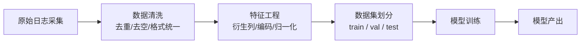
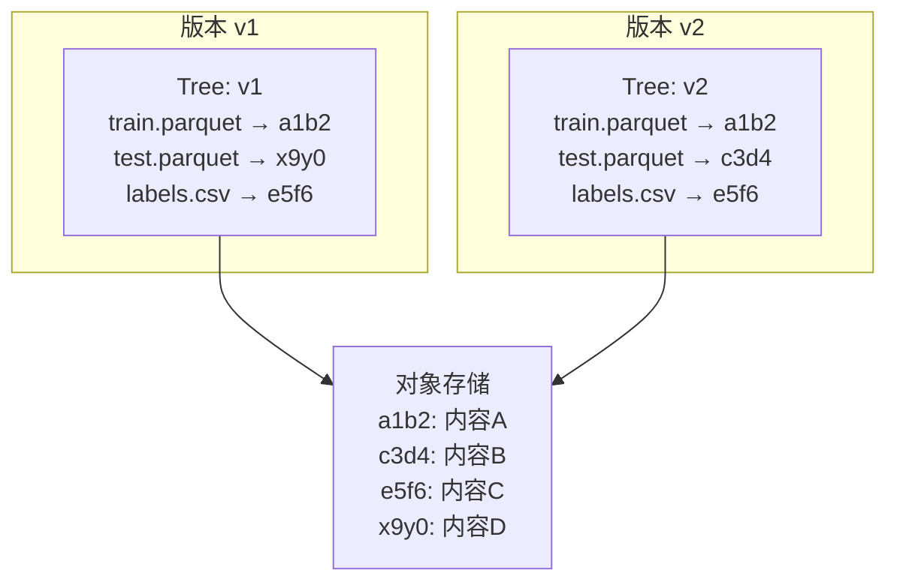
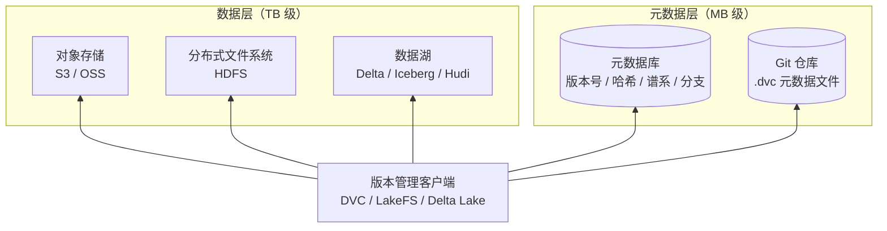

# 数据版本管理

假设你正在训练一个图像分类模型。经过两周的调参，模型在测试集上达到了 93% 的准确率，比上一轮实验提升了 2 个百分点。你兴奋地想复现这个结果，却绝望地发现训练数据目录里躺着一个名为 `dataset_v3_final_fixed_revised.csv` 的文件，而你已经记不清它和上周使用的 `dataset_v3_final_fixed.csv` 到底有什么区别。在机器学习工程中，代码有 Git 守护每一次变更，但数据这个与代码同等重要的输入，却常常只有"最新版"这一种状态。

早在 2000 年代初，数据仓库领域就开始探索数据血缘（Data Lineage）的追踪问题：数据从何处来，经过了哪些变换，最终流向了何处。这项理念真正进入机器学习从业者的视野，要到 2017 年。那一年，DVC（Data Version Control）发布了第一个版本。它的作者德米特里·彼得罗夫（Dmitry Petrov）曾在微软担任数据科学家，亲身经历过数据混乱带来的困扰。他曾在博客中写到：团队里每个人都在用不同版本的数据跑实验，而没有人能说清楚哪个版本对应哪个模型。DVC 的设计理念就是像 Git 管理代码一样管理数据，用 Git 的提交历史串联起数据、代码和模型三者之间的完整谱系。

2019 年，Databricks 开源了 Delta Lake，在廉价的对象存储之上提供了 ACID 事务、时间旅行和增量查询能力。2020 年，以色列初创公司 Treeverse 发布了 LakeFS，将 Git 的分支合并语义完整地带入了数据湖。如今，数据版本管理已经成为 MLOps 实践的标准组件，让数据像代码一样可追溯、可对比、可复现。但这三个词背后隐藏着比管理代码版本更大的工程挑战，当数据集动辄数十 GB、变更发生在文件级别而非行级别、一次特征工程操作可能改变上百万条数据时，传统的版本控制方案就全部失效了。

## 数据版本

如果你是一名软件工程师，Git 的工作流应该早已刻入肌肉记忆，你习惯于检查每一行代码的改动，在分支之间自由切换，用 `git blame` 追溯每一行代码的来历。这种体验如此流畅，以至于当你第一次面对"数据也需要版本管理"这样的需求时，本能反应很可能是为什么不直接 `git add dataset_v3_final_fixed.csv`？

现实情况是代码通常在几 KB 到几 MB 之间，而一个训练集动辄几 GB 甚至几 TB，存储格式可能是 Parquet 列式文件、TFRecord 二进制文件、图像目录树或 HDF5 数组。在这些格式上，你不能指望 `diff` 在两个 50 GB 的 Parquet 文件之间找出有意义的差异，就像你不能用手术刀去把一头鲸鱼大卸八块。更大的麻烦是代码变更只会是行粒度，数据变更却会在记录级（新增了哪些行、删除了哪些行、修改了哪些字段值）、文件级（新增了哪些图片、删除了哪些音频文件），以及最微妙但也最重要的语义级（特征分布是否发生了漂移、标签比例是否从平衡变成了倾斜）三个粒度上同时发生。由此可见，数据的版本管理比代码的版本管理更复杂，需要一套更有针对性的工程手段来支撑。

### 从原始数据到模型

在实际的机器学习流水线中，一份数据在抵达模型训练之前，通常已经经历了一长串的变换。从外部系统采集原始日志，经过清洗去除无效记录，进行特征工程生成衍生列，再按某种策略分割为训练集、验证集和测试集。每一步的输出都是下一步的输入，形成一条首尾相连的链条。这条链条在数据工程中称为数据血缘（Data Lineage），它记录数据从源头到消费端的完整流转路径。

*图：机器学习数据流水线*

上图展示了一条简化的机器学习数据流水线。现在假设你在一次实验迭代中同时做了两件事：调整了特征工程的归一化逻辑，又给模型多加了几层卷积。结果是新实验的精度提升了 2%。现在你想知道这 2% 的提升到底来自新归一化逻辑，还是来自更深的网络设计？如果归一化是在原地进行的，那旧数据已经被覆盖，你就无法回溯到上一轮实验的数据进行对照。因此，在没有数据版本管理的情况下，每一次实验的结论都建立在一份已经无从追溯的旧数据之上。数据版本管理正是构建数据血缘关系的基础。它为流水线中的每个节点赋予可引用的版本标识，使得"这个模型是用哪个版本的数据训练的"成为一个可回答的问题，而非需要翻查日志、回溯历史的考古项目。

### 不可变数据与可变数据

数据是否需要版本化、如何管理、存储数据，取决于你把数据视为什么类型的资产。来自生产系统日志、传感器采集或第三方标注的原始数据（Raw Data），一旦生成就不应再被修改。它记录的是某个时刻的客观事实，就像 Git 中已提交的 Commit 一样，修改它就是对历史的篡改。对于这类不可变数据，最自然的存储策略是[内容寻址存储](#内容寻址存储)，用数据内容的哈希值（如 SHA-256）作为存储标识，相同内容自动去重，不同内容生成新版本。

与之相对，经过清洗、变换或特征工程产生的衍生数据则是可变的。特征列可能被新增或删除，标签值可能被批量修正，数据集划分策略可能被调整。每次变更都需要记录三个信息：变更原因（为什么改）、变更内容（改了什么）和影响范围（影响了哪些下游任务）。对于这类可变数据，内容寻址的纯不可变模型过于僵硬，更适合的方案是[全量快照](#全量快照策略)与[增量日志追踪](#增量追踪策略)相结合，在存储成本和恢复效率之间取得平衡。

区分不可变数据与可变数据，不仅决定了存储策略的选择，也影响着团队协作的规范：原始数据应被锁定保护，衍生数据的每一次变更都应留下审计痕迹。这些规范构成了后续所有版本管理操作的基本原则。

### 全量快照策略

最直观的数据版本管理方式就是每一次修改都保存一份完整的数据副本，这被称为**全量快照**（Full Snapshot）策略。版本 v1 是整个数据集的一份拷贝，版本 v2 是另一份完整的拷贝，以此类推。当你需要恢复到某个历史版本时，直接读取对应快照即可，无需任何回放操作。

这种策略的优点是实现成本低（甚至不需要专门的工具，手动复制就能起步），恢复速度恒定（读取一份完整文件的时间，与版本历史长度无关）。如果你手头的数据集只有几百 MB、一个月才变更一次，全量快照完全可以胜任，甚至可能是最优选择。在数据体量足够小的时候，简单本身就是价值。全量快照的问题在于存储成本高，且存储成本随版本数线性增长。假设你的训练数据集是 10 GB，每周变更一次，一年下来就是 520 GB 的存储开销，而其中 98% 以上的数据块可能从未发生过变化。对于 TB 级别的数据集，按日变化的频率，这种增长曲线是不可持续的。有一些工程手段可以缓解这个问题，譬如使用列式存储格式（如 Parquet 或 ORC）配合压缩算法（如 Snappy 或 Zstd）可以将单副本体积缩减到原始大小的 20% 到 40%，但这只是降低了单次快照的成本，线性增长的斜率并未改变。

### 增量追踪策略

**增量追踪**（Incremental Tracking）的实现借鉴自数据库领域，不需要每次保存整份数据，而是只记录从上一个版本以来发生了哪些变化。在数据版本管理的语境下，增量追踪需要记录三类变更操作：新增了哪些记录（INSERT）、删除了哪些记录（DELETE）、修改了哪些记录的前后值（UPDATE）。这些操作被写入一个增量日志（Delta Log），形成一条按时间顺序排列的变更序列。要恢复到某个版本，就从最近的完整快照出发，按顺序回放从快照到目标版本之间的所有增量操作。

这种策略把存储成本从与版本数成正比优化到了与变更量成正比。如果你新增了 1000 条记录，存储开销就是这 1000 条记录的大小，而不是整个数据集的副本。然而恢复时间就变成了与版本跨度成正比。如果从最近一次全量快照到当前版本之间有 100 个增量版本，你就需要回放 100 次变更日志。为了平衡这对矛盾，实践中通常采用检查点（Checkpoint）策略，每积累 N 个增量版本（譬如 N = 10 或 N = 20，取决于写入频率和存储预算），自动生成一次全量快照作为新的基准。这样恢复任何版本时，最多只需回放 N-1 次增量，存储成本与恢复速度之间就有了可控的折中。选择 N 的大小本质上是在权衡愿意为多快的恢复速度支付多少额外的存储成本。

### 内容寻址存储

全量快照和增量追踪是对存储成本与恢复效率的权衡，**内容寻址存储**（Content-Addressable Storage）则从更底层的角度回答数据该如何存储的问题。它用数据内容的哈希值作为数据的标识和存储键，而非用文件名或路径。同一个内容永远产生同一个哈希值，因此相同内容自动去重，不会重复存储。

Git 的对象存储模型堪称内容寻址存储的最佳样板。当你 `git add` 一个文件时，Git 计算文件内容的 SHA-1 哈希值，将内容压缩后以这个哈希值命名存入 `.git/objects` 目录。如果两个不同文件名指向完全相同的文件内容，Git 不会存储两份，它们会共享同一个 Blob 对象。目录结构则由 Tree 对象组织，每个 Tree 记录"文件名 → Blob 哈希"的映射关系。一次 Commit 就是指向一个 Tree 对象的指针，加上作者、时间戳和提交信息。将这个模型平移到数据版本管理中，思路是完全一致的，如以下例子：

*图：两个版本合并的文件共享*

在上图中，版本 v1 和 v2 共享了两个数据文件（`train.parquet` 和 `labels.csv` 内容未变，哈希值相同），只有 `test.parquet` 的文件内容发生了变化。因此在对象存储层面，v2 只需要额外存储一份新的 `test.parquet` 内容，其余文件则被自动复用。数据集版本迭代时，90% 以上的数据块通常未发生变更，内容寻址存储可以将存储开销降低一个数量级。

对于大型文件（如 GB 级别），整文件粒度的去重仍然可能浪费空间。文件中的大部分内容未变，但仅仅因为一小块变化就导致整个文件的哈希值改变。解决方案是将文件分块（Chunk），按固定大小（如 4 MB）或基于内容边界（Content-Defined Chunking，如 Rabin 指纹算法）切分，对每个块独立计算哈希。这样只有真正发生变化的块才需要重新存储，未变化的块被自动复用。

## 分支与合并

Git 用户对分支的概念已经习以为常，从主干切出一个分支，在上面自由实验，成功了合并回去，失败了直接丢弃，主干始终处于可发布状态。数据版本管理中的分支遵循完全相同的理念，只是操作的对象从源代码换成了数据集。在机器学习的工作流中，数据分支有以下几种典型的使用场景。

最常见的是特征实验分支。假设主干数据集已经稳定用于生产模型的训练，但你有一个新的特征工程想法，譬如将两个数值特征做交叉乘积生成一个衍生列，或者对类别特征尝试一种新的编码方式。你并不确定这个想法是否有效，贸然在主干数据上原地修改可能破坏正在进行的其他实验。正确的做法是从主干数据创建一个实验分支，在新的分支上完成特征变换，用它训练一个实验模型，然后对比主干数据训练的基线模型。如果精确率提升了，就把这个分支的变更合并回主干；如果效果不好，直接删除分支即可，不会留下任何痕迹。

另一种场景是数据修复分支。生产环境运行一段时间后，你可能会收到用户反馈。譬如在一个情感分类数据集中，500 条被标注为"正面"的评论实际上应该是"负面"的。你不希望直接在主数据集上逐条修改，因为这会影响所有基于该数据集的历史实验结果。更稳妥的做法是从主干创建修复分支，在分支上完成批量修正，验证无误后合并回主干并打上新版本标签。

还有一种更复杂的场景是多租户分支。不同业务线共享同一个基础数据集（譬如用户行为日志），但各自需要维护业务特定的扩展字段。通过为每个业务线创建独立的分支，基础数据的更新可以单向同步到各租户分支，而各租户的扩展字段互不干扰。

这些场景中的数据分支都应当有明确的生命周期。短期实验分支应在实验完成后及时清理，长期存续的分支（如多租户分支）需要定期从主干同步更新以避免分叉过远。没有生命周期管理的分支体系，最终会演变成一个无人能看懂的"分支墓地"。

### 数据合并

代码合并时，Git 的合并算法可以在大多数情况下自动处理。如果两个分支修改了不同文件，或者修改了同一个文件的不同行，Git 可以直接合并。只有当两个分支修改了同一文件的同一行时，才需要人工介入解决冲突。这种逐行比较的策略在代码世界中奏效，是因为代码变更只会是行粒度的。数据合并没有这种便利，因为数据变更不仅发生在行粒度，还涉及字段粒度和跨字段的语义约束。将逐行比较的策略应用到数据上，一个自然扩展是三路合并（Three-Way Merge）：取基准版本（分支的公共祖先）、分支 A 的当前版本、分支 B 的当前版本，进行三方比较。对于在三个版本中都未变更的记录，直接保留；对于只在一个分支中变更的记录，自动采纳该分支的修改；对于两个分支都变更了的记录，则标记为冲突，需要人工介入。

但问题在于数据变更不仅局限于行粒度，即便三路合并在语法上判定没有冲突，语义上仍然可能出现冲突。譬如数据集中有一个用户画像表，包含 `age` 和 `birth_year` 两个字段。分支 A 修改了该用户的 `age` 从 30 改为 25，分支 B 修改了 `birth_year` 从 1995 改为 1985。从语法层面看，两个分支修改了不同字段，三路合并可以无冲突地自动处理，让 `age` 变成 25，`birth_year` 变成 1985。但从语义层面看，今年是 2026 年，25 岁的人不可能出生在 1985 年，语法上无冲突，语义上却自相矛盾。

语法冲突容易检测，语义冲突需要领域知识，这是数据合并的根本困难。数据合并通常有三种策略：**字段级合并**（Field-Level Merge）粒度最细，只在两个分支修改了同一条记录的同一个字段时才报告冲突，优点是冲突少，缺点是无法检测跨字段的语义矛盾。**记录级合并**（Record-Level Merge）粒度最粗，只要两个分支都碰过同一条记录就报告冲突，优点是绝不会漏掉记录内的语义问题（跨记录仍可能存在语义冲突），缺点是大量本来没问题的变更也会被标记为冲突。**语义校验合并**（Semantic-Validation Merge）在自动合并之后运行一组预定义的校验规则（譬如"出生年份必须等于当前年份减年龄"），只标记那些违反规则的记录，是目前最理想化的方案，但实现成本也最高，语义冲突的解决方案是当前数据管理中的前沿课题。

### 数据标签与发布管理

在 Git 中，标签（Tag）是对某个 Commit 的语义化别名，叫 `v2.0.0` 比叫 `a1b2c3d` 更容易理解和交流。数据版本管理中的标签承担着相同的角色，甚至更为关键。一个数据标签不仅代表某个数据快照，还隐含地关联了所有使用该数据训练的模型版本。

一个典型的发布管理流程是数据团队在 `dev` 分支上完成新一轮的数据清洗和特征工程变更，自检通过后将其合并到 `staging` 分支。在 staging 环境中，模型团队使用该分支的数据训练一个验证模型，检查评估指标是否稳定（譬如与上一版本相比，AUC 没有意外下降）。如果验证通过，就在 staging 分支上打一个语义化标签（譬如 `v2.1-production`），然后将其发布到 `production` 分支。此后任何模型训练任务指定 `data_version=v2.1-production`，即可精确获取该版本的数据。

已发布标签对应的数据版本必须被锁定，禁止任何修改。这个约束不是可有可无的，它是实验可复现性的前提。想象一下，如果你在论文中报告模型在 v2.1 数据集上达到了 93% 的准确率，而后来有人修改了 v2.1 对应的数据内容，那么任何人都无法复现这个结果。数据标签的不可变性，与 Git Tag 的不可变性遵循同一条原则：发布出去的东西，就是历史已经发生的事情，不允许再有更改。

更进一步的实践是应该将数据标签与模型版本显式关联。在模型元数据中记录 `training_data_tag: v2.1-production`，在数据元数据中记录 `used_by_models: [model-v3.0, model-v3.1]`，这样就构建了数据版本与模型版本之间的双向追溯链条。当未来某个模型在生产中出现异常时，可以沿着这条链条反向追踪到它使用的数据版本，检查是否存在数据层面的问题根源。

## 工程实践

前面讲解了数据版本管理、分支合并的基础原理，本节再介绍几项数据版本管理中实用的工程实践。

### 元数据与数据分离

当数据量从 GB 增长到 TB 级别时，每次版本操作都搬运实际数据是极其低效的，通过网络拷贝 10 TB 的数据可能需要几十分钟甚至几小时。我们应该在架构层面就将版本管理的元数据与数据本体分离开来。

元数据层是"瘦"的，包含版本号、内容哈希、变更日志、谱系关系和分支结构等信息，体积通常在 MB 级别，可以存入关系数据库（如 PostgreSQL）或直接用 Git 仓库管理（这正是 [DVC](https://dvc.org/) 的做法，`.dvc` 文件是纯文本的元数据指针，随代码一起提交到 Git）。数据层是"胖"的，保管实际的数据文件或表格，存入对象存储（如 S3、阿里云 OSS）或分布式文件系统（如 HDFS）。

这种分离带来的好处会贯穿整个机器学习流水线。版本对比操作不再需要扫描数据本体，只需比较元数据中的哈希值就能判断文件是否发生了变化，毫秒级内就可以完成。创建新分支也不再复制数据，只需在元数据中创建一个新的版本指针，数据本体依然原地不动。如果你需要将 50 TB 的数据集克隆给另一个团队，传输的只是元数据文件（只有几 MB），而数据本体通过共享的对象存储访问，根本无需复制。这就是为什么 DVC 中数据本体和元数据走的是完全不同的存储路径，`dvc push` 和 `dvc pull` 负责上传/下载数据缓存到远端存储，而 `git push` 和 `git pull` 负责同步 .dvc 元数据文件。

### 存储后端的选择

在实际工程中，数据版本管理的存储后端可以分为两个层次。底层是对象存储提供的基础存储能力（即"哑存储"，仅提供简单的 PUT/GET 操作，不感知表结构和事务语义），如提交文件，读取文件，按路径寻址等。上层是数据湖格式在对象存储之上构建的高级表管理能力，如 ACID 事务、时间旅行、增量查询等。

裸对象存储（如 AWS S3 或阿里云 OSS）已经原生支持简单的版本控制。开启 Bucket 版本控制后，每次覆盖写入都会自动保留历史版本，通过版本 ID 可以随时恢复到任意历史状态。这种方案对于文件数量不大、变更频率不高的场景来说已经够用，但它仅提供最基础的版本控制，既没有增量 diff 能力（你只能看到这个文件和那个文件不一样，无法知道哪些记录发生了变化），也没有事务支持（在多个文件同时更新的场景下，要么全部成功要么全部失败的一致性语义无法保证）。为了弥补这些缺陷，数据湖格式在对象存储之上构建了额外的抽象层。目前主流的三大数据湖格式各有侧重：

| 特性 | Delta Lake | Apache Iceberg | Apache Hudi |
|:----:|:----------:|:-------------:|:----------:|
| 核心机制 | 事务日志（Transaction Log） | 快照隔离（Snapshot Isolation） | 增量拉取（Incremental Pull） |
| 写入模式 | 批写入为主，流写入支持 | 批写入，流写入通过 Append | 批写入和流写入均作为一等公民支持 |
| 时间旅行 | 通过事务日志回放至任意版本 | 通过快照 ID 或时间戳查询 | 通过 Commit Time 查询 |
| 增量查询 | 支持（读取两个版本的差异） | 支持（通过快照 diff） | 原生支持（设计核心） |
| 生态兼容 | 深度绑定 Spark，Trino/Presto 支持 | 多引擎一等支持（Spark/Flink/Trino/Hive） | 与 Kafka/Spark/Flink 深度集成 |

选择哪个格式取决于你的工作负载特征。如果你的流水线以 Spark 批处理为主，追求操作简洁和与 Databricks 生态的集成深度，Delta Lake 是自然的选择。如果你的组织使用多种计算引擎（Spark、Flink、Trino）并希望避免供应商锁定，Iceberg 的中立架构更适合。如果你的场景是流式数据持续写入、下游需要高效拉取增量变更（如实时特征工程），Hudi 的增量拉取设计最为契合。

### 流水线集成

所有的理论和工具，最终都要嵌入到具体的机器学习流水线中才能产生价值。数据版本管理与机器学习流水线的集成，应秉持自动化一切可以自动化的版本操作，让人类只做决策的原则。

在流水线的入口处，系统应自动记录当前输入数据的版本标识（哈希值或标签），并将其写入实验元数据。这意味着当你启动一次训练任务时，不需要手动指定 `--data-version=v2.1`，流水线会从数据存储中自动读取当前最新标签，并将其记录在 MLflow 的 run 参数中或 TensorBoard 的日志目录中。在流水线的出口处，如果本次运行产出了新的衍生数据，譬如特征工程步骤修改了预处理逻辑，系统应自动提交新版本并关联输入版本和代码版本，形成一个不可分割的数据输入版本、代码 Commit、数据输出版本三元组。

这一自动化链条的终点是保证"同一代码 + 同一数据版本 = 可复现的实验结果"。如果某次训练的结果无法复现，你可以立即排查，要么是代码变了（检查 Git Commit），要么是数据变了（检查数据版本哈希），要么是环境变了（检查 Docker 镜像标签），三者至少其中一项出现了问题。

更进一步，数据版本的变更可以成为 CI/CD 流水线的触发器。当一个新的数据标签被打在 staging 分支上（意味着数据团队完成了一轮变更并验证通过），CI/CD 系统可以自动触发下游任务，如重新训练验证模型，运行评估脚本，对比新旧版本的性能指标，如果指标退化超过阈值则自动阻止发布。这样，数据版本管理不再只是一个存储和记录的工具，而是成为了机器学习系统质量保障体系的一个主动执行环节。

## 本章小结

数据版本管理的根本目标，是让机器学习系统中的数据像代码一样可追溯、可对比、可复现。本章从数据与代码的本质差异出发，拆解了数据版本管理面临的三个层次的问题。

- 在数据层面，存储策略的选择取决于数据的体量和变更特征。全量快照简单可靠，但成本随版本数线性增长。增量追踪将存储成本与变更量挂钩，而非版本数。内容寻址存储则通过哈希去重在底层自动消除冗余。三者并非互斥，实践中的成熟方案往往是以内容寻址存储为核心，辅以检查点快照。

- 在协作层面，数据分支与合并将 Git 的工作流带入了数据世界。数据分支为特征实验、标注修复和多租户场景提供了隔离空间，但数据合并远比代码合并复杂。语法层面的冲突可以通过三路合并自动解决，语义层面的矛盾则需要领域知识和校验规则的介入。数据标签和发布管理则确保了"发布出去的数据就不再修改"这条硬约束被严格执行。

- 在工程层面，元数据与数据分离的架构使得 TB 级别的版本操作可以在毫秒级完成。数据湖格式（Delta Lake、Iceberg、Hudi）在对象存储之上构建了事务、时间旅行和增量查询能力。而将版本管理嵌入机器学习流水线的入口和出口，意味着每一个模型的训练结果都能追溯到精确的数据快照，这是实验可复现性的物质基础。

本章以概念和架构为主，侧重理解数据版本管理"为什么"和"是什么"的问题。关于具体的工具选择和操作实践，譬如如何在项目中引入 DVC、如何配置 Delta Lake 的生产集群、如何设计数据分支的命名和合并规范，仍需要读者自行阅读相关工具文档，展开实践。

## 练习题

1. 假设你有一个 50 GB 的训练数据集，每周变更一次，每次变更涉及约 5% 的数据记录（新增、删除或修改）。请分别估算全量快照策略和增量追踪策略一年的存储成本（假设不做检查点），并讨论在实际场景中你会如何设计检查点策略来平衡存储成本与恢复速度。

   

   
参考答案

   
   **全量快照**: 50 GB × 52 周 = 2.6 TB。无论实际变更了多少数据，每次都要存储完整的副本。

   **增量追踪**: 增量部分为 50 GB × 5% × 52 = 130 GB。增量追踪仍需一份初始基础版本（50 GB），合计约 180 GB，但后续每周仅需存储变更记录。
   
   这个对比说明增量追踪在大数据集上的存储优势是巨大的。但在实践中，纯增量方案会导致恢复时间过长：恢复第 52 周的数据需要回放 52 次增量日志。合理的检查点策略是每隔 4 周生成一次全量快照（即检查点间隔 N=4 周），这样任何版本的恢复最多只需回放 3 次增量日志。一年产生 13 个全量快照（650 GB）加 52 个增量日志（130 GB），总计 780 GB，相比纯全量快照节约了 70% 的存储。
   

2. 内容寻址存储的核心假设是相同内容产生相同哈希。如果两个团队成员分别在各自的机器上生成同一份数据集的特征文件（内容完全相同但文件名和创建时间不同），内容寻址存储会如何处理？什么情况下这个假设会失效？

   

   
参考答案

   
   内容寻址存储通过计算文件内容的哈希值（如 SHA-256）来识别文件，与文件名、创建时间、路径等元数据无关。因此即使两个文件的文件名和创建时间不同，只要内容完全相同，它们会产生相同的哈希值，在对象存储中只会存储一份副本。两个版本快照中各自的"文件名 → 哈希"映射会指向同一个对象存储条目。

   这个假设在以下情况下会失效：
   - 哈希碰撞：SHA-256 在理论上仍有极低概率发生碰撞，在安全敏感场景中应使用碰撞概率更低的哈希算法（如 SHA-512 或 BLAKE3）
   - 格式序列化的不确定性：同一个 DataFrame 用 `pandas.to_parquet()` 保存两次，由于 Parquet 文件内部的元数据（如时间戳、版本号）不同，生成的二进制内容可能不同，导致哈希值不同。解决方案是在计算哈希前先对数据进行规范化（canonicalization），如将 Parquet 文件重新序列化为规范形式，或对数据的逻辑内容而非物理文件计算哈希
   

