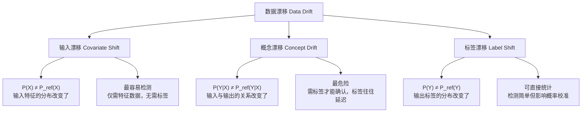
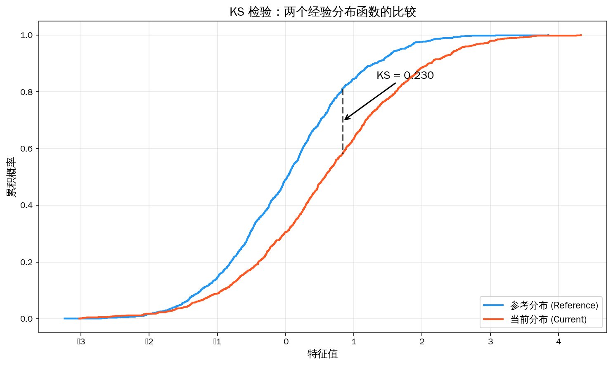
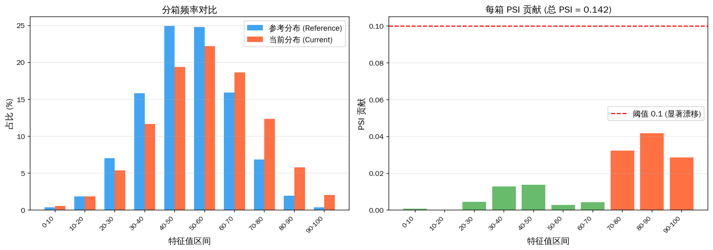

# 漂移检测

1986 年，美国卡内基梅隆大学的两位计算机科学家杰弗里·施利默（Jeffrey C. Schlimmer）和理查德·格兰杰（Richard H. Granger）在 AAAI 会议上发表了一篇题为《Beyond Incremental Processing: Tracking Concept Drift》的论文。他们设计了一个名为 STAGGER 的概念生成器，用三种离散属性（大小、颜色、形状）模拟突然发生的概念变化，并试图让学习系统自己发现"规则已经变了"这个事实。这篇论文的贡献不仅在于提出了一个至今仍在被广泛引用的实验基准，更在于它命名了一个后来成为机器学习运维核心关注点的问题：概念漂移（Concept Drift）。

十年后，奥地利人工智能研究所的格哈德·维德默（Gerhard Widmer）和美国计算机科学家米罗斯拉夫·库巴特（Miroslav Kubat）在 1996 年发表了《Learning in the Presence of Concept Drift and Hidden Contexts》，提出了 FLORA 系列自适应学习算法，首次系统区分了概念漂移的不同形式，并将漂移检测与模型自适应策略联系了起来。从此，漂移检测不再只是一个理论好奇，而是逐渐成为生产环境中机器学习系统必须直面的工程挑战。

机器学习模型建立在一条优雅但脆弱的假设之上：训练数据的分布与未来数据的分布相同。现实世界中，这条假设几乎从不成立。季节更替改变消费行为，政策调整影响市场走势，突发事件颠覆历史模式，数据生成过程本身就是非平稳的。漂移不是 bug，它是真实世界在数据中的自然投影。漂移检测要回答的问题很直接：分布变了吗？变了多少？是哪种类型的漂移？是否需要采取行动？这些问题听起来朴素，但在高维特征空间、海量数据流、标签延迟反馈的生产环境中，每一个都不容易回答。

## 漂移检测的核心问题

### 漂移的必然性

如果你曾在不同季节逛过同一家超市，你就已经亲身体验过数据漂移。夏天，冰镇饮料和防晒霜占据货架黄金位置；冬天，同样的位置变成了热饮和护手霜。超市的"商品陈列模型"必须随着季节调整，因为它面对的数据分布本身就在周期性波动。机器学习模型面对的世界也是同样的道理：真实世界的数据生成过程是非平稳的（Non-stationary），分布漂移不是偶发的异常，而是常态。

漂移在时间维度上呈现出不同的形态。最温和的是缓慢渐变，比如消费者偏好随着社会文化变迁而逐年调整，几年前流行的款式今天可能无人问津，这种变化润物无声，短期监测很难察觉但长期累积效应显著。周期性波动则如潮汐般有规律可循，电商平台的大促周期、季节性的用电量变化都属于此类，它们虽然反复横跳，但模式本身是可预期的。最棘手的是突发剧变，比如 2020 年疫情初期，线上消费行为几乎在一夜之间发生了质变，所有基于历史数据训练的模型同时失效。一个耐人寻味的悖论是：模型在训练数据上拟合得越好，面对分布变化时可能越脆弱。过拟合于特定分布的模型像是背熟了旧题库的学生，遇到换了考点的同一门考试反而无从下手。这正是静态模型在动态世界中的根本困境。

### 漂移与模型退化的因果关系

有了漂移检测的经验之后，很容易陷入一个思维定式：数据漂移了，模型性能必然退化。但二者的关系远比直觉复杂。数据漂移不必然导致模型退化：假如某个特征的分布发生了显著偏移，但这个特征本身对模型决策的贡献微乎其微，那么决策边界纹丝不动，模型的实际表现并不会受影响。反过来，模型退化了，也未必是漂移的锅，特征管道的一个字段格式变更、标签定义被上游系统悄悄修改，都可能导致预测质量断崖式下跌，而特征分布看起来一切正常。

因此，漂移检测与[模型性能监控](model-performance-monitoring.md)之间构成了互补而非替代的关系。漂移检测扮演的是早期预警系统的角色：它像地震仪一样感知数据层的细微变化，在模型性能指标（需要延迟到来的真实标签才能计算）恶化之前发出信号。但预警不是确诊，漂移信号只是告诉你"情况有变"，至于这个变化是否需要干预、如何干预，需要结合业务上下文和后续诊断。从漂移到退化的传导链路大致是：数据漂移导致特征分布与训练时偏离，模型输入进入它不熟悉的区域，预测偏差逐渐累积，最终反映为性能指标的下滑。

### 漂移检测的粒度

讨论漂移检测之前，必须先明确"什么在漂移"。学界通常从条件概率的视角将漂移区分为三种粒度，理解这三种漂移的区别是选择检测方法和应对策略的前提。



输入漂移（Covariate Shift）描述的是输入特征 $X$ 的边际分布发生了变化，即 $P(X) \neq P_{\text{ref}}(X)$。这是最直观也最容易检测的漂移类型，因为不需要标签就能判断。举个例子：你的模型用于预测贷款违约，训练时申请人的年龄集中在 30~50 岁，但最近系统接入了一个学生贷款渠道，大量 20 岁左右的申请人涌入，这就是典型的输入漂移。

概念漂移（Concept Drift）描述的是给定相同输入时，输出标签的条件概率发生了变化，即 $P(Y|X) \neq P_{\text{ref}}(Y|X)$。换句通俗的话说：同样的输入，答案却不同了。这是最危险的漂移类型，因为它直接动摇了模型的决策基础，而且检测它需要标签数据，而标签往往是延迟到达的。疫情期间，同样的收入水平和负债情况对应的违约概率可能全面上升，旧的风险模型不再准确，这就是概念漂移的真实写照。

标签漂移（Label Shift）描述的是输出标签的边际分布发生了变化，即 $P(Y) \neq P_{\text{ref}}(Y)$。好比垃圾邮件过滤模型中，某段时间诈骗邮件爆发式增长，正负样本比例从 1:9 变成了 3:7。标签漂移不改变输入和输出的对应关系本身，但破坏了模型的概率校准，原本 0.8 的预测置信度可能不再意味着 80% 的真实概率。

这三种漂移类型可以这样直观区分：输入漂移是"问题的样子变了"，概念漂移是"问题的答案变了"，标签漂移是"答案的比例变了"。在生产环境中，它们往往不是孤立发生的。一场突发的市场事件可能同时导致某类用户激增（输入漂移）、他们的消费偏好改变（概念漂移）、最终的转化率整体下滑（标签漂移），三者在时间轴上交织在一起，让根因分析变得异常困难。

## 漂移类型的深入分析

上一节从定义层面区分了三种漂移，但仅知道"P(X)变了"还远远不够。实际工作中，同一个漂移类型可以以完全不同的时间形态出现，对应着截然不同的应对策略。这一节我们分别深入探讨三种漂移的微观特征、典型成因和实际影响。

### 输入漂移

输入漂移是漂移检测系统最常发出的警报，也最容易触发"狼来了"式的疲劳。它之所以容易被检测，根本原因是不需要标签：只要拿到了特征数据，就能直接比较参考分布和当前分布。但这也意味着输入漂移的"检测容易"与"判断重要"之间存在巨大的鸿沟。

从时间形态来看，输入漂移可以分为渐变型和突发型两类。渐变型漂移像是河床的缓慢抬升，用户年龄分布随着产品定位的调整而逐年偏移，传感器精度以月为单位退化，这些变化单日来看微乎其微，但在季度尺度上累积效应显著。突发型漂移则像是管道爆裂，数据采集传感器因硬件故障产生系统性偏置，上游特征管道的一次代码变更不小心改变了某个字段的编码方式，这些都会在几分钟内让特征分布面目全非。突发型漂移的检测不困难，难点在于定位根因：是数据采集出了问题，还是外部世界真的发生了一次突变？

输入漂移中最容易让运维团队疲于奔命的是虚荣漂移（Vanity Drift）。它指的是在统计检验上显著、但在业务上无关紧要的分布变化。比如用户注册时填写的"兴趣爱好"标签，它的分布可能因为前端 UI 改版而变化，但模型从未依赖这个特征做决策。如果不加区分地对所有特征的漂移一视同仁地告警，运维人员很快就会被淹没在误报之中，错过真正关键的信号。识别虚荣漂移的关键是建立特征重要性图谱：只有模型真正依赖的特征，其漂移才值得关注。

### 概念漂移

如果说输入漂移是"狼来了"，概念漂移就是那只真的狼，而且它经常在你看不到它的时候就已经进了羊圈。概念漂移的可怕之处在于：输入特征的分布看起来一切正常，但输入与输出之间的关系已经悄然改变。你看到的特征值还是那些特征值，但它们指向的答案已经不同了。

从时间形态来看，概念漂移有三种典型模式。渐变型概念漂移最为常见也最难觉察，比如消费者的品牌偏好随着社会潮流缓慢迁移，同样是"价格在 200-300 元区间"这个特征，五年前指向"中高端消费"，现在可能只是"日常消费"，标签的含义在无声中发生了变化。突发型概念漂移通常由外部事件触发，政策法规的调整会重写风险规则，2020 年疫情期间，同样的收入和负债水平对应的违约概率几乎在一夜之间全面改变，所有基于历史数据训练的信用评分模型同时失效。循环型概念漂移则像是四季更替，同一个电商模型在促销季和平销期需要不同的决策逻辑，因为用户的行为模式本身呈现周期性切换。

检测概念漂移最根本的困难在于标签延迟。要知道 $P(Y|X)$ 是否变化，必须有足够的新样本的标签来估计条件概率，而标签往往需要数天甚至数周才能回流。等到确认概念漂移已经发生时，模型可能已经基于错误的假设运行了很长时间。这也是为什么在实际工作中，概念漂移检测往往退化为模型性能监控的辅助手段：与其试图直接检测 $P(Y|X)$ 的变化，不如监控模型预测误差的上升趋势，用性能退化作为概念漂移的代理信号。

### 标签漂移

标签漂移是三兄弟中检测门槛最低的，因为只需要统计正负样本的比例变化，不需要比较复杂的分布。假设你的欺诈检测模型在训练集上的欺诈率为 1%，但最近一个月的实际欺诈率上升到了 3%，这就是典型的标签漂移。

标签漂移和输入漂移之间存在着微妙的耦合关系。很多时候，标签漂移是输入漂移的结果：如果某类高风险用户（特定年龄、特定职业特征）的占比突然增加，那么标签分布自然也会跟着变化。但二者也可以独立发生，比如在垃圾邮件过滤的场景中，诈骗分子批量更换了邮件模板，输入特征几乎不变但垃圾邮件总数却翻了倍。区分"标签漂移是因输入漂移导致的附带效应"还是"标签分布在输入分布不变的情况下独立变化"，对后续的模型更新策略至关重要：前者需要重新采样或加权训练，后者可能需要调整分类阈值或重新校准概率。

标签漂移对模型的最直接伤害是破坏了概率校准。一个在 1% 先验欺诈率下训练好的模型，其输出的 0.8 概率对应着特定的后验概率含义。当先验率变为 3% 时，同样的 0.8 不再意味着同样的置信度，模型的预测分数尺度出现了偏移。好在标签漂移的修正相对成熟，通过重要性加权或贝叶斯校正可以在不重新训练模型的情况下完成概率校准，这块内容我们在后续的[模型更新策略](model-update-strategies.md)一章中会详细展开。

## 统计检测方法

理解了漂移的三种类型及其时间形态之后，接下来面对的是更实际的工程问题：如何在大量的特征、高维的空间和流式的数据上，把一个"分布变了"的直觉转化为可量化、可自动化的检测流程。统计检测方法从检视角可以分为三类：逐特征逐个比较的单变量方法，同时考虑特征间关系的多变量方法，以及专门为流式数据设计的时序方法。三类方法各有适用场景，下面逐一展开。

### 单变量漂移检测

单变量方法是最直观的漂移检测思路：对于每一个特征，分别计算参考分布和当前分布之间的差异程度，超过预设阈值则告警。这类方法的优点是计算简单、结果可解释，缺点是只能捕捉各自特征的边际分布变化，面对"每个特征看起来都没问题但联合分布已经面目全非"的情况无能为力。

**KS 检验**（Kolmogorov-Smirnov Test）是比较两个一维分布差异的经典非参数方法，由苏联数学家安德雷·柯尔莫戈洛夫（Andrey Kolmogorov）于 1933 年和斯米尔诺夫（Nikolai Smirnov）于 1948 年分别提出。它的核心思想非常直观：将两个分布的累积分布函数（CDF）画在同一张图上，找出两者之间垂直距离最大的那个点，这个最大距离就是 KS 统计量。

$$D_{\text{KS}} = \sup_{x} \left| F_{\text{ref}}(x) - F_{\text{cur}}(x) \right|$$

这个公式看着抽象，拆开来看含义很直观：
- $F_{\text{ref}}(x)$ 是参考数据的经验累积分布函数，表示在参考数据中特征值不超过 $x$ 的样本占比
- $F_{\text{cur}}(x)$ 是当前数据的经验累积分布函数，同样的含义但基于新数据
- $\sup_x$ 表示在所有可能的 $x$ 取值上取上确界，通俗地说就是"找出两个函数相差最大的那个位置"
- 整体公式可以理解为：用两条分布曲线之间的最大间隙来衡量它们有多不像

KS 检验适用于连续型特征，不需要假设数据服从任何特定分布，对分布的形状变化、位置平移和尺度变化都敏感。



*图：KS 检验中两个经验分布函数的叠加比较。蓝色曲线为参考分布的 CDF，橙色曲线为当前分布的 CDF，黑色虚线标注了两者差异最大的位置，即 KS 统计量。*

**PSI**（Population Stability Index，群体稳定性指数）是金融风控领域使用最广泛的漂移指标，最早用于评估信用评分卡在不同时间段的稳定性。它的计算方式是将特征值分箱后，比较每个箱中参考分布和当前分布的样本占比差异，再用相对熵加权求和。

$$\text{PSI} = \sum_{i=1}^{B} (p_i^{\text{cur}} - p_i^{\text{ref}}) \cdot \ln\left( \frac{p_i^{\text{cur}}}{p_i^{\text{ref}}} \right)$$

这个公式看似复杂，拆开来看含义很直观：
- $B$ 是分箱的数量，通常取 10 或 20
- $p_i^{\text{ref}}$ 是参考数据在第 $i$ 个箱中的样本占比
- $p_i^{\text{cur}}$ 是当前数据在第 $i$ 个箱中的样本占比
- $(p_i^{\text{cur}} - p_i^{\text{ref}})$ 衡量了该箱占比的绝对变化量
- $\ln(p_i^{\text{cur}} / p_i^{\text{ref}})$ 衡量了相对变化程度，变化越大这个对数项越大
- 整体公式可以理解为：对每个箱子，变化的幅度乘以变化的相对强度，再对所有箱子求和

PSI 的常用阈值经验是：PSI < 0.1 表示分布基本稳定，0.1 ≤ PSI < 0.25 表示中度漂移，PSI ≥ 0.25 表示显著漂移。需要特别指出的是，这些阈值是经验性的，不同业务场景和特征类型应该根据历史数据校准自己的阈值。



*图：PSI 计算过程的可视化。左图为参考分布和当前分布在各箱子中的占比对比，右图为每个箱子对最终 PSI 值的贡献，红色虚线标注了 0.1（显著漂移）的阈值。*

**卡方检验**（Chi-Square Test）专门用于离散型或已分箱的类别特征。它比较每个类别在参考数据和当前数据中的观测频数与期望频数的差异，差异的平方经过标准化后求和，得到卡方统计量。卡方值越大，两个分布来自同一总体的可能性越小。此外，**Wasserstein 距离**（也称推土机距离，Earth Mover's Distance）通过计算将一个分布"搬运"为另一个分布所需的最小代价来衡量分布差异，它对分布的平移特别敏感，适合捕捉"整个分布向某个方向滑动"的模式。

单变量漂移检测最大的局限不是精度，而是视角。逐特征检测意味着它天然无法感知特征之间的相关性变化。想象一个简化的信贷场景：收入和负债率这两个特征各自分布都漂移了 5%，分别看都不算严重。但如果这两个特征的相关性发生了翻转（原本高收入者负债率低，现在高收入者也高负债），模型的决策边界可能已经完全失效。这种相关性变化不会出现在任何单变量的漂移统计量上。

### 多变量漂移检测

多变量漂移检测试图弥补单变量方法的视角盲区，代价是计算复杂度的跃升和可解释性的相应下降。最直接的挑战来自高维空间中的"维数诅咒"：当特征维度从 1 上升到 10，描述联合分布所需的样本量呈指数增长，而实际业务中动辄数百维的特征让直接比较联合分布变得不切实际。

**基于降维的方法**将高维数据映射到低维空间后再做分布比较。最常用的降维手段是 PCA（主成分分析），先用参考数据拟合 PCA 变换矩阵，再将参考数据和新数据分别投影到前几个主成分方向，在低维空间中使用单变量方法或者直接对比散点图的覆盖区域。自编码器（Autoencoder）是 PCA 的非线性扩展，通过神经网络学习压缩表示，对复杂非线性关系的捕捉能力更强。降维方法的洞察在于：如果数据的高维结构发生了实质性变化，这个变化也会体现在低维表示中。


*图：PCA 降维后的分布对比。蓝色散点为参考数据在前两个主成分方向的投影，橙色散点为当前数据，椭圆表示各自分布的 95% 置信区域。椭圆的位置偏移和形状变化直观地反映了多变量漂移。*

**基于分类器的方法**用一个巧妙的思路回避了直接建模高维分布的难题：将参考数据标为类 0，新数据标为类 1，训练一个二分类器来区分它们。如果分类器能轻易区分两类数据（AUC 接近 1），说明两个分布差异显著；如果分类器完全无法区分（AUC 接近 0.5），说明两个分布在特征空间中高度重叠。这个方法的优雅之处在于它借用了任何分类器的能力来自动学习特征间的交互关系，不需要手动指定要比较哪些联合分布。

**MMD**（Maximum Mean Discrepancy，最大均值差异）是核方法在漂移检测中的经典应用。它将两个分布映射到再生核希尔伯特空间（RKHS），然后比较它们在该空间中的均值嵌入是否相同。MMD 在数学上有一个重要性质：当使用特征核（如高斯核）时，MMD 等于零当且仅当两个分布完全相同。这使得 MMD 成为严格的多变量漂移检测指标。

$$\text{MMD}^2 = \mathbb{E}_{x,x'}[k(x,x')] - 2\mathbb{E}_{x,y}[k(x,y)] + \mathbb{E}_{y,y'}[k(y,y')]$$

这个公式看着抽象，拆开来看含义很直观：
- $x, x'$ 是来自参考分布的两个独立样本，$y, y'$ 是来自当前分布的两个独立样本
- $k(\cdot, \cdot)$ 是核函数（如高斯核），衡量两个样本在特征空间中的相似度
- 第一项 $\mathbb{E}[k(x,x')]$ 是参考分布内部的样本平均相似度
- 第三项 $\mathbb{E}[k(y,y')]$ 是当前分布内部的样本平均相似度
- 中间项 $-2\mathbb{E}[k(x,y)]$ 是参考样本和当前样本之间的交叉相似度，带负号意味着跨分布的相似度越高（分布越接近），MMD 越小
- 整体公式可以理解为：分布内部的相似度减去分布之间的相似度。当两个分布完全相同时，分布内和分布间的相似度相等，MMD 为零

多变量方法提供了更强的检测能力，但也要认识到代价：当检测报警响起时，解释"到底哪里漂移了"比单变量方法困难得多。实践中通常的做法是将多变量方法作为顶层哨兵，一旦触发警报，再逐个特征排查找到具体的漂移来源。

### 时序漂移检测

前述的单变量和多变量方法都假设数据是独立同分布地采集的，通过比较两个批次的统计量来判断漂移。但在流式数据场景中（实时模型预测、传感器数据流、交易流水），数据是逐条到达的，漂移可能在任何时刻发生，需要在没有完整"当前分布"的情况下在线判断。

**ADWIN**（ADaptive WINdowing）是自适应窗口方法的代表，由西班牙计算机科学家阿尔伯特·比费（Albert Bifet）和里克德·加瓦尔达（Ricard Gavaldà）在 2007 年提出。它的核心思想非常优雅：维护一个长度可变的时间窗口，不断尝试将窗口切成两段，如果任何切割位置的前后两段均值差异超过阈值，说明在这个切点处发生了漂移，于是丢弃切点之前的所有旧数据，窗口缩短。如果所有切点都没发现显著差异，窗口继续增长。这种自适应机制让 ADWIN 不需要预设窗口大小，在稳定时期积累更多历史信息提高估计精度，在变化时期迅速丢弃过时数据降低检测延迟。

**CUSUM**（Cumulative Sum，累积和）是工业界最经典的时序漂移检测方法，最初由英国统计学家埃万·佩奇（Ewan Page）在 1954 年提出，用于质量控制中的工序变化检测。它的工作机制像一个水位监测器：当观测值持续高于目标值时，正向累积量持续增加；当累积量超过预设阈值时触发报警。CUSUM 对持续的微小偏移特别敏感，而 KS 或 PSI 这类批量方法可能需要较大的偏移量才能检测到。


*图：时序漂移检测示意。上图展示模型误差率随时间的变化，绿色虚线为参考水平，橙色区域为漂移发生区间；下图展示对应的 CUSUM 正向和负向累积统计量，红色虚线为预设阈值，当 CUSUM 超过阈值时触发漂移报警。*

时序检测方法的一个核心权衡是延迟与准确率之间的取舍。窗口参数的选择直接影响检测效果：窗口设得太大，检测延迟高，可能在漂移已经严重损害业务后才发出警报；窗口设得太小，短期噪声容易被误判为漂移，频繁的假警报同样让运维团队疲惫。实际应用中通常需要结合业务容忍度来设定参数：对于高风险场景（如欺诈检测），宁可接受更多假警报也要降低漏检率；对于低风险场景（如内容推荐），可以容忍稍长的检测延迟换取更少的误报。

在线检测与离线检测的选择取决于数据场景和基础设施。在线检测逐条处理流式数据，适合需要实时响应的生产环境，但要求检测算法具有低计算复杂度和确定性延迟；离线检测定期批量处理，适合 T+1 的数据分析和周期性模型健康检查，可以使用计算密集但更精确的多变量方法。许多成熟的 ML 平台同时运行两种模式：离线检测负责深度诊断，在线检测负责实时预警。

## 代码实践

理论讲解中提到的 KS 检验、PSI 等概念，用代码实现起来并不复杂。下面的代码实现了一个轻量级的漂移检测工具集，涵盖了单变量检测（KS 检验和 PSI）与多变量检测（基于分类器的方法），并在模拟的分布偏移数据上验证效果。通过亲手运行这些代码，你将对"统计量怎么算"和"阈值怎么判"有更具体的体感。

```python runnable
import numpy as np
from scipy import stats
from sklearn.ensemble import RandomForestClassifier
from sklearn.metrics import roc_auc_score

# ============================================================
# KS 检验实现
# ============================================================
def ks_test(ref_data, cur_data):
    """
    计算两个一维分布之间的 KS 统计量和 p 值。

    核心步骤：
    1. 使用 scipy 的 ks_2samp 进行双侧 KS 检验
    2. 返回 KS 统计量（0~1）和 p 值
       - KS 越接近 1，两个分布差异越大
       - p 值越小，差异在统计上越显著
    """
    ks_stat, p_value = stats.ks_2samp(ref_data, cur_data)
    return ks_stat, p_value


# ============================================================
# PSI 计算实现
# ============================================================
def calculate_psi(ref_data, cur_data, bins=10):
    """
    计算 Population Stability Index (PSI)。

    核心步骤：
    1. 对参考数据和当前数据使用相同的分箱边界
    2. 计算每个箱中两类数据的样本占比
    3. 对每个箱计算 (p_cur - p_ref) * ln(p_cur / p_ref)
    4. 所有箱的贡献求和得到 PSI
    """
    # 统一分箱边界（基于参考数据的分布）
    bin_edges = np.percentile(ref_data, np.linspace(0, 100, bins + 1))
    bin_edges[0] = -np.inf   # 最左边界设为负无穷
    bin_edges[-1] = np.inf   # 最右边界设为正无穷

    # 统计每个箱的样本占比
    ref_counts, _ = np.histogram(ref_data, bins=bin_edges)
    cur_counts, _ = np.histogram(cur_data, bins=bin_edges)

    ref_pct = ref_counts / ref_counts.sum()
    cur_pct = cur_counts / cur_counts.sum()

    # 避免除零：给零占比的箱赋一个极小值
    epsilon = 0.0001
    ref_pct = np.where(ref_pct == 0, epsilon, ref_pct)
    cur_pct = np.where(cur_pct == 0, epsilon, cur_pct)

    # 计算 PSI
    psi_values = (cur_pct - ref_pct) * np.log(cur_pct / ref_pct)
    psi_total = np.sum(psi_values)

    return psi_total


# ============================================================
# 基于分类器的多变量漂移检测
# ============================================================
def classifier_drift_test(ref_data, cur_data):
    """
    训练一个二分类器区分参考数据和当前数据。
    如果 AUC 显著高于 0.5，说明两个分布在特征空间中有差异。

    核心步骤：
    1. 给参考数据打标签 0，当前数据打标签 1
    2. 合并数据，训练一个随机森林分类器
    3. 用 AUC 衡量分类器区分两类数据的能力
       - AUC ≈ 0.5：分布几乎相同
       - AUC > 0.7：存在明显的分布漂移
    """
    n_ref = len(ref_data)
    n_cur = len(cur_data)

    # 构建训练集：标签 0 = 参考数据，标签 1 = 当前数据
    X = np.vstack([ref_data, cur_data])
    y = np.array([0] * n_ref + [1] * n_cur)

    # 随机打乱，避免顺序偏差
    idx = np.random.permutation(len(y))
    X, y = X[idx], y[idx]

    # 训练随机森林分类器
    clf = RandomForestClassifier(n_estimators=50, max_depth=5, random_state=42)
    clf.fit(X, y)

    # 计算 AUC（用训练集的概率输出）
    y_pred_prob = clf.predict_proba(X)[:, 1]
    auc = roc_auc_score(y, np.array([0] * n_ref + [1] * n_cur))

    return auc


# ============================================================
# 在模拟数据上验证
# ============================================================
np.random.seed(42)

# 模拟三维特征数据
n_samples = 500
# 参考数据：标准正态分布
ref_data = np.random.normal(0, 1, (n_samples, 3))
# 当前数据：第 0 维均值偏移 0.6，第 1 维方差增大，第 2 维不变
cur_data = np.random.normal(0, 1, (n_samples, 3))
cur_data[:, 0] += 0.6          # 均值偏移（模拟输入漂移）
cur_data[:, 1] *= 1.5           # 方差增大（模拟分布展宽）

print("=" * 50)
print("漂移检测结果")
print("=" * 50)

# 逐特征 KS 检验
for i in range(3):
    ks, p = ks_test(ref_data[:, i], cur_data[:, i])
    status = "✓ 检测到漂移" if p < 0.01 else "✗ 未检测到漂移"
    print(f"特征 {i}: KS={ks:.4f}, p={p:.4f}  {status}")

print()

# 逐特征 PSI
for i in range(3):
    psi = calculate_psi(ref_data[:, i], cur_data[:, i])
    if psi < 0.1:
        level = "基本稳定"
    elif psi < 0.25:
        level = "中度漂移"
    else:
        level = "显著漂移"
    print(f"特征 {i}: PSI={psi:.4f} ({level})")

print()

# 多变量分类器检测
auc = classifier_drift_test(ref_data, cur_data)
if auc > 0.7:
    print(f"多变量分类器检测: AUC={auc:.4f} → 存在明显的多变量漂移")
elif auc > 0.55:
    print(f"多变量分类器检测: AUC={auc:.4f} → 存在轻微的多变量漂移")
else:
    print(f"多变量分类器检测: AUC={auc:.4f} → 未检测到多变量漂移")
```

运行结果清晰地展示了检测结果与数据真实情况的对应关系：特征 0 和特征 1 的 KS 统计量显著偏高、p 值接近零，说明单变量检测成功捕捉到了均值偏移和方差放大两个变化；特征 2 未做修改，KS 和 PSI 均未触发警报，体现了方法的特异性。多变量分类器的 AUC 远高于 0.5，验证了即使只有部分特征发生漂移，联合分布的变化也能被多变量方法有效捕获。

## 应用场景

不同的漂移检测方法适用于不同的业务场景和基础设施条件。下表从多个维度对比了三类方法的特点：

| 特性 | 单变量检测 | 多变量检测 | 时序检测 |
|:----:|:----------:|:----------:|:--------:|
| 计算复杂度 | 低，可并行处理大量特征 | 中到高，降维/核方法开销大 | 低到中，窗口维护为主 |
| 可解释性 | 高，每个特征独立报告 | 低，需额外分析定位根因 | 中，知道检测时间点 |
| 对相关性变化的敏感性 | 无法捕捉 | 能够捕捉 | 间接捕捉（通过统计量变化） |
| 在线处理能力 | 强，可增量更新分箱计数 | 弱，通常需要批量数据 | 强，专门为流式设计 |
| 典型工具 | KS、PSI、卡方检验 | MMD、分类器方法、PCA | ADWIN、CUSUM、Page-Hinkley |

单变量检测最适合作为漂移监控的基础层，对所有活跃特征进行日常筛查。金融行业的风控模型监控（月度 PSI 报告）和互联网行业的数据质量监控（小时级 KS 检查）都是单变量方法的典型应用场景。多变量检测更适合作为深度诊断的工具，在单变量方法无法解释性能退化、或需要更敏感的漂移预警时发挥作用，比如推荐系统在检测到用户行为分布的整体迁移时启动模型重训练流程。时序检测天然适用于实时推理场景：在线广告点击率预测、流式异常检测、交易反欺诈等，这些场景对检测延迟的要求远高于对可解释性的要求。

在实际的 MLOps 体系中，三类方法通常分层部署：时序检测作为实时哨兵在数据管道入口监控输入特征流，单变量检测定期（如每日或每周）产生每个特征的漂移报告，多变量检测在性能监控报警或前两类检测无法解释业务指标变化时进行深层分析。

## 本章小结

漂移检测是 MLOps 体系中连接"模型在训练"和"模型在生产"的桥梁。本章我们从施利默和格兰杰 1986 年首次提出概念漂移的概念讲起，沿着漂移的三种粒度（输入漂移、概念漂移、标签漂移）深入分析了各种漂移类型的微观特征和时间形态，然后介绍了从单变量 KS/PSI 到多变量 MMD/分类器方法再到时序 ADWIN/CUSUM 的完整检测工具箱。

本章没有深入讨论的一个核心问题是：检测到漂移之后应该怎么办。漂移检测只是第一步，告警本身不解决问题。后续的处理策略包括模型重训练（Retraining）、在线自适应学习（Online Learning）、集成模型动态加权等方法，这些内容将在[模型更新策略](model-update-strategies.md)一章中展开。另一个值得读者注意的问题是漂移检测本身的校准：如何为每个特征设定合适的统计阈值以避免告警风暴或漏检，这涉及多重假设检验校正和业务代价函数的权衡，值得在实际工程中持续关注和迭代。

## 练习题

1. 假设你维护一个垃圾邮件过滤模型。某天你发现模型预测出的垃圾邮件比例从 15% 突然上升到 40%，但所有输入特征的分布看起来与上周基本一致。这是哪种类型的漂移？你如何确认你的判断？

   <details>
   <summary>参考答案</summary>

   这是标签漂移的典型表现：输入特征 $P(X)$ 基本不变，但输出标签 $P(Y)$ 的分布发生了显著变化。要确认这个判断，首先直接统计近期实际标签（如果有延迟标签反馈的话）的正负样本比例，与训练集比较；如果标签未及到达，可以通过模型预测分数的直方图间接推断标签分布的变化。还要排除上游特征管道变更的可能性，确认"特征分布不变"不是因为数据采集方式改变了。

   如果确认是标签漂移，可以通过重要性加权或调整分类阈值来修正概率校准，而不一定需要重新训练模型。

   </details>

2. KS 检验和 PSI 都是单变量漂移检测方法，但它们的计算方式截然不同。请解释：在什么情况下 KS 检验能检测到漂移而 PSI 不能？反过来，什么情况下 PSI 能检测到漂移而 KS 检验不能？

   <details>
   <summary>参考答案</summary>

   **KS 能检测而 PSI 不能**：当分布发生了小范围的平移但没有跨越分箱边界时。PSI 依赖分箱计数，如果特征分布只在某个箱内部发生了平移（均值从箱的左侧移到了右侧，但样本仍然属于同一个箱），PSI 对此不敏感。而 KS 检验直接比较连续的经验 CDF，能够捕捉到任意位置的分布差异。

   **PSI 能检测而 KS 不能**：当分布在尾部的微小变化占总样本比例很小时。KS 检验取的是两个 CDF 的最大垂直距离，如果尾部的变化量很小，CDF 的最大差异可能发生在分布中心区域。但 PSI 通过分箱后加权，如果尾部某个箱的占比从 0.1% 变成了 1%（相对变化巨大），该箱对 PSI 的贡献会因为 $\ln(p_{\text{cur}}/p_{\text{ref}})$ 项而显著放大，从而被检测到。

   实践中两者通常配合使用：KS 检验捕捉整体分布的形状变化和位置偏移，PSI 捕捉局部箱内的占比变化，特别是尾部变化。

   </details>

3. 写一个函数，实现简化版的 ADWIN 窗口调整逻辑：输入一个误差率序列，当检测到两个子窗口的均值差异超过阈值时返回漂移发生的位置。

   <details>
   <summary>参考答案</summary>

   ```python runnable
   import numpy as np

   def simple_adwin(error_stream, delta=0.002, min_window=30):
       """
       简化版 ADWIN 漂移检测。

       核心思路：
       1. 维护一个滑动窗口
       2. 对窗口内每一个可能的切分点，比较前半段和后半段的均值差异
       3. 如果差异超过基于 delta 的自适应阈值，报告漂移，丢弃旧数据

       参数:
       error_stream: 误差率序列（或任何需要监控漂移的统计量）
       delta: 置信参数，delta 越小阈值越严格
       min_window: 最小窗口长度，避免在数据太少时误报

       返回:
       检测到漂移的位置列表（序列索引）
       """
       drift_points = []
       window = list(error_stream[:min_window])
       window_start = 0

       for t in range(min_window, len(error_stream)):
           window.append(error_stream[t])

           # 尝试窗口中的所有切分点
           best_cut = -1
           best_eps = 0
           n = len(window)

           for cut in range(1, n):
               w0 = window[:cut]    # 前半段（较旧的数据）
               w1 = window[cut:]    # 后半段（较新的数据）

               n0, n1 = len(w0), len(w1)
               mean0, mean1 = np.mean(w0), np.mean(w1)
               var0, var1 = np.var(w0), np.var(w1)

               # 自适应阈值（基于 Hoeffding 不等式）
               m = 1 / (1/n0 + 1/n1)
               delta_prime = delta / n   # 多重比较校正
               epsilon = np.sqrt(2 * m * np.log(2 / delta_prime))

               diff = abs(mean0 - mean1)
               if diff > epsilon and diff > best_eps:
                   best_eps = diff
                   best_cut = cut

           # 如果找到了显著差异的切分点，报告漂移并丢弃旧数据
           if best_cut > 0:
               drift_points.append(window_start + best_cut)
               window = window[best_cut:]
               window_start += best_cut

       return drift_points


   # 测试：在模拟数据上验证
   np.random.seed(42)
   n = 500
   stream = np.zeros(n)
   stream[:200] = 0.15 + np.random.normal(0, 0.02, 200)
   stream[200:] = 0.25 + np.random.normal(0, 0.02, 300)

   drifts = simple_adwin(stream, delta=0.002)
   if drifts:
       print(f"检测到漂移: 位置 {drifts} (真实漂移在 index=200)")
       for d in drifts:
           print(f"  漂移点 {d}: 前段均值={np.mean(stream[max(0,d-50):d]):.3f}, "
                 f"后段均值={np.mean(stream[d:min(n,d+50)]):.3f}")
   else:
       print("未检测到漂移")
   ```

   </details>