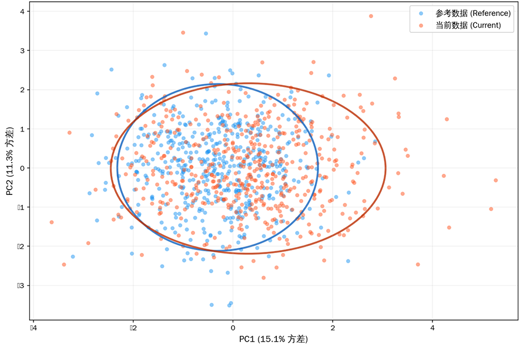
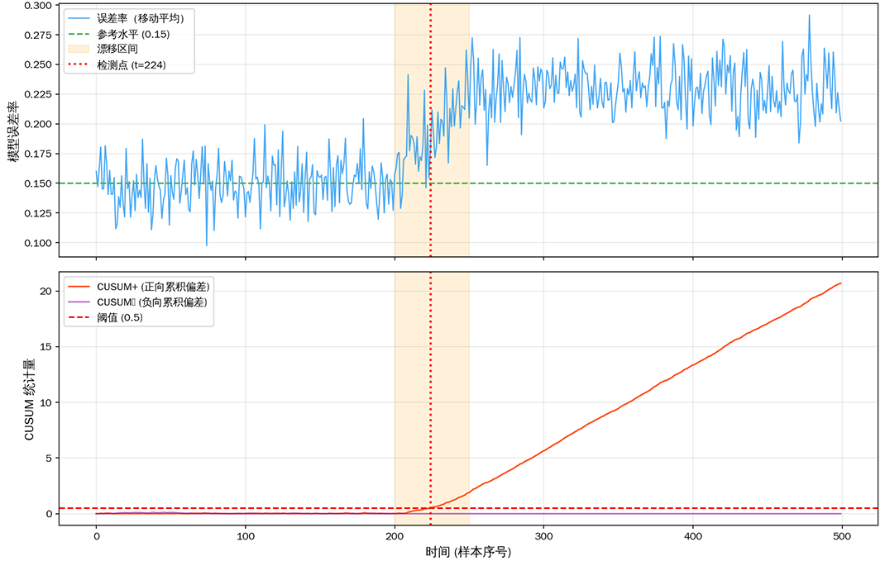

# 漂移检测

**漂移**（Drift）指的是模型训练时的数据分布与部署后的数据分布之间出现不一致的现象。1986 年，美国加州大学尔湾分校（UC Irvine）的两位计算机科学家杰弗里·施利默（Jeffrey C. Schlimmer）和理查德·格兰杰（Richard H. Granger）在 AAAI 会议上发表题为《[Beyond Incremental Processing: Tracking Concept Drift](https://aaai.org/papers/00502-aaai86-084-beyond-incremental-processing-tracking-concept-drift/)》的论文。他们设计了一个名为 STAGGER 的概念生成器，用三种离散属性（大小、颜色、形状）模拟突然发生的概念变化，并试图让学习系统自己发现规则已经变了这个事实。这篇论文的贡献不仅在于提出了一个至今仍在被广泛引用的实验基准，更在于它定义的漂移这个概念，成为后来数十年里机器学习运维主要关注点之一。

十年后的 1996 年，格哈德·维德默（Gerhard Widmer）和米罗斯拉夫·库巴特（Miroslav Kubat）发表了《[Learning in the Presence of Concept Drift and Hidden Contexts](https://link.springer.com/article/10.1007/BF00116900)》。这篇论文提出了 FLORA 系列自适应学习算法，首次系统区分了概念漂移的不同形式，并将漂移检测与模型自适应策略联系了起来。从此，漂移检测逐渐成为生产环境中机器学习系统必须应对的工程挑战。

## 漂移的必然性

机器学习模型在设计和训练阶段一般无法考虑漂移问题，它建立在"训练数据的分布与未来数据的分布相同"这条优雅但脆弱的假设之上。现实世界中，这条假设几乎从未真正成立。季节更替改变消费行为，政策调整影响市场走势，突发事件颠覆历史模式，数据生成过程本身就是非平稳的（Non-Stationary）。

漂移在时间维度上会呈现出不同的形态。有的是温和的缓慢渐变，譬如消费者偏好随着社会文化变迁而逐年调整，几年前流行的款式今天可能无人问津，这种变化润物无声，短期监测很难察觉但长期累积效应显著。也有剧烈的突发剧变，譬如 2020 年疫情初期，线上消费行为几乎在一夜之间发生了质变，所有基于历史数据训练的模型同时失效。还有周期性波动变化，譬如电商平台的大促周期、季节性的用电量变化都属于此类，它们虽然与平日呈现出巨大差异，但变化模式本身是可预期的。

漂移不是缺陷，它是真实世界在数据中的自然投影。漂移检测要回答的问题是分布是否发生了变化？变化了多少？是哪种类型的漂移？是否需要采取行动？这些问题听起来朴素，但在高维特征空间、海量数据流、标签延迟反馈共同影响下的生产环境中，每一个其实都并不容易回答。

### 漂移与模型退化

对于漂移，一个机器学习中的悖论是模型在训练数据上拟合得越好，面对分布变化时可能越脆弱。模型的泛化能力是有上限的，拟合于特定分布的模型像是背熟了旧题库的学生，遇到换了考点的同一门考试反而无从下手。这是静态的机器学习模型在动态的物理世界中必须面对的困境。上一章我们刚刚讨论了模型退化问题，漂移场景很容易让人陷入一个思维定式，认为数据漂移了，模型性能必然退化。但二者的关系远比直觉复杂。假如某个特征的分布发生了显著偏移，但这个特征本身对模型决策的贡献微乎其微，那么决策边界有可能会纹丝不动，模型的实际表现并不会受影响。反过来，模型退化了，也未必是漂移所导致的，特征管道的一个字段格式变更、标签定义被上游系统悄悄修改，都可能导致预测质量断崖式下跌，而特征分布看起来一切正常。

综上，漂移检测与[模型性能监控](model-performance-monitoring.md)之间构成了互补而非替代的关系。漂移检测扮演的是早期预警系统的角色。它像地震仪一样感知数据层的细微变化，在模型性能指标（需要延迟到来的真实标签才能计算）恶化之前发出信号。但这只是预警而非确诊，漂移信号只是告诉你情况有变，至于这个变化是否需要干预、如何干预，需要结合业务上下文和后续诊断。

### 漂移分类

从漂移到退化的传导链路要因漂移类型而异，在决定是否以及如何处理模型退化之前，必须先明确有什么东西在漂移。学术界通常从条件概率的视角将漂移区分为输入漂移、概念漂移、标签漂移三种粒度。对于输入漂移，模型输入进入它不熟悉的区域，预测偏差逐渐累积；对于概念漂移，则是在熟悉区域中条件概率分布本身已然改变。最终都反映为性能指标的下滑。

- **输入漂移**（Covariate Shift）描述的是输入特征 $X$ 的边际分布发生了变化，即 $P(X) \neq P_{ref}(X)$。这是最直观也最容易检测的漂移类型。举个具体例子，你的模型用于预测贷款违约，训练时申请人的年龄集中在 30-50 岁，但最近系统接入了一个学生贷款渠道，大量 20 岁左右的申请人涌入，这就是典型的输入漂移。

   输入漂移是漂移检测系统最常发出的警报，也最容易触发"狼来了"式的疲劳。输入漂移之所以容易被检测，根本原因是它完全不需要标签，只要拿到了特征数据，就能直接比较参考分布和当前分布。但这也造成了输入漂移易于检测、难于分辨的特点。输入漂移中最容易让运维团队疲于奔命的，是在统计检验上显著、但在业务上无关紧要的分布变化。譬如用户注册时填写的"兴趣爱好"标签，它的分布可能因为前端 UI 改版而变化，但模型一般不依赖这个特征做决策。如果不加区分地对所有特征的漂移一视同仁地告警，运维人员很快就会被淹没在误报之中，错过真正关键的信号。准确判断输入漂移的有效工具是建立特征重要性图谱，只有模型真正依赖的特征，其漂移才值得关注。

- **概念漂移**（Concept Drift）描述的是给定相同输入时，输出标签的条件概率发生了变化，即 $P(Y|X) \neq P_{ref}(Y|X)$。用通俗的话说，就是同样的输入，却有了不同的结果。这是最危险的漂移类型，因为它直接动摇了模型的决策基础，检测它需要标签数据，而标签往往又是延迟到达的。在经济危机期间，同样的收入水平和负债情况对应的违约概率可能全面上升，旧的风险模型不再准确，这就是概念漂移的真实例子。

   如果说输入漂移是"狼来了"，概念漂移就是那只真的狼，而且它经常在你看不到它的时候就已经进了羊圈。检测概念漂移最根本的困难在于[标签延迟](model-performance-monitoring.md#标签延迟问题)。要知道 $P(Y|X)$ 是否变化，必须有足够的新样本的标签来估计条件概率，而标签往往需要数天甚至数周才能回流。等到确认概念漂移已经发生时，模型可能已经基于错误的假设运行了很长时间。这也是为什么在实际工作中，概念漂移检测往往退化为模型性能监控的辅助手段。与其试图直接检测 $P(Y|X)$ 的变化，不如监控模型预测误差的上升趋势，用性能退化作为概念漂移的代理信号。

- **标签漂移**（Label Shift）描述的是输出标签的边际分布发生了变化，即 $P(Y) \neq P_{ref}(Y)$。好比垃圾邮件过滤模型中，某段时间诈骗邮件爆发式增长，正负样本比例从 1:9 变成了 3:7。标签漂移不改变输入和输出的对应关系本身，但破坏了模型的概率校准，原本 0.8 的预测置信度可能不再意味着 80% 的真实概率。

   标签漂移是三种漂移类型中检测门槛最低的，只需要统计正负样本的比例变化，不需要比较复杂的分布。假设你的欺诈检测模型在训练集上的欺诈率为 1%，但最近一个月的实际欺诈率上升到了 3%，这就是典型的标签漂移。标签漂移和输入漂移之间存在着微妙的耦合关系。很多时候，标签漂移是输入漂移造成的结果。如果某类高风险用户（特定年龄、特定职业特征）的占比突然增加，那么标签分布自然也会跟着变化。但二者也可以独立发生，如在垃圾邮件过滤的场景中，诈骗分子批量更换了邮件模板，输入特征几乎不变但垃圾邮件总数却翻了倍。区分标签漂移是因输入漂移导致的附带效应还是标签分布在输入分布不变的情况下独立变化，决定了后续的模型更新策略。前者需要重新采样或加权训练，后者可能需要调整分类阈值或重新校准概率。

   标签漂移对模型的最直接伤害是破坏了概率校准。一个在 1% 先验欺诈率下训练好的模型，其输出的 0.8 概率对应着特定的后验概率含义。当先验率变为 3% 时，同样的 0.8 不再意味着同样的置信度，模型的预测分数尺度出现了偏移。好在标签漂移的修正相对成熟，通过重要性加权或贝叶斯校正可以在不重新训练模型的情况下完成概率校准。

以上三种漂移类型可以用一句话来总结：输入漂移是"问题的样子变了"，概念漂移是"问题的答案变了"，标签漂移是"答案的比例变了"。在生产环境中，它们往往不是孤立发生的。一场突发的市场事件可能同时导致某类用户激增（输入漂移）、他们的消费偏好改变（概念漂移）、最终的转化率整体下滑（标签漂移），几种漂移在时间轴上交织在一起，让根因分析变得异常困难。

## 统计检测方法

将漂移的直觉判断转化为可量化、可自动化的检测过程，需要借助统计学工具，这类工具统称为统计检测方法。它要解决的核心问题是在大量特征、高维空间和流式数据上，判定两个分布是否存在显著差异。统计检测方法可以分为三类：逐特征逐个比较的单变量方法，同时考虑特征间关系的多变量方法，以及专门为流式数据设计的时序方法。三类方法各有适用场景，下面逐一展开。

### 单变量漂移检测

单变量方法对于每一个特征，计算参考分布和当前分布之间的差异程度，超过预设阈值则告警。这类方法的优点是计算简单、结果可解释，缺点则是视角受限。单变量方法只能捕捉单个特征的边际分布变化，无法感知特征之间的相关性漂移。即使每个特征看起来都正常，联合分布可能已经发生了显著变化，而单变量方法对此无能为力。想象一个简化的信贷场景：收入和负债率这两个特征各自分布都漂移了 5%，分别看都不算严重。但如果这两个特征的相关性发生了翻转（原本高收入者负债率低，现在高收入者也高负债），模型的决策边界可能已经完全失效。这种相关性变化不会出现在任何单变量的漂移统计量上。单变量方法的典型代表是模型性能监控中介绍过的 [KS 检验](model-performance-monitoring.md#统计检验方法)（Kolmogorov-Smirnov Test）和 [PSI 指数](model-performance-monitoring.md#统计检验方法)（Population Stability Index）。

除 KS 检验和 PSI 指数以外，单变量方法还有专门用于离散型或已分箱的类别特征的**卡方检验**（Chi-Square Test）。它比较每个类别在参考数据和当前数据中的观测频数与期望频数的差异，差异的平方经过标准化后求和，得到卡方统计量。卡方值越大，两个分布来自同一总体的可能性越小。此外，**Wasserstein 距离**（也称推土机距离，Earth Mover's Distance）通过计算将一个分布搬运为另一个分布所需的最小代价来衡量分布差异，它对分布的平移特别敏感，适合捕捉整个分布向某个方向滑动的模式。

### 多变量漂移检测

多变量漂移检测试图弥补单变量方法的视角盲区，代价是计算复杂度的跃升和可解释性的下降。最直接的挑战来自高维空间中的维数诅咒（Curse of Dimensionality）。当特征维度上升时，描述联合分布所需的样本量呈指数增长，实际业务中动辄数百维的特征使得直接比较联合分布几乎不可能。

**基于降维的多变量方法**将高维数据映射到低维空间后再做分布比较。最常用的降维手段是 [PCA 主成分分析](../../statistical-learning/unsupervised-learning/dimensionality-reduction.md)，先用参考数据拟合 PCA 变换矩阵，再将参考数据和新数据分别投影到前几个主成分方向，在低维空间中使用单变量方法或者直接对比散点图的覆盖区域。[自编码器](../../deep-learning/generative-models/vae.md#自编码器原理)（Autoencoder）可以视作一种 PCA 的非线性扩展，通过神经网络学习压缩表示，对复杂非线性关系的捕捉能力更强。降维方法背后的直觉是：如果数据的高维结构发生了实质性变化，这个变化也会体现在低维表示中。

下图是一个 PCA 降维后的分布对比的例子，蓝色散点为参考数据在前两个主成分方向的投影，橙色散点为当前数据，椭圆表示各自分布的 95% 置信区域。椭圆的位置偏移和形状变化直观地反映了多变量漂移。

*图：PCA 降维后的分布对比*

**基于分类器的多变量方法**用一个巧妙的思路回避了直接建模高维分布的难题。它将参考数据标为类 0，新数据标为类 1，训练一个二分类器来区分它们。如果分类器能轻易区分两类数据（AUC 接近 1），说明两个分布差异显著；如果分类器完全无法区分（AUC 接近 0.5），说明两个分布在特征空间中高度重叠。这个方法的优雅之处在于它借用了任何分类器的能力来自动学习特征间的交互关系，不需要手动指定要比较哪些联合分布。

**MMD**（Maximum Mean Discrepancy，最大均值差异）是[核方法](../../statistical-learning/support-vector-machines/kernel-methods.md)在漂移检测中的经典应用。它将两个分布映射到再生核希尔伯特空间（Reproducing Kernel Hilbert Space，RKHS），然后比较它们在该空间中的均值嵌入是否相同。可以粗略理解为通过核函数把数据变换到一个高维空间，在这个空间里两个分布的重心离得越远，代表漂移越严重。MMD 有一个数学性质：当使用特性核（如高斯核）时，MMD 等于零当且仅当两个分布完全相同。这使得 MMD 成为严格的多变量漂移检测指标。

多变量方法提供了更强的检测能力，但也面临更高的成本代价。它能够预警那些难以反映在单个变量的联合分布变化，但当检测报警响起时，解释"到底哪里发生了漂移"会比单变量方法困难得多。实践中通常的做法是将多变量方法作为顶层哨兵，一旦触发警报，再逐个特征排查找到具体的漂移来源。

### 时序漂移检测

前述的单变量和多变量方法都假设数据是独立同分布地采集的，通过比较两个批次的统计量来判断漂移。但在流式数据场景中（实时模型预测、传感器数据流、交易流水），数据是逐条到达的，漂移可能在任何时刻发生，需要在没有完整当前分布的情况下在线判断。

**ADWIN**（ADaptive WINdowing）是自适应窗口方法的代表，由西班牙计算机科学家阿尔伯特·比费（Albert Bifet）和里克德·加瓦尔达（Ricard Gavaldà）在 2007 年提出。ADWIN 维护一个长度可变的时间窗口，不断尝试将窗口切成两段，比较前后两段的均值。一旦某次切割的均值差异超过阈值，说明该切点处发生了漂移，随即丢弃切点之前的所有旧数据，窗口缩短。如果所有切点都没发现显著差异，窗口继续增长。这种自适应机制让 ADWIN 不需要预设窗口大小，在稳定时期积累更多历史信息提高估计精度，在变化时期迅速丢弃过时数据降低检测延迟。

**CUSUM**（CUmulative SUM，累积和）是另一种工业界频繁使用的经典时序漂移检测方法，最初由英国统计学家埃万·佩奇（Ewan Page）在 1954 年提出，用于质量控制中的工序变化检测。它的工作机制像一个水位监测器，当观测值持续高于目标值时，正向累积量持续增加。当累积量超过预设阈值时触发报警。CUSUM 对持续的微小偏移特别敏感，而 KS 或 PSI 这类批量方法可能需要较大的偏移量才能检测到。

下图是一个时序漂移检测的例子，展示了模型误差率随时间的变化，绿色虚线为参考水平，橙色区域为漂移发生区间。下方展示对应的 CUSUM 正向和负向累积统计量，红色虚线为预设阈值，当 CUSUM 超过阈值时触发漂移报警。

*图：时序漂移检测示意*

时序检测方法的一个工程权衡是延迟与准确率之间的取舍。窗口参数的选择会直接影响检测效果。窗口设得太大，检测延迟高，可能在漂移已经严重损害业务后才发出警报。窗口设得太小，短期噪声容易被误判为漂移，频繁的假警报同样让运维团队疲惫。实际应用中通常需要结合业务容忍度来设定参数。对于高风险场景（如欺诈检测），宁可接受更多假警报也要降低漏检率。对于低风险场景（如内容推荐），可以容忍稍长的检测延迟换取更少的误报。

在线检测与离线检测的选择取决于数据场景和基础设施。在线检测逐条处理流式数据，适合需要实时响应的生产环境，但要求检测算法具有低计算复杂度和确定性延迟。离线检测定期批量处理，适合次日（T+1）批处理的数据分析和周期性模型健康检查，可以使用计算密集但更精确的多变量方法。许多成熟的机器学习平台同时运行两种模式，让离线检测负责深度诊断，让在线检测负责实时预警。

## 应用场景

不同的漂移检测方法适用于不同的业务场景和基础设施条件。下表从多个维度对比了三类方法的特点：

| 特性 | 单变量检测 | 多变量检测 | 时序检测 |
|:----:|:----------:|:----------:|:--------:|
| 计算复杂度 | 低，可并行处理大量特征 | 中到高，降维/核方法开销大 | 低到中，窗口维护为主 |
| 可解释性 | 高，每个特征独立报告 | 低，需额外分析定位根因 | 中，知道检测时间点 |
| 对相关性变化的敏感性 | 无法捕捉 | 能够捕捉 | 间接捕捉（通过统计量变化） |
| 在线处理能力 | 强，可增量更新分箱计数 | 弱，通常需要批量数据 | 强，专门为流式设计 |
| 典型工具 | KS、PSI、卡方检验 | MMD、分类器方法、PCA | ADWIN、CUSUM、Page-Hinkley |

单变量检测适合作为漂移监控的基础层，对所有活跃特征进行日常筛查。金融行业的风控模型监控（月度 PSI 报告）和互联网行业的数据质量监控（小时级 KS 检查）都是单变量方法的典型应用场景。多变量检测更适合作为深度诊断的工具，在单变量方法无法解释性能退化或需要更敏感的漂移预警时发挥作用，譬如推荐系统在检测到用户行为分布发生全局偏移时触发模型重训练流程。时序检测天然适用于实时推理场景，如在线广告点击率预测、流式异常检测、交易反欺诈等，这些场景对检测延迟的要求远高于对可解释性的要求。

在实际的 MLOps 体系中，三类方法通常分层部署。时序检测作为实时哨兵，在数据管道入口监控输入特征流；单变量检测定期（如每日或每周）产生每个特征的漂移报告；多变量检测在性能监控报警或前两类检测无法解释业务指标变化时，进行深层分析。

## 本章小结

漂移检测的真正价值不在于它能告诉你分布变了，而在于它把"模型何时会失效"这个老问题变成了可度量的工程指标。这个问题从机器学习诞生之初就存在，过去只能被模糊地感知。没有漂移检测之前，模型部署上线后的状态基本是一个黑盒，运维团队只能等到业务指标下跌或者用户投诉才能意识到出了问题，事后追溯往往要花几天甚至几周。漂移检测让这个过程从事后救火变成了事前预警。

更深一层看，漂移检测标志着机器学习系统从实验室原型走向工业级产品时必须跨越的一道门槛。实验室里的模型只需要在固定测试集上证明自己比基线好，而生产环境中的模型需要在一个持续变化的世界里证明自己始终可靠。这种可靠性的基础不是更复杂的网络结构或者更大的训练数据，而是一套监控体系。这套体系能在模型开始偏离其设计假设时及时发现并告警。漂移检测就是这套体系中最核心的组件。

漂移本身不是缺陷。一个对季节变化毫无反应的推荐模型才是失败的模型，这说明它没有捕捉到真实世界中的有效信号。漂移检测的目的是区分两种变化：一种是模型应该学习但没有学到的模式迁移，这种漂移是模型更新和迭代的驱动力。另一种是数据质量的异常或管道故障导致的伪漂移，这种漂移是运维事故的信号。能够区分这两者，是一个成熟的 MLOps 团队与一个只会摆弄实验室产品的初级团队之间的差异。

## 练习题

1. 假设你维护一个垃圾邮件过滤模型。某天你发现模型预测出的垃圾邮件比例从 15% 突然上升到 40%，但所有输入特征的分布看起来与上周基本一致。这是哪种类型的漂移？你如何确认你的判断？

   

   
参考答案

   这是标签漂移的典型表现：输入特征 $P(X)$ 基本不变，但输出标签 $P(Y)$ 的分布发生了显著变化。要确认这个判断，首先直接统计近期实际标签（如果有延迟标签反馈的话）的正负样本比例，与训练集比较。如果标签尚未到达，可以通过模型预测分数的直方图间接推断标签分布的变化。另外还要排除上游特征管道变更的可能性，确认"特征分布不变"不是因为数据采集方式改变了。

   如果确认是标签漂移，可以通过重要性加权或调整分类阈值来修正概率校准，而不一定需要重新训练模型。

   

2. KS 检验和 PSI 都是单变量漂移检测方法，但它们的计算方式截然不同。解释在什么情况下 KS 检验能检测到漂移而 PSI 不能？反过来，什么情况下 PSI 能检测到漂移而 KS 检验不能？

   

   
参考答案

   **KS 能检测而 PSI 不能**：当分布发生了小范围的平移但没有跨越分箱边界时。PSI 依赖分箱计数，如果特征分布只在某个箱内部发生了平移（均值从箱的左侧移到了右侧，但样本仍然属于同一个箱），PSI 对此不敏感。而 KS 检验直接比较连续的经验 CDF，能够捕捉到任意位置的分布差异。

   **PSI 能检测而 KS 不能**：当分布在尾部的微小变化占总样本比例很小时。KS 检验取的是两个 CDF 的最大垂直距离。由于 CDF 是累积函数，尾部即使发生了数量级的相对变化，只要绝对占比很小，对 CDF 曲线形状的影响就微乎其微，此时 CDF 的最大差异仍然出现在分布中心区域——KS 因此漏检。而 PSI 直接对各分箱计算对数比并加权求和。如果尾部某个箱的占比从 0.1% 变成了 1%（相对变化巨大），该箱对 PSI 的贡献会因为 $\ln(p_{\text{cur}}/p_{\text{ref}})$ 项而被放大（单箱贡献约 $\ln(10) \times 0.009 \approx 0.021$），而 KS 的 CDF 差异在尾部仅为 0.009，可能未超过显著性阈值，从而未被 KS 检测到，但被 PSI 检测到。

   实践中两者通常配合使用：KS 检验捕捉整体分布的形状变化和位置偏移，PSI 捕捉局部箱内的占比变化，特别是尾部变化。

   
