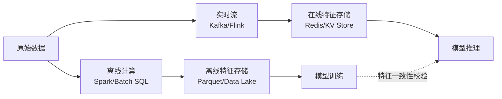
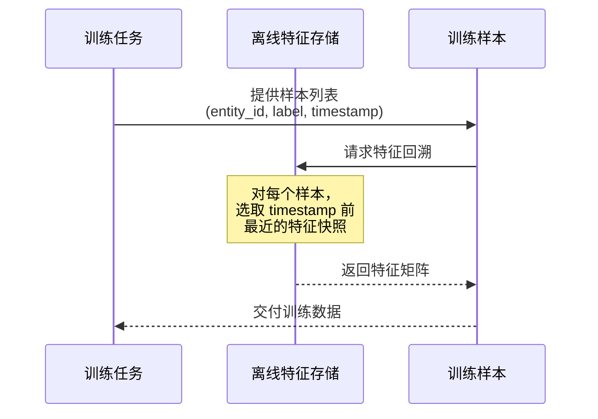
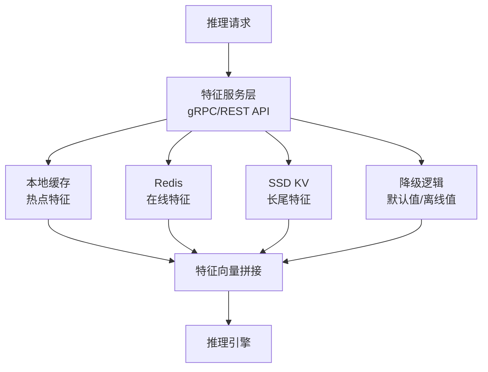

# 特征存储

2017 年 9 月，优步（Uber）的一篇技术博客介绍了 Michelangelo，这是一个支撑公司数百个机器学习模型的内部平台。在这篇技术分享中一个名为**特征存储**（Feature Store）的设计虽然只占了几段篇幅，却在随后的几年里引发了 MLOps 工具链的一轮基础设施变革。当时优步面临的问题是公司的推荐系统、风控模型、ETA 预测和司机匹配等数十个模型各自为战，每个团队的工程师都在独立计算同一批用户特征，重复投入却产出了大量互不一致的特征定义。

Michelangelo 给出的方案是建立一个统一的特征管理中间层，让特征只计算一次，所有模型共享同一份特征定义、同一套计算逻辑和一致的历史版本。这个设计理念很快引起了工业界的共鸣。2018 年底，由瑞典皇家理工学院主导的 Hopsworks 成为首个开源特征存储框架。一个月后的 2019 年 1 月，GoJek 与谷歌云联合发布了 Feast，后者逐渐成为开源社区事实上的标准特征存储。从此，特征存储从一个平台内部的设计模式，演变为 MLOps 领域的基础设施组件，被 Netflix、Airbnb、Spotify 等公司广泛采用，也催生了 Tecton 等商业产品。

如果说模型是机器学习中的产品，那么特征就是模型运行的燃料。特征存储要解决的核心问题，正是在规模化机器学习生产线中连接燃料的生产者和消费者，让特征定义有章可循、让特征计算可复用、让离线训练和在线推理使用完全一致的特征逻辑，从而消除模型在生产环境中最令人头疼的"训练 - 推理偏差"。

## 特征存储的核心问题

设想这样一个场景：推荐系统需要"用户过去 30 天的平均订单金额"作为推荐的输入，风控模型也需要同样的特征来做异常交易检测，运营团队在做用户分层时也会用到它。在没有统一特征管理的组织里，三个团队各自编写了一段 SQL 或 Spark 脚本来计算这个特征，各自部署在自己的任务流里。然后推荐团队计算时排除了取消订单，风控团队把取消订单计入了均值，运营团队使用了含运费的金额字段。同一个金额三个版本的计算结果却各不相同，如果一个模型需要跨团队复用特征，就会出现看似相同的特征实际含义不同的问题。特征不一致对业务的影响是实实在在的。如果推荐模型和搜索排序模型对"商品受欢迎程度"使用了不同的计算口径，用户会在推荐流和搜索结果中看到自相矛盾的排序结果，直接损害用户体验和平台收入。正因如此，特征的统一管理不是一个可有可无的工程优化，而是保证模型行为一致性的必要前提。

在典型的机器学习生产流程中，同一个特征存在在线、离线两种计算路径。离线路径为模型训练服务，面向的是数据仓库中海量的历史数据，计算延迟可以容忍数分钟甚至数小时。在线路径为模型推理服务，面对的是用户实时的请求，必须在毫秒级返回结果。以前这两条路径是完全独立的，缺乏统一的协调机制，成为机器学习生产中许多常见故障的来源。训练 - 推理偏差（Training-Serving Skew）是这种割裂最直接的体现。假设一个推荐模型在训练时使用的"用户近 30 天点击次数"特征是通过 Spark 任务基于 Hive 中的埋点日志逐日聚合计算的，而在线推理时同一个特征却是从 Redis 中读取的，由 Flink 任务根据 Kafka 实时流近 7 天的数据增量维护。由于窗口长度不同、数据新鲜度不同、聚合逻辑的实现方式不同（例如一个使用了精确去重的 HyperLogLog 近似，另一个使用了 COUNT DISTINCT），训练时和推理时同一个特征的值分布存在系统性偏差。模型在离线评估时指标很好，上线后效果却大打折扣，根因往往就藏在离线和在线特征的计算逻辑差异中。

这类问题的解决不能仅靠流程规范来约束 —— 在实际工程中，离线计算和在线推理往往由不同团队维护，使用不同的技术栈，沟通成本和理解偏差让"人工对齐"变得既不现实也不可靠。特征存储的一个核心价值主张，就是通过框架层面的约束来消除这种割裂：要么让离线计算和在线推理共享同一份特征定义和计算代码，由框架负责适配不同的执行引擎；要么让离线计算结果直接写入在线存储，推理时不再进行重复计算，从根本上避免逻辑不一致。

### 特征存储的架构定位

理解特征存储在数据架构中的位置，有助于理解它解决前面两类问题的根本思路。特征存储不是数据仓库的替代品，也不是模型训练框架的扩展，它介于数据仓库和模型之间，扮演着标准化中间层的角色。数据仓库存储的是原始的业务数据 —— 订单流水、用户行为日志、商品信息表。模型训练和推理消费的是特征向量 —— 从原始数据中经过变换、聚合、编码后得到的数值。特征存储的职责就是把这条从"原始数据"到"特征"的转换链路标准化地管理起来。

特征存储承担三项核心职责：首先是特征定义与注册，提供一个集中的目录来记录"有哪些特征、每个特征如何计算、谁在用这个特征"；其次是特征计算与调度，负责按定义执行离线批量计算和在线流计算，保证计算结果的时效性；最后是特征服务与交付，以统一的接口向训练任务和推理服务提供特征数据，屏蔽底层存储的差异。这三项职责环环相扣：没有统一的定义就没有正确的计算，没有正确的计算就谈不上可靠的服务。

值得注意的是，特征存储并不负责原始数据的采集和存储，也不参与模型的具体训练和推理过程。它专注于"特征"这一层级的标准化管理，这个边界清晰的设计让特征存储可以与现有的大数据平台和机器学习框架集成，而不需要对已有的基础设施进行大幅改造。

## 特征定义与注册

如果说特征存储是特征管理的骨架，那么特征定义与注册就是这副骨架的关节。在日常协作中，让三个团队使用同一个特征的前提是：他们对"这个特征是什么"的认知是一致的。这不仅要求定义一个特征名和数据类型，更需要建立一套包含实体关联、语义标注、血缘追溯在内的完整元数据体系。从软件工程的角度看，这相当于为特征建立了一个类型系统：就像编程语言中的类型系统防止了函数调用时的参数不匹配，特征的元数据体系防止了跨团队协作中的语义混淆。

### 特征实体与特征组

在定义特征之前，需要先明确特征"描述的是谁"。一个电商平台关心的对象包括用户、商品、商户和交易等实体，每个实体有独一无二的标识键（Entity Key）。描述用户年龄的特征 `user_age`，其关联键是 `user_id`；描述商品近 7 天销量的特征 `item_7d_sales`，其关联键是 `item_id`。定义特征时必须绑定它所依附的实体键，这就规定了特征的"粒度"：一个以 `user_id` 为键的特征，不能直接用在以 `item_id` 为主键的模型输入中，除非通过实体关系进行 join。

把逻辑相关的特征组织在一起就形成了特征组（Feature Group）。一个"用户画像"特征组可能包含年龄、性别、会员等级、注册天数、近 30 天消费额等特征，它们共享同一个实体键 `user_id`、相同的更新频率和计算策略。特征组不仅是逻辑分组，也是版本管理和权限控制的基本单元 —— 当某个特征的计算逻辑发生变化时，通常会导致整个特征组的版本升级，而不是单独一个特征的版本号变更。在 Feast 中，特征组对应的概念是 Feature View，它是一个特征集的逻辑视图，定义了从数据源到特征值的完整转换过程。

特征组的定义包含一套完整的规格说明：所属实体键、包含的特征列表及其数据类型、计算逻辑描述、更新频率和存储策略。例如，"用户画像"特征组的定义可能指定使用 Spark 批处理在每天凌晨从数据仓库中计算，结果写入离线特征表并同步到 Redis 在线存储，保留最近 90 天的历史快照。这套规格让所有消费方在调用特征之前就能了解它的时效性、可用性和语义边界，不再需要翻代码或问同事来确认"这个特征到底是什么"。

### 特征元数据模型

如果说特征定义规定了特征"是什么"和"怎么算"，那么元数据则记录了特征的"身世"和"去向"。一个完整的特征元数据模型包含几个层次的描述信息。最基础的是标识层：特征名称、数据类型、所属特征组和实体键，这些字段构成了特征的唯一标识和基本属性。往上一层是语义层：特征的业务含义描述、取值范围、空值处理策略和异常值定义，这一层信息降低了特征使用者的理解成本 —— 面对一个名为 `user_score_v2` 的特征，语义描述能告诉新成员它是基于什么指标合成的综合评分，取值范围是 0 到 1000 还是经过标准化的 z-score。

更重要的是血缘关系（Lineage）这一层。血缘关系记录了特征的上游数据源和下游消费者：`user_age` 来源于数据仓库的 `dim_user_base_info` 表的 `birth_date` 字段，经过了 `(current_date - birth_date) / 365` 的转换；下游消费方包括推荐模型 `recall_model_v3` 和搜索排序模型 `search_rank_v1`。当上游表的字段变更或下线时，血缘关系使得影响分析成为可能：平台可以自动通知所有受影响的下游模型负责人，避免变更静默破坏模型行为。类似地，当一名工程师想要修改特征的计算逻辑时，它能清楚地看到这个特征被哪些模型使用，判断变更的影响范围。

元数据还支撑了特征发现的效率。在拥有数百个特征的大型机器学习组织中，新人或新项目不会因为"不知道有什么特征可用"而重复造轮子。通过实体键和语义标签搜索，"我需要一个描述用户消费能力的特征"可以快速定位到已有的 `user_avg_order_amount_30d` 和 `user_clv_score` 等特征，直接复用而非重新定义。这种元数据驱动的协作模式，让特征管理的成本从"发现 - 理解 - 复用"的线性增长，变成了"注册一次，随处可用"的常数成本。

### 特征版本与演化

特征的计算逻辑会随着业务需求的变化而演化，这与软件系统中的代码变更本质上没有区别。一个"近 7 天消费额"特征，最初的定义是简单的 `SUM(amount) WHERE date >= CURRENT_DATE - 7`。后来业务方发现退款金额不应该计入消费额，于是 v2 版本改为 `SUM(amount) WHERE date >= CURRENT_DATE - 7 AND status != 'refunded'`。再后来，财务部门要求按实际到账金额计算，v3 版本的逻辑又加上了对支付渠道状态的过滤。每一次逻辑变更都是一个新版本，旧版本的特征值需要保留，因为已上线的模型是基于旧版本的特征训练出来的，贸然覆盖会破坏模型行为。

特征版本管理的关键问题不是"要不要做版本化" —— 这是显而易见的 —— 而是"版本变更后下游模型怎么办"。如果 v1 和 v2 的输出格式完全兼容（都是浮点数，取值范围相近），下游模型可以平滑切换，只需在新的训练任务中使用 v2 特征重新训练模型。但如果 v2 改变了输出格式（例如从一个标量变成一个向量，或者改变了编码方式），那么所有依赖于该特征的模型都需要修改输入层并重新训练。这种不兼容变更的成本极高，因此在实践中，特征存储通常会约束变更策略：新增特征字段不破坏旧版本（向后兼容），而修改核心计算逻辑则必须创建新版本，旧版本保留一段过渡期后再下线。

特征的废弃也有严格的流程规范，类似于 API 的 deprecation 机制。首先是标记废弃（deprecated），通知所有下游消费者这个特征即将下线，并建议迁移到新版本；然后设置一个明确的下线时间，给消费者留出适配窗口；最后在确认不再有活跃消费者后执行删除。在 Feast 这类开源框架中，特征版本管理通过 Feature View 的 `version` 字段来实现，旧版本的 Feature View 不会被物理删除（除非显式调用 purge），而是标记为不可用于新的训练任务，但已注册的在线特征值仍可继续服务以保证推理不中断。

## 特征计算与调度

特征定义解决了"特征是什么"的问题，特征计算则负责"特征从哪来"的实际执行。这是特征存储中最消耗计算资源的一环，也是最考验工程能力的一环：离线计算要在海量历史数据上产出高质量特征，在线计算要在毫秒级延迟内维护特征的实时更新，而二者之间的数据一致性更需要细致的工程约束来保证。我们先从离线计算开始，因为它承担了特征生产的大部分工作量。

### 离线特征计算

离线特征计算是特征存储的"生产车间"。每天凌晨，当数据仓库完成前一日的 ETL 任务后，特征计算的调度任务就启动了：从数据仓库读取原始表，执行特征变换逻辑，将计算结果写入离线特征存储。这是一套典型的批量数据处理流程，规模可以非常庞大 —— 在一个亿级用户的平台上，单次离线特征计算可能需要处理数百 TB 的数据，产出数万维的特征向量。

计算框架的选择取决于特征变换的复杂度。对于大部分聚合类特征（求和、计数、均值等），SQL 是最直接的选择：`SELECT user_id, AVG(amount) as avg_order_amount FROM orders WHERE date >= DATE_SUB(CURRENT_DATE, 30) GROUP BY user_id`。当数据量达到数百 TB、需要跨多个数据源进行复杂 join 时，Spark 的分布式计算能力变得不可或缺。对于一些无法用 SQL 表达的复杂逻辑 —— 例如对用户行为序列做自定义编码、或用训练好的 embedding 模型对文本特征做向量化——Python UDF（用户自定义函数）提供了灵活性，但也带来了性能开销和可维护性的挑战。

一个实际场景中经常遇到的技术决策是增量计算和全量计算的权衡。全量计算最简单：每次调度时重算所有历史数据，逻辑清晰但计算代价大，对于一个需要回溯 90 天窗口的特征而言，每次重算 90 天的数据意味着大量重复计算。增量计算只处理新增的数据，将结果与历史累积值合并，效率高得多，但实现复杂 —— 需要维护聚合的中间状态，处理迟到数据的修正，以及应对故障时的状态恢复。在特征存储的实际应用中，大多数聚合特征采用增量计算模式，只有需要定期修正历史数据或变更计算口径的场景才执行全量重算。

回填（Backfill）是离线计算的另一个重要场景。当团队新增了一个特征 —— 例如"用户近 3 个月的购买品类偏好分布" —— 仅仅从今天开始计算是不够的，因为训练模型需要过去数月的特征值来与标签对应。回填任务就是为新特征计算历史时间窗口的特征值：从历史数据中逐日、逐小时地模拟增量计算，生成从指定起始时间至今的完整特征快照序列。回填的工程挑战在于效率和正确性的兼顾：对于需要回溯一年历史的大型特征组，全量回填可能耗时数天，需要依赖分布式计算框架的弹性伸缩能力；同时，回填结果必须满足 Point-in-Time Correctness（时刻点正确性）——历史时刻的特征值只能使用该时刻之前的数据，严格避免数据泄露。

### 在线特征计算

在线特征计算服务于模型推理。当一个用户打开 APP 时，推荐模型需要在 100 毫秒内返回个性化结果，而作为模型输入的特征必须在此之前准备就绪。与离线计算的批量模式不同，在线计算是事件驱动的流处理：用户每一次点击、下单、搜索都在产生新的事件，这些事件通过消息队列（如 Kafka）实时推送给特征计算任务，任务在流处理框架（如 Flink、Spark Streaming）中维护滑动窗口状态，在收到新事件时增量更新窗口内的聚合值。

滑动窗口聚合是在线特征计算中最常见的计算形态。"用户最近 1 小时的点击次数"是一个典型的滑动窗口特征：每过一个时间单位，窗口向前滑动，最旧的数据点被移除，新到达的数据点被加入，窗口内的计数随之更新。在流处理框架中，这通常通过维护一个带过期策略的状态存储来实现：窗口内的每个事件被缓存一段预设的时间，超时后自动清除，窗口计数做相应的减法操作。与离线计算的确定性不同，在线计算还需要处理事件延迟（网络问题导致事件晚到）和乱序（不同分区的事件到达顺序不一致）等分布式系统中固有的不确定性。

延迟控制是在线特征计算的刚需。一个推理请求在获取特征时，如果某个特征尚未完成实时更新，就会读到"介于新旧之间"的不一致状态。这在实践中通常通过两种策略应对：一是设置合理的事件处理超时时间，在延迟和完整性之间取得平衡；二是建立降级机制，当在线特征不可用或数据不新鲜时回退到最近一次的离线值，保证推理服务的可用性而非精度。在优步的 Michelangelo 架构中，在线特征由实时聚合层和 KV 存储层协同提供：实时聚合层负责流计算，KV 存储层则缓存最近一次计算的快照，当流计算出现延迟时自动回退到快照值。

### 离线 - 在线一致性保证

在前面的小节中我们讨论了离线特征和在线特征的各自计算路径。现在回到特征存储的核心价值主张：如何让这两条路径产出相同的结果？同一特征在训练时和推理时的值必须一致，这个要求听起来简单，实现起来却涉及一整套跨层协调机制。



*图：特征存储的离线与在线双路径架构。离线路径为训练服务，在线路径为推理服务，虚线表示两者之间的特征一致性校验。*

一致性保证有两条主流实现路径。路径一是共享计算逻辑：特征的计算代码只写一次，由特征存储框架负责将同一份代码编译为离线执行引擎和在线执行引擎各自能理解的形式。Feast 采用的就是这种思路 —— 用户用 Python DSL 定义特征的转换逻辑，框架在后台将这个定义分别翻译为 Spark 批处理任务（用于离线）和 SQL/Redis fetch 操作（用于在线）。路径二是离线写入在线：离线计算结果在完成校验后直接写入在线存储，在线推理时直接从在线 KV 存储中读取而不做任何额外计算。这种方式最彻底地消除了计算逻辑不一致的可能性，代价是在线特征的新鲜度受限于离线计算的调度频率 —— 如果离线任务每天只跑一次，那么在线特征最多只能反映一天前的状态。

无论采用哪条路径，一致性校验都是必不可少的兜底机制。平台定期从离线和在线存储中分别采样特征值，计算二者的统计量（均值、分位数、标准差的差异），当差异超过预设阈值时自动告警。在实践中，微小的偏差是不可避免的：在线计算可能因为流处理框架的近似算法（如 HyperLogLog 去重）与离线计算的精确算法产生系统差异，但只要偏差在可控范围内且方向一致，就不会对模型效果产生实质影响。重要的是及时发现和修正大的偏差，避免模型在生产环境中"静默降级" —— 指标没有明显下降，但模型的排序质量已经在逐渐变差。

## 特征服务

特征计算完成了特征值的产出，特征服务则负责在正确的时间以正确的格式把特征值交付给正确的消费者。这个"最后一公里"的交付环节，直接决定了模型训练和推理能否高效稳定地运行。与计算环节关注"吞吐量"不同，服务环节的核心指标是"延迟"和"正确性"：训练数据生成要求特征值的历史时刻点精确对齐，推理特征检索要求在极低延迟下完成批量读取。

### 离线特征服务

离线特征服务的核心任务是为模型训练生成训练样本。一个训练样本由 (entity_id, label, timestamp, features) 四元组构成：entity_id 确定样本的主体（哪个用户），label 是待预测的目标（用户是否点击），timestamp 是样本发生的时刻点，features 是该时刻点对应的特征快照。离线特征服务的职责是，根据样本列表中的 (entity_id, timestamp)，从特征存储中检索出该时刻点对应的特征值，拼接成一个可用于训练的特征矩阵。

这个看起来简单的"查表"操作，隐藏着一个容易被忽视却极其重要的约束：时刻点正确性（Point-in-Time Correctness）。当一个训练样本的 timestamp 是 2026 年 3 月 15 日 10:00 时，它所使用的所有特征值必须是该时刻点之前的快照，绝对不能使用该时刻点之后的数据。违反这个约束就是数据泄露 —— 模型在训练时"偷看"了未来信息，离线评估指标虚高，但上线后会发现模型能力大幅缩水。举一个具体的例子：如果训练样本是一个用户在 3 月 15 日的"是否下单"标签，那么当天及之后的用户点击行为绝对不能出现在特征中，因为在实际推理场景下模型不可能看到未来的行为。

实现 Point-in-Time Correctness 需要特征存储支持时间旅行查询（Time Travel Query）：每个特征值在写入时携带一个有效时间戳，查询时指定目标时刻点，系统返回该时刻点之前最新版本的特征值。在 Feast 的实现中，离线特征表的每一行都有一个 `event_timestamp` 字段，框架在拼接训练样本时自动按 `(entity_id, event_timestamp < sample_timestamp)` 的条件做 Join，并取每个实体键在目标时间点之前的最近一次快照值。这种查询模式在 SQL 中通过窗口函数（`ROW_NUMBER() OVER (PARTITION BY entity_id ORDER BY event_timestamp DESC)`）实现，在数据量较大时需要通过列式存储格式（如 Parquet）和分区裁剪来优化查询性能，将数十 TB 特征表的扫描压缩为数百 GB 的分区定向读取。



*图：Point-in-Time 正确性保证的查询时序。每个训练样本只获取其时间戳之前最近的特征快照，防止数据泄露。*

### 在线特征服务

当模型部署上线后，在线特征服务就接管了特征交付的职责。与离线特征服务的"吞吐量优先"不同，在线特征服务的核心约束是延迟：一个推理请求从进入系统到返回结果的总延迟通常在 100 毫秒以内，特征检索的耗时预算通常被压缩到 10 毫秒甚至更低。在这个时间窗口内，系统需要根据请求中携带的 entity_id 列表，从在线存储中批量检索出所有需要的特征值，拼接成特征向量，回传给推理服务。

在线存储选型是在线特征服务的首要工程决策。Redis 及其兼容系统（如 Valkey、Dragonfly）是最常见的选择，纯内存存储带来了亚毫秒级的读取延迟，代价是内存成本高昂 —— 每 GB 内存可存储的特征量有限，当特征维度达到数千维、实体数量达到亿级时，内存成本会成为瓶颈。AWS DynamoDB 和 Google Bigtable 等基于 SSD 的托管 KV 存储提供了更经济的成本结构，但延迟上限（P99 通常在 5-10 毫秒）高于纯内存方案，适用于对延迟不那么敏感的批推理场景。在实际架构中，通常采用分层策略：将访问频次最高的热点特征（通常只占总特征量的 5-10%）缓存在 Redis 中，其余长尾特征存放在成本更低的 SSD 存储中。

特征预热是模型上线流程中的一个关键步骤。当一个新模型（或新版本模型）准备上线时，它依赖的特征可能尚未加载到在线存储中 —— 离线特征存储里已有历史值，但在线 Redis 集群中还是空的。如果让推理请求的第一次特征读取触发冷加载，P99 延迟会急剧飙升，甚至导致请求超时。特征预热就是在模型正式接收流量之前，系统根据预测的活跃实体集合（通常是近 N 天内有行为的用户），批量化地从离线特征存储读取特征值并写入在线存储，确保上线后大部分请求命中缓存。这个过程类似于推荐系统中召回阶段的 item embedding 预热，区别在于特征预热的对象是所有模型输入特征，覆盖面更广。

### 特征服务架构

特征服务层处于模型推理的前置环节，可以理解为推理服务的"数据适配层"。它的核心设计原则是：对外提供统一的特征检索接口，对内屏蔽底层存储的异构性。训练任务和推理服务不关心特征是存在 Parquet 文件中还是 Redis 集群里，它们只调用一个标准的 SDK 或 gRPC 接口，传入 entity_id 列表和特征名列表，获得一个特征矩阵作为返回。



*图：特征服务层在推理链路中的位置。服务层聚合多来源特征，完成向量拼接后交付给推理引擎。*

批量请求优化是特征服务层的一个重要性能技巧。一个在线推理服务往往以微批次（micro-batch）的方式处理请求：一次接收 50 个推理请求，合并为一次特征检索操作。如果每个请求单独查询 Redis，50 个请求就是 50 次网络往返；但通过 pipeline 或 batch get 操作，50 个请求的特征可以在 1-2 次网络往返中完成。这种批量优化在高 QPS（Queries Per Second）场景下效果显著：假设单次 Redis 查询的 RTT 为 0.5 毫秒，5000 QPS 逐个查询的总网络开销是 2.5 秒/秒，而批量合并后可以降低到 100 毫秒/秒以内。

容错与降级机制确保了特征服务不会成为推理链路的单点故障。当 Redis 集群发生网络分区或节点宕机时，特征服务可以选择返回预先配置的默认值、从本地缓存中获取最近的快照值，或者回退到离线特征存储中的 T-1（前一天）值。降级会牺牲特征的新鲜度甚至精度，但保证了推理服务的可用性 —— 在大多数业务场景中，"用稍微过时的特征返回一个还算靠谱的推荐"远比"直接放弃推荐"要好。降级策略的配置粒度通常到特征组级别：高频更新的行为特征可以容忍更长的降级窗口，而相对稳定的用户画像特征（如年龄、性别）几乎不受降级影响。

## 主流方案与选型对比

前面四节的内容覆盖了特征存储从定义、计算到服务的完整链路。理解了这些概念之后，一个自然的工程问题是：实际落地时应该选择什么方案？本节从三个维度展开对比：开源项目的设计理念差异、托管服务的选型考量、以及不同规模团队的适用建议。

特征存储领域已形成了清晰的方案矩阵。在开源侧，Feast 是社区最活跃的项目，由 GoJek 于 2019 年贡献给 Linux 基金会旗下的 LF AI & Data 基金会。它的设计哲学是"特征存储的 Postgres"：不强绑定特定的离线计算引擎或在线存储，而是通过插件化的 Provider 机制适配现有基础设施 —— 离线存储可以对接 BigQuery、Redshift、Snowflake 或本地 Parquet 文件，在线存储可以对接 Redis、DynamoDB 或 Datastore。这种解耦设计让 Feast 能够嵌入已有的大数据栈中而不需要推倒重来，但代价是集成和运维的复杂度相对较高，需要对离线和在线存储分别配置和管理。

Hopsworks 走的是另一条路线。它不仅提供特征存储，还集成了模型注册、模型服务和实验跟踪等功能，形成一个"全栈"的 MLOps 平台。在特征存储层面，Hopsworks 的一大特色是内置了基于 NDB（RonDB）的在线存储引擎，不需要额外部署 Redis 或 DynamoDB。这让小团队可以快速启动而无需运维多个存储集群，但在大规模场景下也可能成为扩展的瓶颈。此外，Hopsworks 自研的 HopsFS 文件系统对 HDFS 做了针对小文件（特征元数据和特征值文件通常小而多）的优化，在上游数据源在 HDFS 上的场景中具有差异化的性能优势。

Tecton 是商业托管方案的代表，由优步 Michelangelo 团队的前核心成员迈克·德尔·巴尔索（Mike Del Balso）和凯文·斯通曼（Kevin Stumpf）于 2019 年创立。Tecton 将特征分为三类 —— 批特征、流特征和实时特征 —— 并为每种类型提供声明式的定义接口，用户只需声明特征的计算逻辑和新鲜度要求，平台自动管理执行细节。Tecton 也是 Feast 项目的重要贡献者，其声明式特征定义的 API 风格深刻影响了 Feast 0.10 之后的设计方向。

下面的表格从几个关键维度对比这三者：

| 维度 | Feast | Hopsworks | Tecton |
|:----:|:-----:|:---------:|:------:|
| 部署模式 | 开源，自行部署 | 开源 + 托管选项 | 纯托管（SaaS） |
| 离线存储 | 对接外部（BigQuery/Redshift 等） | 内置 HopsFS + 外部 | 内置托管 |
| 在线存储 | 对接外部（Redis/DynamoDB 等） | 内置 RonDB | 内置托管 |
| 学习曲线 | 中高（需理解 Provider 机制） | 中等（集成度高） | 低（声明式 API） |
| 运维成本 | 自行运维所有组件 | 中等（内置在线存储） | 平台全托管 |
| 社区/生态 | 最大开源社区，LF AI 基金会 | 活跃 SMB 社区 | 商业支持 + Feast 贡献 |
| 适合规模 | 已有成熟大数据栈的团队 | 中小团队快速启动 | 追求开箱即用的企业 |

对于选择路径，有一条实用的经验法则：如果团队已经有一套成熟的数据基础设施（数据仓库 + KV 存储 + 调度系统），且有自己的平台工程能力，Feast 是自然的选择 —— 它不会强迫你替换已有的基础设施。如果团队规模较小、希望用一个集成度高的方案降低认知负担，Hopsworks 的"全家桶"模式更合适，尤其适合从零搭建 MLOps 体系的情况。如果团队更关注业务模型效果而不想投入精力运维基础设施，且预算允许，Tecton 的托管服务可以直接把特征存储当作一个开箱即用的 SaaS 来使用。

## 代码实践

理解了特征存储的理论体系之后，本节通过实际代码来体验特征存储的两个核心操作：Point-in-Time 特征检索和离线 - 在线特征一致性校验。这两段代码不是生产级的特征存储实现，而是以最小化的形式展示核心算法原理，帮助建立从概念到实现的映射。

### Point-in-Time 特征检索

Point-in-Time 正确性是特征存储中最关键也最容易出错的概念。下面这段代码模拟了特征值的多版本存储和时间旅行查询：每个特征值记录携带一对有效时间戳（`event_ts` 和 `created_ts`），前者标记特征值所反映的业务时间（用户下单那个时刻），后者标记特征值被计算的系统时间。查询时给定一个目标时间点，系统返回该时间点之前最近创建的特征值，严格避免使用未来的数据。

代码实现了一个 `PointInTimeFeatureRetriever` 类，核心逻辑分为三步：首先按 entity_id 分组特征值，然后对每个实体的特征记录按时间排序，最后对每个训练样本查找其目标时间点之前最近的特征快照。这种实现方式对应了 Feast 中 `get_historical_features` API 的底层查询逻辑。

```python runnable
import pandas as pd
import numpy as np
from datetime import datetime, timedelta


class PointInTimeFeatureRetriever:
    """
    时刻点正确的特征检索器。

    模拟特征存储中基于时间点的特征查找：给定训练样本的
    (entity_id, event_timestamp) 列表，从特征历史快照中检索该时刻点
    之前最近的特征值，避免从"未来"泄漏数据。

    参数说明:
    feature_data : pd.DataFrame
        特征值历史快照表，包含 entity_id、event_ts（业务时间）、
        created_ts（系统计算时间）和特征值列
    """

    def __init__(self, feature_data):
        self.feature_data = feature_data.sort_values(
            ['entity_id', 'created_ts']
        ).reset_index(drop=True)

    def retrieve(self, samples, feature_col, timestamp_col='timestamp'):
        """
        为每个训练样本检索时刻点正确的特征值。

        参数说明:
        samples : pd.DataFrame
            训练样本，包含 entity_id 和时间戳列
        feature_col : str
            要检索的特征列名
        timestamp_col : str
            样本中时间戳列的名称，默认为 'timestamp'

        返回:
        pd.DataFrame : 包含 entity_id、timestamp 和检索到的特征值

        核心步骤：
        1. 按 entity_id 分组特征值 —— 同实体的不同快照聚在一起
        2. 对每组按 created_ts 排序 —— 保证时间顺序
        3. 对每个样本二分查找 <= timestamp 的最近快照
        """
        results = []
        # 预构建索引：按 entity_id 分组特征记录
        grouped = {
            entity: group.sort_values('created_ts')
            for entity, group in self.feature_data.groupby('entity_id')
        }

        for _, sample in samples.iterrows():
            entity = sample['entity_id']
            ts = sample[timestamp_col]

            if entity not in grouped:
                results.append({
                    'entity_id': entity,
                    'timestamp': ts,
                    feature_col: np.nan
                })
                continue

            # 在 created_ts 数组中二分查找 ≤ ts 的位置
            entity_features = grouped[entity]
            timestamps = entity_features['created_ts'].values
            pos = np.searchsorted(timestamps, ts, side='right') - 1

            if pos >= 0:
                feature_value = entity_features.iloc[pos][feature_col]
            else:
                # 目标时间点之前没有特征值可用
                feature_value = np.nan

            results.append({
                'entity_id': entity,
                'timestamp': ts,
                feature_col: feature_value
            })

        return pd.DataFrame(results)


# ============ 演示场景 ============
# 构建模拟的特征历史快照数据
# 假设我们要为用户画像特征"近 7 天消费额"构建训练样本，
# 每个特征值记录了计算时间和对应的特征值

rng = np.random.default_rng(42)
base_date = datetime(2026, 6, 1)

# 模拟特征值的历史快照（已按时间排序）
feature_snapshots = pd.DataFrame([
    {'entity_id': 'user_001', 'event_ts': base_date,          'created_ts': base_date + timedelta(hours=6),  'purchase_7d': 520.0},
    {'entity_id': 'user_001', 'event_ts': base_date + timedelta(days=1), 'created_ts': base_date + timedelta(days=1, hours=6), 'purchase_7d': 535.0},
    {'entity_id': 'user_001', 'event_ts': base_date + timedelta(days=2), 'created_ts': base_date + timedelta(days=2, hours=6), 'purchase_7d': 510.0},
    {'entity_id': 'user_001', 'event_ts': base_date + timedelta(days=3), 'created_ts': base_date + timedelta(days=3, hours=6), 'purchase_7d': 548.0},
    {'entity_id': 'user_002', 'event_ts': base_date + timedelta(days=1), 'created_ts': base_date + timedelta(days=1, hours=6), 'purchase_7d': 320.0},
    {'entity_id': 'user_002', 'event_ts': base_date + timedelta(days=2), 'created_ts': base_date + timedelta(days=2, hours=6), 'purchase_7d': 315.0},
])

# 训练样本：每个样本有一个发生时刻
training_samples = pd.DataFrame({
    'entity_id': ['user_001', 'user_001', 'user_002', 'user_003'],
    'timestamp': [
        base_date + timedelta(days=1, hours=0),    # 应该在 user_001 的第 0 个快照
        base_date + timedelta(days=3, hours=12),   # 应该在 user_001 的第 3 个快照
        base_date + timedelta(days=2, hours=12),   # 应该在 user_002 的第 1 个快照
        base_date + timedelta(days=1),             # user_003 无数据，应返回 NaN
    ],
    'label': [1, 0, 1, 0]
})

# 执行特征检索
retriever = PointInTimeFeatureRetriever(feature_snapshots)
result = retriever.retrieve(training_samples, 'purchase_7d')

print("=== 特征检索结果 ===")
print("特征历史快照:")
print(feature_snapshots[['entity_id', 'created_ts', 'purchase_7d']])

print(f"\n训练样本 + 检索到的特征值:")
merged = training_samples.merge(result, on=['entity_id', 'timestamp'], how='left')
print(merged[['entity_id', 'timestamp', 'label', 'purchase_7d']])

print(f"\n=== 解读 ===")
print("user_001 在 Day1 00:00 → 使用 Day1 06:00 之前最近快照: 520.0 (第 0 个)")
print("user_001 在 Day3 12:00 → 使用 Day3 06:00 快照: 548.0 (第 3 个)")
print("user_002 在 Day2 12:00 → 使用 Day2 06:00 快照: 315.0 (第 1 个)")
print("user_003 无特征数据 → NaN（实际系统需配置默认值策略）")
```

这段代码的关键在于 `np.searchsorted` 的使用：它在已排序的时间戳数组中用二分查找定位目标时间点的插入位置，位置减一就是目标时间点之前最近的特征快照索引。在实际的特征存储系统中，这个查询逻辑不是由 Python 代码在内存中执行，而是由离线存储引擎（如 BigQuery）通过 SQL 窗口函数来完成：用 `ROW_NUMBER()` 在每个实体内按时间排序，再筛选出排名为 1 的记录。但无论底层实现是 Python、SQL 还是 Spark，核心算法都是一样的：按实体分桶、时间排序、取最近一条。

### 离线 - 在线一致性校验

第二个代码实践模拟了特征存储平台中离线与在线特征值的统计分布对比。在真实的生产环境中，一致性校验是一个定时的监控任务：每隔一段时间（通常是每小时或每天），从离线特征表和在线特征存储中分别采样，计算两个来源的统计量差异。如果差异超过预设阈值，说明离线计算和在线计算之间出现了系统性偏差，需要触发告警。

下面这段代码从一个模拟场景出发：离线特征表中有某特征的全部历史值（通过 Spark 任务每日写入），在线存储中有该特征的最新值（通过 Flink 实时流维护）。代码分别从两个来源采样并计算均值、标准差和分位数的差异，输出偏差报告。

```python runnable
import numpy as np
import pandas as pd

rng = np.random.default_rng(42)


def generate_feature_data(n_users=10000, skew=False):
    """
    生成模拟的离线和在线特征数据。

    离线数据基于历史累积计算（如 Spark 批处理），
    在线数据基于实时流计算（如 Flink 滑动窗口）。

    正常情况下两者统计分布非常接近；
    skew=True 时模拟在线计算逻辑偏差（如窗口错位），
    两者分布出现显著差异。
    """
    base = rng.normal(100, 25, n_users)
    offline = base + rng.normal(0, 2, n_users)

    if skew:
        # 模拟在线计算的系统性偏差：窗口长度不同 + 聚合逻辑差异
        online = base * 0.85 + 8 + rng.normal(0, 3, n_users)
    else:
        online = base + rng.normal(0, 2.5, n_users)

    return pd.DataFrame({
        'entity_id': [f'user_{i:06d}' for i in range(n_users)],
        'offline_value': np.clip(offline, 0, None),  # 特征值非负
        'online_value': np.clip(online, 0, None),
    })


class ConsistencyChecker:
    """
    离线-在线特征一致性校验器。

    通过对比离线特征存储和在线特征存储中同一特征的
    统计分布，检测训练-推理偏差（Training-Serving Skew）。

    参数说明:
    threshold : float
        相对差异告警阈值，默认为 0.05（5%）。
        当任何统计量的差异超过此值时触发告警。
    """

    def __init__(self, threshold=0.05):
        self.threshold = threshold

    def check(self, offline_values, online_values, feature_name=''):
        """
        执行一致性校验。

        参数说明:
        offline_values : array-like
            从离线特征存储中采样的特征值
        online_values : array-like
            从在线特征存储中采样的特征值
        feature_name : str
            被校验的特征名称，用于报告标注

        返回:
        dict : 校验报告，包含各项统计量的差异和告警状态
        """
        off = np.array(offline_values)
        on = np.array(online_values)
        off = off[~np.isnan(off)]
        on = on[~np.isnan(on)]

        metrics = {}
        # 基本统计量
        metrics['count'] = {'offline': len(off), 'online': len(on)}

        # 均值对比
        off_mean, on_mean = off.mean(), on.mean()
        mean_diff = abs(off_mean - on_mean) / max(abs(off_mean), 1e-8)
        metrics['mean'] = {
            'offline': round(off_mean, 4),
            'online': round(on_mean, 4),
            'rel_diff': round(mean_diff, 4),
            'alert': mean_diff > self.threshold
        }

        # 标准差对比
        off_std, on_std = off.std(ddof=1), on.std(ddof=1)
        std_diff = abs(off_std - on_std) / max(abs(off_std), 1e-8)
        metrics['std'] = {
            'offline': round(off_std, 4),
            'online': round(on_std, 4),
            'rel_diff': round(std_diff, 4),
            'alert': std_diff > self.threshold
        }

        # 分位数对比
        for q in [0.25, 0.50, 0.75, 0.95]:
            off_q = np.quantile(off, q)
            on_q = np.quantile(on, q)
            q_diff = abs(off_q - on_q) / max(abs(off_q), 1e-8)
            label = f'q{int(q * 100)}'
            metrics[label] = {
                'offline': round(off_q, 4),
                'online': round(on_q, 4),
                'rel_diff': round(q_diff, 4),
                'alert': q_diff > self.threshold
            }

        # KS 检验统计量（最大累计分布差异）
        off_sorted = np.sort(off)
        on_sorted = np.sort(on)
        n_off, n_on = len(off_sorted), len(on_sorted)
        all_values = np.sort(np.concatenate([off_sorted, on_sorted]))
        cdf_off = np.searchsorted(off_sorted, all_values, side='right') / n_off
        cdf_on = np.searchsorted(on_sorted, all_values, side='right') / n_on
        ks_stat = np.max(np.abs(cdf_off - cdf_on))
        metrics['ks_stat'] = {
            'value': round(ks_stat, 4),
            'alert': ks_stat > 0.1  # KS > 0.1 通常表示分布差异显著
        }

        has_alert = any(
            v.get('alert', False) for v in metrics.values()
            if isinstance(v, dict) and 'alert' in v
        )

        return {
            'feature': feature_name,
            'has_alert': has_alert,
            'threshold': self.threshold,
            'metrics': metrics
        }


# ============ 演示场景 ============

# 场景 1：正常情况 —— 离线与在线统计分布很接近
print("=" * 60)
print("场景 1：正常情况 —— 离线特征与在线特征分布一致")
print("=" * 60)
data_normal = generate_feature_data(n_users=10000, skew=False)
checker = ConsistencyChecker(threshold=0.05)
report = checker.check(
    data_normal['offline_value'],
    data_normal['online_value'],
    feature_name='用户近7天消费额'
)
print(f"特征: {report['feature']}")
print(f"告警状态: {report['has_alert']}")
for metric_name, metric_val in report['metrics'].items():
    if isinstance(metric_val, dict) and 'rel_diff' in metric_val:
        flag = " ⚠️ 告警" if metric_val.get('alert') else " ✅ 正常"
        print(f"  {metric_name}: 离线={metric_val['offline']:.4f}, "
              f"在线={metric_val['online']:.4f}, "
              f"相对差异={metric_val['rel_diff']:.4f}{flag}")
    elif isinstance(metric_val, dict) and 'value' in metric_val:
        flag = " ⚠️ 告警" if metric_val.get('alert') else " ✅ 正常"
        print(f"  KS 统计量: {metric_val['value']:.4f}{flag}")

# 场景 2：异常情况 —— 在线计算存在系统性偏差
print(f"\n{'=' * 60}")
print("场景 2：异常情况 —— 在线特征偏移（模拟窗口错位导致的偏差）")
print("=" * 60)
data_skewed = generate_feature_data(n_users=10000, skew=True)
report_skew = checker.check(
    data_skewed['offline_value'],
    data_skewed['online_value'],
    feature_name='用户近7天消费额'
)
print(f"特征: {report_skew['feature']}")
print(f"告警状态: {report_skew['has_alert']}")
for metric_name, metric_val in report_skew['metrics'].items():
    if isinstance(metric_val, dict) and 'rel_diff' in metric_val:
        flag = " ⚠️ 告警" if metric_val.get('alert') else " ✅ 正常"
        print(f"  {metric_name}: 离线={metric_val['offline']:.4f}, "
              f"在线={metric_val['online']:.4f}, "
              f"相对差异={metric_val['rel_diff']:.4f}{flag}")
    elif isinstance(metric_val, dict) and 'value' in metric_val:
        flag = " ⚠️ 告警" if metric_val.get('alert') else " ✅ 正常"
        print(f"  KS 统计量: {metric_val['value']:.4f}{flag}")
```

代码的输出揭示了一个重要的工程经验：在正常场景下，离线特征和在线特征的均值、标准差和分位数差异都在 1% 以内，KS 统计量（衡量两个分布整体差异的指标）也很小；但当在线计算的滑动窗口长度与离线计算不一致时（场景 2 模拟了这种情况：在线特征被乘以 0.85 再加了一个偏移量），所有统计指标都出现了显著偏差，均值差异超过 15%，KS 统计量超过 0.6。在实际生产中，一致性校验任务会在检测到这类异常后自动触发告警，通知特征平台运维团队排查在线计算逻辑，避免模型在出现偏差的特征上持续提供服务。

## 本章小结

本章从特征存储在数据架构中的定位出发，介绍了特征存储要解决的三类核心问题：特征重复计算与不一致、离线在线特征的割裂、以及特征元数据的管理缺失。这三类问题并非特征存储领域独有的发明，它们本质上是软件工程中"去中心化协作"常见问题的特例 —— 就像微服务架构中的服务发现、API 网关和契约测试解决的是服务间通信的混乱问题，特征存储中的特征注册、计算调度和一致性保证解决的是特征生产与消费之间的混乱问题。

围绕"特征定义→特征计算→特征服务"这条主线，我们依次讲解了特征实体与特征组的设计原则、元数据模型中血缘关系和语义标注的价值、特征版本演化的兼容性约束、离线计算与在线计算的各自路径和一致性保证机制、以及特征服务在离线训练样本生成和在线推理特征交付两个场景下的核心要求。这条链条中的每一个环节都有一个相同的设计目标：消灭"同名不同义"和"训练推理不一致"，让特征成为可信赖的模型输入。

特征存储并非万能的银弹。它没有解决"如何设计好特征"这个问题 —— 特征的业务意义和预测能力仍然依赖于领域知识和实验迭代。它也增加了额外的运维开销：部署和运行 Feast 或 Hopsworks 需要专门的平台工程人力，对于只有一两个模型的小团队来说，在初期引入特征存储可能是过度设计。何时引入特征存储，应当以特征复用的实际需求为依据：当同一个特征在三个以上的模型中被重复计算，或者离线和在线特征的不一致已经开始影响线上模型效果时，就是引入特征存储的恰当节点。

## 练习题

1. 解释训练 - 推理偏差（Training-Serving Skew）的含义，并给出两个可能导致偏差的具体工程场景。

   <details>
   <summary>参考答案</summary>

   训练 - 推理偏差是指模型在离线训练时使用的特征值与在线推理时使用的特征值存在系统性差异，导致模型在线表现与离线评估指标不匹配。

   两个导致偏差的典型工程场景：
   - **窗口长度不一致**：离线训练使用 30 天窗口计算"用户平均消费额"，但在线推理受限于流处理框架的状态存储大小，只维护了 7 天的滑动窗口，两个窗口下的统计量存在系统性差异。
   - **空值处理策略差异**：离线 Spark 任务遇到缺失值用 0 填充，但在线 Flink 任务遇到缺失值使用了该特征的历史均值作为默认值，对于缺失率高的特征，这两个策略导致的差异会显著影响模型预测。

   </details>

2. 什么是 Point-in-Time Correctness？为什么它对特征存储至关重要？如果在生成训练数据时不遵守这个原则，会导致什么问题？

   <details>
   <summary>参考答案</summary>

   Point-in-Time Correctness 要求训练样本所使用的每个特征值，必须是样本发生时间点之前最近一次计算的值，严格禁止使用该时间点之后的数据。

   这个原则至关重要，因为它模拟了模型在真实推理环境中的信息可得性：在实际预测时，模型只能看到当前时刻及之前的特征值，不可能"预知"未来。如果在训练时不遵守这个原则，模型在训练时会学会利用未来信息做判断（数据泄露），离线评估指标会虚高，但上线后因为无法获取未来信息，模型表现会大幅下滑。一个典型的后果是：离线 AUC 看起来是 0.85，上线后实际 AUC 只有 0.72，团队花费大量时间排查模型代码和特征工程，最后才发现是训练样本构建时混入了时态信息。

   </details>

3. 为什么特征存储需要维护特征的血缘关系？结合具体场景说明血缘关系在特征变更和故障排查中的价值。

   <details>
   <summary>参考答案</summary>

   特征血缘关系记录了特征的上游数据来源和下游消费模型，类似于一个"特征的来源和去向地图"。

   在特征变更场景中，当上游数据表（如用户基础信息表）的某个字段计划下线或变更类型，平台可以通过血缘关系自动查询所有依赖该字段的特征，通知这些特征的负责人评估影响范围并制定迁移计划。没有血缘关系，这种影响分析只能靠人肉搜索代码仓库，在数百个特征的大型组织中几乎不可行。

   在故障排查场景中，当线上模型的表现突然下降，工程师需要快速定位"是哪个特征出了问题"。通过血缘关系，可以从模型反查它所依赖的特征链，再从特征追溯到上游数据源，顺藤摸瓜定位到根因 —— 例如上游埋点日志的字段格式变更导致某个关键特征从昨天起全部变为 NaN。

   </details>

4. 修改本章代码实践中的 `ConsistencyChecker` 类，为它增加一个 `generate_report` 方法，将检查结果格式化为 Markdown 表格输出。表格需包含每项指标的离线值、在线值、相对差异和告警状态。

   <details>
   <summary>参考答案</summary>

   ```python
   def generate_report(self, report):
       """
       将一致性校验报告格式化为 Markdown 表格。

       参数说明:
       report : dict
           ConsistencyChecker.check() 返回的报告字典

       返回:
       str : Markdown 格式的报告字符串
       """
       lines = [f"## 特征一致性校验报告：{report['feature']}"]
       lines.append(f"告警阈值: {report['threshold'] * 100:.0f}%")
       lines.append(f"整体状态: {'⚠️ 存在告警' if report['has_alert'] else '✅ 全部正常'}")
       lines.append("")
       lines.append("| 指标 | 离线值 | 在线值 | 相对差异 | 状态 |")
       lines.append("|:----:|:------:|:------:|:--------:|:----:|")

       for metric_name, metric_val in report['metrics'].items():
           if isinstance(metric_val, dict) and 'rel_diff' in metric_val:
               status = '⚠️' if metric_val.get('alert') else '✅'
               lines.append(
                   f"| {metric_name} | {metric_val['offline']:.4f} | "
                   f"{metric_val['online']:.4f} | {metric_val['rel_diff']:.4f} | {status} |"
               )
           elif isinstance(metric_val, dict) and 'value' in metric_val:
               status = '⚠️' if metric_val.get('alert') else '✅'
               lines.append(
                   f"| {metric_name} | - | - | {metric_val['value']:.4f} | {status} |"
               )
           else:
               lines.append(
                   f"| {metric_name} | {metric_val.get('offline', '-')} | "
                   f"{metric_val.get('online', '-')} | - | - |"
               )

       return '\n'.join(lines)
   ```

   </details>

5. 设计一个简单的特征注册服务的数据模型。你的设计需要包含至少三个核心数据表（或类），分别对应特征实体、特征组和特征版本。为每个表定义关键字段并说明字段的含义。

   <details>
   <summary>参考答案</summary>

   三个核心数据表的设计如下：

   **特征实体表**（FeatureEntity）

   | 字段 | 类型 | 说明 |
   |:----:|:----:|:----|
   | entity_id | str | 实体主键，如 "user_id" |
   | entity_name | str | 实体中文名，如 "用户" |
   | description | str | 实体描述 |
   | join_keys | list[str] | 关联键列表，如 ["user_id"] |

   **特征组表**（FeatureGroup）

   | 字段 | 类型 | 说明 |
   |:----:|:----:|:----|
   | group_id | str | 特征组主键 |
   | group_name | str | 特征组名称，如 "用户画像特征" |
   | entity_id | str | 关联的特征实体 ID |
   | features | list[dict] | 特征列表，每个包含 name、dtype、description |
   | update_frequency | str | 更新频率，如 "daily"、"hourly" |
   | online_store_config | dict | 在线存储配置，如 Redis 地址和 key pattern |
   | current_version | str | 当前活跃版本号 |

   **特征版本表**（FeatureVersion）

   | 字段 | 类型 | 说明 |
   |:----:|:----:|:----|
   | version_id | str | 版本主键 |
   | group_id | str | 关联的特征组 ID |
   | version | str | 版本号，如 "v1"、"v2" |
   | logic_description | str | 该版本的计算逻辑描述 |
   | schema | dict | 特征输出 schema（列名和类型） |
   | status | enum | active/deprecated/retired |
   | created_at | datetime | 版本创建时间 |
   | deprecated_at | datetime | 标记废弃的时间 |

   三张表通过 `entity_id` 和 `group_id` 形成外键关联：`FeatureGroup.entity_id → FeatureEntity.entity_id`，`FeatureVersion.group_id → FeatureGroup.group_id`。这个结构保证了每个特征组绑定一个明确的实体，每个版本记录归属于一个特征组，血缘关系可以通过在上游数据源表和 `FeatureGroup` 之间建立映射来追踪。

   </details>
