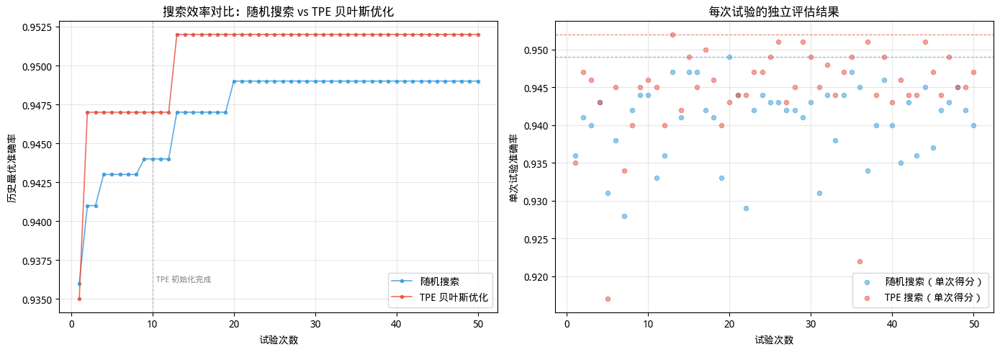
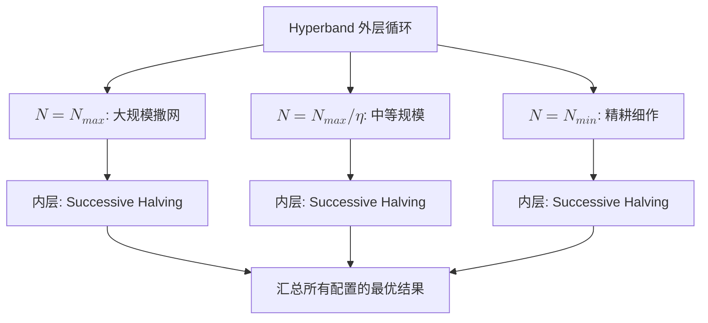

# 自动化调参

机器学习模型的训练效果不仅取决于模型架构和训练数据，还高度依赖于一组在训练前确定的**超参数**（Hyperparameter）。学习率设高了训练不收敛，设低了收敛太慢。正则化强度太小模型过拟合，太大又欠拟合。网络层数、批量大小、Dropout 率，等等 —— 这些参数的组合空间呈指数级增长。**自动化调参**（Hyperparameter Optimization，HPO）将这个搜索过程系统化，用更少的试验次数找到更优的参数组合。

2012 年加拿大蒙特利尔大学的詹姆斯·伯格斯特拉（James Bergstra）和约书亚·本吉奥（Yoshua Bengio）在机器学习研究杂志（JMLR）上发表了《Random Search for Hyper-Parameter Optimization》，用理论和实验证明在同等计算预算下，随机搜索通常优于当时广泛使用的网格搜索。同年，神经信息处理系统大会（NIPS）上发表的论文《Practical Bayesian Optimization of Machine Learning Algorithms》，将贝叶斯优化的思想带到机器学习领域，展示了它在超参数搜索中的巨大潜力。

此后十年，自动化调参进入了快速发展期。2017 年，Hyperband 将多臂老虎机问题的思想引入超参数搜索，用自适应资源分配大幅提升了搜索效率。2019 年，Optuna 框架将定义即运行（Define-by-Run）的 API 设计引入超参数优化，使得动态搜索空间的定义变得前所未有的简洁。这些工作让超参数搜索从一门需要资深工程师凭经验调整的手艺活，转变为一个可以系统化、自动化完成的工程项目。

## 模型调参的挑战

在深入具体算法之前，我们先分析超参数搜索为什么困难和挑战。调参是一个被多种不利因素共同包裹的高难度优化问题。

首先是搜索空间本身。一个用于图像分类的 ResNet-50，涉及的超参数约有 10 到 20 个，譬如学习率、权重衰减系数、Dropout 率、批量大小、优化器选择、各层通道数的倍率……每个参数有自己的取值范围，它们的笛卡尔积构成一个巨大的高维空间，盲目搜索几乎不可能凭运气命中优质参数组合。

其次是搜索成本。调参不同于传统优化问题，可以在毫秒级完成计算，超参数搜索的每轮试验都意味着完整训练一个模型。在 ImageNet 上训练一个 ResNet-50 需要数小时甚至数天，换成大规模语言模型预训练，单次评估的成本更可能高达数万美元。这迫使我们必须在有限的试验次数内（最多几十到几百次）完成搜索。另一方面，调参面对的又是一个彻头彻尾的黑箱，它与模型性能之间没有解析表达式，无法像对可微函数求梯度那样直接找到最优方向。我们对这个黑箱的全部认知就是输入一组超参数，得到一个验证集指标，难度天然高于有梯度信息的优化问题。评估过程中的噪声则让问题更加扑朔迷离。即使在完全相同的超参数下，不同的随机种子（影响参数初始化、数据打乱顺序、Dropout 掩码等）也会产生不同的评估结果。

最后如何定义"好"的参数也成了一个不确定的问题。在实际生产中，我们不会只关心模型精度、延迟、参数体积、内存占用、能耗等单独某一项指标。它们都是需要权衡的目标，指标之间往往互相冲突，更大的模型精度更高但推理更慢，激进的量化压缩了体积却会损失精度。在多个冲突目标之间找到平衡，是工程落地时绕不开的难题。

## 自动化调参

以前，调参主要依赖工程师的经验直觉。一个有经验的深度学习工程师看到训练损失曲线剧烈震荡，会判断学习率可能太大；看到验证集损失先降后升，会想到模型开始过拟合，需要增大正则化。这种基于经验的调参方式确实解决过大量问题，但业界也长期都将调参调侃为"老中医"（指靠经验积累）、"炼丹"（指尽人事看运气）。经验是稀缺的，新手无法快速获得。直觉可能犯错，老手也容易陷入局部最优。这些问题都表明，依赖人类的调参是一门技术却不是科学，无法规模化和工程化。

### 搜索空间的设计

任何自动化调参方法的起点都是定义搜索空间。一个精心设计的搜索空间可以大幅缩小搜索范围，而一个随意设定的空间则会让优化器在无关区域浪费宝贵的评估预算。从参数类型来看，超参数分为连续参数、离散参数和条件参数三类。连续参数如学习率（通常在对数空间搜索，取值范围如 `[1e-5, 1e-1]`）、Dropout 率（`[0.0, 0.5]`）、权重衰减系数等，它们在一个连续的区间内取值。离散参数如批量大小（`{16, 32, 64, 128}`）、优化器类型（`{SGD, Adam, AdamW}`）、激活函数选择等，它们只能从有限的可选值中选取。条件参数则是某些参数只有在另一参数取特定值时才存在。譬如，选择 Adam 优化器时才有 `beta1` 和 `beta2` 参数，选择 SGD 时才有 `momentum` 参数。条件参数的存在意味着搜索空间不是简单的矩形，而是一棵条件树，这给搜索算法的设计带来了额外的复杂性。

先验知识对搜索空间设计至关重要。一个好的实践是基于领域经验缩小参数的范围，譬如学习率的搜索范围通常在对数空间中设定在 `[1e-5, 1e-1]` 之间而非在线性空间的 `[0, 1000]` 中盲目搜索，因为实践中几乎没有模型会在学习率大于 1 时良好收敛。同样，对于 Dropout 率，将其范围限制在 `[0, 0.5]` 而非 `[0, 1)` 可以避免搜索器在"随机丢弃一半以上神经元"的低效区域浪费时间。这种先验本质上是将人类经验编码为搜索约束，让算法在更有可能的区域集中资源。

现代调参框架（如 Optuna、Ray Tune、Hyperopt）都提供了统一的接口来定义搜索空间。以 Optuna 为例，用户通过 `trial.suggest_float()`、`trial.suggest_int()`、`trial.suggest_categorical()` 等 API 声明每个参数的名称、类型和范围，框架负责将搜索算法与参数空间对接。这种定义即运行（Define-by-Run）的 API 设计使得条件参数的表达特别自然，用户只需要在 if-else 分支中动态声明参数即可，框架会自动处理条件依赖关系。

### 基础搜索策略

理解了搜索空间之后，下一个问题是确定应该按照什么顺序去探索这个空间。这个问题的不同回答细分形成了不同的搜索策略。我们从最简单的策略开始，逐步理解每种策略的演进动机。

#### 网格搜索

**网格搜索**（Grid Search）是最古老也最直观的超参数优化方法。它实质上就是穷举策略，为每个超参数预定义一组候选值，然后评估所有可能的组合。网格搜索足够简单，不需要概率论或优化理论的知识，任何工程师都能理解和实现。它天然可并行，所有组合之间互不依赖，可以同时分发到多台机器上评估。它能均匀覆盖整个搜索空间，在预先定义的候选值网格上，不存在被漏掉的区域。但网格搜索的致命缺陷是无法应对超参数如此庞大的搜索空间，很容易就会产生维度灾难（Curse of Dimensionality），只有当超参数数量很少（通常不超过 4 个）且每个参数的候选值也是有限的离散集合时，网格搜索才是可以考虑的选择。

#### 随机搜索

**随机搜索**（Random Search）是另一种朴素的超参数优化方法。为了应对调参搜索空间巨大、无法穷举的问题，随机搜索每次从搜索空间中随机采样一组参数进行评估，重复直到预算次数耗尽。2012 年，伯格斯特拉和本吉奥在理论上证明了在相同计算预算下，随机搜索优于网格搜索。每个超参数的作用权重并非均匀的，总是只有部分超参数对结果有显著影响，随机搜索能以更高的效率探索那些真正重要的参数维度。假设 10 个超参数各取 5 个候选值，且只有 2 个真正重要的参数，那么网格搜索遍历全部 $5^{10}$ 个组合后，每个重要参数仅被尝试了 5 个不同的值。而随机搜索在同样的 100 次试验中，可以为每个重要参数各尝试约 100 个完全不同的值，以概率方式自然地向重要维度分配了更多的探索资源。但是随机搜索每次采样都是独立的，均不考虑之前的试验结果。它不能从历史中学到类似"学习率在 1e-3 附近的组合似乎效果更好"这样的信息，而是每次都像第一次一样盲目采样。这个局限正是贝叶斯优化等更高级方法试图解决的问题。

#### 半随机策略

网格搜索和随机搜索都有一个共同的假设：每次试验使用相同的资源量（如训练到收敛的全部 epoch 数）。但在实践中，这个假设并不高效。想象你面前有 100 组候选参数，其中很多组合在最初几个 epoch 的训练中就表现很差。对这样的组合，你不需要等它跑完 100 个 epoch 才能判断它不行，在前几个 epoch 就足以做出判断。如果能把分配给明显劣质组合的计算资源节省下来，集中投入到有潜力的组合上，搜索效率就能大幅提升。这个直觉被形式化为**连续减半**（Successive Halving，SH）的搜索策略。"连续减半"的命名来源于算法在每一步都淘汰表现较差的一半候选参数。SH 的工作方式类似于多轮淘汰制：

1. 以少量资源（如 1 个 epoch）评估所有 N 组候选参数。
2. 按照验证集性能排序，淘汰表现较差的一半。
3. 将剩余参数组的资源分配量翻倍（如从 1 epoch 变成 2 epochs）。
4. 重复淘汰和资源翻倍的过程，直到只剩下一组参数或资源耗尽。

SH 的核心逻辑是将资源从注定失败的组合转移到有潜力的组合上。早期淘汰劣质组合意味着不会在它们身上浪费完整的训练预算，而幸存下来的组合则获得越来越多的资源来进行更准确的评估。SH 本身也引入了一个需要用户选择的超参数：初始参数数量 N。N 的选择面临着经典的探索与利用的权衡（Exploration-Exploitation Trade-off）。如果 N 设得太大，初始每组的资源就很少（因为总预算是固定的），好参数可能因为在少量 epoch 下的偶然噪声被误淘汰。如果 N 设得太小，搜索覆盖不足，可能根本漏掉了最优参数所在的区域。这个问题并不是 SH 特有的，但它暴露了参数搜索的内在张力 —— 必须在"探索广度"和"评估深度"之间做出选择，而最优的选择并不是先验可知的。这个难题催生了下一代的 Hyperband 算法，我们将在[高级搜索策略](#高级搜索策略)部分详细讨论如何进行探索与利用的权衡。

## 贝叶斯优化

**贝叶斯优化**（Bayesian Optimization，BO）的提出是为了解决随机搜索不记忆、不学习的问题。随机搜索每次采样都是一个独立的随机过程。贝叶斯优化则利用已经完成的历史试验结果，建立一个超参数与模型性能的映射关系概率模型，然后用这个模型来决定下一个评估点。

### 基本框架

贝叶斯优化的理论基础可以追溯到库什纳（Harold J. Kushner）和莫茨库斯（Jonas Mockus）等人在 1960-1970 年代的工作。而它在机器学习领域的广泛应用始于斯诺克（Jasper Snoek）、拉罗谢尔（Hugo Larochelle）和亚当斯（Ryan P. Adams）2012 年在 NIPS 上发表的《Practical Bayesian Optimization of Machine Learning Algorithms》。这篇论文展示了贝叶斯优化可以在极少的试验次数内找到接近最优的超参数，从而开启了 HPO 领域一个重要的研究方向。

贝叶斯优化将超参数搜索建模为一个序列决策问题。在每一步，算法预测在给定目前所有已完成的试验结果的前提下，下一个超参数组合应该选什么，才能最大程度地改进当前已知的最优结果。要回答这个问题，贝叶斯优化设计了**代理模型**（Surrogate Model）和**采集函数**（Acquisition Function）两个组件。代理模型的作用好比算法搜索目标函数的地图，它根据已观测的数据点，推测整个搜索空间中每个位置的性能均值和不确定性。采集函数则是导航，它根据地图决定下一步应该去哪里探索。整个贝叶斯优化的迭代过程构成了一个闭环：


*图：贝叶斯优化的迭代过程*

每完成一次新的评估，数据丰富了一分，代理模型就更准确一分，下一步的决策也就更明智一分。这个"越搜越聪明"的特性，是贝叶斯优化与此前随机搜索的根本区别所在。

### 代理模型

代理模型的任务是近似那个我们无法直接计算的黑箱目标函数 $f(x)$，输入是一组超参数 $x$，输出是对应的验证性能。它必须能够给出对未知区域的预测值（"这个参数组合大概能得多少分"），同时给出该预测的不确定性（"对这个估计有多大的把握"）。第二个能力尤其关键，因为它直接决定了采集函数能否做出从探索到利用的合理决策。

贝叶斯优化中最经典的代理模型是高斯过程（Gaussian Process，GP）。高斯过程可以理解为函数空间上的一个概率分布。它不直接猜测 $f(x)$ 的固定函数形式，而是为任意一组输入 $x_1, x_2, ..., x_n$ 分配一个联合高斯分布。给定已观测的数据点 $D = {(x_i, y_i)}$，高斯过程通过[核函数](../../statistical-learning/support-vector-machines/kernel-methods.md#常见核函数)（通常使用 Matérn 核或平方指数核）来建模不同输入点之间的相似性，从而推断未观测区域的函数值和不确定性。

高斯过程的优势是它在连续空间上提供平滑的函数近似，这与大多数超参数 - 性能曲线的实际形态一致（相近的参数组合通常产生相近的性能）。且高斯过程天然就能输出预测的不确定性，对于远离已观测数据点的区域，预测方差会自动增大。这个特性完美契合了采集函数的需求。不过，高斯过程的计算成本较高，它的计算复杂度是 $O(n^3)$，其中 $n$ 是历史观测数量。这个立方复杂度来源于高斯过程推断中涉及的协方差矩阵求逆操作。当观测数量超过几百个时，计算成本就变得不可接受。此外，高斯过程在标准形式下难以处理分类变量（如优化器类型的离散选择）和高维空间（超过 20 维时效果通常显著下降）。

为了应对这些局限，研究者提出了多种替代代理模型。其中最具影响力的是树结构帕尔森估计器（Tree-structured Parzen Estimator，TPE），由伯格斯特拉等人于 2011 年在 NIPS 论文《Algorithms for Hyper-Parameter Optimization》中提出，后续成为 Hyperopt 框架的核心算法。TPE 采用了完全不同于高斯过程的建模策略。它将已观测的参数按性能划分为两组："好"组（验证损失低于某个阈值 $y^*$ 的观测）和"差"组（其余观测），然后分别用核密度估计建模这两组的参数分布 $l(x) = p(x|y < y^*)$ 和 $g(x) = p(x|y ≥ y^*)$。

TPE 的出发点是下一个评估点应当选择使得 $l(x)/g(x)$ 最大的 $x$，其中 $l(x)$ 是好组参数的概率密度，$g(x)$ 是差组参数的概率密度。这个比值衡量了参数 $x$ 属于好参数组的概率相对参数 $x$ 属于差参数组的概率的优势。高比值意味着该参数区域在过去试验中产生好参数的频率远高于差参数，因此在直觉上最有希望带来改进。TPE 的计算复杂度远低于高斯过程，天然支持条件参数空间（通过树结构的建模），并且在实际的 HPO 任务中表现极为出色，因此它成为了 Optuna 等框架的默认采样器。

除了 TPE，基于[随机森林](../../statistical-learning/decision-tree-ensemble/random-forest.md)的代理模型（SMAC）和基于神经网络的代理模型（如 Bayesian Neural Networks 和 Deep Ensembles）也在不同的应用场景中展现出了各自的优势。SMAC 对分类参数的处理特别自然（随机森林天然支持离散特征），而神经网络代理模型则在高维搜索空间中表现出色。

### 采集函数

有了代理模型提供的预测均值和不确定性，就可以根据这些信息选择下一个评估点。这个决策由采集函数（Acquisition Function）来完成。采集函数是一个定义在搜索空间上的辅助函数 $a(x)$，它在每个位置上量化了"在这里评估的价值"。贝叶斯优化的每一步就是选择使 $a(x)$ 最大化的参数组合。

采集函数的设计面临一个经典的探索与利用的权衡（Exploration-Exploitation Trade-off）。利用（Exploitation）意味着去代理模型预测均值高的区域（那里最有可能产生好的结果）。探索（Exploration）意味着去代理模型预测不确定性高的区域（那里可能藏有意想不到的好发现，但也可能是徒劳）。一个好的采集函数需要在两者之间取得平衡，有三种经典的采集函数分别以不同的方式处理这个权衡：

- **期望改进**（Expected Improvement，EI）是实践中使用最广泛的采集函数。它的策略是在所有可能的候选点上，明确选择那个"期望改进量"最大的点。
- **改进概率**（Probability of Improvement，PI）是 EI 的简化版本，只关心是否有改进而不关心改进多少。PI 的问题是它可能过分偏好那些只需极少改进就能超过历史最优的稳妥选择，而忽略了虽然改进概率不高但一旦改进就很大的机会，因此在实际使用中不如 EI 普遍。
- **上置信界**（Upper Confidence Bound，UCB）以一个更复杂的方式处理探索与利用的权衡。我们曾经在[蒙特卡洛树搜索](../../language-models/reasoning/test-time-compute.md#树搜索)中接触过 UCB 方法。在当前上下文下，它的含义是无论一个区域的预测均值高（大概率好），或者不确定性大（可能藏着惊喜），我们都应该去看看。两者的权衡通过一个递减的 $\kappa$ 来控制，搜索初期用较大的 $\kappa$ 鼓励广泛探索，随着搜索进行逐步减小，让算法收敛到已知的好区域。

### 工程挑战

尽管贝叶斯优化在理论上优雅且在实验环境中表现出色，但在实际工程部署时，一系列现实问题可能会将它的理论优势逐步稀释。最直观的问题是并行化。标准的贝叶斯优化是天然串行的，每步需要等待上一次评估完成后更新代理模型，才能给出下一个建议参数。但在实际的 GPU 集群中，多块 GPU 可以同时训练，串行执行意味着计算资源的严重浪费。为解决这个问题，研究者提出了多种并行策略。常数欺骗（Constant Liar）是其中最简单的一种，算法在未获得真实评估结果前，假设未知点的评估结果等于某个常数（如历史均值），以此"欺骗"代理模型来产生多样化的建议点。当需要同时建议 K 个评估点时，先按正常流程产生第一个建议点，假设该点的评估结果等于历史均值，更新代理模型后再产生第二个建议点，如此重复 K 次来产生多样化的建议点。更复杂的策略则直接优化批量版本的采集函数，一次性输出 K 个互不重复的候选点。

并行化的背后还隐藏着另一个维度的效率问题。标准的贝叶斯优化框架中，每次评估都是全保真度（Full Fidelity）的，用完整的训练预算从头训练到收敛。但正如我们在 Successive Halving 中讨论的那样，很多参数组合在训练早期就已暴露明显劣势，为其耗费完整预算纯属浪费。将多保真度（Multi-Fidelity）思想引入贝叶斯优化，意味着代理模型需要同时建模参数 $x$、保真度水平 $z$（如 epoch 数）与性能的关系 $f(x, z)$，而采集函数在联合空间 $(x, z)$ 上做决策，从而在推荐评估点时一并决定"评估什么"和"投入多少资源"。BOHB（Bayesian Optimization and Hyperband）就是这种融合的代表性方法。

跳出效率问题，在[模型调参的挑战](#模型调参的挑战)中曾提到如何定义"好"的参数是不确定的，因为模型精度、推理延迟、模型体积、内存占用、训练能耗都是必须权衡的目标，它们之间往往相互冲突。多目标贝叶斯优化的任务是找到帕累托前沿（Pareto Front），即那些不牺牲一个目标就无法改进另一个目标的参数组合集合。这些参数之间没有绝对优劣，工程师可根据业务需求从中选择最符合当前场景的配置。常用的方法包括将多目标聚合为标量（如加权求和），或直接使用期望超体积改进（Expected Hypervolume Improvement）作为采集函数。

## 代码实践：贝叶斯优化 vs 随机搜索

前面的章节从理论上讨论了各种搜索策略的优劣。理论是重要的，但只有亲手实现一次，才能真正理解"利用历史信息"究竟意味着什么。下面这段代码构建了一个完整的 HPO 对比实验。在相同的搜索空间和试验预算下，比较随机搜索和简化版 TPE 贝叶斯优化的搜索效率。

实验使用 SciKit-Learn 的 MLPClassifier 作为目标模型，在一个人工生成的二分类数据集上搜索最优的超参数组合（隐藏层大小、学习率初始值和正则化强度）。两种搜索策略各有 50 次试验的等额预算。为了直观展示贝叶斯优化"越搜越聪明"的特性，代码将两种方法的历史最优值随试验次数的变化绘制为对比图表。

```python runnable
import numpy as np
from sklearn.neural_network import MLPClassifier
from sklearn.datasets import make_classification
from sklearn.model_selection import cross_val_score
from scipy.stats import norm
import matplotlib.pyplot as plt
import warnings
from sklearn.exceptions import ConvergenceWarning
from dmla_progress import ProgressReporter

# 忽略 MLPClassifier 在 max_iter 内未收敛的警告（演示代码侧重搜索策略对比）
warnings.filterwarnings('ignore', category=ConvergenceWarning)

# 生成二分类数据集（1000 样本，20 维特征，含噪声）
X, y = make_classification(
    n_samples=1000, n_features=20, n_informative=10,
    n_redundant=5, random_state=42
)

def evaluate(params):
    """
    评估一组超参数的性能，返回 5 折交叉验证的平均准确率。

    搜索空间：
    - hidden_size: 隐藏层神经元数，范围 [16, 256]
    - learning_rate: 初始学习率，对数空间 [1e-4, 1e-1]
    - alpha: L2 正则化强度，对数空间 [1e-5, 1e-1]
    """
    hidden_size = int(params['hidden_size'])
    learning_rate = params['learning_rate']
    alpha = params['alpha']

    model = MLPClassifier(
        hidden_layer_sizes=(hidden_size,),
        learning_rate_init=learning_rate,
        alpha=alpha,
        max_iter=500, random_state=42
    )
    scores = cross_val_score(model, X, y, cv=5, scoring='accuracy')
    return scores.mean()


# ========== 随机搜索 ==========

def random_search(n_trials=50):
    """
    随机搜索：每次从搜索空间中独立采样一组参数进行评估。
    这是 HPO 最朴素的基线方法——不考虑任何历史信息。
    """
    history = []
    best_score = 0.0
    best_params = None

    progress = ProgressReporter(total_steps=n_trials, description="随机搜索超参数")

    for i in range(n_trials):
        # 在对数空间均匀采样（因为学习率和正则化强度跨越多个数量级）
        params = {
            'hidden_size': np.random.randint(16, 257),
            'learning_rate': 10 ** np.random.uniform(-4, -1),
            'alpha': 10 ** np.random.uniform(-5, -1),
        }
        score = evaluate(params)
        history.append(score)

        if score > best_score:
            best_score = score
            best_params = params

        progress.update(
            step=i + 1,
            message=f"试验 {i+1}/{n_trials}, 准确率: {score:.4f}, 最优: {best_score:.4f}"
        )

    progress.complete(
        message=f"随机搜索完成，最优准确率: {best_score:.4f}",
        extra_data={"best_score": float(best_score)}
    )

    return best_params, best_score, history


# ========== 简化版 TPE 贝叶斯优化 ==========

def tpe_bayesian_search(n_trials=50):
    """
    简化版 TPE 贝叶斯优化。

    核心思想（对应文中 TPE 小节）：
    1. 用已评估的参数训练两个密度估计——好参数组 l(x) 和差参数组 g(x)
    2. 下一个评估点选择使 l(x)/g(x) 最大的参数
    3. 本质上是用历史信息引导搜索方向，而非盲目采样
    """
    # 存储所有已评估的参数和得分
    observed_params = []
    observed_scores = []

    best_score = 0.0
    best_params = None
    history = []

    progress = ProgressReporter(total_steps=n_trials, description="TPE 贝叶斯优化搜索")

    # 初始阶段：随机采样 10 个点建立初始观测
    init_trials = 10
    for i in range(init_trials):
        params = {
            'hidden_size': np.random.randint(16, 257),
            'learning_rate': 10 ** np.random.uniform(-4, -1),
            'alpha': 10 ** np.random.uniform(-5, -1),
        }
        score = evaluate(params)
        observed_params.append(params)
        observed_scores.append(score)
        history.append(score)

        if score > best_score:
            best_score = score
            best_params = params

        progress.update(
            step=i + 1,
            message=f"初始化 {i+1}/{init_trials}, 准确率: {score:.4f}"
        )

    # 贝叶斯优化主循环
    for i in range(init_trials, n_trials):
        # 确定划分"好/差"的阈值：取历史得分的前 25% 分位数
        threshold = np.percentile(observed_scores, 75)

        good_params = [observed_params[i] for i in range(len(observed_params))
                       if observed_scores[i] >= threshold]
        bad_params = [observed_params[i] for i in range(len(observed_params))
                      if observed_scores[i] < threshold]

        # 候选采样：随机生成 1000 个候选参数，用 l(x)/g(x) 评分，选最优
        n_candidates = 1000
        candidates = []
        for _ in range(n_candidates):
            cand = {
                'hidden_size': np.random.randint(16, 257),
                'learning_rate': 10 ** np.random.uniform(-4, -1),
                'alpha': 10 ** np.random.uniform(-5, -1),
            }
            # 计算 l(x)/g(x) 的近似值
            # 使用核密度估计的简化版：候选点与好/差参数组的距离
            l_score = tpe_kernel_score(cand, good_params)
            g_score = tpe_kernel_score(cand, bad_params)
            # l(x)/g(x) 越大越好（高概率属于好组，低概率属于差组）
            ratio = l_score / (g_score + 1e-10)
            candidates.append((ratio, cand))

        # 选择 l(x)/g(x) 最大的候选参数
        candidates.sort(key=lambda x: x[0], reverse=True)
        best_candidate = candidates[0][1]

        score = evaluate(best_candidate)
        observed_params.append(best_candidate)
        observed_scores.append(score)
        history.append(score)

        if score > best_score:
            best_score = score
            best_params = best_candidate

        progress.update(
            step=i + 1,
            message=f"TPE 搜索 {i+1}/{n_trials}, 准确率: {score:.4f}, 最优: {best_score:.4f}"
        )

    progress.complete(
        message=f"TPE 搜索完成，最优准确率: {best_score:.4f}",
        extra_data={"best_score": float(best_score)}
    )

    return best_params, best_score, history


def tpe_kernel_score(candidate, observed_group):
    """
    简化版 TPE 密度评分函数。

    对每个参数维度独立使用高斯核，然后求和作为该组密度的近似。
    这对应文中描述的 TPE 核密度估计的简化形式。
    """
    if len(observed_group) == 0:
        return 1e-10

    # 参数归一化到 [0, 1] 区间以便各维度可比
    score = 0.0
    param_keys = ['hidden_size', 'learning_rate', 'alpha']

    for key in param_keys:
        cand_val = normalize(candidate[key], key)
        for obs in observed_group:
            obs_val = normalize(obs[key], key)
            # 高斯核：exp(-0.5 * (x - μ)² / h²)，带宽 h=0.1
            score += np.exp(-0.5 * ((cand_val - obs_val) / 0.1) ** 2)

    return score


def normalize(value, key):
    """将参数值归一化到 [0, 1] 区间"""
    ranges = {
        'hidden_size': (16, 256),
        'learning_rate': (-4, -1),   # log10 空间
        'alpha': (-5, -1),           # log10 空间
    }
    lo, hi = ranges[key]
    if key != 'hidden_size':
        value = np.log10(value)
    return (value - lo) / (hi - lo)


# ========== 运行对比实验 ==========

print("运行随机搜索（50 次试验）...")
rs_params, rs_score, rs_history = random_search(n_trials=50)
print(f"随机搜索最优准确率: {rs_score:.4f}")
print(f"随机搜索最优参数: {rs_params}")

print("\n运行 TPE 贝叶斯搜索（50 次试验）...")
tpe_params, tpe_score, tpe_history = tpe_bayesian_search(n_trials=50)
print(f"TPE 搜索最优准确率: {tpe_score:.4f}")
print(f"TPE 搜索最优参数: {tpe_params}")

# ========== 可视化搜索结果 ==========

fig, axes = plt.subplots(1, 2, figsize=(14, 5))

# 左图：历史最优准确率随试验次数的变化
ax1 = axes[0]
rs_cummax = np.maximum.accumulate(rs_history)
tpe_cummax = np.maximum.accumulate(tpe_history)

# 前 10 次 TPE 使用的是随机初始化，从第 11 次开始使用 TPE 引导
ax1.plot(range(1, 51), rs_cummax, 'o-', color='#3498db', markersize=3,
         linewidth=1.2, label='随机搜索', alpha=0.8)
ax1.plot(range(1, 51), tpe_cummax, 'o-', color='#e74c3c', markersize=3,
         linewidth=1.2, label='TPE 贝叶斯优化', alpha=0.8)
ax1.axvline(x=10, color='gray', linestyle='--', alpha=0.5, linewidth=0.8)
ax1.text(10.5, ax1.get_ylim()[0] + 0.002, 'TPE 初始化完成',
         fontsize=8, color='gray')
ax1.set_xlabel('试验次数')
ax1.set_ylabel('历史最优准确率')
ax1.set_title('搜索效率对比：随机搜索 vs TPE 贝叶斯优化')
ax1.legend(loc='lower right')
ax1.grid(True, alpha=0.3)

# 右图：每次试验的独立得分散点图
ax2 = axes[1]
ax2.scatter(range(1, 51), rs_history, c='#3498db', s=20, alpha=0.5,
            label='随机搜索（单次得分）')
ax2.scatter(range(1, 51), tpe_history, c='#e74c3c', s=20, alpha=0.5,
            label='TPE 搜索（单次得分）')
ax2.axhline(y=rs_score, color='#3498db', linestyle='--', alpha=0.7,
            linewidth=0.8)
ax2.axhline(y=tpe_score, color='#e74c3c', linestyle='--', alpha=0.7,
            linewidth=0.8)
ax2.set_xlabel('试验次数')
ax2.set_ylabel('单次试验准确率')
ax2.set_title('每次试验的独立评估结果')
ax2.legend(loc='lower right')
ax2.grid(True, alpha=0.3)

plt.tight_layout()
plt.show()

print(f"\n最终比较：")
print(f"  随机搜索最优准确率:    {rs_score:.4f}")
print(f"  TPE 搜索最优准确率:    {tpe_score:.4f}")
print(f"  绝对提升:              {tpe_score - rs_score:.4f}")
```

左图的累积最优曲线显示 TPE 搜索在初始化阶段（前 10 次随机采样）之后的搜索效率明显高于随机搜索，它的历史最优值上升得更快，说明利用历史信息确实在指导搜索方向。右图的散点分布显示 TPE 后期的采样点更集中在高得分区域而非在整个空间均匀散布，这正是 $l(x)/g(x)$ 比值引导采样聚焦于好参数区域的效果。



*图：运行结果*

需要注意的是，由于实验使用的是简化的 TPE 实现和较小规模的数据集，两种方法的最终差距还不够大。在真实的大规模调参任务中（更多超参数、更高评估成本），贝叶斯优化的优势会更加显著。

## 高级搜索策略

基础搜索策略和贝叶斯优化为超参数搜索提供了理论和实践基础，但 HPO 的研究并未止步于此。本节介绍的三种高级策略分别从资源效率、搜索鲁棒性和知识复用的角度，进一步推动了自动化调参的能力边界。

### 多保真度方法

在 Successive Halving 的讨论中，我们遗留了如何选择初始参数数量 N 的问题未解决。N 太大，每组分配的资源太少，好参数可能因噪声被误淘汰；N 太小，搜索覆盖又不足。2017 年的论文《Hyperband: A Novel Bandit-Based Approach to Hyperparameter Optimization》提出了 Hyperband 算法，用一个优雅的双层循环解决了 N 的选择问题。

Hyperband 的思想是既然我们不知道最优的 N 是多少，那就通过一个统一的预算分配方案，从极大的 N（强调探索广度）遍历到较小的 N（强调评估深度），在不同的 N 值上都试一遍。它设计了两层循环，外层循环从大到小遍历不同的 N 值，每个 N 值对应一个完整的 Successive Halving 内层循环。在大 N 值的配置中，初始候选参数很多但每组资源极少，相当于用很少的资源广泛撒网。在小 N 值的配置中，初始候选参数较少但每组资源充裕，相当于用充足的资源精耕细作。Hyperband 算法的工作流程如下图所示，其中 $\eta$ 为淘汰率（通常 $\eta=3$），$N_{max}$ 和 $N_{min}$ 分别对应最大和最小初始候选参数数量，算法最终返回所有配置中表现最好的参数组合。


*图：Hyperband 算法内、外层循环*

Hyperband 自动平衡了探索和利用的权重，无需用户手动设定 N，同时保证了计算复杂度在可控范围内。[多臂老虎机](https://en.wikipedia.org/wiki/Multi-armed_bandit)（Multi-Armed Bandit）问题的分析框架为 Hyperband 提供了理论保证。每个候选参数组被视为一只"臂"，拉臂就是分配计算资源评估它，算法的目标是在总预算约束下找到最好的那只臂。

在 Hyperband 的基础上，研究者进一步提出了几个重要变体。**BOHB**（Bayesian Optimization and Hyperband）将 Hyperband 的随机采样替换为基于 TPE 的贝叶斯优化采样。在 Hyperband 的每一轮 Successive Halving 中，新的候选参数不再随机采样，而是由贝叶斯优化的采集函数精心挑选。这个结合使得 BOHB 兼具 Hyperband 的资源效率和贝叶斯优化的历史信息利用率，在实践中通常优于单纯的 Hyperband 或单纯的贝叶斯优化。**ASHA**（Asynchronous Successive Halving Algorithm）则解决了并行化问题。标准的 Successive Halving 是同步的，每一轮淘汰必须等待该轮所有评估完成才能进行。在拥有数十个 GPU 的集群中，这种同步等待会导致资源空置（快的评估完成后必须等待慢的）。ASHA 允许每完成一个评估就立即决定是否淘汰和晋升，不再有轮次的概念。这种异步设计极大提升了集群利用率和搜索吞吐量。

### 群体智能与进化方法

贝叶斯优化基于相近的超参数组合产生相近的性能的平滑性假设。这个假设在大多数场景下是合理的，但在搜索空间中存在陡峭悬崖、条件分支或非连续区域时，基于高斯过程的代理模型可能会误导搜索方向。进化方法（Evolutionary Methods）为这类场景提供了一个补充解决方案。

遗传算法（Genetic Algorithm）将超参数优化建模为生物进化过程。一组超参数被称为一个个体（Individual），参数值编码为基因（Gene），多个个体构成种群（Population）。搜索过程模拟自然界物竞天择的过程。每一代中，表现最好的个体被选择作为父代，它们的基因通过交叉（Crossover）操作组合产生子代。交叉指从种群中选出两个表现较好的父代个体，把它们的基因按某种规则组合起来，生成新的子代个体。子代的基因以一定概率发生随机变异，以维持种群的多样性并避免过早收敛。遗传算法的优势在于它对搜索空间的形状没有假设，不需要平滑性，也不需要连续性，甚至可以处理完全离散的空间。当一个超参数的选择会导致完全不同的性能区间时（譬如优化器从 SGD 切换到 Adam 可能要求完全不同的学习率），进化方法可能比基于平滑假设的贝叶斯优化更鲁棒。

进化策略（Evolution Strategy，ES）算法是遗传算法的一个简化变体，主要用于连续参数空间。它放弃了交叉操作，仅依赖变异和选择。每一代从当前最佳个体产生多个只经过变异的后代，评估后保留最好的继续变异。ES 的简洁性使得它在实践中易于实现和调试，特别适合搜索空间维度不是太高的场景。进化代数和种群数量的约束是评估成本，每一代都需要评估整个种群的所有个体。假设群大小在 20 到 100 之间，如果每代运行 10 代，总评估次数很容易达到数百到数千次。对于昂贵的深度学习训练来说，这可能超出计算预算。因此进化方法最适用于评估成本相对较低的模型（如小型网络、传统机器学习模型）或需要处理高度非连续搜索空间的场景。

### 元学习与迁移学习

前面讨论的所有方法中，每个新的调参任务都从零开始的。但在实际工作中，我们往往不是第一次训练模型，此前可能已经为类似的模型、相似的数据集做过很多次调参了。一个经验丰富的深度学习工程师之所以能"猜"出不错的初始参数，正是因为他从过往的调参经验中总结出了规律。元学习（Meta-Learning）试图将这种跨任务的学习能力赋予算法，它的核心思想是让算法从多个任务的经验中学习如何更快地适应新任务。

在元学习的框架下，历史的调参任务构成了一个元数据集。每个元数据点记录了一个完整调参任务的特征（数据集大小、特征维度、模型族、任务类型等）和最终找到的最优超参数或搜索轨迹。当新的调参任务到来时，算法基于这个元数据集，为新任务推荐初始超参数、缩小搜索空间范围，甚至直接预测哪些参数配置更有可能成功。

学习曲线外推（Learning Curve Extrapolation）是一种利用历史知识的早期停止方法，在元学习的框架下可作为一种轻量级变体。一个参数组合在训练早期的表现趋势，往往能预示它的最终性能。如果一个参数组合在前几个 epoch 中验证损失一直在下降且下降速度稳定，它很有可能继续下降到较好的水平。反之，如果一个组合的损失震荡剧烈或下降趋于停滞，继续训练到完整 epoch 数的意义不大。通过学习历史上训练完成的完整学习曲线，算法可以构建一个预测模型，从部分学习曲线推断最终性能，从而在不完整训练的情况下提前终止劣质试验。

迁移学习也可以被纳入超参数优化的视野。如果你曾经为一个 ResNet-50 在 ImageNet 上完成了详尽的超参数搜索，当需要为一个 ResNet-101 在类似数据集上调参时，以前搜索的结果就是一种有价值的知识。ResNet-50 和 ResNet-101 共享相同的网络结构设计理念，仅层数不同，因此前者的最优超参数往往是后者的良好起点。将前一个任务上找到的最优参数或参数重要性排序作为新任务的先验，譬如在贝叶斯优化中以前一个任务的后验高斯过程作为新任务的先验高斯过程，可以显著加速搜索，这被称为热启动（Warm-Starting）贝叶斯优化。

元学习和迁移学习在 HPO 领域的大规模应用依赖于公开的调参基准数据集。[OpenML](https://www.openml.org/) 和 [HPO-Bench](https://www.automl.org/hpo-overview/hpo-benchmarks/hpobench/) 等项目记录了不同模型在各种数据集上的大量调参试验结果，为元学习算法提供了训练数据。这些基准数据集的积累，正在使自动化调参从每个任务独立搜索走向经验共享的群体智能。

## 本章小结

自动化调参的意义远不止于找到一组更好的参数，它最直接的作用是降低了对资深调参工程师的依赖。一位经验丰富的深度学习工程师的培养需要数年时间，而企业需要的模型数量远远超过资深工程师的供给。当贝叶斯优化或 Hyperband 接管了搜索过程，初级工程师甚至非技术人员也能获得接近专家水平的调参结果。这本质上是在将稀缺的个人经验转化为可传播的算法能力。

当然，自动化调参也有它的边界。算法无法替代对问题的深刻理解，一个精心设计的搜索空间仍然需要领域知识的注入。算法也无法定义什么是"好"，当精度、延迟、能耗等多个目标相互冲突时，最终的选择权仍然在工程师手中。自动化调参的真正价值不是取代人的判断，而是将人的精力从重复的试错中解放出来，投向更需要创造力的方向。让机器做机器擅长的事（大规模探索和模式识别），让人做人擅长的事（提出问题和定义方向），这或许是自动化调参给予我们最深层的启示。

## 练习题

1. 为什么随机搜索在大多数情况下优于网格搜索？用伯格斯特拉和本吉奥的关键洞察来解释。
   <details>
   <summary>参考答案</summary>

   核心原因在于不是所有超参数都同等重要。在真实场景中，通常只有少数几个超参数对性能起决定性作用。网格搜索在全部超参数构成的网格上均匀采样，导致大量计算资源浪费在排列不重要的参数上；而随机搜索每次独立地为每个参数采样，使得重要参数在有限的试验次数内获得了更多不同的尝试值。举个例子，10 个超参数各 5 个取值，网格搜索需要 $5^{10}$ 次试验但重要参数只被尝试了 5 个不同的值，随机搜索只需 100 次试验就能让重要参数各尝试 100 个不同的值。

   </details>