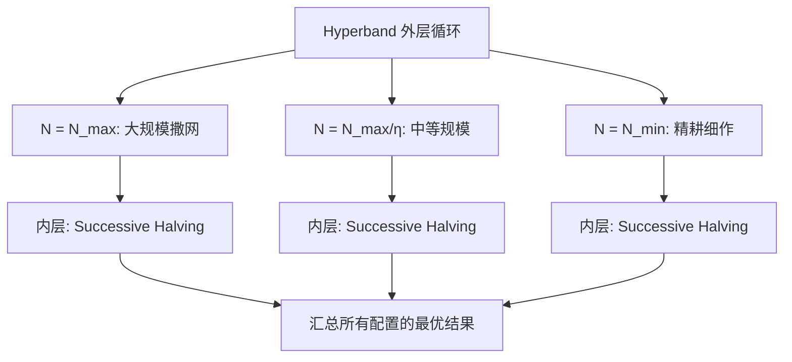

# 自动化调参

机器学习模型的性能不仅取决于模型架构和训练数据，还高度依赖于一组在训练前就需要确定的参数 —— 超参数（Hyperparameter）。学习率设高了训练不收敛，设低了收敛太慢；正则化强度太小模型过拟合，太大又欠拟合；网络层数、批量大小、Dropout 率……这些超参数的组合空间呈指数级增长，靠人工试错无异于大海捞针。自动化调参（Hyperparameter Optimization，HPO）将这个搜索过程系统化，用更少的试验次数找到更优的参数组合。

自动化调参的思想可以追溯到 20 世纪 70 年代。1978 年，立陶宛数学家约纳斯·莫库斯（Jonas Mockus）与合作者在专著《寻求极值的贝叶斯方法》（*Bayesian Methods for Seeking the Extremum*）中，提出了用贝叶斯模型引导序列优化的思想 —— 这被视为贝叶斯优化的理论源头。然而，这个想法在提出后的三十多年里，主要停留于运筹学和工程设计领域，并未在机器学习社区引起广泛关注。

转折点出现在 2012 年。这一年，两篇重要论文彻底改变了超参数搜索的实践方式。加拿大蒙特利尔大学的詹姆斯·伯格斯特拉（James Bergstra）和约书亚·本吉奥（Yoshua Bengio）在《机器学习研究杂志》（JMLR）上发表了《超参数优化的随机搜索》（*Random Search for Hyper-Parameter Optimization*），用理论和实验证明：在同等计算预算下，随机搜索通常优于当时广泛使用的网格搜索。同年，贾斯珀·斯诺克（Jasper Snoek）、雨果·拉罗谢尔（Hugo Larochelle）和瑞安·亚当斯（Ryan P. Adams）在神经信息处理系统大会（NIPS）上发表了《机器学习算法的实用贝叶斯优化》（*Practical Bayesian Optimization of Machine Learning Algorithms*），将贝叶斯优化的思想重新带回机器学习领域，展示了它在超参数搜索中的巨大潜力。

此后十年，自动化调参进入了快速发展期。2017 年，丽莎·李（Lisha Li）等人提出了 Hyperband，将多臂老虎机问题的思想引入超参数搜索，用自适应资源分配大幅提升了搜索效率。2019 年，日本 Preferred Networks 的秋叶拓也（Takuya Akiba）等人在 KDD 上发表了 Optuna 框架，将"定义即运行"（define-by-run）的 API 设计引入超参数优化，使得动态搜索空间的定义变得前所未有的简洁。这些工作的共同方向是让超参数搜索从一门"手艺"（需要资深工程师凭经验调整）转变为一门"科学"（可以系统化、自动化地完成）。

在这一章中，我们将从超参数搜索的核心挑战出发，依次介绍网格搜索与随机搜索的博弈、Successive Halving 的资源分配策略、贝叶斯优化的概率框架、多保真度方法（如 Hyperband）以及与进化算法和元学习的结合，最后讨论自动化调参在实际工程中的集成、资源调度和结果分析方法。

## 自动化调参的核心问题

在深入具体算法之前，我们需要先理解超参数搜索为什么困难。这个问题可以从五个维度来剖析。

首先是搜索空间的高维性。一个典型的深度学习模型 —— 比如用于图像分类的 ResNet-50——可能涉及 10 到 20 个超参数：学习率、权重衰减系数、Dropout 率、批量大小、优化器选择、各层的通道数倍率等。每个参数都有自己的取值范围（连续或离散），它们的笛卡尔积构成了一个巨大的高维空间。在这样一个空间中盲目搜索，找到优质参数组合的概率微乎其微。

其次是评估成本的高昂性。不同于传统优化问题中目标函数可以在毫秒级完成计算，超参数搜索的每次"试探"都意味着完整训练一个模型。在 ImageNet 上训练一个 ResNet-50 可能需要数小时甚至数天，如果使用大规模语言模型进行预训练，单次评估的成本更可能高达数千美元。这种高昂的评估成本意味着我们必须在极有限的试验次数内（通常是几十到几百次）完成任务。

第三个挑战是目标函数的黑箱性。超参数与模型最终性能之间的关系没有解析表达式，我们无法像对可微函数求梯度那样直接找到最优方向。输入一组超参数，输出一个验证集上的评估指标 —— 这就是我们对"目标函数"的全部了解。黑箱优化的难度天然高于有梯度信息的优化问题。

第四个挑战是评估结果的噪声性。即使在完全相同的超参数下，不同的随机种子（影响参数初始化、数据打乱顺序、Dropout 掩码等）也会产生不同的评估结果。这种噪声意味着单次评估并不可靠，而我们又无法承担多次重复评估的成本 —— 这进一步增加了搜索的难度。

最后是多目标优化的挑战。在实际应用中，我们往往不只关心模型的精度。延迟、模型大小、内存占用、能耗等都是需要考虑的目标，而这些目标之间常常互相冲突：更大的模型精度更高但延迟更长，更激进的量化压缩了体积但损失了精度。如何在多个目标之间找到平衡点，是工程落地时不可回避的问题。

### 手动调参 vs 自动化调参

在自动化调参工具普及之前，调参主要依赖研究者的经验直觉。一个有经验的深度学习工程师看到训练损失曲线剧烈震荡，会判断"学习率可能太大"；看到验证集损失先降后升，会想到"模型开始过拟合，需要增大正则化"。这种基于经验的调参方式在小规模项目中尚可应付，但它有三个致命弱点：经验是稀缺的（新手无法快速获得），直觉可能犯错（容易陷入局部最优），而且无法规模化（当有几十个模型需要同时调参时，人工根本忙不过来）。

自动化调参最朴素的形式是网格搜索（Grid Search）。它的思路极其简单：为每个超参数预定义一组候选值，然后穷举所有可能的组合。如果你有 3 个超参数，每个有 5 个候选值，总共需要评估 5³ = 125 次。网格搜索的优势是简单直观、天然可并行，但它有一个致命的弱点：维度灾难。当超参数数量增加到 10 个时，即使每个只有 5 个候选值，组合数也会暴涨到 5¹⁰ ≈ 1000 万次 —— 这在计算上完全不可行。更糟的是，网格搜索存在严重的"资源浪费"：当某个超参数对最终性能影响很小时，该参数的所有取值组合都会被无效地遍历一遍。

随机搜索（Random Search）的提出正是为了应对网格搜索的这一缺陷。它的策略同样简单：每次从搜索空间中随机采样一组参数进行评估，重复直到预算耗尽。2012 年，伯格斯特拉（James Bergstra）和本吉奥（Yoshua Bengio）在论文中揭示了随机搜索优于网格搜索的关键洞察：当只有部分超参数对结果有显著影响时（这在实践中几乎总是成立），随机搜索能以更高的效率探索那些"真正重要"的参数维度。他们的数学解释很优雅：假设 10 个超参数中只有 2 个真正重要，那么网格搜索在 5¹⁰ 次试验中只能为每个重要参数尝试 5 个不同的值，其他 8 个不重要参数的取值变化纯属浪费；而随机搜索在同样的 100 次试验中，可以为每个重要参数各尝试 100 个完全不同的值。随机搜索不关心哪些参数重要，它以概率方式自然地向重要维度分配了更多的探索资源。

然而，随机搜索有一个根本性的局限：它在每次采样时不考虑之前的试验结果。它不会从历史中学到"学习率在 1e-3 附近的组合似乎效果更好"这样的信息，而是每次都像第一次一样盲目采样。这个局限正是贝叶斯优化等更高级方法试图解决的问题。

### 搜索空间的设计

任何自动化调参方法的起点都是定义搜索空间。搜索空间的设计质量直接影响搜索效率：一个精心设计的搜索空间可以大幅缩小搜索范围，而一个随意设定的空间则会让优化器在无关区域浪费宝贵的评估预算。

从参数类型来看，超参数可以分为连续参数、离散参数和条件参数三类。连续参数如学习率（通常在对数空间搜索，取值范围如 `[1e-5, 1e-1]`）、Dropout 率（`[0.0, 0.5]`）、权重衰减系数等，它们在一个连续的区间内取值。离散参数如批量大小（`{16, 32, 64, 128}`）、优化器类型（`{SGD, Adam, AdamW}`）、激活函数选择等，它们只能从有限的可选值中选取。条件参数则是某些参数只有在另一参数取特定值时才存在 —— 例如，选择 Adam 优化器时才有 `beta1` 和 `beta2` 参数，选择 SGD 时才有 `momentum` 参数。条件参数的存在意味着搜索空间不是简单的矩形，而是一棵条件树，这给搜索算法的设计带来了额外的复杂性。

搜索空间的先验知识至关重要。一个好的实践是基于领域经验缩小参数的范围：例如学习率的搜索范围通常设定在 `[1e-5, 1e-1]` 之间而非 `[0, 1000]`，因为实践中几乎没有模型会在学习率大于 1 时良好收敛。同样，对于 Dropout 率，将其范围限制在 `[0, 0.5]` 而非 `[0, 1)` 可以避免搜索器在"随机丢弃一半以上神经元"的低效区域浪费时间。这种先验本质上是将人类经验编码为搜索约束，让算法在更有可能的区域集中资源。

现代调参框架（如 Optuna、Ray Tune、Hyperopt）都提供了统一的接口来定义搜索空间。以 Optuna 为例，用户通过 `trial.suggest_float()`、`trial.suggest_int()`、`trial.suggest_categorical()` 等 API 声明每个参数的名称、类型和范围，框架负责将搜索算法与参数空间对接。这种"定义即运行"（define-by-run）的 API 设计使得条件参数的表达特别自然 —— 你只需要在 if-else 分支中动态声明参数即可，框架会自动处理条件依赖关系。

## 基础搜索策略

理解了搜索空间之后，下一个问题是：我们应该按照什么顺序去探索这个空间？这个问题的不同回答，区分出了不同的搜索策略。我们从最简单的方法开始，逐步理解每种策略的演进动机。

### 网格搜索

网格搜索（Grid Search）是最古老也最直观的超参数优化方法。它的思想无需任何数学背景就能理解：为每个超参数预定义一组候选值，然后评估所有可能的组合。如果你需要调学习率和 Dropout 率两个参数，学习率选 `{0.1, 0.01, 0.001}`，Dropout 率选 `{0.0, 0.3, 0.5}`，那么网格搜索会遍历全部 3×3=9 种组合，返回其中验证效果最好的一组。

网格搜索有三个明显的优势。它足够简单 —— 不需要概率论或优化理论的知识，任何工程师都能理解和实现。它天然可并行 —— 所有组合之间互不依赖，可以同时分发到多台机器上评估。它的覆盖是均匀的 —— 在预先定义的候选值网格上，不存在"漏掉"的区域。

然而，网格搜索有一个几乎致命的缺陷：维度灾难（Curse of Dimensionality）。假设每个超参数取 5 个候选值，当你有 3 个超参数时需要 5³=125 次试验，这还可以接受。但当超参数数量增加到 10 个时 —— 这对深度学习模型来说非常常见 —— 试验次数会暴涨到 5¹⁰ ≈ 1000 万次，这在计算上完全不可行。更糟的是，网格搜索的工作方式并不"聪明"：当一个超参数对最终性能影响很小时，该参数的所有取值组合仍然会被逐一遍历。我们可以用一个简单的例子来理解这个问题有多严重：假如 10 个超参数中只有 2 个真正重要，其余 8 个几乎没有影响，那么在 5¹⁰ 次试验中，那 2 个重要参数各自只被尝试了 5 个不同的值，剩下的 5⁸ 个组合完全是不同不重要参数之间的排列组合 —— 换句话说，网格搜索把绝大部分预算花在了"排列不重要参数"上。

这就引出了网格搜索的使用准则：当超参数数量很少（不超过 4 个）且每个参数的候选值也是有限的离散集合时，网格搜索是合理的选择。超出这个范围，它就不再可行。

### 随机搜索

随机搜索（Random Search）的提出直指网格搜索的软肋。2012 年，伯格斯特拉（James Bergstra）和本吉奥（Yoshua Bengio）在 JMLR 上发表的《超参数优化的随机搜索》一文，用简洁的数学论证改变了许多人对超参数搜索的直觉认知。

随机搜索的策略异常简单：每次从搜索空间中随机采样一组超参数进行评估，重复直到用完预设的试验预算，返回其中最佳的一组。看起来比网格搜索还要"粗糙" —— 没有精心设计的候选值，没有均匀覆盖的保证 —— 但伯格斯特拉和本吉奥证明，在真实世界的超参数搜索任务中，这种"粗糙"恰恰是优势。

关键洞察在于：在任何一个机器学习模型中，不是所有超参数都同等重要。有些参数（如学习率）对性能的影响远大于其他参数（如某个隐藏层中的 Dropout 率）。在这种"部分参数主导性能"的场景下，随机搜索天然地比网格搜索更高效。我们来把这个论证具体化：假设有 10 个超参数，但只有其中 2 个真正重要。网格搜索如果每个参数分配 5 个候选值，总共有 5¹⁰ ≈ 1000 万次试验，但重要参数各自仅被尝试了 5 个不同的值 —— 大量预算浪费在排列不重要的参数上。而随机搜索只需 100 次试验，就能让重要参数各自尝试 100 个不同的值，因为每次随机采样都会独立地为每个参数生成一个新值，不受网格"固定行间距"的限制。换句话说，随机搜索的采样效率与有效参数的维度相关，而网格搜索的采样效率与全部参数的维度相关。

正因为这种属性，随机搜索在实践中是出色的基线方法：它实现简单，无历史依赖，天然可并行，且在大多数场景下优于网格搜索。但它也有一个根本性的局限：随机搜索完全不考虑历史试验结果。它不会从已完成的评估中学到"学习率在 1e-3 附近的组合似乎效果更好"这样的信息，每一次采样都和第一次一样盲目。这种"不记忆、不学习"的特性意味着随机搜索无法随着试验的进行而变得更聪明 —— 而这正是贝叶斯优化等更高级方法试图解决的问题。

### 半随机策略：Halving 与 Successive Halving

网格搜索和随机搜索都有一个共同的假设：每次试验使用相同的资源量（如训练到收敛的全部 epoch 数）。但在实践中，这个假设并不高效。想象你面前有 100 组候选参数，其中很多组合在第一轮训练中就表现很差 —— 比如学习率设得过大导致损失发散。对这样的组合，你不需要等它跑完 100 个 epoch 才能判断它不行，在前几个 epoch 就足以做出判断。如果能把分配给"明显劣质"组合的计算资源节省下来，集中投入到有潜力的组合上，搜索效率就能大幅提升。

这个直觉被形式化为一种称为连续减半（Successive Halving，SH）的策略。SH 的工作方式类似于锦标赛淘汰制：

1. 以少量资源（如 1 个 epoch）评估所有 N 组候选参数
2. 按照验证集性能排序，淘汰表现较差的一半
3. 将剩余参数组的资源分配量翻倍（如从 1 epoch 变成 2 epochs）
4. 重复淘汰和资源翻倍的过程，直到只剩下一组参数或资源耗尽

SH 的核心逻辑是将资源从"注定失败的组合"转移到"有潜力的组合"上。早期淘汰劣质组合意味着你不会在它们身上浪费完整的训练预算；而幸存下来的组合则获得越来越多的资源来进行更准确的评估。

然而，SH 本身也有一个需要用户选择的超参数：初始参数数量 N。N 的选择面临着经典的探索 - 利用权衡。如果 N 设得太大，初始每组的资源就很少（因为总预算是固定的），好参数可能因为在少量 epoch 下的偶然噪声被误淘汰；如果 N 设得太小，搜索覆盖不足，可能根本漏掉了最优参数所在的区域。这个问题并不是 SH 特有的，但它暴露了 SH 的一个根本张力：你必须在"探索广度"和"评估深度"之间做出选择，而最优的选择并不是先验可知的。这个难题直接催生了下一代的算法——Hyperband，我们将在高级搜索策略部分详细讨论。

## 贝叶斯优化

在前面的讨论中，我们看到了随机搜索的核心弱点：它不记忆、不学习，每次采样都和第一次一样盲目。贝叶斯优化（Bayesian Optimization，BO）正是为了解决这个问题而生。它的核心思想朴素但深刻：利用已经完成的历史试验结果，建立一个对"超参数 - 性能"映射关系的概率模型，然后用这个模型来智能地决定下一个评估点。

### 贝叶斯优化的基本框架

正如引言中提到的，贝叶斯优化的理论基础可以追溯到莫库斯（Jonas Mockus）等人在 1978 年的工作，但它在机器学习领域的广泛应用始于斯诺克（Jasper Snoek）、拉罗谢尔（Hugo Larochelle）和亚当斯（Ryan P. Adams）2012 年在 NIPS 上发表的《机器学习算法的实用贝叶斯优化》。这篇论文展示了贝叶斯优化可以在极少的试验次数内找到接近最优的超参数，从而开启了 HPO 领域的一系列后续研究。

贝叶斯优化将超参数搜索建模为一个序列决策问题。在每一步，算法需要回答这样一个问题：给定目前所有已完成的试验结果，下一个超参数组合应该选什么，才能最大程度地改进当前已知的最优结果？要回答这个问题，贝叶斯优化借助了两个核心组件：代理模型（Surrogate Model）和采集函数（Acquisition Function）。我们可以用一个类比来理解它们的分工：代理模型就像是算法对目标函数的"心智地图" —— 它根据已观测的数据点，推测整个搜索空间中每个位置的性能均值和不确定性；采集函数则像是"导航策略" —— 它根据这张心智地图，决定下一步应该去哪里探索。

整个贝叶斯优化的迭代过程构成了一个闭环：


每完成一次新的评估，数据就丰富一分，代理模型就更准确一分，下一步的决策也就更明智一分。这个"越搜越聪明"的特性，是贝叶斯优化区别于随机搜索的根本所在。

### 代理模型

代理模型的任务是近似那个我们无法直接计算的黑箱目标函数 f(x)——输入是一组超参数 x，输出是对应的验证性能。它必须做到两件事：给出对未知区域的预测值（"这个参数组合大概能得多少分"），同时给出该预测的不确定性（"我对这个估计有多大的把握"）。第二个能力尤其关键，因为它直接决定了采集函数能否做出合理的探索 - 利用决策。

贝叶斯优化中最经典的代理模型是高斯过程（Gaussian Process，GP）。高斯过程可以被理解为函数空间上的一个概率分布：它不直接猜测 f(x) 的固定函数形式，而是为任意一组输入 x_1, x_2, ..., x_n 分配一个联合高斯分布。给定已观测的数据点 D = {(x_i, y_i)}，高斯过程通过核函数（kernel function）——通常使用 Matérn 核或平方指数核 —— 来建模不同输入点之间的相似性，从而推断未观测区域的函数值和不确定性。

高斯过程有两个重要的优势。首先，它在连续空间上提供平滑的函数近似，这与大多数超参数 - 性能曲线的实际形态一致（相近的参数组合通常产生相近的性能）。其次，高斯过程天然输出预测的不确定性 —— 对于远离已观测数据点的区域，预测方差会自动增大。这个特性完美契合了采集函数的需求。

然而，高斯过程也有两个显著的局限。它的计算复杂度是 O(n³)，其中 n 是历史观测数量。这个立方复杂度来源于高斯过程推断中涉及的矩阵求逆操作。当观测数量超过几百个时，计算成本就变得不可接受。此外，高斯过程在标准形式下难以处理分类变量（如优化器类型的离散选择）和高维空间（超过 20 维时效果通常显著下降）。

为了应对这些局限，研究者提出了多种替代代理模型。其中最具影响力的是树结构帕森估计器（Tree-structured Parzen Estimator，TPE），由伯格斯特拉等人在 2011 年作为 Hyperopt 框架的核心算法提出。TPE 采用了完全不同于高斯过程的建模策略：将已观测的参数按性能划分为两组 —— "好"组（验证损失低于某个阈值 y* 的观测）和"差"组（其余观测），然后分别用核密度估计建模这两组的参数分布 l(x) = p(x|y < y*) 和 g(x) = p(x|y ≥ y*)。

TPE 的核心洞察可以用一个简洁的公式概括：下一个评估点应当选择使得 l(x)/g(x) 最大的 x。这个比值衡量了"参数 x 属于好参数组的概率"相对"参数 x 属于差参数组的概率"的优势。高比值意味着该参数区域在过去试验中被发现"好参数"的频率远高于"差参数"的频率，因此在直觉上最有希望产生改进。TPE 的计算复杂度远低于高斯过程，天然支持条件参数空间（通过树结构的建模），并且在实际的 HPO 任务中表现极为出色 —— 它也是 Optuna 框架的默认采样器。

除了 TPE，SMAC（基于随机森林的代理模型）和基于神经网络的代理模型（如 Bayesian Neural Networks 和 Deep Ensembles）也在不同的应用场景中展现出了各自的优势。SMAC 对分类参数的处理特别自然（随机森林天然支持离散特征），而神经网络代理模型则在高维搜索空间中表现出色。

### 采集函数

有了代理模型提供的预测均值和不确定性，下一步的问题就是：如何根据这些信息选择下一个评估点？这个决策由采集函数（Acquisition Function）来完成。采集函数本质上是一个定义在搜索空间上的辅助函数 a(x)，它在每个位置上量化了"在这里评估的价值"。贝叶斯优化的每一步就是选择使 a(x) 最大化的参数组合。

采集函数的设计面临一个经典的探索 - 利用权衡（Exploration-Exploitation Trade-off）。利用（exploitation）意味着去代理模型预测均值高的区域 —— 那里最有可能产生好的结果。探索（exploration）意味着去代理模型预测不确定性高的区域 —— 那里可能藏有意想不到的好发现，但也可能是徒劳。一个好的采集函数需要在两者之间取得平衡。

三种最经典的采集函数分别以不同的方式处理这个权衡。

**期望改进**（Expected Improvement，EI）是实践中使用最广泛的采集函数。它的定义如下：

$$EI(x) = \mathbb{E}[\max(f(x^*) - f(x), 0)]$$

这个公式看着抽象，拆开来看含义很直观：
- $f(x^*)$ 是目前找到的最优目标函数值（历史最优）
- $f(x)$ 是新候选点 x 处的目标函数值（这是未知的，由代理模型描述其概率分布）
- $\max(f(x^*) - f(x), 0)$ 表示"改进量"：只有当新点比历史最优更好时，差值才为正数；否则改进量为零
- $\mathbb{E}[\cdot]$ 表示对这个改进量求期望，即"平均意义上，新点能带来多大的改进"
- 整体公式可以理解为：在所有可能的新点上，选择那个"期望改进量"最大的点

在高斯过程代理模型下，EI 有一个漂亮的闭式表达式：

$$EI(x) = (\mu(x) - f(x^*))\Phi(Z) + \sigma(x)\phi(Z)$$

其中 $Z = (\mu(x) - f(x^*)) / \sigma(x)$。拆解这个公式：
- $\mu(x)$ 是代理模型在 x 点的预测均值，$\sigma(x)$ 是预测标准差
- $\Phi(Z)$ 是标准正态分布的累积分布函数，$\phi(Z)$ 是概率密度函数
- 第一项 $(\mu(x) - f(x^*))\Phi(Z)$ 代表利用：均值高出历史最优越多，且 Z 越大（确定性高），这一项就越大
- 第二项 $\sigma(x)\phi(Z)$ 代表探索：不确定性 $\sigma(x)$ 越大，即使均值不高，探索价值也可能很大
- 整体公式自然融合了探索和利用：当不确定性大时第二项主导，当确定性好时第一项主导

**改进概率**（Probability of Improvement，PI）是 EI 的简化版本，只关心"是否改进"而不关心"改进多少"：

$$PI(x) = \Phi\left(\frac{\mu(x) - f(x^*) - \xi}{\sigma(x)}\right)$$

其中 $\xi$ 是一个小的正数（常设为 0.01），用于控制"超过历史最优至少 $\xi$ 才算改进"。PI 的缺点是它可能过分偏好那些"只需极少改进就能超过历史最优"的稳妥选择，而忽略了"虽然改进概率不高但一旦改进就很大"的机会，因此在实际使用中不如 EI 普遍。

**上置信界**（Upper Confidence Bound，UCB）以一个更直接的方式处理探索 - 利用权衡：

$$UCB(x) = \mu(x) + \kappa \cdot \sigma(x)$$

这个公式简洁明了：
- $\mu(x)$ 是预测均值 —— 代理模型估计的性能
- $\sigma(x)$ 是预测标准差 —— 代理模型的不确定性
- $\kappa$ 是探索系数，控制探索 - 利用的平衡：$\kappa$ 越大越偏重探索，越小越偏重利用
- 整体公式可以理解为：用"乐观估计"（均值 + 探索系数 × 不确定性）来评分，选择乐观估计最高的点

UCB 的直觉很简单：如果一个区域的预测均值高（大概率好），或者不确定性大（可能藏着惊喜），我们就应该去看看。$\kappa$ 的选择是 UCB 的关键调参项。常见的做法是使用递减的 $\kappa$：搜索初期用较大的 $\kappa$ 鼓励广泛探索，随着搜索进行逐步减小，让算法收敛到已知的好区域。

### 贝叶斯优化的工程挑战

尽管贝叶斯优化在理论上优雅且在实验环境中表现出色，但在实际工程部署时面临几个不容忽视的挑战。

第一个挑战是并行化。标准的贝叶斯优化是天然串行的：每一步需要等待上一次评估完成后更新代理模型，然后才能给出下一个建议参数。但在实际的 GPU 集群环境中，我们通常有多个 GPU 可以同时训练，串行执行意味着计算资源的严重浪费。为了解决这个问题，研究者提出了多种并行策略。"常数欺骗"（Constant Liar）是最简单的并行化方法：当需要同时建议 K 个评估点时，先按正常流程产生第一个建议点，然后假设该点的评估结果等于某个常数（如历史均值），更新代理模型后再产生第二个建议点，如此重复 K 次。这本质上是通过"假装已知"来产生多样化的建议点。更复杂的策略包括直接优化批量版本的采集函数，一次性输出 K 个互不重复的候选点。

第二个挑战是多保真度优化。在标准的贝叶斯优化框架中，每次评估都是"全保真度"的 —— 用完整的训练预算从头训练到收敛。但正如我们在 Successive Halving 中讨论的，很多参数组合在训练早期就已经暴露出明显的劣势，为其耗费完整的训练预算是一种浪费。将多保真度的思想与贝叶斯优化结合，意味着代理模型需要同时建模参数 x 和保真度水平 z（如 epoch 数）与性能的关系 f(x, z)，从而在推荐评估点时不仅决定"评估哪个参数"，也决定"以多少资源评估"。BOHB（Bayesian Optimization and Hyperband）就是这种结合的代表性方法。

第三个挑战是多目标优化。在实际项目中，模型的精度只是关注的目标之一。推理延迟、模型大小、内存占用、训练能耗等目标同样重要，而这些目标之间常常存在冲突 —— 更深的网络提高精度但增加延迟，更大的批量加速训练但可能降低最终精度。多目标贝叶斯优化的目标是找到帕累托前沿（Pareto Front）——也就是那些"不牺牲一个目标就无法改进另一个目标"的参数组合集合。常用的方法包括将多目标聚合为标量（如加权求和）、使用期望超体积改进（Expected Hypervolume Improvement）作为采集函数等。

第四个挑战是约束优化。在某些场景下，超参数的选择受到硬性约束 —— 例如，模型文件大小不得超过 100MB（受移动端部署限制），或者推理延迟不得超过 10ms（受实时服务 SLA 限制）。违反约束的参数组合即使精度再高也不可用。约束贝叶斯优化通过在采集函数中加入约束满足概率的因子来处理这类问题：在推荐新评估点时，算法不仅考虑性能改进的期望，还考虑参数满足所有约束的概率。

## 高级搜索策略

基础搜索策略和贝叶斯优化为超参数搜索提供了坚实的理论和实践基础。但研究者并没有止步于此。以下三种高级策略分别从资源效率、搜索鲁棒性和知识复用的角度，进一步推动了自动化调参的能力边界。

### 多保真度方法

在 Successive Halving 的讨论中，我们看到了一个关键思想：不需要对所有候选参数分配等量的资源，劣质参数应该尽早被淘汰。但 SH 留下了一个未解决的问题：如何选择初始参数数量 N？N 太大，每组分配的资源太少，好参数可能因噪声被误淘汰；N 太小，搜索覆盖不足。

2017 年，丽莎·李（Lisha Li）等人在《超参数优化的 Hyperband：一种新型基于老虎机的算法》（*Hyperband: A Novel Bandit-Based Approach to Hyperparameter Optimization*）中提出了 Hyperband 算法，用一个优雅的双层循环解决了 N 的选择问题。

Hyperband 的核心思想是：既然我们不知道最优的 N 是多少，那就在不同的 N 值上都试一遍。它的外层循环遍历不同的 N 值 —— 从极大的 N（强调探索广度）到较小的 N（强调评估深度）——每个 N 值对应一个完整的 Successive Halving 内层执行。在"大 N"的配置中，初始候选参数很多但每组资源极少，相当于用很少的资源广泛撒网；在"小 N"的配置中，初始候选参数较少但每组资源充裕，相当于用充足的资源精耕细作。最终 Hyperband 返回所有配置中表现最好的参数组合。



Hyperband 自动平衡了探索和利用，无需用户手动设定 N，同时保证了计算复杂度在可控范围内。它的理论保证来自多臂老虎机（Multi-Armed Bandit）问题的分析框架 —— 每个候选参数组被视为一只"臂"，拉臂就是分配计算资源来评估它，算法的目标是在总预算约束下找到最好的那只臂。

在 Hyperband 的基础上，研究者进一步提出了几个重要变体。BOHB（Bayesian Optimization and Hyperband）将 Hyperband 的随机采样替换为基于 TPE 的贝叶斯优化采样 —— 在 Hyperband 的每一轮 Successive Halving 中，新的候选参数不再随机采样，而是由贝叶斯优化的采集函数精心挑选。这个结合使得 BOHB 兼具 Hyperband 的资源效率和贝叶斯优化的历史信息利用率，在实践中通常优于单纯的 Hyperband 或单纯的贝叶斯优化。

ASHA（Asynchronous Successive Halving Algorithm）则解决了并行化问题。标准的 Successive Halving 是同步的 —— 每一轮淘汰必须等待该轮所有评估完成才能进行。在拥有数十个 GPU 的集群中，这种同步等待会导致资源空置（快的评估完成后必须等待慢的）。ASHA 允许每完成一个评估就立即决定是否淘汰和晋升 —— 不再有"轮次"的概念。这种异步设计极大提升了集群利用率和搜索吞吐量。

### 群体智能与进化方法

贝叶斯优化基于一个平滑性的假设：相近的超参数组合产生相近的性能。这个假设在大多数场景下是合理的，但在搜索空间中存在陡峭悬崖、条件分支或非连续区域时，基于高斯过程的代理模型可能会误导搜索方向。进化方法（Evolutionary Methods）为这类场景提供了一个互补的解决方案。

遗传算法（Genetic Algorithm）将超参数优化建模为生物进化过程。一组超参数被称为一个"个体"（individual），参数值编码为"基因"（gene），一批个体构成"种群"（population）。搜索过程模拟自然选择：每一代中，表现最好的个体被选择（selection）作为"父代"；它们的基因通过交叉（crossover）操作组合产生"子代"；子代的基因以一定概率发生随机变异（mutation），以维持种群的多样性并避免过早收敛。这个过程可以概括为：

遗传算法的优势在于它对搜索空间的形状没有假设 —— 不需要平滑性，不需要连续性，甚至可以处理完全离散的空间。当一个超参数的选择会导致完全不同的性能区间时（例如，优化器从 SGD 切换到 Adam 可能要求完全不同的学习率），进化方法可能比基于平滑假设的贝叶斯优化更鲁棒。

进化策略（Evolution Strategy，ES）是遗传算法的一个简化变体，主要用于连续参数空间。它放弃了交叉操作，仅依赖变异和选择：每一代从当前最佳个体产生多个只经过变异的后代，评估后保留最好的继续变异。ES 的简洁性使得它在实践中易于实现和调试，特别适合搜索空间维度不是极高的场景。

进化方法的主要局限是评估成本。每一代都需要评估整个种群的所有个体，而种群大小通常在 20 到 100 之间。如果每代运行 10 代，总评估次数很容易达到数百到数千次 —— 对于昂贵的深度学习训练来说，这可能超出预算。因此进化方法最适用于评估成本相对较低的模型（如小型网络、传统机器学习模型）或需要处理高度非连续搜索空间的场景。

### 元学习与迁移学习

前面讨论的所有方法都有一个隐含的假设：每个新的调参任务都从零开始。但在实际工作中，我们往往不是第一次训练模型 —— 我们可能已经为类似的模型、相似的数据集做过很多次调参了。一个经验丰富的深度学习工程师之所以能"猜"出不错的初始参数，正是因为他从过往的调参经验中总结出了规律。元学习（Meta-Learning）试图将这种跨任务的学习能力赋予算法。

在元学习的框架下，历史的调参任务构成了一个"元数据集"：每个元数据点记录了一个完整调参任务的特征（数据集大小、特征维度、模型族、任务类型等）和最终找到的最优超参数或搜索轨迹。当新的调参任务到来时，算法基于这个元数据集，为新任务推荐初始超参数、缩小搜索空间范围，甚至直接预测哪些参数配置更有可能成功。

学习曲线外推（Learning Curve Extrapolation）是元学习的一种轻量级变体。它的想法很简单：一个参数组合在训练早期的表现趋势，往往能预示它的最终性能。如果一个参数组合在前几个 epoch 中验证损失一直在下降且下降速度稳定，它很有可能继续下降到较好的水平；反之，如果一个组合的损失震荡剧烈或下降趋于停滞，继续训练到完整 epoch 数的意义不大。通过学习历史上训练完成的"完整学习曲线"，算法可以构建一个预测模型，从部分学习曲线推断最终性能，从而在不完整训练的情况下提前终止劣质试验。

迁移学习也可以被纳入超参数优化的视野。如果你曾经为一个 ResNet-50 在 ImageNet 上完成了详尽的超参数搜索，当需要为一个 ResNet-101 在类似数据集上调参时，那个搜索的结果就是一种有价值的知识。将前一个任务上找到的最优参数或参数重要性排序作为新任务的先验，可以显著加速搜索 —— 这被称为"热启动"（warm-starting）贝叶斯优化。

元学习和迁移学习在 HPO 领域的大规模应用依赖于公开的调参基准数据集。OpenML 和 HPO-Bench 等项目记录了不同模型在各种数据集上的大量调参试验结果，为元学习算法提供了训练数据。这些基准数据集的积累，正在使自动化调参从"每个任务独立搜索"走向"经验共享的群体智能"。

## 代码实践：TPE 贝叶斯优化 vs 随机搜索

前面的章节从理论上讨论了各种搜索策略的优劣。理论是重要的，但只有亲手实现一次，才能真正理解"利用历史信息"究竟意味着什么。下面这段代码构建了一个完整的 HPO 对比实验：在相同的搜索空间和试验预算下，比较随机搜索和简化版 TPE 贝叶斯优化的搜索效率。

实验的设计如下：使用 scikit-learn 的 MLPClassifier 作为目标模型，在一个人工生成的二分类数据集上搜索最优的超参数组合（隐藏层大小、学习率初始值和正则化强度）。两种搜索策略各有 50 次试验的等额预算。为了直观展示贝叶斯优化"越搜越聪明"的特性，代码将两种方法的历史最优值随试验次数的变化绘制为对比图表。

```python runnable
import numpy as np
from sklearn.neural_network import MLPClassifier
from sklearn.datasets import make_classification
from sklearn.model_selection import cross_val_score
from scipy.stats import norm
import matplotlib.pyplot as plt

# 生成二分类数据集（1000 样本，20 维特征，含噪声）
X, y = make_classification(
    n_samples=1000, n_features=20, n_informative=10,
    n_redundant=5, random_state=42
)

def evaluate(params):
    """
    评估一组超参数的性能，返回 5 折交叉验证的平均准确率。

    搜索空间：
    - hidden_size: 隐藏层神经元数，范围 [16, 256]
    - learning_rate: 初始学习率，对数空间 [1e-4, 1e-1]
    - alpha: L2 正则化强度，对数空间 [1e-5, 1e-1]
    """
    hidden_size = int(params['hidden_size'])
    learning_rate = params['learning_rate']
    alpha = params['alpha']

    model = MLPClassifier(
        hidden_layer_sizes=(hidden_size,),
        learning_rate_init=learning_rate,
        alpha=alpha,
        max_iter=500, random_state=42
    )
    scores = cross_val_score(model, X, y, cv=5, scoring='accuracy')
    return scores.mean()


# ========== 随机搜索 ==========

def random_search(n_trials=50):
    """
    随机搜索：每次从搜索空间中独立采样一组参数进行评估。
    这是 HPO 最朴素的基线方法——不考虑任何历史信息。
    """
    history = []
    best_score = 0.0
    best_params = None

    for i in range(n_trials):
        # 在对数空间均匀采样（因为学习率和正则化强度跨越多个数量级）
        params = {
            'hidden_size': np.random.randint(16, 257),
            'learning_rate': 10 ** np.random.uniform(-4, -1),
            'alpha': 10 ** np.random.uniform(-5, -1),
        }
        score = evaluate(params)
        history.append(score)

        if score > best_score:
            best_score = score
            best_params = params

    return best_params, best_score, history


# ========== 简化版 TPE 贝叶斯优化 ==========

def tpe_bayesian_search(n_trials=50):
    """
    简化版 TPE 贝叶斯优化。

    核心思想（对应文中 TPE 小节）：
    1. 用已评估的参数训练两个密度估计——好参数组 l(x) 和差参数组 g(x)
    2. 下一个评估点选择使 l(x)/g(x) 最大的参数
    3. 本质上是用历史信息引导搜索方向，而非盲目采样
    """
    # 存储所有已评估的参数和得分
    observed_params = []
    observed_scores = []

    best_score = 0.0
    best_params = None
    history = []

    # 初始阶段：随机采样 10 个点建立初始观测
    init_trials = 10
    for _ in range(init_trials):
        params = {
            'hidden_size': np.random.randint(16, 257),
            'learning_rate': 10 ** np.random.uniform(-4, -1),
            'alpha': 10 ** np.random.uniform(-5, -1),
        }
        score = evaluate(params)
        observed_params.append(params)
        observed_scores.append(score)
        history.append(score)

        if score > best_score:
            best_score = score
            best_params = params

    # 贝叶斯优化主循环
    for _ in range(init_trials, n_trials):
        # 确定划分"好/差"的阈值：取历史得分的前 25% 分位数
        threshold = np.percentile(observed_scores, 75)

        good_params = [observed_params[i] for i in range(len(observed_params))
                       if observed_scores[i] >= threshold]
        bad_params = [observed_params[i] for i in range(len(observed_params))
                      if observed_scores[i] < threshold]

        # 候选采样：随机生成 1000 个候选参数，用 l(x)/g(x) 评分，选最优
        n_candidates = 1000
        candidates = []
        for _ in range(n_candidates):
            cand = {
                'hidden_size': np.random.randint(16, 257),
                'learning_rate': 10 ** np.random.uniform(-4, -1),
                'alpha': 10 ** np.random.uniform(-5, -1),
            }
            # 计算 l(x)/g(x) 的近似值
            # 使用核密度估计的简化版：候选点与好/差参数组的距离
            l_score = tpe_kernel_score(cand, good_params)
            g_score = tpe_kernel_score(cand, bad_params)
            # l(x)/g(x) 越大越好（高概率属于好组，低概率属于差组）
            ratio = l_score / (g_score + 1e-10)
            candidates.append((ratio, cand))

        # 选择 l(x)/g(x) 最大的候选参数
        candidates.sort(key=lambda x: x[0], reverse=True)
        best_candidate = candidates[0][1]

        score = evaluate(best_candidate)
        observed_params.append(best_candidate)
        observed_scores.append(score)
        history.append(score)

        if score > best_score:
            best_score = score
            best_params = best_candidate

    return best_params, best_score, history


def tpe_kernel_score(candidate, observed_group):
    """
    简化版 TPE 密度评分函数。

    对每个参数维度独立使用高斯核，然后求和作为该组密度的近似。
    这对应文中描述的 TPE 核密度估计的简化形式。
    """
    if len(observed_group) == 0:
        return 1e-10

    # 参数归一化到 [0, 1] 区间以便各维度可比
    score = 0.0
    param_keys = ['hidden_size', 'learning_rate', 'alpha']

    for key in param_keys:
        cand_val = normalize(candidate[key], key)
        for obs in observed_group:
            obs_val = normalize(obs[key], key)
            # 高斯核：exp(-0.5 * (x - μ)² / h²)，带宽 h=0.1
            score += np.exp(-0.5 * ((cand_val - obs_val) / 0.1) ** 2)

    return score


def normalize(value, key):
    """将参数值归一化到 [0, 1] 区间"""
    ranges = {
        'hidden_size': (16, 256),
        'learning_rate': (-4, -1),   # log10 空间
        'alpha': (-5, -1),           # log10 空间
    }
    lo, hi = ranges[key]
    if key != 'hidden_size':
        value = np.log10(value)
    return (value - lo) / (hi - lo)


# ========== 运行对比实验 ==========

print("运行随机搜索（50 次试验）...")
rs_params, rs_score, rs_history = random_search(n_trials=50)
print(f"随机搜索最优准确率: {rs_score:.4f}")
print(f"随机搜索最优参数: {rs_params}")

print("\n运行 TPE 贝叶斯搜索（50 次试验）...")
tpe_params, tpe_score, tpe_history = tpe_bayesian_search(n_trials=50)
print(f"TPE 搜索最优准确率: {tpe_score:.4f}")
print(f"TPE 搜索最优参数: {tpe_params}")

# ========== 可视化搜索结果 ==========

fig, axes = plt.subplots(1, 2, figsize=(14, 5))

# 左图：历史最优准确率随试验次数的变化
ax1 = axes[0]
rs_cummax = np.maximum.accumulate(rs_history)
tpe_cummax = np.maximum.accumulate(tpe_history)

# 前 10 次 TPE 使用的是随机初始化，从第 11 次开始使用 TP E引导
ax1.plot(range(1, 51), rs_cummax, 'o-', color='#3498db', markersize=3,
         linewidth=1.2, label='随机搜索', alpha=0.8)
ax1.plot(range(1, 51), tpe_cummax, 'o-', color='#e74c3c', markersize=3,
         linewidth=1.2, label='TPE 贝叶斯优化', alpha=0.8)
ax1.axvline(x=10, color='gray', linestyle='--', alpha=0.5, linewidth=0.8)
ax1.text(10.5, ax1.get_ylim()[0] + 0.002, 'TPE 初始化完成',
         fontsize=8, color='gray')
ax1.set_xlabel('试验次数')
ax1.set_ylabel('历史最优准确率')
ax1.set_title('搜索效率对比：随机搜索 vs TPE 贝叶斯优化')
ax1.legend(loc='lower right')
ax1.grid(True, alpha=0.3)

# 右图：每次试验的独立得分散点图
ax2 = axes[1]
ax2.scatter(range(1, 51), rs_history, c='#3498db', s=20, alpha=0.5,
            label='随机搜索（单次得分）')
ax2.scatter(range(1, 51), tpe_history, c='#e74c3c', s=20, alpha=0.5,
            label='TPE 搜索（单次得分）')
ax2.axhline(y=rs_score, color='#3498db', linestyle='--', alpha=0.7,
            linewidth=0.8)
ax2.axhline(y=tpe_score, color='#e74c3c', linestyle='--', alpha=0.7,
            linewidth=0.8)
ax2.set_xlabel('试验次数')
ax2.set_ylabel('单次试验准确率')
ax2.set_title('每次试验的独立评估结果')
ax2.legend(loc='lower right')
ax2.grid(True, alpha=0.3)

plt.tight_layout()
plt.show()

print(f"\n最终比较：")
print(f"  随机搜索最优准确率:    {rs_score:.4f}")
print(f"  TPE 搜索最优准确率:    {tpe_score:.4f}")
print(f"  绝对提升:              {tpe_score - rs_score:.4f}")
```

从运行后的可视化结果中可以看到两个关键现象。第一，左图的累积最优曲线显示，TPE 搜索在初始化阶段（前 10 次随机采样）之后的搜索效率明显高于随机搜索 —— 它的历史最优值上升得更快，这意味着"利用历史信息"确实在指导搜索方向。第二，右图的散点分布显示，TPE 后期的采样点更集中在高得分区域而非在整个空间均匀散布，这正是 l(x)/g(x) 比值引导采样聚焦于"好参数区域"的效果。

需要注意的是，由于实验使用的是简化的 TPE 实现和较小规模的数据集，两种方法的最终差距可能不大。在真实的大规模调参任务中（更多超参数、更高评估成本），贝叶斯优化的优势会更加显著。

## 自动化调参的工程实践

前面的章节聚焦于算法本身 —— 不同的搜索策略、它们的数学原理和理论性质。但将自动化调参部署到真实的 ML 项目中时，还会面临一系列工程层面的问题：如何追踪每一次试验？如何高效调度 GPU 资源？如何从海量的试验结果中提炼出有用的洞察？这些问题处理不好，再好的搜索算法也难以发挥其应有的价值。

### 调参与实验追踪的集成

调参过程天然会产生大量的试验数据：每组超参数的值、对应的评估指标、训练过程中的损失曲线、以及最终的模型产物。如果没有系统化的记录，调参结果就会散落在开发者的终端输出和文件系统中，数周后连自己都难以复现。这就是为什么自动化调参需要与实验追踪系统（如 MLflow、Weights & Biases、TensorBoard）紧密集成。

现代调参框架通常内置了实验追踪的集成接口。以 Optuna 为例，它支持将每次 trial 的超参数、中间指标和最终结果通过回调函数写入 MLflow 或 W&B。这样，调参搜索结束后，不仅能查看最优参数，还可以回溯整个搜索轨迹：哪些参数组合被尝试过？它们的性能有什么规律？参数之间的交互效应如何？此外，Optuna Dashboard 等可视化工具提供了交互式的搜索历史浏览界面，包括参数重要性图、平行坐标图、超参数与目标值的切片图等，将搜索结果的分析从"查日志"变成了"看图说话"。

调参的可复现性同样值得重视。一组"最优参数"如果不能复现，其价值就大打折扣。确保可复现性的基本实践包括：记录随机种子（涵盖数据划分、参数初始化、优化器随机性等所有引入随机性的环节）、记录搜索策略的配置（算法类型、预算、采集函数参数）以及记录框架版本（算法实现可能随版本升级而变化）。

### 资源分配与调度

在真实的 ML 工程环境中，调参不是唯一的工作负载。一个 GPU 集群可能同时在跑模型训练、推理实验、超参数搜索等多项任务。如何在共享的资源池中高效地运行调参任务，是工程实践中的核心问题。

调参任务需要明确的资源预算管理。预算可以定义在两种维度上：总 GPU 小时数（例如"这个调参任务最多使用 100 GPU 小时"）或总试验次数（例如"最多尝试 200 组参数"）。有了硬预算约束，搜索算法才能做出理性的资源分配决策 —— 它知道自己"弹药"有限，不能浪费在明显无望的参数组合上。

早停策略是实现资源高效利用的关键机制。在 Successive Halving 和 Hyperband 的讨论中，我们看到了"以少量资源评估后淘汰劣质组合"的思想。更广义的早停还包括：在单个试验的训练过程中，如果验证损失在指定的 patience 个 epoch 内不再下降，就提前终止该试验 —— 这是一种跨超参数组合通用的节省资源技巧。中位数停止规则（Median Stopping Rule）则是另一种实用的方法：如果一个试验在某个时间点的性能低于所有已完成试验的中位数，它就会被提前终止。这些早停策略可以将总计算量削减 50%甚至更多，而几乎不影响最终搜索结果的质量。

当多个调参任务共享 GPU 集群时，资源竞争不可避免。公平调度可以通过集群管理系统（如 SLURM、Kubernetes）的资源队列和优先级机制来实现。一些调参框架（如 Ray Tune）内置了对分布式调度的支持，能够自动管理 trial 在多个 GPU 之间的分发、排队和故障恢复。

检查点恢复是另一个容易被忽视但至关重要的工程细节。一次完整的超参数搜索可能持续数小时甚至数天，期间可能因为机器重启、网络中断、显存溢出等原因中断。如果中断后需要从头开始，所有已完成的试验都白费了。大多数现代调参框架支持将搜索状态（已完成的试验列表、当前最优值、采样器内部状态等）持久化到数据库（如 SQLite、MySQL），重启后可以无缝恢复未完成的试验。

### 搜索结果分析

搜索完成后的分析工作常常被低估，但它往往是整个调参过程中最有价值的环节。简单地拿到一组"最优参数"就收工，错过了从搜索过程中获得更深层理解的机会。

参数重要性分析回答了一个根本性的问题：在众多超参数中，哪些对最终性能的影响最大？这个信息对于后续的模型迭代至关重要。如果发现 Dropout 率几乎没有影响，你就可以将其固定为默认值并在后续搜索中移出搜索空间；如果发现学习率是最重要的参数，你就可以围绕当前最优学习率缩小搜索范围进行更精细的二次搜索。Optuna 使用基于随机森林的参数重要性评估：用一个随机森林来拟合"超参数→目标值"的映射，然后通过特征重要性来估计每个超参数的相对贡献。

参数交互分析关注的是另一个维度：某些超参数之间存在协同或拮抗效应。一个经典的互动关系是学习率和批量大小 —— 大批量训练通常需要更大的学习率来维持收敛速度。如果搜索策略不考虑这种互动，可能会错过"大批量配合高学习率"这样超出各自独立最优范围的组合。通过平行坐标图可以直观地观察这种互动：好的搜索结果往往在多个参数维度上呈现出某种协调的模式，而非各维度独立最优值的简单拼接。

搜索轨迹可视化帮助判断搜索是否收敛。如果目标函数值在最近数十次试验中不再改进，可能意味着搜索已经接近全局最优（或者陷入了某个局部最优区域），此时继续投入预算的边际收益很低。反之，如果目标函数值仍在持续上升，说明还有继续探索的空间。搜索空间覆盖率评估则帮助你了解搜索是否充分探索了参数空间 —— 如果所有试验集中在空间的某个角落而其他区域完全未被触及，可能是搜索策略的探索性不足，需要调整采集函数参数或切换到探索性更强的策略。

## 本章小结

自动化调参将超参数搜索从一门依赖直觉的手艺转变为一种系统化的工程方法。本章沿着"问题→简单方法→更聪明的方法→高级方法→工程落地"的线索，串联了 HPO 领域的核心知识。

我们从超参数搜索的基本挑战出发：搜索空间巨大、每次评估代价高昂、目标函数是黑箱、评估结果有噪声、且实际需求常涉及多个互相冲突的目标。最朴素的网格搜索在维度灾难面前不堪一击；随机搜索凭借"将资源集中在重要参数维度"的优势成为入门级的基线方法；Successive Halving 引入了"淘汰劣质组合、聚焦有潜力组合"的资源分配策略。

贝叶斯优化是本章的核心，它用代理模型建立目标函数的概率视图，用采集函数平衡探索与利用。高斯过程中的不确定性量化、TPE 中的好/差参数密度比、EI 公式中的利用项（均值差）和探索项（标准差）的自然融合 —— 这些概念共同构成了贝叶斯优化的理论基础。在贝叶斯优化的基础上，Hyperband 和 BOHB 结合了高效的资源分配和智能的参数采样，ASHA 则解决了分布式并行场景下的同步等待问题。

然而，自动化调参并非万能。当搜索空间高度非连续（条件参数大幅改变模型行为）时，进化方法可能比基于平滑假设的贝叶斯优化更鲁棒；当已经积累了相似任务的调参经验时，元学习和迁移学习可以在很大程度上降低搜索成本；当面临严格的工程约束（模型大小、推理延迟上限）时，约束优化成为必要。

自动化调参领域正在快速发展。一个值得关注的方向是将 HPO 与神经架构搜索（NAS）相结合，在搜索超参数的同时搜索最优的网络结构。另一个方向是将 HPO 集成到 ML 模型的全生命周期管理中 —— 从训练前的超参数初始化到部署后的自动调优（持续适应数据分布的漂移）。随着计算成本的下降和算法的成熟，自动化调参有望从"可选的好习惯"转变为"每个 ML 项目的标准配置"。

## 练习题

1. **概念题**：为什么随机搜索在大多数情况下优于网格搜索？用伯格斯特拉和本吉奥的关键洞察来解释。
   <details>
   <summary>参考答案</summary>

   核心原因在于"不是所有超参数都同等重要"。在真实场景中，通常只有少数几个超参数对性能起决定性作用。网格搜索在全部超参数构成的网格上均匀采样，导致大量计算资源浪费在排列不重要的参数上；而随机搜索每次独立地为每个参数采样，使得重要参数在有限的试验次数内获得了更多不同的尝试值。举例来说：10 个超参数各 5 个取值，网格搜索需要 5¹⁰次试验但重要参数只被尝试了 5 个不同的值；随机搜索只需 100 次试验就能让重要参数各尝试 100 个不同的值。

   </details>

2. **概念题**：采集函数 Expected Improvement（EI）如何同时实现探索和利用？用 EI 公式中的两个组成项来解释。
   <details>
   <summary>参考答案</summary>

   EI 的闭式表达式为 EI(x) = (μ(x) - f(x*))Φ(Z) + σ(x)φ(Z)，其中 Z = (μ(x) - f(x*))/σ(x)。第一项 (μ(x) - f(x*))Φ(Z) 代表利用：当预测均值 μ(x) 显著高于历史最优 f(x*) 且确定性高（Z 大）时，这一项主导 EI，算法倾向于选择确定性高的优良区域。第二项 σ(x)φ(Z) 代表探索：当预测不确定性 σ(x) 大时，即使均值不高，探索的价值也可能很大 —— 这种"可能有惊喜"的区域被 σ(x) 项放大。两项自然融合在同一公式中，无需手动权衡。

   </details>

3. **代码题**：修改本章代码实践中的 TPE 搜索实现，将其改为使用高斯过程的 EI 采集函数（可以调用 scipy 中的相关函数）。重点实现 EI 的计算逻辑和与代理模型的交互。
   <details>
   <summary>参考答案</summary>

   ```python runnable
   import numpy as np
   from sklearn.neural_network import MLPClassifier
   from sklearn.datasets import make_classification
   from sklearn.model_selection import cross_val_score
   from scipy.stats import norm
   from scipy.linalg import cho_solve, cho_factor
   import matplotlib.pyplot as plt

   # 复用代码实践中的数据生成和评估函数
   X, y = make_classification(
       n_samples=1000, n_features=20, n_informative=10,
       n_redundant=5, random_state=42
   )

   def evaluate(params):
       hidden_size = int(params['hidden_size'])
       learning_rate = params['learning_rate']
       alpha = params['alpha']
       model = MLPClassifier(
           hidden_layer_sizes=(hidden_size,),
           learning_rate_init=learning_rate,
           alpha=alpha,
           max_iter=500, random_state=42
       )
       scores = cross_val_score(model, X, y, cv=5, scoring='accuracy')
       return scores.mean()

   def normalize_params(params):
       """将参数归一化到 [0, 1] 以适配高斯过程"""
       return np.array([
           params['hidden_size'] / 256.0,
           (np.log10(params['learning_rate']) + 4) / 3,
           (np.log10(params['alpha']) + 5) / 4,
       ])

   # ========== 高斯过程 + EI 贝叶斯优化 ==========

   class GPBayesianSearch:
       """
       基于高斯过程和 EI 采集函数的贝叶斯优化。

       核心步骤（对应文中贝叶斯优化的迭代闭环）：
       1. 用历史数据拟合高斯过程代理模型
       2. 在搜索空间中最大化 EI 采集函数
       3. 评估建议的参数组合，加入历史数据
       4. 重复直到预算耗尽
       """

       def __init__(self, length_scale=0.3, noise=1e-6):
           self.length_scale = length_scale
           self.noise = noise
           self.X_obs = None   # 已评估的参数（归一化后）
           self.y_obs = None   # 已评估的目标值

       def _rbf_kernel(self, X1, X2):
           """RBF（平方指数）核：k(x, x') = exp(-||x-x'||² / (2ℓ²))"""
           dists = np.sum(X1**2, axis=1).reshape(-1, 1) + \
                   np.sum(X2**2, axis=1) - \
                   2 * np.dot(X1, X2.T)
           return np.exp(-0.5 * dists / self.length_scale**2)

       def fit(self, X, y):
           """用历史数据拟合高斯过程"""
           self.X_obs = np.array(X)
           self.y_obs = np.array(y)

       def predict(self, X_test):
           """
           对测试点进行高斯过程预测，返回均值和标准差。

           使用高斯过程推断公式：
           μ(x*) = k(x*, X) K⁻¹ y
           σ²(x*) = k(x*, x*) - k(x*, X) K⁻¹ k(X, x*)
           其中 K = K(X, X) + σ_n² I
           """
           K = self._rbf_kernel(self.X_obs, self.X_obs)
           K += self.noise * np.eye(len(self.X_obs))

           K_s = self._rbf_kernel(X_test, self.X_obs)
           K_ss = self._rbf_kernel(X_test, X_test)

           # 用 Cholesky 分解稳定求逆
           L = cho_factor(K)
           alpha = cho_solve(L, self.y_obs)

           mu = K_s @ alpha
           v = cho_solve(L, K_s.T)
           sigma2 = np.diag(K_ss) - np.sum(K_s * v.T, axis=1)
           sigma = np.sqrt(np.maximum(sigma2, 1e-10))

           return mu, sigma

       def ei(self, X_candidates, best_y):
           """
           计算 Expected Improvement。

           EI(x) = (μ(x) - f*)Φ(Z) + σ(x)φ(Z)
           其中 Z = (μ(x) - f*)/σ(x)
           """
           mu, sigma = self.predict(X_candidates)
           # 加小的 margin 鼓励探索
           improvement = mu - best_y - 0.01
           Z = improvement / sigma
           ei = improvement * norm.cdf(Z) + sigma * norm.pdf(Z)
           # 如果 σ ≈ 0 且无改进，EI 取 0
           ei[sigma < 1e-10] = 0.0
           return ei

       def suggest(self, n_candidates=2000):
           """在搜索空间中最大化 EI，返回最佳候选参数"""
           if self.X_obs is None or len(self.X_obs) < 5:
               # 前5次试验使用随机采样
               return {
                   'hidden_size': np.random.randint(16, 257),
                   'learning_rate': 10 ** np.random.uniform(-4, -1),
                   'alpha': 10 ** np.random.uniform(-5, -1),
               }

           # 生成候选点
           raw_candidates = []
           for _ in range(n_candidates):
               raw_candidates.append(normalize_params({
                   'hidden_size': np.random.randint(16, 257),
                   'learning_rate': 10 ** np.random.uniform(-4, -1),
                   'alpha': 10 ** np.random.uniform(-5, -1),
               }))
           X_cand = np.array(raw_candidates)
           best_y = np.max(self.y_obs)

           # 计算所有候选点的 EI 值
           ei_values = self.ei(X_cand, best_y)
           best_idx = np.argmax(ei_values)

           # 反归一化得到实际参数
           best_normalized = X_cand[best_idx]
           return {
               'hidden_size': int(best_normalized[0] * 256),
               'learning_rate': 10 ** (best_normalized[1] * 3 - 4),
               'alpha': 10 ** (best_normalized[2] * 4 - 5),
           }

   # ========== 运行 GP+EI 搜索 ==========

   gp_search = GPBayesianSearch(length_scale=0.3)
   X_norm_list, y_list = [], []
   best_score = 0.0
   best_params = None
   history_gp = []

   print("运行高斯过程 + EI 贝叶斯搜索（50 次试验）...")
   for i in range(50):
       params = gp_search.suggest()
       score = evaluate(params)
       history_gp.append(score)

       X_norm_list.append(normalize_params(params))
       y_list.append(score)
       gp_search.fit(X_norm_list, y_list)

       if score > best_score:
           best_score = score
           best_params = params

   print(f"GP+EI 搜索最优准确率: {best_score:.4f}")
   print(f"GP+EI 搜索最优参数: {best_params}")

   # ========== 可视化 EI 景观 ==========

   # 固定 hidden_size 为最优值，在 learning_rate 和 alpha 的二维网格上
   # 展示 GP 预测均值、预测不确定性和 EI 采集函数
   best_hs = best_params['hidden_size']

   n_grid = 50
   lr_grid = np.logspace(-4, -1, n_grid)
   alpha_grid = np.logspace(-5, -1, n_grid)
   LR, ALPHA = np.meshgrid(lr_grid, alpha_grid)

   grid_points = []
   for i in range(n_grid):
       for j in range(n_grid):
           grid_points.append(normalize_params({
               'hidden_size': best_hs,
               'learning_rate': LR[i, j],
               'alpha': ALPHA[i, j],
           }))
   X_grid = np.array(grid_points)

   mu_grid, sigma_grid = gp_search.predict(X_grid)
   best_y_obs = np.max(y_list)
   ei_grid = gp_search.ei(X_grid, best_y_obs)

   MU = mu_grid.reshape(n_grid, n_grid)
   SIGMA = sigma_grid.reshape(n_grid, n_grid)
   EI = ei_grid.reshape(n_grid, n_grid)

   # 标记已评估的点
   obs_lr = [10 ** ((x[1] * 3) - 4) for x in X_norm_list]
   obs_alpha = [10 ** ((x[2] * 4) - 5) for x in X_norm_list]

   fig, axes = plt.subplots(1, 3, figsize=(18, 5))

   ax1 = axes[0]
   c1 = ax1.contourf(LR, ALPHA, MU, levels=20, cmap='viridis')
   ax1.scatter(obs_lr, obs_alpha, c='white', s=15, edgecolors='black',
               linewidth=0.3, alpha=0.6)
   ax1.set_xscale('log')
   ax1.set_yscale('log')
   ax1.set_xlabel('Learning Rate')
   ax1.set_ylabel('Alpha')
   ax1.set_title('GP 预测均值 μ(x)')
   plt.colorbar(c1, ax=ax1)

   ax2 = axes[1]
   c2 = ax2.contourf(LR, ALPHA, SIGMA, levels=20, cmap='plasma')
   ax2.scatter(obs_lr, obs_alpha, c='white', s=15, edgecolors='black',
               linewidth=0.3, alpha=0.6)
   ax2.set_xscale('log')
   ax2.set_yscale('log')
   ax2.set_xlabel('Learning Rate')
   ax2.set_ylabel('Alpha')
   ax2.set_title('GP 预测不确定性 σ(x)')
   plt.colorbar(c2, ax=ax2)

   ax3 = axes[2]
   c3 = ax3.contourf(LR, ALPHA, EI, levels=20, cmap='RdYlGn')
   ax3.scatter(obs_lr, obs_alpha, c='white', s=15, edgecolors='black',
               linewidth=0.3, alpha=0.6)
   ax3.set_xscale('log')
   ax3.set_yscale('log')
   ax3.set_xlabel('Learning Rate')
   ax3.set_ylabel('Alpha')
   ax3.set_title('EI 采集函数')
   plt.colorbar(c3, ax=ax3)

   plt.suptitle('高斯过程 + EI 贝叶斯优化的搜索景观',
                fontsize=13, fontweight='bold')
   plt.tight_layout()
   plt.show()
   print(f"\n最终 GP+EI 搜索最优准确率: {best_score:.4f}")
   ```

   这个实现展示了高斯过程贝叶斯优化的完整工作流程。从左到右三幅图分别展示了代理模型对目标函数的理解（预测均值）、对未知区域的谨慎程度（预测不确定性）以及基于前两者计算出的探索价值（EI 采集函数）。可以观察到 EI 值在"预测均值高"和"预测不确定性大"的区域都较高，这正是探索 - 利用平衡的直观体现。

   </details>