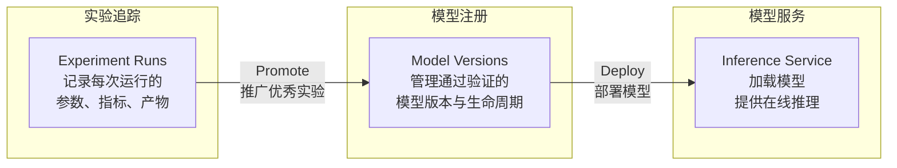
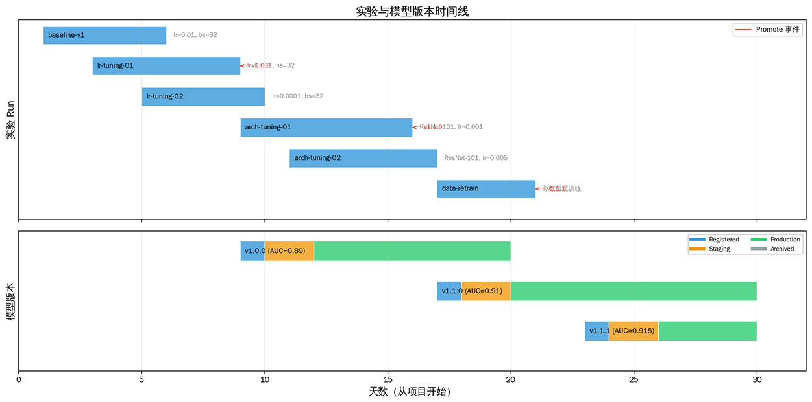
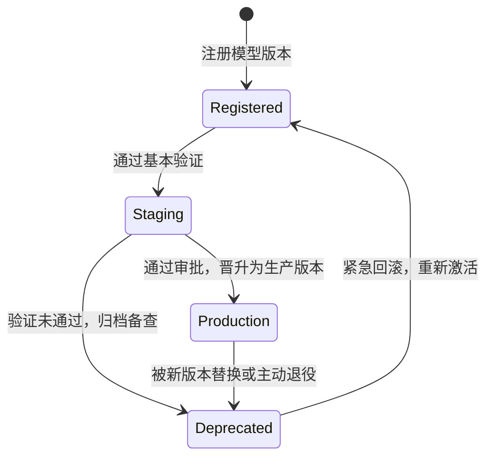
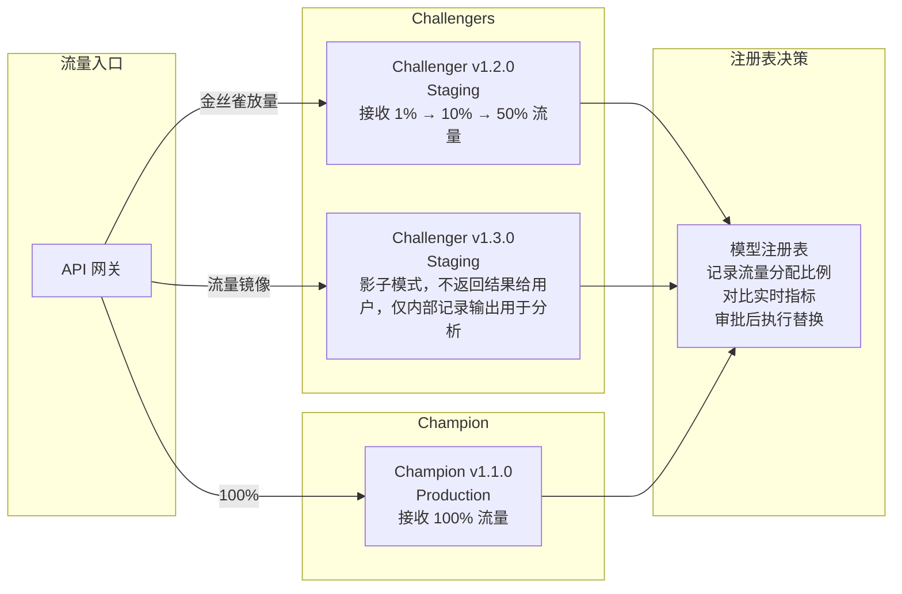

# 实验追踪与模型注册

2015 年，谷歌的论文《Hidden Technical Debt in Machine Learning Systems》描述了在一个真实的机器学习系统中，模型训练代码只占整个系统代码量的 5%，剩下 95% 是被他们称为"胶水代码"的数据管道、特征提取、模型部署、监控告警等基础设施。这篇论文后来成了 MLOps 这个实践领域的开山之作。

三年后的 2018 年，Databricks 团队启动了 MLflow 项目，首次将实验追踪、模型注册和模型部署统一到一个开源平台中。同年，Weights & Biases 公司成立，将实验追踪的核心功能搬上云端。这两个事件标志着机器学习工程化正从谷歌这种行业巨头级别的内部实践，演变为普通团队也能使用的通用工具。如今，实验追踪和模型管理已经成为任何严肃的机器学习团队的标配基础设施。

实验追踪关注的问题是"模型是怎么训练出来的"。调整一个超参数、换一种特征组合、尝试新的预处理方案，都要实验验证。几周下来做了上百次实验之后，如果没有系统化的记录，你甚至无法回答上周那个 AUC 0.92 的模型用的是什么参数。模型注册关注的问题则是"模型训练得如何、是否可以上线"。实验只是手段，模型才是交付物。一个模型从实验台走到生产环境，完整生命周期要经历验证、审批、部署、监控、退役等多个阶段。没有模型注册，模型文件就只是散落在各个目录中的 `.pth` 文件，谁也不知道线上跑的是哪个版本，出了问题也无法回溯。

实验追踪记录每次训练的运行信息，让过程可追溯、可对比、可复现；模型注册管理通过验证的模型版本，控制从开发到生产的生命周期流转。本章将沿着这条链路，先讲如何追踪实验，再讲如何管理模型，最后讨论两者之间的工程衔接。

## 从实验到生产的流转

典型的机器学习开发流程中，一个模型从想法到上线要经历实验、注册、部署三个阶段，每个阶段都由不同的系统负责支撑。

- **实验阶段**：研究人员在 Notebook 或训练脚本中尝试几十种参数组合、模型架构和数据处理方案，每次运行产生一组指标和一个模型权重文件。这个阶段的产出是大量的候选模型，其中绝大部分会因为指标不达标而被丢弃。但如果没有系统化的记录，即使找到了一个 AUC 0.92 的好模型，你也可能因为不记得当时用的是哪个版本的数据、哪个随机种子、哪个依赖包版本而无法复现它。

- **注册阶段**：成百上千次实验运行中，只有少数通过验证的模型会被 Promote 到模型注册表。在这里，模型获得正式的身份：一个唯一的名称、一个语义化的版本号、一份完整的元数据档案（训练数据版本、代码版本、超参数、评估指标）。注册表只收录"成功毕业"的模型，失败的实验被永远留在实验追踪系统中。

- **部署阶段**：注册的模型经过审批后，被加载到推理服务中对外提供访问。部署并不是终点，模型可能以蓝绿部署的方式与新版本共存，可能以金丝雀发布的方式逐步接收流量，也可能因为性能下降而被回滚到上一个版本。

这三个阶段的数据流向形成了清晰的单向管道：

*图：模型生命周期的单向管道*

在这条管道中，实验追踪和模型注册各司其职。实验追踪关注过程，包括那些失败的尝试。知道什么不正确，往往与知道什么是正确的同样重要。失败的实验记录了像"学习率设为 0.1 会导致不收敛"、"这个特征组合反而会降低 AUC"等宝贵经验。模型注册则关注结果，它只管理那些通过了验证门槛、值得被部署的模型版本，控制版本元数据、状态流转和部署审批。它的核心问题是哪个模型版本可以上线，现在线上跑的是哪个版本。

二者的衔接点是 Promote 操作。当你在实验追踪系统中发现一个表现优异的 Run，执行 Promote 操作会触发一系列自动化步骤。包括提取 Run 中的超参数和指标作为模型版本的元数据、将模型权重从实验产物存储迁移到注册表的权重存储、在注册表中创建新版本并建立双向关联链接。这一操作确保了每个注册模型都能追溯到它的完整训练过程。线上模型出了问题，可以一路回溯到当初的实验 Run，查看完整的训练日志和参数配置。

## 实验追踪

在没有实验追踪系统的团队中，实验管理通常是"笔记驱动"的。研究人员用 Excel、Notion 甚至纸质笔记本记录每次实验的参数和结果，信息散落在不同人的不同工具中。模型文件以 `model_v2_final_final.pth`、`model_v3_best_this_one.pth` 这样的命名散落在实验服务器的各个目录下，版本语义全靠文件名猜测。最终被选中的模型的参数配置，可能只存在于那次运行的终端输出中，一旦终端窗口关闭就彻底丢失。对工程化的实验团队而言，一次实验的完整记录，最低标准至少是给定这份记录，另一个团队成员应能在相同的环境下精确复现该实验的结果。达到这个标准需要覆盖以下几个维度的信息：

- **代码版本**是回溯的起点。终端里 `git diff` 显示的那几行改动，可能正是模型性能差异的来源。
- **数据版本**曾用[一整章](data-versioning.md)来讲述，训练集、验证集、测试集分别是什么版本，数据如何划分，预处理参数（归一化的均值和方差、图像裁剪尺寸）都须精确记录。
- **超参数**（学习率、批次大小、训练轮次、优化器类型）是直接影响模型性能的可调变量，这是大多数团队最先想到要记录的东西。
- **模型配置**（网络架构、层数、隐藏维度、激活函数）决定了模型的结构容量。
- **训练环境**（Python 版本、依赖包版本、GPU 型号、CUDA 版本、分布式策略）往往是复现失败的重灾区。同一段 PyTorch 代码在不同 CUDA 版本上可能因为浮点运算的微小差异而产生不同的数值结果。

除了上述输入端的参数和配置，通常还需要记录输出端的度量指标和产物。度量指标包括训练过程中的 Loss 和 Accuracy 时序数据（步级或轮级），以及验证集和测试集上的聚合指标（最佳 Loss、最终 F1-Score 等）。输出产物包括模型权重文件、训练日志和可视化图表。我们将在稍后详细讨论这些数据的建模方式。

可见一次实验的信息如此繁杂，因此实验追踪系统需要一个清晰的元数据模型来组织它们。主流的实验追踪系统通常采用三层（参数与配置层、度量指标层、产物与输出层）结构的元数据模型。

- **参数与配置层**：参数与配置具有天然的层次关系。全局参数（项目名称、实验目的）处于最顶层，往下是模型参数（架构类型、层数、隐藏维度），再往下是训练参数（学习率、批次大小、优化器），最底层是数据参数（数据集版本、预处理配置）。这种层次结构支持参数的继承和覆盖，譬如一组实验共享相同的数据配置和模型架构，仅在学习率和批次大小有所不同。记录时不必每次重复所有参数，只需声明对基准配置的偏移量，系统自动合并完整的参数快照。

- **度量指标层**：过程度量指标按记录频率分为步级和轮级，在精度和存储成本之间各有取舍。步级指标每 N 步记录一次（如每 100 步记录当前 Batch 的 Loss），提供了训练动态的最细粒度视图，代价是存储量大。假设一个训练任务有 10000 步，每步记录 Loss、Accuracy、Learning Rate 三个浮点数，跑 100 次实验就会产生 300 万条时序数据。轮级指标在每 epoch 结束时记录一次验证集指标，是实验对比最常用的粒度，存储量适中。此外还有聚合指标与自定义指标作为补充，聚合指标只保留最终的最佳值或最终值，适合快速检索和排序，但丢失了训练过程的动态信息。业务特定的自定义指标用于反映参数的业务影响和含义，如推荐系统的点击率（CTR）、搜索系统的归一化折损累积增益（NDCG）、对话系统的 BLEU 分数等，这些指标的计算逻辑往往比标准指标更复杂。

- **产物与输出层**：产物的存储策略由文件大小决定。模型权重文件动辄几百 MB 到几 GB，适合存入对象存储，在实验记录中只保留存储路径和校验哈希。训练日志、异常堆栈和警告信息通常体积较小，可直接存入数据库便于搜索。训练曲线图、混淆矩阵、特征重要性图等可视化产物可以存入对象存储或专用的图表服务。所有产物通过实验 ID 关联，确保从实验记录页面可以一键定位到所有相关的文件。

以上三层中的设施应该自动运行，而不是靠人来驱动。从工程角度看，实验追踪系统的可靠性直接决定于其自动化程度。以获取度量指标为例，应该在训练脚本代码中调用追踪 SDK，如用 `log_params()` 记录超参数，用 `log_metrics()` 记录指标。训练框架本身也提供了通用的自动记录机制，如 PyTorch Lightning 的 `on_train_epoch_end` 回调，或 Keras 的 `Callback` 基类，每个 epoch 结束时的 Loss 和验证指标自动写入追踪系统。

## 模型注册

成功在实验阶段脱颖而出的模型，会被 Promote 到模型注册表，每个模型版本因此拥有唯一的身份、完整的历史记录和清晰的生命周期状态。任何一个被注册的模型，都会获得一个唯一的名称和版本号。名称的设计通常采用层次命名 `<domain>/<task>/<architecture>`，如 `recommendation/click-prediction/dcn-v2`。这个命名既表达了业务归属（推荐系统下的点击预测），也包含了技术信息（DCN-v2 架构），让团队在模型目录中可以按领域和任务查找模型。

与软件的语义化版本号类似，模型的版本号通常采用语义化三段式 `Major.Minor.Patch`，但具体含义需要根据场景做适配。`Major` 版本一般对应架构级别的变更，如从 ResNet-50 换到 ResNet-101，这意味着推理接口可能不兼容。`Minor` 版本一般对应超参数调整、训练策略优化或特征变更，模型架构不变但性能可能有显著差异。`Patch` 版本一般对应相同配置下的数据重训练，可能是拿到了新的训练数据，用完全相同的参数和代码重新跑了一次训练，模型结构不变，但权重数值变了，性能指标可能因新数据分布而改变。每个版本必须关联到一次或多次实验 Run，保留训练过程的完整记录。

版本创建有几种触发方式。最直接的是手动 Promote。研究者在实验追踪系统中看到某个 Run 的指标达标，主动将其提升为注册版本。更工程化的是指标自动触发，训练脚本在结束时自动对比验证集上的预设指标阈值，如果新模型优于已注册的线上版本（Champion），则自动创建新版本。还有定期重训练场景，譬如每周一凌晨从最新的数据训练模型并自动注册，保证模型持续从新数据中学习。新版本默认继承上一版本的元数据模板（特征列表、推理接口定义），用户只需覆盖变更的部分，减少重复配置工作。将实验 Run 和模型版本沿统一的时间轴排列，可以直观展示出模型从实验到注册的映射关系。下图中上半部分展示实验 Run 的生命周期和 Promote 的目标版本，下半部分展示模型版本的状态流转阶段。两图时间轴对齐，能够清晰看到每次 Promote 的时间点。

*图：实验与模型版本时间线*

实践中还会使用标签为版本赋予更具体的语义角色。譬如 `baseline` 标签标识最初的基准模型，所有后续改进都以它为参照。`champion` 标签标识当前线上服务的版本，是唯一能接收全部生产流量的版本。`challenger` 标签标识候选替代版本，它们正在 Staging 环境中接受考验。`deprecated` 标签标识已废弃但仍保留记录的版本。除标签外，自由文本的版本描述可以记录变更动机和预期效果，如"将嵌入维度从 64 提升到 128，预期 AUC 提升 1%"。有了命名、版本和标签后，搜索和发现自然有了数据基础，像按任务查找所有推荐相关的模型，按验证集 AUC 降序排列以找到历史最佳，按状态过滤出 Staging 等待审批的版本，或浏览最近一个月注册的新模型。

## 模型生命周期

模型从注册到退役，必须经历严格定义的状态流转，每一步都有明确的触发条件和权限约束，需要不同级别的授权。从 Registered 到 Staging 通常可由开发人员直接执行，因为这只是将模型送入测试环境，不涉及线上流量。从 Staging 到 Production 则必须经过团队负责人或平台管理员审批。从 Production 到 Deprecated 同样需要审批，因为退役一个生产模型可能影响线上服务。

*图：模型生命周期状态机*

Champion-Challenger 模式是 Staging 晋升到 Production 的典型自动化运维模式。Champion 是唯一的线上版本，承载全部生产流量。Challenger 是一个或多个候选版本，同时在 Staging 环境中接受评估。评估不是一次性的离线对比，而是通过流量镜像或逐步放量的方式在接近真实的环境中验证。这些验证构成了管理员审批决策的事实依据，通常包括：

- **功能验证**确保模型能正常加载和推理，如输出格式严格符合模型签名定义。
- **性能验证**检查离线指标是否达到预设阈值，如验证集 AUC 提升是否超过 0.5%、在线延迟 P99 是否低于 50ms。
- **公平性验证**检查模型在不同子群体（按性别、年龄、地域划分）上的性能差异是否在可接受范围内。
- **安全验证**确保模型对对抗样本有基本鲁棒性，且输出不包含敏感信息泄露。
- **兼容性验证**确保新版本的特征依赖和推理接口与现有服务兼容，不需要额外的上游改造。
- ……

Challenger 先从 1% 的流量开始，确认各项指标没有退化后逐步放大到 10%、50%，直到完全替换 Champion。在这个渐进过程中，如果 Challenger 在某个流量阶段出现延迟升高或指标下降，可以立即回退流量，将影响控制在最小范围。新 Champion 上线后，旧 Champion 也不会立即归档，而是保留一段时间（如 7 到 30 天）作为回滚的安全保险。如果新模型出现线上才暴露的问题，可以瞬间切回旧版本。下面的时序视图展示了从流量分配、指标对比到最终替换的完整决策过程。

*图：Champion-Challenger 模式的流量分配架构*

模型的部署策略直接继承了传统软件工程的实践经验，蓝绿部署、金丝雀发布、影子部署这些传统的风险控制措施依然有效。蓝绿部署中，新旧两个版本同时在线，注册表维护两个版本（一个标记为 Active/Blue，一个标记为 Standby/Green），通过流量网关一键切换，实现秒级回滚。金丝雀发布中，注册表记录流量分配比例，部署系统根据比例将请求路由到不同版本，配合监控系统实时观察指标差异。影子部署中，新版本接收线上流量的完整镜像但不返回结果给用户，注册表中标记为 Shadow 状态，仅用于对比验证新模型在真实流量下的行为。无论哪种策略，注册表都记录了历史 Production 版本的完整列表，支持将任意版本一键回滚到线上。

最后，模型终有退役归档的一天，这是正常的生命周期。退役可能是因为模型性能随着数据分布漂移而持续下降，重训练也无法恢复，或业务需求变更导致该模型的预测不再需要，或法规/合规要求强制下线某个模型，或技术栈迁移导致模型的格式不再被当前推理引擎支持，等等。归档模型应当从常规查询和搜索结果中隐藏，但完整的元数据和审批记录要永久保留，供审计和问题回溯。模型权重在退役后也推荐保留一段窗口期，过了窗口期后移入冷存储，以降低成本。

## 本章小结

实验追踪和模型管理是 MLOps 基础设施的两根支柱。实验追踪让训练过程透明化，每一次运行的参数、指标、环境和产物都被结构化记录，实验之间可以对比、搜索和分组分析，任何历史结果都能复现。模型注册让产物管理规范化，每个模型版本拥有唯一的身份标识和完整的生命周期状态机，从注册到 Staging 到 Production 到归档，每一步都有明确的触发条件和权限控制。两套系统通过 Promote 操作衔接在一起，形成从实验台到生产环境的完整资产流转管道，确保任何时候都能从线上模型回溯到它的训练过程。

## 练习题

1. 实验追踪系统中，为什么要求实验记录具有不可变性？如果允许修改已记录的超参数值，会导致什么问题？

   

   
参考答案

   不可变性是实验追踪系统可靠性的基石。如果允许修改已记录的超参数值，会导致三个严重问题：第一，实验对比失去意义。你可能"对比"了两个 Run 的参数，但其中一个参数是被事后修改过的，对比的结论不可信。第二，可复现性被破坏。你无法确定记录中的参数值是训练时实际使用的值还是后来改过的值，给定记录无法精确复现实验。第三，协作信任崩塌。团队成员无法信任他人的实验记录，因为任何人都可能为了"让结果看起来更好"而事后修改参数。

   实践中，实验追踪系统通常允许追加评论和标签（属于主观补充），但不允许修改已写入的参数和指标值（属于客观事实）。如果需要"纠正"一个错误的参数值，正确做法是创建一个新的 Run 并注明更正原因，而不是修改旧 Run。
   

2. 假设你有一个推荐模型每小时自动重训练一次并注册新版本。设计这个场景下的 Champion-Challenger 流程。新版本需要满足什么条件才能自动替换线上模型？替换过程中如何保证线上服务不中断？

   

   
参考答案

   自动 Champion 替换的流程设计如下。首先，新版本注册后进入 Staging 状态，自动触发离线评估：验证规则有两条：一是对比新版本与当前 Champion 在最近 24 小时验证集上的 AUC，要求新版本不低于 Champion（防止退化）；二是确认训练过程中未出现 Loss NaN 或梯度爆炸等异常。验证通过后，部署系统采用金丝雀发布策略：新版本先接收 5% 流量，观察 10 分钟的 P99 延迟和错误率，无异常则扩大到 50%，再观察 10 分钟，最终扩大到 100% 完成替换。如果任一阶段出现指标退化，自动回退流量到旧 Champion。

   线上服务不中断的关键是蓝绿部署：新旧两个版本同时在线，注册表中同时存在两个 Production 状态的版本（旧版为当前生产版本，新版为待切换版本），流量切换在网关层完成，无需重启服务。旧 Champion 在替换后保留 24 小时作为紧急回滚的安全网，24 小时后自动归档。审批方面，高频自动替换场景建议使用自动审批策略：只要所有验证项通过且无退化，系统自动完成晋升，审批记录自动生成（`approved_by: "auto-pipeline"`），省去人工审批的延迟。
   
