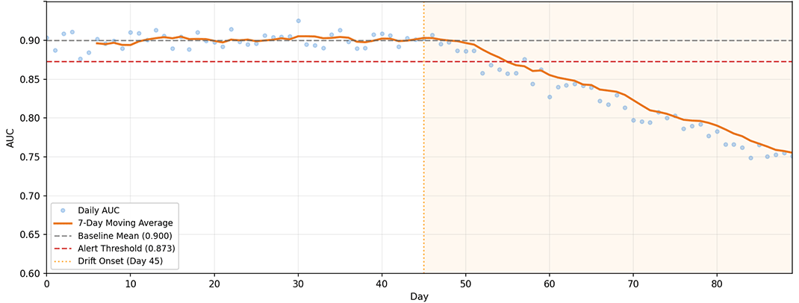
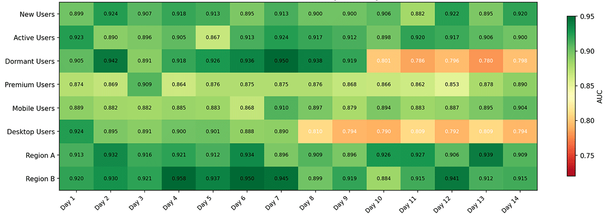
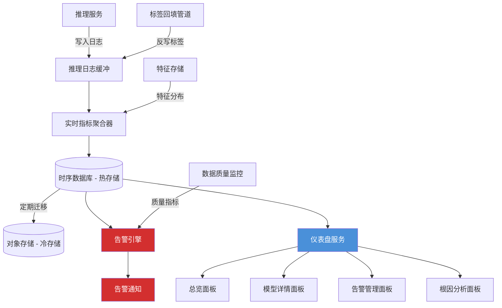

# 模型性能监控

2015 年，谷歌研究员大卫·斯卡利（D. Sculley）在 NIPS 上发表了题为《Hidden Technical Debt in Machine Learning Systems》的论文。这篇论文没有提出新的算法，也没有刷新任何基准榜单，却在工业界引起了持久而广泛的共鸣。斯卡利观察到，机器学习系统背负着一种传统软件工程从未面对过的技术债务。传统系统的正确性取决于代码逻辑，只要代码不变，行为就不变。而机器学习系统的正确性同时取决于代码和数据，数据会随时间漂移，模型的行为也会跟着改变。换句话说，模型一旦部署到生产环境，即使代码一行不改，性能也可能持续下降。

这个洞察催生了 MLOps 中一个独立的子领域 —— 模型性能监控。它的目标不是验证模型训练时有多好，而是持续追踪模型现在还有多好。一个上线时 AUC 为 0.95 的推荐模型，三个月后可能已经悄悄地退化到了 0.85，原因不是代码出现缺陷，而是用户行为变了、上游数据管道改了格式、或者训练时采样的数据已经不能代表当前的真实分布。模型性能监控要做的事情，就是在这些退化演变为业务事故之前发出预警。

## 训练与生产的性能差异

训练性能与生产性能之间存在一道系统性的鸿沟，这道鸿沟并非工程实现的缺陷，而是由机器学习系统的本质决定的。在训练阶段，模型在固定的数据集上学习，验证集和测试集都是从同一批历史数据中划分出来的。它们共享相同的采集条件、相同的特征工程管道、相同的时间窗口。模型在这个封闭环境里考出高分，只能说明它学会了历史数据中的规律，不能保证这些规律在未来依然成立。生产环境的数据是实时产生、持续变化的，数据的时差效应决定了训练数据永远是过去的快照，而生产数据是当前的流。用六个月前的用户行为数据训练出的推荐模型，面对当前用户的偏好变化，就像拿着去年的地图在城市中导航，主干道还没改变，但小店、路况和热门地点可能已经完全不同了。

特征计算的一致性和反馈循环效应进一步加剧了训练与生产的性能差异。训练管道和推理管道往往是两套独立的代码实现。训练时用 Spark 做批量特征工程，推理时用在线服务实时计算特征。两者之间任何微小的差异，比如浮点数精度的取舍、缺失值的默认填充策略、类别编码的映射表不同步，都会造成模型看到的输入不一样，而这些问题在离线评估中完全不可见。反馈循环效应则是指模型上线后的预测结果会影响用户行为，用户行为又成为下一轮训练的数据。推荐系统给用户推荐了某个商品，用户出于好奇点击了它，这个点击被记录为正样本被用于后续训练，模型学习到该商品受欢迎并继续强推。这个循环一旦形成，模型的预测分布会逐渐偏离真实的需求分布，性能退化在自我强化的反馈中被不断放大。

### 标签延迟问题

分类模型和回归模型的性能评估依赖真实标签。要知道模型的 [AUC](../../deep-learning/neural-network-structure/activation-loss-functions.md#分类损失) 或 [MAE](../../deep-learning/neural-network-structure/activation-loss-functions.md#回归损失)，需要将预测值与实际结果做对比。但生产环境中，真实标签往往不会在推理完成后立刻到达，它有自己的时间节奏。以信用评分模型为例，银行在一月批准了一笔贷款，模型给出的违约概率是 8%。这笔贷款的还款截止日是十二月，也就是说，真实标签"是否违约"需要等待整整十二个月才能拿到。在这十二个月里，模型已经处理了成千上万笔新的贷款申请，如果模型性能在此期间发生了退化，等到标签到达时才发现的话，基于错误评分发放的贷款早已形成真实的坏账损失。类似的延迟在各类场景中普遍存在。推荐系统中，用户点击推荐内容的行为可能发生在几小时甚至几天后；广告系统中，转化行为可能跨越数周；医疗诊断中，确诊结果可能需要数月甚至更长时间。性能评估存在固有的时间滞后，但性能退化可以被容忍的时间窗口是有限的。等到标签到达再行动，系统可能已经在退化状态下运行了很长时间。

应对标签延迟的策略通常有三种。第一种是使用代理指标替代真实标签，譬如用预测置信度或预测类别的分布变化来间接推断模型是否退化，这些指标无需真实标签即可实时计算。第二种是使用部分标签做快速评估，当一小部分标签率先到达时（如信用卡还款的早期违约信号），用它们作为真实标签的近似。第三种是用统计方法估计标签分布，在[漂移检测](drift-detection.md)中使用的输入分布检验也属于这一思路。

### 监控粒度与成本

综上，模型训练与生产的性能差异，源于数据流时间效应导致的模型输入特征的分布变化、特征计算一致性和反馈循环导致的模型输出的行为变化，以及由于标签延迟导致的质量退化难以及时发现。它们便是模型上线后需要持续监控的信号。最底层是输入特征分布，它不依赖标签就可以实时检测，是最早发出预警的哨兵。中间层是模型输出行为（置信度分布、类别比例、预测熵），同样无需标签、准实时可得，比输入层更接近模型的实际决策状态。最顶层是模型预测质量（准确率、AUC、MAE 等），它需要真实标签才能计算，受制于标签延迟，但直接回答了模型现在还有多好这个根本问题。这三个层次从前到后逐渐接近模型的真实性能状况，从前到后对真实标签的依赖也逐渐加重，监控体系的设计就是在这三者之间权衡成本和时效。

明确了需要监控什么之后，下一个问题就是如何监控以及监控粒度该多细。全局监控对所有预测请求计算聚合指标，譬如全量请求的平均 AUC 或平均预测置信度。这种做法成本低、计算简单，缺点是整体指标正常可能掩盖局部的严重退化。一个推荐模型的全局 AUC 保持在 0.90，某个地区（譬如新开拓的市场）的 AUC 却可能已经跌到 0.65。如果只看全局仪表盘，这个问题不会触发任何告警，直到该地区的业务数据出现明显下滑。按维度拆分的分片监控可以缓解这个问题，譬如用户群体、地域、设备类型、时间段等，对每个分片独立计算指标。它能发现局部退化，但代价是每个分片的样本量减少，指标波动增大。一个每天只有几百次请求的小地域分片，它的日 AUC 自然波动可能高达 $±0.1$，在这种噪声中区分真实的退化信号和随机波动，需要更复杂的统计方法，我们将在[分片退化检测](#分片退化检测)中展开讨论。

## 数据漂移与概念漂移

前面提到，模型性能退化的根本原因之一是数据分布在变化。但"变化"这个词实际上包含了两种本质不同的漂移类型，它们的检测手段和应对策略截然不同，区分它们是实际解决问题的需要，并不是学术上的咬文嚼字。

**数据漂移**（Data Drift），也称**协变量漂移**（Covariate Shift），指的是输入特征的分布发生了变化。$P(X)$ 变了，但给定输入后输出的条件概率 $P(Y|X)$ 保持不变。譬如一个电商推荐模型，过去用户搜索的商品以电子产品为主，现在用户开始大量搜索家居用品。输入词汇的分布确实变了，但是"如果用户搜索手机壳，他们大概率想买手机壳"这个关系并没有改变。**概念漂移**（Concept Drift）则完全不同，它是指 $P(X)$ 没变，而 $P(Y|X)$ 本身发生了变化，同样的输入现在对应的正确答案不同了。试想一个垃圾邮件过滤器，十年前带有"比特币"、"数字资产投资"字样的邮件可能是严肃的数字金融讨论，今天则几乎全部是广告推销或者诈骗信息。输入词本身没有变（依然是"比特币"、"投资"等词汇），但"这些词是否指向垃圾邮件"的判断标准变了。

这个区分的实践意义在于，数据漂移可以在没有真实标签的情况下被检测，因为只需要比较输入特征在不同时间窗口的分布差异。概念漂移通常需要真实标签才有可能确认，因为要验证的是同样的输入，输出标签是否发生了变化。这解释了为什么在漂移检测中，输入漂移的监控（通过统计检验比较特征分布）可以做到准实时，而概念漂移的检测往往受制于延迟标签问题。

关于漂移的更深入讨论，包括多种漂移类型的数学定义、常用的统计检验方法以及漂移发生后的应对流程，我们将在下一章[漂移检测](drift-detection.md)中展开讨论。这里我们关注的是漂移与性能监控之间的传导关系：数据漂移不一定导致性能退化（某些分布变化不触及决策边界），性能退化也不一定来自数据漂移（可能是特征管道故障或标签定义变更），但漂移是性能退化最常见的早期预警信号。把握住这个关系，就能理解为什么漂移检测和性能监控是互补而非替代的关系。

## 性能退化检测

明确了模型上线生产后性能退化的危害和导致性能退化的原因后，我们就要着手发现定位问题，从模型指标的波动中区分出真正的退化信号和正常的随机波动。这需要一套系统的检测方法，从统计检验到模式识别，逐层过滤噪声。模型性能退化检测的方法主要包括统计检验、渐进退化检测和分片退化检测三类。

### 统计检验方法

模型性能指标在时间轴上的波动是由采样带来的随机噪声，以及数据分布的真实变化两种力量共同驱动的。统计检验的任务是量化当前观察到的波动有多大可能只是随机噪声引起的，经常使用的量化指标有 PSI 指数和 KS 统计量等：

- **群体稳定性指数**（Population Stability Index，PSI）是工业界最广泛使用的漂移量化指标，它衡量两个分布之间的差异程度。给定参考分布 $P$（通常是训练数据上计算的基线）和当前分布 $Q$（生产数据上实时计算的分布），PSI 的计算方式如下：

    $$PSI = \sum_{i=1}^{n} (P_i - Q_i) \cdot \ln\frac{P_i}{Q_i}$$

    其中 $n$ 是将数值范围等分成的桶数（通常取 10），$P_i$ 是参考分布中落入第 $i$ 个桶的比例，$Q_i$ 是当前分布中落入同桶的比例。$(P_i - Q_i)$ 和 $\ln(P_i/Q_i)$ 分别衡量了绝对差异和相对差异程度。当 $P_i$ 和 $Q_i$ 完全相同时，这一项为 0。$P_i$ 与 $Q_i$ 的差异越大，该项对 PSI 的贡献越大。最终 PSI 是将所有桶的差异贡献求和。PSI 多用于衡量预测分数分布的稳定性，但其思想可以推广到任何连续特征。

- **KS 检验**（Kolmogorov-Smirnov Test）则从另一个角度衡量分布差异。它计算两个[累积分布函数](../../maths/probability/probability-basics.md#累积分布函数)（CDF）之间的最大垂直距离。KS 统计量越大，两个分布来自同一总体的可能性越小。与 PSI 相比，KS 检验可以直接用于假设检验框架，回答如在显著性水平 $\alpha = 0.01$ 下，当前分布是否与基线分布有显著差异这样的问题。这使得告警决策可以建立在统计置信度的基础上，而不仅仅依赖固定阈值。

在实践中，统计检验并不会孤立使用。将多个检验方法组合起来，一层筛分布差异（PSI），一层做显著性判断（KS 检验），一层看趋势持续性（连续 N 个窗口都显著），可以有效降低误报率。

### 渐进退化检测

渐进退化检测用于监测模型长时间的隐蔽退化。随着数据分布缓慢漂移，模型性能每天下降 0.05%，日环比完全难以察觉，但累积一个月就是 1.5%，累积一个季度就是 4.5%。等累积变化越过告警阈值时，模型可能已经退化了数月时间，溯源和修复的难度大大增加。

趋势检测对性能指标的时间序列做线性回归分析，检验回归斜率是否显著为负。具体做法是取最近 $N$ 天的日级指标值，拟合一条线性趋势线 $y = \beta_0 + \beta_1 t$，如果 $\beta_1$ 小于零且检验的 p 值低于显著性水平，就认为存在统计显著的退化趋势。这种方法将"下降了多少"的问题转化为"下降趋势是否可信"的问题。下图展示了某模型 90 天内的 AUC 变化趋势：蓝色实线为每日 AUC 值，橙色虚线为 7 天移动平均线，红色横线为动态告警阈值（取历史均值的 3 倍标准差）。虽然日间波动较大，但移动平均线清晰揭示了自第 45 天开始的持续下降趋势。



*图：模型 AUC 的 90 天趋势*

另一个渐进退化检测的补充方法是移动窗口对比。将当前短窗口（如最近 3 天）的均值与更长历史窗口（如过去 30 天）的均值做差值和 t 检验（t-Test，判断两组数据均值之间是否存在显著差异），检测是否发生了缓慢但累积性的偏移。与检测突变的做法的区别在于移动窗口对比使用更长的历史基准（30 天而非 7 天），对缓慢趋势的方向变化更敏感。

### 分片退化检测

前面讨论性能退化的原因时曾提到，全局指标有一个盲点是分片退化。譬如模型整体 AUC 始终稳定在 0.90，但某个特定分片的性能已经持续恶化。这种情况在用户群体多元化的大型系统中格外常见。面向年轻人的推荐策略在新用户上表现良好，但对老用户群体的推荐质量却在衰减，因为老用户的行为模式与训练数据中的偏差更大。

分片退化检测将性能指标按维度切分后分别监控。关键分片维度包括用户群体（新用户、活跃用户、沉默用户）、地域、设备类型、交易金额区间、一天中的时间段等。每个分片独立计算指标、独立判断退化。分片的统计挑战在于样本量大小，小分片每天可能只有几百甚至几十次请求，指标估计的方差大，随机波动可能被误判为退化。

解决这个问题的思路是将小样本的退化判断转化为统计检验问题而非简单的阈值判断。譬如不只比较分片 AUC 是否低于阈值，而是检验该分片的 AUC 在最近 N 天是否显著低于其自身的历史均值，利用该分片自身的历史波动来为判断提供方差参考。对于样本量过小（如每天少于 50 次）的分片，可以向上聚合到更大的分组（如从按城市聚合到按省份聚合），在检测能力和粒度之间取得平衡。下图为各用户群体在不同日期的 AUC 变化热力图，横轴为日期，纵轴为用户群体，颜色深浅反映 AUC 高低。热力图可以直观地定位退化的时间和影响范围。若某一分片在近期出现明显的颜色变浅，说明该分片的性能在退化。



*图：各用户群体在不同日期的 AUC 变化热力图*

## 代码实践：模型性能监控器

上面的讨论建立了一个完整的监控方法论框架，理论还需要通过实践来落地。下面的代码实现了一个轻量级的模型性能监控器，覆盖了代理指标计算、PSI 漂移量化和性能退化模拟等核心环节。代码尽量自包含，不依赖专业的监控平台，目的是展示监控逻辑的基本结构。

```python runnable extract-class="ModelPerformanceMonitor"
import numpy as np
import matplotlib.pyplot as plt
from dataclasses import dataclass, field
from typing import List, Tuple

@dataclass
class MonitoringWindow:
    """单个监控时间窗口的数据容器"""
    timestamps: List[float] = field(default_factory=list)
    predictions: List[np.ndarray] = field(default_factory=list)
    labels: List[int] = field(default_factory=list)

    def add(self, pred: np.ndarray, label: int, timestamp: float):
        self.predictions.append(pred)
        self.labels.append(label)
        self.timestamps.append(timestamp)

    @property
    def size(self) -> int:
        return len(self.predictions)

class PopulationStabilityIndex:
    """
    群体稳定性指数计算器

    PSI 衡量当前分布与参考分布之间的差异程度。
    PSI < 0.1: 无显著漂移
    0.1 <= PSI < 0.2: 中等漂移
    PSI >= 0.2: 显著漂移
    """

    def __init__(self, n_bins: int = 10):
        self.n_bins = n_bins
        self.reference_hist = None
        self.bin_edges = None

    def fit_reference(self, reference_scores: np.ndarray):
        """用训练集上的预测分数拟合参考分布"""
        self.reference_hist, self.bin_edges = np.histogram(
            reference_scores, bins=self.n_bins, density=True
        )

    def compute(self, current_scores: np.ndarray, epsilon: float = 1e-6) -> float:
        """
        计算当前分布相对于参考分布的 PSI

        公式: PSI = sum((P_i - Q_i) * ln(P_i / Q_i))
        其中 P_i 是参考桶比例，Q_i 是当前桶比例
        """
        current_hist, _ = np.histogram(
            current_scores, bins=self.bin_edges, density=True
        )
        # 将概率密度转换为比例
        p = current_hist / current_hist.sum()
        q = self.reference_hist / self.reference_hist.sum()
        # 为每个桶计算 PSI 分量
        psi_per_bin = np.zeros(self.n_bins)
        for i in range(self.n_bins):
            p_i = max(p[i], epsilon)
            q_i = max(q[i], epsilon)
            psi_per_bin[i] = (p_i - q_i) * np.log(p_i / q_i)
        return np.sum(psi_per_bin)


class PerformanceMonitor:
    """
    模型性能监控器

    在无真实标签时计算代理指标（置信度分布、预测熵等），
    在有真实标签后计算实际指标（准确率、Brier Score、ECE）。
    """

    def __init__(self, window_size: int = 1000):
        self.window_size = window_size
        self.psi_calculator = PopulationStabilityIndex(n_bins=10)
        self.current_window = MonitoringWindow()
        self.metrics_history: List[dict] = []

    def fit_baseline(self, reference_predictions: np.ndarray):
        """用训练集预测结果拟合基线分布"""
        self.psi_calculator.fit_reference(reference_predictions)

    def record_prediction(
        self, probabilities: np.ndarray, label: int, timestamp: float
    ):
        """记录单次推理的预测和（后续到达的）标签"""
        self.current_window.add(probabilities, label, timestamp)

    def compute_proxy_metrics(self) -> dict:
        """计算无需真实标签的代理指标"""
        if self.current_window.size == 0:
            return {}

        preds = np.array([p[1] for p in self.current_window.predictions])
        entropy = -np.sum(
            np.array(self.current_window.predictions)
            * np.log(np.array(self.current_window.predictions) + 1e-8),
            axis=1,
        )

        return {
            "mean_confidence": float(np.mean(preds)),
            "std_confidence": float(np.std(preds)),
            "mean_entropy": float(np.mean(entropy)),
            "psi": float(self.psi_calculator.compute(preds)),
        }

    def compute_actual_metrics(self) -> dict:
        """计算需要真实标签的实际指标"""
        if self.current_window.size < 10:
            return {}

        preds = np.array([p[1] for p in self.current_window.predictions])
        labels = np.array(self.current_window.labels)

        # 准确率（以 0.5 为阈值）
        accuracy = np.mean((preds >= 0.5) == labels)

        # Brier Score
        brier = np.mean((preds - labels) ** 2)

        # 简易 ECE
        n_bins = 10
        bin_edges = np.linspace(0, 1, n_bins + 1)
        ece = 0.0
        for i in range(n_bins):
            mask = (preds >= bin_edges[i]) & (preds < bin_edges[i + 1])
            if mask.sum() > 0:
                acc = labels[mask].mean()
                conf = preds[mask].mean()
                ece += (mask.sum() / len(preds)) * abs(acc - conf)

        return {
            "accuracy": float(accuracy),
            "brier_score": float(brier),
            "ece": float(ece),
        }

    def snapshot_metrics(self, timestamp: float):
        """生成当前窗口的指标快照并清空窗口"""
        proxy = self.compute_proxy_metrics()
        actual = self.compute_actual_metrics()
        self.metrics_history.append({
            "timestamp": timestamp,
            **proxy,
            **actual,
            "window_size": self.current_window.size,
        })
        self.current_window = MonitoringWindow()


def simulate_degradation(
    n_samples: int = 50,
    drift_start: int = 20,
    drift_rate: float = 0.01,
    random_seed: int = 42,
) -> Tuple[np.ndarray, np.ndarray, List[float]]:
    """
    模拟模型性能的渐进退化过程

    前 drift_start 个周期的数据从标准分布中抽样（模拟正常期），
    之后每个周期以 drift_rate 的比例增大分布偏移（模拟退化期）。
    """
    rng = np.random.default_rng(random_seed)
    timestamps = list(range(n_samples))
    scores = np.zeros(n_samples)
    drift_amounts = np.zeros(n_samples)

    for t in range(n_samples):
        if t < drift_start:
            drift = 0.0
        else:
            drift = (t - drift_start) * drift_rate
        drift_amounts[t] = drift
        # 正常 AUC 在 0.90 附近，退化导致 AUC 缓慢下降
        auc_t = 0.90 - drift + rng.normal(0, 0.015)
        scores[t] = np.clip(auc_t, 0.60, 0.95)

    return np.array(timestamps), scores, drift_amounts.tolist()


# 模拟演示：90 天性能退化
timestamps, auc_values, drift_amounts = simulate_degradation(
    n_samples=90, drift_start=45, drift_rate=0.004, random_seed=2024
)

# 计算移动平均和动态阈值
window = 7
moving_avg = np.convolve(auc_values, np.ones(window)/window, mode='valid')
baseline_mean = np.mean(auc_values[:45])
baseline_std = np.std(auc_values[:45])
threshold = baseline_mean - 3 * baseline_std

# 绘制退化趋势图
fig, (ax1, ax2) = plt.subplots(2, 1, figsize=(12, 8))

ax1.plot(timestamps, auc_values, 'o', alpha=0.4, markersize=4,
         color='#4A90D9', label='每日 AUC')
ax1.plot(timestamps[window-1:], moving_avg,
         color='#E87722', linewidth=2, label=f'{window}日移动平均')
ax1.axhline(y=baseline_mean, color='#888888', linestyle='--',
            alpha=0.6, label=f'基线均值 ({baseline_mean:.3f})')
ax1.axhline(y=threshold, color='#D32F2F', linestyle='--',
            alpha=0.8, label=f'告警阈值 ({threshold:.3f})')
ax1.axvline(x=45, color='#FF9800', linestyle=':', alpha=0.6,
            label='退化开始')
ax1.fill_between([45, 90], 0.6, 0.95, alpha=0.08, color='#FF9800')
ax1.set_xlabel('天数')
ax1.set_ylabel('AUC')
ax1.set_title('模型性能渐进退化检测', fontweight='bold')
ax1.legend(loc='lower left', fontsize=9)
ax1.set_ylim(0.60, 0.95)
ax1.grid(True, alpha=0.3)

# 累积漂移量
ax2.fill_between(timestamps, 0, drift_amounts,
                 color='#FF9800', alpha=0.3, label='累积漂移量')
ax2.plot(timestamps, drift_amounts, color='#E87722', linewidth=2)
ax2.set_xlabel('天数')
ax2.set_ylabel('累积漂移量')
ax2.set_title('数据漂移累积曲线', fontweight='bold')
ax2.legend(fontsize=9)
ax2.grid(True, alpha=0.3)

plt.tight_layout()
plt.show()

# PSI 演示：比较退化前和退化后的预测分数分布
rng = np.random.default_rng(42)
reference_scores = rng.beta(8, 3, size=1000)        # 参考分布：偏向右
degraded_scores = rng.beta(6, 5, size=1000)         # 退化分布：更平坦

psi = PopulationStabilityIndex(n_bins=10)
psi.fit_reference(reference_scores)
psi_value = psi.compute(degraded_scores)

fig2, (ax3, ax4) = plt.subplots(1, 2, figsize=(12, 4))
ax3.hist(reference_scores, bins=20, alpha=0.6, color='#4A90D9',
         edgecolor='white', label='参考分布')
ax3.set_title('参考分布（训练集）', fontweight='bold')
ax3.set_xlabel('预测分数')
ax3.legend()

ax4.hist(degraded_scores, bins=20, alpha=0.6, color='#E87722',
         edgecolor='white', label='当前分布')
ax4.set_title(f'当前分布（生产环境）\nPSI = {psi_value:.4f}', fontweight='bold')
ax4.set_xlabel('预测分数')
ax4.legend()

plt.tight_layout()
plt.show()
```

从运行结果中可以看到两个关键信号。退化趋势图中，45 天之前 AUC 在基线附近正常波动，45 天之后移动平均线持续跌破基线均值，并在约 70 天处触及告警阈值（该数值依赖于模拟参数与随机种子 2024，不同设置下会有差异）。这个延迟（从退化开始到触发告警约 25 天）反映了检测灵敏度和误报容忍之间的权衡。阈值设定越严格（如 2 倍标准差），检测越快但误报越多；设定越宽松（如 4 倍标准差），漏报风险越大。PSI 分布对比图展示了退化前后预测分数分布形态的差异，退化后分布从右偏变为更平坦，PSI 量化了这种差异程度。

## 监控系统架构

前面对模型退化的指标、度量、监控手段进行了理论分析，本节我们讨论如何在生产环境中搭建出可工程化落地的监控系统。一套完整的模型性能监控系统需要将数据采集、指标计算、存储查询、告警通知和可视呈现串联成一个闭环。

### 指标采集管道

指标采集管道是监控系统的最前端，负责从推理服务中收集结构化数据。每次推理请求完成后，管道的日志收集环节至少记录以下信息：请求时间戳、模型版本号、输入特征（或特征 ID）、模型输出的原始分数与最终预测、推理耗时。在延迟标签场景下，日志收集还需要为每条推理记录生成唯一的请求标识符，以便后续标签回填时进行关联匹配。

标签回填管道负责将延迟到达的真实标签与历史推理记录做关联。当真实标签最终到达时（譬如用户的点击事件或贷款的还款状态），系统根据请求标识符找到对应的推理记录，将标签反写回去。这个回填操作的时间窗口可能长达数周到数月，因此推理日志的存储周期必须覆盖标签的最大延迟时长。

指标聚合层在原始日志上做不同粒度的预计算。实时流式聚合以分钟级窗口计算代理指标（PSI、置信度分布、类别分布），因为代理指标的计算不依赖标签，可以准实时产出。批量聚合以小时或天为单位计算需要真实标签的实际指标（准确率、AUC），其计算时机取决于标签回填的完成度。采样策略在这一层可以灵活控制，对于高价值场景（如金融交易），每条推理都需记录。对于海量请求场景（如信息流推荐），则采用按用户 ID 哈希的固定比例采样，确保同一用户的请求总落在同一个采样桶中。

### 指标存储与查询

指标数据天然具有时间序列的特征，适合使用时序数据库（如 InfluxDB、Prometheus）或 OLAP 列式数据库（如 ClickHouse）存储。这类数据库针对时间范围查询和聚合计算做了优化，能在毫秒级别返回"最近 30 天每天的 AUC"这样的查询。

热数据与冷数据的分离存储是成本控制的常用策略。譬如将最近 7 天的细粒度数据（分钟级或小时级）存放在 SSD 上，支持快速的实时查询和仪表盘刷新。7 天以上的粗粒度数据（小时级或天级预聚合）迁移到对象存储或冷存储层，查询延迟较高但存储成本大幅降低。预聚合是冷热分离策略的必要补充。对于常用的同比和环比查询模式（如"今天上午的 AUC 比昨天上午低了多少"），系统提前在每小时和每天结束时预计算常用指标的快照值，避免查询时实时扫描大量原始数据。

### 监控仪表盘

仪表盘是监控系统与人交互的界面，它的设计原则是从总览到细节，从现状到趋势。总览面板提供全局健康视图，所有被监控模型的状态指示（正常/警告/异常），最近 24 小时的关键指标趋势线，活跃告警的数量和级别分布。这个面板是值班人员打开的第一页，需要在最短的时间内判断当前是否存在异常。

模型详情面板深入到单个模型，包括性能指标的时间线（AUC、MAE 随时间的变化），分片性能的对比视图（各用户群体当前的指标差异），近期的模型变更记录（部署、回滚、重训练的时间点标注在指标时间线上）。将变更记录叠加在性能时间线上，可以直观地判断这次性能下降是否与某次变更相关。




*图：模型性能监控系统的参考架构*

上图展示了一个模型性能监控系统的参考架构：推理日志从服务端产出后进入缓冲层，实时指标聚合器从日志和特征存储中计算代理指标和实际指标。热存储支撑告警引擎和仪表盘服务，冷存储用于历史分析。标签回填管道独立运行，将延迟到达的标签关联到历史推理记录。

## 本章小结

模型上线之后，必须配合工程化的监控手段才能感知它是否在正常运作。检测到模型退化后的告警策略、根因分析和应对流程，构成了从发现问题到解决问题的闭环。而监控系统的架构设计，又将前述所有方法论落地为可运行的工程系统。

目前，模型退化仍存在不少尚未被完美解决的问题，如延迟标签下的实时性能评估始终依赖代理指标的间接推断，其精度受限于代理指标与真实性能之间的相关性假设。在大规模多模型场景下，告警疲劳和阈值维护还缺乏成熟的自动化方案。这些问题在不同的业务场景中需要不同的权衡，没有通用的最优解，但本章建立的方法论框架可以作为判断和决策的起点。

## 练习题

1. 某推荐模型的 AUC 在训练集上为 0.92，在测试集上为 0.90，上线一个月后在生产数据上估算的 AUC 为 0.84。列举至少三个可能导致生产 AUC 低于测试 AUC 的原因，并说明每个原因的排查方法。

   <details>
   <summary>参考答案</summary>

   - 可能原因一：训练数据时效性不足。训练数据距今四个月以上，用户行为和内容偏好的分布已经发生了变化（数据漂移）。排查方法：用 PSI 比较训练集和生产数据的特征分布，检查哪些特征的 PSI 值显著偏高。

   - 可能原因二：特征计算的训练—推理不一致。训练管道的特征工程逻辑与推理管道不同。排查方法：选取 100 条生产请求，分别在训练管道和推理管道中计算特征，逐特征比较差异。

   - 可能原因三：延迟标签导致的评估偏差。一个月的生产数据中，部分真实标签尚未到达（如用户可能还会在后续产生转化行为），导致当前 AUC 估算偏低。排查方法：仅用标签已确认到达的样本子集重新计算 AUC，与全量估算对比。

   - 可能原因四：反馈循环效应。模型上线后的推荐结果改变了用户行为分布，训练数据中的“正样本”被模型自身的偏差污染了。排查方法：分析推荐位的点击分布，检查是否向高置信度物品集中。

   </details>

2. 群体稳定性指数（PSI）公式为 $PSI = \sum_{i=1}^{n} (P_i - Q_i) \cdot \ln\frac{P_i}{Q_i}$。请解释 $(P_i - Q_i)$ 和 $\ln(P_i/Q_i)$ 两项各自贡献了什么信息，为什么 PSI 设计为它们的乘积求和？

   <details>
   <summary>参考答案</summary>

   $(P_i - Q_i)$ 贡献了分布的绝对差异：参考桶的比例减去当前桶的比例。它衡量“变了多少”，符号为正表示该桶比例减少（参考值更大），为负表示增加。但仅看绝对差异是不够的，因为一个从 0.01 变到 0.02 的桶和一个从 0.20 变到 0.21 的桶，绝对差异都是 0.01，但前者的变化幅度（翻倍）远大于后者（增加 5%）。

   $\ln(P_i/Q_i)$ 贡献了相对差异：用对数比值衡量“变化的幅度”。对于从 0.20 变到 0.21 的桶（参考值 0.20，当前值 0.21），$\ln(0.20/0.21) \approx -0.049$；对于从 0.01 变到 0.02 的桶，$\ln(0.01/0.02) \approx -0.693$。相对差异大的桶被赋予更大的权重。

   两者乘积求和的设计含义是 PSI 既考虑变化的绝对量，也考虑变化的相对幅度。一个分布变化只有在“绝对差异大且相对变化也大”时才会显著推高 PSI。这种设计还保证了 PSI 的非负性和对称性，使得 PSI 可以作为一个统一的量化指标来比较不同模型、不同特征的分布变化程度。

   </details>
