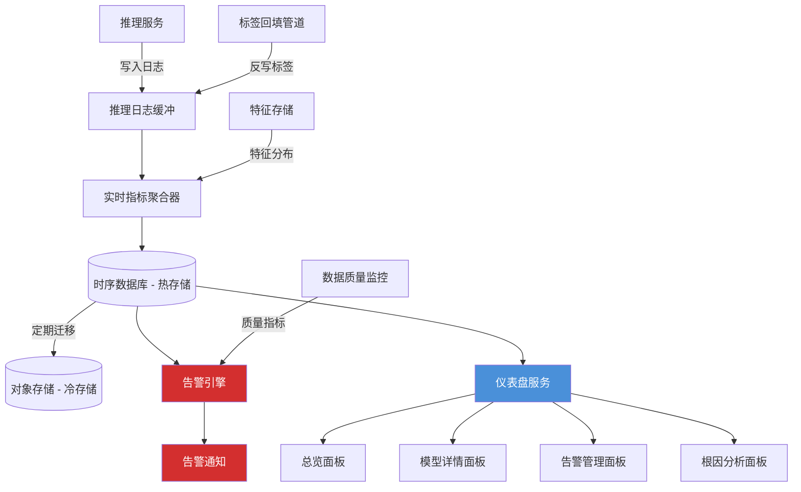

# 模型性能监控

2015 年，谷歌研究员大卫·斯卡利（D. Sculley）在 NIPS 上发表了题为《Hidden Technical Debt in Machine Learning Systems》的论文。这篇论文没有提出新的算法，也没有刷新任何基准榜单，却在工业界引起了持久而广泛的共鸣。斯卡利观察到，机器学习系统背负着一种传统软件工程从未面对过的技术债务：传统系统的正确性取决于代码逻辑，只要代码不变，行为就不变；而机器学习系统的正确性同时取决于代码和数据，数据会随时间漂移，模型的行为也会跟着改变。换句话说，模型一旦部署到生产环境，即使代码一行不改，性能也可能持续下降。

这个洞察催生了 MLOps 中一个独立的子领域：模型性能监控。它的目标不是验证模型"训练时有多好"，而是持续追踪模型"现在还有多好"。一个 AUC 0.95 上线的推荐模型，三个月后可能已经悄悄地退化到了 0.85，原因不是代码出了 bug，而是用户行为变了、上游数据管道改了格式、或者训练时采样的数据已经不能代表当前的真实分布。模型性能监控要做的事情，就是在这些退化演变为业务事故之前，发出预警。

## 模型性能监控的核心问题

模型部署到生产环境后，我们面对的第一个困惑是：为什么训练时看起来很好的模型，上线后表现却不尽如人意？这个困惑背后藏着三个层层递进的问题，它们构成了模型性能监控的底层逻辑。

### 训练性能与生产性能的鸿沟

训练性能与生产性能之间存在一道系统性的鸿沟，这道鸿沟并非工程实现的缺陷，而是由机器学习系统的本质决定的。

在训练阶段，模型在固定的数据集上学习，验证集和测试集都是从同一批历史数据中划分出来的。它们共享相同的采集条件、相同的特征工程管道、相同的时间窗口。模型在这个封闭环境里考出高分，只能说明它学会了"历史数据中的规律"，不能保证这些规律在未来依然成立。生产环境的数据是实时产生、持续变化的，数据的时差效应决定了训练数据永远是过去的快照，而生产数据是当前的流。用六个月前的用户行为数据训练出的推荐模型，面对当前用户的偏好变化，就像拿着去年的地图在城市中导航：主干道可能还没变，但小店、路况和热门地点已经完全不同了。

更棘手的是特征计算的一致性问题。训练管道和推理管道往往是两套独立的代码实现：训练时用 Spark 做批量特征工程，推理时用在线服务实时计算特征。两者之间任何微小的差异，比如浮点数精度的取舍、缺失值的默认填充策略、类别编码的映射表不同步，都会造成"模型看到的输入不一样"，而这些问题在离线评估中完全不可见。

雪上加霜的是反馈循环效应。模型上线后的预测结果会影响用户行为，用户行为又成为下一轮训练的数据。推荐系统给用户推了某个商品，用户出于好奇点击了它，这个点击被记录为"正样本"用于后续训练，模型学习到"该商品受欢迎"并继续强推。这个循环一旦形成，模型的预测分布会逐渐偏离真实的需求分布，性能退化在自我强化的反馈中被不断放大。

### 延迟标签问题

分类模型和回归模型的性能评估依赖真实标签：要知道模型的 AUC 或 MAE，需要将预测值与实际结果做对比。但生产环境中，真实标签往往不会在推理完成后立刻到达，它有自己的时间节奏。

以信用评分模型为例。银行在一月批准了一笔贷款，模型给出的违约概率是 8%。这笔贷款的还款截止日是十二月，也就是说，真实标签"是否违约"需要等待整整十二个月才能拿到。在这十二个月里，模型已经处理了成千上万笔新的贷款申请，如果模型性能在此期间发生了退化，等到标签到达时才被发现的代价是：数千笔基于错误评分发放的贷款已经形成了真实的坏账损失。

类似的延迟在各类场景中普遍存在。推荐系统中，用户点击推荐内容的行为可能发生在几小时甚至几天后；广告系统中，转化行为可能跨越数周；医疗诊断中，金标准的确诊结果可能需要数月甚至更长时间。延迟标签导致的根本矛盾是：性能评估存在固有的时间滞后，但性能退化可以被容忍的时间窗口是有限的。等到标签到达再行动，系统已经在退化状态下运行了太长时间。

```mermaid
gantt
    title 推理时刻与标签到达的时间差
    dateFormat X
    axisFormat %M:%S
    section 推理请求
    用户A :done, 0, 1
    用户B :done, 1, 2
    用户C :done, 2, 3
    section 标签到达
    用户A标签 :active, 180, 181
    用户B标签 :active, 360, 361
    用户C标签 :active, 720, 721
```



*图：推理请求与对应标签的到达时间差。每个标签的延迟不同，快则几分钟，慢则数小时。在这段不可评估的时间窗口内，模型可能已经发生了退化但无法被检测到。*

应对延迟标签的策略有三类方向。第一类是使用代理指标替代真实标签，例如用预测置信度或预测类别的分布变化来间接推断模型是否退化，这些指标无需真实标签即可实时计算。第二类是使用部分标签做快速评估，当一小部分标签率先到达时（如信用卡还款的早期违约信号），用它们作为真实标签的近似。第三类是用统计方法估计标签分布，在[漂移检测](drift-detection.md)中使用的输入分布检验也属于这一思路。

### 监控粒度与成本

确定了监控什么之后，下一个问题是监控多细。全局监控对所有预测请求计算聚合指标，例如全量请求的平均 AUC 或平均预测置信度。这种做法成本低、计算简单，但存在一个致命盲点：整体指标正常可能掩盖局部的严重退化。一个推荐模型的全局 AUC 保持在 0.90，但某个地区（例如新开拓的市场）的 AUC 可能已经跌到 0.65。如果只看全局仪表盘，这个问题不会触发任何告警，直到该地区的业务数据出现明显下滑。

分片监控按维度拆分：用户群体（新用户 vs 老用户）、地域、设备类型、时间段等，对每个分片独立计算指标。它能发现局部退化，但代价是每个分片的样本量减少，指标波动增大。一个每天只有几百次请求的小地域分片，它的日 AUC 自然波动可能高达 ±0.1，在这种噪声中区分真实的退化信号和随机波动，需要更复杂的统计方法。

全量计算和采样之间的取舍同样是成本驱动的。在请求量巨大的推荐系统中，为每次推理记录完整的输入特征和模型输出会产生庞大的存储成本。采样的风险在于，小比例但高影响的异常可能落到采样窗口之外：如果 1% 的请求因为某个特征值异常导致预测偏差严重，而采样率只有 0.5%，这个异常有相当概率被完全漏掉。

因此监控粒度的选择本质上是一个业务决策：高价值场景（金融风控、医疗诊断）值得投入更细粒度的监控，因为漏报的代价远高于监控本身的成本；而在低风险场景（内容推荐中的次要模块），适度的监控覆盖已经足够。

## 数据漂移与概念漂移

模型性能退化的根因可以追溯到一个根本问题：数据分布在变化。但这个"变化"实际上包含了两种本质不同的漂移类型，它们的检测手段和应对策略截然不同，区分它们并不是学术上的咬文嚼字。

数据漂移（Data Drift），也称协变量漂移（Covariate Shift），指的是输入特征的分布发生了变化：$P(X)$ 变了，但给定输入后输出的条件概率 $P(Y|X)$ 保持不变。例如一个电商推荐模型，过去用户搜索的商品以电子产品为主，现在用户开始大量搜索家居用品。输入词汇的分布变了，但"如果用户搜索手机壳，他们大概率想买手机壳"这个关系没有变。概念漂移（Concept Drift）则完全不同：$P(Y|X)$ 本身发生了变化，同样的输入现在对应的正确答案不同了。试想一个垃圾邮件过滤器，十年前带有"加密货币投资机会"字样的邮件几乎全部是垃圾邮件，但如今部分合法的金融信息服务也会使用类似的措辞。输入词本身没有变（依然是"比特币"、"投资"等词汇），但"这些词是否指向垃圾邮件"的判断标准变了。

这个区分的实践意义在于：数据漂移可以在没有真实标签的情况下被检测，因为只需要比较输入特征的分布变化；概念漂移通常需要真实标签才能确认，因为你要验证的是"同样的输入，输出标签是否发生了变化"。这解释了为什么在[漂移检测](drift-detection.md)中，输入漂移的监控（通过统计检验比较特征分布）可以做到准实时，而概念漂移的检测往往受制于延迟标签问题。

关于漂移的更深入讨论，包括三种漂移类型的数学定义、常用的统计检验方法（KS 检验、卡方检验、Wasserstein 距离等）以及漂移发生后的应对流程，请参阅[漂移检测](drift-detection.md)一章。这里我们关注的是漂移与性能监控之间的传导关系：数据漂移不一定导致性能退化（某些分布变化不触及决策边界），性能退化也不一定来自数据漂移（可能是特征管道故障或标签定义变更），但漂移是性能退化最常见的早期预警信号。把握住这个关系，就能理解为什么漂移检测和性能监控是互补而非替代的关系。

## 性能指标的监控体系

理解了性能退化的根因之后，下一个问题自然是：我们应该监控哪些指标？这个问题的答案取决于手头有哪些信息，由此催生了三个层次递进的指标体系。

### 模型级指标

模型级指标直接衡量预测的质量，例如分类任务中的准确率、精确率、召回率、F1 分数和 AUC，回归任务中的 MAE、RMSE 和 MAPE，排序任务中的 NDCG 和 MAP。这些指标的含义在本系列的前置章节中已有详细介绍，这里不再展开。在监控语境下需要强调的是，所有这些指标的计算都依赖真实标签，在延迟标签场景下无法即时获得。

除了基础的准确率类指标，概率校准指标在监控中同样值得关注。一个模型输出"该用户点击广告的概率为 90%"，这个 90% 是否可信？如果模型输出的概率和实际发生的频率之间存在系统性偏差，那么依赖概率做决策的下游系统（如按期望收益排序的广告投放引擎）会做出次优决策。Brier Score 衡量预测概率与真实结果之间的均方误差，期望校准误差（Expected Calibration Error，ECE）则将概率空间分桶后计算每个桶内的平均置信度与实际准确率之差：

$$\text{ECE} = \sum_{m=1}^{M} \frac{|B_m|}{n} \left| \text{acc}(B_m) - \text{conf}(B_m) \right|$$

这个公式拆开来看含义很直观：$M$ 是将概率区间 $[0,1]$ 划分的桶数（通常取 10 或 15），$B_m$ 是落在第 $m$ 个桶内的样本集合，$|B_m|$ 是该桶的样本量，$\text{acc}(B_m)$ 是桶内样本的真实准确率（正样本占比），$\text{conf}(B_m)$ 是桶内样本的平均预测置信度。公式计算的是"模型说有多确信"和"实际有多准"之间的平均差距。一个完美校准的模型，ECE 应为 0；ECE 越高，模型输出的概率越不可信。

在实践中，ECE 的变化往往比准确率的下降更早出现。一个分类模型在数据漂移初期，可能准确率尚未显著下降，但输出的概率已经开始"漂"了，模型对原本不确定的样本变得过于自信，或者反过来。监控 ECE 可以在性能退化全面显现之前捕捉到这一信号。

### 代理指标

在没有真实标签的情况下，代理指标是模型性能的间接观察窗口。它们的核心思想是：虽然我们不知道模型的预测是否正确，但我们可以观察模型的行为是否发生了变化，而行为的变化往往预示着性能的变化。

预测置信度分布是最常用的代理指标之一。将模型在最近时间窗口内所有预测的最大概率值绘制成直方图，与训练时的基线分布做对比。如果置信度分布整体向右移动（模型对所有输入都过于自信），或者分布的形状发生了明显变化（原本中低置信度的样本消失了），这些都可能意味着输入数据的分布已经漂移，模型正在用它"不熟悉"的模式做预测。熵值的分布变化也有类似的监测效果：模型输出概率向量的平均熵增大，说明模型的预测变得不确定，可能是遇到了分布外样本。

预测类别分布同样是一个敏感的监测信号。在一个多分类任务中，如果模型输出的各类别比例发生了显著变化，且这种变化无法用自然的业务周期性来解释（如电商的促销季带来的类别结构变化），那就需要调查原因。可能是上游数据管道的过滤条件变了，导致某个类别的样本被过多或过少地输入模型；也可能是数据漂移正在改变类别的自然分布。

特征分布统计是最接近根因的代理指标。监控输入特征在各个维度上的均值、方差、分位数、缺失率等统计量的变化，可以比输出端指标更早地定位问题。如果一个特定特征的均值突然偏离了历史正常范围的 4 个标准差，这通常意味着上游数据源出了问题。关于特征级别的监控方法，[数据质量监控](data-quality-monitoring.md)和[漂移检测](drift-detection.md)中有更完整的讨论。

代理指标的优势在于实时性：不需要等待标签，每次推理完成后即可更新统计量。代价是间接性：它们测量的是模型行为的改变，而非模型质量的改变。行为的改变不一定意味着质量的下降，误报和漏报都是代理指标需要持续面对的问题。

### 业务级指标

模型性能最终服务于业务目标，因此业务指标是模型监控链条上的最终验证点。推荐模型的 AUC 降了 2%，但推荐列表中的点击率是否真的降了？搜索模型的相关性指标下降了，但用户搜索的满意度是否真的受到了影响？

业务指标与模型指标之间存在一个传导链条，这个链条有缓冲也有放大效应。缓冲来自业务的冗余设计：推荐系统的多个召回通道可能互相弥补，一个模型的退化被其他通道兜底，短期内业务指标不受影响。放大效应则来自累积反馈：模型预测的结果影响用户行为，用户行为又成为模型的训练数据，微小的偏差在多次迭代后被放大为系统性的偏移。

不同业务场景的核心指标各不相同：推荐系统关注点击率、转化率和用户停留时长；搜索系统关注搜索满意度、首位点击率（用户是否点了第一条结果）和搜索无结果率；风控系统关注欺诈检出率、误报率（正常用户被拦截的比例）和实际资损金额。选择业务指标的关键原则不是"越多越好"，而是"与模型决策直接相关"：模型改了排序逻辑，就重点看排序位置的点击分布变化；模型改了过滤阈值，就重点看误报率和漏报率的变化。

## 性能退化检测

有了指标体系之后，下一个问题是：如何从指标的波动中区分出真正的退化信号和正常的随机波动？这需要一套系统的检测方法，从统计检验到模式识别，逐层过滤噪声。

### 统计检验方法

指标在时间轴上的波动是由两种力量共同驱动的：采样带来的随机噪声，以及数据分布的真实变化。统计检验的任务，就是量化当前观察到的波动"有多大可能只是随机噪声引起的"。

群体稳定性指数（Population Stability Index，PSI）是工业界最广泛使用的漂移量化指标，它衡量两个分布之间的差异程度。给定参考分布 $P$（通常是训练数据上计算的基线）和当前分布 $Q$（生产数据上实时计算的分布），PSI 的计算方式如下：

$$\text{PSI} = \sum_{i=1}^{n} (P_i - Q_i) \cdot \ln\frac{P_i}{Q_i}$$

这个公式拆开来看含义很直观：$n$ 是将数值范围等分成的桶数（通常取 10），$P_i$ 是参考分布中落入第 $i$ 个桶的比例，$Q_i$ 是当前分布中落入同桶的比例。$(P_i - Q_i)$ 是比例的绝对差异，$\ln(P_i/Q_i)$ 是对数比值，衡量差异的相对程度。当 $P_i$ 和 $Q_i$ 完全相同时，这一项为 0；两者差异越大，PSI 值越大。最终 PSI 是将所有桶的差异贡献求和。PSI 多用于衡量预测分数分布的稳定性，但其思想可以推广到任何连续特征。

KS 检验（Kolmogorov-Smirnov Test）则从另一个角度衡量分布差异：它计算两个累积分布函数（CDF）之间的最大垂直距离。KS 统计量越大，两个分布来自同一总体的可能性越小。与 PSI 相比，KS 检验提供了 p 值，可以直接用于假设检验框架："在显著性水平 $\alpha = 0.01$ 下，当前分布是否与基线分布有显著差异？"这使得告警决策可以建立在统计置信度的基础上，而不仅仅依赖固定阈值。

对于类别型特征，卡方检验衡量观察到的类别频率与期望频率之间的偏离程度。这些统计检验方法在[漂移检测](drift-detection.md)中有更详细的数学推导和应用指南。

在实践中，统计检验并不会孤立使用。将多个检验方法组合起来，一层筛分布差异（PSI），一层做显著性判断（KS 检验的 p 值），一层看趋势持续性（连续 N 个窗口都显著），可以有效降低误报率。

### 突变检测

性能指标的突然下降往往对应着一个离散事件：数据管道部署了新版本但引入了 bug，特征存储出现服务中断导致默认值被大量使用，模型文件在上传时发生了损坏。突变检测的目标是在事件发生后最快时间内捕获到变化。

最简单的突变检测方式是静态阈值告警：当某个指标低于预设的固定值时触发告警，例如"PSI > 0.25 时告警"。静态阈值的问题也很明显：取值依赖经验，对于不同的模型、不同的监控维度需要定制不同的阈值，维护成本随着模型数量增长而线性增加。

动态阈值通过历史数据自动学习"正常"的边界。一个常用方法是基于历史窗口的均值和标准差：将过去 N 天的指标均值 $\mu$ 和标准差 $\sigma$ 视为正常波动的统计特征，当当前值偏离 $\mu$ 超过 $k\sigma$ 时（通常取 $k=3$），触发告警。这种方法的好处是阈值随数据自适应调整，不同模型和不同维度共享同一套逻辑。

然而动态阈值也有其弱点。如果历史窗口中已经包含了缓慢的退化趋势，均值 $\mu$ 会随之漂移，导致标准差在退化方向上被"拉宽"，阈值因此而降低敏感性。这意味着动态阈值擅长检测突变和短期波动，但对于渐进退化的检测效果有限。

### 渐进退化检测

渐进退化比突变更常见，也更隐蔽。数据分布缓慢漂移，模型性能每天下降 0.05%，日环比完全不引人注目，但累积一个月就是 1.5%，累积一个季度就是 4.5%。等累积变化越过告警阈值时，模型可能已经退化数月，溯源和修复的难度大大增加。

趋势检测的核心思想是对性能指标的时间序列做线性回归，检验回归斜率是否显著为负。具体做法是取最近 $N$ 天的日级指标值，拟合一条线性趋势线 $y = \beta_0 + \beta_1 t$，如果 $\beta_1$ 小于零且检验的 p 值低于显著性水平，就认为存在统计显著的退化趋势。这种方法将"下降了多少"的问题转化为"下降趋势是否可信"的问题。

另一个补充方法是移动窗口对比。将当前短窗口（如最近 3 天）的均值与更长历史窗口（如过去 30 天）的均值做差值和 t 检验，检测是否发生了缓慢但累积性的偏移。与突变检测的关键区别在于，窗口对比使用更长的历史基准（30 天而非 7 天），对缓慢趋势的方向变化更敏感。


*图：模型 AUC 的 90 天趋势。蓝色实线为每日 AUC 值，橙色虚线为 7 天移动平均线，红色横线为动态告警阈值（历史均值的 3 倍标准差）。虽然日间波动较大，但移动平均线清晰揭示了自第 45 天开始的持续下降趋势。*

### 分片退化检测

全局指标的最后一个盲点是分片退化：整体 AUC 始终稳定在 0.90，但某个特定分片的性能已经持续恶化。这种情况在用户群体多元化的大型系统中格外常见：面向年轻人的推荐策略在新用户上表现良好，但对老用户群体的推荐质量却在衰减，因为老用户的行为模式与训练数据中的偏差更大。

分片退化检测将性能指标按维度切分后分别监控。关键分片维度包括用户群体（新用户、活跃用户、沉默用户）、地域、设备类型、交易金额区间、一天中的时间段等。每个分片独立计算指标、独立判断退化。分片的统计挑战在于样本量：小分片每天可能只有几百甚至几十次请求，指标估计的方差大，随机波动可能被误判为退化。

解决这个问题的思路是将小样本的退化判断转化为统计检验问题而非简单的阈值判断。例如，不只比较分片 AUC 是否低于阈值，而是检验"该分片的 AUC 在最近 N 天是否显著低于其自身的历史均值"，利用该分片自身的历史波动来为判断提供方差参考。对于样本量过小（如每天少于 50 次）的分片，可以向上聚合到更大的分组（如从按城市聚合到按省份聚合），在检测能力和粒度之间取得平衡。


*图：各用户群体在不同日期的 AUC 变化热力图。横轴为日期，纵轴为用户群体，颜色深浅反映 AUC 高低。热力图可以直观地定位退化的时间和影响范围：若某一分片在近期出现明显的颜色变浅，说明该分片的性能在退化。*

## 代码实践

上面的讨论建立了一个完整的监控方法论框架，但理论需要通过实践来落地。下面的代码实现了一个轻量级的模型性能监控器，覆盖了代理指标计算、PSI 漂移量化和性能退化模拟三个核心环节。代码在功能上尽量自包含，不依赖专业的监控平台，目的是展示监控逻辑的基本结构。

```python runnable extract-class="ModelPerformanceMonitor"
import numpy as np
import matplotlib.pyplot as plt
from scipy import stats
from collections import deque
from dataclasses import dataclass, field
from typing import List, Tuple, Optional

@dataclass
class MonitoringWindow:
    """单个监控时间窗口的数据容器"""
    timestamps: List[float] = field(default_factory=list)
    predictions: List[np.ndarray] = field(default_factory=list)
    labels: List[int] = field(default_factory=list)

    def add(self, pred: np.ndarray, label: int, timestamp: float):
        self.predictions.append(pred)
        self.labels.append(label)
        self.timestamps.append(timestamp)

    @property
    def size(self) -> int:
        return len(self.predictions)

class PopulationStabilityIndex:
    """
    群体稳定性指数计算器

    PSI 衡量当前分布与参考分布之间的差异程度。
    PSI < 0.1: 无显著漂移
    0.1 <= PSI < 0.2: 中等漂移
    PSI >= 0.2: 显著漂移
    """

    def __init__(self, n_bins: int = 10):
        self.n_bins = n_bins
        self.reference_hist = None
        self.bin_edges = None

    def fit_reference(self, reference_scores: np.ndarray):
        """用训练集上的预测分数拟合参考分布"""
        self.reference_hist, self.bin_edges = np.histogram(
            reference_scores, bins=self.n_bins, density=True
        )

    def compute(self, current_scores: np.ndarray, epsilon: float = 1e-6) -> float:
        """
        计算当前分布相对于参考分布的 PSI

        公式: PSI = sum((P_i - Q_i) * ln(P_i / Q_i))
        其中 P_i 是当前桶比例，Q_i 是参考桶比例
        """
        current_hist, _ = np.histogram(
            current_scores, bins=self.bin_edges, density=True
        )
        # 将概率密度转换为比例
        p = current_hist / current_hist.sum()
        q = self.reference_hist / self.reference_hist.sum()
        # 为每个桶计算 PSI 分量
        psi_per_bin = np.zeros(self.n_bins)
        for i in range(self.n_bins):
            p_i = max(p[i], epsilon)
            q_i = max(q[i], epsilon)
            psi_per_bin[i] = (p_i - q_i) * np.log(p_i / q_i)
        return np.sum(psi_per_bin)


class PerformanceMonitor:
    """
    模型性能监控器

    在无真实标签时计算代理指标（置信度分布、预测熵等），
    在有真实标签后计算实际指标（AUC、ECE）。
    """

    def __init__(self, window_size: int = 1000):
        self.window_size = window_size
        self.psi_calculator = PopulationStabilityIndex(n_bins=10)
        self.current_window = MonitoringWindow()
        self.metrics_history: List[dict] = []

    def fit_baseline(self, reference_predictions: np.ndarray):
        """用训练集预测结果拟合基线分布"""
        self.psi_calculator.fit_reference(reference_predictions)

    def record_prediction(
        self, probabilities: np.ndarray, label: int, timestamp: float
    ):
        """记录单次推理的预测和（后续到达的）标签"""
        self.current_window.add(probabilities, label, timestamp)

    def compute_proxy_metrics(self) -> dict:
        """计算无需真实标签的代理指标"""
        if self.current_window.size == 0:
            return {}

        preds = np.array([p[1] for p in self.current_window.predictions])
        entropy = -np.sum(
            np.array(self.current_window.predictions)
            * np.log(np.array(self.current_window.predictions) + 1e-8),
            axis=1,
        )

        return {
            "mean_confidence": float(np.mean(preds)),
            "std_confidence": float(np.std(preds)),
            "mean_entropy": float(np.mean(entropy)),
            "psi": float(self.psi_calculator.compute(preds)),
        }

    def compute_actual_metrics(self) -> dict:
        """计算需要真实标签的实际指标"""
        if self.current_window.size < 10:
            return {}

        preds = np.array([p[1] for p in self.current_window.predictions])
        labels = np.array(self.current_window.labels)

        # 准确率（以 0.5 为阈值）
        accuracy = np.mean((preds >= 0.5) == labels)

        # Brier Score
        brier = np.mean((preds - labels) ** 2)

        # 简易 ECE
        n_bins = 10
        bin_edges = np.linspace(0, 1, n_bins + 1)
        ece = 0.0
        for i in range(n_bins):
            mask = (preds >= bin_edges[i]) & (preds < bin_edges[i + 1])
            if mask.sum() > 0:
                acc = labels[mask].mean()
                conf = preds[mask].mean()
                ece += (mask.sum() / len(preds)) * abs(acc - conf)

        return {
            "accuracy": float(accuracy),
            "brier_score": float(brier),
            "ece": float(ece),
        }

    def snapshot_metrics(self, timestamp: float):
        """生成当前窗口的指标快照并清空窗口"""
        proxy = self.compute_proxy_metrics()
        actual = self.compute_actual_metrics()
        self.metrics_history.append({
            "timestamp": timestamp,
            **proxy,
            **actual,
            "window_size": self.current_window.size,
        })
        self.current_window = MonitoringWindow()


def simulate_degradation(
    n_samples: int = 50,
    drift_start: int = 20,
    drift_rate: float = 0.01,
    random_seed: int = 42,
) -> Tuple[np.ndarray, np.ndarray, List[float]]:
    """
    模拟模型性能的渐进退化过程

    前 drift_start 个周期的数据从标准分布中抽样（模拟正常期），
    之后每个周期以 drift_rate 的比例增大分布偏移（模拟退化期）。
    """
    rng = np.random.default_rng(random_seed)
    timestamps = list(range(n_samples))
    scores = np.zeros(n_samples)
    drift_amounts = np.zeros(n_samples)

    for t in range(n_samples):
        if t < drift_start:
            drift = 0.0
        else:
            drift = (t - drift_start) * drift_rate
        drift_amounts[t] = drift
        # 正常 AUC 在 0.90 附近，退化导致 AUC 缓慢下降
        auc_t = 0.90 - drift + rng.normal(0, 0.015)
        scores[t] = np.clip(auc_t, 0.60, 0.95)

    return np.array(timestamps), scores, drift_amounts.tolist()


# 模拟演示：90 天性能退化
timestamps, auc_values, drift_amounts = simulate_degradation(
    n_samples=90, drift_start=45, drift_rate=0.004, random_seed=2024
)

# 计算移动平均和动态阈值
window = 7
moving_avg = np.convolve(auc_values, np.ones(window)/window, mode='valid')
baseline_mean = np.mean(auc_values[:45])
baseline_std = np.std(auc_values[:45])
threshold = baseline_mean - 3 * baseline_std

# 绘制退化趋势图
fig, (ax1, ax2) = plt.subplots(2, 1, figsize=(12, 8))

ax1.plot(timestamps, auc_values, 'o', alpha=0.4, markersize=4,
         color='#4A90D9', label='每日 AUC')
ax1.plot(timestamps[window-1:], moving_avg,
         color='#E87722', linewidth=2, label=f'{window}日移动平均')
ax1.axhline(y=baseline_mean, color='#888888', linestyle='--',
            alpha=0.6, label=f'基线均值 ({baseline_mean:.3f})')
ax1.axhline(y=threshold, color='#D32F2F', linestyle='--',
            alpha=0.8, label=f'告警阈值 ({threshold:.3f})')
ax1.axvline(x=45, color='#FF9800', linestyle=':', alpha=0.6,
            label='退化开始')
ax1.fill_between([45, 90], 0.6, 0.95, alpha=0.08, color='#FF9800')
ax1.set_xlabel('天数')
ax1.set_ylabel('AUC')
ax1.set_title('模型性能渐进退化检测', fontweight='bold')
ax1.legend(loc='lower left', fontsize=9)
ax1.set_ylim(0.60, 0.95)
ax1.grid(True, alpha=0.3)

# 累积漂移量
ax2.fill_between(timestamps, 0, drift_amounts,
                 color='#FF9800', alpha=0.3, label='累积漂移量')
ax2.plot(timestamps, drift_amounts, color='#E87722', linewidth=2)
ax2.set_xlabel('天数')
ax2.set_ylabel('累积漂移量')
ax2.set_title('数据漂移累积曲线', fontweight='bold')
ax2.legend(fontsize=9)
ax2.grid(True, alpha=0.3)

plt.tight_layout()
plt.show()

# PSI 演示：比较退化前和退化后的预测分数分布
rng = np.random.default_rng(42)
reference_scores = rng.beta(8, 3, size=1000)        # 参考分布：偏向右
degraded_scores = rng.beta(6, 5, size=1000)         # 退化分布：更平坦

psi = PopulationStabilityIndex(n_bins=10)
psi.fit_reference(reference_scores)
psi_value = psi.compute(degraded_scores)

fig2, (ax3, ax4) = plt.subplots(1, 2, figsize=(12, 4))
ax3.hist(reference_scores, bins=20, alpha=0.6, color='#4A90D9',
         edgecolor='white', label='参考分布')
ax3.set_title('参考分布（训练集）', fontweight='bold')
ax3.set_xlabel('预测分数')
ax3.legend()

ax4.hist(degraded_scores, bins=20, alpha=0.6, color='#E87722',
         edgecolor='white', label='当前分布')
ax4.set_title(f'当前分布（生产环境）\nPSI = {psi_value:.4f}', fontweight='bold')
ax4.set_xlabel('预测分数')
ax4.legend()

plt.tight_layout()
plt.show()
```

*代码的功能可以分为三个层次理解。第一层是数据容器层：`MonitoringWindow` 负责存放单个时间窗口内的预测和标签，`PopulationStabilityIndex` 封装了 PSI 计算的核心逻辑，包括参考分布的拟合和 PSI 值的计算。第二层是监控逻辑层：`PerformanceMonitor` 整合了代理指标（置信度均值、熵均值、PSI）和实际指标（准确率、Brier Score、ECE）的计算，使用者只需调用 `record_prediction` 记录每次推理，然后周期性地 `snapshot_metrics` 生成指标快照。第三层是演示层：`simulate_degradation` 函数模拟了 90 天内模型从正常状态到渐进退化的过程，直观展示了前一节讨论的渐进退化检测场景。*

从运行结果中可以看到两个关键信号。退化趋势图中，45 天之前 AUC 在基线附近正常波动，45 天之后移动平均线持续下穿基线均值，并在约 70 天附近触及告警阈值。这个延迟（从退化开始到触发告警约 25 天）反映了检测灵敏度和误报容忍之间的权衡：阈值设定越严格（如 2 倍标准差），检测越快但误报越多；设定越宽松（如 4 倍标准差），漏报风险越大。PSI 分布对比图则展示了退化前后预测分数分布形态的差异：退化后分布从右偏变为更平坦，PSI 量化了这种差异程度。

## 监控告警与响应

检测到退化之后，下一步是告警和响应。告警的设计决定了检测结果能否被有效转化为行动，而不是淹没在通知洪流中。

### 告警策略设计

告警系统的设计面临一个经典的两难：告警太少会导致真实的退化被忽略，告警太多会导致"狼来了"效应，接收者对告警疲劳后开始忽视所有通知。解决这个矛盾的思路不是寻找一个完美的阈值，而是在告警结构中引入分级、去重和抑制机制。

告警分级将退化事件按严重程度划分为不同优先级。P0 级别对应模型完全不可用，例如推理服务返回了空预测或错误代码，需要立即响应。P1 级别对应性能显著下降，例如全局 AUC 在 1 小时内下跌了 0.05 以上，或 PSI 突破了 0.25 的阈值，需要在一小时内处理。P2 级别对应轻微但持续的退化，例如连续 7 天的日环比下降趋势，可以在下一个工作日处理。

告警去重确保同一个根因触发的多条告警不会重复通知。一个特征管道的故障可能同时导致 3 个模型、每个模型的 5 个分片维度触发告警，如果每条都单独发送通知，15 条告警会让值班人员无从下手。告警聚合将这些信号归拢为一条摘要通知，附带受影响的模型和分片列表。

告警抑制在已知的维护窗口期或计划内的变更期间暂停告警。模型重新部署后的 30 分钟内，由于流量切换和缓存预热，指标可能出现短暂波动，这个阶段的告警属于无意义的噪声。告警升级机制则处理无人响应的告警：P2 级别的告警如果在 24 小时内无人确认，自动升级为 P1。

### 根因分析框架

告警回答了"是否出了问题"，根因分析要回答"问题出在哪里"。模型性能退化的根因可以沿着一条排查链路来追溯，每一步对应一个可检查的环节。

第一步是检查数据质量。上游数据源是否发生了 Schema 变更？某个特征的缺失率是否突然飙升？时间戳格式是否从毫秒变成了秒？[数据质量监控](data-quality-monitoring.md)中建立的质量规则在这一步提供直接的排查依据。

第二步是检查特征分布。输入特征的统计量是否偏离了基线？如果某个特征的均值漂移了 3 个标准差以上，这通常是上游管道问题的直接证据。漂移检测中使用的统计检验（KS 检验、卡方检验）在这一步发挥作用。

第三步是检查模型输出分布。预测分数的分布是否发生了变化？如果分布形态突变（如从均匀分布变为集中在某个区间），可能说明模型的权重文件损坏或推理代码的版本不一致。

第四步是检查部署配置。最近是否有新的模型版本上线？特征编码的映射表是否更新？推理服务的环境变量是否被意外修改？这些变更通常记录在模型生命周期管理系统（参见[模型生命周期管理](model-lifecycle.md)）中。

排查链路的设计原则是从数据输入端向模型输出端逐层推进：先排查输入端的数据问题，因为它最常见且修复成本最低；如果输入端正常，再排查特征计算层；最后才检查模型本身。这条链路中的每一步都可以被部分自动化，将常见的退化模式与根因建立映射，当检测到特定模式时自动推荐最可能的根因方向。

### 性能退化后的应对

确定了退化原因之后，应对措施取决于退化的性质和紧急程度。

紧急回滚是最快的手段。如果最近一次模型上线后性能发生了突变下降，直接回退到上一个已知正常的模型版本。回滚决策的关键前提是模型版本化（参见[模型生命周期管理](model-lifecycle.md)），确保任意历史版本都可以被快速恢复。

数据修复适用于数据质量导致的退化。如果上游数据管道引入了错误的值（如某个特征被错误地填充为 0），在修复管道代码后，需要重新处理受影响时间段的训练数据，并用修正后的数据重新训练和部署模型。

模型重训练是逐步漂移场景下最常见的手段。用包含最新数据的时间窗口重新训练模型，使其"追赶"上分布的变化。重训练的频率取决于数据分布变化的速度：在快速变化的市场中，可能需要每周甚至每天重训练；在稳定场景中，月度或季度重训练已经足够。在[漂流检测](drift-detection.md)中讨论的漂移触发重训练机制，就是将重训练决策从固定周期升级为数据驱动的自适应策略。

应急降级是模型完全失效时的兜底方案。当模型由于未预见的异常而无法提供有效的预测时，系统自动切换到规则引擎或默认策略。例如推荐系统在排序模型失效时回退到按热度排序，风控系统在模型不可用时采用更保守的静态规则。降级策略的设计需要提前规划，不能在故障发生时才临时拼凑。

## 监控系统架构

前面的讨论集中在"监控什么"和"怎么检测"，最后这一节讨论"怎么搭建"。一套完整的模型性能监控系统需要将数据采集、指标计算、存储查询、告警通知和可视呈现串联成一个闭环。

### 指标采集管道

指标采集管道是监控系统的最前端，负责从推理服务中收集结构化数据。每次推理请求完成后，管道的日志收集环节至少记录以下信息：请求时间戳、模型版本号、输入特征（或特征 ID）、模型输出的原始分数和最终预测、以及推理耗时。在延迟标签场景下，日志收集还需要为每条推理记录生成唯一的请求标识符，以便后续标签回填时进行关联匹配。

标签回填管道负责将延迟到达的真实标签与历史推理记录做关联。当真实标签最终到达时（例如用户的点击事件或贷款的还款状态），系统根据请求标识符找到对应的推理记录，将标签反写回去。这个回填操作的时间窗口可能长达数周到数月，因此推理日志的存储周期必须覆盖标签的最大延迟时长。

指标聚合层在原始日志上做不同粒度的预计算。实时流式聚合以分钟级窗口计算代理指标（PSI、置信度分布、类别分布），因为代理指标的计算不依赖标签，可以准实时产出。批量聚合以小时或天为单位计算需要真实标签的实际指标（准确率、AUC、ECE），其计算时机取决于标签回填的完成度。采样策略在这一层实施：对于高价值场景（如金融交易），每条推理都需记录；对于海量请求场景（如信息流推荐），可以采用按用户 ID 哈希的固定比例采样，确保同一用户的请求总落在同一个采样桶中。

### 指标存储与查询

指标数据天然具有时间序列的特征，适合使用时序数据库（如 InfluxDB、Prometheus、ClickHouse）存储。这类数据库针对时间范围查询和聚合计算做了优化，能在毫秒级别返回"最近 30 天每天的 AUC"这样的查询。

热数据与冷数据的分离存储是成本控制的常用策略。最近 7 天的细粒度数据（分钟级或小时级）存放在 SSD 上，支持快速的实时查询和仪表盘刷新；7 天以上的粗粒度数据（小时级或天级预聚合）迁移到对象存储或冷存储层，查询延迟较高但存储成本大幅降低。预聚合是这个策略的补充：对于常用的同比和环比查询模式（如"今天上午的 AUC 比昨天上午低了多少"），提前在每小时和每天结束时预计算常用指标的快照值，避免查询时实时扫描大量原始数据。

### 监控仪表盘设计

仪表盘是监控系统与人交互的界面，它的设计原则是"从总览到细节，从现状到趋势"。

总览面板提供全局健康视图：所有被监控模型的状态指示（正常/警告/异常），最近 24 小时的关键指标趋势线，活跃告警的数量和级别分布。这个面板是值班人员打开的第一页，需要在 10 秒内回答"现在有没有问题"。

模型详情面板深入到单个模型：性能指标的时间线（AUC、ECE、Brier Score 随时间的变化），分片性能的对比视图（各用户群体当前的指标差异），近期的模型变更记录（部署、回滚、重训练的时间点标注在指标时间线上）。将变更记录叠加在性能时间线上，可以直观地判断"这次性能下降是否与某次变更相关"。

告警管理面板汇总所有活跃告警和历史告警记录，包含告警来源、触发时间、持续时长、处理状态和响应人。告警的趋势统计（本周触发次数、平均响应时间、误报率）可以用来评估告警策略的有效性，指导后续的阈值调整和规则优化。

根因分析面板将性能指标与数据质量指标、特征分布指标和系统指标（推理延迟、错误率、吞吐量）放在同一个时间轴上做关联对比。当性能告警触发时，这个面板允许值班人员在同一个视图里逐层排查：数据有没有问题？特征分布变了没有？系统有没有异常？



*图：模型性能监控系统的完整架构。推理日志从服务端产出后进入缓冲层，实时指标聚合器从日志和特征存储中计算代理指标和实际指标。热存储支撑告警引擎和仪表盘服务，冷存储用于历史分析。标签回填管道独立运行，将延迟到达的标签关联到历史推理记录。*

## 本章小结

模型性能监控解决的是一个持续性的问题：模型上线之后，如何确保它始终在正常运作？本章从训练性能与生产性能的鸿沟出发，分析了延迟标签和监控成本这两个约束条件，引出了数据漂移与概念漂移的根因区分。在此基础上，我们构建了从模型级指标到代理指标再到业务级指标的三层监控体系，介绍了 PSI、KS 检验等统计方法在退化检测中的应用，以及突变、渐进和分片退化三种模式各自的检测策略。

监控是手段而非目的。检测到退化后的告警策略、根因分析和应对流程，构成了从"发现问题"到"解决问题"的闭环。而监控系统的架构设计，又将前述所有方法论落地为可运行的工程系统。

模型性能监控领域仍然存在几个尚未完美解决的问题。延迟标签下的实时性能评估始终依赖代理指标的间接推断，其精度受限于代理指标与真实性能之间的相关性假设。在大规模多模型场景下，告警疲劳和阈值维护的成本还没有被自动化的方案充分解决。这些问题在不同的业务场景中需要不同的权衡，没有通用的最优解，但本章建立的方法论框架可以作为判断和决策的起点。

## 练习题

1. 某推荐模型的 AUC 在训练集上为 0.92，在测试集上为 0.90，上线一个月后在生产数据上估算的 AUC 为 0.84。列举至少三个可能导致生产 AUC 低于测试 AUC 的原因，并说明每个原因的排查方法。

   <details>
   <summary>参考答案</summary>

   可能原因一：训练数据时效性不足。训练数据距今四个月以上，用户行为和内容偏好的分布已经发生了变化（数据漂移）。排查方法：用 PSI 比较训练集和生产数据的特征分布，检查哪些特征的 PSI 值显著偏高。

   可能原因二：特征计算的训练—推理不一致。训练管道的特征工程逻辑与推理管道不同。排查方法：选取 100 条生产请求，分别在训练管道和推理管道中计算特征，逐特征比较差异。

   可能原因三：延迟标签导致的评估偏差。一个月的生产数据中，部分真实标签尚未到达（如用户可能还会在后续产生转化行为），导致当前 AUC 估算偏低。排查方法：仅用标签已确认到达的样本子集重新计算 AUC，与全量估算对比。

   可能原因四：反馈循环效应。模型上线后的推荐结果改变了用户行为分布，训练数据中的"正样本"被模型自身的偏差污染了。排查方法：分析推荐位的点击分布，检查是否向高置信度物品集中。

   </details>

2. 群体稳定性指数（PSI）公式为 $\text{PSI} = \sum_{i=1}^{n} (P_i - Q_i) \cdot \ln\frac{P_i}{Q_i}$。请解释 $(P_i - Q_i)$ 和 $\ln(P_i/Q_i)$ 两项各自贡献了什么信息，为什么 PSI 设计为它们的乘积求和？

   <details>
   <summary>参考答案</summary>

   $(P_i - Q_i)$ 贡献了分布的绝对差异：当前桶的比例减去参考桶的比例。它衡量"变了多少"，符号为正表示该桶比例增加，为负表示减少。但仅看绝对差异是不够的，因为一个从 0.01 变到 0.02 的桶和一个从 0.20 变到 0.21 的桶，绝对差异都是 0.01，但前者的变化幅度（翻倍）远大于后者（增加 5%）。

   $\ln(P_i/Q_i)$ 贡献了相对差异：用对数比值衡量"变化的幅度"。对于从 0.20 变到 0.21 的桶，$\ln(0.21/0.20) \approx 0.049$；对于从 0.01 变到 0.02 的桶，$\ln(0.02/0.01) \approx 0.693$。相对差异大的桶被赋予更大的权重。

   两者乘积求和的设计含义是：PSI 既考虑变化的绝对量，也考虑变化的相对幅度。一个分布变化只有在"绝对差异大且相对变化也大"时才会显著推高 PSI。这种设计还保证了 PSI 的非负性和对称性，使得 PSI 可以作为一个统一的量化指标来比较不同模型、不同特征的分布变化程度。

   </details>

3. 编写一个函数 `detect_cumulative_drift(auc_sequence, window=7, sigma=3)`，输入一个 AUC 时间序列，使用移动窗口标准差方法检测累积退化。将检测到的退化起始点标注在序列上并可视化。

   <details>
   <summary>参考答案</summary>

   ```python runnable
   import numpy as np
   import matplotlib.pyplot as plt

   def detect_cumulative_drift(
       auc_sequence: np.ndarray,
       baseline_window: int = 30,
       test_window: int = 7,
       sigma: float = 3.0,
   ) -> np.ndarray:
       """
       检测 AUC 时间序列中的累积退化

       使用滚动窗口均值与基线均值的偏离程度来判断退化。
       当测试窗口均值偏离基线均值超过 sigma 倍标准差时，标记为退化。

       返回: 与输入等长的布尔数组，True 表示该时间点进入退化状态
       """
       n = len(auc_sequence)
       drift_detected = np.zeros(n, dtype=bool)

       # 使用前 baseline_window 天的数据计算基线
       baseline_mean = np.mean(auc_sequence[:baseline_window])
       baseline_std = np.std(auc_sequence[:baseline_window])

       for t in range(baseline_window + test_window, n):
           test_mean = np.mean(auc_sequence[t - test_window:t])
           deviation = baseline_mean - test_mean
           if deviation > sigma * baseline_std:
               drift_detected[t] = True

       return drift_detected

   # 生成模拟数据：前 45 天正常，后 45 天缓慢退化
   rng = np.random.default_rng(42)
   n_days = 90
   auc = np.zeros(n_days)
   for t in range(n_days):
       drift = max(0, (t - 45) * 0.003)
       auc[t] = 0.90 - drift + rng.normal(0, 0.012)

   # 检测退化
   drift_flags = detect_cumulative_drift(auc, baseline_window=30,
                                          test_window=7, sigma=3.0)

   # 可视化
   fig, ax = plt.subplots(figsize=(12, 5))
   ax.plot(range(n_days), auc, 'o-', alpha=0.5, markersize=3,
           color='#4A90D9', label='每日 AUC')
   ax.plot(range(30), auc[:30], color='#888888', linewidth=2,
           label='基线窗口')

   # 标注退化点
   drift_points = np.where(drift_flags)[0]
   if len(drift_points) > 0:
       ax.scatter(drift_points, auc[drift_points],
                  color='#D32F2F', s=40, zorder=5, marker='x',
                  label=f'检测到退化 (始于第{drift_points[0]}天)')

   ax.set_xlabel('天数')
   ax.set_ylabel('AUC')
   ax.set_title('累积退化检测', fontweight='bold')
   ax.legend()
   ax.grid(True, alpha=0.3)
   plt.tight_layout()
   plt.show()
   ```

   这个实现的核心思路是用前 30 天（基线窗口）的均值和标准差建立正常波动的统计边界，然后对每个时间点，取最近 7 天（测试窗口）的均值与基线均值比较。如果偏离超过 3 倍标准差且方向是下降的，就标记为退化。从运行结果中可以看到，退化检测点在性能真正开始下降之后约 10-15 天触发，这个延迟来自测试窗口对日间噪声的平滑作用和 sigma=3 的严格阈值。调整 `test_window` 和 `sigma` 可以改变检测的灵敏度和误报率之间的平衡。

   </details>
