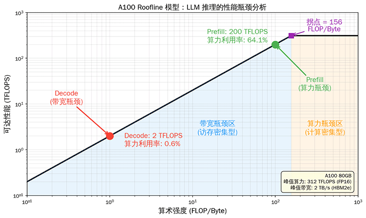

# GPU 资源管理

GPU 是 LLM 推理服务中最昂贵也最稀缺的资源。如何让每块 GPU 的每一兆显存、每一个计算核心都被充分利用，是推理服务成本控制的关键。在[推理效率优化](../../language-models/reasoning/inference-efficiency.md)中，我们从算法层面分析了推理瓶颈和优化手段；在[请求调度与批处理](./request-scheduling.md)中，我们从系统层面讨论了如何组织多个请求的执行。本章则从 GPU 硬件本身出发，分析显存、算力和带宽三大资源的特征与瓶颈，讨论显存管理、算力调度、多实例共享以及量化等资源优化技术，帮助读者理解推理优化的物理边界和工程手段。

## GPU 硬件架构与资源特征

一块 GPU 并非一个均匀的计算单元，而是由显存、计算核心和互连总线三部分组成的异构系统。不妨把 GPU 的工作过程想象成一家餐厅的运营。厨房面积决定能同时准备多少道菜（显存容量），厨师烹饪速度决定每分钟出菜量（算力），传菜员从冷库取食材到厨房的速度决定厨房能否满负荷运作（带宽）。厨房太小，再快的厨师也只能闲置；传菜太慢，再大的厨房也填不满。GPU 的资源关系与此类似，三者之间的关系可以用一个简单的逻辑串联：算力的发挥依赖带宽，因为数据必须从显存加载到计算单元才能参与运算；显存容量限制了能存储的数据量，约束了算力能被多少请求共享。GPU 的硬件约束关系是后续所有优化技术的物理基础：

- **显存**是 GPU 上的高速存储，用于存放模型权重和 KV Cache。以 NVIDIA A100 为例，其 HBM2e 显存容量为 80 GB。显存容量是模型能否部署的硬约束，KV Cache 放不下，并发也无法提升。

- **算力**是衡量 GPU 每秒能执行多少次浮点运算。A100 的 FP16 算力为 312 TFLOPS（每秒 312 万亿次）。算力决定了每秒能处理多少数据，Prefill 阶段需要处理输入 Prompt 的所有 token，因此算力是 Prefill 阶段的主要瓶颈。

- **带宽**是 GPU 计算核心与显存之间的数据传输速率。A100 的 HBM2e 带宽为 2 TB/s。带宽决定了 Decode 阶段能多快读取 KV Cache。每生成一个 token，都需要从显存中读取所有层的 KV Cache 和模型权重，数据量巨大但计算量极小，因此 Decode 阶段的性能由带宽决定，与算力强弱关系不大。

| 资源 | RTX 5090 32GB | A100 80GB | H100 80GB | 推理中的角色 |
|:----:|:------------:|:---------:|:---------:|:----------:|
| 显存容量 | 32 GB | 80 GB | 80 GB | 决定模型大小和并发上限 |
| FP16 算力 | 104.8 TFLOPS | 312 TFLOPS | 990 TFLOPS | 决定 Prefill 速度 |
| 显存带宽 | 1.79 TB/s | 2 TB/s | 3.35 TB/s | 决定 Decode 速度 |

*表：A100、H100 与 RTX 5090 的三大资源参数对比*

### 算术强度与 Roofline 模型

对于某个具体的计算任务，如何判断瓶颈到底出现在算力还是带宽呢？标准答案是取决于该任务的**算术强度**（Arithmetic Intensity）。算术强度是指每字节显存访问对应的浮点运算次数，单位为 FLOP/Byte。算术强度高的任务，读取一份数据后能执行大量计算，属于**计算密集型**（Compute-Bound），瓶颈在算力。算术强度低的任务，从显存读取一份数据后只执行少量计算，属于**访存密集型**（Memory-Bound），瓶颈在带宽。

2009 年，加州大学伯克利分校的计算机科学家塞缪尔·威廉姆斯（Samuel Williams）等人在论文《[Roofline: An Insightful Visual Performance Model for Multicore Architectures](https://dl.acm.org/doi/10.1145/1498765.1498785)》中提出了 Roofline 模型，用一条简洁的曲线直观展示硬件的性能上限与算术强度的关系。这个模型以算术强度为横轴、可达性能（FLOPS）为纵轴，画出硬件的性能上限曲线。曲线分为两段，左侧的上升段代表带宽瓶颈区，性能随算术强度线性增长，公式为性能 = 带宽 × 算术强度。右侧的平台段代表算力瓶颈区，性能达到峰值算力后不再增长。两段的交点称为**拐点**，其算术强度等于峰值算力 / 峰值带宽，即刚好把算力和带宽同时用满的临界值。算术强度低于拐点时，算力有富余但数据供不上，性能受带宽限制；高于拐点时，带宽有富余但算力不够用，性能受算力限制。

*图：A100 的 Roofline 模型*

上图以 A100 为例，拐点算术强度为 312 TFLOPS / 2 TB/s = 156 FLOP/Byte。这意味着如果一个任务的算术强度低于 156 FLOP/Byte，它就是访存密集型，性能由带宽决定；高于 156 FLOP/Byte 则是计算密集型，性能由算力决定。通过观察不同硬件的 Roofline 曲线，能够直观判断它们所适配的任务。反过来，也能通过 Roofline 曲线量化 Prefill 和 Decode 两阶段的计算特征差异。Prefill 阶段矩阵乘法的计算量大，算术强度通常超过 100 FLOP/Byte，接近或超过拐点，属于计算密集型。Decode 阶段每步只生成一个 token，需要从显存读取全部 KV Cache 和权重但只做极少量的计算，算术强度仅约 1-2 FLOP/Byte，远低于拐点，属于访存密集型。

### GPU 架构演进对推理的影响

从 2020 年到 2026年，从 Ampere 到 Blackwell Ultra，NVIDIA 六年五代数据中心 GPU 的演进呈现出一个明显且在持续加剧的趋势：算力与带宽的增长长期失衡，算力增长远超带宽增长。具体如下表所示。

| GPU | 架构 | FP16 算力 | 显存带宽 | 显存容量 | NVLink |
|:---:|:---:|:--------:|:-------:|:-------:|:------:|
| A100 (2020) | Ampere | 312 TFLOPS | 2 TB/s | 80 GB | 600 GB/s |
| H100 (2022) | Hopper | 989 TFLOPS | 3.35 TB/s | 80 GB | 900 GB/s |
| H200 (2024) | Hopper | 989 TFLOPS | 4.8 TB/s | 141 GB | 900 GB/s |
| B200 (2025) | Blackwell | 2,250 TFLOPS | 8 TB/s | 192 GB | 1,800 GB/s |
| B300 (2026) | Blackwell Ultra | 3,500 TFLOPS | 8 TB/s | 288 GB | 1,800 GB/s |

*表：五代 NVIDIA 数据中心 GPU 的三大资源参数演进（FP16 均为稠密算力，NVLink 为双向总带宽）*

A100 到 H100 算力提升 3.17 倍（312 → 989 TFLOPS），带宽仅提升 1.675 倍（2 → 3.35 TB/s），显存容量未变（均 80 GB）。H100 到 H200 是一个特殊转折，H200 与 H100 使用相同的 Hopper 核心，算力未变，但凭借 HBM3e 显存将带宽推至 4.8 TB/s（提升 43%），容量翻倍至 141 GB，这是 NVIDIA 对 H100 带宽和容量短板的定向修补。然而 H200 到 B200 又回到了老路，算力增长 2.28 倍（989 → 2,250 TFLOPS），带宽增长仅 1.67 倍（4.8 → 8 TB/s）。到 B300，算力继续增长 56%（2,250 → 3,500 TFLOPS），而带宽完全未变（同为 8 TB/s）。五代累计，算力提升了 11.2 倍，带宽仅提升了 4 倍。

用 Roofline 模型的拐点算术强度（峰值算力 / 峰值带宽）可以量化这个趋势的后果。A100 拐点为 156 FLOP/Byte，H100 升至 295，H200 因带宽补强回落至 206，B200 回升至 281，B300 达到 438。拐点越高，意味着更多的计算任务落在访存密集区。Decode 阶段的算术强度仅约 1-2 FLOP/Byte，远远低于任何一代 GPU 的拐点，因此 Decode 性能几乎完全由带宽决定。从 A100 到 B300，Decode 的理论加速比仅 4 倍（等于带宽增长比例），而 Prefill 的理论加速比接近 11.2 倍（等于算力增长比例）。这种不对称加速持续强化着 [PD 分离架构](../../language-models/reasoning/inference-efficiency.md#prefill-decode-分离架构)的必要性。将 Prefill 任务部署在最新一代高算力 GPU（如 B300）上，将 Decode 任务留在带宽性价比更高的 GPU（如 B200，8 TB/s 带宽相同但成本更低）上，更能充分发挥每一代硬件的优势。

显存容量的发展同样值得关注。A100 和 H100 同停留在 80 GB 长达四年，单块 GPU 仅能容纳 40B 参数的 FP16 模型。H200 率先打破僵局（141 GB），B200 增至 192 GB，B300 达到 288 GB。一块 B300 即可在 FP16 下容纳完整的 70B 模型（权重约 140 GB），剩余约 148 GB 可用于 KV Cache。这种容量增长直接改变了推理部署的拓扑选择。以前 70B 模型至少需要 2 块 A100/H100 做张量并行，现在一块 B200 或 B300 即可独立运行，省去了张量并行带来的通信开销和 GPU 间负载不均问题。

除了单卡资源的演进，多卡互连技术也深刻影响着推理架构的选择。NVLink 是 NVIDIA 的 GPU 间高速互连协议，五代间经历了 NVLink 3（A100，600 GB/s）、NVLink 4（H100/H200，900 GB/s）到 NVLink 5（B200/B300，1,800 GB/s）的迭代，每代大幅跃升。相比之下，节点间网络带宽虽然也在增长，从 H100 时代的 InfiniBand NDR400（400 Gb/s，约 50 GB/s）到 B300 时代的 ConnectX-8（800 Gb/s 至 1.6 Tb/s，约 100-200 GB/s）。但与 NVLink 之间始终存在近 10-20 倍的差距。这种巨大的带宽差异决定了并行策略的性能边界。[张量并行](../../language-models/pretraining/distributed-training.md#张量并行)需要频繁的 AllReduce 通信，适合部署在节点内通过 NVLink 互连的 GPU 上；[流水线并行](../../language-models/pretraining/distributed-training.md#流水线并行)的通信量相对较小，可以考虑跨节点部署。

## 算力调度与利用率优化

在[请求调度与批处理](./request-scheduling.md)中，我们从系统层面讨论了如何通过连续批处理提高 GPU 利用率。本节从更底层的视角出发，分析 GPU 利用率的度量方法，以及通过 Kernel 优化和算子融合提升算力利用率的技术手段。

### GPU 利用率的度量

GPU 利用率是一个容易产生误解的指标。在任务管理器中看到的 GPU 利用率 100%，并不等于 GPU 在满负荷运算。正确理解利用率的度量方式，才能正确评估推理服务的效率。在不同的上下文语境中，GPU 利用率可能指代以下三个指标：

- **SM 占用率**（SM Occupancy）衡量 GPU 流多处理器（Streaming Multiprocessor，SM）上活跃线程束（Warp）的比例。每个 SM 最多可以同时调度 64 个 Warp（以 A100/H100 为例，不同架构上限不同），如果当前只有 16 个 Warp 在活跃，SM 占用率就是 25%。SM 占用率反映了 GPU 计算单元的利用程度，但高占用率不等于高算力利用率，如果所有 Warp 都在等待显存数据返回，SM 占用率可能很高但实际计算量却很低。

- **算力利用率**（FLOPS Utilization）是更直观的效率指标，定义为实际 FLOPS 与峰值 FLOPS 的比值。前文中多次提到 Decode 阶段的算力利用率通常只有 1-2%。结合 Roofline 模型便可以给出理论解释：由于 Decode 阶段的算术强度仅约 1-2 FLOP/Byte，远低于 A100 的拐点 156 FLOP/Byte，算力利用率的理论上限在 1/156 ≈ 0.64% 至 2/156 ≈ 1.28% 之间。实际利用率 1-2% 已经是乐观的估计。

- **显存带宽利用率**（Bandwidth Utilization）定义为实际带宽 / 峰值带宽。Decode 阶段的带宽利用率通常在 30-60%，说明即使是访存密集型应用，带宽也没有被充分利用。剩余的带宽部分被 Kernel 启动开销、数据对齐、缓存未命中等因素消耗，部分受限于 GPU 的调度能力（同时活跃的 Warp 数量不足以隐藏显存延迟）。

综上可见，利用率低不等于效率低。某些场景下利用率低是不可避免的，如批量大小为 1 的 Decode，算力利用率的理论上限就极低。优化的目标不是追求高利用率本身，而是在约束条件下尽可能提高利用率。通过增加批量大小、优化 Kernel、减少空闲时间等手段，让 GPU 在每个时间片都做有用的工作。

### Kernel 优化与算子融合

**GPU 内核函数**（GPU Kernel）是在 GPU 上执行的并行计算函数。与 CPU 函数不同，Kernel 由 CPU 端代码调用（称为 Host），但实际在 GPU 端（称为 Device）由大量线程并行执行。Kernel 遵循单指令多线程（SIMT）的执行模型，同一个 Kernel 代码被成千上万个线程同时运行，每个线程处理不同的数据片段。Kernel 是 GPU 编程模型（如 CUDA）的核心抽象，开发者编写一个 Kernel 函数来描述单个线程的计算逻辑，GPU 硬件负责将这份逻辑调度到成百上千个计算核心上并行执行。

LLM 推理涉及大量小 Kernel，如 LayerNorm、Attention、MLP、Activation，等等。每个 Kernel 的启动开销和数据搬运开销都不算大，但累积起来就不可忽视。一个 Kernel 的执行过程包括 CPU 发出启动指令（约 5-10 微秒的启动延迟）、GPU 从显存读取输入数据、执行计算、将结果写回显存。对于计算量小的 Kernel，启动延迟和数据搬运的时间可能远超实际计算时间。**算子融合**（Operator Fusion）是解决这个问题的主要工具之一，将多个连续的 Kernel 合并为一个，减少中间结果的显存写入和读取。以 LayerNorm + Dropout + Residual 为例，未融合时需要三个 Kernel，中间结果需要写回显存再被下一个 Kernel 读取。融合后只需一个 Kernel，中间结果留在 GPU 的寄存器或 SRAM 中直接传递给下一步计算，省去了两次显存的写入与读取。

FlashAttention 是算子融合最成功的案例。在[推理效率优化](../../language-models/reasoning/inference-efficiency.md)中我们了解到，标准 Attention 需要计算并存储 $N \times N$ 的注意力矩阵，显存占用和带宽消耗都很大。FlashAttention 将 Attention 的分块计算与 Softmax 融合，利用 GPU SRAM（片上存储，约 20 MB，带宽约 19 TB/s）的高带宽优势，将分块后的 Q、K、V 加载到 SRAM 中完成注意力计算，只将最终结果写回 HBM，避免了 $N \times N$ 注意力矩阵的显存写入。这种用 SRAM 换 HBM 访问的策略，使得 Attention 的显存访问量从 $O(N^2)$ 降低到 $O(N)$，在长序列场景下性能提升可达 2-4 倍。TensorRT-LLM 代表了厂商级优化的极致案例。它针对 NVIDIA GPU 的 Tensor Core 专门优化了 GEMM（通用矩阵乘法）Kernel，融合了 LayerNorm、Activation、Residual 等多种算子，在 H100 上可以达到 50% 以上的算力利用率。这种深度优化需要针对特定硬件架构手工调优，通用性较差，但在生产环境中能带来显著的性能收益。

### CUDA Stream 与并行执行

CUDA Stream 是 GPU 上的任务队列，同一 Stream 内的操作串行执行，不同 Stream 的操作可以并行执行。这类似于多线程编程中的线程概念，同一线程内的操作按顺序执行，不同线程的操作可以并发运行。

LLM 推理中 CUDA Stream 的典型用法是将数据传输与计算放在不同 Stream 上。譬如将 KV Cache 从 CPU 内存传输到 GPU 显存（或从一块 GPU 传输到另一块 GPU）的操作放在传输 Stream 上，同时将当前批次的 Decode 计算放在计算 Stream 上。这样，当 GPU 在执行 Decode 计算时，PCIe 总线或 NVLink 可以同时传输下一批次需要的 KV Cache，实现计算与传输的并行。

多 Stream 的调度挑战在于同步点的设计。计算 Stream 必须等待数据传输完成才能开始使用传输来的数据，如果同步点设置过早，计算 Stream 会空等。设置过晚，传输 Stream 又可能已经完成了传输但计算 Stream 还没准备好接收。过多的同步点会抵消并行收益，过少则可能导致数据竞争。在实际系统中，通常采用双缓冲（Double Buffering）策略。准备两个缓冲区交替使用，当一个缓冲区在被计算 Stream 使用时，传输 Stream 将数据填充到另一个缓冲区，两者交替进行，最大化计算与传输的重叠。

## 多实例 GPU 共享

我们曾经讨论过聚合多块 GPU 的算力来应对单个模型的方案（如流水线并行），反之，当一块 GPU 的算力远超单个模型的需求时，将整块 GPU 专用于一个模型就造成了资源浪费。譬如，一个 7B 模型在 A100 上的算力利用率可能只有 5%，剩余 95% 的算力被闲置。通过让多个推理实例共享同一块 GPU，可以提高资源利用率。共享方式分为时间分片和空间分片两种，各有适用场景。

- **时间分片**（Time-Slicing）让多个推理实例轮流使用同一块 GPU，每个实例获得固定的时间片。NVIDIA 的 MPS（Multi-Process Service）是一种时分复用机制，允许多个 CUDA 进程共享同一块 GPU 的计算资源。时间分片只切换计算状态而不交换显存数据。所有推理实例的模型权重、KV Cache 等数据常驻在显存中，上下文切换仅涉及寄存器、Warp 调度状态、SM 执行上下文等计算资源，不搬运显存中的庞大数据。这意味着所有并发实例的显存占用之和必须小于 GPU 总显存，假如一张 80GB 的 A100 上每个实例需要 20GB，时间分片最多只能容纳 4 个实例。MPS 只做计算资源的时分复用，显存层面没有真正隔离，多个进程共享同一物理显存空间，靠地址映射区分，一个进程的显存泄漏可能波及同 GPU 上的其他进程。MPS 的另一个问题是延迟抖动。切换实例的上下文切换开销约数十微秒，而不同实例之间还会互相干扰，一个实例的长时间计算会延迟其他实例的执行。对延迟敏感的在线推理服务而言，这种抖动是不可接受的。

- **空间分片**（Spatial Partitioning）将一块 GPU 的计算单元和显存划分为多个独立分区，每个分区运行一个推理实例，互不干扰。NVIDIA MIG（Multi-Instance GPU）是空间分片的硬件支持，在硬件层面实现隔离，每个 MIG 实例拥有独立的 SM、L2 缓存和显存带宽。A100 支持 7 个 MIG 实例（每个约 10 GB 显存），H100 支持更多配置选项。空间分片的优势是零干扰：一个实例的计算不会影响其他实例的延迟，适合对延迟稳定性有要求的场景。典型应用是将一块 GPU 划分为多个实例，分别运行不同大小的模型。MIG 在多个小模型的并发推理（如同时部署 7B 和 13B 模型）、开发测试环境中的多用户隔离（每个开发者获得独立的 MIG 实例）、以及 A/B 测试（同一模型的不同版本部署在不同 MIG 实例上，比较性能差异）等场景中都有所应用。譬如，将 A100 80GB 划分为 2 个 40 GB 实例，一个运行 7B 模型（权重约 14 GB，剩余 26 GB 给 KV Cache），另一个运行 13B 模型（权重约 26 GB，剩余 14 GB 给 KV Cache）。这样一块 GPU 就能同时服务两种不同规模的模型，资源利用率远高于独占模式。不过，划分后的实例显存和算力都按比例缩减，不适合大模型的推理。此外，MIG 实例之间无法通过 NVLink 通信，不能用于张量并行。这意味着 MIG 只适合能完整放入单个实例显存的小模型。

还有一类不使用 MIG 的多模型共享方案是由推理框架在同一块 GPU 上部署多个模型，通过调度器控制各模型的执行顺序。与 MIG 的硬件隔离不同，这种方案依赖软件调度来实现资源共享，灵活性更高但隔离性更弱。以多模型下的动态批处理为例，框架将不同模型的请求分开批处理，但它们仍共享同一块 GPU 的执行时间。调度器根据各模型的负载动态分配 GPU 时间片，负载高的模型获得更多执行机会。这种方式比 MIG 更灵活，可以动态调整资源分配比例，但缺乏硬件隔离，一个模型的长时间计算可能影响其他模型的延迟。

## 本章小结

本章从 GPU 硬件的物理本质出发，讨论了推理服务中资源管理的显存放什么、算力怎么用、带宽够不够三个基本问题。这三个问题并非彼此独立，带宽决定了算力能否被喂饱，显存容量决定了能同时服务多少请求，而算力则在 Prefill 阶段成为主要约束。GPU 硬件是软件算法和工程优化措施的物理基础与设计前提，它们都是为了弥合负载计算特征与硬件物理现状之间的差距而存在的。

## 练习题

1. 使用 Roofline 模型分析在 H100 上（峰值算力 990 TFLOPS FP16，带宽 3.35 TB/s），LLM Decode 阶段（算术强度约 1 FLOP/Byte）的理论性能是多少？相比 A100（312 TFLOPS，2 TB/s）提升多少倍？这说明了什么问题？

   

   
参考答案

   Decode 阶段的算术强度为 1 FLOP/Byte，远低于拐点（A100 拐点 = 312/2 = 156 FLOP/Byte，H100 拐点 = 990/3.35 = 296 FLOP/Byte），因此 Decode 在两款 GPU 上都受带宽瓶颈制约。

   A100 Decode 性能 = 2 TB/s × 1 FLOP/Byte = 2 TFLOPS
   H100 Decode 性能 = 3.35 TB/s × 1 FLOP/Byte = 3.35 TFLOPS

   提升倍数 = 3.35 / 2 = 1.675 倍。而 H100 的峰值算力是 A100 的 990/312 = 3.17 倍。

   这说明对于 Decode 阶段（带宽瓶颈），从 A100 升级到 H100 的加速比远低于峰值算力的提升比例。算力的增长（3.17 倍）远快于带宽的增长（1.675 倍），这意味着新一代 GPU 对 Decode 阶段的性价比提升有限。这也是 PD 分离架构有吸引力的重要原因——Prefill 阶段能充分利用新 GPU 的算力增长。

   

2. 一个 13B 模型（FP16）部署在单块 A100 80GB 上。请计算：
    1. 模型权重占多少显存？
    2. 剩余显存可支持多少并发的 KV Cache（假设最大序列长度 4096，运行时开销 2 GB）？
    3. 如果使用 INT4 权重量化 + KV Cache FP8 量化，并发数可以提升到多少？

   

   
参考答案

   1. 模型权重：13B × 2 字节 = 26 GB

   2. 剩余显存：80 - 26 - 2 = 52 GB
    单请求 KV Cache（13B 模型，40 层，40 头，每头 128 维，float16）：
    $2_{\text{K+V}} \times 40_{\text{层}} \times 40_{\text{头}} \times 128_{\text{维/头}} \times 4096_{\text{序列}} \times 2_{\text{FP16字节}}$ = $2 \times 40 \times 5120 \times 4096 \times 2$ ≈ 3.33 GB
    并发数 = 52 / 3.33 ≈ 15 个请求

   3. INT4 权重量化：权重 = 13B × 0.5 字节 = 6.5 GB
    KV Cache FP8：单请求 KV Cache ≈ 3.33 / 2 = 1.67 GB
    剩余显存：80 - 6.5 - 2 = 71.5 GB
    并发数 = 71.5 / 1.67 ≈ 42 个请求
    量化后并发数从 15 提升到 42，提升约 2.8 倍。

   
