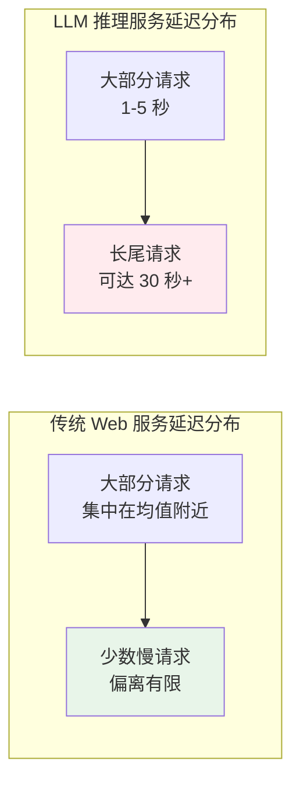
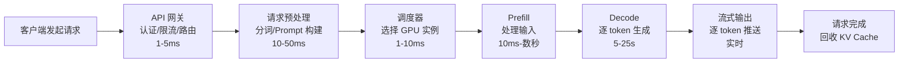
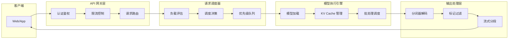
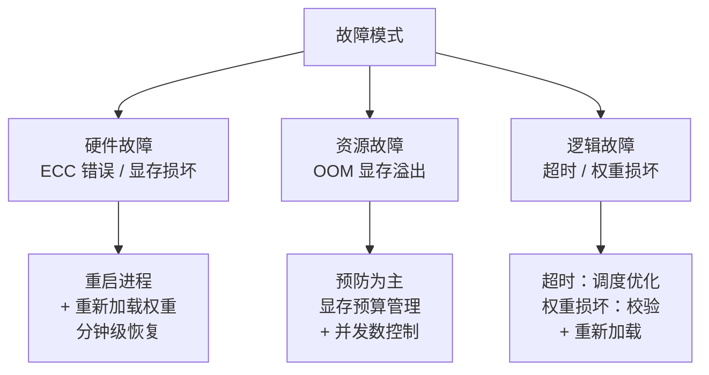
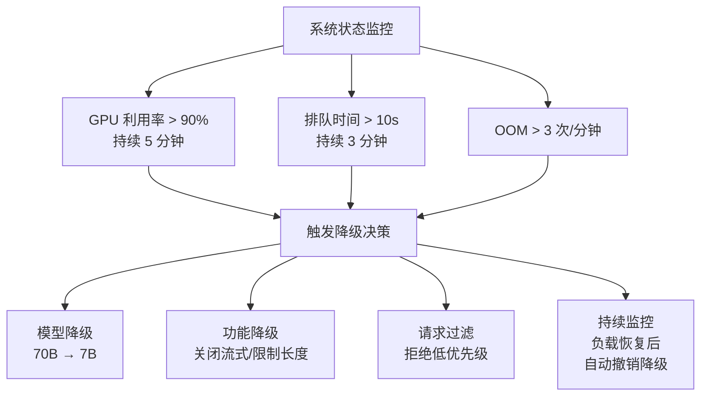

# 推理服务架构原理

## 引言

2020 年，NVIDIA 将其 TensorRT Inference Server 更名为 Triton Inference Server，这个看似寻常的更名事件，实际上标志着模型推理服务从"单模型单服务"的简陋模式，走向了通用化、平台化的新阶段。彼时的推理服务主要面向计算机视觉和推荐系统等传统深度学习模型，请求延迟可预测、资源消耗可控，架构设计与普通 Web 服务并无本质差异。三年后的 2023 年，大语言模型（LLM）的爆发彻底改写了这一局面。Hugging Face 推出了 Text Generation Inference（TGI），加州大学伯克利分校的权旭锡（Woosuk Kwon）发表了 PagedAttention 论文并催生了 vLLM 框架，一批专门面向 LLM 的推理服务框架如雨后春笋般涌现。这些框架要解决的核心问题，是 LLM 推理的自回归生成特性与传统 Web 服务的请求 - 响应模式之间的根本矛盾。

理解这种矛盾的一个直观方式是对比延迟：一个典型的 REST API 请求在 100 毫秒内就能返回结果，而一个 LLM 推理请求可能需要数十秒才能完成全部生成。这并非工程实现不够优化，而是 LLM 推理的延迟由输出长度决定，而输出长度在请求到达时完全不可预知。这种不确定性像一条裂缝，从延迟模型蔓延到资源消耗、流量模式、部署策略、容错设计，最终使得传统 Web 服务的架构经验几乎无法直接套用。

本文从 LLM 推理的自回归本质出发，分析推理服务与传统 Web 服务在延迟模型、资源消耗、流量模式上的根本差异，进而讨论推理请求的完整生命周期、推理服务的核心架构组件、从单机到云原生的部署模式，以及高可用与容错设计。这些内容与[推理效率优化](../../language-models/reasoning/inference-efficiency.md)中讨论的 PagedAttention、PD 分离架构等底层优化技术形成互补：后者关注"如何让单次推理更快"，本文关注"如何让推理服务更可靠、更高效地对外提供服务"。

## 第一章：推理服务与传统 Web 服务的差异

如果你曾经开发过 Web 应用，对下面的场景一定不陌生：用户点击"提交订单"，后端查询数据库、执行业务逻辑、返回结果，整个请求在 200 毫秒内完成。你用 Nginx 做负载均衡，用 Kubernetes 做弹性伸缩，高峰期多加几个 Pod 就能扛住流量。这套成熟的架构实践，在面对 LLM 推理服务时却处处碰壁。原因不是工程实现不够好，而是 LLM 推理的内在特征与传统 Web 请求存在根本差异。理解这些差异，是设计推理服务架构的起点。

### 1.1 延迟模型的本质差异

假设你运营着一个电商网站的后端服务，对 1000 个"查询商品详情"请求做延迟统计，会发现绝大多数请求的响应时间集中在 50-150 毫秒之间，少数请求因为缓存未命中或数据库慢查询可能到 300 毫秒，但几乎不会出现 10 秒以上的请求。延迟分布近似正态分布，均值和方差都可预测，你可以据此设置 500 毫秒的超时阈值，安心地认为 99.9% 的请求都能在阈值内完成。

现在把场景换成 LLM 推理服务。两个用户同时发来请求：一个问"用一句话解释什么是机器学习"，模型生成约 30 个 token，耗时不到 1 秒；另一个问"详细解释量子力学的基本原理，包括波粒二象性和不确定性原理"，模型生成约 2000 个 token，耗时超过 30 秒。两个请求的延迟相差 30 倍，而你在请求到达时完全无法预知哪个是短请求、哪个是长请求，因为输出长度取决于模型的生成过程，而非输入长度。

这种差异的根源在于 LLM 推理的自回归特性。正如[推理效率优化](../../language-models/reasoning/inference-efficiency.md)中所分析的，LLM 的 Decode 阶段逐 token 生成，每生成一个 token 都需要一次完整的前向传播。总延迟等于单 token 生成时间乘以输出 token 数，而输出 token 数在请求到达时不可预知。这意味着 LLM 推理的延迟分布不是正态分布，而是长尾分布：大部分请求可能集中在 1-5 秒，但少数请求可能长达 30 秒甚至更久。长尾分布对工程设计的冲击是全方位的：超时阈值设高了，异常请求会长时间占用资源；设低了，正常的长请求会被误杀。容量规划也变得困难，P99 延迟可能比中位数高出 10 倍，按 P99 规划则大量资源在平时被浪费，按中位数规划则高峰期服务质量急剧下降。


*图：传统 Web 服务与 LLM 推理服务的延迟分布对比*

### 1.2 资源消耗模式差异

传统 Web 服务是 I/O 密集型的。一个典型的 Spring Boot 应用，CPU 大部分时间在等待数据库返回结果、等待网络传输完成、等待磁盘 I/O 结束。增加并发连接数几乎不增加 CPU 负担，因为新增的请求大部分时间也在等待 I/O。水平扩展也很简单：加一台服务器就能多承载一批并发请求，成本与容量近似线性关系。

LLM 推理服务则完全不同。它是计算密集型与显存密集型的双重约束。计算密集体现在每生成一个 token 都需要执行一次完整的前向传播，涉及数十亿参数的矩阵乘法运算。显存密集体现在 KV Cache 对显存的大量占用，正如[GPU 资源管理](gpu-resource-management.md)中所分析的，一个 70B 模型的单个请求 KV Cache 就可能消耗约 10 GB 显存。并发数受限于显存容量而非 CPU 核数，一块 A100 80GB 运行 70B 模型时，同时能处理的请求数可能只有个位数。

这种资源约束的差异直接决定了扩展方式的不同。传统 Web 服务可以轻松水平扩展，加机器就能加并发，一台 2 核 4GB 的云服务器月租不过几十元。LLM 推理服务的扩展受 GPU 供应约束，一块 A100 80GB 价值数万元，且 GPU 的供应周期长达数周甚至数月。更关键的是，GPU 节点的启动时间远慢于 CPU 节点：加载一个 70B 模型的权重到显存需要数十秒到数分钟，这意味着弹性伸缩的响应速度远不如传统服务。

| 特性 | 传统 Web 服务 | LLM 推理服务 |
|:----:|:------------|:------------|
| 资源瓶颈 | I/O（网络、磁盘） | 计算 + 显存 |
| 并发约束 | CPU 核数、连接数 | 显存容量（KV Cache） |
| 单请求资源占用 | 低（几 MB 内存） | 高（数 GB 显存） |
| 扩展方式 | 水平扩展（加 CPU 机器） | 垂直扩展（加 GPU）+ 有限水平扩展 |
| 扩展成本 | 低（普通云服务器） | 高（GPU 服务器） |
| 扩展速度 | 秒级（启动容器） | 分钟级（加载模型权重） |

### 1.3 流量模式差异

传统 Web 服务的流量波动相对平缓。以电商网站为例，日间高峰期的 QPS 可能是夜间低谷期的 2-5 倍，且流量变化通常有规律可循（午休时段小高峰、晚间大高峰），可以提前预热资源。即使出现突发流量（如秒杀活动），也可以通过 CDN 缓存、限流降级等手段应对。

LLM 推理服务的流量则具有强烈的突发性和不可预测性。一个热门 AI 应用的日间流量可能是夜间的 10-50 倍，远超传统服务的峰谷比。更棘手的是单个用户的请求间隔极不均匀：用户可能在几分钟内连续发起多轮对话（每轮都是一次推理请求），然后间隔数小时不再使用。这种"突发 - 静默"的流量模式，使得基于平均 QPS 的容量规划几乎失效。

流量的突发性与 GPU 扩展的缓慢之间形成了一对尖锐的矛盾。传统服务遇到突发流量时，Kubernetes 的 HPA（Horizontal Pod Autoscaler）可以在 30 秒内拉起新的 Pod 来分担压力。而 GPU 节点从启动到就绪需要数分钟（加载模型权重、预热 GPU），突发流量到来时，新节点还没就绪，现有节点已经被压垮。这种"来不及扩容"的困境，是推理服务弹性伸缩设计的核心挑战，也是后续讨论云原生部署与降级策略时需要重点解决的问题。

## 第二章：推理请求的生命周期

理解了推理服务与传统 Web 服务的差异之后，一个自然的问题是：一个 LLM 推理请求从用户发出到收到完整回复，中间到底经历了哪些环节？每个环节的耗时特征是什么？哪些环节可能成为瓶颈？回答这些问题，需要深入推理请求的完整生命周期。

### 2.1 请求处理全流程

想象你正在使用一个 AI 助手，在对话框中输入"请解释什么是深度学习"并按下回车。从这一刻起到你在屏幕上看到完整的回复，你的请求经历了一条并不短暂的旅途。

第一步是 API 网关接收请求。网关验证你的身份（API Key 或 OAuth Token），检查你是否超过调用频率限制，然后将请求转发给后端服务。这一步的延迟通常在 1-5 毫秒。

第二步是请求预处理。后端服务将你的输入文本送入分词器（Tokenizer），将"请解释什么是深度学习"转换为一系列 token ID。同时，系统会将你的输入与系统提示词（System Prompt）和对话历史拼接成完整的 Prompt。如果对话历史较长，这一步还需要处理上下文窗口的限制。分词和 Prompt 构建的延迟约 10-50 毫秒。

第三步是调度。调度器根据各 GPU 实例的当前负载（正在处理的请求数、KV Cache 占用量、GPU 利用率）和请求属性（输入长度、优先级），决定将请求发送到哪个 GPU 实例。调度的延迟约 1-10 毫秒，但调度决策的质量直接影响请求的排队时间和整体吞吐量。

第四步是 Prefill。GPU 实例接收到请求后，对输入 Prompt 的所有 token 做一次并行计算，生成初始的 KV Cache。Prefill 的延迟取决于输入长度：短 Prompt 约 10-50 毫秒，长 Prompt（如包含大量对话历史）可能需要数百毫秒甚至数秒。正如[推理效率优化](../../language-models/reasoning/inference-efficiency.md)中所分析的，Prefill 是计算密集型操作，GPU 算力利用率高。

第五步是 Decode。模型逐 token 生成输出，每生成一个 token 都需要读取全部 KV Cache 并执行一次前向传播。Decode 是访存密集型操作，单步延迟约 10-50 毫秒，总延迟等于单步延迟乘以输出 token 数。对于一个生成 500 个 token 的请求，Decode 阶段可能耗时 5-25 秒，占整个请求生命周期的大部分时间。

第六步是流式输出。每生成一个 token，系统就立即将其发送给客户端，而不是等全部生成完毕。这让用户在请求发出后的几百毫秒内就能看到第一个 token，大大改善了交互体验。

第七步是请求完成。模型生成结束标记（EOS）或达到最大生成长度后，请求完成。系统回收该请求的 KV Cache 显存，将其归还给空闲池，供后续请求使用。


*图：推理请求的完整生命周期*

从这个流程中可以看出，Prefill 和 Decode 是两个耗时最长的环节，也是优化空间最大的环节。[GPU 资源管理](gpu-resource-management.md)和[请求调度与批处理](request-scheduling.md)中的各项优化技术，本质上都是在提升这两个环节的效率。

### 2.2 流式输出与 Server-Sent Events

LLM 推理的生成是逐 token 进行的。如果等全部 token 生成完毕再一次性返回给客户端，用户需要面对漫长的空白等待，体验极差。以一个生成 1000 个 token 的请求为例，假设单步 Decode 延迟为 20 毫秒，总耗时约 20 秒。用户在这 20 秒内看不到任何输出，很容易误以为服务出了问题而反复重试，反而加剧系统压力。

流式输出（Streaming）是解决这个问题的标准方案。模型每生成一个 token 就立即发送给客户端，用户在请求发出后几百毫秒内就能看到第一个 token，后续 token 如打字般逐个出现。这种体验与 ChatGPT 等 AI 产品中的"逐字输出"效果一致。

Server-Sent Events（SSE）是实现流式输出的标准协议。SSE 基于 HTTP 协议，服务端可以单向推送数据给客户端，每个事件以 `data:` 开头，以两个换行符结尾。相比 WebSocket 的双向通信，SSE 更简洁、更轻量，天然支持自动重连，且基于标准 HTTP 协议，不需要额外的连接升级握手。对于 LLM 推理这种"服务端单向推送 token"的场景，SSE 是更合适的选择。

下面的代码演示了 SSE 流式输出的客户端与服务端交互过程。服务端模拟 LLM 的逐 token 生成，每生成一个 token 就以 SSE 格式推送给客户端；客户端逐个接收 token 并拼接成完整回复。

```python runnable
# 演示 LLM 推理中 SSE 流式输出的完整交互过程
import json
import time

def server_streaming_handler(prompt, max_tokens=20):
    """
    模拟服务端的流式输出处理
    
    核心步骤：
    1. 模拟 Prefill 阶段（处理输入）
    2. 逐 token 生成并封装为 SSE 事件
    3. 每个 token 包含生成序号、时间戳和完成标志
    """
    # 模拟 Prefill 延迟
    prefill_start = time.time()
    time.sleep(0.1)  # Prefill 约 100ms
    
    # 模拟 Decode 生成
    tokens = ["在", "大", "语", "言", "模", "型", "的", "推", "理", "服",
              "务", "中", "，", "流", "式", "输", "出", "至", "关", "重"]
    
    sse_events = []
    for i, token in enumerate(tokens[:max_tokens]):
        # 模拟每步 Decode 延迟
        time.sleep(0.02)
        
        # 构建 SSE 事件（服务端推送格式）
        event = {
            "choices": [{
                "delta": {"content": token},
                "index": 0,
                "finish_reason": None
            }],
            "token_id": i,
            "timestamp": time.time()
        }
        # 最后一个 token 标记完成
        if i == len(tokens[:max_tokens]) - 1:
            event["choices"][0]["finish_reason"] = "stop"
        
        # SSE 格式：data: {json}\n\n
        sse_line = f"data: {json.dumps(event, ensure_ascii=False)}"
        sse_events.append(sse_line)
    
    # SSE 结束标记
    sse_events.append("data: [DONE]")
    return sse_events

def client_streaming_receiver(sse_events):
    """
    模拟客户端接收流式输出
    
    核心步骤：
    1. 逐个接收 SSE 事件
    2. 解析 JSON 提取 token 内容
    3. 拼接 token 形成完整回复
    """
    full_response = ""
    token_count = 0
    first_token_time = None
    start_time = time.time()
    
    for event in sse_events:
        if event == "data: [DONE]":
            break
        
        # 解析 SSE 数据
        data_str = event.replace("data: ", "")
        data = json.loads(data_str)
        
        # 提取 token 内容
        token = data["choices"][0]["delta"]["content"]
        full_response += token
        token_count += 1
        
        if first_token_time is None:
            first_token_time = time.time()
        
        finish_reason = data["choices"][0]["finish_reason"]
        if finish_reason == "stop":
            total_time = time.time() - start_time
            ttft = first_token_time - start_time  # 首 Token 延迟
    
    total_time = time.time() - start_time
    return full_response, token_count, ttft, total_time

# 运行模拟
print("=" * 60)
print("SSE 流式输出交互模拟")
print("=" * 60)

# 服务端生成 SSE 事件流
sse_events = server_streaming_handler("请介绍 LLM 推理服务")

# 客户端接收并解析
response, tokens, ttft, total = client_streaming_receiver(sse_events)

print(f"\n完整回复: {response}")
print(f"\n--- 性能指标 ---")
print(f"生成 token 数: {tokens}")
print(f"首 Token 延迟 (TTFT): {ttft*1000:.0f}ms")
print(f"总耗时: {total*1000:.0f}ms")
print(f"平均每 token 延迟 (TPOT): {total/tokens*1000:.1f}ms")
```

流式输出带来的工程挑战不容忽视。首先是中间件超时设置：Nginx 默认的代理读取超时为 60 秒，而 LLM 推理请求可能持续数分钟，需要将 `proxy_read_timeout` 调整为 300 秒甚至更长。其次是断线重连与续传：网络抖动导致连接中断时，客户端需要能够从断点续传，而非从头开始重新生成。最后是 token 级别的错误处理：流式传输中某个 token 的推送失败不应导致整个请求失败，需要有选择性的重试机制。

### 2.3 请求取消与超时处理

当用户在 AI 助手中点击"停止生成"按钮时，客户端会主动断开连接。传统 Web 服务处理这种情况很简单：关闭连接、释放请求上下文即可，CPU 和内存资源几乎瞬间归还。LLM 推理服务的请求取消则复杂得多：服务端不仅需要关闭连接，还必须立即回收该请求已分配的 KV Cache 显存。如果回收不及时，这块显存就会被闲置占用，减少系统可以同时处理的请求数，造成隐性资源泄漏。

超时策略的设计也需要重新思考。传统服务的超时策略通常是全局超时：给整个请求设定一个最大执行时间，超过则强制终止。LLM 推理服务如果采用全局超时，会面临两难选择：阈值设得短（如 10 秒），正常的长文本生成请求会被误杀；阈值设得长（如 120 秒），异常请求会长时间占用 GPU 资源。一种更精细的策略是逐步超时：不限制总生成时间，而是限制单个 token 的最大等待时间。如果某个 token 的等待时间超过阈值（如 5 秒），说明系统可能已经过载，此时终止请求比继续等待更合理。逐步超时避免了全局超时的"一刀切"问题，但实现更复杂，需要跟踪每个 token 的生成时间。

请求取消还存在竞态条件。当用户取消请求与模型生成同时发生时，可能出现以下情况：调度器已经将该请求标记为"取消"，但 GPU 上该请求的 Decode 步仍在执行，执行完成后需要回收 KV Cache。如果回收逻辑在标记取消之前就执行了，可能导致 KV Cache 被双重释放；如果回收逻辑永远不执行，则显存泄漏。解决竞态条件的关键是引入引用计数机制：每个请求的 KV Cache 有一个引用计数，调度器取消请求时递减计数，GPU 执行完成时也递减计数，只有当计数归零时才真正释放显存。

## 第三章：推理服务的核心架构组件

了解了推理请求的完整生命周期后，我们来拆解支撑这个生命周期的核心架构组件。一个生产级的 LLM 推理服务通常由四层组件构成：API 网关层负责请求的接入与管控，请求调度器负责请求的分配与编排，模型执行引擎负责 GPU 上的实际推理计算，输出处理层负责将原始计算结果转换为用户可读的文本。这四层组件各司其职，又紧密协作，共同决定了推理服务的性能、可靠性和成本效率。


*图：推理服务的四层架构组件与数据流向*

### 3.1 API 网关层

API 网关是推理服务面向外部世界的入口，承担认证鉴权、限流控制和请求路由三项核心职责。

认证鉴权验证调用者的身份和权限。LLM 推理服务的调用成本远高于传统 API（每次调用消耗数秒的 GPU 时间），因此认证不仅是安全需求，更是成本控制的需求。常见的认证方式是 API Key 验证：每个用户或应用分配唯一的 Key，网关在请求到达时验证 Key 的有效性，并根据 Key 关联的配额信息决定是否放行。

限流控制防止个别用户或突发流量压垮整个服务。传统 Web 服务的限流通常按 QPS（Queries Per Second）计算，但 LLM 推理服务还需要按 token 吞吐量限流，即 TPM（Tokens Per Minute）。原因很简单：一个生成 2000 个 token 的请求对 GPU 的压力远大于生成 50 个 token 的请求，如果只按 QPS 限流，少量长请求就可能耗尽 GPU 资源。实际部署中通常采用 QPS + TPM 的双重限流策略，QPS 限制请求频率，TPM 限制总计算量。

请求路由将请求分发到不同的模型服务实例。当同一服务部署了多个模型（如不同参数量的版本）或多个实例时，网关需要根据请求中指定的模型名称、请求的优先级、各实例的健康状态等信息，将请求路由到最合适的实例。付费用户的请求可能被路由到专属的高优先级实例，免费用户的请求则进入共享实例的普通队列。

### 3.2 请求调度器

调度器是推理服务的"大脑"，负责决定每个请求由哪个 GPU 实例处理、何时处理、与哪些请求一起批处理。调度决策的质量直接影响系统的吞吐量和延迟。

调度器做决策时需要两类输入信息。第一类是各 GPU 实例的当前状态：正在处理的请求数、KV Cache 占用量、GPU 利用率、排队中的请求数。第二类是请求本身的属性：输入长度、预期输出长度（如果客户端提供了 `max_tokens` 参数）、优先级、等待时间。调度器根据这些信息，在三个常常互相矛盾的目标之间寻找平衡：最小化请求延迟（让每个请求尽快得到响应）、最大化吞吐量（让 GPU 尽可能不空闲）、保证公平性（不让低优先级请求无限等待）。

调度策略的具体实现是一个丰富的话题。[请求调度与批处理](request-scheduling.md)中详细讨论了连续批处理、抢占机制、前缀缓存等调度技术，这里只概述核心思路。vLLM 采用的是 FCFS（First Come First Serve）+ 抢占机制的策略：请求按到达顺序排队，调度器在每个 Decode 步结束后检查是否有新请求可以加入批处理。当显存不足以容纳新请求的 KV Cache 时，调度器会暂停（Preempt）低优先级请求，释放其 KV Cache 显存给高优先级请求使用，被暂停的请求稍后重新调度。这种策略在保证公平性的同时，也确保了高优先级请求不会被长时间阻塞。

### 3.3 模型执行引擎

模型执行引擎负责在 GPU 上实际运行推理计算，是整个推理服务中与硬件最贴近的组件。它的核心能力包括模型加载与权重管理、KV Cache 管理和批处理调度。

模型加载是将模型权重从磁盘读入 GPU 显存的过程。一个 70B 模型的权重文件约 140 GB，从 SSD 加载到显存需要数十秒。生产环境中通常在服务启动时一次性加载，之后权重常驻显存，不再卸载。权重管理还涉及多卡场景下的分片策略：张量并行时，每块 GPU 只加载模型的一部分权重，各卡协同完成计算。

KV Cache 管理是执行引擎最核心的职责之一。正如[GPU 资源管理](gpu-resource-management.md)中所详细讨论的，PagedAttention 机制将 KV Cache 划分为固定大小的 Block，通过 Block 表实现逻辑到物理的映射，消除了传统连续分配方式中的显存碎片问题。vLLM 的 PagedAttention 引擎是这一机制的典型实现，它将 KV Cache 的显存利用率从传统方式的约 40% 提升到接近 100%，直接带来了 4-6 倍的吞吐量提升。

批处理调度是执行引擎与调度器协作的关键环节。调度器决定"哪些请求一起处理"，执行引擎决定"怎么高效地并行计算"。连续批处理要求执行引擎在每个 Decode 步结束后，能够快速地将已完成的请求移出批量、将新请求加入批量，这个过程必须足够快（通常在 1 毫秒以内），否则调度开销会抵消批处理带来的吞吐收益。

### 3.4 输出处理层

输出处理层负责将模型执行引擎产生的原始 token 序列转换为用户可读的文本，是推理服务中离用户最近的组件。

分词器解码是输出处理的第一步。模型执行引擎输出的是 token ID（整数），需要通过分词器将其映射回文本。例如 token ID 3824 可能对应汉字"学"，token ID 29871 可能对应标点符号"。"。分词器解码的延迟通常可以忽略不计（微秒级），但需要处理一些特殊情况，如 UTF-8 多字节字符可能被拆分到多个 token 中，需要正确拼接后才能解码。

特殊标记过滤移除模型输出中的控制标记。LLM 在生成过程中会输出一些不应对用户可见的特殊标记，如 `<|im_end|>`（对话结束标记）、`<|eot_id|>`（轮次结束标记）等。输出处理层需要识别并过滤这些标记，只将有效文本发送给客户端。

流式分段将连续的 token 流按语义单元切分后输出。逐 token 输出虽然延迟最低，但单个 token 往往不是完整的语义单元（一个汉字可能只是半个词）。一些应用场景要求按句子或段落切分输出，这需要在输出处理层引入缓冲区：积累 token 直到遇到句号、换行等分隔符，再将整个句子一次性推送。这种策略牺牲了一定的实时性，但输出的可读性更好。

输出过滤与安全是输出处理层的另一项重要职责。在流式输出中逐 token 检测敏感内容是一个工程挑战：敏感词可能被拆分到多个 token 中（如"危"和"险"分别在两个 token 中），需要维护一个滑动窗口来检测跨 token 的敏感模式。此外，内容安全检测的延迟必须足够低，不能成为流式输出的瓶颈。

## 第四章：部署模式与架构选型

理解了推理服务的核心组件后，下一个问题是如何将这些组件部署到实际的硬件上。模型规模、并发需求、成本预算和可靠性要求的不同，会导致截然不同的部署选择。从最简单的单机单卡到复杂的云原生弹性部署，每种模式都有其适用场景和局限性。

### 4.1 单机单卡部署

最简单的部署方式是一块 GPU 运行一个模型实例。假设你有一块 RTX 4090（24GB 显存），部署一个 7B 参数的模型（float16 精度约需 14GB 显存），剩余约 10GB 用于 KV Cache 和运行时开销，可以同时处理 5-10 个请求。这种部署方式的优点是配置简单，启动命令一条就够了，适合开发测试和小规模内部工具。

但单机单卡的局限性也很明显。首先是模型规模的限制：24GB 显存最多只能部署 13B 参数的模型（float16），如果要用 70B 模型，单卡根本装不下。其次是并发能力的限制：显存容量决定了 KV Cache 的大小，也就决定了最大并发数。最后是没有容错能力：GPU 故障或进程崩溃直接导致服务不可用，直到手动重启恢复。

### 4.2 单机多卡部署

当模型参数量超过单卡显存时，需要将模型分片到多块 GPU 上。最常用的分片方式是张量并行（Tensor Parallelism），将每个 Transformer 层的权重矩阵按列或按行切分，分配到不同的 GPU 上并行计算。

张量并行的关键约束是通信开销。每个 Transformer 层的前向传播都需要一次 AllReduce 操作：各 GPU 分别计算自己负责的那部分矩阵乘法，然后将结果汇总求和。这意味着每经过一层，GPU 之间都需要交换中间结果。如果 GPU 之间通过 PCIe 总线通信（带宽约 64 GB/s），AllReduce 的通信时间可能占到总计算时间的 30-50%，严重拖慢推理速度。而通过 NVLink 互连（带宽 300-900 GB/s），通信开销可以降低到 10% 以下。因此，张量并行通常要求 GPU 在同一节点内通过 NVLink 互连，跨节点的张量并行因网络带宽不足而效率极低。

vLLM 的张量并行实现是一个典型参考。它通过 NCCL（NVIDIA Collective Communications Library）完成多卡之间的 AllReduce 通信，用户只需在启动时指定 `--tensor-parallel-size` 参数，框架自动完成模型的分片和通信配置。以 70B 模型为例，使用 4×A100 80GB 的张量并行为：每块 GPU 加载约 35GB 的模型权重，剩余约 45GB 用于 KV Cache，可以同时处理 30-50 个请求，相比单卡部署有了质的提升。

### 4.3 多机多卡部署

当模型规模超过单机 GPU 总显存，或者需要更高的并发能力时，就需要跨机器部署。流水线并行（Pipeline Parallelism）将模型的不同层分布到不同机器上：机器 0 负责第 1-20 层，机器 1 负责第 21-40 层，以此类推。请求从机器 0 进入，逐层向后传递，最后一台机器输出结果。

流水线并行的核心问题是气泡（Bubble）。各阶段之间需要等待前一个阶段的输出才能开始计算，GPU 在等待期间处于空闲状态。假设模型分为 4 个阶段，每个阶段的计算时间为 10 毫秒，则一个请求需要 40 毫秒才能完成。当有 4 个请求依次进入流水线时，机器 0 在第 3 个请求开始前有 20 毫秒的空闲等待，机器 3 在第一个请求到达前有 30 毫秒的空闲等待。气泡比例与并行度正相关：4 级流水线的理论气泡率约为 75%，8 级流水线的气泡率约为 87.5%。减少气泡的常用方法是微批处理（Micro-batching），将一个大请求拆分为多个微批次，让各阶段交替处理不同的微批次，从而减少空闲时间。

对于超大规模模型，通常需要张量并行与流水线并行组合使用。以一个 405B 参数的模型为例：可能需要 8 块 H100 做张量并行（单节点内），2 个节点做流水线并行（跨节点），共 16 块 H100。节点内通过 NVLink 高速通信，节点间通过 InfiniBand 网络（带宽 400 Gb/s）传输中间结果。

另一种重要的跨机器部署模式是 [Prefill-Decode 分离架构](../../language-models/reasoning/inference-efficiency.md#prefill-decode-分离架构)，将 Prefill 实例和 Decode 实例部署在不同的 GPU 集群上，各自独立扩展。Prefill 实例使用高算力 GPU（如 H100），Decode 实例使用高带宽 GPU（如 A100），根据各自的工作负载特征选择最匹配的硬件。

### 4.4 云原生部署与弹性伸缩

将 LLM 推理服务部署到 Kubernetes 上，可以利用云平台的弹性伸缩能力应对流量波动。但 GPU 工作负载的云原生部署面临几个独特挑战。

GPU 节点池管理是第一个挑战。Kubernetes 集群中通常同时存在 CPU 节点池和 GPU 节点池，Pod 调度时需要通过节点选择器（Node Selector）或污点与容忍（Taint and Tolerations）确保推理 Pod 被调度到 GPU 节点上。GPU 节点的价格远高于 CPU 节点（一块 A100 的月租约数万元），需要精细规划节点池大小，避免闲置浪费。

模型权重持久化是第二个挑战。推理容器重启时需要重新加载模型权重（数十 GB），如果权重存储在容器镜像中，镜像体积会非常大（数十到数百 GB），拉取时间过长。更好的方案是将权重存储在持久卷（PVC）或对象存储（如 S3）中，容器启动时从存储中加载权重。首次加载可能需要数十秒到数分钟，但后续可以通过权重共享机制加速。

弹性伸缩是第三个也是最具挑战性的问题。Kubernetes 的 HPA（Horizontal Pod Autoscaler）可以根据 GPU 利用率等指标自动扩缩容，但 GPU 节点的启动速度远慢于 CPU 节点。一个 GPU Pod 从创建到就绪需要：调度到 GPU 节点（秒级）→ 拉取容器镜像（数十秒到数分钟）→ 加载模型权重（数十秒到数分钟）→ 预热 GPU（秒级），总计可能需要 3-5 分钟。而突发流量往往在几十秒内到达，等新 Pod 就绪时，流量高峰可能已经过去。

Serverless GPU 是应对弹性伸缩挑战的一种探索方向。其核心思想是让 GPU 计算资源像 Lambda 函数一样按需分配、按使用计费。但 Serverless GPU 面临严重的冷启动（Cold Start）问题：首次调用时需要加载模型权重，延迟可能高达数十秒。权重共享机制（多实例复用同一份权重内存）可以缓解冷启动问题，但实现复杂度较高，目前仍在早期探索阶段。

缩容时的优雅处理同样重要。当流量下降需要缩减 GPU 实例时，正在处理请求的实例不能直接终止，否则用户会收到不完整的回复。Kubernetes 的优雅终止（Graceful Shutdown）机制允许 Pod 在收到终止信号后继续处理完当前请求，但需要配合调度器将新请求路由到其他实例。

| 部署模式 | 适用模型规模 | 并发能力 | 成本特征 | 典型场景 |
|:--------:|:----------|:--------|:--------|:--------|
| 单机单卡 | 7B 以下 | 低（5-10 请求） | 低（1 块 GPU） | 开发测试、内部工具 |
| 单机多卡 | 7B-70B | 中（30-50 请求） | 中（2-8 块 GPU） | 中等规模生产服务 |
| 多机多卡 | 70B 以上 | 高（100+ 请求） | 高（16+ 块 GPU） | 大规模生产服务 |
| 云原生弹性 | 任意 | 动态伸缩 | 按需计费 | 流量波动大的在线服务 |

## 第五章：高可用与容错设计

推理服务部署上线后，并非一劳永逸。GPU 硬件故障、显存溢出、推理超时等问题随时可能发生，而且 GPU 故障的恢复方式与传统 CPU 服务有很大不同。一个健壮的推理服务架构，必须能够自动应对这些故障，在保证服务质量的前提下实现快速恢复。

### 5.1 故障模式分析

GPU 推理服务的常见故障可以分为三类：硬件故障、资源故障和逻辑故障。

硬件故障是最严重的一类。GPU 的 ECC（Error Correcting Code）错误是常见的硬件故障信号，当显存中的数据位发生翻转时，ECC 机制可以检测并纠正单 bit 错误，但多 bit 错误无法纠正，会导致 GPU 进入不可用状态。显存损坏则更致命，整块 GPU 可能需要更换。GPU 硬件故障的恢复方式与传统 CPU 服务有根本区别：CPU 服务的工作线程崩溃后，只需重启线程即可恢复，进程本身不受影响。而 GPU 进程崩溃后，通常需要重启整个进程甚至重新加载模型权重，恢复时间从秒级变为分钟级。

资源故障主要是 OOM（显存溢出）。当 KV Cache 的总占用超过可用显存时，新的请求无法被接纳，正在运行的请求也可能因显存不足而被暂停。OOM 不是随机事件，而是可预测的：当并发请求数超过显存容量限制时，OOM 就必然发生。因此，预防 OOM 的关键是准确的显存预算管理和合理的并发数控制。

逻辑故障包括推理超时和模型权重损坏。推理超时可能由多种原因引起：请求排队时间过长、Prefill 阶段输入过长导致计算时间过长、调度策略不合理导致批处理效率低下。模型权重损坏则发生在权重文件被意外修改或存储故障导致数据丢失时，此时模型的输出会产生乱码或无意义的结果。


*图：推理服务的故障模式与恢复策略*

### 5.2 冗余与故障转移

多副本部署是最基本的冗余策略。同一模型部署多个实例，通过负载均衡分发请求，当某个实例故障时，其他实例自动接管。副本数的计算需要基于 SLO（Service Level Objective）和峰值 QPS：如果 SLO 要求 P99 延迟低于 2 秒、峰值 QPS 为 100，则需推算满足该 SLO 所需的最小 GPU 数量，再加上冗余副本（通常至少 2 副本）保证单实例故障时的服务质量。

故障检测与自动摘除是高可用的关键环节。健康检查接口（`/health`）是最基本的检测方式，它验证服务进程是否存活。但对于推理服务，进程存活并不意味着推理能力正常：模型权重损坏时，进程依然可以响应健康检查，但输出结果已经不可用。因此，推理服务还需要推理探针（Inference Probe）：定期向服务发送一个已知输入的测试请求，验证输出是否符合预期。如果测试请求的输出异常，探针判定该实例推理能力受损，自动将其从负载均衡池中摘除。

请求重试策略在故障转移中扮演重要角色。LLM 推理天然具备幂等性（Idempotency）：相同的输入配合相同的采样参数，模型会产出相同的输出分布。这意味着安全重试不会产生副作用，用户不会因为重试而收到不一致的结果。但重试也有风险：如果大量请求同时重试到同一个健康的实例，可能造成"重试风暴"，把原本健康的实例也压垮。防护措施是指数退避（Exponential Backoff）加随机抖动（Jitter）：第一次重试等待 1 秒，第二次等待 2 秒，第三次等待 4 秒，每次等待时间再加一个随机偏移，避免所有请求在同一时刻重试。

### 5.3 降级策略

当冗余和故障转移都无法满足正常服务质量时，就需要启动降级策略。降级不是"放弃"，而是"以牺牲质量换取可用性"，确保服务在极端情况下依然能响应用户请求，只是响应质量有所下降。

模型降级是最直接的降级方式。当大模型实例不可用时，自动切换到小模型实例继续服务。例如从 70B 模型降级到 7B 模型，回复质量明显下降（细节不够丰富、推理能力减弱），但至少用户不会面对"服务不可用"的错误页面。模型降级需要预先部署备用的小模型实例，并在负载均衡配置中设定降级路由规则：当大模型实例的健康比例低于阈值时，自动将部分流量路由到小模型实例。

功能降级是另一种降级方式，通过减少服务功能来降低资源消耗。例如关闭流式输出（改为一次性返回完整结果，减少长连接的资源占用）、降低最大生成长度（从 4096 token 降为 1024 token，减少每个请求的 KV Cache 占用）、拒绝低优先级请求（免费用户的请求在高峰期被直接拒绝，只为付费用户服务）。功能降级的影响范围可控，恢复速度也快：当系统负载恢复正常后，可以立即恢复全部功能。

降级的触发条件需要精确设定，避免频繁切换导致服务质量波动。常见的触发条件包括：GPU 利用率持续超过阈值（如 90%，持续 5 分钟）、请求排队时间超过阈值（如 10 秒）、OOM 频率超过阈值（如每分钟超过 3 次）。触发条件应该是持续性的而非瞬时的，因为瞬时波动（如一个大的 Prefill 请求暂时拉高 GPU 利用率）不应触发降级。


*图：降级决策流程*

## 本章小结

LLM 推理服务的架构设计，不能用传统 Web 服务的经验简单套用。两者的根本差异在于：传统 Web 服务的延迟可预测、资源消耗可控、扩展方式灵活，而 LLM 推理服务的延迟由不可预知的输出长度决定、并发受限于显存容量、扩展受 GPU 供应和启动速度的约束。这些差异像一条主线，贯穿了推理服务架构的每个层面。

推理请求的生命周期包含 API 网关、请求预处理、调度、Prefill、Decode、流式输出和请求完成七个环节，其中 Prefill 和 Decode 是耗时最长、优化空间最大的两个环节。流式输出通过 SSE 协议让用户在请求发出后就能看到逐步生成的结果，但也带来了中间件超时、断线重连和 token 级错误处理的工程挑战。

推理服务的四层核心组件（API 网关、请求调度器、模型执行引擎、输出处理层）各司其职。调度器是整个系统的"大脑"，其决策质量直接决定了吞吐量和延迟；执行引擎是最贴近硬件的组件，KV Cache 管理和批处理调度是其核心职责。这些组件的深入优化技术，在 [GPU 资源管理](gpu-resource-management.md)和[请求调度与批处理](request-scheduling.md)中有更详细的讨论。

部署模式从单机单卡到云原生弹性，选择依据是模型规模、并发需求和成本预算。张量并行解决单机内的模型分片问题，流水线并行解决跨机器的模型分布问题，PD 分离架构则从推理阶段的角度重新划分资源。云原生弹性伸缩面临 GPU 启动慢、冷启动代价高的挑战，Serverless GPU 仍在探索阶段。

高可用设计需要充分考虑 GPU 故障的特殊性：硬件故障的恢复需要重启进程和重新加载模型权重，远比传统服务的线程重启慢。冗余部署、故障检测与自动摘除、请求重试策略构成了故障转移的三道防线。当正常手段无法维持服务质量时，模型降级和功能降级以牺牲质量换取可用性，确保服务在极端情况下不会完全不可用。

本章讨论的架构设计关注"如何让推理服务可靠地对外提供服务"。至于单次推理如何更快、GPU 资源如何更高效地利用，那是[推理效率优化](../../language-models/reasoning/inference-efficiency.md)的主题。两个视角的结合，才能构建出既快又稳的推理服务。

## 练习题

1. 假设你负责部署一个 7B 参数的 LLM 推理服务，预期峰值 QPS 为 10，每个请求平均生成 500 个 token。请估算需要多少块 A100 80GB GPU（假设单块 A100 运行该模型的 TPS 为 30），并设计部署架构。

   <details>
   <summary>参考答案</summary>

   先计算吞吐需求：10 QPS × 500 token = 5000 token/s。单块 A100 的 TPS 为 30 token/s，如果仅按这个数字计算，理论上需要 5000 / 30 ≈ 167 块 GPU。但这个计算忽略了批处理带来的吞吐提升。实际中，vLLM 等框架通过 PagedAttention 和连续批处理，单块 A100 运行 7B 模型的吞吐量可达 2000-3000 token/s（批量大小约 50-100），因此实际需要约 2-3 块 A100。考虑高可用（至少 2 副本），建议 4-6 块 A100，采用单机多卡部署（2-4 块 GPU/节点），配合负载均衡和健康检查实现故障转移。

   </details>

2. 分析流式输出对推理服务各个组件的影响：API 网关、调度器、执行引擎分别需要做哪些适配？

   <details>
   <summary>参考答案</summary>

   API 网关需要支持 SSE 协议的长连接，将超时设置从秒级扩展到分钟级（Nginx 的 `proxy_read_timeout` 需从默认 60 秒调至 300 秒以上），同时关闭响应缓冲（`proxy_buffering off`），确保每个 token 到达后立即转发给客户端，而不是积累到一定量才批量发送。调度器需要感知长连接的存在：请求在 Decode 期间持续占用 GPU 资源，调度器在评估实例负载时，应将正在流式输出的请求数计入当前负载，而非只在请求开始和结束时更新负载计数。执行引擎需要支持 token 级别的输出回调：每生成一个 token 就通知上层组件，而不是等全部生成完毕再返回，这要求执行引擎与输出处理层之间建立高效的异步通知机制。

   </details>

3. 某推理服务在高峰期出现大量请求超时，日志显示 GPU 利用率仅 30%。请分析可能的原因并提出解决方案。

   <details>
   <summary>参考答案</summary>

   GPU 利用率低而请求超时，说明 GPU 没有被充分利用，瓶颈不在计算本身，而在调度或数据流。可能的原因有三方面。第一，调度策略不合理，请求未能有效批处理，大量请求以批量大小 1 执行，GPU 算力浪费严重。解决方案是使用连续批处理（如 vLLM 的 iteration-level scheduling），动态合并请求，让 GPU 每步都处理尽可能多的活跃请求。第二，Prefill 请求过大，阻塞了 Decode 队列。一个长 Prompt 的 Prefill 可能耗时数百毫秒，期间 Decode 请求被迫等待，用户感知到的就是超时。解决方案是限制单个 Prefill 请求的最大长度，或采用 PD 分离架构，将 Prefill 和 Decode 分配到不同实例上独立执行。第三，KV Cache 碎片化严重，显存利用率低，无法接纳更多请求进入批处理，导致 GPU 处于"有算力但无请求可处理"的状态。解决方案是使用 PagedAttention 管理 KV Cache，消除碎片，提升显存利用率，从而增加可同时处理的请求数。

   </details>
