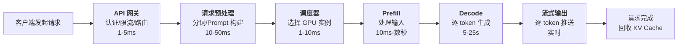
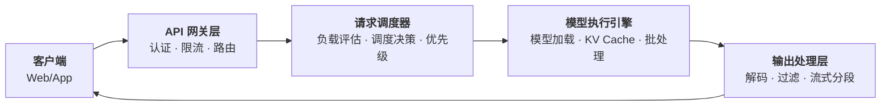

# 推理服务架构

2020 年，NVIDIA 将其模型推理服务 TensorRT Inference Server 更名为 Triton Inference Server，这个看似寻常的更名事件，实际上标志着推理服务从单模型单服务的简陋模式，走向了通用化、平台化的新阶段。彼时的推理服务主要面向计算机视觉和推荐系统等传统深度学习模型，请求延迟可预测、资源消耗可控，架构设计与普通 Web 服务并无本质差异。2023 年，大语言模型的爆发彻底改写了这一局面。Hugging Face 推出了 Text Generation Inference（TGI），加州大学伯克利分校团队提出 PagedAttention 并开发了 vLLM 框架，一批专门面向 LLM 的推理服务框架也如雨后春笋般涌现。这些框架要解决的核心问题，是 LLM 推理的自回归生成特性与传统 Web 服务请求 - 响应模式之间的根本矛盾。

本文从 LLM 推理的自回归本质出发，分析推理服务与传统 Web 服务在延迟模型、资源消耗、流量模式上的差异，进而讨论推理请求的完整生命周期、推理服务的核心架构组件、从单机到云原生的部署模式，以及高可用与容错设计。这些内容与[推理效率优化](../../language-models/reasoning/inference-efficiency.md)中讨论的 PagedAttention、PD 分离架构等底层优化技术形成互补，后者关注如何让单次推理更快，本文关注如何让推理服务更可靠、更高效地对外提供服务。

## 推理服务与传统 Web 服务

如果你曾经开发过 Web 应用，对下面的场景一定不陌生：用户点击"提交订单"，后端查询数据库、执行业务逻辑、返回结果，整个请求在 200 毫秒内完成。你用 Nginx 做负载均衡，用 Kubernetes 做弹性伸缩，高峰期多加几个 Pod 就能扛住流量。这套成熟的架构实践，在面对 LLM 推理服务时却处处碰壁。原因不是工程实现不够好，而是 LLM 推理的内在特征与传统 Web 请求存在根本差异。理解这些差异，是设计推理服务架构的起点。

### 延迟模型的差异

假设你运营着一个电商网站的后端服务，对 1000 个查询商品详情的请求做延迟统计，会发现绝大多数请求的响应时间集中在 50-250 毫秒之间，少数请求因为缓存未命中或数据库慢查询可能到 300 毫秒，但几乎不会出现 10 秒以上的请求。延迟的统计近似于正态分布，均值和方差都可预测，你可以据此设置 500 毫秒的超时阈值，安心地认为 99.9% 的请求都能在阈值内完成，并以此设定服务的 SLA。

现在把场景换成 LLM 推理服务。两个用户同时发来请求：一个问"用一句话解释什么是机器学习"，模型生成约 30 个 token，耗时不到 1 秒；另一个问"详细解释量子力学的基本原理，包括波粒二象性和不确定性原理"，模型生成约 2000 个 token，耗时超过 1 分钟。两个请求的延迟相差 60 倍，而你在请求到达时完全无法预知哪个是短请求、哪个是长请求，因为输出长度取决于模型的生成过程，而非输入长度。

这种差异的根源在于 LLM 推理的自回归特性，LLM 的 Decode 阶段逐 token 生成，每生成一个 token 都需要一次完整的前向传播。总延迟近似等于 Prefill 延迟加上单 token 生成时间乘以输出 token 数，而输出 token 数在请求到达时不可预知。这意味着 LLM 推理的延迟分布不是正态分布，而是长尾分布。大部分请求可能集中在 1-5 秒，但少数请求可能长达 30 秒甚至更久。长尾分布对工程设计的冲击是全方位的：超时阈值设高了，异常请求会长时间占用资源；设低了，正常的长请求会被误杀。容量规划也变得困难，P99 延迟可能比中位数高出 10 倍，按 P99 规划则大量资源在平时被浪费，按中位数规划则高峰期服务质量急剧下降。这种不确定性像一条从 SLA 中延伸的裂缝，由延迟模型蔓延到资源消耗、流量模式、部署策略、容错设计，最终使得传统 Web 服务的架构经验几乎都被动摇。

### 资源消耗模式的差异

传统 Web 服务大多是 I/O 密集型的。一个典型的 Spring Boot 应用，CPU 大部分时间在等待数据库返回结果、等待网络传输完成、等待磁盘 I/O 结束。增加并发连接数几乎不增加 CPU 负担，因为新增的请求大部分时间也在等待 I/O。在良好的架构支撑下，水平扩展相对简单，加一台服务器就能多承载一批并发请求，成本与容量近似线性关系。

LLM 推理服务则完全不同。它受计算密集型与显存密集型的双重约束。计算密集体现在每生成一个 token 都需要执行一次完整的前向传播，涉及数十亿参数的矩阵乘法运算。显存密集体现在 KV Cache 对显存的大量占用，正如[推理瓶颈分析](../../language-models/reasoning/inference-efficiency.md#推理瓶颈分析)中所说的，一个 70B 模型的单个请求 KV Cache 就可能消耗约 10 GB 显存。并发数受限于显存容量而非 CPU 核数，一个由数块 A100 80GB 组成的集群，运行 70B 模型时，同时能处理的请求数可能只有个位数。

这种资源约束的差异直接决定了扩展方式的不同。架构合理的 Web 服务增加机器就能增加并发，最基础的 2 核 4 GB 云服务器年租金不过几十元。LLM 推理服务的扩展受 GPU 供应约束，一块 A100 80GB 价值数万元。更关键的是，GPU 节点的启动时间远慢于 CPU 节点，加载一个 70B 模型的权重到显存需要数十秒到数分钟，这意味着弹性伸缩的响应速度远不如传统服务。

### 流量模式的差异

传统 Web 服务的流量波动相对平缓。以电商网站为例，日间高峰期的 QPS 可能是夜间低谷期的 2-5 倍，且流量变化通常有规律可循（午休时段小高峰、晚间大高峰），可以提前预热资源。即使出现突发流量（如秒杀活动），也可以通过缓存、限流、降级等手段提前应对。

LLM 推理服务的流量则具有强烈的突发性和不可预测性。一个热门的 AI 应用，其峰值流量可能是低谷流量的 10-50 倍，远超传统服务的峰谷比。更棘手的是单个用户的请求间隔极不均匀，用户可能在几分钟内连续发起多轮对话，每轮都是一次推理请求，然后间隔数小时不再使用。这种"突发 - 静默"的流量模式，使得基于平均 QPS 的容量规划几乎丧失作用。

流量的突发性与 GPU 扩展的迟缓形成了一对尖锐的矛盾。传统服务遇到突发流量时，Kubernetes 的 HPA（Horizontal Pod Autoscaler）可以在数秒内拉起新的 Pod 来分担压力，Serverless 架构的服务更是能把响应时间缩短到数百毫秒级别 。GPU 节点从启动到就绪需要数分钟（加载模型权重、预热 GPU），突发流量到来时，新节点还没就绪，现有节点已经被压垮。这种扩容迟缓的困境，是推理服务弹性伸缩设计的巨大挑战，也是后续讨论云原生部署与降级策略时需要重点解决的问题。

## 推理请求的生命周期

要应对 LLM 推理服务的各种挑战，必须先弄清楚一个 LLM 推理请求从用户发出到收到完整回复，中间到底经历了哪些环节，每个环节的耗时有什么特征，哪些环节可能成为瓶颈。需要深入推理请求的完整生命周期，才能系统性地回答这些问题。

### 请求处理全流程

现在想象你作为一个用户，正在使用一个 AI 助手应用，你在对话框中输入"请解释什么是深度学习"并按下回车。从这一刻起，直到屏幕上显示出完整的回复，请求经历了一条复杂的处理链路。


*图：推理请求的完整处理链路*

- 第一步 **API 网关接收请求**：网关验证你的身份（API Key 或 OAuth Token），检查你是否合法用户、是否超过调用频率限制，然后将请求转发给后端服务。这一步的延迟通常在 1-5 毫秒。

- 第二步 **请求预处理**：后端服务将你的输入文本送入分词器（Tokenizer），将"请解释什么是深度学习"转换为一系列词表中的 token ID。同时，系统会将你的输入与[系统提示词](../../language-models/pretraining/supervised-finetuning.md#系统提示词设计)（System Prompt）、对话历史拼接成完整的 Prompt。如果对话历史较长，这一步还需要处理上下文窗口的限制。分词和 Prompt 构建的延迟约 10-50 毫秒。

- 第三步 **请求调度**：调度器根据各 GPU 实例的当前负载（正在处理的请求数、KV Cache 占用量、GPU 利用率）和请求属性（输入长度、优先级），决定将请求发送到哪个 GPU 实例。调度的延迟约 1-10 毫秒，但调度决策的质量直接影响请求的排队时间和整体吞吐量。

- 第四步 **[Prefill](../../language-models/reasoning/inference-efficiency.md#prefill-decode-分离架构)**：GPU 实例接收到请求后，对输入 Prompt 的所有 token 做一次并行计算，生成初始的 KV Cache。Prefill 的延迟取决于输入长度。短 Prompt 约 10-50 毫秒，长 Prompt（如包含大量对话历史）可能需要数百毫秒甚至数秒。

- 第五步 **[Decode](../../language-models/reasoning/inference-efficiency.md#prefill-decode-分离架构)**：模型逐 token 生成输出，每生成一个 token 都需要读取全部 KV Cache 并执行一次前向传播。Decode 是访存密集型操作，单步延迟约 10-50 毫秒，总延迟等于单步延迟乘以输出 token 数。对于一个生成 500 个 token 的请求，Decode 阶段可能耗时 5-25 秒，占整个请求生命周期的大部分时间。

- 第六步 **流式输出**：每生成一个 token，系统就立即将其发送给客户端，而不是等全部生成完毕。这让用户在请求发出后的几百毫秒内就能看到第一个 token，大大改善了交互体验。

- 第七步 **请求完成**：模型生成结束标记（EOS）或达到最大生成长度后，请求完成。系统根据缓存策略，决定是否回收该请求的 KV Cache 显存，将其归还给空闲池，供后续请求使用。

从这个流程中可以看出，Prefill 和 Decode 是两个耗时最长的环节，也是优化空间最大的环节。[GPU 资源管理](gpu-resource-management.md)和[请求调度与批处理](request-scheduling.md)中的各项优化技术，本质上都是在提升这两个环节的效率。

### 流式输出与 Server-Sent Events

由于 LLM 推理的生成是逐 token 进行的，假如等全部 token 生成完毕再一次性返回给客户端，用户需要面对漫长的空白等待。以生成 1000 个 token、单步 Decode 延迟为 50 毫秒的请求为例，总耗时约 50 秒。如果用户在这 50 秒内看不到任何输出，很容易误以为服务出了问题而反复重试，反而加剧系统压力。

**流式输出**（Streaming）是解决这个问题的标准方案。模型每生成一个 token 就立即发送给客户端，用户在请求发出后几百毫秒内就能看到第一个 token，后续 token 如打字般逐个出现。这种设计造就了当前主流的 AI 助手产品（如豆包、ChatGPT 等）中的逐字输出效果。**服务端事件推送**（Server-Sent Events，SSE）是实现流式输出的标准协议。SSE 以 HTTP 协议为基础，服务端可以单向推送数据给客户端，每个事件以 `data:` 开头，以两个换行符结尾。相比 WebSocket 的双向通信，SSE 更简洁、更轻量，天然支持自动重连，且基于标准 HTTP 协议，不需要额外的连接升级握手。对于 LLM 推理这种服务端单向推送 token 的场景，SSE 确实是更合适的选择。本工程中代码运行时，实时将标准输出（STDOUT、STDERR）的日志信息显示在网页界面中，使用的也是 SSE 协议。

下面的代码利用 DMLA 代码块本身支持 SSE 流式推送的特性，模拟 LLM 推理的逐字输出效果。点击运行后，你将在输出区域看到 token 如打字般逐个出现，这正是 SSE 流式输出的实际工作方式。代码同时模拟测量了 Prefill 耗时、首 Token 延迟（TTFT）和每 Token 延迟（TPOT）等推理服务的关键性能指标。

```python runnable
# 演示 LLM 推理中 SSE 流式输出的交互过程
# 本代码利用 runnable code 的 SSE 流式推送特性，模拟逐字输出效果
import time

# 模拟 LLM 生成的 token 序列
tokens = ["在", "大", "语", "言", "模", "型", "的", "推", "理", "服",
          "务", "中", "，", "流", "式", "输", "出", "至", "关", "重",
          "要", "。"]

# ---- 模拟 Prefill 阶段 ----
prefill_start = time.time()
print("[Prefill] 处理输入提示词...", flush=True)
time.sleep(0.1)  # Prefill 约 100ms
prefill_time = time.time() - prefill_start

# ---- 模拟 Decode 阶段：逐 token 生成并实时推送 ----
# 每个 print(token, flush=True) 会通过 SSE 实时推送到前端
# 你将在输出区域看到 token 逐个出现，如同 AI 助手的打字效果
print("\n[Decode] 逐 token 生成中：\n", flush=True)
print("AI: ", end='', flush=True)

decode_start = time.time()
first_token_time = None

for token in tokens:
    time.sleep(0.1)  # 模拟每步 Decode 延迟约 100ms

    # 关键：flush=True 确保 token 立即通过 SSE 推送到前端
    # 这正是 LLM 推理服务实现逐字输出的原理
    print(token, end='', flush=True)

    if first_token_time is None:
        first_token_time = time.time()

decode_time = time.time() - decode_start

# ---- 输出性能指标 ----
ttft = (first_token_time - decode_start) if first_token_time else 0
tpot = decode_time / len(tokens) if tokens else 0

print(f"\n\n{'='*50}", flush=True)
print(f"性能指标：", flush=True)
print(f"  Prefill 耗时:     {prefill_time*1000:.0f}ms", flush=True)
print(f"  首 Token 延迟(TTFT): {ttft*1000:.0f}ms", flush=True)
print(f"  生成 token 数:    {len(tokens)}", flush=True)
print(f"  Decode 总耗时:    {decode_time*1000:.0f}ms", flush=True)
print(f"  每 token 延迟(TPOT): {tpot*1000:.1f}ms", flush=True)
print(f"{'='*50}", flush=True)
```

流式输出也伴随着一些新的工程挑战。传统 Web 应用的中间件默认读取超时时间较短，如 Nginx 为 60 秒。而 LLM 推理请求可能持续数分钟，需要设置超时为 300 秒甚至更长。这个过程中可能面临断线风险，网络抖动导致连接中断时，客户端需要能够从断点续传，而非从头开始重新生成。当流式传输中某个 token 的推送失败时，不应像传统 Web 应用那样导致整个请求失败，需要有选择性的重试机制。

### 请求取消与超时处理

当用户在 AI 助手中点击"停止生成"按钮时，客户端会主动断开连接。传统 Web 服务处理这种情况很容易，只需关闭连接、释放请求上下文即可，CPU 和内存资源几乎瞬间归还。LLM 推理服务的请求取消则复杂得多。服务端不仅需要关闭连接，还要立即回收该请求已分配的 KV Cache 显存，否则将会减少系统可以同时处理的请求数，造成隐性资源泄漏。请求取消还存在竞态条件。当用户取消请求与模型生成同时发生时，可能出现调度器已将该请求标记为取消，但 GPU 上该请求的 Decode 过程仍在执行的情况。执行完成后需要回收 KV Cache，如果回收逻辑在标记取消之前就执行了，可能导致 KV Cache 被双重释放；如果回收逻辑永远不执行，则显存泄漏。解决竞态条件的关键是引入引用计数机制，给每个请求的 KV Cache 设置一个引用计数，调度器取消请求时递减计数，GPU 执行完成时也递减计数，只有当计数归零时才真正释放显存。这种设计类似于早期编程语言中基于引用计数的自动内存管理机制（Reference Counting Garbage Collection）。

在推理场景下，超时策略的设计也需要重新思考。传统服务的超时策略通常是请求 - 响应的端到端全局超时：给整个请求设定一个最大执行时间，超过则强制终止。LLM 推理服务如果采用全局超时，会面临两难选择。阈值设得短了（如 10 秒），正常的长文本生成请求会被误杀；阈值设得长了（如 120 秒），异常请求会长时间占用 GPU 资源。一般 LLM 推理服务会设置更精细的超时策略，不限制总生成时间，而是限制单个 token 的最大等待时间。如果某个 token 的等待时间超过阈值（如 5 秒），说明系统可能已经过载，此时终止请求比继续等待更合理，这种超时策略被称为逐步超时。逐步超时避免了全局超时的一刀切问题，但实现也更复杂，需要跟踪每个 token 的生成时间。

## 推理服务的核心架构组件

根据推理请求生命周期流程图，一个生产级的 LLM 推理服务会涉及到 API 网关层、请求调度器、执行引擎、输出处理层四个组件。API 网关层负责请求的接入与管控，请求调度器负责请求的分配与编排，模型执行引擎负责 GPU 上的实际推理计算，输出处理层负责将原始计算结果转换为用户可读的文本。这四个组件各司其职，又紧密协作，共同决定了推理服务的性能、可靠性和成本效率。


*图：推理服务的四层架构组件与数据流向*

### API 网关层

API 网关是推理服务面向外部世界的入口，承担认证鉴权、限流控制和请求路由三项职责。

认证鉴权验证调用者的身份和权限。LLM 推理服务的调用成本远高于传统 API（每次调用消耗数秒的 GPU 时间），因此认证不仅是安全需求，更是成本控制的需求。最常见的认证方式是 API Key 验证。每个用户或应用分配唯一的 Key，网关在请求到达时验证 Key 的有效性，并根据 Key 关联的配额信息决定是否放行。

限流控制防止个别用户或突发流量压垮整个服务。传统 Web 服务的限流通常按 QPS（Queries Per Second）计算，LLM 推理服务除了 QPS 外，还需要按 token 吞吐量限流，即 TPS（Tokens Per Second）。一次生成 2000 个 token 的请求对 GPU 的压力大于 10 次生成 50 个 token 的请求，如果只按 QPS 限流，少量长请求就可能耗尽 GPU 资源。实际部署中通常采用 QPS + TPS 的双重限流策略，QPS 限制请求频率，TPS 限制总计算量。

请求路由将请求分发到不同的模型服务实例。当同一服务部署了多个模型（如不同参数量的版本）或多个实例时，网关需要根据请求中指定的模型名称、请求的优先级、各实例的健康状态等信息，将请求路由到最合适的实例。付费用户的请求可能被路由到专属的高优先级实例，免费用户的请求则进入共享实例的普通队列。

### 请求调度器

调度器是推理服务的大脑，负责决定每个请求由哪个 GPU 实例处理、何时处理、与哪些请求一起批处理。调度决策的质量直接影响系统的吞吐量和延迟。

调度器做决策时需要两类输入信息。第一类是各 GPU 实例的当前状态，如正在处理的请求数、KV Cache 占用量、GPU 利用率、排队中的请求数，等等。第二类是请求本身的属性，如输入长度、预期输出长度（如果客户端提供了 `max_tokens` 参数）、优先级、等待时间，等等。调度器根据这些信息，在最小化请求延迟（让每个请求尽快得到响应）、最大化吞吐量（让 GPU 尽可能不空闲）、保证公平性（不让低优先级请求无限等待）三个目标之间寻找平衡。

调度策略的具体实现是一个具有深度的话题。我们会在[请求调度与批处理](request-scheduling.md)一节中详细讨论连续批处理、抢占机制、前缀缓存等调度技术，这里只概述核心思路。不同的推理框架可以有自己的调度策略，如 vLLM 采用的是 FCFS（First Come First Serve）+ 抢占机制的策略。请求按到达顺序排队，调度器在每个 Decode 步（Decode Stage）结束后检查是否有新请求可以加入批处理。当显存不足以容纳新请求的 KV Cache 时，调度器会暂停（Preempt）低优先级请求，释放其 KV Cache 显存给高优先级请求使用，被暂停的请求稍后重新调度。这种策略在保证公平性的同时，也确保了高优先级请求不会被长时间阻塞。

### 模型执行引擎

模型执行引擎负责在 GPU 上实际进行推理计算，是整个推理服务中与硬件最贴近的组件。它的核心能力包括模型加载与权重管理、KV Cache 管理和批处理调度。

模型加载是将模型权重从磁盘读入 GPU 显存的过程。一个 70B 模型的权重文件约 140 GB（按 FP16 计算），从 SSD 加载到显存需要数十秒时间。生产环境中通常在服务启动时一次性加载，之后权重常驻显存，不会再被卸载。权重管理还涉及多卡场景下的分片策略。张量并行时，每块 GPU 只加载模型的一部分权重，各卡协同完成计算。

管理好 KV Cache 是执行引擎最核心的职责之一，也是最大的挑战。[PagedAttention 机制](../../language-models/reasoning/inference-efficiency.md#pagedattention)将 KV Cache 划分为固定大小的 Block，通过 Block 表实现逻辑到物理的映射，消除了传统连续分配方式中的显存碎片问题。vLLM 的 PagedAttention 引擎是这一机制的经典实现，它将 KV Cache 的显存利用率从传统方式的约 40% 提升到接近 100%，直接带来了 4-6 倍的吞吐量提升。

批处理调度是执行引擎与调度器协作的关键环节。调度器决定哪些请求一起处理，执行引擎决定怎么高效地并行计算。连续批处理要求执行引擎在每个 Decode 步结束后，能够快速地将已完成的请求移出批量、将新请求加入批量，这个过程必须足够快（通常在 1 毫秒以内），否则调度开销会抵消批处理带来的吞吐收益。

### 输出处理层

输出处理层负责将模型执行引擎产生的原始 token 序列转换为用户可读的文本，是推理服务中离用户最近的组件。

分词器解码是输出处理的第一步。模型执行引擎输出的是 token ID（整数），需要通过分词器将其映射回文本。譬如 token ID 3824 可能对应汉字"学"，token ID 29871 可能对应标点符号"，"。分词器解码实际上是一次词表查询，延迟通常可以忽略不计（微秒级），但需要处理一些特殊情况，如 UTF-8 多字节字符可能被拆分到多个 token 中，需要正确拼接后才能解码。又如 LLM 在生成过程中会输出一些不应对用户可见的特殊标记，像 `<|im_end|>`（对话结束标记）、`<|eot_id|>`（轮次结束标记）等。输出处理层需要识别并过滤这些标记，只将有效文本发送给客户端。

输出层的流式分段组件将连续的 token 流按语义单元切分后输出。逐 token 输出虽然延迟最低，但单个 token 往往不是完整的语义单元（一个汉字可能只是半个词）。一些应用场景要求按句子或段落切分输出，这需要在输出处理层引入缓冲区，积累 token 直到遇到句号、换行等分隔符，再将整个句子一次性推送。这种策略牺牲了一定的实时性，但输出的可读性更好。

输出过滤与安全组件是输出处理层的另一项重要职责。在流式输出中逐 token 检测敏感内容也是一项工程挑战，敏感词可能被拆分到多个 token 中（如"危"和"险"分别在两个 token 中），需要维护一个滑动窗口来检测跨 token 的敏感模式。此外，内容安全检测的延迟必须足够低，避免成为流式输出的瓶颈。

## 部署模式与架构选型

介绍了推理服务的软件和逻辑组件后，接下来就要将这些组件部署到实际的物理硬件上。模型规模、并发需求、成本预算和可靠性要求的不同，会导致截然不同的部署决策。从最简单的单机单卡到复杂的云原生弹性部署，每种模式都有其适用场景和优缺点，许多技术策略与前文训练阶段所使用的完全是一致的。

- **单机单卡部署**：最简单的部署方式是一块 GPU 运行一个模型实例。假设你有一块 RTX 4090 24GB，部署一个 7B 参数的模型（FP16 精度约需 14GB 显存）后还能剩余约 10GB 显存空间用于 KV Cache 和运行时开销，可以同时处理 5-10 个请求。这种部署方式的优点是配置简单，启动命令一条就够了，适合开发测试和小规模内部工具。缺点自然是模型规模和并发能力都受限，很难用于生产实践。

- **单机多卡部署**：当模型参数量超过单卡显存时，需要将模型分片到多块 GPU 上。最常用的分片方式是[张量并行](../../language-models/pretraining/distributed-training.md#张量并行)（Tensor Parallelism），将每个 Transformer 层的权重矩阵按列或按行切分，分配到不同的 GPU 上并行计算。

    张量并行的主要约束是通信开销。每个 Transformer 层的前向传播都需要一次 [AllReduce](../../language-models/pretraining/distributed-training.md#通信优化) 操作。各 GPU 分别计算自己负责的那部分矩阵乘法，然后将结果汇总求和。这意味着每经过一层，GPU 之间都需要交换中间结果。如果 GPU 之间通过 PCIe 总线通信（带宽约 64 GB/s），AllReduce 的通信时间可能占到总计算时间的 30-50%，严重拖慢推理速度。而通过 NVLink 互连（带宽 300-900 GB/s），通信开销可以降低到 10% 以下。因此，张量并行通常要求 GPU 在同一节点内通过 NVLink 互连，跨节点的张量并行因网络带宽不足而效率极低。

    vLLM 的张量并行实现可作为参考。它通过 NCCL（NVIDIA Collective Communications Library）完成多卡之间的 AllReduce 通信，用户只需在启动时指定 `--tensor-parallel-size` 参数，框架自动完成模型的分片和通信配置。以 70B 模型为例，使用 4 × A100 80GB 的张量并行为每块 GPU 加载约 35GB 的模型权重，剩余约 45GB 用于 KV Cache，可以同时处理 30-50 个请求，相比单卡部署有了质的提升。

- **多机多卡部署**：当模型规模超过单机 GPU 总显存，或者需要更高的并发能力时，就需要跨机器部署。[流水线并行](../../language-models/pretraining/distributed-training.md#流水线并行)（Pipeline Parallelism）将模型的不同层分布到不同机器上：机器 0 负责第 1-20 层，机器 1 负责第 21-40 层，以此类推。请求从机器 0 进入，逐层向后传递，最后一台机器输出结果。

    流水线并行的主要约束是气泡问题（Bubble）。各阶段之间需要等待前一个阶段的输出才能开始计算，GPU 在等待期间处于空闲状态。假设模型分为 4 个阶段，每个阶段的计算时间为 10 毫秒，则一个请求需要 40 毫秒才能完成。当有 4 个请求依次进入流水线时，机器 0 在第 3 个请求开始前有 20 毫秒的空闲等待，机器 3 在第一个请求到达前有 30 毫秒的空闲等待。气泡比例与并行度正相关，4 级流水线在单个微批次时理论气泡率约为 75%，8 级流水线的气泡率约为 87.5%。减少气泡的常用方法是微批处理（Micro-batching），将一个大请求拆分为多个微批次，让各阶段交替处理不同的微批次，从而减少空闲时间。

    对于超大规模模型，通常需要张量并行与流水线并行组合使用。以一个 405B 参数的模型为例，可能需要 8 块 H100 做张量并行（单节点内），2 个节点做流水线并行（跨节点），共 16 块 H100。节点内通过 NVLink 高速通信，节点间通过 InfiniBand 网络（带宽 400 Gb/s）传输中间结果。

    另一种重要的跨机器部署模式是 [Prefill-Decode 分离架构](../../language-models/reasoning/inference-efficiency.md#prefill-decode-分离架构)，将 Prefill 实例和 Decode 实例部署在不同的 GPU 集群上，各自独立扩展。Prefill 实例使用高算力 GPU，Decode 实例使用高显存带宽 GPU，根据各自的工作负载特征选择最匹配的硬件。

- **云原生部署**：将 LLM 推理服务部署到 Kubernetes 上，可以利用云平台的弹性伸缩能力应对流量波动。但 GPU 工作负载的云原生部署面临以下几个工程问题，导致现在的 AI 云服务仍然很难直接使用原生的 K8S 来管理 GPU 负载，需要深度改造或者自研（如介绍 PD 分离架构时提到 Kimi 使用自研的 Mooncake 系统来管理 KV Cache）。

    - GPU 节点池管理：Kubernetes 集群中通常同时存在 CPU 节点池和 GPU 节点池，Pod 调度时需要通过节点选择器（Node Selector）或污点与容忍（Taint and Tolerations）确保推理 Pod 被调度到 GPU 节点上。GPU 节点的价格远高于 CPU 节点（前文提到过，一台云主机最便宜的年租金只要数十元，一块 A100 的价值约数万元），需要精细规划节点池大小，避免闲置浪费。

    - 模型权重持久化：推理容器重启时需要重新加载模型权重（数十 GB），如果权重存储在容器镜像中，镜像体积会非常大（数十到数百 GB），导致拉取时间过长。更好的方案是将权重存储在持久卷（PVC）或对象存储（如 S3）中，容器启动时从存储中加载权重。首次加载可能需要数十秒到数分钟，但后续可以通过权重共享机制加速。

    - 弹性伸缩：这是最具挑战性的问题，Kubernetes 的 HPA 可以根据 GPU 利用率等指标自动扩缩容，但一个 GPU Pod 从创建到就绪需要经过调度 GPU 节点（秒级）→ 拉取容器镜像（数十秒到数分钟）→ 加载模型权重（数十秒到数分钟）→ 预热 GPU（秒级），总计可能要 3-5 分钟。而突发流量往往在几秒、十几秒内到达，等新 Pod 就绪时，流量高峰可能已经过去，或者现有节点已被流量冲溃。缩容时的优雅处理同样重要。当流量下降需要缩减 GPU 实例时，正在处理请求的实例不能直接终止，否则用户会收到不完整的回复。Kubernetes 的优雅停机（Graceful Shutdown）机制允许 Pod 在收到终止信号后继续处理完当前请求，但需要配合调度器将新请求路由到其他实例。

## 高可用与容错设计

推理服务部署上线后，并非一劳永逸。GPU 硬件故障、显存溢出、推理超时等问题随时可能发生，而且 GPU 故障的恢复方式与传统基于 CPU 的服务也有很大不同。一个健壮的推理服务架构，必须能够自动应对这些故障，在保证服务质量的前提下实现快速恢复。

### 故障模式分析

GPU 推理服务的常见故障可以分为硬件故障、资源故障和逻辑故障三类。

- 硬件故障是最严重的一类。GPU 的 ECC（Error Correcting Code）错误是常见的硬件故障信号，当显存中的数据位发生翻转时，ECC 机制可以检测并纠正单比特错误，但多比特错误无法自动纠正，会导致 GPU 进入不可用状态。显存损坏则更致命，整块 GPU 可能需要更换。GPU 硬件故障的恢复要比传统服务更为困难，CPU 服务的工作线程由于偶发硬件故障而崩溃后，只需重启线程即可恢复，进程本身一般不受影响。但 GPU 进程崩溃后，通常需要重启整个进程甚至重新加载模型权重，恢复时间从秒级变为分钟级。

- 资源故障主要是显存溢出（Out of Memory，OOM）。当 KV Cache 的总占用超过可用显存时，新的请求无法被接纳，正在运行的请求也可能因显存不足而被暂停。OOM 不是随机事件，而是可预测的。当并发请求数超过显存容量限制时，OOM 就必然发生。因此，预防 OOM 的关键是准确的显存预算管理和合理的并发数控制。

- 逻辑故障包括推理超时和模型权重损坏。推理超时可能由请求排队时间过长、Prefill 阶段输入过长导致计算时间过长、调度策略不合理导致批处理效率低下等多种原因引起。模型权重损坏则发生在权重文件被意外修改或存储故障导致数据丢失时，此时模型的输出会产生乱码或无意义的结果。

### 冗余与故障转移

应对故障最基本的策略是冗余，多副本部署则是最直接的冗余实现。同一模型部署多个实例，通过负载均衡分发请求，当某个实例故障时，其他实例自动接管。副本数的计算需要基于 SLO（Service Level Objective）和峰值 QPS 来计算。如果 SLO 要求 P99 延迟低于 2 秒、峰值 QPS 为 100，则需推算满足该 SLO 所需的最小 GPU 数量，再加上冗余副本（通常至少 1 个冗余副本）保证单实例故障时的服务质量。

故障检测与自动摘除是高可用的必要保障。传统 Web 服务的心跳检查接口（`/health`）是基本的检测方式，它验证服务进程是否存活。对于推理服务，进程存活并不意味着推理能力正常。模型权重损坏时，进程依然可以响应健康检查，但输出结果已经不可用。因此，推理服务还需要推理探针（Inference Probe）定期向服务发送一个已知输入的测试请求，验证输出是否符合预期。如果测试请求的输出异常，探针判定该实例推理能力受损，自动将其从负载均衡池中摘除。

请求重试策略在故障转移中扮演重要角色。LLM 推理天然具备幂等性（Idempotency），相同的输入配合相同的采样参数，模型会产出相同的输出分布（注意是分布，不是相同的输出）。这意味着安全重试不会产生副作用，用户不会因为重试而收到不一致的结果。但与 Web 服务类似，重试有出现重试风暴的风险。如果大量请求同时重试到同一个健康的实例，把原本健康的实例也压垮。防护措施是指数退避（Exponential Backoff）加随机抖动（Jitter）。第一次重试等待 1 秒，第二次等待 2 秒，第三次等待 4 秒，每次等待时间再加一个随机偏移，避免所有请求在同一时刻重试。

### 降级策略

当冗余和故障转移都无法满足正常服务质量时，就需要启动降级策略。降级是以牺牲服务质量换取可用性，确保服务在极端情况下依然能响应用户请求，只是响应质量有所下降。传统 Web 服务需要专门设计降级路径，而推理服务中的模型降级是最直接的降级方式。当大模型实例不可用时，自动切换到小模型实例继续服务。譬如从 70B 模型降级到 7B 模型，回复质量确实会有所下降（细节不够丰富、推理能力减弱），但至少用户不会面对服务不可用的错误页面。模型降级需要预先部署备用的小模型实例，并在负载均衡配置中设定降级路由规则。当大模型实例的健康比例低于阈值时，自动将部分流量路由到小模型实例。

功能降级是另一种降级方式，通过减少服务功能来降低资源消耗。譬如关闭流式输出（改为一次性返回完整结果，减少长连接的资源占用）、降低最大生成长度（从 4096 token 降为 1024 token，减少每个请求的 KV Cache 占用）、拒绝低优先级请求（免费用户的请求在高峰期被直接拒绝，只为付费用户服务），等等。功能降级的影响范围可控，恢复速度也快，当系统负载恢复正常后，可以立即恢复全部功能。

降级的触发条件需要精确设定，避免频繁切换导致服务质量波动。常见的触发条件有 GPU 利用率持续超过阈值（如 90%，持续 5 分钟）、请求排队时间超过阈值（如 10 秒）、OOM 频率超过阈值（如每分钟超过 3 次）。触发条件应该是持续性的而非瞬时的，因为瞬时波动（如一个大的 Prefill 请求暂时拉高 GPU 利用率）不应触发降级。

## 本章小结

LLM 推理服务的架构设计，不能用传统 Web 服务的经验简单套用。两者的根本差异在于传统 Web 服务的延迟可预测、资源消耗可控、扩展方式灵活，而 LLM 推理服务的延迟由不可预知的输出长度决定、并发受限于显存容量、扩展受 GPU 供应和启动速度的约束。这些差异像一条主线，贯穿了推理服务架构的每个层面。

本章讨论的架构设计关注如何让推理服务可靠地对外提供服务。至于单次推理如何更快、GPU 资源如何更高效地利用，那是[推理效率优化](../../language-models/reasoning/inference-efficiency.md)的主题。两个视角的结合，才能构建出既快又稳的推理服务。

## 练习题

1. 假设你负责部署一个 7B 参数的 LLM 推理服务，预期峰值 QPS 为 10，每个请求平均生成 500 个 token。请估算需要多少块 A100 80GB GPU（假设单块 A100 运行该模型的单请求 TPS 为 30），并设计部署架构。

   <details>
   <summary>参考答案</summary>

   先计算吞吐需求：10 QPS × 500 token = 5000 token/s。单块 A100 的 TPS 为 30 token/s，如果仅按这个数字计算，理论上需要 5000 / 30 ≈ 167 块 GPU。但这个计算忽略了批处理带来的吞吐提升。实际中，vLLM 等框架通过 PagedAttention 和连续批处理，单块 A100 运行 7B 模型的总吞吐量可达 2000-3000 token/s（批量大小约 50-100，此为 FP16 精度下较理想的场景），因此实际需要约 2-3 块 A100。考虑高可用（至少 2 副本），建议 4-6 块 A100，采用单机多卡部署（2-4 块 GPU/节点），配合负载均衡和健康检查实现故障转移。

   </details>

2. 某推理服务在高峰期出现大量请求超时，日志显示 GPU 利用率仅 30%。请分析可能的原因并提出解决方案。

   <details>
   <summary>参考答案</summary>

   GPU 利用率低而请求超时，说明 GPU 没有被充分利用，瓶颈不在计算本身，而在调度或数据流。可能的原因有三方面：
   - 第一，调度策略不合理，请求未能有效批处理，大量请求以批量大小 1 执行，GPU 算力浪费严重。解决方案是使用连续批处理（如 vLLM 的 iteration-level scheduling），动态合并请求，让 GPU 每步都处理尽可能多的活跃请求。
   - 第二，Prefill 请求过大，阻塞了 Decode 队列。一个长 Prompt 的 Prefill 可能耗时数百毫秒，期间 Decode 请求被迫等待，用户感知到的就是超时。解决方案是限制单个 Prefill 请求的最大长度，或采用 PD 分离架构，将 Prefill 和 Decode 分配到不同实例上独立执行。
   - 第三，KV Cache 碎片化严重，显存利用率低，无法接纳更多请求进入批处理，导致 GPU 处于"有算力但无请求可处理"的状态。解决方案是使用 PagedAttention 管理 KV Cache，消除碎片，提升显存利用率，从而增加可同时处理的请求数。

   </details>
