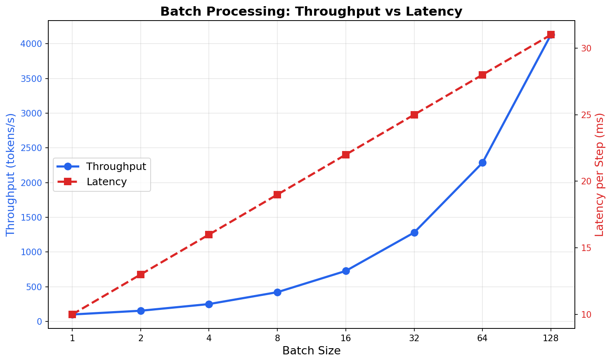
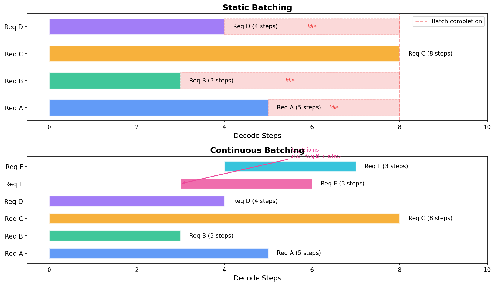
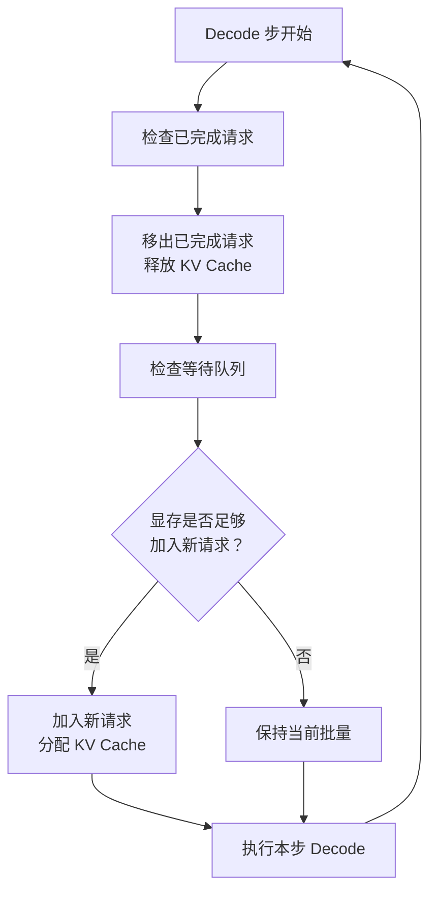
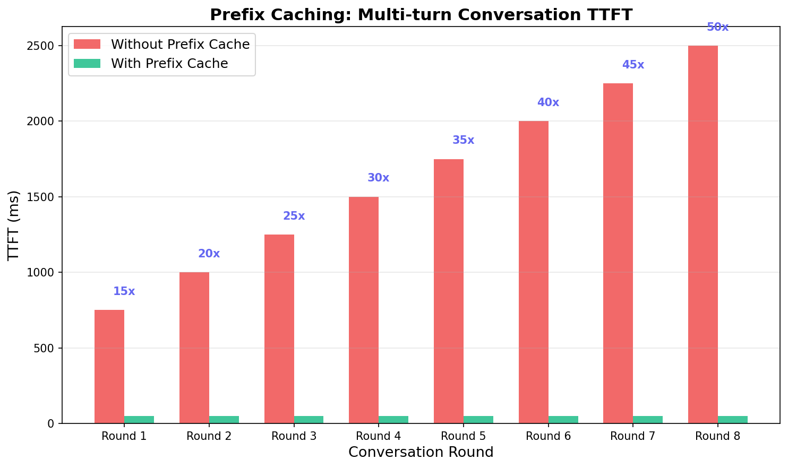

# 请求调度与批处理

## 核心问题

在[推理效率优化](../../language-models/reasoning/inference-efficiency.md#推理瓶颈分析)中，我们看到了 LLM 推理的一个令人沮丧的事实：Decode 阶段的 GPU 算力利用率通常低于 5%。GPU 上数以千计的 Tensor Core 在每个 Decode 步只处理一个 token 的 Query 与所有 Key 的点积，绝大部分计算单元处于空闲状态。更糟糕的是，正如[GPU 资源管理](gpu-resource-management.md#显存预算分析)中所分析的，KV Cache 的巨大显存占用限制了批量大小，使得"通过增加并发来利用闲置算力"这条路也被堵死了。

PagedAttention 通过分页管理 KV Cache 打破了显存墙，让更多请求可以同时驻留在 GPU 上。但请求多了之后，新的问题随之而来：如何决定哪些请求先处理、哪些后处理？当显存再次不够时，该暂停哪个请求？多个请求共享同一段 system prompt 时，如何避免重复计算？这些问题归结为两个主题：**批处理**（如何将多个请求打包到同一次 GPU 计算中）和**请求调度**（如何决定请求的处理顺序和资源分配）。本文从批处理的基本原理出发，分析静态批处理与连续批处理的差异，深入讨论请求调度的策略设计、前缀缓存等显存优化技术，以及抢占与驱逐等资源争用下的应对策略。

## 第一章：批处理的基本原理

### 1.1 为什么需要批处理

如果你有过 GPU 编程的经验，对"并行度"这个概念一定不陌生。CUDA 编程模型中，GPU 将计算任务组织成线程块（Thread Block），每个线程块包含数百个线程，所有线程执行相同的指令但处理不同的数据。GPU 的计算单元（CUDA Core、Tensor Core）是高度并行的，设计目标就是同时处理大量数据。当线程数量足够多时，GPU 的计算单元被充分利用，性能接近峰值；当线程数量太少时，大量计算单元空闲，性能急剧下降。

LLM 推理的 Decode 阶段正是后一种情况。每一步 Decode 只生成一个 token，计算量是单个 token 的 Query 向量与所有已缓存 Key 向量做点积。以 LLaMA-2 70B 为例，单步 Decode 的矩阵乘法规模约为 $1 \times 8192$ 乘以 $8192 \times n$（$n$ 为已缓存 token 数），远不足以填满 A100 上 432 个 Tensor Core 的计算能力。GPU 就像一条宽阔的高速公路，而单个 Decode 请求只占了一条车道，其余车道空空荡荡。

批处理的核心思想是将多个请求的同一步 Decode 计算合并为一次矩阵运算。具体来说，将 $B$ 个请求的 Query 向量拼接成一个 $B \times d$ 的矩阵，与 $d \times n$ 的 Key 矩阵相乘，一次矩阵乘法就同时完成了 $B$ 个请求的注意力计算。GPU 的并行计算能力因此被充分利用，就像高速公路上所有车道都跑满了车。

这种合并之所以能带来显著的性能提升，根源在于矩阵乘法的计算特性。矩阵乘法 $(B \times d) \times (d \times n)$ 的计算量与批量大小 $B$ 线性增长，但 GPU 执行时间的增长远慢于线性。原因是 GPU 的计算单元是并行的，当批量较小时，计算单元没有被填满，增加批量只是让更多计算单元参与工作，而不会增加单个计算单元的负担。只有当批量足够大、计算单元被完全占满后，进一步增加批量才会导致执行时间线性增长。这种"计算量线性增长但执行时间亚线性增长"的现象，就是批处理的**超线性加速**效应。

### 1.2 KV Cache 与批处理的显存约束

批处理听起来很美好，但有一个硬约束：显存。每增加一个请求到批量中，就需要为该请求分配 KV Cache 的显存空间。在[推理效率优化](../../language-models/reasoning/inference-efficiency.md#推理瓶颈分析)中，我们已经见过 KV Cache 的显存占用公式：

$$M_{\text{KV}} = 2 \times n_{\text{layer}} \times d_{\text{head}} \times n_{\text{head}} \times n_{\text{max}} \times b \times sizeof(\text{dtype})$$

这个公式看着复杂，拆开来看含义很直观：

- $2$ 是因为每个 token 在每一层都需要缓存 Key 和 Value 两个向量
- $n_{\text{layer}}$ 是 Transformer 的层数，每层都有一组 KV Cache
- $d_{\text{head}} \times n_{\text{head}}$ 是每个 token 的隐藏维度大小
- $n_{\text{max}}$ 是序列的最大长度，决定了每个请求需要预留多少 token 的缓存空间
- $b$ 是批量大小，即同时处理的请求数
- $sizeof(\text{dtype})$ 是每个数值的字节数，float16 为 2 字节

整体公式可以理解为：所有层、所有 token、所有请求的 Key 和 Value 缓存加起来就是总显存占用。当批量大小 $b$ 增加时，KV Cache 的显存占用也线性增长。GPU 可用于 KV Cache 的显存是有限的（总显存减去模型权重和运行时缓冲区），因此批量大小存在上限。

以 LLaMA-2 70B 在 2×A100 80GB 上运行为例，每张 GPU 分担约 70 GB 的模型权重，剩余约 10 GB 可用于 KV Cache。单个请求的 KV Cache 约 10.7 GB，这意味着不使用 PagedAttention 的情况下，每张 GPU 只能容纳 1 个请求的 KV Cache，批量大小根本提不上去。[PagedAttention](../../language-models/reasoning/inference-efficiency.md#pagedattention) 通过分页管理 KV Cache，将显存利用率从约 41% 提升到接近 100%，使得每张 GPU 可以同时处理 50-60 个请求。但即便如此，显存仍然是批处理的上限约束：当所有请求的 KV Cache 占满可用显存时，新的请求只能排队等待。

理解了显存约束后，批处理的设计空间就清晰了：在显存允许的范围内，尽可能增加批量大小以提升吞吐量；当显存不足时，通过调度策略决定哪些请求优先处理，通过缓存复用减少显存消耗，通过抢占机制释放显存给更重要的请求。这些正是后续章节要讨论的主题。

### 1.3 批处理的收益与代价

批处理的收益可以用一组具体数字来直观感受。假设单步 Decode 时间基准为 10ms（批量大小为 1 时），GPU 的并行效率使得批量增大时单步时间只按对数级增长。下表的模拟数据展示了批量大小从 1 增长到 128 时，吞吐量和延迟的变化趋势。

```python runnable
# 模拟批处理对吞吐量和延迟的影响
import numpy as np

# 模拟参数：单步 Decode 时间基准
base_decode_time = 10  # ms，批量大小为 1 时的单步时间

batch_sizes = [1, 2, 4, 8, 16, 32, 64, 128]
throughputs = []
latencies = []

for bs in batch_sizes:
    # GPU 并行效率：批量越大，单步时间增长越慢（亚线性）
    # 模拟 GPU 计算时间 = base * (1 + alpha * log2(bs))
    step_time = base_decode_time * (1 + 0.3 * np.log2(bs))
    # 每个请求的延迟 = 单步时间（每步都要等所有请求算完）
    latency = step_time
    # 吞吐量 = 批量大小 / 单步时间 * 1000 (token/s)
    throughput = bs / step_time * 1000
    throughputs.append(throughput)
    latencies.append(latency)

print("批量大小 | 吞吐量(token/s) | 单步延迟(ms) | 加速比")
print("-" * 55)
for i, bs in enumerate(batch_sizes):
    speedup = throughputs[i] / throughputs[0]
    print(f"  {bs:>5}  |  {throughputs[i]:>10.0f}   |  {latencies[i]:>8.1f}    |  {speedup:>5.1f}x")
```


*图：批处理中吞吐量与延迟随批量大小变化的曲线。蓝色实线为吞吐量，近似线性增长；红色虚线为单步延迟，仅按对数级增长。两者增长速率的差异正是批处理超线性加速效应的来源*

从运行结果和曲线图可以看到，批量从 1 增长到 32 时，吞吐量提升了约 20 倍，而单步延迟只增长了约 1.5 倍。这就是批处理的超线性加速效应：吞吐量近似线性增长，延迟只按对数级增长。当批量继续增大到 64 和 128 时，吞吐量仍在增长，但增速放缓，因为 GPU 的计算单元已逐渐被填满，进一步增加批量开始让执行时间接近线性增长。

这种收益与代价的不对称性，使得批处理成为推理服务优化的基石。但延迟的增长也不可忽视，它意味着每个请求的响应时间变长了。批量大小的选择本质上是一个延迟与吞吐量的权衡问题：实时对话场景偏好小批量以获得低延迟，批量处理场景（如文档翻译、数据标注）偏好大批量以获得高吞吐。推理服务的调度器需要根据场景需求，在两者之间找到合适的平衡点。

## 第二章：静态批处理与连续批处理

### 2.1 静态批处理的局限

理解了批处理的基本原理后，下一个问题是：如何组织批处理？最直观的方式是**静态批处理**（Static Batching）：收集一批请求，同时开始 Prefill，然后同步 Decode 直到所有请求都生成完毕，再一起返回结果。这种方式实现简单，逻辑清晰，就像一辆公交车，等所有乘客都上车后才发车，到达终点站后所有乘客一起下车。

静态批处理的致命缺陷在于"一起下车"这个环节。LLM 推理中，不同请求的生成长度差异极大。一个问"1+1 等于几"的请求可能只需生成 5 个 token，而一个问"详细解释量子力学基本原理"的请求可能生成 2000 个 token。在静态批处理中，短请求生成完毕后不能立即返回结果，必须等待批量中最长的请求也生成完毕。假设批量中有 9 个请求生成 50 token，1 个请求生成 500 token，前 9 个请求在生成完毕后只能空等，GPU 资源被白白浪费。

这种浪费被称为**尾部膨胀**（Tail Padding）问题。批量的完成时间由最慢的请求决定，每个请求的平均等待时间等于最长请求时间减去自身请求时间。当请求长度分布越不均匀，浪费越严重。在真实的对话场景中，请求长度分布往往呈现长尾特征，少数超长请求严重拖累了整体效率。


*图：静态批处理与连续批处理的时序对比。上方为静态批处理，短请求完成后必须等待长请求（红色虚线区域为空等时间）；下方为连续批处理，短请求完成后立即移出批量，新请求及时加入，GPU 始终处理活跃请求*

### 2.2 连续批处理

2022 年，韩国科学技术院（KAIST）的学者金圭澯（Gyuwan Kim）与李英旭（Young-Hoon Kim）在论文《Orca: A Distributed Serving System for Transformer-Based Generative Models》中提出了连续批处理（Continuous Batching，也称 Iteration-level Scheduling），从根本上解决了静态批处理的尾部膨胀问题。这项工作的核心改进是：不再等所有请求都完成才接收新请求，而是每个 Decode 步结束后，将已完成的请求移出批量，将等待中的新请求加入批量。

连续批处理让 GPU 在每个 Decode 步都处理尽可能多的活跃请求，消除了静态批处理中的空等浪费。回到公交车的类比，连续批处理更像是一条流水线：乘客可以随时上车，到站就下车，不需要等其他人。车上始终坐满了人，运力被充分利用。

连续批处理的实现关键在于 iteration-level 的调度决策。每个 Decode 步开始前，调度器需要检查三件事：哪些请求已经生成完毕（遇到了 EOS 标记）？哪些等待中的请求可以被加入？当前显存是否足够容纳新请求的 KV Cache？这三项检查构成了连续批处理的调度循环，如下图所示。


*图：连续批处理的 iteration-level 调度流程*

vLLM 框架的连续批处理实现是这一思想的典型代表。vLLM 在每个 Decode iteration 开始前执行调度，完成的请求释放 KV Cache（通过 PagedAttention 的 Block 分配器回收 Block），新请求在显存允许时被加入，实现"无间断"的批处理。vLLM 的实验数据显示，在 ShareGPT 数据集上，连续批处理相比静态批处理的吞吐量提升可达 2-4 倍，且延迟更低。

### 2.3 连续批处理的调度开销

连续批处理并非没有代价。每个 Decode 步都需要执行调度逻辑，调度本身的耗时成为新的关注点。如果调度耗时 1ms，而单步 Decode 耗时 10ms，调度开销就占了 10%。在批量较小、Decode 步较快时，这个比例更加显著。

调度开销的优化有两个主要方向。第一个方向是**批量调度**（Batch Scheduling），每次调度处理多个请求的加入和移出，而非逐个处理。这类似于操作系统中批量处理中断的设计思路，将多次小操作合并为一次大操作，摊薄固定开销。第二个方向是**预测性调度**（Predictive Scheduling），根据历史统计预测请求的完成时间，提前准备新请求的加入。如果调度器预知某个请求将在 3 步后完成，就可以提前将该请求的 KV Cache 标记为"即将释放"，并预先从等待队列中选好接替的请求。

调度频率本身也是一个权衡。每步都调度可以获得最优的资源利用，但调度开销最大；每隔 N 步调度一次可以降低调度开销，但已完成的请求最多要等 N-1 步才能被移出批量，新请求最多要等 N 步才能被加入，造成了资源利用的次优。在实际系统中，vLLM 默认采用每步调度的策略，因为 PagedAttention 带来的显存效率提升使得调度开销在整体延迟中的占比相对较小。

## 第三章：请求调度策略

### 3.1 LLM 推理中的调度冲突

连续批处理解决了"何时加入和移出请求"的问题，但没有回答"选择哪个请求加入"的问题。当等待队列中有多个请求，而批量中只有一个空位时，调度器必须做出选择。这个选择看似简单，在 LLM 推理中却变得格外棘手，原因在于 Prefill 和 Decode 两种计算之间的冲突。

Prefill 阶段处理输入 Prompt 的所有 token，计算量大，属于计算密集型操作。Decode 阶段每步只生成一个 token，计算量小，属于访存密集型操作。当调度器决定将一个新请求加入批量时，必须先执行该请求的 Prefill，生成初始 KV Cache，然后才能开始 Decode。Prefill 的计算量与输入长度成正比，一个包含 2000 token 输入的请求，其 Prefill 可能需要数百毫秒甚至数秒，在此期间，批量中其他正在 Decode 的请求必须等待（因为 GPU 正在执行 Prefill 计算，无法同时执行 Decode）。这就是 Prefill 与 Decode 的调度冲突：新请求的 Prefill 会暂停现有请求的 Decode，增加现有请求的延迟。

这种冲突在传统操作系统的 CPU 调度中并不存在，因为 CPU 的时间片切换代价极低（微秒级），而 LLM 推理中 Prefill 暂停 Decode 的代价是毫秒到秒级的。因此，LLM 推理的调度策略不能简单照搬操作系统教科书中的算法，而必须考虑 Prefill 与 Decode 的计算特征差异。调度器的输入包括等待队列（排队的请求及其属性）、运行集合（正在处理的请求及其状态）和资源状态（各 GPU 的显存占用、KV Cache 使用率），调度目标则是在延迟（最小化请求的排队时间与执行时间）、吞吐量（最大化单位时间的 token 产出）和公平性（避免某些请求被无限期推迟）三者之间寻找平衡。

### 3.2 先来先服务（FCFS）调度

**先来先服务**（First Come First Served，FCFS）是最简单也最公平的调度策略：按请求到达时间排序，先到先处理。就像超市收银台前的排队，谁先来谁先结账，没有任何插队。

FCFS 的优点是天然公平，不会出现饥饿（某个请求被无限期推迟）的情况。缺点是不考虑请求的执行时间差异。在 LLM 推理中，一个长输入的请求执行 Prefill 时会暂时阻塞整个批量的 Decode，后续的短请求被迫等待。更严重的是，如果等待队列中排着一个长请求，后面跟着多个短请求，FCFS 会先处理长请求，短请求只能排队，平均等待时间被拉长。

FCFS 在 LLM 推理中还有一个特殊考量：Prefill 阶段的长请求会暂时阻塞整个批量的 Decode。假设批量中有 10 个请求正在 Decode，调度器按 FCFS 选择了一个输入长度为 4000 token 的新请求加入批量。这个新请求的 Prefill 需要约 500ms，在此期间，10 个正在 Decode 的请求全部暂停，每个请求的延迟增加了 500ms。如果这些请求属于延迟敏感的实时对话用户，这种暂停是不可接受的。

### 3.3 最短作业优先（SJF）与长度预测

**最短作业优先**（Shortest Job First，SJF）策略优先调度预期生成时间最短的请求，可以最小化平均等待时间。回到超市的类比，如果收银台允许"少量商品优先结账"，买一瓶水的顾客不用等买满一车货物的人，整体等待时间就会缩短。

SJF 在理论上是最优的（在已知所有作业长度的前提下，它给出了最小的平均等待时间），但在 LLM 推理中面临一个根本性的挑战：请求的生成长度在执行前不可知。用户问"1+1 等于几"，模型可能生成 5 个 token 也可能生成 50 个 token（如果模型决定详细解释加法的定义），这在请求到达时完全无法确定。

为了实现 SJF，推理服务需要引入生成长度预测机制。目前有三种主要方法：第一种是基于历史统计，对同一类请求（如同一 API 端点、同一用户群体）的平均生成长度作为预测值；第二种是基于用户提示中的信号，如提示中包含"简短回答"则预测较短，包含"详细解释"则预测较长；第三种是基于模型自身预测，用一个轻量级的小模型预测生成长度，这种方法准确度最高但增加了系统复杂度。

预测不准的代价需要特别关注。如果预测偏短，请求实际生成时间超过预期，会挤占后续请求的资源，导致后续请求的延迟增加。如果预测偏长，请求被推迟到更晚执行，增加了不必要的等待。在实际系统中，预测偏短的危害通常大于预测偏长，因为前者直接影响其他请求，后者只影响当前请求。因此，预测策略通常倾向于保守估计，宁可稍微高估也不要低估。

### 3.4 优先级调度与差异化服务

FCFS 和 SJF 都假设所有请求的重要性相同，但现实并非如此。付费用户期望更低延迟，内部服务比外部 API 更需要稳定响应，实时对话比批量处理更不能容忍等待。**优先级调度**（Priority Scheduling）为请求分配优先级，高优先级请求优先进入批处理。优先级可以基于用户等级、请求类型、SLA 约束等多种因素。

优先级调度引入了一个新问题：**优先级反转**（Priority Inversion）。低优先级请求已经占据 GPU（KV Cache 已分配），高优先级请求到达时无法立即获得资源。这就像一辆低优先级的货车占据了唯一的车道，高优先级的救护车只能跟在后面等待。解决优先级反转需要**抢占机制**（Preemption），即暂停低优先级请求、释放其资源给高优先级请求使用。抢占的具体策略将在[第五章](#第五章抢占与驱逐策略)中详细讨论。

### 3.5 多级反馈队列（MLFQ）

**多级反馈队列**（Multi-Level Feedback Queue，MLFQ）结合了 FCFS 的公平性和 SJF 的效率，是操作系统调度中经典的折中方案。其基本思想是：新请求进入最高优先级队列，如果执行时间超过该队列的时间片，降级到下一级队列。这样，短请求在高优先级队列快速完成，长请求逐步降级到低优先级队列，不会长时间占据高优先级资源。

MLFQ 在 LLM 推理中需要做适配。传统操作系统中的"时间片"是 CPU 时间，而 LLM 推理中更自然的度量是"已生成的 token 数"。生成少量 token 就完成的请求（如简短回答）在高优先级队列快速完成，生成大量 token 的请求（如长文生成）逐步降级。这种适配使得 MLFQ 能够自动识别短请求和长请求，无需依赖生成长度预测。

MLFQ 的参数调优包括队列级数、各级时间片大小和优先级提升策略。队列级数决定了请求被分成的层次，通常 3-5 级即可。时间片大小需要根据请求长度的分布来设定，使得大部分短请求在最高优先级队列就能完成。优先级提升策略（定期将所有请求提升到最高优先级）用于防止饥饿，确保低优先级请求不会无限期等待。在 LLM 推理中，优先级提升的间隔通常设为数十秒，与请求的平均生命周期匹配。

## 第四章：前缀缓存与请求复用

### 4.1 前缀缓存的基本思想

在讨论抢占与驱逐等"显存不够时的被动应对"之前，先来看一种"减少显存需求"的主动优化。许多推理请求共享相同的前缀，最典型的例子是 system prompt。一个对话服务可能为所有请求使用相同的系统提示词（如"你是一个有用的助手，请用中文回答"），这段提示词可能有数百个 token。传统方式下，每个请求都为这些共享前缀独立计算并缓存 KV Cache，造成大量重复计算和显存浪费。

**前缀缓存**（Prefix Caching）让共享前缀的 KV Cache 只计算一次，后续请求直接复用，跳过重复的 Prefill 计算。这就像一个图书馆为每本书只买一本放在公共书架上，所有读者共享使用，而不是每个读者都买一本自己的。前缀缓存的收益体现在三个方面：减少 Prefill 计算量（节省 GPU 算力）、减少 KV Cache 显存占用（节省显存）、降低首 token 延迟 TTFT（因为跳过了共享前缀的 Prefill）。

PagedAttention 的 Block 机制为前缀缓存提供了天然的实现基础。在[推理效率优化](../../language-models/reasoning/inference-efficiency.md#pagedattention)中，我们了解到 PagedAttention 将 KV Cache 划分为固定大小的 Block，通过 Block 表映射逻辑地址到物理地址。前缀缓存只需要让共享前缀的请求指向同一组物理 Block，新增请求只分配新 token 所需的 Block，无需为共享前缀分配新的 Block。PagedAttention 的 Copy-on-Write 机制也自然地支持了前缀缓存：当请求需要修改共享 Block 中的内容时（实际上 KV Cache 是只追加的，不会修改已有内容），系统自动分配新的 Block。

### 4.2 前缀匹配与哈希

前缀缓存要解决的核心问题是：如何快速判断新请求是否与已有请求共享前缀？最朴素的方法是逐 token 比较，但这对长前缀来说太慢了。一个 500 token 的 system prompt，逐 token 比较需要 500 次字符串比较操作，在高并发场景下会成为瓶颈。

解决方案是**滚动哈希**（Rolling Hash）。对 token 序列计算哈希值，将哈希值作为 KV Cache Block 的索引。PagedAttention 将 KV Cache 划分为固定大小的 Block（如 16 token/Block），对每个 Block 的 token 序列计算哈希值，作为该 Block 的唯一标识。新请求到达时，计算其前缀各 Block 的哈希值，在缓存中查找匹配。如果前 10 个 Block 的哈希值都匹配，说明这 160 个 token 的 KV Cache 可以直接复用，只需对第 11 个 Block 之后的 token 执行 Prefill。

哈希冲突的处理采用两种策略：使用加密哈希（如 SHA-256 的截断版本）使冲突概率可忽略，或者在哈希匹配后做一次 token 级别的验证。前者性能更好（无需额外比较），后者安全性更高（绝对避免误匹配）。实际系统中通常采用前者，因为 64 位哈希的冲突概率约为 $1/2^{64}$，远低于硬件故障的概率。

### 4.3 自动前缀检测

前缀缓存的一个工程问题是：如何确定哪些部分是可缓存的前缀？最简单的方式是**显式标记**，要求调用方在请求中指定哪些部分是可缓存的 system prompt。这种方式实现简单，但增加了调用方的负担，且无法处理调用方未标记但实际可复用的前缀。

**自动前缀检测**（Automatic Prefix Caching，APC）由服务端自动管理，无需调用方显式标记。vLLM 的 APC 实现通过 Block 级别的引用计数来管理前缀复用：每个物理 Block 维护一个引用计数，记录有多少个请求正在使用该 Block。当新请求的前缀 Block 哈希值与已有 Block 匹配时，直接复用该 Block 并增加引用计数；当请求完成时，减少引用计数，引用计数为零的 Block 被回收。这种机制类似于编程语言中的智能指针，自动管理资源的生命周期。

自动前缀检测的挑战在于前缀边界的确定。一个请求的"前缀"可能不是另一个请求的完整前缀，而是部分重叠。例如，请求 A 的前缀是"你是一个有用的助手"，请求 B 的前缀是"你是一个有用的助手，请用中文回答"。两者共享前 10 个 token，但请求 B 还有额外的 5 个 token。Block 级别的哈希匹配天然支持这种部分重叠：前 10 个 token 的 Block 被共享，后 5 个 token 的 Block 为请求 B 独有。

### 4.4 多轮对话的 KV Cache 复用

多轮对话是前缀缓存最典型的应用场景。在对话系统中，每一轮对话的输入都包含之前所有轮次的上下文（用户消息和助手回复），这些上下文的 KV Cache 可以直接复用。没有前缀缓存时，第 $k$ 轮对话需要 Prefill 整个上下文（system prompt + 前 $k-1$ 轮对话 + 第 $k$ 轮用户消息），Prefill 时间与总上下文长度成正比。有前缀缓存时，只需 Prefill 新增的用户消息，已有 token 的 KV Cache 直接复用，Prefill 时间从 $O(n_{\text{total}})$ 降低到 $O(n_{\text{new}})$。

下面的代码模拟了前缀缓存对多轮对话 TTFT 的影响，直观展示了缓存复用的加速效果。

```python runnable
# 模拟前缀缓存对多轮对话 TTFT 的影响
import numpy as np

# 模拟参数
system_prompt_tokens = 500    # system prompt 长度
avg_user_msg_tokens = 50      # 每轮用户消息的平均长度
avg_assistant_msg_tokens = 200  # 每轮助手回复的平均长度
prefill_speed = 1000          # token/s，Prefill 处理速度

num_rounds = 8
ttft_without_cache = []
ttft_with_cache = []

for round_num in range(1, num_rounds + 1):
    # 无缓存：每轮都需要 Prefill 整个上下文
    total_context = system_prompt_tokens
    for r in range(round_num):
        total_context += avg_user_msg_tokens + avg_assistant_msg_tokens
    ttft_no = total_context / prefill_speed * 1000  # ms
    ttft_without_cache.append(ttft_no)

    # 有缓存：只需 Prefill 新增的用户消息
    new_tokens = avg_user_msg_tokens
    ttft_yes = new_tokens / prefill_speed * 1000  # ms
    ttft_with_cache.append(ttft_yes)

print("对话轮次 | 无缓存 TTFT(ms) | 有缓存 TTFT(ms) | 加速比")
print("-" * 55)
for i in range(num_rounds):
    speedup = ttft_without_cache[i] / ttft_with_cache[i]
    print(f"  第{i+1}轮  |  {ttft_without_cache[i]:>10.0f}    |  {ttft_with_cache[i]:>8.0f}     |  {speedup:>5.1f}x")
```


*图：前缀缓存对多轮对话首 token 延迟（TTFT）的影响。红色柱为无缓存时每轮需要 Prefill 全部上下文的 TTFT，绿色柱为有缓存时只需 Prefill 新增 token 的 TTFT。随着对话轮次增加，缓存复用的加速比从 11 倍增长到 75 倍*

从运行结果可以看到，第 8 轮对话时，无缓存的 TTFT 约为 3750ms（需要 Prefill 全部 3750 个 token 的上下文），而有缓存的 TTFT 仅为 50ms（只需 Prefill 新增的 50 个 token），加速比达到 75 倍。随着对话轮次增加，缓存复用的收益越来越大，因为可复用的上下文越来越长。

多轮对话的 KV Cache 复用还面临一个实现挑战：对话轮次之间的 KV Cache 一致性保证。如果中间某轮的生成结果被修改（如用户编辑了之前的回复），后续轮次的 KV Cache 全部失效，必须重新 Prefill。这种一致性要求使得前缀缓存的管理比简单的 LRU 缓存更复杂，需要维护 Block 之间的依赖关系。

## 第五章：抢占与驱逐策略

### 5.1 为什么需要抢占

前缀缓存通过复用共享前缀的 KV Cache 来减少显存需求，是一种主动的优化手段。但在高负载场景下，即使有前缀缓存，显存仍然可能不足以同时容纳所有活跃请求的 KV Cache。此时必须做出选择：暂停某些请求以释放显存给更重要的请求使用。这就是**抢占**（Preemption）与**驱逐**（Eviction）要解决的问题。

抢占与驱逐是两种不同的资源释放方式。抢占是暂停请求并保留其 KV Cache 到 CPU 内存（稍后恢复），驱逐是直接丢弃请求的 KV Cache（需要重新计算）。抢占的代价较低（恢复时只需将 KV Cache 从 CPU 拷贝回 GPU），驱逐的代价较高（恢复时需要重新执行 Prefill）。抢占的触发条件通常有三种：新请求到达但显存不足、高优先级请求需要立即执行、GPU 利用率过低需要重新组织批量。

### 5.2 抢占策略

当调度器决定抢占某个请求时，需要选择如何处理该请求的 KV Cache。目前有两种主要策略。

**Swap 到 CPU 内存**是将被抢占请求的 KV Cache 从 GPU 显存拷贝到 CPU 内存，释放 GPU 显存。恢复时再从 CPU 拷贝回 GPU。这种策略的优点是恢复速度快，PCIe 带宽约 50 GB/s，一个 1 GB 的 KV Cache 拷贝约需 20ms。缺点是需要 CPU 内存空间，且拷贝过程中占用 PCIe 总线带宽，可能影响其他请求的数据传输。

**Recomputation**是直接丢弃被抢占请求的 KV Cache，恢复时重新执行 Prefill。这种策略的优点是不需要额外的 CPU 内存，实现简单。缺点是恢复成本高，Prefill 的计算量远大于 Swap 的拷贝量。一个输入长度为 2000 token 的请求，Prefill 可能需要 500ms，而 Swap 同样大小的 KV Cache 只需约 40ms。

选择哪种策略取决于被抢占请求的 KV Cache 大小与输入长度的比值。KV Cache 大而输入短时，Swap 更划算（拷贝成本低于重计算成本）；KV Cache 小而输入长时，Recomputation 更划算（重计算成本低于拷贝成本）。具体来说，设 KV Cache 大小为 $M_{\text{KV}}$，输入长度为 $n_{\text{input}}$，Prefill 速度为 $S_{\text{prefill}}$（token/s），PCIe 带宽为 $B_{\text{PCIe}}$（GB/s），则 Swap 的恢复时间为 $M_{\text{KV}} / B_{\text{PCIe}}$，Recomputation 的恢复时间为 $n_{\text{input}} / S_{\text{prefill}}$。当 $M_{\text{KV}} / B_{\text{PCIe}} < n_{\text{input}} / S_{\text{prefill}}$ 时，Swap 更优；反之，Recomputation 更优。

### 5.3 vLLM 的抢占机制实例

vLLM 实现了 Swap 和 Recomputation 两种抢占策略，调度器根据当前状态自动选择。vLLM 的抢占触发逻辑是：当新请求的 KV Cache 无法分配时，从最低优先级的请求开始抢占，直到释放足够的显存。如果被抢占请求的 KV Cache 较大且输入较短，选择 Swap；如果 KV Cache 较小且输入较长，选择 Recomputation。

抢占的性能影响可以用具体数字来感受。Swap 策略下，被抢占请求的恢复延迟约 50-100ms（KV Cache 拷贝时间），对用户体验的影响较小。Recomputation 策略下，恢复延迟约 200-500ms（重新 Prefill 的时间），对于延迟敏感的请求可能不可接受。因此，vLLM 在调度时会尽量避免抢占高优先级请求，优先抢占低优先级且恢复成本低的请求。

值得注意的是，抢占与连续批处理是天然配合的。连续批处理的 iteration-level 调度为抢占提供了自然的执行点：每个 Decode 步结束后，调度器可以检查是否需要抢占，而不会中断正在执行的 Decode 步。这种"只在步间切换"的设计，避免了抢占操作对正在进行的计算造成干扰。

## 本章小结

批处理是提升 GPU 利用率和推理吞吐量的根本手段。单个 Decode 请求的计算量远不足以填满 GPU 的计算单元，批处理将多个请求的同一步 Decode 合并为一次矩阵运算，利用 GPU 的并行计算能力实现超线性加速。但批处理的规模受限于 KV Cache 的显存占用，PagedAttention 通过分页管理 KV Cache 打破了显存墙，为批处理提供了更大的设计空间。

连续批处理通过 iteration-level 的调度消除了静态批处理的尾部膨胀问题，是现代推理框架的标准配置。Orca 论文提出的这一思想，让 GPU 在每个 Decode 步都处理尽可能多的活跃请求，大幅提升了吞吐量。

请求调度策略需要在延迟、吞吐量和公平性之间权衡。LLM 推理中 Prefill 与 Decode 的计算特征差异，使得调度策略不能简单照搬操作系统算法。FCFS 最公平但可能牺牲吞吐量，SJF 最优平均延迟但依赖生成长度预测，优先级调度支持差异化服务但需要抢占机制，MLFQ 兼顾公平与效率但参数调优复杂。

前缀缓存通过复用共享前缀的 KV Cache，减少重复 Prefill 计算和显存占用，对多轮对话场景的 TTFT 优化尤为显著。PagedAttention 的 Block 机制为前缀缓存提供了天然的实现基础，vLLM 的 Automatic Prefix Caching 通过引用计数自动管理前缀复用。

当显存不足以容纳所有活跃请求时，抢占与驱逐策略决定如何释放资源。Swap 到 CPU 内存和 Recomputation 是两种主要策略，选择依据是 KV Cache 大小与输入长度的比值。抢占与连续批处理的 iteration-level 调度天然配合，确保抢占操作不会中断正在进行的计算。

## 练习题

1. 假设一个推理服务使用连续批处理，GPU 每步 Decode 时间为 15ms，调度开销为 0.5ms。如果调度频率从每步一次改为每 5 步一次，计算调度开销占比的变化，以及可能造成的资源浪费（以请求完成延迟增加的百分比估算）。

   <details>
   <summary>参考答案</summary>

   每步调度时，调度开销占比 = 0.5 / 15 ≈ 3.3%。每 5 步调度时，调度开销占比 = 0.5 / (15 × 5) ≈ 0.67%，开销降低了约 5 倍。

   但每 5 步才调度一次意味着已完成的请求最多要等 4 步（约 60ms）才能被移出批量，新请求最多要等 5 步（约 75ms）才能被加入批量。请求完成延迟增加约 60ms，相对于平均生成 500 token × 15ms = 7500ms 的总延迟，增加约 0.8%。对于延迟敏感的场景，这个增加可以接受；对于吞吐优先的场景，降低调度开销更有价值。

   </details>

2. 一个推理服务同时收到 10 个请求，其中 8 个预期生成 100 token，2 个预期生成 1000 token。分别计算静态批处理和连续批处理下，短请求的平均完成时间（假设单步 Decode 时间与批量大小无关，恒为 10ms）。

   <details>
   <summary>参考答案</summary>

   静态批处理：所有请求同时开始，同时结束（由最长的请求决定）。完成时间 = 1000 × 10ms = 10000ms。短请求的平均完成时间 = 10000ms（虽然实际只需 1000ms 就生成完了，但必须等长请求）。

   连续批处理：短请求在 100 × 10ms = 1000ms 时完成并移出批量。短请求的平均完成时间 = 1000ms。长请求在 1000 × 10ms = 10000ms 时完成。

   连续批处理下短请求的完成时间仅为静态批处理的 1/10，这正是连续批处理的核心优势。

   </details>

3. 设计一个支持三种优先级（高、中、低）的调度策略，要求：(1) 高优先级请求的 P99 延迟不超过 2 秒；(2) 低优先级请求不会饥饿（等待时间不超过 30 秒）；(3) 中优先级请求的延迟介于两者之间。请描述你的调度算法和抢占策略。

   <details>
   <summary>参考答案</summary>

   使用三级优先队列 + 抢占 + 饥饿防止机制：

   调度算法：(1) 每个 Decode 步从最高非空优先级队列中取请求加入批量；(2) 同一优先级内按 FCFS 排序；(3) 低优先级请求等待超过 15 秒时，临时提升为中优先级；中优先级请求等待超过 20 秒时，临时提升为高优先级。这保证了低优先级请求最多等待约 30 秒（15 秒原始等待 + 最多 15 秒中优先级等待）。

   抢占策略：(1) 高优先级请求到达时，如果显存不足，抢占低优先级请求的 KV Cache（Swap 到 CPU）；(2) 如果低优先级请求不足，抢占中优先级请求；(3) 被抢占的请求回到原优先级队列头部，等待重新调度。

   P99 延迟保证：高优先级请求几乎不被抢占，且优先进入批处理，在正常负载下 P99 延迟可以控制在 2 秒以内。极端情况下（大量高优先级请求同时到达），需要通过限流保护高优先级队列的 SLO。

   </details>
