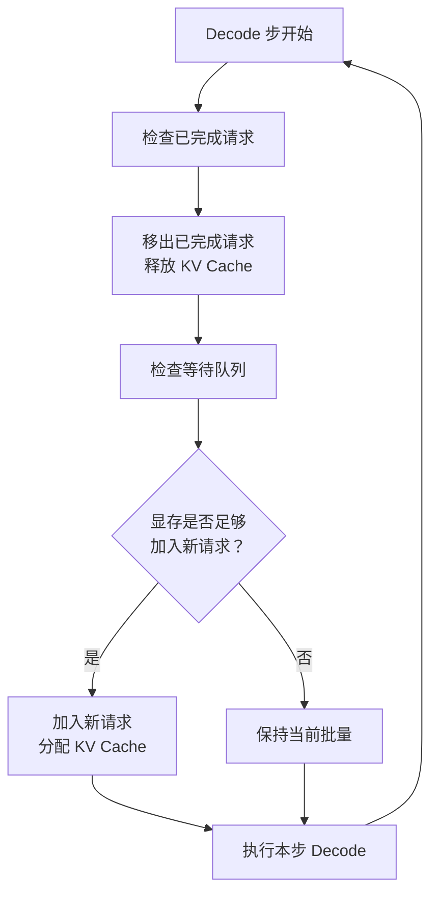

# 请求调度与批处理

## 核心问题

GPU 的计算能力远超单个 LLM 推理请求的需求，Decode 阶段的算力利用率常低于 5%。如何将多个请求高效地"打包"到同一次 GPU 计算中，是推理服务吞吐量的决定性因素。本文从批处理的基本原理出发，分析静态批处理与连续批处理的差异，深入讨论请求调度的策略设计、优先级机制、抢占与驱逐策略，以及前缀缓存等高级优化技术。

## 第一章：批处理的基本原理

### 1.1 为什么需要批处理

- GPU 的计算单元（CUDA Core、Tensor Core）是高度并行的，设计目标就是同时处理大量数据。单个 Decode 步的计算量（一个 token 的 Query 与所有 Key 做点积）远不足以填满 GPU 的计算单元
- 批处理的核心思想：将多个请求的同一 Decode 步的计算合并为一次矩阵运算，让 GPU 的并行计算能力被充分利用
- 批处理的加速原理：矩阵乘法 $(B \times d) \times (d \times n)$ 的计算量与批量大小 $B$ 线性增长，但 GPU 执行时间增长远慢于线性（因为计算单元被更充分利用），这就是批处理的"超线性加速"效应

### 1.2 批处理的收益与代价

- 收益：吞吐量随批量大小近似线性增长（在显存不成为瓶颈的范围内）。从批量 1 到批量 32，吞吐量可能提升 20-30 倍
- 代价：每个请求的延迟随批量大小增加而增长（因为 GPU 每步需要处理更多请求的数据）。延迟增长通常是对数级或亚线性的，远慢于吞吐量的线性增长
- 批量大小的选择是一个延迟-吞吐量权衡问题。实时对话场景偏好小批量（低延迟），批量处理场景偏好大批量（高吞吐）

> **可视化建议**：
> - 曲线图：吞吐量和延迟随批量大小变化的曲线（展示超线性加速效应）
> - 对比图：无批处理 vs 批处理下 GPU 计算单元的利用率

```python runnable
# 模拟批处理对吞吐量和延迟的影响
import numpy as np

# 模拟参数：单步 Decode 时间基准
base_decode_time = 10  # ms，批量大小为 1 时的单步时间

batch_sizes = [1, 2, 4, 8, 16, 32, 64, 128]
throughputs = []
latencies = []

for bs in batch_sizes:
    # GPU 并行效率：批量越大，单步时间增长越慢（亚线性）
    # 模拟 GPU 计算时间 = base * (1 + alpha * log2(bs))
    step_time = base_decode_time * (1 + 0.3 * np.log2(bs))
    # 每个请求的延迟 = 单步时间（每步都要等所有请求算完）
    latency = step_time
    # 吞吐量 = 批量大小 / 单步时间 * 1000 (token/s)
    throughput = bs / step_time * 1000
    throughputs.append(throughput)
    latencies.append(latency)

print("批量大小 | 吞吐量(token/s) | 单步延迟(ms) | 加速比")
print("-" * 55)
for i, bs in enumerate(batch_sizes):
    speedup = throughputs[i] / throughputs[0]
    print(f"  {bs:>5}  |  {throughputs[i]:>10.0f}   |  {latencies[i]:>8.1f}    |  {speedup:>5.1f}x")
```

## 第二章：静态批处理与连续批处理

### 2.1 静态批处理的局限

- 静态批处理（Static Batching）是最简单的批处理方式：收集一批请求，同时开始 Prefill，然后同步 Decode 直到所有请求都生成完毕，再一起返回结果
- 致命缺陷：短请求被迫等待长请求。假设批量中有 9 个请求生成 50 token，1 个请求生成 500 token，前 9 个请求在生成完毕后只能空等，GPU 资源被浪费
- 静态批处理的"尾部膨胀"问题：批量的完成时间由最慢的请求决定，平均等待时间 = 最长请求时间 - 自身请求时间。当请求长度分布越不均匀，浪费越严重

### 2.2 连续批处理（Continuous Batching）

- 连续批处理（也称 Iteration-level Scheduling）的核心改进：不再等所有请求都完成才接收新请求，而是每个 Decode 步结束后，将已完成的请求移出批量，将等待中的新请求加入批量
- 连续批处理让 GPU 在每个 Decode 步都处理尽可能多的活跃请求，消除了静态批处理中的空等浪费
- 连续批处理的实现关键：iteration-level 的调度决策。每个 Decode 步开始前，调度器检查：哪些请求已经生成完毕（遇到 EOS）？哪些等待中的请求可以被加入？当前显存是否足够容纳新请求的 KV Cache？
- 框架实例：vLLM 的连续批处理实现。vLLM 在每个 Decode iteration 开始前执行调度，完成的请求释放 KV Cache，新请求在显存允许时被加入，实现"无间断"的批处理

### 2.3 连续批处理的调度开销

- 连续批处理在每个 Decode 步都需要执行调度逻辑，调度本身的耗时成为新的关注点。如果调度耗时 1ms，而单步 Decode 耗时 10ms，调度开销就占了 10%
- 优化策略：批量调度（每次调度处理多个请求的加入/移出，而非逐个处理）、预测性调度（根据历史统计预测请求完成时间，提前准备新请求的加入）
- 调度频率的权衡：每步都调度（最优资源利用但调度开销大）vs 每隔 N 步调度一次（调度开销小但资源利用次优）

> **可视化建议**：
> - 时序对比图：静态批处理 vs 连续批处理的时间线（展示连续批处理如何消除空等）
> - 流程图：连续批处理的 iteration-level 调度流程


*图：连续批处理的 iteration-level 调度流程*

## 第三章：请求调度策略

### 3.1 调度决策的输入与目标

- 调度器的输入：等待队列（排队的请求及其属性）、运行集合（正在处理的请求及其状态）、资源状态（各 GPU 的显存占用、KV Cache 使用率、算力利用率）
- 调度目标的三元组：延迟（最小化请求的排队时间 + 执行时间）、吞吐量（最大化单位时间的 token 产出）、公平性（避免某些请求被无限期推迟）
- 目标之间的冲突：严格按 FCFS（先来先服务）保证公平性但可能牺牲吞吐量（短请求被迫排在长请求后面），按 SRTF（最短剩余时间优先）优化吞吐量但可能导致长请求饥饿

### 3.2 先来先服务（FCFS）调度

- FCFS 是最简单也最公平的调度策略：按请求到达时间排序，先到先处理
- 优点：实现简单、天然公平、不会饥饿
- 缺点：不考虑请求的执行时间差异。一个长请求可能占据批量位置很久，阻塞后续短请求的执行
- FCFS 在 LLM 推理中的特殊考量：Prefill 阶段的长请求会暂时阻塞整个批量的 Decode（因为 Prefill 的计算量大，需要暂停 Decode 来腾出算力）

### 3.3 最短作业优先（SJF）与长度预测

- SJF 策略优先调度预期生成时间最短的请求，可以最小化平均等待时间
- LLM 推理中实现 SJF 的挑战：请求的生成长度在执行前不可知。需要预测机制
- 生成长度预测方法：基于历史统计（同一类请求的平均长度）、基于用户提示（提示中包含"简短回答"等信号）、基于模型自身预测（用小模型预测生成长度）
- 预测不准的代价：如果预测偏短，请求实际生成时间超过预期，会挤占后续请求的资源；如果预测偏长，请求被推迟到更晚执行，增加了不必要的等待

### 3.4 优先级调度与差异化服务

- 不同用户/场景的延迟要求不同。付费用户期望更低延迟，内部服务比外部 API 更需要稳定响应
- 优先级调度：为请求分配优先级，高优先级请求优先进入批处理。优先级可以基于用户等级、请求类型、SLA 约束等
- 优先级反转问题：低优先级请求已经占据 GPU（KV Cache 已分配），高优先级请求到达时无法立即获得资源。解决方案：抢占机制

### 3.5 多级反馈队列（MLFQ）

- MLFQ 结合了 FCFS 的公平性和 SJF 的效率：新请求进入最高优先级队列，如果执行时间超过该队列的时间片，降级到下一级队列
- MLFQ 在 LLM 推理中的适配：时间片不是 CPU 时间片，而是"已生成的 token 数"。生成少量 token 就完成的请求（短回答）在高优先级队列快速完成，生成大量 token 的请求（长回答）逐步降级
- MLFQ 的参数调优：队列级数、各级时间片大小、优先级提升策略（定期将所有请求提升到最高优先级，防止饥饿）

> **可视化建议**：
> - 对比图：FCFS vs SJF vs 优先级调度在不同负载下的延迟分布
> - 流程图：MLFQ 的请求流转过程

## 第四章：抢占与驱逐策略

### 4.1 为什么需要抢占

- 当 GPU 显存不足以同时容纳所有活跃请求的 KV Cache 时，必须做出选择：暂停某些请求以释放显存给更重要的请求使用
- 抢占（Preemption）vs 驱逐（Eviction）：抢占是暂停请求并保留其 KV Cache（稍后恢复），驱逐是直接丢弃请求的 KV Cache（需要重新计算）
- 抢占的触发条件：新请求到达但显存不足、高优先级请求需要立即执行、GPU 利用率过低需要重新组织批量

### 4.2 抢占策略

- **Swap 到 CPU 内存**：将被抢占请求的 KV Cache 从 GPU 显存拷贝到 CPU 内存，释放 GPU 显存。恢复时再从 CPU 拷贝回 GPU。优点是恢复速度快（PCIe 带宽约 50 GB/s），缺点是需要 CPU 内存空间
- **Recomputation**：直接丢弃被抢占请求的 KV Cache，恢复时重新执行 Prefill。优点是不需要额外的 CPU 内存，缺点是恢复成本高（Prefill 的计算量远大于 Swap 的拷贝量）
- 选择依据：被抢占请求的 KV Cache 大小与输入长度的比值。KV Cache 大而输入短时 Swap 更划算（拷贝成本 < 重计算成本），KV Cache 小而输入长时 Recomputation 更划算

### 4.3 vLLM 的抢占机制实例

- vLLM 实现了 Swap 和 Recomputation 两种抢占策略，调度器根据当前状态自动选择
- vLLM 的抢占触发逻辑：当新请求的 KV Cache 无法分配时，从最低优先级的请求开始抢占，直到释放足够的显存
- 抢占的性能影响：Swap 策略下被抢占请求的恢复延迟约 50-100ms（KV Cache 拷贝时间），Recomputation 策略下恢复延迟约 200-500ms（重新 Prefill 的时间）

> **可视化建议**：
> - 对比图：Swap vs Recomputation 的恢复延迟与资源消耗
> - 流程图：抢占决策流程

## 第五章：前缀缓存与请求复用

### 5.1 前缀缓存的基本思想

- 许多推理请求共享相同的前缀（如 system prompt、少样本示例）。传统方式下每个请求都为这些共享前缀独立计算并缓存 KV Cache，造成大量重复计算
- 前缀缓存（Prefix Caching）让共享前缀的 KV Cache 只计算一次，后续请求直接复用，跳过重复的 Prefill 计算
- 前缀缓存的收益：减少 Prefill 计算量（节省 GPU 算力）、减少 KV Cache 显存占用（节省显存）、降低 TTFT（首 token 延迟）

### 5.2 前缀匹配与哈希

- 前缀匹配的核心问题：如何快速判断新请求是否与已有请求共享前缀？逐 token 比较太慢
- 解决方案：对 token 序列计算滚动哈希（Rolling Hash），将哈希值作为 KV Cache Block 的索引。新请求到达时，计算其前缀的哈希值，在缓存中查找匹配
- 哈希冲突的处理：使用加密哈希（如 SHA-256 的截断版本）使冲突概率可忽略，或在哈希匹配后做一次 token 级别的验证

### 5.3 自动前缀检测

- 显式标记 vs 自动检测：显式标记要求调用方指定哪些部分是可缓存的 system prompt，自动检测则由服务端通过 LRU 或引用计数自动管理
- 自动前缀检测的挑战：如何确定前缀的边界？一个请求的"前缀"可能不是另一个请求的完整前缀（部分重叠）
- 框架实例：vLLM 的 Automatic Prefix Caching（APC），通过 Block 级别的引用计数实现自动前缀复用，无需调用方显式标记

### 5.4 多轮对话的 KV Cache 复用

- 多轮对话是前缀缓存最典型的应用场景。每一轮对话的输入都包含之前所有轮次的上下文，这些上下文的 KV Cache 可以直接复用
- 多轮对话的 KV Cache 增量计算：只对新增的 token 执行 Prefill，已有 token 的 KV Cache 直接复用。这将多轮对话的 Prefill 时间从 $O(n_{total})$ 降低到 $O(n_{new})$
- 实现挑战：对话轮次之间的 KV Cache 一致性保证。如果中间某轮的生成结果被修改（如用户编辑了之前的回复），后续轮次的 KV Cache 全部失效

> **可视化建议**：
> - 示意图：前缀缓存的工作原理（多个请求共享 system prompt 的 KV Cache）
> - 对比图：有/无前缀缓存时多轮对话的 Prefill 计算量

```python runnable
# 模拟前缀缓存对多轮对话 TTFT 的影响
import numpy as np

# 模拟参数
system_prompt_tokens = 500    # system prompt 长度
avg_user_msg_tokens = 50      # 每轮用户消息的平均长度
avg_assistant_msg_tokens = 200  # 每轮助手回复的平均长度
prefill_speed = 1000          # token/s，Prefill 处理速度

num_rounds = 8
ttft_without_cache = []
ttft_with_cache = []

for round_num in range(1, num_rounds + 1):
    # 无缓存：每轮都需要 Prefill 整个上下文
    total_context = system_prompt_tokens
    for r in range(round_num):
        total_context += avg_user_msg_tokens + avg_assistant_msg_tokens
    ttft_no = total_context / prefill_speed * 1000  # ms
    ttft_without_cache.append(ttft_no)

    # 有缓存：只需 Prefill 新增的用户消息
    new_tokens = avg_user_msg_tokens
    ttft_yes = new_tokens / prefill_speed * 1000  # ms
    ttft_with_cache.append(ttft_yes)

print("对话轮次 | 无缓存 TTFT(ms) | 有缓存 TTFT(ms) | 加速比")
print("-" * 55)
for i in range(num_rounds):
    speedup = ttft_without_cache[i] / ttft_with_cache[i]
    print(f"  第{i+1}轮  |  {ttft_without_cache[i]:>10.0f}    |  {ttft_with_cache[i]:>8.0f}     |  {speedup:>5.1f}x")
```

## 本章小结

- 批处理是提升 GPU 利用率和推理吞吐量的根本手段。连续批处理通过 iteration-level 的调度消除了静态批处理的空等浪费，是现代推理框架的标准配置
- 请求调度策略需要在延迟、吞吐量和公平性之间权衡。FCFS 最公平，SJF 最优平均延迟，优先级调度支持差异化服务，MLFQ 兼顾公平与效率
- 当显存不足以容纳所有活跃请求时，抢占与驱逐策略决定如何释放资源。Swap 到 CPU 内存和 Recomputation 是两种主要策略，选择依据是 KV Cache 大小与输入长度的比值
- 前缀缓存通过复用共享前缀的 KV Cache，减少重复 Prefill 计算，对多轮对话场景的 TTFT 优化尤为显著

## 练习题

1. 假设一个推理服务使用连续批处理，GPU 每步 Decode 时间为 15ms，调度开销为 0.5ms。如果调度频率从每步一次改为每 5 步一次，计算调度开销占比的变化，以及可能造成的资源浪费（以请求完成延迟增加的百分比估算）。

   <details>
   <summary>参考答案</summary>

   每步调度时，调度开销占比 = 0.5 / 15 ≈ 3.3%。每 5 步调度时，调度开销占比 = 0.5 / (15 × 5) ≈ 0.67%，开销降低了约 5 倍。

   但每 5 步才调度一次意味着已完成的请求最多要等 4 步（约 60ms）才能被移出批量，新请求最多要等 5 步（约 75ms）才能被加入批量。请求完成延迟增加约 60ms，相对于平均生成 500 token × 15ms = 7500ms 的总延迟，增加约 0.8%。对于延迟敏感的场景，这个增加可以接受；对于吞吐优先的场景，降低调度开销更有价值。

   </details>

2. 一个推理服务同时收到 10 个请求，其中 8 个预期生成 100 token，2 个预期生成 1000 token。分别计算静态批处理和连续批处理下，短请求的平均完成时间（假设单步 Decode 时间与批量大小无关，恒为 10ms）。

   <details>
   <summary>参考答案</summary>

   静态批处理：所有请求同时开始，同时结束（由最长的请求决定）。完成时间 = 1000 × 10ms = 10000ms。短请求的平均完成时间 = 10000ms（虽然实际只需 1000ms 就生成完了，但必须等长请求）。

   连续批处理：短请求在 100 × 10ms = 1000ms 时完成并移出批量。短请求的平均完成时间 = 1000ms。长请求在 1000 × 10ms = 10000ms 时完成。

   连续批处理下短请求的完成时间仅为静态批处理的 1/10，这正是连续批处理的核心优势。

   </details>

3. 设计一个支持三种优先级（高、中、低）的调度策略，要求：(1) 高优先级请求的 P99 延迟不超过 2 秒；(2) 低优先级请求不会饥饿（等待时间不超过 30 秒）；(3) 中优先级请求的延迟介于两者之间。请描述你的调度算法和抢占策略。

   <details>
   <summary>参考答案</summary>

   使用三级优先队列 + 抢占 + 饥饿防止机制：

   调度算法：(1) 每个 Decode 步从最高非空优先级队列中取请求加入批量；(2) 同一优先级内按 FCFS 排序；(3) 低优先级请求等待超过 15 秒时，临时提升为中优先级；中优先级请求等待超过 20 秒时，临时提升为高优先级。这保证了低优先级请求最多等待约 30 秒（15 秒原始等待 + 最多 15 秒中优先级等待）。

   抢占策略：(1) 高优先级请求到达时，如果显存不足，抢占低优先级请求的 KV Cache（Swap 到 CPU）；(2) 如果低优先级请求不足，抢占中优先级请求；(3) 被抢占的请求回到原优先级队列头部，等待重新调度。

   P99 延迟保证：高优先级请求几乎不被抢占，且优先进入批处理，在正常负载下 P99 延迟可以控制在 2 秒以内。极端情况下（大量高优先级请求同时到达），需要通过限流保护高优先级队列的 SLO。

   </details>
