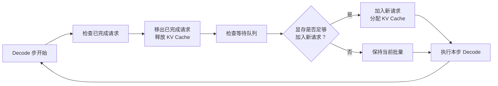

# 请求调度与批处理

在[推理效率优化](../../language-models/reasoning/inference-efficiency.md#推理瓶颈分析)中，我们了解到 PagedAttention 通过分页管理 KV Cache 缓解了显存墙，让更多请求得以同时驻留在 GPU 上。但请求增多后，新的问题随之而来：如何决定哪些请求先处理、哪些后处理？当显存不够时，该暂停哪个请求？多个请求共享同一段系统提示词时，如何避免重复计算？这些问题最终都归结为**批处理**（如何将多个请求打包到同一次 GPU 计算中）、**请求调度**（如何决定请求的处理顺序和资源分配）和**显存优化**（如何减少显存消耗、提高显存复用率）三个方面。

## 批处理原理

如果你有过 GPU 编程的经验，对单指令多线程（Single Instruction Multiple Threads，SIMT）、并行度这些概念一定不陌生。CUDA 编程模型中，GPU 将计算任务组织成线程块（Thread Block），每个线程块包含数百个线程，所有线程执行相同的指令但处理不同的数据。GPU 的计算单元（CUDA Core、Tensor Core）是高度并行的，设计目标就是同时处理大量数据。当线程数量足够多时，GPU 的计算单元才能被充分利用，性能接近峰值；当线程数量太少时，大量计算单元空闲，出现资源浪费，性能下降。

LLM 推理的 Decode 阶段正是后一种情况。每一步 Decode 只生成一个 token，计算规模约为 $(1 \times d) \times (d \times n)$ 的矩阵乘法，计算量正比于 $d \cdot n$，其中 $d$ 是隐藏维度。而 Prefill 阶段需要一次性处理全部 $n$ 个输入 token，计算规模是 $(n \times d) \times (d \times n)$ 的矩阵乘法，计算量正比于 $n^2 \cdot d$。两者相差 $n$ 倍，当序列长度达到数千乃至数万 token 时，每个 Decode 步的计算量相比于 Prefill 就显得微乎其微。

批处理是指将多个请求的同一步 Decode 计算合并为一次矩阵运算。具体来说，将 $b$ 个请求的 Query 向量拼接成一个 $b \times d$ 的矩阵，每个请求与各自 $d \times n$ 的 Key 矩阵独立进行注意力计算，GPU 的并行计算单元同时执行这些计算，等效于一次并行完成了 $b$ 个请求的注意力计算。这种合并之所以能带来显著的性能提升，根源在于矩阵乘法的计算特性。矩阵乘法 $(b \times d) \times (d \times n)$ 的计算量相对批量大小 $b$ 是线性增长，但 GPU 执行时间的增长远小于线性。原因是 GPU 的计算单元是并行的，当批量较小时，计算单元没有被填满，增加批量只是让更多计算单元参与工作，而不会增加单个计算单元的负担。只有当批量足够大、计算单元被完全占满后，进一步增加批量才会导致执行时间线性增长。这种计算量线性增长但执行时间亚线性增长的现象，就是批处理的**超线性加速效应**。下图模拟了批量大小从 1 增长到 128 过程中，吞吐量和延迟的变化趋势。

*图：批处理中吞吐量与延迟随批量大小变化的曲线*

从曲线图可以看到，批量从 1 增长到 32 时，吞吐量提升了约 20 倍，而单步延迟只增长了约 1.5 倍。这正体现了批处理的超线性加速效应。当批量继续增大到 64 和 128 时，吞吐量仍在增长，但增速放缓，因为 GPU 的计算单元已逐渐被填满，进一步增加批量开始让执行时间接近线性增长。这种收益与代价的不对称性，使得批处理成为推理服务优化的主要手段之一。但延迟的增长也不能完全忽视，每个请求的响应时间变长了可能会损害用户体验。批量大小的选择是延迟与吞吐量的权衡，实时对话场景偏好小批量以获得低延迟，批量处理场景（如文档翻译、数据标注）偏好大批量以获得高吞吐。推理服务的调度器需要根据场景需求，在两者之间找到合适的平衡点。

### 显存约束

实际上批处理大小往往不会真正把所有计算单元的填满，它的上限约束通常是显存容量。每增加一个请求到批量中，就需要为该请求分配其 KV Cache 所需的显存空间。在[推理效率优化](../../language-models/reasoning/inference-efficiency.md#推理瓶颈分析)中，我们已经推导过 KV Cache 的显存占用公式：

$$M_{\text{KV}} = 2 \times n_{\text{layer}} \times d_{\text{head}} \times n_{\text{head}} \times n_{\text{max}} \times b \times sizeof(\text{dtype})$$

所有层、所有 token、所有请求的 Key 和 Value 缓存加起来就是总显存占用。当批量大小 $b$ 增加时，KV Cache 的显存占用也线性增长。在[讲解 Transformer 架构演进](../../language-models/architecture-basics/architecture-evolution.md#kv-缓存优化)的时候我们曾以 LLaMA-2 70B 在 A100 80GB 上为例，计算过模型权重和可用的 KV Cache，单个请求的 KV Cache 约为 10 GB。这意味着不使用 PagedAttention 的情况下，每张 GPU 仅能容纳 1 个请求的 KV Cache，批量大小根本提不上去。[PagedAttention](../../language-models/reasoning/inference-efficiency.md#pagedattention) 通过分页管理 KV Cache，将显存利用率从约 41% 提升到接近 100%，使得每张 GPU 可以同时处理数十个请求。但即便如此，显存仍然是批处理的上限约束，当所有请求的 KV Cache 占满可用显存时，新的请求只能排队等待。

现在，批处理的设计方向就很明确了：在显存允许的范围内，尽可能增加批量大小以提升吞吐量。当显存不足时，通过调度策略决定哪些请求优先处理，通过缓存复用减少显存消耗，通过抢占机制释放显存给更重要的请求。这些正是后续章节要讨论的主题。

### 静态批处理

批处理最直观的方式是**静态批处理**（Static Batching），收集一批请求，同时开始 Prefill，然后同步 Decode 直到所有请求都生成完毕，再一起返回结果。这种方式实现简单，逻辑清晰，就像一辆长途客车，等所有乘客都上车后才发车，到达终点站后所有乘客一起下车。

静态批处理的缺陷在于"一起下车"这个阶段。LLM 推理中，不同请求的生成长度差异极大。一个问"1+1 等于几"的请求可能只需生成 5 个 token，而一个问"详细解释量子力学基本原理"的请求可能生成 2000 个 token。在静态批处理中，短请求生成完毕后不能立即返回结果，必须等待批量中最长的请求也生成完毕。假设批量中有 9 个请求生成 50 tokens，1 个请求生成 500 tokens，前 9 个请求在生成完毕后只能空等，GPU 资源被白白浪费。这种现象被称为**尾部膨胀**（Tail Padding）。请求长度分布越不均匀，尾部膨胀越严重。在真实的对话场景中，请求长度分布却往往就呈现长尾特征，少数超长请求严重拖累了整体效率。

### 连续批处理

2022 年，韩国科学技术院（KAIST）的学者金圭澯（Gyuwan Kim）与李英旭（Young-Hoon Kim）在论文《Orca: A Distributed Serving System for Transformer-Based Generative Models》中提出了连续批处理（Continuous Batching，也称 Iteration-level Scheduling），从根本上解决了静态批处理的尾部膨胀问题。连续批处理的调度粒度从整个请求的生命周期细化到了单个 Decode 步（Iteration-level 指的就是单个 Decode 步），不再等所有请求都完成才接收新请求，而是每个 Decode 步结束后，将已完成的请求移出批量，将等待中的新请求加入批量。

连续批处理让 GPU 在每个 Decode 步都处理尽可能多的活跃请求，消除了静态批处理中的空等浪费。回到长途客车的类比，连续批处理更像是一条公交线路，乘客可以随时上车，到站就下车，不需要等其他人。车上始终坐满了乘客，运力被充分利用。连续批处理的实现关键在于 Iteration-level 的调度决策。每个 Decode 步开始前，调度器需要检查哪些请求已经生成完毕、哪些等待中的请求可以被加入、当前显存是否足够容纳新请求的 KV Cache。这三项检查构成了连续批处理的调度循环，如下图所示。

*图：连续批处理的 iteration-level 调度流程*

vLLM 是实现连续批处理的代表性框架。vLLM 在每个 Decode 步开始前执行调度，完成的请求释放 KV Cache（通过 PagedAttention 的 Block 分配器回收 Block），新请求在显存允许时被加入，实现无间断的批处理。vLLM 的实验数据显示，在 ShareGPT 数据集上，连续批处理相比静态批处理的吞吐量提升可达 2-4 倍，且延迟更低，如下图所示。

*图：静态批处理与连续批处理的时序对比*

连续批处理并非没有代价，它每个 Decode 步都需要执行调度逻辑，成百上千倍地提升了调度的频率，因此调度本身的耗时成为新的关注点。如果调度耗时 1ms，而单步 Decode 耗时 10ms，调度开销就占了 10%。在批量较小、Decode 步较快时，这个比例会更加显著。工程上有两个主要方向降低优化调度开销。第一个方向是**批量调度**（Batch Scheduling），每次调度处理多个请求的加入和移出，而非逐个处理。这类似于操作系统中批量处理中断的设计思路，将多次小操作合并为一次大操作，摊薄固定开销。第二个方向是**预测性调度**（Predictive Scheduling），根据历史统计预测请求的完成时间，提前准备新请求的加入。如果调度器预知某个请求将在 3 步后完成，就可以提前将该请求的 KV Cache 标记为即将释放，并预先从等待队列中选好接替的请求。

无论采用何种优化手段，调度成本不会完全消失，所以调度频率本身就是一个工程决策。每步都调度固然可以获得最优的资源利用，但调度开销最大；每隔 N 步调度一次是可以降低调度开销，但已完成的请求最多要等 N-1 步才能被移出批量，新请求最多要等 N 步才能被加入，造成了资源利用率下降。在实际系统中，vLLM 默认采用每步调度的策略，因为 PagedAttention 带来的显存效率提升使得调度开销在整体延迟中的占比相对较小。

## 请求调度

连续批处理解决了何时加入和移出请求的问题，但并没有回答"选择哪个请求加入"的问题。当等待队列中有多个请求，而批量中只有一个空位时，调度器必须做出选择。这种选择在传统 Web 服务中很容易，在 LLM 推理中却变得格外棘手。原因在于 Prefill 和 Decode 两种计算特征的冲突。前面章节曾多次提到，Prefill 阶段处理输入 Prompt 的所有 token，计算量大，属于计算密集型操作。Decode 阶段每步只生成一个 token，计算量小，属于访存密集型操作。但它们又必须逻辑上绑定在一起，当调度器决定将某个新请求加入批量时，一定得先执行该请求的 Prefill，生成初始 KV Cache，然后才能开始 Decode。一个包含 2000 tokens 输入的请求，其 Prefill 可能需要数百毫秒甚至数秒，在此期间，批量中其他正在 Decode 的请求需要等待，会显著增加现有请求的延迟。

这种冲突在传统服务的 CPU 调度中并不存在，因为 CPU 的时间片切换代价极低（微秒级），而 LLM 推理中 Prefill 暂停 Decode 的代价是前者的成千上万倍（毫秒到秒级）。因此，LLM 推理的调度策略不能简单照搬操作系统中的算法，而必须考虑 Prefill 与 Decode 的计算特征差异。调度器的输入包括等待队列（排队的请求及其属性）、运行集合（正在处理的请求及其状态）和资源状态（各 GPU 的显存占用、KV Cache 使用率），调度目标则是在延迟（最小化请求的排队时间与执行时间）、吞吐量（最大化单位时间的 token 产出）和公平性（避免某些请求被无限期推迟）三者之间寻找平衡，通常有如下几种策略：

- **先来先服务**（First Come First Served，FCFS）策略是按请求到达时间排序，先到先处理。就像超市收银台前的排队，谁先来谁先结账，不允许任何插队行为。FCFS 的优点是天然公平，不会出现饥饿（某个请求被无限期推迟）的情况。缺点是完全不考虑请求的执行时间差异。在 LLM 推理中，一个长输入的请求执行 Prefill 时会暂时阻塞整个批量的 Decode，后续的短请求被迫等待。假设批量中有 10 个请求正在 Decode，调度器按 FCFS 选择了一个输入长度为 2000 tokens 的新请求加入批量。这个新请求的 Prefill 需要约 500ms，在此期间，10 个正在 Decode 的请求全部暂停，每个请求的延迟增加了 500ms。如果这些请求属于延迟敏感的实时对话用户，这种暂停会造成可感知的体验下降。

- **最短作业优先**（Shortest Job First，SJF）策略优先调度预期生成时间最短的请求，可以最小化平均等待时间。想象超市收银台允许少量商品优先结账，买一瓶水的顾客不用等买满一车货物的人，整体等待时间就会缩短。SJF 在理论上是最优的（在已知所有作业长度的前提下，它给出了最小的平均完成时间），但在 LLM 推理中，请求的生成长度在执行前不可知。用户问长度一样的问题，模型可能生成 50 个 token，也可能生成 2000 个 token 的回复，这在请求到达时完全无法确定。为了实现 SJF，推理服务需要引入生成长度预测机制。要么是基于历史统计，将同一类请求（如同一 API 端点、同一用户群体）的平均生成长度作为预测值，要么是基于用户提示中的信号，如提示中包含"简短回答"则预测较短，包含"详细解释"则预测较长。相对准确的是用一个轻量级的小模型预测生成长度，这种方法准确度最高，但增加了系统复杂度，也增加了调度延迟。

- **优先级调度**（Priority Scheduling）策略为请求分配优先级，高优先级请求优先进入批处理。优先级可以基于用户等级、请求类型、SLA 约束等多种因素。FCFS 和 SJF 都假设所有请求的重要性相同，但现实并非如此。付费用户期望更低延迟，内部服务比外部 API 更需要稳定响应，实时对话比批量处理的延迟容忍度更低。操作系统中也存在优先级调度的做法，但在推理服务场景中，它更为复杂，还面临优先级反转（Priority Inversion）的问题。如果低优先级请求已经占据 GPU（KV Cache 已分配），高优先级请求到达时无法立即获得资源，就需要暂停低优先级请求、释放其资源给高优先级请求使用。资源抢占的具体策略将在[抢占与驱逐策略](#抢占与驱逐策略)中详细讨论。

**多级反馈队列**（Multi-Level Feedback Queue，MLFQ）结合了 FCFS 的公平、SJF 的效率、优先级调度的分级处理，是调度策略中经典的折中方案。其思路是新请求进入最高优先级队列，如果执行时间超过该队列的时间片，降级到下一级队列。这样短请求在高优先级队列快速完成，长请求逐步降级到低优先级队列，不会长时间占据高优先级资源。传统操作系统调度中的时间片（Time Slice）是 CPU 时间，而 LLM 推理中更自然的度量是已生成的 token 数量。生成少量 token 就完成的请求（如简短回答）在高优先级队列快速完成，生成大量 token 的请求（如长文生成）逐步降级。这种适配使得 MLFQ 能够自动识别短请求和长请求，无需依赖生成长度预测。

MLFQ 需要考虑队列级数、各级时间片大小和优先级提升策略。队列级数决定了请求被分成的层次，通常 3-5 级即可。时间片大小需要根据请求长度的分布来设定，使得大部分短请求在最高优先级队列就能完成。优先级提升策略（定期将所有请求提升到最高优先级）用于防止饥饿，确保低优先级请求不会无限期等待。在 LLM 推理中，优先级提升的间隔通常设为数十秒，与请求的平均生命周期相匹配。

## 前缀缓存

许多推理请求共享相同的前缀，最典型的例子是[系统提示词](../../language-models/pretraining/supervised-finetuning.md#系统提示词设计)。一个对话服务可能为所有请求使用相同的系统提示词（如"你是一个有用的助手，请用中文回答"），一个编程应用的所有请求需要带有统一的工具信息、项目的全局约束，等等。这些提示词可能有数十或数百个 token。如果不做优化，每个请求都为这些相同的前缀独立计算并缓存 KV Cache，会造成大量重复计算和显存浪费。

**前缀缓存**（Prefix Caching）让相同前缀的 KV Cache 只计算一次，后续请求直接复用，对减少 Prefill 计算量（节省 GPU 算力）、减少 KV Cache 显存占用（节省显存）、降低首 token 延迟 TTFT（因为跳过了共享前缀的 Prefill）都有重要的意义。PagedAttention 的 Block 机制为前缀缓存提供了天然的实现基础。在[推理效率优化](../../language-models/reasoning/inference-efficiency.md#pagedattention)中，我们了解到 PagedAttention 将 KV Cache 划分为固定大小的 Block，通过 Block 表映射逻辑地址到物理地址。前缀缓存只需要让共享前缀的请求指向同一组物理 Block，新增请求只分配新 token 所需的 Block，无需为前缀分配 Block。PagedAttention 的 Copy-on-Write 机制也为前缀缓存提供了安全保障。虽然 KV Cache 是只追加的，不会修改已有内容，Copy-on-Write 在前缀缓存中实际上一般不会被触发，但该机制确保了即使出现写入需求，共享 Block 也不会被破坏。

与其他缓存不同，前缀缓存的对象通常不是由调用方指定的，尽管确实可以这样做，但显然这会增加调用方的负担，且无法处理调用方未标记但实际可复用的前缀。实践中一般采用**自动前缀检测**（Automatic Prefix Caching，APC）算法来确定可缓存的前缀，由服务端自动管理，不需要显式标记。vLLM 的 APC 实现是通过 Block 级别的引用计数来管理前缀复用。每个物理 Block 维护一个引用计数，记录有多少个请求正在使用该 Block。当新请求的前缀 Block 哈希值与已有 Block 匹配时，直接复用该 Block 并增加引用计数；当请求完成时，减少引用计数，引用计数为零的 Block 即被回收。当新的推理请求进入时，前缀缓存通过 Block 内容的哈希判断新请求是否可与已有请求共享前缀。具体而言，是对每个 Block 的 token 序列计算哈希值，将其作为 KV Cache Block 的索引。新请求到达时，计算其前缀各 Block 的哈希值，如果前 10 个 Block 的哈希值都匹配，说明这 160 个 token 的 KV Cache 可以直接复用（假设 Block 大小为 16 token），只需对第 11 个 Block 之后的 token 执行 Prefill。

多轮对话是前缀缓存最典型的应用场景。在对话系统中，每一轮对话的输入都包含之前所有轮次的上下文（用户消息和助手回复），这些上下文的 KV Cache 可以直接复用。没有前缀缓存时，第 $k$ 轮对话需要 Prefill 整个上下文（系统提示词 + 前 $k-1$ 轮对话 + 第 $k$ 轮用户消息），Prefill 时间与总上下文长度成正比。有前缀缓存时，只需 Prefill 新增的用户消息，已有 token 的 KV Cache 直接复用，Prefill 时间从 $O(n_{\text{total}})$ 降低到 $O(n_{\text{new}})$。

2026 年发布的 DeepSeek V4 是前缀缓存价值的有力证明。DeepSeek V4 面向百万 token 上下文设计，在 Agentic 工作负载（多轮工具调用、多步推理链）中测出了高达 98.7% 的 KV Cache 命中率（数据来自 DeepSeek 官方技术报告）。如此之高的命中率是由场景特征决定的。譬如编程场景中，每一轮调用只向已存有数万乃至数十万 token 的上下文中追加数百个 token，98% 以上的 KV Cache 可以跨轮次直接复用，无需重新计算。此外，DeepSeek V4 的 [CSA/HCA 混合注意力](../../language-models/architecture-basics/architecture-evolution.md#混合注意力架构)架构也为缓存复用提供了更精细的基础。DeepSeek V4 上下文的 KV Cache 体积相比 V3.2 显著减小，根据官方技术报告，V4-Pro 约为 V3.2 的 1/9.5，V4-Flash 约为 V3.2 的 1/13.7。缓存体积的压缩直接扩大了可复用前缀的容量，更多请求可以共享同一组物理 Block，进一步提高了缓存命中率。为了支持更大的并发，DeepSeek V4 还支持磁盘缓存（On-Disk KV Cache Storage）策略，允许 CSA/HCA 的压缩 KV Cache 直接存储到 SSD 中，新请求命中已存储前缀时直接读取并复用，仅对尾部不完整 Block 的未压缩状态执行重算。

缓存复用的经济效果直接体现在 API 定价上。DeepSeek V4 Flash 的 API 定价中，缓存命中输入（Cache-Hit）为 \$0.0028/1M tokens，缓存未命中输入（Cache-Miss）为 \$0.14/1M tokens，缓存命中时输入成本降低约 50 倍。这种定价结构充分说明了高缓存命中率不仅是一项技术指标，更是产品的商业竞争力。

现代生产中的推理服务几乎都依赖前缀缓存，这个设计决定了对话轮次之间的 KV Cache 应当具备前缀一致性保证。如果中间某轮的生成结果被修改，譬如编程场景中，用户编辑原本放在前缀缓存中的工具清单、全局提示词等信息（如 CLAUDE.md、AGENTS.md 这些文件），后续轮次的 KV Cache 将全部失效，必须重新 Prefill。这种一致性要求使得前缀缓存的管理比简单的 LRU 缓存更复杂，需要维护 Block 之间的依赖关系。也约束了 Agentic 工作负载的设计空间，应当尽可能保持前缀内容的稳定不变。

## 抢占与驱逐策略

前缀缓存通过复用共享前缀的 KV Cache 来减少显存需求，但在高负载场景下，即使有了前缀缓存，显存仍然可能不足以同时容纳所有活跃请求的 KV Cache。此时必须做出抉择，暂停某些请求以释放显存给更重要的请求使用。这就是**抢占**（Preemption）与**驱逐**（Eviction）策略要解决的问题。

新请求到达但显存不足、高优先级请求需要立即执行、GPU 利用率过低需要重新组织批量等情况都可能触发抢占与驱逐。抢占是将被抢占请求的 KV Cache 从 GPU 显存拷贝到 CPU 内存，释放 GPU 显存。恢复时再从 CPU 拷贝回 GPU。前面提到的 DeepSeek V4 的案例中甚至允许 Swep 到 SSD 磁盘上。这种策略的优点是恢复速度快，PCIe 带宽约 50 GB/s，一个 1 GB 的 KV Cache 拷贝约需 20ms。缺点是需要 CPU 内存空间，且拷贝过程中占用 PCIe 总线带宽，可能影响其他请求的数据传输。驱逐是直接丢弃被驱逐请求的 KV Cache，恢复时重新执行 Prefill。这种策略的优点是不需要额外的 CPU 内存，实现简单。缺点是恢复成本高，Prefill 的计算量远大于抢占策略中 Swap 操作的拷贝量。一个输入长度为 2000 tokens 的请求，Prefill 可能需要 500ms，而 Swap 同样大小的 KV Cache 只需约 20ms。

选择哪种策略取决于被抢占请求的 KV Cache 大小与输入长度的比值。KV Cache 大而输入短时，抢占更划算（拷贝成本低于重计算成本）；KV Cache 小而输入长时，直接驱逐更划算（重计算成本低于拷贝成本）。具体来说，设 KV Cache 大小为 $M_{\text{KV}}$，输入长度为 $n_{\text{input}}$，Prefill 速度为 $S_{\text{prefill}}$（token/s），PCIe 带宽为 $B_{\text{PCIe}}$（GB/s），则抢占的恢复时间为 $M_{\text{KV}} / B_{\text{PCIe}}$，驱逐的恢复时间为 $(n_{\text{input}} + n_{\text{generated}}) / S_{\text{prefill}}$。当 $M_{\text{KV}} / B_{\text{PCIe}} < n_{\text{input}} / S_{\text{prefill}}$ 时，抢占更优，反之驱逐更优。

[连续批处理](#连续批处理)的 Iteration-Level 调度为抢占驱逐策略提供了大量的执行点。每个 Decode 步结束后，调度器可以检查是否需要抢占或驱逐，而不会中断正在执行的 Decode 步。这种只在步间切换的设计，避免了抢占驱逐操作对正在进行的计算造成干扰。

## 本章小结

推理服务面对的不是单个请求的优化，而是海量并发请求如何共享有限 GPU 资源的系统工程问题。批处理利用矩阵运算的并行特性，让多个请求在同一次 GPU 计算中完成，以少量延迟代价换取数倍乃至数十倍的吞吐提升，这是推理服务走向高并发的起点。但静态批处理的尾部膨胀暴露了请求之间的异质性（生成长度不同、输入长度不同、优先级不同），这种异质性使得一视同仁的简单调度必然造成资源浪费。连续批处理通过迭代级调度让请求随时进出批量，从根本上消除了空等；前缀缓存通过复用共享前缀的 KV Cache，将重复计算转化为直接命中。这些技术共同构成了一套完整的资源管理框架，使得推理服务能够在延迟、吞吐和公平性之间找到与业务场景匹配的平衡点。

## 练习题

1. 假设一个推理服务使用连续批处理，GPU 每步 Decode 时间为 15ms，调度开销为 0.5ms。如果调度频率从每步一次改为每 5 步一次，计算调度开销占比的变化，以及可能造成的资源浪费（以请求完成延迟增加的百分比估算）。

   

   
参考答案

   每步调度时，调度开销占比 = 0.5 / 15 ≈ 3.3%。每 5 步调度时，调度开销占比 = 0.5 / (15 × 5) ≈ 0.67%，占比降低至约 1/5。

   但每 5 步才调度一次意味着已完成的请求最多要等 4 步（约 60ms）才能被移出批量，新请求最多要等 5 步（约 75ms）才能被加入批量。已完成请求最多多等 4 步（约 60ms）才能被返回，相对于平均生成 500 token × 15ms = 7500ms 的总延迟，增加约 0.8%。对于延迟敏感的场景，这个增加可以接受；对于吞吐优先的场景，降低调度开销更有价值。

   

2. 一个推理服务同时收到 10 个请求，其中 8 个预期生成 100 tokens，2 个预期生成 1000 tokens。分别计算静态批处理和连续批处理下，短请求的平均完成时间（假设单步 Decode 时间与批量大小无关，恒为 10ms）。

   

   
参考答案

   静态批处理：所有请求同时开始，同时结束（由最长的请求决定）。完成时间 = 1000 × 10ms = 10000ms。短请求的平均完成时间 = 10000ms（虽然实际只需 1000ms 就生成完毕，但必须等长请求）。

   连续批处理：短请求在 100 × 10ms = 1000ms 时完成并移出批量。短请求的平均完成时间 = 1000ms。长请求在 1000 × 10ms = 10000ms 时完成。

   连续批处理下短请求的完成时间仅为静态批处理的 1/10，这正是连续批处理的核心优势。

   
