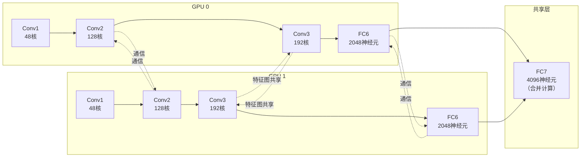

# AlexNet 与 CNN 复兴

2012 年 AlexNet 出现之前，CNN 虽然具有自动学习卷积核的先进理念，但在工业界缺乏有说服力的应用案例，在计算机视觉领域的影响力并不如传统手工设计的特征提取方法，如 [SIFT](https://en.wikipedia.org/wiki/Scale-invariant_feature_transform)、[HOG](https://en.wikipedia.org/wiki/Histogram_of_oriented_gradients)等。

2012 年 AlexNet 在 ImageNet 大规模视觉识别挑战赛（ILSVRC）中的突破性胜利，不仅证明了深度卷积神经网络在大规模图像识别任务上的卓越能力，也标志着深度学习时代的正式开启。本章将回顾这一历史性的时刻，深入分析 AlexNet 的架构设计，以及它如何将前面学习的深度学习相关概念（ReLU、Dropout、GPU 训练）整合为一个成功的系统。

## ImageNet 挑战赛

在计算机视觉的发展历程中，数据集始终扮演着重要的角色。早期的研究者面临着这样一个困境，算法越来越复杂，但验证算法效果的数据集却相当有限。[MNIST](https://en.wikipedia.org/wiki/MNIST_database) 手写数字数据集只有 7 万张图片、10 个类别，[CIFAR-10](https://en.wikipedia.org/wiki/CIFAR-10) 也仅有 6 万张图片。这些数据集足够用来验证基础算法，但对于让机器真正理解图像内容这一宏大目标而言，它们显然太渺小了。

ImageNet 的诞生首次改变了这一局面。2009 年，美籍华裔计算机科学家李飞飞（Fei-Fei Li）教授带领斯坦福大学团队，发表了一篇论文《ImageNet: A Large-Scale Hierarchical Image Database》，提出了构建世界最大图像数据库的构想。李飞飞团队当时的动机非常朴素：没有足够大的数据集，就无法训练出足够强大的模型，也就无法验证计算机视觉算法的真实能力。今天没有任何人会任何人会挑战这种想法，但在当时颇具争议，许多人认为收集如此海量的图像数据是不可能完成的任务，但李飞飞坚信大数据是推动计算机视觉突破的关键杠杆。

ImageNet 的发展历程本身就是一段跨越十五年的学术马拉松。从 2007 年开始，李飞飞团队借助亚马逊众包平台 Amazon Mechanical Turk，动员全球数万名工作者进行图像标注。这一众包模式在当时是创新性的尝试，使得标注效率大幅提升。经过两年的艰苦工作，到 2009 年论文发表时，ImageNet 已包含超过 1400 万张标注图像，覆盖约 2.2 万个类别，它的规模是 MNIST 的 200 倍、CIFAR-10 的 230 倍。ImageNet 数据集不仅规模空前，更采用了 WordNet 的层级语义结构组织类别，使得"猫"的父类是"动物"，"跑车"的父类是"汽车"，形成了完整的语义知识图谱。

2010 年，ImageNet 发起了一项名为"大规模视觉识别挑战赛"（ImageNet Large Scale Visual Recognition Challenge，简称 ILSVRC）的模型竞赛。ILSVRC 使用 ImageNet 的子集作为比赛数据集，包含的训练集约 120 万张图像，验证集约 5 万张图像，测试集约 10 万张图像，模型要以这些数据为基础，完成约 1000 个类别的分类任务。

比赛启动后，ILSVRC 立刻成为衡量图像识别技术水平的标杆，吸引了全球顶尖研究团队参与。2010 年和 2011 年的冠军主要使用传统的机器学习方法，研究者们精心设计特征提取算法（如 SIFT、HOG、GIST），将这些手工特征输入线性分类器（如 SVM）进行分类。这种方法虽然有效，但却有两个根本性缺陷，一是特征设计需要大量专家经验，二是特征提取与分类器训练分离，做不到端到端优化。2010 年冠军 Top-5 错误率约 28%，2011 年约 26%，虽然有进步，但提升幅度相当有限。此时，传统方法的天花板已经显现。

2012 年，多伦多大学的亚历克斯·克里泽夫斯基（Alex Krizhevsky）、伊利亚·苏茨克维（Ilya Sutskever）和他们的导师、有着深度学习教父之称的杰弗里·辛顿（Geoffrey Hinton）提交了名为 [AlexNet](https://en.wikipedia.org/wiki/AlexNet) 的卷积神经网络参赛。辛顿团队在当时已深耕神经网络研究数十年，曾多次尝试将 CNN 应用于实际任务，却因计算能力和数据规模的限制而未能取得突破性成果。这一次，他们终于找到了让深度网络运作起来的正确方式。

AlexNet 的表现震惊了整个计算机视觉社区，Top-5 错误率从上一年的 26% 大幅降低至 15.3%，而第二名基于人工特征工程的方法错误率仍停留在约 26% 左右。冠亚军之间一下子拉开了整整 10 个百分点的差距，这在当时的 ILSVRC 竞赛，乃至是整个机器视觉领域都是前所未有的突破幅度。更令人瞩目的是，这是纯端到端学习方法首次在如此大规模的视觉任务上击败传统方法，证明了深度卷积神经网络在复杂图像理解任务上的碾压性优势。

AlexNet 的成功并非来自全新的数学理论，卷积操作早在 1989 年就由 LeCun 提出，ReLU 激活函数、Dropout 技术也都已有研究基础。真正的突破在于辛顿团队将这些已有技术整合为一个高效系统，并用足够大的数据（ImageNet）和足够强的算力（GPU）将其训练到收敛。这一胜利向学术界传递了一个明确信号：**大规模数据 + 深度网络 + GPU 计算 = 突破性性能**，持续至今的深度学习浪潮从此开启。

::: info 深度学习的历史故事
对人工智能领域的从业者来说，2012 年组队参加 ILSVRC 的这三人今天都可谓声名在外，各自有着非常传奇的经历。因主题原因，本文不再展开，如果对人工智能的发展历史与人物故事感兴趣的读者，欢迎阅读笔者的科普作品《[智慧的疆界](https://book.douban.com/subject/30379536/)》
:::

## AlexNet 架构设计

理解了 AlexNet 的历史背景后，接下来我们要深入分析它的架构设计。AlexNet 的架构虽然在当时堪称宏大，但放在今天看，其设计理念依然清晰可循。它继承了 LeNet-5 的经典范式（卷积 → 池化 → 全连接），但在深度、宽度、参数量上都进行了大幅扩展，更重要的是引入了多项关键技术来保证这个"庞然大物"能够成功训练。

### 网络结构

从架构演进的角度看，AlexNet 可以理解为 LeNet-5 的深度放大版，LeNet-5 只有 7 层（2 卷积 + 3 全连接，另由于池化层没有可学习的参数，一般不把它单独算作一层），参数量约 6 万，AlexNet 则设计有 8 层（5 卷积 + 3 全连接），参数量暴涨至约 6000 万，是 LeNet-5 的 1000 倍。这种规模的扩展不能靠简单堆叠，必须有精心设计的层次结构，每一层都有明确的职责。

AlexNet 的网络结构如下图所示，它接受 $224 \times 224 \times 3$ 的 RGB 图像输入，经过 5 个卷积层逐级提取特征，最后通过 3 个全连接层输出 1000 个类别的分类概率。

```nn-arch width=1000
name: AlexNet 网络架构（5 卷积层 + 3 全连接层）
layout: horizontal

sections:
  - name: 特征提取器（Feature Extractor）
    layers: [Input, Conv1, Pool1, Conv2, Pool2, Conv3, Conv4, Conv5, Pool5]
    row_label: "Flatten: 9216"
  - name: 分类器（Classifier）
    layers: [FC1, FC2, FC3, Output]

layers:
  - {name: Input, type: input, size: "224 x 224 x 3"}
  - {name: Conv1, type: conv, kernel: 11, stride: 4, channels: 96, out: "55 x 55 x 96", act: ReLU}
  - {name: Pool1, type: pool, kernel: 3, stride: 2, out: "27 x 27 x 96"}
  - {name: Conv2, type: conv, kernel: 5, stride: 1, channels: 256, out: "27 x 27 x 256", act: ReLU}
  - {name: Pool2, type: pool, kernel: 3, stride: 2, out: "13 x 13 x 256"}
  - {name: Conv3, type: conv, kernel: 3, stride: 1, channels: 384, out: "13 x 13 x 384", act: ReLU}
  - {name: Conv4, type: conv, kernel: 3, stride: 1, channels: 384, out: "13 x 13 x 384", act: ReLU}
  - {name: Conv5, type: conv, kernel: 3, stride: 1, channels: 256, out: "13 x 13 x 256", act: ReLU}
  - {name: Pool5, type: pool, kernel: 3, stride: 2, out: "6 x 6 x 256"}
  - {name: FC1, type: fc, size: 4096, act: ReLU, dropout: true}
  - {name: FC2, type: fc, size: 4096, act: ReLU, dropout: true}
  - {name: FC3, type: fc, size: 1000}
  - {name: Output, type: output, size: 1000, act: Softmax}
```
*图：AlexNet 网络架构图*

从架构图中可以清晰看到 AlexNet 的设计逻辑：前两层使用较大的卷积核（$11 \times 11$ 和 $5 \times 5$）和较大的步长（首层步长 $4$）快速降低空间分辨率，提取粗粒度特征；后三层使用 $3 \times 3$ 小卷积核精细处理，保持空间尺寸不变但逐级增加通道数。这种由粗到精的特征提取策略后来成为被许多 CNN 模仿的设计范式，使得网络能够同时捕获全局结构和局部细节。下面我们对照架构图逐层来分析作者的设计意图，并通过计算验证各层的空间变换是否符合预期。

- **Conv1：快速降维与大视野捕获**。输入 $224 \times 224 \times 3$，卷积核 $11 \times 11$，步长 4，无填充。注意，计算中的 $227$ 不是笔误，AlexNet 原始论文中实际通过额外填充实现 $227 \times 227$ 输入，我们按论文标准计算：

    $$\text{卷积输出} = \lfloor \frac{227 + 0 - 11}{4} \rfloor + 1 = 55$$

    池化窗口 $3 \times 3$，步长 2：

    $$\text{池化输出} = \lfloor \frac{55 - 3}{2} \rfloor + 1 = 27$$

    Conv1 经过[卷积](./cnn-basics.md#卷积原理)、[ReLU 激活](../../deep-learning/neural-network-structure/activation-loss-functions.md#relu-及其变体)、[池化](./cnn-basics.md#池化操作)、[局部响应归一化（LRN）](../neural-network-stability/batch-normalization.md#局限与变体)后，输出为 $27 \times 27 \times 96$。这一层的设计目的是使用超大卷积核 $11 \times 11$ 配合大步长 $4$ 快速压缩空间分辨率，从 $227 \times 227$ 直接降至 $55 \times 55$，压缩比达 4 倍以上。这种暴力降维有两层考量：

    1. **计算效率优先**：当年的 GPU 算力有限（用的是两片 3GB 显存的 GTX 580），大卷积核 + 大步长能快速减少后续层的计算量。后续层处理的特征图只有第一层输出的 $\frac{1}{16}$ 大小，大幅节省显存和计算时间。

    2. **大视野捕获全局信息**：$11 \times 11$ 的卷积核和 $4$ 的步长在输入图像上覆盖的区域相当于 $11 \times 4 = 44$ 像素，能同时捕获较大的局部结构。这对识别物体的大致轮廓、颜色分布等低级特征很有帮助，第一层不需要精细的纹理，只需要知道"这里有一条长边缘"、"这里是一片红色区域"诸如此类的信息。

    输出通道数设为 96 则是特征与容量的权衡，太少会丢失信息，太多会增加计算负担。AlexNet 选择 96 作为起点，在硬件可负担的前提下，为后续层提供足够丰富的特征基础。

- **Conv2：精细提取与空间保持**。输入 $27 \times 27 \times 96$，卷积核 $5 \times 5$，填充 2，步长 1：

    $$\text{卷积输出} = \lfloor \frac{27 + 4 - 5}{1} \rfloor + 1 = 27$$

    填充 2 像素使得输入边界扩展，配合步长 1，卷积后空间尺寸保持不变。池化 $3 \times 3$，步长 2：

    $$\text{池化输出} = \lfloor \frac{27 - 3}{2} \rfloor + 1 = 13$$

    Conv2 输出尺寸为 $13 \times 13 \times 256$，这一层将卷积核缩小为 $5 \times 5$，步长降为 1，并引入填充 $2$ 保持空间尺寸，这一设计反映了特征提取的层次递进：

    1. **从粗到精的策略切换**：Conv1 完成了粗粒度的空间压缩，Conv2 开始精细处理。步长 $s=1$ 加上填充 $p=2$ 的组合让每个输出像素都对应输入的一个 $5 \times 5$ 邻域，不会跳过任何位置。这确保了第一层捕获的低级特征（边缘、颜色块）能被充分组合和精细化。

    2. **保持尺寸的设计技巧**：当卷积核 $k=5$、填充 $p=2$、步长 $s=1$ 时，输出尺寸恰好等于输入尺寸（$\lfloor \frac{n + 4 - 5}{1} \rfloor + 1 = n$）。这种[等保填充](cnn-basics.md#尺寸设计)（Same Padding）技巧在 CNN 设计中广泛使用，它让网络设计者可以专注于调整通道数（特征维度）而不必担心空间维度发生变化。

    3. **通道数翻倍**：Conv2 的输出通道从 96 增至 256，意味着网络开始学习更丰富的特征组合。每个通道代表一种特定的特征模式，通道数增加即特征表达能力增强。256 个通道足以编码各种边缘组合、简单形状、纹理模式等中级特征。池化层继续压缩空间（$27 \to 13$），但保留 256 个特征通道。这种空间压缩、特征膨胀的模式贯穿整个 AlexNet 的卷积部分。

- **Conv3-5：深层特征提炼与设计权衡**。这三层使用统一的配置（卷积核 $3 \times 3$，填充 1，步长 1）。根据公式：

    $$\text{卷积输出} = \lfloor \frac{13 + 2 - 3}{1} \rfloor + 1 = 13$$

    这种配置是 CNN 设计的经典技巧：当卷积核 $k=3$、填充 $p=1$、步长 $s=1$ 时，输入尺寸与输出尺寸相等。Conv3、Conv4 不跟池化层，保持 $13 \times 13$；Conv5 后接池化，输出 $6 \times 6 \times 256$。后三层的设计体现了"深度优于宽度"的早期探索，由此 AlexNet 被认为是深度学习开始实际应用的开端，这三层的深度设计体现在：

    1. **小卷积核的深层堆叠**：三层连续使用 $3 \times 3$ 小卷积核，不进行空间压缩。这看似浪费了三层网络的空间维度（$13 \times 13$ 保持不变），实则是**深度即能力**理念的体现，每增加一层，特征组合的表达能力就指数级增长。
    
        Conv3 输出的每个像素是 $3 \times 3 \times 256$ 区域的组合（768 个输入值）；Conv4 在 Conv3 基础上再组合，等效感受野扩大到 $5 \times 5$；Conv5 继续堆叠，等效感受野达 $7 \times 7$。三层 $3 \times 3$ 的堆叠等效于一个 $7 \times 7$ 大卷积核，但参数量更少（$3 \times 3^2 \times C^2$ 对比 $7^2 \times C^2$），且非线性激活更多（3 次 ReLU 对比 1 次），这种设计后来被 [VGGNet](vgg-inception.md) 发挥到了极致。

    2. **通道数的精心编排**：Conv3（从 256 到 384 通道）→ Conv4（保持 384 通道）→ Conv5（从 384 到 256 通道）。通道数先增后减，形成瓶头（Bottleneck，就是指啤酒瓶头那种样子）结构，先扩展特征空间，让网络有能力编码更复杂的模式组合（物体部件、空间关系），待特征提炼完成，重新压缩到更紧凑的表示，为进入全连接层做准备。这种"膨胀-收缩"的模式在后续网络（如 ResNet 的 Bottleneck Block）中成为标准设计模式。

    3. **池化层的延迟放置**：Conv3 和 Conv4 不带池化，只有 Conv5 后接池化。这保证了深层特征有足够的工作空间，过早池化会丢失空间细节，而 Conv3-4 需要在 $13 \times 13$ 的特征图上进行精细的特征组合，Conv5 完成提炼后才用池化压缩到 $6 \times 6$，为全连接层的分类任务准备好紧凑但信息丰富的表示。

- **全连接层：从特征到决策的映射**。Conv5 输出展平后得到 $6 \times 6 \times 256 = 9,216$ 维向量，依次通过 FC6（4,096）、FC7（4,096）、FC8（1,000），最终输出 1000 类概率分布。全连接层的设计反映了早期 CNN 的分类器思维：

    1. **信息整合的角色分工**：卷积层专注于局部特征提取，每个神经元只看一个局部区域。全连接层则让每个神经元都能看到全部 9216 维特征，实现全局信息整合。这种分工在逻辑上清晰，卷积层构建局部特征词典，全连接层组合词典条目形成分类决策。

    2. **参数量的分配策略**：全连接层占 AlexNet 参数量的 94%（约 5863 万），使用 Dropout 抑制过拟合风险。如此巨大的参数量分配在今天看来"头轻脚重"的粗糙设计，但在当年（2012 年），即使是辛顿这样神经网络的顶尖学者，也鲜有应对 ImageNet 这种 1000 个类别、类别间关系复杂（不同品种的狗、不同类型的车）的经验，因此需要大量参数来编码这些决策边界。后续网络（GoogLeNet、ResNet）用全局平均池化替代全连接层，参数量大幅下降。尽管后来的改进模型证明了 AlexNet 的 FC 层确实存在冗余，但当时这种大参数量 + Dropout 的组合仍是工程上成功的解决方案。

    3. **维度递减的决策路径**：9,216 → 4,096 → 4,096 → 1,000。两次 4,096 维的中间表示形成了"更宽的瓶头"：信息先被压缩到 4K 维抽象概念空间，再映射到 1K 维类别空间。这种两阶段设计让网络有机会学习更抽象的中间表示（如"四条腿动物"、"交通工具"等概念），再精细化到具体类别。

### 双 GPU 设计

在分析完网络结构后，另一个值得探讨的工程细节是 AlexNet 的双 GPU 设计。这不是纯粹的学术创新，而是当时硬件限制下的务实工程方案。2012 年的高端显卡 NVIDIA GTX 580 只有 3GB 显存，而 AlexNet 在训练过程中需要存储参数、梯度、激活值、优化器状态等多份数据，单卡显存捉襟见肘。辛顿团队因此将网络劈开成两部分，分别部署在两块 GPU 上并行计算。

具体而言，AlexNet 的卷积核被均匀分配到两块 GPU，Conv1-Conv2 的卷积核各取一半，Conv3-Conv5 则通过 GPU 间通信共享特征图。下图展示了双 GPU 设计的通信模式：


*图：双 GPU 设计的通信模式*

从图中可以看到，双 GPU 设计的难点在于通信时机，Conv1 和 Conv2 每块 GPU 独立处理一半卷积核，结果通过通信交换；Conv3-Conv5 两块 GPU 共享完整的特征图，数据需要跨卡拼接；FC6 每块 GPU 处理一半神经元，结果再次通信交换；FC7 将两块 GPU 的输出合并为 4096 维，统一计算后输出分类结果。

这种设计虽然巧妙，却也被迫大幅增加了代码复杂度和通信开销，是当年显存受限下的无奈之举。如果不是后面还有大语言模型的出现，现代实现中已不再需要这种方案，NVIDIA A100 显存达 80GB，华为的 950PR 显存更达 128 GB，哪怕是民用的 24GB RTX 5090显卡，也完全可以单卡容纳 AlexNet 的全部训练数据。使用现代深度学习框架的 AlexNet 实现已将所有卷积核合并，使用单 GPU 即可高效训练。本书后续的实验代码也将采用单 GPU 版本。

在设计 AlexNet 的年代，没有像 PyTorch 这样成熟的机器学习框架，也没有今天强大的 GPU 硬件系统，辛顿团队需要自行编写高效的 CUDA 卷积计算代码，并且自己在 GPU 内存管理上下了功夫。他们将诸多优化细节叠加在一起，使得 GPU 训练速度比纯 CPU 实现快了约 10 至 50 倍，尽管如此，一次训练仍然需要 5-6 天时间，但如果没有 GPU 加速，AlexNet 的训练时间将延长到数月，深度学习的可行性便无从谈起。

从 AlexNet 时代到今天的十余年，GPU 硬件和深度学习框架都发生了翻天覆地的变化。下表清晰地展现了这场硬件革命的几个关键维度：

| 对比维度 | AlexNet 时代 （2012） | 现代 （2025） |
|:------|:-------------------|:-------------|
| GPU 型号 | GTX 580 （3GB 显存） | A100/H100 （80GB 显存） |
| 显存带宽 | 152 GB/s | 2+ TB/s |
| 训练时间 | 5-6 天 （2 GPU） | 数十分钟 （1 GPU） |
| 开发方式 | 自写 CUDA 内核 | PyTorch / TensorFlow |
| 优化器 | SGD + Momentum | AdamW 等自适应优化器 |

显存数量和带宽的增长尤为令人鼓舞，从 152 GB/s 到 2 TB/s 以上，超过 10 倍的带宽提升意味着 GPU 核心不再需要等待数据从显存中慢慢加载，这是现代模型能够训练数百亿参数的关键基础。而在软件层面，PyTorch 等框架将卷积、池化、优化器等操作全部封装为几行 API 调用，开发者不再需要理解 GPU 共享内存和纹理内存这些硬件细节。今天使用 PyTorch 实现的 AlexNet 只需几十行代码即可完成定义，使用单 GPU 甚至可以在数十分钟内完成训练，这种效率提升不仅改变了研究者的工作方式，也深刻影响了网络架构的设计思路，当训练不再是瓶颈，研究者就能更大胆地尝试更深、更宽的网络结构。

## 本章小结

本章介绍了 AlexNet 这一深度学习里程碑式的模型，AlexNet 的成功引发了计算机视觉领域的范式转变：

1. **研究方向转变**：从手工特征（SIFT、HOG、BOW）转向深度特征学习。2012 年后，ILSVRC 的冠军全部使用 CNN 方法。
2. **工业界应用**：Google、Facebook、Microsoft 等公司迅速跟进，将深度学习应用于图像搜索、人脸识别、自动驾驶等场景。
3. **后续网络涌现**：VGGNet（2014）、GoogLeNet/Inception（2014）、ResNet（2015）等在 AlexNet 基础上持续改进，错误率从 15.3% 降至 3.6%（2017 年），最终超过了人类水平（人类错误率约 5.1%）。

AlexNet 的出现标志着深度学习在视觉领域的崛起，开启了 2012 年至今的深度学习浪潮。下一章将介绍 VGGNet 和 GoogLeNet，展示如何在 AlexNet 的基础上进一步改进网络设计，探索深度与宽度的最优平衡。

## 练习题

1. AlexNet 的 Conv3、Conv4、Conv5 三层都使用 $3 \times 3$ 卷积核，步长 $1$，填充 $1$，保持空间尺寸 $13 \times 13$ 不变。计算这三层堆叠后的等效感受野大小，并与单层 $7 \times 7$ 卷积核的参数量进行对比。
    <details>
    <summary>参考答案</summary>

    **感受野计算**：

    使用感受野递推公式 $R_l = R_{l-1} + (k_l - 1) \times \prod_{i=1}^{l-1} s_i$。

    Conv3-5 的输入来自 Pool2 输出（$13 \times 13 \times 256$），Pool2 之前已有：
    - Conv1: $k=11$, $s=4$ → 步长累积 $= 4$
    - Pool1: $k=3$, $s=2$ → 步长累积 $= 4 \times 2 = 8$
    - Conv2: $k=5$, $s=1$ → 步长累积 $= 8 \times 1 = 8$
    - Pool2: $k=3$, $s=2$ → 步长累积 $= 8 \times 2 = 16$

    从输入层逐层计算感受野：
    - 输入层：$R_0 = 1$
    - Conv1：$R_1 = 1 + (11-1) \times 1 = 11$，步长累积 $= 4$
    - Pool1：$R_2 = 11 + (3-1) \times 4 = 19$，步长累积 $= 8$
    - Conv2：$R_3 = 19 + (5-1) \times 8 = 51$，步长累积 $= 8$
    - Pool2：$R_4 = 51 + (3-1) \times 8 = 67$，步长累积 $= 16$
    - Conv3：$R_5 = 67 + (3-1) \times 16 = 99$，步长累积 $= 16$
    - Conv4：$R_6 = 99 + (3-1) \times 16 = 131$，步长累积 $= 16$
    - Conv5：$R_7 = 131 + (3-1) \times 16 = 163$

    Conv5 输出位置的感受野为 $163 \times 163$。

    **仅 Conv3-5 三层堆叠的等效感受野**：

    若只看这三层（假设每层感受野初始为 $3$），三层 $3 \times 3$ 堆叠的等效感受野为 $7 \times 7$：
    - 第一层 $3 \times 3$：感受野 $3$
    - 第二层 $3 \times 3$：感受野 $3 + 2 = 5$
    - 第三层 $3 \times 3$：感受野 $5 + 2 = 7$

    **参数量对比**：

    设输入通道数为 $C$，输出通道数相同：

    - **三层 $3 \times 3$ 卷积**：每层参数 $= C \times 3 \times 3 \times C + C = 9C^2 + C$
      $$\text{总参数} = 3 \times (9C^2) + 3C = 27C^2 + 3C$$

    - **单层 $7 \times 7$ 卷积**：
      $$\text{参数量} = C \times 7 \times 7 \times C + C = 49C^2 + C$$

    参数量对比：$\frac{27C^2}{49C^2} \approx 55\%$，三层小卷积核比单层大卷积核节省约 45% 参数。
    </details>

1. 解释 AlexNet 为何在 Conv1 使用 $11 \times 11$ 大卷积核和步长 $4$ 的设计，而现代 CNN（如 ResNet）通常首层仅使用 $7 \times 7$ 卷积核、步长 $2$。从计算效率和特征提取角度分析这一设计演变的原因。
    <details>
    <summary>参考答案</summary>

    **AlexNet 大卷积核设计的历史原因**：

    1. **计算效率优先**：2012 年的 GPU 算力有限（GTX 580 仅 3GB 显存），大卷积核配合大步长能快速压缩空间分辨率。AlexNet Conv1 将 $227 \times 227$ 直接降至 $55 \times 55$，压缩比达 4 倍以上，后续层处理的特征图只有第一层输出的约 $\frac{1}{16}$ 大小，大幅节省显存和计算时间。

    2. **大视野捕获全局信息**：$11 \times 11$ 卷积核配合步长 $4$，在输入图像上覆盖区域相当于 $11 \times 4 = 44$ 像素范围，能捕获较大的局部结构（物体轮廓、颜色分布等低级特征）。第一层不需要精细纹理，只需识别"长边缘"、"大片颜色区域"等粗粒度信息。

    3. **经验不足的探索性设计**：AlexNet 是首次在大规模图像任务上成功的深度网络，当时缺乏深层网络的设计经验。大卷积核是传统图像处理（如 SIFT、HOG）的常用做法，辛顿团队可能受此影响。

    **现代 CNN 小卷积核设计的演变原因**：

    1. **算力提升**：现代 GPU（A100/H100）显存达 80GB 以上，无需通过暴力降维节省计算资源。可以使用更精细的逐层降采样策略。

    2. **深度堆叠替代大卷积核**：研究发现多层小卷积核堆叠等效于单层大卷积核，但参数更少、非线性更强。例如三层 $3 \times 3$ 等效于一层 $7 \times 7$，参数量减少约 55%，且多两次 ReLU 激活，表达能力更强。

    3. **保留更多空间信息**：步长 $2$ 的降采样比步长 $4$ 更温和，保留了更多边缘细节。现代网络通常在前几层保持较高的空间分辨率，让后续层有更多"工作空间"进行精细特征组合。

    4. **感受野渐进式扩大**：ResNet 等现代网络通过多层小卷积核逐步扩大感受野，而非首层就建立超大感受野。这种渐进式设计符合"浅层提取低级特征、深层提取高级特征"的层级原则。

    **设计演变总结**：

    | 对比维度 | AlexNet (2012) | ResNet (2015+) |
    |:--|:--|:--|
    | 首层卷积核 | $11 \times 11$ | $7 \times 7$ |
    | 首层步长 | $4$ | $2$ |
    | 设计理念 | 暴力降维，快速压缩 | 精细处理，渐进降维 |
    | 算力背景 | GTX 580 (3GB) | A100 (80GB) |

    </details>