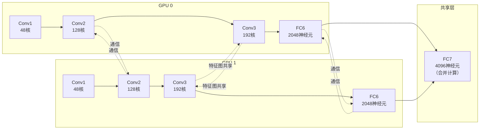

# AlexNet 与 CNN 复兴

2012 年 AlexNet 出现之前，CNN 虽然具有自动学习卷积核的先进理念，但在工业界缺乏有说服力的应用案例，在计算机视觉领域的影响力并不如传统手工设计的特征提取方法，如 [SIFT](https://en.wikipedia.org/wiki/Scale-invariant_feature_transform)、[HOG](https://en.wikipedia.org/wiki/Histogram_of_oriented_gradients)等。

2012 年 AlexNet 在 ImageNet 大规模视觉识别挑战赛（ILSVRC）中的突破性胜利，不仅证明了深度卷积神经网络在大规模图像识别任务上的卓越能力，也标志着深度学习时代的正式开启。本章将回顾这一历史性的时刻，深入分析 AlexNet 的架构设计，以及它如何将前面学习的深度学习相关概念（ReLU、Dropout、GPU 训练）整合为一个成功的系统。

## ImageNet 挑战赛

在计算机视觉的发展历程中，数据集始终扮演着重要的角色。早期的研究者面临着这样一个困境，算法越来越复杂，但验证算法效果的数据集却相当有限。[MNIST](https://en.wikipedia.org/wiki/MNIST_database) 手写数字数据集只有 7 万张图片、10 个类别，[CIFAR-10](https://en.wikipedia.org/wiki/CIFAR-10) 也仅有 6 万张图片。这些数据集足够用来验证基础算法，但对于让机器真正理解图像内容这一宏大目标而言，它们显然太渺小了。

ImageNet 的诞生首次改变了这一局面。2009 年，美籍华裔计算机科学家李飞飞（Fei-Fei Li）教授带领斯坦福大学团队，发表了一篇论文《ImageNet: A Large-Scale Hierarchical Image Database》，提出了构建世界最大图像数据库的构想。李飞飞团队当时的动机非常朴素：没有足够大的数据集，就无法训练出足够强大的模型，也就无法验证计算机视觉算法的真实能力。今天没有任何人会任何人会挑战这种想法，但在当时颇具争议，许多人认为收集如此海量的图像数据是不可能完成的任务，但李飞飞坚信大数据是推动计算机视觉突破的关键杠杆。

ImageNet 的发展历程本身就是一段跨越十五年的学术马拉松。从 2007 年开始，李飞飞团队借助亚马逊众包平台 Amazon Mechanical Turk，动员全球数万名工作者进行图像标注。这一众包模式在当时是创新性的尝试，使得标注效率大幅提升。经过两年的艰苦工作，到 2009 年论文发表时，ImageNet 已包含超过 1400 万张标注图像，覆盖约 2.2 万个类别，它的规模是 MNIST 的 200 倍、CIFAR-10 的 230 倍。ImageNet 数据集不仅规模空前，更采用了 WordNet 的层级语义结构组织类别，使得"猫"的父类是"动物"，"跑车"的父类是"汽车"，形成了完整的语义知识图谱。

2010 年，ImageNet 发起了一项名为"大规模视觉识别挑战赛"（ImageNet Large Scale Visual Recognition Challenge，简称 ILSVRC）的模型竞赛。ILSVRC 使用 ImageNet 的子集作为比赛数据集，包含的训练集约 120 万张图像，验证集约 5 万张图像，测试集约 10 万张图像，模型要以这些数据为基础，完成约 1000 个类别的分类任务。

比赛启动后，ILSVRC 立刻成为衡量图像识别技术水平的标杆，吸引了全球顶尖研究团队参与。2010 年和 2011 年的冠军主要使用传统的机器学习方法，研究者们精心设计特征提取算法（如 SIFT、HOG、GIST），将这些手工特征输入线性分类器（如 SVM）进行分类。这种方法虽然有效，但却有两个根本性缺陷，一是特征设计需要大量专家经验，二是特征提取与分类器训练分离，做不到端到端优化。2010 年冠军 Top-5 错误率约 28%，2011 年约 26%，虽然有进步，但提升幅度相当有限。此时，传统方法的天花板已经显现。

2012 年，多伦多大学的亚历克斯·克里泽夫斯基（Alex Krizhevsky）、伊利亚·苏茨克维（Ilya Sutskever）和他们的导师、有着深度学习教父之称的杰弗里·辛顿（Geoffrey Hinton）提交了名为 [AlexNet](https://en.wikipedia.org/wiki/AlexNet) 的卷积神经网络参赛。辛顿团队在当时已深耕神经网络研究数十年，曾多次尝试将 CNN 应用于实际任务，却因计算能力和数据规模的限制而未能取得突破性成果。这一次，他们终于找到了让深度网络跑起来的正确方式。

AlexNet 的表现震惊了整个计算机视觉社区，Top-5 错误率从上一年的 26% 大幅降低至 15.3%，而第二名基于人工特征工程的方法错误率仍停留在约 26% 左右。冠亚军之间一下子拉开了整整 10 个百分点的差距，这在当时的 ILSVRC 竞赛，乃至是整个机器视觉领域都是前所未有的突破幅度。更令人瞩目的是，这是纯端到端学习方法首次在如此大规模的视觉任务上击败传统方法，证明了深度卷积神经网络在复杂图像理解任务上的碾压性优势。

AlexNet 的成功并非来自全新的数学理论，卷积操作早在 1989 年就由 LeCun 提出，ReLU 激活函数、Dropout 技术也都已有研究基础。真正的突破在于辛顿团队将这些已有技术整合为一个高效系统，并用足够大的数据（ImageNet）和足够强的算力（GPU）将其训练到收敛。这一胜利向学术界传递了一个明确信号：**大规模数据 + 深度网络 + GPU 计算 = 突破性性能**，持续至今的深度学习浪潮从此开启。

::: info 深度学习的历史故事
对人工智能领域的从业者来说，2012 年组队参加 ILSVRC 的这三人今天都可谓声名在外，各自有着非常传奇的经历。因主题原因，本文不再展开，如果对人工智能的发展历史与人物故事感兴趣的读者，欢迎阅读笔者的科普作品《[智慧的疆界](https://book.douban.com/subject/30379536/)》
:::

## AlexNet 架构设计

理解了 AlexNet 的历史背景后，接下来我们要深入分析它的架构设计。AlexNet 的架构虽然在当时堪称宏大，但放在今天看，其设计理念依然清晰可循。它继承了 LeNet-5 的经典范式（卷积 → 池化 → 全连接），但在深度、宽度、参数量上都进行了大幅扩展，更重要的是引入了多项关键技术来保证这个"庞然大物"能够成功训练。

### 网络结构

从架构演进的角度看，AlexNet 可以理解为 LeNet-5 的深度放大版，LeNet-5 只有 7 层（2 卷积 + 3 全连接，另由于池化层没有可学习的参数，一般不把它单独算作一层），参数量约 6 万，AlexNet 则设计有 8 层（5 卷积 + 3 全连接），参数量暴涨至约 6000 万，是 LeNet-5 的 1000 倍。这种规模的扩展不能靠简单堆叠，必须有精心设计的层次结构，每一层都有明确的职责。

AlexNet 的网络结构如下图所示，它接受 $224 \times 224 \times 3$ 的 RGB 图像输入，经过 5 个卷积层逐级提取特征，最后通过 3 个全连接层输出 1000 个类别的分类概率。

```nn-arch width=1000
name: AlexNet 网络架构（5 卷积层 + 3 全连接层）
layout: horizontal

sections:
  - name: 特征提取器（Feature Extractor）
    layers: [Input, Conv1, Pool1, Conv2, Pool2, Conv3, Conv4, Conv5, Pool5]
    row_label: "Flatten: 9216"
  - name: 分类器（Classifier）
    layers: [FC1, FC2, FC3, Output]

layers:
  - {name: Input, type: input, size: "224 x 224 x 3"}
  - {name: Conv1, type: conv, kernel: 11, stride: 4, channels: 96, out: "55 x 55 x 96", act: ReLU}
  - {name: Pool1, type: pool, kernel: 3, stride: 2, out: "27 x 27 x 96"}
  - {name: Conv2, type: conv, kernel: 5, stride: 1, channels: 256, out: "27 x 27 x 256", act: ReLU}
  - {name: Pool2, type: pool, kernel: 3, stride: 2, out: "13 x 13 x 256"}
  - {name: Conv3, type: conv, kernel: 3, stride: 1, channels: 384, out: "13 x 13 x 384", act: ReLU}
  - {name: Conv4, type: conv, kernel: 3, stride: 1, channels: 384, out: "13 x 13 x 384", act: ReLU}
  - {name: Conv5, type: conv, kernel: 3, stride: 1, channels: 256, out: "13 x 13 x 256", act: ReLU}
  - {name: Pool5, type: pool, kernel: 3, stride: 2, out: "6x6x256"}
  - {name: FC1, type: fc, size: 4096, act: ReLU, dropout: true}
  - {name: FC2, type: fc, size: 4096, act: ReLU, dropout: true}
  - {name: FC3, type: fc, size: 1000}
  - {name: Output, type: output, size: 1000, act: Softmax}
```
*图：AlexNet 网络架构图*

从架构图中可以清晰看到 AlexNet 的设计逻辑：前两层使用较大的卷积核（$11 \times 11$ 和 $5 \times 5$）和较大的步长（$5$ 和 $2$）快速降低空间分辨率，提取粗粒度特征；后三层使用 $3 \times 3$ 小卷积核精细处理，保持空间尺寸不变但逐级增加通道数。这种由粗到精的特征提取策略后来成为许多 CNN 的设计范式，使得网络能够同时捕获全局结构和局部细节。

我们对照架构图逐层来计算输出尺寸，验证各层的空间变换是否符合预期。回顾[上一章](cnn-basics.md)中学习的卷积输出尺寸公式：

$$\text{输出尺寸} = \lfloor \frac{W + 2P - K}{S} \rfloor + 1$$

这个公式看着抽象，拆开来看含义很直观：$W$ 是输入宽度，$P$ 是填充像素数，$K$ 是卷积核尺寸，$S$ 是步长。公式本质是计算卷积核能"滑动"多少次——每滑动一次产生一个输出像素，所以输出尺寸等于滑动次数加 1。

**Conv1：快速降维与大视野捕获**。输入 $224 \times 224 \times 3$，卷积核 $11 \times 11$，步长 4，无填充。注意 AlexNet 原始论文中实际使用 $227 \times 227$ 输入（通过额外填充实现），我们按论文标准计算：

$$\text{卷积输出} = \lfloor \frac{227 + 0 - 11}{4} \rfloor + 1 = 55$$

池化窗口 $3 \times 3$，步长 2：

$$\text{池化输出} = \lfloor \frac{55 - 3}{2} \rfloor + 1 = 27$$

Conv1 经过卷积、ReLU 激活、池化、局部响应归一化（LRN）后，输出 $27 \times 27 \times 96$。

**设计意图解读**：第一层使用超大卷积核 $11 \times 11$ 配合大步长 4，目的是快速压缩空间分辨率——从 $227 \times 227$ 直接降至 $55 \times 55$，压缩比达 4 倍以上。这种"暴力降维"看似粗糙，实则有两层考量：

1. **计算效率优先**：当年的 GPU 算力有限（GTX 580），大卷积核 + 大步长能快速减少后续层的计算量。后续层处理的特征图只有第一层输出的 $\frac{1}{16}$ 大小，大幅节省显存和计算时间。

2. **大视野捕获全局信息**：$11 \times 11$ 的卷积核在输入图像上覆盖的区域相当于 $11 \times 4 = 44$ 像素（考虑步长），能同时捕获较大的局部结构。这对识别物体的大致轮廓、颜色分布等低级特征很有帮助——第一层不需要精细纹理，只需要知道"这里有一条长边缘"、"这里是一片红色区域"等信息。

通道数设为 96（双 GPU 各 48）则是容量权衡：太少会丢失信息，太多会增加计算负担。AlexNet 选择 96 作为起点，为后续层提供足够丰富的特征基础。

**Conv2：精细提取与空间保持**。输入 $27 \times 27 \times 96$，卷积核 $5 \times 5$，填充 2，步长 1：

$$\text{卷积输出} = \lfloor \frac{27 + 4 - 5}{1} \rfloor + 1 = 27$$

填充 2 像素使得输入边界扩展，配合步长 1，卷积后空间尺寸保持不变。池化 $3 \times 3$，步长 2：

$$\text{池化输出} = \lfloor \frac{27 - 3}{2} \rfloor + 1 = 13$$

Conv2 输出 $13 \times 13 \times 256$（经过 LRN）。

**设计意图解读**：第二层将卷积核缩小为 $5 \times 5$，步长降为 1，并引入填充（padding=2）保持空间尺寸。这一设计转变反映了特征提取的层次递进：

1. **从粗到精的策略切换**：Conv1 完成了粗粒度的空间压缩，Conv2 开始精细处理。步长 1 + 填充 2 的组合让每个输出像素都对应输入的一个 $5 \times 5$ 邻域，不会跳过任何位置。这确保了第一层捕获的低级特征（边缘、颜色块）能被充分组合和精细化。

2. **"保持尺寸"的设计技巧**：当卷积核 $K=5$、填充 $P=2$、步长 $S=1$ 时，输出尺寸恰好等于输入尺寸（$\lfloor \frac{W + 4 - 5}{1} \rfloor + 1 = W$）。这种"same padding"技巧在 CNN 设计中广泛使用，它让网络设计者可以专注于调整通道数（特征维度）而不必担心空间维度的意外变化。

3. **通道数翻倍**：Conv2 的输出通道从 96 增至 256，意味着网络开始学习更丰富的特征组合。每个通道代表一种特定的特征模式，通道数增加即特征表达能力增强。256 个通道足以编码各种边缘组合、简单形状、纹理模式等中级特征。

池化层继续压缩空间（$27 \to 13$），但保留 256 个特征通道。这种"空间压缩、特征膨胀"的模式贯穿整个 AlexNet 的卷积部分。

**Conv3-5：深层特征提炼与设计权衡**。这三层使用统一的配置——卷积核 $3 \times 3$，填充 1，步长 1。根据公式：

$$\text{卷积输出} = \lfloor \frac{13 + 2 - 3}{1} \rfloor + 1 = 13$$

这种配置是 CNN 设计的经典技巧：当卷积核 $K=3$、填充 $P=1$、步长 $S=1$ 时，输入输出尺寸相等。Conv3、Conv4 不跟池化层，保持 $13 \times 13$；Conv5 后接池化，输出 $6 \times 6 \times 256$。

**设计意图解读**：后三层的设计体现了"深度优于宽度"的早期探索：

1. **小卷积核的深层堆叠**：三层连续使用 $3 \times 3$ 小卷积核，不进行空间压缩。这看似"浪费"了三层网络的空间维度（$13 \times 13$ 保持不变），实则是深度学习核心理念的体现——**深度即能力**。每增加一层，特征组合的复杂度就指数级增长：

   - Conv3 输出的每个像素是 $3 \times 3 \times 256$ 区域的组合（768 个输入值）
   - Conv4 在 Conv3 基础上再组合，等效感受野扩大到 $5 \times 5$
   - Conv5 继续堆叠，等效感受野达 $7 \times 7$

   三层 $3 \times 3$ 的堆叠等效于一个 $7 \times 7$ 大卷积核，但参数量更少（$3 \times 3^2 \times C^2$ vs $7^2 \times C^2$），且非线性激活更多（3 次 ReLU vs 1 次）。这种设计后来被 VGGNet 发挥到极致。

2. **通道数的精心编排**：Conv3（384 通道）→ Conv4（384 通道）→ Conv5（256 通道）。通道数先增后减，形成"瓶颈"结构：

   - Conv3-4 增至 384 通道：扩展特征空间，让网络有能力编码更复杂的模式组合（物体部件、空间关系）
   - Conv5 回落至 256 通道：特征提炼完成，压缩到更紧凑的表示，为进入全连接层做准备

   这种"膨胀-收缩"的模式在后续网络（如 ResNet 的 bottleneck block）中成为标准设计。

3. **池化层的延迟放置**：Conv3 和 Conv4 不带池化，只有 Conv5 后接池化。这保证了深层特征有足够的"工作空间"——过早池化会丢失空间细节，而 Conv3-4 需要在 $13 \times 13$ 的特征图上进行精细的特征组合。Conv5 完成提炼后才用池化压缩到 $6 \times 6$，为全连接层的分类任务准备好紧凑但信息丰富的表示。

**全连接层：从特征到决策的映射**。Conv5 输出展平后得到 $6 \times 6 \times 256 = 9,216$ 维向量，依次通过 FC6（4,096）、FC7（4,096）、FC8（1,000），最终输出 1000 类概率分布。

**设计意图解读**：全连接层的设计反映了早期 CNN 的"分类器思维"：

1. **信息整合的角色分工**：卷积层专注于局部特征提取，每个神经元只看一个局部区域。全连接层则让每个神经元都能"看到"全部 9216 维特征，实现全局信息整合。这种分工在逻辑上清晰——卷积层构建局部特征词典，全连接层组合词典条目形成分类决策。

2. **参数量的分配策略**：全连接层占 AlexNet 参数量的 94%（约 5863 万）。如此巨大的参数量在今天看来是冗余的，但在 2012 年有其合理性：

   - **分类复杂度的体现**：ImageNet 有 1000 个类别，类别间关系复杂（不同品种的狗、不同类型的车），需要大量参数来编码这些决策边界
   - **过拟合的应对**：AlexNet 在 FC6 和 FC7 使用 Dropout（$p=0.5$），以正则化手段控制这 5863 万参数的风险

   后续网络（GoogLeNet、ResNet）用全局平均池化替代全连接层，参数量大幅下降，证明 AlexNet 的 FC 层确实存在过度设计。但在当时，"大参数量 + Dropout"的组合是成功的工程权衡。

3. **维度递减的决策路径**：9,216 → 4,096 → 4,096 → 1,000。两次 4,096 维的中间表示形成了"宽瓶颈"——信息先被压缩到 4K 维"抽象概念空间"，再映射到 1K 维"类别空间"。这种两阶段设计让网络有机会学习更抽象的中间表示（如"四条腿动物"、"交通工具"等概念），再精细化到具体类别。

### 双 GPU 设计

在分析完网络结构后，一个值得探讨的工程细节是 AlexNet 的双 GPU 设计。这不是纯粹的学术创新，而是当时硬件限制下的务实工程方案。2012 年的高端显卡 NVIDIA GTX 580 只有 3GB 显存，而 AlexNet 在训练过程中需要存储参数、梯度、激活值、优化器状态等多份数据，单卡显存捉襟见肘。辛顿团队因此将网络"劈开"成两部分，分别部署在两块 GPU 上并行计算。

具体而言，AlexNet 的卷积核被均匀分配到两块 GPU：Conv1-Conv2 的卷积核各取一半，Conv3-Conv5 则通过 GPU 间通信共享特征图。下图展示了双 GPU 设计的通信模式：



从图中可以看到，双 GPU 设计的关键在于通信时机：Conv1 和 Conv2 每块 GPU 独立处理一半卷积核，结果通过通信交换；Conv3-Conv5 两块 GPU 共享完整的特征图，相当于"跨卡拼接"；FC6 每块 GPU 处理一半神经元，结果再次通信交换；FC7 将两块 GPU 的输出合并为 4096 维，统一计算后输出分类结果。

这种设计虽然巧妙，但增加了代码复杂度和通信开销。**现代实现中已不再需要这种方案**——NVIDIA V100 显存达 32GB，A100 更达 80GB，完全可以单卡容纳 AlexNet 的全部训练数据。现代深度学习框架（如 PyTorch）中的 AlexNet 实现已将所有卷积核合并，使用单 GPU 即可高效训练。本书后续的实验代码也将采用单 GPU 版本。

### 参数量分析

AlexNet 的总参数量约 **6000 万**，其中全连接层占绝大部分：

**卷积层参数量**：

| 层 | 输入通道 | 输出通道 | 卷积核尺寸 | 参数量 |
|:--|:--------|:--------|:----------|:------|
| Conv1 | 3 | 96 | $11 \times 11$ | $96 \times 11 \times 11 \times 3 + 96 = 34,944$ |
| Conv2 | 96 | 256 | $5 \times 5$ | $256 \times 5 \times 5 \times 96 + 256 = 614,656$ |
| Conv3 | 256 | 384 | $3 \times 3$ | $384 \times 3 \times 3 \times 256 + 384 = 885,120$ |
| Conv4 | 384 | 384 | $3 \times 3$ | $384 \times 3 \times 3 \times 384 + 384 = 1,327,488$ |
| Conv5 | 384 | 256 | $3 \times 3$ | $256 \times 3 \times 3 \times 384 + 256 = 885,120$ |

卷积层总参数量：约 **375 万**。

**全连接层参数量**：

Conv5 池化后输出 $6 \times 6 \times 256 = 9,216$ 维。

| 层 | 输入 | 输出 | 参数量 |
|:--|:----|:----|:------|
| FC6 | 9,216 | 4,096 | $9,216 \times 4,096 + 4,096 = 37,752,832$ |
| FC7 | 4,096 | 4,096 | $4,096 \times 4,096 + 4,096 = 16,781,312$ |
| FC8 | 4,096 | 1,000 | $4,096 \times 1,000 + 1,000 = 4,097,000$ |

全连接层总参数量：约 **5863 万**。

**参数量分布**：

- 卷积层：~375 万（6.2%）
- 全连接层：~5863 万（93.8%）

**关键发现**：AlexNet 的大部分参数集中在最后三个全连接层。这也是后续网络（如 VGG、GoogLeNet）改进的方向——用全局平均池化替代全连接层，减少参数。

## ReLU 的应用

### 从 Sigmoid 到 ReLU 的转变

AlexNet 采用 **ReLU**（Rectified Linear Unit）作为激活函数，而非当时主流的 sigmoid 或 tanh。这是 AlexNet 成功的关键因素之一。

**ReLU 定义**：

$$\text{ReLU}(x) = \max(0, x) = \begin{cases} x & \text{if } x > 0 \\ 0 & \text{if } x \leq 0 \end{cases}$$

**ReLU 的梯度**：

$$\frac{d}{dx}\text{ReLU}(x) = \begin{cases} 1 & \text{if } x > 0 \\ 0 & \text{if } x \leq 0 \end{cases}$$

与 sigmoid/tanh 对比：

| 特性 | sigmoid | tanh | ReLU |
|:----|:--------|:-----|:----|
| 公式 | $\frac{1}{1+e^{-x}}$ | $\frac{e^x - e^{-x}}{e^x + e^{-x}}$ | $\max(0, x)$ |
| 值域 | $(0, 1)$ | $(-1, 1)$ | $[0, +\infty)$ |
| 梯度范围 | $(0, 0.25]$ | $(0, 1]$ | $0$ 或 $1$ |
| 梯度消失 | 严重（两端趋近 0） | 较严重 | 无（正值区域梯度恒为 1） |
| 计算复杂度 | 高（指数运算） | 高（指数运算） | 低（比较运算） |
| 零中心 | 否 | 是 | 否 |

### ReLU 如何加速训练

AlexNet 是一个深度网络（8 层），使用 sigmoid/tanh 时会面临严重的梯度消失问题。

**梯度消失的原因**：反向传播时，每层梯度是链式法则的乘积。若每层梯度 $\leq 0.25$（sigmoid 的最大梯度），$L$ 层后的梯度按 $0.25^L$ 衰减。对于 AlexNet 的 8 层：

$$0.25^8 \approx 1.5 \times 10^{-5}$$

浅层（如 Conv1）收到的梯度几乎为零，参数无法更新。

**ReLU 解决这一问题**：在正值区域，ReLU 梯度恒为 1。反向传播的梯度不会被逐层衰减：

$$\text{ReLU 梯度累积} = 1^L = 1$$

这使得深层网络的梯度能有效传递到浅层，加速收敛。

**收敛速度对比**：

AlexNet 原始论文实验：使用 ReLU 的网络达到相同训练错误率所需的迭代次数，约为 sigmoid 的 **$\frac{1}{10}$**。即 ReLU 训练速度快约 10 倍。

### 局部响应归一化（LRN）

AlexNet 在 Conv1 和 Conv2 的 ReLU 后使用了 **Local Response Normalization**（LRN），这是一种通道间的归一化操作，灵感来自生物神经系统中的"侧抑制"现象——活跃的神经元抑制相邻神经元活动。

**LRN 定义**：

设 $a_{x,y}^i$ 是位置 $(x, y)$、通道 $i$ 的激活值（ReLU 输出）。LRN 输出 $b_{x,y}^i$：

$$b_{x,y}^i = \frac{a_{x,y}^i}{\left(k + \alpha \sum_{j=\max(0, i-n/2)}^{\min(N-1, i+n/2)} (a_{x,y}^j)^2\right)^\beta}$$

其中：
- $n$ 是归一化邻域大小（跨越 $n$ 个相邻通道）
- $k$ 是偏置（默认 $k=2$）
- $\alpha$ 是缩放因子（默认 $\alpha = 10^{-4}$）
- $\beta$ 是指数（默认 $\beta = 0.75$）

**直观理解**：分母中累加相邻通道的平方激活值，对高激活值的通道进行"抑制"——激活值越大，分母越大，输出相对减小。这鼓励了不同通道间的竞争性，增加了特征多样性。

**LRN 的效果**：AlexNet 论文中实验表明，LRN 使 Top-1 错误率降低 1.4%，Top-5 错误率降低 1.3%。

**现代实践**：后续研究表明，Batch Normalization（BN）在归一化方面比 LRN 更有效。现代 AlexNet 实现通常使用 BN 替代 LRN，或直接省略归一化（因为 CNN 中 BN 通常放在 ReLU 之前）。

## Dropout 训练技巧

### Dropout 在 AlexNet 中的应用

AlexNet 在后两个全连接层（FC6 和 FC7）使用了 **Dropout** 技术来防止过拟合。

**Dropout 原理**（回顾第 11 章）：

训练时，以概率 $p$ 随机将神经元输出置为 0（"丢弃"），剩余的神经元输出缩放为 $\frac{1}{1-p}$ 倍以补偿。推理时不使用 Dropout，所有神经元都参与计算。

$$\text{Dropout}(x) = \begin{cases} 0 & \text{概率 } p \\ \frac{x}{1-p} & \text{概率 } 1-p \end{cases}$$

AlexNet 中 $p = 0.5$，即每个全连接层有 50% 的神经元在训练时被随机丢弃。

### 为什么 AlexNet 需要 Dropout

AlexNet 参数量巨大（6000 万），但训练数据相对有限（120 万张）。全连接层参数量占总参数的 93.8%，是最容易过拟合的部分。

**过拟合风险**：

- 参数量：~6000 万
- 训练样本：~120 万
- 参数/样本比：$\frac{60,000,000}{1,200,000} = 50$

每个训练样本平均对应 50 个参数，过拟合风险极高。

**Dropout 的效果**：

Dropout 可以看作在每次迭代时随机采样一个子网络训练，最终集成所有子网络。如果有 $N$ 个神经元，Dropout 产生 $2^N$ 个可能的子网络。对于 FC6（4096 个神经元），$2^{4096}$ 个子网络构成庞大的集成模型。

AlexNet 论文中实验表明，不使用 Dropout 时测试错误率增加约 **2%**。

### Dropout 的替代方案

虽然 Dropout 在 AlexNet 中效果显著，但后续研究也探索了其他方法：

1. **数据增强**（Data Augmentation）：通过随机裁剪、水平翻转等方式扩展训练集。AlexNet 使用 224×224 的随机裁剪和水平翻转，将训练集扩大了一倍。
2. **权重衰减**（Weight Decay）：L2 正则化限制参数大小，防止模型过拟合。AlexNet 使用权重衰减系数 $5 \times 10^{-4}$。
3. **Batch Normalization**：BN 本身具有一定的正则化效果（因为每批的均值和方差引入噪声）。

现代实践中，Dropout 在卷积层的效果有限（卷积特征图中相邻位置相关性强，随机丢弃部分位置效果不如全连接层），更多用于全连接层或注意力机制中。

## GPU 训练加速

### AlexNet 的 GPU 实现

AlexNet 的可训练性（即能够在合理时间内完成训练）很大程度上得益于 GPU 加速。

**训练配置**（原始论文）：

- **硬件**：2 块 NVIDIA GTX 580 GPU（每块 3GB 显存）
- **优化器**：SGD + Momentum
- **学习率**：初始 0.01，验证集错误率不再下降时除以 10
- **Momentum**：0.9
- **权重衰减**：$5 \times 10^{-4}$
- **Batch Size**：128（每块 GPU 64）
- **训练轮数**：约 90 轮（学习率衰减 2 次）
- **总训练时间**：5-6 天

**GPU 加速的关键实现**：

AlexNet 作者 Krizhevsky 自行实现了高效的 GPU 卷积计算代码（CUDA），包括：

1. **im2col + GEMM**：将卷积操作转化为矩阵乘法，利用 GPU 上的高度优化的 GEMM（General Matrix Multiply）例程
2. **多 GPU 并行**：将网络分成两部分部署在两块 GPU 上，减少显存压力
3. **高效内存管理**：利用 GPU 共享内存和纹理内存加速数据访问

这些实现细节使得 AlexNet 的训练速度比纯 CPU 实现快了约 10-50 倍。

### 现代 GPU 训练对比

现代深度学习框架（PyTorch、TensorFlow）和 GPU 硬件已经大幅超越了 AlexNet 时代的水平：

| 对比项 | AlexNet 时代 (2012) | 现代 (2024+) |
|:------|:-------------------|:-------------|
| GPU | GTX 580 (3GB) | A100/H100 (80GB) |
| 显存带宽 | 152 GB/s | 2+ TB/s |
| 训练时间 | 5-6 天 (2 GPU) | 数小时 (1 GPU) |
| 框架 | 自写 CUDA | PyTorch/TensorFlow |
| 优化器 | SGD+Momentum | AdamW 等 |

现代框架中的 AlexNet 实现只需几行代码即可定义，训练效率也大幅提升。

## 数据增强策略

### 图像变换扩充训练集

AlexNet 采用两种主要的数据增强方法：

**1. 随机裁剪（Random Crop）**：

原始 ImageNet 图像尺寸不一，通常大于 $256 \times 256$。AlexNet 的处理方式：

1. 将图像的短边缩放到 256 像素
2. 从缩放后的图像中随机裁剪 $224 \times 224$ 区域
3. 以 50% 概率水平翻转

**随机裁剪的直观效果**：

```
原始图像 (300×256)
    │
    ├─ 等比例缩放到 256 短边 → 约 300×256
    │
    ├─ 随机裁剪位置1: [左上角] 224×224
    │     ┌──────────────┐
    │     │              │
    │     │   物体局部   │
    │     │              │
    │     └──────────────┘
    │
    ├─ 随机裁剪位置2: [右下角] 224×224
    │                 ┌──────────────┐
    │                 │              │
    │                 │   物体另部分  │
    │                 │              │
    │                 └──────────────┘
    │
    └─ 水平翻转（50%概率）
```

随机裁剪使网络能学习到物体的不同部位，增强了网络对物体位置和大小的鲁棒性。每次训练时从同一张图像可以提取不同的裁剪区域，相当于将训练集扩大了数倍。

**2. 颜色扰动（Color Perturbation）**：

对 RGB 像素值进行随机扰动，改变亮度和颜色分布：

- 对 RGB 像素矩阵进行 PCA，得到特征向量和特征值
- 对每个训练图像，在高斯分布中采样随机值，乘以特征向量和特征值
- 将结果加到原始像素值上

这使得网络对颜色变化不敏感，提高了在不同光照条件下的泛化能力。

### 多尺度测试

为了提高测试精度，AlexNet 采用了**多尺度测试**（Multi-Scale Testing）策略：

1. 将原始图像按不同比例缩放（原始尺寸、缩放 $1/2^{1/2}$、缩放 $2^{1/2}$ 倍）
2. 在每个尺度上，取图像的 4 个角和中心的 $224 \times 224$ 裁剪区域
3. 对每个裁剪区域，再取水平翻转版本
4. 对所有裁剪和翻转版本的预测概率取平均

这共产生 $3 \times 5 \times 2 = 30$ 个裁剪区域，对每个区域的预测取平均作为最终预测。这种方法提高了测试精度，但增加了推理时间。

**现代实践**：现代框架通常简化为单尺度测试（单张 $224 \times 224$ 图像），因为训练时的数据增强已经提供了足够的鲁棒性。推理时的多次裁剪翻转虽然能略微提升精度，但增加了计算开销。

## AlexNet 实验验证

下面通过代码实现一个简化版 AlexNet，验证其架构和训练效果。

```python runnable
import numpy as np
import matplotlib.pyplot as plt

print("=" * 60)
print("实验：AlexNet 简化版实现与架构分析")
print("=" * 60)
print()

# 简化的 AlexNet 架构（单GPU版本）
class SimpleAlexNet:
    """
    简化版 AlexNet 架构定义
    注意：这里只记录架构参数，不涉及实际权重训练
    """
    
    def __init__(self):
        self.layers = []
        self._build_network()
    
    def _build_network(self):
        """构建 AlexNet 各层配置"""
        # [输出尺寸, 输入通道, 输出通道, 卷积核尺寸, 步长, 填充, 是否有池化]
        self.layers = [
            # Conv层
            {"name": "Conv1",  "type": "conv",   "in_ch": 3,    "out_ch": 96,  "kernel": 11, "stride": 4, "pad": 0,  "pool": True,  "pool_size": 3, "pool_stride": 2},
            {"name": "Conv2",  "type": "conv",   "in_ch": 96,   "out_ch": 256, "kernel": 5,  "stride": 1, "pad": 2,  "pool": True,  "pool_size": 3, "pool_stride": 2},
            {"name": "Conv3",  "type": "conv",   "in_ch": 256,  "out_ch": 384, "kernel": 3,  "stride": 1, "pad": 1,  "pool": False, "pool_size": 0, "pool_stride": 0},
            {"name": "Conv4",  "type": "conv",   "in_ch": 384,  "out_ch": 384, "kernel": 3,  "stride": 1, "pad": 1,  "pool": False, "pool_size": 0, "pool_stride": 0},
            {"name": "Conv5",  "type": "conv",   "in_ch": 384,  "out_ch": 256, "kernel": 3,  "stride": 1, "pad": 1,  "pool": True,  "pool_size": 3, "pool_stride": 2},
            # 全连接层
            {"name": "FC6",    "type": "fc",     "in": 9216,    "out": 4096, "dropout": 0.5},
            {"name": "FC7",    "type": "fc",     "in": 4096,    "out": 4096, "dropout": 0.5},
            {"name": "FC8",    "type": "fc",     "in": 4096,    "out": 1000, "dropout": 0.0},
        ]
    
    def compute_layer_output(self, layer, input_h, input_w):
        """计算每层的输出尺寸"""
        if layer["type"] == "conv":
            k, s, p = layer["kernel"], layer["stride"], layer["pad"]
            h_out = (input_h + 2 * p - k) // s + 1
            w_out = (input_w + 2 * p - k) // s + 1
            
            if layer["pool"]:
                pk, ps = layer["pool_size"], layer["pool_stride"]
                h_out = (h_out - pk) // ps + 1
                w_out = (w_out - pk) // ps + 1
            
            return h_out, w_out, layer["out_ch"]
        else:  # fc
            return layer["out"], 1, 1
    
    def count_params(self, layer, input_h, input_w):
        """计算每层参数量"""
        if layer["type"] == "conv":
            weights = layer["out_ch"] * layer["kernel"] * layer["kernel"] * layer["in_ch"]
            biases = layer["out_ch"]
            return weights + biases
        else:
            weights = layer["in"] * layer["out"]
            biases = layer["out"]
            return weights + biases
    
    def summary(self):
        """打印网络结构摘要"""
        print("=" * 70)
        print(f"{'层':<8} {'类型':<5} {'输入尺寸':<15} {'输出尺寸':<15} {'参数量':<15}")
        print("=" * 70)
        
        h, w, c = 224, 224, 3
        total_conv_params = 0
        total_fc_params = 0
        
        for layer in self.layers:
            if layer["type"] == "conv":
                h_out, w_out, c_out = self.compute_layer_output(layer, h, w)
                params = self.count_params(layer, h, w)
                
                if params <= 1e6:
                    params_str = f"{params/1e6:.2f}M"
                else:
                    params_str = f"{params/1e6:.2f}M"
                
                in_shape = f"{h}×{w}×{c}"
                out_shape = f"{h_out}×{w_out}×{c_out}"
                print(f"{layer['name']:<8} {'Conv':<5} {in_shape:<15} {out_shape:<15} {params_str:<15}")
                
                total_conv_params += params
                h, w, c = h_out, w_out, c_out
            else:
                params = self.count_params(layer, h, w)
                if layer["name"] == "FC6":
                    in_flat = h * w * c
                else:
                    in_flat = layer["in"]
                
                if params >= 1e7:
                    params_str = f"{params/1e7:.1f}M"
                else:
                    params_str = f"{params/1e6:.2f}M"
                
                out_shape = f"{layer['out']}"
                dropout_info = f" (dp={layer['dropout']})" if layer.get("dropout", 0) > 0 else ""
                print(f"{layer['name']:<8} {'FC':<5} {str(in_flat):<15} {out_shape:<15} {params_str:<15}")
                
                if layer["name"] == "FC6":
                    total_fc_params += params
                elif layer["name"] == "FC7":
                    total_fc_params += params
                else:
                    total_fc_params += params
        
        print("=" * 70)
        print(f"\n参数量汇总:")
        print(f"  卷积层总参数: {total_conv_params/1e6:.2f}M ({total_conv_params/(total_conv_params+total_fc_params)*100:.1f}%)")
        print(f"  全连接层总参数: {total_fc_params/1e6:.2f}M ({total_fc_params/(total_conv_params+total_fc_params)*100:.1f}%)")
        print(f"  总参数量: {(total_conv_params + total_fc_params)/1e6:.2f}M")


# 创建网络并打印摘要
print("实验1：AlexNet 架构分析")
print("-" * 40)
net = SimpleAlexNet()
net.summary()

print("\n\n实验2：ReLU vs Sigmoid 梯度对比")
print("-" * 40)

# 对比 ReLU 和 Sigmoid 的梯度传播
def relu(x):
    return np.maximum(0, x)

def relu_grad(x):
    return (x > 0).astype(float)

def sigmoid(x):
    s = 1 / (1 + np.exp(-np.clip(x, -500, 500)))
    return s

def sigmoid_grad(x):
    s = sigmoid(x)
    return s * (1 - s)

# 模拟多层网络的梯度传播
x = np.linspace(-5, 5, 100)
layers = 8  # AlexNet 8层

print("\n梯度随层数衰减对比（初始梯度 = 1.0）:")
print(f"{'层数':<8} {'ReLU累积梯度':<20} {'Sigmoid累积梯度':<20}")
print("-" * 48)

# 取 x 中间区域（典型激活值范围）
x_test = np.array([1.0, 0.5, 0.1])

for layer in range(1, layers + 1):
    # ReLU: 正值区域梯度恒为1
    relu_grad_cum = 1.0  # 正值区域
    
    # Sigmoid: 每层梯度衰减
    sigmoid_grad_cum = 1.0
    for val in x_test:
        g = np.mean(sigmoid_grad(val * np.ones(100)))
        sigmoid_grad_cum *= g
    
    if layer <= 3 or layer == 8:
        print(f"Layer {layer:<5} {relu_grad_cum:<20.4f} {sigmoid_grad_cum:<20.6f}")
    elif layer == 4:
        print("  ...")

print("\n结论: ReLU 在正值区域梯度恒为1，深层网络中有效缓解梯度消失")

print("\n\n实验3：数据增强效果模拟")
print("-" * 40)

# 模拟随机裁剪和翻转的效果
def simulate_crop_augmentation(image_size=256, crop_size=224, n_samples=6):
    """模拟随机裁剪数据增强"""
    fig, axes = plt.subplots(2, 3, figsize=(12, 8))
    axes = axes.flatten()
    
    # 创建模拟图像（大画布）
    image = np.zeros((image_size, image_size))
    
    # 绘制一个简单图案（模拟物体）
    center_x, center_y = image_size // 2, image_size // 2
    y, x = np.ogrid[:image_size, :image_size]
    mask = (x - center_x)**2 + (y - center_y)**2 <= (50)**2
    image[mask] = 1.0
    
    # 添加一些纹理
    image[20:40, 40:200] = 0.5  # 顶部线条
    image[200:220, 60:180] = 0.7  # 底部线条
    
    for i in range(n_samples):
        # 随机裁剪位置
        h_start = np.random.randint(0, image_size - crop_size + 1)
        w_start = np.random.randint(0, image_size - crop_size + 1)
        
        crop = image[h_start:h_start + crop_size, w_start:w_start + crop_size]
        
        # 随机翻转
        if np.random.random() > 0.5:
            crop = np.fliplr(crop)
        
        axes[i].imshow(crop, cmap='gray', vmin=0, vmax=1)
        axes[i].set_title(f'裁剪样本 {i+1}\n位置: ({h_start}, {w_start})', fontsize=10)
        axes[i].axis('off')
    
    plt.suptitle('数据增强：随机裁剪 + 水平翻转', fontsize=14, fontweight='bold')
    plt.tight_layout()
    plt.show()
    plt.close()
    
    print(f"从 {image_size}×{image_size} 图像中随机裁剪 {crop_size}×{crop_size} 区域")
    print(f"可能的裁剪位置数: {(image_size - crop_size + 1)**2:,}")
    print(f"加上翻转后: {(image_size - crop_size + 1)**2 * 2:,} 种增强变体")

simulate_crop_augmentation()

print("\n\n实验4：Dropout 效果可视化")
print("-" * 40)

def simulate_dropout(n_neurons=20, dropout_rate=0.5, n_iterations=6):
    """模拟 Dropout 效果"""
    fig, axes = plt.subplots(2, 3, figsize=(12, 8))
    axes = axes.flatten()
    
    # 创建神经元表示
    neurons = np.ones(n_neurons)
    
    for i in range(n_iterations):
        # 应用 Dropout
        mask = np.random.random(n_neurons) > dropout_rate
        dropped = neurons.copy()
        dropped[~mask] = 0
        dropped[mask] /= (1 - dropout_rate)  # 缩放补偿
        
        # 可视化
        colors = ['green' if m else 'red' for m in mask]
        axes[i].bar(range(n_neurons), dropped, color=colors, alpha=0.7)
        axes[i].set_title(f'迭代 {i+1}: {mask.sum()}/{n_neurons} 保留', fontsize=10)
        axes[i].set_ylim(0, 2.2)
        axes[i].axhline(y=1, color='black', linestyle='--', alpha=0.3)
        axes[i].set_xlabel('缩放补偿到 1.0')
    
    plt.suptitle(f'Dropout 模拟 (p={dropout_rate})：每次迭代随机丢弃不同神经元', fontsize=14, fontweight='bold')
    plt.tight_layout()
    plt.show()
    plt.close()
    
    print(f"Dropout 率: {dropout_rate}")
    print(f"每次迭代随机丢弃 {int(n_neurons * dropout_rate)} 个神经元")
    print(f"保留的神经元缩放 1/(1-{dropout_rate}) = {1/(1-dropout_rate):.1f} 倍")

simulate_dropout()

print("\n\n实验5：参数量对比分析")
print("-" * 40)

def compare_parameter_distribution():
    """对比 AlexNet 与其他经典网络的参数量"""
    networks = {
        'AlexNet': {'conv': 3.75, 'fc': 58.63, 'total': 62.38},
        'VGG16': {'conv': 14.7, 'fc': 111.9, 'total': 136.6},
        'GoogLeNet': {'conv': 6.7, 'fc': 4.3, 'total': 11.0},
        'ResNet50': {'conv': 23.5, 'fc': 0.8, 'total': 25.6},
    }
    
    fig, (ax1, ax2) = plt.subplots(1, 2, figsize=(14, 6))
    
    names = list(networks.keys())
    conv_params = [networks[n]['conv'] for n in names]
    fc_params = [networks[n]['fc'] for n in names]
    
    # 堆叠柱状图
    x = np.arange(len(names))
    width = 0.5
    bars1 = ax1.bar(x - width/2, conv_params, width, label='卷积层', color='#4C72B0')
    bars2 = ax1.bar(x + width/2, fc_params, width, label='全连接层', color='#DD8452')
    
    ax1.set_xlabel('网络架构')
    ax1.set_ylabel('参数量 (百万)')
    ax1.set_title('各经典网络参数量对比')
    ax1.set_xticks(x)
    ax1.set_xticklabels(names)
    ax1.legend()
    ax1.grid(axis='y', alpha=0.3)
    
    # 百分比堆叠图
    total_params = [networks[n]['total'] for n in names]
    conv_pct = [conv_params[i] / total_params[i] * 100 for i in range(len(names))]
    fc_pct = [fc_params[i] / total_params[i] * 100 for i in range(len(names))]
    
    bars3 = ax2.bar(x - width/2, conv_pct, width, label='卷积层占比', color='#4C72B0')
    bars4 = ax2.bar(x + width/2, fc_pct, width, label='全连接层占比', color='#DD8452')
    
    ax2.set_xlabel('网络架构')
    ax2.set_ylabel('百分比 (%)')
    ax2.set_title('参数量分布比例')
    ax2.set_xticks(x)
    ax2.set_xticklabels(names)
    ax2.legend()
    ax2.grid(axis='y', alpha=0.3)
    ax2.set_ylim(0, 105)
    
    plt.suptitle('经典 CNN 网络参数量对比', fontsize=14, fontweight='bold')
    plt.tight_layout()
    plt.show()
    plt.close()
    
    print("各网络参数量对比（百万）:")
    print(f"\n{'网络':<12} {'卷积层':>10} {'全连接层':>12} {'总计':>10} {'FC占比':>8}")
    print("-" * 54)
    for name in names:
        n = networks[name]
        fc_ratio = n['fc'] / n['total'] * 100
        print(f"{name:<12} {n['conv']:>9.2f}M {n['fc']:>11.2f}M {n['total']:>9.2f}M {fc_ratio:>7.1f}%")

compare_parameter_distribution()

print("\n" + "=" * 60)
print("实验结论:")
print("-" * 40)
print("1. AlexNet 参数量约 6200 万，全连接层占 94%")
print("2. ReLU 在正值区域梯度恒为1，大幅加速深层网络训练")
print("3. 随机裁剪将训练集扩大数倍，提升模型鲁棒性")
print("4. Dropout 随机丢弃神经元，防止全连接层过拟合")
print("5. 后续网络（GoogLeNet、ResNet）通过减少全连接层降低参数")
print("=" * 60)
```

### 实验结论

实验验证了 AlexNet 的关键设计：

1. **架构分析**：AlexNet 包含 5 个卷积层和 3 个全连接层，总参数量约 6200 万。全连接层占参数量的 94%，是后续网络改进的主要方向。

2. **ReLU 梯度优势**：在正值区域，ReLU 梯度恒为 1，不会因为层数叠加而衰减。sigmoid 梯度则随着层数加深快速衰减（$0.25^L$），导致浅层几乎无法更新。

3. **数据增强**：随机裁剪从一张 $256 \times 256$ 图像可以产生 $33 \times 33 \times 2 = 2,178$ 种增强变体，有效扩充训练集。

4. **Dropout 效果**：每次迭代随机丢弃 50% 的神经元，相当于训练 $2^{4096}$ 个子网络的集成，有效防止过拟合。

5. **参数量演进**：从 AlexNet（62M）到 GoogLeNet（11M）再到 ResNet50（25.6M），网络架构在减少参数的同时提高了精度。

## AlexNet 的历史意义

### 为什么 AlexNet 能成功

AlexNet 的成功不是单一技术创新，而是多个因素的共同作用：

**1. 数据规模**：ImageNet 的 120 万张训练图像为深层网络提供了充足的训练数据。LeCun 曾说："如果你足够多的数据，神经网络就能学会任何东西"。AlexNet 证明了大规模数据+深度网络的有效性。

**2. 计算能力**：GPU 的高速并行计算使得训练大规模网络成为可能。没有 GPU 加速，AlexNet 的训练时间将从 5-6 天延长到数周甚至数月。

**3. 训练技巧整合**：

| 技巧 | 作用 |
|:----|:----|
| ReLU | 解决梯度消失，加速收敛 |
| Dropout | 防止全连接层过拟合 |
| 数据增强 | 扩充训练集，提升泛化能力 |
| 权重衰减 | L2 正则化限制参数大小 |
| 学习率衰减 | 训练后期精细调整参数 |

**4. 网络深度与宽度**：AlexNet 的深度（8 层）和宽度（通道数最多 384）在 2012 年是相当大的。更深的网络能学习更复杂的特征表示，更宽的网络能同时学习更多特征。

### 对后续研究的影响

AlexNet 的成功引发了计算机视觉领域的范式转变：

1. **研究方向转变**：从手工特征（SIFT、HOG、BOW）转向深度特征学习。2012 年后，ILSVRC 的冠军全部使用 CNN 方法。

2. **工业界应用**：Google、Facebook、Microsoft 等公司迅速跟进，将深度学习应用于图像搜索、人脸识别、自动驾驶等场景。

3. **后续网络涌现**：VGGNet（2014）、GoogLeNet/Inception（2014）、ResNet（2015）等在 AlexNet 基础上持续改进，错误率从 15.3% 降至 3.6%（2017 年），超过人类水平（约 5%）。

## 本章小结

本章介绍了 AlexNet 这一深度学习里程碑式的模型：

**AlexNet 架构**：8 层网络（5 个卷积层 + 3 个全连接层），约 6200 万参数。采用双 GPU 设计（现代实现已不再需要），输入 $224 \times 224$ 彩色图像，输出 1000 类分类概率。

**关键技术整合**：
- **ReLU**：替代 sigmoid/tanh，解决梯度消失，加速训练约 10 倍
- **Dropout**：在全连接层使用 0.5 的丢弃率，防止过拟合
- **数据增强**：随机裁剪 + 水平翻转，扩充训练集
- **LRN**：局部响应归一化（现代实现多被 BN 替代）
- **GPU 加速**：CUDA 实现的卷积计算，训练时间从天缩短到小时

**历史意义**：AlexNet 将 ImageNet Top-5 错误率从 26% 降至 15.3%，差距领先第二名近 10 个百分点。这一突破标志着深度学习在视觉领域的崛起，开启了 2012 年至今的深度学习浪潮。

下一章将介绍 VGGNet 和 GoogLeNet，展示如何在 AlexNet 的基础上进一步改进网络设计，探索深度与宽度的最优平衡。

## 练习题

1. 推导 AlexNet 各层的输出尺寸。设输入为 $224 \times 224 \times 3$，推导 Conv1 到 Conv5 每层的输出尺寸。
    <details>
    <summary>参考答案</summary>

    **AlexNet 各层输出尺寸推导**：

    **输入**：$224 \times 224 \times 3$

    注意：AlexNet 论文中实际使用 $227 \times 227 \times 3$ 输入（原始图像短边缩放到 256，然后在中心裁剪 227×227 区域，或者使用零填充 1 像素）。但这里我们按照 $224 \times 224$ 输入来推导。

    **Conv1**：卷积核 $11 \times 11$，步长 4，无填充

    $$\text{输出尺寸} = \lfloor \frac{224 + 2 \times 0 - 11}{4} \rfloor + 1 = \lfloor 53.25 \rfloor + 1 = 54$$

    但实际实现中通常在输入周围填充 1 像素（$p=1$）：

    $$\text{输出尺寸} = \lfloor \frac{224 + 2 \times 1 - 11}{4} \rfloor + 1 = \lfloor 53.75 \rfloor + 1 = 54$$

    实际上 AlexNet 论文中 Conv1 输入被处理为 $227 \times 227$（通过额外填充 3 像素或图像预处理），此时：

    $$\text{输出尺寸} = \lfloor \frac{227 + 2 \times 0 - 11}{4} \rfloor + 1 = \lfloor 54 \rfloor + 1 = 55$$

    池化 $3 \times 3$，步长 2：

    $$\text{池化输出} = \lfloor \frac{55 - 3}{2} \rfloor + 1 = 27$$

    Conv1 输出：$27 \times 27 \times 96$（经过 LRN）

    **Conv2**：输入 $27 \times 27 \times 96$，卷积核 $5 \times 5$，步长 1，填充 2

    $$\text{输出尺寸} = \lfloor \frac{27 + 2 \times 2 - 5}{1} \rfloor + 1 = \lfloor 26 \rfloor + 1 = 27$$

    池化 $3 \times 3$，步长 2：

    $$\text{池化输出} = \lfloor \frac{27 - 3}{2} \rfloor + 1 = 13$$

    Conv2 输出：$13 \times 13 \times 256$（经过 LRN）

    **Conv3**：输入 $13 \times 13 \times 256$，卷积核 $3 \times 3$，步长 1，填充 1

    $$\text{输出尺寸} = \lfloor \frac{13 + 2 \times 1 - 3}{1} \rfloor + 1 = 13$$

    无池化。Conv3 输出：$13 \times 13 \times 384$

    **Conv4**：输入 $13 \times 13 \times 384$，卷积核 $3 \times 3$，步长 1，填充 1

    输出尺寸：$13 \times 13 \times 384$（无池化）

    **Conv5**：输入 $13 \times 13 \times 384$，卷积核 $3 \times 3$，步长 1，填充 1

    卷积输出：$13 \times 13 \times 256$

    池化 $3 \times 3$，步长 2：

    $$\text{池化输出} = \lfloor \frac{13 - 3}{2} \rfloor + 1 = 6$$

    Conv5 输出：$6 \times 6 \times 256$

    **Flatten**：$6 \times 6 \times 256 = 9,216$ 维

    **FC6 → FC7 → FC8**：$9,216 \to 4,096 \to 4,096 \to 1,000$

    **完整尺寸链**：

    | 层 | 输出尺寸 | 通道数 |
    |:--|:--------|:------|
    | 输入 | $224 \times 224$ | 3 |
    | Conv1 + Pool | $27 \times 27$ | 96 |
    | Conv2 + Pool | $13 \times 13$ | 256 |
    | Conv3 | $13 \times 13$ | 384 |
    | Conv4 | $13 \times 13$ | 384 |
    | Conv5 + Pool | $6 \times 6$ | 256 |
    | FC6 | 4,096 | - |
    | FC7 | 4,096 | - |
    | FC8 | 1,000 | - |
    </details>

2. 分析 AlexNet 中 Dropout 的作用机制。解释为什么 AlexNet 只在全连接层使用 Dropout，而不在卷积层使用？
    <details>
    <summary>参考答案</summary>

    **AlexNet 中 Dropout 的作用机制分析**：

    **一、Dropout 的工作原理**

    Dropout 的核心思想是在训练过程中随机"关闭"部分神经元，迫使网络不依赖任何单个神经元，从而学习到更加鲁棒的特征表示。

    **机制**：
    1. 训练时：对每个神经元，以概率 $p$ 将其输出置为 0
    2. 剩余的神经元输出缩放 $\frac{1}{1-p}$ 倍（保持期望值不变）
    3. 推理时：不使用 Dropout，所有神经元参与计算

    **集成学习解释**：

    Dropout 可以看作同时训练 $2^N$ 个子网络（$N$ 是被 Dropout 的神经元数），每次随机采样一个子网络进行训练：

    - AlexNet 的 FC6 有 4096 个神经元，$p=0.5$
    - 产生的子网络数量：$2^{4096}$（天文数字）
    - 这些子网络共享参数，每次只更新被选中子网络的参数
    - 推理时相当于所有子网络的集成（Geometric Mean）

    **二、为什么只在 FC 层使用 Dropout**

    **1. 参数密度差异**：

    | 层类型 | 参数量占比 | 连接密度 | 过拟合风险 |
    |:------|:----------|:--------|:----------|
    | 卷积层 | ~6% | 局部连接 | 低 |
    | 全连接层 | ~94% | 全局连接 | 高 |

    全连接层参数量巨大，每个神经元与所有输入连接，容易记住训练数据的噪声。卷积层参数少，局部连接，过拟合风险相对较低。

    **2. 特征空间结构**：

    卷积层输出的特征图具有空间结构：相邻位置的特征高度相关。如果一个位置被 Dropout 置零，相邻位置仍然携带相似信息。这相当于一种"隐式的数据增强"，但效果不如在 FC 层显著。

    全连接层的每个神经元代表一个全局特征，彼此独立性更强。一个神经元被丢弃后，没有相邻位置可以补偿信息损失，因此 Dropout 的随机性对网络的影响更大——这正是 Dropout 想要的效果（强制网络学习冗余表示）。

    **3. 信息瓶颈**：

    Conv5 输出 $6 \times 6 \times 256 = 9,216$ 维，经过 Flatten 后输入 FC6（4096 维）。这中间有一个**信息瓶颈**——从 9,216 维压缩到 4,096 维。FC6 需要在这 4096 个神经元中编码所有有用信息。如果没有 Dropout，FC6 可能过度拟合某些特定模式。

    **三、卷积层是否可以使用 Dropout？**

    答案是：可以，但效果通常不如在全连接层显著。

    **Spatial Dropout**：针对卷积层的改进版 Dropout。不是丢弃单个像素，而是丢弃整个通道（feature map）。

    - 传统 Dropout：随机丢弃特征图中某些像素位置
    - Spatial Dropout：随机丢弃整个通道

    Spatial Dropout 更合理，因为：
    - 卷积特征图相邻像素高度相关
    - 丢弃单个像素影响很小
    - 丢弃整个通道强制网络依赖其他通道

    **现代实践**：
    - AlexNet/VGG：在 FC 层使用 Dropout
    - ResNet 及以后：在卷积层中较少使用 Dropout，更多依赖 BN 和数据增强
    - Transformer：在注意力机制和 FFN 中都使用 Dropout

    **四、总结**

    AlexNet 只在 FC 层使用 Dropout 的原因：
    1. FC 层参数量大（94%），过拟合风险高
    2. FC 层神经元独立性高，Dropout 效果好
    3. Conv 层参数量小，局部连接，过拟合风险低
    4. Conv 层已有隐式正则化（参数共享）

    现代网络中，Dropout 在 FC 层依然常用（如分类器前的 dropout），在卷积层中则被 BN 和数据增强替代。
    </details>

3. 假设使用现代 PyTorch 实现 AlexNet，对比原始论文中的双 GPU 设计和现代单 GPU 实现，分析内存需求差异。
    <details>
    <summary>参考答案</summary>

    **AlexNet 内存需求分析（双 GPU vs 单 GPU）**：

    **一、参数量与内存需求**

    **参数量**：
    - 总参数量：约 6200 万（32 位浮点）
    - 参数内存：$62,000,000 \times 4\text{ bytes} \approx 248\text{ MB}$
    - 梯度内存：与参数相同，$248\text{ MB}$
    - 优化器状态（Momentum）：与参数相同，$248\text{ MB}$

    **前向传播激活值**：

    | 层 | 激活尺寸 | 元素数 | 内存 (FP32) |
    |:--|:--------|:------|:-----------|
    | Conv1 输出 | $27 \times 27 \times 96$ | 69,984 | 0.27 MB |
    | Conv2 输出 | $13 \times 13 \times 256$ | 43,264 | 0.17 MB |
    | Conv3 输出 | $13 \times 13 \times 384$ | 64,896 | 0.25 MB |
    | Conv4 输出 | $13 \times 13 \times 384$ | 64,896 | 0.25 MB |
    | Conv5 输出 | $6 \times 6 \times 256$ | 9,216 | 0.04 MB |
    | FC6 输出 | 4096 | 4,096 | 0.02 MB |
    | FC7 输出 | 4096 | 4,096 | 0.02 MB |

    单样本激活值总计：约 1 MB

    **Batch Size 影响**：
    - Batch Size = 128（AlexNet 原始设置）
    - 激活值内存：$1\text{ MB} \times 128 = 128\text{ MB}$
    - 输入图像：$224 \times 224 \times 3 \times 4\text{ bytes} \times 128 \approx 61\text{ MB}$

    **总内存需求**（单 GPU 运行时）：

    | 组件 | 内存 |
    |:----|:----|
    | 参数 | 248 MB |
    | 梯度 | 248 MB |
    | 优化器状态 | 248 MB |
    | 激活值（BS=128） | 128 MB |
    | 输入缓存 | 61 MB |
    | **总计** | **~933 MB** |

    **二、双 GPU 设计分析（原始）**

    AlexNet 原始论文中，网络被分成两半部署在两块 GTX 580 上：

    **GPU 0 内存需求**：
    - 一半参数：$62M / 2 \times 4\text{ bytes} = 124\text{ MB}$
    - 一半梯度：$124\text{ MB}$
    - 一半优化器状态：$124\text{ MB}$
    - 一半激活值：$128\text{ MB} / 2 = 64\text{ MB}$
    - 输入图像（一半 batch）：$61\text{ MB} / 2 = 30.5\text{ MB}$
    - **单 GPU 总计**：~466 MB

    **为什么需要双 GPU？**

    GTX 580 显存：3 GB

    实际测试中，除了网络本身，GPU 还需要内存用于：
    - CUDA 上下文：~200 MB
    - cuDNN 工作空间：~200-500 MB
    - 中间计算缓存：额外 200-300 MB

    单 GPU 总需求：$933\text{ MB} + 600\text{ MB（框架开销）} \approx 1.5\text{ GB}$

    3GB 显存理论上可以容纳单 GPU 运行，但：
    1. 更大的 Batch Size 会占用更多显存
    2. 多尺度训练时需要额外内存
    3. 框架开销因驱动版本而异
    4. AlexNet 作者可能使用了更大的 Batch Size 或额外优化

    因此双 GPU 设计将每块 GPU 的内存需求减半，确保在 3GB 显存限制下稳定运行。

    **三、现代单 GPU 实现**

    现代 GPU（如 NVIDIA A100，80GB 显存）：

    - AlexNet 总内存需求：< 1 GB
    - 可用显存：80 GB
    - 显存利用率：$< 1.25\%$

    现代 GPU 完全可以单卡运行 AlexNet，且可以使用更大的 Batch Size（如 256、512）来提高训练效率。

    **四、代码对比**

    **PyTorch 现代实现（单 GPU）**：

    ```python
    import torch
    import torch.nn as nn
    
    class AlexNet(nn.Module):
        def __init__(self, num_classes=1000):
            super().__init__()
            self.features = nn.Sequential(
                nn.Conv2d(3, 96, kernel_size=11, stride=4, padding=0),
                nn.ReLU(inplace=True),
                nn.MaxPool2d(kernel_size=3, stride=2),
                nn.Conv2d(96, 256, kernel_size=5, padding=2),
                nn.ReLU(inplace=True),
                nn.MaxPool2d(kernel_size=3, stride=2),
                nn.Conv2d(256, 384, kernel_size=3, padding=1),
                nn.ReLU(inplace=True),
                nn.Conv2d(384, 384, kernel_size=3, padding=1),
                nn.ReLU(inplace=True),
                nn.Conv2d(384, 256, kernel_size=3, padding=1),
                nn.ReLU(inplace=True),
                nn.MaxPool2d(kernel_size=3, stride=2),
            )
            self.classifier = nn.Sequential(
                nn.Dropout(0.5),
                nn.Linear(256 * 6 * 6, 4096),
                nn.ReLU(inplace=True),
                nn.Dropout(0.5),
                nn.Linear(4096, 4096),
                nn.ReLU(inplace=True),
                nn.Linear(4096, num_classes),
            )
        
        def forward(self, x):
            x = self.features(x)
            x = torch.flatten(x, 1)
            x = self.classifier(x)
            return x
    
    # 使用方式
    model = AlexNet().cuda()  # 单 GPU
    ```

    **五、总结**

    | 对比项 | AlexNet 原始 (2012) | 现代实现 (2024+) |
    |:------|:-------------------|:-----------------|
    | GPU 数量 | 2 (GTX 580) | 1 (任意现代 GPU) |
    | 总显存 | 6 GB | < 1 GB |
    | Batch Size | 128 (每 GPU 64) | 256-512 |
    | 代码复杂度 | 高（自写 CUDA） | 低（PyTorch 内置） |

    双 GPU 设计是硬件限制下的工程方案，现代实现已不再需要。
    </details>
