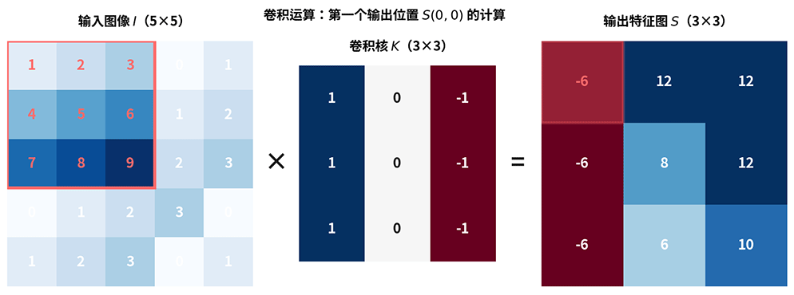
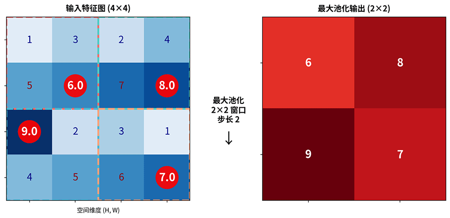
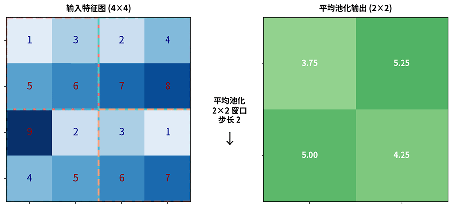
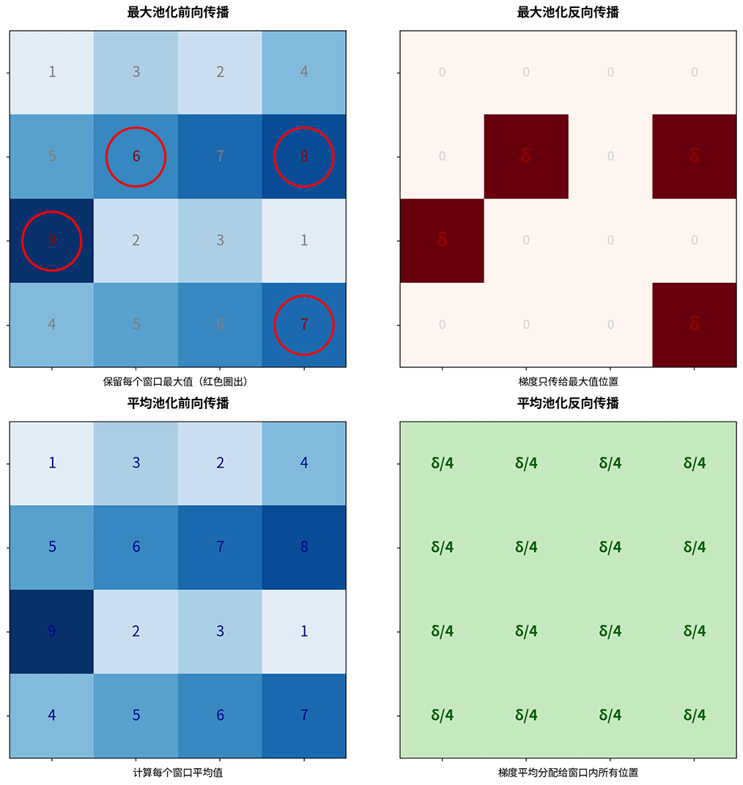
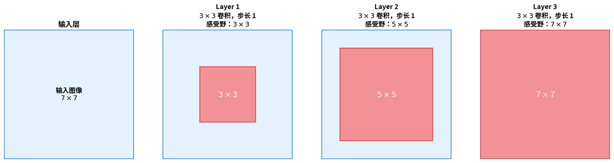
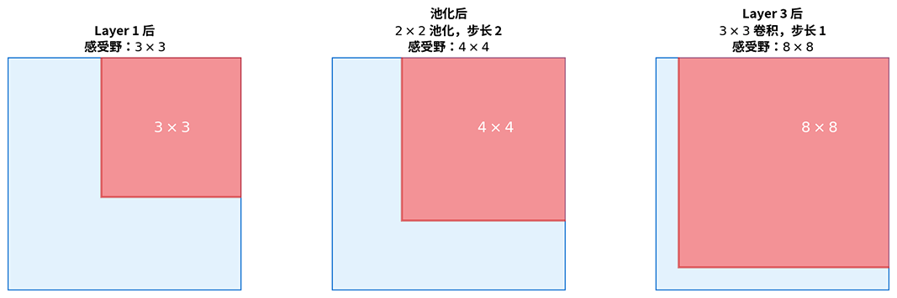
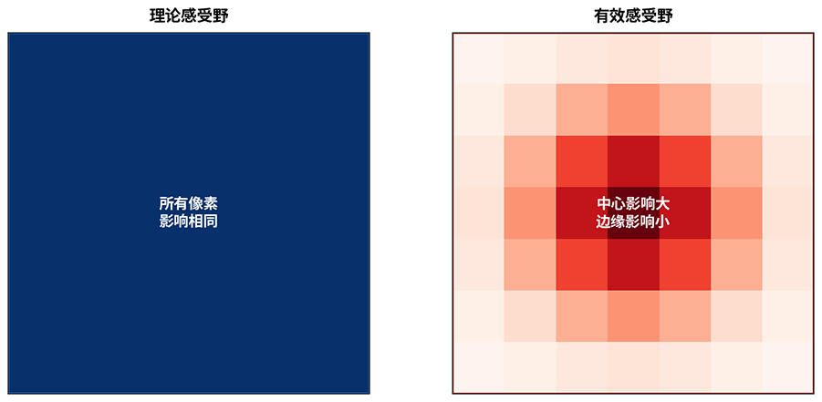
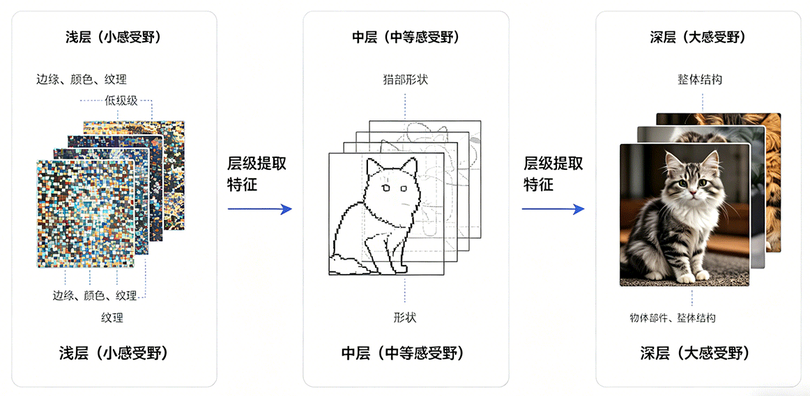
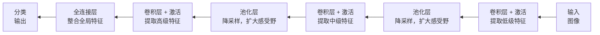

# CNN 基础原理

至此，我们已系统学习了深度神经网络的核心原理：前向传播、反向传播、激活函数、损失函数、梯度下降优化、权重初始化、正则化技术，等等。这些技术构成了训练深度网络的整套方法论，讨论以上技术时，我们都默认一个前提 —— 网络是全连接网络，即每层神经元与上一层所有神经元相连。但在处理图像相关的任务时，全连接网络经常面临**参数量爆炸**和**空间结构丢失**两个难题。

举个例子，一张 $224 \times 224 \times 3$ 的彩色图像，输入到全连接网络需要 $224 \times 224 \times 3 = 150,528$ 个输入神经元。哪怕第一个隐藏层仅有 $1000$ 个神经元，这一层的权重也有 $150,528 \times 1000 = 1.5$ 亿个参数。如此庞大的参数量不仅计算开销巨大，而且极易过拟合。更重要的是，全连接层将图像展平为一维向量，完全丢失了像素之间的空间邻接关系，图像中相邻像素通常构成有意义的局部特征（如边缘、纹理），而全连接层完全无法利用这种结构。

**卷积神经网络**（Convolutional Neural Network，CNN）正是为解决这两个问题而生。1998 年，法国计算机科学家杨立昆（Yann LeCun，图灵奖得主）在图像领域里程碑论文《Gradient-Based Learning Applied to Document Recognition》中提出了 LeNet-5 网络，这是第一个成功解决实际问题的卷积神经网络。LeNet-5 被用于手写数字识别，在美国银行支票读取系统中得到实际应用。

杨立昆的设计灵感源于生物视觉系统的研究成果。1959 年，神经科学家大卫·休贝尔（David Hubel）和托斯坦·威塞尔（Torsten Wiesel）发现猫的视觉皮层通过局部感受野逐层提取特征，从简单特征（边缘、方向）到复杂特征（形状、物体）。CNN 模拟了这一层级特征提取过程，卷积层通过小型滤波器在图像上滑动提取局部特征，池化层降采样扩大感受野，多层堆叠后实现从局部到全局的特征抽象。这一设计理念至今仍是所有现代视觉网络的基石，AlexNet、VGG、ResNet 等经典模型都继承了 LeNet 的核心架构。

本章将介绍 CNN 的核心概念：卷积操作、池化操作、感受野、卷积层与全连接层的对比，以及 CNN 架构设计原则。理解这些基础是掌握 AlexNet、VGG、ResNet 等经典模型的前提。

## 卷积原理

想象一下你观看中学毕业照，要在大合照中寻找到自己所在的位置会怎么做？我相信肯定不会把合照转为数组或者其他数据结构来筛查，而是拿出放大镜，在大合照中来回扫描，匹配出一个个人脸的轮廓，直到找到自己。这正是卷积操作的思想，**卷积**（Convolution）让一个小型滤波器在图像上滑动扫描，在每个位置计算滤波器与图像局部区域的匹配程度，输出一张新的特征图。滤波器的参数决定它检测什么特征，有的滤波器检测水平边缘，有的检测垂直边缘，有的检测纹理，有的模糊图像。在 CNN 中，这些滤波器参数都不是人工设计的，而是通过训练自动学习到的，网络会找到最适合任务的特征检测方式。

更贴合实际的比喻是卷积操作在用一个探针在图像上逐位置探测。探针头（卷积核）是一个小型矩阵，譬如 $3 \times 3$ 的方格，每个格子里有个数值，将探针放在图像某个位置，探针的数值和图像对应位置的像素值相乘后求和，得到一个输出值。这个输出值反映该位置是否含有探针所寻找的特征。探针滑动完所有位置，就得到一张完整的特征响应图，如上图所示。

下面从数学角度定义卷积运算。设输入图像 $I$，卷积核 $K$，$(i, j)$ 是输出特征图的位置索引，表示卷积核滑动到第 $i$ 行第 $j$ 列，$(m, n)$ 是卷积核内部的偏移索引，遍历卷积核的每个位置。$I(i+m, j+n)$ 表示输入图像中与卷积核当前位置对应的像素值，$K(m, n)$ 表示卷积核中位置 $(m, n)$ 的参数值，卷积运算定义为：

$$[cnn_scc] S(i, j) = (I * K)(i, j) = \sum_m \sum_n I(i+m, j+n) K(m, n)$$

公式中 $*$ 符号表示的就是卷积运算，整体公式可以解读为在每个输出位置，计算卷积核与图像局部区域的匹配得分。这个定义并不好理解，我们通过一个具体数值例子来解释它。设输入图像为 $5 \times 5$ 矩阵，卷积核为 $3 \times 3$ 矩阵，如下图所示。



*图：卷积运算的完整过程*

计算输出位置 $(0, 0)$ 的值时，把卷积核覆盖输入图像左上角 $3 \times 3$ 区域，然后将对应元素相乘后，再将 $9$ 个乘积求和，结果填入特征图的 $(0, 0)$ 位置，计算过程如下：

$$S(0, 0) = 1 \times 1 + 2 \times 0 + 3 \times (-1) + 4 \times 1 + 5 \times 0 + 6 \times (-1) + 7 \times 1 + 8 \times 0 + 9 \times (-1) = -6$$

然后，卷积核向右滑动一格，计算输出位置 $(0, 1)$；滑动完一行后，向下移动到下一行，直至全部滑动完毕，输出完整的 $3 \times 3$ 的特征图。不同卷积核参数会提取不同类型的特征，得到不同的特征图。

### 卷积核设计

传统图像处理中，人们需要手工设计各种卷积核用于特定任务，以下是几种经典的手工设计卷积核：

| 卷积核 | 说明 | 卷积核矩阵 |
|:--|:--|:--|
| **边缘检测核**（Laplacian 核） | 中心值大（8）、周围负值（-1），当卷积核覆盖区域中心像素与周围差异大时，输出值较大，表明存在边缘 | $\begin{bmatrix} -1 & -1 & -1 \\ -1 & 8 & -1 \\ -1 & -1 & -1 \end{bmatrix}$ |
| **水平边缘核**（Sobel 水平核） | 上下两行数值相反（上行 1，下行 -1），检测水平方向的亮度变化。当图像局部区域上方亮、下方暗（或反之）时，输出值较大，表示存在水平边缘 | $\begin{bmatrix} 1 & 1 & 1 \\ 0 & 0 & 0 \\ -1 & -1 & -1 \end{bmatrix}$ |
| **垂直边缘核**（Sobel 垂直核） | 左右两列数值相反，检测垂直方向的亮度变化 | $\begin{bmatrix} 1 & 0 & -1 \\ 1 & 0 & -1 \\ 1 & 0 & -1 \end{bmatrix}$ |
| **模糊核**（均值滤波） | 所有值相等且和为 1，计算局部区域 9 个像素的平均值，产生模糊平滑效果 | $\begin{bmatrix} \frac{1}{9} & \frac{1}{9} & \frac{1}{9} \\ \frac{1}{9} & \frac{1}{9} & \frac{1}{9} \\ \frac{1}{9} & \frac{1}{9} & \frac{1}{9} \end{bmatrix}$ |

通过以下代码，可以将卷积核作用于实际图像，直观感受不同卷积核生成特征图的效果：

```python runnable
import numpy as np
from PIL import Image
import matplotlib.pyplot as plt
from scipy.signal import convolve2d
import requests
from io import BytesIO

# 加载真实图片
response = requests.get("http://ai.icyfenix.cn/logo_min_size.png")
image_pil = Image.open(BytesIO(response.content))

# 转换为灰度图（卷积核通常作用于单通道）
if image_pil.mode != 'L':
    image_gray = image_pil.convert('L')

# 转换为 numpy 数组
image = np.array(image_gray, dtype=np.float32)
print(f"灰度图形状：{image.shape} (高度, 宽度)")
print(f"像素值范围：[{image.min():.1f}, {image.max():.1f}]")

# 边缘检测卷积核（拉普拉斯算子）
# 强调图像中亮度变化剧烈的区域，即边缘位置
edge_kernel = np.array([
    [-1, -1, -1],
    [-1,  8, -1],
    [-1, -1, -1]
])

# 模糊卷积核（均值滤波）
# 平滑图像，抑制噪声和细节
blur_kernel = np.array([
    [1/9, 1/9, 1/9],
    [1/9, 1/9, 1/9],
    [1/9, 1/9, 1/9]
])

# 应用卷积操作
edge_result = convolve2d(image, edge_kernel, mode='same')
blur_result = convolve2d(image, blur_kernel, mode='same')

# 对边缘检测结果取绝对值并归一化（便于可视化）
edge_display = np.abs(edge_result)
edge_display = (edge_display / edge_display.max() * 255).astype(np.uint8)

# 模糊结果直接显示
blur_display = blur_result.astype(np.uint8)

print(f"\n卷积结果形状：{edge_result.shape}")

# 并排展示三张图：原图、边缘检测、模糊
fig, axes = plt.subplots(1, 3, figsize=(14, 5))

axes[0].imshow(image, cmap='gray')
axes[0].set_title('Original Grayscale')
axes[0].axis('off')

axes[1].imshow(edge_display, cmap='gray')
axes[1].set_title('Edge Detection (Laplacian)')
axes[1].axis('off')

axes[2].imshow(blur_display, cmap='gray')
axes[2].set_title('Blur (Mean Filter)')
axes[2].axis('off')

plt.tight_layout()
plt.show()
plt.close()
```

手工设计卷积核需要专业的知识，且只能检测预定义的特征类型。CNN 的关键突破在于它不再需要人工卷积核设计，卷积核参数并不是预先定义的，而是通过反向传播训练学习。网络根据任务需求自动学习最适合的特征提取核，可能是某种边缘检测核，也可能是更复杂的纹理检测核，甚至人类无法解释的复合特征核。这种让网络自己学的方式，使 CNN 能提取丰富多样的特征，上限远超人类手工设计的局限（话说回来，人类凭经验手工设计确保了下限更高，这导致了 CNN 发明十余年内在工业界并未受到关注，这是下一章 AlexNet 的故事）。

### 通道设计

以上讨论的都是基于灰度图像，对于彩色图像，需要用到**多通道卷积**（Multi-channel Convolution）。由于彩色图像有 RGB 三个颜色通道，输入为 $H \times W \times 3$ 的三维数组，卷积核也需要三个通道对应，每个通道独立卷积后求和，产生一个输出值：

$$[cnn_mcc] S(i, j) = \sum_c \sum_m \sum_n I(i+m, j+n, c) K(m, n, c)$$

其中，$c$ 是通道索引，遍历所有输入通道（RGB 三通道时 $c=0,1,2$）。卷积结果由每个通道的输出值求和得到，一个通道的输出值由该通道与卷积核对应位置的乘积之和构成，一个卷积核产生一个输出通道（特征图）。若要产生多个输出通道，需要多个卷积核。在多通道卷积中，每个卷积核不仅覆盖空间维度，还覆盖所有输入通道。设输入通道数 $C_{in}$，输出通道数 $C_{out}$，卷积核空间尺寸 $k \times k$，则有：

- 卷积核数量：$C_{out}$ 个（每个产生一个输出通道）
- 每个卷积核尺寸：$k \times k \times C_{in}$（覆盖所有输入通道）
- 总参数量：$C_{out} \times k \times k \times C_{in} + C_{out}$（卷积核参数加偏置）

每个输出通道就是一个独立的特征检测器。譬如 $C_{out}=64$ 意味着该层能学习检测 64 种不同的特征模式。不同卷积核通过训练自动分化，可能学到：

- 不同方向的边缘，如水平、垂直、45 度、135 度等
- 不同尺度的纹理，如细粒纹理、粗块纹理等
- 颜色组合模式，如红绿对比、蓝黄对比等
- 更复杂的局部结构，如角点、圆弧、交叉点等
- ……

$C_{in}$ 和 $C_{out}$ 没有数值上的约束关系，多个输入特征可以合并到一个新的输出特征，一个输出特征也可以分化成多个输出特征，即输出通道数可以大于、等于或小于输入通道数。但两者存在操作层面的绑定关系，每个卷积核必须覆盖所有输入通道，单个卷积核的空间尺寸是 $k \times k$，完整尺寸实际是 $k \times k \times C_{in}$，这种三维结构才能确保每个输出值融合了所有输入通道的信息。举个例子，输入 $224 \times 224 \times 3$（RGB 三通道），使用 64 个空间尺寸为 $3 \times 3$ 的卷积核（实际尺寸为 $3 \times 3 \times 3$）：

- 卷积核数量：64 个
- 每个卷积核尺寸：$3 \times 3 \times 3 = 27$ 参数
- 总参数量：$64 \times 27 + 64 = 1792$

对比全连接层处理同样输入输出需要 $224 \times 224 \times 3 \times 64 = 9,633,792$ 参数，卷积层仅为全连接层的 $0.02\%$。

### 尺寸设计

除通道数量的考量外，卷积层设计还要重点关注**步长**和**填充**两个超参数，它们共同决定输出特征图的尺寸。**步长**（Stride）是卷积核每次滑动的距离。步长 $s=1$ 时，卷积核逐位置滑动（默认方式）；步长 $s=2$ 时，卷积核跳过一个位置滑动。步长越大，输出尺寸越小，特征图越压缩。**填充**（Padding）是在输入图像边缘添加额外像素（通常填零）。无填充（Valid Padding）时，输出尺寸小于输入；等保填充（Same Padding）时，输出尺寸与输入相同（步长为 1 时）。填充的作用是保留边缘信息，不加填充时，边缘像素只被卷积核覆盖一次，而中心像素被覆盖多次，边缘信息容易被忽略。设输入尺寸 $n \times n$，卷积核尺寸 $k \times k$，步长 $s$，填充 $p$，则输出尺寸为：

$$[cnn_out_size]\text{输出尺寸} = \lfloor \frac{n + 2p - k}{s} \rfloor + 1$$


## CNN 推理与训练

推理方面，卷积层的前向传播可以拆解为三个步骤：先根据输入尺寸、卷积核尺寸、步长和填充计算输出特征图的尺寸，再将每个卷积核在输入特征图上逐位置滑动做卷积运算，最后加上偏置并经过激活函数得到输出。设输入图像尺寸为 $H_{in} \times W_{in}$，通道数为 $C_{in}$，卷积核空间尺寸为 $k \times k$，输出通道数为 $C_{out}$，则输出特征图的尺寸由公式 {{cnn_out_size}} 给出：

$$H_{out} = \lfloor \frac{H_{in} + 2p - k}{s} \rfloor + 1, \quad W_{out} = \lfloor \frac{W_{in} + 2p - k}{s} \rfloor + 1$$

整个卷积层的输出为 $H_{out} \times W_{out} \times C_{out}$，每个输出通道的计算过程与前面讨论的多通道卷积公式 {{cnn_mcc}} 完全一致，后续为讲述方便，推导均针对一个通道来讨论。设 $I_{region}(i, j)$ 为前向传播时卷积核在输出位置 $(i, j)$ 所覆盖的输入区域，即卷积核滑动到 $(i, j)$ 位置时与卷积核参数逐元素相乘的那个输入子块（大小与卷积核相同），$W$ 为卷积核权重，根据公式 {{cnn_scc}} 逐层计算输出，直至输出层，即完成整个网络的前向传播过程：

$$[cnn_fp_w] S(i, j) = \sum I_{region}(i, j) \cdot W$$

训练方面，卷积层反向传播的核心任务与全连接网络是一样的，都是计算损失函数对可学习参数的梯度，用于更新权重。卷积层的可学习参数是卷积核权重和偏置，即要计算 $\frac{\partial l}{\partial W}$ 和 $\frac{\partial l}{\partial b}$。此外，还需要计算损失对输入的梯度 $\frac{\partial l}{\partial I}$，将其传递给前一层。

- **卷积核权重梯度**：对损失函数 $l$ 关于权重 $W$ 求导，照例从链式法则开始，权重 $W$ 是通过影响卷积结果 $S$ 来影响损失 $l$ 的：

    $$[cnn_bp_w] \frac{\partial l}{\partial W} = \sum_{i, j} \frac{\partial l}{\partial S(i, j)} \cdot \frac{\partial S(i, j)}{\partial W}$$

    观察前向公式 {{cnn_fp_w}}，$S(i, j)$ 关于 $W$ 的偏导数就是对应的输入值：

    $$\frac{\partial S(i, j)}{\partial W} = I_{region}(i, j)$$

    代入公式 {{cnn_bp_w}}，就得到了卷积核权重梯度公式，卷积核权重梯度来源于输出梯度与对应输入区域的乘积。可以这样理解，某个位置的输入参与了前向传播的计算，它对损失的"责任"等于该位置的输入值乘以输出位置的误差信号：

    $$\frac{\partial l}{\partial W} = \sum_{i, j} \frac{\partial l}{\partial S(i, j)} \cdot I_{region}(i, j)$$

    对所有输出位置求和，就是卷积核的完整梯度。这个求和操作在数学上等价于输入特征图与输出梯度的卷积。也就是说，卷积层的权重更新本质上还是一组卷积运算，用输出误差信号探测输入特征图，哪里响应强，哪里的权重就需要更大程度的调整。

- **输入梯度**：它的形式是输出梯度与翻转卷积核的全卷积（Full Convolution），用于将误差信号传递给前一层。全卷积是指卷积核的中心逐一遍历输入信号的每个位置，在输出中保留所有存在重叠的区域（包括部分重叠的边缘区域），因此输出尺寸大于输入尺寸。输入梯度为：

    $$\frac{\partial l}{\partial I} = \frac{\partial l}{\partial S} *_{full} flip(W)$$

    其中 $flip(W)$ 含义是将卷积核在空间维度上上下左右翻转，$*_{full}$ 表示全卷积模式，使得输出尺寸大于输入。这个翻转操作与全连接网络中权重矩阵转相乘的原理相同，反向传播时，前向传播的[权重矩阵需要以逆向方式使用](../neural-network-structure/backpropagation.md#隐藏层梯度传递)。翻转后的卷积核将输出位置的误差信号扩散回所有覆盖了该位置的输入区域，完成梯度的反向传递。

以批量输入为例，设批次大小为 $N$，每个样本独立计算后累加。反向传播的完整过程如下：

1. **偏置梯度**最简单，由于前向传播中偏置被加到每个样本的每个输出通道上，反向传播只需将输出梯度沿批次和空间维度求和，得到每个输出通道的偏置梯度。

2. **卷积核权重的梯度**需要遍历每个输出位置。对于每个样本、每个输出通道、每个输出空间位置，取出前向传播时卷积核所覆盖的输入区域，将该输入区域与对应输出位置的误差信号相乘，累加到对应卷积核的梯度中。这个过程等价于输入特征图与输出梯度的卷积运算，其中输出梯度作为探测信号，在输入特征图上滑动，响应越强的区域对权重的梯度贡献越大。

3. **输入梯度的计算**同样需要遍历输出位置，但方向相反。对于每个输出位置，将对应的误差信号乘以卷积核的每个权重值，将结果扩散回输入梯度的对应区域。与全连接网络中误差信号需要乘以权重矩阵的转置同理，卷积中的反向传播需要将卷积核在空间维度上翻转后以全卷积模式作用于输出梯度。实际实现时通常不显式翻转卷积核，而是在累加输入梯度时按对称索引访问卷积核参数，结果等价于翻转后的卷积运算。

4. **含步长和填充的处理**：前向传播中使用步长 $s>1$ 时，输出梯度在输入空间上是稀疏的，输入梯度的对应位置每隔 $s$ 个位置才接收梯度，其余位置梯度为零。前向传播中对输入进行了零填充时，反向传播先计算填充后的输入梯度，最后去除填充边界部分的梯度，得到与原始输入尺寸匹配的梯度。

需要说明的是，以上按位置遍历的描述为了完整展示出 CNN 反向传播的计算过程，实际深度学习框架中会使用 im2col 等技巧将卷积转换为矩阵乘法，利用 GPU 并行加速。但无论实现如何优化，前向传播的局部卷积和反向传播的梯度累积这两个核心操作不会改变。

## 池化操作

卷积层提取特征后，特征图的尺寸仍然较大。以 $224 \times 224$ 的输入图像为例，经过一层 $3 \times 3$ 卷积后，特征图尺寸基本保持不变。若后续继续堆叠卷积层，计算量和内存开销都会持续累积。**池化**（Pooling）层正是为解决这个问题而设计的，它是一种**降采样**（Downsampling）操作，将特征图划分为若干小区域，每个区域取一个代表值，从而缩小特征图尺寸。

池化的思想源于一个经验法则：局部区域内的特征往往存在冗余，相邻位置的响应值通常相似，取一个代表值足以概括该区域的信息。这类似于图像压缩技术中的块压缩，用少量信息代表大量数据，牺牲部分细节以换取更高的效率。从功能角度看，池化层扮演了特征选择器的角色。它不引入任何可学习参数，只是按照固定规则对特征图进行压缩。这种无参数的设计使池化层成为 CNN 中计算成本最低的组件之一，同时在控制模型复杂度、防止过拟合方面发挥作用。最大池化和平均池化是最常用的两种池化操作。

- **最大池化**（Max Pooling）是最常用的池化方式。它的规则极其简单，在每个池化窗口内取最大值作为输出。这个简单操作背后有一个重要假设：最大响应值代表该区域内最强烈、最显著的特征信号。

    

    *图：最大池化操作过程，红色圆圈标出每个窗口的最大值，这些值被保留到输出特征图中*

    以上图为例，输入为 $4 \times 4$ 特征图，池化窗口 $2 \times 2$，步长 $2$。池化窗口从左上角开始，依次划过四个不重叠的区域，区域中只有特征最大值被保留。最终输出 $2 \times 2$ 特征图，尺寸缩小为原来的 $1/4$。

    最大池化的关键特性是**局部平移不变性**。假设输入特征图中某个边缘特征向右移动了一格，只要它仍在同一个池化窗口内，最大池化的输出值就不会改变。这种特性使 CNN 对物体位置的轻微变化更加鲁棒，分类任务通常关心有没有这个特征，而不是特征精确位于哪个像素。

- **平均池化**（Average Pooling）采用另一种策略，在每个池化窗口内取平均值作为输出。与最大池化保留最显著点不同，平均池化保留的是区域的整体信息。

    

    *图：平均池化操作过程，每个输出值是窗口内 4 个输入的平均值*

    使用与上面相同的输入，对每个区域取平均值，如左上区域 $(1+3+5+6)/4 = 3.75$。输出特征图同样为 $2 \times 2$，但数值更加平滑，没有极端的最大值。

    平均池化的特点是**平滑特征**，适合需要保留整体信息的场景。譬如在处理纹理特征或背景信息时，平均值比最大值更能代表区域的整体属性。平均池化的另一个典型应用是**全局平均池化**（Global Average Pooling，GAP）。它将整个特征图压缩为一个值，对每个通道的所有空间位置取平均。譬如 ResNet 等现代网络在末端使用 GAP 替代传统的全连接层，直接输出每个通道的平均值用于分类。这种做法大幅减少了参数量，同时增强了模型对空间位置的不变性。不过即便如此，在当前 CNN 应用中，最大池化仍然是最常用池化方式，原因就是刚才提到过，分类任务通常更关注是否存在某个特征，而不是平均值或者别的信息。

### 池化参数

池化操作由**窗口大小**和**步长**两个超参数控制，窗口大小决定每次覆盖多少位置，通常为 $2 \times 2$ 或 $3 \times 3$；步长决定窗口每次滑动的距离，通常等于窗口大小，实现无重叠池化。设输入特征图尺寸 $n \times n$，池化窗口 $k \times k$，步长 $s$，输出尺寸为：

$$\text{输出尺寸} = \lfloor \frac{n - k}{s} \rfloor + 1$$

这个公式与卷积输出尺寸公式相似，但池化通常不进行填充。代入典型值 $n=4$，$k=2$，$s=2$ 得到 $\text{输出} = \lfloor \frac{4 - 2}{2} \rfloor + 1 = 2$，说明输出尺寸为 $2 \times 2$，正好是输入的 $1/4$。这意味着每次池化操作都将特征图的空间尺寸减半，同时保持通道数不变。

### 池化层反向传播

虽然池化层没有可学习参数，但反向传播时仍需计算输入梯度，将误差信号传递给前一层。两种池化方式的梯度传递规则不同，但都遵循一个原则：梯度分配与前向传播的选择规则相对应。

对于最大池化，在前向传播时，最大池化记录了每个窗口内最大值的位置。反向传播时，梯度只传递给产生最大值的那个位置，其他位置的梯度为零。这种"选择性传递"与最大池化的"选择性保留"完全对应，既然只有最大值影响了输出，那么梯度也应该只流向最大值位置。形式化地，设某窗口前向传播时最大值位置为 $(i^*, j^*)$，输出梯度为 $\delta$，则输入梯度为：

$$
\frac{\partial l}{\partial I_{i,j}} = 
\begin{cases}
\delta, & \text{if } (i,j) = (i^*, j^*) \\
0, & \text{otherwise}
\end{cases}
$$

这种稀疏梯度传递使最大池化层在反向传播时只更新"贡献了特征响应"的位置，强化了特征的局部性。

对于平均池化，前向传播是取窗口内所有位置的平均值，因此反向传播时梯度平均分配给窗口内所有位置。设窗口大小 $k \times k$，输出梯度 $\delta$，则每个输入位置的梯度为：

$$\frac{\partial l}{\partial I_{i,j}} = \frac{\delta}{k \times k}$$

这种均匀分配与平均池化的"平等对待"策略一致，既然所有位置都平等地贡献了输出，那么梯度也应该平等地分配给所有位置。从实现角度看，池化层的反向传播比卷积层更简单，不需要存储权重，只需要记住前向传播时的最大值位置（最大池化）或直接按窗口大小均分（平均池化），如下图所示。



*图：池化层反向传播机制对比，上图为最大池化（梯度仅传递给最大值位置），下图为平均池化（梯度平均分配给所有位置）*

## 感受野

**感受野**（Receptive Field）指输出特征图中一个位置对应的输入图像区域大小。通俗地说，卷积层和池化层堆叠多层后，深层的每个输出位置究竟"看到"了输入图像的多少区域，这个范围就是它的感受野，它决定了网络能捕捉多大范围的上下文信息。感受野概念在 CNN 架构设计中有以下三个应用：

- **特征尺度匹配**：浅层感受野小，适合捕捉边缘、纹理等局部特征；深层感受野大，能整合全局信息。这种层级结构使 CNN 能同时处理不同尺度的特征。
- **网络深度设计**：对于输入图像，最后一层的感受野应足够大（至少覆盖全图）才能做出全局判断。若感受野不足，网络无法获取完整的上下文信息。
- **目标检测中的多尺度设计**：检测大目标需要大感受野以获取全局上下文，检测小目标需要小感受野以保留精细特征。这正是特征塔网络（Feature Pyramid Network，FRN）等多尺度架构的设计依据。

举个具体例子，初始状态下，输入层的每个像素只对应自己，感受野为 $1 \times 1$。经过第一层 $3 \times 3$ 卷积后，每个输出位置的感受野扩大到 $3 \times 3$，说明它直接接收 $3 \times 3$ 邻域内像素的信息。继续堆叠第二层 $3 \times 3$ 卷积，第二层的每个输出位置连接第一层的 $3 \times 3$ 个位置，而第一层的每个位置又对应输入的 $3 \times 3$ 区域。这些区域有重叠，合并后形成一个 $5 \times 5$ 的输入区域。



*图：三层 $3 \times 3$ 卷积堆叠时感受野的扩大过程。红色区域表示深层输出位置对应的输入图像范围*

感受野的扩大过程可以用递推公式精确计算。设第 $l$ 层感受野为 $R_l$，卷积核大小 $k_l$，步长 $s_l$，前 $l-1$ 层步长累积为 $\prod_{i=1}^{l-1} s_i$：

$$[rec_field_size] R_l = R_{l-1} + (k_l - 1) \times \prod_{i=1}^{l-1} s_i$$

公式中 $\prod_{i=1}^{l-1} s_i$ 是前 $l-1$ 层步长的累积，表示第 $l$ 层输入位置之间的间隔，间隔越大，感受野扩展越快。将三层 $3 \times 3$ 卷积（步长均为 $1$）代入公式，可得到第三层的感受野范围为 $7$，代表第三层的每个输出位置对应输入图像 $7 \times 7$ 的区域。这个结果揭示了一条网络设计经验：三层 $3 \times 3$ 卷积的感受野相当于一层 $7 \times 7$ 卷积，但参数量更少（$3 \times 3 \times 3 = 27$ 对比 $7 \times 7 = 49$），而且多了两次非线性变换，模型的表达能力更强。这正是 VGG 等经典网络使用多层小卷积核替代单层大卷积核的关键原因。

### 池化层的影响

前面的例子中，所有层的步长均为 $1$，感受野以每层 $2$ 个像素的速度线性增长。但 CNN 的池化操作会显著加速这个过程。池化层惯常使用的步长为 $2$，使特征图尺寸减半的同时，也让步长累积翻倍，从而让后续层的感受野增长速度加倍。

考虑一个典型的 CNN 网络结构：第一层为 $3 \times 3$ 卷积（步长 $1$），第二层为 $2 \times 2$ 池化（步长 $2$），第三层为 $3 \times 3$ 卷积（步长 $1$）。代入递推公式 {{rec_field_size}} 逐层计算，第一层后感受野为 $R_1 = 1 + (3-1) \times 1 = 3$；池化后感受野为 $R_{pool} = 3 + (2-1) \times 1 = 4$；第三层后感受野为 $R_3 = 4 + (3-1) \times 2 = 8$，如下图所示。



*图：池化层通过增大步长累积，加速感受野扩大*

注意第三层计算中的步长累积项变为 $2$（前层池化步长 $2$ 与 第一层步长 $1$ 的乘积）。若没有池化层，第三层的步长累积仍为 $1$，感受野应为 $4 + (3-1) \times 1 = 6$。池化层通过增大步长累积，让后续层的感受野增长更快，这是池化层在 CNN 早期架构中被广泛使用的另一个原因，它不仅降维减少计算量，还加速了感受野扩大，使深层神经元能用更少的层数捕捉更全局的信息。

### 有效感受野

到此为止，我们讨论的都是理论感受野的大小，理论感受野是覆盖区域，但区域内各像素对输出的影响并不相同。中心像素通过多条路径影响输出，而边缘像素只有少数路径。**有效感受野**（Effective Receptive Field）指实际对输出有显著影响的区域，通常小于理论感受野，近似呈高斯分布。



*图：理论感受野假设覆盖区域内所有像素影响相同（左），而有效感受野呈高斯分布，中心区域影响最大，向边缘衰减（右）*

引入有效感受野概念的意义在于即使理论感受野覆盖了整个输入图像，网络真正关注的可能只是中心区域。这提示我们在设计网络时，不能仅仅依赖理论感受野公式，还需要考虑有效感受野的实际覆盖范围。

## CNN 架构设计原则

学习了卷积、池化、感受野等概念后，本节将介绍一些 CNN 设计的通用原则，讨论如何组合这些组件，构建出有效的 CNN 架构。CNN 采用层级结构，逐层提取从简单到复杂的特征。这种设计模拟了生物视觉系统的信息处理方式：浅层用小感受野提取边缘、颜色、纹理等低级特征，这些特征是图像的基本组成元素；中层用中等感受野提取形状、局部结构等中级特征，将低级特征组合成有意义的部件；深层用大感受野提取物体部件、整体结构等高级特征，实现从局部到全局的抽象。如下图 CNN 识别图像是否为猫的例子所示。



*图：CNN 层级特征提取过程，从左到右分别为浅层、中层、深层特征*

上述层级特征提取的原理，落实到具体的网络结构设计上，便体现在 CNN 各组件的配合方式中。一个典型 CNN 结构遵循"卷积 - 激活 - 池化"重复堆叠的模式，每一轮堆叠都完成一次"提取特征、引入非线性、降维扩感受野"的完整流程：



在这个流程中，会面临卷积核尺寸选择、通道数的递增设计、激活函数的选择等因素的考量，下面将常见的决策考虑依据列举如下：

- **卷积核尺寸选择**：常用卷积核尺寸包括 $3 \times 3$、$5 \times 5$ 和 $1 \times 1$。其中 $3 \times 3$ 最为常用，因为计算量小，而且两层 $3 \times 3$ 卷积的感受野等于一层 $5 \times 5$ 卷积。$5 \times 5$ 卷积能提供较大感受野，但计算量相对较大一些（$5 \times 5 = 25$ 对比 $3 \times 3 \times 2 = 18$）。$1 \times 1$ 卷积不改变感受野，一般有三个作用：第一是通道降维，输入为 $H \times W \times C_{in}$，输出为 $H \times W \times C_{out}$，当 $C_{out} < C_{in}$ 时减少通道数。第二是增加非线性，$1 \times 1$ 卷积后加激活函数，增加网络非线性表达能力。第三是跨通道信息融合，每个输出位置融合所有输入通道的信息。

- **通道数递增设计**：CNN 通常采用浅层通道少，深层通道多的设计。典型设计是每经过一次池化，下次卷积时通道数翻倍。

    以一个典型的五层 CNN 结构为例：输入为 $224 \times 224 \times 3$ 的 RGB 图像，第一层卷积层输出 $224 \times 224 \times 64$，第二层池化层后空间尺寸减半为 $112 \times 112 \times 64$，第三层卷基层通道翻倍为 $112 \times 112 \times 128$，第四层池化层后为 $56 \times 56 \times 128$，第五层卷积层通道再翻倍为 $56 \times 56 \times 256$。

    通道数递增的设计背后的原因是浅层特征简单，边缘、纹理等基础特征种类有限，少量通道足以表示。深层特征复杂，物体部件的组合方式多样，需要更多通道捕捉不同的组合模式。空间尺寸递减，池化降采样后空间尺寸变小，增加通道数可以补偿信息损失，保持总体信息量。

- **激活函数与归一化**：CNN 激活函数选择与全连接网络类似，但更强调计算效率。ReLU 是最常用的激活函数，计算极快（仅比较运算），缓解梯度消失，适合深层网络。CNN 归一化主要有两种选择。[Batch Normalization](../neural-network-stability/batch-normalization.md)（BN）是最常用的方法，卷积层后通常加 BN 层，对每个通道独立归一化，使用批次统计，确保稳定训练，加速收敛。在小批次训练或序列模型场景中，也可能会使用 Layer Normalization（LN）替代 BN。

    典型卷积块结构遵循"卷积 → 批归一化 → ReLU 激活"的顺序，这是现代 CNN 的标准配置，使用 BN 在激活前归一化，使激活函数输入分布稳定。

- **池化层设计**：池化层通常放在卷积块之后，定期降采样。降采样频率一般为每 2-3 个卷积块后一次池化，避免过度压缩。池化方式可选择最大池化（保留显著特征）或步长 2 卷积（参数化降采样）。步长 2 卷积替代池化是指使用步长 $s=2$ 的卷积代替 $2 \times 2$ 池化。这种做法的优点是卷积核参数可学习，降采样方式更灵活，有利于简化架构，缺点自然是增加了参数量。现代 CNN（如 ResNet）常使用步长 2 卷积替代池化。

- **全连接层设计**：CNN 末端通常用全连接层整合全局特征进行分类。传统流程是展平多维特征图（Flatten）→ 全连接层 → [Dropout](../neural-network-stability/dropout.md) → [Softmax](../../statistical-learning/linear-models/logistic-regression.md#多项逻辑回归)。对于图像任务，全连接层参数量大，太容易成为过拟合的来源，因此现代 CNN 常采用以下替代方案减少或取消全连接层。

    - **全局平均池化**（Global Average Pooling，GAP）：对每个通道取平均值，输出 $C$ 个值，直接输入 Softmax。GAP 完全消除了全连接层参数，强迫每个通道学习一个类别的特征。
    - **$1 \times 1$ 卷积降维**：先用 $1 \times 1$ 卷积减少通道数，再接较小的全连接层，如特征图 $7 \times 7 \times 512$，先用 $1 \times 1$ 卷积降到 64 通道，再 Flatten 接全连接层，参数量减少 8 倍。

## 卷积操作实践

下面通过代码实验验证卷积和池化操作的效果，直观展示不同卷积核提取的特征、池化的降维效果、感受野的逐层扩大。实验包括四个部分：

1. **不同卷积核的效果**：用手工设计的卷积核（边缘检测、模糊、锐化）处理测试图像，观察特征提取效果
2. **池化操作的效果**：对卷积结果应用最大池化和平均池化，观察降维和特征保留
3. **感受野计算验证**：计算典型 CNN 结构各层的感受野，验证递推公式
4. **参数量对比验证**：对比卷积层和全连接层的参数量，验证 CNN 的参数优势

```python runnable
import numpy as np
import matplotlib.pyplot as plt

# 创建示例图像
def create_test_image():
    """从网络加载图像并转换为灰度图"""
    import urllib.request
    from PIL import Image
    from io import BytesIO

    url = "http://ai.icyfenix.cn/logo_min_size.png"
    with urllib.request.urlopen(url) as response:
        img = Image.open(BytesIO(response.read())).convert("L")
    img = img.resize((32, 32))
    return np.array(img, dtype=np.float32) / 255.0

# 卷积操作实现
def conv2d(image, kernel, stride=1, padding=0):
    """
    2D 卷积操作
    image: 输入图像 (H, W)
    kernel: 卷积核 (kH, kW)
    stride: 步长
    padding: 填充
    """
    # 填充
    if padding > 0:
        image_padded = np.pad(image, padding, mode='constant', constant_values=0)
    else:
        image_padded = image
    
    H, W = image_padded.shape
    kH, kW = kernel.shape
    
    # 输出尺寸
    H_out = (H - kH) // stride + 1
    W_out = (W - kW) // stride + 1
    
    output = np.zeros((H_out, W_out))
    
    # 卷积计算
    for i in range(H_out):
        for j in range(W_out):
            h_start = i * stride
            w_start = j * stride
            region = image_padded[h_start:h_start+kH, w_start:w_start+kW]
            output[i, j] = np.sum(region * kernel)
    
    return output

# 池化操作实现
def max_pool2d(image, pool_size=2, stride=2):
    """最大池化"""
    H, W = image.shape
    H_out = (H - pool_size) // stride + 1
    W_out = (W - pool_size) // stride + 1
    
    output = np.zeros((H_out, W_out))
    
    for i in range(H_out):
        for j in range(W_out):
            h_start = i * stride
            w_start = j * stride
            region = image[h_start:h_start+pool_size, w_start:w_start+pool_size]
            output[i, j] = np.max(region)
    
    return output

def avg_pool2d(image, pool_size=2, stride=2):
    """平均池化"""
    H, W = image.shape
    H_out = (H - pool_size) // stride + 1
    W_out = (W - pool_size) // stride + 1
    
    output = np.zeros((H_out, W_out))
    
    for i in range(H_out):
        for j in range(W_out):
            h_start = i * stride
            w_start = j * stride
            region = image[h_start:h_start+pool_size, w_start:w_start+pool_size]
            output[i, j] = np.mean(region)
    
    return output

# 创建测试图像
test_image = create_test_image()

print("实验1：不同卷积核的效果")
print("-" * 40)

# 定义不同卷积核
kernels = {
    '水平边缘检测': np.array([[1, 1, 1], [0, 0, 0], [-1, -1, -1]], dtype=np.float32),
    '垂直边缘检测': np.array([[1, 0, -1], [1, 0, -1], [1, 0, -1]], dtype=np.float32),
    '边缘增强': np.array([[-1, -1, -1], [-1, 8, -1], [-1, -1, -1]], dtype=np.float32),
    '模糊': np.array([[1, 1, 1], [1, 1, 1], [1, 1, 1]], dtype=np.float32) / 9,
    '锐化': np.array([[0, -1, 0], [-1, 5, -1], [0, -1, 0]], dtype=np.float32)
}

# 应用不同卷积核
outputs = {}
for name, kernel in kernels.items():
    output = conv2d(test_image, kernel)
    outputs[name] = output
    print(f"{name}: 输入 {test_image.shape} → 输出 {output.shape}")

# 可视化卷积效果
fig, axes = plt.subplots(2, 3, figsize=(14, 10))

# 原图像
axes[0, 0].imshow(test_image, cmap='gray', vmin=0, vmax=1)
axes[0, 0].set_title('原始图像', fontsize=12, fontweight='bold')
axes[0, 0].axis('off')

# 卷积结果
positions = [(0, 1), (0, 2), (1, 0), (1, 1), (1, 2)]
kernel_names = list(kernels.keys())

for idx, (name, pos) in enumerate(zip(kernel_names, positions)):
    ax = axes[pos]
    output = outputs[name]
    
    # 根据输出值范围调整显示
    if name == '模糊':
        ax.imshow(output, cmap='gray', vmin=0, vmax=1)
    else:
        ax.imshow(output, cmap='RdBu', vmin=-output.max(), vmax=output.max())
    
    ax.set_title(f'{name}\n输出: {output.shape}', fontsize=11)
    ax.axis('off')

plt.tight_layout()
plt.show()
plt.close()

print("\n" + "=" * 60)
print("实验2：池化操作的效果")
print("-" * 40)

# 使用边缘检测结果进行池化
edge_output = outputs['边缘增强']

# 最大池化
max_pooled = max_pool2d(edge_output, pool_size=2, stride=2)
print(f"最大池化: {edge_output.shape} → {max_pooled.shape}")

# 平均池化
avg_pooled = avg_pool2d(edge_output, pool_size=2, stride=2)
print(f"平均池化: {edge_output.shape} → {avg_pooled.shape}")

# 多级池化
max_pooled_2 = max_pool2d(max_pooled, pool_size=2, stride=2)
print(f"二次最大池化: {max_pooled.shape} → {max_pooled_2.shape}")

# 可视化池化效果
fig, axes = plt.subplots(2, 2, figsize=(10, 10))

axes[0, 0].imshow(edge_output, cmap='RdBu', vmin=-edge_output.max(), vmax=edge_output.max())
axes[0, 0].set_title(f'边缘检测结果\n尺寸: {edge_output.shape}', fontsize=12, fontweight='bold')
axes[0, 0].axis('off')

axes[0, 1].imshow(max_pooled, cmap='RdBu', vmin=-max_pooled.max(), vmax=max_pooled.max())
axes[0, 1].set_title(f'最大池化\n尺寸: {max_pooled.shape}', fontsize=11)
axes[0, 1].axis('off')

axes[1, 0].imshow(avg_pooled, cmap='RdBu', vmin=-avg_pooled.max(), vmax=avg_pooled.max())
axes[1, 0].set_title(f'平均池化\n尺寸: {avg_pooled.shape}', fontsize=11)
axes[1, 0].axis('off')

axes[1, 1].imshow(max_pooled_2, cmap='RdBu', vmin=-max_pooled_2.max(), vmax=max_pooled_2.max())
axes[1, 1].set_title(f'二次最大池化\n尺寸: {max_pooled_2.shape}', fontsize=11)
axes[1, 1].axis('off')

plt.tight_layout()
plt.show()
plt.close()

print("\n" + "=" * 60)
print("实验3：感受野计算验证")
print("-" * 40)

# 构建多层卷积网络并计算感受野
def compute_receptive_field(layers):
    """
    计算感受野
    layers: 列表，每层包含 (kernel_size, stride) 元组
    """
    rf = 1  # 初始感受野（输入层）
    jump = 1  # 步长累积
    
    print("\n各层感受野:")
    print(f"输入层: 感受野 {rf}×{rf}")
    
    for i, (k, s) in enumerate(layers):
        rf = rf + (k - 1) * jump
        jump = jump * s
        print(f"Layer {i+1}: 感受野 {rf}×{rf}, 步长累积 {jump}")
    
    return rf

# 计算典型 CNN 结构的感受野
print("\n典型 CNN 结构（VGG风格）:")
vgg_layers = [(3, 1), (3, 1), (2, 2),  # Conv-Conv-Pool
              (3, 1), (3, 1), (2, 2),  # Conv-Conv-Pool
              (3, 1), (3, 1), (3, 1), (2, 2)]  # Conv-Conv-Conv-Pool
rf = compute_receptive_field(vgg_layers)

# 对比：ResNet 风格（步长2卷积替代池化）
print("\nResNet风格（步长2卷积）:")
resnet_layers = [(3, 1), (3, 1), (3, 2),  # Conv-Conv-Conv(步长2)
                 (3, 1), (3, 1), (3, 2),  # Conv-Conv-Conv(步长2)
                 (3, 1), (3, 1), (3, 2)]  # Conv-Conv-Conv(步长2)
rf = compute_receptive_field(resnet_layers)

print("\n" + "=" * 60)
print("实验4：参数量对比验证")
print("-" * 40)

def count_conv_params(input_channels, output_channels, kernel_size):
    """计算卷积层参数量"""
    weights = output_channels * kernel_size * kernel_size * input_channels
    biases = output_channels
    return weights + biases

def count_fc_params(input_size, output_size):
    """计算全连接层参数量"""
    weights = input_size * output_size
    biases = output_size
    return weights + biases

# 输入图像尺寸
image_size = 224
input_channels = 3

print(f"\n输入图像: {image_size}×{image_size}×{input_channels}")

# 全连接层（假设输出 64 个神经元）
fc_params = count_fc_params(image_size * image_size * input_channels, 64)
print(f"\n全连接层参数量:")
print(f"  输入神经元: {image_size * image_size * input_channels}")
print(f"  输出神经元: 64")
print(f"  总参数量: {fc_params:,}")

# 卷积层（假设 64 个输出通道，3×3 卷积核）
conv_params = count_conv_params(input_channels, 64, 3)
print(f"\n卷积层参数量:")
print(f"  输入通道: {input_channels}")
print(f"  输出通道: 64")
print(f"  卷积核大小: 3×3")
print(f"  总参数量: {conv_params:,}")

# 参数量对比
ratio = conv_params / fc_params
print(f"\n参数量对比: 卷积层仅为全连接层的 {ratio:.4%}")
```

## 本章小结

卷积神经网络之所以成为计算机视觉领域的主流架构，根本原因在于它将先验知识嵌入了模型设计：图像中的模式具有局部性（物体通常出现在有限区域内）和平移性（同一物体出现在图像的任何位置都属于同一类别）。卷积层的参数共享和局部连接正是对这种归纳偏置的显式建模。

学习 CNN 的核心价值在于理解一个更宏观的设计哲学：**好的模型不是靠堆参数，而是靠正确的假设。** 全连接层将图像视为扁平的像素向量，从一开始就丢弃了空间结构，这意味着它必须从头学习"相邻像素之间存在关联"这本应由架构保证的事实。卷积层则反其道而行，它假设空间关系天然重要，因此用极小的参数量就能捕捉到有意义的模式。这种思路在深度学习的设计中还会反复出现，与其让模型从零开始，不如将领域知识编码为结构约束。

另一方面，CNN 展示了一种分层的思维方式，从边缘、纹理等低级特征，到部件、材质等中级特征，再到完整的物体概念。这种简单到复杂的特征构造路径，不仅与生物自然视觉皮层的工作方式惊人地吻合，也启发了后续大量深度学习架构的设计灵感。即便在 Transformer 等新架构崛起的今天，CNN 中局部连接、感受野递进、多尺度特征等核心思想仍然是理解视觉模型的重要基础。

下一章将介绍 AlexNet，展示 CNN 在 ImageNet 大规模图像识别竞赛中的突破性成果，这是深度学习崛起的标志性事件，是深度学习在视觉领域，来自整个人工智能领域开创新纪元的时刻。

## 练习题

1. 给定输入图像尺寸 $32 \times 32 \times 3$，使用 $5 \times 5$ 卷积核，步长 $s=1$，无填充（padding=0）。计算输出特征图的尺寸。
    <details>
    <summary>参考答案</summary>

    **公式计算**：

    根据输出尺寸公式 $\lfloor \frac{n + 2p - k}{s} \rfloor + 1$，代入参数：
    - 输入尺寸 $n = 32$
    - 卷积核尺寸 $k = 5$
    - 填充 $p = 0$
    - 步长 $s = 1$

    $$H_{out} = W_{out} = \lfloor \frac{32 + 0 - 5}{1} \rfloor + 1 = 27 + 1 = 28$$

    输出特征图尺寸为 $28 \times 28 \times C_{out}$（$C_{out}$ 为输出通道数）。
    </details>

1. 设计一个三层卷积网络：第一层 $3 \times 3$ 卷积（步长 $1$），第二层 $2 \times 2$ 最大池化（步长 $2$），第三层 $3 \times 3$ 卷积（步长 1）。计算第三层的感受野大小，并验证感受野递推公式。
    <details>
    <summary>参考答案</summary>

    **感受野递推公式**：

    $$R_l = R_{l-1} + (k_l - 1) \times \prod_{i=1}^{l-1} s_i$$

    其中 $\prod_{i=1}^{l-1} s_i$ 是前 $l-1$ 层步长的累积。

    **逐层计算**：

    - 输入层：$R_0 = 1$（初始感受野）
    - 第一层卷积：$R_1 = 1 + (3-1) \times 1 = 3$，步长累积 $= 1$
    - 第二层池化：$R_2 = 3 + (2-1) \times 1 = 4$，步长累积 $= 1 \times 2 = 2$
    - 第三层卷积：$R_3 = 4 + (3-1) \times 2 = 8$，步长累积 $= 2 \times 1 = 2$

    第三层感受野为 $8 \times 8$。
    </details>

1. 解释最大池化和平均池化在反向传播时的梯度传递规则有何不同，并说明为什么最大池化能提供局部平移不变性。
    <details>
    <summary>参考答案</summary>

    **梯度传递规则对比**：

    - **最大池化**：梯度只传递给前向传播时产生最大值的位置，其他位置梯度为零。设某窗口最大值位置为 $(i^*, j^*)$，输出梯度为 $\delta$，则：
      $$\frac{\partial l}{\partial I_{i,j}} = \begin{cases} \delta, & (i,j) = (i^*, j^*) \\ 0, & \text{otherwise} \end{cases}$$

    - **平均池化**：梯度平均分配给窗口内所有位置。设窗口大小 $k \times k$，输出梯度 $\delta$，则：
      $$\frac{\partial l}{\partial I_{i,j}} = \frac{\delta}{k \times k}$$

    **局部平移不变性解释**：

    最大池化的关键特性是局部平移不变性。假设输入特征图中某个特征（如边缘）向右移动了一格，只要它仍在同一个池化窗口内，最大池化的输出值就不会改变。例如：

    输入窗口 $[1, 3, 5, 6]$，最大值 6，输出 6。若输入变为 $[3, 5, 6, 4]$（特征向右移动），最大值仍为 6，输出不变。

    这种特性使 CNN 对物体位置的轻微变化更加鲁棒。分类任务通常关心"有没有这个特征"，而非"特征精确位于哪个像素"。

    ```python runnable
    import numpy as np
    
    print("=== 池化层反向传播演示 ===")
    
    # 示例：2×2 池化窗口
    input_region = np.array([[1, 3], [5, 6]])
    output_gradient = 1.0
    
    print("\n最大池化:")
    max_pos = np.unravel_index(np.argmax(input_region), input_region.shape)
    max_val = input_region[max_pos]
    print(f"  输入窗口: {input_region.flatten()}")
    print(f"  最大值位置: {max_pos}, 值: {max_val}")
    print(f"  输出梯度: {output_gradient}")
    
    # 梯度分配
    max_grad = np.zeros_like(input_region)
    max_grad[max_pos] = output_gradient
    print(f"  输入梯度: {max_grad.flatten()}")
    print("  解释: 梯度只传递给最大值位置6")
    
    print("\n平均池化:")
    avg_val = np.mean(input_region)
    print(f"  输入窗口: {input_region.flatten()}")
    print(f"  平均值: {avg_val}")
    print(f"  输出梯度: {output_gradient}")
    
    # 梯度分配
    avg_grad = np.full_like(input_region, output_gradient / input_region.size)
    print(f"  输入梯度: {avg_grad.flatten()}")
    print("  解释: 梯度平均分配给所有4个位置")
    
    print("\n=== 局部平移不变性演示 ===")
    original = np.array([[1, 3], [5, 6]])
    shifted = np.array([[3, 5], [6, 4]])  # 特征向右下移动
    
    print(f"原始窗口: {original.flatten()}, 最大池化输出: {np.max(original)}")
    print(f"移动窗口: {shifted.flatten()}, 最大池化输出: {np.max(shifted)}")
    print("结论: 特征移动后，最大池化输出不变 = 局部平移不变性")
    ```
    </details>

1. 设计一个处理 $32 \times 32 \times 3$ 输入图像的 CNN 网络，包含 3 个卷积块（每块含卷积+ReLU+池化），要求最终特征图尺寸不超过 $4 \times 4$，且总参数量控制在 $50,000$ 以内。给出网络结构并计算各层输出尺寸和参数量。
    <details>
    <summary>参考答案</summary>

    **网络设计方案**：

    采用通道数递增、空间尺寸递减的设计原则，每经过一次池化，通道数翻倍：

    | 层 | 操作 | 输入尺寸 | 输出尺寸 | 参数量 |
    |:--|:--|:--|:--|:--|
    | 输入 | - | $32\times32\times3$ | - | 0 |
    | Conv1 | $3\times3$, 32通道, stride=1, padding=1 | $32\times32\times3$ | $32\times32\times32$ | $3\times3\times3\times32+32=896$ |
    | Pool1 | $2\times2$ 最大池化, stride=2 | $32\times32\times32$ | $16\times16\times32$ | 0 |
    | Conv2 | $3\times3$, 64通道, stride=1, padding=1 | $16\times16\times32$ | $16\times16\times64$ | $3\times3\times32\times64+64=18,496$ |
    | Pool2 | $2\times2$ 最大池化, stride=2 | $16\times16\times64$ | $8\times8\times64$ | 0 |
    | Conv3 | $3\times3$, 128通道, stride=1, padding=1 | $8\times8\times64$ | $8\times8\times128$ | $3\times3\times64\times128+128=73,856$ |
    | Pool3 | $2\times2$ 最大池化, stride=2 | $8\times8\times128$ | $4\times4\times128$ | 0 |

    **参数量超限问题**：上述设计总参数量 $92,548$ 超过 50,000。调整方案：减少 Conv3 通道数至 64。

    | 层 | 参数量 |
    |:--|:--|
    | Conv1 | 896 |
    | Conv2 | 18,496 |
    | Conv3 | $3\times3\times64\times64+64=36,928$ |
    | **总计** | **56,320** |

    再次超限，继续调整 Conv3 通道数至 48：

    | 层 | 参数量 |
    |:--|:--|
    | Conv1 | 896 |
    | Conv2 | 18,496 |
    | Conv3 | $3\times3\times64\times48+48=27,696$ |
    | **总计** | **47,088** ✓ |

    ```python runnable
    def calc_output_size(in_size, kernel, stride, padding):
        """计算卷积/池化输出尺寸"""
        return (in_size + 2 * padding - kernel) // stride + 1
    
    def calc_conv_params(in_ch, out_ch, kernel):
        """计算卷积层参数量"""
        return out_ch * kernel * kernel * in_ch + out_ch
    
    print("=== CNN 网络设计验证 ===")
    print("目标: 输入32×32×3 → 输出≤4×4, 参数≤50,000")
    
    # 网络配置
    layers = [
        # (名称, 输入尺寸, 输入通道, 操作类型, kernel, stride, padding, 输出通道)
        ("Conv1", 32, 3, "conv", 3, 1, 1, 32),
        ("Pool1", None, 32, "pool", 2, 2, 0, 32),
        ("Conv2", None, 32, "conv", 3, 1, 1, 64),
        ("Pool2", None, 64, "pool", 2, 2, 0, 64),
        ("Conv3", None, 64, "conv", 3, 1, 1, 48),
        ("Pool3", None, 48, "pool", 2, 2, 0, 48),
    ]
    
    current_size = 32
    total_params = 0
    
    print("\n层 | 输入尺寸 | 输出尺寸 | 参数量")
    print("-" * 40)
    
    for name, in_size, in_ch, op_type, k, s, p, out_ch in layers:
        in_size = in_size if in_size else current_size
        
        if op_type == "conv":
            out_size = calc_output_size(in_size, k, s, p)
            params = calc_conv_params(in_ch, out_ch, k)
            total_params += params
        else:
            out_size = calc_output_size(in_size, k, s, p)
            params = 0
        
        print(f"{name} | {in_size}×{in_size}×{in_ch} | {out_size}×{out_size}×{out_ch} | {params}")
        current_size = out_size
    
    print("-" * 40)
    print(f"最终输出: {current_size}×{current_size}×48")
    print(f"总参数量: {total_params}")
    
    # 验证目标
    print("\n目标验证:")
    print(f"  输出尺寸 {current_size}×{current_size} ≤ 4×4: {'✓' if current_size <= 4 else '✗'}")
    print(f"  参数量 {total_params} ≤ 50,000: {'✓' if total_params <= 50000 else '✗'}")
    ```
    </details>
