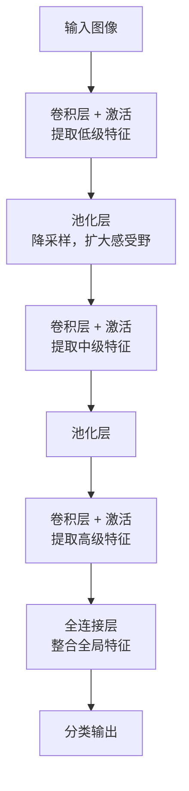
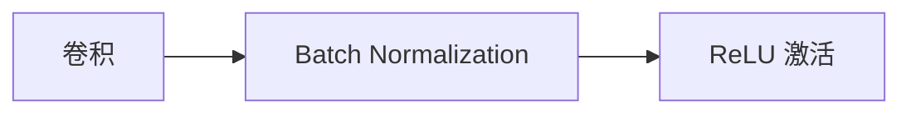

# 卷积神经网络

至此，我们已系统学习了深度神经网络的核心原理：前向传播、反向传播、激活函数、损失函数、梯度下降优化、权重初始化、正则化技术，等等。这些技术构成了训练深度网络的整套方法论，讨论以上技术时，我们都默认一个前提 —— 网络是全连接网络，即每层神经元与上一层所有神经元相连。但在处理图像相关的任务时，全连接网络经常面临**参数量爆炸**和**空间结构丢失**两个难题。

举个例子，一张 $224 \times 224 \times 3$ 的彩色图像，输入到全连接网络需要 $224 \times 224 \times 3 = 150,528$ 个输入神经元。哪怕第一个隐藏层仅有 $1000$ 个神经元，这一层的权重也有 $150,528 \times 1000 = 1.5$ 亿个参数。如此庞大的参数量不仅计算开销巨大，而且极易过拟合。更重要的是，全连接层将图像展平为一维向量，完全丢失了像素之间的空间邻接关系，图像中相邻像素通常构成有意义的局部特征（如边缘、纹理），而全连接层完全无法利用这种结构。

**卷积神经网络**（Convolutional Neural Network，CNN）正是为解决这两个问题而生。1998 年，法国计算机科学家杨立昆（Yann LeCun，图灵奖得主）在图像领域里程碑论文《Gradient-Based Learning Applied to Document Recognition》中提出了 LeNet-5 网络，这是第一个成功解决实际问题的卷积神经网络。LeNet-5 被用于手写数字识别，在美国银行支票读取系统中得到广泛认可。

杨立昆的设计灵感源于生物视觉系统的研究成果。1959 年，神经科学家大卫·休贝尔（David Hubel）和托斯坦·威塞尔（Torsten Wiesel）发现猫的视觉皮层通过局部感受野逐层提取特征，从简单特征（边缘、方向）到复杂特征（形状、物体）。CNN 模拟了这一层级特征提取过程，卷积层通过小型滤波器在图像上滑动提取局部特征，池化层降采样扩大感受野，多层堆叠后实现从局部到全局的特征抽象。这一设计理念至今仍是所有现代视觉网络的基石，AlexNet、VGG、ResNet 等经典模型都继承了 LeNet 的核心架构。

本章将介绍 CNN 的核心概念：卷积操作、池化操作、感受野、卷积层与全连接层的对比，以及 CNN 架构设计原则。理解这些基础是掌握 AlexNet、VGG、ResNet 等经典模型的前提。

## 卷积原理

想象一下你观看中学毕业照，要在大合照中寻找到自己所在的位置会怎么做？我相信肯定不会把合照转为数组或者其他数据结构来筛查，而是拿出放大镜，在大合照中来回扫描，匹配出一个个人脸的轮廓，直到找到自己。这正是卷积操作的思想，**卷积**（Convolution）让一个小型滤波器在图像上滑动扫描，在每个位置计算滤波器与图像局部区域的匹配程度，输出一张新的特征图。滤波器的参数决定它检测什么特征，有的滤波器检测水平边缘，有的检测垂直边缘，有的检测纹理，有的模糊图像。在 CNN 中，这些滤波器参数都不是人工设计的，而是通过训练自动学习到的，网络会找到最适合任务的特征检测方式。

更贴合实际的比喻是卷积操作在用一个探针在图像上逐位置探测。探针头（卷积核）是一个小型矩阵，譬如 $3 \times 3$ 的方格，每个格子里有个数值，将探针放在图像某个位置，探针的数值和图像对应位置的像素值相乘后求和，得到一个输出值。这个输出值反映该位置是否含有探针所寻找的特征。探针滑动完所有位置，就得到一张完整的特征响应图，如上图所示。

下面从数学角度定义卷积运算。设输入图像 $I$，卷积核 $K$，$(i, j)$ 是输出特征图的位置索引，表示卷积核滑动到第 $i$ 行第 $j$ 列，$(m, n)$ 是卷积核内部的偏移索引，遍历卷积核的每个位置。$I(i+m, j+n)$ 表示输入图像中与卷积核当前位置对应的像素值，$K(m, n)$ 表示卷积核中位置 $(m, n)$ 的参数值，卷积运算定义为：

$$S(i, j) = (I * K)(i, j) = \sum_m \sum_n I(i+m, j+n) K(m, n)$$

公式中 $*$ 符号表示的就是卷积运算，整体公式可以解读为在每个输出位置，计算卷积核与图像局部区域的匹配得分。这个定义并不好理解，我们通过一个具体数值例子来解释它。设输入图像为 $5 \times 5$ 矩阵，卷积核为 $3 \times 3$ 矩阵，如下图所示。


*图：卷积运算的完整过程*

计算输出位置 $(0, 0)$ 的值时，把卷积核覆盖输入图像左上角 $3 \times 3$ 区域，然后将对应元素相乘后，再将 $9$ 个乘积求和，结果填入特征图的 $(0, 0)$ 位置，计算过程如下：

$$S(0, 0) = 1 \times 1 + 2 \times 0 + 3 \times (-1) + 4 \times 1 + 5 \times 0 + 6 \times (-1) + 7 \times 1 + 8 \times 0 + 9 \times (-1) = -6$$

然后，卷积核向右滑动一格，计算输出位置 $(0, 1)$；滑动完一行后，向下移动到下一行，直至全部滑动完毕，输出完整的 $3 \times 3$ 的特征图。不同卷积核参数会提取不同类型的特征，得到不同的特征图。传统图像处理中，人们需要手工设计各种卷积核用于特定任务，以下是几种经典的手工设计卷积核：

| 卷积核 | 说明 | 卷积核矩阵 |
|:--|:--|:--|
| **边缘检测核**（Laplacian 核） | 中心值大（8）、周围负值（-1），当卷积核覆盖区域中心像素与周围差异大时，输出值较大，表明存在边缘 | $\begin{bmatrix} -1 & -1 & -1 \\ -1 & 8 & -1 \\ -1 & -1 & -1 \end{bmatrix}$ |
| **水平边缘核**（Sobel 水平核） | 上下两行数值相反（上行 1，下行 -1），检测水平方向的亮度变化。当图像局部区域上方亮、下方暗（或反之）时，输出值较大，表示存在水平边缘 | $\begin{bmatrix} 1 & 1 & 1 \\ 0 & 0 & 0 \\ -1 & -1 & -1 \end{bmatrix}$ |
| **垂直边缘核**（Sobel 垂直核） | 左右两列数值相反，检测垂直方向的亮度变化 | $\begin{bmatrix} 1 & 0 & -1 \\ 1 & 0 & -1 \\ 1 & 0 & -1 \end{bmatrix}$ |
| **模糊核**（均值滤波） | 所有值相等且和为 1，计算局部区域 9 个像素的平均值，产生模糊平滑效果 | $\frac{1}{9} \begin{bmatrix} 1 & 1 & 1 \\ 1 & 1 & 1 \\ 1 & 1 & 1 \end{bmatrix}$ |

通过以下代码，可以将卷积核作用于实际图像，直观感受不同卷积核生成特征图的效果：

```python runnable
import numpy as np
from PIL import Image
import matplotlib.pyplot as plt
from scipy.signal import convolve2d
import requests
from io import BytesIO

# 加载真实图片
response = requests.get("http://ai.icyfenix.cn/logo_min_size.png")
image_pil = Image.open(BytesIO(response.content))

# 转换为灰度图（卷积核通常作用于单通道）
if image_pil.mode != 'L':
    image_gray = image_pil.convert('L')

# 转换为 numpy 数组
image = np.array(image_gray, dtype=np.float32)
print(f"灰度图形状：{image.shape} (高度, 宽度)")
print(f"像素值范围：[{image.min():.1f}, {image.max():.1f}]")

# 边缘检测卷积核（拉普拉斯算子）
# 强调图像中亮度变化剧烈的区域，即边缘位置
edge_kernel = np.array([
    [-1, -1, -1],
    [-1,  8, -1],
    [-1, -1, -1]
])

# 模糊卷积核（均值滤波）
# 平滑图像，抑制噪声和细节
blur_kernel = np.array([
    [1/9, 1/9, 1/9],
    [1/9, 1/9, 1/9],
    [1/9, 1/9, 1/9]
])

# 应用卷积操作
edge_result = convolve2d(image, edge_kernel, mode='same')
blur_result = convolve2d(image, blur_kernel, mode='same')

# 对边缘检测结果取绝对值并归一化（便于可视化）
edge_display = np.abs(edge_result)
edge_display = (edge_display / edge_display.max() * 255).astype(np.uint8)

# 模糊结果直接显示
blur_display = blur_result.astype(np.uint8)

print(f"\n卷积结果形状：{edge_result.shape}")

# 并排展示三张图：原图、边缘检测、模糊
fig, axes = plt.subplots(1, 3, figsize=(14, 5))

axes[0].imshow(image, cmap='gray')
axes[0].set_title('Original Grayscale')
axes[0].axis('off')

axes[1].imshow(edge_display, cmap='gray')
axes[1].set_title('Edge Detection (Laplacian)')
axes[1].axis('off')

axes[2].imshow(blur_display, cmap='gray')
axes[2].set_title('Blur (Mean Filter)')
axes[2].axis('off')

plt.tight_layout()
plt.show()
plt.close()
```

手工设计卷积核需要专业的知识，且只能检测预定义的特征类型。CNN 的突破在于卷积核参数并不是人为预先定义的，而是通过反向传播训练学习。网络根据任务需求自动学习最适合的特征提取核，可能是某种边缘检测核，也可能是更复杂的纹理检测核，甚至人类无法解释的复合特征核。这种让网络自己学的方式，使 CNN 能提取丰富多样的特征，远超手工设计的局限。

以上讨论的都是基于灰度图像，对于彩色图像，需要用到**多通道卷积**。由于彩色图像有 RGB 三个颜色通道，输入为 $H \times W \times 3$ 的三维数组，卷积核也需要三个通道对应，每个通道独立卷积后求和，产生一个输出值：

$$S(i, j) = \sum_c \sum_m \sum_n I(i+m, j+n, c) K(m, n, c)$$

其中，$c$ 是通道索引，遍历所有输入通道（RGB 三通道时 $c=0,1,2$）。卷积结果由每个通道的输出值求和得到，一个通道的输出值由该通道与卷积核对应位置的乘积之和构成，一个卷积核产生一个输出通道（特征图）。若要产生多个输出通道，需要多个卷积核。在多通道卷积中，每个卷积核不仅覆盖空间维度，还覆盖所有输入通道。设输入通道数 $C_{in}$，输出通道数 $C_{out}$，卷积核空间尺寸 $k \times k$，则有：

- 卷积核数量：$C_{out}$ 个（每个产生一个输出通道）
- 每个卷积核尺寸：$k \times k \times C_{in}$（覆盖所有输入通道）
- 总参数量：$C_{out} \times k \times k \times C_{in} + C_{out}$（卷积核参数加偏置）

举个例子，输入 $224 \times 224 \times 3$（RGB 三通道），使用 64 个空间尺寸为 $3 \times 3$ 的卷积核（实际尺寸为 $3 \times 3 \times 3$）：

- 卷积核数量：64 个
- 每个卷积核尺寸：$3 \times 3 \times 3 = 27$ 参数
- 总参数量：$64 \times 27 + 64 = 1792$

对比全连接层处理同样输入输出需要 $224 \times 224 \times 3 \times 64 = 9,633,792$ 参数，卷积层仅为全连接层的 $0.02\%$。

除卷积核设计外，卷积操作还有**步长**和**填充**两个超参数，共同决定输出特征图的尺寸。**步长**（Stride）是卷积核每次滑动的距离。步长 $s=1$ 时，卷积核逐位置滑动（默认方式）；步长 $s=2$ 时，卷积核跳过一个位置滑动。步长越大，输出尺寸越小，特征图越压缩。**填充**（Padding）是在输入图像边缘添加额外像素（通常填零）。无填充（Valid Padding）时，输出尺寸小于输入；等保填充（Same Padding）时，输出尺寸与输入相同（步长为 1 时）。填充的作用是保留边缘信息，不加填充时，边缘像素只被卷积核覆盖一次，而中心像素被覆盖多次，边缘信息容易被忽略。设输入尺寸 $n \times n$，卷积核尺寸 $k \times k$，步长 $s$，填充 $p$，则输出尺寸为：

$$\text{输出尺寸} = \lfloor \frac{n + 2p - k}{s} \rfloor + 1$$


## 卷积层训练

卷积层的前向传播可以拆解为三个步骤：先根据输入尺寸、卷积核尺寸、步长和填充计算输出特征图的尺寸，再将每个卷积核在输入特征图上逐位置滑动做卷积运算，最后加上偏置并经过激活函数得到输出。设输入特征图尺寸为 $H_{in} \times W_{in}$，通道数为 $C_{in}$，卷积核空间尺寸为 $k \times k$，输出通道数为 $C_{out}$，则输出特征图的尺寸由上一节的公式给出：

$$H_{out} = \lfloor \frac{H_{in} + 2p - k}{s} \rfloor + 1, \quad W_{out} = \lfloor \frac{W_{in} + 2p - k}{s} \rfloor + 1$$

整个卷积层的输出为 $H_{out} \times W_{out} \times C_{out}$，每个输出通道的计算过程与前面讨论的多通道卷积公式完全一致。

卷积层反向传播的核心任务与全连接网络相同：计算损失函数对可学习参数的梯度，用于更新权重。卷积层的可学习参数是卷积核权重和偏置，因此需要计算 $\frac{\partial L}{\partial W}$ 和 $\frac{\partial b}$。此外，还需要计算损失对输入的梯度 $\frac{\partial L}{\partial I}$，将其传递给前一层。

**卷积核权重的梯度** 来源于输出梯度与对应输入区域的乘积。可以这样理解：某个位置的输入参与了前向传播的计算，它对损失的"责任"等于该位置的输入值乘以输出位置的误差信号。对所有输出位置求和，就得到卷积核的完整梯度：

$$\frac{\partial L}{\partial W} = \sum_{i, j} \frac{\partial L}{\partial S(i, j)} \cdot I_{region}(i, j)$$

这个求和操作在数学上等价于输入特征图与输出梯度的卷积。也就是说，卷积层的权重更新本质上就是一组卷积运算：用输出误差信号"探测"输入特征图，哪里响应强，哪里的权重就需要更大程度的调整。

**输入梯度的计算** 用于将误差信号传递给前一层。它的形式是输出梯度与翻转卷积核的"全卷积"（full convolution）：

$$\frac{\partial L}{\partial I} = \frac{\partial L}{\partial S} *_{full} \text{flip}(W)$$

其中 $\text{flip}(W)$ 将卷积核在空间维度上上下左右翻转，$*_{full}$ 是 full 卷积模式，使得输出尺寸大于输入。这个翻转操作与全连接网络中权重矩阵转相乘的原理相同——反向传播时，前向传播的权重矩阵需要以"逆向"方式使用。翻转后的卷积核将输出位置的误差信号扩散回所有覆盖了该位置的输入区域，完成梯度的反向传递。

以批量输入为例，设批次大小为 $N$，每个样本独立计算后累加。反向传播的完整过程如下：

**偏置梯度**最简单，由于前向传播中偏置被加到每个样本的每个输出通道上，反向传播只需将输出梯度沿批次和空间维度求和，得到每个输出通道的偏置梯度。

**卷积核权重的梯度**需要遍历每个输出位置。对于每个样本、每个输出通道、每个输出空间位置，取出前向传播时卷积核所覆盖的输入区域，将该输入区域与对应输出位置的误差信号相乘，累加到对应卷积核的梯度中。这个过程等价于输入特征图与输出梯度的卷积运算，其中输出梯度作为"探测信号"，在输入特征图上滑动，响应越强的区域对权重的梯度贡献越大。

**输入梯度的计算**同样需要遍历输出位置，但方向相反。对于每个输出位置，将对应的误差信号乘以卷积核的每个权重值，将结果"扩散"回输入梯度的对应区域。与全连接网络中误差信号需要乘以权重矩阵的转置同理，卷积中的反向传播需要将卷积核在空间维度上翻转后以 full 模式作用于输出梯度。实际实现时通常不显式翻转卷积核，而是在累加输入梯度时按对称索引访问卷积核参数，结果等价于翻转后的卷积运算。

**含步长和填充的处理**：前向传播中使用步长 $s>1$ 时，输出梯度在输入空间上是稀疏的，输入梯度的对应位置每隔 $s$ 个位置才接收梯度，其余位置梯度为零。前向传播中对输入进行了零填充时，反向传播先计算填充后的输入梯度，最后去除填充边界部分的梯度，得到与原始输入尺寸匹配的梯度。

需要说明的是，以上按位置遍历的描述为了直观展示计算过程，实际深度学习框架中会使用 im2col 等技巧将卷积转换为矩阵乘法，利用 GPU 并行加速。但无论实现如何优化，前向传播的局部卷积和反向传播的梯度累积这两个核心操作不会改变。

## 池化操作

卷积操作提取特征后，特征图的尺寸仍然较大。若直接输入下一层，计算量会持续累积。**池化**（Pooling）是一种降采样操作，将特征图划分为小块，每个块取一个代表值，缩小特征图尺寸。

池化的核心思想是：局部区域内的特征往往冗余 —— 相邻位置的响应值相似，取一个代表值足以概括区域信息。这类似于图像压缩中的"块压缩"，用少量信息代表大量数据。

池化的主要作用：

1. **降低维度**：减少特征图尺寸，降低计算量，防止计算开销逐层累积
2. **减少参数**：后续层输入变小，参数量减少，降低过拟合风险
3. **增加鲁棒性**：局部小变化不影响池化输出。例如最大池化取区域最大值，即使最大值位置小幅偏移，输出值仍然相同
4. **扩大感受野**：每个输出位置对应更大输入区域，帮助后续层捕捉更全局的特征

### 最大池化

**最大池化**（Max Pooling）在每个池化窗口内取最大值作为输出。它保留局部区域最显著的特征 —— 假设最大响应值代表最强烈的特征信号。

设输入 $4 \times 4$ 特征图，池化窗口 $2 \times 2$，步长 $2$：

| 1 | 3 | 2 | 4 |
|:---:|:---:|:---:|:---:|
| 5 | **6** | 7 | **8** |
| **9** | 2 | 3 | 1 |
| 4 | 5 | **6** | **7** |

划分为四个 $2 \times 2$ 区域，取各区域最大值：

- 左上区域（1, 3, 5, 6）：最大值 6
- 右上区域（2, 4, 7, 8）：最大值 8
- 左下区域（9, 2, 4, 5）：最大值 9
- 右下区域（3, 1, 6, 7）：最大值 7

输出 $2 \times 2$ 特征图：

| 6 | 8 |
|:---:|:---:|
| 9 | 7 |

最大池化保留最强烈的特征响应，对局部位置变化不敏感。即使特征在区域内小幅移动，只要仍位于区域内，输出值不变。这种特性称为**局部平移不变性**，使 CNN 对物体位置的轻微变化更鲁棒。

### 平均池化

**平均池化**（Average Pooling）在每个池化窗口内取平均值作为输出。它平滑特征，保留区域的整体信息而非最显著点。

同样输入 $4 \times 4$ 特征图，池化窗口 $2 \times 2$，步长 $2$：

- 左上区域：(1+3+5+6)/4 = 3.75
- 右上区域：(2+4+7+8)/4 = 5.25
- 左下区域：(9+2+4+5)/4 = 5.00
- 右下区域：(3+1+6+7)/4 = 4.25

输出 $2 \times 2$ 特征图：

| 3.75 | 5.25 |
|:---:|:---:|
| 5.00 | 4.25 |

平均池化保留区域的平均响应水平，适合需要整体信息的场景。现代 CNN 中，最大池化更常用，因为分类任务通常关注"有没有这个特征"而非"平均有多少"。平均池化常用于网络末端的全局平均池化（Global Average Pooling），将整个特征图压缩为一个值。

### 池化参数与输出尺寸

池化窗口大小通常为 $2 \times 2$ 或 $3 \times 3$，步长通常等于窗口大小（无重叠池化）。设输入尺寸 $n \times n$，池化窗口 $k \times k$，步长 $s$，输出尺寸为：

$$\text{输出尺寸} = \lfloor \frac{n - k}{s} \rfloor + 1$$

这个公式与卷积输出尺寸公式相似，但少了填充项（池化通常不填充）：
- $n$ 是输入特征图尺寸
- $k$ 是池化窗口尺寸 —— 窗口覆盖 $k$ 个位置
- $s$ 是步长 —— 窗口每次移动的距离
- $\frac{n - k}{s}$ 表示窗口能滑动的次数
- $+1$ 加上初始位置，得到输出位置总数

**示例**：输入 $4 \times 4$，池化窗口 $2 \times 2$，步长 $2$：

$$\text{输出} = \lfloor \frac{4 - 2}{2} \rfloor + 1 = \lfloor 1 \rfloor + 1 = 2$$

输出尺寸为 $2 \times 2$，是输入的 $1/4$。

### 池化层的反向传播

**最大池化反向传播**：

梯度只传递给产生最大值的位置，其他位置梯度为零。

记录前向传播时每个窗口最大值的位置，反向传播时将梯度放在对应位置。

**平均池化反向传播**：

梯度平均分配给窗口内所有位置。

设窗口大小 $k \times k$，输出位置梯度 $\delta$：

每个输入位置梯度 = $\delta / (k \times k)$

## 感受野概念

卷积层和池化层堆叠多层后，深层的每个输出位置究竟"看到"了输入图像的多少区域？这个问题的答案就是**感受野** —— 它决定了网络能捕捉多大范围的上下文信息。

### 什么是感受野

**感受野**（Receptive Field）指输出特征图中一个位置对应的输入图像区域大小。单个卷积位置的初始感受野等于卷积核大小。但多层堆叠后，深层位置的感受野会扩大 —— 每个位置受更大输入区域影响，能捕捉更全局的信息。

感受野的计算可以用递推公式表示。设第 $l$ 层感受野 $R_l$，卷积核大小 $k_l$，步长 $s_l$，前 $l-1$ 层步长累积 $\prod_{i=1}^{l-1} s_i$：

$$R_l = R_{l-1} + (k_l - 1) \times \prod_{i=1}^{l-1} s_i$$

这个公式看着抽象，拆开来看含义很直观：
- $R_{l-1}$ 是前一层的感受野 —— 第 $l$ 层的每个输入位置对应输入图像中 $R_{l-1}$ 大小的区域
- $k_l$ 是当前层的卷积核大小 —— 第 $l$ 层的每个输出位置连接 $k_l$ 个输入位置
- $(k_l - 1)$ 是新增感受野扩展量 —— 卷积核覆盖 $k_l$ 个位置，但相邻位置的感受野有重叠，新增的"边缘"感受野是 $k_l - 1$
- $\prod_{i=1}^{l-1} s_i$ 是前 $l-1$ 层步长的累积乘积 —— 表示第 $l$ 层输入位置之间的间隔，间隔越大，感受野扩展越快
- 整体公式可以理解为：当前层感受野 = 前层感受野 + 新增边缘 × 位置间隔

初始感受野 $R_0 = 1$（输入层单个像素）。

### 感受野逐层扩大示例

设网络结构为三层卷积，每层卷积核 $3 \times 3$，步长 $1$：

| 层 | 卷积核大小 | 步长 | 步长累积 | 感受野计算 | 感受野大小 |
|:---:|:---:|:---:|:---:|:---|:---:|
| 输入层 | - | - | 1 | - | $1 \times 1$ |
| Layer 1 | $3$ | $1$ | 1 | $R_1 = 1 + (3-1) \times 1 = 3$ | $3 \times 3$ |
| Layer 2 | $3$ | $1$ | 1 | $R_2 = 3 + (3-1) \times 1 = 5$ | $5 \times 5$ |
| Layer 3 | $3$ | $1$ | 1 | $R_3 = 5 + (3-1) \times 1 = 7$ | $7 \times 7$ |

Layer 3 的每个输出位置对应输入图像 $7 \times 7$ 区域。三层 $3 \times 3$ 卷积的感受野等于一层 $7 \times 7$ 卷积的感受野。这就是为什么现代 CNN 常用多层小卷积核替代单层大卷积核 —— 感受野相同，但参数更少（$3 \times 3 \times 3 = 27$ vs $7 \times 7 = 49$），非线性变换更多。

加入池化层后，步长累积增大，感受野扩大更快：

| 层 | 操作 | 卷积核/池化大小 | 步长 | 步长累积 | 感受野 |
|:---:|:---:|:---:|:---:|:---:|:---:|
| 输入层 | - | - | - | 1 | $1 \times 1$ |
| Layer 1 | 卷积 | $3$ | $1$ | 1 | $3 \times 3$ |
| Layer 2 | 池化 | $2$ | $2$ | $1 \times 1 = 1$ | $3 + (2-1) \times 1 = 4$ |
| Layer 3 | 卷积 | $3$ | $1$ | $1 \times 1 \times 2 = 2$ | $4 + (3-1) \times 2 = 8$ |

池化步长 $2$ 使后续层的步长累积翻倍（$1 \to 2$），Layer 3 感受野扩大到 $8 \times 8$。步长累积越大，感受野增长越快。

### 有效感受野

理论感受野计算的是覆盖区域，但区域内各像素对输出的影响不同 —— 中心像素影响大，边缘像素影响小。

**有效感受野**（Effective Receptive Field）指实际对输出有显著影响的区域，通常小于理论感受野，近似呈高斯分布。

感受野的重要性：

1. **特征尺度匹配**：深层感受野大，能捕捉全局特征；浅层感受野小，捕捉局部特征
2. **网络深度设计**：若输入图像 $224 \times 224$，最后一层感受野应足够大（至少 $224$）才能覆盖全图
3. **目标检测**：检测大目标需要大感受野，检测小目标需要小感受野

## 卷积层与全连接层的对比

### 参数量对比

设输入 $224 \times 224 \times 3$ 彩色图像，输出 64 个特征。

**全连接层参数量**：

输入神经元数：$224 \times 224 \times 3 = 150,528$
输出神经元数：$64$

权重参数：$150,528 \times 64 = 9,633,792$（约 960 万）
偏置参数：$64$

总参数量：$9,633,856$

**卷积层参数量**（卷积核 $3 \times 3$）：

每个卷积核参数：$3 \times 3 \times 3 = 27$（3 通道）
卷积核数量：$64$
偏置参数：$64$

总参数量：$27 \times 64 + 64 = 1,792$

卷积层参数量仅为全连接层的 $\frac{1,792}{9,633,856} \approx 0.02\%$。

### 计算量对比

**全连接层计算量**：

每个输出神经元计算：$150,528$ 次乘法 + $150,528$ 次加法 + 1 次偏置加法
总输出神经元：$64$

总计算量：$64 \times (150,528 \times 2) \approx 19.3$ 百万次运算

**卷积层计算量**：

输出尺寸（假设无填充）：$(224-3+1) = 222$，即 $222 \times 222$
每个输出位置计算：$3 \times 3 \times 3 = 27$ 次乘法 + $26$ 次加法 + 1 次偏置加法
输出通道数：$64$

总计算量：$222 \times 222 \times 64 \times 28 \approx 10$ 百万次运算

虽然计算量相近，但卷积层参数量极小，不易过拟合。

### 结构特性对比

| 特性 | 全连接层 | 卷积层 |
|:----|:--------|:------|
| 连接方式 | 每个输出连接所有输入 | 每个输出连接局部输入 |
| 参数共享 | 不同位置独立参数 | 不同位置共享卷积核 |
| 空间结构 | 展平为一维，丢失结构 | 保留二维结构 |
| 参数量 | 极大（$n_{in} \times n_{out}$） | 极小（$k \times k \times C_{in} \times C_{out}$） |
| 特征类型 | 全局特征 | 局部特征 |
| 适用场景 | 最终分类层 | 特征提取层 |

**参数共享的意义**：

卷积核在图像各位置使用相同参数，这基于**局部特征平移不变性**假设 —— 边缘、纹理等特征在任何位置具有相似模式，同一卷积核可以检测所有位置的特征。

参数共享大幅减少参数量，使 CNN 能在有限数据上训练深层网络。

## CNN 架构设计原则

理解卷积、池化、感受野等核心概念后，如何组合这些组件构建有效的 CNN 架构？本节介绍 CNN 设计的通用原则。

### 层级特征提取

CNN 采用层级结构，逐层提取从简单到复杂的特征。这种设计模拟了生物视觉系统的信息处理方式：

- **浅层**：小感受野，提取边缘、颜色、纹理等低级特征。这些特征是图像的基本组成元素
- **中层**：中等感受野，提取形状、局部结构等中级特征。将低级特征组合成有意义的部件
- **深层**：大感受野，提取物体部件、整体结构等高级特征。实现从局部到全局的抽象

典型 CNN 结构遵循"卷积 - 激活 - 池化"重复堆叠的模式：



### 卷积核尺寸选择

常用卷积核尺寸：

- **$3 \times 3$**：最常用，计算量小，两层 $3 \times 3$ 卷积感受野等于一层 $5 \times 5$
- **$5 \times 5$**：较大感受野，但计算量大（$5 \times 5 = 25$ vs $3 \times 3 \times 2 = 18$）
- **$1 \times 1$**：不改变感受野，用于通道数调整（降维/升维）

**$1 \times 1$ 卷积的作用**：

1. **通道降维**：输入 $H \times W \times C_{in}$，输出 $H \times W \times C_{out}$，若 $C_{out} < C_{in}$，减少通道数
2. **增加非线性**：$1 \times 1$ 卷积后加激活函数，增加网络非线性表达能力
3. **跨通道信息融合**：每个输出位置融合所有输入通道的信息

### 通道数递增设计

CNN 通常采用**通道数递增**设计：浅层通道少，深层通道多。典型设计是每经过一次池化，通道数翻倍。

| 层 | 空间尺寸 | 通道数 | 说明 |
|:---|:---:|:---:|:---|
| 输入 | $224 \times 224$ | 3 | RGB 图像 |
| Conv1 | $224 \times 224$ | 64 | 第一层卷积 |
| Pool1 | $112 \times 112$ | 64 | 第一次池化，空间减半 |
| Conv2 | $112 \times 112$ | 128 | 通道翻倍 |
| Pool2 | $56 \times 56$ | 128 | 空间再减半 |
| Conv3 | $56 \times 56$ | 256 | 通道翻倍 |
| Pool3 | $28 \times 28$ | 256 | 空间再减半 |

通道数递增的原因：

1. **浅层特征简单**：边缘、纹理等基础特征种类有限，少量通道足以表示
2. **深层特征复杂**：物体部件的组合方式多样，需要更多通道捕捉不同的组合模式
3. **空间尺寸递减**：池化降采样后，空间尺寸变小，增加通道数补偿信息损失，保持总体信息量

### 激活函数与归一化

CNN 激活函数选择与全连接网络类似，但更强调计算效率：

- **ReLU**：最常用，计算极快（仅比较运算），缓解梯度消失，适合深层网络
- **Leaky ReLU**：ReLU 改进版，负值区域有小梯度，避免神经元死亡问题
- **ELU**：负值区域平滑，输出均值接近零，有助于稳定训练

CNN 归一化技术：

- **Batch Normalization**：卷积层后通常加 BN，稳定训练，加速收敛。BN 对每个通道独立归一化，使用批次统计
- **Layer Normalization**：某些场景替代 BN，如小批次训练或序列模型

典型卷积块结构：



这个顺序（Conv → BN → ReLU）是现代 CNN 的标准配置。BN 在激活前归一化，使激活函数输入分布稳定。

### 池化层位置与替代方案

池化层通常放在卷积块之后，定期降采样：

- **降采样频率**：每 2-3 个卷积块后一次池化，避免过度压缩
- **池化方式**：最大池化（保留显著特征）或步长 2 卷积（参数化降采样）

**步长 2 卷积替代池化**：使用步长 $s=2$ 的卷积代替 $2 \times 2$ 池化。优点是卷积核参数可学习，降采样方式更灵活；缺点是增加参数量。现代 CNN（如 ResNet）常使用步长 2 卷积替代池化，简化架构。

### 全连接层设计

CNN 末端通常用全连接层整合全局特征进行分类。传统流程是：Flatten（展平多维特征图）→ 全连接层 → Dropout → Softmax。

全连接层参数量大，容易成为过拟合的来源。现代 CNN 常采用替代方案减少或取消全连接层：

**全局平均池化**（Global Average Pooling，GAP）：每个通道取平均值，输出 $C$ 个值，直接输入 Softmax。GAP 完全消除了全连接层参数，强迫每个通道学习一个类别的特征。

**1×1 卷积降维**：先用 $1 \times 1$ 卷积减少通道数，再接较小的全连接层。例如特征图 $7 \times 7 \times 512$，先用 $1 \times 1$ 卷积降到 64 通道，再 Flatten 接全连接层，参数量减少 8 倍。

## 卷积操作实验验证

下面通过代码实验验证卷积和池化操作的效果，直观展示不同卷积核提取的特征、池化的降维效果、感受野的逐层扩大。

实验包括四个部分：
1. **不同卷积核的效果**：用手工设计的卷积核（边缘检测、模糊、锐化）处理测试图像，观察特征提取效果
2. **池化操作的效果**：对卷积结果应用最大池化和平均池化，观察降维和特征保留
3. **感受野计算验证**：计算典型 CNN 结构各层的感受野，验证递推公式
4. **参数量对比验证**：对比卷积层和全连接层的参数量，验证 CNN 的参数优势

```python runnable
import numpy as np
import matplotlib.pyplot as plt

print("=" * 60)
print("实验：卷积操作与特征提取")
print("=" * 60)
print()

# 创建示例图像
def create_test_image():
    """创建带有边缘和纹理的测试图像"""
    image = np.zeros((32, 32))
    
    # 添加水平条纹
    image[8:12, :] = 1.0
    image[20:24, :] = 1.0
    
    # 添加垂直条纹
    image[:, 8:12] = 1.0
    image[:, 20:24] = 1.0
    
    # 中心方块
    image[12:20, 12:20] = 0.5
    
    return image

# 卷积操作实现
def conv2d(image, kernel, stride=1, padding=0):
    """
    2D 卷积操作
    image: 输入图像 (H, W)
    kernel: 卷积核 (kH, kW)
    stride: 步长
    padding: 填充
    """
    # 填充
    if padding > 0:
        image_padded = np.pad(image, padding, mode='constant', constant_values=0)
    else:
        image_padded = image
    
    H, W = image_padded.shape
    kH, kW = kernel.shape
    
    # 输出尺寸
    H_out = (H - kH) // stride + 1
    W_out = (W - kW) // stride + 1
    
    output = np.zeros((H_out, W_out))
    
    # 卷积计算
    for i in range(H_out):
        for j in range(W_out):
            h_start = i * stride
            w_start = j * stride
            region = image_padded[h_start:h_start+kH, w_start:w_start+kW]
            output[i, j] = np.sum(region * kernel)
    
    return output

# 池化操作实现
def max_pool2d(image, pool_size=2, stride=2):
    """最大池化"""
    H, W = image.shape
    H_out = (H - pool_size) // stride + 1
    W_out = (W - pool_size) // stride + 1
    
    output = np.zeros((H_out, W_out))
    
    for i in range(H_out):
        for j in range(W_out):
            h_start = i * stride
            w_start = j * stride
            region = image[h_start:h_start+pool_size, w_start:w_start+pool_size]
            output[i, j] = np.max(region)
    
    return output

def avg_pool2d(image, pool_size=2, stride=2):
    """平均池化"""
    H, W = image.shape
    H_out = (H - pool_size) // stride + 1
    W_out = (W - pool_size) // stride + 1
    
    output = np.zeros((H_out, W_out))
    
    for i in range(H_out):
        for j in range(W_out):
            h_start = i * stride
            w_start = j * stride
            region = image[h_start:h_start+pool_size, w_start:w_start+pool_size]
            output[i, j] = np.mean(region)
    
    return output

# 创建测试图像
test_image = create_test_image()

print("实验1：不同卷积核的效果")
print("-" * 40)

# 定义不同卷积核
kernels = {
    '水平边缘检测': np.array([[1, 1, 1], [0, 0, 0], [-1, -1, -1]], dtype=np.float32),
    '垂直边缘检测': np.array([[1, 0, -1], [1, 0, -1], [1, 0, -1]], dtype=np.float32),
    '边缘增强': np.array([[-1, -1, -1], [-1, 8, -1], [-1, -1, -1]], dtype=np.float32),
    '模糊': np.array([[1, 1, 1], [1, 1, 1], [1, 1, 1]], dtype=np.float32) / 9,
    '锐化': np.array([[0, -1, 0], [-1, 5, -1], [0, -1, 0]], dtype=np.float32)
}

# 应用不同卷积核
outputs = {}
for name, kernel in kernels.items():
    output = conv2d(test_image, kernel)
    outputs[name] = output
    print(f"{name}: 输入 {test_image.shape} → 输出 {output.shape}")

# 可视化卷积效果
fig, axes = plt.subplots(2, 3, figsize=(14, 10))

# 原图像
axes[0, 0].imshow(test_image, cmap='gray', vmin=0, vmax=1)
axes[0, 0].set_title('原始图像', fontsize=12, fontweight='bold')
axes[0, 0].axis('off')

# 卷积结果
positions = [(0, 1), (0, 2), (1, 0), (1, 1), (1, 2)]
kernel_names = list(kernels.keys())

for idx, (name, pos) in enumerate(zip(kernel_names, positions)):
    ax = axes[pos]
    output = outputs[name]
    
    # 根据输出值范围调整显示
    if name == '模糊':
        ax.imshow(output, cmap='gray', vmin=0, vmax=1)
    else:
        ax.imshow(output, cmap='RdBu', vmin=-output.max(), vmax=output.max())
    
    ax.set_title(f'{name}\n输出: {output.shape}', fontsize=11)
    ax.axis('off')

plt.tight_layout()
plt.show()
plt.close()

print("\n" + "=" * 60)
print("实验2：池化操作的效果")
print("-" * 40)

# 使用边缘检测结果进行池化
edge_output = outputs['边缘增强']

# 最大池化
max_pooled = max_pool2d(edge_output, pool_size=2, stride=2)
print(f"最大池化: {edge_output.shape} → {max_pooled.shape}")

# 平均池化
avg_pooled = avg_pool2d(edge_output, pool_size=2, stride=2)
print(f"平均池化: {edge_output.shape} → {avg_pooled.shape}")

# 多级池化
max_pooled_2 = max_pool2d(max_pooled, pool_size=2, stride=2)
print(f"二次最大池化: {max_pooled.shape} → {max_pooled_2.shape}")

# 可视化池化效果
fig, axes = plt.subplots(2, 2, figsize=(10, 10))

axes[0, 0].imshow(edge_output, cmap='RdBu', vmin=-edge_output.max(), vmax=edge_output.max())
axes[0, 0].set_title(f'边缘检测结果\n尺寸: {edge_output.shape}', fontsize=12, fontweight='bold')
axes[0, 0].axis('off')

axes[0, 1].imshow(max_pooled, cmap='RdBu', vmin=-max_pooled.max(), vmax=max_pooled.max())
axes[0, 1].set_title(f'最大池化\n尺寸: {max_pooled.shape}', fontsize=11)
axes[0, 1].axis('off')

axes[1, 0].imshow(avg_pooled, cmap='RdBu', vmin=-avg_pooled.max(), vmax=avg_pooled.max())
axes[1, 0].set_title(f'平均池化\n尺寸: {avg_pooled.shape}', fontsize=11)
axes[1, 0].axis('off')

axes[1, 1].imshow(max_pooled_2, cmap='RdBu', vmin=-max_pooled_2.max(), vmax=max_pooled_2.max())
axes[1, 1].set_title(f'二次最大池化\n尺寸: {max_pooled_2.shape}', fontsize=11)
axes[1, 1].axis('off')

plt.tight_layout()
plt.show()
plt.close()

print("\n" + "=" * 60)
print("实验3：感受野计算验证")
print("-" * 40)

# 构建多层卷积网络并计算感受野
def compute_receptive_field(layers):
    """
    计算感受野
    layers: 列表，每层包含 (kernel_size, stride) 元组
    """
    rf = 1  # 初始感受野（输入层）
    jump = 1  # 步长累积
    
    print("\n各层感受野:")
    print(f"输入层: 感受野 {rf}×{rf}")
    
    for i, (k, s) in enumerate(layers):
        rf = rf + (k - 1) * jump
        jump = jump * s
        print(f"Layer {i+1}: 感受野 {rf}×{rf}, 步长累积 {jump}")
    
    return rf

# 计算典型 CNN 结构的感受野
print("\n典型 CNN 结构（VGG风格）:")
vgg_layers = [(3, 1), (3, 1), (2, 2),  # Conv-Conv-Pool
              (3, 1), (3, 1), (2, 2),  # Conv-Conv-Pool
              (3, 1), (3, 1), (3, 1), (2, 2)]  # Conv-Conv-Conv-Pool
rf = compute_receptive_field(vgg_layers)

# 对比：ResNet 风格（步长2卷积替代池化）
print("\nResNet风格（步长2卷积）:")
resnet_layers = [(3, 1), (3, 1), (3, 2),  # Conv-Conv-Conv(步长2)
                 (3, 1), (3, 1), (3, 2),  # Conv-Conv-Conv(步长2)
                 (3, 1), (3, 1), (3, 2)]  # Conv-Conv-Conv(步长2)
rf = compute_receptive_field(resnet_layers)

print("\n" + "=" * 60)
print("实验4：参数量对比验证")
print("-" * 40)

def count_conv_params(input_channels, output_channels, kernel_size):
    """计算卷积层参数量"""
    weights = output_channels * kernel_size * kernel_size * input_channels
    biases = output_channels
    return weights + biases

def count_fc_params(input_size, output_size):
    """计算全连接层参数量"""
    weights = input_size * output_size
    biases = output_size
    return weights + biases

# 输入图像尺寸
image_size = 224
input_channels = 3

print(f"\n输入图像: {image_size}×{image_size}×{input_channels}")

# 全连接层（假设输出 64 个神经元）
fc_params = count_fc_params(image_size * image_size * input_channels, 64)
print(f"\n全连接层参数量:")
print(f"  输入神经元: {image_size * image_size * input_channels}")
print(f"  输出神经元: 64")
print(f"  总参数量: {fc_params:,}")

# 卷积层（假设 64 个输出通道，3×3 卷积核）
conv_params = count_conv_params(input_channels, 64, 3)
print(f"\n卷积层参数量:")
print(f"  输入通道: {input_channels}")
print(f"  输出通道: 64")
print(f"  卷积核大小: 3×3")
print(f"  总参数量: {conv_params:,}")

# 参数量对比
ratio = conv_params / fc_params
print(f"\n参数量对比: 卷积层仅为全连接层的 {ratio:.4%}")

print("\n实验结论:")
print("-" * 40)
print("1. 不同卷积核提取不同特征：水平边缘、垂直边缘、边缘增强等")
print("2. 池化操作降低维度：最大池化保留显著特征，平均池化平滑特征")
print("3. 感受野逐层扩大：多层卷积堆叠，深层位置对应更大输入区域")
print("4. 卷积层参数量远小于全连接层：参数共享大幅减少参数")
print("5. CNN 设计原则：层级特征提取、通道数递增、池化降采样")
print("=" * 60)
```

### 实验结论

实验验证了 CNN 核心概念：

1. **卷积核效果**：不同卷积核提取不同特征，水平边缘核检测水平条纹，垂直边缘核检测垂直条纹，边缘增强核突出边缘位置

2. **池化降维**：最大池化保留显著特征，平均池化平滑特征。二次池化进一步降维，感受野扩大

3. **感受野计算**：VGG 风格（卷积 + 池化）和 ResNet 风格（步长 2 卷积）感受野逐层扩大。深层感受野覆盖大输入区域

4. **参数量对比**：$224 \times 224 \times 3$ 输入，64 输出通道：
   - 全连接层：$9,633,856$ 参数
   - 卷积层（$3 \times 3$）：$1,792$ 参数
   - 卷积层仅为全连接层的 $0.02\%$

## 本章小结

本章介绍了卷积神经网络的核心概念：

**卷积操作**：卷积核在图像上滑动，提取局部特征。卷积核参数通过训练学习，自动适应任务需求。卷积层参数量极小，计算高效，保留空间结构。

**池化操作**：降采样降低维度，减少参数量。最大池化保留显著特征，平均池化平滑特征。池化扩大感受野，增加对局部变化的鲁棒性。

**感受野**：输出位置对应的输入区域大小。多层堆叠后感受野逐层扩大。深层位置覆盖大输入区域，能捕捉全局特征。

**卷积层 vs 全连接层**：卷积层局部连接、参数共享、保留空间结构。全连接层全局连接、参数独立、丢失空间结构。卷积层参数量远小于全连接层。

**CNN 架构设计原则**：层级特征提取（浅层局部特征，深层全局特征），通道数递增，池化降采样，激活函数和归一化稳定训练，全连接层整合分类。

本章是理解 CNN 的基础。下一章将介绍 AlexNet，展示 CNN 在 ImageNet 大规模图像识别竞赛中的突破性成果，开启深度学习在视觉领域的新纪元。

## 练习题

1. 推导卷积层输出尺寸公式。设输入尺寸 $n \times n$，卷积核尺寸 $k \times k$，步长 $s$，填充 $p$，证明输出尺寸为 $\lfloor \frac{n + 2p - k}{s} \rfloor + 1$。
    <details>
    <summary>参考答案</summary>
    
    **卷积层输出尺寸推导**：
    
    **基本设定**：
    
    - 输入图像尺寸：$n \times n$
    - 卷积核尺寸：$k \times k$
    - 步长：$s$
    - 填充：$p$（每侧填充 $p$ 个像素）
    
    **填充后的输入尺寸**：
    
    原输入尺寸 $n$，每侧填充 $p$，填充后尺寸：
    
    $$n' = n + 2p$$
    
    （左侧填充 $p$，右侧填充 $p$，共 $2p$）
    
    **卷积核覆盖范围**：
    
    卷积核从左上角开始滑动。设输出位置索引 $i$（从 0 开始），卷积核覆盖的输入起始位置：
    
    $$\text{start}_i = i \times s$$
    
    卷积核覆盖的输入结束位置：
    
    $$\text{end}_i = \text{start}_i + k - 1$$
    
    （因为卷积核覆盖 $k$ 个位置，从 $\text{start}_i$ 到 $\text{start}_i + k - 1$）
    
    **最后一个有效输出位置**：
    
    最后一个输出位置必须使卷积核完全在填充后的输入范围内：
    
    $$\text{end}_{last} = \text{start}_{last} + k - 1 \leq n' - 1$$
    
    代入 $\text{start}_{last} = i_{last} \times s$：
    
    $$i_{last} \times s + k - 1 \leq n' - 1$$
    
    解得：
    
    $$i_{last} \times s \leq n' - k$$
    
    $$i_{last} \leq \frac{n' - k}{s}$$
    
    最大整数输出位置：
    
    $$i_{last} = \lfloor \frac{n' - k}{s} \rfloor$$
    
    **输出尺寸计算**：
    
    输出位置索引从 0 到 $i_{last}$，共 $i_{last} + 1$ 个位置：
    
    $$\text{输出尺寸} = i_{last} + 1 = \lfloor \frac{n' - k}{s} \rfloor + 1$$
    
    代入 $n' = n + 2p$：
    
    $$\text{输出尺寸} = \lfloor \frac{n + 2p - k}{s} \rfloor + 1$$
    
    **数值验证**：
    
    示例 1：输入 $5 \times 5$，卷积核 $3 \times 3$，步长 $1$，无填充（$p=0$）：
    
    $$\text{输出} = \lfloor \frac{5 + 0 - 3}{1} \rfloor + 1 = \lfloor 2 \rfloor + 1 = 3$$
    
    输出 $3 \times 3$，验证正确。
    
    示例 2：输入 $5 \times 5$，卷积核 $3 \times 3$，步长 $1$，填充 $1$：
    
    $$\text{输出} = \lfloor \frac{5 + 2 - 3}{1} \rfloor + 1 = \lfloor 4 \rfloor + 1 = 5$$
    
    输出 $5 \times 5$（与输入相同），验证正确。
    
    示例 3：输入 $7 \times 7$，卷积核 $3 \times 3$，步长 $2$，无填充：
    
    $$\text{输出} = \lfloor \frac{7 + 0 - 3}{2} \rfloor + 1 = \lfloor 2 \rfloor + 1 = 3$$
    
    输出 $3 \times 3$，验证正确。
    
    示例 4：输入 $224 \times 224$，卷积核 $7 \times 7$，步长 $2$，填充 $3$：
    
    $$\text{输出} = \lfloor \frac{224 + 6 - 7}{2} \rfloor + 1 = \lfloor 111.5 \rfloor + 1 = 112$$
    
    输出 $112 \times 112$，验证正确（ResNet 第一层）。
    
    **特殊情况**：
    
    1. **步长 1，填充使输出等于输入**（Same Padding）：
    
    $$\lfloor \frac{n + 2p - k}{1} \rfloor + 1 = n$$
    
    解得：
    
    $$n + 2p - k = n - 1$$
    
    $$2p = k - 1$$
    
    $$p = \frac{k - 1}{2}$$
    
    当步长 $1$，填充 $p = \frac{k-1}{2}$ 时，输出尺寸等于输入尺寸。
    
    - $k = 3$：$p = 1$
    - $k = 5$：$p = 2$
    - $k = 7$：$p = 3$
    
    2. **输入尺寸不匹配步长**：
    
    若 $\frac{n + 2p - k}{s}$ 不是整数，输出尺寸向下取整，部分输入区域未被覆盖。
    
    设计时需确保 $n + 2p - k$ 能被 $s$ 整除，避免信息丢失。
    
    **总结**：
    
    卷积层输出尺寸公式：
    
    $$\text{输出尺寸} = \lfloor \frac{n + 2p - k}{s} \rfloor + 1$$
    
    推导过程：
    
    1. 填充后输入尺寸 $n' = n + 2p$
    2. 卷积核最后覆盖位置 $\text{end}_{last} = i_{last} \times s + k - 1 \leq n' - 1$
    3. 解得 $i_{last} = \lfloor \frac{n' - k}{s} \rfloor$
    4. 输出位置数 $i_{last} + 1$
    
    该公式适用于任何卷积层输出尺寸计算。
    </details>

2. 计算三层卷积网络的感受野。设 Layer 1 卷积核 $5 \times 5$，步长 $1$；Layer 2 卷积核 $3 \times 3$，步长 $1$；Layer 3 卷积核 $3 \times 3$，步长 $2$。推导并计算 Layer 3 的感受野。
    <details>
    <summary>参考答案</summary>
    
    **三层卷积网络感受野计算**：
    
    **感受野递推公式**：
    
    设第 $l$ 层感受野 $R_l$，卷积核大小 $k_l$，步长 $s_l$，前 $l-1$ 层步长累积 $\prod_{i=1}^{l-1} s_i$：
    
    $$R_l = R_{l-1} + (k_l - 1) \times \prod_{i=1}^{l-1} s_i$$
    
    初始感受野 $R_0 = 1$（输入单个像素）。
    
    **给定网络结构**：
    
    - Layer 1：卷积核 $k_1 = 5$，步长 $s_1 = 1$
    - Layer 2：卷积核 $k_2 = 3$，步长 $s_2 = 1$
    - Layer 3：卷积核 $k_3 = 3$，步长 $s_3 = 2$
    
    **逐层计算**：
    
    **Layer 1**：
    
    $$R_1 = R_0 + (k_1 - 1) \times \prod_{i=1}^{0} s_i = 1 + (5 - 1) \times 1 = 5$$
    
    （步长累积初始化为 1）
    
    Layer 1 感受野：$5 \times 5$
    
    **Layer 2**：
    
    前 1 层步长累积：$\prod_{i=1}^{1} s_i = s_1 = 1$
    
    $$R_2 = R_1 + (k_2 - 1) \times \prod_{i=1}^{1} s_i = 5 + (3 - 1) \times 1 = 7$$
    
    Layer 2 感受野：$7 \times 7$
    
    **Layer 3**：
    
    前 2 层步长累积：$\prod_{i=1}^{2} s_i = s_1 \times s_2 = 1 \times 1 = 1$
    
    $$R_3 = R_2 + (k_3 - 1) \times \prod_{i=1}^{2} s_i = 7 + (3 - 1) \times 1 = 9$$
    
    Layer 3 感受野：$9 \times 9$
    
    **验证**：
    
    我们可以通过另一种方式验证感受野计算。
    
    **直观理解**：
    
    Layer 3 的每个输出位置，对应 Layer 2 的 $k_3 = 3$ 个位置（步长 $2$ 跳过位置）。
    
    Layer 3 输出位置 $(i, j)$ 对应 Layer 2 位置：
    
    $$\{(i \times 2, j \times 2), (i \times 2 + 1, j \times 2), ..., (i \times 2 + 2, j \times 2 + 2)\}$$
    
    共 $3 \times 3 = 9$ 个 Layer 2 位置（但步长 2 使相邻 Layer 2 位置间隔增大）。
    
    Layer 2 每个位置感受野 $7 \times 7$，但这些感受野有重叠。
    
    Layer 2 位置间隔（步长累积）为 1（Layer 1 步长 1），所以 Layer 2 相邻位置感受野重叠 $R_1 - 1 = 4$。
    
    Layer 3 对应 Layer 2 的 $3$ 个连续位置，感受野累积：
    
    $$R_3 = R_2 + (k_3 - 1) \times \text{stride\_product}_{1-2}$$
    
    stride\_product\_{1-2} = $s_1 \times s_2 = 1$
    
    $$R_3 = 7 + 2 \times 1 = 9$$
    
    **详细推导**：
    
    设输入图像位置索引 $(x, y)$，追踪各层对应位置。
    
    **Layer 1**：
    
    Layer 1 输出位置 $(i_1, j_1)$ 对应输入位置范围：
    
    $$x \in [i_1 \times s_1, i_1 \times s_1 + k_1 - 1] = [i_1, i_1 + 4]$$
    
    （$s_1 = 1$, $k_1 = 5$）
    
    Layer 1 感受野宽度：$k_1 = 5$。
    
    **Layer 2**：
    
    Layer 2 输出位置 $(i_2, j_2)$ 对应 Layer 1 输出位置范围：
    
    $$i_1 \in [i_2 \times s_2, i_2 \times s_2 + k_2 - 1] = [i_2, i_2 + 2]$$
    
    （$s_2 = 1$, $k_2 = 3$）
    
    每个 Layer 1 输出位置对应输入位置范围宽度 5，相邻 Layer 1 输出位置间隔 $s_1 = 1$。
    
    Layer 2 感受野宽度：
    
    $$R_2 = k_1 + (k_2 - 1) \times s_1 = 5 + 2 \times 1 = 7$$
    
    **Layer 3**：
    
    Layer 3 输出位置 $(i_3, j_3)$ 对应 Layer 2 输出位置范围：
    
    $$i_2 \in [i_3 \times s_3, i_3 \times s_3 + k_3 - 1] = [i_3 \times 2, i_3 \times 2 + 2]$$
    
    （$s_3 = 2$, $k_3 = 3$）
    
    每个 Layer 2 输出位置对应输入位置范围宽度 7，相邻 Layer 2 输出位置间隔 $s_1 \times s_2 = 1$。
    
    Layer 3 感受野宽度：
    
    $$R_3 = R_2 + (k_3 - 1) \times (s_1 \times s_2) = 7 + 2 \times 1 = 9$$
    
    **数值示例**：
    
    设输入图像 $15 \times 15$，追踪 Layer 3 输出位置 $(0, 0)$ 对应的输入区域。
    
    Layer 3 输出 $(0, 0)$ 对应 Layer 2 输出位置：
    
    $$i_2 \in [0 \times 2, 0 \times 2 + 2] = [0, 2]$$
    
    即 Layer 2 输出位置 0, 1, 2。
    
    Layer 2 输出 0 对应 Layer 1 输出位置：
    
    $$i_1 \in [0, 0 + 2] = [0, 2]$$
    
    Layer 2 输出 1 对应 Layer 1 输出位置：
    
    $$i_1 \in [1, 1 + 2] = [1, 3]$$
    
    Layer 2 输出 2 对应 Layer 1 输出位置：
    
    $$i_1 \in [2, 2 + 2] = [2, 4]$$
    
    合计 Layer 1 输出位置 0, 1, 2, 3, 4（共 5 个）。
    
    Layer 1 输出 0 对应输入位置：
    
    $$x \in [0, 0 + 4] = [0, 4]$$
    
    Layer 1 输出 4 对应输入位置：
    
    $$x \in [4, 4 + 4] = [4, 8]$$
    
    合计输入位置 0 到 8（共 9 个位置）。
    
    Layer 3 输出 $(0, 0)$ 对应输入区域 $[0, 8]$，宽度 9。
    
    感受野 $R_3 = 9$，验证正确。
    
    **总结**：
    
    三层卷积网络感受野计算：
    
    | 层 | 卷积核 | 步长 | 感受野 | 步长累积 |
    |:--|:------|:----|:------|:--------|
    | 输入 | - | - | $1$ | - |
    | Layer 1 | $5$ | $1$ | $5$ | $1$ |
    | Layer 2 | $3$ | $1$ | $7$ | $1$ |
    | Layer 3 | $3$ | $2$ | $9$ | $2$ |
    
    Layer 3 感受野：$9 \times 9$。
    
    感受野递推公式：
    
    $$R_l = R_{l-1} + (k_l - 1) \times \prod_{i=1}^{l-1} s_i$$
    
    步长累积越大，感受野扩大越快。
    </details>

3. 设计一个简单的 CNN 架构，输入 $32 \times 32 \times 3$ 彩色图像，输出 10 个类别。计算各层的输出尺寸、参数量、感受野。
    <details>
    <summary>参考答案</summary>
    
    **简单 CNN 架构设计**：
    
    **输入**：$32 \times 32 \times 3$（如 CIFAR-10）
    
    **输出**：10 个类别
    
    **设计架构**：
    
    ```
    Layer 1: Conv 3×3, stride 1, padding 1, 32 filters → ReLU → MaxPool 2×2
    Layer 2: Conv 3×3, stride 1, padding 1, 64 filters → ReLU → MaxPool 2×2
    Layer 3: Conv 3×3, stride 1, padding 1, 128 filters → ReLU
    Layer 4: Flatten → FC 256 → ReLU → Dropout 0.5
    Layer 5: FC 10 → Softmax
    ```
    
    **逐层计算**：
    
    **Layer 1：卷积 + 激活 + 池化**
    
    - 输入：$32 \times 32 \times 3$
    - 卷积核：$3 \times 3$, 32 个, stride=1, padding=1
    - 输出尺寸：
    
    $$\text{Conv 输出} = \lfloor \frac{32 + 2 - 3}{1} \rfloor + 1 = 32 \times 32 \times 32$$
    
    - 池化：$2 \times 2$, stride=2
    
    $$\text{Pool 输出} = \lfloor \frac{32 - 2}{2} \rfloor + 1 = 16 \times 16 \times 32$$
    
    - 参数量：
    
    $$\text{Conv 参数} = 32 \times 3 \times 3 \times 3 + 32 = 896$$
    
    - 感受野：
    
    $$R_{conv1} = 3$$
    $$R_{pool1} = 3 + (2 - 1) \times 1 = 4$$
    
    **Layer 2：卷积 + 激活 + 池化**
    
    - 输入：$16 \times 16 \times 32$
    - 卷积核：$3 \times 3$, 64 个, stride=1, padding=1
    - 输出尺寸：
    
    $$\text{Conv 输出} = \lfloor \frac{16 + 2 - 3}{1} \rfloor + 1 = 16 \times 16 \times 64$$
    
    - 池化：
    
    $$\text{Pool 输出} = \lfloor \frac{16 - 2}{2} \rfloor + 1 = 8 \times 8 \times 64$$
    
    - 参数量：
    
    $$\text{Conv 参数} = 64 \times 3 \times 3 \times 32 + 64 = 18,496$$
    
    - 感受野：
    
    $$R_{conv2} = 4 + (3 - 1) \times 2 = 8$$
    $$R_{pool2} = 8 + (2 - 1) \times 2 = 10$$
    
    （stride 累积：conv1 stride=1, pool1 stride=2, 累积=2）
    
    **Layer 3：卷积 + 激活**
    
    - 输入：$8 \times 8 \times 64$
    - 卷积核：$3 \times 3$, 128 个, stride=1, padding=1
    - 输出尺寸：
    
    $$\text{Conv 输出} = \lfloor \frac{8 + 2 - 3}{1} \rfloor + 1 = 8 \times 8 \times 128$$
    
    - 参数量：
    
    $$\text{Conv 参数} = 128 \times 3 \times 3 \times 64 + 128 = 73,856$$
    
    - 感受野：
    
    $$R_{conv3} = 10 + (3 - 1) \times 4 = 18$$
    
    （stride 累积：pool1 stride=2, pool2 stride=2, 累积=4）
    
    **Layer 4：全连接 + Dropout**
    
    - 输入：$8 \times 8 \times 128 = 8192$
    - 输出：256
    - 参数量：
    
    $$\text{FC 参数} = 8192 \times 256 + 256 = 2,097,408 + 256 = 2,097,664$$
    
    **Layer 5：全连接 + Softmax**
    
    - 输入：256
    - 输出：10
    - 参数量：
    
    $$\text{FC 参数} = 256 \times 10 + 10 = 2,570$$
    
    **汇总表**：
    
    | 层 | 输入尺寸 | 输出尺寸 | 参数量 | 感受野 |
    |:--|:--------|:--------|:------|:------|
    | 输入 | - | $32 \times 32 \times 3$ | - | $1$ |
    | Conv1 | $32 \times 32 \times 3$ | $32 \times 32 \times 32$ | 896 | $3$ |
    | Pool1 | $32 \times 32 \times 32$ | $16 \times 16 \times 32$ | 0 | $4$ |
    | Conv2 | $16 \times 16 \times 32$ | $16 \times 16 \times 64$ | 18,496 | $8$ |
    | Pool2 | $16 \times 16 \times 64$ | $8 \times 8 \times 64$ | 0 | $10$ |
    | Conv3 | $8 \times 8 \times 64$ | $8 \times 8 \times 128$ | 73,856 | $18$ |
    | Flatten | $8 \times 8 \times 128$ | $8192$ | 0 | - |
    | FC1 | $8192$ | $256$ | 2,097,664 | - |
    | FC2 | $256$ | $10$ | 2,570 | - |
    
    **总参数量**：
    
    $$896 + 18,496 + 73,856 + 2,097,664 + 2,570 = 2,193,482$$
    
    约 2.2 百万参数。
    
    **分析**：
    
    1. **卷积层参数占比**：
    
    $$\frac{896 + 18,496 + 73,856}{2,193,482} = \frac{93,348}{2,193,482} \approx 4.2\%$$
    
    卷积层参数仅占总参数的 4.2%，大部分参数在全连接层。
    
    2. **感受野覆盖**：
    
    Layer 3 感受野 $18 \times 18$，小于输入 $32 \times 32$，未完全覆盖输入图像。
    
    若要完全覆盖，可增加更多层或更大步长。
    
    3. **改进方案（减少参数）**：
    
    使用全局平均池化替代全连接层：
    
    ```
    Conv3 输出: 8×8×128
    Global Avg Pool: 128 (每个通道取平均)
    FC: 128 → 10
    ```
    
    参数量：
    
    $$\text{FC 参数} = 128 \times 10 + 10 = 1,290$$
    
    总参数量：$93,348 + 1,290 = 94,638$（减少 95%）。
    
    **完整架构代码**（PyTorch 风格）：
    
    ```python
    class SimpleCNN(nn.Module):
        def __init__(self):
            super(SimpleCNN, self).__init__()
            
            # 卷积层
            self.conv1 = nn.Conv2d(3, 32, kernel_size=3, stride=1, padding=1)
            self.conv2 = nn.Conv2d(32, 64, kernel_size=3, stride=1, padding=1)
            self.conv3 = nn.Conv2d(64, 128, kernel_size=3, stride=1, padding=1)
            
            # 池化层
            self.pool = nn.MaxPool2d(kernel_size=2, stride=2)
            
            # 全连接层
            self.fc1 = nn.Linear(8 * 8 * 128, 256)
            self.fc2 = nn.Linear(256, 10)
            
            # Dropout
            self.dropout = nn.Dropout(0.5)
        
        def forward(self, x):
            # Conv1 + ReLU + Pool
            x = F.relu(self.conv1(x))
            x = self.pool(x)  # 32×32 → 16×16
            
            # Conv2 + ReLU + Pool
            x = F.relu(self.conv2(x))
            x = self.pool(x)  # 16×16 → 8×8
            
            # Conv3 + ReLU
            x = F.relu(self.conv3(x))
            
            # Flatten
            x = x.view(-1, 8 * 8 * 128)
            
            # FC1 + ReLU + Dropout
            x = F.relu(self.fc1(x))
            x = self.dropout(x)
            
            # FC2 + Softmax
            x = self.fc2(x)
            
            return x
    ```
    
    **总结**：
    
    简单 CNN 架构设计：
    
    1. 三层卷积（32→64→128 通道）提取特征
    2. 两次池化降维（32→16→8）
    3. 全连接层分类
    4. 总参数量约 2.2 百万
    5. 卷积层感受野 $18 \times 18$
    6. 使用全局平均池化可减少 95% 参数
    </details>

4. 解释为何 CNN 比全连接网络更适合图像任务。从参数量、计算效率、空间结构三个方面分析。
    <details>
    <summary>参考答案</summary>
    
    **CNN vs 全连接网络：图像任务适应性分析**：
    
    **一、参数量对比**
    
    **全连接网络参数量**：
    
    设输入图像 $H \times W \times C$，输出 $N$ 个神经元：
    
    $$\text{参数量} = H \times W \times C \times N + N$$
    
    示例：输入 $224 \times 224 \times 3$，输出 1000 类：
    
    第一层（假设 4096 个神经元）：
    
    $$\text{参数} = 224 \times 224 \times 3 \times 4096 + 4096 = 150,528 \times 4096 + 4096 \approx 617 \text{百万}$$
    
    仅第一层就有 6 亿参数，全网络参数量可达数十亿。
    
    **CNN 参数量**：
    
    设卷积核 $k \times k$，输入通道 $C_{in}$，输出通道 $C_{out}$：
    
    $$\text{参数量} = k \times k \times C_{in} \times C_{out} + C_{out}$$
    
    示例：输入 $224 \times 224 \times 3$，64 个 $3 \times 3$ 卷积核：
    
    $$\text{参数} = 3 \times 3 \times 3 \times 64 + 64 = 1,792$$
    
    CNN 第一层参数仅为全连接层的 $\frac{1,792}{617,000,000} \approx 0.0003\%$。
    
    **参数量差异原因**：
    
    1. **局部连接**：CNN 每个输出位置只连接输入局部区域（$k \times k$），而非全部（$H \times W$）
    
    2. **参数共享**：CNN 卷积核在各位置使用相同参数，全连接层各位置独立参数
    
    **参数共享的重要性**：
    
    假设 CNN 不使用参数共享（每个位置独立卷积核）：
    
    输出尺寸 $(H-k+1) \times (W-k+1)$，每个位置 $k \times k \times C_{in}$ 参数：
    
    $$\text{参数量} = (H-k+1) \times (W-k+1) \times k \times k \times C_{in} \times C_{out}$$
    
    输入 $224 \times 224$，卷积核 $3 \times 3$，64 输出通道：
    
    $$\text{参数} = 222 \times 222 \times 27 \times 64 \approx 8.5 \text{百万}$$
    
    不共享参数时，参数量增加约 5000 倍。
    
    参数共享基于**平移不变性**：图像特征（如边缘）在任何位置具有相似模式，同一卷积核可检测所有位置。
    
    **二、计算效率对比**
    
    **全连接网络计算量**：
    
    每个输出神经元计算：
    
    $$H \times W \times C \text{ 次乘法} + H \times W \times C \text{ 次加法}$$
    
    输出 $N$ 个神经元：
    
    $$\text{计算量} = N \times 2 \times H \times W \times C$$
    
    示例：输入 $224 \times 224 \times 3$，输出 4096：
    
    $$\text{计算量} = 4096 \times 2 \times 150,528 \approx 1.2 \text{十亿}$$
    
    **CNN 计算量**：
    
    每个输出位置计算：
    
    $$k \times k \times C_{in} \text{ 次乘法} + (k \times k \times C_{in} - 1) \text{ 次加法} + 1 \text{ 次偏置}$$
    
    输出尺寸 $H_{out} \times W_{out}$，$C_{out}$ 通道：
    
    $$\text{计算量} = H_{out} \times W_{out} \times C_{out} \times (k \times k \times C_{in} \times 2)$$
    
    示例：输入 $224 \times 224 \times 3$，64 个 $3 \times 3$ 卷积核，输出 $222 \times 222$：
    
    $$\text{计算量} = 222 \times 222 \times 64 \times 54 \approx 170 \text{百万}$$
    
    CNN 计算量约为全连接层的 $\frac{170}{1200} \approx 14\%$。
    
    **计算效率差异原因**：
    
    1. **局部计算**：CNN 只计算局部区域，而非全图
    2. **卷积优化**：FFT 卷积、im2col 等技术加速卷积计算
    3. **GPU 加速**：卷积操作适合 GPU 并行计算
    
    **三、空间结构对比**
    
    **全连接网络**：
    
    1. **展平输入**：图像 $H \times W \times C$ 展平为一维向量 $HWC$
    
    2. **丢失邻接关系**：图像中相邻像素通常构成有意义的局部特征，展平后邻接关系消失
    
    示例：
    
    ```
    原图像（边缘区域）:
    [0, 0, 0, 1, 1, 1, 1, 0]
    [0, 0, 0, 1, 1, 1, 1, 0]
    
    展平后:
    [0, 0, 0, 1, 1, 1, 1, 0, 0, 0, 0, 1, 1, 1, 1, 0]
    
    原始邻接关系: 位置3-6构成边缘
    展平后: 位置3-6和11-14构成边缘，但网络不知道它们相邻
    ```
    
    3. **无法利用局部模式**：全连接层无法识别局部特征（如边缘），必须依赖所有像素的组合
    
    **CNN**：
    
    1. **保留二维结构**：输入图像保持 $H \times W$ 格式，邻接关系保留
    
    2. **局部特征提取**：卷积核在局部区域滑动，提取边缘、纹理等局部特征
    
    3. **层级特征组合**：浅层提取简单特征（边缘），深层组合复杂特征（形状、物体）
    
    示例：
    
    ```
    输入图像:
    [0, 0, 0, 1, 1, 1, 1, 0]
    [0, 0, 0, 1, 1, 1, 1, 0]
    
    垂直边缘卷积核:
    [1, 0, -1]
    [1, 0, -1]
    [1, 0, -1]
    
    卷积结果: 在边缘位置（列3-4）响应最强
    ```
    
    CNN 自动学习适合任务的卷积核，检测最有意义的局部特征。
    
    **四、总结对比**
    
    | 特性 | 全连接网络 | CNN |
    |:----|:---------|:----|
    | 参数量 | 极大（$HWC \times N$） | 极小（$k^2 \times C_{in} \times C_{out}$） |
    | 计算量 | 大（$N \times HWC$） | 较小（$H_{out}W_{out} \times k^2 \times C$） |
    | 空间结构 | 展平丢失 | 保留二维 |
    | 特征类型 | 全局组合 | 局部特征 + 层级组合 |
    | 平移不变性 | 无（各位置独立） | 有（参数共享） |
    | 过拟合风险 | 高（参数多） | 低（参数少） |
    | GPU 加速 | 一般 | 优秀（卷积并行） |
    
    **为何 CNN 更适合图像任务**：
    
    1. **参数量合理**：CNN 参数量小，能在有限数据上训练，不易过拟合
    
    2. **计算高效**：CNN 计算量小，GPU 加速快，适合大规模图像
    
    3. **空间结构**：CNN 保留图像二维结构，利用邻接关系提取局部特征
    
    4. **平移不变性**：CNN 参数共享，检测任何位置的相同特征
    
    5. **层级特征**：CNN 逐层提取从简单到复杂的特征，符合视觉认知
    
    **适用场景对比**：
    
    - **CNN 适合**：图像分类、目标检测、图像分割等视觉任务
    - **全连接适合**：特征向量分类、表格数据等无空间结构的任务
    
    **混合使用**：
    
    CNN 末端常使用全连接层整合全局特征进行分类：
    
    ```
    CNN（特征提取） → Flatten → 全连接层（分类）
    ```
    
    这种组合利用 CNN 提取局部特征，全连接层整合全局信息。
    
    **总结**：
    
    CNN 比全连接网络更适合图像任务的原因：
    
    1. 参数量小：局部连接 + 参数共享，参数量减少数千倍
    2. 计算高效：局部计算 + GPU 加速，计算量减少
    3. 空间结构：保留二维结构，提取局部特征，层级组合
    
    CNN 设计符合图像数据的本质特性：局部相关性、平移不变性、层级特征组合。
    </details>