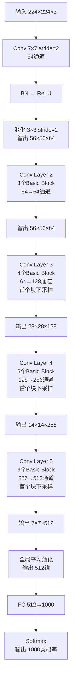
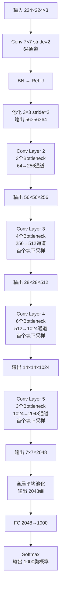
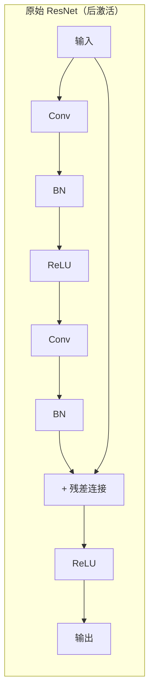
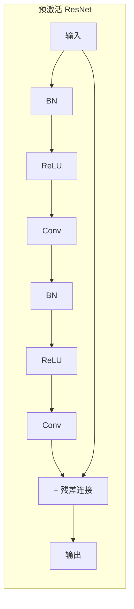
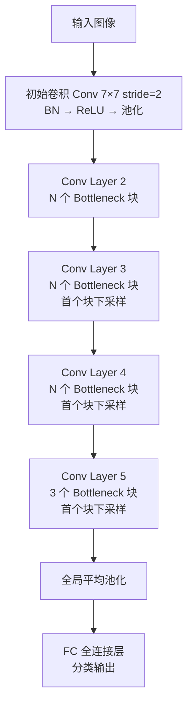

# ResNet 残差网络

深度学习的章节进行到这里，让我们来思考一个问题，神经网络的深度是否可以无限增加？VGG 的实验结果证明网络深度确实可以提升精度，那如果网络的深度可以无限增加，那是否意味着只要硬件算力能持续发展，即使没有更好的算法和模型架构，我们理论上依然能得到任意精度的网络？这听起来很美好，但实际操作中研究者很快发现了问题。2014-2015 年期间，许多团队尝试训练比 VGG-19（19 层）、GoogLeNet（22 层）更深的网络，结果发现当网络深度超过一定阈值（约 20-30 层）后，精度不再提升反而下降。更令人困惑的是，这种现象并非由过拟合导致，过拟合的典型表现是训练集错误率降低而测试集错误率升高，但这里的情况是训练集和测试集的错误率都在升高。这说明网络根本没有学会训练数据中的规律，而是真正意义上的"学不动了"。

2015 年，时任微软研究院研究员的何恺明（Kaiming He）提出了 **ResNet**（Residual Network，残差网络），彻底解决了这一难题。ResNet 通过引入**残差连接**（Residual Connection，又称 Skip Connection）让网络能够训练到 150 层甚至 1000 层以上，同时将 ImageNet 的 Top-5 错误率降至 3.57%，这是机器在视觉上首次超越人类视觉水平（约 5.1%）。该成果以论文《Deep Residual Learning for Image Recognition》发表在 CVPR 2016 上，获得了当年最佳论文奖。这篇论文也成为深度学习历史上被引用最多的论文之一，截至目前引用数超过 15 万次。

## 残差学习思想

在深入理解 ResNet 之前，我们要具体了解前面提到的反直觉的现象，随着网络层数增加，精度不是提升变慢，而是在某个层数拐点出现下降。这不是理论预测的结果，是实际训练中反复出现的观察。

何恺明团队在论文中进行了对比实验：使用相同的数据集、相同的训练策略，分别训练一个 20 层网络和一个 56 层网络，结果发现 56 层网络在训练集和测试集上的错误率都高于 20 层版本。原本的预期是假如 20 层网络已经学得足够好，那么在其后面再添加 36 层（共 56 层），新增的层应该学会什么都不做，即恒等映射（Identity Mapping），这样 56 层网络的表现应该至少与 20 层一样好才对。但实际训练中，让这 36 层学会滥竽充数反而不容易。卷积层的初始化参数通常是随机的小数值，每次前向传播时，输入信号经过多层卷积后会发生显著变化。要让这些层学会保持输入不变，需要精确调整数百万个参数，使它们的组合效果恰好等于恒等映射，这在实际优化中非常困难。这种随着网络深度的增加，训练误差和测试误差同时增加的现象现在被称为神经网络的**退化问题**（Degradation Problem）。

ResNet 的重要创新是改变了模型的学习目标。标准 CNN 下，每个卷积层的目标都是从零开始学习从输入特征到输出特征的映射函数 $H(x)$，当最优解接近恒等映射 $H(x) = x$ 时，网络还是要需要从零开始学习 $x$ 到 $x$ 的复杂参数组合。ResNet 更改了学习目标，让网络学习残差函数 $F(x) = H(x) - x$，让模型变为学习需要在恒等映射基础上添加多少修正能够得到最优的映射函数。

这个简单改动就让模型顺利摆脱了恒等映射学习困难的问题。当最优映射恰好是恒等映射时，ResNet 只需要学习 $F(x) = 0$，让所有权重趋近于零就能达到目的。由于权重通常初始化为接近零的小数值，网络一开始就很接近最优解，优化很容易收敛。当最优映射接近但不等于恒等映射时，残差函数只需要学习微小的调整量 $F(x) \approx 0$，而不是完整的映射函数，这也大幅降低了优化难度。

可以用一个类比来理解残差学习的思想，假设你要从一张白纸开始临摹一幅画作（标准 CNN 学习恒等映射），需要精确控制每一笔的位置、颜色、力度，难度极高。但如果让你在一幅几乎已经完成的画作上稍微添加几笔（ResNet 学习残差），难度将大为降低。这就是残差学习的本质，不是学习完整的目标，而是学习目标与基准之间的差异。残差块的数学表达可以清晰地展示这一思想，设 $x$ 是残差块的输入，也是当前模型的基准信号，定义一组权重参数 $W_i$ 和由若干卷积层构成的残差函数 $F$，$F$ 学习在 $x$ 的基础上需要多少修正量才能达到最优的结果 $y$，整个公式表示为输出 = 基准信号 + 修正量：

$$[res_y]y = x + F(x, \{W_i\}) $$

当残差函数学习到 $F(x) = 0$ 时（所有卷积权重趋近于零），输出恰好等于输入 $y = x$，实现了恒等映射。这个特性确保了深层网络的下限至少不会比浅层网络差，即使新增的层没有学到有用的信息，起码可以通过学习 $F(x) = 0$ 来保持输入不变。从梯度流动的角度也能看到残差连接的优势。反向传播时，梯度通过残差连接可以直接从深层传递到浅层，将公式 {{res_y}} 带入到梯度公式可得：

$$\frac{\partial L}{\partial x} = \frac{\partial L}{\partial y} \cdot \frac{\partial y}{\partial x} = \frac{\partial L}{\partial y} \cdot \left(\frac{\partial F}{\partial x} + 1\right)$$

这个公式的意思很明确：输入梯度 = 输出梯度 ×（残差路径梯度 + 直通路径梯度），即使 $\frac{\partial F}{\partial x}$ 趋近于零（残差函数出现梯度消失问题），$\frac{\partial L}{\partial x}$ 仍然等于 $\frac{\partial L}{\partial y}$，梯度通过残差连接的 $+1$ 项无衰减地传递到浅层。这从根本上解决了深层网络的梯度流动问题。

## 残差网络架构

残差连接的实现方式有两种，取决于输入和输出的维度是否相同。ResNet 论文中给出的设计简洁而巧妙，用最小的改动实现了最大的效果。当输入 $x$ 和残差输出 $F(x)$ 的维度完全相同时（通道数、空间尺寸都一致），残差连接只需将输入直接逐元素相加即可。这是最简单的实现方式，也是 ResNet 中大部分残差块采用的方案，其结构如下图所示：

```nn-arch width=620
name: 基本残差块（维度相同）
layout: horizontal

layers:
  - {id: input, name: Input, type: input, size: "HxWxC"}

blocks:
  - name: Identity ResBlock
    type: residual
    style: arc
    main:
      - {id: conv1, name: Conv1, type: conv, kernel: 3, pad: 1, act: ReLU}
      - {id: conv2, name: Conv2, type: conv, kernel: 3, pad: 1, act: ReLU}
    skip: identity
    merge: add
    act: ReLU

layers_after_blocks:
  - {id: output, name: Output, type: output, size: "HxWxC"}
```
*图：基本残差块（维度相同）*

当输入和输出的维度不同时（如通道数从 64 变为 128，或空间尺寸从 $56×56$ 变为 $28×28$），维度不匹配导致无法直接相加。此时需要对残差连接上的输入 $x$ ，进行线性变换以匹配 $F(x)$ 的维度。ResNet 使用 $1×1$ 卷积来实现这个变换。具体结构如下图所示：

```nn-arch width=620
name: 基本残差块（维度不同）
layout: horizontal

layers:
  - {id: input, name: Input, type: input, size: "HxWxC"}

blocks:
  - name: Projection ResBlock
    type: residual
    style: parallel
    main:
      - {id: conv1, name: Conv1, type: conv, kernel: 3, stride: 2, pad: 1, act: ReLU}
      - {id: conv2, name: Conv2, type: conv, kernel: 3, pad: 1, act: ReLU}
    skip:
      - {id: skip_conv, name: "Conv_Skip", type: conv, kernel: 1, stride: 2}
    merge: add
    act: ReLU

layers_after_blocks:
  - {id: output, name: Output, type: output, size: "H'xW'xC'"}
```

其中 Conv_Skip 是一个 $1×1$ 卷积层，用于调整通道数。如果空间尺寸需要变化（如 Stride=2 下采样），则在残差连接上也添加 Stride=2 的池化或卷积操作。根据 ResNet 论文中的实验数据，使用 $1×1$ 卷积的投影方式略优于零填充维度匹配，但两者差距不大（约 0.2% 的精度差异）。考虑到计算效率，ResNet 仅在需要改变维度时才使用投影，其他情况下都采用直接相加。

以上两种残差块都统称为**基本块**（Basic Block），是 ResNet 论文中最基础的残差块结构，结构简单、感受野明确，都由两个 $3×3$ 卷积层构成，卷积叠加后的感受野为 $5×5$（第一个卷积感受野 $3×3$，第二个在此基础上扩展，总感受野 $5×5$）。这种设计借鉴了 VGG 的"小卷积堆叠"思想，用多个小卷积代替一个大卷积，既能减少参数量又能增加非线性激活，提升网络的表达能力，适用于 ResNet-18 和 ResNet-34 等相对浅层的网络。

对于 ResNet-50、ResNet-101、ResNet-152 等相对深层的网络，则使用另外一种被称为**瓶颈块**（Bottleneck Block）的结构，这是 ResNet 为深层网络设计的高效结构，由三个卷积层构成：$1×1$ 降维卷积、$3×3$ 主卷积、$1×1$ 升维卷积。瓶颈块的核心思想是通过 $1×1$ 卷积降低通道数，减少 $3×3$ 卷积的计算量，然后再用 $1×1$ 卷积恢复通道数。这种"降维 - 卷积 - 升维"的设计大幅减少了参数量和计算量，同时保持了 $3×3$ 卷积的感受野。
瓶颈块的具体结构如下图所示：

```nn-arch width=760
name: 瓶颈残差块
layout: horizontal

layers:
  - {id: input, name: Input, type: input, size: "HxWxC"}

blocks:
  - name: Bottleneck ResBlock
    type: residual
    style: arc
    main:
      - {id: conv1, name: Conv1, type: conv, kernel: 1, pad: 1, act: ReLU}
      - {id: conv2, name: Conv2, type: conv, kernel: 3, pad: 1, act: ReLU}
      - {id: conv3, name: Conv3, type: conv, kernel: 1, pad: 1, act: ReLU}
    skip: identity
    merge: add
    act: ReLU

layers_after_blocks:
  - {id: output, name: Output, type: output, size: "HxWxC"}
```
*图：残差块（维度相同）*

有两点稍微反直觉的特点值得说明，一是虽然瓶颈块多用于深层网络，但网络深度很大程度是由于瓶颈块本身带来的。由于网络深度的定义是有权重参数的层数，即卷积层和全连接层的总数。基本块有 2 个卷积层，瓶颈块有 3 个卷积层，使用瓶颈块的网络，在 Block 数量相同的前提下层数就要比基本块多出 50%。如果 ResNet-34 全部改用瓶颈块，网络实际只有约 23 层。二是相交于标准块，瓶颈块才是参数量更少的块（所以才叫高级结构），以输入 256 通道、输出 256 通道为例，可以具体计算两种残差块的参数量差异。基本块（两个 $3×3$ 卷积）的参数量为 $1,180,160$，瓶颈块（$1×1$ → $3×3$ → $1×1$，中间通道数 64）的参数量为 $69,632$，瓶颈块的参数量仅为基本块的 5.9% 而已，这是一个惊人的效率提升。同时，瓶颈块的中心感受野仍然来自 $3×3$ 卷积，与基本块的有效感受野相同。这使得深层网络（如 ResNet-152）能够在保持计算可行性的同时，堆叠更多的残差块。

### ResNet 架构

ResNet 论文中提出了多个深度的网络配置，从 18 层到 152 层，覆盖了从轻量级到重量级的应用场景。这些配置的核心区别在于残差块的数量和类型 —— 浅层网络使用基本块，深层网络使用瓶颈块。

ResNet 系列的配置对比如下：

| 网络 | 层数 | 残差块数量配置 | 残差块类型 | 参数量 | Top-1 错误率（单裁） |
|:----|:----|:-------------|:--------|:------|:------------------|
| ResNet-18 | 18 | [2, 2, 2, 2] | Basic | ~11.7M | 30.3% |
| ResNet-34 | 34 | [3, 4, 6, 3] | Basic | ~21.8M | 26.2% |
| ResNet-50 | 50 | [3, 4, 6, 3] | Bottleneck | ~25.6M | 23.9% |
| ResNet-101 | 101 | [3, 4, 23, 3] | Bottleneck | ~44.5M | 22.6% |
| ResNet-152 | 152 | [3, 8, 36, 3] | Bottleneck | ~60.2M | 21.6% |

表中"残差块数量配置"表示 Conv Layer 2-5 中残差块的个数。例如 ResNet-34 的 [3, 4, 6, 3] 表示 Conv Layer 2 有 3 个残差块，Conv Layer 3 有 4 个，Conv Layer 4 有 6 个，Conv Layer 5 有 3 个。

从表中可以看出一个有趣的现象：ResNet-34 和 ResNet-50 的残差块数量配置相同（都是 [3, 4, 6, 3]），但层数却相差 16 层。这是因为瓶颈块有 3 个卷积层，基本块只有 2 个卷积层。ResNet-34 的层数计算为：$1$（初始卷积）+ $3×2×4$（基本块总数×每块层数×Conv Layer 数）+ $1$（全局池化）+ $1$（全连接）= $34$。ResNet-50 的层数计算为：$1$ + $3×3×4$ + $1$ + $1$ = $50$。

ResNet-34 的完整网络结构可以用流程图清晰展示：



这个架构体现了几个关键设计决策。首先，初始层使用 $7×7$ 大卷积核配合 stride=2，一次性将空间尺寸从 $224×224$ 降到 $112×112$，然后通过池化进一步降到 $56×56$。这与 VGG 的"堆叠 3×3 卷积"策略不同，ResNet 选择了更激进的下采样策略。其次，每个 Conv Layer 的首个残差块负责下采样（stride=2），将空间尺寸减半、通道数翻倍。这种设计确保了特征图在空间维度上逐渐缩小，在通道维度上逐渐增大，平衡了信息量和计算量。最后，全局平均池化替代了 VGG 和 AlexNet 中的多个全连接层。这大幅减少了参数量（从 VGG-16 的约 100M 参数降到 ResNet-34 的约 22M），同时避免了全连接层容易过拟合的问题。

ResNet-50 的结构与 ResNet-34 类似，只是将基本块替换为瓶颈块：



注意 ResNet-50 的通道数配置与 ResNet-34 不同。ResNet-34 的 Conv Layer 2-5 输出通道数为 [64, 128, 256, 512]，而 ResNet-50 为 [256, 512, 1024, 2048]，每个 Conv Layer 的输出通道数都翻倍。这是因为瓶颈块的中间层通道数是输出通道数的 1/4，需要更大的输出通道数来保证中间层有足够的特征表达能力。例如 Conv Layer 2 的输出通道数为 256，瓶颈块中间层通道数为 64，正好与 ResNet-34 的 Conv Layer 2 输出通道数相同，保持了特征表达能力的一致性。

### 预激活残差块

ResNet 论文发表后，何恺明团队继续深入研究残差网络的工作原理。2016 年，何恺明发表了另一篇重要论文 *"Identity Mappings in Deep Residual Networks"*（ECCV 2016），提出了**预激活**（Pre-Activation）版本的残差块，进一步优化了梯度流动。

原始 ResNet 的残差块采用"后激活"结构：卷积层后面紧跟 BN 和 ReLU，最后通过残差连接将输入加到输出上，然后再加一个 ReLU。这种结构的问题是残差连接后面有一个 ReLU，会强制输出为非负数，限制了恒等映射的表达能力。

预激活版本的改进是将 BN 和 ReLU 移到卷积层之前。这样做的好处是残差连接直接加到输出上，不再经过 ReLU，保持了恒等映射的纯粹性。两种结构的对比可以通过流程图清晰展示：





预激活版本的三个关键改进如下：

首先，BN 和 ReLU 移到卷积之前（pre-activation），相当于对每层的输入进行预处理，确保输入经过标准化和非线性激活后再进入卷积。其次，残差连接不再经过 ReLU，输出可以直接等于输入加上残差，保持了恒等映射的纯粹性。最后，最后一层不加 ReLU，输出保持线性，允许负值通过，这对于某些任务（如回归）非常重要。

预激活版本的优势可以通过梯度流动的角度来理解。原始版本中，残差连接后面有一个 ReLU，梯度在通过 ReLU 时会被截断（负梯度变成零）。预激活版本中，残差连接直接传递到输出，梯度可以无损地通过这条路径。何恺明的实验表明，预激活版本在深层网络（如 ResNet-1001）上的表现显著优于原始版本，训练更加稳定，收敛更快。

现代 ResNet 的实现（如 PyTorch 的 torchvision 库、Facebook 的 Detectron2 库）通常使用预激活版本。虽然对于 ResNet-50/101/152 等中等深度的网络，原始版本和预激活版本的表现差异不大，但预激活版本已经成为残差块设计的标准范式。

## ResNet 的设计哲学与影响

ResNet 的影响远超 ImageNet 分类比赛本身。残差学习的思想 —— 学习"相对于基准的改进"而非"完整的映射" —— 已经成为深度神经网络设计的核心范式，被广泛应用于计算机视觉、自然语言处理、生成模型等几乎所有深度学习领域。

### 残差学习的深层含义

ResNet 的残差学习思想不仅仅是工程技巧，它反映了一个深刻的机器学习原理：**优化一个"相对于基准的改进"比优化一个"完整的映射"更容易**。这个原理可以通过类比来理解。

想象一个画家要创作一幅作品。标准 CNN 的方式是：从空白画布开始，一笔一笔画出完整的画面，每一笔的位置、颜色、力度都需要精确控制，最终形成一幅完整的画作。这需要高超的技巧和大量的练习。ResNet 的方式是：在已有画作的基础上，只需要添加几笔修改 —— 可能只是加深某个阴影、调整某个色调、补充某个细节。相比之下，后者要学习的内容少得多，难度也低得多。

这就是残差学习的本质：输入 $x$ 已经包含了大部分有用信息（相当于"已有画作"），网络只需要学习残差部分 $F(x) = H(x) - x$（相当于"需要添加的修改"）。如果输入本身已经很接近目标输出，那么残差部分就很小（$F(x) \approx 0$），网络只需要学习微小的调整，优化更容易收敛。这解释了为什么深层网络中残差连接如此有效：随着网络加深，许多层的最优输出确实接近输入（恒等映射），残差学习让这些层能够轻松学会"什么都不做"或"做少量修正"，避免了标准 CNN 中学习完整恒等映射的困难。

### ResNet 的广泛应用

ResNet 论文发表后，残差思想迅速渗透到深度学习的各个领域。残差连接的设计简洁（只需一行代码：`output = F(x) + x`），效果显著（能训练数百层甚至上千层网络），很快成为神经网络设计的标准组件。

残差连接在各个领域的应用可以通过表格清晰展示：

| 应用领域 | 代表模型 | 残差连接的具体作用 |
|:--------|:--------|:-----------------|
| 目标检测 | Faster R-CNN、Mask R-CNN | 使用 ResNet 作为 backbone，替代 VGG-16 |
| 语义分割 | DeepLab v3+、FCN-ResNet | 使用 ResNet 提取多尺度特征 |
| 自然语言处理 | Transformer、BERT | 残差连接贯穿整个架构，保证深层网络的梯度流动 |
| 生成模型 | StyleGAN、DDPM | 残差块用于生成器和去噪网络 |
| 视频理解 | 3D ResNet、I3D | 将 2D 残差块扩展为 3D，处理时空信息 |
| 自监督学习 | SimCLR、MoCo | ResNet 作为特征提取器，学习对比表示 |

其中最深远的影响是 Transformer 中的残差连接。Transformer 架构（"Attention is All You Need"，2017）将残差连接作为核心设计：每个多头注意力层和每个前馈网络层都通过残差连接将输入加到输出上。这种设计让 Transformer 能够堆叠数十层（如 BERT-Base 有 12 层，BERT-Large 有 24 层，GPT-3 有 96 层），而不会出现优化困难。Transformer 的成功证明了残差连接的价值超越了卷积网络，适用于各种神经网络架构。

ResNet 定义的"现代 CNN 标准架构"被后续几乎所有高性能网络继承：



这一架构被 EfficientNet、RegNet、ConvNeXt 等后续网络继承和发展。EfficientNet 通过复合缩放同时调整深度、宽度、分辨率，在 ResNet 架构基础上达到更高的效率。RegNet 通过网络设计空间搜索，自动发现最优的 ResNet 配置。ConvNeXt 将 Transformer 的设计元素（如 LayerNorm、大核卷积）引入 ResNet，在纯卷积架构上达到与 Swin Transformer 相当的性能。这些后续工作证明了 ResNet 架构的普适性：一个好的架构模板可以持续演进，产生一代又一代的改进版本。

## 本章小结

本章介绍了 ResNet——深度学习历史上最重要的网络架构之一。ResNet 的出现源于一个看似反直觉的现象：增加网络深度反而导致精度下降。这种退化问题与过拟合或梯度消失不同，它反映了深层网络优化困难的本质 —— 让网络学习恒等映射（输出等于输入）比学习复杂的特征变换更难。ResNet 通过残差连接巧妙地解决了这个问题：将学习目标从"完整映射 $H(x) = x$"改为"残差部分 $F(x) = H(x) - x$"。当最优映射接近恒等映射时，网络只需要学习 $F(x) = 0$（所有权重趋近于零），这比学习精确的参数组合要容易得多。

残差连接的另一个重要贡献是改善梯度流动。残差连接为梯度提供了直通路径，反向传播时梯度可以直接从深层传递到浅层，不会因为中间层的导数连乘而衰减。这使得 ResNet 能够训练到 152 层甚至 1000 层以上，而不会出现梯度消失或退化问题。ResNet 定义了两种残差块结构：Basic Block 由两个 $3×3$ 卷积构成，适用于 ResNet-18 和 ResNet-34；Bottleneck Block 采用"降维 - 卷积 - 升维"的三层结构，参数量仅为 Basic Block 的约 6%，适用于 ResNet-50/101/152 等深层网络。

ResNet-152 在 ImageNet 上取得了突破性成果：Top-5 错误率 3.57%（多裁），Top-1 错误率 21.6%（单裁），首次超越人类水平。更重要的是，残差学习思想被广泛应用于深度学习的各个领域。目标检测领域的 Faster R-CNN、Mask R-CNN 使用 ResNet 作为 backbone；自然语言处理领域的 Transformer、BERT 将残差连接作为核心设计；生成模型领域的 StyleGAN、DDPM 在网络中大量使用残差块。可以说，残差连接已经成为现代神经网络不可或缺的组件，ResNet 也因此成为深度学习历史上被引用最多的论文之一。

## 练习题

1. 推导残差块的反向传播梯度公式。证明残差连接如何确保梯度无衰减地传递到浅层。
    <details>
    <summary>参考答案</summary>

    **残差块反向传播梯度推导**：

    **残差块前向传播**：

    设残差块输入为 $x$，残差函数为 $F(x, \{W_i\})$，输出为 $y$：

    $$y = F(x, \{W_i\}) + x$$

    其中 $F(x, \{W_i\})$ 由两层卷积构成：

    $$F = W_2 \cdot \text{ReLU}(W_1 \cdot x + b_1) + b_2$$

    为简化，假设使用预激活版本，且忽略偏置项：

    $$F = W_2 \cdot \sigma(W_1 \cdot x)$$

    其中 $\sigma(\cdot)$ 是 ReLU 激活函数。

    **输出对残差函数的梯度**：

    设损失函数为 $L$，输出梯度为 $\frac{\partial L}{\partial y}$。

    **残差函数对输入 $x$ 的梯度**：

    $$\frac{\partial F}{\partial x} = \frac{\partial F}{\partial h} \cdot \frac{\partial h}{\partial x}$$

    其中 $h = W_1 \cdot x$，$\frac{\partial F}{\partial h} = W_2 \cdot \sigma'(h)$。

    $$\frac{\partial F}{\partial x} = W_2^T \cdot \sigma'(W_1 \cdot x) \cdot W_1$$

    **损失对输入 $x$ 的梯度**：

    $$\frac{\partial L}{\partial x} = \frac{\partial L}{\partial y} \cdot \frac{\partial y}{\partial x}$$

    $$\frac{\partial y}{\partial x} = \frac{\partial (F + x)}{\partial x} = \frac{\partial F}{\partial x} + I$$

    其中 $I$ 是单位矩阵（来自残差连接 $x$ 的导数）。

    $$\frac{\partial L}{\partial x} = \frac{\partial L}{\partial y} \cdot \left(\frac{\partial F}{\partial x} + I\right) = \frac{\partial L}{\partial y} \cdot \frac{\partial F}{\partial x} + \frac{\partial L}{\partial y}$$

    **关键发现**：

    损失对输入的梯度由两部分组成：
    1. $\frac{\partial L}{\partial y} \cdot \frac{\partial F}{\partial x}$：通过残差函数的梯度
    2. $\frac{\partial L}{\partial y}$：通过残差连接的梯度（**直接传递，无衰减**）

    **多层 ResNet 的梯度传递**：

    设网络有 $L$ 个残差块，第 $l$ 块输入为 $x_l$，输出为 $x_{l+1} = F_l(x_l) + x_l$。

    从第 $L$ 块到第 $1$ 块的梯度传递：

    $$\frac{\partial L}{\partial x_1} = \frac{\partial L}{\partial x_{L+1}} \cdot \prod_{l=1}^{L} \frac{\partial x_{l+1}}{\partial x_l}$$

    $$= \frac{\partial L}{\partial x_{L+1}} \cdot \prod_{l=1}^{L} \left(\frac{\partial F_l}{\partial x_l} + I\right)$$

    **展开乘积**：

    $$\prod_{l=1}^{L} \left(\frac{\partial F_l}{\partial x_l} + I\right) = I + \sum_{l=1}^{L} \frac{\partial F_l}{\partial x_l} + \sum_{l<m} \frac{\partial F_l}{\partial x_l} \cdot \frac{\partial F_m}{\partial x_m} + \cdots$$

    关键：乘积中包含 **$I$（单位矩阵）**。

    **与 Plain Network 对比**：

    Plain Network 的梯度传递：

    $$\frac{\partial L}{\partial x_1} = \frac{\partial L}{\partial x_{L+1}} \cdot \prod_{l=1}^{L} \frac{\partial F_l}{\partial x_l}$$

    如果每层 $\left\|\frac{\partial F_l}{\partial x_l}\right\| < 1$（如 sigmoid 激活或小的权重），乘积随 $L$ 指数衰减（梯度消失）。

    **ResNet 的优势**：

    ResNet 的梯度传递中，$\prod_{l=1}^{L} (\frac{\partial F_l}{\partial x_l} + I)$ 展开后包含 $I$ 项：

    $$\frac{\partial L}{\partial x_1} = \frac{\partial L}{\partial x_{L+1}} \cdot \left(I + \text{其他项}\right) = \frac{\partial L}{\partial x_{L+1}} + \frac{\partial L}{\partial x_{L+1}} \cdot (\text{其他项})$$

    即使所有 $\frac{\partial F_l}{\partial x_l}$ 趋近于零，$I$ 项保证了 $\frac{\partial L}{\partial x_1} = \frac{\partial L}{\partial x_{L+1}}$——**梯度可以直接从深层传递到浅层，无衰减**。

    **总结**：

    | 对比项 | Plain Network | ResNet |
    |:------|:-------------|:------|
    | 梯度传递 | $\prod \frac{\partial F}{\partial x}$ | $\prod (\frac{\partial F}{\partial x} + I)$ |
    | 恒等项 | 无 | 有 ($I$) |
    | 梯度衰减 | 随层数指数衰减 | 无衰减（通过 $I$） |
    | 深度限制 | ~20 层（退化） | 1000+ 层 |
    </details>

2. 对比 Basic Block 和 Bottleneck 的参数量、计算量和感受野。解释为什么 ResNet-50 使用 Bottleneck 而不是 Basic Block。
    <details>
    <summary>参考答案</summary>

    **Basic Block vs Bottleneck 对比分析**：

    **一、结构对比**

    **Basic Block**：
    ```
    输入 → Conv3×3 (in_ch→mid_ch) → BN → ReLU → Conv3×3 (mid_ch→out_ch) → BN → (+跳跃) → ReLU → 输出
    ```

    **Bottleneck Block**：
    ```
    输入 → Conv1×1 (in_ch→mid_ch/4) → BN → ReLU → Conv3×3 (mid_ch/4→mid_ch/4) → BN → ReLU → Conv1×1 (mid_ch/4→out_ch) → BN → (+跳跃) → ReLU → 输出
    ```

    **二、参数量对比**

    设输入通道 = 输出通道 = $C$：

    **Basic Block**（输入 $C$，输出 $C$）：

    - Conv1 (3×3): $C \times 3 \times 3 \times C + C = 9C^2 + C$
    - Conv2 (3×3): $C \times 3 \times 3 \times C + C = 9C^2 + C$
    - 总参数量：$18C^2 + 2C \approx 18C^2$

    **Bottleneck Block**（输入 $C$，输出 $C$，中间通道 $C/4$）：

    - Conv1 (1×1): $C \times 1 \times 1 \times \frac{C}{4} + \frac{C}{4} = \frac{C^2}{4} + \frac{C}{4}$
    - Conv2 (3×3): $\frac{C}{4} \times 3 \times 3 \times \frac{C}{4} + \frac{C}{4} = \frac{9C^2}{16} + \frac{C}{4}$
    - Conv3 (1×1): $\frac{C}{4} \times 1 \times 1 \times C + C = \frac{C^2}{4} + C$
    - 总参数量：$\frac{C^2}{4} + \frac{9C^2}{16} + \frac{C^2}{4} + \frac{C}{4} + \frac{C}{4} + C = \frac{17C^2}{16} + 1.5C \approx \frac{17}{16}C^2$

    **对比**：

    $$\frac{\text{Bottleneck}}{\text{Basic}} = \frac{\frac{17}{16}C^2}{18C^2} = \frac{17}{288} \approx 5.9\%$$

    Bottleneck 参数量仅为 Basic Block 的 **5.9%**，减少约 **94.1%**。

    **三、计算量（FLOPs）对比**

    设特征图空间尺寸为 $H \times W$：

    **Basic Block**：
    - Conv1: $H \times W \times C \times (3 \times 3 \times C \times 2) = 18HWC^2$
    - Conv2: $H \times W \times C \times (3 \times 3 \times C \times 2) = 18HWC^2$
    - 总计算量：$36HWC^2$

    **Bottleneck Block**：
    - Conv1 (1×1): $H \times W \times \frac{C}{4} \times (1 \times 1 \times C \times 2) = \frac{HWC^2}{2}$
    - Conv2 (3×3): $H \times W \times \frac{C}{4} \times (3 \times 3 \times \frac{C}{4} \times 2) = \frac{9HWC^2}{8}$
    - Conv3 (1×1): $H \times W \times C \times (1 \times 1 \times \frac{C}{4} \times 2) = \frac{HWC^2}{2}$
    - 总计算量：$\frac{HWC^2}{2} + \frac{9HWC^2}{8} + \frac{HWC^2}{2} = \frac{17HWC^2}{8} = 2.125HWC^2$

    $$\frac{\text{Bottleneck FLOPs}}{\text{Basic FLOPs}} = \frac{2.125}{36} \approx 5.9\%$$

    **四、感受野对比**

    | 块类型 | 中间卷积 | 感受野 |
    |:------|:--------|:------|
    | Basic Block | 2×3×3 | $3 \times 3$ |
    | Bottleneck | 1×1 + 3×3 + 1×1 | $3 \times 3$ |

    感受野相同：$3 \times 3$。$1 \times 1$ 卷积不改变感受野。

    **五、为什么 ResNet-50 使用 Bottleneck**

    ResNet-50 有 50 层，如果使用 Basic Block：
    - Conv2-5 需要约 24 个 Basic Block（每层 6 个）
    - 总参数量：$24 \times (18 \times 256^2) \approx 283M$（非常大）

    使用 Bottleneck：
    - 同样 24 个 Bottleneck Block
    - 总参数量：$24 \times (\frac{17}{16} \times 256^2) \approx 16.8M$（大幅减少）

    **Bottleneck 的核心优势**：

    1. **参数量减少 94%**：通过 $1 \times 1$ 卷积将通道数降为 1/4，再进行 $3 \times 3$ 卷积
    2. **计算量减少 94%**：参数量和计算量同比例减少
    3. **感受野不变**：$3 \times 3$ 卷积的感受野保持 $3 \times 3$
    4. **网络更深**：由于每个 Block 有 3 层（而非 2 层），可以用更少的 Block 数实现相同的网络深度

    **总结**：Bottleneck 通过 $1 \times 1$ 卷积降维，在保持 $3 \times 3$ 感受野的同时，将参数量和计算量减少约 94%，使 ResNet-50/101/152 等深层网络的训练成为可能。
    </details>

3. 设计一个 ResNet-101 的修改版本，将 Conv Layer 4 的 Bottleneck 块从 23 个减少到 12 个。分析修改后的层数、参数量和预期精度变化。
    <details>
    <summary>参考答案</summary>

    **修改版 ResNet-101 分析**：

    **原始 ResNet-101 配置**：

    | Conv Layer | 块数 | 通道数 | 类型 |
    |:----------|:----|:------|:----|
    | Conv2 | 3 | 256 | Bottleneck |
    | Conv3 | 4 | 512 | Bottleneck |
    | Conv4 | 23 | 1024 | Bottleneck |
    | Conv5 | 3 | 2048 | Bottleneck |
    | **总块数** | **33** | | |
    | **总层数** | **1 + 3×3 + 4×3 + 23×3 + 3×3 = 101** | | |

    **修改版配置**（Conv4: 23 → 12）：

    | Conv Layer | 块数 | 通道数 | 类型 |
    |:----------|:----|:------|:----|
    | Conv2 | 3 | 256 | Bottleneck |
    | Conv3 | 4 | 512 | Bottleneck |
    | Conv4 | 12 | 1024 | Bottleneck |
    | Conv5 | 3 | 2048 | Bottleneck |
    | **总块数** | **22** | | |
    | **总层数** | **1 + 3×3 + 4×3 + 12×3 + 3×3 = 68** | | |

    **修改后的总层数**：68 层（介于 ResNet-50 和 ResNet-101 之间）

    **参数量分析**：

    **原始 ResNet-101 各层参数量**：

    - 初始层 (Conv7×7): $64 \times 7 \times 7 \times 3 + 64 = 9,472$
    - Conv2 (3×Bottleneck, 64→256): 约 0.4M
    - Conv3 (4×Bottleneck, 256→512): 约 1.7M
    - Conv4 (23×Bottleneck, 512→1024): 约 32.4M
    - Conv5 (3×Bottleneck, 1024→2048): 约 9.8M
    - FC (2048→1000): 约 2.0M
    - 总计: ~44.5M

    **修改版参数量**：

    Conv4 从 23 个块减为 12 个：
    - 每个 Bottleneck (512→1024) 参数量约 1.4M
    - 减少 11 个块：$11 \times 1.4\text{M} = 15.4\text{M}$
    - 修改版总参数量：$44.5\text{M} - 15.4\text{M} = 29.1\text{M}$

    **预期精度变化**：

    基于 ResNet 系列的深度 - 精度关系：

    | 配置 | 层数 | 参数(M) | 预期 Top-1 错误率 |
    |:----|:----|:------|:-----------------|
    | ResNet-50 | 50 | 25.6 | 23.85% |
    | **修改版** | **68** | **29.1** | **~22.5%** (估计) |
    | ResNet-101 | 101 | 44.5 | 22.63% |
    | ResNet-152 | 152 | 60.2 | 21.69% |

    预期精度在 ResNet-50 和 ResNet-101 之间，约 **22.5%** Top-1 错误率。

    **效率 - 精度权衡分析**：

    | 指标 | ResNet-50 | 修改版 | ResNet-101 |
    |:----|:---------|:------|:----------|
    | 层数 | 50 | 68 | 101 |
    | 参数量 | 25.6M | 29.1M | 44.5M |
    | Top-1 错误率 | 23.85% | ~22.5% | 22.63% |
    | 参数效率 | 基准 | +13.7% | +73.8% |

    修改版用比 ResNet-101 少约 35% 的参数，达到略低于 ResNet-101 的精度（约低 0.1%）。

    **结论**：修改版是一个更好的效率 - 精度平衡点，适合资源受限但需要较高精度的场景。实际精度取决于具体任务和训练策略。
    </details>
