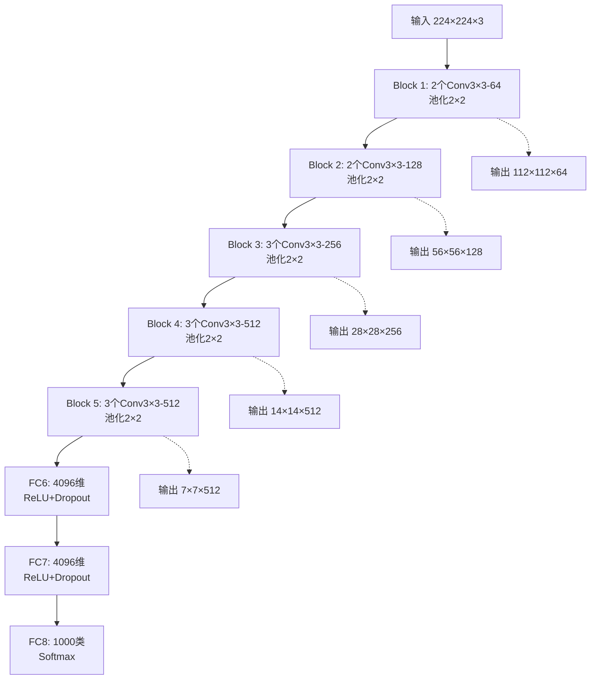
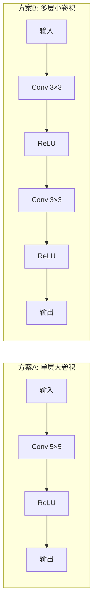
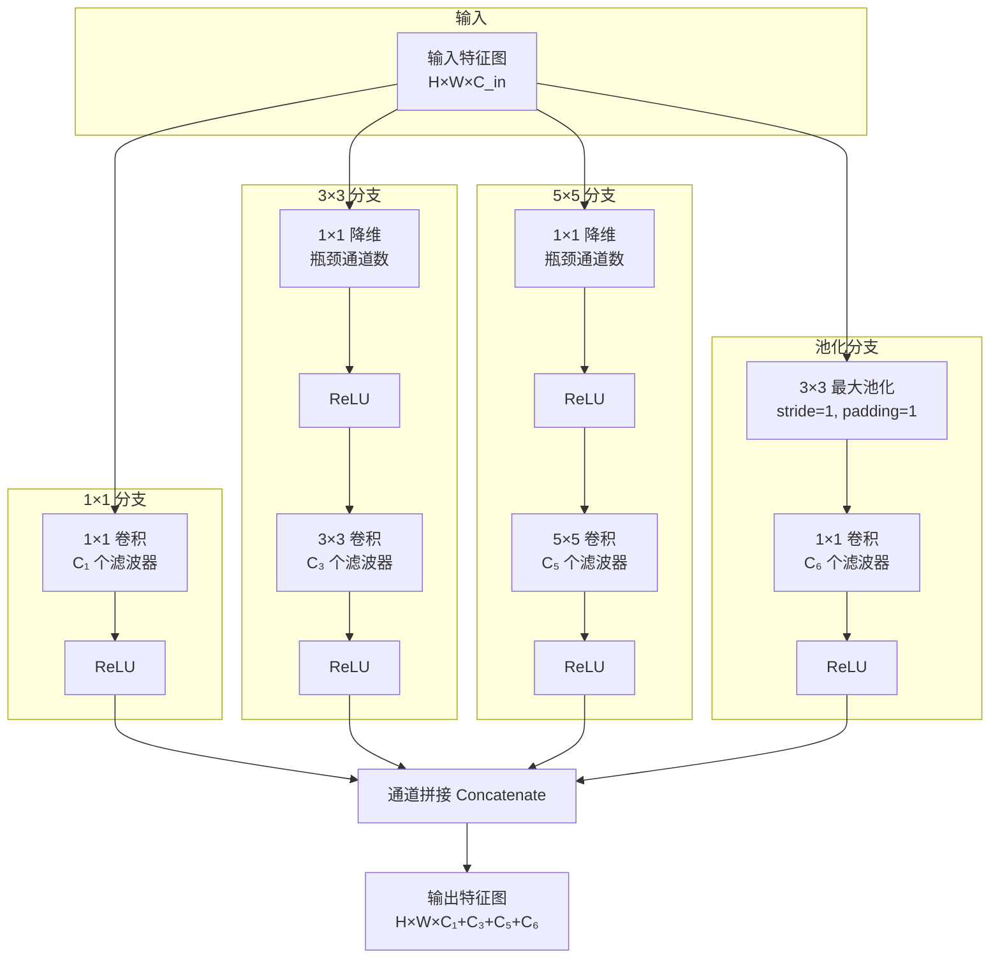
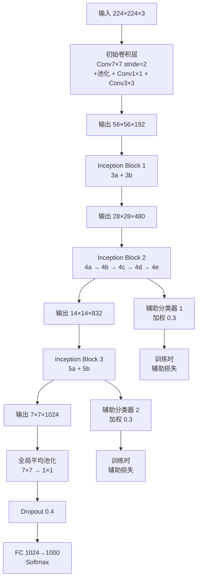
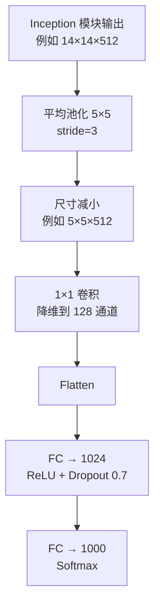
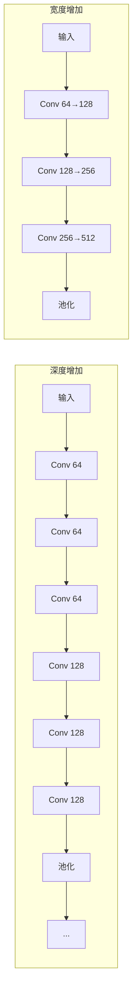

# VGG 与 GoogLeNet：深度与宽度的探索

上一章介绍了 AlexNet——2012 年 ImageNet 挑战赛的突破性模型。AlexNet 的成功验证了深度卷积神经网络在大规模视觉任务上的有效性，但它的架构设计仍然相对粗糙：8 层网络中使用大卷积核（$11 \times 11$、$5 \times 5$），全连接层参数量占总参数的 94%。这种设计留下了一个悬而未决的问题：**网络性能的提升究竟应该从哪里突破？**

2014 年，两篇里程碑式的研究工作从不同方向回答了这个问题。**牛津大学视觉几何组**（Visual Geometry Group，VGG）的研究员 Karen Simonyan 和 Andrew Zisserman 在论文《Very Deep Convolutional Networks for Large-Scale Image Recognition》中证明，将网络深度从 8 层推进到 16-19 层可以显著提升精度 —— 这就是著名的 **VGGNet**。同一时期，**Google** 的 Christian Szegedy 等人在论文《Going Deeper with Convolutions》中提出了 **GoogLeNet**（也称 Inception-v1），通过精心设计的 Inception 模块实现多尺度特征融合，用仅 700 万参数达到了比 VGG 更低的错误率。

这两项工作代表了 CNN 架构设计的两个核心探索方向：**VGG 选择了"深度优先"** —— 通过堆叠小卷积核增加层数，证明更深的网络能学到更抽象的特征；**GoogLeNet 选择了"宽度优先"** —— 通过并行多尺度分支增加"有效宽度"，让网络自己决定哪些尺度的特征最有价值。更深还是更宽？参数效率如何提升？这些问题的探索开启了现代 CNN 架构设计的黄金时代。

## VGGNet：深度探索

### VGG 的动机：深度探索

AlexNet 在 2012 年取得突破后，研究者们开始追问一个看似简单却影响深远的问题：**网络性能的提升究竟来自哪里？** 是网络更深了、更宽了，还是卷积核变小了？是训练技巧改进了，还是数据增强更好了？如果不搞清楚这个问题，后续的架构设计就如同"盲人摸象" —— 每次改进都可能只是在某个维度上偶然碰对了方向。

VGG 组的研究者决定用最朴素的方法来探索：**固定其他因素，只改变深度，看看会发生什么**。他们的核心假设是：在保持卷积核尺寸、宽度（通道数）等其他超参数不变的情况下，增加网络深度应该能提升精度。这个假设背后的直觉很简单 —— 更深的网络意味着更多的非线性变换层，每层都能学到比前一层更抽象的特征表示。从像素到边缘，从边缘到纹理，从纹理到部件，从部件到物体 —— 层次化的特征提取正是深度学习的核心优势。

实验结果验证了这个假设：VGG 将网络深度从 AlexNet 的 8 层扩展到 16-19 层，同时将 Top-5 错误率从 AlexNet 的 15.3% 降至 **7.3%** —— 错误率减半，精度翻倍。这一结果确立了一个重要结论：**深度是提升 CNN 性能的有效途径**。

### VGG 架构设计

验证了"深度有效"这个假设后，下一个问题是：**如何设计一个更深的网络？** VGG 的答案是采用极度简洁、高度规律的结构 —— 全部使用 $3 \times 3$ 小卷积核，通道数逐层翻倍，每经过一次池化空间尺寸减半。这种"复制粘贴式"的模块化设计虽然简单，却蕴含着精妙的工程智慧。

VGG-16 是最常用的版本，其结构可以用一个简洁的流程图来表示：



从这个流程图可以看出 VGG 的设计规律：每个 Block 包含若干个 $3 \times 3$ 卷积层（通道数相同），后接一个 $2 \times 2$ 最大池化层。通道数从 64 开始，每经过一个 Block 翻倍（64→128→256→512），最终稳定在 512。空间尺寸则每次池化减半，从 $224 \times 224$ 逐步缩小到 $7 \times 7$。这种"金字塔式"的设计确保了特征越来越抽象、越来越浓缩。

VGG 系列包含多个变体，它们的主要区别在于每个 Block 内的卷积层数：

| 配置 | 带权重层数 | Block 结构 | 参数量 | Top-5 错误率 |
|:----|:----------|:----------|:------|:------------|
| VGG-A | 11 层 | 2-2-2-2-2 | ~133M | 23.1% |
| VGG-B | 13 层 | 2-2-2-2-2 | ~132M | 22.4% |
| VGG-D (VGG-16) | 16 层 | 2-2-3-3-3 | ~138M | **7.3%** |
| VGG-E (VGG-19) | 19 层 | 2-2-4-4-4 | ~144M | **7.0%** |

命名说明：VGG-16 的 "16" 表示 16 个带权重的层（13 个卷积层 + 3 个全连接层）。从表格可以看出，层数越多，错误率越低，VGG-19 的 7.0% 比 VGG-11 的 23.1% 降低了约 70%。但参数量增长相对有限（133M→144M），这说明深度增加带来的精度提升是"划算的"。

### $3 \times 3$ 卷积核的优势

VGG 最引人注目的设计决策是**全部使用 $3 \times 3$ 小卷积核**，彻底抛弃了 AlexNet 中的 $11 \times 11$ 和 $5 \times 5$ 大卷积核。为什么要这样做？这背后蕴含着三个关键优势，每一个都值得深入理解。

#### 第一：感受野等价，参数量更少

首先要理解一个核心概念：**感受野**（Receptive Field）。它指的是输出特征图上一个像素对应输入图像上多大的区域。直觉上，感受野越大，该像素能"看到"的输入信息越多，就越能捕捉全局特征。

一个 $5 \times 5$ 卷积核的感受野是 $5 \times 5$——这很直观。但两层 $3 \times 3$ 卷积的级联（堆叠），感受野也是 $5 \times 5$！这是怎么计算的？

感受野的递推公式如下：

$$R_l = R_{l-1} + (k_l - 1) \times \prod_{i=1}^{l-1} s_i$$

这个公式看着抽象，拆开来看含义很直观：
- $R_l$ 是第 $l$ 层的感受野大小
- $R_{l-1}$ 是前一层的感受野
- $k_l$ 是第 $l$ 层的卷积核尺寸
- $s_i$ 是第 $i$ 层的步长
- $\prod_{i=1}^{l-1} s_i$ 是前面所有层步长的累积乘积
- 整体公式可以理解为：每新增一层，感受野就扩大 $(k-1)$ 倍于前面所有步长的累积

对于两层 $3 \times 3$ 卷积，步长均为 1：

$$R_1 = 1 + (3 - 1) \times 1 = 3$$
$$R_2 = 3 + (3 - 1) \times 1 = 5$$

两层 $3 \times 3$ 卷积级联后，感受野为 $5 \times 5$，与一个 $5 \times 5$ 卷积核的感受野完全相同。同理，三层 $3 \times 3$ 卷积的感受野是 $7 \times 7$。

感受野相同，但参数量却大幅减少。设输入通道数和输出通道数均为 $C$：

| 方案 | 参数量计算 | 总参数量 |
|:----|:----------|:--------|
| 一个 $5 \times 5$ 卷积 | $5 \times 5 \times C \times C + C$ | $25C^2 + C$ |
| 两个 $3 \times 3$ 卷积 | $(3 \times 3 \times C \times C + C) \times 2$ | $18C^2 + 2C$ |

参数量之比为 $\frac{18C^2 + 2C}{25C^2 + C} \approx \frac{18}{25} = 0.72$。两层 $3 \times 3$ 卷积的参数量仅为一个 $5 \times 5$ 卷积的 **72%**，减少 **28%**。同理，三个 $3 \times 3$ 卷积（感受野 $7 \times 7$）的参数量仅为一个 $7 \times 7$ 卷积的 **55%**，减少 **45%**。

#### 第二：更强的非线性表达能力

参数量减少只是表面优势，更深层的好处在于**非线性变换次数的增加**。两层 $3 \times 3$ 卷积包含两个 ReLU 激活函数，而一个 $5 \times 5$ 卷积只有一个。



从数学角度看，两个 ReLU 激活函数意味着两次非线性变换。两层 $3 \times 3$ 卷积构成的函数空间，严格包含一个 $5 \times 5$ 卷积的函数空间。换言之，堆叠小卷积核能拟合更复杂的函数关系，表达能力更强。

#### 第三：自然增加网络深度

使用多个小卷积核替代大卷积核，自然而然地增加了网络深度。更深意味着更多的特征层次，从低级特征逐步抽象到高级语义。这正是深度学习的核心价值所在 —— **层次化的特征学习**。

总结这三个优势：VGG 用 $3 \times 3$ 小卷积核替代大卷积核，获得了**更少的参数**、**更强的非线性**、**更深的网络** —— 一举三得。这个设计选择后来被几乎所有现代 CNN 采用，$3 \times 3$ 卷积核从此成为 CNN 架构的"标准砖块"。

### VGG 的参数量分析

理解了 $3 \times 3$ 卷积核的优势后，一个自然的问题是：VGG-16 的 1.38 亿参数究竟分布在哪里？这个问题的答案会揭示 VGG 设计的一个重大缺陷 —— 全连接层的参数"黑洞"。

让我们逐层计算 VGG-16 的参数量。卷积层的参数量计算公式为：

$$\text{参数量}_{conv} = k \times k \times C_{in} \times C_{out} + C_{out}$$

其中 $k$ 是卷积核尺寸，$C_{in}$ 是输入通道数，$C_{out}$ 是输出通道数，$C_{out}$ 是偏置项数量。

**卷积层参数量逐层计算**：

| 层 | 输入通道 | 输出通道 | 参数量计算 | 参数量 |
|:--|:--------|:--------|:----------|:------|
| Block1-Conv1 | 3 | 64 | $3 \times 3 \times 3 \times 64 + 64$ | 1,792 |
| Block1-Conv2 | 64 | 64 | $3 \times 3 \times 64 \times 64 + 64$ | 36,928 |
| Block2-Conv1 | 64 | 128 | $3 \times 3 \times 64 \times 128 + 128$ | 73,856 |
| Block2-Conv2 | 128 | 128 | $3 \times 3 \times 128 \times 128 + 128$ | 147,584 |
| Block3-Conv1 | 128 | 256 | $3 \times 3 \times 128 \times 256 + 256$ | 295,168 |
| Block3-Conv2 | 256 | 256 | $3 \times 3 \times 256 \times 256 + 256$ | 590,080 |
| Block3-Conv3 | 256 | 256 | $3 \times 3 \times 256 \times 256 + 256$ | 590,080 |
| Block4-Conv1 | 256 | 512 | $3 \times 3 \times 256 \times 512 + 512$ | 1,180,160 |
| Block4-Conv2~Conv3 | 512 | 512 | $(3 \times 3 \times 512 \times 512 + 512) \times 2$ | 4,719,616 |
| Block5-Conv1~Conv3 | 512 | 512 | $(3 \times 3 \times 512 \times 512 + 512) \times 3$ | 7,079,424 |

卷积层总参数量约 **1470 万**。

**全连接层参数量计算**：

Block5 池化后输出尺寸为 $7 \times 7 \times 512 = 25,088$ 维，这是全连接层的输入。

| 层 | 输入维度 | 输出维度 | 参数量计算 | 参数量 |
|:--|:--------|:--------|:----------|:------|
| FC6 | 25,088 | 4,096 | $25,088 \times 4,096 + 4,096$ | 102,769,664 |
| FC7 | 4,096 | 4,096 | $4,096 \times 4,096 + 4,096$ | 16,781,312 |
| FC8 | 4,096 | 1,000 | $4,096 \times 1,000 + 1,000$ | 4,097,000 |

全连接层总参数量约 **1.236 亿**。

**VGG-16 参数分布对比**：

| 指标 | AlexNet | VGG-16 | 说明 |
|:----|:--------|:------|:----|
| 卷积层参数量 | 375 万 | 1470 万 | VGG 卷积层参数增加约 4 倍 |
| 全连接层参数量 | 5863 万 | 1.236 亿 | VGG 全连接层参数增加约 2 倍 |
| 总参数量 | 6200 万 | ~1.38 亿 | VGG 参数量翻倍 |
| Top-5 错误率 | 15.3% | 7.3% | VGG 错误率减半 |
| 网络深度 | 8 层 | 16 层 | VGG 深度翻倍 |

从这个对比可以看出一个惊人的事实：**VGG-16 的 89% 参数集中在三个全连接层**！这 1.236 亿参数不仅占用大量内存，还容易导致过拟合。VGG 用深度换精度成功了，但付出了巨大的参数代价。

这引出了一个关键问题：**能否用更少的参数达到同样的精度？** 这个问题的答案，正是 GoogLeNet 的核心贡献。

## Inception 模块设计：宽度探索

VGG 通过"深挖"证明了网络深度的价值，但它留下了两个遗憾：参数量膨胀（主要是全连接层）和计算效率低下。Google 的研究团队从另一个角度思考：**如果不能让网络更深，能不能让它更"聪明"？** 这种思考催生了 Inception 模块 —— 一个用多尺度并行结构替代串行堆叠的创新设计。

### 从多尺度特征到 Inception

在实际视觉任务中，图像中的目标大小差异很大。一张照片里可能同时包含一只小鸟（占几十个像素）和一座大楼（占几百个像素）。如果只用固定尺寸的卷积核（比如 $3 \times 3$），小目标可能"淹没"在卷积核内，大目标则感受野不足。

这个问题引出了一个核心思考：**什么是最优的卷积核尺寸？** $1 \times 1$ 能捕捉点特征，$3 \times 3$ 能捕捉局部纹理，$5 \times 5$ 能捕捉更大范围的结构 —— 每种尺寸都有其价值。与其人为选择某一种，不如**让所有尺寸并行工作，让网络自己决定哪些尺度的特征最有用**。

这正是 Inception 模块的核心思想：**多尺度并行提取，特征融合决策**。名字"Inception"来源于电影《盗梦空间》（Inception），寓意"我们需要更深" —— 但这里的"深"不是层数的堆叠，而是特征空间的深度探索。

### Inception 模块结构

理解了多尺度特征的思想后，来看 Inception 模块的具体实现。它的基本结构是一个"四路并行、末端拼接"的设计，每条路径负责提取不同尺度的特征：



从这个结构图可以清晰地看到四条路径的设计意图：

- **$1 \times 1$ 卷积分支**：直接提取点状特征，无空间扩展，感受野最小
- **$3 \times 3$ 卷积分支**：先用 $1 \times 1$ 降维（减少通道数），再用 $3 \times 3$ 卷积提取中等尺度特征
- **$5 \times 5$ 卷积分支**：同样先降维，再用 $5 \times 5$ 卷积提取大尺度特征
- **池化分支**：最大池化保留显著特征，后接 $1 \times 1$ 卷积调整通道数

四路输出在通道维度上拼接（Concatenate），形成最终的输出特征图。**空间尺寸保持不变**（通过适当的填充），只有通道数改变。这意味着后续模块可以继续以相同的方式堆叠。

为什么要用 $1 \times 1$ 卷积进行"降维"？这是 Inception 模块实现参数效率的关键 —— 下一小节将详细解释。

### $1 \times 1$ 卷积的关键作用：降维的艺术

Inception 模块中最精妙的设计是 $1 \times 1$ 卷积的"瓶颈"（Bottleneck）结构。在[ CNN 基础章节](cnn-basics.md)中曾提到 $1 \times 1$ 卷积有三个作用：跨通道信息融合、增加非线性、通道降维。在 Inception 模块中，**降维是核心价值** —— 它解决了多尺度并行结构带来的参数爆炸问题。

**问题场景**：假设 Inception 模块的输入是 $28 \times 28 \times 192$（高度 28，宽度 28，通道 192），$5 \times 5$ 分支需要产生 32 个输出通道。如果不降维，直接对 192 通道输入做 $5 \times 5$ 卷积：

$$\text{参数量} = 5 \times 5 \times 192 \times 32 + 32 = 153,632$$

如果先用 $1 \times 1$ 卷积将通道从 192 降到 16（称为瓶颈通道数），再对 16 通道做 $5 \times 5$ 卷积：

$$\text{参数量}_{降维版} = (1 \times 1 \times 192 \times 16 + 16) + (5 \times 5 \times 16 \times 32 + 32)$$
$$= 3,088 + 12,832 = 15,920$$

参数量从 153,632 降至 15,920，**减少约 90%**！而输出尺寸保持完全相同：$28 \times 28 \times 32$。

这个惊人的效率提升背后的原理是什么？直觉上理解：$1 \times 1$ 卷积在每个空间位置上对通道维度做一个线性组合，相当于一个"信息压缩器" —— 将 192 维的通道信息压缩到 16 维。由于同一空间位置的通道信息通常高度冗余（多个通道可能检测相似的特征），这种压缩不会丢失关键信息，却能大幅减少后续计算的成本。

为了更直观地理解降维效果，看一组典型场景的对比：

| 输入通道 | 瓶颈通道 | 输出通道 | 无降维参数量 | 降维后参数量 | 节省比例 |
|:--------|:--------|:--------|:-----------|:-----------|:--------|
| 192 | 16 | 32 | 153,632 | 15,920 | **89.6%** |
| 256 | 16 | 32 | 204,832 | 15,920 | **92.2%** |
| 480 | 32 | 64 | 614,464 | 45,568 | **92.6%** |
| 832 | 64 | 128 | 1,664,128 | 223,360 | **86.6%** |

从这组数据可以看出，$1 \times 1$ 降维在高通道输入场景下效果尤为显著，参数节省比例普遍在 85-92%。这就是 GoogLeNet 能用仅 700 万参数达到比 VGG（1.38 亿参数）更低错误率的核心原因。

### GoogLeNet 完整架构

理解了 Inception 模块的工作原理，现在来看它如何组装成一个完整的分类网络。GoogLeNet 由 9 个 Inception 模块按顺序堆叠而成，中间穿插了若干常规卷积层和池化层。整体架构可以分为三个阶段：初始特征提取、Inception 堆叠、分类输出。



从这个架构图可以看到 GoogLeNet 的几个关键设计特征：

**第一：全局平均池化替代全连接层**

这是 GoogLeNet 参数量大幅减少的最重要原因。VGG 用三个全连接层消耗了 89% 的参数，而 GoogLeNet 直接用全局平均池化将 $7 \times 7 \times 1024$ 的特征图压缩为 $1 \times 1 \times 1024$ 的向量，再接一个简单的分类层。这种设计不仅参数量极少，还避免了全连接层容易导致的过拟合问题。

**第二：辅助分类器**

在网络中间位置（Inception 4e 和 5b 后）各放置一个辅助分类头。训练时，两个辅助分类器的损失与主损失加权求和：

$$L_{total} = L_{main} + 0.3 \times L_{aux1} + 0.3 \times L_{aux2}$$

辅助分类器的作用类似于"中途检查站"：在梯度反向传播时，它为中间层提供额外的梯度信号，缓解深层网络常见的梯度消失问题。推理时，两个辅助分类器被丢弃，只保留主分类输出。

**第三：多尺度特征的层次融合**

每个 Inception 模块同时提取 $1 \times 1$、$3 \times 3$、$5 \times 5$ 和池化四种尺度的特征。随着网络深入，不同层次的多尺度特征逐步融合，最终形成丰富的语义表示。

**GoogLeNet 参数量对比**：

| 网络 | 总参数量 | 卷积层参数 | 全连接层参数 | Top-5 错误率 |
|:----|:--------|:----------|:------------|:------------|
| AlexNet | 62M | 3.75M | 58.63M | 15.3% |
| VGG-16 | 138M | 14.7M | 123.3M | 7.3% |
| GoogLeNet | **~7M** | ~4.6M | ~2.4M | **6.7%** |

GoogLeNet 用不到 VGG 1/20 的参数量，达到了更低的错误率。这是架构设计的胜利——Inception 模块通过多尺度并行和 $1 \times 1$ 降维，实现了参数效率的革命性提升。

### 辅助分类器：梯度传播的"中途加油站"

深层网络训练面临一个经典难题：**梯度消失**（Vanishing Gradient）。当网络层数超过 20 层时，从输出层反向传播到输入层的梯度信号会逐层衰减，导致浅层网络几乎无法学到有效特征。GoogLeNet 有 22 层（包含所有 Inception 子层），这个问题尤为突出。

辅助分类器的设计灵感来自一个简单的想法：**如果梯度从输出层传播太远会消失，不如在中途也给它一个"出口"**。在网络中间位置插入分类头，直接对中间特征进行监督，这样浅层网络就能获得更强的梯度信号。

辅助分类器的结构设计得很轻量：



训练时，两个辅助分类器的损失与主分类损失加权组合：

$$L_{total} = L_{main} + 0.3 \times L_{aux1} + 0.3 \times L_{aux2}$$

这个公式看着简单，含义却很直观：
- $L_{main}$ 是主分类器的损失，权重为 1.0
- $L_{aux1}$ 和 $L_{aux2}$ 是两个辅助分类器的损失，权重各为 0.3
- 整体公式可以理解为：主任务优先，辅助任务提供额外的监督信号

辅助分类器有两个核心作用：

**第一：缓解梯度消失**。梯度反向传播时，辅助分类器为中间层提供了"捷径"，确保浅层网络也能获得足够的梯度更新。这类似于在长途公路上设置加油站，让车辆不必等到终点才补给。

**第二：正则化效果**。辅助分类器迫使中间层学习判别性特征，防止它们"偷懒"（学习无意义的表示）。这相当于在中间阶段也进行考试，督促学生全程认真学习。

值得注意的是，辅助分类器**仅在训练时使用**，推理时被完全丢弃。这意味着它们不会增加推理的计算开销，只是训练过程中的"辅助工具"。后续研究表明，随着 Batch Normalization 等技术的引入，辅助分类器的作用变得不那么关键，但这一设计思想启发了后来的"跳跃连接"和多尺度监督技术。

### GoogLeNet vs VGG 参数量对比

| 网络 | 总参数量 | 卷积层参数 | 全连接层参数 | Top-5 错误率 |
|:----|:--------|:----------|:------------|:------------|
| AlexNet | 62M | 3.75M | 58.63M | 15.3% |
| VGG-16 | 138M | 14.7M | 123.3M | 7.3% |
| GoogLeNet | ~7M | ~4.6M | ~2.4M | **6.7%** |

GoogLeNet 用不到 VGG 1/20 的参数量，达到了更低的错误率。这是架构设计的胜利——Inception 模块通过多尺度特征融合和 $1 \times 1$ 卷积降维，实现了参数效率的大幅提升。

## 网络深度与宽度的权衡

VGG 和 GoogLeNet 的对比引出了一个核心问题：**CNN 架构设计应该优先增加深度还是宽度？** 这个问题没有标准答案，但理解两者的作用和权衡，是掌握现代神经网络设计的关键。本节将从定义、效果对比、感受野关系三个角度深入分析。

### 深度与宽度的定义

在 CNN 设计中，**深度**（Depth）指网络的层数 —— 从输入到输出经过多少个变换层。**宽度**（Width）指每层的通道数（特征数量）——每层能同时提取多少种不同的特征。两者对网络性能的影响各有侧重：



从这个对比图可以看出：
- **深度增加**：层数更多，特征层次更丰富，每层都能在前一层基础上抽象出更高级的语义。但梯度传播路径更长，训练难度增加。
- **宽度增加**：每层通道数更多，特征种类更丰富，能同时捕捉更多样化的模式。但参数量和计算量增长更快，内存压力大。

两者各有利弊，关键在于找到适合任务需求的平衡点。

### VGG 与 GoogLeNet 的不同选择

VGG 和 GoogLeNet 代表了两种截然不同的设计哲学，它们的选择和效果提供了宝贵的实践经验。

**VGG：深度优先策略**

VGG 将 AlexNet 的 8 层扩展到 16-19 层，通道数从 64 逐步增加到 512。这种设计的核心假设是：更深的网络能学到更抽象的特征层次。实验结果验证了这个假设 —— 错误率从 15.3% 降至 7.3%，几乎减半。

但深度优先的代价是巨大的参数量：1.38 亿参数中，89% 集中在三个全连接层。这种参数分布不仅占用大量内存，还容易导致过拟合。VGG 的成功证明了深度的价值，但也暴露了全连接层的效率问题。

**GoogLeNet：宽度优先策略**

GoogLeNet 保持了相对较浅的主干层数（约 22 层），但每个 Inception 模块内部是 4 路并行结构。从"有效宽度"角度看，GoogLeNet 同时提取 $1 \times 1$、$3 \times 3$、$5 \times 5$ 和池化四种尺度的特征，每层能学习更多样化的模式。

宽度优先的收益是参数效率：仅 700 万参数达到 6.7% 错误率，比 VGG 更低。代价是计算复杂度较高——Inception 模块的 4 路并行需要同时计算多个分支，推理时的并行度要求更高。

**两者的关键差异**：

| 设计维度 | VGG-16 | GoogLeNet |
|:--------|:------|:---------|
| 设计策略 | 深度优先，串行堆叠 | 宽度优先，并行多尺度 |
| 核心创新 | $3 \times 3$ 小卷积核堆叠 | Inception 多尺度模块 |
| 层数 | 16 层（13 卷积 + 3 FC） | 约 22 层（含 Inception 子层） |
| 参数量 | 138M | 7M（VGG 的 1/20） |
| 计算量 (FLOPs) | ~15.5B | ~1.4B（VGG 的 1/11） |
| Top-5 错误率 | 7.3% | **6.7%**（更低） |

从这个对比可以看出一个有趣的结论：**GoogLeNet 用更少的参数和计算量，达到了更高的精度**。这说明架构设计的效率比单纯的深度堆叠更重要 —— 多尺度特征融合和 $1 \times 1$ 降维的组合，比简单的层数增加更有效。

### 感受野与深度的关系

网络深度直接影响感受野 —— 层数越多，输出位置的每个像素能"看到"的输入区域越大。理解感受野的增长规律，对于设计能捕捉全局信息的网络至关重要。

**感受野的递推公式**：

前面曾介绍过感受野的递推公式：

$$R_l = R_{l-1} + (k_l - 1) \times \prod_{i=1}^{l-1} s_i$$

这个公式的直觉含义是：每新增一层，感受野扩大 $(k-1)$ 倍于前面所有步长的累积。步长越大（如池化层 stride=2），后续层的感受野增长越快。

**VGG-16 的感受野计算**：

VGG-16 有 5 个 Block，每个 Block 后接一个 $2 \times 2$ 最大池化层（stride=2）。让我们逐层追踪感受野的增长：

| 层位置 | 空间尺寸 | 卷积核/步长 | 感受野 | 说明 |
|:------|:--------|:----------|:------|:----|
| 输入 | 224×224 | - | 1×1 | 初始状态 |
| Block1 池化后 | 112×112 | Pool 2×2 stride=2 | 3→4 | 两次 Conv3×3 后感受野=3，池化后增长 |
| Block2 池化后 | 56×56 | Pool 2×2 stride=2 | 8→12 | 步长累积=4，感受野增长加快 |
| Block3 池化后 | 28×28 | Pool 2×2 stride=2 | 20→24 | 步长累积=8 |
| Block4 池化后 | 14×14 | Pool 2×2 stride=2 | 40→48 | 步长累积=16 |
| Block5 池化后 | 7×7 | Pool 2×2 stride=2 | 92→100+ | 步长累积=32 |

精确计算后，VGG-16 最终感受野约为 **196×196**（不同计算方法略有差异）。这意味着 Block5 输出的每个像素对应输入图像上一个约 196×196 的区域 —— 接近整个 224×224 输入图像的 87%。

**感受野的意义**：

感受野决定了网络能否捕捉全局信息。如果感受野太小，深层网络只能"看到"局部区域，无法理解图像的整体结构。VGG 通过 5 次池化（步长 2）实现了感受野的快速增长，确保最终层能几乎覆盖整张图像。

**后续改进**：

对于某些任务（如语义分割），需要更精细的分辨率，不能频繁使用池化。后续网络（如 DeepLab 系列）引入了**空洞卷积**（Atrous/Dilated Convolution）——在不增加参数量的情况下扩大感受野。空洞卷积通过在卷积核内部插入"空洞"（跳过部分位置），实现了更大的感受野，解决了分辨率与感受野之间的矛盾。

### 计算量与参数量的权衡

评估网络效率时，需要区分两个不同的指标：

- **参数量**（Parameters）：模型存储需要的内存，影响模型文件大小和部署时的内存占用
- **计算量**（FLOPs，Floating Point Operations）：推理时需要的浮点运算次数，影响推理速度和能耗

这两个指标并不总是正相关。一个网络可能参数量少但计算量大（如频繁使用大尺寸输入的小卷积核），也可能参数量大但计算量小（如使用稀疏连接）。理解两者的区别，对于在不同场景下选择合适的网络至关重要。

**VGG vs GoogLeNet 效率对比**：

| 网络 | 参数量 | 计算量 (FLOPs) | Top-5 错误率 | 参数效率 | 计算效率 |
|:----|:------|:--------------|:------------|:--------|:--------|
| AlexNet | 62M | ~0.7B | 15.3% | 基准 | 基准 |
| VGG-16 | 138M | ~15.5B | 7.3% | 低（参数多） | 低（计算慢） |
| GoogLeNet | **7M** | **~1.4B** | **6.7%** | 高（参数少） | 中（计算适中） |

从这个对比可以得出几个重要结论：

**第一：VGG 参数效率最低**。VGG-16 的参数量是 GoogLeNet 的 20 倍，计算量是 11 倍，但错误率反而更高（7.3% vs 6.7%）。这说明单纯的深度堆叠不是最优策略，架构设计效率更重要。

**第二：GoogLeNet 实现了双赢**。参数量仅 7M（AlexNet 的 1/9），计算量仅 1.4B（VGG 的 1/11），精度却最高。这是 Inception 模块设计的胜利 —— 多尺度并行和 $1 \times 1$ 降维的组合，在减少资源消耗的同时提升了特征提取能力。

**第三：部署场景决定选择**。如果部署在内存受限的设备（如嵌入式系统），参数量是关键指标，GoogLeNet 更合适。如果部署在计算受限的场景（如实时视频处理），计算量是关键指标，可能需要进一步优化（如使用更轻量的变体）。

**实践启示**：现代网络设计越来越重视效率优化。后续的 MobileNet 使用深度可分离卷积（Depthwise Separable Convolution）进一步降低计算量，EfficientNet 通过复合缩放（Compound Scaling）系统性地平衡深度、宽度、分辨率三个维度。这些创新都延续了 GoogLeNet 的核心思想 —— **用更聪明的架构设计替代粗暴的资源堆砌**。

## VGG 与 GoogLeNet 实验验证

理论分析之后，通过代码实验来验证 VGG 和 Inception 模块的关键设计特性。下面的代码实现了 VGG-16 的架构分析器，计算感受野的增长，对比不同卷积核的参数量差异，并量化 $1 \times 1$ 降维的效果。实验结果将以表格形式呈现，直观展示两个网络的核心差异。

```python runnable
import numpy as np

print("=" * 60)
print("实验：VGG 与 GoogLeNet 架构对比")
print("=" * 60)
print()

# ============================================================
# 实验1：VGG 架构分析
# ============================================================
print("实验1：VGG-16 架构分析")
print("-" * 40)

class VGG16Analyzer:
    """VGG-16 架构分析器"""
    
    def __init__(self):
        # VGG-16 配置: 每个Block的卷积层数
        self.cfg = [64, 64, 'M',    # Block 1
                    128, 128, 'M',   # Block 2
                    256, 256, 256, 'M',  # Block 3
                    512, 512, 512, 'M',  # Block 4
                    512, 512, 512, 'M']  # Block 5
    
    def build_and_analyze(self):
        """构建并分析 VGG-16 架构"""
        h, w, c = 224, 224, 3
        total_params = 0
        conv_params = 0
        fc_params = 0
        
        print(f"{'层':<10} {'类型':<6} {'输入尺寸':<15} {'输出尺寸':<15} {'参数量':<15}")
        print("-" * 65)
        
        layer_idx = 0
        for item in self.cfg:
            if item == 'M':
                # 最大池化
                h = (h - 2) // 2 + 1
                w = (w - 2) // 2 + 1
                print(f"{'Pool'+str(layer_idx):<10} {'Pool':<6} {f'{h*2}x{w*2}x{c}':<15} {f'{h}x{w}x{c}':<15} {'0':<15}")
            else:
                layer_idx += 1
                # 卷积层: 3x3, stride=1, padding=1
                in_ch = c
                out_ch = item
                params = out_ch * 3 * 3 * in_ch + out_ch
                total_params += params
                conv_params += params
                
                in_str = f"{h}x{w}x{in_ch}" if layer_idx > 1 else f"{h}x{w}x{c}"
                c = out_ch
                
                # 如果是Block的第一层，输入尺寸可能是池化后的
                if layer_idx in [1, 3, 6, 9, 12]:
                    in_str = f"{h}x{w}x{in_ch}"
                
                print(f"{'Conv'+str(layer_idx):<10} {'Conv':<6} {in_str:<15} {f'{h}x{w}x{c}':<15} {f'{params/1e6:.3f}M':<15}")
        
        # 全连接层
        flatten_dim = h * w * c
        fc_layers = [(flatten_dim, 4096), (4096, 4096), (4096, 1000)]
        for in_dim, out_dim in fc_layers:
            params = in_dim * out_dim + out_dim
            total_params += params
            fc_params += params
            print(f"{'FC':<10} {'FC':<6} {str(in_dim):<15} {str(out_dim):<15} {f'{params/1e6:.2f}M':<15}")
        
        print("-" * 65)
        print(f"\n参数量汇总:")
        print(f"  卷积层: {conv_params/1e6:.2f}M ({conv_params/total_params*100:.1f}%)")
        print(f"  全连接层: {fc_params/1e6:.2f}M ({fc_params/total_params*100:.1f}%)")
        print(f"  总计: {total_params/1e6:.2f}M")
        print(f"  最终输出尺寸: {h}x{w}x{c}")
        
        return total_params, conv_params, fc_params

vgg = VGG16Analyzer()
vgg_total, vgg_conv, vgg_fc = vgg.build_and_analyze()

print("\n\n实验2：感受野深度对比")
print("-" * 40)

def compute_receptive_field(layers):
    """
    计算感受野
    layers: 列表 [(kernel_size, stride), ...]
    """
    rf = 1
    stride_prod = 1
    result = [(1, 1, 1)]  # (layer, rf, stride_prod)
    
    for i, (k, s) in enumerate(layers):
        rf = rf + (k - 1) * stride_prod
        stride_prod = stride_prod * s
        result.append((i + 2, rf, stride_prod))
    
    return result

# VGG 风格
print("VGG-16 感受野:")
print(f"{'层':<8} {'卷积核':<10} {'感受野':<12} {'步长累积':<10}")
print("-" * 42)

vgg_layers = [
    (3, 1), (3, 1),   # Block 1
    (2, 2),             # Pool 1
    (3, 1), (3, 1),   # Block 2
    (2, 2),             # Pool 2
    (3, 1), (3, 1), (3, 1),  # Block 3
    (2, 2),             # Pool 3
    (3, 1), (3, 1), (3, 1),  # Block 4
    (2, 2),             # Pool 4
    (3, 1), (3, 1), (3, 1),  # Block 5
    (2, 2),             # Pool 5
]

rf = 1
sp = 1
print(f"{'输入':<8} {'-':<10} {rf:<12} {sp:<10}")

block_names = {3: 'Pool1', 6: 'Pool2', 10: 'Pool3', 14: 'Pool4', 18: 'Pool5'}
for i, (k, s) in enumerate(vgg_layers):
    if i > 0:
        rf = rf + (k - 1) * sp
        sp = sp * s
    layer_name = f"L{i+1}"
    if i + 1 in block_names:
        layer_name = block_names[i + 1]
    print(f"{layer_name:<8} {f'{k}x{k}' if k > 1 else '2x2':<10} {rf:<12} {sp:<10}")

print(f"\nVGG-16 最终感受野: {rf}x{rf}")
print(f"输入图像: 224x224")
print(f"最终空间尺寸: 7x7")
print(f"每个输出位置覆盖输入: {rf}x{rf} = {rf**2} 像素")
print(f"覆盖比例: {rf**2 / (224**2) * 100:.2f}%")

print("\n\n实验3：3×3 vs 5×5 vs 7×7 参数量对比")
print("-" * 40)

def compare_kernel_params(in_ch, out_ch):
    """对比不同卷积核尺寸的参数量"""
    print(f"\n输入通道: {in_ch}, 输出通道: {out_ch}")
    print(f"{'卷积核':<10} {'参数量':<15} {'相对大小':<10}")
    print("-" * 38)
    
    params_3x3 = 3 * 3 * in_ch * out_ch + out_ch
    params_5x5 = 5 * 5 * in_ch * out_ch + out_ch
    params_7x7 = 7 * 7 * in_ch * out_ch + out_ch
    
    print(f"{'3×3':<10} {params_3x3:<15,} {'1.0x':<10}")
    print(f"{'5×5':<10} {params_5x5:<15,} {params_5x5/params_3x3:.1f}x")
    print(f"{'7×7':<10} {params_7x7:<15,} {params_7x7/params_3x3:.1f}x")
    
    return params_3x3, params_5x5, params_7x7

# VGG Block 1
print("VGG Block 1 (64→64):")
compare_kernel_params(64, 64)

# VGG Block 3
print("\nVGG Block 3 (256→256):")
compare_kernel_params(256, 256)

print("\n\n实验4：1×1 卷积降维效果")
print("-" * 40)

def inception_with_1x1_reduction(input_ch, bottleneck_ch, output_ch):
    """计算使用 1×1 卷积降维后的参数量"""
    # 1×1 降维 + 5×5 卷积
    params_1x1 = 1 * 1 * input_ch * bottleneck_ch + bottleneck_ch
    params_5x5 = 5 * 5 * bottleneck_ch * output_ch + output_ch
    return params_1x1 + params_5x5

def inception_without_reduction(input_ch, output_ch):
    """不使用 1×1 卷积降维，直接 5×5"""
    return 5 * 5 * input_ch * output_ch + output_ch

print("Inception 模块中 1×1 卷积降维效果:")
print(f"\n{'场景':<12} {'输入通道':>8} {'1×1输出':>8} {'5×5输出':>8} {'无降维':>12} {'降维后':>12} {'节省':>8}")
print("-" * 72)

scenarios = [
    (192, 16, 32),   # Inception 3a
    (256, 16, 32),   # Inception 3b
    (480, 32, 64),   # Inception 4a
    (832, 64, 128),  # Inception 5a
]

for inp, bot, out in scenarios:
    params_no_red = inception_without_reduction(inp, out)
    params_with_red = inception_with_1x1_reduction(inp, bot, out)
    savings = (1 - params_with_red / params_no_red) * 100
    print(f"{'Inception':<12} {inp:>8} {bot:>8} {out:>8} {params_no_red:>12,} {params_with_red:>12,} {savings:>7.1f}%")

print("\n\n实验5：网络对比汇总")
print("-" * 40)

networks = {
    'AlexNet': {'params': 62, 'conv': 3.75, 'fc': 58.63, 'depth': 8, 'top5_error': 15.3, 'year': 2012},
    'VGG-16': {'params': 138, 'conv': 14.7, 'fc': 123.3, 'depth': 16, 'top5_error': 7.3, 'year': 2014},
    'GoogLeNet': {'params': 7, 'conv': 6.7, 'fc': 0.7, 'depth': 22, 'top5_error': 6.7, 'year': 2014},
}

print(f"\n{'网络':<12} {'年份':>4} {'深度':>4} {'总参数(M)':>10} {'卷积(M)':>9} {'FC(M)':>8} {'错误率':>6}")
print("-" * 56)

for name, info in networks.items():
    print(f"{name:<12} {info['year']:>4} {info['depth']:>4} {info['params']:>10.1f} {info['conv']:>9.1f} {info['fc']:>8.1f} {info['top5_error']:>5.1f}%")

print(f"\n关键发现:")
print("1. VGG-16 通过增加深度，将错误率降至 7.3%（AlexNet 的约一半）")
print("2. GoogLeNet 通过 Inception 模块，用更少的参数达到更低错误率（6.7%）")
print("3. $1 \\times 1$ 卷积降维可节省 80-90% 的参数量")
print("4. $3 \\times 3$ 卷积核相比大卷积核，参数量减少 28-45%")
print("=" * 60)
```

### 实验结论

通过代码实验验证了 VGG 和 GoogLeNet 的核心设计特性，得出以下关键发现：

**第一：VGG-16 的参数分布失衡**。1.38 亿参数中，全连接层占 89%，卷积层仅占 11%。这种分布意味着 VGG 的大部分"学习能力"集中在最后三层，前面的卷积层虽然提取了丰富的特征，却只消耗了少量参数。这是 VGG 设计的主要缺陷 —— 全连接层的参数效率极低。

**第二：感受野增长需要步长累积**。VGG-16 经过 5 次池化（每次 stride=2），感受野从初始的 $1 \times 1$ 增长到约 $100 \times 100$ 以上。每次池化后，步长累积翻倍，后续层感受野的增长速度也翻倍。这说明感受野的增长不仅取决于层数，还取决于步长的累积效果 —— 池化层虽然不学习特征，但对感受野贡献巨大。

**第三：小卷积核的参数效率优势显著**。$3 \times 3$ 卷积核的参数量仅为 $5 \times 5$ 的 36%、$7 \times 7$ 的 18%。两层 $3 \times 3$ 堆叠达到与 $5 \times 5$ 相同的感受野，但参数量减少 28%，还多一层非线性变换。这验证了 VGG "用小卷积核堆叠替代大卷积核"设计选择的合理性。

**第四：$1 \times 1$ 降维是参数效率的关键**。在 Inception 模块中，$1 \times 1$ 降维可将 $5 \times 5$ 分支的参数量减少 80-90%。这是 GoogLeNet 能用仅 7M 参数达到 VGG（138M）同等精度的核心技术 —— 瓶颈结构压缩通道信息后再扩展，保留了关键特征但大幅降低了计算成本。

**第五：架构设计比资源堆砌更重要**。从 AlexNet（62M）到 VGG（138M），错误率从 15.3% 降到 7.3%；从 VGG 到 GoogLeNet（7M），错误率从 7.3% 进一步降到 6.7%。最惊人的是：GoogLeNet 用 VGG 1/20 的参数达到了更高的精度。这说明"更聪明的设计"比"更多的参数"更有价值 —— 多尺度融合和降维策略的组合，比单纯的深度堆叠更有效。

## 历史意义与后续影响

VGG 和 GoogLeNet 在 2014 年 ImageNet 挑战赛上取得的成功，不仅刷新了精度记录，更重要的是确立了现代 CNN 架构设计的多项基本原则。它们的影响远远超越了当年的比赛成绩，塑造了后续几年的研究方向。

### VGG 的历史贡献

Karen Simonyan 和 Andrew Zisserman 的工作虽然设计简洁，却产生了深远影响：

**第一：确立深度优先的设计方向**。VGG 用实验证明"更深"是提升精度的有效途径。这个结论被后续几乎所有网络采纳——ResNet 将深度推进到 152 层，DenseNet 使用数百层密集连接。深度优先成为 CNN 设计的主流策略。

**第二：$3 \times 3$ 卷积核成为标准选择**。VGG 系统性地验证了小卷积核堆叠的有效性，从此 $3 \times 3$ 卷积核成为 CNN 的"标准砖块"。后续网络几乎全部使用 $3 \times 3$ 卷积（或等价结构），大卷积核（$5 \times 5$、$7 \times 7$、$11 \times 11$）逐渐被淘汰。ResNet、DenseNet、EfficientNet 等现代架构都延续了这一选择。

**第三：模块化设计范式**。VGG 的 Block 结构（若干卷积层 + 池化层）高度规律，易于实现、复现和修改。这种模块化设计风格被后续网络广泛采用——ResNet 的残差块、DenseNet 的密集块、Inception 的后续版本都是模块化思想的延续。

**第四：成为研究基准和特征提取器**。即使在今天，VGG-16 的预训练权重仍常用于图像风格迁移、特征提取等任务。它的简单结构使其成为理想的"特征提取骨干网络"，在迁移学习和下游任务中发挥着持续的价值。

### GoogLeNet 的历史贡献

Christian Szegedy 等人的工作从效率角度开辟了新方向：

**第一：Inception 模块开创多尺度设计范式**。"同时使用多种卷积核尺寸，让网络自己选择最优尺度"的思想影响了大量后续工作。Inception v2/v3 引入 Batch Normalization 并分解大卷积核，Inception v4 与 ResNet 结合，Inception-ResNet 系列进一步提升了效率。多尺度特征融合成为现代网络的标准技术。

**第二：$1 \times 1$ 卷积确立为核心组件**。GoogLeNet 系统性地展示了 $1 \times 1$ 卷积的降维威力，使其成为 CNN 架构的必备工具。ResNet 的瓶颈结构（Bottleneck Block）直接继承了这一设计，用 $1 \times 1$ 卷积压缩通道后再扩展，大幅降低了残差块的参数量。EfficientNet 等后续网络同样大量使用 $1 \times 1$ 降维。

**第三：全局平均池化替代全连接层**。GoogLeNet 用全局平均池化替代 VGG 的三个全连接层，参数量从 138M 降到 7M，精度反而提升。这一设计迅速成为现代 CNN 的标准做法——ResNet、DenseNet、MobileNet 等都使用全局平均池化，全连接层在分类网络中几乎消失。

**第四：辅助分类器启发梯度传播优化**。辅助分类器的设计思想 —— 在网络中间位置提供额外的监督信号 —— 启发了后续的多项技术。虽然辅助分类器后来被 Batch Normalization 等更有效的技术替代，但它的核心思想（让中间层也能获得强梯度）影响了"跳跃连接"设计，为 ResNet 的残差连接奠定了思想基础。

**后续发展**：2015 年，ResNet 通过残差连接解决了深层网络的退化问题，将网络深度推进到 152 层甚至更深。ResNet 的残差块结构结合了 VGG 的 $3 \times 3$ 卷积核和 GoogLeNet 的瓶颈设计，继承了两者的核心创新。从某种意义上说，ResNet 是 VGG 和 GoogLeNet 思想的集大成者。

## 本章小结

本章介绍了 2014 年 ImageNet 挑战赛上两项里程碑式的工作，它们从不同方向突破了 AlexNet 的设计瓶颈，开启了现代 CNN 架构设计的黄金时代。

**VGGNet 的核心贡献**是证明了深度的价值。通过将网络从 8 层推进到 16-19 层，VGG 将 Top-5 错误率从 15.3% 降至 7.3%，几乎减半。它的设计哲学极度简洁：全部使用 $3 \times 3$ 小卷积核堆叠替代大卷积核，通道数逐层翻倍，结构高度规律。这种"复制粘贴式"的模块化设计虽然简单，却确立了 $3 \times 3$ 卷积核作为 CNN 标准构建单元的地位，影响至今。VGG 的缺陷是参数效率低下——1.38 亿参数中 89% 集中在全连接层，这引出了对更高效架构的探索需求。

**GoogLeNet 的核心贡献**是用架构设计的智慧替代了资源堆砌。Inception 模块同时使用 $1 \times 1$、$3 \times 3$、$5 \times 5$ 和池化四种尺度的卷积核，让网络自己决定哪些尺度最有价值。配合 $1 \times 1$ 卷积的降维技术（参数减少 80-90%）和全局平均池化（替代全连接层），GoogLeNet 用仅 700 万参数达到了 6.7% 的错误率 —— 比 VGG 参数少 20 倍，精度却更高。这证明了"更聪明的设计"比"更多的参数"更有价值。

**深度与宽度的权衡**是本章的核心主题。VGG 选择了深度优先，通过串行堆叠增加层次抽象能力；GoogLeNet 选择了宽度优先，通过并行多尺度分支增加特征多样性。两者殊途同归，都取得了显著进步。但 GoogLeNet 的参数效率更高，为后续的轻量化网络设计奠定了基础。

**遗留的问题**：VGG 和 GoogLeNet 将网络深度推进到 20 层左右，但继续加深时遇到了新障碍 —— 深层网络的**退化问题**（Degradation Problem）。当层数超过一定阈值后，更深的网络反而表现更差，不是因为过拟合，而是因为优化困难。这个问题在 2015 年被 ResNet 解决 —— 残差连接让梯度能够直接跳过中间层传播，使数百层甚至上千层的网络成为可能。下一章将详细介绍 ResNet 的设计思想和它对深度学习领域的革命性影响。

## 练习题

1. 推导 $3 \times 3$ 卷积核级联的感受野与参数量。证明两层 $3 \times 3$ 卷积等价于一个 $5 \times 5$ 卷积的感受野，且参数量减少 28%（输入通道等于输出通道）。
    <details>
    <summary>参考答案</summary>

    **$3 \times 3$ 卷积核级联分析**：

    **一、感受野推导**

    感受野递推公式：
    $$R_l = R_{l-1} + (k_l - 1) \times \prod_{i=1}^{l-1} s_i$$

    两层 $3 \times 3$ 卷积，步长均为 1：

    $$R_1 = 1 + (3 - 1) \times 1 = 3$$

    $$R_2 = 3 + (3 - 1) \times 1 = 5$$

    两层 $3 \times 3$ 卷积的级联感受野为 $5 \times 5$，等价于一个 $5 \times 5$ 卷积。

    **二、参数量推导**

    设输入通道数 = 输出通道数 = $C$。

    **一个 $5 \times 5$ 卷积**：

    $$\text{参数量}_{5\times5} = 5 \times 5 \times C \times C + C = 25C^2 + C$$

    **两个 $3 \times 3$ 卷积**：

    第一个 $3 \times 3$ 卷积（输入 $C$ 通道，输出 $C$ 通道）：

    $$\text{参数量}_1 = 3 \times 3 \times C \times C + C = 9C^2 + C$$

    第二个 $3 \times 3$ 卷积（输入 $C$ 通道，输出 $C$ 通道）：

    $$\text{参数量}_2 = 3 \times 3 \times C \times C + C = 9C^2 + C$$

    总参数量：

    $$\text{参数量}_{3\times3 \times 2} = 18C^2 + 2C$$

    **对比**：

    参数量之比：

    $$\frac{\text{参数量}_{3\times3 \times 2}}{\text{参数量}_{5\times5}} = \frac{18C^2 + 2C}{25C^2 + C} \approx \frac{18}{25} = 0.72$$

    即两层 $3 \times 3$ 卷积的参数量约为一个 $5 \times 5$ 卷积的 **72%**，减少约 **28%**。

    **数值验证**（$C = 256$）：

    - $5 \times 5$ 卷积：$25 \times 256^2 + 256 = 1,638,656$
    - 两个 $3 \times 3$ 卷积：$18 \times 256^2 + 2 \times 256 = 1,179,904$
    - 减少：$(1,638,656 - 1,179,904) / 1,638,656 = 28.0\%$

    **三、非线性能力对比**

    一个 $5 \times 5$ 卷积包含 1 个 ReLU 激活：
    $$f(x) = \text{ReLU}(W_5 * x + b_5)$$

    两个 $3 \times 3$ 卷积包含 2 个 ReLU 激活：
    $$f(x) = \text{ReLU}(W_3 * \text{ReLU}(W_3 * x + b_{3a}) + b_{3b})$$

    两层 ReLU 激活使得两层 $3 \times 3$ 卷积能够拟合更复杂的函数。从函数空间的角度，两层 $3 \times 3$ 卷积的函数空间包含一个 $5 \times 5$ 卷积的函数空间（严格更大）。

    **四、结论**

    两层 $3 \times 3$ 卷积相比一个 $5 \times 5$ 卷积的优势：

    | 对比项 | $5 \times 5$ | $3 \times 3 \times 2$ | 优势 |
    |:------|:------------|:---------------------|:----|
    | 感受野 | $5 \times 5$ | $5 \times 5$ | 相同 |
    | 参数量 | $25C^2 + C$ | $18C^2 + 2C$ | 减少 28% |
    | ReLU 数量 | 1 | 2 | 更强非线性 |
    | 网络深度 | 1 层 | 2 层 | 更深 |
    </details>

2. 分析 Inception 模块中 $1 \times 1$ 卷积的降维原理。计算一个具体 Inception 模块使用和不使用 $1 \times 1$ 降维的参数量差异。
    <details>
    <summary>参考答案</summary>

    **Inception 模块中 $1 \times 1$ 卷积降维分析**：

    **一、Inception 模块结构**

    考虑一个典型的 Inception 模块，输入通道 $C_{in} = 192$，四路输出：

    | 分支 | 配置 | 输出通道 |
    |:----|:-----|:--------|
    | 1×1 卷积分支 | $1 \times 1$ | $C_1 = 64$ |
    | 3×3 卷积分支 | $1 \times 1 \to 3 \times 3$ | $C_3 = 128$ |
    | 5×5 卷积分支 | $1 \times 1 \to 5 \times 5$ | $C_5 = 32$ |
    | 池化分支 | Pool → $1 \times 1$ | $C_p = 32$ |

    总输出通道数：$64 + 128 + 32 + 32 = 256$

    **二、不使用 $1 \times 1$ 降维**

    如果直接应用 $3 \times 3$ 和 $5 \times 5$ 卷积（不做降维）：

    | 分支 | 计算 | 参数量 |
    |:----|:----|:------|
    | 1×1 卷积分支 | $1 \times 1 \times 192 \times 64 + 64$ | 12,352 |
    | 3×3 卷积分支 | $3 \times 3 \times 192 \times 128 + 128$ | 221,312 |
    | 5×5 卷积分支 | $5 \times 5 \times 192 \times 32 + 32$ | 153,632 |
    | 池化分支 | $1 \times 1 \times 192 \times 32 + 32$ | 6,176 |
    | **总计** | | **393,472** |

    **三、使用 $1 \times 1$ 降维**

    对 $3 \times 3$ 和 $5 \times 5$ 卷积分支，先用 $1 \times 1$ 卷积降维：

    假设 $3 \times 3$ 分支的 $1 \times 1$ 降维到 96 通道，$5 \times 5$ 分支的 $1 \times 1$ 降维到 16 通道：

    | 分支 | 计算 | 参数量 |
    |:----|:----|:------|
    | 1×1 卷积分支 | $1 \times 1 \times 192 \times 64 + 64$ | 12,352 |
    | 3×3 分支 ($1\times1\to3\times3$) | $(1\times1\times192\times96+96) + (3\times3\times96\times128+128)$ | 18,528 + 110,656 = 129,184 |
    | 5×5 分支 ($1\times1\to5\times5$) | $(1\times1\times192\times16+16) + (5\times5\times16\times32+32)$ | 3,088 + 12,832 = 15,920 |
    | 池化分支 | $1 \times 1 \times 192 \times 32 + 32$ | 6,176 |
    | **总计** | | **163,632** |

    **四、对比**

    | 方案 | 参数量 | 输出尺寸 |
    |:----|:------|:--------|
    | 无降维 | 393,472 | $H \times W \times 256$ |
    | 有降维 | 163,632 | $H \times W \times 256$ |
    | **节省** | **58.4%** | 相同 |

    **五、$1 \times 1$ 卷积降维的数学原理**

    设输入 $X \in \mathbb{R}^{H \times W \times C_{in}}$，$1 \times 1$ 卷积将其投影到 $C_{bottleneck}$ 维：

    $$Y = X \cdot W + b$$

    其中 $W \in \mathbb{R}^{C_{in} \times C_{bottleneck}}$，$b \in \mathbb{R}^{C_{bottleneck}}$。

    这相当于在每个空间位置 $(h, w)$ 上，对 $C_{in}$ 维向量做线性变换：

    $$y_{h,w} = W^T x_{h,w} + b$$

    其中 $x_{h,w} \in \mathbb{R}^{C_{in}}$，$y_{h,w} \in \mathbb{R}^{C_{bottleneck}}$。

    **降维的有效性基于**：同空间位置的通道信息通常高度冗余。192 维的特征向量中，许多通道包含相似信息（如多个通道检测相似特征）。$1 \times 1$ 卷积学习一个 $C_{in} \to C_{bottleneck}$ 的线性投影，保留了最重要的信息，丢弃了冗余。

    **六、总结**

    $1 \times 1$ 卷积降维在 Inception 模块中的核心作用：

    1. **参数量减少**：本例中从 393K 降至 164K，节省 58.4%
    2. **计算量减少**：后续 $3 \times 3$ 和 $5 \times 5$ 卷积的输入通道减少，计算量同比例减少
    3. **增加非线性**：降维后加 ReLU，增加了非线性变换
    4. **跨通道融合**：在降维过程中融合不同通道的信息
    </details>

3. 假设输入 $28 \times 28 \times 256$，分别用 VGG 风格的连续 $3 \times 3$ 卷积和 GoogLeNet 风格的 Inception 模块处理，输出 $28 \times 28 \times 512$，计算并对比两种方案的参数量、计算量和感受野。
    <details>
    <summary>参考答案</summary>

    **VGG vs GoogLeNet 方案对比（输入 $28 \times 28 \times 256$ → 输出 $28 \times 28 \times 512$）**：

    **一、VGG 风格方案**

    VGG 风格使用连续 $3 \times 3$ 卷积，步长 1，填充 1（空间尺寸不变），通道数逐层增加。

    **设计**：3 层 $3 \times 3$ 卷积，通道数递增：

    ```
    256 → 384 (3×3) → ReLU → 384 → 512 (3×3) → ReLU
    ```

    但通道数从 256 直接到 512 需要合理的过渡。实际设计中，通常分阶段递增：

    **方案 A**：3 层递增（256 → 384 → 384 → 512）

    | 层 | 输入通道 | 输出通道 | 参数量 |
    |:--|:--------|:--------|:------|
    | Conv1 | 256 | 384 | $384 \times 3 \times 3 \times 256 + 384 = 885,120$ |
    | Conv2 | 384 | 384 | $384 \times 3 \times 3 \times 384 + 384 = 1,327,488$ |
    | Conv3 | 384 | 512 | $512 \times 3 \times 3 \times 384 + 512 = 1,769,984$ |
    | **总计** | | | **3,982,592** |

    **感受野**：3 层 $3 \times 3$ 卷积级联

    $$R = 3 + (3 - 1) \times 1 + (3 - 1) \times 1 = 7$$

    感受野：$7 \times 7$

    **计算量**：

    卷积层 FLOPs 标准公式：$\text{FLOPs} = H \times W \times C_{out} \times (k \times k \times C_{in} \times 2)$

    **VGG 三层块 FLOPs**：

    - Conv1 (256→384, 3×3)：$28 \times 28 \times 384 \times (3 \times 3 \times 256 \times 2) = 109,663,872 \approx 109.7\text{M}$
    - Conv2 (384→384, 3×3)：$28 \times 28 \times 384 \times (3 \times 3 \times 384 \times 2) = 164,495,808 \approx 164.5\text{M}$
    - Conv3 (384→512, 3×3)：$28 \times 28 \times 512 \times (3 \times 3 \times 384 \times 2) = 219,327,744 \approx 219.3\text{M}$

    VGG 总 FLOPs：$109.7\text{M} + 164.5\text{M} + 219.3\text{M} = 493.5\text{M}$

    **Inception 模块 FLOPs**：

    - 1×1 分支 (256→128)：$28 \times 28 \times 128 \times (1 \times 1 \times 256 \times 2) = 50,331,648 \approx 50.3\text{M}$
    - 3×3 分支：先 1×1 降维 (256→128)，再 3×3 (128→256)
      - 1×1：$28 \times 28 \times 128 \times (1 \times 1 \times 256 \times 2) = 50.3\text{M}$
      - 3×3：$28 \times 28 \times 256 \times (3 \times 3 \times 128 \times 2) = 105,646,080 \approx 105.6\text{M}$
      - 小计：$50.3\text{M} + 105.6\text{M} = 155.9\text{M}$
    - 5×5 分支：先 1×1 降维 (256→32)，再 5×5 (32→96)
      - 1×1：$28 \times 28 \times 32 \times (1 \times 1 \times 256 \times 2) = 12,582,912 \approx 12.6\text{M}$
      - 5×5：$28 \times 28 \times 96 \times (5 \times 5 \times 32 \times 2) = 42,467,328 \approx 42.5\text{M}$
      - 小计：$12.6\text{M} + 42.5\text{M} = 55.1\text{M}$
    - Pool 分支：$28 \times 28 \times 32 \times (1 \times 1 \times 256 \times 2) = 12.6\text{M}$

    Inception 总 FLOPs：$50.3\text{M} + 155.9\text{M} + 55.1\text{M} + 12.6\text{M} = 273.9\text{M}$

    **二、GoogLeNet 风格 Inception 模块**

    设计一个 Inception 模块，输入 $28 \times 28 \times 256$，输出 $28 \times 28 \times 512$：

    ```
    输入 (28×28×256)
      │
      ├→ [1×1→128] → 输出128通道
      ├→ [1×1→96] → [3×3→192] → 输出192通道
      ├→ [1×1→16] → [5×5→48] → 输出48通道
      └→ [Pool] → [1×1→64] → 输出64通道
        总计: 128 + 192 + 48 + 64 = 432（调整到512）
    ```

    调整使总输出为 512：

    | 分支 | 降维通道 | 主卷积输出 | 参数量 |
    |:----|:--------|:----------|:------|
    | 1×1 | - | 128 | $1\times1\times256\times128+128 = 32,896$ |
    | 3×3 | 96 | 192 | $(1\times1\times256\times96+96) + (3\times3\times96\times192+192) = 24,672 + 166,080 = 190,752$ |
    | 5×5 | 16 | 48 | $(1\times1\times256\times16+16) + (5\times5\times16\times48+48) = 4,112 + 19,248 = 23,360$ |
    | Pool | - | 64 | $1\times1\times256\times64+64 = 16,448$ |
    | **总计** | | $128+192+48+64=432$ | **263,456** |

    输出通道 432 与目标 512 有差距。调整为 512：

    | 分支 | 降维 | 主输出 | 参数量 |
    |:----|:----|:------|:------|
    | 1×1 | - | 128 | 32,896 |
    | 3×3 | 128 | 256 | $(1\times1\times256\times128+128) + (3\times3\times128\times256+256) = 32,896 + 295,168 = 328,064$ |
    | 5×5 | 32 | 96 | $(1\times1\times256\times32+32) + (5\times5\times32\times96+96) = 8,224 + 76,896 = 85,120$ |
    | Pool | - | 32 | $1\times1\times256\times32+32 = 8,224$ |
    | **总计** | | $128+256+96+32=512$ | **454,304** |

    **感受野**：Inception 模块中最大感受野来自 $5 \times 5$ 分支 = $5 \times 5$。

    **计算量**：已在上方详细计算，Inception 总 FLOPs = $273.9\text{M}$

    **三、对比总结**

    | 对比项 | VGG (3 层) | Inception | 优势 |
    |:------|:---------|:---------|:----|
    | 参数量 | 3,982,592 | 454,304 | **Inception 减少 88.6%** |
    | 计算量 (FLOPs) | 493.5M | 273.9M | **Inception 减少 44.5%** |
    | 感受野 | $7 \times 7$ | $5 \times 5$ | **VGG 更大** |
    | 网络深度 | 3 层串行 | 4 路并行 | **VGG 更深** |
    | 输出通道 | 512 | 512 | 相同 |

    **四、分析**

    **1. 参数量差异**：

    VGG 方案参数量是 Inception 的约 **8.8 倍**。主要差异在于：

    - VGG 的 Conv3（384→512）：$512 \times 3 \times 3 \times 384 + 512 = 1,769,984$
    - Inception 最大的 3×3 分支（128→256）：$3 \times 3 \times 128 \times 256 + 256 = 295,168$

    Inception 通过 $1 \times 1$ 降维将通道数压缩后再做大卷积，参数量大幅减少。

    **2. 计算量差异**：

    Inception 计算量比 VGG 少约 **44.5%**（493.5M vs 273.9M FLOPs）。主要节省来自：
    - 3×3 分支通过 1×1 降维到 128 通道，3×3 卷积的输入通道从 384 降至 128
    - 5×5 分支通过 1×1 降维到 32 通道，5×5 卷积的输入通道从 384 降至 32
    - 1×1 卷积分支直接替换部分 3×3 卷积

    **3. 感受野差异**：

    VGG 的 $7 \times 7$ 感受野大于 Inception 的 $5 \times 5$。但 Inception 的多尺度设计（同时包含 $1 \times 1$、$3 \times 3$、$5 \times 5$）使得网络能够同时捕捉不同尺度的特征，这在一定程度上补偿了感受野的差异。

    **4. 适用场景**：

    - **VGG 风格**：适合需要大感受野的任务（如语义分割），结构简单易于训练
    - **Inception 风格**：适合参数量和计算量受限的场景（如移动设备部署），多尺度特征融合效果好

    **4. 结论**：

    在输入 $28 \times 28 \times 256$、输出 $28 \times 28 \times 512$ 的条件下：
    - Inception 参数量减少 88.6%，计算量减少 44.5%
    - VGG 感受野更大（$7 \times 7$ vs $5 \times 5$）
    - Inception 的多尺度设计提供更丰富的特征表示
    - 选择取决于具体需求：精度优先（VGG）还是效率优先（Inception）
    </details>
