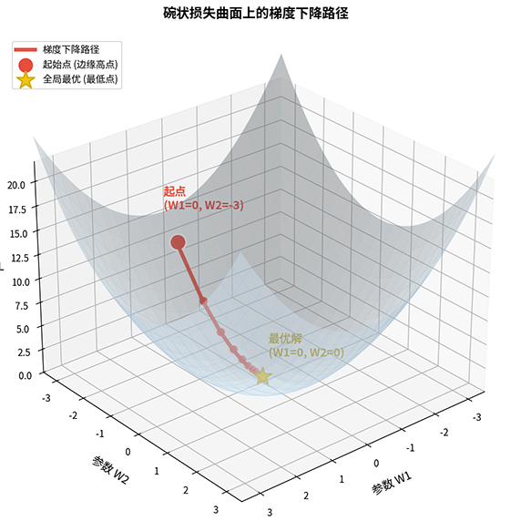
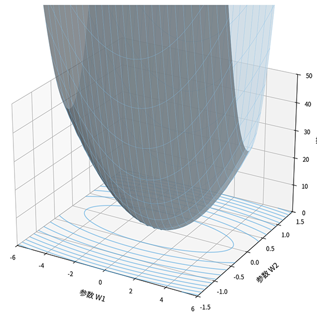
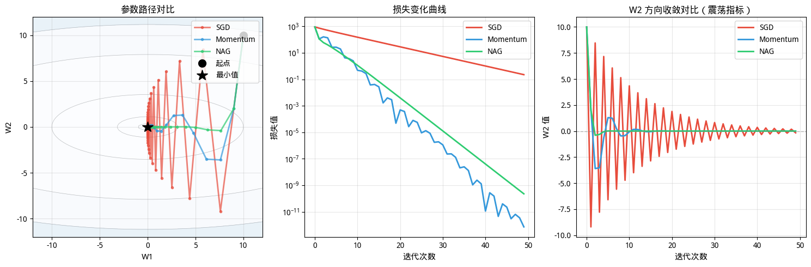

# 梯度下降

在第一部分中，我们已经学习神经网络从神经元到线性感知机再到多层网络的思维迭代过程，学习了构成神经网络模型的三个必备组件：反向传播计算梯度、激活函数引入非线性、损失函数定义优化目标。至此已经具备的静态描述神经网络模型的全部理论基础。接下来，我们要切换到动态视角，解答如何高效地更新神经网络的参数，即通俗语言中所说的“怎样训练模型”，这正是**优化算法**（Optimization Algorithm）的核心任务。

优化算法是神经网络训练的引擎，它决定了参数如何沿着梯度方向更新，直接影响训练效率、收敛速度和最终性能。**梯度下降**（Gradient Descent）是最基础的优化算法，它的核心思想极其简单，就是沿着梯度的反方向（损失下降最快的方向）更新参数。这个看似简单的算法今天已经衍生出了许多重要的变体和改进版本，包括随机梯度下降、动量法、Nesterov 加速梯度等，这些算法构成了现代深度学习优化的基石。

梯度下降的思想源头可以追溯到数学家雅克·柯西（Jacques Cauchy）在 1847 年的工作。当时，柯西在研究天体力学和光学问题时，提出了用迭代方法求解线性方程组的思路，这实际上就是梯度下降的雏形。但真正将梯度下降系统化应用于数值优化的是苏联数学家尤里·涅斯捷罗夫（Yurii Nesterov）等人在 20 世纪 80 年代的贡献。涅斯捷罗夫在 1983 年提出了加速梯度方法的理论框架，奠定了后来 Nesterov 加速梯度算法的基础。现代深度学习中广泛使用的随机梯度下降则由赫伯特·罗宾斯（Herbert Robbins）在 1951 年提出，他们证明了在满足特定条件下随机逼近方法的收敛性。如今深度学习训练所取得的种种荣誉，其实是站在这些跨越近两百年的数学成果基石之上的成就。

本章将介绍梯度下降的基本原理、随机梯度下降的实现、学习率选择策略、动量法和 Nesterov 加速梯度、以及收敛性分析，是我们跨出从动态视角理解深度学习优化的第一步。

## 梯度下降的基本原理

反向传播中我们推导了[计算梯度的公式](../../deep-learning/neural-network-structure/backpropagation.md#参数梯度计算)，有了梯度之后，该如何更新参数，这个场景就仿佛登山者在四周雾气弥漫，看不清位置的山上，凭脚下的感知，能判断出坡度，接下来要决定的是朝哪个方向走、走多远。梯度下降回答的就是这两个问题。

针对前面提到的场景，如果想要尽快下山，一个自然的直觉是沿着坡度最陡的方向往下走，每一步都选择坡度最大的方向，应该能最快到达山谷底部，这正是梯度下降的中心思想。设损失函数 $L(\mathbf{W})$，参数 $\mathbf{W}$ 表示当前位置（参数空间中的一个点），梯度 $\nabla L = \frac{\partial L}{\partial \mathbf{W}}$ 是一个向量，它的每个分量表示损失函数在对应参数方向上的变化率。梯度本身指向的是损失增长最快的方向（上山最快的方向），它的反方向 $-\nabla L$ 指向的是损失下降最快的方向（下山最快的方向）（在[练习题](#练习题)部分给出了梯度的反方向一定是损失下降最快的方向的严格证明），应该沿着这个方向更新参数，如下图所示。



*图：梯度下降的几何直观*

接下来的问题是每一步走多远？如果每一步走得太小，可能需要走几千步才能到达山谷；如果每一步走得太大，可能直接跳过山谷，跑到另一边的山坡上，甚至越跑越远。步长的选择，是下山的效率与稳定性之间的权衡结果。在梯度下降中，这个步长由**学习率**（Learning Rate）$\eta$ 控制，这是一个超参数，决定了参数更新的幅度。基于最速下降原理，梯度下降的更新规则为：

<!-- equation:label=eq:gd-update -->
$$\mathbf{W} \leftarrow \mathbf{W} - \eta \nabla L(\mathbf{W})$$
<!-- end-equation -->

其中 $\mathbf{W}$ 是当前的参数值，即当前位置，$-\nabla L(\mathbf{W})$ 是梯度的反方向，表示下坡的方向，$\eta$ 是学习率，相当于步长，控制每一步走多远。整体公式表达的意思是：新位置 = 当前位置 − 步长 × 下坡方向。整个梯度下降的算法流程即使围绕着这个公式进行迭代：

- 步骤一 **计算梯度**：使用反向传播计算 $\nabla L(\mathbf{W})$（这正是[反向传播](../neural-network-structure/backpropagation.md)推导的内容）
- 步骤二 **更新参数**：$\mathbf{W} \leftarrow \mathbf{W} - \eta \nabla L(\mathbf{W})$
- 步骤三 **重复迭代**：直到损失收敛或达到预设迭代次数

除了学习率外，还有一个更重要的因素影响着训练的效率和稳定性 —— 梯度下降算法的选择。回顾反向传播的计算过程，梯度是通过对样本的损失求平均得到的，根据使用多少样本计算梯度，梯度下降有三种变体：

- **批量梯度下降**（Batch Gradient Descent, BGD）使用全部训练样本计算梯度，真实梯度 = 所有样本梯度的平均：$\nabla L = \frac{1}{m} \sum_{i=1}^{m} \nabla L_i$
    
    批量梯度下降的梯度是真实梯度（精确的方向），因为用到了所有样本的信息，梯度方向稳定可靠，收敛路径平滑。但代价高昂：每次参数更新都要遍历全部训练数据。当样本数量达到百万级时，一次参数更新可能需要几秒甚至几分钟，训练效率极低。更重要的是，批量梯度下降容易陷入局部极小值，因为梯度方向精确，没有随机性帮助参数"跳出"局部最优。

- **随机梯度下降**（Stochastic Gradient Descent, SGD）每次使用单个样本计算梯度，近似梯度 ≈ 随机选一个样本的梯度：$\nabla L \approx \nabla L_i$

    随机梯度下降的计算代价极低：每处理一个样本就更新一次参数，速度快。但代价是梯度不稳定，单个样本的梯度可能有很大的随机波动，参数更新方向剧烈震荡。有趣的是，实践中发现这种震荡有时反而是好事：噪声可能帮助参数跳出局部最优，找到更好的全局解。

- **小批量梯度下降**（Mini-batch Gradient Descent, MBGD）介于两者之间，每次使用一个小批量样本计算梯度，近似梯度 = 小批量样本梯度的平均：$\nabla L \approx \frac{1}{b} \sum_{i=1}^{b} \nabla L_i$

    小批量梯度下降结合了批量梯度下降的稳定性和随机梯度下降的高效性：批量大小适中时，梯度足够稳定（噪声可控），计算又足够高效（不需要遍历全部数据）。现代深度学习的标准选择就是小批量梯度下降。实践中，人们常说的随机梯度下降通常指的就是小批量梯度下降，而非真正的单样本 SGD。

三种方法的对比总结如下表所示：

| 特性 | 批量梯度下降 | 随机梯度下降 | 小批量梯度下降 |
|:-----|:----------|:----------|:----------|
| 每步使用样本数 | 全部样本 $m$ | 单个样本 | 小批量 $b$ |
| 梯度精度 | 精确（真实梯度） | 噪声大（近似梯度） | 适中（噪声可控） |
| 计算效率 | 低（遍历全部数据） | 高（每样本更新） | 较高（每小批量更新） |
| 收敛稳定性 | 稳定（平滑路径） | 震荡（波动路径） | 较稳定（适度噪声） |
| 跳出局部最优能力 | 弱（无噪声） | 强（噪声帮助探索） | 适中 |

## 随机梯度下降算法

前面介绍了梯度下降的三种变体，本节以随机梯度下降为例，深入分析它的主要特点、算法实现，理解它的噪声来源、收敛行为，以及噪声对训练的影响。随机梯度下降的特点是梯度是真实梯度的近似，存在噪声。这种噪声来自两个方面：

1. **样本随机性**：不同样本的梯度方向可能不同。比如一个分类任务中，某些样本的梯度指向"增大参数 A"，另一些样本的梯度指向"减小参数 A"。单样本的梯度可能偏离真实梯度（所有样本的平均方向）
2. **数据分布**：训练数据可能包含噪声标签或异常样本。比如一个被错误标记的样本，它的梯度方向可能完全相反，影响梯度估计的准确性

噪声的影响可以用数学形式描述。设真实梯度 $\nabla L$（全部样本的平均梯度），SGD 梯度 $\tilde{\nabla L}$（单样本或小批量的梯度），噪声项 $\xi$ 表示实际梯度与真实梯度的偏差，则有：

$$\tilde{\nabla L} = \nabla L + \xi$$

噪声项 $\xi$ 的期望 $\mathbb{E}[\xi] = 0$，意味着虽然单步梯度可能有偏差，但长期来看平均方向仍然指向真实梯度。这就像你跟着导航步行时，不可能每一步都精准踏在最优的正确方向上，肯定有随机误差，但多走几步后，平均方向仍然正确。噪声对训练的影响既有积极的一面，也有消极的一面。积极方面有：

- **跳出局部最优**：当参数陷入一个局部极小值时，精确的梯度方向为零，批量梯度下降会停止。但 SGD 的噪声可能让参数在局部极小值附近随机跳动，有机会跳出局部最优，继续向全局最优移动。
- **探索能力**：噪声增加了搜索的随机性，让参数有机会探索更广的区域，可能发现比初始点附近更好的解。
- **隐式正则化**：研究发现，SGD 的噪声有时起到正则化作用，防止模型过拟合训练数据。这是因为噪声阻止参数精确收敛到训练数据的极小值，保持了一定的泛化能力。

噪声的消极作用有：

- **收敛不稳定**：参数更新路径剧烈震荡，损失曲线有明显波动，难以判断是否真正收敛。
- **最终精度受限**：接近最小值时，梯度变得很小，但噪声仍然存在。噪声阻碍参数精确收敛到最小值，最终损失可能在一个小范围内波动。

SGD 的算法流程极其简洁，核心就只有计算梯度、更新参数两步。下面是一个小批量梯度下降的伪代码实现，展示了典型的训练循环结构。

```python
# SGD 参数更新伪代码
for epoch in range(n_epochs):
    for batch in get_batches(X, y, batch_size):
        # 计算小批量梯度（使用反向传播）
        gradient = compute_gradient(model, batch)

        # 更新参数（沿梯度反方向）
        W = W - learning_rate * gradient
```

代码每个部分都有明确的含义：
- `n_epochs` 是训练的总轮数，一轮（epoch）表示遍历全部训练数据一次
- `get_batches` 将数据分成小批量，每个批量包含 `batch_size` 个样本
- `compute_gradient` 使用反向传播计算当前批量的梯度（这正是上一章学习的内容）
- `learning_rate` 控制参数更新的步长，是最关键的超参数
- 参数更新公式 `W = W - learning_rate * gradient` 对应梯度下降的核心公式

## 动量法

SGD 有一个被称为"SGD 震荡"的固有问题，在某些方向上收敛缓慢，特别是当损失函数在不同参数方向上的梯度差异很大时。这个问题的根源在于损失函数的形状，当损失函数在不同参数方向上的梯度差异很大时，SGD 的参数更新路径会出现剧烈震荡。考虑一个极端例子：损失函数 $L(W_1, W_2) = W_1^2 + 8W_2^2$。这是一个椭圆形状的损失曲面，$W_1$ 方向变化缓慢（系数为 1），$W_2$ 方向变化剧烈（系数为 8）。梯度为 $\nabla L = (2W_1, 16W_2)$，在 $W_2$ 方向的梯度是 $W_1$ 方向的 8 倍，从函数图像中可以看出曲面陡峭程度的差异，沿 $W_1$ 方向曲面平缓，沿 $W_2$ 方向曲面陡峭，底部等高线呈椭圆形状。



*图：椭圆损失曲面 $L = W_1^2 + 100W_2^2$ 的三维可视化*

如果使用 SGD 从起点 $(10, 10)$ 开始优化，那每次参数更新时，$W_2$ 方向的步长是 $W_1$ 方向的 100 倍（因为梯度差 100 倍）。参数在 $W_2$ 方向剧烈跳跃，来回震荡；在 $W_1$ 方向缓慢挪动。大量迭代步骤浪费在参数于 $W_2$ 方向的来回摆动上，整体收敛效率低下。震荡问题的根源在于 SGD 每一步完全依赖当前位置的梯度，完全没有考虑历史信息。当梯度在不同方向上差异很大时，参数更新方向在各个方向之间剧烈摆动，无法沿着一条平滑的路径收敛。


### 动量法的原理

**动量法**（Momentum）就是为了解决这个问题而提出的改进算法，它的核心思想是引入历史梯度信息，平滑参数更新方向。就像物理学中的动量概念，一个有质量的物体运动时会保持惯性，不会因为单次受力而剧烈改变方向。讲解动量法的数学表示前，不妨先在大脑中想象两个直观画面进行类比：

- **物理类比**：参数像一个小球沿着损失曲面滚动。速度向量是小球的运动速度，动量系数是小球的惯性（质量）。小球在陡峭方向速度加快（重力作用），在平坦方向速度减慢，整体运动更平滑。当小球进入震荡区域，惯性让它不会剧烈摆动，而是沿着一个相对稳定的方向前进。
- **梯度平均类比**：速度向量是历史梯度的指数加权平均，当前梯度权重为 $\eta$，历史梯度权重为 $\gamma$。当梯度方向一致，速度增大（梯度累加），加速前进；当梯度方向摆动（梯度正负交替），速度减小（梯度抵消），抑制震荡。

设 $\mathbf{v}_t$ 是速度向量，表示参数的变化速度，$\mathbf{v}_{t-1}$ 是上一轮的速度，代表历史的惯性，$\gamma$ 是动量系数（通常 $0.9$），控制历史信息的影响程度，$\nabla L(\mathbf{W}_t)$ 是当前位置的梯度，表示当下的推力。则动量法的更新规则如下：

<!-- equation:label=eq:momentum-update -->
$$\mathbf{v}_t = \gamma \mathbf{v}_{t-1} + \eta \nabla L(\mathbf{W}_t)$$
$$\mathbf{W}_{t+1} = \mathbf{W}_t - \mathbf{v}_t$$
<!-- end-equation -->

这两个公式分别定义了新的速度和新的位置：
- 第一个公式可以理解为：新速度 = 惯性保留 + 当下推力
- 第二个公式可以理解为：新位置 = 当前位置 − 速度（沿速度方向移动）

动量法与 SGD 的关键区别是 SGD 直接用梯度更新参数（$\mathbf{W} \leftarrow \mathbf{W} - \eta \nabla L$），动量法引入了速度向量累积历史梯度。速度向量起到惯性作用，当梯度方向一致时，速度累积增大，加速前进；当梯度方向摆动时，速度相互抵消，抑制震荡。动量法依靠动量系数 $\gamma$ 的选择影响平滑程度：

| $\gamma$ | 效果 | 适用场景 |
|:--------:|:-----|:---------|
| $0.5$ | 弱惯性，历史梯度影响小 | 收敛后期，需要精细调整 |
| $0.9$ | 强惯性，平滑震荡效果好 | 常用选择，大多数场景适用 |
| $0.99$ | 极强惯性，可能过度平滑 | 极端震荡场景，可能延迟收敛 |

### 动量法的效果分析

前面用物理类比和梯度平均类比解释了动量法的工作原理。现在用数学推导更精确地分析动量法为何在一致方向加速、在摆动方向减速。设梯度序列 $\nabla L_1, \nabla L_2, \ldots, \nabla L_t$，初始速度 $\mathbf{v}_0 = 0$，$\gamma^i$ 是权重，随着距离当前步越远，权重越小（指数衰减），递推展开速度向量：

$$\mathbf{v}_t = \eta \sum_{i=0}^{t-1} \gamma^i \nabla L_{t-i}$$

速度向量是历史梯度的指数加权平均，权重从最近到最远依次为 $\eta, \eta\gamma, \eta\gamma^2, \ldots$。当 $\gamma = 0.9$ 时，最近梯度的权重约是 10 步前梯度的 $0.9^{10} \approx 0.35$ 倍。历史梯度的影响逐渐衰减，但短期内仍保持一定的累积效果。下面分析两种极端情况：

- **情况一：梯度方向一致**（如 $\nabla L_i = \mathbf{g}$，所有梯度指向同一方向）：

    $$\mathbf{v}_t = \eta \mathbf{g} \sum_{i=0}^{t-1} \gamma^i = \eta \mathbf{g} \frac{1 - \gamma^t}{1 - \gamma} \approx \frac{\eta \mathbf{g}}{1 - \gamma}$$

    当 $t$ 很大时，$\gamma^t \to 0$（因为 $\gamma < 1$），速度收敛到 $\frac{\eta \mathbf{g}}{1 - \gamma}$。与 SGD 的步长 $\eta \mathbf{g}$ 相比，动量法的步长放大了 $\frac{1}{1-\gamma}$ 倍。当 $\gamma = 0.9$ 时，放大倍数约 10 倍，这就是动量法在一致方向的加速效果。

- **情况二：梯度方向摆动**（如 $\nabla L_i$ 交替为 $\mathbf{g}$ 和 $-\mathbf{g}$，梯度正负交替）：

    $$\mathbf{v}_t = \eta (\mathbf{g} - \gamma \mathbf{g} + \gamma^2 \mathbf{g} - \cdots) = \eta \mathbf{g} \frac{1 - (-\gamma)^t}{1 + \gamma} \approx \frac{\eta \mathbf{g}}{1 + \gamma}$$

    当 $t$ 很大时，$(-\gamma)^t \to 0$，速度收敛到 $\frac{\eta \mathbf{g}}{1 + \gamma}$。与 SGD 的步长 $\eta \mathbf{g}$ 相比，动量法的步长缩小了 $\frac{1}{1+\gamma}$ 倍。当 $\gamma = 0.9$ 时，缩小倍数约 0.53 倍，这就是动量法在摆动方向的减速效果。

经过以上两种极端情况的分析，可得出结论，动量法的核心机制是梯度累积。当梯度方向一致，历史梯度累积放大当前梯度，加速前进；当梯度方向摆动，历史梯度正负抵消，削弱当前梯度，抑制震荡，整体收敛更平稳高效。

## Nesterov 加速梯度

动量法通过累积历史梯度，有效缓解了 SGD 的震荡问题。但动量法也有不足，它总是在当前位置计算梯度，而参数在动量的作用下可能已经"冲过头"了。能不能在参数冲过头之前，提前感知到前面的情况，及时调整方向？这就是**Nesterov 加速梯度**（Nesterov Accelerated Gradient, NAG）的核心思想。

### NAG 原理

苏联数学家涅斯捷罗夫在 1983 年提出了加速梯度方法的理论框架，NAG 相对于动量法的改进是在预测位置计算梯度，而不是在当前位置。回顾动量法的更新公式 <!-- eqref:eq:momentum-update -->，动量法在当前位置 $\mathbf{W}_t$ 计算梯度，然后累积到速度向量。问题是当前位置可能不是参数实际要到达的位置，参数受动量影响，下一步会移动到 $\mathbf{W}_t - \gamma \mathbf{v}_{t-1}$（只考虑动量，不考虑当前梯度）。如果这个预测位置的梯度方向与当前位置不同，动量法的方向估计就会不准确。NAG 改进了速度的更新规则，假设 $\gamma \mathbf{v}_{t-1}$ 是动量带来的预测位移（只考虑受动量影响），$\mathbf{W}_t - \gamma \mathbf{v}_{t-1}$ 就是预测位置，即参数下一步将要到达的位置，$\nabla L(\mathbf{W}_t - \gamma \mathbf{v}_{t-1})$ 是在预测位置计算的梯度。NAG 的速度更新规则为

$$\mathbf{v}_t = \gamma \mathbf{v}_{t-1} + \eta \nabla L(\mathbf{W}_t - \gamma \mathbf{v}_{t-1})$$
$$\mathbf{W}_{t+1} = \mathbf{W}_t - \mathbf{v}_t$$

与动量法一样，这两个公式也是定义了新的速度和新的位置，其中位置的更新动量法与 NAG 是一致的，区别在速度的更新规则上，NAG 相当于提前看了一步，在参数即将到达的位置计算梯度，更准确地估计下一步的方向：
- 第一个公式可以理解为：新速度 = 惯性保留 + 预测位置的推力
- 第二个公式可以理解为：新位置 = 当前位置 − 速度（与动量法相同）


### NAG 与动量法对比

NAG 改变了梯度计算的位置，这个看似简单的改变，带来在一些情况下能带来显著的收敛效果提升。设想参数正沿着一个陡坡快速下滑（速度 $\mathbf{v}$ 很大），接近最小值时坡度变平，此时：

- **动量法的行为**：在当前位置 $\mathbf{W}_t$ 计算梯度，当前位置还在最小值之前，梯度方向指向最小值。
    - 速度累积：$\mathbf{v}_t = \gamma \mathbf{v}_{t-1} + \eta \nabla L(\mathbf{W}_t)$，速度仍然很大。
    - 参数更新：$\mathbf{W}_{t+1} = \mathbf{W}_t - \mathbf{v}_t$，参数直接冲过最小值。

- **NAG 的行为**：在预测位置 $\mathbf{W}_t - \gamma \mathbf{v}_{t-1}$ 计算梯度，预测位置已经越过最小值，预测位置的梯度方向反转（指向最小值，与动量方向相反）。
    - 速度累积：$\mathbf{v}_t = \gamma \mathbf{v}_{t-1} + \eta \nabla L(\mathbf{W}_t - \gamma \mathbf{v}_{t-1})$，梯度项与动量项方向相反，速度减小。
    - 参数更新：$\mathbf{W}_{t+1} = \mathbf{W}_t - \mathbf{v}_t$，参数及时减速，避免冲过头。

动量法像一个蒙着眼睛下山的人，只能感知脚下的坡度。当脚下坡度变平，惯性让他继续往前走，可能直接冲过山谷；NAG 则像一个睁开眼睛下山的人，能看到前方几步的情况。当发现前方坡度反转（过了山谷），提前减速，更平稳地停在山谷底部。NAG 的前瞻机制让它在接近最优值时更平稳，收敛更快。实践中，NAG 通常比动量法收敛更平稳、更快速，尤其是在梯度变化剧烈的场景。

## 收敛性分析

前面我们讨论了梯度下降及其变体是如何迭代收敛到损失最小值的。本节将从理论角度分析 SGD 能否保证收敛到最小值、有什么前提条件才能保证收敛、收敛速度有多快等问题。这些问题的答案其实取决于损失函数的性质和学习率的选择。

### SGD 的收敛条件

直觉上，只要学习率足够小，参数是应该能逐步逼近最小值的，最多就是收敛快慢的问题。但实践中数据有噪声、损失函数五花八门，这些因素都可能阻止收敛。1951 年，统计学家赫伯特·罗宾斯（Herbert Robbins）在论文中给出了明确的收敛条件和严格的证明，奠定了随机逼近方法的理论基础。

::: info Robbins-Monro 收敛定理
设损失函数 $L$ 是凸函数、有下界、梯度有界。则 SGD 收敛到最小值的条件是：

$$\sum_{t=1}^{\infty} \eta_t = \infty, \quad \sum_{t=1}^{\infty} \eta_t^2 < \infty$$
:::

Robbins-Monro 收敛定理中的 $\sum_{t=1}^{\infty} \eta_t = \infty$ 代表的是学习率之和无限，这点保证参数有足够步数到达任意位置。如果学习率衰减太快（如 $\eta_t = \frac{1}{t^2}$），学习率之和有限，参数可能还没到达最小值就停止移动了。$\sum_{t=1}^{\infty} \eta_t^2 < \infty$ 代表的是学习率平方之和有限，保证了保证噪声的影响会逐渐减小。SGD 的噪声方差与学习率平方成正比，如果学习率平方之和无限，噪声累积可能阻止收敛，因此必须要有这个条件。整个定理可以表述为一句看起来十分矛盾的话：学习率要足够大，以保证能到达目的地，又要足够小，以保证噪声可控。以下是满足这个条件的典型学习率选择：

- $\eta_t = \frac{\eta_0}{\sqrt{t}}$：学习率按迭代次数的平方根衰减，满足 Robbins-Monro 条件
- $\eta_t = \frac{\eta_0}{t}$：学习率按迭代次数衰减，也满足 Robbins-Monro 条件

实践中，常用的[学习率衰减策略](#学习率衰减)（步衰减、余弦衰减）通常也能满足收敛条件，因为学习率最终会趋近于一个很小但不为零的值。

### 非凸函数的收敛

Robbins-Monro 定理假设损失函数是凸函数（只有一个全局最小值）。但神经网络的损失函数是**非凸函数**（Non-convex Function）的情况很多，有多个局部极小值、鞍点和平坦区域。在这种情况下，SGD 的收敛分析更复杂，收敛到哪个点难以预测。数学上，非凸优化没有严格的收敛保证，但实践中发现了一些有趣的规律：

- **SGD 通常收敛到局部极小值**，但这个局部极小值通常有足够的泛化能力。研究发现，神经网络的不同局部极小值往往有相似的测试性能，不是所有局部极小值都"坏"
- **噪声帮助跳出局部最优**：SGD 的噪声让参数在局部极小值附近随机跳动，有机会跳出局部最优，找到更好的解。这是 SGD 相比批量梯度下降的优势：批量梯度下降的梯度精确，一旦陷入局部极小值（梯度为零），就无法跳出
- **批量大小影响收敛结果**：小批量噪声大，可能跳出局部最优；大批量噪声小，容易困在局部最优。研究发现，小批量训练往往得到泛化性能更好的模型

这些实践经验再次说明在非凸优化中，SGD 的噪声不是"缺点"，反而是"特点"。噪声让参数有机会探索更大的区域，可能找到泛化性能更好的解。

### 收敛速度

收敛速度用步数的倒数来表示，譬如 $O(1/t)$ 表示经过 $t$ 步后，损失与最优值的差距缩小到 $O(1/t)$，即差距与 $1/t$ 同阶，或者说如要达到误差 $\epsilon$，需要约 $O(1/\epsilon)$ 步。不同优化算法的收敛速度，如下表所示：

| 算法 | 凸函数收敛速度 | 非凸函数表现 |
|:-----|:-------------|:-----------|
| 批量梯度下降 | $O(1/t)$ | 稳定但慢，易陷入局部最优 |
| SGD | $O(1/\sqrt{t})$ | 较快，噪声帮助探索 |
| 动量法 | $O(1/t)$（理论加速） | 更快，平滑震荡 |
| NAG | $O(1/t^2)$（凸函数上理论速度） | 实践中快于动量法 |

从各种算法的收敛速度可以看出：
- SGD（$O(1/\sqrt{t})$）比批量梯度下降（$O(1/t)$）收敛慢，因为噪声影响收敛精度。但 SGD 每步计算代价低，实际时间效率可能更高。
- 动量法在凸函数上有理论加速，收敛速度从 $O(1/\sqrt{t})$ 提升到 $O(1/t)$（约 10 倍加速）。
- NAG 在凸函数上有更强的理论加速（$O(1/t^2)$），但在非凸函数上效果因问题而异。

实践中，动量法通常比 SGD 快 2-3 倍，NAG 比动量法略快。这些加速效果在梯度差异大的问题（如本章开头的椭圆损失函数例子）中尤其显著。

## 梯度下降算法实践

前面从理论角度分析了 SGD、动量法和 NAG 的原理和收敛特性。现在通过代码实验直观对比三种优化算法的实际表现。实验使用一个极端的椭圆损失函数（$L = W_1^2 + 100W_2^2$），让梯度在不同方向差异巨大，从而清晰地展示三种算法的收敛行为差异。实验设定为损失函数在 $W_2$ 方向的梯度是 $W_1$ 方向的 100 倍，起点选在远离最小值的 $(10, 10)$。这种设定让 SGD 的震荡问题极其明显，便于观察动量法和 NAG 如何改进。代码实现了三种优化器的参数更新逻辑，并通过可视化展示参数路径、损失曲线和 $W_2$ 方向的震荡情况。



*图：SGD、动量法和 NAG 的收敛对比*

下面的代码实现三种优化器的对比实验，使用椭圆损失函数展示它们的收敛行为差异。

1. **SGD 在梯度差异大的问题上震荡明显**：当不同参数方向的梯度差异很大时，SGD 在大梯度方向剧烈震荡，浪费大量迭代在来回摆动上。
2. **动量法有效平滑震荡**：历史梯度累积让参数在一致方向加速，在摆动方向减速，收敛更平稳高效。
3. **NAG 提前感知方向变化**：在预测位置计算梯度，能更及时地调整参数更新方向，收敛最快且最平稳。

实验验证了本章的理论分析，动量法和 NAG 在梯度差异大的问题上显著优于 SGD。这种问题在实际神经网络训练中很常见，不同参数的梯度范围可能相差几个数量级，因此动量法是现代深度学习的标准选择。

```python runnable
import numpy as np
import matplotlib.pyplot as plt

# 定义损失函数（椭圆函数，梯度在不同方向差异明显）
def loss_function(W1, W2):
    """损失函数 L = W1^2 + 100*W2^2（椭圆）"""
    return W1**2 + 100 * W2**2

def gradient(W1, W2):
    """梯度 ∇L = (2W1, 16W2)"""
    return np.array([2 * W1, 16 * W2])

# SGD 优化器
class SGD:
    def __init__(self, learning_rate=0.01):
        self.lr = learning_rate
        self.path = []
    
    def step(self, W, grad):
        self.path.append(W.copy())  # 记录当前位置（更新前的起点）
        W_new = W - self.lr * grad
        return W_new

# 动量法优化器
class Momentum:
    def __init__(self, learning_rate=0.01, momentum=0.9):
        self.lr = learning_rate
        self.momentum = momentum
        self.velocity = np.zeros(2)
        self.path = []
    
    def step(self, W, grad):
        self.path.append(W.copy())  # 记录当前位置（更新前的起点）
        self.velocity = self.momentum * self.velocity + self.lr * grad
        W_new = W - self.velocity
        return W_new

# NAG 优化器
class NAG:
    def __init__(self, learning_rate=0.01, momentum=0.9):
        self.lr = learning_rate
        self.momentum = momentum
        self.velocity = np.zeros(2)
        self.path = []
    
    def step(self, W, grad_func):
        self.path.append(W.copy())  # 记录当前位置（更新前的起点）
        # 在预测位置计算梯度
        W_predict = W - self.momentum * self.velocity
        grad_predict = grad_func(W_predict[0], W_predict[1])
        
        self.velocity = self.momentum * self.velocity + self.lr * grad_predict
        W_new = W - self.velocity
        return W_new

# 初始化参数（远离最小值）
W_init = np.array([10.0, 10.0])  # 起点
n_iterations = 50

# 运行三种优化器（调整参数让效果对比明显）
optimizers = {
    'SGD': SGD(learning_rate=0.12),           # 大学习率，震荡幅度大且持续
    'Momentum': Momentum(learning_rate=0.05, momentum=0.5),  # 小学习率+小动量，平滑收敛
    'NAG': NAG(learning_rate=0.05, momentum=0.5)             # 预测机制，收敛最好
}

results = {}
for name, opt in optimizers.items():
    W = W_init.copy()
    losses = []
    
    for t in range(n_iterations):
        loss = loss_function(W[0], W[1])
        losses.append(loss)
        
        if name == 'NAG':
            W = opt.step(W, gradient)
        else:
            grad = gradient(W[0], W[1])
            W = opt.step(W, grad)
    
    results[name] = {
        'path': np.array(opt.path),
        'losses': losses,
        'final_W': W
    }
    
    print(f"{name:10s}: 最终位置 ({W[0]:.4f}, {W[1]:.4f}), 最终损失 {losses[-1]:.4f}")

print()

# 可视化
fig, axes = plt.subplots(1, 3, figsize=(15, 5))

# 图1：参数路径（在损失曲面上）
ax1 = axes[0]

# 绘制损失函数等值线
W1_range = np.linspace(-12, 12, 100)
W2_range = np.linspace(-12, 12, 100)
W1_grid, W2_grid = np.meshgrid(W1_range, W2_range)
L_grid = loss_function(W1_grid, W2_grid)

ax1.contour(W1_grid, W2_grid, L_grid, levels=[1, 10, 100, 500, 1000, 5000], 
           colors='gray', alpha=0.5, linewidths=0.5)
ax1.contourf(W1_grid, W2_grid, L_grid, levels=[0, 1, 10, 100, 500, 1000, 5000, 10000],
             cmap='Blues', alpha=0.3)

# 绘制各优化器的路径
colors = {'SGD': '#e74c3c', 'Momentum': '#3498db', 'NAG': '#2ecc71'}
for name, result in results.items():
    path = result['path']
    ax1.plot(path[:, 0], path[:, 1], 'o-', color=colors[name], 
             linewidth=2, markersize=3, alpha=0.7, label=name)

# 标记起点和最小值
ax1.plot(W_init[0], W_init[1], 'ko', markersize=10, label='起点')
ax1.plot(0, 0, 'k*', markersize=15, label='最小值')

ax1.set_xlabel('W1', fontsize=11)
ax1.set_ylabel('W2', fontsize=11)
ax1.set_title('参数路径对比', fontsize=12, fontweight='bold')
ax1.legend(loc='upper right')
ax1.grid(True, alpha=0.3)
ax1.set_xlim(-12, 12)
ax1.set_ylim(-12, 12)

# 图2：损失变化曲线
ax2 = axes[1]
for name, result in results.items():
    ax2.plot(result['losses'], color=colors[name], linewidth=2, label=name)

ax2.set_xlabel('迭代次数', fontsize=11)
ax2.set_ylabel('损失值', fontsize=11)
ax2.set_title('损失变化曲线', fontsize=12, fontweight='bold')
ax2.legend()
ax2.grid(True, alpha=0.3)
ax2.set_yscale('log')

# 图3：W2 方向变化（震荡对比）
ax3 = axes[2]
for name, result in results.items():
    W2_path = result['path'][:, 1]
    ax3.plot(W2_path, color=colors[name], linewidth=2, label=name)

ax3.axhline(y=0, color='gray', linestyle='--', linewidth=1, alpha=0.5)
ax3.set_xlabel('迭代次数', fontsize=11)
ax3.set_ylabel('W2 值', fontsize=11)
ax3.set_title('W2 方向收敛对比（震荡指标）', fontsize=12, fontweight='bold')
ax3.legend()
ax3.grid(True, alpha=0.3)

plt.tight_layout()
plt.show()
plt.close()
```

## 学习率选择策略

开篇提到，有两个因素影响着训练的效率和稳定性，一个是梯度下降算法的选择，这我们已经花费大量篇幅进行讨论了。另一个就是学习率的选择，现在我们来深入分析学习率的影响，在实际训练中，最优的学习率不是一成不变的，往往需要动态调整。训练初期，参数远离最优值，可以使用较大学习率快速接近；训练后期，参数接近最优值，需要较小学习率精细调整。这就是**学习率衰减**（Learning Rate Decay）策略。常用的衰减方式有三种：

- **步衰减**（Step Decay）：每经过 $N$ 个 epoch 学习率就乘以衰减因子 $\gamma$，即 $\eta_t = \eta_0 \cdot \gamma^{\lfloor t/N \rfloor}$
    
    当前学习率 = 初始学习率 × 衰减因子的"衰减次数"次幂，譬如 $\eta_0 = 0.1$，$\gamma = 0.5$，$N = 10$，则学习率变化为 $0.1$（epoch 0-9）→ $0.05$（epoch 10-19）→ $0.025$（epoch 20-29）→ $0.0125$（epoch 30-39）→ ...。每 10 个 epoch 学习率减半，呈现阶梯式下降。

- **指数衰减**（Exponential Decay）：学习率呈连续指数衰减 $\eta_t = \eta_0 \cdot e^{-kt}$
    
    当前学习率 = 初始学习率 × 指数衰减因子（$e^{-kt}$），指数衰减平滑连续，每个 epoch 学习率都微小下降。但衰减速度可能过快，当 $k$ 较大时，学习率很快降到很小的值，后期参数几乎不再更新。

- **余弦衰减**（Cosine Decay）：学习率按余弦曲线衰减，设 $\eta_0$ 是初始学习率，$\eta_{min}$ 是最小学习率(衰减不会低于这个值)，$T$ 是总迭代次数（或总 epoch 数），$t$ 是当前迭代次数，则 $\eta_t = \eta_{min} + \frac{1}{2}(\eta_0 - \eta_{min})(1 + \cos(\frac{t\pi}{T}))$
    
    随着 $\cos(\frac{t\pi}{T})$ 从 $\cos(0) = 1$ 逐渐变为 $\cos(\pi) = -1$，当前学习率从 $\eta_0$ 平滑下降到 $\eta_{min}$，下降曲线呈余弦形状。余弦衰减的特点是初期衰减慢（学习率保持较大，快速接近最优），中期衰减加速，后期衰减慢（学习率接近 $\eta_{min}$，精细调整）。这种"慢 - 快-慢"的节奏在实践中效果良好，是现代深度学习常用的衰减策略。

### 预热与自适应

学习率衰减是先快后慢的策略，但有时训练初期的"快"也会带来问题。训练刚开始时，参数是随机初始化的，可能处于一个非常不利的位置，譬如激活函数的边界区域（梯度很小或梯度很大的区域）。此时如果使用较大的学习率，参数可能突然跳到一个更糟糕的位置，造成训练初期的不稳定。这就像刚开始下山时，你站的位置是悬崖边缘，脚下坡度极其陡峭。如果此时大步往下走，可能直接滚下去。稳妥的做法是先小心翼翼地挪动几步，找到相对安全的区域后，再开始按照梯度下降的方法正常下山。

**学习率预热**（Learning Rate Warmup）策略就是这种"先稳后快"的方法，训练初期使用较小学习率，逐渐增大到目标学习率，然后再开始正常的训练或衰减。设 $\eta_0$ 是目标学习率，预热结束后达到这个值，$T_{warmup}$ 是预热期的总迭代次数（通常几千步），$\frac{t}{T_{warmup}}$ 是预热进度，从 0 逐渐增长到 1，则 $t$ 步的学习律应当为：

$$\eta_t = \eta_0 \cdot \frac{t}{T_{warmup}}$$

譬如，设 $\eta_0 = 0.1$，$T_{warmup} = 1000$，则第 0 步时 $\eta_0 = 0$（学习率为零参数不会有更新，实际通常从很小值开始，如 $0.0001$），100 步时是 $0.01$，500 步时是 $0.05$，1000 步时 $0.1$，此时宣告预热结束，达到目标学习率。预热策略在大型模型训练中尤为重要（如 Transformer、BERT、GPT 等）。这些模型参数量巨大，参数空间极其复杂，训练初期的随机位置很容易导致梯度爆炸或梯度消失。预热让参数有时间"适应"初始位置，找到相对稳定的区域后再开始正式训练，能有效避免训练初期的不稳定。

前面的衰减和预热策略都是预先设定的固定策略（按时间衰减或增长）。实际训练中，最优的学习率往往与训练动态密切相关，有时参数陷入平坦区域，需要增大学习率才能跳出，有时参数进入陡峭区域，需要减小学习率才能稳定。所以有更智能的方法是根据训练动态自动调整学习率，譬如：

- **验证损失监控**：当验证损失连续几个 epoch 不再下降（甚至上升），说明可能学习率过大或参数已接近最优，降低学习率让训练继续收敛。这是实践中常用的策略，称为 ReduceLROnPlateau
- **梯度监控**：当梯度范数很大（参数在陡峭区域），降低学习率避免参数跳跃过大；当梯度范数很小（参数在平坦区域），增大学习率加速移动
- **损失曲线分析**：观察损失下降趋势，如果损失下降缓慢，可能需要增大学习率；如果损失剧烈波动，可能需要减小学习率

这些策略需要更多的工程实现，但能更智能地适应训练过程。下一章将介绍的自适应优化器（AdaGrad、RMSprop、Adam 等）更进一步地自动化处理学习率调整问题，它们根据每个参数的历史梯度自动调整学习率，无需手动设置衰减策略。

## 本章小结

梯度下降及其变体是深度学习训练的基础工具，在实际应用中无处不在，譬如：

- **图像分类任务**：在训练卷积神经网络（如 ResNet、VGG）时，动量法是标准选择。图像数据量大、参数多（数百万到上亿），动量法能有效平滑梯度震荡，加速收敛。典型的配置是 SGD + Momentum（$\gamma = 0.9$）配合余弦衰减或步衰减策略。
- **自然语言处理任务**：Transformer 模型（如 BERT、GPT）训练通常使用预热策略。这些模型参数量巨大（BERT-base 有 1.1 亿参数），训练初期参数处于随机初始化状态，容易触发梯度爆炸或消失。预热策略让模型在初期几千步使用小学习率，稳定后再进入正常训练，能有效避免初期的不稳定。
- **迁移学习**：当使用预训练模型进行微调时，通常使用较小的学习率（如 $0.001$ 或更小）和较小的动量系数（如 $0.5$）。预训练模型的参数已经接近一个较好的解，微调只需要在小范围内调整，大学习率可能破坏原有的良好参数配置。
- **大规模分布式训练**：在分布式训练场景（如多 GPU、多机器），增大批量大小可以提高计算效率，但大批量会减少梯度噪声，可能影响泛化能力。实践中常用"线性缩放规则"：当批量大小增大 $k$ 倍时，学习率也增大 $k$ 倍，以保持每步参数更新的幅度一致。

这些应用场景展示了梯度下降算法在不同任务中的灵活运用。理解算法原理后，根据具体任务特点选择合适的优化器、学习率和动量参数，是深度学习实践的基本技能。至此，我们掌握了梯度下降的核心原理和重要改进。但 SGD、动量法、NAG 都面临一个共同的限制，所有参数使用相同的学习率。实际神经网络中，不同参数可能需要不同的步长，有些参数梯度大，需要小步长精细调整；有些参数梯度小，需要大步长快速更新。下一章将介绍自适应优化器（AdaGrad、RMSprop、Adam），它们根据每个参数的历史梯度信息自动调整学习率，进一步提升优化效率。

## 练习题

1. 证明梯度的反方向是损失下降最快的方向。设参数 $\mathbf{W}$，沿单位方向 $\mathbf{v}$ 移动 $\epsilon$，损失变化 $\Delta L \approx \epsilon \nabla L \cdot \mathbf{v}$。证明当 $\mathbf{v} = -\frac{\nabla L}{\|\nabla L\|}$ 时 $\Delta L$ 最小。
    <details>
    <summary>参考答案</summary>
    
    **证明过程**：
    
    设损失函数 $L(\mathbf{W})$，参数 $\mathbf{W}$，沿方向 $\mathbf{v}$（$\|\mathbf{v}\| = 1$）移动一小步 $\epsilon > 0$。新位置 $\mathbf{W}' = \mathbf{W} + \epsilon \mathbf{v}$。
    
    由泰勒展开（一阶近似）：
    
    $$L(\mathbf{W}') \approx L(\mathbf{W}) + \nabla L(\mathbf{W}) \cdot (\mathbf{W}' - \mathbf{W}) = L(\mathbf{W}) + \epsilon \nabla L \cdot \mathbf{v}$$
    
    损失变化量：
    
    $$\Delta L = L(\mathbf{W}') - L(\mathbf{W}) \approx \epsilon \nabla L \cdot \mathbf{v}$$
    
    设 $\theta$ 为梯度 $\nabla L$ 与方向 $\mathbf{v}$ 的夹角，则：
    
    $$\nabla L \cdot \mathbf{v} = \|\nabla L\| \|\mathbf{v}\| \cos\theta = \|\nabla L\| \cos\theta$$
    
    因此：
    
    $$\Delta L = \epsilon \|\nabla L\| \cos\theta$$
    
    要使 $\Delta L$ 最小（损失下降最多），需要 $\cos\theta$ 最小，即 $\cos\theta = -1$（$\theta = 180°$）。
    
    当 $\theta = 180°$，$\mathbf{v}$ 与 $\nabla L$ 反向，即 $\mathbf{v} = -\frac{\nabla L}{\|\nabla L\|}$。
    
    此时：
    
    $$\Delta L = \epsilon \|\nabla L\| \cdot (-1) = -\epsilon \|\nabla L\|$$
    
    损失下降最多。
    
    **结论**：梯度的反方向 $-\frac{\nabla L}{\|\nabla L\|}$ 是损失下降最快的方向。
    
    **实际意义**：梯度下降算法沿梯度反方向更新参数，保证每步损失下降最多（在最速下降意义下）。
    </details>

2. 分析动量法为何在一致方向加速、在摆动方向减速。设梯度序列 $\mathbf{g}_i = \mathbf{g}$（一致）或 $\mathbf{g}_i$ 交替为 $\mathbf{g}$ 和 $-\mathbf{g}$（摆动），推导速度向量 $\mathbf{v}_t$ 的收敛值。
    <details>
    <summary>参考答案</summary>
    
    **一致方向**（$\mathbf{g}_i = \mathbf{g}$）：
    
    动量法更新：
    
    $$\mathbf{v}_t = \gamma \mathbf{v}_{t-1} + \eta \mathbf{g}$$
    
    设初始 $\mathbf{v}_0 = 0$，递推展开：
    
    $$\mathbf{v}_1 = \eta \mathbf{g}$$
    $$\mathbf{v}_2 = \gamma \eta \mathbf{g} + \eta \mathbf{g} = \eta \mathbf{g}(1 + \gamma)$$
    $$\mathbf{v}_3 = \gamma \eta \mathbf{g}(1 + \gamma) + \eta \mathbf{g} = \eta \mathbf{g}(1 + \gamma + \gamma^2)$$
    $$\mathbf{v}_t = \eta \mathbf{g} \sum_{i=0}^{t-1} \gamma^i$$
    
    当 $t$ 很大，几何级数求和：
    
    $$\mathbf{v}_t = \eta \mathbf{g} \frac{1 - \gamma^t}{1 - \gamma} \approx \eta \mathbf{g} \frac{1}{1 - \gamma}$$
    
    （当 $\gamma < 1$，$\gamma^t \to 0$）
    
    参数更新步长：
    
    $$\|\mathbf{W}_{t+1} - \mathbf{W}_t\| = \|\mathbf{v}_t\| = \frac{\eta \|\mathbf{g}\|}{1 - \gamma}$$
    
    比 SGD 的步长 $\eta \|\mathbf{g}\|$ 大 $\frac{1}{1-\gamma}$ 倍。当 $\gamma = 0.9$，约 10 倍加速。
    
    **摆动方向**（$\mathbf{g}_i$ 交替为 $\mathbf{g}$ 和 $-\mathbf{g}$）：
    
    设 $\mathbf{g}_1 = \mathbf{g}$，$\mathbf{g}_2 = -\mathbf{g}$，$\mathbf{g}_3 = \mathbf{g}$，$\ldots$
    
    递推展开：
    
    $$\mathbf{v}_1 = \eta \mathbf{g}$$
    $$\mathbf{v}_2 = \gamma \eta \mathbf{g} - \eta \mathbf{g} = \eta \mathbf{g}(\gamma - 1)$$
    $$\mathbf{v}_3 = \gamma \eta \mathbf{g}(\gamma - 1) + \eta \mathbf{g} = \eta \mathbf{g}(\gamma^2 - \gamma + 1)$$
    $$\mathbf{v}_4 = \gamma \eta \mathbf{g}(\gamma^2 - \gamma + 1) - \eta \mathbf{g} = \eta \mathbf{g}(\gamma^3 - \gamma^2 + \gamma - 1)$$
    
    设 $t$ 为偶数，展开：
    
    $$\mathbf{v}_t = \eta \mathbf{g} (1 - \gamma + \gamma^2 - \gamma^3 + \cdots + \gamma^{t-1}(-1)^{t-1})$$
    
    交错几何级数求和：
    
    $$\mathbf{v}_t = \eta \mathbf{g} \frac{1 - (-\gamma)^t}{1 + \gamma} \approx \eta \mathbf{g} \frac{1}{1 + \gamma}$$
    
    （当 $\gamma < 1$，$(-\gamma)^t \to 0$）
    
    参数更新步长：
    
    $$\|\mathbf{v}_t\| = \frac{\eta \|\mathbf{g}\|}{1 + \gamma}$$
    
    比 SGD 的步长 $\eta \|\mathbf{g}\|$ 小 $\frac{1}{1+\gamma}$ 倍。当 $\gamma = 0.9$，约 0.53 倍减速。
    
    **总结**：
    
    | 梯度模式 | 速度收敛值 | 相对 SGD |
    |:--------|:----------|:---------|
    | 一致（$\mathbf{g}_i = \mathbf{g}$） | $\frac{\eta \mathbf{g}}{1 - \gamma}$ | 加速 $\frac{1}{1-\gamma}$ 倍 |
    | 摆动（交替 $\mathbf{g}, -\mathbf{g}$） | $\frac{\eta \mathbf{g}}{1 + \gamma}$ | 减速 $\frac{1}{1+\gamma}$ 倍 |
    
    这解释了动量法为何在一致方向加速前进、在摆动方向抑制震荡。
    </details>

3. 解释为何 Nesterov 加速梯度比动量法响应更快。比较两者在接近最小值时的行为差异。
    <details>
    <summary>参考答案</summary>
    
    **NAG 与动量法的区别**：
    
    动量法梯度计算位置：
    
    $$\mathbf{v}_t = \gamma \mathbf{v}_{t-1} + \eta \nabla L(\mathbf{W}_t)$$
    
    NAG 梯度计算位置：
    
    $$\mathbf{v}_t = \gamma \mathbf{v}_{t-1} + \eta \nabla L(\mathbf{W}_t - \gamma \mathbf{v}_{t-1})$$
    
    NAG 在"预测位置" $\mathbf{W}_t - \gamma \mathbf{v}_{t-1}$ 计算梯度，而不是当前位置 $\mathbf{W}_t$。
    
    **接近最小值时的行为**：
    
    设参数正快速接近最小值（速度 $\mathbf{v}_{t-1}$ 很大），即将越过最小值。
    
    **动量法**：
    - 在当前位置 $\mathbf{W}_t$ 计算梯度
    - $\mathbf{W}_t$ 还在最小值附近，梯度方向仍指向最小值
    - 速度累积：$\mathbf{v}_t = \gamma \mathbf{v}_{t-1} + \eta \nabla L(\mathbf{W}_t)$
    - 速度仍很大，参数冲过最小值
    
    **NAG**：
    - 在预测位置 $\mathbf{W}_t - \gamma \mathbf{v}_{t-1}$ 计算梯度（假设只受动量影响）
    - 预测位置已经越过最小值，梯度方向反转（指向最小值）
    - 速度累积：$\mathbf{v}_t = \gamma \mathbf{v}_{t-1} + \eta \nabla L(\mathbf{W}_t - \gamma \mathbf{v}_{t-1})$
    - 梯度项与动量项方向相反，速度减小
    - 参数及时减速，避免冲过头
    
    **通俗比喻**：
    
    - **动量法**：开车接近路口，只看脚下路况，惯性大可能冲过路口
    - **NAG**：开车接近路口，提前看前方路况（预测位置），发现需要转弯，提前减速
    
    **响应速度差异**：
    
    NAG 提前感知梯度方向变化，响应比动量法快一步（实际上是"提前看一步"）：
    - 动量法：发现梯度反转后，下一轮才减速
    - NAG：预测位置发现梯度反转，本轮就减速
    
    这使 NAG 在接近最优值时更平稳，震荡更少。
    
    **总结**：NAG 在预测位置计算梯度，提前感知方向变化，比动量法响应更快，在接近最小值时及时减速，避免冲过头，收敛更平稳。
    </details>
