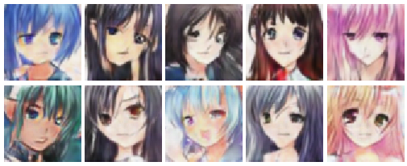

# DCGAN 图像生成实验

本次工程实训中，笔者将使用 PyTorch 实现 DCGAN 的完整训练流程，从数据预处理到模型定义、从对抗训练到图像生成，最终训练出能够生成卡通头像的生成器模型。

## 实验准备

在开始实验之前，请确保已[挂载数据目录](../../sandbox.md#数据管理)并下载好 Cartoon Face 数据集，你可以通过 `DMLA-CLI` 工具自动完成该工作：

```bash
# 选择 "下载数据集" -> 选择 "Cartoon Face"
dmla data
```

验证数据集是否已正确下载，并检查其结构。Cartoon Face 数据集包含数万张卡通头像图片，是用于人脸生成任务的数据集，图片涵盖了多种风格和表情的卡通人物面部。

```python runnable gpu
import os

# 检查数据目录是否存在（DATA_DIR 由 kernel 自动注入）
data_dir = os.path.join(DATA_DIR, 'datasets', 'cartoon-face')

if os.path.exists(data_dir):
    print("数据集目录已存在")
    
    # 递归统计图片数量
    image_count = 0
    image_extensions = ('.jpg', '.jpeg', '.png', '.bmp', '.webp')
    for root, dirs, files in os.walk(data_dir):
        for f in files:
            if f.lower().endswith(image_extensions) and not f.startswith('.'):
                image_count += 1
    
    print(f"图片总数: {image_count}")
    
    # 检查几张样本图片的尺寸信息
    from PIL import Image
    sample_images = []
    for root, dirs, files in os.walk(data_dir):
        for f in files:
            if f.lower().endswith(image_extensions) and not f.startswith('.'):
                sample_images.append(os.path.join(root, f))
                if len(sample_images) >= 3:
                    break
        if len(sample_images) >= 3:
            break
    
    if sample_images:
        for img_path in sample_images:
            img = Image.open(img_path)
            print(f"样本图片: {os.path.basename(img_path)}, 尺寸: {img.size}, 格式: {img.mode}")
else:
    print("数据集未下载，请运行 'dmla data' 下载数据集")
```

## 第一阶段：数据预处理

GAN 训练的数据预处理首要考虑的是将图像归一化到与生成器输出范围一致的区间。因为 DCGAN 生成器最后一层使用 $\tanh$ 激活函数，输出值域为 $[-1, 1]$，所以真实图像也需要归一化到相同范围，否则判别器将无法有效区分真实与生成图像。本阶段的工程决策围绕以下两点展开：

- **归一化范围**：使用 `Normalize(mean=[0.5, 0.5, 0.5], std=[0.5, 0.5, 0.5])` 将图像像素从 $[0, 1]$ 映射到 $[-1, 1]$。这是 GAN 训练的标准归一化方式，与分类任务常用的 ImageNet 归一化不同。分类任务用 Perchannel 均值和方差归一化是为了让各通道特征分布相似；GAN 用固定值归一化是为了匹配 $\tanh$ 的输出范围。如果使用 ImageNet 归一化（`mean=[0.485, 0.456, 0.406]`），真实图像和生成图像的数值范围不匹配，判别器将无法学习有效的鉴别特征。
- **内存预加载**：实验将所有图片在 Dataset 初始化时预加载到内存。GAN 训练需要 100 个 epoch，每个 batch 都从磁盘读取和解码图片，I/O 开销会成为训练瓶颈。预加载策略将 PIL 解码、Resize 和 Normalize 等操作集中在初始化阶段一次性完成，训练循环中 `__getitem__` 直接返回内存中的张量，DataLoader 只需做索引和批次组装 7 万张图片转成的 FP32 张量约占用 3.2GB 内存，现代系统完全可承受。

由于预处理阶段没有写入磁盘缓存的过程，本阶段的代码不需要手工调用，会在训练阶段自动执行。

```python runnable gpu
import torch
from torch.utils.data import Dataset, DataLoader
from torchvision import transforms
from PIL import Image
import os
import time

class CartoonFaceDataset(Dataset):
    """Cartoon Face 数据集（内存预加载版本）

    初始化时将所有图片解码、变换并缓存为张量，
    训练时 __getitem__ 直接返回内存中的张量，
    消除逐 batch 文件 I/O 和 PIL 解码开销。
    """
    def __init__(self, root_dir, base_transform, augment_transform=None):
        self.augment_transform = augment_transform
        self.data = []
        
        # 扫描所有图片路径
        image_paths = []
        image_extensions = ('.jpg', '.jpeg', '.png', '.bmp', '.webp')
        for root, dirs, files in os.walk(root_dir):
            for f in files:
                if f.lower().endswith(image_extensions) and not f.startswith('.'):
                    image_paths.append(os.path.join(root, f))
        
        print(f"找到 {len(image_paths)} 张图片，开始预加载到内存...")
        load_start = time.time()
        
        # 一次性解码、变换并存储为张量
        for i, img_path in enumerate(image_paths):
            image = Image.open(img_path).convert('RGB')
            tensor = base_transform(image)  # Resize + ToTensor + Normalize
            self.data.append(tensor)
            if (i + 1) % 10000 == 0:
                print(f"  已加载 {i+1}/{len(image_paths)} 张...")
        
        load_time = time.time() - load_start
        mem_mb = len(self.data) * self.data[0].nelement() * 4 / 1024 / 1024
        print(f"预加载完成: {len(self.data)} 张, 耗时 {load_time:.1f}s, 占用内存 ~{mem_mb:.0f}MB")
    
    def __len__(self):
        return len(self.data)
    
    def __getitem__(self, idx):
        img = self.data[idx]
        # 仅在训练时应用随机增强（水平翻转）
        if self.augment_transform:
            # 对张量做随机翻转：PIL 的 RandomHorizontalFlip 对 Tensor 无效，
            # 需用 torch 手动实现
            if torch.rand(1).item() < 0.5:
                img = torch.flip(img, dims=[2])  # 水平翻转 (W 维度)
        return img
```

## 第二阶段：模型定义

DCGAN 是将卷积神经网络系统性地引入 GAN 的里程碑式改进，我们在 [GAN 理论章节](./gan.md#gan-变体)中已作介绍。原始 GAN 使用 MLP 结构，无法有效捕捉图像的空间结构特征。DCGAN 的核心改进是使用卷积层替代全连接层，生成器使用转置卷积（Transposed Convolution）逐步上采样，从低维噪声向量扩展到高维图像，判别器使用标准卷积逐步下采样，从高维图像压缩到真假判断。DCGAN 论文给出了一系列经过大量实验验证的架构设计准则，本实验遵循了这些准则：

1. **使用卷积替代全连接层**：全连接层忽略了图像的空间结构，卷积层天然适合处理二维图像的局部特征。
2. **生成器使用转置卷积上采样**：避免使用上池化（Upsampling）+ 卷积的组合，转置卷积直接学习上采样的方式，生成质量更好。
3. **判别器使用步长卷积下采样**：避免使用池化层（MaxPool/AvgPool），步长卷积让网络自己学习下采样的方式，判别能力更强。
4. **批归一化**：生成器除输出层外都使用，判别器除输入层外都使用。生成器输出层不使用 BN 是因为 BN 会将输出分布强制归一化，削弱 $\tanh$ 的表达能力；判别器输入层不使用 BN 是因为 BN 会破坏输入数据的原始分布特征，影响对真实样本的鉴别能力。
5. **激活函数选择**：生成器中间层使用 ReLU，输出层使用 $\tanh$（输出范围 $[-1, 1]$，匹配归一化后的真实图像）；判别器中间层使用 LeakyReLU（斜率 0.2），输出层使用 Sigmoid（输出概率 $[0, 1]$）。LeakyReLU 比 ReLU 更适合判别器，因为它在负值区间保留了小梯度（$\alpha = 0.2$），防止梯度完全消失，这对判别器学习"假样本的特征"至关重要。
6. **去掉卷积层的偏置**：使用 BN 的层不需要偏置，因为 BN 本身有偏移参数 $\beta$，两者功能重叠。

```python runnable gpu extract-class="DCGANGenerator"
import torch
import torch.nn as nn

class DCGANGenerator(nn.Module):
    """
    DCGAN 生成器
    
    输入: 噪声向量 z (latent_dim 维)
    输出: 64×64×3 RGB 图像 (值域 [-1, 1])
    
    架构: 转置卷积逐步上采样
    1×1 → 4×4 → 8×8 → 16×16 → 32×32 → 64×64
    """
    def __init__(self, latent_dim=100, img_channels=3):
        super(DCGANGenerator, self).__init__()
        self.latent_dim = latent_dim
        
        self.main = nn.Sequential(
            # 输入: latent_dim × 1 × 1 → 512 × 4 × 4
            nn.ConvTranspose2d(latent_dim, 512, kernel_size=4, stride=1, padding=0, bias=False),
            nn.BatchNorm2d(512),
            nn.ReLU(True),
            
            # 512 × 4 × 4 → 256 × 8 × 8
            nn.ConvTranspose2d(512, 256, kernel_size=4, stride=2, padding=1, bias=False),
            nn.BatchNorm2d(256),
            nn.ReLU(True),
            
            # 256 × 8 × 8 → 128 × 16 × 16
            nn.ConvTranspose2d(256, 128, kernel_size=4, stride=2, padding=1, bias=False),
            nn.BatchNorm2d(128),
            nn.ReLU(True),
            
            # 128 × 16 × 16 → 64 × 32 × 32
            nn.ConvTranspose2d(128, 64, kernel_size=4, stride=2, padding=1, bias=False),
            nn.BatchNorm2d(64),
            nn.ReLU(True),
            
            # 64 × 32 × 32 → 3 × 64 × 64
            nn.ConvTranspose2d(64, img_channels, kernel_size=4, stride=2, padding=1, bias=False),
            nn.Tanh()
        )
    
    def forward(self, z):
        # 将噪声向量 reshape 为 4D 张量: (batch, latent_dim, 1, 1)
        return self.main(z.view(z.size(0), z.size(1), 1, 1))

class DCGANDiscriminator(nn.Module):
    """
    DCGAN 判别器
    
    输入: 64×64×3 RGB 图像 (值域 [-1, 1])
    输出: 真假概率 [0, 1]
    
    架构: 卷积逐步下采样
    64×64 → 32×32 → 16×16 → 8×8 → 4×4 → 1×1
    """
    def __init__(self, img_channels=3):
        super(DCGANDiscriminator, self).__init__()
        
        self.main = nn.Sequential(
            # 3 × 64 × 64 → 64 × 32 × 32 (无 BatchNorm)
            nn.Conv2d(img_channels, 64, kernel_size=4, stride=2, padding=1, bias=False),
            nn.LeakyReLU(0.2, inplace=True),
            
            # 64 × 32 × 32 → 128 × 16 × 16
            nn.Conv2d(64, 128, kernel_size=4, stride=2, padding=1, bias=False),
            nn.BatchNorm2d(128),
            nn.LeakyReLU(0.2, inplace=True),
            
            # 128 × 16 × 16 → 256 × 8 × 8
            nn.Conv2d(128, 256, kernel_size=4, stride=2, padding=1, bias=False),
            nn.BatchNorm2d(256),
            nn.LeakyReLU(0.2, inplace=True),
            
            # 256 × 8 × 8 → 512 × 4 × 4
            nn.Conv2d(256, 512, kernel_size=4, stride=2, padding=1, bias=False),
            nn.BatchNorm2d(512),
            nn.LeakyReLU(0.2, inplace=True),
            
            # 512 × 4 × 4 → 1 × 1 × 1
            nn.Conv2d(512, 1, kernel_size=4, stride=1, padding=0, bias=False),
            nn.Sigmoid()
        )
    
    def forward(self, img):
        return self.main(img).view(-1)

# 创建生成器实例
generator = DCGANGenerator(latent_dim=100)

# 打印模型结构
print("DCGAN 生成器结构:")
print(generator)

# 计算参数量
total_params = sum(p.numel() for p in generator.parameters())
print(f"\n生成器参数量: {total_params:,}")

# 测试前向传播
noise = torch.randn(16, 100)
fake_images = generator(noise)
print(f"输入噪声形状: {noise.shape}")
print(f"生成图像形状: {fake_images.shape}")
print(f"输出值域: [{fake_images.min():.2f}, {fake_images.max():.2f}]")

# 创建判别器实例
discriminator = DCGANDiscriminator()

# 打印模型结构
print("DCGAN 判别器结构:")
print(discriminator)

# 计算参数量
total_params = sum(p.numel() for p in discriminator.parameters())
print(f"\n判别器参数量: {total_params:,}")

# 测试前向传播
fake_images = torch.randn(16, 3, 64, 64)
output = discriminator(fake_images)
print(f"输入图像形状: {fake_images.shape}")
print(f"判别输出形状: {output.shape}")
print(f"输出值域: [{output.min():.4f}, {output.max():.4f}]")
```

DCGAN 的权重初始化需要特别关注。GAN 的训练稳定性高度依赖初始权重，错误的初始化可能导致训练初期梯度消失或模式崩溃。DCGAN 论文推荐的权重初始化策略为卷积层和转置卷积层的权重从正态分布 $\mathcal{N}(0, 0.02)$ 采样，标准差 0.02 比默认的 0.01 略大，提供足够的初始梯度信号又不至于导致梯度爆炸；BN 层的缩放参数 $\gamma$ 初始化为 1，偏移参数 $\beta$ 初始化为 0，这是 PyTorch 的默认设置，无需额外修改。

```python runnable gpu
import torch.nn as nn

def weights_init_normal(m):
    """DCGAN 权重初始化
    
    卷积/转置卷积层: N(0, 0.02)
    BatchNorm 层: weight=1, bias=0
    """
    classname = m.__class__.__name__
    if classname.find('Conv') != -1:
        nn.init.normal_(m.weight.data, 0.0, 0.02)
    elif classname.find('BatchNorm') != -1:
        nn.init.normal_(m.weight.data, 1.0, 0.02)  # BatchNorm 的 weight 初始化为均值 1.0
        nn.init.constant_(m.bias.data, 0)

# 导入共享模块中的模型
from shared.gan.dcgan_generator import DCGANGenerator
from shared.gan.dcgan_discriminator import DCGANDiscriminator

generator = DCGANGenerator(latent_dim=100)
discriminator = DCGANDiscriminator()

generator.apply(weights_init_normal)
discriminator.apply(weights_init_normal)

# 验证初始化结果
print("权重初始化验证:")
for name, param in generator.named_parameters():
    if 'weight' in name and param.requires_grad:
        print(f"  {name}: mean={param.data.mean():.6f}, std={param.data.std():.6f}")
```

## 第三阶段：模型训练

GAN 训练是本实验最关键也最具挑战性的环节。与前面学习过的模型相比，有两点区别：首先，GAN 需要同时优化两个相互对抗的网络；其次，训练目标不是最小化某个明确的损失值，而是让两个网络在对抗中达到动态平衡。这两个区别使得 GAN 训练远比分类网络训练困难，容易遇到不收敛而训练崩溃的情况，也是 GAN 训练被称为"炼丹"的原因。因此，本阶段的工程决策主要围绕训练稳定性展开：

- **损失函数选择**：使用二元[交叉熵损失](../../statistical-learning/linear-models/logistic-regression.md#交叉熵损失)（Binary Cross Entropy Loss，BCE Loss）。这是 GAN 训练的标准损失函数，将判别器视为二分类器，对真实样本标签为 1，对生成样本标签为 0。BCE Loss 的梯度特性恰好匹配 GAN 的训练需求，当判别器输出接近目标时梯度较小（稳定），远离目标时梯度较大（快速学习）。

- **标签平滑**：将真实样本的目标标签从 1.0 降为 0.9，即单侧标签平滑。这个工程技巧的原理是判别器对真实样本输出 1.0 表示绝对确信这是真图，这种极端置信度会导致梯度信号消失（判别器已经完美，生成器无法从它获得学习信号）和过拟合真实样本的特定细节。将目标降为 0.9 后，判别器保留了一定的不确定性，为生成器留出梯度空间。注意只平滑真实标签而不平滑假标签（仍为 0.0），因为平滑假标签会让判别器认为假图也有点真实，削弱判别能力。

- **优化器参数**：使用 [Adam 优化器](../../deep-learning/neural-network-optimization/adaptive-optimizers.md#adam)，但参数与分类任务不同。学习率 0.0002（分类任务常用 0.01），$\beta_1 = 0.5$（分类任务常用 0.9）。降低 $\beta_1$ 是 DCGAN 论文的关键发现，$\beta_1$ 控制动量项的衰减率，较高的 $\beta_1$（如 0.9）会让优化器记住太多历史梯度方向，导致训练震荡；降低到 0.5 减少了动量的影响，让每步更新更依赖当前梯度，训练更稳定。

- **训练比例**：判别器和生成器各训练 1 步（1:1 比例）。这是最简单的训练策略，并没有使用 [GAN 对抗训练](gan.md#生成器-判别器对抗训练)中提到的 5:1 的比例（判别器训练 5 步，生成器训练 1 步），让判别器保持适度优势以提供更好的梯度信号，但对于 DCGAN 在 64×64 图像上的训练，1:1 比例通常足够稳定，且训练效率更高。

::: info 训练预估

70000 张卡通头像图片，运行 100 epoch，约需 8G 内存、8G 显存可运行，用 GPU 训练约 20 - 25 分钟。

:::

```python runnable gpuonly timeout=unlimited
import torch
import torch.nn as nn
import torch.optim as optim
import os
import time

# 导入进度报告模块
from dmla_progress import ProgressReporter

# 导入共享模块中的模型
from shared.gan.dcgan_generator import DCGANGenerator
from shared.gan.dcgan_discriminator import DCGANDiscriminator

# 导入数据集（DATA_DIR 由 kernel 自动注入）
from torchvision import transforms
from torch.utils.data import Dataset, DataLoader
from PIL import Image

class CartoonFaceDataset(Dataset):
    """Cartoon Face 数据集（内存预加载版本）"""
    def __init__(self, root_dir, base_transform, augment_transform=None):
        self.augment_transform = augment_transform
        self.data = []
        image_extensions = ('.jpg', '.jpeg', '.png', '.bmp', '.webp')
        image_paths = []
        for root, dirs, files in os.walk(root_dir):
            for f in files:
                if f.lower().endswith(image_extensions) and not f.startswith('.'):
                    image_paths.append(os.path.join(root, f))
        
        print(f"找到 {len(image_paths)} 张图片，开始预加载到内存...", flush=True)
        load_start = time.time()
        for i, img_path in enumerate(image_paths):
            image = Image.open(img_path).convert('RGB')
            tensor = base_transform(image)
            self.data.append(tensor)
            if (i + 1) % 10000 == 0:
                print(f"  已加载 {i+1}/{len(image_paths)} 张...", flush=True)
        load_time = time.time() - load_start
        mem_mb = len(self.data) * self.data[0].nelement() * 4 / 1024 / 1024
        print(f"预加载完成: {len(self.data)} 张, 耗时 {load_time:.1f}s, 内存 ~{mem_mb:.0f}MB", flush=True)
    
    def __len__(self):
        return len(self.data)
    
    def __getitem__(self, idx):
        img = self.data[idx]
        if self.augment_transform:
            if torch.rand(1).item() < 0.5:
                img = torch.flip(img, dims=[2])
        return img

# 权重初始化
def weights_init_normal(m):
    classname = m.__class__.__name__
    if classname.find('Conv') != -1:
        nn.init.normal_(m.weight.data, 0.0, 0.02)
    elif classname.find('BatchNorm') != -1:
        nn.init.normal_(m.weight.data, 1.0, 0.02)
        nn.init.constant_(m.bias.data, 0)

# === 训练配置 ===
latent_dim = 100
batch_size = 128
num_epochs = 100
lr = 0.0002
beta1 = 0.5
real_label_smooth = 0.9  # 单侧标签平滑

# === 创建模型 ===
device = torch.device('cuda' if torch.cuda.is_available() else 'cpu')
print(f"使用设备: {device}", flush=True)
if device.type == 'cuda':
    print(f"GPU: {torch.cuda.get_device_name(0)}", flush=True)
    print(f"显存: {torch.cuda.get_device_properties(0).total_memory / 1024 / 1024:.0f} MB", flush=True)

generator = DCGANGenerator(latent_dim=latent_dim).to(device)
discriminator = DCGANDiscriminator().to(device)
generator.apply(weights_init_normal)
discriminator.apply(weights_init_normal)

print(f"生成器参数量: {sum(p.numel() for p in generator.parameters()):,}", flush=True)
print(f"判别器参数量: {sum(p.numel() for p in discriminator.parameters()):,}", flush=True)

# CUDA warmup: 首次执行触发 JIT 编译，提前完成避免训练时卡顿
print("正在进行 CUDA warmup...", flush=True)
with torch.no_grad():
    _warmup_noise = torch.randn(4, latent_dim, device=device)
    _warmup_fake = generator(_warmup_noise)
    _warmup_out = discriminator(_warmup_fake)
torch.cuda.synchronize()
print("CUDA warmup 完成", flush=True)

# === 损失函数与优化器 ===
criterion = nn.BCELoss()
optimizer_G = optim.Adam(generator.parameters(), lr=lr, betas=(beta1, 0.999))
optimizer_D = optim.Adam(discriminator.parameters(), lr=lr, betas=(beta1, 0.999))

# 创建固定噪声用于追踪训练进度
fixed_noise = torch.randn(64, latent_dim, device=device)

# === 创建数据加载器 ===
base_transform = transforms.Compose([
    transforms.Resize((64, 64)),
    transforms.ToTensor(),
    transforms.Normalize(mean=[0.5, 0.5, 0.5], std=[0.5, 0.5, 0.5])
])

data_dir = os.path.join(DATA_DIR, 'datasets', 'cartoon-face')
if not os.path.exists(data_dir):
    print("错误: 数据集未下载，请先运行 'dmla data' 下载数据集", flush=True)
else:
    dataset = CartoonFaceDataset(data_dir, base_transform=base_transform, augment_transform=True)
    dataloader = DataLoader(dataset, batch_size=batch_size, shuffle=True, num_workers=0, pin_memory=True)
    num_batches = len(dataloader)
    
    # 创建输出目录
    sample_dir = os.path.join(DATA_DIR, 'outputs', 'training_samples')
    os.makedirs(sample_dir, exist_ok=True)
    model_dir = os.path.join(DATA_DIR, 'models', 'gan', 'dcgan')
    checkpoints_dir = os.path.join(model_dir, 'checkpoints')
    os.makedirs(checkpoints_dir, exist_ok=True)
    final_dir = os.path.join(model_dir, 'final')
    os.makedirs(final_dir, exist_ok=True)
    
    # 训练进度（以 batch 为单位追踪，更新更频繁）
    total_batches = num_epochs * num_batches
    progress = ProgressReporter(total_steps=total_batches, description="训练 DCGAN")
    
    # 训练日志
    log_path = os.path.join(model_dir, 'training_log.txt')
    log_entries = []
    
    print(f"开始训练: {num_epochs} epochs, {num_batches} batches/epoch", flush=True)
    print(f"训练配置: lr={lr}, beta1={beta1}, batch_size={batch_size}, label_smooth={real_label_smooth}", flush=True)
    
    global_batch = 0
    for epoch in range(num_epochs):
        epoch_start = time.time()
        
        for i, real_images in enumerate(dataloader):
            real_images = real_images.to(device)
            batch_size_actual = real_images.size(0)
            
            # ========== 训练判别器 ==========
            optimizer_D.zero_grad()
            
            # 真实样本: 目标标签使用标签平滑 (0.9 而非 1.0)
            real_labels = torch.full((batch_size_actual,), real_label_smooth, device=device)
            real_output = discriminator(real_images)
            loss_D_real = criterion(real_output, real_labels)
            
            # 生成样本: 目标标签为 0
            noise = torch.randn(batch_size_actual, latent_dim, device=device)
            fake_images = generator(noise)
            fake_labels = torch.zeros(batch_size_actual, device=device)
            # detach() 阻止梯度流向生成器，判别器只更新自己的参数
            fake_output = discriminator(fake_images.detach())
            loss_D_fake = criterion(fake_output, fake_labels)
            
            loss_D = loss_D_real + loss_D_fake
            loss_D.backward()
            optimizer_D.step()
            
            # ========== 训练生成器 ==========
            optimizer_G.zero_grad()
            
            # 重新计算判别器对假样本的输出（使用更新后的判别器权重）
            # 生成器希望判别器将假样本判为真实（目标标签 1.0，不平滑）
            fake_output_for_G = discriminator(fake_images)
            target_labels = torch.full((batch_size_actual,), 1.0, device=device)
            loss_G = criterion(fake_output_for_G, target_labels)
            loss_G.backward()
            optimizer_G.step()
            
            global_batch += 1
            
            # 每 50 个 batch 更新一次进度报告（避免频繁写文件影响性能）
            if global_batch % 50 == 0 or global_batch == 1:
                progress.update(
                    global_batch,
                    message=f"Epoch {epoch+1} Batch {i+1}/{num_batches}: G_loss={loss_G.item():.4f}, D_loss={loss_D.item():.4f}"
                )
        
        epoch_time = time.time() - epoch_start
        
        # 记录本 epoch 损失
        log_entries.append({
            'epoch': epoch + 1,
            'G_loss': loss_G.item(),
            'D_loss': loss_D.item(),
            'time': epoch_time
        })
        
        print(f"Epoch [{epoch+1}/{num_epochs}] G_loss: {loss_G.item():.4f} D_loss: {loss_D.item():.4f} Time: {epoch_time:.1f}s", flush=True)
        
        # 每 10 epoch 保存训练样本图片
        if (epoch + 1) % 10 == 0:
            with torch.no_grad():
                fake_samples = generator(fixed_noise)
            # 反归一化 [-1, 1] → [0, 1]
            fake_samples = (fake_samples + 1) / 2.0
            from torchvision.utils import save_image
            save_image(fake_samples, os.path.join(sample_dir, f'epoch_{epoch+1}.png'), nrow=8, padding=2)
            print(f"  -> 保存训练样本: epoch_{epoch+1}.png", flush=True)
        
        # 每 20 epoch 保存 checkpoint
        if (epoch + 1) % 20 == 0:
            torch.save({
                'epoch': epoch + 1,
                'generator_state_dict': generator.state_dict(),
                'discriminator_state_dict': discriminator.state_dict(),
                'optimizer_G_state_dict': optimizer_G.state_dict(),
                'optimizer_D_state_dict': optimizer_D.state_dict(),
                'G_loss': loss_G.item(),
                'D_loss': loss_D.item(),
            }, os.path.join(checkpoints_dir, f'epoch_{epoch+1}.pth'))
            print(f"  -> 保存 checkpoint: epoch_{epoch+1}.pth", flush=True)
    
    # 保存最终模型
    torch.save(generator.state_dict(), os.path.join(final_dir, 'dcgan_generator_cartoon_face.pth'))
    progress.complete(message=f"训练完成！G_loss: {loss_G.item():.4f}, D_loss: {loss_D.item():.4f}")
    
    # 保存训练日志
    with open(log_path, 'w') as f:
        f.write("epoch,g_loss,d_loss,time\n")
        for entry in log_entries:
            f.write(f"{entry['epoch']},{entry['G_loss']:.4f},{entry['D_loss']:.4f},{entry['time']:.1f}\n")
    print(f"训练日志已保存: {log_path}", flush=True)
    print(f"最终模型已保存: {os.path.join(final_dir, 'dcgan_generator_cartoon_face.pth')}", flush=True)
```

## 第四阶段：推理评估

训练完成后，使用生成器从随机噪声生成卡通头像图像。GAN 的推理阶段与分类模型差异依然很大，分类模型是输入一张真实图像并输出类别，GAN 生成器只需要输入一个随机噪声向量就能生成全新图像，无需任何真实数据输入。这正是生成式模型的魅力所在——模型学会的不是预测而是创造。推理阶段的工程要点如下：

1. **模型加载**：优先加载最终模型，其次加载 Checkpoint。如果都找不到，则使用未训练的随机权重模型（仅供测试，生成结果将是无意义的噪声图像）。
2. **噪声维度**：必须与训练时的 `latent_dim` 一致（本实验为 100 维），否则模型无法正确处理输入。
3. **反归一化**：生成器输出值域为 $[-1, 1]$（$\tanh$ 激活函数），显示和保存图像时需要反归一化到 $[0, 1]$，即 $(x + 1) / 2$。
4. **生成数量**：生成 10 张卡通头像，展示模型在不同随机输入下的生成多样性。

```python runnable gpu
import torch
import os
import matplotlib
matplotlib.use('Agg')
import matplotlib.pyplot as plt

# 导入共享模块中的生成器
from shared.gan.dcgan_generator import DCGANGenerator

# 加载训练好的模型（DATA_DIR 由 kernel 自动注入）
latent_dim = 100
device = torch.device('cuda' if torch.cuda.is_available() else 'cpu')

generator = DCGANGenerator(latent_dim=latent_dim).to(device)

model_path = os.path.join(DATA_DIR, 'models', 'gan', 'dcgan', 'final', 'dcgan_generator_cartoon_face.pth')
checkpoint_dir = os.path.join(DATA_DIR, 'models', 'gan', 'dcgan', 'checkpoints')

if os.path.exists(model_path):
    generator.load_state_dict(torch.load(model_path, map_location=device, weights_only=True))
    print("Loaded final generator model")
elif os.path.exists(checkpoint_dir):
    import glob
    checkpoints = glob.glob(os.path.join(checkpoint_dir, '*.pth'))
    if checkpoints:
        latest = max(checkpoints, key=lambda x: int(x.split('_')[-1].split('.')[0]))
        ckpt = torch.load(latest, map_location=device, weights_only=True)
        generator.load_state_dict(ckpt['generator_state_dict'])
        print(f"Loaded checkpoint (Epoch {ckpt['epoch']})")
    else:
        print("No trained model found, using untrained model (results will be meaningless)")
else:
    print("No trained model found, using untrained model (results will be meaningless)")

generator.eval()

# 生成 10 张卡通头像
num_images = 10
noise = torch.randn(num_images, latent_dim, device=device)

with torch.no_grad():
    generated_images = generator(noise)

# 反归一化: [-1, 1] → [0, 1]
generated_images = (generated_images + 1) / 2.0

# 直接显示生成结果，保持 64x64 原始分辨率
fig, axes = plt.subplots(2, 5, figsize=(6.4, 2.56))
for i, ax in enumerate(axes.flat):
    if i < num_images:
        img = generated_images[i].permute(1, 2, 0).cpu().numpy().clip(0, 1)
        ax.imshow(img, interpolation='nearest')
    ax.axis('off')

plt.subplots_adjust(wspace=0.05, hspace=0.05)
from io import BytesIO
buf = BytesIO()
fig.savefig(buf, format='png', dpi=100, bbox_inches='tight', pad_inches=0.05)
buf.seek(0)
plt.close(fig)

from PIL import Image
display(Image.open(buf))
```

## 实验结论

DCGAN 在 Cartoon Face 数据集上的训练结果不是像分类任务那样有明确的准确率越高越好指标，而是追求生成器与判别器之间的动态平衡。这种特殊性使得 GAN 的训练评估不能简单看损失曲线，需要从多个维度综合判断。

1. **训练损失的解读**：GAN 的损失曲线与分类网络的损失曲线完全不同。分类网络的训练损失和验证损失单调下降代表训练成功，而 GAN 的 G_loss 和 D_loss 在训练过程中会持续震荡，这是正常现象。因为对抗博弈的动态特性：生成器能力提升 → 判别器损失上升 → 判别器能力提升 → 生成器损失上升 → 循环往复。损失震荡不代表训练失败，只有当一方损失持续为零或持续上升不收敛时才代表训练失败。判断 GAN 训练是否成功的最可靠方法是直接观察生成图像的质量，而非分析损失曲线。

2. **生成质量评估**：100 个 epoch 的训练（约 15-20 分钟的训练时间）通常能生成有一定结构性的图像，但质量远不如真实数据。这与 AlexNet 实验中 45% 的准确率类似，是资源约束下的合理结果。GAN 文献中报告的"照片级质量"通常来自数百甚至数千个 epoch 的训练，配合更复杂的架构（如 Progressive GAN、StyleGAN）和更精细的训练技巧（如梯度惩罚、特征匹配损失）。本实验的目标是通过完整实现 DCGAN 训练流程来理解对抗训练的机制，而非追求竞赛级别的生成质量。

3. **工程改进方向**：如果希望进一步提升生成质量，可以考虑以下方向：

    - **增加训练轮数**：将 epoch 从 100 增加到 200-500，这是最直接的改进方式。GAN 的收敛速度比分类网络慢得多，100 epoch 往往不够。
    - **使用更复杂的架构**：DCGAN 是 2015 年的架构，现代 GAN 有更好的设计。如 WGAN-GP 使用梯度惩罚替代权重裁剪，PGGAN 使用渐进式训练策略，StyleGAN 使用风格注入机制。这些架构的改进目标是解决训练稳定性问题。
    - **调整训练比例**：尝试判别器训练 5 步、生成器训练 1 步的策略，让判别器保持适度优势，提供更有效的梯度信号。
    - **使用更高分辨率**：将图像从 $64 \times 64$ 提升到 $128 \times 128$ 或更高，配合更深的网络结构，可以生成更多细节的图像，但训练时间会成倍增加。

## 运行结果

本实验完整展示了 DCGAN 的训练流程，训练完成后，以下文件将保存到数据目录，下图为笔者在自己机器上的训练结果：



*图：DCGAN 训练结果* 

- **模型文件**：
    - `<DATA_DIR>/models/gan/dcgan/checkpoints/epoch_20.pth` ~ `epoch_100.pth` - 每 20 epoch 的 Checkpoint 文件
    - `<DATA_DIR>/models/gan/dcgan/final/dcgan_generator_cartoon_face.pth` - 最终生成器权重
- **训练样本**：
    - `<DATA_DIR>/outputs/training_samples/epoch_10.png` ~ `epoch_100.png` - 每 10 epoch 的 $8 \times  8$ 样本网格
- **训练日志**：
    - `<DATA_DIR>/models/gan/dcgan/training_log.txt` - 每 epoch 的损失和时间记录