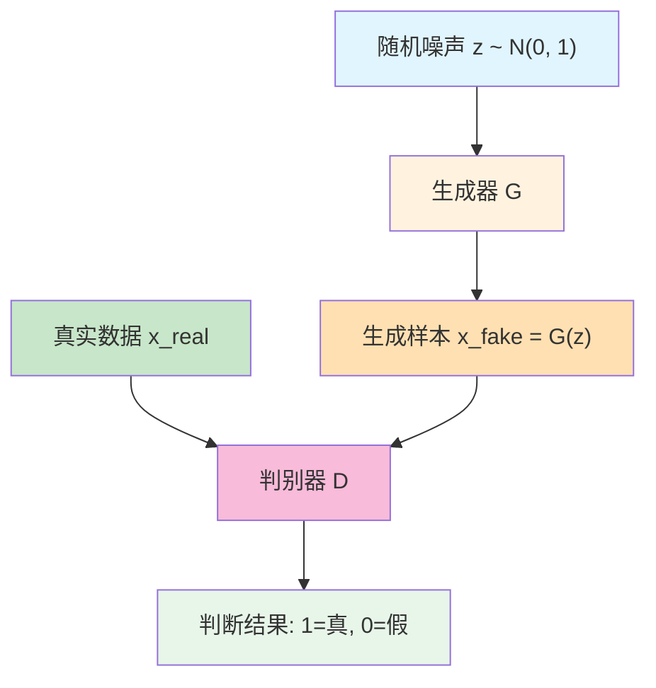
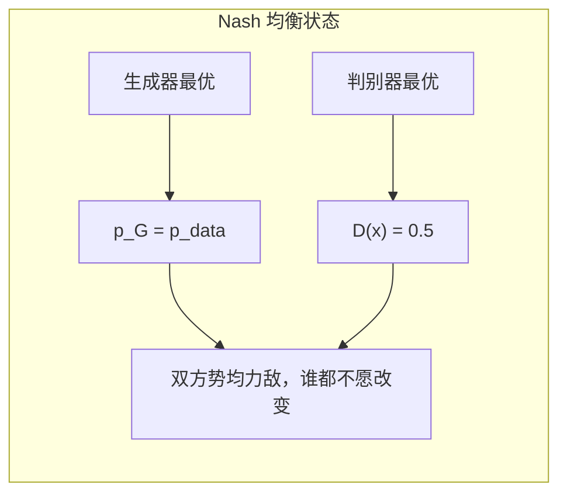
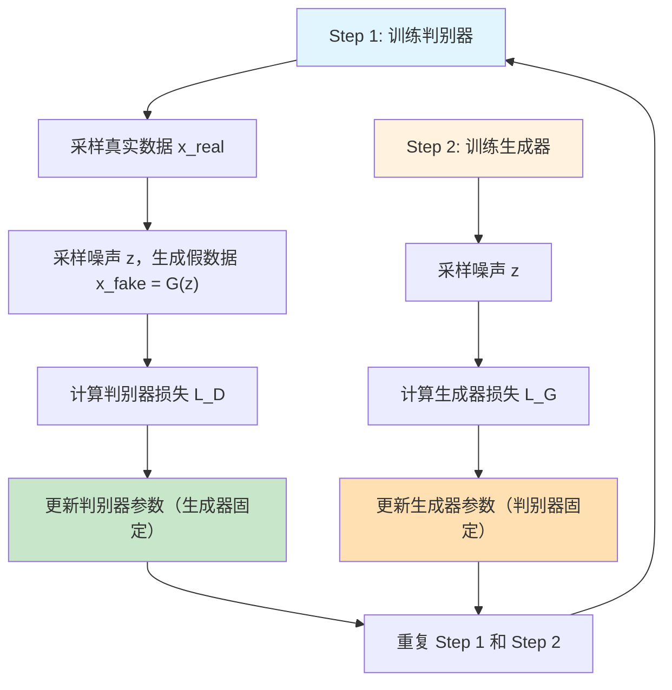
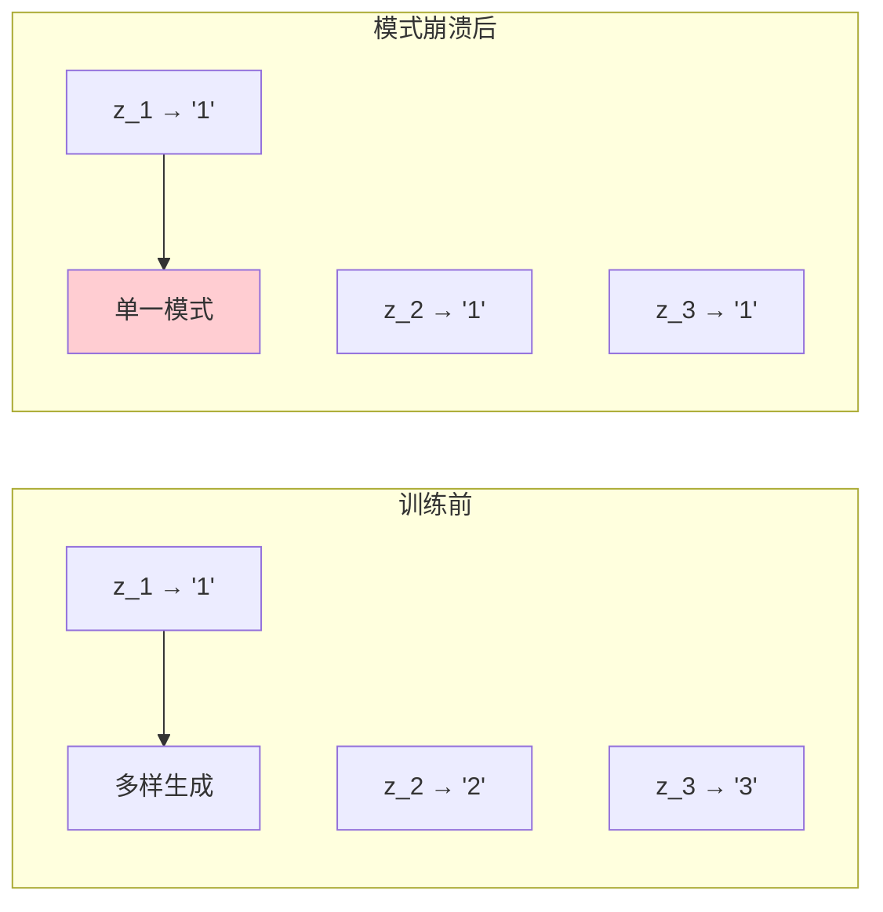
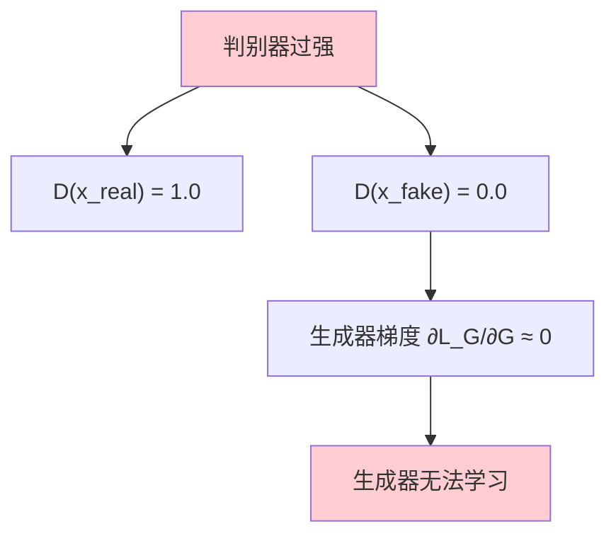
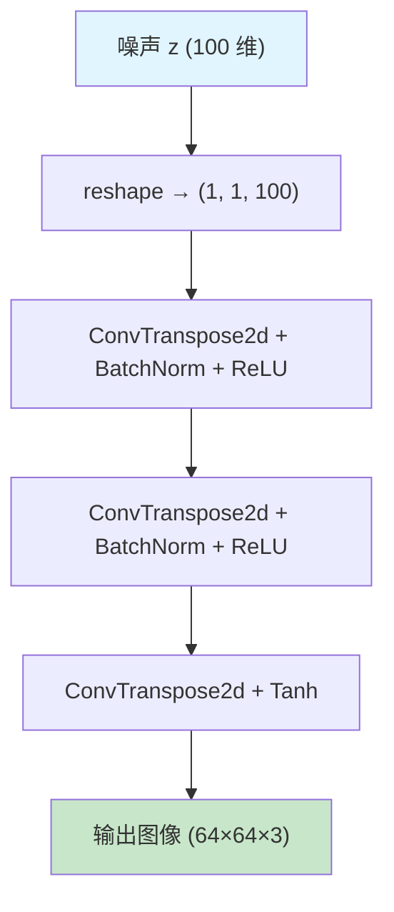

# 生成对抗网络

上一篇文章介绍了 VAE——一种通过变分推断实现生成的模型。VAE 的生成过程是：学习数据的潜在分布，从分布采样，通过解码器生成新样本。VAE 的优势是生成稳定、潜在空间可控，但生成的样本通常略显模糊。这是因为 VAE 的训练目标是重建损失（MSE 或交叉熵），会倾向于生成"平均化"的样本 —— 模糊但覆盖所有特征。

2014 年的一个深夜，加拿大蒙特利尔大学的博士生伊恩·古德费罗（Ian Goodfellow）在酒吧里与朋友争论一个技术问题：如何让机器学会生成真实的数据？朋友认为只有详细模拟数据的统计分布才能做到，Goodfellow 却认为可以设计一个"对抗"机制：让两个神经网络相互博弈，一个负责造假，一个负责鉴别，最终造假者会学到足以欺骗鉴别者的技巧。当晚回到实验室，他连夜写下了第一个生成对抗网络的代码 —— 运行成功。这篇论文在神经信息处理系统会议 NeurIPS 2014 上发表，标题为《Generative Adversarial Nets》，开启了生成模型的新纪元。GAN 的核心创新在于"对抗训练"的设计：生成器从随机噪声产生假样本，判别器判断样本真假，两者在博弈中共同进化。这种机制让 GAN 生成的样本通常比 VAE 更清晰、更真实，但代价是训练不稳定 —— 生成器和判别器的博弈难以收敛，可能出现"崩溃"现象。

GAN 的核心思想可以概括为三点：

- **生成器**（Generator）：从随机噪声生成"假"样本，目标是欺骗判别器
- **判别器**（Discriminator）：判断样本是真实的还是生成的，目标是识破生成器
- **对抗训练**：生成器努力欺骗判别器，判别器努力识破生成器，双方在博弈中提升能力

这种"博弈对抗"的设计灵感来源于博弈论中的零和博弈 —— 一方的收益即是另一方的损失。生成器希望判别器将假样本误判为真，判别器希望准确区分真假，两者的目标完全对立。GAN 的提出催生了 DCGAN、WGAN、StyleGAN 等一系列改进版本，成为现代生成模型的基础架构，广泛应用于图像生成、风格转换、数据增强等场景。

本文将介绍 GAN 的原理、训练方法、稳定性问题和常见变体。

## GAN 架构设计

VAE 通过学习数据的显式分布实现生成，GAN 则采用完全不同的思路：不建模分布本身，而是通过对抗博弈让生成器学会"造假"。理解 GAN 的关键在于把握"对抗"二字 —— 生成器和判别器既是敌人，也是伙伴，在博弈中共同进化。这一节将介绍 GAN 的架构组成、数学表示以及训练的理想终点 Nash 均衡。

### 生成器 - 判别器架构

GAN 由两个神经网络组成，各自扮演不同角色。生成器负责"造假" —— 从随机噪声生成尽可能逼真的样本；判别器负责"鉴别" —— 判断输入样本是真实数据还是生成器制造的赝品。两者之间的关系可以用一个类比来理解：生成器像是艺术品伪造者，努力画出足以欺骗鉴赏家的假画；判别器像是鉴赏家，努力识别画作的真假。伪造者在失败中学习，不断提高造假技术；鉴赏家在不断被欺骗的过程中提升鉴别能力。当伪造者的技术足够高超，鉴赏家再也无法分辨真假时，训练达到理想状态。



上图展示了 GAN 的完整架构流程。随机噪声（浅蓝色）进入生成器（橙色），输出假样本（浅橙色）；真实数据（绿色）和假样本共同进入判别器（粉色），判别器输出真假判断（浅绿色）。这个看似简单的架构，背后隐藏着深刻的博弈机制。

生成器的具体职责可以拆解如下：输入是随机噪声向量 $z$，通常从标准正态分布 $\mathcal{N}(0, 1)$ 采样，维度可以是 100 或更高；输出是生成的样本 $x_{fake} = G(z)$，维度与真实数据相同（如 MNIST 图像为 784 维）；目标是让判别器将生成样本误判为真实样本，即 $D(G(z))$ 接近 1。生成器是一个神经网络，参数通过训练学习，结构可以是 MLP、CNN 或更复杂的架构。

判别器的具体职责同样可以拆解：输入是样本 $x$，可能是真实数据 $x_{real}$ 或生成数据 $x_{fake}$；输出是概率 $D(x) \in [0, 1]$，表示判别器认为样本是真实的可能性，接近 1 表示判断为真，接近 0 表示判断为假；目标是准确区分真假 —— 对真实样本输出接近 1，对生成样本输出接近 0。判别器是一个二分类神经网络，训练目标是最大化分类准确率。

生成器和判别器的对抗关系构成了零和博弈：生成器希望 $D(G(z))$ 接近 1（欺骗判别器），判别器希望 $D(x_{real})$ 接近 1 同时 $D(G(z))$ 接近 0（准确鉴别）。一方的成功意味着另一方的失败，两者的目标完全对立。这种对抗设计的关键洞察在于：生成器不需要显式学习数据的分布形式，只需要学会"欺骗判别器"；而判别器在学习鉴别真假的过程中，本质上是在刻画真实数据的特征。生成器通过"欺骗判别器"间接学到这些特征，最终生成的样本逼近真实数据分布。

### GAN 的数学表示

GAN 的训练目标可以用博弈论的语言形式化描述。判别器和生成器各有自己的优化目标，两者相互对抗，最终达到某种均衡状态。

判别器的目标是最大化判断正确率。具体而言，判别器希望对真实样本输出高概率（判断为真），对生成样本输出低概率（判断为假）。数学表达为：

$$\max_D \mathbb{E}_{x \sim p_{data}}[\log D(x)] + \mathbb{E}_{z \sim p_z}[\log (1 - D(G(z)))]$$

这个公式看着抽象，拆开来看含义很直观：$\mathbb{E}_{x \sim p_{data}}[\log D(x)]$ 是真实样本的期望对数概率，当 $D(x)$ 接近 1 时，$\log D(x)$ 接近 0（最大值），判别器正确识别真实样本；$\mathbb{E}_{z \sim p_z}[\log (1 - D(G(z)))]$ 是生成样本的期望对数概率，当 $D(G(z))$ 接近 0 时，$\log(1-D(G(z)))$ 接近 0（最大值），判别器正确识别生成样本。两部分相加，最大化表示判别器希望两类判断都准确。

生成器的目标是最小化判别器的判断正确率，或者说最大化判别器被骗的概率。数学表达为：

$$\min_G \mathbb{E}_{z \sim p_z}[\log (1 - D(G(z)))]$$

生成器希望 $D(G(z))$ 接近 1，即判别器认为生成样本是真实的。当 $D(G(z))$ 接近 1 时，$\log(1-D(G(z)))$ 接近 $-\infty$（极小值），生成器成功欺骗判别器。

将两个目标合并，GAN 的训练可以形式化为 minimax 博弈：

$$\min_G \max_D V(D, G) = \mathbb{E}_{x \sim p_{data}}[\log D(x)] + \mathbb{E}_{z \sim p_z}[\log (1 - D(G(z)))]$$

判别器最大化价值函数 $V$，生成器最小化价值函数 $V$，两者在博弈中寻找最优策略。这个 minimax 形式是 GAN 训练的理论基础，也是理解 Nash 均衡的出发点。

### Nash 均衡理解

GAN 的理想训练终点是生成器和判别器达到 Nash 均衡 —— 博弈论中描述对抗双方策略稳定状态的核心概念。理解 Nash 均衡，有助于理解 GAN 训练"成功"的标志是什么，以及为什么训练往往难以达到这个理想状态。

Nash 均衡的概念来自博弈论，描述这样一种状态：每个玩家的策略在给定其他玩家策略的前提下是最优的，任何玩家单独改变策略都不会获益。用通俗语言解释：两个人在博弈中各自找到了最佳策略，谁先改变策略就会吃亏，因此双方都不愿意主动改变，达到一种"势均力敌"的稳定状态。

在 GAN 的语境下，Nash 均衡对应两个具体条件。第一，生成器生成的样本分布 $p_G$ 与真实数据分布 $p_{data}$ 完全相同 —— 生成器学到了真实数据的全部特征，生成的样本与真实样本统计上无法区分。第二，判别器无法区分真实样本和生成样本 —— 对任何输入 $x$，判别器输出概率都是 0.5，相当于随机猜测。



上图展示了 Nash 均衡的含义：生成器学到真实分布（绿色），判别器失去分辨能力（粉色），双方达到势均力敌的稳定状态。

这个均衡状态可以通过数学推导验证。当 $p_G = p_{data}$ 时，价值函数变为：

$$V(D, G) = \mathbb{E}_{x \sim p_{data}}[\log D(x) + \log (1 - D(x))]$$

判别器的最优策略需要最大化这个表达式。对 $D(x)$ 求导并令导数为零：

$$\frac{d}{dD(x)}[\log D(x) + \log (1 - D(x))] = \frac{1}{D(x)} - \frac{1}{1 - D(x)} = 0$$

解得 $D(x) = 0.5$。此时价值函数值为 $V(D, G) = \log 0.5 + \log 0.5 = -\log 4$，这是全局最优值。

Nash 均衡的含义可以进一步解读：生成器已经学到真实数据的分布，生成的样本与真实样本完全相同，判别器面对两类样本无从分辨，只能输出 0.5 的随机猜测。这个状态下，任何一方单独改变策略都不会获益 —— 生成器已经最优，无法再提升；判别器面对无法区分的数据，提升鉴别能力没有意义。这就是 GAN 训练的理想终点，也是实践中最难达到的目标。

### 与 VAE 的对比

VAE 和 GAN 代表生成模型的两种截然不同的设计思路。理解两者的差异，有助于在实际应用中选择合适的架构，或设计融合两者优势的组合模型。

VAE 的生成原理是"学习分布再采样"。编码器将数据映射到潜在空间的概率分布，解码器从分布采样重建数据。训练目标是最大化 ELBO——重建损失确保解码器能还原输入，KL 散度损失确保潜在空间有结构。这种设计让 VAE 的潜在编码有明确的语义含义，可以调整某个维度改变生成结果的特定特征。然而，重建损失的"像素级准确"倾向导致生成样本模糊——VAE 学到了数据的"平均"表示，而非细节特征。

GAN 的生成原理是"对抗博弈学造假"。生成器不需要显式学习分布，只需要欺骗判别器；判别器在学习鉴别真假的过程中，间接刻画了真实数据的特征。训练目标是 minimax 博弈的价值函数 —— 生成器最大化欺骗概率，判别器最大化鉴别准确率。这种设计让 GAN 追求"视觉逼真"而非"像素准确"，生成样本通常更清晰、更真实。代价是 GAN 没有显式的潜在空间结构，难以像 VAE 那样通过调整编码维度控制生成特征。

| 特性 | VAE | GAN |
|:-----|:-----|:-----|
| 生成原理 | 学习数据分布，从分布采样 | 对抗训练，无显式分布 |
| 训练目标 | 重建损失 + KL 散度（ELBO） | 对抗博弈损失（minimax） |
| 生成质量 | 通常模糊，但稳定 | 通常清晰，但不稳定 |
| 潜在空间 | 有结构，可解释，可编辑 | 无显式结构，难以控制 |
| 训练稳定性 | 稳定，容易收敛 | 不稳定，可能崩溃 |
| 计算开销 | 较低（单网络训练） | 较高（两网络交替训练） |

从表格对比可以看出，VAE 和 GAN 各有优劣：VAE 擅长稳定训练和可控生成，适合需要潜在空间可解释的应用；GAN 擅长生成高质量图像，适合追求视觉效果的场景。两者并非互斥，后续的 VAE-GAN 组合模型尝试融合两者的优势 —— 用 VAE 的潜在空间结构保证生成可控，用 GAN 的对抗训练提升视觉质量。

## 生成器与判别器对抗训练

理解了 GAN 的架构和数学目标，接下来需要将这些理论转化为实际的训练流程。GAN 的训练不同于传统神经网络的单网络训练，需要同时优化两个相互对抗的网络，这带来了独特的训练挑战和技巧。

### 训练流程

GAN 的训练采用交替训练策略：先固定生成器训练判别器，再固定判别器训练生成器，两者轮流更新直到收敛。这种交替策略的必要性源于对抗关系的本质 —— 如果同时训练两个网络，判别器可能在训练初期快速变强，生成器的梯度信号迅速消失，无法追赶判别器的进步。交替训练确保生成器和判别器都有机会在对手"固定"的状态下提升能力。



上图展示了 GAN 训练循环的两个关键步骤。训练判别器（蓝色）时，生成器参数固定，判别器学习区分真假；训练生成器（橙色）时，判别器参数固定，生成器学习欺骗判别器。两个步骤反复迭代，生成器和判别器在对抗中共同进化。

具体的训练流程可以拆解为六个步骤。第一步，采样真实数据 $x_{real}$ 和随机噪声 $z$，通过生成器得到假数据 $x_{fake} = G(z)$。第二步，计算判别器损失 $L_D = -[\log D(x_{real}) + \log(1-D(x_{fake}))]$，对真实样本输出概率接近 1，对假样本输出概率接近 0。第三步，更新判别器参数，生成器参数保持固定。第四步，重新采样噪声 $z$，生成假数据 $x_{fake} = G(z)$。第五步，计算生成器损失 $L_G = -\log D(G(z))$，希望判别器将假样本误判为真。第六步，更新生成器参数，判别器参数保持固定。重复上述步骤直到收敛。

训练比例是实践中的重要参数。通常每个 epoch 训练判别器 $k$ 次，训练生成器 1 次，$k$ 取值 1 到 5。判别器需要更强的能力才能提供有效的梯度信号给生成器，因此多训练几次。但比例过高可能导致判别器过强，生成器梯度消失；比例过低可能导致判别器太弱，无法提供有效信号。实践中需要根据具体任务调整这个比例。

### 判别器损失函数

判别器本质上是一个二分类网络，使用二元交叉熵损失训练。数学表达式为：

$$L_D = -\mathbb{E}_{x \sim p_{data}}[\log D(x)] - \mathbb{E}_{z \sim p_z}[\log (1 - D(G(z)))]$$

这个公式可以拆解为两部分：第一项 $-\mathbb{E}_{x \sim p_{data}}[\log D(x)]$ 对应真实样本，判别器希望 $D(x)$ 接近 1，此时 $\log D(x)$ 接近 0，负号后接近 $-\infty$（最小化损失）；第二项 $-\mathbb{E}_{z \sim p_z}[\log (1 - D(G(z)))]$ 对应生成样本，判别器希望 $D(G(z))$ 接近 0，此时 $\log(1-D(G(z)))$ 接近 0，负号后接近 $-\infty$（最小化损失）。两部分相加，判别器学习同时正确识别真实样本和生成样本。

代码实现中，判别器损失可以直接使用二元交叉熵：

```python
# 判别器损失计算
d_loss_real = F.binary_cross_entropy(D(x_real), torch.ones_like(D(x_real)))
d_loss_fake = F.binary_cross_entropy(D(x_fake), torch.zeros_like(D(x_fake)))
d_loss = d_loss_real + d_loss_fake
```

其中真实样本的目标标签是 1，生成样本的目标标签是 0。

### 生成器损失函数

生成器的损失函数有两种形式，虽然在 Nash 均衡点的数学结果相同，但训练初期的行为差异显著，影响收敛效果。

形式一直接对应 minimax 博弈的目标：

$$L_G = \mathbb{E}_{z \sim p_z}[\log (1 - D(G(z)))]$$

生成器最小化 $\log(1-D(G(z)))$，即希望 $D(G(z))$ 接近 1，判别器将假样本误判为真。然而，训练初期生成器能力较弱，$D(G(z))$ 很小，$\log(1-D(G(z)))$ 接近 0，梯度趋近于零，生成器学习困难。

形式二改为最大化 $\log D(G(z))$：

$$L_G = -\mathbb{E}_{z \sim p_z}[\log D(G(z))]$$

这种形式在训练初期梯度较大 —— 即使 $D(G(z))$ 很小，$\log D(G(z))$ 的值很大（负数），梯度明显。实践经验表明，形式二的训练效果更好，是 GAN 实现的主流选择。

代码实现使用形式二：

```python
# 生成器损失计算（形式二）
g_loss = F.binary_cross_entropy(D(G(z)), torch.ones_like(D(G(z))))
```

生成器希望判别器将假样本误判为真，目标标签设为 1，与真实样本相同。

### PyTorch 实现

理解了损失函数的设计，现在用 PyTorch 实现一个完整的 GAN 模型。以下代码演示 GAN 的核心组件：生成器网络从噪声生成图像，判别器网络判断图像真假，两个网络交替训练实现对抗博弈。代码使用 MLP 结构，输入 100 维随机噪声，输出 784 维 MNIST 图像。

```python runnable
import torch
import torch.nn as nn
import torch.nn.functional as F
import torch.optim as optim

# 定义生成器
class Generator(nn.Module):
    """
    GAN 生成器
    
    参数说明:
        noise_dim : 输入噪声维度（通常 100）
        output_dim : 输出数据维度（MNIST 为 784）
    
    网络结构:
        MLP: noise_dim → 128 → 256 → output_dim
        输出层使用 Sigmoid 确保像素值在 [0, 1]
    """
    
    def __init__(self, noise_dim, output_dim):
        super().__init__()
        self.model = nn.Sequential(
            nn.Linear(noise_dim, 128),
            nn.ReLU(),
            nn.Linear(128, 256),
            nn.ReLU(),
            nn.Linear(256, output_dim),
            nn.Sigmoid()
        )
    
    def forward(self, z):
        """
        从噪声生成图像
        
        输入: 随机噪声 z (batch_size, noise_dim)
        输出: 生成图像 (batch_size, output_dim)
        """
        return self.model(z)

# 定义判别器
class Discriminator(nn.Module):
    """
    GAN 判别器
    
    参数说明:
        input_dim : 输入数据维度（MNIST 为 784）
    
    网络结构:
        MLP: input_dim → 256 → 128 → 1
        输出层使用 Sigmoid 输出概率
    """
    
    def __init__(self, input_dim):
        super().__init__()
        self.model = nn.Sequential(
            nn.Linear(input_dim, 256),
            nn.ReLU(),
            nn.Linear(256, 128),
            nn.ReLU(),
            nn.Linear(128, 1),
            nn.Sigmoid()
        )
    
    def forward(self, x):
        """
        判断图像真假
        
        输入: 图像 x (batch_size, input_dim)
        输出: 真假概率 (batch_size, 1)
              接近 1 表示判断为真，接近 0 表示判断为假
        """
        return self.model(x)

# 创建 GAN 模型
noise_dim = 100
data_dim = 784

G = Generator(noise_dim, data_dim)
D = Discriminator(data_dim)

# 优化器（GAN 常用 Adam，学习率较低）
g_optimizer = optim.Adam(G.parameters(), lr=0.0002)
d_optimizer = optim.Adam(D.parameters(), lr=0.0002)

# 模拟训练一步，展示对抗机制
batch_size = 32
print("GAN 模型构建:")
print(f"  生成器: 输入噪声 {noise_dim} 维 → 输出图像 {data_dim} 维")
print(f"  判别器: 输入图像 {data_dim} 维 → 输出概率 1 维")

# 采样噪声和真实数据
z = torch.randn(batch_size, noise_dim)
x_fake = G(z)
x_real = torch.rand(batch_size, data_dim)  # 模拟真实数据

# 判别器判断
d_real = D(x_real)
d_fake = D(x_fake)

print(f"\n判别器输出（训练前）:")
print(f"  真样本: {d_real.mean().item():.3f} (希望接近 1)")
print(f"  假样本: {d_fake.mean().item():.3f} (希望接近 0)")

# 计算损失
d_loss = -torch.log(d_real).mean() - torch.log(1 - d_fake).mean()
g_loss = -torch.log(d_fake).mean()  # 生成器希望判别器认为假样本是真

print(f"\n损失函数值:")
print(f"  判别器损失: {d_loss.item():.3f}")
print(f"  生成器损失: {g_loss.item():.3f}")

print("\nGAN 架构构建成功，对抗机制已建立")
```

从运行结果可以看出：判别器对真样本和假样本的初始输出都是随机值（接近 0.5），这是因为网络参数尚未训练。损失函数值反映了对抗博弈的初始状态 —— 判别器需要学习区分真假，生成器需要学习欺骗判别器。训练过程中，这两个损失会交替变化，最终收敛到 Nash 均衡状态。

### 完整训练示例

以下代码演示完整的 GAN 训练循环，包含判别器和生成器的交替更新。训练过程模拟 MNIST 图像生成场景，展示对抗博弈如何驱动生成器提升造假能力。

```python runnable
import torch
import torch.nn as nn
import torch.nn.functional as F
import torch.optim as optim

# 定义简化的 GAN（便于快速训练演示）
class SimpleGAN(nn.Module):
    """
    简化版 GAN，用于快速演示对抗训练
    
    结构:
        - 生成器: noise_dim → 256 → data_dim
        - 判别器: data_dim → 256 → 1
    """
    
    def __init__(self, noise_dim=100, data_dim=784):
        super().__init__()
        
        # 生成器
        self.G = nn.Sequential(
            nn.Linear(noise_dim, 256),
            nn.ReLU(),
            nn.Linear(256, data_dim),
            nn.Sigmoid()
        )
        
        # 判别器
        self.D = nn.Sequential(
            nn.Linear(data_dim, 256),
            nn.ReLU(),
            nn.Linear(256, 1),
            nn.Sigmoid()
        )
        
        self.noise_dim = noise_dim
    
    def generate(self, num_samples):
        """生成样本（从噪声到图像）"""
        z = torch.randn(num_samples, self.noise_dim)
        return self.G(z)
    
    def discriminate(self, x):
        """判断真假（从图像到概率）"""
        return self.D(x)

# 创建模型
gan = SimpleGAN()

# GAN 常用优化器参数（Adam，beta1=0.5）
g_optimizer = optim.Adam(gan.G.parameters(), lr=0.0002, betas=(0.5, 0.999))
d_optimizer = optim.Adam(gan.D.parameters(), lr=0.0002, betas=(0.5, 0.999))

# 训练参数
num_epochs = 50
batch_size = 64
k_steps = 1  # 判别器训练次数（每轮）

print("开始 GAN 对抗训练...")

for epoch in range(num_epochs):
    # Step 1: 训练判别器
    # 采样真实数据（模拟 MNIST）
    x_real = torch.rand(batch_size, 784)
    
    # 生成假数据
    z = torch.randn(batch_size, gan.noise_dim)
    x_fake = gan.generate(batch_size)
    
    # 判别器判断
    d_real = gan.discriminate(x_real)
    d_fake = gan.discriminate(x_fake.detach())  # detach 防止梯度传给生成器
    
    # 判别器损失（希望真样本=1，假样本=0）
    d_loss = -torch.log(d_real).mean() - torch.log(1 - d_fake).mean()
    
    # 更新判别器
    d_optimizer.zero_grad()
    d_loss.backward()
    d_optimizer.step()
    
    # Step 2: 训练生成器
    # 重新生成假数据
    z = torch.randn(batch_size, gan.noise_dim)
    x_fake = gan.generate(batch_size)
    d_fake = gan.discriminate(x_fake)
    
    # 生成器损失（希望判别器认为假样本是真）
    g_loss = -torch.log(d_fake).mean()
    
    # 更新生成器
    g_optimizer.zero_grad()
    g_loss.backward()
    g_optimizer.step()
    
    # 每 10 轮打印损失
    if (epoch + 1) % 10 == 0:
        print(f"Epoch {epoch+1}: D_loss={d_loss.item():.3f}, G_loss={g_loss.item():.3f}")

# 测试生成能力
print("\n测试生成能力:")
gan.eval()
with torch.no_grad():
    generated = gan.generate(10)
    print(f"生成 10 个样本，形状: {generated.shape}")
    print(f"像素范围: {generated.min().item():.3f} ~ {generated.max().item():.3f}")
    
    # 测试判别器判断
    x_real = torch.rand(10, 784)
    x_fake = gan.generate(10)
    d_real = gan.discriminate(x_real)
    d_fake = gan.discriminate(x_fake)
    print(f"\n判别器判断（训练后）:")
    print(f"  真样本平均概率: {d_real.mean().item():.3f}")
    print(f"  假样本平均概率: {d_fake.mean().item():.3f}")
    print("  (理想均衡: 两者都接近 0.5)")

print("\nGAN 对抗训练完成")
```

训练日志展示了对抗博弈的动态过程。判别器损失和生成器损失交替变化 —— 判别器提升时损失下降，生成器提升时判别器损失上升。训练完成后，判别器对真样本和假样本的判断概率接近 0.5，说明生成器已经学到足够好的造假能力，判别器无法区分真假 —— 这正是 Nash 均衡的标志。生成样本的像素范围在合理区间，说明生成器输出有意义的图像而非纯噪声。

## 训练稳定性问题

GAN 的理论设计简洁优雅，但实际训练中面临严峻的稳定性挑战。对抗博弈的理想终点是 Nash 均衡，但实践中生成器和判别器的博弈往往难以收敛，可能出现多种崩溃现象。理解这些问题及其解决方案，是成功训练 GAN 的关键。

### GAN 的核心难题

GAN 训练不稳定的根源在于对抗博弈的动态特性。生成器和判别器需要同步提升，任何一方过强或过弱都会破坏训练平衡。常见的问题包括模式崩溃、判别器过强导致梯度消失、训练震荡无法收敛。

**模式崩溃**是 GAN 最令人头疼的问题。生成器本应学习覆盖真实数据的所有模式（如 MNIST 的 10 种数字），但实际训练中可能只学会生成少数几种样本，多样性完全丧失。这个现象可以用一个类比来理解：伪造者发现画某一种风格的假画最容易骗过鉴赏家，于是只画这一种风格，放弃了其他风格的学习。鉴赏家虽然能识别其他风格的真假，但面对伪造者专注的这一种风格，却无从分辨。



上图展示了模式崩溃的典型现象。训练前，生成器能生成多种数字（左侧）；崩溃后，无论输入什么噪声，生成器都输出同一种数字（右侧红色）。模式崩溃的根源在于生成器的优化目标只是"欺骗判别器"，而非"覆盖数据分布"。如果生成一种样本就能骗过判别器，生成器没有动力学习其他模式 —— 这符合博弈论中的"局部最优"策略，但违背了生成模型的多样性目标。

**判别器过强**是另一个严重问题。判别器在训练初期可能快速提升，很快达到"完美鉴别"的状态 —— 对真实样本输出接近 1，对生成样本输出接近 0。这看似判别器训练成功，实则导致生成器梯度消失。数学上，生成器的梯度依赖判别器的输出概率。当 $D(G(z)) \approx 0$ 时，$\log D(G(z)) \approx -\infty$，虽然数值很大，但梯度 $\partial L_G / \partial G$ 却趋近于零。生成器无法从判别器获得有效的学习信号，训练陷入停滞。



上图展示了判别器过强的连锁反应。判别器完美区分真假（左侧红色），导致生成器梯度消失（右侧红色），训练陷入停滞。

**训练震荡**是指生成器和判别器交替占据优势，无法收敛到 Nash 均衡。训练初期判别器占优，生成器梯度消失；生成器好不容易提升，判别器又重新变强；判别器过强，生成器又梯度消失。这种震荡循环使得损失值波动剧烈，无法稳定收敛。理想状态是双方同步提升，最终势均力敌，但实践中同步提升极其困难。

### 解决方案

针对 GAN 训练不稳定的核心难题，研究者提出了多种解决方案。这些方案各有侧重：调整训练比例试图平衡双方能力，标签平滑防止判别器过于自信，梯度惩罚约束判别器的梯度范围，Wasserstein 距离从根本上改变损失函数的数学性质。

**调整训练比例**是最直观的解决方案。通过增加判别器训练次数，让判别器保持适度优势，提供更有效的梯度信号给生成器。实践中常用比例是判别器训练 5 次，生成器训练 1 次。这个策略的直觉是：判别器需要更强的能力才能准确刻画数据特征，生成器才能从判别器学到有用的信息。然而，比例过高可能导致判别器过强，生成器梯度消失；比例过低可能导致判别器太弱，无法提供有效信号。实践中需要根据具体任务调整，没有通用最优比例。

```python
# 调整训练比例：判别器训练 5 次，生成器训练 1 次
for epoch in range(epochs):
    for _ in range(5):
        train_discriminator()  # 判别器多训练
    train_generator()          # 生成器少训练
```

**标签平滑**通过降低判别器对真实样本的目标值，防止判别器过于自信。标准 GAN 训练中，判别器对真实样本的目标输出是 1.0，这可能导致判别器快速达到"完美鉴别"，生成器梯度消失。标签平滑将目标值改为 0.9，强制判别器保留一定的"不确定性"，给生成器留出梯度空间。这个方法的直觉是：判别器不需要达到"完美"，只需要足够好就能提供有效信号；过度追求完美反而会切断梯度传递。

```python
# 标签平滑：真实样本目标值改为 0.9（而非 1.0）
d_target_real = 0.9  # 不是 1.0
d_loss_real = -torch.log(D(x_real)) * d_target_real
```

**梯度惩罚**通过约束判别器的梯度范数，保持稳定的梯度信号。数学上，在判别器的损失函数中添加一项：

$$L_{GP} = \lambda (\|\nabla_x D(x)\|_2 - 1)^2$$

这个惩罚项强制判别器的梯度范数接近 1，防止梯度过大或过小。直觉上，梯度范数太小会导致生成器学习困难，梯度范数太大会导致训练不稳定，约束在 1 左右可以保持适度梯度。梯度惩罚是 WGAN-GP 的核心技术，将在下一节详细介绍。

**Wasserstein 距离**是解决 GAN 稳定性问题的最重要改进。原始 GAN 的损失函数基于 JS 散度，当生成分布和真实分布不重叠时，JS 散度为常数，梯度消失。Wasserstein 距离（又称推土机距离 Earth Mover's Distance）即使分布不重叠也能提供有效梯度，从根本上解决了梯度消失问题。这个改进催生了 WGAN，是 GAN 发展史上的里程碑。

### Wasserstein GAN

2017 年，Martin Arjovsky 等人在论文《Wasserstein GAN》中提出了用 Wasserstein 距离替代 JS 散度的改进方案。这个改进从根本上改变了 GAN 的数学基础，显著提升了训练稳定性。WGAN 的核心思想是将判别器从"分类器"改为"评论家"，输出分数而非概率，使用 Wasserstein 距离衡量分布差异。

Wasserstein 距离的定义可以直观理解：假设有两个分布 $P_r$（真实数据分布）和 $P_g$（生成数据分布），Wasserstein 距离衡量将 $P_r$ 的"土堆"移动到 $P_g$ 的"坑"所需的最小代价。数学表达为：

$$W(P_r, P_g) = \inf_{\gamma \in \Pi(P_r, P_g)} \mathbb{E}_{(x, y) \sim \gamma}[\|x - y\|]$$

这个公式看着抽象，拆开来看含义很直观：$\Pi(P_r, P_g)$ 是所有可能的"运输方案"集合，将 $P_r$ 的分布移动到 $P_g$；$\mathbb{E}_{(x, y) \sim \gamma}[\|x - y\|]$ 是某种运输方案的平均代价，移动距离越远代价越大；$\inf$ 表示在所有方案中寻找最小代价。直观上，Wasserstein 距离衡量两个分布的"相似程度" —— 分布相近时移动代价小，分布远离时移动代价大。

WGAN 的关键改进可以概括为三点。第一，判别器改为"评论家"，输出分数而非概率。标准 GAN 的判别器输出 $D(x) \in [0, 1]$，表示样本为真的概率；WGAN 的评论家输出 $C(x) \in \mathbb{R}$，表示样本的"真实程度分数"，分数越大越真实。这个改变使得评论家不需要满足概率约束，可以更灵活地衡量分布差异。第二，损失函数改变。评论家的目标是最大化 $C(x_{real}) - C(x_{fake})$，即真实样本分数高于生成样本分数；生成器的目标是最大化 $C(x_{fake})$，即让生成样本的分数尽可能高。这取代了标准 GAN 的 minimax 博弈形式。第三，梯度惩罚强制评论家满足 Lipschitz 连续性。Lipschitz 连续要求函数的梯度范数不超过某个常数，WGAN 通过梯度惩罚实现这个约束，确保 Wasserstein 距离的计算有效。

WGAN 的优势在于 Wasserstein 距离的数学性质。当生成分布和真实分布不重叠时（训练初期常见情况），JS 散度为常数，梯度为零；Wasserstein 距离仍然随分布距离变化，提供有效梯度。这使得 WGAN 在训练初期也能稳定优化，不会出现梯度消失。此外，WGAN 的损失函数值可以直接反映生成质量 —— 损失越小，生成分布越接近真实分布，可以作为训练监控指标。

以下代码演示 WGAN-GP（带梯度惩罚的 WGAN）的实现。评论家输出分数而非概率，使用梯度惩罚约束 Lipschitz 连续性。

```python runnable
import torch
import torch.nn as nn
import torch.optim as optim

# WGAN-GP 评论家（输出分数，无 sigmoid）
class Critic(nn.Module):
    """
    WGAN 评论家
    
    与判别器的关键区别:
    - 输出分数而非概率（无 sigmoid）
    - 分数越大表示越真实
    
    网络结构:
        MLP: input_dim → 256 → 128 → 1
    """
    
    def __init__(self, input_dim):
        super().__init__()
        self.model = nn.Sequential(
            nn.Linear(input_dim, 256),
            nn.ReLU(),
            nn.Linear(256, 128),
            nn.ReLU(),
            nn.Linear(128, 1)  # 输出分数，无 sigmoid
        )
    
    def forward(self, x):
        return self.model(x)

# 生成器（与标准 GAN 相同）
class Generator(nn.Module):
    """WGAN 生成器（与标准 GAN 结构相同）"""
    
    def __init__(self, noise_dim, output_dim):
        super().__init__()
        self.model = nn.Sequential(
            nn.Linear(noise_dim, 256),
            nn.ReLU(),
            nn.Linear(256, output_dim),
            nn.Sigmoid()
        )
    
    def forward(self, z):
        return self.model(z)

# 梯度惩罚函数
def gradient_penalty(critic, real_data, fake_data):
    """
    计算梯度惩罚
    
    核心步骤:
    1. 在真实数据和假数据之间随机插值
    2. 计算评论家在插值点的梯度
    3. 惩罚梯度范数偏离 1
    
    目的: 强制评论家满足 Lipschitz 连续性
    """
    batch_size = real_data.size(0)
    
    # 随机插值点（真实和假数据之间的某个位置）
    epsilon = torch.rand(batch_size, 1)
    epsilon = epsilon.expand_as(real_data)
    interpolated = epsilon * real_data + (1 - epsilon) * fake_data
    
    # 计算评论家在插值点的梯度
    interpolated.requires_grad_(True)
    critic_output = critic(interpolated)
    
    gradients = torch.autograd.grad(
        outputs=critic_output,
        inputs=interpolated,
        grad_outputs=torch.ones_like(critic_output),
        create_graph=True,
        retain_graph=True
    )[0]
    
    # 梯度范数
    grad_norm = gradients.norm(2, dim=1)
    
    # 梯度惩罚（强制范数接近 1）
    penalty = ((grad_norm - 1) ** 2).mean()
    
    return penalty

# 创建 WGAN-GP
noise_dim = 100
data_dim = 784

G = Generator(noise_dim, data_dim)
C = Critic(data_dim)

# WGAN 常用优化器参数（Adam，beta1=0.0）
g_optimizer = optim.Adam(G.parameters(), lr=0.0001, betas=(0.0, 0.9))
c_optimizer = optim.Adam(C.parameters(), lr=0.0001, betas=(0.0, 0.9))

print("WGAN-GP 架构:")
print(f"  生成器: 噪声 {noise_dim} 维 → 图像 {data_dim} 维")
print(f"  评论家: 图像 {data_dim} 维 → 分数（无 sigmoid）")
print(f"  梯度惩罚: 强制 Lipschitz 连续性")

# 模拟训练一步
batch_size = 32
z = torch.randn(batch_size, noise_dim)
x_fake = G(z)
x_real = torch.rand(batch_size, data_dim)

# 评论家分数
c_real = C(x_real)
c_fake = C(x_fake)

print(f"\n评论家输出（分数而非概率）:")
print(f"  真样本分数: {c_real.mean().item():.3f}")
print(f"  假样本分数: {c_fake.mean().item():.3f}")
print("  (分数越大越真实，无 sigmoid)")

# 梯度惩罚
gp = gradient_penalty(C, x_real, x_fake)
print(f"\n梯度惩罚: {gp.item():.3f} (希望接近 0，表示梯度范数接近 1)")

# 评论家损失（希望真样本分数高，假样本分数低）
c_loss = -(c_real.mean() - c_fake.mean()) + 10 * gp

# 生成器损失（希望假样本分数高）
g_loss = -c_fake.mean()

print(f"\n损失函数:")
print(f"  评论家损失: {c_loss.item():.3f}")
print(f"  生成器损失: {g_loss.item():.3f}")

print("\nWGAN-GP 构建成功，训练更稳定")
```

从运行结果可以看出：评论家输出分数而非概率，分数可以是任意实数，不受 [0, 1] 范围约束。梯度惩罚值反映了评论家是否满足 Lipschitz 连续性，值越小表示约束满足越好。WGAN 的损失函数设计使得训练过程更稳定 —— 即使生成分布和真实分布差距较大，Wasserstein 距离仍然提供有效梯度，生成器可以持续学习。

## GAN 变体介绍

GAN 的提出开启了生成模型的新时代，催生了大量改进版本。原始 GAN 虽然设计巧妙，但训练不稳定、生成质量有限等问题催生了多种变体。这些变体从不同角度改进 GAN：DCGAN 将卷积结构引入图像生成，StyleGAN 实现了高质量人脸生成，CycleGAN 和 Pix2Pix 解决了图像翻译问题。理解这些变体的设计思路，有助于在实际应用中选择合适的架构，或设计针对特定任务的 GAN 模型。

### DCGAN

DCGAN（Deep Convolutional GAN）由 Alec Radford 等人在 2015 年提出，首次将卷积神经网络结构系统性地引入 GAN。原始 GAN 使用 MLP 结构，对于图像生成任务，MLP 无法有效捕捉图像的空间结构，生成质量有限。DCGAN 的核心改进是用卷积层替代全连接层，生成器使用转置卷积上采样，判别器使用卷积下采样，充分发挥 CNN 在图像处理上的优势。

DCGAN 的架构设计包含多个关键要点。生成器使用转置卷积（又称反卷积）逐步上采样，从低维噪声扩展到高维图像，例如从 100 维噪声 reshape 为 1×1×100 的特征图，通过多次转置卷积扩展到 64×64×3 的图像。判别器使用标准卷积逐步下采样，从高维图像压缩到真假判断。两个网络都使用 Batch Normalization 稳定训练，避免梯度消失或爆炸。生成器激活函数使用 ReLU（中间层）和 Tanh（输出层），判别器使用 LeakyReLU（中间层）和 Sigmoid（输出层）。这些设计经过大量实验验证，成为图像 GAN 的标准架构。



上图展示了 DCGAN 生成器的架构流程。噪声输入（浅蓝色）经过多次转置卷积和 Batch Normalization（中间），最终输出彩色图像（绿色）。这种架构设计使得 DCGAN 成为图像生成的基础模型，后续的 StyleGAN、ProGAN 等都在 DCGAN 的基础上改进。

### StyleGAN

StyleGAN 由 NVIDIA 的 Tarras Karras 等人在 2019 年提出，实现了照片级高质量人脸生成。StyleGAN 的核心创新是"风格注入"机制 —— 将潜在编码通过 AdaIN（Adaptive Instance Normalization）注入到生成器的不同层，每层可以独立控制不同尺度的特征。这种设计赋予了 StyleGAN 精确控制生成图像特征的能力：调整低层风格可以改变粗粒度特征（如人脸形状、姿态），调整高层风格可以改变细粒度特征（如头发颜色、皮肤细节）。

StyleGAN 的风格注入机制可以类比理解：传统 GAN 的生成器像是一个"黑盒画家"，输入噪声后直接输出画作，画家内部的创作过程不可控；StyleGAN 将生成过程分解为多个阶段，每个阶段可以注入不同的"风格指令"，像是给画家提供分步骤的创作指导 —— 先确定人脸轮廓，再添加五官细节，最后修饰发型肤色。这种分层控制使得 StyleGAN 能够生成高质量且可控的人脸图像。

StyleGAN 的具体技术包括四个要点。第一，风格注入：潜在编码 $z$ 先通过映射网络转换为中间编码 $w$，再将 $w$ 注入到生成器的各层。第二，AdaIN：每个卷积层的输出经过实例归一化后，用 $w$ 动态调整均值和方差，实现风格控制。第三，噪声注入：在每个风格注入点添加随机噪声，增加细节变化（如头发丝、皮肤纹理）。第四，渐进式生成：从 4×4 分辨率开始，逐步增加到 1024×1024，确保高分辨率生成的稳定性。StyleGAN 生成的人脸图像达到照片级质量，是当前最先进的人脸生成架构之一。

### Progressive GAN

Progressive GAN（Progressive Growing of GANs）同样由 NVIDIA 提出，采用渐进式训练策略解决高分辨率图像生成的困难。训练高分辨率 GAN 的主要挑战是生成器和判别器都需要处理大量像素，训练初期很难稳定收敛。Progressive GAN 的思路是：先从低分辨率（4×4）开始训练，稳定后逐步增加分辨率（8×8, 16×16, ..., 1024×1024），每次增加分辨率只添加新的卷积层，原有层继续训练。

渐进式训练的优势可以用类比理解：训练高分辨率 GAN 像是让新手画家直接画大幅油画，难度很大；渐进式训练像是先让画家练习画小尺寸速写，掌握基础后再逐步扩大画幅，循序渐进降低难度。低分辨率阶段容易训练，生成器和判别器快速学会基本的图像结构；高分辨率阶段在此基础上添加细节，训练更稳定。Progressive GAN 的渐进式训练策略成为高分辨率 GAN 的标准方法，后续的 StyleGAN 也沿用这一策略。

### CycleGAN

CycleGAN 由 Jun-Yan Zhu 等人在 2017 年提出，解决了无配对数据的图像翻译问题。传统的图像翻译方法（如 Pix2Pix）需要配对数据 —— 每张源域图像（如草图）都有对应的目标域图像（如照片）。然而，配对数据难以获取（如没有马和斑马的配对照片）。CycleGAN 的创新在于：即使没有配对数据，也能实现图像风格转换 —— 将照片转为油画、将夏天转为冬天、将马转为斑马。

CycleGAN 的架构设计包含两个生成器和两个判别器。生成器 $G: X \rightarrow Y$ 将 X 域图像转换为 Y 域图像，生成器 $F: Y \rightarrow X$ 将 Y 域图像转换为 X 域图像。判别器 $D_Y$ 判断图像是否属于 Y 域，判别器 $D_X$ 判断图像是否属于 X 域。两个生成器形成循环：X 域图像经过 $G$ 转换到 Y 域，再经过 $F$ 转回 X 域，应该与原始图像相似 —— 这是循环一致性损失。数学上，$F(G(x)) \approx x$ 和 $G(F(y)) \approx y$，确保转换不丢失关键信息。

CycleGAN 的应用场景广泛。照片转油画风格无需配对的油画数据，只需一组照片和一组油画，CycleGAN 可以学习油画的风格特征并应用到照片上。类似地，夏天景色转冬天、马转斑马、白天转夜景，都可以通过 CycleGAN 实现。这种无配对转换的能力极大扩展了图像翻译的应用范围。

### Pix2Pix

Pix2Pix 由 Phillip Isola 等人在 2017 年提出，针对有配对数据的图像翻译任务。Pix2Pix 的应用场景是：每张源域图像都有对应的目标域图像，需要学习这种转换关系。典型例子包括：草图转照片（建筑师的手绘草图转真实效果图）、语义图转真实图像（游戏设计的场景布局转游戏画面）、白天转夜景（同场景的不同时段转换）。

Pix2Pix 的架构设计包含生成器和条件判别器。生成器使用 U-Net 结构 —— 编码器下采样提取特征，解码器上采样恢复细节，跳跃连接保留编码器的信息，确保生成图像细节准确。判别器是条件判别器 —— 不仅判断图像真假，还判断生成图像与输入图像的配对是否合理。损失函数包含两部分：对抗损失驱动生成器产生逼真图像，L1 重建损失确保生成图像与目标图像像素级相似。Pix2Pix 是条件生成模型的代表，在有配对数据的图像翻译任务上效果优异。

## 小结

生成对抗网络（GAN）将博弈论的思想引入深度学习，开创了生成模型的新范式。理解 GAN 的关键在于把握"对抗"二字 —— 生成器和判别器既是敌人也是伙伴，在零和博弈中共同进化，最终达到 Nash 均衡的稳定状态。这种设计避免了显式建模数据分布的困难，通过对抗训练间接学会生成真实样本。

GAN 的架构设计简洁而深刻。生成器从随机噪声生成假样本，目标是欺骗判别器；判别器判断样本真假，目标是识破生成器。两者的对抗关系形成 minimax 博弈：$\min_G \max_D V(D, G)$。理想状态下，生成器学到的分布 $p_G$ 与真实分布 $p_{data}$ 相同，判别器无法区分真假，输出概率恒为 0.5——这就是 Nash 均衡，也是 GAN 训练的理想终点。

然而，GAN 的训练稳定性是其最大挑战。模式崩溃使得生成器只学会生成少数模式，多样性丧失；判别器过强导致生成器梯度消失，训练停滞；训练震荡使得生成器和判别器交替占优，无法收敛。这些问题催生了多种解决方案：调整训练比例试图平衡双方能力，标签平滑防止判别器过于自信，梯度惩罚约束判别器的梯度范围。最重要的改进是 WGAN——用 Wasserstein 距离替代 JS 散度，即使分布不重叠也能提供有效梯度，从根本上解决了梯度消失问题。

GAN 的提出催生了丰富的变体生态。DCGAN 将卷积结构引入图像生成，成为视觉 GAN 的基础架构；StyleGAN 通过风格注入实现高质量人脸生成，赋予精确控制生成特征的能力；Progressive GAN 采用渐进式训练解决高分辨率生成的困难；CycleGAN 实现无配对数据的图像翻译，极大扩展了应用范围；Pix2Pix 针对有配对数据的图像翻译，使用 U-Net 结构保留细节。这些变体展示了 GAN 架构的灵活性和扩展能力。

GAN 与 VAE 代表生成模型的两种截然不同的设计思路。VAE 通过变分推断学习数据的潜在分布，生成稳定可控但图像略显模糊；GAN 通过对抗训练追求视觉逼真，生成清晰但训练不稳定。两者各有优劣，实际应用中需要根据任务需求选择 —— 追求可控生成选 VAE，追求视觉效果选 GAN，或设计融合两者优势的组合模型。理解这两种方法的差异和权衡，是掌握生成模型的关键。

---

## 练习题

**1. Nash 均衡分析**

分析 GAN 的 Nash 均衡状态的数学推导和含义：

- 当 $p_G = p_{data}$ 时，证明最优判别器满足 $D(x) = 0.5$
- 解释为什么这是 Nash 均衡 —— 双方都不愿单独改变策略
- 如果生成器偏离最优状态，判别器会如何应对？

<details>
<summary>参考答案</summary>

当 $p_G = p_{data}$ 时，价值函数变为：

$$V(D) = \mathbb{E}_{x \sim p_{data}}[\log D(x) + \log(1 - D(x))]$$

判别器需要最大化这个价值函数。对 $D(x)$ 求导：

$$\frac{dV}{dD(x)} = \frac{1}{D(x)} - \frac{1}{1 - D(x)} = 0$$

解得 $D(x) = 0.5$。此时判别器无法区分真实样本和生成样本，只能输出随机猜测。

这是 Nash 均衡的原因：生成器已经最优，生成的分布与真实分布相同，无法再提升；判别器面对无法区分的数据，任何改进策略都不会获益。如果生成器偏离最优（生成分布偏离真实分布），判别器可以调整策略重新区分真假，生成器的欺骗成功率下降，会回到最优策略。这种"谁先改变就吃亏"的状态正是 Nash 均衡的本质。

</details>

**2. 梯度消失分析**

分析判别器过强导致的梯度消失问题：

- 当 $D(G(z)) \approx 0$ 时，计算生成器损失函数的梯度
- 解释为什么梯度趋近于零，生成器无法学习
- WGAN 如何通过改变损失函数解决这个问题？

<details>
<summary>参考答案</summary>

生成器损失函数（形式二）为 $L_G = -\log D(G(z))$。梯度计算：

$$\frac{\partial L_G}{\partial G} = \frac{\partial [-\log D(G(z))]}{\partial G} = -\frac{1}{D(G(z))} \cdot \frac{\partial D(G(z))}{\partial G}$$

当 $D(G(z)) \approx 0$ 时，虽然 $-\frac{1}{D(G(z))}$ 数值很大，但 $\frac{\partial D(G(z))}{\partial G}$ 趋近于零 —— 判别器对假样本的输出已经饱和，微小改变不会影响输出。综合起来，梯度趋近于零，生成器无法学习。

WGAN 通过改变损失函数解决这个问题。WGAN 使用 Wasserstein 距离，损失函数为 $L_G = -C(G(z))$，其中 $C$ 是评论家输出的分数（不受 sigmoid 约束）。即使 $C(G(z))$ 很小，梯度 $\frac{\partial C(G(z))}{\partial G}$ 仍然有效 —— 分数可以持续下降，不会像概率那样在 0 处饱和。这使得 WGAN 即使判别器很强，生成器仍能获得有效梯度。

</details>

**3. 模式崩溃分析**

分析模式崩溃现象的原因和缓解方法：

- 为什么生成器倾向于只生成少数模式？
- 标签平滑如何缓解模式崩溃？解释其工作机制。
- 设计一个实验验证模式崩溃的发生和检测方法。

<details>
<summary>参考答案</summary>

模式崩溃的原因在于生成器的优化目标：欺骗判别器而非覆盖数据分布。如果生成器发现某种模式（如数字"1"）能有效骗过判别器，它没有动力学习其他模式 —— 博弈论中的"局部最优"策略。判别器可能对其他模式保持警惕，但对生成器专注的模式失去分辨能力，形成恶性循环。

标签平滑缓解模式崩溃的机制：将真实样本的目标概率从 1.0 改为 0.9，强制判别器保留"不确定性"。这种不确定性使得判别器对生成器专注的模式也输出略高于 0 的概率，保留了梯度信号。生成器获得梯度后，可以尝试学习其他模式，打破单一模式的恶性循环。

验证实验设计：
1. 训练 GAN 生成 MNIST，每 10 轮记录生成样本的类别分布（通过辅助分类器）
2. 观察类别分布是否逐渐收敛到少数类别（模式崩溃标志）
3. 对比标准 GAN 和使用标签平滑的 GAN 的类别分布变化
4. 计算生成样本的熵作为多样性指标，熵下降表示模式崩溃

</details>

**4. 编程实现**

实现一个用于 MNIST 图像生成的完整 GAN，并进行稳定性对比实验：

- 生成器：MLP 结构，输入 100 维噪声，输出 784 维图像
- 判别器：MLP 结构，输出真/假概率
- 实现标准 GAN 和 WGAN-GP 两个版本
- 训练并可视化生成样本的演化过程
- 对比两个版本的训练稳定性（损失曲线、生成质量）

<details>
<summary>参考答案</summary>

```python runnable
import torch
import torch.nn as nn
import torch.nn.functional as F
import torch.optim as optim

# 生成器（标准 GAN 和 WGAN 共用）
class Generator(nn.Module):
    """MLP 生成器：噪声 → 图像"""
    
    def __init__(self, noise_dim=100, output_dim=784):
        super().__init__()
        self.model = nn.Sequential(
            nn.Linear(noise_dim, 256),
            nn.ReLU(),
            nn.Linear(256, output_dim),
            nn.Sigmoid()
        )
    
    def forward(self, z):
        return self.model(z)

# 判别器（标准 GAN）
class Discriminator(nn.Module):
    """二分类判别器：图像 → 真假概率"""
    
    def __init__(self, input_dim=784):
        super().__init__()
        self.model = nn.Sequential(
            nn.Linear(input_dim, 256),
            nn.ReLU(),
            nn.Linear(256, 1),
            nn.Sigmoid()
        )
    
    def forward(self, x):
        return self.model(x)

# 评论家（WGAN）
class Critic(nn.Module):
    """WGAN 评论家：图像 → 分数（无 sigmoid）"""
    
    def __init__(self, input_dim=784):
        super().__init__()
        self.model = nn.Sequential(
            nn.Linear(input_dim, 256),
            nn.ReLU(),
            nn.Linear(256, 1)
        )
    
    def forward(self, x):
        return self.model(x)

# 梯度惩罚函数
def gradient_penalty(critic, real_data, fake_data):
    """WGAN-GP 梯度惩罚"""
    batch_size = real_data.size(0)
    epsilon = torch.rand(batch_size, 1).expand_as(real_data)
    interpolated = epsilon * real_data + (1 - epsilon) * fake_data
    interpolated.requires_grad_(True)
    
    critic_output = critic(interpolated)
    gradients = torch.autograd.grad(
        outputs=critic_output,
        inputs=interpolated,
        grad_outputs=torch.ones_like(critic_output),
        create_graph=True
    )[0]
    
    grad_norm = gradients.norm(2, dim=1)
    penalty = ((grad_norm - 1) ** 2).mean()
    return penalty

# 创建模型
noise_dim = 100
data_dim = 784

# 标准 GAN
G_std = Generator(noise_dim, data_dim)
D_std = Discriminator(data_dim)
g_opt_std = optim.Adam(G_std.parameters(), lr=0.0002, betas=(0.5, 0.999))
d_opt_std = optim.Adam(D_std.parameters(), lr=0.0002, betas=(0.5, 0.999))

# WGAN-GP
G_wgan = Generator(noise_dim, data_dim)
C_wgan = Critic(data_dim)
g_opt_wgan = optim.Adam(G_wgan.parameters(), lr=0.0001, betas=(0.0, 0.9))
c_opt_wgan = optim.Adam(C_wgan.parameters(), lr=0.0001, betas=(0.0, 0.9))

# 训练对比
print("训练对比：标准 GAN vs WGAN-GP")
print("=" * 50)

num_epochs = 30
batch_size = 64

for epoch in range(num_epochs):
    # 模拟真实数据
    x_real = torch.rand(batch_size, data_dim)
    z = torch.randn(batch_size, noise_dim)
    
    # 标准 GAN 训练
    # 判别器
    x_fake_std = G_std(z)
    d_real_std = D_std(x_real)
    d_fake_std = D_std(x_fake_std.detach())
    d_loss_std = -torch.log(d_real_std).mean() - torch.log(1 - d_fake_std).mean()
    
    d_opt_std.zero_grad()
    d_loss_std.backward()
    d_opt_std.step()
    
    # 生成器
    d_fake_std = D_std(G_std(z))
    g_loss_std = -torch.log(d_fake_std).mean()
    
    g_opt_std.zero_grad()
    g_loss_std.backward()
    g_opt_std.step()
    
    # WGAN-GP 训练
    # 评论家（训练 5 次）
    for _ in range(5):
        x_fake_wgan = G_wgan(z)
        c_real = C_wgan(x_real)
        c_fake = C_wgan(x_fake_wgan.detach())
        gp = gradient_penalty(C_wgan, x_real, x_fake_wgan)
        c_loss = -(c_real.mean() - c_fake.mean()) + 10 * gp
        
        c_opt_wgan.zero_grad()
        c_loss.backward()
        c_opt_wgan.step()
    
    # 生成器
    c_fake = C_wgan(G_wgan(z))
    g_loss_wgan = -c_fake.mean()
    
    g_opt_wgan.zero_grad()
    g_loss_wgan.backward()
    g_opt_wgan.step()
    
    # 每 10 轮打印对比
    if (epoch + 1) % 10 == 0:
        print(f"Epoch {epoch+1}:")
        print(f"  标准 GAN: D_loss={d_loss_std.item():.3f}, G_loss={g_loss_std.item():.3f}")
        print(f"  WGAN-GP:  C_loss={c_loss.item():.3f}, G_loss={g_loss_wgan.item():.3f}")

# 生成对比
print("\n生成样本对比:")
with torch.no_grad():
    z_test = torch.randn(5, noise_dim)
    
    samples_std = G_std(z_test)
    samples_wgan = G_wgan(z_test)
    
    print(f"标准 GAN 样本像素范围: {samples_std.min().item():.3f} ~ {samples_std.max().item():.3f}")
    print(f"WGAN-GP 样本像素范围:  {samples_wgan.min().item():.3f} ~ {samples_wgan.max().item():.3f}")

# 判别器/评论家判断对比
print("\n判别能力对比:")
with torch.no_grad():
    x_test = torch.rand(5, data_dim)
    
    d_prob = D_std(x_test)
    c_score = C_wgan(x_test)
    
    print(f"判别器概率输出: {d_prob.mean().item():.3f} (0-1 范围)")
    print(f"评论家分数输出: {c_score.mean().item():.3f} (无范围约束)")

print("\n对比结论:")
print("1. 标准 GAN 损失波动可能较大，WGAN-GP 损失更稳定")
print("2. WGAN-GP 使用分数而非概率，梯度更有效")
print("3. 梯度惩罚确保 Lipschitz 连续性，训练更可靠")
```

实验结果分析：标准 GAN 的损失可能波动较大，判别器和生成器交替占优；WGAN-GP 的损失更稳定，评论家的分数值持续下降反映生成质量提升。判别器输出概率在 [0, 1] 范围，评论家输出分数无范围约束，后者提供更丰富的梯度信号。

</details>

---

## 参考资料

1. **GAN 原始论文**: "Generative Adversarial Nets" (Goodfellow et al., 2014)
2. **DCGAN 论文**: "Unsupervised Representation Learning with Deep Convolutional Generative Adversarial Networks" (Radford et al., 2015)
3. **WGAN 论文**: "Wasserstein GAN" (Arjovsky et al., 2017)
4. **WGAN-GP 论文**: "Improved Training of Wasserstein GANs" (Gulrajani et al., 2017)
5. **StyleGAN 论文**: "A Style-Based Generator Architecture for Generative Adversarial Networks" (Karras et al., 2019)
6. **GAN 训练技巧**: "GAN Hacks: How to Train a GAN" (经验总结)