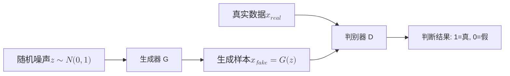
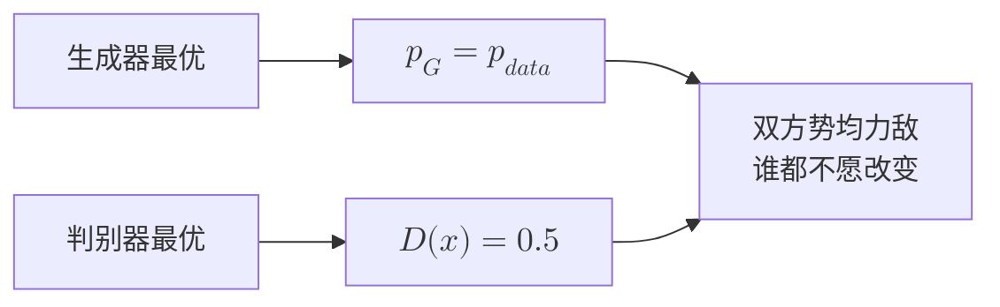
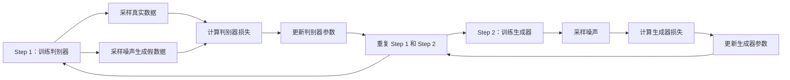
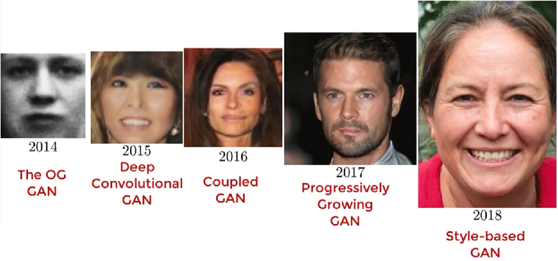

# 生成式对抗网络

2014 年春夏之交的一个夜晚，加拿大蒙特利尔著名的 The Three Brewers 酒吧里，几位来自蒙特利尔大学的高材生正在为他们的师兄举行博士毕业的庆功宴。这群年轻人多是图灵奖得主约书亚·本吉奥（Yoshua Bengio）的学生，与其他年轻小伙一样，在酒吧喝酒，谈论话题总是离不开漂亮姑娘的。而这几位师承本希奥的高材生们与其他年轻小伙又并不一样，当晚他们谈论的话题是有没有可能利用神经网络，让机器给他们制造出一些美女的照片来助兴？

年轻人们提出可以用神经网络学习图片的特征，尝试对图片中的几何特征进行统计分析，建立一个人类照片的概率统计模型，然后让机器根据模型来产生不同的符合概率的几何形状，从中筛选出人类照片。这种想法完全符合当时做机器学习应用正统的研究思路，受到多数讨论参与者的赞同，唯有古德费洛（Ian Goodfellow）认为这种思路根本行不通，他直言当下机器学习的能力上限也就生成出来的照片能分辨出是不是人类，根本谈不上什么质量优秀的美女。就在此时，一个念头犹如闪电般划过了他的脑海，古德费洛迫不及待就从酒吧赶回了宿舍，借着酒劲打开电脑编写程序。他只花了一个多小时、只用了一次测试就成功实现了一个能够工作的图片生成程序。当他将 MNIST 数据集投喂给这个程序时，成功输出全新的手写数字图片，接着他将 [Toronto](https://www.cs.toronto.edu/~urtasun/courses/CSC411/hw3-411.pdf) 人脸数据集投喂给这个程序，程序真的凭空生成了此前世界上从未存在过的人脸的照片。尽管不论从软件、硬件、还是训练集质量来看一切都十分简陋，但这个简陋的实验品下却掩藏着后来被古德费洛命名为**生成式对抗网络**（Generative Adversarial Network，GAN）、被杨立昆评价为"过去二十年来深度学习中最酷的想法"、被吴恩达评价为"一项重大而根本性的进步"的全新生成式模型。甚至可以说，在人工智能的世界中，就从此刻起诞生了一个崭新的研究方向"人工智能生成内容"（Artificial Intelligence Generated Content，AIGC）

## GAN 架构设计

那个划过古德费洛脑海的念头大致是这样的：判别式模型与生成式模型也许并不是完全独立、泾渭分明的两种模型，如果人类无法凭自己的能力直接训练出性能足够出色的生成式模型，那一个足够精确的判别式模型是否能够代替人类去训练出一个同样优秀的生成式模型？

为了便于理解，这里借助一个虚构故事来解释古德费洛的设计思路。经常印假钞的读者都应该知道，干这买卖最大的竞争对手并非是同行，而是警察。如果假钞能够精致到连警察也无法分辨的程度，那就算完全掌握了核心竞争力。另一方面，作为警察，职责自然是持续改提升进自己的装备和业务水平，以便能够准确地分辨出真钞与假钞。在这警察与罪犯造假鉴真的对抗游戏里面，就潜藏了生成式模型突破的奥秘。

首先，请你扮演警察的角色，允许使用任何手段来识别一张图像（譬如像下图这样）是否真钞。目前效果最好的方法自然是基于深度学习训练的判别式模型，判别效果能好到什么程度呢？参考 ImageNet 大规模视觉识别挑战赛的结论，把 ILSVRC 数据集交由人类来判别的平均错误率是5.1%，而 2015 年的冠军 [ResNet](../convolutional-neural-network/resnet.md) 的判别错误率已经达到了 3.57%，超越了人类平均水平。换而言之，此时的判别模型水平已经可以让计算机扮演一个能力和人类平均水平大致相当的警察了。


*图：一张假钞照片*

接下来，请你扮演罪犯的角色。一开始你印假钞的手段生疏拙劣，生成的图像几乎与完全随机的噪声无异，警察只需一眼就能看穿真假。不过，只要警察将判别的结果告知你，你就有了强化学习的依据，知道改进造假手段的方向。得到来自警察的指导反馈，你痛定思痛并经过长期练习，手法逐渐成熟，生成的结果逐渐从随机变得有序，也逐渐有了一些能假以乱真逃过警察法眼的高质量图像出现。

随着这个过程不断继续，警察会想出越来越复杂的技术来鉴别假币，罪犯也会想出越来越复杂的技术来伪造货币，这就是生成式对抗网络中**对抗**（Adversarial）的基本理念，这个场景中警察的角色就是**判别器**（Discriminator），罪犯的角色就是**生成器**（Generator），它们其实都是在同一个过程中训练出来的，整个生成式对抗网络的基本结构如下图所示。


*图：生成式对抗网络的基本结构*

上图展示了 GAN 的完整架构流程。随机噪声进入生成器，输出假样本；真实数据和假样本共同进入判别器，判别器输出真假判断。

- 生成器输入是随机噪声向量 $z$，通常从标准正态分布 $\mathcal{N}(0, 1)$ 采样，维度可以是 100 或更高。输出是生成的样本 $x_{fake} = G(z)$，维度与真实数据相同（如 MNIST 图像为 784 维）。目标是让判别器将生成样本误判为真实样本，即 $D(G(z))$ 接近 1。生成器是一个神经网络，参数通过训练学习，结构可以是 [MLP](../../deep-learning/neural-network-structure/mlp.md)、[CNN](../../deep-learning/convolutional-neural-network/cnn-basics.md) 或其他更复杂的架构。

- 判别器输入是样本 $x$，可能是真实数据 $x_{real}$ 或生成数据 $x_{fake}$。输出是概率 $D(x) \in [0, 1]$，表示判别器认为样本是真实的可能性，接近 1 表示判断为真，接近 0 表示判断为假。判别器的目标是准确区分真假，对真实样本输出接近 1，对生成样本输出接近 0。判别器是一个二分类神经网络，训练目标是最大化分类准确率。

生成器和判别器的对抗关系构成了零和博弈，生成器希望 $D(G(z))$ 接近 1（欺骗判别器），判别器希望 $D(x_{real})$ 接近 1 同时 $D(G(z))$ 接近 0（准确鉴别），一方的成功意味着另一方的失败，两者的目标完全对立。这种对抗设计的关键在于生成器不需要显式学习数据的分布形式，只需要学会如何欺骗判别器，而判别器在学习鉴别真假的过程中，本质上是在刻画真实数据的特征。生成器通过欺骗判别器间接学到这些特征，最终生成的样本逼近真实数据分布。

### 数学表示

GAN 的训练目标可以用博弈论的语言形式化描述。判别器和生成器各有自己的优化目标，两者相互对抗，最终达到某种均衡状态。判别器的目标是最大化判断正确率，具体来说，判别器期望对真实样本输出高概率（判断为真），对生成样本输出低概率（判断为假），其数学表达为：

$$\max_D \mathbb{E}_{x \sim p_{data}}[\log D(x)] + \mathbb{E}_{z \sim p_z}[\log (1 - D(G(z)))]$$

$\mathbb{E}_{x \sim p_{data}}[\log D(x)]$ 是真实样本的期望对数概率，当 $D(x)$ 接近 1 时，$\log D(x)$ 接近 0（最大值），判别器正确识别真实样本；$\mathbb{E}_{z \sim p_z}[\log (1 - D(G(z)))]$ 是生成样本的期望对数概率（使用对数概率而非原概率是为了避免多次概率连乘后导致数据下溢，也是为了获得更大的梯度加速训练），当 $D(G(z))$ 接近 0 时，$\log(1-D(G(z)))$ 接近 0（最大值），判别器正确识别生成样本。两部分相加，最大化表示判别器希望两类判断都准确。另一方面，生成器的目标是最小化判别器的判断正确率，或者说最大化判别器被骗的概率。数学表达为：

$$\min_G \mathbb{E}_{z \sim p_z}[\log (1 - D(G(z)))]$$

生成器希望 $D(G(z))$ 接近 1，即判别器认为生成样本是真实的。当 $D(G(z))$ 接近 1 时，$\log(1-D(G(z)))$ 接近 $-\infty$（极小值），生成器成功欺骗判别器。将两个目标合并，GAN 的训练可以形式化为 [Minimax 博弈](https://en.wikipedia.org/wiki/Minimax)：

$$\min_G \max_D V(D, G) = \mathbb{E}_{x \sim p_{data}}[\log D(x)] + \mathbb{E}_{z \sim p_z}[\log (1 - D(G(z)))]$$

判别器通过优化 $D$ 来最大化价值函数 $V$，生成器通过优化 $G$ 来最小化价值函数 $V$，两者在博弈中寻找最优策略。这个 Minimax 形式是 GAN 训练的理论基础，也是理解纳什均衡的出发点。

### 纳什均衡

GAN 的理想训练终点是生成器和判别器达到[纳什均衡](https://en.wikipedia.org/wiki/Nash_equilibrium)（Nash Equilibrium），这博弈论中描述对抗双方策略稳定状态的概念，每个玩家的策略在给定其他玩家策略的前提下是最优的，任何玩家单独改变策略都不会获益。用通俗语言描述就是两个人在博弈中各自找到了最佳策略，谁先改变策略谁就会吃亏，因此双方都不愿意主动改变，达到一种势均力敌的稳定状态。

GAN 中的纳什均衡对应两个具体条件。第一，生成器生成的样本分布 $p_G$ 与真实数据分布 $p_{data}$ 完全相同，生成器学到了真实数据的全部特征，生成的样本与真实样本统计上无法区分。第二，判别器无法区分真实样本和生成样本，对任何输入 $x$，判别器输出概率都是 0.5，相当于随机猜测，如下图所示。


*图：GAN 的纳什均衡状态*

这个均衡状态可以通过数学推导来验证。当 $p_G = p_{data}$ 时有 $G(z) = x$，价值函数 $V$ 变为 $V(D, G) = \mathbb{E}_{x \sim p_{data}}[\log D(x) + \log (1 - D(x))]$，判别器的最优策略需要最大化这个表达式。对 $D(x)$ 求导并令导数为零，得到 $\frac{d}{dD(x)}[\log D(x) + \log (1 - D(x))] = \frac{1}{D(x)} - \frac{1}{1 - D(x)} = 0$，解得 $D(x) = 0.5$。此时价值函数值为 $V(D, G) = \log 0.5 + \log 0.5$，这是全局最优值。

在 GAN 语境下，纳什均衡的含义生成器已经学到真实数据的分布，生成的样本与真实样本完全相同，判别器面对两类样本无从分辨，只能输出 0.5 的随机猜测。这个状态下，任何一方单独改变策略都不会获益，生成器已经最优，无法再提升，判别器面对无法区分的数据，提升鉴别能力也没有意义。这就是 GAN 训练的理想终点，也是实践中最难达到的目标。

## 生成器 - 判别器对抗训练

理解了 GAN 的架构和背后的数学原理，接下来需要将这些理论转化为实际的训练流程。GAN 的训练不同于传统神经网络的单网络训练，需要同时优化两个相互对抗的网络。GAN 采用交替训练策略，先固定生成器训练判别器，再固定判别器训练生成器，两者轮流更新直到收敛。这种交替策略源于对抗关系的本质，如果同时训练两个网络，判别器可能在训练初期快速变强，生成器的梯度信号迅速消失，再也无法追赶上判别器的进步。交替训练确保生成器和判别器都有机会在对手适当的状态下提升能力。


*图：GAN 训练循环*

上图展示了 GAN 训练循环的两个关键步骤。训练判别器时，生成器参数固定，判别器学习区分真假；训练生成器时，判别器参数固定，生成器学习欺骗判别器。两个步骤反复迭代，生成器和判别器在对抗中共同进化。具体的训练流程可以拆解为以下六个步骤，其中第 2、4 步是关键：

1. 采样真实数据 $x_{real}$ 和随机噪声 $z$，通过生成器得到假数据 $x_{fake} = G(z)$。
2. 计算判别器损失 $L_D = -\mathbb{E}_{x \sim p_{data}}[\log D(x_{real})] - \mathbb{E}_{z \sim p_z}[\log (1 - D(x_{fake}))]$，目标是让判别器对真实样本输出概率接近 1，对假样本输出概率接近 0。    判别器本质上是一个二分类网络：
    - 损失函数第一项 $-\mathbb{E}_{x \sim p_{data}}[\log D(x_{real})]$ 对应真实样本，判别器希望 $D(x)$ 接近 1，此时 $\log D(x_{real})$ 接近 0，负号后接近 $-\infty$（最小化损失）
    - 损失函数第二项 $-\mathbb{E}_{z \sim p_z}[\log (1 - D(x_{fake}))]$ 对应生成样本，判别器希望 $D(G(z))$ 接近 0，此时 $\log(1-D(x_{fake}))$ 接近 0，负号后接近 $-\infty$（最小化损失）。两部分相加，判别器学习同时正确识别真实样本和生成样本。
    
3. 更新判别器参数，生成器参数保持固定。
4. 重新采样噪声 $z$，生成假数据 $x_{fake} = G(z)$。
5. 计算生成器损失，目标是让判别器将假样本误判为真。生成器的损失函数有两种形式，虽然在纳什均衡点的数学结果相同，但训练初期的行为差异显著，直接影响收敛效果。

    - 形式一直接对应 Minimax 博弈的目标 $L_G = \mathbb{E}_{z \sim p_z}[\log (1 - D(G(z)))]$，生成器最小化 $\log(1-D(G(z)))$，即希望 $D(G(z))$ 接近 1，判别器将假样本误判为真。然而，训练初期生成器能力较弱，$D(G(z))$ 很小，$\log(1-D(G(z)))$ 接近 0，梯度趋近于零，生成器学习困难。
    - 形式二改为最大化 $\log D(G(z))$，即 $L_G = -\mathbb{E}_{z \sim p_z}[\log D(G(z))]$。这种形式在训练初期梯度较大，即使 $D(G(z))$ 很小，$\log D(G(z))$ 的值很大（负数），梯度明显。实践经验表明，形式二的训练效果更好，是 GAN 实现的主流选择。  

6. 更新生成器参数，判别器参数保持固定。重复上述步骤直到收敛。

GAN 训练的理论设计简洁优雅，实际训练中却面临严峻的稳定性挑战。对抗博弈的理想终点是纳什均衡，但生成器和判别器的博弈往往难以收敛，经常出现训练崩溃。训练不稳定的根源在于对抗博弈的动态特性，生成器和判别器需要同步提升，任何一方过强或过弱都会破坏训练平衡。常见的问题包括以下几种：

- **模式崩溃**是 GAN 最令人头疼的问题。生成器本应学习覆盖真实数据的所有模式（如 MNIST 的 10 种数字），但实际训练中可能只学会生成少数几种样本，多样性完全丧失。这好比造假者发现做某一种面额的假币最容易骗过警察，于是干脆就只做这一种面额，放弃了其他面额，这对造假币来说好像也不是不行，但如果是基于 MNIST 数据集训练的生成器，它本该能生成多种数字，崩溃后无论输入什么噪声，生成器都输出同一种数字，这种生成器就没什么用处了。模式崩溃实质是因为生成器的优化目标只是欺骗判别器而非覆盖数据分布。如果生成一种样本就能骗过判别器，生成器没有动力学习其他模式，这符合博弈论中的局部最优策略，却违背了生成模型的多样性目标。

- **判别器过强**是另一个严重问题。判别器在训练初期可能快速提升，很快达到完美鉴别的状态，对真实样本输出接近 1，对生成样本输出接近 0。这不是判别器训练成功，而是会直接生成器梯度消失，生成器的梯度依赖判别器的输出概率。当 $D(G(z)) \approx 0$ 时，$\log D(G(z)) \approx -\infty$，虽然数值很大，但梯度 $\partial L_G / \partial G$ 却趋近于零，生成器无法从判别器获得有效的学习信号，训练陷入停滞。

- **训练震荡**是指生成器和判别器交替占据优势，无法收敛到纳什均衡，使得损失值波动剧烈，训练一直无法完成。理想状态是双方同步提升，最终势均力敌，但实践中同步提升并不容易。

针对 GAN 训练不稳定的难题，出现过多种解决方案，这些方案各有侧重，主要有：

- **调整训练比例**是最直观的解决方案。通过增加判别器训练次数，让判别器保持适度优势，提供更有效的梯度信号给生成器。实践中常用比例是判别器训练 5 次，生成器训练 1 次。这个策略的依据是判别器需要稍微强一些的能力才能准确刻画数据特征，生成器才能从判别器学到有用的信息。然而，比例过高可能导致判别器过强，生成器梯度消失，比例过低可能导致判别器太弱，无法提供有效信号。实践中需要根据具体任务调整，没有通用最优比例。

- **标签平滑**通过降低判别器对真实样本的目标值，防止判别器"过度自信"。标准 GAN 训练中，判别器对真实样本的目标输出是 1.0，这可能导致判别器快速达到完美鉴别，生成器梯度消失。标签平滑将目标值改为 0.9，强制判别器保留一定的不确定性，给生成器留出梯度空间。这个方法的直觉是判别器不需要达到完美，只需要足够好就能提供有效信号，过度追求完美反而会切断梯度传递。

- **梯度惩罚**通过约束判别器的梯度范数，保持稳定的梯度信号，在判别器的损失函数中添加一项 $L_{GP} = \lambda (\|\nabla_x D(x)\|_2 - 1)^2$，这个惩罚项强制判别器的梯度范数接近 1，防止梯度过大或过小。梯度范数太小会导致生成器学习困难，梯度范数太大会导致训练不稳定，约束在 1 左右可以保持适度梯度。

## GAN 与 VAE 对比

VAE 和 GAN 代表生成模型的两种截然不同的设计思路。理解两者的差异，有助于在实际应用中选择合适的架构，或设计融合两者优势的组合模型。

- VAE 的生成原理是"学习分布再采样"。编码器将数据映射到潜在空间的概率分布，解码器从分布采样重建数据。训练目标是最大化 ELBO，包括重建损失确保解码器能还原输入，KL 散度损失确保潜在空间有结构。这种设计让 VAE 的潜在编码有明确的语义含义，可以调整某个维度改变生成结果的特定特征。但缺点是重建损失具有像素级准确的倾向，会导致生成样本模糊，VAE 总是学到数据的平均表示，而非细节特征。

- GAN 的生成原理是"对抗博弈，学习造假"。生成器不需要显式学习分布，只需要欺骗判别器。判别器在学习鉴别真假的过程中，间接刻画了真实数据的特征。训练目标是 Minimax 博弈的价值函数，生成器最大化欺骗概率，判别器最大化鉴别准确率。这种设计让 GAN 追求"视觉逼真"而非"像素准确"，生成样本通常更清晰、更真实。代价是 GAN 没有显式的潜在空间结构，很难像 VAE 那样通过调整编码维度控制生成特征（后面的变体一定程度上克服了这个缺点）。

| 特性 | VAE | GAN |
|:-----|:-----|:-----|
| 生成原理 | 学习数据分布，从分布采样 | 对抗训练，无显式分布 |
| 训练目标 | 重建损失 + KL 散度（ELBO） | 对抗博弈损失（Minimax） |
| 生成质量 | 通常模糊，但稳定 | 通常清晰，但不稳定 |
| 潜在空间 | 有结构，可解释，可编辑 | 无显式结构，难以控制 |
| 训练稳定性 | 稳定，容易收敛 | 不稳定，可能崩溃 |
| 计算开销 | 较低（单网络训练） | 较高（两网络交替训练） |

从表格对比可以看出，VAE 和 GAN 各有优劣。VAE 擅长稳定训练和可控生成，适合需要潜在空间可解释的应用；GAN 擅长生成高质量图像，适合追求视觉效果的场景。两者并非互斥，后续的 VAE-GAN 组合模型尝试融合两者的优势，用 VAE 的潜在空间结构保证生成可控，用 GAN 的对抗训练提升视觉质量。

## GAN 变体

GAN 的提出开启了生成模型的新时代，原始 GAN 虽然设计巧妙，但有着训练不稳定、生成质量有限等诸多问题，很快就出现了大量改进变体版本，如下图所示。本节按照时间顺序，介绍具有里程碑意义的主要几个变体。



*图：GAN 的发展*

- **DCGAN**（Deep Convolutional GAN）由亚历克·拉德福德（Alec Radford）等人在 2015 年提出，首次将卷积神经网络结构系统性地引入 GAN。原始 GAN 使用 MLP 结构，对于图像生成任务，MLP 无法有效捕捉图像的空间结构，生成质量有限。DCGAN 的核心改进是用卷积层替代全连接层，生成器使用转置卷积上采样，判别器使用卷积下采样，充分发挥 CNN 在图像处理上的优势。

    DCGAN 的生成器使用转置卷积（又称反卷积）逐步上采样，从低维噪声扩展到高维图像，譬如从 100 维噪声 Reshape 为 $1 \times 1 \times 100$ 的特征图，通过多次转置卷积扩展到 $64 \times 64 \times 3$ 的图像。判别器使用标准卷积逐步下采样，从高维图像压缩到真假判断。两个网络都使用 [Batch Normalization](../../deep-learning/neural-network-stability/batch-normalization.md) 稳定训练，避免梯度消失或爆炸。生成器激活函数使用 ReLU（中间层）和 tanh（输出层），判别器使用 Leaky ReLU（中间层）和 Sigmoid（输出层），如下图所示。这些设计经过大量实验验证，替代了原始的 GAN 成为其他图像生成模型的基础，后续的 StyleGAN、ProGAN 等都在 DCGAN 的基础上改进。

    ```nn-arch width=920
    name: DCGAN 网络架构图
    layout: horizontal

    sections:
    - name: 生成器 (Generator)
      layers: [z_input, g_proj, g_conv1, g_conv2, g_conv3, g_conv4, g_output]
      row_direction: bidirectional
    - name: 判别器 (Discriminator)
      layers: [d_input, d_conv1, d_conv2, d_conv3, d_conv4, d_output]

    layers:
    # === 生成器 ===
    - {id: z_input, name: Noise z, type: input, size: "100"}
    - {id: g_proj, name: Project+Reshape, type: fc, size: "4x4x1024", act: ReLU}
    - {id: g_conv1, name: DeConv1, type: conv, kernel: 4, stride: 2, channels: 512, out: "8x8x512", act: ReLU}
    - {id: g_conv2, name: DeConv2, type: conv, kernel: 4, stride: 2, channels: 256, out: "16x16x256", act: ReLU}
    - {id: g_conv3, name: DeConv3, type: conv, kernel: 4, stride: 2, channels: 128, out: "32x32x128", act: ReLU}
    - {id: g_conv4, name: DeConv4, type: conv, kernel: 4, stride: 2, channels: 64, out: "64x64x64", act: ReLU}
    - {id: g_output, name: Generated Image, type: output, size: "64x64x3", act: Tanh}
    # === 判别器 ===
    - {id: d_input, name: Real/Fake Image, type: input, size: "64x64x3"}
    - {id: d_conv1, name: Conv1, type: conv, kernel: 4, stride: 2, channels: 64, out: "32x32x64", act: LeakyReLU}
    - {id: d_conv2, name: Conv2, type: conv, kernel: 4, stride: 2, channels: 128, out: "16x16x128", act: LeakyReLU}
    - {id: d_conv3, name: Conv3, type: conv, kernel: 4, stride: 2, channels: 256, out: "8x8x256", act: LeakyReLU}
    - {id: d_conv4, name: Conv4, type: conv, kernel: 4, stride: 2, channels: 512, out: "4x4x512", act: LeakyReLU}
    - {id: d_output, name: Real/Fake, type: output, size: 1, act: Sigmoid}
    ```
*图：DCGAN 网络架构*

- **Coupled GAN**（简称 CoGAN）由刘洺堉（Ming-Yu Liu）在 2016 年提出，解决了跨域图像联合生成的难题。传统 GAN 每次只能学习单一数据域的分布，如果需要生成两个相关域的图像（如同一场景的红外图像与可见光图像、同一人脸的不同表情等），必须分别训练两个独立的 GAN 来完成，但这又无法保证两个域之间的语义一致性。CoGAN 的核心思想是：多个域的图像虽然外观不同，但共享某些高层语义（如物体的类别、姿态、形状），只需要在噪声空间建立耦合，让不同域的生成器共享部分参数，就能实现跨域同步生成。

    CoGAN 的架构设计巧妙而简洁。它包含多个生成器和多个判别器，每个域对应一对生成器和判别器。关键创新在于权重共享约束，不同域的生成器在网络的浅层（负责编码高层语义）共享权重，而深层（负责域特定的细节）各自独立。判别器同样采用这种部分共享的设计。训练时，输入同一个噪声向量 $z$，不同域的生成器会输出语义一致但风格各异的图像。譬如，输入随机噪声后，CoGAN 可以同时生成一张 MNIST 数字和一张对应的 SVHN 街景数字，两者的数字类别相同但视觉风格迥异。

    CoGAN 的应用场景广泛。跨域图像生成是典型应用：输入一个噪声，同时输出红外与可见光、草图与照片、夏天与冬天等多域图像，所有输出共享相同的内容结构。此外，CoGAN 也为后续的多模态生成和域适应研究提供了重要思路。

- **Progressive GAN**（Progressive Growing of GANs）由 NVIDIA 的研究员泰乔·卡拉斯（Tarras Karras）于 2017 年提出，采用渐进式训练策略解决高分辨率图像生成的困难。训练高分辨率 GAN 的主要挑战是生成器和判别器都需要处理大量像素，训练初期很难稳定收敛。Progressive GAN 的思路是先从低分辨率（4×4）开始训练，稳定后逐步增加分辨率（8×8, 16×16, ..., 1024×1024），每次增加分辨率只添加新的卷积层，原有层继续训练。

    训练高分辨率 GAN 像是让新手画家直接画大幅油画，难度很大，渐进式训练像是先让画家练习画小尺寸速写，掌握基础后再逐步扩大画幅，循序渐进降低难度。低分辨率阶段容易训练，生成器和判别器快速学会基本的图像结构；高分辨率阶段在此基础上添加细节，训练更稳定。Progressive GAN 的渐进式训练策略成为高分辨率 GAN 的标准方法，后续的 StyleGAN 也沿用这一策略。

- **StyleGAN** 同样是由 NVIDIA 的泰乔·卡拉斯于 2019 年提出，实现了照片级高质量人脸生成。StyleGAN 的核心创新是风格注入机制，将潜在编码通过 AdaIN（Adaptive Instance Normalization）注入到生成器的不同层，每层可以独立控制不同尺度的特征。这种设计赋予了 StyleGAN 精确控制生成图像特征的能力。调整低层风格可以改变粗粒度特征（如人脸形状、姿态），调整高层风格可以改变细粒度特征（如头发颜色、皮肤细节）。

    传统 GAN 的生成器像是一个黑盒画家，输入噪声后直接输出画作，画家内部的创作过程不可控；StyleGAN 将生成过程分解为多个阶段，每个阶段可以注入不同的风格指令，像是给画家提供分步骤的创作指导，先确定人脸轮廓，再添加五官细节，最后修饰发型肤色。这种分层控制使得 StyleGAN 能够生成高质量且可控的人脸图像。

    StyleGAN（包括 2020 年改进的 StyleGAN2 和 StyleGAN3）生成的人脸图像达到照片级质量，可以说是 GAN 的集大成之作，是当前最先进的人脸生成架构之一。

## 本章小结

生成对抗网络（GAN）将博弈论的思想引入深度学习，开创了生成模型的新范式。理解 GAN 的关键在于把握对抗二字，生成器和判别器既是敌人也是伙伴，在零和博弈中共同进化，最终达到纳什均衡的稳定状态。这种设计避免了显式建模数据分布的困难，通过对抗训练间接学会生成真实样本。GAN 的架构设计简洁而深刻。生成器从随机噪声生成假样本，目标是欺骗判别器；判别器判断样本真假，目标是识破生成器。两者的对抗关系形成 Minimax 博弈，理想状态下最终达到纳什均衡，也是 GAN 训练的理想终点。

## 练习题

1. 假设你需要为一个医学影像系统选择生成模型：系统需要从少量真实的肺部 CT 切片中生成更多训练数据，用于辅助疾病检测模型的训练。生成的图像必须既视觉清晰（医生能辨认解剖结构），又在语义上可控（能指定生成包含特定病灶类型的切片）。基于 GAN 和 VAE 的特性，分析哪种模型更适合，或是否需要组合模型？说明理由。
    <details>
    <summary>参考答案</summary>

    **场景需求分析**：

    该场景有两个核心需求：
    - **视觉清晰**：生成的 CT 切片必须足够逼真，医生能辨认肺部解剖结构，模糊的生成结果无法用于训练疾病检测模型。
    - **语义可控**：需要指定生成包含特定病灶（如结节、纤维化）的切片，而非随机生成。这是数据增强的关键，只有生成带病灶的切片才能提升疾病检测模型对罕见病变的识别能力。

    **VAE 的适配性**：VAE 的潜在空间有明确的结构，编码器的输出是分布参数 $(\mu, \sigma)$，可以精确操控每个维度。理论上，可以找到对应结节特征的潜在维度，调整该维度的值来控制生成结果是否包含结节。这是 VAE 的核心优势 —— 可解释、可编辑的潜在空间。

    然而，VAE 的重建损失追求像素级准确，倾向于生成数据的平均表示，导致输出模糊。肺部 CT 切片需要清晰的组织边界和病灶轮廓，模糊的图像无法提供有效的训练信号，医生也无法辨认解剖结构。VAE 在视觉清晰度上的劣势是其致命短板。

    **GAN 的适配性**：GAN 追求视觉逼真而非像素准确，生成的图像通常更清晰、更真实。对抗训练迫使生成器学习真实图像的细节特征，生成的 CT 切片在视觉上可能接近真实影像，满足医生的辨认要求。然而，GAN 没有显式的潜在空间结构，无法像 VAE 那样通过调整编码维度控制生成特征。原始 GAN 只能随机生成，无法指定生成一张包含结节的切片。StyleGAN 的风格注入机制提供了一定程度的可控性，可以调整不同层的风格改变粗细粒度特征，但这种控制不如 VAE 的潜在空间精确和可解释。

    **最佳方案：VAE-GAN 组合模型**：综合分析，该场景需要 VAE 的可控性和 GAN 的清晰度，单独使用任一模型都无法同时满足两个需求。VAE-GAN 组合模型融合两者优势：

    - VAE 的编码器将 CT 切片映射到有结构的潜在空间，保留语义可控性。需要生成包含结节的切片时，可以先编码几张真实带结节的 CT，提取潜在编码中与病灶相关的维度，再在该维度上调整采样。
    - GAN 的判别器替代 VAE 的重建损失（或作为辅助损失），对抗训练迫使解码器生成视觉清晰的图像，避免 VAE 的模糊问题。判别器关注图像是否逼真而非像素是否精确还原，促使生成结果保留组织边界和病灶轮廓的细节。

    组合模型的损失函数通常为 $L = L_{reconstruct} + L_{KL} + L_{GAN}$，其中 $L_{reconstruct}$ 和 $L_{KL}$ 来自 VAE 保证潜在空间结构，$L_{GAN}$ 来自对抗训练保证视觉质量。三者权重需要调整，通常 $L_{GAN}$ 的权重较高以确保清晰度。

    **实际考量**：医学影像对准确性要求极高，生成数据用于训练疾病检测模型时，任何虚假特征（如 GAN 产生的"幻影病灶"）都可能误导模型。因此需要在生成后由医生审核，确认生成的 CT 切片在医学语义上正确。同时，少量真实数据意味着训练不稳定的风险更高，VAE-GAN 组合模型中 VAE 部分的稳定性训练有助于缓解此问题。
    </details>
