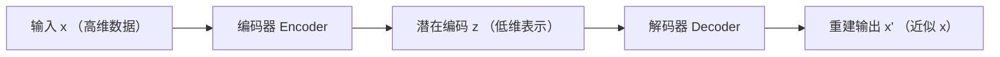
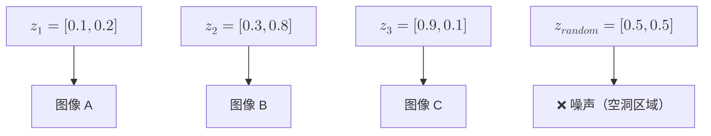
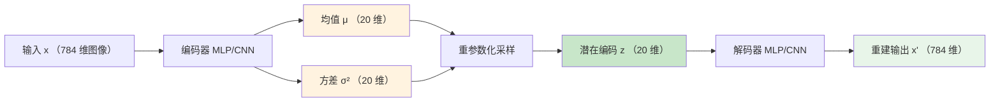
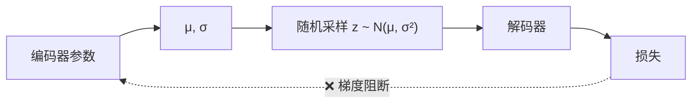
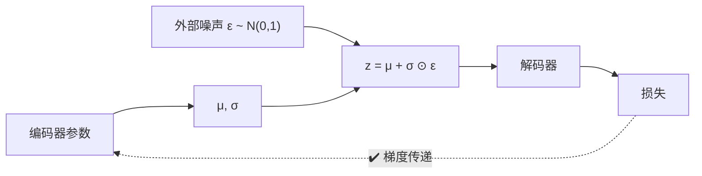

# 变分自编码器

长期以来，机器学习的主流应用场景是做预测（如图像分类任务）或者做决策（如股票量化投资），用于这些任务场景的模型被称作是**判别式模型**（Discriminative Model）。除此之外，还有一种任务类型是根据已有数据或者给出已知特征，让机器生成具有特定特征的数据，完成这类任务的模型就被称作是**生成式模型**（Generative Model）。

生成式模型不是新鲜事物，出现的时间其实非常早，1957 年美国作曲家雷贾伦·希勒（Lejaren Hiller）就用齐次马尔可夫链来产生有限控制的随机音符，然后通过和声与复调规则来测试音符，最后选择符合规则的素材修改、组合成传统音乐记谱的弦乐四重奏《依利亚克组曲》（Illiac Suite），这是人类历史上第一部由计算机生成的音乐作品。在 1966 年，数学家伦纳德·鲍姆（Leonard Baum）提出隐马尔可夫模型（Hidden Markov Model，HMM），这是业界首个被广泛使用的（尤其在声音处理领域）生成式模型。虽然出现时间很早，但生成模型的应用场景长期处于成果寥寥的窘态，想想也不奇怪，输出相对明确的判别式模型都要到深度学习兴起后，突破性的应用才大量涌现，输出更为复杂的生成式模型自然很难在此之前就成为人工智能应用的主流。

2013 年，荷兰阿姆斯特丹大学的博士生迪德里克·金马（Diederik Kingma）和他的导师马克斯·韦林（Max Welling）在国际学习表征会议（ICLR）上发表了一篇视觉生成模型的论文《[Auto-Encoding Variational Bayes](https://arxiv.org/abs/1312.6114)》，首次将变分推断与神经网络深度融合，提出了变分自编码器（Variational Autoencoder, VAE）。这篇论文的诞生源于一个长久未被解决的问题：如何让神经网络学习概率分布，而非单纯的点估计。传统自编码器只能压缩和重建数据，无法生成新样本。VAE 通过引入概率视角，让神经网络具备了创造的能力。这一创新解决了生成模型中的后验推断难题，也催生了后续一系列重要工作，如 β-VAE、VQ-VAE，再到现代大语言模型中的变分推断技术，VAE 的思想可以说是现代生成模型的起点，本节将介绍它的原理、数学推导、架构设计和生成能力。

## 自编码器原理

理解 VAE 的创新之处，需要先回顾传统自编码器的设计与局限。自编码器（Autoencoder, AE）是一种无监督学习模型，其设计目标是学习数据的压缩表示，并不是为了生成新样本。想象你有一堆照片，每张照片包含数百万像素，但真正区分这张照片与另一张照片的关键信息可能只有十几个或几十个维度，如照片中物体的形状、颜色分布、纹理特征等。自编码器的工作就是找出这些关键信息，将高维数据压缩到低维空间，再从低维表示重建原始数据。传统自编码器的架构设计遵循"编码 - 解码"的双向流程，如下图所示：


*图：自编码器工作流程*

自编码器的训练目标是最小化重建误差。数学上就是最小化原始输入 $x$ 与重建输出 $x'$ 之间的欧氏距离 $L = \|x - x'\|^2$。训练过程中，网络不断调整编码器和解码器的参数，使得重建输出尽可能接近原始输入。当重建误差足够小时，就说明潜在编码 $z$ 已经成功捕获了数据的关键特征。潜在编码 $z$ 并没有直接出现在优化的目标函数中，它代表的是最能反映数据本质的关键特征，就是前面照片例子中的人物表情、物体的形状、颜色分布、纹理特征等。这些维度并非由人工设计，而是神经网络在训练过程中自动发现的、能够有效区分不同数据样本的关键特征。正是这种自动特征提取的能力，使得自编码器成为深度学习中特征学习的基础工具。

编码器负责将高维输入压缩为低维潜在编码，解码器则将低维编码展开为高维重建输出。整个网络的架构设计约束是潜在编码的维度必须远小于输入维度。譬如一张 $28 \times 28$ 的 [MNIST](https://en.wikipedia.org/wiki/MNIST_database) 图像有 784 个像素，潜在编码可能小于 20 维，这个约束强迫编码器提取数据的关键特征，而非简单记忆所有像素值。刚才提到传统自编码器并不能用于生成新数据，如果尝试从潜在空间随机采样一个编码 $z$，送入解码器生成图像，结果通常是模糊、无意义的噪声。这个现象并不符合直觉，既然解码器能够从编码重建原始图像，为什么不能从随机编码生成新图像？答案在传统自编码器的潜在空间结构上。

传统自编码器的训练只关注压缩重建，编码器对每个输入数据输出一个固定的编码点。这些编码点在潜在空间中离散分布，大部分是解码器从未见过位置的空洞区域，自然无法生成有意义的结果。更糟糕的是，输入数据的微小变化可能导致编码的剧烈跳跃。两张相似人脸的编码可能相距很远，而两张完全不同人脸的编码可能意外靠近。这种不连续性使得潜在空间无法支持有效的采样生成。


*图：传统 AE 潜在空间*

上图展示了传统自编码器潜在空间的困境，编码点 $z_1, z_2, z_3$ 分别对应图像 A、B、C，但随机采样的 $z_{random}$ 落在空洞区域，解码器从未见过这类编码，只能输出无意义的噪声。潜在空间没有明确的概率分布结构，采样无法保证落在有意义的区域，这正是传统自编码器缺乏生成能力的根本原因。

## 变分自编码器

既然传统自编码器的核心问题在于潜在空间没有明确的分布结构，那么解决方案的方向就很明确，让潜在空间变成一个有结构的概率分布，而非散乱的离散点集。这正是 VAE 的创新所在。具体到神经网络架构上，VAE 对传统自编码器进行了改动，编码器不再输出一个固定的编码值 $z$，而是输出编码的[概率分布](../../maths/probability/probability-basics.md#分布的特征)参数，即均值 $\mu$ 和对数方差 $\log \sigma^2$。这两个参数定义了一个高斯分布 $q(z|x) = \mathcal{N}(\mu, \sigma^2)$，编码 $z$ 是从这个分布中采样得到的。


*图：VAE 工作流程*

将上图的 VAE 工作流程与前面传统 AE 作对比，传统 AE 的编码器输出固定的编码值，VAE 的编码器输出分布参数（绿色），再从分布中采样得到编码（黄色）。这个看似简单的改动，却从根本上改变了潜在空间的性质，具体体现在三个方面：
- 第一 **潜在空间变得连续**：每个数据点的编码不再是一个孤立点，而是一个覆盖一定范围的高斯分布。这些分布相互重叠，共同覆盖整个潜在空间。
- 第二 **分布有明确结构**：VAE 通过 KL 散度损失（稍后介绍），强制每个编码分布接近标准正态分布 $\mathcal{N}(0, 1)$，这意味着所有分布的中心都聚集在原点附近，方差都接近 1。
- 第三 **采样生成有效**：从标准正态分布 $\mathcal{N}(0, 1)$ 随机采样，得到的编码极大概率落在某个数据点编码分布的覆盖范围内，解码器见过这类编码，就能生成有意义的样本。

VAE 将离散编码转变为连续分布，这个转变赋予了自编码器生成能力，转变的关键在于传统自编码器学习的是数据的压缩表示，VAE 学习的是数据的生成过程。前者只能重建已有数据，后者可以从学到的分布中创造新数据。这个概率视角的转变，正是 VAE 作为生成模型的价值所在。

## 变分推断

VAE 从固定编码到概率分布的架构创新背后有着坚实的数学基础。这一节将从概率论的角度重新审视生成模型，推导出 VAE 的训练目标 ELBO，最终落实到具体的损失函数。

生成模型的假设是观测数据 $x$ 由某个潜在变量 $z$ 生成。从函数映射的角度看，这个假设可以用一个简单的方程来表示 $x = f(z)$，其中 $z$ 是潜在变量，代表数据的关键特征（如图像的语义内容、物体的形状属性），$x$ 是观测数据（如图像像素、音频波形）。生成函数 $f$ 将低维的潜在变量映射到高维的观测数据，譬如潜在变量 $z$ 可能包含"这是一个数字 7"、"笔画粗细适中"、"略微倾斜向右"等信息，生成函数 $f$ 根据这些信息绘制出具体的 $28 \times 28$ 像素图像。

现在，我们从概率的角度重新表述这个假设：潜在变量 $z$ 服从某个先验分布 $p(z)$，通常假定为标准正态分布 $\mathcal{N}(0, 1)$。给定 $z$，条件分布 $p(x|z)$ 定义了一个在所有可能观测数据空间上的概率密度，从该分布中采样得到一个具体的观测样本 $x$，就称为观测数据 $x$ 由条件分布 $p(x|z)$ 生成。对于相同的编码 $z$，多次从 $p(x|z)$ 采样会产生关键特征相似（由 $z$ 决定）但细节不同的数据样本。以 MNIST 为例，当 $z$ 编码了"数字 7、笔画中等粗细、略微右倾"时，从 $p(x|z)$ 每次采样得到的图像中数字 7 的结构特征保持一致，但像素级别的细节（如笔画的微小波动、噪声模式）会因每次采样而有所不同。用概率来表述的优势在于生成过程被建模为从分布采样的随机过程，而非确定性的函数映射。从 $p(z)$ 采样一个潜在编码，再从 $p(x|z)$ 采样生成数据，这个过程可以无限重复，源源不断生成新样本。

以概率角度看，生成模型的学习目标就是掌握生成过程 $p(x|z)$，使得从先验分布 $p(z)$ 采样后能够生成真实的观测数据。然而，实际训练中面临一个挑战，我们只有观测数据 $x$，不知道对应的潜在变量 $z$。幸好贝叶斯定理提供了推断潜在变量 $z$ 的理论框架，给定观测数据 $x$，潜在变量 $z$ 的后验分布为：

$$p(z|x) = \frac{p(x|z) p(z)}{p(x)}$$

$p(z|x)$ 是看到数据 $x$ 后，潜在变量 $z$ 的可能性；$p(x|z)$ 是给定潜在变量 $z$，生成数据 $x$ 的可能性；$p(z)$ 是潜在变量的先验分布，表达我们对 $z$ 的初始假设；$p(x)$ 是数据 $x$ 的[边缘概率](https://en.wikipedia.org/wiki/Marginal_distribution)（Marginal Probability），需要积分计算。定理有了，在实际应用中却遇到了计算困难，边缘概率 $p(x) = \int p(x|z) p(z) dz$ 是一个高维积分，潜在变量可能有几十维甚至上百维，积分空间极其庞大，直接计算几乎不可能。这正是变分推断的切入点，既然无法精确计算后验分布 $p(z|x)$，就用一个可计算的分布来近似它，即用一个参数化的分布 $q(z|x)$ 来近似真实的后验分布 $p(z|x)$。这个近似分布 $q(z|x)$ 由神经网络（编码器）定义，参数可以通过优化学习得到，优化的目标是让 $q(z|x)$ 尽可能接近 $p(z|x)$：

$$q(z|x) \approx p(z|x)$$

举个生活例子来解释变分推断的近似思想，想象你要做一款 3D 游戏场景，真实世界中一个复杂曲折、坑坑洼洼的山脉地形就是真实的后验分布 $p(z|x)$，如果要你精确描绘需要测量每个角落，直接测绘然后在游戏中重现是几乎不可能的；变分推断选择用一系列光滑的平面贴图（高斯分布）来覆盖这片山脉，虽然细节上肯定有偏差，但地形的轮廓已经捕获，满足游戏渲染的需要。选用高斯分布作为"贴图"的优势在于参数简洁（只需均值和方差），计算高效，便于快速优化。

### KL 散度

变分推断的优化目标是找到最优的近似分布 $q(z|x)$，使得它尽可能接近真实的后验分布 $p(z|x)$。数学上衡量两个分布相似度的标准工具是 KL 散度（Kullback-Leibler Divergence），由库尔巴克（Solomon Kullback）和莱布勒（Richard Leibler）于 1951 年提出。KL 散度 衡量用分布 $p$ 编码来自分布 $q$ 的数据时所需的额外信息量，它的定义为：

$$D_{KL}(q(z|x) || p(z|x)) = \int q(z|x) \log \frac{q(z|x)}{p(z|x)} dz$$

$\log \frac{q(z|x)}{p(z|x)}$ 是两个分布概率比值的对数，当 $q$ 和 $p$ 在同一位置 $z$ 的概率相近时，比值接近 1，对数接近 0；当 $q$ 给某位置赋予高概率而 $p$ 给予低概率时，比值大于 1，对数为正，表示用 $p$ 来编码 $q$ 在该区域的分布需要额外的信息量（即额外的编码代价）。$q(z|x)$ 是权重，确保我们关注 $q$ 认为重要的区域。KL 散度越小，说明 $q(z|x)$ 与 $p(z|x)$ 越相似。从 KL 散度表达式开始进行一系列数学变换（略），可以得到一个重要关系：

$$\log p(x) = D_{KL}(q(z|x) || p(z|x)) + \mathbb{E}_{q(z|x)}[\log p(x|z)] - D_{KL}(q(z|x) || p(z))$$

这个等式揭示了四个关键量之间的关系：$\log p(x)$ 是数据的对数似然（我们想要最大化）；$D_{KL}(q(z|x) || p(z|x))$ 是近似后验与真实后验之间的差距（我们想要最小化）；剩余两项统一称为 **ELBO**（Evidence Lower Bound，证据下界），即：

$$\text{ELBO} = \mathbb{E}_{q(z|x)}[\log p(x|z)] - D_{KL}(q(z|x) || p(z))$$

由于 KL 散度 $D_{KL}(q(z|x) || p(z|x)) \geq 0$，所以 $\log p(x) \geq \text{ELBO}$，也就是说，ELBO 是对数似然 $\log p(x)$ 的下界。最大化 ELBO，就等于在提升对数似然的下限，同时减小近似后验与真实后验的差距。组成 ELBO 的两项分别对应 VAE 的两个训练目标。第一项 $\mathbb{E}_{q(z|x)}[\log p(x|z)]$ 是期望对数似然，可以理解为从近似后验采样编码后，解码器重建原始数据的可能性。最大化这一项，意味着解码器能够从采样的潜在编码高质量重建输入数据，这正是重建损失的目标。第二项 $-D_{KL}(q(z|x) || p(z))$ 是 KL 散度的负值，确保近似后验分布接近先验分布。最小化 KL 散度（最大化负 KL 散度），使得编码器输出的分布 $q(z|x)$ 接近标准正态分布 $p(z) = \mathcal{N}(0, 1)$，这正是 KL 散度损失的目标。

ELBO 的推导过程虽然涉及较多数学符号，笔者也省略了中间的数学变换过程，但其核心思想用语言来描述并不复杂。首先，我们无法直接计算后验分布，转而用可优化的近似分布替代；其次，KL 散度衡量近似质量，却又涉及不可计算的边缘概率。因此我们通过数学变换，将不可计算的目标转化为可计算的 ELBO。

### VAE 的损失函数

理论推导最终要落实到可计算的损失函数。VAE 的损失函数直接来源于 ELBO 的两个组成部分，只是符号上从最大化 ELBO 转化为最小化负 ELBO：

- 第一部分 **重建损失**：ELBO 的第一项 $\mathbb{E}_{q(z|x)}[\log p(x|z)]$ 表示期望对数似然，最大化这一项意味着提高解码器重建输入数据的能力。实际训练中，我们习惯最小化损失而非最大化目标，因此将这一项取负：

    $$L_{recon} = -\mathbb{E}_{q(z|x)}[\log p(x|z)]$$

    对于图像数据，条件分布 $p(x|z)$ 通常假设为伯努利分布（像素为黑白二值）或高斯分布（像素为连续灰度值）。伯努利分布假设下，重建损失对应二元交叉熵；高斯分布假设下，重建损失对应均方误差。两种假设在实践中都能有效训练 VAE，选择取决于数据特性。

- 第二部分 **KL 散度损失**：ELBO 的第二项 $-D_{KL}(q(z|x) || p(z))$ 表示 KL 散度的负值，最大化这一项意味着让编码分布接近先验分布。同样转化为最小化形式：

    $$L_{KL} = D_{KL}(q(z|x) || p(z))$$

将两部分合并，得到 VAE 的总损失函数 $L = L_{recon} + \beta \cdot L_{KL}$，其中 $\beta$ 是平衡系数，标准 VAE 中 $\beta = 1$。$\beta$-VAE 通过调整这个系数，可以在重建质量和生成能力之间权衡，增大 $\beta$ 会强化 KL 散度约束，编码分布更接近标准正态分布，潜在空间更有结构，但重建质量可能下降；减小 $\beta$ 会放松 KL 散度约束，重建质量提升，但潜在空间可能变得无结构，生成能力减弱。

平衡系数 $\beta$ 反映出损失函数的两部分存在内在张力。重建损失要求编码器输出足够丰富的分布参数，使得解码器能精确重建原始数据；KL 散度损失要求编码器输出简单的分布参数，接近标准正态分布。这个张力可以想象为编码器是一个翻译官，重建损失要求他把原文翻译得足够地道，不丢失任何地方特色；KL 散度损失要求他用标准化的词汇表翻译，不使用方言或俚语。翻译官需要在详细准确和标准规范之间找到平衡，VAE 的训练正是寻找这个平衡点的过程。

## VAE 架构设计

数学理论给出了训练目标：最小化重建损失与 KL 散度损失之和。现在将这些理论落实到神经网络架构，探讨编码器如何输出分布参数、解码器如何从潜在编码重建数据、采样过程如何实现反向传播，本节将逐一解决这些问题。

### 编码器 - 解码器结构

VAE 的整体架构与传统自编码器相似，都包含编码器和解码器两个神经网络。关键区别在于编码器的输出，传统自编码器的编码器输出固定编码值，VAE 的编码器输出概率分布的均值 $\mu$ 和对数方差 $\log \sigma^2$ 两个参数。


*图：VAE 完整数据流*

上图展示了 VAE 的完整数据流。输入图像经过编码器，输出均值和方差两个分支（橙色），这两个参数定义一个高斯分布，从中采样得到潜在编码（深绿色），潜在编码经过解码器，输出重建图像（浅绿色）。编码器的核心任务是提取数据的关键特征，并将其表示为概率分布参数。假设输入是一张 $28 \times 28$ 的 MNIST 图像（784 维像素向量），编码器首先通过多层神经网络将高维输入压缩为中间表示，再从这个中间表示输出均值 $\mu$ 和方差 $\sigma^2$。数学上可以表示为：

$$\mu = f_\mu(x), \quad \log \sigma^2 = f_\sigma(x)$$

这里有一个工程实现细节需要说明，编码器输出 $\log \sigma^2$ 而非 $\sigma^2$。原因是 $\sigma^2$ 必须为正数，直接输出 $\sigma^2$ 需要额外的约束机制（如输出层必须使用 ReLU）；而 $\log \sigma^2$ 可以是任意实数，无需额外约束，神经网络可以自由输出任意值。训练过程中，只需在计算 KL 散度和采样时将 $\log \sigma^2$ 转换回 $\sigma^2$ 即可。解码器的作用与编码器相反，是将低维潜在编码展开为高维重建输出。解码器数学表示为：

$$x' = f_{dec}(z)$$

解码器的输出取决于数据类型。对于图像数据，如果假设像素服从伯努利分布（黑白二值图像），解码器输出每个像素为 1 的概率，通常使用 Sigmoid 激活函数确保输出在 $[0, 1]$ 范围；如果假设像素服从高斯分布（灰度图像），解码器输出像素值本身，可以使用 Sigmoid 并乘以 255，或直接输出无约束值。两种设计在实践中都能有效训练，选择取决于具体任务需求。

### 重参数化技巧

VAE 的采样过程还面临一个技术问题，如果不做额外处理，从高斯分布 $q(z|x) = \mathcal{N}(\mu, \sigma^2)$ 采样潜在编码 $z$ 的操作是无法直接反向传播的，这样编码器的参数就无法通过梯度下降优化，整个网络也就无法训练。问题的根源在于采样操作的本质，当我们写 $z \sim \mathcal{N}(\mu, \sigma^2)$ 时，数学含义是从以 $\mu$ 为中心、$\sigma^2$ 为方差的分布中随机抽取一个值。这个操作天然带有随机性，即使 $\mu$ 和 $\sigma$ 相同，每次采样得到的 $z$ 都不同。反向传播依赖链式法则计算梯度，需要知道 $z$ 如何随 $\mu$ 和 $\sigma$ 变化，随机采样操作破坏了这种确定性关系，$\mu$ 的微小变化可能导致 $z$ 的剧烈波动，甚至完全无关的变化，梯度无法稳定传递，如下图所示：


*图：传统采样的梯度阻断问题*

解决这个问题的办法是将采样操作改写为确定性运算加外部噪声，将随机性移出梯度路径，编码器参数通过确定性运算影响 $z$，梯度才可以正常传递。这个操作被称为**重参数化**（Reparameterization），数学表达为：

$$z = \mu + \sigma \odot \epsilon$$

其中 $\epsilon \sim \mathcal{N}(0, 1)$ 是从标准正态分布采样的噪声，$\odot$ 表示逐元素乘法。重参数化改写的关键在于随机性被分派给 $\epsilon$，$\epsilon$ 的生成不依赖编码器参数，不参与反向传播；$\mu$ 和 $\sigma$ 通过加法和乘法这两个确定性运算影响 $z$，梯度可以正常计算。很容易就能验证这个改写的确是能够工作的，设 $\epsilon$ 是标准正态分布的随机变量，均值 0，方差 1。那么 $z = \mu + \sigma \epsilon$ 的均值是 $\mu$，方差是 $\sigma^2$，这正是我们想要的分布参数。重参数化没有改变采样的统计特性，只是改变了表达形式，梯度传递表示为：

$$\frac{\partial z}{\partial \mu} = 1, \quad \frac{\partial z}{\partial \sigma} = \epsilon$$

$\mu$ 对 $z$ 的影响是直接的，梯度为常数 1；$\sigma$ 对 $z$ 的影响通过噪声 $\epsilon$ 调节，梯度取决于当前采样的噪声值。无论哪种情况，梯度都可以从损失函数通过 $z$ 回传到 $\mu$ 和 $\sigma$，因此编码器参数可以正常更新。重参数化后的梯度传递路径如下图所示：


*图：重参数化的梯度传递*

重参数化技巧是 VAE 能够训练的技术保障，也是深度学习处理随机变量的一种常用方法。这一技巧不仅能应用于 VAE，还被推广到其他生成模型（如 GAN、扩散模型）和概率编程框架中。理解重参数化的原理，有助于理解深度学习是如何将概率推断与梯度优化结合起来的。

## VAE 生成 MNIST 实践

在开始实验之前，请确保已[挂载数据目录](../../appendixes/sandbox.md#数据管理)并下载好 MNIST 数据集，你可以通过 `DMLA-CLI` 工具自动完成该工作：
```bash
# 选择 "下载数据集" -> 选择 "MNIST"
dmla data
```

以下实验演示 VAE 的完整生成流程。代码实现一个 VAE 网络（编码器和解码器各有两层隐藏层），快速训练后从标准正态分布采样生成图像。实验展示了 VAE 的能力，从随机噪声生成新图像，潜在空间有结构使得生成样本有意义。

```python runnable extract-class="ImageVAE"
import torch
import torch.nn as nn
import torch.nn.functional as F
import matplotlib.pyplot as plt
import os
import numpy as np
from dmla_progress import ProgressReporter

class ImageVAE(nn.Module):
    """
    用于 MNIST 图像生成的 VAE

    网络结构:
    - 编码器: 784 → 512 → 256 → (μ, σ)
    - 解码器: z → 256 → 512 → 784

    潜在空间维度: 20
    """
    def __init__(self, latent_dim=20):
        super().__init__()

        # 编码器（更深的网络，提取更丰富的特征）
        self.encoder = nn.Sequential(
            nn.Linear(784, 512),
            nn.ReLU(),
            nn.Linear(512, 256),
            nn.ReLU()
        )
        self.fc_mu = nn.Linear(256, latent_dim)
        self.fc_logvar = nn.Linear(256, latent_dim)

        # 解码器（对称结构）
        self.decoder = nn.Sequential(
            nn.Linear(latent_dim, 256),
            nn.ReLU(),
            nn.Linear(256, 512),
            nn.ReLU(),
            nn.Linear(512, 784),
            nn.Sigmoid()  # 输出像素概率
        )

        self.latent_dim = latent_dim

    def encode(self, x):
        """编码过程"""
        h = self.encoder(x)
        return self.fc_mu(h), self.fc_logvar(h)

    def reparameterize(self, mu, logvar):
        """重参数化"""
        std = torch.exp(logvar / 2)
        eps = torch.randn_like(std)
        return mu + std * eps

    def decode(self, z):
        """解码过程"""
        return self.decoder(z)

    def forward(self, x):
        """完整流程"""
        mu, logvar = self.encode(x)
        z = self.reparameterize(mu, logvar)
        return self.decode(z), mu, logvar

    def generate(self, num_samples):
        """生成新样本"""
        z = torch.randn(num_samples, self.latent_dim)
        return self.decode(z)

def load_mnist_images(filepath):
    """读取 MNIST IDX 格式图像文件"""
    import struct
    import gzip

    with gzip.open(filepath, 'rb') as f:
        # 读取头部信息: magic number, num images, rows, cols
        magic, num, rows, cols = struct.unpack('>IIII', f.read(16))
        # 读取图像数据
        data = np.frombuffer(f.read(), dtype=np.uint8)
        data = data.reshape(num, rows, cols)
    return data

def load_mnist_labels(filepath):
    """读取 MNIST IDX 格式标签文件"""
    import struct
    import gzip

    with gzip.open(filepath, 'rb') as f:
        # 读取头部信息: magic number, num labels
        magic, num = struct.unpack('>II', f.read(8))
        # 读取标签数据
        labels = np.frombuffer(f.read(), dtype=np.uint8)
    return labels

# 加载 MNIST 数据集（需先通过 dmla data 命令下载）
data_dir = os.path.join(DATA_DIR, 'datasets', 'mnist')

# 检查数据集是否存在
train_images_path = os.path.join(data_dir, 'train-images-idx3-ubyte.gz')
train_labels_path = os.path.join(data_dir, 'train-labels-idx1-ubyte.gz')

if not os.path.exists(train_images_path):
    print("MNIST 数据集未下载，请先运行以下命令下载:")
    print("  dmla data")
    print("  选择 '下载数据集' -> 选择 'MNIST'")
else:
    # 加载训练数据
    train_images = load_mnist_images(train_images_path)
    train_labels = load_mnist_labels(train_labels_path)

    print(f"加载 MNIST 数据集: {len(train_images)} 张训练图片")

    # 转换为 PyTorch Tensor（使用 copy() 避免 numpy array 不可写警告）
    train_images_tensor = torch.from_numpy(train_images.copy()).float() / 255.0
    train_labels_tensor = torch.from_numpy(train_labels.copy()).long()

    # 创建 DataLoader
    train_dataset = torch.utils.data.TensorDataset(
        train_images_tensor.unsqueeze(1),  # 添加通道维度 [N, 1, 28, 28]
        train_labels_tensor
    )
    train_loader = torch.utils.data.DataLoader(
        train_dataset,
        batch_size=128,
        shuffle=True
    )

    # 创建 VAE 并训练
    vae = ImageVAE(latent_dim=20)
    optimizer = torch.optim.Adam(vae.parameters(), lr=0.002)

    # 初始化进度报告器（前端会解析并显示进度条）
    num_epochs = 10
    progress = ProgressReporter(
        total_steps=num_epochs,
        description="训练 VAE 生成 MNIST 数字"
    )
    vae.train()

    for epoch in range(num_epochs):
        total_loss = 0
        num_batches = 0

        for batch_idx, (images, labels) in enumerate(train_loader):
            # 展平图片: [B, 1, 28, 28] → [B, 784]
            x = images.view(images.size(0), -1)

            # VAE 前向传播
            x_recon, mu, logvar = vae(x)

            # 计算损失
            recon_loss = F.binary_cross_entropy(x_recon, x, reduction='sum')
            kl_loss = -0.5 * torch.sum(1 + logvar - mu.pow(2) - logvar.exp())
            loss = recon_loss + kl_loss

            # 反向传播
            optimizer.zero_grad()
            loss.backward()
            optimizer.step()

            total_loss += loss.item()
            num_batches += 1

            # 仅训练部分批次以加快速度
            if num_batches >= 50:
                break

        avg_loss = total_loss / num_batches / 128

        # 更新进度（前端会显示进度条和 message）
        progress.update(
            step=epoch + 1,
            message=f"Epoch {epoch+1}/{num_epochs} | Loss: {avg_loss:.4f}",
            extra_data={"loss": avg_loss}
        )

    # 标记训练完成
    progress.complete(message="训练完成，开始生成数字 0-9")

    # 从真实数字图片中提取潜在编码，生成 0-9 图片
    vae.eval()
    print("开始提取数字 0-9 的样本...")

    # 找到每个数字的一张样本图片（添加进度日志）
    digit_samples = {}
    batch_count = 0
    for images, labels in train_loader:
        batch_count += 1
        for img, label in zip(images, labels):
            label_val = label.item()
            if label_val not in digit_samples:
                digit_samples[label_val] = img
            if len(digit_samples) == 10:  # 0-9 全部找到
                break
        if len(digit_samples) == 10:
            print(f"所有数字已找到，遍历了 {batch_count} 个批次")
            break

    print(f"开始编码和生成图片...")

    # 编码每个数字并生成
    with torch.no_grad():
        fig, axes = plt.subplots(2, 10, figsize=(15, 3))
        fig.suptitle('VAE 生成数字 0-9 (基于真实样本潜在编码)', fontsize=12)

        for digit in range(10):
            # 获取该数字的真实图片
            real_img = digit_samples[digit].view(1, -1)

            # 编码到潜在空间
            mu, logvar = vae.encode(real_img)

            # 在潜在编码附近采样生成（加入小扰动）
            z = mu + 0.1 * torch.randn_like(mu)  # 小扰动保持数字特征
            generated = vae.decode(z).view(28, 28)

            # 显示真实图片（第一行）
            axes[0, digit].imshow(digit_samples[digit].squeeze().numpy(), cmap='gray')
            axes[0, digit].axis('off')
            axes[0, digit].set_title(f'{digit}', fontsize=12)

            # 显示生成图片（第二行）
            axes[1, digit].imshow(generated.numpy(), cmap='gray')
            axes[1, digit].axis('off')

        # 添加行标签
        axes[0, 0].set_ylabel('真实', fontsize=11, rotation=0, ha='right', va='center')
        axes[1, 0].set_ylabel('生成', fontsize=11, rotation=0, ha='right', va='center')

        plt.tight_layout()
        plt.show()
```
## VAE 的应用场景

VAE 的生成能力在多个领域有实际应用价值。相比于其他生成模型，VAE 的优势在于潜在空间可控、生成过程稳定、训练可靠收敛。

| 应用场景 | 具体用途 | VAE 的优势 |
|:---------|:---------|:-----------|
| **图像生成** | 从噪声生成真实图像，用于创意设计 | 潜在空间有结构，生成可控 |
| **数据增强** | 生成新样本扩充训练集，解决数据稀缺 | 生成样本符合真实分布 |
| **异常检测** | 检测偏离正常分布的异常数据 | 重建误差与 KL 散度均可作为异常指标 |
| **数据压缩** | 潜在编码压缩存储高维数据 | 压缩比高，支持重建恢复 |
| **特征编辑** | 修改潜在编码改变特定特征 | 潜在维度有语义含义 |

其中异常检测和数据压缩的应用场景值得专门说明：

- 对于异常检测，VAE 训练后，正常数据的编码分布接近标准正态分布；当输入异常数据时，编码分布偏离先验，KL 散度会异常增大。这个原理可以用于工业设备故障检测（正常运行的设备编码分布稳定，故障时编码分布突变）、金融欺诈识别（正常交易的编码分布集中，异常交易的编码分布分散）等场景。相比于传统的异常检测方法，VAE 不需要预先定义异常模式，能够自动学习正常数据的分布特征。

- 数据压缩的应用场景则体现了 VAE 的双重价值，潜在编码维度远小于输入维度（如 784 维图像压缩到 20 维编码），实现高效压缩；解码器能够从编码重建原始数据，保证信息可恢复。这种压缩不同于 JPEG 等传统图像压缩方法，VAE 学习的是数据的语义特征而非像素相关性，可能实现更高的压缩比。

## 本章小结

变分自编码器将概率推断与深度学习融合，开创了神经网络生成能力的新范式。从"学习固定编码"到"学习编码分布"这个转变看似简单，却从根本上改变了模型的性质，传统自编码器只能压缩和重建已有数据，VAE 能够从学到的分布中创造新数据。VAE 的技术贡献不仅在于解决了生成问题，更在于展示了深度学习如何与概率论结合。诚然，VAE 也存在局限，如重建损失倾向于输出平均化的结果，导致生成图像显得模糊、KL 散度约束可能过度简化编码分布，限制了模型的表达能力，等等。这些问题催生了后续的改进工作，譬如 β-VAE 通过调整损失权重增强潜在空间解耦、VQ-VAE 使用离散编码替代连续分布提升生成质量、VAE-GAN 组合对抗训练改善视觉效果。

## 练习题

1. 传统自编码器（AE）和变分自编码器（VAE）的根本区别是什么？为什么 AE 无法从潜在空间采样生成新图像，而 VAE 可以？请从潜在空间结构的角度解释。
    <details>
    <summary>参考答案</summary>

    **根本区别**：

    | 方面 | 传统 AE | VAE |
    |:-----|:-------|:----|
    | 编码器输出 | 固定编码值 $z$ | 分布参数 $(\mu, \sigma)$ |
    | 潜在空间结构 | 离散点集 | 连续概率分布 |
    | 训练目标 | 重建误差 | 重建损失 + KL 散度损失 |
    | 生成能力 | 无 | 有 |

    **AE 无法生成的原因**：AE 的潜在空间是离散的点集

    1. **离散分布**：每个输入对应一个固定编码点，编码点之间是"空洞区域"
    2. **无结构约束**：相似数据的编码可能相距很远，不同数据的编码可能意外靠近
    3. **采样失效**：随机采样的编码几乎一定落在空洞区域，解码器从未见过这类编码，只能输出噪声

    譬如，编码 $z_1 = [0.1, 0.2]$ 对应图像 A，$z_2 = [0.3, 0.8]$ 对应图像 B，但随机采样 $z = [0.5, 0.5]$ 可能落在两者之间的空洞区域，解码器无法理解这个无意义的编码。

    **VAE 可以生成的原因**：VAE 将潜在空间变为连续的概率分布

    1. **分布覆盖**：每个输入对应一个高斯分布（而非固定点），分布相互重叠覆盖整个空间
    2. **结构约束**：KL 散度损失强制所有编码分布接近 $\mathcal{N}(0, I)$，分布中心聚集在原点附近
    3. **采样有效**：从 $\mathcal{N}(0, I)$ 采样的编码几乎一定落在某个数据点分布的覆盖范围内

    譬如，图像 A 的编码分布 $\mathcal{N}([0.1, 0.2], 0.5^2 I)$ 覆盖附近区域，图像 B 的编码分布 $\mathcal{N}([0.3, 0.8], 0.5^2 I)$ 也覆盖附近区域。两个分布重叠，从 $\mathcal{N}(0, I)$ 采样的编码大概率落在某个分布覆盖范围内，解码器见过这类编码。
    </details>
