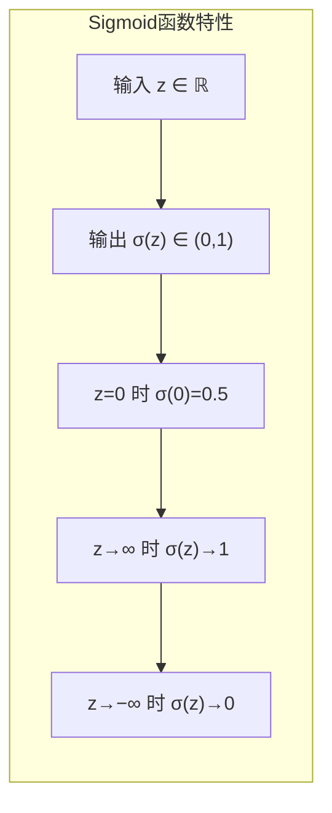

# 激活函数

在前一章介绍反向传播算法时，我们看到梯度传递的核心公式 $\delta^l = (\mathbf{W}^{l+1})^T \delta^{l+1} \cdot f'(\mathbf{z}^l)$，其中 $f'(\mathbf{z}^l)$ 是激活函数的导数。这个导数决定了梯度在传递过程中的衰减或放大程度，直接影响深层网络的训练效果。选择合适的激活函数，是神经网络设计的关键决策之一。

激活函数为神经网络引入非线性，使网络能够学习复杂的函数关系。如果网络全部使用线性变换，无论叠加多少层，最终仍是线性模型，表达能力受限。非线性激活函数打破线性约束，赋予网络强大的表达能力。本章将介绍常用激活函数的特性、梯度特性及其对训练的影响，并探讨激活函数的选择策略。

## Sigmoid 与 tanh

### Sigmoid 函数

**Sigmoid 函数**（也称 Logistic 函数）是最经典的激活函数，其数学表达式为：

$$\sigma(z) = \frac{1}{1 + e^{-z}} = \frac{e^z}{1 + e^z}$$

Sigmoid 函数将任意实数映射到 $(0, 1)$ 区间，输出可以解释为概率（常用于二分类输出层）。函数形状呈"S"型曲线，在 $z=0$ 处斜率最大，两端逐渐趋于水平。



*图：Sigmoid 函数的映射特性*

**Sigmoid 的导数**：

$$\sigma'(z) = \sigma(z)(1 - \sigma(z))$$

这个导数有一个重要特性：最大值为 $0.25$（当 $\sigma(z) = 0.5$ 时），当 $z$ 很大或很小时，导数趋近于 $0$。

**Sigmoid 的问题**：

1. **梯度消失**：导数最大 $0.25$，每经过一层 Sigmoid，梯度最多保留 $25\%$。深层网络中，前面几层的梯度几乎消失，参数难以更新。

2. **输出非零中心**：Sigmoid 输出恒为正数，这会导致下一层输入也恒为正。权重梯度 $\frac{\partial L}{\partial \mathbf{W}} = \delta \mathbf{a}^T$ 中，$\mathbf{a}$ 恒正意味着所有权重梯度同号，参数更新呈现"锯齿"震荡，收敛缓慢。

3. **计算成本**：指数运算 $e^{-z}$ 比简单运算（如 ReLU 的 $\max(0,z)$）更耗时。

### tanh 函数

**tanh 函数**（双曲正切函数）是 Sigmoid 的改进版本：

$$\tanh(z) = \frac{e^z - e^{-z}}{e^z + e^{-z}} = \frac{e^{2z} - 1}{e^{2z} + 1}$$

tanh 函数将任意实数映射到 $(-1, 1)$ 区间，输出以 $0$ 为中心。这一点比 Sigmoid 更好——零中心输出使下一层输入分布更平衡，权重更新更平稳。

**tanh 的导数**：

$$\tanh'(z) = 1 - \tanh^2(z)$$

导数最大值为 $1$（当 $\tanh(z) = 0$ 时），比 Sigmoid 的 $0.25$ 大。但 $z$ 很大或很小时，导数同样趋近于 $0$，梯度消失问题仍然存在。

**tanh 与 Sigmoid 的关系**：

$$\tanh(z) = 2\sigma(2z) - 1$$

这个关系表明 tanh 是 Sigmoid 的线性变换版本，放大输入并平移输出到零中心。

## ReLU 及其变体

### ReLU 函数

**ReLU 函数**（Rectified Linear Unit，修正线性单元）是深度学习时代最流行的激活函数：

$$\text{ReLU}(z) = \max(0, z) = \begin{cases} z & z > 0 \\ 0 & z \leq 0 \end{cases}$$

ReLU 的设计极简：正数保持不变，负数置零。这种简单设计带来了巨大优势：

**ReLU 的优势**：

1. **缓解梯度消失**：正数区域导数恒为 $1$，梯度完整传递，不会被衰减。深层网络训练变得可行。

2. **计算高效**：$\max(0,z)$ 只需一次比较，比指数运算快得多。

3. **稀疏激活**：负数输出为 $0$，网络呈现稀疏状态。稀疏激活模拟生物神经元特性，降低计算开销，同时实现某种"自动特征选择"。

4. **线性特性**：正数区域是线性的，优化更容易。梯度方向稳定，收敛更快。

**ReLU 的导数**：

$$\text{ReLU}'(z) = \begin{cases} 1 & z > 0 \\ 0 & z \leq 0 \end{cases}$$

**ReLU 的问题：神经元死亡**

ReLU 的致命问题是**神经元死亡**（Dead ReLU）。当输入恒为负（$z \leq 0$），输出恒为 $0$，导数恒为 $0$。梯度无法传递，权重永远不更新。这个神经元"死亡"，网络容量降低。

神经元死亡的常见原因：
- 初始化不当：权重初始值太小，导致大量神经元处于负数区域
- 学习率过大：参数更新幅度过大，神经元"冲过"激活区域后死亡
- 数据分布变化：输入数据偏移，导致神经元进入负数区域

### Leaky ReLU

**Leaky ReLU** 对 ReLU 的改进：负数区域不再完全置零，而是保持一个小的斜率：

$$\text{LeakyReLU}(z) = \max(\alpha z, z) = \begin{cases} z & z > 0 \\ \alpha z & z \leq 0 \end{cases}$$

其中 $\alpha$ 是小正数（通常 $0.01$）。

导数：

$$\text{LeakyReLU}'(z) = \begin{cases} 1 & z > 0 \\ \alpha & z \leq 0 \end{cases}$$

Leaky ReLU 的优势：负数区域导数不为 $0$，梯度仍可传递，避免神经元死亡。

### ELU

**ELU 函数**（Exponential Linear Unit）进一步改进负数区域的处理：

$$\text{ELU}(z) = \begin{cases} z & z > 0 \\ \alpha(e^z - 1) & z \leq 0 \end{cases}$$

其中 $\alpha$ 是超参数（通常 $1.0$）。

ELU 的特点：
- 正数区域与 ReLU 相同
- 负数区域平滑过渡到 $-\alpha$，避免 Leaky ReLU 的不连续性
- 输出均值接近 $0$，有利于下一层输入分布平衡

ELU 的导数：

$$\text{ELU}'(z) = \begin{cases} 1 & z > 0 \\ \alpha e^z & z \leq 0 \end{cases}$$

ELU 的缺点是负数区域涉及指数运算，计算成本略高。

### PReLU

**PReLU 函数**（Parametric ReLU）将 Leaky ReLU 的斜率参数化：

$$\text{PReLU}(z) = \begin{cases} z & z > 0 \\ \alpha_i z & z \leq 0 \end{cases}$$

其中 $\alpha_i$ 可以是可学习的参数，每个神经元有独立的斜率。

PReLU 的优势：斜率通过反向传播学习，自动适应数据分布，比固定斜率更灵活。

## Softmax 函数

### Softmax 的定义

**Softmax 函数**是多分类问题的标准输出层激活函数。它将向量转换为概率分布：

$$\text{Softmax}(\mathbf{z})_k = \frac{e^{z_k}}{\sum_{j=1}^{K} e^{z_j}}$$

其中 $\mathbf{z} \in \mathbb{R}^K$，$K$ 是类别数量。

Softmax 的特性：
- 输出恒为正数：$e^{z_k} > 0$
- 输出总和为 $1$：$\sum_k \text{Softmax}(\mathbf{z})_k = 1$
- 输出可以解释为概率分布

### Softmax 的梯度

在前一章中，我们证明了 Softmax + Cross-Entropy 的梯度有一个优美的简化：

$$\frac{\partial L}{\partial z_k} = a_k - y_k$$

其中 $a_k = \text{Softmax}(\mathbf{z})_k$，$y_k$ 是真实标签（one-hot 编码）。

这个简化使得 Softmax 输出层的梯度计算非常高效，无需显式计算 Softmax 的雅可比矩阵。

### Softmax 的数值稳定性

Softmax 涉及指数运算，当 $z_k$ 很大时 $e^{z_k}$ 可能溢出。解决方案是减去最大值：

$$\text{Softmax}(\mathbf{z})_k = \frac{e^{z_k - z_{max}}}{\sum_{j=1}^{K} e^{z_j - z_{max}}}$$

减去 $z_{max} = \max_k z_k$ 不改变 Softmax 的输出值（分子分母同时乘以 $e^{-z_{max}}$），但避免了溢出。

## 梯度消失与梯度爆炸

### 梯度消失问题

**梯度消失**（Vanishing Gradient）指反向传播中梯度逐层衰减，前面几层梯度接近 $0$，参数几乎不更新。深层网络训练困难的主要原因。

梯度消失的成因：
- 激活函数导数小于 $1$：Sigmoid 导数最大 $0.25$，tanh 导数最大 $1$（但两端趋近 $0$）
- 权重初始化不当：权重太小，导致激活值进入导数小的区域

梯度消失的表现：
- 深层网络的前面几层参数几乎不更新
- 训练过程收敛极慢或停滞
- 测试集表现差（前面几层没有学到有效特征）

### 梯度爆炸问题

**梯度爆炸**（Exploding Gradient）指反向传播中梯度逐层放大，前面几层梯度极大，参数更新幅度过大，训练不稳定。

梯度爆炸的成因：
- 权重初始化不当：权重太大
- 激活函数导数大于 $1$（某些区域）

梯度爆炸的表现：
- 参数更新幅度极大，损失剧烈波动
- 损失变为 NaN（数值溢出）
- 模型无法收敛

### 梯度问题的诊断与缓解

**诊断方法**：
- 监控各层梯度范数：绘制梯度范数随层数变化的曲线
- 观察权重更新幅度：如果某层权重几乎不变，可能梯度消失

**缓解策略**：
1. **使用 ReLU 系列激活函数**：正数区域导数为 $1$，避免梯度衰减
2. **合适的权重初始化**：He 初始化（配合 ReLU）、Xavier 初始化（配合 tanh）
3. **批归一化**：稳定激活值分布，避免进入导数小的区域
4. **残差连接**：提供梯度旁路传递路径
5. **梯度裁剪**：限制梯度范数，防止爆炸

这些方法将在后续章节详细展开。

## 激活函数选择策略

### 按场景选择

| 场景 | 推荐激活函数 | 原因 |
|:-----|:------------|:-----|
| 隐藏层（深度网络） | ReLU / Leaky ReLU | 缓解梯度消失，计算高效 |
| 隐藏层（浅层网络） | tanh / ReLU | 浅层网络梯度消失问题不严重 |
| 输出层（二分类） | Sigmoid | 输出概率，符合二分类语义 |
| 输出层（多分类） | Softmax | 输出概率分布，符合多分类语义 |
| 输出层（回归） | Linear（无激活） | 输出无范围限制 |

### 实践经验

1. **首选 ReLU**：ReLU 是深度学习隐藏层的默认选择。实验表明 ReLU 在大多数任务上表现优于 Sigmoid 和 tanh。

2. **避免 Sigmoid 在隐藏层**：Sigmoid 的梯度消失问题严重，不适合深层网络的隐藏层。

3. **Leaky ReLU 作为保守选择**：如果担心神经元死亡，使用 Leaky ReLU（$\alpha = 0.01$）。

4. **实验对比**：对于特定任务，可以尝试不同激活函数，选择表现最佳的。激活函数的影响可能因数据分布、网络结构而异。

5. **输出层激活函数固定**：根据任务类型选择输出层激活函数：
   - 二分类 → Sigmoid
   - 多分类 → Softmax
   - 回归 → Linear

6. **一致使用同一种激活函数**：同一网络通常使用同一种隐藏层激活函数。混合使用可能导致梯度分布不均匀。

## 激活函数对比实验

下面通过代码实验对比各激活函数在深层网络中的表现，直观展示梯度消失和神经元死亡问题。

```python runnable
import numpy as np
import matplotlib.pyplot as plt

class DeepNetwork:
    """
    深层神经网络，用于演示激活函数的影响
    """
    def __init__(self, n_layers, n_neurons, activation='relu'):
        self.n_layers = n_layers
        self.n_neurons = n_neurons
        self.activation = activation
        
        # 初始化权重
        np.random.seed(42)
        self.weights = []
        self.biases = []
        
        # 根据激活函数选择初始化策略
        if activation in ['relu', 'leaky_relu']:
            scale_factor = np.sqrt(2.0)  # He初始化
        else:
            scale_factor = np.sqrt(1.0)  # Xavier初始化
        
        for i in range(n_layers):
            w = np.random.randn(n_neurons, n_neurons) * scale_factor / np.sqrt(n_neurons)
            b = np.zeros((n_neurons, 1))
            self.weights.append(w)
            self.biases.append(b)
    
    def _apply_activation(self, Z):
        """应用激活函数"""
        if self.activation == 'sigmoid':
            Z = np.clip(Z, -500, 500)
            return 1 / (1 + np.exp(-Z))
        elif self.activation == 'tanh':
            return np.tanh(Z)
        elif self.activation == 'relu':
            return np.maximum(0, Z)
        elif self.activation == 'leaky_relu':
            return np.where(Z > 0, Z, 0.01 * Z)
        elif self.activation == 'linear':
            return Z
        else:
            raise ValueError(f"Unknown activation: {self.activation}")
    
    def _activation_derivative(self, Z, A):
        """计算激活函数导数"""
        if self.activation == 'sigmoid':
            return A * (1 - A)
        elif self.activation == 'tanh':
            return 1 - A ** 2
        elif self.activation == 'relu':
            return (Z > 0).astype(float)
        elif self.activation == 'leaky_relu':
            return np.where(Z > 0, 1.0, 0.01)
        elif self.activation == 'linear':
            return np.ones_like(Z)
        else:
            raise ValueError(f"Derivative not implemented for: {self.activation}")
    
    def forward(self, X):
        """前向传播，存储中间结果"""
        self.activations = [X]
        self.pre_activations = []
        
        A = X
        for i in range(self.n_layers):
            Z = self.weights[i] @ A + self.biases[i]
            self.pre_activations.append(Z)
            A = self._apply_activation(Z)
            self.activations.append(A)
        
        return A
    
    def backward(self, grad_output):
        """反向传播，返回各层梯度范数"""
        gradient_norms = []
        delta = grad_output
        
        for i in range(self.n_layers - 1, -1, -1):
            # 计算梯度范数
            grad_norm = np.linalg.norm(delta)
            gradient_norms.append(grad_norm)
            
            # 传递到上一层
            if i > 0:
                delta = self.weights[i].T @ delta
                delta = delta * self._activation_derivative(
                    self.pre_activations[i-1], 
                    self.activations[i]
                )
        
        return gradient_norms[::-1]  # 反转，使顺序从前向后


# 实验：不同激活函数在深层网络中的梯度传递
print("=" * 60)
print("实验：激活函数对梯度传递的影响")
print("=" * 60)
print()

# 创建10层深度网络
n_layers = 10
n_neurons = 64

activations = ['sigmoid', 'tanh', 'relu', 'leaky_relu']
activation_colors = ['#e74c3c', '#3498db', '#2ecc71', '#f39c12']
activation_labels = ['Sigmoid', 'tanh', 'ReLU', 'Leaky ReLU']

# 生成输入和输出梯度
np.random.seed(123)
X = np.random.randn(n_neurons, 100)  # 100个样本
grad_output = np.random.randn(n_neurons, 100)  # 输出层梯度

# 测试各激活函数
all_gradient_norms = []

for activation in activations:
    network = DeepNetwork(n_layers, n_neurons, activation)
    network.forward(X)
    gradient_norms = network.backward(grad_output)
    all_gradient_norms.append(gradient_norms)
    
    print(f"{activation:12s}: 第1层梯度范数 {gradient_norms[0]:.6f}, "
          f"第{n_layers}层梯度范数 {gradient_norms[-1]:.6f}")

print()

# 可视化
fig, axes = plt.subplots(1, 2, figsize=(14, 6))

# 图1：梯度范数随层数变化（对数刻度）
ax1 = axes[0]
for i, (grads, color, label) in enumerate(zip(all_gradient_norms, activation_colors, activation_labels)):
    ax1.semilogy(range(1, n_layers + 1), grads, 'o-', color=color, 
                 linewidth=2, markersize=6, label=label)

ax1.set_xlabel('层索引（从输入层到输出层）', fontsize=11)
ax1.set_ylabel('梯度范数（对数刻度）', fontsize=11)
ax1.set_title('梯度传递：不同激活函数对比', fontsize=12, fontweight='bold')
ax1.legend(loc='upper right')
ax1.grid(True, alpha=0.3)

# 图2：激活值分布对比
ax2 = axes[1]

# 重新运行前向传播，收集激活值统计
activation_stats = []
for activation in activations:
    network = DeepNetwork(n_layers, n_neurons, activation)
    network.forward(X)
    
    # 统计各层激活值：零值比例（对于ReLU系列）、均值、标准差
    zero_ratios = []
    means = []
    stds = []
    
    for A in network.activations[1:]:  # 跳过输入层
        if activation in ['relu', 'leaky_relu']:
            zero_ratio = np.mean(A == 0)
            zero_ratios.append(zero_ratio)
        means.append(np.mean(A))
        stds.append(np.std(A))
    
    activation_stats.append({
        'activation': activation,
        'zero_ratios': zero_ratios,
        'means': means,
        'stds': stds
    })

# 绘制ReLU的零值比例（神经元死亡指标）
relu_stats = activation_stats[2]  # ReLU
leaky_relu_stats = activation_stats[3]  # Leaky ReLU

ax2.bar(range(1, n_layers + 1), relu_stats['zero_ratios'], 
        color='#2ecc71', alpha=0.7, label='ReLU 零值比例')
ax2.bar(range(1, n_layers + 1), leaky_relu_stats['zero_ratios'], 
        color='#f39c12', alpha=0.5, label='Leaky ReLU 零值比例')

ax2.set_xlabel('层索引', fontsize=11)
ax2.set_ylabel('零值比例（神经元"死亡"指标）', fontsize=11)
ax2.set_title('ReLU vs Leaky ReLU：神经元激活稀疏性', fontsize=12, fontweight='bold')
ax2.legend(loc='upper right')
ax2.grid(True, alpha=0.3, axis='y')

plt.tight_layout()
plt.show()
plt.close()

print("\n实验结论:")
print("-" * 60)
print("1. Sigmoid 梯度消失最严重：10层网络后梯度几乎为0")
print("2. tanh 梯度消失较轻但仍存在")
print("3. ReLU/Leaky ReLU 梯度传递最稳定：梯度范数保持在可训练范围")
print("4. ReLU 可能出现神经元死亡（零值比例高）")
print("5. Leaky ReLU 通过负数区域小斜率，减少神经元死亡")
print("-" * 60)
```

### 实验结论

1. **Sigmoid 梯度消失严重**：经过10层网络，梯度范数降至几乎为0，前面几层无法有效训练。

2. **tanh 梯度消失存在但较轻**：梯度衰减比 Sigmoid 轻，但深层网络仍受影响。

3. **ReLU 梯度传递稳定**：正数区域导数为1，梯度不衰减，适合深层网络。

4. **ReLU 神经元死亡风险**：负数区域输出为0，可能导致神经元死亡。

5. **Leaky ReLU 平衡两者**：负数区域保持小梯度传递，减少神经元死亡风险。

## 本章小结

本章详细介绍了神经网络激活函数的特性、梯度特性及其对训练的影响。核心要点如下：

1. **Sigmoid 与 tanh**：经典激活函数，输出有界。Sigmoid 输出 $(0,1)$，非零中心；tanh 输出 $(-1,1)$，零中心。两者都存在梯度消失问题——导数在两端趋近于0，不适合深层网络的隐藏层。

2. **ReLU 系列**：深度学习时代的主流激活函数。ReLU 正数区域导数为1，缓解梯度消失，计算高效，但存在神经元死亡风险。Leaky ReLU 在负数区域保持小斜率，避免神经元死亡。ELU 进一步平滑负数区域过渡，输出均值接近0。

3. **Softmax**：多分类问题的标准输出层激活函数。将向量转换为概率分布，输出总和为1。配合 Cross-Entropy 损失，梯度计算简洁高效。

4. **梯度消失与爆炸**：深层网络训练的核心挑战。梯度消失源于激活函数导数小于1；梯度爆炸源于权重过大。缓解策略包括使用 ReLU 系列激活函数、合适的权重初始化、批归一化、残差连接等。

5. **选择策略**：隐藏层首选 ReLU，输出层根据任务类型选择（二分类用 Sigmoid，多分类用 Softmax，回归用 Linear）。避免在深层网络隐藏层使用 Sigmoid。

激活函数是神经网络设计的关键组件，直接影响网络的表达能力、训练稳定性和收敛速度。理解各激活函数的特性，根据任务和网络结构选择合适的激活函数，是深度学习实践者的必备技能。下一章将介绍损失函数，探讨不同损失函数的特性及其适用场景。

## 练习题

1. 证明 tanh 函数与 Sigmoid 函数的关系 $\tanh(z) = 2\sigma(2z) - 1$，并分析 tanh 为何比 Sigmoid 更适合隐藏层。
    <details>
    <summary>参考答案</summary>
    
    **关系证明**：
    
    设 $\sigma(z) = \frac{1}{1+e^{-z}}$，则：
    
    $$\sigma(2z) = \frac{1}{1+e^{-2z}}$$
    
    计算 $2\sigma(2z) - 1$：
    
    $$2\sigma(2z) - 1 = 2 \cdot \frac{1}{1+e^{-2z}} - 1 = \frac{2}{1+e^{-2z}} - 1 = \frac{2 - (1+e^{-2z})}{1+e^{-2z}} = \frac{1-e^{-2z}}{1+e^{-2z}}$$
    
    而 $\tanh(z) = \frac{e^z - e^{-z}}{e^z + e^{-z}} = \frac{e^{2z} - 1}{e^{2z} + 1}$
    
    注意 $\frac{1-e^{-2z}}{1+e^{-2z}} = \frac{e^{2z}-1}{e^{2z}+1}$（分子分母同乘 $e^{2z}$），因此：
    
    $$\tanh(z) = 2\sigma(2z) - 1$$
    
    **为何 tanh 更适合隐藏层**：
    
    1. **零中心输出**：
       - Sigmoid 输出恒为正 $(0,1)$，下一层输入恒为正
       - tanh 输出范围 $(-1,1)$，以0为中心，正负平衡
       - 零中心使下一层权重梯度方向更多样化，参数更新更平稳，收敛更快
    
    2. **梯度更大**：
       - Sigmoid 导数最大 $0.25$（当 $z=0$）
       - tanh 导数最大 $1$（当 $z=0$）
       - 更大的导数意味着梯度传递更有效，深层网络训练更容易
    
    3. **梯度消失较轻**：
       - 虽然 tanh 在两端也存在导数趋近于0的问题
       - 但由于零中心，激活值分布更均匀，更容易保持在导数较大的区域
    
    **总结**：tanh 通过线性变换和偏移，将 Sigmoid 的输出范围调整为零中心，同时放大输入使导数更大。这些改进使 tanh 比 Sigmoid 更适合隐藏层。但对于深层网络，ReLU 系列激活函数仍是更好的选择，因为它们不存在梯度消失问题。
    </details>

2. 分析 ReLU 神经元死亡的原因，并提出三种避免神经元死亡的方法。
    <details>
    <summary>参考答案</summary>
    
    **ReLU 神经元死亡的原因**：
    
    ReLU 定义为 $f(z) = \max(0,z)$，当 $z \leq 0$ 时输出为0，导数为0。
    
    反向传播中，梯度传递公式为 $\delta^l = (\mathbf{W}^{l+1})^T \delta^{l+1} \cdot f'(\mathbf{z}^l)$。
    
    当神经元 $z_i^l \leq 0$ 时，$f'(z_i^l) = 0$，该神经元的梯度 $\delta_i^l = 0$。
    
    权重梯度 $\frac{\partial L}{\partial W_{ij}^l} = \delta_i^l a_j^{l-1} = 0$，权重无法更新。
    
    如果该神经元在后续所有样本中 $z_i^l$ 都保持 $\leq 0$，则权重永远不更新，神经元"死亡"。
    
    **神经元死亡的常见原因**：
    
    1. **初始化不当**：权重初始值太小，导致大量神经元初始处于负数区域，一开始就"死亡"
    
    2. **学习率过大**：参数更新幅度过大，神经元"冲过"激活区域（$z>0$），进入负数区域后"死亡"
    
    3. **数据分布偏移**：输入数据分布变化，原本激活的神经元进入负数区域
    
    **避免神经元死亡的方法**：
    
    1. **使用 He 初始化**：
       - 权重初始化为 $W \sim N(0, \sqrt{2/n})$，配合 ReLU
       - 保证初始时约一半神经元激活（$z>0$），一半不激活（$z \leq 0$）
       - 激活的神经元梯度正常传递，不激活的神经元有机会通过权重更新重新激活
    
    2. **使用 Leaky ReLU / PReLU**：
       - 负数区域不再完全置零，而是保持小输出 $\alpha z$（$\alpha \approx 0.01$）
       - 导数为 $\alpha$，梯度仍可传递（虽然较小）
       - 权重可以更新，神经元有机会"复活"
    
    3. **调整学习率**：
       - 使用较小的学习率，避免参数更新幅度过大
       - 或使用学习率衰减策略，初期较大学习率快速探索，后期较小学习率精细调整
       - 避免神经元因大幅更新"冲出"激活区域
    
    **其他方法**：
    
    - **批归一化**：稳定激活值分布，避免神经元持续处于负数区域
    - **监控神经元激活率**：训练过程中监控各层神经元的激活比例，如果某层激活率过低，考虑调整初始化或激活函数
    - **数据预处理**：标准化输入数据，避免数据偏移导致神经元进入负数区域
    
    **总结**：ReLU 神元死亡源于负数区域导数为0。避免方法包括合适的初始化、改用 Leaky ReLU、控制学习率。实践中，He 初始化 + ReLU 是最常用的组合，效果良好。
    </details>

3. Softmax 函数为何需要减去最大值以保证数值稳定性？证明这个操作不改变 Softmax 的输出值。
    <details>
    <summary>参考答案</summary>
    
    **为何需要数值稳定性处理**：
    
    Softmax 定义为 $a_k = \frac{e^{z_k}}{\sum_j e^{z_j}}$。
    
    当 $z_k$ 很大（如 $z_k = 1000$），$e^{z_k} = e^{1000} \approx 10^{434}$，远超过浮点数表示范围，导致数值溢出（Overflow）。
    
    当 $z_k$ 很小（如 $z_k = -1000$），$e^{z_k} = e^{-1000} \approx 10^{-434}$，在分母求和时可能被忽略，导致精度损失或除以0。
    
    **减去最大值的操作**：
    
    计算 $z_{max} = \max_k z_k$，然后：
    
    $$a_k = \frac{e^{z_k - z_{max}}}{\sum_j e^{z_j - z_{max}}}$$
    
    **证明不改变输出值**：
    
    原始 Softmax：
    
    $$a_k = \frac{e^{z_k}}{\sum_j e^{z_j}}$$
    
    减去最大值后：
    
    $$a_k' = \frac{e^{z_k - z_{max}}}{\sum_j e^{z_j - z_{max}}}$$
    
    注意分子分母都有因子 $e^{-z_{max}}$：
    
    $$a_k' = \frac{e^{z_k} \cdot e^{-z_{max}}}{\sum_j e^{z_j} \cdot e^{-z_{max}}} = \frac{e^{z_k} \cdot e^{-z_{max}}}{e^{-z_{max}} \cdot \sum_j e^{z_j}}$$
    
    $$= \frac{e^{z_k}}{\sum_j e^{z_j}} = a_k$$
    
    因此 $a_k' = a_k$，输出值不变。
    
    **数值稳定性的改进**：
    
    减去 $z_{max}$ 后：
    - 最大元素 $z_{max} - z_{max} = 0$，$e^0 = 1$
    - 其他元素 $z_k - z_{max} \leq 0$，$e^{z_k - z_{max}} \leq 1$
    - 所有指数项都在 $[0, 1]$ 范围内，不会溢出
    
    例如，$z = [1000, 1001, 999]$：
    - 直接计算：$e^{1001}$ 溢出
    - 减去最大值：$z - z_{max} = [-1, 0, -2]$，$e^{-1} \approx 0.37$，$e^0 = 1$，$e^{-2} \approx 0.14$
    - Softmax：$[0.37/(1.51), 1/(1.51), 0.14/(1.51)] \approx [0.25, 0.66, 0.09]$
    
    **总结**：减去最大值操作利用了 Softmax 对分子分母同时乘以常数不改变输出的特性，将所有指数项控制在合理范围内，避免溢出。这是 Softmax 实现中的标准技巧。
    </details>

4. 设深层网络使用 Sigmoid 激活函数，分析经过 $L$ 层后梯度衰减程度。如果改用 ReLU，梯度传递有何不同？
    <details>
    <summary>参考答案</summary>
    
    **Sigmoid 梯度衰减分析**：
    
    Sigmoid 导数 $f'(z) = \sigma(z)(1-\sigma(z))$，最大值为 $0.25$（当 $\sigma(z)=0.5$）。
    
    反向传播中，每经过一层 Sigmoid，梯度乘以 $f'(z)$。
    
    设各层激活值恰好处于导数最大点（理想情况），经过 $L$ 层后梯度保留比例为：
    
    $$\text{保留比例} = (0.25)^L$$
    
    计算不同深度的梯度保留：
    
    | 层数 $L$ | 梯度保留比例 | 实际意义 |
    |:--------:|:------------:|:---------|
    | 1 | 25% | 可训练 |
    | 2 | 6.25% | 较慢 |
    | 5 | 0.001% | 几乎消失 |
    | 10 | $10^{-6}$% | 完全消失 |
    
    实际情况更糟糕，因为：
    - 激活值不可能全部处于导数最大点
    - 初始化不当可能导致激活值进入导数接近0的区域
    - 训练过程中激活值分布可能漂移
    
    **ReLU 梯度传递分析**：
    
    ReLU 导数在正数区域恒为 $1$。
    
    反向传播中，激活神经元（$z>0$）的梯度完整传递，不衰减。
    
    设各层激活比例为 $p$（即 $p$ 比例的神经元 $z>0$），经过 $L$ 层后：
    
    - 激活路径的梯度完整保留
    - 不激活路径的梯度为 $0$（完全截断）
    
    梯度传递公式：
    
    $$\delta^l = (\mathbf{W}^{l+1})^T \delta^{l+1} \cdot \text{ReLU}'(\mathbf{z}^l)$$
    
    其中 $\text{ReLU}'(\mathbf{z}^l)$ 是一个 $0/1$ 矩阵：
    - $z_i^l > 0$ 时，$f'(z_i^l) = 1$
    - $z_i^l \leq 0$ 时，$f'(z_i^l) = 0$
    
    **ReLU vs Sigmoid 对比**：
    
    | 特性 | Sigmoid | ReLU |
    |:-----|:--------|:-----|
    | 导数范围 | $(0, 0.25]$ | $\{0, 1\}$ |
    | 梯度衰减 | 逐层指数衰减 | 激活神经元不衰减 |
    | 深层训练 | 几乎不可能 | 可行 |
    | 问题 | 梯度消失 | 神经元死亡 |
    
    **ReLU 的优势**：
    
    1. 梯度在激活路径完整传递，深层网络前面几层仍能获得有效梯度
    2. 稀疏激活特性：不激活神经元梯度为0，相当于"自动选择"哪些路径传递梯度
    3. 深层网络训练变得可行
    
    **ReLU 的注意点**：
    
    1. 神经元死亡：不激活神经元永远不更新
    2. 需要合适的初始化（He 初始化）保证足够的激活比例
    3. 激活路径的梯度完整传递，但也可能导致梯度爆炸（权重过大时）
    
    **总结**：Sigmoid 梯度逐层指数衰减，深层网络前面几层几乎无法训练。ReLU 激活路径梯度不衰减，使深层网络训练可行。这是 ReLU 成为深度学习主流激活函数的核心原因。
    </details>