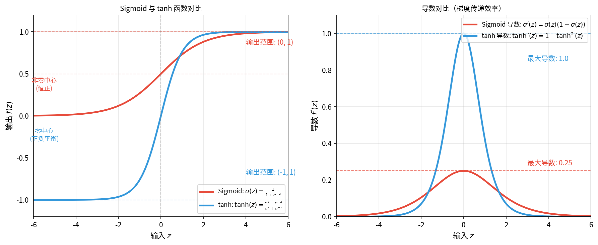

# 激活函数与损失函数

在[反向传播](backpropagation.md)中，我们完整推导了梯度传递的核心公式 $\delta^l = (\mathbf{W}^{l+1})^T \delta^{l+1} \cdot f'(\mathbf{z}^l)$，其中 $f'(\mathbf{z}^l)$ 是激活函数的导数。这个导数决定了梯度在传递过程中的衰减或放大程度，直接影响深层网络的训练效果。另一方面，反向传播的核心是计算损失函数对参数的梯度，损失函数本身的选择和设计同样直接影响训练效果。这两个问题指向神经网络设计的两个核心组件：**激活函数**（Activation Functions）和**激活函数**（Loss Functions），激活函数为神经网络引入非线性，使网络能够学习复杂的函数关系；损失函数定义了神经网络优化的目标，衡量预测值与真实值之间的差距，引导参数更新方向。选择合适的激活函数和损失函数，是神经网络设计的两个关键决策，直接决定训练效率、收敛速度和最终性能。

本章将介绍常用激活函数和损失函数的特性、梯度特性及其对训练的影响，探讨选择策略，并通过代码实验直观展示不同函数的表现差异。

### 梯度消失与梯度爆炸

**梯度消失**（Vanishing Gradient）是指反向传播中梯度逐层衰减，传递到网络前面几层时已经十分接近 $0$，参数几乎不再更新。梯度消失是长期困扰深层网络训练的顽疾。不妨设想如下场景：你要从第 10 层向第 1 层传递一条信息，如果信息有衰减，譬如每经过一层消息内容被压缩（乘以小于 1 的因子）$50\%$，那经过 10 层后，消息就只剩 $0.5^{10} \approx 0.001$，信息几乎消失殆尽。在梯度传递公式 $\delta^l = (\mathbf{W}^{l+1})^T \delta^{l+1} \cdot f'(\mathbf{z}^l)$ 里，激活函数的导数 $f'(\mathbf{z}^l)$ 就是那个压缩因子，误差信号 $\delta$ 就是那封信件，误差信号越往前端传递就变得越小，这便是梯度消失。

导致梯度消失的原因主要有两个，一是权重初始化不当，权重初始值太小，导致激活值进入导数小的区域（如 Sigmoid 的两端），梯度就更小，这点可以通过选择正确的权重初始化方法（如 He 初始化、Xavier 初始化）来解决。二是激活函数导数的最大值小于 1，譬如反向传播的[练习题](backpropagation.md#练习题)部分推导过 Sigmoid 导数最大值为 $0.25$，每经过一层，误差信号乘以一个必定小于 1 的导数的话，层数稍多梯度就要消失。

一旦出现梯度消失，权重变化就变得极小，深层网络的前面几层参数几乎不更新，训练过程收敛极慢或停滞。同时由于前面几层没有学到有效特征，测试集的表现通常也不好。拿个具体例子来看，设 10 层网络，每层使用 Sigmoid 激活函数，导数都取恰好为最大值 $0.25$（理想情况），则梯度保留比例 $ = (0.25)^{10} \approx 0.00000095$。经过 10 层，梯度保留比例约为 $0.000001$（百万分之一），前面几层梯度几乎为 $0$。实际情况会比这更糟，因为 Sigmoid 函数的导数只会小于 $0.25$。

既然梯度消失是由于连续与一个小于 1 的导数相乘而导致的，那我们选择一些导数值总是大于 1 的激活函数能解决问题吗？遗憾的是这会触发另一个问题：**梯度爆炸**（Exploding Gradient），它是指反向传播中梯度逐层放大，前面几层梯度极大，参数更新幅度过大，训练变得极不稳定。

梯度爆炸的成因一是权重初始化时就太大，导致梯度在传递过程中过度放大（$\delta^l = (\mathbf{W}^{l+1})^T \delta^{l+1}$，权重大则梯度放大），另外一个根本原因就是激活函数导数长期大于 1，连续相乘会导致参数更新幅度越来越大，损失剧烈波动，模型无法收敛，甚至导致数值溢出。相对梯度消失而言，梯度爆炸更容易发现和诊断（损失剧烈波动），但是也更危险，可能导致训练完全崩溃。

梯度消失与梯度爆炸问题其实是训练效率与训练效果的权衡，它们很难在绝对意义上被根治（指不付出额外的代价，又能彻底解决梯度消失的问题），但是有许多工程上可行的缓解策略，这些方法将在后续章节详细展开，包括有：

1. **使用恰当的激活函数**：如 ReLU 系列激活函数，正数区域导数恒定为 $1$，避免梯度衰减和爆炸。这是最直接的解决方案，直接改变了深度学习的格局。
2. **使用恰当的权重初始化**：
   - He 初始化（配合 ReLU）：$W \sim N(0, \sqrt{2/n})$，由中国计算机科学家何凯明在 2015 年提出，专门为 ReLU 设计。
   - Xavier 初始化（配合 tanh）：$W \sim N(0, \sqrt{1/n})$，由泽维尔·格洛罗（Xavier Glorot）在 2010 年提出。
3. **批归一化**（Batch Normalization）：稳定激活值分布，避免进入导数小的区域。由谢尔盖·约费（Sergey Ioffe）和克里斯蒂安·塞格迪（Christian Szegedy）在 2015 年提出，目前已成为深度网络标配。
4. **残差连接**（Residual Connection）：提供梯度旁路传递路径，即使某层梯度消失，梯度仍可通过旁路传递。由何凯明等人在 2015 年提出（ResNet），解决了数百层网络的训练问题。
5. **梯度裁剪**（Gradient Clipping）：限制梯度范数，防止爆炸。设定阈值 $\theta$，若梯度范数超过阈值，将梯度缩放到阈值范围内。

## 激活函数

在构建神经网络时，一个[基础认知]()是如果网络全部使用线性变换（$y = Wx + b$），无论叠加多少层，最终仍是线性模型。线性模型的表达能力有限，无法处理图像识别、语音处理等复杂非线性问题，非线性的激活函数打破这一约束，赋予网络更强大的表达能力。激活函数本身也是一个逐渐发展的过程，从早期我们已经在线性回归中学习过的的 [Sigmoid 函数](../../statistical-learning/linear-models/logistic-regression.md#sigmoid-函数)到现代机器学习中广泛流行的 ReLU 系列，激活函数的发展历程见证了深度学习从理论困境走向实践成功的关键转折，本章我们将系统性地介绍和对比目前常见的几种激活函数。

### 双曲正切函数

**双曲正切函数**（Hyperbolic Tangent，通常简称 tanh 函数）是 Sigmoid 的改进版本。双曲函数族（sinh、cosh、tanh）在数学中历史悠久，但将其作为神经网络激活函数使用，主要是在 1990 年代后被杰弗里·辛顿等学者推广的结果。辛顿在多层神经网络的早期研究中发现零中心输出的激活函数能显著改善训练效率，tanh 从此代替 Sigmoid 成为隐藏层的标准选择。零中心输出指激活函数的输出值以 0 为中心对称分布，正负样本数量大致平衡（如 tanh 输出范围 $(-1, 1)$）。相比之下，Sigmoid 的输出恒为正（$(0, 1)$），属于非零中心输出。

用一个生活场景来解释为何为零中心输出的函数在神经网络中更具优势：假设你在调整房间空调温度，目标温度是 $25°C$。但如果空调只能在 $30-40°C$ 范围内调节（类似 Sigmoid 输出恒正），你能传递给网络训练的信息就只能一直是"天气太热了"，网络不知道具体应该降温多少，训练呈锯齿震荡。如果空调的温度范围是 $-10°C$ 到 $50°C$（类似 tanh 输出正负平衡），就可以精确给出当前温度与目标的差距，调整自然更平稳高效。



*图：Sigmoid 与 tanh 函数和导数图像对比*

数学上，tanh 是 Sigmoid 的线性变换版本，将 Sigmoid 放大输入（$2z$），平移输出到零中心（$-1$），就得到了 tanh，两者的函数图像如上图所示。tanh 函数的数学表达式为：

$$\tanh(z) = \frac{e^z - e^{-z}}{e^z + e^{-z}} = \frac{e^{2z} - 1}{e^{2z} + 1}$$

tanh 的分子部分类似"正负差"，反映输入 $z$ 的偏向性，分母部分类似"总和"，保证分母为正。整体公式将任意实数 $z$ 映射到 $(-1, 1)$ 区间：$z \to +\infty$ 时 $\tanh(z) \to 1$，$z \to -\infty$ 时 $\tanh(z) \to -1$，$z = 0$ 时 $\tanh(0) = 0$

tanh 函数的导数 $\tanh'(z) = 1 - \tanh^2(z)$，导数最大值为 $1$（当 $\tanh(z) = 0$ 时），比 Sigmoid 的 $0.25$ 大四倍。这意味着梯度传递更有效率。但 tanh 函数只是稍微缓解而非根治了梯度消失问题，$z$ 很大或很小时，导数同样趋近于 $0$，梯度消失问题仍然存在。Sigmoid 函数 与 tanh 函数的对比如下表所示： 

| 特性 | Sigmoid | tanh |
|:-----|:--------|:-----|
| 输出范围 | $(0, 1)$ | $(-1, 1)$ |
| 输出中心 | 非零中心（恒正） | 零中心（正负平衡） |
| 导数最大值 | $0.25$ | $1$ |
| 梯度消失 | 严重（两端导数趋近 0） | 存在（两端导数趋近 0） |
| 适用位置 | 输出层（二分类） | 隐藏层（浅层网络） |

### ReLU 及其变体

传统的 Sigmoid 函数和它的改进 tanh 函数都没有能解决梯度消失问题，以至于深层网络前几层梯度几乎消失，参数难以更新。这个问题困扰了神经网络研究多年，直到一个极度简单的设计出现改变了局面。这个简单到甚至有些粗暴的设计是让函数正数区域导数恒为 1，负数区域输出为 0。想法来自 2011 年，由美国计算机科学家泽维尔·格洛罗（Xavier Glorot，当时在蒙特利尔大学、图灵奖得主约书亚·本吉奥的实验室）在论文《Deep Sparse Rectifier Neural Networks》中提出。他发现这种被称为 ReLU 的激活函数能显著改善深层网络训练效率，进而显著提升网络达到更高深度的可行性，为深度学习爆发奠定了基础。

**ReLU 函数**（Rectified Linear Unit，修正线性单元）是深度学习时代最流行的激活函数，它的表达式与传统的 Sigmoid 、tanh 等充斥指数运算的函数相比，显得有些格格不入，它的函数与导数为：

$$\text{ReLU}(z) = \max(0, z) = \begin{cases} z & z > 0 \\ 0 & z \leq 0 \end{cases}，\text{ReLU}'(z) = \begin{cases} 1 & z > 0 \\ 0 & z \leq 0 \end{cases}$$

ReLU 设计的极其简单，正数就保持不变，负数就置零，在零点的左右导数甚至都不相等。谁能想到这个看似简陋的规则，居然一举解决了困扰神经网络多年的梯度消失问题，深度学习在 2012 年后的爆发后的成名作品 AlexNet、VGG、ResNet 等均使用 ReLU。如果把 Sigmoid 和 ReLU 想象成两根水管的话，Sigmoid 的管道逐渐变窄（导数衰减），水流越来越慢，最终几乎静止；ReLU 的管道在负数区域关闭阀门，在正数区域保持通畅（导数为 1），既不会变窄让水流减速，也不会边宽酿成洪水（梯度爆炸），深层网络前面几层也能获得足够的水压。

ReLU 的优势除了梯度完整传递，不会被衰减，使得深层网络训练变得可行外，它还有着计算高效（$\max(0,z)$ 只需一次比较，比指数运算快得多），同时因为正数区域是线性的，收敛更快。在 GPU 上，ReLU 的计算速度比 Sigmoid 快约 6 倍；内存开销也更低（负数部分都清零了），也间接让网络呈现稀疏状态，达成一定的自动特征选择的效果（因为不活跃的神经元对应不重要的特征）。

然而，世界上没有免费的午餐，伴随 ReLU 出现的致命问题是**神经元死亡**（Dead ReLU）。当输入为负（$z \leq 0$）时，输出恒为 $0$，导数恒为 $0$。梯度无法传递，权重永远不更新，这个神经元就相当于死亡了，网络有效容量降低。

导致神经元死亡的常见原因有如下几种，一是初始化不当，权重初始值太小，导致大量神经元一开始处于负数区域，刚刚开局就死亡了。其次是学习率过大，参数更新幅度过大，神经元冲过激活区域后死亡。譬如一个神经元原本 $z = 0.1$（激活状态），一次大幅更新后 $z = -5$（死亡状态），梯度为 $0$，后面不再有更新机会复活了。最后还有数据分布的影响，输入数据偏移，导致原本激活的神经元进入负数区域。实践中，约 10-20% 的神经元死亡是正常的，但如果超过 50%，就需要检查初始化或学习率。

针对 ReLU 的神经元死亡问题，学界给出的改进方案是负数区域不再完全置零，而是保持一个小的斜率，让梯度仍能传递。**Leaky ReLU**（泄漏 ReLU）由法国计算机科学家安德鲁·L·马斯（Andrew L. Maas）等人在 2013 年提出，它的函数和导数为：

$$\text{LeakyReLU}(z) = \max(\alpha z, z) = \begin{cases} z & z > 0 \\ \alpha z & z \leq 0 \end{cases}，\text{LeakyReLU}'(z) = \begin{cases} 1 & z > 0 \\ \alpha & z \leq 0 \end{cases}$$

其中 $\alpha$ 是小正数（通常 $0.01$）。如果说 ReLU 的负数区域像水管里面紧闭的阀门，水流完全堵住；Leaky ReLU 的负数区域像一扇留了一点缝隙的阀门，水流变小（$\alpha = 0.01$ 时水流为 $1\%$），但仍能通过。这意味着神经元即使进入负数区域，梯度仍能传递，虽然传不了多远就会梯度消失，但起码还有机会复活。实践中，Leaky ReLU 在某些任务上比 ReLU 表现略好，尤其是在初始化不当或学习率较大的情况下。

德国计算机科学家德约克-阿内·克莱弗特（Djork-Arné Clevert）等人在 2015 年提出**ELU 函数**（Exponential Linear Unit，指数线性单元），进一步改进负数区域的处理，它的函数与导数为：

$$\text{ELU}(z) = \begin{cases} z & z > 0 \\ \alpha(e^z - 1) & z \leq 0 \end{cases}，\text{ELU}'(z) = \begin{cases} 1 & z > 0 \\ \alpha e^z & z \leq 0 \end{cases}$$

其中 $\alpha$ 是超参数（通常 $1.0$）。ELU 针对 ReLU 和 Leaky ReLU 在 $z = 0$ 处存在的折角（从 $0$ 突变到 $z$ 和 从 $\alpha z$ 突变到 $z$）进行了修补，折角可能影响优化平滑性。ELU 在负数区域使用指数函数 $e^z - 1$ 平滑过渡，避免折角，有利于下一层输入分布平衡（类似 tanh 的零中心优势）

同样在 2015 年，何凯明（2015 年在微软亚洲研究院，现为 FAIR 研究员）提出 **PReLU 函数**（Parametric ReLU，参数化 ReLU），将 Leaky ReLU 的斜率参数化，它的函数与导数是：

$$\text{PReLU}(z) = \begin{cases} z & z > 0 \\ \alpha_i z & z \leq 0 \end{cases}，\text{LeakyReLU}'(z) = \begin{cases} 1 & z > 0 \\ \alpha_i & z \leq 0 \end{cases}$$

其中 $\alpha_i$ 不再是人为设置的超参数，而是网络可学习的参数，每个神经元有独立的斜率。何凯明等人在 ResNet（深度残差网络，2015 年 ImageNet 冠军）中使用 PReLU，发现斜率通过反向传播学习，自动适应数据分布，比固定斜率更灵活。实验显示，PReLU 在 ImageNet 分类任务上比 ReLU 提升约 1% 的准确率（不要被 1% 数字误导，当年 ImageNet 分类任务冠军的错误率才 3.57%，准确率提升 1% 是一个巨大的进步）。

实践中，今天 ReLU 仍是深度网络的常用的选择，简单高效，效果良好，其他 ReLU 系列激活函数也可以按需选用，如果担心神经元死亡，使用 Leaky ReLU（$\alpha = 0.01$）；如果追求零中心输出，使用 ELU；如果愿意增加参数量，使用 PReLU。其他随着大语言模型兴起的激活函数如 Swish（2017年 Google 提出，$\text{Swish}(z) = z \cdot \sigma(z)$）和 GELU（Transformer/BERT/GPT 系列模型广泛使用），本章暂未涉及，它们将在大语言模型的部分讨论。本节提到的 ReLU 系列激活函数各项特征对比如下表所示：

| 特性 | ReLU | Leaky ReLU | ELU | PReLU |
|:-----|:-----|:-----------|:----|:------|
| 正数区域 | $z$ | $z$ | $z$ | $z$ |
| 负数区域 | $0$ | $\alpha z$ | $\alpha(e^z-1)$ | $\alpha_i z$ |
| 导数（正数） | $1$ | $1$ | $1$ | $1$ |
| 导数（负数） | $0$ | $\alpha$ | $\alpha e^z$ | $\alpha_i$ |
| 神经元死亡 | 有风险 | 避免 | 避免 | 避免 |
| 计算成本 | 低 | 低 | 中（指数） | 低 |
| 参数 | 无 | 固定 $\alpha$ | 固定 $\alpha$ | 可学习 $\alpha_i$ |

### 激活函数选择策略

前面介绍了 tanh 和 ReLU 系的激活函数，在加上之前我们已经接触过的 [Sigmoid](../../statistical-learning/linear-models/logistic-regression.md#sigmoid-函数) 和 [Softmax](../../statistical-learning/linear-models/logistic-regression.md#多项逻辑回归)，它们各有优缺点，下表给出实践中激活函数的选择策略，主要基于两个维度：网络位置（隐藏层或输出层）和任务类型（分类或回归）。

| 场景 | 推荐激活函数 | 原因 |
|:-----|:------------|:-----|
| 隐藏层（深度网络） | ReLU / Leaky ReLU | 缓解梯度消失，计算高效 |
| 隐藏层（浅层网络） | tanh / ReLU | 浅层网络梯度消失问题不严重 |
| 输出层（二分类） | Sigmoid | 输出概率，符合二分类语义 |
| 输出层（多分类） | Softmax | 输出概率分布，符合多分类语义 |
| 输出层（回归） | Linear（无激活） | 输出无范围限制 |

### 激活函数实践

前面的理论分析反复强调：Sigmoid 存在严重的梯度消失问题，ReLU 能缓解梯度消失但可能导致神经元死亡。本节通过代码实验验证，构建一个 10 层深度网络，每层 64 个神经元，使用相同输入和输出梯度，对比 Sigmoid、tanh、ReLU、Leaky ReLU 在梯度传递和神经元激活方面的表现。同时统计各层激活值为零的比例（ReLU 神经元死亡的指标）。

```python runnable
import numpy as np
import matplotlib.pyplot as plt

class DeepNetwork:
    """
    深层神经网络，用于演示激活函数的影响
    """
    def __init__(self, n_layers, n_neurons, activation='relu'):
        self.n_layers = n_layers
        self.n_neurons = n_neurons
        self.activation = activation
        
        # 初始化权重
        np.random.seed(42)
        self.weights = []
        self.biases = []
        
        # 根据激活函数选择初始化策略
        if activation in ['relu', 'leaky_relu']:
            scale_factor = np.sqrt(2.0)  # He初始化
        else:
            scale_factor = np.sqrt(1.0)  # Xavier初始化
        
        for i in range(n_layers):
            w = np.random.randn(n_neurons, n_neurons) * scale_factor / np.sqrt(n_neurons)
            b = np.zeros((n_neurons, 1))
            self.weights.append(w)
            self.biases.append(b)
    
    def _apply_activation(self, Z):
        """应用激活函数"""
        if self.activation == 'sigmoid':
            Z = np.clip(Z, -500, 500)
            return 1 / (1 + np.exp(-Z))
        elif self.activation == 'tanh':
            return np.tanh(Z)
        elif self.activation == 'relu':
            return np.maximum(0, Z)
        elif self.activation == 'leaky_relu':
            return np.where(Z > 0, Z, 0.01 * Z)
        elif self.activation == 'linear':
            return Z
        else:
            raise ValueError(f"Unknown activation: {self.activation}")
    
    def _activation_derivative(self, Z, A):
        """计算激活函数导数"""
        if self.activation == 'sigmoid':
            return A * (1 - A)
        elif self.activation == 'tanh':
            return 1 - A ** 2
        elif self.activation == 'relu':
            return (Z > 0).astype(float)
        elif self.activation == 'leaky_relu':
            return np.where(Z > 0, 1.0, 0.01)
        elif self.activation == 'linear':
            return np.ones_like(Z)
        else:
            raise ValueError(f"Derivative not implemented for: {self.activation}")
    
    def forward(self, X):
        """前向传播，存储中间结果"""
        self.activations = [X]
        self.pre_activations = []
        
        A = X
        for i in range(self.n_layers):
            Z = self.weights[i] @ A + self.biases[i]
            self.pre_activations.append(Z)
            A = self._apply_activation(Z)
            self.activations.append(A)
        
        return A
    
    def backward(self, grad_output):
        """反向传播，返回各层梯度范数"""
        gradient_norms = []
        delta = grad_output
        
        for i in range(self.n_layers - 1, -1, -1):
            # 计算当前层的梯度范数
            grad_norm = np.linalg.norm(delta)
            gradient_norms.append(grad_norm)
            
            # 传递到上一层
            if i > 0:
                delta = self.weights[i].T @ delta
                delta = delta * self._activation_derivative(
                    self.pre_activations[i-1], 
                    self.activations[i]
                )
        
        return gradient_norms[::-1]  # 反转，使顺序从前向后


# 实验：不同激活函数在深层网络中的梯度传递
print("=" * 60)
print("实验：激活函数对梯度传递的影响")
print("=" * 60)
print()

# 创建10层深度网络
n_layers = 10
n_neurons = 64

activations = ['sigmoid', 'tanh', 'relu', 'leaky_relu']
activation_colors = ['#e74c3c', '#3498db', '#2ecc71', '#f39c12']
activation_labels = ['Sigmoid', 'tanh', 'ReLU', 'Leaky ReLU']

# 生成输入和输出梯度
X = np.random.randn(n_neurons, 100)  # 100个样本
grad_output = np.random.randn(n_neurons, 100)  # 输出层梯度

# 测试各激活函数
all_gradient_norms = []

for activation in activations:
    network = DeepNetwork(n_layers, n_neurons, activation)
    network.forward(X)
    gradient_norms = network.backward(grad_output)
    all_gradient_norms.append(gradient_norms)
    
    # 显示完整梯度信息（注意：反向传播从输出层往输入层传递）
    print(f"{activation:12s}: 反向传播梯度范数变化")
    print(f"  输出层起点: {gradient_norms[-1]:.6f}")
    print(f"  传至中间层: {gradient_norms[4]:.6f}")
    print(f"  传至输入层: {gradient_norms[0]:.6f}")
    print(f"  梯度保留比例: {gradient_norms[0]/gradient_norms[-1]:.6f} (越小说明梯度消失越严重)")
    print()

print()

# 可视化
fig, axes = plt.subplots(1, 2, figsize=(14, 6))

# 图1：梯度范数随层数变化（对数刻度）
ax1 = axes[0]
for i, (grads, color, label) in enumerate(zip(all_gradient_norms, activation_colors, activation_labels)):
    ax1.semilogy(range(1, n_layers + 1), grads, 'o-', color=color, 
                 linewidth=2, markersize=6, label=label)

ax1.set_xlabel('层索引（从输入层到输出层）', fontsize=11)
ax1.set_ylabel('梯度范数（对数刻度）', fontsize=11)
ax1.set_title('梯度传递：不同激活函数对比', fontsize=12, fontweight='bold')
ax1.legend(loc='upper right')
ax1.grid(True, alpha=0.3)

# 图2：激活值分布对比
ax2 = axes[1]

# 重新运行前向传播，收集激活值统计
activation_stats = []
for activation in activations:
    network = DeepNetwork(n_layers, n_neurons, activation)
    network.forward(X)
    
    # 统计各层激活值：零值比例（对于ReLU系列）、均值、标准差
    zero_ratios = []
    means = []
    stds = []
    
    for i, A in enumerate(network.activations[1:]):  # 跳过输入层
        if activation == 'relu':
            # ReLU: 统计精确为零的比例（神经元死亡）
            zero_ratio = np.mean(A == 0)
            zero_ratios.append(zero_ratio)
        elif activation == 'leaky_relu':
            # Leaky ReLU: 统计负值区域比例（被抑制但未完全死亡）
            Z = network.pre_activations[i]
            zero_ratio = np.mean(Z <= 0)  # Z <= 0 表示进入负值区域
            zero_ratios.append(zero_ratio)
        means.append(np.mean(A))
        stds.append(np.std(A))
    
    activation_stats.append({
        'activation': activation,
        'zero_ratios': zero_ratios,
        'means': means,
        'stds': stds
    })

# 绘制ReLU的零值比例（神经元死亡指标）
relu_stats = activation_stats[2]  # ReLU
leaky_relu_stats = activation_stats[3]  # Leaky ReLU

# 使用并列条形图，避免覆盖
x_positions = np.arange(1, n_layers + 1)
bar_width = 0.35

ax2.bar(x_positions - bar_width/2, relu_stats['zero_ratios'], 
        width=bar_width, color='#2ecc71', alpha=0.7, label='ReLU 零值比例')
ax2.bar(x_positions + bar_width/2, leaky_relu_stats['zero_ratios'], 
        width=bar_width, color='#f39c12', alpha=0.7, label='Leaky ReLU 负值区域比例')

ax2.set_xlabel('层索引', fontsize=11)
ax2.set_ylabel('零值比例（神经元"死亡"指标）', fontsize=11)
ax2.set_title('ReLU vs Leaky ReLU：神经元激活稀疏性', fontsize=12, fontweight='bold')
ax2.legend(loc='upper right')
ax2.grid(True, alpha=0.3, axis='y')

plt.tight_layout()
plt.show()
plt.close()
```

## 损失函数

激活函数决定网络的非线性表达能力，损失函数则决定网络的优化目标。如果把训练神经网络比作一场越野行军，激活函数是路线上的弯道，决定能否到达复杂目的地，损失函数则是目的导航，决定往哪里行进。损失函数衡量预测值与真实值之间的差距，引导参数更新方向，不同的任务类型（回归、分类）需要不同的损失函数，在前面学习线性回归时，引入过最小二乘法和[均方误差](../../statistical-learning/linear-models/linear-regression.md#最小二乘准则)，在逻辑回归中，又引入了[交叉熵损失](../../statistical-learning/linear-models/logistic-regression.md#交叉熵损失)，还有支持向量机里的 Hinge 损失。本节我们会系统性地总结对比这些常见的损失函数，并分析它们的选择策略与使用场景。

### 回归损失

回归问题的目标是预测连续数值，如房价预测、温度预测、销量预测等。度量连续值的损失，最直接的想法是计算预测值与真实值的差距，差距越大惩罚越重。**均方误差**（Mean Squared Error, MSE）采用这一思路，将差距平方后求平均：

$$L_{MSE} = \frac{1}{m} \sum_{i=1}^{m} (y_i - \hat{y}_i)^2$$

其中 $y_i$ 是真实值，$\hat{y}_i$ 是预测值。平方有两个作用，一是保证结果为正，二是放大误差的影响，误差翻倍，惩罚翻四倍。MSE 的数学性质良好，是凸函数，梯度下降可收敛到全局最优，没有局部极小值陷阱。梯度 $L' = 2(\hat{y} - y)$ 与误差成正比，大误差时梯度大（参数快速纠正），小误差时梯度小（精细调整）。放大惩罚的特性一方面令 MSE 对大误差敏感，能快速纠正明显错误，但另一方面，少数极端异常值会主导整个损失函数，导致模型容易迁就异常值，偏离大多数正常数据的规律。

如果数据中存在一定的异常值数据，那使用**平均绝对误差**（Mean Absolute Error, MAE）会是一个替代选择，它的数学表达为：

$$L_{MAE} = \frac{1}{m} \sum_{i=1}^{m} |y_i - \hat{y}_i|$$

MAE 用绝对值而非平方，误差 10 的惩罚仅仅是误差 1 的 10 倍（线性），而 MSE 中误差 10 的惩罚是误差 1 的 100 倍（平方），这样异常值在 MAE 中影响相对有限。MAE 的梯度恒定为 $\pm 1$（取决于误差方向），不随误差大小变化，会带来一个副作用，小误差时梯度仍然较大，可能导致收敛震荡，不像 MSE 在小误差时梯度自动减小，平稳收敛。此外，MAE 在 $y = \hat{y}$ 处不可导（梯度从 $-1$ 突变到 $+1$），优化需要使用次梯度处理。

MSE 对异常值敏感，MAE 在零点不可导，结合两者优点，瑞士统计学家彼得·胡贝尔（Peter Huber）在 1964 年提出 **Huber 损失**，在小误差区域使用 MSE（平滑、梯度递减），在大误差区域使用 MAE（线性、鲁棒），它的数学表达是：

$$L_{Huber} = \begin{cases} \frac{1}{2}(y - \hat{y})^2 & |y - \hat{y}| \leq \delta \\ \delta|y - \hat{y}| - \frac{1}{2}\delta^2 & |y - \hat{y}| > \delta \end{cases}$$

其中 $\delta$ 是阈值参数（通常 $1.0$）。两段函数在 $|y - \hat{y}| = \delta$ 处平滑过渡（函数值相等、导数相等），处处可导，对优化过程友好。

三种回归损失函数的特性对比如下表所示，实践中，数据干净无异常值时首选 MSE；数据有异常值时选择 MAE 或 Huber 损失；追求平衡时 Huber 损失是最稳妥的选择。

| 特性 | MSE | MAE | Huber |
|:-----|:----|:----|:-----------|
| 惩罚方式 | 二次（平方） | 纯线性 | 小误差二次，大误差线性 |
| 异常值敏感度 | 高（敏感） | 低（鲁棒） | 中（平衡） |
| 梯度变化 | 与误差成正比 | 恒定 $\pm 1$ | 小误差递减，大误差恒定 |
| 优化难度 | 易（凸函数） | 中（零点不可导） | 易（处处可导） |


### 分类损失

回归问题预测数值，分类问题预测类别。类别是离散的信息（如"猫、狗、鸟"），需要专门的损失函数**交叉熵损失**（Cross-Entropy Loss）。它以信息论中概率越小的事件发生时信息量越大的观点为基础，度量两个概率分布之间的差异，数学表达为（具体见[逻辑回归](../../statistical-learning/linear-models/logistic-regression.md#交叉熵损失)中的推导）：

$$H(P, Q) = -\sum_x P(x) \log Q(x)$$

其中 $P(x)$ 是事件概率，$I(x)$ 是信息量（以比特为单位）。熵是所有可能事件信息量的期望，度量分布的不确定性：分布越均匀（所有概率接近），熵越大；分布越集中（某一概率接近 1），熵越小。其中 $P$ 是真实分布，$Q$ 是预测分布。当 $P = Q$（预测完全正确），交叉熵等于熵 $H(P)$ 达到最小值；预测越偏离真实分布，交叉熵越大。在机器学习中，真实分布 $P$ 由训练数据给定（通常是 One-Hot 编码），预测分布 $Q$ 由模型输出（Softmax 或 Sigmoid），训练目标就是最小化交叉熵，使预测分布逼近真实分布。

二分类问题只有两个类别（如"是否为垃圾邮件"），输出一个概率值 $\hat{y} \in (0,1)$（通常由 Sigmoid 输出）。这种情况下通常采用**二分类交叉熵损失**（Binary Cross-Entropy Loss，简称 BCE）：

$$L_{BCE} = -\frac{1}{m} \sum_{i=1}^{m} [y_i \log \hat{y}_i + (1-y_i) \log(1-\hat{y}_i)]$$

其中 $y_i \in \{0, 1\}$ 是真实标签，$\hat{y}_i \in (0, 1)$ 是预测概率。公式的 $y_i \log \hat{y}_i$ 当 $y_i = 1$（正类）时有效，预测越接近 1，$-\log \hat{y}_i$ 越小；$(1-y_i) \log(1-\hat{y}_i)$ 当 $y_i = 0$（负类）时有效，预测越接近 0，损失越小。两项加权求和，形成类似开关的机制，自动选择对应类别的惩罚项。举个具体数值例子，预测正确时（如 $y=1$，$\hat{y}=0.9$），损失约 $0.105$；预测错误时（如 $y=1$，$\hat{y}=0.1$），损失约 $2.303$。错误惩罚约 20 倍，这正是函数期望的行为，严厉惩罚明显错误，温和奖励正确预测。

多分类问题有多个类别（如手写数字识别 0-9 共 10 类），输出多个概率值（Softmax 输出概率分布），这时候通常采用**多分类交叉熵损失**（Categorical Cross-Entropy Loss，简称 CE）：

$$L_{CE} = -\frac{1}{m} \sum_{i=1}^{m} \sum_{k=1}^{K} y_{ik} \log \hat{y}_{ik}$$

其中 $y_{ik}$ 是真实标签的 One-Hot 编码（只有真实类别 $y_{ik} = 1$），$\hat{y}_{ik}$ 是预测概率。由于 One-Hot 编码中只有一个 $y_{ik} = 1$，公式简化为：

$$L_{CE} = -\frac{1}{m} \sum_{i=1}^{m} \log \hat{y}_{ic}$$

即损失等于真实类别预测概率的负对数。预测真实类别的概率越高，损失越低。用考试类比，多分类交叉熵像一道选择题，答对（选择正确类别）得分高（损失低），答错（选择错误类别）得分低（损失高），部分正确（选择正确类别但置信度低）得分中等。这与 MSE 将类别编号当作数值的做法完全不同，后者会把"选择类别 3"和"选择类别 5"的距离当作数值差距（差值为 2），语义模糊且不合理。

### Hinge 损失

前面介绍的损失函数用于神经网络训练。本节介绍一种用于支持向量机的损失函数 —— **Hinge 损失**，它体现了[最大间隔原则](../../statistical-learning/support-vector-machines/svm-max-margin.md#支持向量)的优化思想。支持向量机的核心思想是寻找最大间隔分类边界，不仅要求分类正确，还要求分类边界与两类样本保持足够距离，提高泛化能力。Hinge 损失（直译过来是合页损失，得名于形状像门铰链）体现这一思想：

$$L_{Hinge} = \max(0, 1 - y \cdot \hat{y})$$

其中 $y \in \{-1, 1\}$ 是真实标签（注意 SVM 使用 $\{-1, 1\}$ 编码而非 $\{0, 1\}$），$\hat{y}$ 是预测值。公式的 $y \cdot \hat{y}$ 是标签与预测的乘积，预测正确且同号时乘积为正；$1 - y \cdot \hat{y}$ 要求 $y \cdot \hat{y} \geq 1$（不仅是分类正确，还要置信度足够）；$\max(0, \cdot)$ 保证损失非负。照例用具体数值验证一下，当 $y=1$，$\hat{y}=2.0$ 时，$y \cdot \hat{y} = 2.0 \geq 1$，损失为 0；当 $y=1$，$\hat{y}=0.5$ 时，$y \cdot \hat{y} = 0.5 < 1$，损失为 $0.5$。只有当预测正确且置信度足够，损失才为零；否则产生损失，这体现了函数鼓励模型学习更大的分类间隔。

神经网络中很少直接使用 Hinge 损失，因为 Cross-Entropy 的梯度特性更适合梯度下降优化。但 Hinge 损失的最大间隔思想影响了神经网络的设计，衍生出如 Large Margin Softmax Loss、Triplet Loss 等损失函数，在人脸识别、度量学习等领域有应用。

### 损失函数选择策略

前面总结了回归损失（MSE、MAE、Huber）和分类损失（Cross-Entropy、Hinge），下表基于任务类型和数据特征，给出选择策略：

| 任务类型 | 推荐损失函数 | 输出层激活 | 选择原因 |
|:---------|:-----------|:----------|:---------|
| 回归（无异常值） | MSE | Linear | 数据干净，MSE 收敛快 |
| 回归（有异常值） | MAE / Huber | Linear | 异常值鲁棒，不过度迁就 |
| 二分类 | Binary Cross-Entropy | Sigmoid | 梯度计算高效，避免消失 |
| 多分类 | Categorical Cross-Entropy | Softmax | 梯度计算高效，概率语义清晰 |
| 多标签分类 | Binary Cross-Entropy（每类） | Sigmoid | 每个标签独立二分类 |

### 损失函数实践

前面的理论分析得出了各类损失函数的特点：MSE 对异常值敏感，MAE 对异常值鲁棒，Cross-Entropy 比 MSE 更适合分类。本节通过代码实验验证，对比不同损失函数在回归和分类任务中的表现。

- 实验一：对比 MSE、MAE、Huber Loss 对异常值的不同表现。MSE 对异常值敏感，拟合线应该偏离理想线，MAE 对异常值鲁棒，拟合线接近理想线，Huber Loss 平衡两者，效果适中。

    ```python runnable
    import numpy as np
    import matplotlib.pyplot as plt

    # 生成回归数据（包含异常值）
    n_samples = 50

    # 正常数据
    X_normal = np.linspace(0, 10, n_samples)
    y_normal = 2 * X_normal + 1 + np.random.randn(n_samples) * 0.5

    # 添加几个异常值
    n_outliers = 5
    outlier_indices = np.random.choice(n_samples, n_outliers, replace=False)
    y_normal[outlier_indices] += np.random.randn(n_outliers) * 15  # 大偏差

    X = X_normal
    y_true = y_normal

    # 定义损失函数
    def mse_loss(y_pred, y_true):
        return np.mean((y_pred - y_true) ** 2)

    def mae_loss(y_pred, y_true):
        return np.mean(np.abs(y_pred - y_true))

    def huber_loss(y_pred, y_true, delta=1.0):
        diff = np.abs(y_pred - y_true)
        return np.mean(np.where(diff <= delta, 
                                0.5 * diff ** 2, 
                                delta * diff - 0.5 * delta ** 2))

    # 简单线性回归（使用梯度下降）
    class LinearRegression:
        def __init__(self, loss_type='mse', learning_rate=0.01, n_iterations=1000, delta=1.0):
            self.loss_type = loss_type
            self.lr = learning_rate
            self.n_iter = n_iterations
            self.delta = delta
            self.w = None
            self.b = None
            self.loss_history = []
        
        def fit(self, X, y):
            # 初始化参数
            self.w = 0.0
            self.b = 0.0
            
            for i in range(self.n_iter):
                # 预测
                y_pred = self.w * X + self.b
                
                # 计算损失
                if self.loss_type == 'mse':
                    loss = mse_loss(y_pred, y)
                elif self.loss_type == 'mae':
                    loss = mae_loss(y_pred, y)
                elif self.loss_type == 'huber':
                    loss = huber_loss(y_pred, y, self.delta)
                
                self.loss_history.append(loss)
                
                # 计算梯度
                if self.loss_type == 'mse':
                    dw = 2 * np.mean((y_pred - y) * X)
                    db = 2 * np.mean(y_pred - y)
                elif self.loss_type == 'mae':
                    dw = np.mean(np.sign(y_pred - y) * X)
                    db = np.mean(np.sign(y_pred - y))
                elif self.loss_type == 'huber':
                    diff = y_pred - y
                    indicator = np.where(np.abs(diff) <= self.delta, diff, self.delta * np.sign(diff))
                    dw = np.mean(indicator * X)
                    db = np.mean(indicator)
                
                # 更新参数
                self.w -= self.lr * dw
                self.b -= self.lr * db
            
            return self
        
        def predict(self, X):
            return self.w * X + self.b

    # 训练三个模型
    models = {
        'MSE': LinearRegression(loss_type='mse', learning_rate=0.01, n_iterations=500),
        'MAE': LinearRegression(loss_type='mae', learning_rate=0.01, n_iterations=500),
        'Huber': LinearRegression(loss_type='huber', learning_rate=0.01, n_iterations=500, delta=5.0)
    }

    for name, model in models.items():
        model.fit(X, y_true)
        print(f"{name}: w={model.w:.3f}, b={model.b:.3f}, 最终损失={model.loss_history[-1]:.3f}")

    # 可视化
    fig, axes = plt.subplots(1, 2, figsize=(14, 5))

    # 图1：拟合结果对比
    ax1 = axes[0]
    ax1.scatter(X, y_true, c=['red' if i in outlier_indices else 'blue' for i in range(n_samples)],
            alpha=0.6, label='数据点（红色为异常值）')

    for name, model in models.items():
        y_pred = model.predict(X)
        ax1.plot(X, y_pred, linewidth=2, label=f'{name}: y={model.w:.2f}x+{model.b:.2f}')

    # 理想直线（无异常值影响）
    y_ideal = 2 * X + 1
    ax1.plot(X, y_ideal, 'g--', linewidth=2, label='理想: y=2x+1')

    ax1.set_xlabel('X', fontsize=11)
    ax1.set_ylabel('y', fontsize=11)
    ax1.set_title('回归损失函数对比：异常值影响', fontsize=12, fontweight='bold')
    ax1.legend(loc='upper left')
    ax1.grid(True, alpha=0.3)

    # 图2：损失变化
    ax2 = axes[1]
    for name, model in models.items():
        ax2.plot(model.loss_history, linewidth=2, label=name)

    ax2.set_xlabel('迭代次数', fontsize=11)
    ax2.set_ylabel('损失值', fontsize=11)
    ax2.set_title('训练过程损失变化', fontsize=12, fontweight='bold')
    ax2.legend()
    ax2.grid(True, alpha=0.3)

    plt.tight_layout()
    plt.show()
    plt.close()
    ```
- 实验二：对比 Cross-Entropy 和 MSE 在二分类中的收敛效率。Cross-Entropy 收敛更快，效率更高；MSE 在分类中梯度消失问题导致收敛缓慢。

    ```python runnable
    import numpy as np
    import matplotlib.pyplot as plt
    from matplotlib.lines import Line2D

    # 生成二分类数据
    n_class_samples = 100

    # 类别0
    X0 = np.random.randn(n_class_samples, 2) + np.array([-2, -2])
    y0 = np.zeros(n_class_samples)

    # 类别1
    X1 = np.random.randn(n_class_samples, 2) + np.array([2, 2])
    y1 = np.ones(n_class_samples)

    X_class = np.vstack([X0, X1])
    y_class = np.hstack([y0, y1])

    # 简单逻辑回归
    class LogisticRegression:
        def __init__(self, loss_type='ce', learning_rate=0.1, n_iterations=1000):
            self.loss_type = loss_type
            self.lr = learning_rate
            self.n_iter = n_iterations
            self.w = None
            self.b = None
            self.loss_history = []
        
        def sigmoid(self, z):
            z = np.clip(z, -500, 500)
            return 1 / (1 + np.exp(-z))
        
        def fit(self, X, y):
            n_samples, n_features = X.shape
            self.w = np.zeros(n_features)
            self.b = 0.0
            
            for i in range(self.n_iter):
                # 预测
                z = X @ self.w + self.b
                y_pred = self.sigmoid(z)
                
                # 计算损失
                if self.loss_type == 'ce':
                    eps = 1e-15
                    y_pred = np.clip(y_pred, eps, 1 - eps)
                    loss = -np.mean(y * np.log(y_pred) + (1 - y) * np.log(1 - y_pred))
                elif self.loss_type == 'mse':
                    loss = np.mean((y - y_pred) ** 2)
                
                self.loss_history.append(loss)
                
                # 计算梯度
                if self.loss_type == 'ce':
                    # Cross-Entropy + Sigmoid 的简化梯度
                    dz = y_pred - y
                elif self.loss_type == 'mse':
                    # MSE + Sigmoid 的梯度
                    dz = 2 * (y_pred - y) * y_pred * (1 - y_pred)
                
                dw = np.mean(dz.reshape(-1, 1) * X, axis=0)
                db = np.mean(dz)
                
                # 更新参数
                self.w -= self.lr * dw
                self.b -= self.lr * db
            
            return self
        
        def predict_proba(self, X):
            z = X @ self.w + self.b
            return self.sigmoid(z)
        
        def predict(self, X):
            return (self.predict_proba(X) > 0.5).astype(int)

    # 训练两个模型
    model_ce = LogisticRegression(loss_type='ce', learning_rate=0.1, n_iterations=500)
    model_mse = LogisticRegression(loss_type='mse', learning_rate=0.1, n_iterations=500)

    model_ce.fit(X_class, y_class)
    model_mse.fit(X_class, y_class)

    print(f"Cross-Entropy: 准确率 {np.mean(model_ce.predict(X_class) == y_class):.2%}")
    print(f"MSE: 准确率 {np.mean(model_mse.predict(X_class) == y_class):.2%}")

    # 可视化
    fig, axes = plt.subplots(1, 2, figsize=(14, 5))

    # 图1：决策边界
    ax1 = axes[0]
    scatter0 = ax1.scatter(X0[:, 0], X0[:, 1], c='blue', alpha=0.6, label='类别0')
    scatter1 = ax1.scatter(X1[:, 0], X1[:, 1], c='red', alpha=0.6, label='类别1')

    # 绘制决策边界
    x_min, x_max = X_class[:, 0].min() - 1, X_class[:, 0].max() + 1
    y_min, y_max = X_class[:, 1].min() - 1, X_class[:, 1].max() + 1
    xx, yy = np.meshgrid(np.linspace(x_min, x_max, 100), np.linspace(y_min, y_max, 100))
    grid = np.column_stack([xx.ravel(), yy.ravel()])

    Z_ce = model_ce.predict_proba(grid).reshape(xx.shape)
    Z_mse = model_mse.predict_proba(grid).reshape(xx.shape)

    # 绘制决策边界（contour 不支持 label 参数，使用代理 artist）
    ax1.contour(xx, yy, Z_ce, levels=[0.5], colors='green', linewidths=2, linestyles='-')
    ax1.contour(xx, yy, Z_mse, levels=[0.5], colors='orange', linewidths=2, linestyles='--')

    # 创建代理 artist 用于 legend（contour 不支持 label 参数）
    ce_line = Line2D([0], [0], color='green', linewidth=2, linestyle='-', label='CE边界')
    mse_line = Line2D([0], [0], color='orange', linewidth=2, linestyle='--', label='MSE边界')
    ax1.legend(handles=[scatter0, scatter1, ce_line, mse_line], loc='upper left')

    ax1.set_xlabel('x1', fontsize=11)
    ax1.set_ylabel('x2', fontsize=11)
    ax1.set_title('分类损失函数对比：决策边界', fontsize=12, fontweight='bold')
    ax1.grid(True, alpha=0.3)

    # 图2：损失变化
    ax2 = axes[1]
    ax2.plot(model_ce.loss_history, linewidth=2, color='green', label='Cross-Entropy')
    ax2.plot(model_mse.loss_history, linewidth=2, color='orange', label='MSE')

    ax2.set_xlabel('迭代次数', fontsize=11)
    ax2.set_ylabel('损失值', fontsize=11)
    ax2.set_title('训练过程损失变化', fontsize=12, fontweight='bold')
    ax2.legend()
    ax2.grid(True, alpha=0.3)

    plt.tight_layout()
    plt.show()
    plt.close()
    ```

## 本章小结

本章详细介绍了神经网络的激活函数和损失函数两大核心组件：

- **激活函数**为神经网络引入非线性，打破线性约束，赋予网络强大的表达能力。隐藏层首选 ReLU 系列激活函数（ReLU、Leaky ReLU），缓解梯度消失问题，计算高效。输出层根据任务类型选择：二分类用 Sigmoid，多分类用 Softmax，回归用 Linear（无激活）。

- **损失函数**定义了神经网络优化的目标，衡量预测与真实之间的差距。回归问题根据数据特征选择：无异常值用 MSE，有异常值用 MAE 或 Huber 损失。分类问题使用交叉熵损失，配合对应的激活函数，梯度计算高效。

激活函数和损失函数的设计直接影响网络的训练效率、收敛速度和最终性能。理解各函数的特性，根据任务类型和网络结构选择合适的组合，是深度学习实践必须掌握的技能。下一章将进入第二部分"神经网络优化"，介绍梯度下降算法和自适应优化器。

## 练习题

1. 设深层网络使用 Sigmoid 激活函数，分析经过 $L$ 层后梯度衰减程度。如果改用 ReLU，梯度传递有何不同？
    <details>
    <summary>参考答案</summary>
     
    Sigmoid 导数 $f'(z) = \sigma(z)(1-\sigma(z))$，最大值为 $0.25$（当 $\sigma(z)=0.5$）。反向传播中，每经过一层 Sigmoid，梯度乘以 $f'(z)$。设各层激活值恰好处于导数最大点（理想情况），经过 $L$ 层后梯度保留比例为：$\text{保留比例} = (0.25)^L$
    
    计算不同深度的梯度保留：
    
    | 层数 $L$ | 梯度保留比例 | 实际意义 |
    |:--------:|:------------:|:---------|
    | 1 | 25% | 可训练 |
    | 2 | 6.25% | 较慢 |
    | 5 | 0.001% | 几乎消失 |
    | 10 | $10^{-6}$% | 完全消失 |
    
    实际情况更糟糕，因为激活值不可能全部处于导数最大点；初始化不当也可能导致激活值进入导数接近 0 的区域；训练过程中激活值分布可能漂移
    
    **ReLU 梯度传递分析**：
    
    ReLU 导数在正数区域恒为 $1$。反向传播中，激活神经元（$z>0$）的梯度完整传递，不衰减。设各层激活比例为 $p$（即 $p$ 比例的神经元 $z>0$），经过 $L$ 层后：
    
    - 激活路径的梯度完整保留
    - 不激活路径的梯度为 $0$（完全截断）
    
    梯度传递公式：
    
    $$\delta^l = (\mathbf{W}^{l+1})^T \delta^{l+1} \cdot \text{ReLU}'(\mathbf{z}^l)$$
    
    其中 $\text{ReLU}'(\mathbf{z}^l)$ 是一个 $0/1$ 矩阵：
    - $z_i^l > 0$ 时，$f'(z_i^l) = 1$
    - $z_i^l \leq 0$ 时，$f'(z_i^l) = 0$
    
    **ReLU vs Sigmoid 对比**：
    
    | 特性 | Sigmoid | ReLU |
    |:-----|:--------|:-----|
    | 导数范围 | $(0, 0.25]$ | $\{0, 1\}$ |
    | 梯度衰减 | 逐层指数衰减 | 激活神经元不衰减 |
    | 深层训练 | 几乎不可能 | 可行 |
    | 问题 | 梯度消失 | 神经元死亡 |
    
    **ReLU 的优势**：
    
    1. 梯度在激活路径完整传递，深层网络前面几层仍能获得有效梯度。
    2. 稀疏激活特性：不激活神经元梯度为 0，相当于"自动选择"哪些路径传递梯度。
    3. 深层网络训练变得可行。
    
    **ReLU 的注意点**：
    
    1. 神经元死亡：不激活神经元永远不更新。
    2. 需要合适的初始化（He 初始化）保证足够的激活比例。
    3. 激活路径的梯度完整传递，但也可能导致梯度爆炸（权重过大时）。
    
    **总结**：Sigmoid 梯度逐层指数衰减，深层网络前面几层几乎无法训练。ReLU 激活路径梯度不衰减，使深层网络训练可行。这是 ReLU 成为深度学习主流激活函数的核心原因。
    </details>

2. 证明当使用 Sigmoid 输出层配合 Binary Cross-Entropy 损失时，梯度 $\frac{\partial L}{\partial z} = \hat{y} - y$。这个简化有什么意义？
    <details>
    <summary>参考答案</summary>
    
    **梯度推导**：
    
    设 Sigmoid 输出 $\hat{y} = \sigma(z) = \frac{1}{1+e^{-z}}$，Binary Cross-Entropy 损失 $L = -[y\log\hat{y} + (1-y)\log(1-\hat{y})]$。
    
    计算损失对 $z$ 的梯度：
    
    $$\frac{\partial L}{\partial z} = \frac{\partial L}{\partial \hat{y}} \cdot \frac{\partial \hat{y}}{\partial z}$$
    
    首先，$\frac{\partial L}{\partial \hat{y}}$：
    
    $$\frac{\partial L}{\partial \hat{y}} = -\left[\frac{y}{\hat{y}} - \frac{1-y}{1-\hat{y}}\right] = -\frac{y(1-\hat{y}) - (1-y)\hat{y}}{\hat{y}(1-\hat{y})}$$
    
    $$= -\frac{y - y\hat{y} - \hat{y} + y\hat{y}}{\hat{y}(1-\hat{y})} = -\frac{y - \hat{y}}{\hat{y}(1-\hat{y})}$$
    
    然后，$\frac{\partial \hat{y}}{\partial z}$（Sigmoid 导数）：
    
    $$\frac{\partial \hat{y}}{\partial z} = \hat{y}(1-\hat{y})$$
    
    代入：
    
    $$\frac{\partial L}{\partial z} = -\frac{y - \hat{y}}{\hat{y}(1-\hat{y})} \cdot \hat{y}(1-\hat{y}) = \hat{y} - y$$
    
    **简化意义**：
    
    1. **计算高效**：无需显式计算 Sigmoid 导数，直接取预测概率与真实标签的差值。省去复杂的导数计算，提高训练效率。
    
    2. **数值稳定**：避免了单独计算 $\frac{1}{\hat{y}}$ 和 $\frac{1}{1-\hat{y}}$ 可能导致的数值问题（当 $\hat{y}$ 接近 0 或 1）。
    
    3. **梯度直观**：误差信号 $\hat{y} - y$ 直观表示"预测误差"：
       - 预测正确（$\hat{y} = y$）：梯度为 0
       - 预测偏高（$\hat{y} > y$）：梯度为正，参数向减小预测方向更新
       - 预测偏低（$\hat{y} < y$）：梯度为负，参数向增大预测方向更新
    
    4. **避免梯度消失**：即使 $\hat{y}$ 接近 0 或 1，梯度仍与预测误差成比例，不会消失。这与 MSE + Sigmoid 不同（后者在预测接近真实时梯度消失）。
    
    5. **统一形式**：与 Softmax + Cross-Entropy 的梯度形式一致（都是 $\hat{y} - y$），便于理解和实现。
    
    **总结**：Sigmoid + Binary Cross-Entropy 的梯度简化是深度学习训练效率的关键之一。它使梯度计算简洁高效，同时避免了数值问题和梯度消失。这就是为什么 Cross-Entropy 是分类问题的标准损失函数。
    </details>

3. 分析 MSE 在分类任务中为何表现不佳。设使用 Sigmoid 输出层，推导 MSE 损失的梯度，并说明其缺陷。
    <details>
    <summary>参考答案</summary>
    
    **MSE 在分类中的缺陷**：
    
    1. **梯度消失问题**：
    
        当 $y=1$ 且预测接近正确（$\hat{y} \approx 1$）：
        - $\hat{y}(1-\hat{y}) \approx 1 \cdot 0 = 0$
        - 梯度 $\frac{\partial L}{\partial z} \approx 0$
        
        同样，当 $y=0$ 且预测接近正确（$\hat{y} \approx 0$）：
        - $\hat{y}(1-\hat{y}) \approx 0 \cdot 1 = 0$
        - 梯度 $\frac{\partial L}{\partial z} \approx 0$
    
        这意味着当预测接近正确时，梯度消失，参数几乎不更新。但此时损失并未达到最小（预测仍有改进空间），模型无法继续优化。
    
    2. **惩罚不合理**：
    
        MSE 假设预测值和真实值都是连续数值，对差值平方惩罚。但分类问题的真实值是类别标签（0 或 1），MSE 的平方惩罚在语义上不合适。
    
    3. **输出范围不约束**：
    
        MSE 不约束输出范围，理论上优化结果可能使 $\hat{y}$ 超出 $(0,1)$（虽然 Sigmoid 自然约束，但 MSE 的目标函数不尊重概率语义）。
    
    4. **收敛缓慢**：
    
        由于梯度消失问题，MSE 在分类任务中收敛比 Cross-Entropy 慢。实验表明，Cross-Entropy 在相同迭代次数下通常达到更好的精度。
    
    **与 Cross-Entropy 对比**：Cross-Entropy 的梯度 $\frac{\partial L}{\partial z} = \hat{y} - y$：
    - 与预测误差成比例，不随预测接近真实而消失
    - 只要预测不完全正确，梯度就有意义
    - 收敛更快，效率更高
    
    **总结**：MSE 在分类任务中的缺陷源于其梯度包含 Sigmoid 导数因子 $\hat{y}(1-\hat{y})$，当预测接近真实时该因子趋近于 0，导致梯度消失。Cross-Entropy 通过巧妙设计，梯度恰好消去这个因子，避免梯度消失。这是 Cross-Entropy 成为分类问题标准损失函数的核心原因。
    </details>
