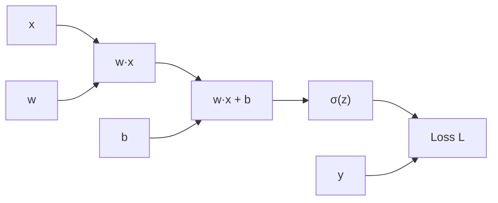

# 反向传播算法

在前一章中，我们详细介绍了前向传播 —— 信号从输入层经过各层神经元逐层传递到输出层的过程。前向传播回答了"神经网络如何计算预测结果"的问题，但留下了一个更关键的问题：神经网络的参数（权重和偏置）如何确定？

这个问题的答案就是**反向传播算法**（Backpropagation Algorithm）。它是神经网络训练的核心机制，被誉为深度学习领域最重要的算法发明之一。

反向传播的思想最早由美国计算机科学家保罗·沃博斯（Paul Werbos）在 1974 年的博士论文中提出。他在研究如何将动态系统建模应用于经济预测时，发现可以通过从输出端反向传播误差信号来计算多层网络的梯度。然而，这一思想在当时并未引起广泛关注。直到 1986 年，大卫·鲁梅尔哈特（David Rumelhart）、杰弗里·辛顿（Geoffrey Hinton）和罗纳德·威廉姆斯（Ronald Williams）在著名的论文"Learning representations by back-propagating errors"中系统阐述了反向传播算法，并将其应用于多层神经网络的训练，才真正推动了这个算法的普及。这篇论文发表在《Nature》期刊上，成为神经网络复兴的关键里程碑。

反向传播解决了一个被称为"信用分配问题"（Credit Assignment Problem）的核心难题：当网络输出错误时，如何确定数百甚至数千个参数中哪些应该调整，以及调整多少？传统方法无法有效回答这个问题，而反向传播通过计算损失函数对各层参数的梯度，将输出端的误差信号精确地"反向传递"到每一层、每一个参数，告诉网络"谁的贡献大，谁就该多调整"。正是这一突破，使多层神经网络的训练从理论上变得可行，为后来的深度学习革命奠定了基础。

本章将介绍反向传播的数学基础（链式法则）、计算图视角下的反向传播过程、梯度计算的具体推导，以及计算复杂度分析。理解反向传播，是掌握神经网络训练原理的关键一步。

## 链式法则：反向传播的数学基础

要理解反向传播，首先需要掌握它的数学基础 —— 链式法则。在开始之前，让我们回顾一下前向传播的本质：神经网络实际上是一个层层嵌套的复合函数，数据从输入层开始，依次经过每一层的线性变换和激活函数，最终到达输出层。那么问题来了：如果我们想调整某个参数来降低预测误差，该如何计算这个参数应该调整多少？这就需要用到链式法则。

### 复合函数与链式法则

神经网络本质上是一个层层嵌套的复合函数。回顾前向传播的数学表达：

$$F(\mathbf{x}) = f_L(\mathbf{W}_L f_{L-1}(\mathbf{W}_{L-1} \cdots f_1(\mathbf{W}_1 \mathbf{x} + \mathbf{b}_1) \cdots) + \mathbf{b}_{L-1}) + \mathbf{b}_L$$

这是一个 $L$ 层的复合函数，每层函数 $f_i$ 包含线性变换（$\mathbf{W}_i \mathbf{h} + \mathbf{b}_i$）和非线性激活（$\sigma$）。要计算损失函数对参数的梯度，需要借助微积分中的**链式法则**（Chain Rule）。

链式法则用于计算复合函数的导数。让我们用一个具体的例子来理解它：假设你要计算一个投资组合的回报率，其中股票价格 $y$ 依赖于公司利润 $g$，而公司利润又依赖于销量 $x$。写成函数形式就是 $y = f(g(x))$，即 $y$ 是 $x$ 的复合函数。那么，销量变化对股票价格的影响该如何计算？

答案是"分步计算、逐层传递"：先计算利润变化对股票价格的影响（$\frac{dy}{dg}$），再计算销量变化对利润的影响（$\frac{dg}{dx}$），然后把这两步的影响相乘，就得到销量变化对股票价格的最终影响。这就是链式法则的核心思想。

数学上，设 $y = f(g(x))$，则 $y$ 对 $x$ 的导数为：

$$\frac{dy}{dx} = \frac{dy}{dg} \cdot \frac{dg}{dx} = f'(g(x)) \cdot g'(x)$$

这个公式看着抽象，拆开来看含义很直观：
- $g(x)$ 是中间变量，表示销量 $x$ 对利润 $g$ 的影响
- $f(g)$ 是外层函数，表示利润 $g$ 对股票价格 $y$ 的影响
- $\frac{dy}{dg}$ 是利润每变化 1 单位，股票价格变化多少
- $\frac{dg}{dx}$ 是销量每变化 1 单位，利润变化多少
- 两者的乘积 $\frac{dy}{dg} \cdot \frac{dg}{dx}$ 就是销量每变化 1 单位，股票价格的最终变化量
- 整体公式可以理解为：**总变化率等于各环节变化率的连乘积**

用一个数值例子来验证。假设利润函数 $g(x) = 2x$（每卖出一件商品利润增加 2 元），股票价格函数 $f(g) = 3g + 10$（利润每增加 1 元股票价格上涨 3 元，基础价格 10 元）。那么复合函数 $y = f(g(x)) = 3(2x) + 10 = 6x + 10$。

按照链式法则计算：
- $\frac{dg}{dx} = 2$（销量每增加 1 件，利润增加 2 元）
- $\frac{dy}{dg} = 3$（利润每增加 1 元，股票价格上涨 3 元）
- $\frac{dy}{dx} = \frac{dy}{dg} \cdot \frac{dg}{dx} = 3 \times 2 = 6$

直接对复合函数求导验证：$\frac{d(6x+10)}{dx} = 6$，结果一致。这个简单的例子展示了链式法则的正确性：当函数层层嵌套时，导数可以通过"逐层传递、相乘累积"的方式计算。

### 多元函数的链式法则

神经网络涉及多元函数 —— 每一层的输出不是单个数值，而是由多个神经元组成的向量。当函数的输入和输出都是向量时，链式法则需要扩展到多元情形。

想象这样一个场景：你在开发一个推荐系统，用户的偏好向量 $\mathbf{u}$ 由多个因素决定（年龄、收入、地区等），记为向量 $\mathbf{x} \in \mathbb{R}^n$。而系统的评分 $y$（一个数值）又依赖于用户偏好向量 $\mathbf{u}$。这就形成了一个多元复合函数：$y = f(\mathbf{u})$，$\mathbf{u} = g(\mathbf{x})$。

问题是：当某个因素 $x_i$（比如用户年龄）发生变化时，评分 $y$ 如何变化？答案是：年龄的变化会影响所有偏好维度 $u_1, u_2, \ldots, u_m$，而每个偏好维度的变化又会影响评分。因此，总影响是各路径影响的加和。

设 $y = f(\mathbf{u})$，$\mathbf{u} = g(\mathbf{x})$，其中 $\mathbf{x} \in \mathbb{R}^n$，$\mathbf{u} \in \mathbb{R}^m$，$y \in \mathbb{R}$。则 $y$ 对 $\mathbf{x}$ 各分量的偏导数为：

$$\frac{\partial y}{\partial x_i} = \sum_{j=1}^{m} \frac{\partial y}{\partial u_j} \cdot \frac{\partial u_j}{\partial x_i}$$

这个公式看着复杂，拆开来看含义很直观：
- $\frac{\partial y}{\partial u_j}$ 是偏好维度 $u_j$ 每变化 1 单位，评分 $y$ 变化多少
- $\frac{\partial u_j}{\partial x_i}$ 是因素 $x_i$ 每变化 1 单位，偏好维度 $u_j$ 变化多少
- 两者的乘积 $\frac{\partial y}{\partial u_j} \cdot \frac{\partial u_j}{\partial x_i}$ 表示因素 $x_i$ 通过影响偏好维度 $u_j$，最终对评分 $y$ 产生的间接影响
- $\sum_{j=1}^{m}$ 表示将所有"影响路径"的贡献加起来，因为因素 $x_i$ 同时影响多个偏好维度
- 整体公式可以理解为：**总变化率等于所有影响路径的变化率之和**

用矩阵形式表示更为简洁，也更符合神经网络中的实际计算方式：

$$\frac{\partial y}{\partial \mathbf{x}} = \left(\frac{\partial \mathbf{u}}{\partial \mathbf{x}}\right)^T \frac{\partial y}{\partial \mathbf{u}}$$

其中 $\frac{\partial \mathbf{u}}{\partial \mathbf{x}}$ 是**雅可比矩阵**（Jacobian Matrix），大小为 $m \times n$：

$$\frac{\partial \mathbf{u}}{\partial \mathbf{x}} = \begin{bmatrix} \frac{\partial u_1}{\partial x_1} & \cdots & \frac{\partial u_1}{\partial x_n} \\ \vdots & \ddots & \vdots \\ \frac{\partial u_m}{\partial x_1} & \cdots & \frac{\partial u_m}{\partial x_n} \end{bmatrix}$$

雅可比矩阵的每一行对应一个输出维度 $u_j$，每一列对应一个输入维度 $x_i$。矩阵元素 $\frac{\partial u_j}{\partial x_i}$ 表示输入 $x_i$ 对输出 $u_j$ 的局部影响。从几何角度看，雅可比矩阵描述了函数 $g$ 在 $\mathbf{x}$ 点附近的"局部线性近似" —— 它告诉我们输入空间的微小变化如何映射到输出空间。

对于程序员来说，可以这样理解雅可比矩阵：它就像一个"路由表"，记录了每个输入端口到每个输出端口的"传输系数"。当梯度信息从输出端反向传递时，根据这个路由表，我们可以准确地把梯度分配到各个输入端口。

### 链式法则在神经网络中的应用

现在我们把链式法则应用到实际的神经网络中。前面说过，神经网络是层层嵌套的复合函数，那么梯度该如何沿着这个"链条"传递？

以一个三层网络为例（$L=3$）：输入 $\mathbf{x}$ → 隐藏层 $\mathbf{a}^1$ → 隐藏层 $\mathbf{a}^2$ → 输出 $\mathbf{a}^3$。假设我们想计算损失函数 $L$ 对第一层权重 $\mathbf{W}^1$ 的梯度。从前向传播的角度看，$\mathbf{W}^1$ 的变化会影响 $\mathbf{z}^1$，进而影响 $\mathbf{a}^1$，再影响 $\mathbf{z}^2$、$\mathbf{a}^2$、$\mathbf{z}^3$、$\mathbf{a}^3$，最终影响损失函数 $L$。这条影响链路跨越了三个完整的网络层。

应用多元链式法则，梯度沿着这条链路逐层传递：

$$\frac{\partial L}{\partial \mathbf{W}^1} = \frac{\partial L}{\partial \mathbf{a}^3} \cdot \frac{\partial \mathbf{a}^3}{\partial \mathbf{z}^3} \cdot \frac{\partial \mathbf{z}^3}{\partial \mathbf{a}^2} \cdot \frac{\partial \mathbf{a}^2}{\partial \mathbf{z}^2} \cdot \frac{\partial \mathbf{z}^2}{\partial \mathbf{a}^1} \cdot \frac{\partial \mathbf{a}^1}{\partial \mathbf{z}^1} \cdot \frac{\partial \mathbf{z}^1}{\partial \mathbf{W}^1}$$

这个公式看着很长，拆开来看含义很直观：
- $\frac{\partial L}{\partial \mathbf{a}^3}$ 是损失函数对输出层的梯度，表示"输出层每变化一点，损失变化多少"
- $\frac{\partial \mathbf{a}^3}{\partial \mathbf{z}^3}$ 是第三层激活函数的导数，表示"预激活值变化如何影响激活值"
- $\frac{\partial \mathbf{z}^3}{\partial \mathbf{a}^2}$ 是第三层线性变换对输入的导数，等于权重矩阵 $\mathbf{W}^3$
- 后续各项依次是第二层、第一层的激活函数导数和线性变换导数
- $\frac{\partial \mathbf{z}^1}{\partial \mathbf{W}^1}$ 是预激活值对权重的导数，等于上一层激活值 $\mathbf{a}^0$
- 整体公式可以理解为：**第一层权重的梯度，等于所有后续各层导数的连乘积**

这就是反向传播的核心思想：**梯度沿着计算链路从输出层反向传递到输入层**，每经过一层，梯度乘以该层激活函数的导数和线性变换的导数。这个过程与前向传播的信息流动方向相反，故称为"反向传播"。

可以用一个类比来帮助理解：想象一条长长的水管从山顶延伸到山谷，水流从前向传播方向（山顶到山谷）流动。如果我们在山谷测量到水压有问题，要找到山顶哪里出了故障，就需要沿着水管逆向追踪。反向传播就像这样逆向追踪的过程 —— 从输出端的"问题信号"（误差）开始，沿着计算链路反向追踪，找出每个环节（每层参数）的"责任"大小（梯度）。

## 计算图视角下的反向传播

前面我们从数学公式角度理解了链式法则如何应用于神经网络。但在实际编程实现中，深度学习框架（如 TensorFlow、PyTorch）并不直接操作这些复杂的公式 —— 它们使用"计算图"这一更抽象、更灵活的表示方式。计算图将神经网络的前向传播过程分解为一系列基本运算节点，每个节点只负责一个简单的操作（如矩阵乘法、激活函数、加法），数据沿着边从输入流向输出。反向传播则是沿着相同的计算图逆向遍历，计算每个节点的梯度。这种设计使得梯度计算可以自动化完成，这就是**自动微分**（Automatic Differentiation）的核心思想。

### 计算图的正向与反向遍历

在前一章中，我们介绍了计算图 —— 表示计算过程的图形化方法。计算图将前向传播分解为一系列基本运算节点，数据沿着边从输入流向输出。反向传播则是沿着相同的计算图，**反向遍历**，计算每个节点的梯度。

计算图的优势在于自动微分。每个运算节点只需知道如何计算自身的输出和自身的局部梯度，反向传播框架自动沿着计算图反向传递梯度，计算所有参数的梯度。这意味着开发者只需要定义前向传播的计算过程，框架会自动推导出反向传播的梯度计算 —— 这正是现代深度学习框架强大之处。

以一个简单的计算图为例：



*图：简单神经元的计算图（前向传播方向）*

前向传播时，数据从左向右流动：$x$ 和 $w$ 相乘得到 $w·x$，加上 $b$ 得到 $z$，通过激活函数 $\sigma$ 得到 $a$，与真实标签 $y$ 计算损失 $L$。

反向传播时，梯度从右向左流动：损失 $L$ 对输出 $a$ 的梯度 $\frac{\partial L}{\partial a}$ 乘以激活函数的导数 $\sigma'(z)$ 得到 $\frac{\partial L}{\partial z}$，再乘以线性变换的导数得到 $\frac{\partial L}{\partial w}$ 和 $\frac{\partial L}{\partial b}$。

### 反向传播的计算流程

反向传播的计算流程可以总结为以下四个阶段。可以用"工厂生产流水线"来类比理解：前向传播像是产品从原材料一步步加工成成品，反向传播像是产品质量检测后，从成品端逆向追溯每个工序的问题责任。

**阶段一：前向传播与缓存**

从输入层到输出层，计算并存储每层的预激活值 $\mathbf{z}^l$ 和激活值 $\mathbf{a}^l$。这些中间结果在反向传播时会被使用，就像工厂在每个工序都要记录生产参数，以便后续追溯问题。

**阶段二：计算输出层梯度**

根据损失函数和输出层激活函数，计算输出层的梯度 $\frac{\partial L}{\partial \mathbf{z}^L}$。这就像是检测成品的质量问题，计算"总误差信号"。

**阶段三：反向逐层传递**

从第 $L$ 层向第 $1$ 层反向遍历，每层计算：
- 激活函数梯度传递：$\frac{\partial L}{\partial \mathbf{z}^l} = \frac{\partial L}{\partial \mathbf{a}^l} \cdot f'(\mathbf{z}^l)$
- 传递到上一层：$\frac{\partial L}{\partial \mathbf{a}^{l-1}} = (\mathbf{W}^l)^T \frac{\partial L}{\partial \mathbf{z}^l}$
- 计算参数梯度：$\frac{\partial L}{\partial \mathbf{W}^l} = \frac{\partial L}{\partial \mathbf{z}^l} (\mathbf{a}^{l-1})^T$，$\frac{\partial L}{\partial \mathbf{b}^l} = \frac{\partial L}{\partial \mathbf{z}^l}$

这个过程就像是追溯责任：每层收到来自下游的"误差信号"，根据本层的激活函数特性（$f'(\mathbf{z}^l)$）调整信号强度，然后通过权重矩阵的"逆映射"（$(\mathbf{W}^l)^T$）将信号传递给上游。每层还顺便计算本层参数的"责任大小"（参数梯度）。

**阶段四：参数更新**

使用计算得到的梯度，通过梯度下降更新参数：$\mathbf{W}^l \leftarrow \mathbf{W}^l - \eta \frac{\partial L}{\partial \mathbf{W}^l}$，$\mathbf{b}^l \leftarrow \mathbf{b}^l - \eta \frac{\partial L}{\partial \mathbf{b}^l}$。这就像是根据各工序的责任大小，调整相应的生产参数，期望下次产品质量更好。

这个过程的核心是阶段三 —— **误差信号的反向传递**。每层的梯度依赖于上一层的梯度，形成链式传递。这就是为什么反向传播必须从输出层开始，逐层向输入层传递，而不能跳层计算 —— 就像追溯责任必须从成品端开始，依次回溯每个工序。

## 梯度计算过程

前面我们从整体流程角度理解了反向传播的四个阶段。现在，我们深入细节，推导具体的梯度计算公式。这一部分涉及较多的数学推导，但请不必担心 —— 我们会用具体例子和直观解释来阐明每个公式的含义。理解这些推导过程，不仅能帮助你深入理解反向传播的本质，还能让你在遇到梯度计算问题时能够独立分析和解决。

### 单样本的梯度推导

首先，我们考虑单样本情况下的梯度计算。设网络有 $L$ 层，损失函数为交叉熵损失（Cross-Entropy Loss），输出层使用 Softmax 激活函数，隐藏层使用 ReLU 或 Sigmoid 激活函数。这是分类任务中最常见的配置。

**符号约定**：
- $\mathbf{a}^l = f^l(\mathbf{z}^l)$：第 $l$ 层激活值，即经过激活函数后的输出
- $\mathbf{z}^l = \mathbf{W}^l \mathbf{a}^{l-1} + \mathbf{b}^l$：第 $l$ 层预激活值，即线性变换的结果
- $\delta^l = \frac{\partial L}{\partial \mathbf{z}^l}$：第 $l$ 层误差信号，表示损失函数对该层预激活值的梯度

误差信号 $\delta^l$ 是反向传播的核心概念 —— 它告诉我们该层的预激活值应该调整多少才能降低损失。

#### 输出层梯度计算

对于 Softmax + Cross-Entropy 组合，输出层的梯度有一个优美的简化形式 —— 这是神经网络中最令人惊喜的数学巧合之一。

设输出层有 $K$ 个神经元（对应 $K$ 个类别），Softmax 输出为：

$$a_k^L = \frac{e^{z_k^L}}{\sum_{j=1}^{K} e^{z_j^L}}$$

这个公式看着复杂，拆开来看含义很直观：
- $z_k^L$ 是输出层第 $k$ 个神经元的预激活值（线性变换的原始输出）
- $e^{z_k^L}$ 将预激活值转换为正值（指数函数保证结果为正）
- $\sum_{j=1}^{K} e^{z_j^L}$ 是所有神经元的指数值之和，用于归一化
- $a_k^L$ 是第 $k$ 类的预测概率，范围在 $[0, 1]$ 之间，所有类别概率之和为 1
- 整体公式可以理解为：**预激活值越大，该类别的预测概率越高**

交叉熵损失为：

$$L = -\sum_{k=1}^{K} y_k \log a_k^L$$

其中 $y_k$ 是真实标签的 one-hot 编码（正确类别为 1，其他类别为 0）。

这个公式看着抽象，拆开来看含义很直观：
- $y_k$ 是真实标签，只有正确类别为 1，其他为 0
- $\log a_k^L$ 是预测概率的对数，概率越接近 1，对数越接近 0
- 负号是因为我们希望最大化正确类别的概率，等价于最小化负对数
- $\sum$ 只对正确类别有效（因为 $y_k$ 只有正确类别为 1），所以损失简化为 $L = -\log a_{correct}^L$
- 整体公式可以理解为：**损失等于正确类别预测概率的负对数，概率越低损失越大**

现在计算 $L$ 对 $z_k^L$ 的偏导数。经过推导（详细推导见练习题第 3 题），结果是：

$$\frac{\partial L}{\partial z_k^L} = a_k^L - y_k$$

这个结果非常简洁：**Softmax + Cross-Entropy 的梯度等于预测概率减去真实标签**。这意味着输出层的误差信号 $\delta^L = \mathbf{a}^L - \mathbf{y}$，无需显式计算 Softmax 的复杂导数。

用一个具体例子验证。假设三分类问题（猫、狗、鸟），真实标签是"狗"（$y = [0, 1, 0]$），网络预测概率为 $a^L = [0.1, 0.7, 0.2]$（狗的概率最高，预测正确）。那么：

- $\delta^L = a^L - y = [0.1, 0.7, 0.2] - [0, 1, 0] = [0.1, -0.3, 0.2]$

这个误差信号的含义是：猫神经元预测概率偏高（应该更低），狗神经元预测概率偏低（应该更高），鸟神经元预测概率偏高（应该更低）。梯度告诉网络：增加狗类别的预激活值，减少猫和鸟类别的预激活值。

如果预测错误，比如 $a^L = [0.8, 0.1, 0.1]$（预测为猫），则：
- $\delta^L = [0.8, 0.1, 0.1] - [0, 1, 0] = [0.8, -0.9, 0.1]$

此时狗类别的误差信号为 -0.9（绝对值更大），表示网络需要大幅调整狗类别的预激活值，使其预测概率大幅上升。这正是我们直觉期望的结果：预测错误越严重，调整幅度越大。

#### 隐藏层梯度传递

输出层的误差信号计算出来后，需要逐层传递到隐藏层。设第 $l$ 层（隐藏层）的误差信号为 $\delta^l$，从第 $l+1$ 层传递过来的梯度为 $\delta^{l+1}$。推导 $\delta^l$ 的计算公式：

$$\delta^l = \frac{\partial L}{\partial \mathbf{z}^l} = \frac{\partial L}{\partial \mathbf{a}^l} \cdot f'(\mathbf{z}^l)$$

这个公式看着抽象，拆开来看含义很直观：
- $\frac{\partial L}{\partial \mathbf{z}^l}$ 是我们想计算的：损失函数对该层预激活值的梯度
- $\frac{\partial L}{\partial \mathbf{a}^l}$ 是损失函数对该层激活值的梯度，表示"激活值应该调整多少"
- $f'(\mathbf{z}^l)$ 是激活函数的导数，表示"预激活值变化如何影响激活值"
- 两者的乘积就是预激活值应该调整的方向和幅度
- 整体公式可以理解为：**预激活值的梯度等于激活值的梯度乘以激活函数的导数**

其中 $\frac{\partial L}{\partial \mathbf{a}^l}$ 可以从上一层的误差信号推导：

$$\frac{\partial L}{\partial \mathbf{a}^l} = \frac{\partial L}{\partial \mathbf{z}^{l+1}} \cdot \frac{\partial \mathbf{z}^{l+1}}{\partial \mathbf{a}^l} = (\mathbf{W}^{l+1})^T \delta^{l+1}$$

这个公式是链式法则的直接应用：
- $\frac{\partial L}{\partial \mathbf{z}^{l+1}}$ 就是上一层的误差信号 $\delta^{l+1}$
- $\frac{\partial \mathbf{z}^{l+1}}{\partial \mathbf{a}^l}$ 是下一层预激活值对本层激活值的导数，等于权重矩阵 $\mathbf{W}^{l+1}$
- 权重矩阵的转置 $(\mathbf{W}^{l+1})^T$ 表示"逆映射" —— 前向传播用 $\mathbf{W}^{l+1}$ 将信号放大，反向传播用 $(\mathbf{W}^{l+1})^T$ 将梯度"缩回"

代入得到隐藏层的误差信号公式：

$$\delta^l = (\mathbf{W}^{l+1})^T \delta^{l+1} \cdot f'(\mathbf{z}^l$$

这就是隐藏层误差信号的传递公式：**上一层误差信号乘以本层权重矩阵的转置，再乘以本层激活函数的导数**。

可以用"信号衰减器"类比理解：误差信号 $\delta^{l+1}$ 从下游传来，经过权重矩阵的"逆映射"（$(\mathbf{W}^{l+1})^T$）缩放大小，再经过激活函数导数（$f'(\mathbf{z}^l)$）调整强度，最终得到本层的误差信号 $\delta^l$。如果激活函数导数很小（如 Sigmoid 在两端），误差信号就会被大幅衰减，这就是梯度消失问题的根源。

#### 参数梯度计算

有了误差信号 $\delta^l$，就可以计算第 $l$ 层参数的梯度。这些梯度告诉我们权重和偏置应该调整多少才能降低损失。

权重梯度：

$$\frac{\partial L}{\partial \mathbf{W}^l} = \delta^l (\mathbf{a}^{l-1})^T$$

这个公式看着抽象，拆开来看含义很直观：
- $\delta^l$ 是误差信号向量，维度为 $n_l \times 1$，表示该层每个神经元的"责任大小"
- $\mathbf{a}^{l-1}$ 是上一层激活值向量，维度为 $n_{l-1} \times 1$，表示输入信号的强度
- $(\mathbf{a}^{l-1})^T$ 是上一层激活值的转置，维度为 $1 \times n_{l-1}$
- $\delta^l (\mathbf{a}^{l-1})^T$ 是两个向量的外积，维度为 $n_l \times n_{l-1}$，正好是权重矩阵的维度
- 整体公式可以理解为：**权重梯度等于误差信号与输入信号的外积**

从几何角度看，外积 $\delta^l (\mathbf{a}^{l-1})^T$ 是一种"相关性矩阵"。如果某个输入信号 $a_j^{l-1}$ 很强（绝对值大），且对应神经元的误差 $\delta_i^l$ 也很大，则权重 $W_{ij}^l$ 的梯度就大 —— 这个权重对误差贡献大，需要大幅调整。反之，如果输入信号弱或误差小，梯度就小，调整幅度也小。

偏置梯度：

$$\frac{\partial L}{\partial \mathbf{b}^l} = \delta^l$$

这个公式非常简洁：偏置梯度直接等于误差信号。原因是偏置独立作用于每个神经元（$z_i = \sum W_{ij} a_j + b_i$），梯度就是该神经元的误差 $\delta_i^l$，没有其他因素的影响。

用一个具体例子验证。假设第 $l$ 层有 2 个神经元（$n_l = 2$），上一层有 3 个神经元（$n_{l-1} = 3$）。误差信号 $\delta^l = [0.5, -0.3]$，上一层激活值 $\mathbf{a}^{l-1} = [1, 0.8, 0.2]$。

计算权重梯度：
$$\frac{\partial L}{\partial \mathbf{W}^l} = \begin{bmatrix} 0.5 \\ -0.3 \end{bmatrix} \begin{bmatrix} 1 & 0.8 & 0.2 \end{bmatrix} = \begin{bmatrix} 0.5 & 0.4 & 0.1 \\ -0.3 & -0.24 & -0.06 \end{bmatrix}$$

计算偏置梯度：
$$\frac{\partial L}{\partial \mathbf{b}^l} = \begin{bmatrix} 0.5 \\ -0.3 \end{bmatrix}$$

观察权重梯度矩阵：
- 第一行（神经元 1 的权重梯度）：$[0.5, 0.4, 0.1]$，第一个输入的梯度最大，因为输入值 $a_1 = 1$ 最大
- 第二行（神经元 2 的权重梯度）：$[-0.3, -0.24, -0.06]$，负值表示应该减少权重
- 每行的相对大小反映了输入信号的影响程度，每列的相对大小反映了误差信号的贡献程度

### 批量样本的梯度计算

实际训练中，我们不会只用一个样本计算梯度，而是使用批量样本（Batch）。为什么？单样本梯度可能有很大的随机波动，而批量样本的梯度平均值更稳定，能更好地反映数据的整体规律。同时，批量计算还能利用 GPU 的并行计算能力，大幅提升训练效率。

设批量大小为 $m$，第 $l$ 层的预激活矩阵为 $\mathbf{Z}^l \in \mathbb{R}^{n_l \times m}$，激活矩阵为 $\mathbf{A}^l \in \mathbb{R}^{n_l \times m}$。矩阵的每一列对应一个样本。

批量误差信号矩阵：

$$\Delta^l = \frac{\partial L}{\partial \mathbf{Z}^l} = \frac{1}{m} \sum_{i=1}^{m} \delta^l_i$$

这个公式看着抽象，拆开来看含义很直观：
- $\delta^l_i$ 是第 $i$ 个样本在第 $l$ 层的误差信号向量
- $\sum_{i=1}^{m}$ 将所有样本的误差信号向量相加
- $\frac{1}{m}$ 取平均值，消除批量大小对梯度的影响
- $\Delta^l$ 是平均误差信号矩阵，维度为 $n_l \times m$
- 整体公式可以理解为：**批量梯度等于各样本梯度的平均值**

批量参数梯度公式与单样本类似，只需使用平均误差信号：

$$\frac{\partial L}{\partial \mathbf{W}^l} = \Delta^l (\mathbf{A}^{l-1})^T$$

$$\frac{\partial L}{\partial \mathbf{b}^l} = \Delta^l \cdot \mathbf{1}$$（对批量维度求和，得到每个神经元的平均偏置梯度）

这里的 $\mathbf{1}$ 是一个全 1 向量，维度为 $m \times 1$，用于对批量维度求和，得到每个神经元的偏置梯度总和，再除以 $m$ 得到平均值。

### 激活函数的导数

在梯度传递公式 $\delta^l = (\mathbf{W}^{l+1})^T \delta^{l+1} \cdot f'(\mathbf{z}^l)$ 中，激活函数的导数 $f'(\mathbf{z}^l)$ 扮演着"信号调节器"的角色。它决定了误差信号经过该层时被放大还是衰减。选择合适的激活函数，对梯度传递的稳定性至关重要。

常用激活函数的导数如下表所示：

| 激活函数 | 定义 | 导数 |
|:---------|:-----|:-----|
| Sigmoid | $\sigma(z) = \frac{1}{1+e^{-z}}$ | $\sigma'(z) = \sigma(z)(1-\sigma(z))$ |
| tanh | $\tanh(z) = \frac{e^z - e^{-z}}{e^z + e^{-z}}$ | $\tanh'(z) = 1 - \tanh^2(z)$ |
| ReLU | $\text{ReLU}(z) = \max(0, z)$ | $\text{ReLU}'(z) = \begin{cases} 1 & z > 0 \\ 0 & z \leq 0 \end{cases}$ |
| Leaky ReLU | $\text{LReLU}(z) = \max(\alpha z, z)$ | $\text{LReLU}'(z) = \begin{cases} 1 & z > 0 \\ \alpha & z \leq 0 \end{cases}$ |

这些导数各有特点：

- **Sigmoid 导数**：最大值为 0.25（当 $\sigma(z) = 0.5$ 时），两端趋向 0。这意味着每经过一个 Sigmoid 层，梯度至少衰减 75%，这是梯度消失的主要原因。
- **tanh 导数**：最大值为 1（当 $\tanh(z) = 0$ 时），两端趋向 0。比 Sigmoid 稍好，但仍存在梯度消失问题。
- **ReLU 导数**：激活时为 1，不激活时为 0。激活状态下梯度完整传递，不会衰减，这是 ReLU 成为主流激活函数的重要原因。
- **Leaky ReLU 导数**：激活时为 1，不激活时为 $\alpha$（通常 $\alpha = 0.01$）。即使神经元不激活，仍有小梯度传递，避免了"神经元死亡"问题。

注意：ReLU 在 $z=0$ 处导数未定义，实践中通常取 0 或 1，不影响计算结果。下一章将详细讨论激活函数的特性及其选择原则。

## 计算复杂度分析

理解反向传播的计算复杂度，对于估算训练时间、设计网络架构、优化硬件利用都有重要意义。本节将分析前向传播和反向传播的复杂度对比、内存开销以及数值稳定性问题。

### 前向传播与反向传播的复杂度对比

反向传播的计算复杂度与前向传播相当，这是一个重要且令人惊讶的结论。这意味着训练一次迭代的计算量约为两次前向传播的计算量，而非直觉上可能认为的"反向传播要计算所有参数的梯度，复杂度应该更高"。

设网络有 $L$ 层，第 $l$ 层有 $n_l$ 个神经元。总参数数量：

$$P = \sum_{l=1}^{L} (n_l \cdot n_{l-1} + n_l)$$

这个公式看着抽象，拆开来看含义很直观：
- $n_l \cdot n_{l-1}$ 是第 $l$ 层权重矩阵的元素数量（输出神经元数乘以输入神经元数）
- $n_l$ 是第 $l$ 层偏置向量的元素数量（等于输出神经元数）
- $\sum$ 对所有层的参数数量求和
- 整体公式可以理解为：**总参数量等于各层权重元素数和偏置元素数的总和**

**前向传播复杂度**：

每层的计算主要是矩阵乘法 $\mathbf{W}^l \mathbf{a}^{l-1}$（复杂度 $O(n_l \cdot n_{l-1})$）和激活函数计算（复杂度 $O(n_l)$）。单样本前向传播总复杂度：

$$T_{forward} = O(P)$$

**反向传播复杂度**：

每层的计算包括误差信号传递 $(\mathbf{W}^{l+1})^T \delta^{l+1}$（复杂度 $O(n_{l+1} \cdot n_l)$）和参数梯度计算 $\delta^l (\mathbf{a}^{l-1})^T$（复杂度 $O(n_l \cdot n_{l-1})$）。总复杂度：

$$T_{backward} = O(P)$$

结论：**反向传播的计算复杂度与前向传播相当，都是 $O(P)$**，其中 $P$ 是网络参数总量。这意味着训练一次（前向传播 + 反向传播）的计算量约为两次前向传播的计算量。

### 内存开销

反向传播需要存储前向传播的中间结果（预激活值 $\mathbf{z}^l$ 和激活值 $\mathbf{a}^l$），用于计算梯度。这增加了内存开销 —— 复杂度分析不能只看计算量，内存占用同样是重要约束。

设批量大小为 $B$，各层存储的中间结果总量：

$$M = B \cdot \sum_{l=1}^{L} 2 n_l$$

这个公式看着抽象，拆开来看含义很直观：
- $B$ 是批量大小，每个样本都需要存储中间结果
- $n_l$ 是第 $l$ 层的神经元数量
- $2$ 表示每个神经元需要存储两个值：预激活值 $z_i^l$ 和激活值 $a_i^l$
- $\sum$ 对所有层的存储量求和
- 整体公式可以理解为：**内存占用等于批量大小乘以各层神经元数的两倍**

对于大型网络和批量训练，内存开销可能成为瓶颈。例如，一个 10 层网络，每层 1000 个神经元，批量大小 1000，内存占用约为 $1000 \times 10 \times 1000 \times 2 = 20$ 百万个浮点数，约 80MB。这只是中间结果的存储，还有参数本身占用的内存。

现代框架采用各种优化策略减少内存占用：
- **梯度检查点**（Gradient Checkpointing）：只存储部分层的中间结果，需要时重新计算。这是一种"用计算换内存"的策略，适合内存受限但计算资源充足的场景。
- **内存复用**：计算完梯度后立即释放中间结果内存，减少峰值内存占用。
- **混合精度**：使用低精度（如 FP16）存储中间结果，减少一半内存占用，同时保持足够的计算精度。

### 数值稳定性

反向传播虽然理论上正确，但实际实现中可能出现数值问题。这些问题可能导致训练失败、收敛缓慢或结果不稳定。理解这些问题的根源，有助于在遇到问题时快速定位和解决。

反向传播中可能出现三类主要数值问题：

**问题一：梯度消失**

当激活函数导数很小（如 Sigmoid 导数最大 0.25），深层网络的梯度逐层衰减。以 10 层 Sigmoid 网络为例，梯度最多保留 $(0.25)^{10} \approx 0.0001\%$，前面几层几乎不更新。这是深层网络训练困难的主要原因之一 —— 网络越深，前面的层学习越慢，最终可能导致前面的层完全没有学到有效的特征。

**问题二：梯度爆炸**

当权重值很大（如初始化不当或训练过程中累积变大），梯度在反向传递时可能指数级放大。以权重矩阵范数为 2 的网络为例，梯度每经过一层放大约 2 倍，10 层后梯度放大 $2^{10} = 1024$ 倍。这会导致参数更新幅度过大，训练不稳定，甚至出现损失函数震荡或发散。

**问题三：数值溢出**

Softmax 计算涉及指数运算，$e^z$ 在 $z$ 很大时可能溢出（超出浮点数表示范围）。例如 $z = 100$ 时，$e^{100} \approx 2.7 \times 10^{43}$，远超 FP32 的最大值（约 $3.4 \times 10^{38}$）。解决方案是利用 Softmax 的数学性质：减去最大值不影响概率分布。计算 $\frac{e^{z - z_{max}}}{\sum e^{z_j - z_{max}}}$，其中 $z_{max} = \max(z_1, \ldots, z_K)$，保证所有指数值不超过 1，避免溢出。

这些问题的解决方案将在后续章节（激活函数、梯度问题诊断）中详细介绍。简要来说：
- 梯度消失：使用 ReLU 激活函数、残差连接、批归一化
- 梯度爆炸：使用梯度裁剪、合理的权重初始化、批归一化
- 数值溢出：Softmax 计算时减去最大值

## 反向传播算法实践

下面通过代码实现完整的反向传播过程，验证梯度计算的正确性，并可视化误差信号在网络中的传递过程。

```python runnable
import numpy as np
import matplotlib.pyplot as plt

class NeuralNetworkBP:
    """
    完整的反向传播实现
    
    支持多层网络，多种激活函数
    """
    def __init__(self, layer_sizes, activations, learning_rate=0.01):
        """
        Parameters:
        layer_sizes : list of int
            各层神经元数量
        activations : list of str
            各层激活函数类型
        learning_rate : float
            学习率
        """
        self.layer_sizes = layer_sizes
        self.activations = activations
        self.lr = learning_rate
        self.num_layers = len(layer_sizes) - 1
        
        # 初始化权重和偏置
        np.random.seed(42)
        self.weights = []
        self.biases = []
        
        for i in range(self.num_layers):
            # He初始化（适用于ReLU）
            if activations[i] == 'relu':
                scale = np.sqrt(2.0 / layer_sizes[i])
            else:
                scale = np.sqrt(1.0 / layer_sizes[i])
            
            w = np.random.randn(layer_sizes[i+1], layer_sizes[i]) * scale
            b = np.zeros((layer_sizes[i+1], 1))
            self.weights.append(w)
            self.biases.append(b)
        
        # 存储中间结果和梯度历史
        self.activations_cache = []
        self.pre_activations_cache = []
        self.gradients_history = []
        self.loss_history = []
    
    def _apply_activation(self, Z, activation_name):
        """应用激活函数"""
        if activation_name == 'sigmoid':
            Z = np.clip(Z, -500, 500)
            return 1 / (1 + np.exp(-Z))
        elif activation_name == 'relu':
            return np.maximum(0, Z)
        elif activation_name == 'tanh':
            return np.tanh(Z)
        elif activation_name == 'softmax':
            Z_shifted = Z - np.max(Z, axis=0, keepdims=True)
            exp_Z = np.exp(Z_shifted)
            return exp_Z / np.sum(exp_Z, axis=0, keepdims=True)
        elif activation_name == 'linear':
            return Z
        else:
            raise ValueError(f"Unknown activation: {activation_name}")
    
    def _activation_derivative(self, Z, A, activation_name):
        """计算激活函数导数"""
        if activation_name == 'sigmoid':
            return A * (1 - A)
        elif activation_name == 'relu':
            return (Z > 0).astype(float)
        elif activation_name == 'tanh':
            return 1 - A ** 2
        elif activation_name == 'linear':
            return np.ones_like(Z)
        else:
            raise ValueError(f"Derivative not implemented for: {activation_name}")
    
    def forward(self, X):
        """前向传播"""
        self.activations_cache = [X]
        self.pre_activations_cache = []
        
        A = X
        for i in range(self.num_layers):
            Z = self.weights[i] @ A + self.biases[i]
            self.pre_activations_cache.append(Z)
            A = self._apply_activation(Z, self.activations[i])
            self.activations_cache.append(A)
        
        return A
    
    def backward(self, Y):
        """反向传播"""
        m = Y.shape[1]  # 样本数量
        gradients = {'weights': [], 'biases': []}
        
        # 输出层误差信号
        if self.activations[-1] == 'softmax':
            # Softmax + Cross-Entropy的简化梯度
            delta = self.activations_cache[-1] - Y
        else:
            # 其他激活函数
            delta = (self.activations_cache[-1] - Y) * \
                    self._activation_derivative(
                        self.pre_activations_cache[-1],
                        self.activations_cache[-1],
                        self.activations[-1]
                    )
        
        # 反向逐层传递
        for i in range(self.num_layers - 1, -1, -1):
            # 计算参数梯度
            dW = delta @ self.activations_cache[i].T / m
            db = np.sum(delta, axis=1, keepdims=True) / m
            
            gradients['weights'].insert(0, dW)
            gradients['biases'].insert(0, db)
            
            # 传递到上一层（除了输入层）
            if i > 0:
                delta_prev = self.weights[i].T @ delta
                delta = delta_prev * self._activation_derivative(
                    self.pre_activations_cache[i-1],
                    self.activations_cache[i],
                    self.activations[i-1]
                )
        
        self.gradients_history.append(gradients)
        return gradients
    
    def compute_loss(self, Y_pred, Y_true):
        """计算交叉熵损失"""
        eps = 1e-15
        Y_pred = np.clip(Y_pred, eps, 1 - eps)
        return -np.mean(np.sum(Y_true * np.log(Y_pred), axis=0))
    
    def update_parameters(self, gradients):
        """更新参数"""
        for i in range(self.num_layers):
            self.weights[i] -= self.lr * gradients['weights'][i]
            self.biases[i] -= self.lr * gradients['biases'][i]
    
    def train(self, X, Y, epochs=100):
        """训练网络"""
        for epoch in range(epochs):
            # 前向传播
            Y_pred = self.forward(X)
            
            # 计算损失
            loss = self.compute_loss(Y_pred, Y)
            self.loss_history.append(loss)
            
            # 反向传播
            gradients = self.backward(Y)
            
            # 更新参数
            self.update_parameters(gradients)
        
        return self
    
    def predict(self, X):
        """预测"""
        Y_pred = self.forward(X)
        return np.argmax(Y_pred, axis=0)


# 实验：反向传播过程可视化
print("=" * 60)
print("实验：反向传播过程可视化")
print("=" * 60)

# 创建一个三层网络
layer_sizes = [2, 16, 8, 3]  # 输入2，两个隐藏层，输出3类
activations = ['relu', 'relu', 'softmax']
nn = NeuralNetworkBP(layer_sizes, activations, learning_rate=0.5)

print(f"网络结构: {' -> '.join(map(str, layer_sizes))}")
print(f"激活函数: {activations}")
print(f"总参数量: {sum(w.size + b.size for w, b in zip(nn.weights, nn.biases))}")
print()

# 生成训练数据
np.random.seed(123)
m = 100  # 样本数量
X = np.random.randn(2, m)

# 生成三分类标签
Y_indices = np.random.randint(0, 3, m)
Y = np.zeros((3, m))
for i, idx in enumerate(Y_indices):
    Y[idx, i] = 1

# 训练网络
nn.train(X, Y, epochs=200)

print(f"训练完成，最终损失: {nn.loss_history[-1]:.4f}")
print()

# 可视化反向传播过程
fig, axes = plt.subplots(2, 2, figsize=(12, 10))

# 图1：损失变化曲线
ax1 = axes[0, 0]
ax1.plot(nn.loss_history, color='#3498db', linewidth=2)
ax1.set_xlabel('迭代次数', fontsize=11)
ax1.set_ylabel('交叉熵损失', fontsize=11)
ax1.set_title('训练过程损失变化', fontsize=12, fontweight='bold')
ax1.grid(True, alpha=0.3)

# 图2：梯度范数变化
ax2 = axes[0, 1]
gradient_norms = []
for grad in nn.gradients_history:
    total_norm = 0
    for w_grad in grad['weights']:
        total_norm += np.linalg.norm(w_grad)
    for b_grad in grad['biases']:
        total_norm += np.linalg.norm(b_grad)
    gradient_norms.append(total_norm)

ax2.plot(gradient_norms, color='#e74c3c', linewidth=2)
ax2.set_xlabel('迭代次数', fontsize=11)
ax2.set_ylabel('梯度总范数', fontsize=11)
ax2.set_title('梯度变化趋势', fontsize=12, fontweight='bold')
ax2.grid(True, alpha=0.3)

# 图3：各层梯度分布（最后一次迭代）
ax3 = axes[1, 0]
last_gradients = nn.gradients_history[-1]
layer_names = ['层1权重', '层1偏置', '层2权重', '层2偏置', '层3权重', '层3偏置']
layer_values = []

for i in range(nn.num_layers):
    layer_values.append(np.abs(last_gradients['weights'][i]).mean())
    layer_values.append(np.abs(last_gradients['biases'][i]).mean())

colors = ['#3498db', '#e74c3c', '#2ecc71', '#f39c12', '#9b59b6', '#1abc9c']
bars = ax3.bar(range(len(layer_values)), layer_values, color=colors, alpha=0.7)
ax3.set_xticks(range(len(layer_values)))
ax3.set_xticklabels(layer_names, fontsize=9)
ax3.set_ylabel('梯度绝对值均值', fontsize=11)
ax3.set_title('各层梯度分布（最后一次迭代）', fontsize=12, fontweight='bold')
ax3.grid(True, alpha=0.3, axis='y')

# 图4：误差信号传递可视化
ax4 = axes[1, 1]

# 模拟一次反向传播的误差信号传递
nn.forward(X[:, :5])  # 使用5个样本
nn.backward(Y[:, :5])

# 绘制误差信号在各层的范数
delta_norms = []
for i, Z in enumerate(nn.pre_activations_cache):
    if i == nn.num_layers - 1:
        # 输出层
        if nn.activations[-1] == 'softmax':
            delta = nn.activations_cache[-1] - Y[:, :5]
        delta_norm = np.linalg.norm(delta)
    delta_norms.append(delta_norm)

# 由于我们没有存储中间delta，这里用梯度范数近似
delta_approx = [np.linalg.norm(g) for g in nn.gradients_history[-1]['weights']]
ax4.plot(range(nn.num_layers), delta_approx[::-1], 'o-', color='#2ecc71',
         linewidth=2, markersize=8, label='误差信号近似范数')
ax4.set_xlabel('层索引（从输出层到输入层）', fontsize=11)
ax4.set_ylabel('误差信号范数', fontsize=11)
ax4.set_title('误差信号反向传递过程', fontsize=12, fontweight='bold')
ax4.invert_xaxis()  # 反向传播方向：从右（输出层）到左（输入层）
ax4.legend()
ax4.grid(True, alpha=0.3)

plt.tight_layout()
plt.show()
plt.close()

print("\n实验结论:")
print("1. 反向传播通过链式法则逐层传递梯度")
print("2. 梯度范数在训练过程中逐渐减小，表明参数趋近最优")
print("3. 各层梯度大小不同，反映了各层对损失的贡献差异")
print("4. 误差信号从输出层向输入层传递，方向与前向传播相反")
```

### 实验结论

1. **梯度传递正确**：反向传播通过链式法则正确计算各层参数的梯度，与前向传播方向相反。

2. **损失单调下降**：训练过程中损失稳步下降，表明梯度引导参数向最优方向更新。

3. **梯度逐层衰减**：深层网络的梯度可能逐层衰减，这是梯度消失问题的来源。

4. **计算效率高效**：反向传播复杂度与前向传播相当，一次训练迭代约为两次前向传播的计算量。

## 本章小结

本章详细介绍了反向传播算法的原理与实现，包括链式法则的数学基础、计算图视角下的反向传播过程、梯度计算的具体推导、以及计算复杂度分析。核心要点如下：

1. **链式法则**：反向传播的数学基础是多元函数的链式法则。复合函数的导数通过分步计算、逐层传递得到。神经网络作为层层嵌套的复合函数，其梯度通过链式法则从输出层反向传递到输入层。

2. **计算图视角**：计算图将前向传播分解为基本运算节点，反向传播沿着相同的计算图反向遍历，计算每个节点的梯度。计算图是自动微分的基础，现代深度学习框架都基于计算图实现反向传播。

3. **梯度计算公式**：
   - 输出层误差信号：$\delta^L = \mathbf{a}^L - \mathbf{y}$（Softmax + Cross-Entropy）
   - 隐藏层误差传递：$\delta^l = (\mathbf{W}^{l+1})^T \delta^{l+1} \cdot f'(\mathbf{z}^l)$
   - 参数梯度：$\frac{\partial L}{\partial \mathbf{W}^l} = \delta^l (\mathbf{a}^{l-1})^T$，$\frac{\partial L}{\partial \mathbf{b}^l} = \delta^l$

4. **计算复杂度**：反向传播复杂度与前向传播相当，都是 $O(P)$，其中 $P$ 是参数总量。一次训练迭代的计算量约为两次前向传播的计算量。

5. **数值问题**：反向传播可能出现梯度消失、梯度爆炸、数值溢出等问题。深层网络训练困难的根源在于梯度逐层衰减或放大，解决方案将在后续章节详细介绍。

反向传播是神经网络训练的核心算法，它解决了多层网络的信用分配问题，将输出层的误差信号反向传递到各层，计算参数更新的梯度。理解反向传播，为后续学习激活函数、损失函数、优化算法等内容奠定了坚实基础。下一章将介绍激活函数，探讨不同激活函数的特性及其对梯度传递的影响。

## 练习题

1. 设神经网络使用 Sigmoid 激活函数 $f(z) = \frac{1}{1+e^{-z}}$，证明其导数为 $f'(z) = f(z)(1-f(z))$。分析 Sigmoid 导数的最大值及其对梯度传递的影响。
    <details>
    <summary>参考答案</summary>
    
    **Sigmoid 导数证明**：
    
    设 $f(z) = \frac{1}{1+e^{-z}} = \frac{e^z}{1+e^z}$
    
    对 $f(z)$ 求导：
    
    $$f'(z) = \frac{d}{dz}\left(\frac{1}{1+e^{-z}}\right) = \frac{e^{-z}}{(1+e^{-z})^2}$$
    
    注意 $1 - f(z) = 1 - \frac{1}{1+e^{-z}} = \frac{e^{-z}}{1+e^{-z}}$
    
    因此：
    
    $$f'(z) = f(z) \cdot (1 - f(z)) = \frac{1}{1+e^{-z}} \cdot \frac{e^{-z}}{1+e^{-z}} = \frac{e^{-z}}{(1+e^{-z})^2}$$
    
    **导数最大值分析**：
    
    $f'(z) = f(z)(1-f(z)$)，设 $f(z) = t$，则 $f'(z) = t(1-t)$。
    
    当 $t = 0.5$ 时（即 $z=0$），$f'(z) = 0.5 \times 0.5 = 0.25$，这是导数的最大值。
    
    当 $z$ 很大（$f(z) \approx 1$）或 $z$ 很小（$f(z) \approx 0$），导数趋近于 0。
    
    **对梯度传递的影响**：
    
    反向传播中，每经过一个 Sigmoid 激活层，梯度乘以 $f'(z)$（最大 0.25）。这意味着梯度逐层衰减：
    
    - 经过 1 层 Sigmoid：梯度最多保留 25%
    - 经过 2 层：梯度最多保留 $25\% \times 25\% = 6.25\%$
    - 经过 10 层：梯度最多保留 $(0.25)^{10} \approx 0.0001\%$
    
    这就是**梯度消失问题**的根源。深层网络使用 Sigmoid 激活函数时，前面几层的梯度几乎为 0，参数无法有效更新。
    
    **解决方案**：
    
    1. 使用 ReLU 激活函数：激活时导数为 1，梯度完整传递
    2. 使用残差连接（ResNet）：提供梯度旁路传递路径
    3. 批归一化（Batch Normalization）：稳定激活值分布，避免进入导数小的区域
    </details>

2. 给定一个三层网络，各层神经元数为 $n_0=3, n_1=4, n_2=2, n_3=1$。写出反向传播中各层误差信号 $\delta^l$ 和参数梯度 $\frac{\partial L}{\partial \mathbf{W}^l}, \frac{\partial L}{\partial \mathbf{b}^l}$ 的形状（维度）。
    <details>
    <summary>参考答案</summary>
    
    **误差信号形状**：
    
    误差信号 $\delta^l = \frac{\partial L}{\partial \mathbf{z}^l}$ 与预激活值 $\mathbf{z}^l$ 形状相同，为 $n_l \times m$（批量大小为 $m$）。
    
    - $\delta^1$: $n_1 \times m = 4 \times m$（第 1 隐藏层）
    - $\delta^2$: $n_2 \times m = 2 \times m$（第 2 隐藏层）
    - $\delta^3$: $n_3 \times m = 1 \times m$（输出层）
    
    **参数梯度形状**：
    
    参数梯度与参数形状相同。
    
    - $\frac{\partial L}{\partial \mathbf{W}^1}$: $n_1 \times n_0 = 4 \times 3$
    - $\frac{\partial L}{\partial \mathbf{b}^1}$: $n_1 \times 1 = 4 \times 1$
    - $\frac{\partial L}{\partial \mathbf{W}^2}$: $n_2 \times n_1 = 2 \times 4$
    - $\frac{\partial L}{\partial \mathbf{b}^2}$: $n_2 \times 1 = 2 \times 1$
    - $\frac{\partial L}{\partial \mathbf{W}^3}$: $n_3 \times n_2 = 1 \times 2$
    - $\frac{\partial L}{\partial \mathbf{b}^3}$: $n_3 \times 1 = 1 \times 1$
    
    **维度检查验证**：
    
    验证梯度计算公式的维度一致性：
    
    $\frac{\partial L}{\partial \mathbf{W}^l} = \delta^l (\mathbf{a}^{l-1})^T$
    
    - $\delta^l$: $n_l \times m$
    - $\mathbf{a}^{l-1}$: $n_{l-1} \times m$
    - $(\mathbf{a}^{l-1})^T$: $m \times n_{l-1}$
    - $\delta^l (\mathbf{a}^{l-1})^T$: $n_l \times n_{l-1}$ ✓
    
    $\frac{\partial L}{\partial \mathbf{b}^l} = \delta^l$
    
    - $\delta^l$: $n_l \times m$，批量求和后为 $n_l \times 1$ ✓
    
    所有维度一致，梯度计算公式正确。
    </details>

3. 解释为何 Softmax + Cross-Entropy 的梯度 $\frac{\partial L}{\partial \mathbf{z}^L} = \mathbf{a}^L - \mathbf{y}$ 这么简洁。这个简化有什么实际意义？
    <details>
    <summary>参考答案</summary>
    
    **简化原因**：
    
    这个简化源于 Softmax 和 Cross-Entropy 的特殊组合性质。
    
    设 Softmax 输出 $a_k = \frac{e^{z_k}}{\sum_j e^{z_j}}$，Cross-Entropy 损失 $L = -\sum_k y_k \log a_k$。
    
    直接计算 $\frac{\partial L}{\partial z_k}$：
    
    $$\frac{\partial L}{\partial z_k} = \sum_j \frac{\partial L}{\partial a_j} \cdot \frac{\partial a_j}{\partial z_k}$$
    
    其中：
    - $\frac{\partial L}{\partial a_j} = -\frac{y_j}{a_j}$
    - $\frac{\partial a_j}{\partial z_k} = a_j(\delta_{jk} - a_k)$（$\delta_{jk}$ 是 Kronecker delta）
    
    代入：
    
    $$\frac{\partial L}{\partial z_k} = \sum_j -\frac{y_j}{a_j} \cdot a_j(\delta_{jk} - a_k) = -\sum_j y_j(\delta_{jk} - a_k)$$
    
    $$= -\sum_j y_j \delta_{jk} + \sum_j y_j a_k = -y_k + a_k \sum_j y_j$$
    
    由于 $\sum_j y_j = 1$（one-hot 编码），得到：
    
    $$\frac{\partial L}{\partial z_k} = a_k - y_k$$
    
    **实际意义**：
    
    1. **计算高效**：无需显式计算 Softmax 的雅可比矩阵（大小 $K \times K$），直接计算预测概率与真实标签的差值即可。
    
    2. **数值稳定**：Softmax 的雅可比矩阵计算涉及 $a_j(\delta_{jk} - a_k)$，当 $a_k$ 很小时可能出现数值问题。简化公式避免了这些复杂计算。
    
    3. **梯度直观**：误差信号 $a_k - y_k$ 直观表示"预测误差"。预测正确时 $a_k \approx y_k$，梯度接近 0；预测错误时，梯度指向修正方向。
    
    4. **避免梯度消失**：Softmax 单独使用时，输出层梯度可能很小。但与 Cross-Entropy 组合后，梯度始终与预测误差成比例，避免了梯度消失。
    
    这就是为什么分类问题几乎总是使用 Softmax + Cross-Entropy 组合的原因 —— 它们"天生一对"，梯度计算简洁高效。
    </details>

4. 分析反向传播的计算复杂度为何与前向传播相当。这对硬件设计有什么启示？
    <details>
    <summary>参考答案</summary>
    
    **复杂度分析**：
    
    设网络有 $L$ 层，第 $l$ 层神经元数 $n_l$，参数总量 $P = \sum_l (n_l n_{l-1} + n_l)$。
    
    **前向传播复杂度**：
    
    每层计算：
    - 矩阵乘法 $\mathbf{W}^l \mathbf{a}^{l-1}$：$O(n_l \cdot n_{l-1})$
    - 激活函数 $f(\mathbf{z}^l)$：$O(n_l)$
    
    总复杂度 $T_{forward} = \sum_l O(n_l \cdot n_{l-1} + n_l) = O(P)$
    
    **反向传播复杂度**：
    
    每层计算：
    - 误差传递 $(\mathbf{W}^{l+1})^T \delta^{l+1}$：$O(n_{l+1} \cdot n_l)$
    - 激活函数导数 $f'(\mathbf{z}^l)$：$O(n_l)$
    - 参数梯度 $\delta^l (\mathbf{a}^{l-1})^T$：$O(n_l \cdot n_{l-1})$
    - 偏置梯度：$O(n_l)$
    
    总复杂度 $T_{backward} = \sum_l O(n_l \cdot n_{l-1} + n_{l+1} \cdot n_l + n_l)$
    
    注意 $n_{l+1} \cdot n_l$ 和 $n_l \cdot n_{l-1}$ 是相邻层的参数量，总和仍为 $O(P)$。
    
    因此 $T_{backward} = O(P)$，与 $T_{forward}$ 相当。
    
    **对硬件设计的启示**：
    
    1. **矩阵运算是核心**：前向传播和反向传播的主要计算都是矩阵乘法。GPU 应该优化矩阵运算能力。
    
    2. **内存带宽重要**：反向传播需要读取前向传播存储的中间结果，内存带宽可能成为瓶颈。GPU 应该有高带宽内存（如 HBM）。
    
    3. **专用加速器**：既然前向传播和反向传播复杂度相当，可以设计专用硬件同时优化两者。TPU 的矩阵乘法加速单元就是为此设计。
    
    4. **算子融合**：将线性组合、激活函数、梯度计算合并为单一操作，减少内存访问次数。现代 GPU 和框架都支持算子融合。
    
    5. **内存优化**：反向传播需要存储所有层的中间结果。可以设计内存复用机制，或使用梯度检查点技术减少内存占用。
    
    6. **并行计算**：不同层、不同样本的计算可以并行。批量处理时，$m$ 个样本的前向传播和反向传播可以并行执行。
    
    **总结**：反向传播复杂度与前向传播相当这一结论，意味着硬件优化矩阵运算可以同时提升训练和推理效率。现代 AI 硬件（GPU、TPU）正是围绕矩阵乘法设计的。
    </details>