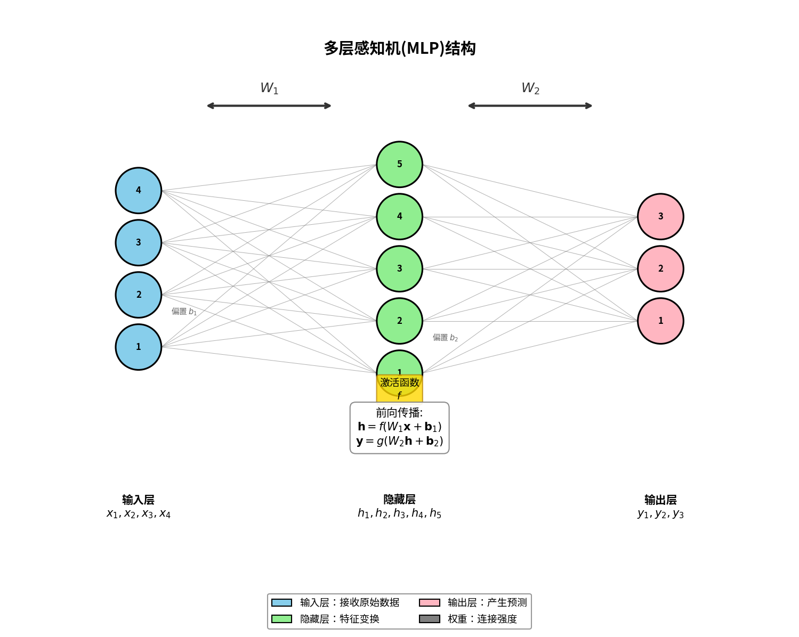
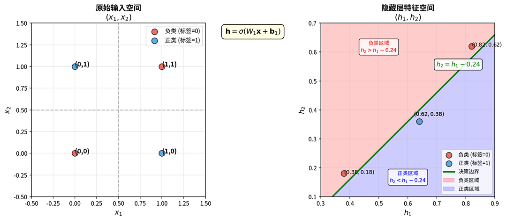
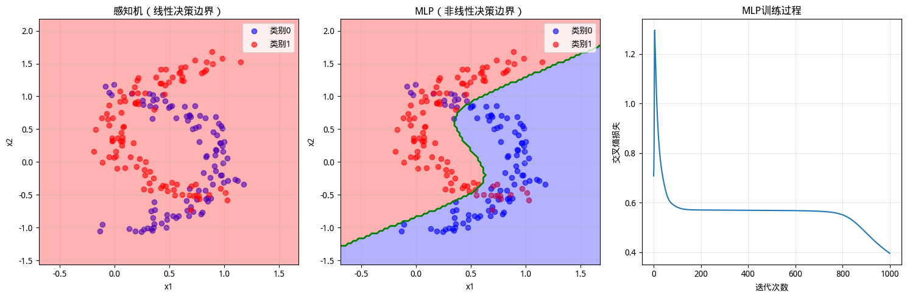

# 多层感知机

前文中我们见证了感知机的诞生与局限，这个由罗森布拉特在 1957 年提出的简单模型能够学习线性决策边界，但对于非线性可分问题束手无策。1969 年，马文·明斯基在《Perceptrons》一书中严格证明了单层感知机无法解决非线性问题，这一"明斯基诅咒"直接导致神经网络研究进入长达 17 年的低谷期。当时的神经网络学者们将摆脱困境的期望寄予**多层感知机**（Multi-Layer Perceptron, MLP）身上，MLP 通过在输入层和输出层之间引入隐藏层，实现了层级化的特征提取机制。

1989 年，美国数学家乔治·赛本科（George Cybenko）和奥地利统计学家库尔特·霍尼克（Kurt Hornik）分别独立证明了著名的**泛逼近定理**（Universal Approximation Theorem），该定理说明只要隐藏层神经元足够多，单隐藏层的 MLP 就已经可以逼近任意连续函数，误差可以任意小。这个结论的意义是从理论上证明了神经网络理论上是一台通用学习机器，不存在它学不会的连续函数。

本章将沿着神经网络发展的脉络，介绍多层感知机的结构设计、隐藏层的特征变换原理、泛逼近定理的核心结论，并通过实验验证 MLP 解决非线性问题的能力。

## 多层网络结构

相较于线性感知机，多层感知机在输入层和输出层之间增加了**隐藏层**（Hidden Layer，常简称隐层），隐藏层对原始输入施加非线性变换，将原始空间扭曲映射到新的特征空间。在新的空间中，原本纠缠难分的数据可能变得井然有序，线性边界就能完美切分。输出层在这个新空间中执行线性分类，就能解决原始空间中的非线性问题。在多层网络结构中，信息流动形成层级化结构，输入层负责接收原始数据，隐藏层负责特征变换，输出层负责最终决策，结构如下图所示：



*图：多层感知机的层级结构（单隐藏层）。信息从左向右流动，每层神经元对输入信号进行加权求和与非线性激活*

多层网络里除了隐藏层，还有一个变化是激活函数 $f$ 的身份从一个可有可无的部件变成了不可或缺的角色。因为如果不用激活函数，或者只用线性函数 $f(z) = az$（$a$ 为常数）作为激活函数，多层网络将会退化成单层网络。这一点很容易证明，设激活函数为线性函数 $f(z) = az$，则隐藏层输出为 $\mathbf{h} = a(\mathbf{W}_1 \mathbf{x} + \mathbf{b}_1) = a\mathbf{W}_1 \mathbf{x} + a\mathbf{b}_1$，输出层继续线性变换得到 $\mathbf{y} = \mathbf{W}_2 \mathbf{h} + \mathbf{b}_2 = \mathbf{W}_2 (a\mathbf{W}_1 \mathbf{x} + a\mathbf{b}_1) + \mathbf{b}_2 = a\mathbf{W}_2 \mathbf{W}_1 \mathbf{x} + a\mathbf{W}_2 \mathbf{b}_1 + \mathbf{b}_2$，只要令 $\mathbf{W} = a\mathbf{W}_2 \mathbf{W}_1$，$\mathbf{b} = a\mathbf{W}_2 \mathbf{b}_1 + \mathbf{b}_2$，则网络又回到了 $\mathbf{y} = \mathbf{W} \mathbf{x} + \mathbf{b}$，这正是单层网络的线性形式。以上推导揭示了一个事实：多个线性变换的叠加，结果仍然是线性变换，只有引入非线性激活函数，才能打破这种线性陷阱，让网络获得不受线性约束的表达能力。

我们再次回顾 XOR 问题的例子，考虑一个单隐藏层 MLP，隐藏层有 2 个神经元，使用 [Sigmoid](../../statistical-learning/linear-models/logistic-regression.md#sigmoid-函数) 作为激活函数，设输入层到隐藏层的权重和偏置为：

$$\mathbf{W}_1 = \begin{bmatrix} 1 & 1 \\ 1 & 1 \end{bmatrix}, \quad \mathbf{b}_1 = \begin{bmatrix} -0.5 \\ -1.5 \end{bmatrix}$$

XOR 问题的四个样本点在原始空间中的坐标为 $(0, 0)$、$(0, 1)$、$(1, 0)$、$(1, 1)$，其中 $(0, 1)$ 和 $(1, 0)$ 为正类（标签为 1），$(0, 0)$ 和 $(1, 1)$ 为负类（标签为 0）。隐藏层对输入进行线性变换 $\mathbf{z} = \mathbf{W}_1 \mathbf{x} + \mathbf{b}_1$，再经过 Sigmoid 激活得到隐藏层输出 $\mathbf{h} = \sigma(\mathbf{z})$。计算各点的变换结果如下表所示：

| 输入 $(x_1, x_2)$ | 线性变换 $\mathbf{z}$ | 激活后 $(h_1, h_2)$ | 标签 |
|:---:|:---:|:---:|:---:|
| $(0, 0)$ | $(-0.5, -1.5)$ | $(0.38, 0.18)$ | 0 |
| $(0, 1)$ | $(0.5, -0.5)$ | $(0.62, 0.38)$ | 1 |
| $(1, 0)$ | $(0.5, -0.5)$ | $(0.62, 0.38)$ | 1 |
| $(1, 1)$ | $(1.5, 0.5)$ | $(0.82, 0.62)$ | 0 |

观察变换后的特征空间中，正类样本 $(0.62, 0.38)$ 聚集在中间区域，负类样本 $(0.38, 0.18)$ 和 $(0.82, 0.62)$ 分别位于左下和右上。在这个新空间中，正类和负类可以被一条斜线分开。输出层只需学习简单的线性权重组合，譬如决策边界 $h_2 = h_1 - 0.24$，就能将正类（满足 $h_2 < h_1 - 0.24$）与负类（满足 $h_2 > h_1 - 0.24$）完美区分开，如下图所示：



*图：XOR问题在原始输入空间（左）和隐藏层特征空间（右）中的分布对比*

这个例子清晰展示了隐藏层的作用是通过非线性变换重新组织数据的空间分布，原本在 $(x_1, x_2)$ 空间中交错纠缠的 XOR 数据，被变换到 $(h_1, h_2)$ 空间后变得井然有序，正类聚在一起，负类被分离到两侧，线性分类器就能轻松完成分类任务。在后续其他更深（更多隐藏层）的神经网络能够进行更复杂的多级变换，逐步提取高层抽象特征，譬如，第一层可能学习简单的边缘方向，第二层组合边缘形成形状，第三层组合形状形成物体部件，等等，这种层级化的特征提取机制，是未来深度学习强大能力的根本来源。

## 泛逼近定理

单层的感知机的能力受限于线性约束，那了解了多层网络的结构后，这种网络的能力边界在哪里？它能解决所有问题吗？1989 年，两位数学家分别给出了令人振奋的答案。美国数学家乔治·赛本科（George Cybenko）在《Approximation by Superpositions of a Sigmoidal Function》一文中，针对使用 Sigmoid 激活函数的多层网络，证明了以下结论：

::: info 泛逼近定理
设 $f$ 是有界、非常数的单调递增连续函数（如 Sigmoid），$\varphi$ 是定义在 $\mathbb{R}^n$ 的紧致集上的任意连续函数。则对于任意 $\epsilon > 0$，存在整数 $m$ 和实数 $\alpha_i$、向量 $\mathbf{w}_i$、实数 $b_i$、实数 $b_0$，使得：
$$\left| \varphi(\mathbf{x}) - \sum_{i=1}^{m} \alpha_i f(\mathbf{w}_i^T \mathbf{x} + b_i) + b_0 \right| < \epsilon$$
对所有 $\mathbf{x}$ 成立。
:::

这个数学表述看起来晦涩，但其含义用通俗语言表述却令人震撼：**只要隐藏层神经元足够多，单隐藏层 MLP 可以逼近任意连续函数，误差可以任意小**，在今天这个定理被称为**泛逼近定理**（Universal Approximation Theorem），是多层网络最重要的理论基石。同年，奥地利统计学家库尔特·霍尼克（Kurt Hornik）在《Approximation Capabilities of Multilayer Feedforward Networks》一文中将定理推广到更一般的条件：只要激活函数不是多项式函数，泛逼近定理就成立。这意味着 ReLU、tanh、Sigmoid 等常用激活函数都满足条件，定理的适用范围远比最初证明时更宽广。

泛逼近定理给予了多层网络表达能力的保证，它证明 MLP 理论上可以拟合任何"合理"的函数关系。所谓合理，指函数连续、定义在有界区域内，这涵盖了绝大多数实际问题，为神经网络作为通用学习机器提供了理论依据，让人们不必担心模型具有理论局限性，存在绝对不可能解决的问题。其次是说明网络的层数并非唯一关键，定理表明只要单隐藏层网络理论上足够表达任意连续函数。它打破了必须堆叠很多层才能获得强大能力的误解。实际上，"深度"（隐藏层数量）并非表达能力的唯一来源，"宽度"（隐藏层神经元数量）同样可以提升表达能力。

泛逼近定理听起来令人振奋，似乎神经网络无所不能。但深入理解定理的含义，既要看到它的价值，也要清醒认识它的局限。这个定理只是一个存在性证明，而非构造性证明。它告诉我们**存在**一个 MLP 可以逼近目标函数，却闭口不谈如何找到这个 MLP。具体而言，泛逼近定理的局限包括以下三点。

### 深度与宽度的权衡

首先，是神经元数量，泛逼近定理保证"足够多"的神经元可以实现任意逼近，但"足够多"是多少定理并没有给出答案。从实践中我们偏爱深度网络（多个隐藏层）而非宽度网络（单个超大隐藏层）中可以看出，神经网络深度的参数效率要比宽度的效率更高。对于某些复杂函数，两者的效率差距甚至大到令人瞠目的程度。用一个具体例子来说明，假设要表示函数 $f(x_1, x_2, \ldots, x_n) = x_1 x_2 \cdots x_n$（$n$ 个变量的乘积）：

- **宽度网络（单隐藏层）**：要精确表示这个 $n$ 次乘积多项式，单隐藏层需要 $O(2^n)$ 个神经元。这是因为 $x_1 x_2 \cdots x_n$ 展开为单项式基函数的组合时，需要用指数级的基函数来构造该乘积项。例如，当 $n=10$ 时，宽度网络需要约 $2^{10} \approx 1000$ 个神经元；当 $n=20$ 时，需要约 $2^{20} \approx 100$ 万个神经元。参数量同样呈指数增长，约为 $O(n \cdot 2^n)$。

- **深度网络（$n-1$ 层）**：每层仅需 $O(1)$ 个神经元计算两个中间结果的乘积。具体构造如下：第 1 层计算 $x_1 \cdot x_2$、$x_3 \cdot x_4$ 等；第 2 层将上层结果两两相乘；以此类推，经过 $n-1$ 层后得到最终乘积。每层仅需常数个神经元，总参数量为 $O(n)$。例如，$n=20$ 时，深度网络仅需约 $20$ 层、每层少量神经元，总参数量约 $O(20)$，与宽度网络的百万级参数形成鲜明对比。

这个例子揭示了相较于宽度网络试图在单层内解决全部问题，深度网络将复杂问题逐层分解为多个简单子问题，每层解决一个的分治策略是更成功的。深度网络逐层推进，每层只需处理相对简单的变换，整体效率更高。

### 学习算法的设计

其次，即使理论上存在正确的权重参数，梯度下降等学习算法不一定能找到它们。算法可能陷入局部最优、遭遇梯度消失、或因数值问题无法收敛，泛逼近定理对此毫不关心。感知机时代（1957-1969），单层感知机有明确的收敛定理，罗森布拉特证明了只要数据线性可分，[感知机学习算法](perceptron.md#感知机学习算法)会在有限步骤内找到正确的权重。但对于多层网络，学习算法成了一个谜题。隐藏层的权重应该如何调整？输出层的误差信号如何反向传递到隐藏层？这个难题在当时被称为**信用分配问题**（Credit Assignment Problem），当网络最终输出错误时，应该"责怪"哪一层？哪个神经元？调整多少？

这个问题困扰了研究者近二十年，直到 1986 年才迎来突破。那一年，加拿大计算机科学家杰弗里·辛顿（Geoffrey Hinton）在《Learning representations by back-propagating errors》一文中正式发表了**反向传播算法**（Backpropagation），反向传播的核心思想是利用微积分中的[链式法则](../../maths/calculus/gradient.md#复合函数与链式法则)，网络的输出是多层复合函数，通过链式法则可以将误差对输出层权重的梯度，逐层反向传递到隐藏层，计算出每层权重应该调整的方向和幅度。这个算法使得多层网络真正变得可训练，理论上知道如何调整，实践中也有了可行的计算方法。我们将在后续章节会深入展开反向传播算法的介绍与数学推导。

### 模型复杂度的限制

最后，逼近训练数据不能等同于泛化到新数据。[过拟合](../../statistical-learning/linear-models/regularization-glm.md#拟合与泛化)问题可能导致模型在训练集上完美拟合，在测试集上却惨不忍睹。泛逼近定理只关注逼近能力，完全忽略了泛化能力。解决过拟合的核心思路是约束网络的表达能力，迫使模型只学习简单的规律，正则化、Dropout、早停机制（Early Stopping）等都或多或少与"逼近"这个目标背道而驰。

从泛逼近定理的角度看，神经网络是一种参数化函数逼近器，网络结构定义了函数的"模板"形式，权重参数定义了函数的具体"形状"，学习过程就是不断调整参数，使网络输出的函数曲线逼近我们想要的目标函数，对模型复杂度并没有什么约束限制。而从数学的角度看，神经网络本质是一个层层嵌套的复合函数 $F(\mathbf{x}) = f_L \circ f_{L-1} \circ \cdots \circ f_1(\mathbf{x})$，其中每层函数 $f_i(\mathbf{h}) = \sigma(\mathbf{W}_i \mathbf{h} + \mathbf{b}_i)$ 完成一次线性变换加非线性激活。今天的工程实践中，层数和隐藏层神经元数量是多层网络设计中最核心的超参数，选择恰当的层数和神经元数量是一门平衡艺术，需要考虑以下因素：

- **问题复杂度**是首要因素。目标函数越复杂（非线性程度高、变化剧烈、波动频繁）就需要更多神经元来捕捉这些复杂的曲线走势。一个简单的线性关系可能只需要几个神经元；一个复杂的图像分类问题可能需要成百上千。
- **数据维度**也影响选择。输入维度 $n$ 越高，隐藏层通常需要更多神经元以提取足够丰富的特征组合。低维数据（如 2 维坐标）可能用 $n$ 到 $2n$ 个神经元就够了；高维数据（如图像像素）可能需要 $n$ 到 $n^2$ 甚至更多。
- **数据规模**提供重要约束。训练数据越多，网络可以更大胆地使用大容量隐藏层，因为充足的数据能提供足够信息防止过拟合。数据稀缺时则要保守，使用较少神经元避免模型记忆噪声。

此外，泛逼近定理对激活函数的要求只是非常数、非多项式，没有说明哪种激活函数更好。譬如，实践中 ReLU 往往表现优于 Sigmoid，但定理对如何选择激活函数毫无帮助，ReLU 与 Sigmoid 的差距源于优化效率而非表达能力，这是定理无法解释的。


## 感知机算法实践

下面的代码实现了一个完整的多层感知机，并与单层感知机在同一非线性数据集上对比，直观展示隐藏层带来的变化。实验设计采用经典的月牙形数据集（Moon Dataset），两类数据点分别形成两个交叠的月牙形状，弯曲的边界让任何直线都无法完美切分。这是验证非线性分类能力的理想测试场景。



*图：MLP 代码运行结果*

运行代码后，三张可视化图表如上图所示，清晰验证了本章的论断，隐藏层赋予神经网络非线性的表达能力，这正是深度学习强大表达能力的起点。

- 左图是感知机决策边界，绿色直线代表感知机学到的决策边界，是一条僵硬的直线（由于随机数据，不一定每次都会在有限的坐标区域中看到），试图切分两个交叠的月牙。无论这条直线如何调整，都无法分隔蓝色和红色数据点，大量样本落在错误的一侧。这是感知机线性约束的局限。
- 中图是 MLP 的决策边界，绿色的曲线边界蜿蜒而行，优雅地包裹住蓝色月牙，同时避开红色月牙。这条弯曲的边界正是隐藏层非线性变换的结果，MLP 将原始空间"扭曲"，使得弯曲边界在原空间中呈现为优雅的弧线。数据点被正确分类，准确率显著提升。
- 右图是训练过程的损失函数变化情况，交叉熵损失随迭代次数稳步下降，展示了 MLP 学习过程的收敛特性。初期损失快速下降，网络迅速掌握数据的主要规律，后期损失平稳收敛，表明网络已接近最优解。

```python runnable
import numpy as np
import matplotlib.pyplot as plt

class MLP:
    """
    多层感知机实现（单隐藏层）
    
    使用Sigmoid激活函数，Softmax输出
    """
    def __init__(self, n_hidden=10, learning_rate=0.1, n_iterations=1000):
        self.n_hidden = n_hidden
        self.lr = learning_rate
        self.n_iter = n_iterations
        self.W1 = None  # 输入层到隐藏层权重
        self.b1 = None  # 隐藏层偏置
        self.W2 = None  # 隐藏层到输出层权重
        self.b2 = None  # 输出层偏置
        self.loss_history = []
    
    def sigmoid(self, z):
        """Sigmoid激活函数"""
        z = np.clip(z, -500, 500)
        return 1 / (1 + np.exp(-z))
    
    def sigmoid_derivative(self, a):
        """Sigmoid导数（已知输出a时）"""
        return a * (1 - a)
    
    def softmax(self, z):
        """Softmax函数"""
        z_shifted = z - np.max(z, axis=1, keepdims=True)
        exp_z = np.exp(z_shifted)
        return exp_z / np.sum(exp_z, axis=1, keepdims=True)
    
    def cross_entropy_loss(self, y_true, y_pred):
        """交叉熵损失"""
        eps = 1e-15
        y_pred = np.clip(y_pred, eps, 1 - eps)
        return -np.mean(np.sum(y_true * np.log(y_pred), axis=1))
    
    def fit(self, X, y):
        """
        训练模型
        
        Parameters:
        X : ndarray, shape (n_samples, n_features)
        y : ndarray, shape (n_samples,) - 类别标签（整数）
        """
        n_samples, n_features = X.shape
        n_classes = len(np.unique(y))
        
        # 将标签转换为one-hot编码
        y_onehot = np.zeros((n_samples, n_classes))
        for i, label in enumerate(y):
            y_onehot[i, int(label)] = 1
        
        # 初始化权重（随机小值）
        np.random.seed(42)
        self.W1 = np.random.randn(n_features, self.n_hidden) * 0.1
        self.b1 = np.zeros(self.n_hidden)
        self.W2 = np.random.randn(self.n_hidden, n_classes) * 0.1
        self.b2 = np.zeros(n_classes)
        
        # 梯度下降训练
        for iteration in range(self.n_iter):
            # 前向传播
            z1 = X @ self.W1 + self.b1
            h = self.sigmoid(z1)  # 隐藏层输出
            z2 = h @ self.W2 + self.b2
            y_pred = self.softmax(z2)  # 输出层预测
            
            # 计算损失
            loss = self.cross_entropy_loss(y_onehot, y_pred)
            self.loss_history.append(loss)
            
            # 反向传播
            # 输出层梯度
            dz2 = (y_pred - y_onehot) / n_samples  # Softmax + CrossEntropy简化梯度
            dW2 = h.T @ dz2
            db2 = np.sum(dz2, axis=0)
            
            # 隐藏层梯度
            dh = dz2 @ self.W2.T
            dz1 = dh * self.sigmoid_derivative(h)
            dW1 = X.T @ dz1
            db1 = np.sum(dz1, axis=0)
            
            # 更新权重
            self.W2 -= self.lr * dW2
            self.b2 -= self.lr * db2
            self.W1 -= self.lr * dW1
            self.b1 -= self.lr * db1
        
        return self
    
    def predict_proba(self, X):
        """预测概率"""
        z1 = X @ self.W1 + self.b1
        h = self.sigmoid(z1)
        z2 = h @ self.W2 + self.b2
        return self.softmax(z2)
    
    def predict(self, X):
        """预测类别"""
        proba = self.predict_proba(X)
        return np.argmax(proba, axis=1)
    
    def score(self, X, y):
        """计算准确率"""
        predictions = self.predict(X)
        return np.mean(predictions == y)
# 生成月牙形数据（非线性可分）
n_samples = 200

# 类别0：月牙形上半部分
theta0 = np.linspace(0, np.pi, n_samples // 2)
X0 = np.column_stack([
    np.sin(theta0) + np.random.randn(n_samples // 2) * 0.1,
    np.cos(theta0) + np.random.randn(n_samples // 2) * 0.1
])
y0 = np.zeros(n_samples // 2)

# 类别1：月牙形下半部分（平移）
theta1 = np.linspace(0, np.pi, n_samples // 2)
X1 = np.column_stack([
    -np.sin(theta1) + 1 + np.random.randn(n_samples // 2) * 0.1,
    -np.cos(theta1) + np.random.randn(n_samples // 2) * 0.1 + 0.5
])
y1 = np.ones(n_samples // 2)

# 合并数据
X = np.vstack([X0, X1])
y = np.hstack([y0, y1])

# 对比实验：单层感知机 vs 多层感知机
from shared.neural.perceptron import Perceptron

# 训练对比
# 感知机使用 {1, -1} 标签格式，需要转换
y_perceptron = 2 * y - 1  # {0, 1} -> {1, -1}

perceptron = Perceptron(learning_rate=0.1, max_iterations=1000)
perceptron.fit(X, y_perceptron)

mlp = MLP(n_hidden=20, learning_rate=1.0, n_iterations=1000)
mlp.fit(X, y)

print(f"感知机准确率: {np.mean((perceptron.predict(X) > 0).astype(int) == y):.2%}")
print(f"MLP准确率: {mlp.score(X, y):.2%}")
print(f"MLP隐藏层神经元数: {mlp.n_hidden}")

# 可视化
fig, axes = plt.subplots(1, 3, figsize=(15, 5))

# 绘制数据点
def plot_classification(ax, X, y, model, title, is_mlp=False):
    ax.scatter(X[y==0, 0], X[y==0, 1], c='blue', alpha=0.6, label='类别0')
    ax.scatter(X[y==1, 0], X[y==1, 1], c='red', alpha=0.6, label='类别1')
    
    # 绘制决策边界
    x_min, x_max = X[:, 0].min() - 0.5, X[:, 0].max() + 0.5
    y_min, y_max = X[:, 1].min() - 0.5, X[:, 1].max() + 0.5
    xx, yy = np.meshgrid(np.linspace(x_min, x_max, 100),
                         np.linspace(y_min, y_max, 100))
    grid = np.column_stack([xx.ravel(), yy.ravel()])
    
    if is_mlp:
        pred = model.predict(grid)
        Z = pred.reshape(xx.shape)
        print(f"\n=== {title} 调试 ===")
        print(f"预测范围: [{pred.min()}, {pred.max()}], 唯一值: {np.unique(pred)}")
    else:
        pred = model.predict(grid)
        Z = (pred > 0).astype(int).reshape(xx.shape)
        print(f"\n=== {title} 调试 ===")
        print(f"感知机预测范围: [{pred.min()}, {pred.max()}], 唯一值: {np.unique(pred)}")
        print(f"转换后Z范围: [{Z.min()}, {Z.max()}], 唯一值: {np.unique(Z)}")
    
    ax.contourf(xx, yy, Z, alpha=0.3, levels=[-0.5, 0.5, 1.5], colors=['blue', 'red'])
    ax.contour(xx, yy, Z, levels=[0.5], colors='green', linewidths=2)
    
    ax.set_xlabel('x1')
    ax.set_ylabel('x2')
    ax.set_title(title)
    ax.legend()
    ax.grid(True, alpha=0.3)

plot_classification(axes[0], X, y, perceptron, '感知机（线性决策边界）', is_mlp=False)
plot_classification(axes[1], X, y, mlp, 'MLP（非线性决策边界）', is_mlp=True)

# 图3：训练过程
axes[2].plot(mlp.loss_history)
axes[2].set_xlabel('迭代次数')
axes[2].set_ylabel('交叉熵损失')
axes[2].set_title('MLP训练过程')
axes[2].grid(True, alpha=0.3)

plt.tight_layout()
plt.show()
plt.close()
```

## 本章小结

本章沿着历史发展的脉络，介绍了多层感知机的诞生背景、结构设计、理论基础和实践验证。多层感知机是神经网络发展史上的关键节点。它证明了增加一层隐藏层神经元可以突破线性限制，验证了非线性变换的强大表达能力，为后续更深的网络架构奠定了基础。下一章将深入 MLP 的计算细节，详细介绍前向传播中信号如何逐层流动、矩阵运算如何高效实现、计算图如何组织复杂的函数嵌套。理解这些细节，是掌握反向传播算法的必要前提。

## 练习题

1. 解释泛逼近定理为何只是"存在性证明"而非"构造性证明"。这对实际应用有什么影响？
    <details>
    <summary>参考答案</summary>
    
    **存在性证明 vs 构造性证明**：
    
    存在性证明告诉我们某个东西存在，但不给出如何找到它。构造性证明不仅证明存在，还给出具体的构造方法。
    
    泛逼近定理属于存在性证明：
    - 定理结论：存在一个 MLP（特定参数）可以逼近目标函数
    - 定理未给出：这个 MLP 需要多少神经元？参数具体是什么？如何构造？
    
    **对实际应用的影响**：
    
    1. 参数选择困难：定理不告诉我们隐藏层需要多少神经元。实践中需要通过实验、经验规则、交叉验证等方法选择，耗时耗力。
    2. 学习算法不一定成功：即使理论上存在正确的参数，梯度下降等学习算法不一定能找到它们。算法可能陷入局部最优，或因数值问题无法收敛。
    3. 过拟合风险：定理只关注逼近训练数据，不关注泛化。模型可能在训练数据上完美拟合，但在新数据上表现糟糕。定理未考虑过拟合问题。
    4. 激活函数选择：定理只要求激活函数非常数、非多项式，未说明哪种更好。实践中 ReLU、Sigmoid、tanh 各有优劣，需要根据任务选择。
    5. 网络结构设计：定理只涉及单隐藏层，未说明深度网络是否更好。实践中深度网络在某些任务上表现更优，但定理无法解释这一现象。
    
    **总结**：泛逼近定理是理论支撑，而非实践指南。它告诉我们理论上可行，但如何实现需要依靠经验、实验和后续研究。定理的价值在于提供信心，只要问题合理，神经网络理论上可以解决，剩下的就是工程问题。
    </details>

1. 设一个单隐藏层 MLP，输入维度 $n=2$，隐藏层神经元数 $m=4$，输出维度 $k=1$（二分类）。计算网络的总参数数量。若将隐藏层神经元数增加到 $m=100$，参数数量如何变化？分析参数数量的增长趋势。
    <details>
    <summary>参考答案</summary>
    
    **参数计算**：
    
    MLP 参数包括：
    - $\mathbf{W}_1$: 输入层到隐藏层权重矩阵，大小 $n \times m$
    - $\mathbf{b}_1$: 隐藏层偏置向量，大小 $m$
    - $\mathbf{W}_2$: 隐藏层到输出层权重矩阵，大小 $m \times k$
    - $\mathbf{b}_2$: 输出层偏置向量，大小 $k$
    
    总参数数量 = $n \times m + m + m \times k + k$
    
    **具体计算**：
    
    原始设置（$n=2, m=4, k=1$）：
    - $\mathbf{W}_1$: $2 \times 4 = 8$
    - $\mathbf{b}_1$: $4$
    - $\mathbf{W}_2$: $4 \times 1 = 4$
    - $\mathbf{b}_2$: $1$
    - 总计：$8 + 4 + 4 + 1 = 17$ 个参数
    
    增加神经元（$n=2, m=100, k=1$）：
    - $\mathbf{W}_1$: $2 \times 100 = 200$
    - $\mathbf{b}_1$: $100$
    - $\mathbf{W}_2$: $100 \times 1 = 100$
    - $\mathbf{b}_2$: $1$
    - 总计：$200 + 100 + 100 + 1 = 301$ 个参数
    
    **增长趋势分析**：
    
    总参数数量公式简化为：$P = nm + m + mk + k = m(n + k + 1) + k$，对于固定输入和输出维度（$n, k$ 不变），参数数量随隐藏层神经元数 $m$ 线性增长 $P \approx m(n + k + 1)$。当 $m$ 从 $4$ 增加到 $100$（25 倍），参数从 $17$ 增加到 $301$（约 18 倍）。增长率接近线性。
    </details>
