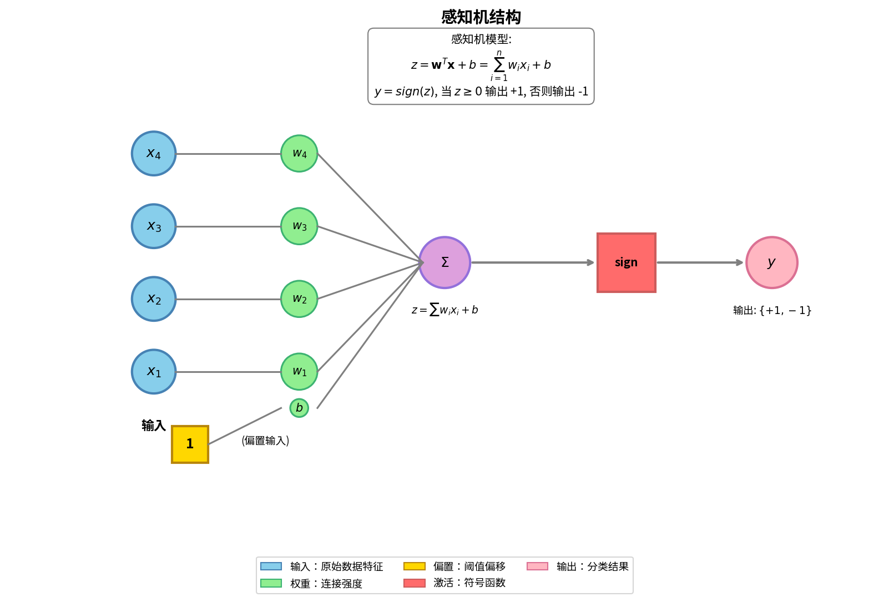
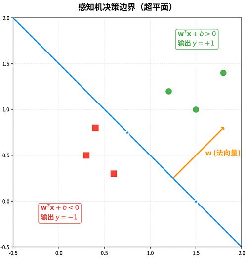
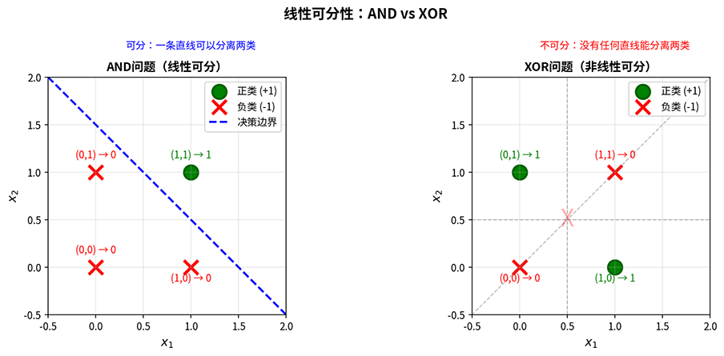

# 线性感知机

在上一章我们提到 1969 年《Perceptrons》一书对感知机提出了尖锐批评，指出其无法解决异或（XOR）问题，导致神经网络研究陷入长达十年的低谷。然而，批评本身恰恰揭示了感知机的本质特性 —— **线性可分性**（Linear Separability）。理解这一特性，有助于掌握感知机的工作原理，更能深刻认识神经网络从单层到多层演进的内在逻辑。

**感知机**（Perceptron）由心理学家弗兰克·罗森布拉特（Frank Rosenblatt）于 1957 年提出，是世界上第一个能够从数据中学习的神经网络模型。它在 M-P 模型的基础上引入了学习算法，能够自动调整权重，从而实现模式识别和分类任务。感知机的提出标志着神经网络从理论研究进入实践应用阶段，引发了第一次神经网络研究热潮。本章将详细介绍感知机的模型结构、几何解释、学习算法与收敛定理，并通过实验验证其学习能力与局限性。

## 感知机模型

感知机是一个单层神经网络，由输入层和输出层组成，没有隐藏层。整个感知机结构包括输入向量 $\mathbf{x} = (x_1, x_2, \ldots, x_n)^T$，权重向量 $\mathbf{w} = (w_1, w_2, \ldots, w_n)^T$，偏置（bias）$b$ 和结果输出 $\{+1, -1\}$。感知机结构如下图所示，其输出计算过程分为两步：

- 第一步 **线性组合**：计算输入的加权总和加上偏置 $z = \mathbf{w}^T \mathbf{x} + b = \sum_{i=1}^{n} w_i x_i + b$
- 第二步 **激活函数**：通过阈值函数（简单的正负符号函数）将线性输出转换为二值输出 $y = \begin{cases} 1 & \text{if } z \geq 0 \\ -1 & \text{if } z < 0 \end{cases}$



*图：感知机的结构*


感知机使用符号函数 $\text{sign}(z)$ 作为**激活函数**（Activation Function），输出值为 $\{1, -1\}$。在这个场景中，激活函数的作用是将连续的线性输出转化为离散的类别标签，实现分类决策。偏置 $b$ 可以理解为阈值 $\theta$ 的负值。在上一章的 [M-P 模型](idea-origin.md#mcculloch-pitts-模型)中，阈值条件是 $\sum w_i x_i \geq \theta$；若将阈值移项到左侧，变为 $\sum w_i x_i - \theta \geq 0$，则 $b = -\theta$。这种形式在数学处理上更为方便，因为决策边界可以统一写成 $\mathbf{w}^T \mathbf{x} + b = 0$。

为了便于推导，习惯上还会将偏置 $b$ 合并入权重向量，定义增广输入向量 $\tilde{\mathbf{x}} = (x_1, x_2, \ldots, x_n, 1)^T$ 和增广权重向量 $\tilde{\mathbf{w}} = (w_1, w_2, \ldots, w_n, b)^T$，这样感知机的输出可以更加简洁地表示为 $y = \text{sign}(\tilde{\mathbf{w}}^T \tilde{\mathbf{x}})$，这种表示方式将偏置视为一个常数输入 1 对应的权重，进一步简化了数学表示。后续讨论中，若无特殊说明，我们都使用增广向量形式，并省略增广标记，直接记为 $\mathbf{w}$ 和 $\mathbf{x}$。

感知机的决策边界是超平面方程 $\mathbf{w}^T \mathbf{x} = 0$。在二维空间中，决策边界是一条直线；在三维或更高维空间中则是一个超平面，这个超平面将输入空间划分为两个区域，当 $\mathbf{w}^T \mathbf{x} > 0$ 时输出 $y = 1$，表明结果属于正类；$\mathbf{w}^T \mathbf{x} < 0$ 时输出 $y = -1$，结果属于负类。决策边界的位置和方向由权重向量 $\mathbf{w}$ 决定。权重向量的方向垂直于决策边界（因为 $\mathbf{w}$ 是超平面的[法向量](../../statistical-learning/support-vector-machines/svm-max-margin.md#超平面、距离与间隔)），权重向量的长度决定了边界的"陡峭程度"，如下图例子所示。



*图：感知机的决策边界（超平面），法向量 $\mathbf{w}$ 垂直于决策边界，将空间分为正类区域和负类区域*

在前面讲解[线性模型](../../statistical-learning/linear-models/linear-regression.md)时，已经大量使用过**线性可分**（Linearly Separable）的概念，它是指存在一个超平面能够完全分离两类数据点，使得所有正类样本位于超平面一侧，所有负类样本位于另一侧。设训练数据集为 $D = \{(\mathbf{x}_i, y_i)\}_{i=1}^{N}$，其中 $\mathbf{x}_i \in \mathbb{R}^n$，$y_i \in \{1, -1\}$。数据集 $D$ 线性可分的定义是存在权重向量 $\mathbf{w}$，使得对所有样本都有 $y_i \cdot (\mathbf{w}^T \mathbf{x}_i) > 0$。

一个典型的线性可分的例子是 AND 逻辑运算，AND 运算的真值表有四种情况：$(0, 0) \rightarrow 0$（负类）、$(0, 1) \rightarrow 0$（负类）、$(1, 0) \rightarrow 0$（负类）、$(1, 1) \rightarrow 1$（正类）。在二维平面上，三个负类点 $(0,0)$、$(0,1)$、$(1,0)$ 和一个正类点 $(1,1)$ 可以被一条直线分开。决策边界 $x_1 + x_2 = 1.5$（或 $x_1 + x_2 - 1.5 = 0$）将正类点与其他点分离。

而典型的线性不可分例子就是 XOR 逻辑运算，XOR 运算的真值表为：$(0, 0) \rightarrow 0$（负类）、$(0, 1) \rightarrow 1$（正类）、$(1, 0) \rightarrow 1$（正类）、$(1, 1) \rightarrow 0$（负类）。在二维平面上，四个点呈"对角分布"，正类点位于对角线 $(0,1) - (1,0)$ 上，负类点位于另一条对角线 $(0,0) - (1,1)$ 上。任何直线要么穿过正类点之间，要么穿过负类点之间，不可能将它们正负分开，如下图所示。



*图：线性可分（AND）与线性不可分（XOR）的对比*

## 感知机学习算法

感知机直接继承于 M-P 模型的设计思想：加权求和、阈值决策、二值输出，两者的关键区别在于感知机拥有学习能力。M-P 模型的权重和阈值需要人工设定，而感知机引入了学习算法，能够根据训练数据自动调整权重和偏置，这一能力源于 [Hebb 学习规则](idea-origin.md#hebb-学习规则)中的权重可以根据神经元的活动进行调整。感知机将 Hebb 规则的**相关性学习**进一步发展为**错误驱动学习**，只有当预测错误时才调整权重，更新的方向使得下一次预测更接近正确结果。算法具体步骤十分直白，有如下三步：

- 第一步 **初始化**：权重向量 $\mathbf{w}$ 初始化为零向量或随机小值。
- 第二步 **迭代训练**：遍历训练数据，对每个样本 $(\mathbf{x}_i, y_i)$ 计算预测值 $\hat{y}_i = \text{sign}(\mathbf{w}^T \mathbf{x}_i)$。如果预测错误（$\hat{y}_i \neq y_i$），则更新权重 $\mathbf{w} \leftarrow \mathbf{w} + \eta \cdot y_i \cdot \mathbf{x}_i$，其中 $\eta > 0$ 是学习率，控制更新幅度。权重更新时：
    - 如果真实标签 $y_i = 1$ 但预测为 $-1$ 时（$\mathbf{w}^T \mathbf{x}_i < 0$），说明样本 $\mathbf{x}_i$ 落在了决策边界的错误一侧，更新规则 $\mathbf{w} \leftarrow \mathbf{w} + \eta \cdot \mathbf{x}_i$ 将权重向量向样本方向移动，使得 $\mathbf{w}^T \mathbf{x}_i$ 增大，更可能变为正值。
    - 同理，如果真实标签 $y_i = -1$ 但预测为 $1$ 时（$\mathbf{w}^T \mathbf{x}_i > 0$），更新规则 $\mathbf{w} \leftarrow \mathbf{w} - \eta \cdot \mathbf{x}_i$ 将权重向量远离样本方向，使得 $\mathbf{w}^T \mathbf{x}_i$ 减小，更可能变为负值。
- 第三步 **终止条件**：当所有样本都正确分类，或达到最大迭代次数时停止。

罗森布拉特证明了如果训练数据集是线性可分的，感知机学习算法必能在有限步内收敛到一个解，使得所有样本都被正确分类。同时，证明也从侧面承认如果数据非线性可分，算法可能无法收敛，权重会不断更新，永远存在错误分类的样本。这个结论揭示了多层网络的必要性，感知机直接对原始输入进行线性处理，并没有特征组合的能力。像 XOR 这类问题的实质是在问"是否恰有一个输入为 1"，这需要分类器能同时检测两个输入的组合特征，而非单独处理每个输入。这时候，只要增加一层隐藏层，先提取组合特征，再基于提取的特征做决策，就能顺利解决 XOR 问题。罗森布拉特本人应该已经意识到这一点，但困于无法对多层网络进行训练，这一问题直到 1980 年代反向传播算法提出后才被解决。

以下代码完整实现感知机学习算法，并验证其在线性可分（AND 问题）和非线性可分（XOR 问题）两类数据上的学习能力。

```python runnable extract-class="Perceptron"
import numpy as np
import matplotlib.pyplot as plt

class Perceptron:
    """
    感知机实现
    
    使用错误驱动的权重更新规则：
    w = w + eta * y * x (当预测错误时)
    """
    def __init__(self, learning_rate=1.0, max_iterations=1000):
        self.lr = learning_rate
        self.max_iter = max_iterations
        self.w = None  # 权重向量（包含偏置）
        self.errors_history = []  # 每轮迭代错误数
    
    def fit(self, X, y):
        """
        训练感知机
        
        Parameters:
        X : ndarray, shape (n_samples, n_features)
            输入特征矩阵
        y : ndarray, shape (n_samples,)
            标签向量，取值为 {1, -1}
        """
        n_samples, n_features = X.shape
        
        # 增广向量形式：添加常数1列（对应偏置）
        X_aug = np.column_stack([X, np.ones(n_samples)])
        
        # 初始化权重为零向量
        self.w = np.zeros(n_features + 1)
        
        # 训练循环
        for iteration in range(self.max_iter):
            errors = 0
            for i in range(n_samples):
                # 计算预测值
                prediction = np.sign(self.w @ X_aug[i])
                if prediction == 0:
                    prediction = -1  # 符号函数边界情况
                
                # 若预测错误，更新权重
                if prediction != y[i]:
                    self.w += self.lr * y[i] * X_aug[i]
                    errors += 1
            
            self.errors_history.append(errors)
            
            # 若所有样本正确分类，提前终止
            if errors == 0:
                print(f"在第 {iteration + 1} 轮迭代后收敛")
                break
        
        return self
    
    def predict(self, X):
        """
        预测
        
        Parameters:
        X : ndarray, shape (n_samples, n_features)
        
        Returns:
        predictions : ndarray, shape (n_samples,)
            预测标签 {1, -1}
        """
        n_samples = X.shape[0]
        X_aug = np.column_stack([X, np.ones(n_samples)])
        predictions = np.sign(X_aug @ self.w)
        predictions[predictions == 0] = -1
        return predictions
    
    def score(self, X, y):
        """计算准确率"""
        predictions = self.predict(X)
        return np.mean(predictions == y)


# 实验1：线性可分数据
print("=" * 50)
print("实验1：线性可分数据（AND逻辑）")
print("=" * 50)

# AND数据：三个负类，一个正类
X_and = np.array([[0, 0], [0, 1], [1, 0], [1, 1]])
y_and = np.array([-1, -1, -1, 1])  # 用 -1 表示类别0

model_and = Perceptron(learning_rate=1.0, max_iterations=100)
model_and.fit(X_and, y_and)

print(f"学习到的权重: w1={model_and.w[0]:.2f}, w2={model_and.w[1]:.2f}, b={model_and.w[2]:.2f}")
print(f"决策边界: {model_and.w[0]:.2f}*x1 + {model_and.w[1]:.2f}*x2 + {model_and.w[2]:.2f} = 0")
print(f"训练准确率: {model_and.score(X_and, y_and):.2%}")

# 实验2：线性不可分数据（XOR逻辑）
print("\n" + "=" * 50)
print("实验2：线性不可分数据（XOR逻辑）")
print("=" * 50)

# XOR数据
X_xor = np.array([[0, 0], [0, 1], [1, 0], [1, 1]])
y_xor = np.array([-1, 1, 1, -1])  # XOR: 两个为1或两个为0输出0，其他输出1

model_xor = Perceptron(learning_rate=1.0, max_iterations=100)
model_xor.fit(X_xor, y_xor)

print(f"训练准确率: {model_xor.score(X_xor, y_xor):.2%}")
print(f"说明: XOR问题非线性可分，感知机无法收敛到正确解")

# 可视化
fig, axes = plt.subplots(1, 3, figsize=(15, 5))

# 图1：AND问题的决策边界
def plot_decision_boundary(ax, X, y, model, title):
    # 绘制数据点
    colors = ['blue' if label == 1 else 'red' for label in y]
    ax.scatter(X[:, 0], X[:, 1], c=colors, s=100, edgecolors='k', linewidth=2)
    
    # 绘制决策边界
    w1, w2, b = model.w
    if w2 != 0:
        x_line = np.linspace(-0.5, 1.5, 100)
        y_line = -(w1 * x_line + b) / w2
        ax.plot(x_line, y_line, 'g-', linewidth=2, label='决策边界')
    
    ax.set_xlim(-0.5, 1.5)
    ax.set_ylim(-0.5, 1.5)
    ax.set_xlabel('x1')
    ax.set_ylabel('x2')
    ax.set_title(title)
    # ax.legend()
    ax.grid(True, alpha=0.3)

plot_decision_boundary(axes[0], X_and, y_and, model_and, 'AND问题（线性可分）')
plot_decision_boundary(axes[1], X_xor, y_xor, model_xor, 'XOR问题（非线性可分）')

# 图3：收敛过程对比
axes[2].plot(model_and.errors_history, 'b-', linewidth=2, label='AND（收敛）')
axes[2].plot(model_xor.errors_history, 'r-', linewidth=2, label='XOR（不收敛）')
axes[2].set_xlabel('迭代轮数')
axes[2].set_ylabel('错误样本数')
axes[2].set_title('收敛过程对比')
axes[2].legend()
axes[2].grid(True, alpha=0.3)

plt.tight_layout()
plt.show()
plt.close()
```

## 本章小结

本章详细介绍了罗森布拉特的感知机模型，包括其结构、几何解释、学习算法与收敛定理。感知机是历史上第一个可学习的神经网络模型，其核心贡献在于引入了错误驱动的学习机制，能够从数据中自动调整权重。感知机的决策边界是线性超平面，这决定了其表达能力只能解决线性可分的分类问题，也暗示了非线性可分数据上的必然失败。然而，非线性可分问题给感知机的发展指明了方向，通过增加隐藏层，构建多层网络，先提取组合特征再做决策，可以解决非线性问题。问题的关键在于如何训练多层网络，这将在下一章[多层感知机](mlp.md)中展开讨论，并在后续章节"反向传播算法"中得到解决。

## 练习题

1. 证明感知机权重更新规则 $\mathbf{w} \leftarrow \mathbf{w} + \eta \cdot y_i \cdot \mathbf{x}_i$ 能够使错误分类样本的预测值朝正确方向移动。即证明更新后，$y_i \cdot (\mathbf{w}_{new}^T \mathbf{x}_i) > y_i \cdot (\mathbf{w}_{old}^T \mathbf{x}_i)$。
    <details>
    <summary>参考答案</summary>
    
    设更新前权重为 $\mathbf{w}$，样本 $(\mathbf{x}_i, y_i)$ 被错误分类，即 $y_i \cdot (\mathbf{w}^T \mathbf{x}_i) < 0$。
    
    更新后权重 $\mathbf{w}_{new} = \mathbf{w} + \eta \cdot y_i \cdot \mathbf{x}_i$。
    
    计算更新后的预测值：
    $$\mathbf{w}_{new}^T \mathbf{x}_i = (\mathbf{w} + \eta \cdot y_i \cdot \mathbf{x}_i)^T \mathbf{x}_i = \mathbf{w}^T \mathbf{x}_i + \eta \cdot y_i \cdot \mathbf{x}_i^T \mathbf{x}_i$$
    
    注意 $\mathbf{x}_i^T \mathbf{x}_i = \|\mathbf{x}_i\|^2 > 0$（假设样本不为零向量），$\eta > 0$。
    
    因此：
    $$y_i \cdot (\mathbf{w}_{new}^T \mathbf{x}_i) = y_i \cdot (\mathbf{w}^T \mathbf{x}_i) + \eta \cdot y_i^2 \cdot \|\mathbf{x}_i\|^2$$
    
    由于 $y_i^2 = 1$（标签为 $\pm 1$），$\|\mathbf{x}_i\|^2 > 0$，$\eta > 0$，所以：
    $$y_i \cdot (\mathbf{w}_{new}^T \mathbf{x}_i) = y_i \cdot (\mathbf{w}^T \mathbf{x}_i) + \eta \cdot \|\mathbf{x}_i\|^2 > y_i \cdot (\mathbf{w}^T \mathbf{x}_i)$$
    
    这证明了更新后，$y_i \cdot (\mathbf{w}_{new}^T \mathbf{x}_i)$ 比更新前增大了 $\eta \cdot \|\mathbf{x}_i\|^2$。如果更新足够多次，$y_i \cdot (\mathbf{w}^T \mathbf{x}_i)$ 最终会变为正值，样本将被正确分类。
    
    **关键洞察**：每次更新都将预测值朝正确方向移动一个固定步长 $\eta \cdot \|\mathbf{x}_i\|^2$。这就是"错误驱动学习"的本质：只纠正错误，不优化正确。
    </details>

1. 设计一个两层感知机解决 OR 逻辑运算，写出各层神经元的权重和阈值设置，并验证其正确性。OR 运算定义：$(0,0)\rightarrow 0$，$(0,1)\rightarrow 1$，$(1,0)\rightarrow 1$，$(1,1)\rightarrow 1$。
    <details>
    <summary>参考答案</summary>
    设感知机模型 $y = \text{sign}(w_1 x_1 + w_2 x_2 + b)$。选择权重 $w_1 = 1, w_2 = 1, b = -0.5$。

    验证：
    - $(0,0)$：$0 + 0 - 0.5 = -0.5 < 0$，输出 $-1$（类别 0） ✓
    - $(0,1)$：$0 + 1 - 0.5 = 0.5 > 0$，输出 $1$ ✓
    - $(1,0)$：$1 + 0 - 0.5 = 0.5 > 0$，输出 $1$ ✓
    - $(1,1)$：$1 + 1 - 0.5 = 1.5 > 0$，输出 $1$ ✓
    
    决策边界 $x_1 + x_2 = 0.5$ 是一条直线，将原点（类别 0）与其他三点（类别 1）分开。OR 数据线性可分，单层感知机足以解决。
    </details>