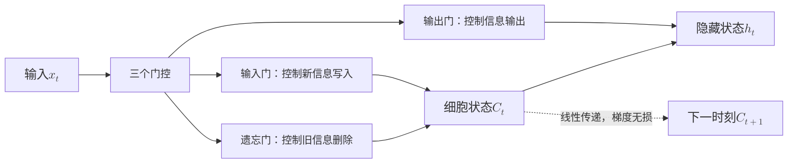
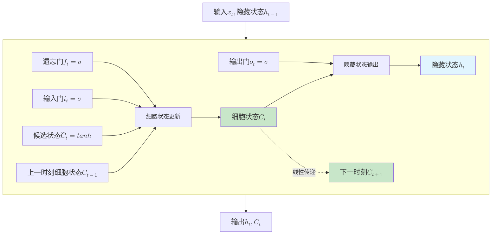
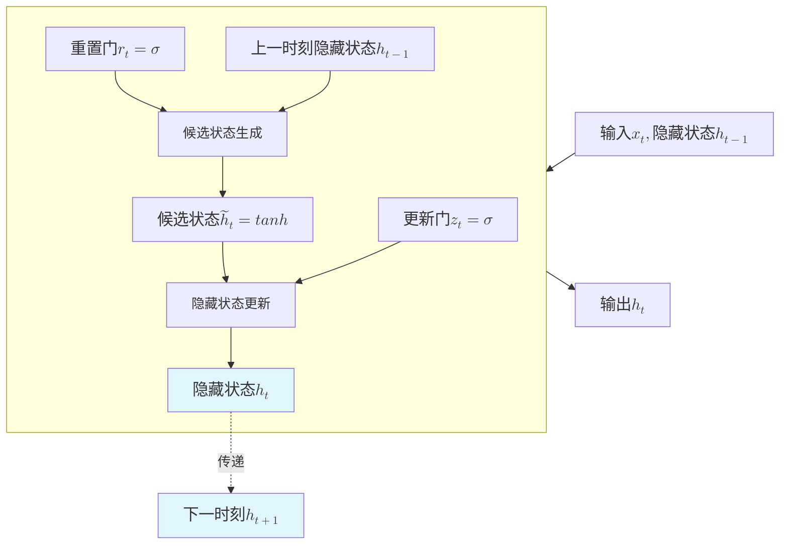

# LSTM 与 GRU 门控机制

上一篇文章介绍了 RNN 的基本原理和它未能解决的问题：梯度消失导致无法学习长期依赖。当序列长度超过 10-20 个时刻，早期时刻的信息在传递到后期时几乎消失殆尽，网络无法记住"很久之前"的内容。这个问题的根源在于 RNN 的信息传递机制。每个时刻，隐藏状态 $h_t$ 通过一个简单的线性变换和激活函数更新：

$$h_t = \tanh(W_{hh} h_{t-1} + W_{xh} x_t)$$

这种设计存在两个固有缺陷。第一，强制压缩，无论历史信息是否重要，都必须压缩到固定维度的 $h_t$ 中，信息密度过高容易丢失细节。第二，无选择性，所有历史信息以相同权重传递，无法区分"需要记住的关键信息"和"可以遗忘的无关细节"，导致信息冗余和关键信息丢失同时发生。

人类阅读文章时，不会记住每个词的细节，而是记住关键信息（如主角名字、事件要点），遗忘无关细节（如形容词、过渡词）。RNN 缺乏这种选择性记忆能力，像是一个被迫记住所有流水账细节的糟糕记笔记者，最终什么都记不清楚。

1997 年，德国计算机科学家塞普·霍赫赖特（Sepp Hochreiter）和他的导师尤尔根·施密德胡伯（Jürgen Schmidhuber）在神经计算期刊《Neural Computation》上发表了论文《Long Short-Term Memory》，首次提出了**长短期记忆网络**（Long Short Term Memory，LSTM）。这篇论文的主旨是如何让神经网络学会选择性记忆，记住重要信息，遗忘无关细节。文章的关键创新是引入细胞状态和门控机制，让网络自己学习哪些信息需要长期保留，哪些需要及时清除。LSTM 能够处理跨越超过 100 个时刻的长期依赖，在语音识别、机器翻译、时间序列预测等任务上都取得了突破性进展，成为深度学习处理序列数据的核心工具，直到注意力机制和 Transformer 架构出现之后局面才被改变。

2014 年，韩国计算机科学家曹庆铉（Cho Kyunghyun）在论文《Learning Phrase Representations using RNN Encoder-Decoder for Statistical Machine Translation》中提出了**门控循环单元**（Gated Recurrent Unit，GRU），作为 LSTM 的简化版本。GRU 将 LSTM 的三个门合并为两个，去除独立的细胞状态，减少参数量和计算开销，同时在多数任务上保持了相近的性能。本文将详细介绍 LSTM 和 GRU 的原理、结构设计、训练方法，以及两者的对比选择策略。

## LSTM 结构与门控机制

LSTM 使用**细胞状态**（Cell State，$C_t$）作为信息传递机制，由细胞状态产生出隐藏状态 $h_t$ ，这与 RNN 通过循环连接处理隐藏状态 $h_t$ 有着本质区别。细胞状态 $C_t$ 可以理解为一根贯穿整个序列的信息传送带，从序列的起始时刻一直传递到结束时刻，途中不经过任何非线性激活函数压缩，只通过线性加法和逐元素乘法进行更新。这种设计使得细胞状态能够长期保存信息而不会因连续的非线性变换导致数值衰减或爆炸。细胞状态只存储和传递需要长期保留的信息，不直接参与对外输出，而是作为隐藏状态 $h_t$ 的信息来源。

细胞状态与 LSTM 的三个门控机制协同工作，遗忘门清除细胞状态中的旧信息，输入门在细胞状态中写入新信息，输出门读取当前需要的信息。三者协同，让网络学会区分重要与次要，自己决定哪些信息需要保留、哪些需要遗忘、哪些需要输出，缓解了 RNN 处理长期依赖能力不足的问题。


*图：LSTM 的信息流动模型*

上图展示了 LSTM 的信息流动模型。输入数据经过三个门控处理后，影响细胞状态和隐藏状态。细胞状态通过线性传递到达下一时刻（虚线箭头）。不妨将 LSTM 类比为一个笔记本来直观理解各组件的作用。细胞状态 $C_t$ 是笔记本的内容，存储长期信息，不受时刻间的非线性变换干扰；遗忘门决定擦除笔记本上的哪些旧内容，腾出空间；输入门决定在笔记本上写入哪些新内容，更新记忆；输出门决定从笔记本中读出哪些内容作为当前答案。这种设计赋予 LSTM 选择性保留（重要信息长期存储在 $C_t$ 中）、选择性遗忘（无关信息被遗忘门清除）和选择性输出（根据当前任务需要读取相关信息）能力。

### 数学表示

LSTM 的每个门控都有其明确的数学表示，理解这些公式不需要深厚的数学背景，因为每个符号都有符合物理直觉的实际含义。

- **遗忘门**：LSTM 在每个时刻执行计算之前，首先通过遗忘门决定应该从上一时刻的细胞状态中遗忘多少信息。遗忘门的数学表达式为：

    $$f_t = \sigma(W_f \cdot [h_{t-1}, x_t] + b_f)$$

    公式中 $W_f$ 是遗忘门的权重矩阵，控制输入信息如何影响遗忘决策；$[h_{t-1}, x_t]$ 是上一时刻隐藏状态和当前输入的拼接，包含所有可用于判断的信息；$b_f$ 是偏置项，调整遗忘门的基准输出；$\sigma$ 是 Sigmoid 激活函数，将输出压缩到 $[0, 1]$ 范围。$f_t$ 是遗忘向量，每个元素在 $[0, 1]$ 范围内，$f_t^i = 0$ 表示完全遗忘细胞状态的第 $i$ 个维度，$f_t^i = 1$ 表示完全保留。

- **输入门**：决定哪些新信息需要写入细胞状态，输入门的数学表达式为：

    $$i_t = \sigma(W_i \cdot [h_{t-1}, x_t] + b_i)$$

    公式结构看起来与遗忘门完全相同，只是权重矩阵 $W_i$ 和偏置项 $b_i$ 的值有差异。输入门输出 $i_t$ 同样在 $[0, 1]$ 范围内，控制新信息的写入程度。$i_t^i = 0$ 表示不写入第 $i$ 维度，$i_t^i = 1$ 表示完全写入候选内容。候选细胞状态产生当前时刻可能需要存储的新信息为：

    $$\tilde{C}_t = \tanh(W_C \cdot [h_{t-1}, x_t] + b_C)$$

    公式中 $W_C$ 是候选状态的权重矩阵，$b_C$ 是偏置项；tanh 的输出范围 $[-1, 1]$，允许新信息可以是"正向"或"负向"的。$\tilde{C}_t$ 是候选写入内容，包含当前时刻的新信息，等待输入门筛选后写入细胞状态。

- **细胞状态更新**：LSTM 使用遗忘门和输入门完成细胞状态的更新，将旧信息和新信息融合：

    $$C_t = f_t \odot C_{t-1} + i_t \odot \tilde{C}_t$$

    公式中 $f_t \odot C_{t-1}$ 是保留的旧信息（$\odot$ 是逐元素乘法），遗忘门逐维控制每个细胞状态元素的保留程度；$i_t \odot \tilde{C}_t$ 是写入的新信息，输入门逐维控制候选内容的写入程度。公式表明细胞状态是旧信息和新信息的加权融合，权重由遗忘门和输入门动态决定。这个公式中没有出现任何非线性变换，所以细胞状态 $C_t$ 的更新是线性加法，梯度传递时不经过激活函数。$C_t$ 对前一个时刻的梯度 $C_{t-1}$ 的导数为 $f_t$（$\frac{\partial C_t}{\partial C_{t-1}} = f_t$），如果遗忘门选择保留信息（$f_t \approx 1$），梯度可以几乎无损地传递，这就是 LSTM 能缓解梯度消失，能够处理跨越超过 100 个时刻的长期依赖的数学依据。

- **输出门**：决定从细胞状态中读取多少信息作为当前输出，输出门的数学表达式为：

    $$o_t = \sigma(W_o \cdot [h_{t-1}, x_t] + b_o)$$

    输出门公式的结构也与遗忘门、输入门相同，只是权重矩阵 $W_o$ 和偏置项 $b_o$ 的值不同。输出门输出 $o_t$ 在 $[0, 1]$ 范围内，控制细胞状态信息对外输出的程度。隐藏状态是 LSTM 的对外输出，用于传递给下一时刻和计算最终预测：

    $$h_t = o_t \odot \tanh(C_t)$$

    公式中 $o_t \odot \tanh(C_t)$ 是输出门控制的读取内容，$\tanh(C_t)$ 将细胞状态压缩到 $[-1, 1]$ 范围，输出门逐维控制输出程度。隐藏状态 $h_t$ 是细胞状态经过 tanh 压缩和输出门筛选后的结果，而非直接输出 $C_t$，细胞状态用于长期存储，隐藏状态用于对外输出，两者职责分离。

将上述数学公式综合起来，LSTM 的完整结构可以用下图清晰展示。图中包含三个门控、一个候选状态生成器、细胞状态更新和隐藏状态输出，信息流动路径一目了然。


*图：LSTM 单元内部结构*

上图展示了 LSTM 单元的完整结构。遗忘门、输入门、输出门分别控制信息的清除、写入和读取。细胞状态（绿色）通过线性传递到达下一时刻，这是解决梯度消失的核心设计。隐藏状态（蓝色）是对外输出，用于预测和下一时刻计算。

LSTM 的信息流动有两条路径，各有不同职责。一条是长期路径（细胞状态 $C_t$），线性传递，梯度无显著衰减，用于存储长期信息。另一条是短期路径（隐藏状态 $h_t$），非线性变换（tanh），用于当前输出和门控计算。隐藏状态经过输出门筛选和 tanh 压缩，梯度会衰减，这是预期行为，短期信息本就应该随时间淡化。双路径设计是 LSTM 的特色，也是它名字的来由，长期信息通过细胞状态稳定传递，短期信息通过隐藏状态快速处理，两者分工明确。

现在让我们回到 RNN 中未能解决的[长距离依赖例子](rnn-basics.md#梯度传递与局限)，重新代入 LSTM 的门控机制和细胞状态，看会发生什么变化。仍以句子"The cat, which already ate a fish, was hungry"为例：

- 遗忘门控制哪些旧信息需要清除。当读到"ate"时，网络需要判断哪些历史信息后续仍然需要。遗忘门会清除"which" —— 这只是连接词，不影响后续理解；同时保留"cat" —— 这是主语，后续动词需要依赖它；保留"ate" —— 这是动词，后续"hungry"的解释需要它。遗忘门的学习目标就是识别哪些历史信息是关键骨架，哪些是填充细节，清除细节保留骨架。

- 输入门控制哪些新信息需要写入。当读到"fish"时，网络需要判断是否将"fish"写入细胞状态。输入门会写入"fish" —— 这是新信息，后续可能需要；同时抑制"already" —— 这是修饰词，不写入也不会影响核心语义。输入门的学习目标是识别当前输入中哪些是关键新信息，哪些是无关噪声，只写入关键信息避免冗余。

- 输出门控制哪些信息需要对外输出。当读到"hungry"时，网络需要生成当前时刻的隐藏状态，用于预测或传递。输出门会读取"cat" —— 这是主语，需要输出给预测层；读取"ate" —— 这是上下文，解释为什么"hungry"；同时抑制"fish"的细节 —— 虽然存在细胞状态中，但当前时刻不需要输出。输出门的学习目标是识别当前任务需要哪些信息，只输出相关内容避免干扰。

三个门的协同工作实现了选择性记忆的完整循环。LSTM 就像一个高效的笔记管理者，定期清理过时内容腾出空间，及时记录重要新闻更新笔记，根据任务需求精准调取相关信息。门控的价值在于让网络学会何时记住、何时遗忘、何时输出，而非像 RNN 那样无差别地传递所有信息。

## GRU 简化设计

LSTM 的三门设计虽然有效，但结构复杂、参数量大，计算开销较高。GRU（Gated Recurrent Unit）的设计意图是尽可能简化 LSTM 的门控机制。分析 LSTM 的门控设计可以发现遗忘门控制旧信息保留，输入门控制新信息写入，两者是互补关系，保留更多旧信息，通常意味着写入更少新信息，反之亦然。这种互补性暗示可以用同一个门控制新旧信息的平衡，而非分别设置两个门。

GRU 将遗忘门和输入门合并为一个**更新门**（Update Gate, $z_t$），用同一个门控参数同时控制旧信息保留和新信息写入。更新门输出 $z_t$ 接近 0 时，保留旧信息、较少写入新信息；$z_t$ 接近 1 时，写入新信息、较少保留旧信息。这用一个参数取代了 LSTM 的两个门，简化了网络结构。

此外，GRU 去除了细胞状态 $C_t$，直接使用隐藏状态 $h_t$ 作为信息存储单元，进一步简化了结构。LSTM 需要维护细胞状态和隐藏状态两条信息路径，GRU 只需一条。代价是牺牲了 LSTM 的信息线性传递的设计，GRU 的梯度传播仍然会经过非线性变换（tanh），在超长期依赖处理能力上要逊于 LSTM。但在中等长度依赖（如 20-50 时刻）上，GRU 因其简化设计不影响性能，且参数少、计算快，成为实践中的主流选择。取消细胞状态后，也不再需要有专门的输出门去控制信息对外输出，取而代之的是 GRU 独有的设计 —— **重置门**（Reset Gate, $r_t$），用于控制计算候选隐藏状态时对旧信息的依赖程度。

### 数学表示

GRU 的设计思想转化为具体的数学公式，与 LSTM 相比结构更加简洁。GRU 包含两个门控：

- **更新门**：在每个时刻首先通过更新门决定新旧信息的平衡，更新门的数学表达式为：

    $$z_t = \sigma(W_z \cdot [h_{t-1}, x_t] + b_z)$$

    这个公式依然保持着与 LSTM 三个门控一样的结构，只是 $W_z$ 替换为更新门的权重矩阵，控制输入信息如何影响新旧信息的平衡决策。$z_t^i \approx 0$ 表示第 $i$ 维度保留旧信息、较少写入新信息；$z_t^i \approx 1$ 表示写入新信息、较少保留旧信息，用一个参数取代了 LSTM 的遗忘门和输入门两个参数。

- **重置门**：决定计算候选隐藏状态时保留多少旧信息，重置门的数学表达式为：

    $$r_t = \sigma(W_r \cdot [h_{t-1}, x_t] + b_r)$$

    这个公式依然保持一致的结构，重置门输出 $r_t$ 在 $[0, 1]$ 范围内，$r_t^i \approx 0$ 表示忽略第 $i$ 维度的旧信息，候选状态完全由当前输入决定，适用于历史无关的场景；$r_t^i \approx 1$ 表示候选状态融合旧信息和当前输入，适用于历史相关的场景。候选隐藏的数学表达式为：

    $$[gru_rest]\tilde{h}_t = \tanh(W \cdot [r_t \odot h_{t-1}, x_t] + b)$$

    公式中 $r_t \odot h_{t-1}$ 是重置门控制的旧信息，逐维描述旧信息的参与程度；$[r_t \odot h_{t-1}, x_t]$ 是重置后的旧信息和当前输入的拼接。$\tilde{h}_t$ 是候选写入内容，包含被重置门控制的历史信息和当前时刻的新信息，等待更新门筛选后写入隐藏状态。

- **隐藏状态更新**：GRU 通过隐藏状态的更新将旧信息和新信息融合：

    $$[gru_ht]h_t = (1 - z_t) \odot h_{t-1} + z_t \odot \tilde{h}_t$$

    公式中 $(1 - z_t) \odot h_{t-1}$ 是保留的旧信息的程度，逐维控制每个隐藏状态元素的保留；$z_t \odot \tilde{h}_t$ 是写入的新信息的程度，逐维控制候选内容的写入。隐藏状态是旧信息和新信息的加权融合，权重由更新门动态决定。$(1 - z_t)$ 和 $z_t$ 互补，总和为 1，这保证新旧信息的权重自动平衡，保留更多旧信息必然意味着写入更少新信息，反之亦然。这种设计用一个门控参数实现了 LSTM 两个门的功能，简化了结构但不牺牲选择性记忆能力。

将上述数学公式综合起来，GRU 的完整结构可以用下图清晰展示。图中包含两个门控、一个候选状态生成器、隐藏状态更新，信息流动路径相对 LSTM 有所简化。


*图：GRU 单元内部结构*

上图展示了 GRU 单元的完整结构。与 LSTM 相比，GRU 的信息流动更加简洁，LSTM 需要两条路径，细胞状态用于长期存储，隐藏状态用于对外输出。GRU 只有一条路径，隐藏状态直接存储信息，同时承担长期存储和对外输出的双重职责。这种简化牺牲了 LSTM 信息线性传递的设计，但依然相对于 RNN  缓解了梯度消失的影响，能够在中等长度依赖任务上与 LSTM 表现相近。

### 梯度流动

GRU 梯度传递仍然会经过非线性变换。分析这条路径的梯度传播特性，可以理解 GRU 是如何缓解梯度消失的。根据 GRU 的隐藏状态更新公式 {{gru_ht}} 和重置门计算公式 {{gru_rest}}。梯度对上一时刻隐藏状态的导数为：

$$\frac{\partial h_t}{\partial h_{t-1}} = (1 - z_t) + z_t \odot \frac{\partial \tilde{h}_t}{\partial h_{t-1}}$$

如果更新门 $z_t \approx 0$，这第一项接近 1，梯度可以无损传递，相当于保留旧信息时的线性路径；$z_t \odot \frac{\partial \tilde{h}_t}{\partial h_{t-1}}$ 是第二项，经过 tanh 的导数（最大值 1，典型值约 0.5），仍然会不断衰减，造成梯度消失。可以将 GRU 的梯度传递看作是"线性部分"和"非线性部分"的加权组合，权重由更新门动态决定。对于需要长期记忆的依赖关系，网络会学习到更新门输出接近 0，尽可能保留旧信息，梯度尽可能无损传递。但相比 LSTM，GRU 的梯度传递仍然需要经过非线性变换（$\tilde{h}_t$ 经过 tanh），在超长期依赖（如 100+ 时刻）依然逊于 LSTM，这是 GRU 简化设计的代价，换取更少的参数和更快的计算速度。

## 训练技巧与最佳实践

LSTM 和 GRU 虽然在理论上一定程度避免 RNN 的梯度消失问题，但实际应用中的训练仍然面临诸多挑战，如序列数据的长度不一致、循环展开后的参数共享特性、以及时间维度上的梯度累积效应，使得这些模型对训练技巧的依赖程度高于前馈网络。没有合理的序列处理、正则化和超参数配置，模型容易出现训练不稳定、过拟合或计算效率低下等问题。本节介绍一些经过实践验证的训练技巧：

- **序列处理**：实际数据中，序列长度往往不一致，如何高效处理变长序列是 LSTM/GRU 训练的关键技巧。常见处理方法有截断（过长序列截断到固定长度）、填充（短序列用零填充到固定长度）和打包（使用 `pack_padded_sequence` 避免填充部分的无效计算）三种。其中打包是最高效的方法，可以跳过填充部分的 LSTM 计算，节省计算资源并保证最后时刻的隐藏状态是真实有效状态。下面的代码演示 `pack_padded_sequence` 的使用方式。

    ```python runnable
    import torch
    import torch.nn as nn

    # 处理变长序列
    from torch.nn.utils.rnn import pack_padded_sequence, pad_packed_sequence

    # 假设有三个不同长度的序列
    sequences = [
        torch.randn(5, 10),   # 长度 5
        torch.randn(3, 10),   # 长度 3
        torch.randn(7, 10),   # 长度 7
    ]

    # 填充到相同长度
    max_len = max(len(seq) for seq in sequences)
    padded = torch.zeros(len(sequences), max_len, 10)

    for i, seq in enumerate(sequences):
        padded[i, :len(seq)] = seq

    print(f"填充后的序列形状: {padded.shape}")

    # 使用 pack_packed_sequence 优化计算
    lstm = nn.LSTM(input_size=10, hidden_size=16, batch_first=True)
    # 记录每个序列的实际长度
    lengths = torch.tensor([len(seq) for seq in sequences])
    # 打包（忽略填充部分）
    packed = pack_padded_sequence(padded, lengths.cpu(), batch_first=True, enforce_sorted=False)
    # LSTM 处理打包序列
    packed_out, (h_n, c_n) = lstm(packed)
    # 解包（恢复到填充形状）
    out, _ = pad_packed_sequence(packed_out, batch_first=True)

    print(f"处理后的输出形状: {out.shape}")
    print(f"最后时刻的隐藏状态形状: {h_n.shape}")
    ```

- **正则化技巧**：LSTM 和 GRU 的正则化需要格外小心，因为循环结构在时间维度展开后，传统的 [Dropout](../neural-network-stability/dropout.md) 方法可能导致信息断裂。Dropout 的应用有两种方式，一是层间 Dropout（通过 `nn.LSTM(dropout=0.1)` 参数设置），在多层网络的层与层之间应用，第一层的输出在传递给第二层前随机屏蔽部分单元，二是时间维度 Dropout，在某些时刻随机屏蔽输入，防止网络过度依赖特定时刻的信息。层间 Dropout 是 PyTorch 内置的，使用方便且效果稳定，时间维度 Dropout 需要手动实现，适用于特别容易在时间维度过拟合的场景。

    梯度裁剪是 LSTM/GRU 训练的另一类正则化技巧。虽然门控机制一定程度避免了梯度消失，但梯度爆炸仍然可能发生，当门控输出异常大时，梯度可能瞬间放大，导致参数更新幅度过大，训练不稳定。梯度裁剪通过限制梯度的最大范数，防止参数更新过于剧烈，这是循环网络训练的标配技巧。下面的代码展示梯度裁剪的实现方式。

    ```python
    # 训练时添加梯度裁剪
    optimizer = torch.optim.Adam(model.parameters(), lr=0.01)

    for epoch in range(epochs):
        optimizer.zero_grad()
        loss = compute_loss(model, X, Y)
        loss.backward()
        
        # 梯度裁剪（防止梯度爆炸）
        torch.nn.utils.clip_grad_norm_(model.parameters(), max_norm=1.0)
        
        optimizer.step()
    ```

- **超参数调优**：LSTM 和 GRU 的超参数调优遵循渐进式策略，优先调整影响最大的参数。

    | 超参数 | 建议范围 | 说明 |
    |:-------|:---------|:-----|
    | hidden_size | 32-256 | 根据任务复杂度选择 |
    | num_layers | 1-2 | 多数任务 1-2 层足够 |
    | dropout | 0-0.3 | 小数据集用较高值 |
    | learning_rate | 0.001-0.01 | Adam 通常 0.001-0.005 |
    | batch_size | 32-128 | 根据内存调整 |

    调优策略遵循渐进式原则，按影响程度排序。首先调整 `hidden_size`（影响最大），决定模型的记忆容量和表达能力，太小会丢失信息，太大会增加计算开销和过拟合风险。其次调整 `num_layers`（复杂任务增加层数），大多数任务 1-2 层足够，复杂任务可以尝试 3 层。最后调整 `dropout`（防止过拟合），小数据集使用较高值（0.2-0.3），大数据集可以使用较低值（0-0.1）。这种渐进式调优策略避免同时调整多个参数导致的混乱，每次只改变一个变量，清晰追踪效果变化。

## 本章小结

本文介绍了 LSTM 和 GRU 两种门控循环神经网络，它们都在一定程度上解决了 RNN 的梯度消失问题，赋予网络选择性记忆能力。两者解决梯度问题的机制各有特点。LSTM 通过细胞状态的线性传递，梯度无显著衰减，适合超长期依赖。GRU 通过更新门控制信息保留，当更新门输出接近 0 时梯度传递接近线性，缓解梯度消失，适合中等长度依赖。两者都通过门控机制实现选择性记忆,使得网络学会何时保留、何时遗忘，而非 RNN 那样无差别地传递所有信息。

选择策略取决于任务特性和资源约束。超长期依赖任务优先 LSTM，计算资源受限或中等依赖任务优先 GRU。实际项目中通常用混合策略，先用 GRU 快速验证想法，效果不佳再尝试 LSTM，这种先快后慢的策略在资源有限时更高效。2017 年 Transformer 架构提出后，凭借自注意力机制在 NLP 领域取得了远超 RNN 系列模型的性能，随后又在计算机视觉、多模态等领域全面扩展。2023 年全球大语言模型的爆发更是将 Transformer 推向了绝对的主流地位。但 LSTM 和 GRU 仍然在多个领域发挥着不可替代的作用：

- **计算资源受限场景**：Transformer 的自注意力机制计算复杂度为 $O(n^2)$，序列长度翻倍，计算量增长四倍。LSTM/GRU 的复杂度为 $O(n)$，线性增长。在边缘设备、嵌入式系统或移动应用中，LSTM/GRU 的参数量和计算开销远低于 Transformer，是更实际的选择。例如一个 128 维隐藏状态的单层 GRU 仅有约 33K 参数，而同等规模的轻量级 Transformer 参数量通常此数百倍以上。

- **流式处理与实时推理**：Transformer 需要看到完整序列才能计算全局注意力，无法在数据到达的同时逐步输出。LSTM/GRU 是天然的自回归模型，每个时刻只依赖当前输入和上一时刻状态，更适合语音识别的实时转写、传感器数据的在线监测、股票行情的连续预测等场景。

- **时间序列预测**：在单变量时间序列（如销售额预测、气温预报、设备故障预警）等任务上，大量基准测试表明 LSTM/GRU 经常与 Transformer 表现相当甚至更优，因为这类任务的核心是捕捉短期趋势和周期性模式，而非长距离语义关联，LSTM/GRU 的时序建模能力已经足够。

- **教学与入门**：LSTM 的门控机制是理解现代深度学习架构的重要基石。Transformer 的残差连接、归一化层、门控前馈网络等设计都可以追溯到 LSTM 中的信息控制思想。先理解 LSTM 的选择性记忆机制，再学习 Transformer 的注意力机制，是一条被广泛验证的渐进式学习路径。

## 练习题

1. 解释 LSTM 的细胞状态为什么能缓解梯度消失，从数学推导和信息流动两个角度说明，并与 RNN 的梯度传递路径进行对比。
    <details>
    <summary>参考答案</summary>

    **数学推导角度**：

    LSTM 细胞状态的更新公式为 $C_t = f_t \odot C_{t-1} + i_t \odot \tilde{C}_t$，对 $C_{t-1}$ 求导得到 $\frac{\partial C_t}{\partial C_{t-1}} = f_t$。梯度沿时间回传时，总梯度为各时刻导数的连乘：

    $$\frac{\partial C_t}{\partial C_1} = f_t \odot f_{t-1} \odot \cdots \odot f_2$$

    关键在于遗忘门 $f_t$ 的值由 Sigmoid 函数输出，范围 $[0, 1]$，且网络可以通过学习使 $f_t \approx 1$。当需要长期记忆时，网络学会让遗忘门接近 1，梯度连乘结果接近 1，几乎无损传递。而 RNN 的梯度为 $\frac{\partial h_t}{\partial h_{t-1}} = W_{hh}^T \cdot \text{diag}(\tanh'(...))$，tanh 的导数最大值仅 1，典型值约 0.5，连乘后迅速衰减为 0。

    **信息流动角度**：

    LSTM 有两条信息路径。长期路径（细胞状态 $C_t$）采用线性加法和逐元素乘法更新，不经过非线性激活函数压缩，信息如同在传送带上平滑流动，数值不会因连续的非线性变换而衰减。短期路径（隐藏状态 $h_t$）经过 tanh 和输出门筛选，非线性变换导致梯度衰减，但这是预期行为，短期信息本就应该随时间淡化。RNN 只有一条路径，所有信息都必须经过 tanh 压缩，长期和短期信息一同衰减，无法区分对待。

    **对比总结**：

    | 特性 | RNN | LSTM |
    |:-----|:----|:-----|
    | 信息传递路径 | 单路径（$h_t$） | 双路径（$C_t$ 和 $h_t$） |
    | 梯度传递方式 | 连续非线性变换 | 细胞状态线性传递 |
    | 梯度衰减速度 | 快（tanh 导数约 0.5） | 可控（遗忘门可学习接近 1） |
    | 选择性记忆 | 无 | 有（门控机制） |

    LSTM 的核心创新是让梯度传递"可控"而非"固定衰减"。网络通过学习遗忘门的值来决定梯度的保留程度，需要长期记忆时梯度几乎无损，不需要时自然衰减，这种自适应机制是 RNN 无法实现的。
    </details>

2. 根据本章给出的 GRU 隐藏状态更新公式 $h_t = (1 - z_t) \odot h_{t-1} + z_t \odot \tilde{h}_t$ 和候选隐藏状态公式 $\tilde{h}_t = \tanh(W \cdot [r_t \odot h_{t-1}, x_t] + b)$，推导 $\frac{\partial h_t}{\partial h_{t-1}}$ 的表达式，并说明在什么条件下梯度可以近似无损传递。
    <details>
    <summary>参考答案</summary>

    根据隐藏状态更新公式，对 $h_{t-1}$ 求导需要分别考虑两项的贡献。

    第一项 $(1 - z_t) \odot h_{t-1}$ 对 $h_{t-1}$ 的导数为 $(1 - z_t)$（假设 $z_t$ 不依赖于 $h_{t-1}$ 的简化情况，实际中 $z_t$ 也依赖 $h_{t-1}$，但分析梯度流动的主路径时，$(1 - z_t)$ 是线性部分的梯度贡献）。

    第二项 $z_t \odot \tilde{h}_t$ 中，$\tilde{h}_t = \tanh(W \cdot [r_t \odot h_{t-1}, x_t] + b)$ 对 $h_{t-1}$ 的导数经过 tanh 的导数（最大值 1，典型值约 0.5）和重置门 $r_t$ 的乘法，因此第二项的梯度贡献为 $z_t \odot \frac{\partial \tilde{h}_t}{\partial h_{t-1}}$，其中包含非线性变换导致的衰减。

    合并两项得到：

    $$\frac{\partial h_t}{\partial h_{t-1}} = (1 - z_t) + z_t \odot \frac{\partial \tilde{h}_t}{\partial h_{t-1}}$$

    **梯度近似无损传递的条件**：

    当更新门 $z_t \approx 0$ 时，$(1 - z_t) \approx 1$，第二项 $z_t \odot \frac{\partial \tilde{h}_t}{\partial h_{t-1}} \approx 0$，此时 $\frac{\partial h_t}{\partial h_{t-1}} \approx 1$，梯度近似无损传递。这对应于网络需要长期记忆时的情况：更新门输出接近 0 意味着保留旧信息、较少写入新信息，梯度沿着线性路径 $(1 - z_t) \odot h_{t-1}$ 几乎无损传递。

    但需要注意，与 LSTM 的 $\frac{\partial C_t}{\partial C_{t-1}} = f_t$ 相比，GRU 的梯度传递是"线性部分"和"非线性部分"的加权组合。即使 $z_t \approx 0$，$z_t$ 不完全为 0 时非线性部分仍然存在，且 $z_t$ 本身也依赖 $h_{t-1}$。因此 GRU 在超长期依赖（如 100+ 时刻）上逊于 LSTM 的纯线性路径，这是简化设计的代价。
    </details>

3. 分析以下四个任务场景，选择更适合的模型（LSTM、GRU 或 Transformer），并说明理由：
    - 实时语音转写系统，要求逐字输出；
    - 长文档摘要生成，原文超过 5000 词；
    - 嵌入式设备上的心率异常检测，数据每秒采样一次；
    - 中等长度文本的情感分类，句子长度约 20-50 词。
    <details>
    <summary>参考答案</summary>

    - **实时语音转写系统** → 选择 **LSTM/GRU**。语音转写需要流式处理，数据随时间逐步到达，模型必须在每个时刻基于当前输入和已有状态立即输出结果。Transformer 需要看到完整序列才能计算全局注意力，无法满足实时性要求。LSTM 和 GRU 是天然的自回归模型，每个时刻只依赖当前输入和上一时刻状态，天然适配流式场景。此场景中等长度依赖为主，GRU 参数少、推理快，是更实际的选择。

    - **长文档摘要生成** → 选择 **Transformer**。超过 5000 词的长文档需要捕捉全文范围的语义关联，如开头提出的问题在结尾才得到回答，这类超长距离依赖正是 Transformer 自注意力机制的优势所在。自注意力让每个位置可以直接关注任意其他位置，无需像 RNN 那样逐步传递信息。虽然 LSTM 理论上可以处理长期依赖，但超过 1000 时刻后实际性能显著下降，且推理速度远慢于 Transformer。GRU 在超长序列上更是受限。

    - **嵌入式设备心率检测** → 选择 **GRU**。嵌入式设备计算资源严格受限（内存小、无 GPU），模型必须轻量高效。GRU 参数量约为 LSTM 的 2/3（两个门 vs 三个门，无细胞状态），推理速度更快。心率检测是短中等长度依赖任务（当前心率与此前数十秒的数据相关），不需要 LSTM 的超长期记忆能力。Transformer 参数量通常远超 GRU，在嵌入式设备上难以部署。一个 128 维隐藏状态的单层 GRU 仅约 33K 参数，适合资源受限场景。

    - **中等长度文本情感分类** → 选择 **GRU 或 Transformer**（两者均可，取决于资源）。20-50 词的句子长度在 LSTM 和 GRU 的能力范围内，GRU 参数少、训练快，是性价比最高的选择。如果计算资源充足，Transformer 也能胜任且通常精度更高，因为自注意力可以并行处理所有位置，训练效率更高。但如果只是快速验证想法或资源有限，GRU 是更务实的选择，先快后慢的策略更高效。

    **总结选择原则**：

    | 决策因素 | LSTM | GRU | Transformer |
    |:---------|:-----|:----|:------------|
    | 超长期依赖（100+时刻） | 优先 | 较弱 | 优先 |
    | 中等依赖（20-50时刻） | 可用 | 优先 | 优先 |
    | 计算资源受限 | 较重 | 优先 | 不适合 |
    | 流式/实时处理 | 适合 | 适合 | 不适合 |
    | 并行训练效率 | 低 | 低 | 高 |

    实际项目中的混合策略：先用 GRU 快速验证想法和 Baseline，效果不佳再尝试 LSTM 处理长期依赖，资源充足时升级到 Transformer。这种先快后慢的策略在资源有限时更高效。
    </details>
