# RNN 循环神经网络

在[前五章](../)中，我们学习了神经网络的基础架构 —— 从感知机到多层感知机，再到卷积神经网络。这些架构都遵循一个共同模式：**输入独立处理，输出一次性生成**。输入一张图像，网络处理后输出分类结果；输入一个样本，网络处理后输出预测值。每个样本的处理过程与其他样本无关，样本之间的"顺序"没有意义。这种架构非常适合一类数据：**静态数据**（Static Data）。图像是静态的 —— 一张图片的所有像素同时存在，没有时间顺序；特征向量是静态的 —— 一个样本的所有特征同时给出，没有先后之分。

但现实世界中存在另一类数据，其核心特征是**当前时刻的数据依赖于之前时刻的数据**，数据之间存在时间依赖关系（Temporal Dependency）。这类数据被称为**序列数据**（Sequential Data）：文本是序列 —— "我 爱 学习"这四个字的顺序决定了语义，"学习 爱 我"是另一句话；语音是序列 —— 声波随时间变化，前一秒的发音影响后一秒的理解；视频是序列 —— 每一帧图像有时间顺序，动作是时间序列；股票价格是序列 —— 今天的价格与昨天、上周的价格相关；天气预测是序列 —— 明天的气温与过去一周的温度变化相关。

处理序列数据需要一种能够"记住"过去信息、根据历史做出当前决策的神经网络架构。1990 年，美国认知科学家杰弗里·埃尔曼（Jeffrey Elman）发表了一篇开创性论文《Finding Structure in Time》，提出了**简单循环神经网络**（Simple Recurrent Network，后来被称为 Elman Network）。埃尔曼的核心洞察是：人类理解语言时并非逐词独立处理，而是持续保持一种"上下文状态" —— 读完"猫"后，脑海中保留了"有只猫"的信息；读到"吃鱼"时，立即能关联到前面的"猫"。这种"保持状态、关联历史"的认知机制，正是循环神经网络的设计灵感。

埃尔曼的论文标题本身就揭示了核心问题："Finding Structure in Time" —— 在时间中发现结构。传统神经网络假设输入数据的空间结构（如图像的空间排列）是关键，而序列数据的关键在于**时间结构**：事件的顺序、间隔、模式。循环神经网络通过引入**循环连接**（Recurrent Connection）在时间维度上传递信息，让网络拥有"记忆"能力 —— 当前时刻的输出不仅取决于当前输入，还取决于之前所有时刻的输入。这个设计思想深刻影响了后续的深度学习发展，催生了 LSTM、GRU、注意力机制等关键架构，使自然语言处理、语音识别、时间序列预测等领域取得了突破性进展。

本章将介绍 RNN 的基本原理、结构设计、训练方法，以及其核心问题 —— 梯度消失与梯度爆炸在序列任务中的特殊表现。

## 序列建模需求

### 为什么需要序列建模

理解序列建模的必要性，需要对比静态数据处理与序列数据处理的核心差异。

我们熟悉的[卷积神经网络](../convolutional-neural-network/cnn-basics.md)处理图像时，每个样本的处理是独立的。输入一张图片，网络提取特征后输出分类结果；输入下一张图片，网络重新提取特征并输出新的分类结果。两个样本之间没有任何关联 —— 第一张图是猫还是狗，对第二张图的分类毫无影响。

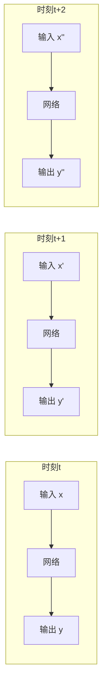

这种独立处理模式适合静态数据，但序列数据的情况截然不同。以文本翻译为例，当网络逐词处理句子"我 爱 学习"时，翻译"学习"这个词必须参考前面出现的"我 爱" —— 否则无法确定"学习"应该翻译成 "study"（学习知识）还是 "exercise"（体育锻炼）。正确的翻译依赖于理解整个句子上下文，而上下文就是之前时刻的输入序列。

```mermaid
graph LR
    subgraph 时刻t
        W1["输入：我"] --> Q1["?")
    end
    subgraph 时刻t+1
        W2["输入：爱"] --> Q2["?")
    end
    subgraph 时刻t+2
        W3["输入：学习"] --> T["输出：love learning"]
    end
    Q1 -.->|上下文| Q2
    Q2 -.->|上下文| T
```

一个更具体的例子是股票价格预测。假设预测股票明天涨跌，输入过去 5 天的价格变化：

| 天数 | 价格 | 涨跌 |
|:----:|:----:|:----:|
| Day 1 | 100 | - |
| Day 2 | 98 | ↓ |
| Day 3 | 97 | ↓ |
| Day 4 | 101 | ↑ |
| Day 5 | 103 | ↑ |

如果只看 Day 5 的价格 103 元，无法判断明天走势。但如果观察完整的 5 天序列 —— "下跌 → 下跌 → 上涨 → 上涨"，可以判断出"反弹趋势，明天继续上涨"。这个判断依赖于历史序列的整体模式，而非单一时刻的数值。核心问题由此浮现：如何设计神经网络，使其能够处理序列数据，利用历史信息做出当前决策？

### 前馈网络的局限

既然序列数据需要"记忆"历史信息，我们能否用已学的[多层感知机](../feedforward-networks/mlp.md)或卷积神经网络来处理？尝试后发现，前馈网络在序列建模上存在两个根本性障碍。

第一个障碍是**输入长度不固定**。序列长度天然变化：一句话可能有 3 个词，也可能有 50 个词；一段股票历史可能有 5 天，也可能有 100 天。前馈网络的输入维度固定，无法直接处理变长序列。一个朴素的解决方案是将整个序列拼接成向量输入网络：

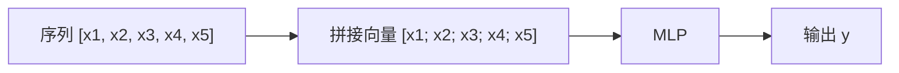

但这方案有两个致命缺陷：当序列长度变化时，需要重新设计网络输入层，这显然不可行；当序列较长时，拼接向量维度巨大，网络参数量爆炸，训练变得极其困难。

第二个障碍更本质：**无法捕捉时序依赖**。即使强行固定序列长度（如只处理前 10 个词），将序列拼接成向量输入 MLP，网络仍然无法有效利用时序信息。MLP 是全连接网络，所有输入位置对称 —— 位置 1 和位置 3 对网络而言没有区别。打乱序列顺序后，MLP 的输出可能完全相同，因为它无法理解"顺序"这个概念。

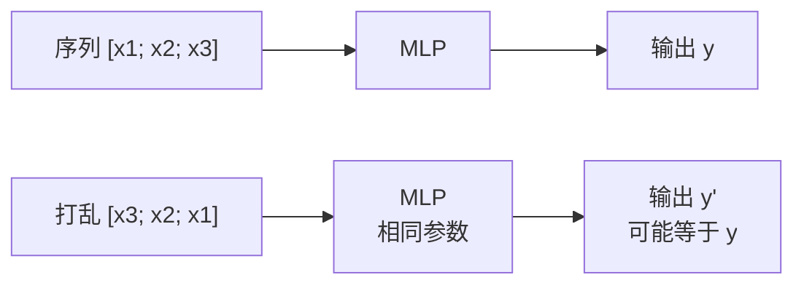

这与 CNN 处理图像的原理不同。图像的像素位置有空间意义，CNN 通过卷积核局部连接，能够捕捉像素之间的空间关系。序列数据的"位置"是时间，时间有单向性（时刻 t 在时刻 t+1 之前），前馈网络无法建模这种时间单向性。结论显而易见：需要一种能够逐时刻处理序列、传递历史信息、捕捉时序依赖的网络架构。

### 序列建模的设计目标

设计序列神经网络，需要满足四个核心目标。首先是**逐时刻处理**：每个时刻处理一个输入，而非一次性处理整个序列，这样可以自然适应变长序列。其次是**信息传递**：当前时刻能够利用之前时刻的信息，实现"记忆"能力。第三是**变长适应**：理论上能够处理任意长度的序列，无需固定输入维度。最后是**时序建模**：捕捉数据的时间依赖关系，理解"顺序"的意义。RNN 通过**循环连接**（Recurrent Connection）巧妙地实现了这四个目标。

## RNN 基本结构

### 循环连接的引入

前文分析了序列建模的四个核心目标：逐时刻处理、信息传递、变长适应、时序建模。RNN 的核心创新是引入**循环连接** —— 网络在时刻 t 的输出，不仅传递给下一层，还传递回网络自身，作为时刻 t+1 的额外输入。这种设计巧妙地将"记忆"机制嵌入到网络结构中。

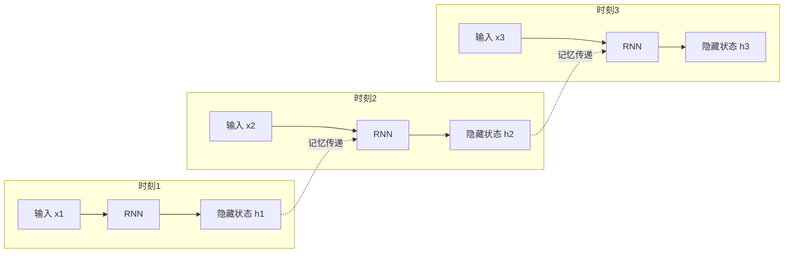

图中展示了循环连接的核心机制：$x_t$ 是时刻 $t$ 的输入（如第 $t$ 个词的向量表示），$h_t$ 是时刻 $t$ 的隐藏状态，同时也是时刻 $t+1$ 的额外输入。箭头表示信息流动：当前隐藏状态流向下一时刻，实现"记忆"在时间维度上的传递。这种结构的核心思想是：网络在时刻 t 的状态 $h_t$ 包含了时刻 1 到 t 所有输入的信息压缩。$h_t$ 是网络的"记忆"，随着时间推移不断更新、累积信息。

### RNN 的数学表示

将循环连接用数学语言描述，可以得到 RNN 的核心计算公式。每个时刻的隐藏状态由当前输入和上一时刻的隐藏状态共同决定：

$$h_t = \sigma(W_{hh} h_{t-1} + W_{xh} x_t + b_h)$$

这个公式看着抽象，拆开来看含义很直观：$h_{t-1}$ 是上一时刻的隐藏状态，即网络的"历史记忆"；$W_{hh}$ 是循环连接权重矩阵，控制历史信息如何影响当前状态；$x_t$ 是当前时刻的输入向量，即当前要处理的信息；$W_{xh}$ 是输入权重矩阵，控制当前输入如何影响隐藏状态；$b_h$ 是偏置向量，调整激活阈值；$\sigma$ 是激活函数（通常为 tanh 或 ReLU），引入非线性变换。整体公式可以理解为：新记忆 = 激活函数(处理历史记忆 + 处理当前输入)。

输出层的计算相对简单：

$$y_t = W_{hy} h_t + b_y$$

这个公式的含义是：$h_t$ 是当前隐藏状态，包含历史信息与当前输入的融合；$W_{hy}$ 是输出权重矩阵，将隐藏状态映射到输出空间；$b_y$ 是输出偏置。整体公式可以理解为：输出 = 映射(当前记忆)。

**关键参数**：$W_{hh}$ 是循环连接权重，它让 $h_{t-1}$ 影响 $h_t$ 的计算，从而实现信息在时间维度上的传递。这正是 RNN 区别于前馈网络的核心所在。

### 展开视角理解

RNN 的"循环"在数学上表示为 $h_t$ 依赖于 $h_{t-1}$，$h_{t-1}$ 依赖于 $h_{t-2}$，以此类推。将这个依赖链展开，可以清晰看到信息如何流动。从时刻 1 开始，假设初始隐藏状态 $h_0 = 0$，则：

$$h_1 = \sigma(W_{xh} x_1 + b_h)$$

时刻 2 的隐藏状态嵌套了时刻 1 的信息：

$$h_2 = \sigma(W_{hh} h_1 + W_{xh} x_2 + b_h) = \sigma(W_{hh} \sigma(W_{xh} x_1 + b_h) + W_{xh} x_2 + b_h)$$

时刻 3 继续嵌套：

$$h_3 = \sigma(W_{hh} h_2 + W_{xh} x_3 + b_h) = \sigma(W_{hh} \sigma(W_{hh} \sigma(...) + ...) + W_{xh} x_3 + b_h)$$

展开后可以看出：$h_3$ 的计算嵌套了 $h_2$ 和 $h_1$，因此 $h_3$ 实际上依赖于 $x_1, x_2, x_3$ 的全部信息。信息通过嵌套的激活函数和权重矩阵"压缩"传递，历史信息被逐步编码到隐藏状态中。

```mermaid
graph TD
    subgraph t=1
        X1["x1"] --> W1["W_xh"] --> A1["σ"]
        A1 --> H1["h1"]
    end
    subgraph t=2
        X2["x2"] --> W2["W_xh"]
        H1 --> W3["W_hh"] --> A2["σ"]
        W2 --> A2
        A2 --> H2["h2"]
    end
    subgraph t=3
        X3["x3"] --> W4["W_xh"]
        H2 --> W5["W_hh"] --> A3["σ"]
        W4 --> A3
        A3 --> H3["h3"]
    end
    subgraph t=4
        X4["x4"] --> W6["W_xh"]
        H3 --> W7["W_hh"] --> A4["σ"]
        W6 --> A4
        A4 --> H4["h4"]
    end
```

这个时间展开图揭示了一个重要视角：RNN 在每个时刻执行相同的计算（使用相同的权重 $W_{hh}, W_{xh}, W_{hy}$），不同时刻的唯一区别是输入 $x_t$ 不同。上一时刻的隐藏状态 $h_{t-1}$ 是当前时刻的额外输入。从展开视角看，RNN 类似于一个很深的神经网络，每一层对应一个时刻，层与层之间通过隐藏状态传递信息。

### 隐藏状态的物理意义

隐藏状态 $h_t$ 是 RNN 的核心概念，理解其物理意义至关重要。时刻 $t$ 的隐藏状态 $h_t$ 包含了时刻 1 到 $t$ 所有输入的信息：

$$h_t = f(x_1, x_2, ..., x_t)$$

但这个压缩是有损的：$h_t$ 是一个有限维度的向量，无法完全无损地存储所有历史信息。RNN 通过训练学习如何有效压缩历史信息，保留对当前任务最有用的部分。

将 RNN 类比为人类阅读过程更容易理解：$x_t$ 是当前读到的词，$h_t$ 是读完这个词后的"理解状态"。$h_t$ 不是记住所有历史词汇的逐字背诵，而是记住"到目前为止，这句话讲了什么"。这个"理解状态"会影响对下一个词的理解 —— 读到"猫吃鱼"时，脑海中保留了"猫"的信息，理解"吃"时自然关联到"猫"作为动作主体。

信息压缩的必要性显而易见。如果不压缩，而是存储所有历史输入，网络需要无限存储空间：

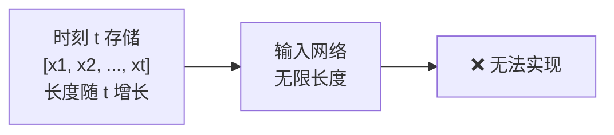

压缩为固定维度的 $h_t$ 后，网络能够处理任意长度的序列：

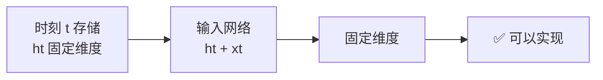

### RNN 的不同架构模式

根据输入输出形式，RNN 有多种架构模式，适用于不同的任务场景。

**一对一**（One-to-One）是最简单的形式，只有一个时刻的输入和输出，类似传统神经网络。这种模式很少使用，因为不需要序列建模能力。

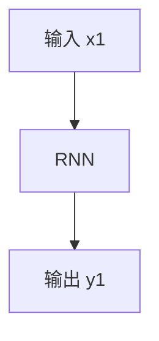

**一对多**（One-to-Many）是单个输入产生序列输出的模式。应用场景包括图像描述生成 —— 输入一张图片的特征向量，输出一句描述文字序列。

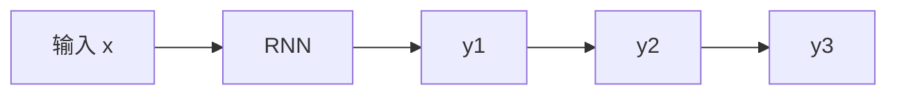

**多对一**（Many-to-One）是序列输入产生单个输出的模式。应用场景包括情感分析 —— 输入一句话的词序列，输出情感分类标签；股票预测 —— 输入历史价格序列，输出明天涨跌预测。

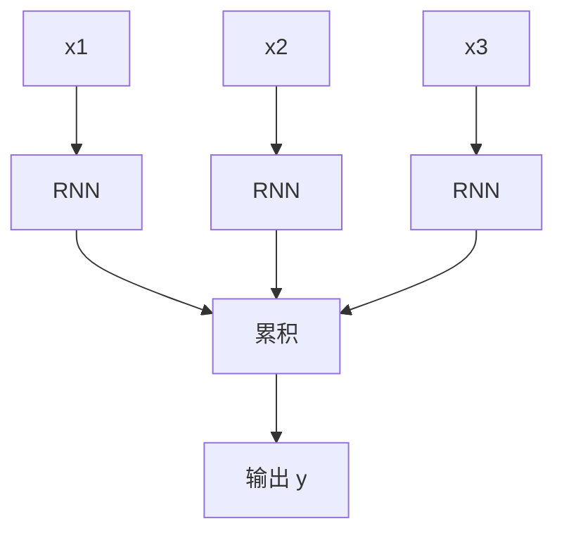

**多对多**（Many-to-Many）是序列输入产生序列输出的模式，输入输出长度相同。应用场景包括视频分类 —— 每一帧输入，每一帧输出分类标签。

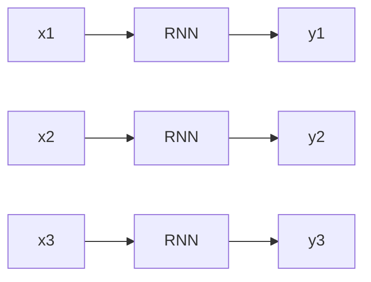

**编码器 - 解码器**（Encoder-Decoder）是输入序列和输出序列长度不同的模式。应用场景包括机器翻译 —— 输入英文句子（5 个词），输出中文翻译（7 个字）。编码器先将输入序列压缩为固定向量，解码器再从该向量生成输出序列。这是 Seq2Seq 模型的基础架构，将在下一篇文章详细介绍。

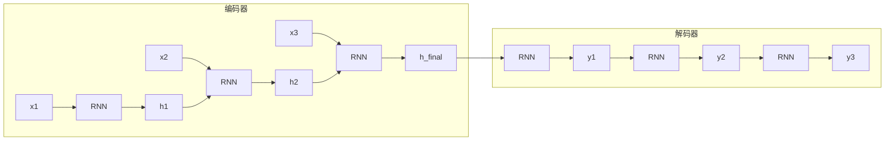

## 隐藏状态传递

### 信息传递机制

前文从结构视角分析了 RNN 的循环连接，现在深入探讨隐藏状态在时间维度上的传递机制 —— 这是 RNN 区别于前馈网络的核心所在。理解这个机制，需要追踪信息如何从时刻 1 流动到时刻 t，以及这个流动过程中发生了什么变化。

假设 RNN 使用 tanh 激活函数，隐藏状态维度为 $d$。时刻 t 的计算过程：

$$h_t = \tanh(W_{hh} h_{t-1} + W_{xh} x_t)$$

这个公式看着简单，展开后能看到信息流动的完整链条。假设初始隐藏状态 $h_0 = 0$，时刻 1 到时刻 3 的计算展开如下：

$$h_1 = \tanh(W_{xh} x_1)$$

$$h_2 = \tanh(W_{hh} h_1 + W_{xh} x_2) = \tanh(W_{hh} \tanh(W_{xh} x_1) + W_{xh} x_2)$$

$$h_3 = \tanh(W_{hh} h_2 + W_{xh} x_3) = \tanh(W_{hh} \tanh(W_{hh} \tanh(W_{xh} x_1) + W_{xh} x_2) + W_{xh} x_3)$$

展开公式揭示了一个关键现象：$x_1$ 的信息经历了两次 tanh 变换和两次 $W_{hh}$ 矩阵乘法后才传递到 $h_3$。tanh 函数将输出压缩到 $[-1, 1]$ 区间，多次 tanh 变换会持续压缩信息的数值范围；$W_{hh}$ 是固定权重矩阵，多次乘法会放大或衰减信息的某些维度。如果 $W_{hh}$ 的特征值小于 1，或 tanh 的导数趋近于 0，早期时刻的信息（如 $x_1$）在传递到后期时刻（如 $h_{10}$）时会显著衰减，甚至完全消失。这正是 RNN 的**梯度消失问题**的根源 —— 将在下一节详细分析。

### 初始隐藏状态的处理

时刻 1 的计算需要隐藏状态 $h_0$，但序列开始时没有历史状态。不同的初始状态处理方式会影响网络的学习能力和表现。

**零初始化**是最简单的方法：

$$h_0 = \vec{0}$$

网络从零状态开始，第一个时刻的隐藏状态完全由第一个输入决定。这种方式适用于大多数场景，计算简单，效果稳定。

**可学习初始化**将初始隐藏状态作为可学习参数：

$$h_0 = b_{init}$$

网络通过训练学习最优的初始状态。这种方式在某些任务中效果更好，如语言模型 —— 初始状态可以编码"句子开始"的信息，帮助网络理解序列的开始阶段。

**上下文初始化**在编码器 - 解码器架构中使用：

$$h_0^{\text{decoder}} = h_{\text{final}}^{\text{encoder}}$$

解码器的初始隐藏状态由编码器的最终状态提供。这种方式将编码器学到的序列表示传递给解码器，作为解码器的"起点记忆"。例如在机器翻译中，编码器读完英文句子后产生一个压缩表示，这个表示直接成为解码器生成中文翻译的起点。

### 隐藏状态的可视化理解

理论分析展示了隐藏状态的数学传递过程，现在通过一个可视化实验直观观察隐藏状态如何随时间演化。实验中定义一个简单的 RNN，输入随机序列，观察隐藏状态的 5 个维度在 10 个时刻的变化轨迹。代码使用 PyTorch 的 `nn.RNN` 模块获取所有时刻的隐藏状态，并用 matplotlib 绘制演化曲线。

```python runnable
import torch
import torch.nn as nn
import matplotlib.pyplot as plt

# 定义简单 RNN
class SimpleRNN(nn.Module):
    def __init__(self, input_size, hidden_size):
        super().__init__()
        self.rnn = nn.RNN(input_size, hidden_size, batch_first=True)
    
    def forward(self, x):
        # 返回所有时刻的隐藏状态
        output, h_n = self.rnn(x)
        return output  # output 包含所有时刻的 h_t

# 创建模型
input_size = 10   # 输入向量维度
hidden_size = 5   # 隐藏状态维度
model = SimpleRNN(input_size, hidden_size)

# 模拟序列输入（10个时刻）
seq_len = 10
x = torch.randn(1, seq_len, input_size)  # batch_size=1

# 获取隐藏状态序列
hidden_states = model(x).detach().numpy()[0]  # shape: (10, 5)

# 可视化隐藏状态的演化
plt.figure(figsize=(10, 6))
for i in range(hidden_size):
    plt.plot(range(seq_len), hidden_states[:, i], 
             label=f'h维度{i+1}', marker='o')
plt.xlabel('时刻 t')
plt.ylabel('隐藏状态值')
plt.title('隐藏状态随时间的演化')
plt.legend()
plt.grid(True, alpha=0.3)
plt.tight_layout()
plt.show()

print("观察隐藏状态的演化:")
print("1. 每个维度随时间变化，反映历史信息的累积")
print("2. 不同维度的变化模式不同，反映不同的'记忆'特征")
print("3. 隐藏状态从初始零状态逐渐演化，融合输入信息")
```

*图：隐藏状态随时间的演化曲线*

图中展示了隐藏状态的 5 个维度在 10 个时刻的演化过程。曲线的起伏反映了历史信息的累积和变化 —— 每当输入新数据，隐藏状态就会更新，融入新的信息。不同维度的曲线形态各异，说明不同维度"记住"了不同类型的历史特征：有的维度变化剧烈，响应敏感信息；有的维度变化平稳，保持长期记忆。曲线从时刻 1 开始逐渐偏离零点，说明信息逐渐累积，隐藏状态不再是空白状态，而是承载了越来越多的历史信息。

### 实际案例：字符预测

抽象的公式和可视化之后，用一个具体的字符预测案例演示 RNN 的实际工作过程。假设输入序列是 `"hell"`，目标是预测下一个字符（应该是 `"o"`，组成 `"hello"`）。RNN 逐字符处理序列，每个时刻输出一个预测。

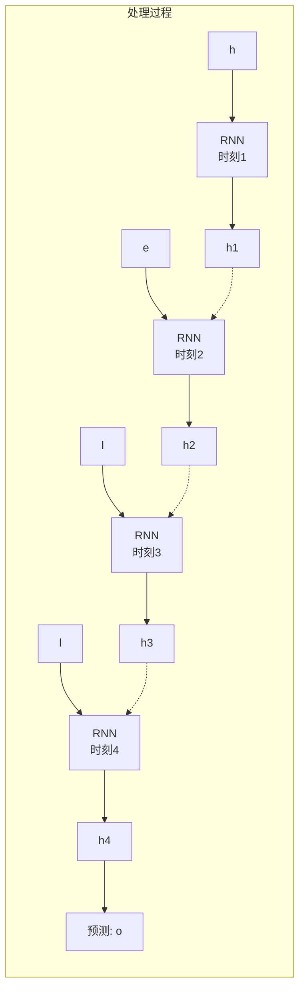

时刻 1 输入字符 `"h"`，隐藏状态 $h_1$ 由输入向量决定：$h_1 = \tanh(W_{xh} \times \text{vec}("h"))$，输出 $y_1$ 预测可能的下一个字符（如 `"e"`, `"a"` 等）。时刻 2 输入 `"e"`，隐藏状态 $h_2$ 融合历史信息：$h_2 = \tanh(W_{hh} \times h_1 + W_{xh} \times \text{vec}("e"))$，输出 $y_2$ 预测可能的下一个字符（如 `"l"`, `"r"` 等）。时刻 3 和时刻 4 同理，逐字符处理并累积信息。时刻 4 的预测 $y_4$ 依赖于 $h_4$，而 $h_4$ 包含了 `"h"`, `"e"`, `"l"`, `"l"` 四个字符的信息。网络通过训练学习到：当历史序列是 `"hell"` 时，下一个字符很可能是 `"o"`。这正是 RNN 的序列建模能力 —— 利用完整历史序列做出当前预测。

## RNN 的梯度问题

### 梯度在时间维度的传播

前文分析了隐藏状态在前向传播中的信息传递，现在转向反向传播 —— 探讨梯度如何在时间维度上流动。RNN 的训练使用反向传播算法，但需要在时间维度上展开，这种算法称为**时间反向传播**（Backpropagation Through Time, BPTT）。BPTT 的核心机制是：时刻 t 的损失函数 $L_t$ 对时刻 k（$k < t$）的参数梯度，需要通过时间链式传播。

假设损失函数 $L$ 是所有时刻损失的和：

$$L = \sum_{t=1}^{T} L_t$$

对参数 $W_{hh}$ 的梯度：

$$\frac{\partial L}{\partial W_{hh}} = \sum_{t=1}^{T} \frac{\partial L_t}{\partial W_{hh}}$$

对于时刻 $T$ 的损失 $L_T$，展开梯度计算：

$$\frac{\partial L_T}{\partial W_{hh}} = \sum_{k=1}^{T} \frac{\partial L_T}{\partial h_T} \cdot \frac{\partial h_T}{\partial h_k} \cdot \frac{\partial h_k}{\partial W_{hh}}$$

这个公式看着复杂，拆开来看含义很直观：$\frac{\partial L_T}{\partial h_T}$ 是损失对最终隐藏状态的梯度，表示"调整最终状态对减少损失有多大帮助"；$\frac{\partial h_T}{\partial h_k}$ 是时刻 k 的隐藏状态对时刻 T 的隐藏状态的梯度，表示"早期状态对最终状态有多大影响"，这是梯度消失问题的关键项；$\frac{\partial h_k}{\partial W_{hh}}$ 是隐藏状态对参数的梯度，表示"调整参数对改变状态有多大帮助"。整体公式可以理解为：总梯度 = 影响链上的每一步贡献之和。

### 梯度消失的数学分析

关键项 $\frac{\partial h_T}{\partial h_k}$ 展开后是一个链式乘积：

$$\frac{\partial h_T}{\partial h_k} = \frac{\partial h_T}{\partial h_{T-1}} \cdot \frac{\partial h_{T-1}}{\partial h_{T-2}} \cdot ... \cdot \frac{\partial h_{k+1}}{\partial h_k}$$

每一步的导数计算如下：

$$\frac{\partial h_t}{\partial h_{t-1}} = W_{hh}^T \cdot \text{diag}(\sigma'(W_{hh} h_{t-1} + W_{xh} x_t))$$

其中 $\sigma'$ 是激活函数的导数，$\text{diag}(·)$ 是将向量转为对角矩阵。如果激活函数是 tanh，其导数为：

$$\tanh'(x) = 1 - \tanh^2(x) \in [0, 1]$$

tanh 的导数最大值为 1（当输入为 0 时），当输入较大或较小时，导数趋近于 0。这意味着每当梯度经过一个 tanh 函数，就会被缩小一次。

假设 $W_{hh}$ 的最大特征值为 $\lambda_{max}$，tanh 导数的典型值约为 0.5，则梯度传递的量级：

$$\left|\frac{\partial h_T}{\partial h_k}\right| \approx |\lambda_{max}|^{T-k} \times (0.5)^{T-k}$$

如果 $|\lambda_{max}| \times 0.5 < 1$（即 $|\lambda_{max}| < 2$），当 $T - k$ 较大时（即间隔较长），梯度会指数衰减：

$$\left|\frac{\partial h_T}{\partial h_k}\right| \rightarrow 0 \quad \text{当 } T-k \text{ 较大}$$

这意味着早期时刻（k 较小）对后期时刻（T 较大）的梯度贡献趋近于零。网络无法有效学习长期依赖关系。例如处理句子 "The cat, which already ate a fish, ... , was hungry" 时，网络需要学习 "cat" 和 "was hungry" 之间的关联 —— 中间隔了多个词。但如果间隔超过 20 个词，梯度从 "was hungry" 传回到 "cat" 时几乎消失，网络无法更新与 "cat" 相关的参数，也就无法学习到这个长期依赖关系。这正是标准 RNN 在长序列任务上表现不佳的根本原因。

### 梯度爆炸的数学分析

梯度爆炸是相反的现象：当 $|\lambda_{max}| \times \sigma' > 1$ 时，梯度指数增长：

$$\left|\frac{\partial h_T}{\partial h_k}\right| \rightarrow \infty \quad \text{当 } T-k \text{ 较大}$$

梯度爆炸导致参数更新幅度过大，训练不稳定，损失函数值可能突然变为 NaN（数值溢出），网络无法收敛。缓解梯度爆炸的常用方法是**梯度裁剪**（Gradient Clipping）：当梯度超过阈值时，将其缩放到阈值范围内：

$$\text{if } \|\nabla\| > \text{threshold}: \nabla = \frac{\text{threshold}}{\|\nabla\|} \cdot \nabla$$

梯度裁剪可以防止梯度爆炸导致的训练崩溃，但无法从根本上解决问题 —— 长期依赖的学习仍然困难。真正解决长期依赖问题的方案是后续的 LSTM 和 GRU 架构，它们通过门控机制选择性保留长期信息。

### 实验：梯度消失的可视化

理论分析揭示了梯度消失的数学原理，现在通过一个实验直观观察梯度消失的实际表现。实验中手动实现一个简单 RNN，输入 20 个时刻的序列，观察反向传播后权重的梯度数值。

```python runnable
import torch
import torch.nn as nn
import numpy as np

# 定义 RNN 并观察梯度
class SimpleRNN(nn.Module):
    def __init__(self, input_size, hidden_size):
        super().__init__()
        self.W_xh = nn.Parameter(torch.randn(hidden_size, input_size) * 0.1)
        self.W_hh = nn.Parameter(torch.randn(hidden_size, hidden_size) * 0.1)
        self.W_hy = nn.Parameter(torch.randn(input_size, hidden_size) * 0.1)
        self.hidden_size = hidden_size
    
    def forward(self, x_seq):
        """前向传播，返回所有时刻的隐藏状态和输出"""
        h = torch.zeros(self.hidden_size)
        hidden_states = []
        outputs = []
        
        for x in x_seq:
            h = torch.tanh(self.W_hh @ h + self.W_xh @ x)
            hidden_states.append(h)
            y = self.W_hy @ h
            outputs.append(y)
        
        return hidden_states, outputs

# 创建模型和长序列
input_size = 5
hidden_size = 5
model = SimpleRNN(input_size, hidden_size)

# 生成 20 个时刻的序列
seq_len = 20
x_seq = [torch.randn(input_size) for _ in range(seq_len)]

# 前向传播
hidden_states, outputs = model(x_seq)

# 计算最后一个时刻的损失，并反向传播
loss = outputs[-1].sum()
loss.backward()

# 观察 W_hh 的梯度分布
gradient = model.W_hh.grad.detach().numpy()
print(f"W_hh 梯度的统计信息:")
print(f"  最大值: {gradient.max():.6f}")
print(f"  最小值: {gradient.min():.6f}")
print(f"  平均值: {gradient.mean():.6f}")
print(f"  标准差: {gradient.std():.6f}")

# 分析隐藏状态的变化幅度
h_norms = [h.detach().numpy().mean() for h in hidden_states]
print(f"\n隐藏状态的演化:")
print(f"  时刻 1 的 h 平均值: {h_norms[0]:.4f}")
print(f"  时刻 10 的 h 平均值: {h_norms[9]:.4f}")
print(f"  时刻 20 的 h 平均值: {h_norms[-1]:.4f}")
print(f"\n观察: 梯度值非常小，表明梯度消失问题严重")
print("这是因为 tanh 激活函数和多次矩阵乘法导致梯度衰减")
```

*图：梯度消失的可视化实验*

实验结果显示梯度的数值非常小（接近零），说明存在严重的梯度消失现象。隐藏状态的变化幅度也逐渐衰减，从时刻 1 到时刻 20 呈现逐渐减弱的趋势。这直观解释了 RNN 无法学习长期依赖的原因 —— 梯度在长距离传递过程中被反复压缩，最终几乎消失，网络无法根据远距离的信号调整参数。

### 梯度问题的影响

梯度消失和梯度爆炸对 RNN 的实际应用造成严重限制。梯度消失表现为长间隔的梯度趋近于零，导致网络无法学习长期依赖（间隔超过 10 的关系），如语言模型中的跨句引用、股票预测中的长期趋势。梯度爆炸表现为梯度数值突然变为 NaN，导致训练崩溃、损失函数溢出。

| 问题 | 表现 | 影响 |
|:-----|:-----|:-----|
| 梯度消失 | 长间隔的梯度趋近于零 | 无法学习长期依赖（间隔 > 10 的关系） |
| 梯度爆炸 | 梯度数值突然变为 NaN | 训练崩溃，损失函数溢出 |

实际场景中存在大量长期依赖需求。语言模型处理 "我出生于北京，...（50 个词）...，所以我的家乡是？" 时，需要记住 50 个词前的 "北京"；股票预测中某公司 30 天前发布财报，今天股价突变，需要关联 30 天前的信息；对话系统中用户 5 分钟前提到的实体，现在需要引用，需要跨多轮对话的记忆。标准 RNN 在这些场景下表现不佳，因为无法有效学习超过 10 个时刻间隔的依赖关系。

梯度问题催生了后续架构的改进。1997 年，德国计算机科学家塞普·霍赫赖特（Sepp Hochreiter）和尤尔根·施密德胡伯（Jürgen Schmidhuber）提出了 **LSTM**（Long Short-Term Memory），引入门控机制选择性保留长期信息。2014 年，韩国学者 Kyunghyun Cho 等人提出了 **GRU**（Gated Recurrent Unit），简化 LSTM 的门控设计，计算效率更高。2015 年，注意力机制的引入提供了另一种思路 —— 直接访问任意时刻的信息，绕过梯度传递的限制。这些改进架构将在下一篇文章详细介绍。

## RNN 的训练实践

### 时间反向传播算法

理解了 RNN 的梯度问题后，现在探讨具体的训练算法。RNN 的训练算法是 BPTT（Backpropagation Through Time），本质是将 RNN 在时间维度展开后执行标准反向传播。算法分为四个步骤：第一步是前向传播，按时间顺序计算 $h_1, h_2, ..., h_T$ 和 $y_1, y_2, ..., y_T$；第二步是计算损失，$L = \sum_{t=1}^{T} L_t(y_t, \text{target}_t)$；第三步是反向传播，从时刻 T 开始沿时间轴反向计算梯度；第四步是参数更新，根据累积梯度更新 $W_{hh}, W_{xh}, W_{hy}$。

**伪代码**：

```python
# BPTT 算法示意
def bptt(rnn, x_seq, y_seq):
    # 前向传播
    h = [0]  # h_0 = 0
    for t in range(1, T+1):
        h[t] = tanh(W_hh @ h[t-1] + W_xh @ x[t])
        y[t] = W_hy @ h[t]
    
    # 计算损失
    L = sum(loss_fn(y[t], target[t]) for t in range(1, T+1))
    
    # 反向传播（沿时间轴反向）
    dL_dW_hh = 0
    dL_dW_xh = 0
    dL_dW_hy = 0
    
    dL_dh_next = 0  # 从后一时刻传来的梯度
    
    for t in range(T, 0, -1):  # 从 T 到 1
        # 输出层梯度
        dL_dy = dL_dy_fn(y[t], target[t])
        dL_dW_hy += dL_dy @ h[t].T
        dL_dh = W_hy.T @ dL_dy + dL_dh_next
        
        # 隐藏层梯度（考虑 tanh 导数）
        dL_dh_raw = dL_dh * (1 - h[t]**2)  # tanh'(x) = 1 - tanh²(x)
        
        # 参数梯度累积
        dL_dW_hh += dL_dh_raw @ h[t-1].T
        dL_dW_xh += dL_dh_raw @ x[t].T
        
        # 传递到前一时刻
        dL_dh_next = W_hh.T @ dL_dh_raw
    
    return dL_dW_hh, dL_dW_xh, dL_dW_hy
```

### 截断 BPTT

实际应用中，序列可能很长（如一段 1000 词的文本）。完整的 BPTT 需要展开 1000 个时刻，计算代价高，且梯度消失更严重。

**截断 BPTT**（Truncated BPTT）是一种实用策略：将长序列划分为多个片段，每个片段独立训练。

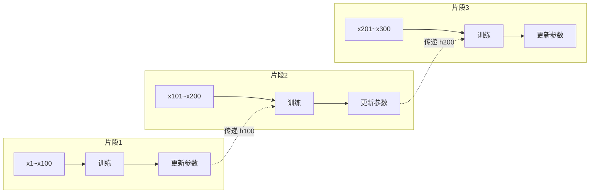

截断 BPTT 有三个优点：减少计算开销（每次只展开 100 个时刻而非整个序列），缓解梯度消失（最大间隔限制在 100），可以处理超长序列。但也有缺点：无法学习跨片段的长期依赖，片段间的信息传递被截断；需要权衡片段长度 —— 太短会导致长期依赖学习能力弱，太长会导致计算开销大。典型片段长度设置为 20 到 100，根据任务和资源调整。

### PyTorch 实现

PyTorch 提供了高效的 RNN 实现，封装了 BPTT 算法的复杂细节。下面的代码演示了如何使用 `nn.RNN` 模块构建一个序列分类模型：输入序列数据，输出分类结果。代码使用 PyTorch 的内置 RNN 模块处理输入序列，最后时刻的隐藏状态通过全连接层映射到输出空间。

```python runnable
import torch
import torch.nn as nn

# 定义 RNN 模型
class RNNModel(nn.Module):
    def __init__(self, input_size, hidden_size, output_size):
        super().__init__()
        self.rnn = nn.RNN(
            input_size=input_size,
            hidden_size=hidden_size,
            num_layers=1,
            batch_first=True
        )
        self.fc = nn.Linear(hidden_size, output_size)
    
    def forward(self, x, h0=None):
        # x shape: (batch, seq_len, input_size)
        # h0 shape: (num_layers, batch, hidden_size)
        
        # RNN 前向传播
        # out shape: (batch, seq_len, hidden_size)
        # hn shape: (num_layers, batch, hidden_size) - 最后时刻的隐藏状态
        out, hn = self.rnn(x, h0)
        
        # 取所有时刻的输出（或只取最后时刻）
        # 这里演示取最后时刻
        out_last = out[:, -1, :]  # (batch, hidden_size)
        
        # 输出层
        y = self.fc(out_last)  # (batch, output_size)
        return y, hn

# 创建模型
input_size = 10    # 输入特征维度
hidden_size = 32   # 隐藏状态维度
output_size = 5    # 输出维度（如分类数）
model = RNNModel(input_size, hidden_size, output_size)

# 模拟输入数据
batch_size = 3
seq_len = 15
x = torch.randn(batch_size, seq_len, input_size)

# 前向传播
y, hn = model(x)
print(f"输入形状: {x.shape}")
print(f"输出形状: {y.shape}")
print(f"最终隐藏状态形状: {hn.shape}")

# 训练示例
optimizer = torch.optim.Adam(model.parameters(), lr=0.01)
criterion = nn.CrossEntropyLoss()

# 模拟目标（分类任务）
target = torch.randint(0, output_size, (batch_size,))

# 训练一步
optimizer.zero_grad()
y, hn = model(x)
loss = criterion(y, target)
loss.backward()
optimizer.step()

print(f"\n训练损失: {loss.item():.4f}")
print("PyTorch 的 nn.RNN 内部实现了优化的 BPTT，支持自动梯度计算")
```

PyTorch 的 `nn.RNN` 模块有几个关键特性：`batch_first=True` 参数指定输入格式为 `(batch, seq_len, input_size)`，方便处理批次数据；模块自动处理初始隐藏状态，不指定时默认为零向量；支持多层 RNN（通过 `num_layers > 1` 参数）构建深层循环网络；内置优化的 BPTT 实现，无需手动编写反向传播代码，自动计算梯度。这些封装大大简化了 RNN 的使用流程。

## 实验：RNN 序列预测

### 任务设计

理论知识学习完毕，现在通过一个实验验证 RNN 的序列建模能力。实验任务预测正弦波序列的下一个值：输入序列为 $[\sin(0), \sin(0.1), \sin(0.2), ..., \sin(0.9)]$，预测目标是 $\sin(1.0)$。这个任务有两个特点：序列有明显的时序依赖，$\sin(t)$ 的值依赖于 $\sin(t-1), \sin(t-2)$ 等历史值；历史信息有助于预测，观察到上升或下降趋势后可以推断下一步走向。

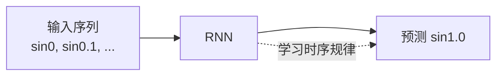

### 完整实验代码

```python runnable
import torch
import torch.nn as nn
import numpy as np
import matplotlib.pyplot as plt

# 生成正弦波序列数据
def generate_sine_data(num_samples, seq_len):
    """生成正弦波序列数据"""
    X = []
    Y = []
    
    for i in range(num_samples):
        # 随机起始相位
        start = np.random.rand() * 2 * np.pi
        
        # 生成序列
        t = np.linspace(start, start + seq_len * 0.1, seq_len + 1)
        sine_wave = np.sin(t)
        
        # 输入序列（前 seq_len 个点）
        X.append(sine_wave[:-1])
        # 目标（最后一个点）
        Y.append(sine_wave[-1])
    
    return np.array(X), np.array(Y)

# 定义 RNN 模型
class SinRNN(nn.Module):
    def __init__(self, hidden_size=32):
        super().__init__()
        self.rnn = nn.RNN(input_size=1, hidden_size=hidden_size, 
                          batch_first=True)
        self.fc = nn.Linear(hidden_size, 1)
    
    def forward(self, x):
        # x: (batch, seq_len, 1)
        out, hn = self.rnn(x)
        # 取最后时刻
        out = self.fc(out[:, -1, :])
        return out

# 生成数据
num_samples = 1000
seq_len = 20
X, Y = generate_sine_data(num_samples, seq_len)

# 转换为 PyTorch tensor
X_tensor = torch.FloatTensor(X).unsqueeze(-1)  # (N, seq_len, 1)
Y_tensor = torch.FloatTensor(Y).unsqueeze(-1)  # (N, 1)

# 划分训练集和测试集
train_size = 800
X_train, X_test = X_tensor[:train_size], X_tensor[train_size:]
Y_train, Y_test = Y_tensor[:train_size], Y_tensor[train_size:]

# 创建模型和优化器
model = SinRNN(hidden_size=32)
optimizer = torch.optim.Adam(model.parameters(), lr=0.01)
criterion = nn.MSELoss()

# 训练
epochs = 50
train_losses = []

for epoch in range(epochs):
    model.train()
    optimizer.zero_grad()
    
    pred = model(X_train)
    loss = criterion(pred, Y_train)
    loss.backward()
    optimizer.step()
    
    train_losses.append(loss.item())
    
    if (epoch + 1) % 10 == 0:
        print(f"Epoch {epoch+1}: Loss = {loss.item():.4f}")

# 测试
model.eval()
with torch.no_grad():
    test_pred = model(X_test)
    test_loss = criterion(test_pred, Y_test)
    print(f"\n测试集损失: {test_loss.item():.4f}")

# 可视化预测效果
plt.figure(figsize=(12, 5))

# 子图1: 训练损失曲线
plt.subplot(1, 2, 1)
plt.plot(train_losses)
plt.xlabel('Epoch')
plt.ylabel('MSE Loss')
plt.title('训练损失曲线')
plt.grid(True, alpha=0.3)

# 子图2: 预测对比
plt.subplot(1, 2, 2)
# 取5个测试样本展示
for i in range(5):
    plt.plot(range(seq_len), X_test[i].numpy().flatten(), 
             'b-', alpha=0.5, label='输入序列' if i==0 else '')
    plt.scatter(seq_len, Y_test[i].numpy().flatten(), 
                c='green', marker='o', s=50, label='真实值' if i==0 else '')
    plt.scatter(seq_len, test_pred[i].numpy().flatten(), 
                c='red', marker='x', s=50, label='预测值' if i==0 else '')

plt.xlabel('时间步')
plt.ylabel('sin(t)')
plt.title('正弦波预测效果')
plt.legend()
plt.grid(True, alpha=0.3)

plt.tight_layout()
plt.show()

print("\n实验结论:")
print("1. RNN 能够学习正弦波的时序规律，预测效果较好")
print("2. 输入序列的 20 个历史点，能够推断下一个点的值")
print("3. 这验证了 RNN 的序列建模能力：利用历史信息做出预测")
```

### 实验分析

实验结果显示训练过程在 50 个 epoch 内稳定收敛，损失函数持续下降，说明 RNN 能够有效学习正弦波的序列规律。测试集上的预测值与真实值接近，验证了模型的泛化能力。RNN 成功利用历史 20 个点的信息预测第 21 个点，这证明了其序列建模能力。

如果使用 MLP 处理相同任务（将序列拼接成向量输入），MLP 的预测误差通常更大。这是因为 MLP 无法有效捕捉时序依赖 —— 它将 20 个点视为独立特征而非有时间顺序的序列。RNN 通过隐藏状态传递，能够"理解"正弦波的上升或下降趋势，从而做出更准确的预测。

## 小结

本文介绍了循环神经网络（RNN）的基本原理。核心概念上，RNN 通过循环连接在时间维度传递信息，实现序列建模能力；隐藏状态 $h_t$ 是历史信息的压缩表示，随时间不断更新；RNN 能够处理变长序列，利用历史信息做出当前决策。结构设计上，RNN 的数学表达为 $h_t = \sigma(W_{hh} h_{t-1} + W_{xh} x_t + b_h)$；时间展开视角下，RNN 类似于深度网络，每一层对应一个时刻；多种架构模式（多对一、多对多、编码器 - 解码器等）适应不同任务需求。

训练挑战方面，BPTT 算法在时间维度展开反向传播；梯度消失问题导致早期时刻的信息难以传递到后期时刻；梯度爆炸问题可能导致训练崩溃。截断 BPTT 作为实用策略平衡计算开销和长程学习能力。实践应用上，PyTorch 提供 `nn.RNN` 模块支持高效实现；正弦波预测实验验证了 RNN 的序列建模能力；RNN 在文本、语音、时间序列等任务有广泛应用。

关键限制在于 RNN 的梯度消失问题导致无法学习长期依赖（间隔超过 10 的关系）。这催生了后续架构改进——LSTM、GRU、注意力机制，将在下一篇文章详细介绍。

---

## 练习题

**1. 理论推导**

计算 RNN 的隐藏状态更新公式，假设：
- 输入向量 $x_1 = [1, 0]$, $x_2 = [0, 1]$
- $W_{xh} = \begin{bmatrix} 0.5 & 0.5 \\ 0.5 & 0.5 \end{bmatrix}$
- $W_{hh} = \begin{bmatrix} 0.1 & 0.1 \\ 0.1 & 0.1 \end{bmatrix}$
- 激活函数为 tanh，初始隐藏状态 $h_0 = [0, 0]$

计算 $h_1$ 和 $h_2$。

**2. 梯度分析**

解释为什么 RNN 使用 tanh 激活函数比 sigmoid 更不容易出现梯度消失（虽然两者都有梯度消失问题）。

**3. 架构对比**

对比 RNN 的"多对一"和"编码器 - 解码器"架构，说明各自的应用场景。

**4. 编程实现**

使用 PyTorch 实现一个字符级语言模型：输入一段文本序列，预测每个位置下一个字符的概率分布。

---

## 参考资料

1. **原始论文**: "Finding Structure in Time" (Elman, 1990) — RNN 的早期工作
2. **BPTT 论文**: "Learning Long-Term Dependencies with Gradient Descent is Difficult" (Bengio et al., 1994) — 梯度问题的理论分析
3. **PyTorch 文档**: [torch.nn.RNN](https://pytorch.org/docs/stable/generated/torch.nn.RNN.html)
4. **经典教程**: "The Unreasonable Effectiveness of Recurrent Neural Networks" (Karpathy, 2015)