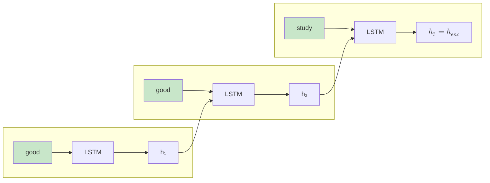
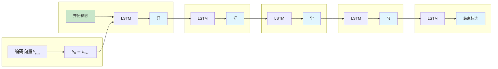

# Seq2Seq 序列映射

2014 年是机器学习历史上值得铭记的年份。这一年，时任 Google 研究员的伊利亚·苏茨克维（Ilya Sutskever）在论文《Sequence to Sequence Learning with Neural Networks》中提出用两个循环神经网络来完成机器翻译的设想，一个负责读懂输入句子，另一个负责写出翻译结果。这个今天被称为 **Seq2Seq**（Sequence-to-Sequence，序列到序列）的架构，影响不仅仅是让神经机器翻译首次超越了传统的统计翻译方法，更重要的是，它打开了语言模型的无限可能性。深度学习的上半场以机器视觉开启了传奇序幕，下半场无疑就是语言模型为主角的黄金时代。

在此之前，研究人员尝试用单个循环神经网络处理序列任务，但由于 RNN 每个时刻的输入对应产生一次对应输出的设计，很难处理输入和输出的长度不一致的情况。Seq2Seq 的创新在于其**编码器 - 解码器**（Encoder-Decoder）结构，将序列映射分为两个独立的阶段，编码器先逐词阅读输入序列，将其压缩为一个固定维度的向量表示；解码器再从这个向量出发，逐步生成输出序列，每个时刻产生一个词，直到遇到结束标志为止。这个设计巧妙地解耦了序列长度限制，让模型能够处理任意长度的输入和输出。

前两篇文章介绍了 RNN、LSTM 和 GRU，这些模型能够处理序列数据，利用历史信息做出当前决策。Seq2Seq 正是站在它们的基础之上，将循环网络的能力扩展到了序列生成领域。本文将介绍 Seq2Seq 的核心架构、工作原理、训练技巧，帮助读者理解这一从理解序列到生成序列的跨越。

## 编码器 - 解码器架构

Seq2Seq 要解决的核心问题是将变长输入序列映射到变长输出序列。输入和输出序列长度不相等的情况现实中非常普遍，譬如翻译 "Good good study, day day up" 只有六个英文单词，对应的中文"好好学习，天天向上"却是八个字；一篇五百字的新闻文章，摘要可能只有五十个字；用户提出一个简短的问题，回答却可能需要解释一大段背景。以前 RNN 为了满足输入序列与输出序列等长的约束，必须[强行对齐](lstm-gru.md#训练技巧与最佳实践)（如把短序列填充到相同长度），导致输出包含大量无意义的空白位置，或者丢失本应生成的关键内容。

既然输入和输出长度无法预先对齐，不如把问题分成两个独立的阶段。第一阶段专注于理解输入，把所有信息吸收进来；第二阶段专注于生成输出，根据理解的内容逐词展开。两个阶段用不同的网络来处理，各自有自己的时间步数，长度限制自然就被打破了。举个例子，输入序列 `['good', 'good', 'study']` 经过编码器处理后，被压缩为一个向量 $h_{enc}$；解码器以这个向量为起点，逐步生成输出序列 `['天', '天', '向', '上']`。编码器处理 $T$ 个时刻，解码器生成 $T'$ 个时刻，两个数字可以完全不同。

将输入序列压缩为一个向量表示的编码器就是 Seq2Seq 的第一阶段，通常使用 LSTM 或 GRU 作为基础结构，逐时刻处理输入序列中的每个词。下图展示了编码器的处理流程，第一个时刻输入词 "good"，LSTM 产生隐藏状态 $h_1$；第二个时刻再次输入词 "good"，LSTM 同时接收 $h_1$ 作为上一时刻的隐藏状态，融合后产生 $h_2$；第三个时刻输入词 "study"，LSTM 接收 $h_2$，产生最后一个隐藏状态 $h_3$，输出的编码向量就是这个最终状态 $h_{enc} = h_3$。


*图：编码器处理流程*

编码向量 $h_{enc}$ 是 LSTM 最后时刻的隐藏状态，在理论上应该包含了输入序列的全部信息，不仅是最后一个词 "study" 的内容，还通过 LSTM 的记忆机制保留了前两个 "good" 的信息。这个向量是对整个输入句子的语义压缩表示，就像读完一本书后在脑海中留下的整体印象。有些实现也会使用细胞状态 $C_T$ 作为编码向量，或者将 $h_T$ 和 $C_T$ 组合使用，这些方法都是可行的，效果差异并不大。

解码器是 Seq2Seq 的第二阶段，任务是根据编码向量逐步生成输出序列。它同样使用 LSTM 或 GRU 作为基础结构，但初始状态不是随机初始化的，而是由编码器的输出向量提供。继续用 "good good study" 翻译成"好好学习"为例子来说明解码器的生成过程，如下图所示：


*图：解码器生成流程*

在解码器的生成流程的初始时刻，隐藏状态被设置为编码向量 $h_{enc}$，这相当于把编码器读完的内容传递给解码器作为生成的起点。第一个时刻输入特殊标记 `<START>`（表示开始生成），LSTM 产生第一个输出词，第二个时刻输入上一个输出的词，又产生新输出，依次类推，直到输出 `<END>` 标记表示生成结束。将编码器和解码器组合起来，就得到了 Seq2Seq 的完整工作流程，如下图所示：

```nn-arch width=720
name: Seq2Seq (Encoder-Decoder 架构)
layout: horizontal

sections:
  - name: 编码器 (Encoder)
    layers: [enc_input, enc_h1, enc_h2, enc_h3]
    row_label: "编码向量（h₃）"
    row_direction: down
  - name: 解码器 (Decoder)
    layers: [dec_h1, dec_h2, dec_h3, dec_h4, dec_output]

layers:
  - {id: enc_input, name: "输入序列", type: input, size: "good good study"}
  - {id: enc_h1, name: "LSTM", type: rnn, size: h₁}
  - {id: enc_h2, name: "LSTM", type: rnn, size: h₂}
  - {id: enc_h3, name: "LSTM", type: rnn, size: h₃}
  - {id: dec_h1, name: "LSTM", type: rnn, size: "好"}
  - {id: dec_h2, name: "LSTM", type: rnn, size: "好"}
  - {id: dec_h3, name: "LSTM", type: rnn, size: "学"}
  - {id: dec_h4, name: "LSTM", type: rnn, size: "习"}
  - {id: dec_output, name: "输出序列", type: output, size: "好好学习"}
```
*图：Seq2Seq 工作流程*

从信息流动的角度看，编码向量是连接两个阶段的桥梁。编码阶段是信息压缩过程，把一个完整的序列挤压进一个固定维度的向量；解码阶段是信息展开过程，从这个向量出发，把压缩的信息重新释放出来，生成新的序列。压缩和展开的质量决定了翻译的准确性，而这个质量又直接受限于编码向量的容量，即编码向量能处理多长的依赖关系，这正是后续注意力机制要解决的核心问题。

## Seq2Seq 训练

训练 Seq2Seq 模型首先要寻找到合适的损失函数，用来衡量模型预测与真实目标之间的差距。由于解码器在每个时刻输出的是词汇表上的概率分布，这实质上是一个分类问题，解码器在寻找词汇表中输出词概率最高的类别，因此使用[交叉熵损失](../../statistical-learning/linear-models/logistic-regression.md#交叉熵损失)作为基础。设 $target_t$ 是时刻 $t$ 的真实目标词，$L_t$ 是时刻 $t$ 的单个交叉熵损失值，则每个时刻的交叉熵损失定义为：

$$L_t = -\log P(target_t | y_{t-1}, ..., y_1, h_{enc})$$

这个公式表示给定编码向量 $h_{enc}$ 和 $t$ 时刻之前生成的所有词 $y_1, ..., y_{t-1}$，模型对真实目标词 $target_t$ 的预测概率越高，损失越小。如果模型完美预测（概率为 1），则损失为 0，如果完全预测错误（概率接近 0），损失趋向无穷大。下面用一个具体的例子演示损失计算。假设真实目标序列是 `["好", "好", "学", "习", "<END>"]`，对应在词汇表中的索引为 `[50, 50, 51, 52, 1]`。解码器的预测概率分布如下：

| 时刻 | 预测概率分布 | 真实目标词 | 真实目标概率 | 单时刻损失 $L_t$ |
|:----:|:-------------|:----------:|:------------:|:----------------:|
| 1 | {"好": 0.8, "天": 0.1, ...} | 好 | 0.8 | $-\log(0.8) = 0.22$ |
| 2 | {"好": 0.9, "天": 0.05, ...} | 好 | 0.9 | $-\log(0.9) = 0.11$ |
| 3 | {"学": 0.85, "向": 0.1, ...} | 学 | 0.85 | $-\log(0.85) = 0.16$ |
| 4 | {"习": 0.80, "上": 0.05, ...} | 习 | 0.8 | $-\log(0.8) = 0.22$ |
| 5 | {"`<END>`": 0.95, ...} | `<END>` | 0.95 | $-\log(0.95) = 0.05$ |

在单个损失基础上，我们将总损失定义为解码器每个时刻的交叉熵损失之和，即：

$$L = \sum_{t=1}^{T'} L_t(y_t, target_t)$$

根据上表中的数据，总损失为各个时刻损失之和为 $L = 0.22 + 0.11 + 0.16 + 0.22 + 0.05 = 0.76$，Seq2seq 模型训练目标是通过反向传播调整编码器和解码器的所有参数，使解码器的预测概率分布越来越接近真实目标，从而最小化总损失。当损失足够低时，模型就能准确地进行翻译了。训练时，除了基本的反向传播算法，还有一些有用的技巧能够显著提升模型性能和训练效率。这些技巧解决了训练与推理之间的不一致性、生成序列的质量控制等问题。

### 计划采样

解码器有教师强制和自由生成两种生成模式。**教师强制**（Teacher Forcing）是解码器的输入使用真实目标词，而非模型自己预测的词；**自由生成**（Free Running）则是解码器每个时刻的输入使用上一时刻模型自己预测的词，而非真实目标词。这两种方式的核心区别在于解码器的输入来源不同。

训练 Seq2seq 时，通常是从教师强制模式开始的，好处是训练收敛更快，模型总是获得正确的上下文，梯度信号稳定，不会因为早期的预测错误而影响后续学习。这就像刚刚开始学习写作时，老师总是在旁边提示正确的上一句话，让你专注于写出正确的下一句话，这样学习速度会更快。但教师强制有其缺点，训练和推理不一致。推理时模型使用的一定是自由生成模式，每个时刻的输入是上一时刻的预测词，而非真实目标。如果训练时从未见过自己的预测错误，推理时一旦早期预测出错，后续所有生成都会基于错误的内容展开，错误会累积放大。这种现象被称为误差累积。这就像你去考试作文时，如果总是依赖老师在旁边提示，自己考试时肯定会不习惯，影响成绩。

**计划采样**（Scheduled Sampling）则是缓解这个问题的经典策略。训练过程中，逐步从教师强制过渡到自由生成，让模型逐渐适应使用自己的预测作为输入。训练初期 100% 使用教师强制，模型先学会基本的序列生成能力；训练中期 50% 使用教师强制、50% 使用自由生成，模型开始接触自己的预测；训练后期 10% 使用教师强制、90% 使用自由生成，模型几乎完全适应推理时的模式。这种渐进式过渡让训练和推理更加一致，缓解了误差累积问题。

### 束搜索

推理时，解码器的任务是产生输出词。每个时刻模型输出一个词汇表上的概率分布，如何从这个分布中选择词会影响最终生成序列的质量。一种最朴素的方法是**贪婪搜索**（Greedy Search），每个时刻选择概率最高的词。这种方法速度快，但也有它的问题，局部最优不一定等于全局最优，某个时刻选择最高概率词，反而可能导致后续生成质量下降。用一个例子来说明这个问题，假设翻译 "good study"，词汇表中只有 "好"、"学"、"习" 三个词。时刻 1，模型预测概率分布为 {"好": 0.6, "学": 0.3, "习": 0.1}，贪婪搜索选择 "好"。时刻 2，基于 "好" 作为输入，模型预测 {"学": 0.4, "习": 0.3, "天": 0.2}，贪婪搜索选择 "学"，最终输出 "好学习"。但如果时刻 1 选择概率稍低的 "学"（0.3），后续生成可能得到"学习好"，从中文语义看"学习好"比"好学习"更自然。这说明局部最优（每步选最高概率词）不一定产生全局最优（整体语义最合理的序列）。

**束搜索**（Beam Search）是针对这类问题的改进策略，保留多个候选序列而非仅保留一个。每个时刻保留概率最高的 $k$ 个候选（$k$ 称为束宽度），继续扩展这些候选，最终选择概率最高的完整序列。束搜索的优势在于多个候选避免了局部最优陷阱。即使早期某个词的概率不高，只要后续的组合概率足够高，仍然有机会被选中。这就像下棋时不只看一步，而是同时考虑几条可能的路径，最终选择最有希望获胜的那条。

束宽度的选择需要在质量和速度之间权衡。束宽度为 1 时等价于贪婪搜索，速度最快但质量可能差；束宽度为 5-10 是常用选择，质量与速度平衡；束宽度超过 20 时质量提升有限，但计算开销大增。实际应用中需要根据任务特点和计算资源选择合适的束宽度。

### 温度采样

贪婪搜索和束搜索都选择概率最高的词或序列，这种方式生成的结果确定性高、稳定性好，但缺乏多样性。在某些场景下，我们希望生成结果更有创意、更多样，而非总是选择最安全的答案。**温度采样**（Temperature Sampling）是一种控制生成多样性的技术，通过调整模型输出的概率分布来控制采样的随机程度。

模型在每个时刻输出的是词汇表上的 logits（未归一化的分数），通过 Softmax 转换为概率分布。温度采样是指在 Softmax 中引入一个温度参数 $T$：

$$p_i = \frac{\exp(z_i / T)}{\sum_{j=1}^{V} \exp(z_j / T)}$$

其中 $z_i$ 是第 $i$ 个词的 logit，$V$ 是词汇表大小，$T$ 是温度参数。温度参数对概率分布的影响可按如下三种情况讨论：

- **$T = 1$**：就是标准的 Softmax，保持模型原始预测的概率分布。
- **$T < 1$**（低温）：概率分布变得更尖锐，高概率词的概率进一步提高，低概率词的概率进一步降低。极端情况下 $T \to 0$，概率分布退化为 [One-Hot 编码](word-embedding.md#one-hot-编码的局限)，只有最高概率词的概率为 1，等价于贪婪搜索。
- **$T > 1$**（高温）：概率分布变得更平坦，各词之间的概率差距缩小，低概率词获得更多机会。极端情况下 $T \to \infty$，所有词的概率趋于相等，采样退化为均匀随机。

用一个具体例子来说明温度的影响。假设词汇表只有 4 个词，模型输出的 logits 为 `[2.0, 1.0, 0.5, 0.1]`，不同温度下的概率分布如下：

| 温度 $T$ | 概率分布 | 采样特点 |
|:--------:|:---------|:---------|
| 0.5 | [0.71, 0.21, 0.06, 0.02] | 高概率词占绝对优势，生成保守稳定 |
| 1.0 | [0.53, 0.27, 0.14, 0.06] | 保持原始分布，平衡稳定与多样 |
| 2.0 | [0.37, 0.27, 0.21, 0.15] | 概率差距缩小，低概率词机会增加 |

从表中可以看出，低温（0.5）让高概率词的概率从 53% 提升到 71%，生成结果几乎总是选择最高频词；高温（2.0）让最高频词的概率降至 37%，其他词的机会相应增加，生成结果更多样。温度参数的选择需要根据任务特点权衡：

- **低温（0.3-0.7）**：适用于需要准确、稳定输出的任务，如机器翻译、代码生成。生成结果接近训练数据中的常见表达，错误率低，但可能缺乏创意。
- **中温（0.8-1.0）**：适用于需要平衡准确性和多样性的任务，如对话生成、文本续写。这是最常用的默认设置。
- **高温（1.0-1.5）**：适用于需要创意、多样性的任务，如诗歌生成、故事创作。生成结果更有创意，但可能出现不通顺或错误的内容。

在实践中，温度采样通常与 Top-k 采样或 Top-p 采样（核采样）结合使用，先通过 Top-k 或 Top-p 筛选候选词，再在筛选后的词上应用温度采样。这种组合策略既限制了低概率词的干扰，又保留了温度控制的多样性，是现代语言模型生成文本的主流方法。

### 处理变长序列

Seq2Seq 的优势在于输入和输出长度可以不同，但实际实现时，还是需要解决何时结束生成与如何处理过长的输出两个问题。**动态结束检测**是最基础的机制。解码器生成 `<END>` 标记时，停止生成过程，输出序列长度由模型自行决定。这比固定长度输出更自然，翻译简单的句子输出短，翻译复杂的句子输出长。但这种自由也带来风险，模型可能陷入"无限生成"的状态，不断输出词而不产生 `<END>` 标记。为了防止这种情况，需要设置最大长度限制。譬如最大长度设为 50，如果时刻 50 仍未生成 `<END>`，则强制停止并输出当前序列。这个机制保证生成过程不会无限进行，同时给模型足够的自由决定输出长度。

**长度惩罚**是束搜索中的一个技巧。束搜索评估候选序列时，使用组合概率作为评分，即各个词概率的乘积。但这种方法有一个天然缺陷，更多词的概率乘积会越来越小，意味着较长的序列概率自然较低。这导致束搜索偏向选择短序列，哪怕长序列的质量更高。长度惩罚通过调整评分来缓解这个问题，将原始概率除以一个与长度相关的因子，削弱长度对评分的影响。

长度惩罚的效果是让长序列和短序列在评分上更加公平。假设一个 5 词序列的组合概率是 0.5，一个 10 词序列的组合概率是 0.3。原始评分下短序列获胜，但加上长度惩罚后，长序列可能会反转结果，因为它包含了更多有意义的内容，只是概率乘积天然偏低。

## 本章小结

从 RNN 到 LSTM、GRU，再到 Seq2Seq，这条技术演进路线的核心诉求始终如一：如何让神经网络有效处理序列数据中的依赖关系。RNN 开创性地引入循环连接，使网络具备了记忆历史信息的能力，但梯度消失问题使其难以学习超过 10-20 个时刻的长期依赖。LSTM 通过门控机制和细胞状态的线性传递，将有效记忆长度扩展到上百个时刻以上；GRU 则以更精简的结构在中等长度序列上实现了相近的性能。Seq2Seq 更进一步，用编码器-解码器架构打破了输入输出长度必须相等的限制，使序列到序列的映射成为可能。

这些模型的价值不仅在于解决了具体的技术问题，更在于它们确立了序列建模的基本范式，信息需要被压缩、传递、选择性保留。LSTM 的门控思想（学会何时记住、何时遗忘）已成为现代深度学习架构的通用设计原则。Seq2Seq 的编码器-解码器结构，则为后续的文本生成、图像描述、语音识别等任务奠定了架构基础。

然而，这条技术路线始终面临一个根本性的瓶颈：编码器必须将整个输入序列压缩为一个固定维度的向量，无论输入是十个词还是一千个词，解码器都只能从这个向量中提取信息。当序列变长时，编码向量承载的信息密度过高，细节不可避免地丢失。更深层的问题在于，解码器在生成每个词时，对输入序列所有位置的关注程度是相同的，它无法区分当前生成"猫"时应该重点关注输入中的"cat"而非其他无关词汇。这种没有注意力或者说是平均分配注意力的方式，使得长序列翻译、长文档摘要等任务的质量难以进一步提升。

这一瓶颈指向了一个新的解决思路，让解码器在生成每个词时，能够动态地、有选择地关注输入序列的不同位置。这正是注意力机制的核心思想，也是未来 Transformer 架构的起点。

## 练习题

1. 在 Seq2Seq 架构中，编码器最终输出的是隐藏状态 $h_{enc}$。请解释为什么这个向量能够包含整个输入序列的信息，而不仅仅是最后一个词的信息？如果输入序列很长，这种表示方式可能面临什么问题？
    <details>
    <summary>参考答案</summary>

    **信息传递机制**：

    编码器使用 LSTM 或 GRU 作为基础结构，这些模型通过门控机制实现了信息的选择性传递。以 LSTM 为例，每个时刻的细胞状态 $C_t$ 通过线性方式传递（加法门控），避免了 RNN 中的梯度消失问题。当编码器处理输入序列 `[good, good, study]` 时：

    - 时刻 1：LSTM 处理 "good"，产生 $h_1$ 和 $C_1$
    - 时刻 2：LSTM 处理 "good"，同时接收 $C_1$，融合后产生 $h_2$ 和 $C_2$
    - 时刻 3：LSTM 处理 "study"，同时接收 $C_2$，产生最终的 $h_{enc} = h_3$

    由于细胞状态的线性传递特性，早期时刻的信息（第一个 "good"）能够保留到最终状态中。

    **长序列面临的问题**：

    当输入序列很长时（如 100 个词以上的句子），编码向量面临"信息瓶颈"问题：

    1. **容量限制**：固定维度的向量（如 256 或 512 维）难以精确存储所有细节信息
    2. **信息压缩损失**：长序列中的细节信息在压缩过程中不可避免地丢失
    3. **注意力分散**：解码器生成每个词时对输入序列所有位置的关注程度相同，无法区分重点

    这正是后续注意力机制要解决的核心问题——让解码器能够动态、有选择地关注输入序列的不同位置。
    </details>

2. 假设解码器在时刻 $t$ 的预测概率分布为 $P(y_t | y_{<t}, h_{enc})$，真实目标词在词汇表中的索引为 $k$。写出时刻 $t$ 的交叉熵损失公式，并计算以下情况的损失值：词汇表大小为 5，真实目标词索引为 2，模型预测概率分布为 $[0.1, 0.2, 0.4, 0.2, 0.1]$。
    <details>
    <summary>参考答案</summary>

    **交叉熵损失公式**：

    $$L_t = -\log P(target_t | y_{t-1}, ..., y_1, h_{enc})$$

    对于词汇表上的分类问题，等价于：

    $$L_t = -\log P(y_t = target_t) = -\log p_{target_t}$$

    其中 $p_{target_t}$ 是模型对真实目标词的预测概率。

    **计算过程**：

    已知：
    - 真实目标词索引 $k = 2$（注意索引从 0 开始）
    - 预测概率分布 $P = [0.1, 0.2, 0.4, 0.2, 0.1]$
    - 真实目标词对应的预测概率 $p_2 = 0.4$

    代入公式：

    $$L_t = -\log(0.4) \approx -(-0.916) = 0.916$$

    **解释**：损失值约为 0.916。如果模型对真实目标词的预测概率为 1（完美预测），损失为 0；如果预测概率接近 0，损失趋向无穷大。
    </details>
