# Seq2Seq 序列映射

在机器学习的历史上，2014 年是一个值得铭记的年份。这一年，Google 的研究员伊利亚·苏茨克维（Ilya Sutskever）、奥里奥尔·维尼亚尔斯（Oriol Vinyals）和 Quoc V. Le 在论文《Sequence to Sequence Learning with Neural Networks》中提出了一个看似简单却影响深远的想法：用两个循环神经网络来完成机器翻译 —— 一个负责"读懂"输入句子，另一个负责"写出"翻译结果。这个被称为 Seq2Seq（Sequence-to-Sequence，序列到序列）的架构，不仅让神经机器翻译首次超越了传统的统计翻译方法，更开启了深度学习在序列生成任务上的黄金时代。

在此之前，研究人员尝试用单个循环神经网络处理序列任务，但遇到了一个根本性的障碍：输入和输出的长度往往不一致。翻译"I love you"只需要三个英文词，对应的中文"我爱你"却可能是三个字；一篇五百词的新闻文章，摘要可能只有五十词；用户提出一个简短的问题，回答却可能需要解释一大段背景。传统的循环网络假设输入和输出长度相同，这种"强行对齐"的设计让模型要么生成大量无意义的填充内容，要么丢失关键信息。

Seq2Seq 的突破在于引入了**编码器 - 解码器**（Encoder-Decoder）架构，将序列映射分为两个独立的阶段：编码器先逐词阅读输入序列，将其"压缩"为一个固定维度的向量表示；解码器再从这个向量出发，逐步生成输出序列，每个时刻产生一个词，直到遇到结束标志。这个设计巧妙地解耦了输入和输出的长度限制，让模型能够处理任意长度的输入和输出。

不过，原始的 Seq2Seq 设计隐藏着一个致命缺陷：将整个输入序列压缩到一个固定维度的向量中，当输入句子较长时，信息会被"挤压"得面目全非。这个问题在 2015 年被另一位研究者所解决——Dzmitry Bahdanau 在论文《Neural Machine Translation by Jointly Learning to Align and Translate》中提出了**注意力机制**（Attention Mechanism），让解码器在生成每个词时能够"回头看"输入序列的不同部分，动态获取最相关的信息。注意力机制不仅拯救了 Seq2Seq，更成为深度学习历史上最重要的创新之一，直接催生了 Transformer、BERT、GPT 等现代架构。

前两篇文章介绍了 RNN、LSTM 和 GRU——这些网络能够处理序列数据，利用历史信息做出当前决策。Seq2Seq 正是站在这些基础之上，将循环网络的能力扩展到了序列生成领域。本文将介绍 Seq2Seq 的核心架构、工作原理、训练技巧，以及注意力机制的雏形设计，帮助读者理解这一从"理解序列"到"生成序列"的关键跨越。

## 编码器 - 解码器架构

### 架构设计思想

在深入 Seq2Seq 的技术细节之前，先来思考一个具体的问题：如何将一句英文翻译成中文？假设输入是"I love you"，输出应该是"我爱你"。看起来很简单 —— 三个词对三个字，长度相近。但实际情况远比这复杂：输入可能是"The cat which already ate a fish was still hungry"（这只已经吃过一条鱼的猫仍然饿了），包含十几个词；翻译后可能是"那只吃过鱼的猫还饿着"，只有七个字。输入越长，翻译越短，两者长度毫无关联。

这正是 Seq2Seq 要解决的核心问题：**如何将变长输入序列映射到变长输出序列**。

**朴素方案的困境**：如果直接用循环神经网络处理这个问题，会遇到一个尴尬的限制 —— 传统的 RNN 输入序列长度为 $T$ 时，输出序列长度也是 $T$，两者必须相等。实际任务中 $T \neq T'$ 是常态，强行对齐（比如把短序列填充到相同长度）会导致输出包含大量无意义的空白位置，或者丢失本应生成的关键内容。

**编码器 - 解码器方案的解决思路**：既然输入和输出长度无法预先对齐，不如把问题分成两个独立的阶段。第一阶段专注于"理解"输入，把所有信息吸收进来；第二阶段专注于"生成"输出，根据理解的内容逐词展开。两个阶段用不同的网络来处理，各自有自己的时间步数，长度限制自然就被打破了。

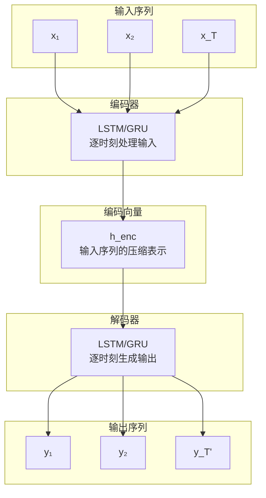

上图展示了 Seq2Seq 的整体架构：输入序列 `[x₁, x₂, ..., x_T]` 经过编码器处理后，被压缩为一个向量 $h_{enc}$；解码器以这个向量为起点，逐步生成输出序列 `[y₁, y₂, ..., y_T']`。关键在于，编码器处理 $T$ 个时刻，解码器生成 $T'$ 个时刻，两个数字可以完全不同。

这个设计背后的直觉可以用阅读理解来类比：想象你在读一篇英文文章准备写中文摘要。你不会边读边写 —— 那样太累了，读一半就忘了前面的内容。你会先完整读完文章，在脑海中形成一个整体印象（编码阶段）；然后根据这个印象，开始写摘要，边写边调整措辞（解码阶段）。编码向量就像是那个脑海中的印象，把文章的核心信息浓缩成一个可用的表示。

### 编码器的工作原理

编码器是 Seq2Seq 的第一阶段，任务是将输入序列"压缩"为一个向量表示。它使用 LSTM 或 GRU 作为基础结构，逐时刻处理输入序列中的每个词。

用一个具体的例子来说明：假设输入序列是英文句子"I love you"，编码器会这样处理：

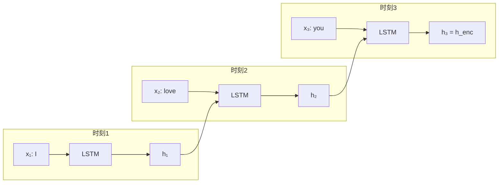

上图展示了编码器的处理流程：第一个时刻输入词"I"，LSTM 产生隐藏状态 $h_1$；第二个时刻输入词"love"，LSTM 同时接收 $h_1$ 作为上一时刻的状态，融合后产生 $h_2$；第三个时刻输入词"you"，LSTM 接收 $h_2$，产生最后一个隐藏状态 $h_3$。编码向量就是这个最终状态 $h_{enc} = h_3$。

编码向量 $h_{enc}$ 的含义需要仔细理解。它是 LSTM 最后时刻的隐藏状态，在理论上包含了输入序列的全部信息 —— 不仅是最后一个词"you"的内容，还通过 LSTM 的记忆机制保留了前两个词"I"和"love"的信息。这个向量是对整个输入句子的"语义编码"或"压缩表示"，就像读完一本书后在脑海中留下的整体印象。

从数学角度描述，如果使用 LSTM 作为编码器，每个时刻的更新过程为：

$$h_t, c_t = \text{LSTM}(x_t, h_{t-1}, c_{t-1})$$

这个公式看着抽象，拆开来看含义很直观：
- $x_t$ 是时刻 $t$ 的输入词嵌入向量
- $h_{t-1}$ 和 $c_{t-1}$ 是上一时刻的隐藏状态和细胞状态，携带历史信息
- LSTM 函数内部通过门控机制决定保留多少历史信息、吸收多少新信息
- $h_t$ 和 $c_t$ 是当前时刻更新后的状态，传递给下一时刻

编码向量的定义很简单：

$$h_{enc} = h_T$$

其中 $T$ 是输入序列的长度。有些实现也会使用细胞状态 $c_T$ 作为编码向量，或者将 $h_T$ 和 $c_T$ 组合使用，效果差异不大。

### 解码器的工作原理

解码器是 Seq2Seq 的第二阶段，任务是根据编码向量逐步生成输出序列。它同样使用 LSTM 或 GRU 作为基础结构，但初始状态不是随机初始化的，而是由编码器的输出向量提供。

继续用"I love you"翻译成"我爱你"的例子来说明解码器的生成过程：

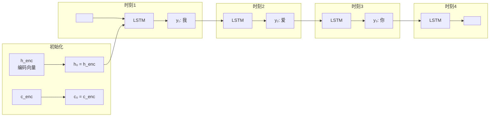

上图展示了解码器的生成流程：初始时刻，解码器的隐藏状态被设置为编码向量 $h_{enc}$，这相当于把编码器"读完"的内容传递给解码器作为"写作"的起点。第一个时刻输入特殊标记 `<START>`（表示开始生成），LSTM 产生输出"我"；第二个时刻输入上一个输出的词"我"，产生新输出"爱"；依次类推，直到输出 `<END>` 标记表示生成结束。

解码器的生成方式有两种，理解它们的区别对于后续的训练技巧很重要：

**教师强制**（Teacher Forcing）是训练时使用的策略。每个时刻的输入不是模型自己预测的上一个词，而是真实的正确答案：

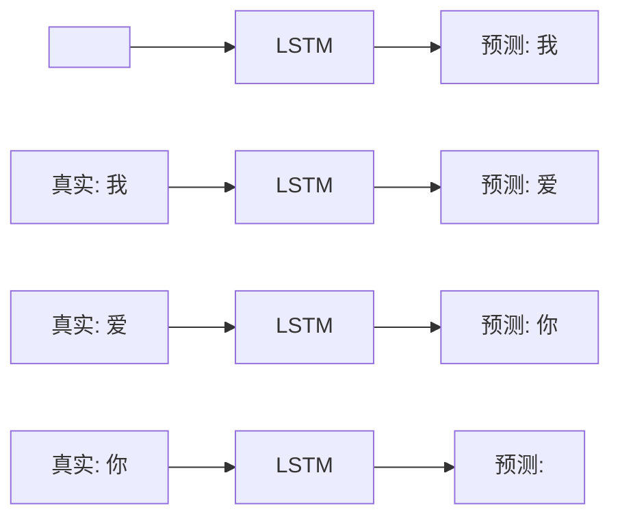

教师强制的好处是训练收敛快 —— 模型总是获得正确的上下文信息，不会因为早期的预测错误而影响后续学习。这就像学习写作时，老师总是在旁边提示正确的上一句话，让你专注于写出正确的下一句话。

**自由生成**（Free Running）是推理时使用的策略。每个时刻的输入是模型自己预测的上一个词：


自由生成是实际使用时的模式，但训练时单独使用会导致一个问题：如果模型在早期预测出错（比如把"我"预测成了"吾"),后续所有生成都会基于错误的内容展开，错误会累积放大。这就像考试时写错了第一句话，后面所有内容都基于错误的假设继续写，整篇文章都会偏离主题。

从数学角度描述解码器的工作过程。初始状态的设置：

$$h_0^{dec} = h_{enc}, \quad c_0^{dec} = c_{enc}$$

（如果编码器不输出细胞状态，也可以初始化为 $c_0^{dec} = \vec{0}$）

解码器每个时刻的更新：

$$h_t^{dec}, c_t^{dec} = \text{LSTM}(y_{t-1}, h_{t-1}^{dec}, c_{t-1}^{dec})$$

这个公式看着抽象，拆开来看含义很直观：
- $y_{t-1}$ 是上一时刻的输出词嵌入向量（教师强制时用真实词，自由生成时用预测词）
- $h_{t-1}^{dec}$ 和 $c_{t-1}^{dec}$ 是解码器上一时刻的状态
- LSTM 函数更新当前状态，将输入词的信息融入历史状态
- 输出状态 $h_t^{dec}$ 用于计算当前时刻的预测

输出词的计算：

$$y_t = \text{softmax}(W \cdot h_t^{dec})$$

这个公式表示将隐藏状态通过一个线性变换映射到词汇表大小的维度，然后 softmax 转换为概率分布，取概率最大的词作为输出。

### Seq2Seq 的整体流程

将编码器和解码器组合起来，就能看到 Seq2Seq 的完整工作流程。以"I love you"翻译成"我爱你"为例，整个过程分为两个阶段：

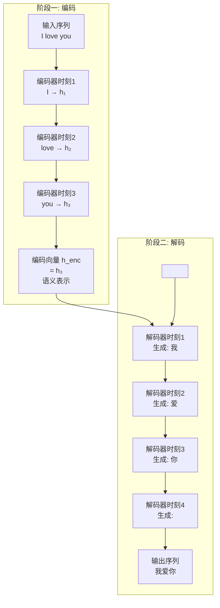

上图清晰地展示了信息在 Seq2Seq 中的流动路径。编码阶段：输入序列"I love you"被编码器逐词处理，三个词的信息沿着 LSTM 的状态传递链逐步融合，最终汇聚到编码向量 $h_{enc}$ 中。解码阶段：编码向量作为解码器的初始状态，相当于把"理解"的内容传递给"生成"模块；解码器从 `<START>` 标记开始，逐时刻生成输出词"我"、"爱"、"你"，直到 `<END>` 标记结束。

从信息流动的角度看，编码向量是连接两个阶段的"桥梁"。编码阶段是信息压缩过程 —— 把一个完整的序列"挤压"进一个固定维度的向量；解码阶段是信息展开过程 —— 从这个向量出发，把压缩的信息重新"释放"出来，生成新的序列。压缩和展开的质量决定了翻译的准确性，而这个质量受限于编码向量的容量，这正是后续注意力机制要解决的核心问题。

### PyTorch 实现

理论框架理解之后，用 PyTorch 实现一个基础的 Seq2Seq 模型来验证架构设计。下面的代码实现了一个完整的编码器 - 解码器结构：编码器使用 LSTM 逐时刻处理输入序列，输出编码向量；解码器以编码向量初始化，使用教师强制模式生成输出序列。代码中的 `Seq2Seq` 类封装了完整的流程，`encode` 方法对应编码阶段，`decode` 方法对应解码阶段，`forward` 方法串联两个阶段形成端到端的训练流程。

```python runnable
import torch
import torch.nn as nn

class Seq2Seq(nn.Module):
    def __init__(self, input_vocab_size, output_vocab_size, embed_size, hidden_size):
        super().__init__()
        
        # 编码器
        self.encoder_embedding = nn.Embedding(input_vocab_size, embed_size)
        self.encoder_lstm = nn.LSTM(embed_size, hidden_size, batch_first=True)
        
        # 解码器
        self.decoder_embedding = nn.Embedding(output_vocab_size, embed_size)
        self.decoder_lstm = nn.LSTM(embed_size, hidden_size, batch_first=True)
        self.decoder_fc = nn.Linear(hidden_size, output_vocab_size)
        
        self.hidden_size = hidden_size
    
    def encode(self, input_seq):
        """编码器处理输入序列"""
        # input_seq: (batch, seq_len) → 嵌入 → (batch, seq_len, embed_size)
        embedded = self.encoder_embedding(input_seq)
        
        # LSTM 处理
        # output: (batch, seq_len, hidden_size)
        # h_n, c_n: (1, batch, hidden_size) - 最后时刻的状态
        _, (h_n, c_n) = self.encoder_lstm(embedded)
        
        return h_n, c_n  # 编码向量
    
    def decode(self, target_seq, h_0, c_0):
        """解码器生成输出序列（教师强制模式）"""
        # target_seq: (batch, seq_len) → 嵌入 → (batch, seq_len, embed_size)
        embedded = self.decoder_embedding(target_seq)
        
        # LSTM 处理，初始状态为编码向量
        output, _ = self.decoder_lstm(embedded, (h_0, c_0))
        
        # 输出层：隐藏状态 → 词汇表概率分布
        logits = self.decoder_fc(output)  # (batch, seq_len, vocab_size)
        
        return logits
    
    def forward(self, input_seq, target_seq):
        """完整 Seq2Seq 流程"""
        # 编码
        h_enc, c_enc = self.encode(input_seq)
        
        # 解码
        logits = self.decode(target_seq, h_enc, c_enc)
        
        return logits

# 创建模型
input_vocab_size = 100  # 输入词汇表大小
output_vocab_size = 100  # 输出词汇表大小
embed_size = 32
hidden_size = 64

model = Seq2Seq(input_vocab_size, output_vocab_size, embed_size, hidden_size)

# 模拟输入
batch_size = 2
input_seq_len = 5
target_seq_len = 6

input_seq = torch.randint(0, input_vocab_size, (batch_size, input_seq_len))
target_seq = torch.randint(0, output_vocab_size, (batch_size, target_seq_len))

# 前向传播
logits = model(input_seq, target_seq)

print(f"输入序列形状: {input_seq.shape}")
print(f"目标序列形状: {target_seq.shape}")
print(f"输出 logits 形状: {logits.shape}")
print(f"输出词汇表概率分布: logits 的最后一维大小为 {output_vocab_size}")
print("Seq2Seq 模型构建成功")
```

## 序列到序列映射

### 机器翻译示例

理论框架理解之后，用一个具体的机器翻译示例来演示 Seq2Seq 的实际运作过程。任务是将英文"I love you"翻译成中文"我爱你"，看看每个步骤的数据是如何流动的。

首先需要建立词汇表，这是模型理解语言的基础。输入词汇表包含所有可能的英文词，比如 `["I", "love", "you", "<END>", ...]`，共 $V_{in}$ 个词；输出词汇表包含所有可能的中文词，比如 `["我", "爱", "你", "<START>", "<END>", ...]`，共 $V_{out}$ 个词。每个词都有一个唯一的索引编号，比如"I"的索引是 10，"love"的索引是 25，等等。

输入预处理阶段将英文句子转换为索引序列："I love you"变成 `[10, 25, 30]`，然后添加结束标志 `<END>`（索引为 1），得到最终输入 `[10, 25, 30, 1]`。这个索引序列会被送入编码器。

编码过程如下图所示，每个时刻处理一个词索引，将其嵌入为向量，通过 LSTM 更新隐藏状态：

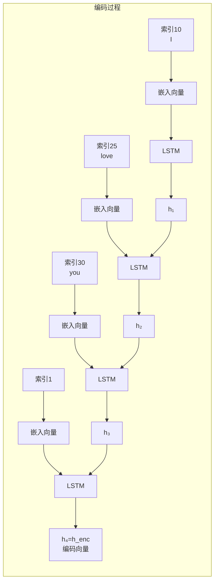

编码向量 $h_{enc}$ 包含了"I love you"的完整语义信息，它是解码器生成翻译的起点。

解码过程从编码向量初始化开始，每个时刻生成一个中文词，直到输出 `<END>` 标记结束：

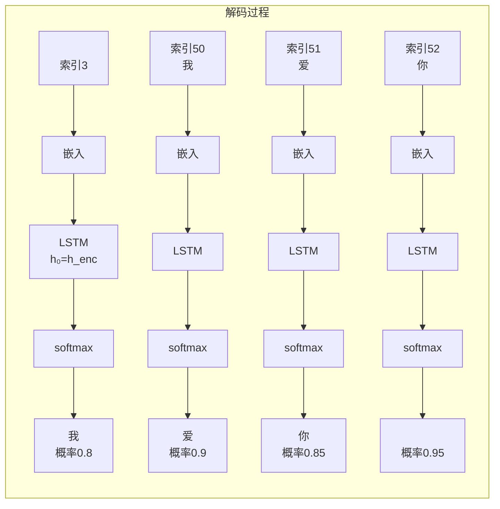

上图展示了解码器的生成细节。时刻 1 输入 `<START>` 标记，LSTM 输出隐藏状态，经过 softmax 得到词汇表上的概率分布，"我"的概率最高（0.8），被选为输出。时刻 2 输入上一个输出的词"我"（索引 50），同样经过 LSTM 和 softmax，得到"爱"（概率 0.9）。依次类推，直到时刻 4 输出 `<END>` 标记，翻译完成。

输出结果是 `["我", "爱", "你", "<END>"]`，去掉 `<END>` 标记后就是最终的翻译"我爱你"。整个过程的信息流动清晰可见：输入序列被压缩为编码向量，编码向量被展开为输出序列。

### 损失函数计算

训练 Seq2Seq 模型需要定义损失函数，用来衡量模型预测与真实目标之间的差距。由于解码器在每个时刻输出的是词汇表上的概率分布（一个分类问题），因此使用交叉熵损失作为基础。

总损失是解码器每个时刻的交叉熵损失之和：

$$L = \sum_{t=1}^{T'} L_t(y_t, \text{target}_t)$$

这个公式看着抽象，拆开来看含义很直观：
- $T'$ 是输出序列的长度（包含 `<END>` 标记）
- $L_t$ 是时刻 $t$ 的单个损失值
- $y_t$ 是模型在时刻 $t$ 输出的概率分布
- $\text{target}_t$ 是时刻 $t$ 的真实目标词
- $\sum$ 表示对所有时刻的损失求和，得到整体损失

每个时刻的交叉熵损失定义为：

$$L_t = -\log P(\text{target}_t | y_{t-1}, ..., y_1, h_{enc})$$

这个公式表示：给定编码向量 $h_{enc}$ 和之前生成的所有词 $y_1, ..., y_{t-1}$，模型对真实目标词 $\text{target}_t$ 的预测概率越高，损失越小。如果模型完美预测（概率为 1），损失为 0；如果完全预测错误（概率接近 0），损失趋向无穷大。

用一个具体的例子演示损失计算。假设真实目标序列是 `["我", "爱", "你", "<END>"]`，对应索引 `[50, 51, 52, 1]`。解码器的预测概率分布如下：

| 时刻 | 预测概率分布 | 真实目标词 | 真实目标概率 | 单时刻损失 $L_t$ |
|:----:|:-------------|:----------:|:------------:|:----------------:|
| 1 | {"我": 0.8, "爱": 0.1, ...} | 我 | 0.8 | $-\log(0.8) = 0.22$ |
| 2 | {"爱": 0.9, "你": 0.05, ...} | 爱 | 0.9 | $-\log(0.9) = 0.11$ |
| 3 | {"你": 0.85, "<END>": 0.1, ...} | 你 | 0.85 | $-\log(0.85) = 0.16$ |
| 4 | {"<END>": 0.95, ...} | <END> | 0.95 | $-\log(0.95) = 0.05$ |

总损失为各个时刻损失之和：

$$L = 0.22 + 0.11 + 0.16 + 0.05 = 0.54$$

训练目标是通过反向传播调整编码器和解码器的所有参数，使解码器的预测概率分布越来越接近真实目标，从而最小化总损失。当损失足够低时，模型就能准确地进行翻译了。

## 注意力机制雏形

### Seq2Seq 的核心问题

原始 Seq2Seq 的设计虽然巧妙地解决了变长序列映射问题，但隐藏着一个致命的缺陷：编码器将整个输入序列压缩到一个固定维度的向量 $h_{enc}$，当输入序列较长时，这个向量难以无损地存储所有信息。

用一个具体例子来说明这个"信息瓶颈"问题。假设输入序列是英文句子"The cat, which already ate a fish, was hungry"（那只已经吃过一条鱼的猫仍然饿了）。这个句子包含三个关键信息单元：

| 信息单元 | 内容 | 作用 |
|:--------:|:----:|:----:|
| 主语 | "The cat" | 句子的主体是谁 |
| 从句 | "which already ate a fish" | 猫的背景故事 |
| 谓语 | "was hungry" | 猫当前的状态 |

编码器需要把这三个信息单元全部"塞进"一个 256 维（或更小）的向量中。这就像要把一整本书的内容写在一个便签纸上 —— 必然会丢失大量细节。当解码器生成翻译时，生成"hungry"这个词需要知道主语是"cat"；生成"吃过鱼"的翻译需要知道从句的内容。但如果编码向量已经丢失了部分信息，解码器就像在黑暗中摸索，只能猜测而非准确翻译。

实证研究证实了这个问题的严重性：当输入序列长度超过 15-20 个词时，Seq2Seq 的翻译质量显著下降。这是因为 LSTM 的记忆能力有限，长距离的信息传递会逐渐衰减，编码向量无法有效保留输入序列的所有细节。

### 注意力机制的动机

原始 Seq2Seq 的核心问题在于：解码器在生成每个词时，依赖的是同一个编码向量 $h_{enc}$。这忽略了不同时刻需要的信息不同的事实。回到"I love you"翻译成"我爱你"的例子，生成每个输出词时关注的输入词应该不同：

- 生成"我"时，应该关注输入的"I" —— 这是语义对齐的关系
- 生成"爱"时，应该关注输入的"love" —— 动词对应动词
- 生成"你"时，应该关注输入的"you" —— 宾语对应宾语

原始架构中，解码器只能依赖一个"平均化"的编码向量，无法区分不同输入词的重要性。理想方案是让解码器在每个时刻能够"动态"地从编码器获取不同部分的信息 —— 生成"我"时重点看"I"，生成"爱"时重点看"love"。

这正是**注意力机制**（Attention Mechanism）的核心思想：让解码器在生成每个词时，能够"注意到"输入序列中与当前生成最相关的部分，而不是被迫从一个固定的压缩向量中猜测所有信息。

### 注意力机制的雏形设计

2015 年，Dzmitry Bahdanau 等人在论文《Neural Machine Translation by Jointly Learning to Align and Translate》中提出了第一个实用的注意力机制。这个设计的关键改变在于编码器的输出方式：

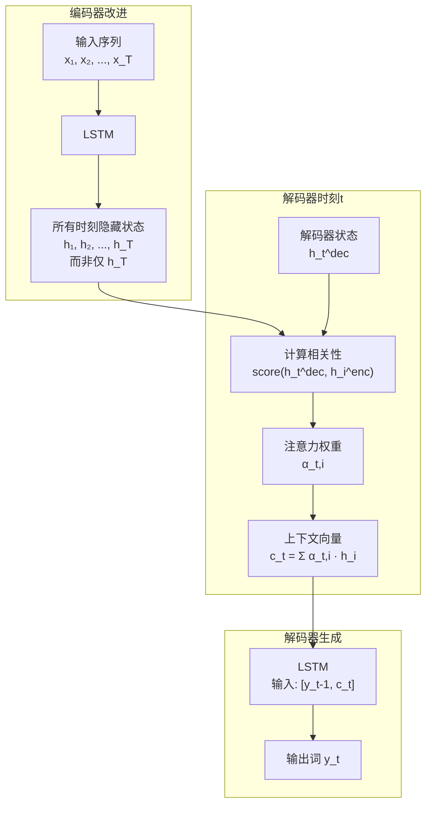

上图展示了 Seq2Seq + Attention 的架构改进。编码器不再仅输出最后时刻的状态 $h_T$，而是输出所有时刻的状态序列 $[h_1, h_2, ..., h_T]$，保留完整的输入信息。解码器在每个时刻 $t$ 执行四个步骤：

第一步，计算注意力权重 $\alpha_{t,i}$：衡量解码器当前状态 $h_t^{dec}$ 与编码器各时刻状态 $h_i^{enc}$ 的相关性。相关性越高，说明编码器的时刻 $i$ 对当前生成越重要。

第二步，计算上下文向量 $c_t$：对编码器所有时刻状态进行加权求和，权重就是注意力 $\alpha_{t,i}$。这样 $c_t$ 会重点关注相关性高的部分，忽略相关性低的部分。

第三步，解码器 LSTM 的输入：将上一个输出词 $y_{t-1}$ 和上下文向量 $c_t$ 拼接后送入 LSTM。上下文向量提供了"当前应该关注哪些输入信息"的动态指导。

第四步，生成当前输出词 $y_t$：从 LSTM 的输出状态计算词汇表概率分布，选择概率最高的词作为输出。

关键创新在于解码器不再依赖固定的编码向量，而是在每个时刻动态计算一个"量身定制"的上下文向量。生成"我"时，$c_1$ 会重点提取"I"的信息；生成"爱"时，$c_2$ 会重点提取"love"的信息。信息瓶颈问题迎刃而解。

### 注意力计算过程

注意力机制的核心是计算注意力权重和上下文向量，这涉及一系列数学运算。理解这些公式对于把握注意力机制的原理至关重要。

**注意力权重计算**：解码器时刻 $t$ 对编码器时刻 $i$ 的注意力权重 $\alpha_{t,i}$ 通过 softmax 函数计算：

$$\alpha_{t,i} = \frac{\exp(e_{t,i})}{\sum_{j=1}^{T} \exp(e_{t,j})}$$

这个公式看着抽象，拆开来看含义很直观：
- $e_{t,i}$ 是"能量值"或"得分"，表示解码器状态 $h_t^{dec}$ 与编码器状态 $h_i^{enc}$ 的相关性
- $\exp(e_{t,i})$ 对能量值取指数，确保所有值为正
- $\sum_{j=1}^{T} \exp(e_{t,j})$ 对所有编码器时刻的指数值求和，作为归一化的分母
- 整体公式可以理解为：将能量值转换为概率分布，所有 $\alpha_{t,i}$ 加起来等于 1

能量值的计算方式有多种，最常见的是点积和加性：

$$e_{t,i} = \text{score}(h_t^{dec}, h_i^{enc})$$

点积方式：$\text{score}(h_t, h_i) = h_t^T h_i$，计算两个向量的点积，直接衡量相似度。加性方式：$\text{score}(h_t, h_i) = v^T \tanh(W_1 h_t + W_2 h_i)$，将两个向量分别线性变换后拼接，再通过一个可学习的向量 $v$ 计算得分。加性方式参数更多，计算更灵活，是 Bahdanau 论文中的原始设计。

**上下文向量计算**：有了注意力权重后，上下文向量就是编码器所有时刻状态的加权求和：

$$c_t = \sum_{i=1}^{T} \alpha_{t,i} h_i^{enc}$$

这个公式看着抽象，拆开来看含义很直观：
- $h_i^{enc}$ 是编码器在时刻 $i$ 的隐藏状态，包含输入序列第 $i$ 个词的信息
- $\alpha_{t,i}$ 是注意力权重，决定 $h_i^{enc}$ 在上下文向量中的"贡献比例"
- $\sum$ 表示对所有编码器时刻求和，整合所有输入词的信息
- 整体公式可以理解为：根据当前生成需求，动态组合输入序列的信息，重要的词权重高，不重要的词权重低

**解码器更新**：上下文向量被送入解码器的 LSTM，与上一个输出词一起作为输入：

$$h_t^{dec} = \text{LSTM}([y_{t-1}, c_t], h_{t-1}^{dec})$$

其中 $[y_{t-1}, c_t]$ 表示将上一个输出词的嵌入向量与上下文向量拼接，形成 LSTM 的输入。解码器既考虑了已生成的序列（$y_{t-1}$），也考虑了当前应该关注的输入信息（$c_t$）。

### 注意力机制的可视化

注意力权重的一个重要价值是可以可视化，直观展示解码器在生成每个词时关注了输入序列的哪个部分。以"I love you"翻译成"我爱你"为例，注意力权重矩阵如下：

| 输出词 | I | love | you | 主要关注 |
|:------:|:--:|:----:|:---:|:--------:|
| 我 | 0.90 | 0.05 | 0.05 | I（权重 90%） |
| 爱 | 0.10 | 0.85 | 0.05 | love（权重 85%） |
| 你 | 0.05 | 0.10 | 0.85 | you（权重 85%） |

这个矩阵清晰地展示了注意力的对齐效果：生成"我"时，90% 的注意力集中在"I"上；生成"爱"时，85% 的注意力集中在"love"上；生成"你"时，85% 的注意力集中在"you"上。这种"一词对一词"的强注意力模式验证了注意力机制确实在起作用 —— 解码器能够准确定位应该关注的输入词。

在实际的长句子翻译中，注意力矩阵会更复杂。比如翻译"The cat which already ate a fish was hungry"时，生成"hungry"的词可能会同时关注"cat"和"hungry"，因为需要知道主语是谁；生成"吃过鱼"的部分会主要关注"ate a fish"的从句。这种灵活的注意力分配正是解决信息瓶颈的关键。

### 注意力机制的效果

加入注意力机制后，Seq2Seq 解决了信息瓶颈问题：

| 特性 | 标准 Seq2Seq | Seq2Seq + Attention |
|:-----|:-------------|:---------------------|
| 编码器输出 | 仅最后时刻状态 $h_T$ | 所有时刻状态 $[h_1, ..., h_T]$ |
| 解码器输入 | 固定编码向量 $h_{enc}$ | 动态上下文向量 $c_t$ |
| 长序列处理 | 性能下降（信息瓶颈） | 性能稳定（动态关注） |
| 可解释性 | 无 | 注意力权重可可视化 |

**实证效果**：

Bahdanau 等人的实验表明，加入注意力机制后，Seq2Seq 在长句子翻译任务上的 BLEU 分数提升 5-7 分，显著改善了翻译质量。

更重要的是，注意力机制的思想成为后续 Transformer、BERT、GPT 等模型的基础 —— 这些现代架构的核心都是注意力机制，而非 LSTM/GRU。

## Seq2Seq 训练技巧

训练 Seq2Seq 模型时，除了基本的反向传播算法，还有一些关键的技巧能够显著提升模型性能和训练效率。这些技巧解决了训练与推理之间的不一致性、生成序列的质量控制等问题。

### 教师强制与 Scheduled Sampling

解码器有两种生成方式：教师强制使用真实目标作为输入，自由生成使用模型预测作为输入。理解这两种方式的差异，对于设计有效的训练策略至关重要。

**教师强制**（Teacher Forcing）是训练 Seq2Seq 的常用策略。在每个时刻，解码器的输入使用真实目标词，而非模型自己预测的词：

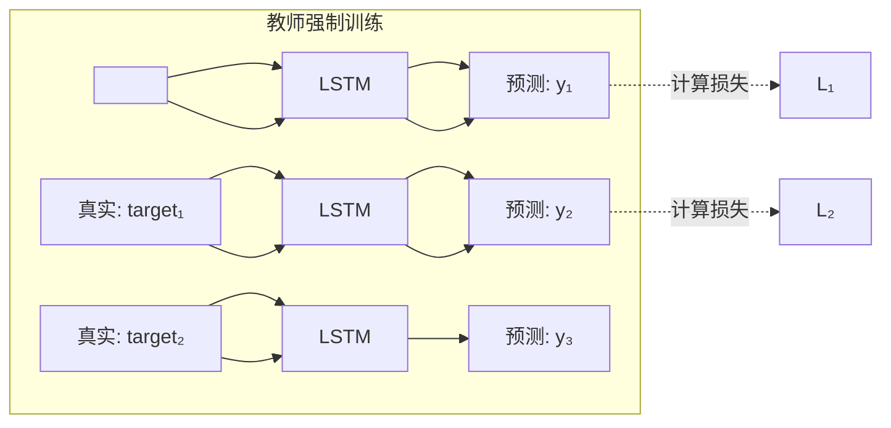

上图展示了教师强制的训练流程：时刻 1 输入 `<START>`，模型预测 $y_1$，计算与真实目标 $\text{target}_1$ 的损失；时刻 2 输入真实目标 $\text{target}_1$（而非预测的 $y_1$），模型预测 $y_2$，计算损失；依次类推。教师强制的好处是训练收敛快 —— 模型总是获得正确的上下文，梯度信号稳定，不会因为早期的预测错误而影响后续学习。这就像学习写作时，老师总是在旁边提示正确的上一句话，让你专注于写出正确的下一句话。

但教师强制有一个致命的缺点：训练和推理不一致。推理时模型使用自由生成模式，每个时刻的输入是上一时刻的预测词，而非真实目标。如果训练时从未见过自己的预测错误，推理时一旦早期预测出错，后续所有生成都会基于错误的内容展开，错误会累积放大。这种现象被称为"误差累积"或"暴露偏差"。

**Scheduled Sampling**（计划采样）是缓解这个问题的经典策略。训练过程中，逐步从教师强制过渡到自由生成，让模型逐渐适应使用自己的预测作为输入：

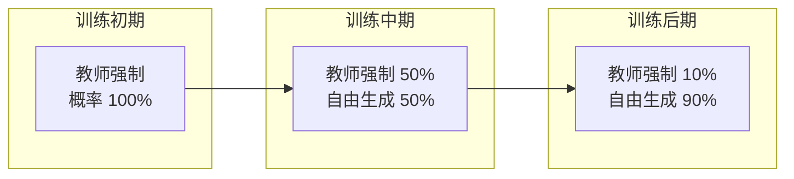

上图展示了 Scheduled Sampling 的渐进策略：训练初期 100% 使用教师强制，模型先学会基本的序列生成能力；训练中期 50% 使用教师强制、50% 使用自由生成，模型开始接触自己的预测；训练后期 10% 使用教师强制、90% 使用自由生成，模型几乎完全适应推理时的模式。这种渐进式过渡让训练和推理更加一致，缓解了误差累积问题。

### 束搜索（Beam Search）

推理时，解码器需要选择输出词。每个时刻模型输出一个词汇表上的概率分布，如何从这个分布中选择词会影响最终生成序列的质量。

最简单的方法是**贪婪搜索**（Greedy Search）：每个时刻选择概率最高的词。这种方法速度快，但有一个致命的问题 —— 局部最优不等于全局最优。某个时刻选择最高概率词，可能导致后续生成质量下降。

用一个例子来说明这个问题。假设翻译"I love you"，贪婪搜索的过程如下：

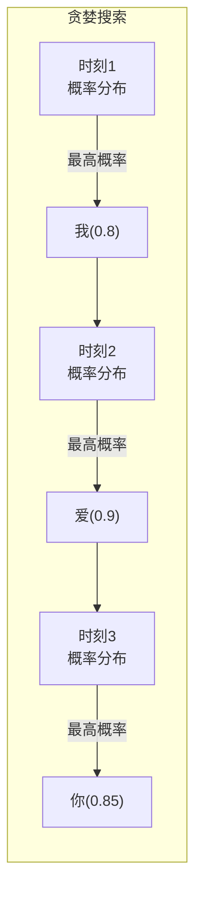

上图展示了贪婪搜索的过程：每个时刻选择概率最高的词，最终得到"我爱你"。这个结果看起来不错，但问题是贪婪搜索没有考虑全局最优。假设时刻 1 选择概率稍低的"吾"（0.1），后续的生成可能会不同，也许能产生另一种正确但风格不同的翻译。贪婪搜索只看眼前，容易错过更好的全局方案。

**束搜索**（Beam Search）是一种改进策略，保留多个候选序列而非仅保留一个。每个时刻保留概率最高的 $k$ 个候选（$k$ 称为束宽度），继续扩展这些候选，最终选择概率最高的完整序列。

用束宽度为 2 的例子演示束搜索的过程：

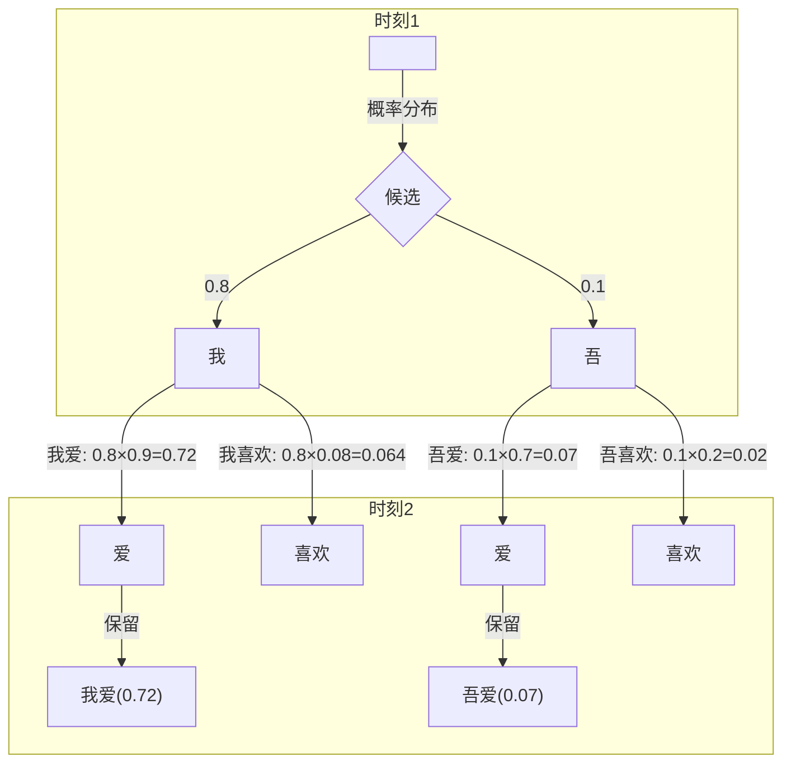

上图展示了束宽度为 2 的搜索过程。时刻 1 输入 `<START>`，模型输出概率分布，保留概率最高的两个词："我"（0.8）和"吾"（0.1）。时刻 2 分别输入"我"和"吾"，得到两组概率分布。计算四个候选序列的组合概率："我爱"的 0.72、"我喜欢"的 0.064、"吾爱"的 0.07、"吾喜欢"的 0.02。保留概率最高的两个序列："我爱"（0.72）和"吾爱"（0.07）。时刻 3 继续扩展这两个候选，最终选择概率最高的完整序列。

束搜索的关键优势在于保留多个候选，避免贪婪搜索的局部最优陷阱。即使早期某个词的概率不高，只要后续的组合概率足够高，仍然有机会被选中。这就像下棋时不只看一步，而是同时考虑几条可能的路径，最终选择最有希望获胜的那条。

束宽度的选择需要在质量和速度之间权衡。束宽度为 1 时等价于贪婪搜索，速度最快但质量可能差；束宽度为 5-10 是常用选择，质量与速度平衡；束宽度超过 20 时质量提升有限，但计算开销大增。实际应用中需要根据任务特点和计算资源选择合适的束宽度。

### 处理变长序列

Seq2Seq 的优势在于输入和输出长度可以不同，但实际实现时需要解决两个问题：何时结束生成、如何处理过长的输出。

**动态结束检测**是最基础的机制。解码器生成 `<END>` 标记时，停止生成过程，输出序列长度由模型自行决定。这比固定长度输出更自然 —— 翻译简单的句子输出短，翻译复杂的句子输出长。

但这种自由也带来风险：模型可能陷入"无限生成"的状态，不断输出词而不产生 `<END>` 标记。为了防止这种情况，需要设置最大长度限制。例如最大长度设为 50，如果时刻 50 仍未生成 `<END>`，则强制停止并输出当前序列。这个机制保证生成过程不会无限进行，同时给模型足够的自由决定输出长度。

**长度惩罚**是束搜索中的一个重要技巧。束搜索评估候选序列时，使用组合概率作为评分，即各个词概率的乘积。但这种方法有一个天然缺陷：较长的序列概率自然较低 —— 更多词的概率乘积会越来越小。这导致束搜索偏向选择短序列，即使长序列的质量更高。

长度惩罚通过调整评分来缓解这个问题：

$$\text{score}_{LP} = \frac{\text{score}}{(5 + \text{length})^\alpha / (5 + 1)^\alpha}$$

这个公式看着抽象，拆开来看含义很直观：
- $\text{score}$ 是原始的组合概率（各词概率乘积）
- $\text{length}$ 是序列的词数
- $(5 + \text{length})^\alpha$ 是长度惩罚因子，序列越长，惩罚越重
- $(5 + 1)^\alpha$ 是归一化常数，确保长度为 1 时惩罚因子为 1
- $\alpha$ 是惩罚系数（通常 0.6-1.0），$\alpha$ 越大，惩罚越重
- 整体公式可以理解为：将原始概率除以一个与长度相关的因子，削弱长度对评分的影响

长度惩罚的效果是让长序列和短序列在评分上更加公平。假设一个 5 词序列的组合概率是 0.5，一个 10 词序列的组合概率是 0.3。原始评分下短序列获胜，但加上长度惩罚后，长序列可能会翻盘 —— 因为它包含了更多有意义的内容，只是概率乘积天然偏低。

### PyTorch 完整训练示例

前面的代码展示了基础 Seq2Seq 的架构实现，现在将注意力机制整合进来，实现一个完整的训练流程。下面的代码定义了带 Bahdanau 注意力的 Seq2Seq 模型：编码器输出所有时刻的隐藏状态而非仅最后一个；解码器在每个时刻计算注意力权重，根据权重对编码器状态加权求和得到上下文向量，将上下文向量与上一个输出词拼接后送入 LSTM。代码中还演示了训练步骤的执行：前向传播计算输出 logits，使用交叉熵损失衡量预测与目标的差距，反向传播更新参数。这个实现展示了注意力机制如何在实际代码中运作 —— 动态计算上下文向量，让解码器能够灵活获取编码器的信息。

```python runnable
import torch
import torch.nn as nn
import torch.optim as optim

# 定义带注意力的 Seq2Seq
class Seq2SeqWithAttention(nn.Module):
    def __init__(self, input_vocab_size, output_vocab_size, embed_size, hidden_size):
        super().__init__()
        
        # 编码器
        self.encoder_embedding = nn.Embedding(input_vocab_size, embed_size)
        self.encoder_lstm = nn.LSTM(embed_size, hidden_size, batch_first=True)
        
        # 解码器
        self.decoder_embedding = nn.Embedding(output_vocab_size, embed_size)
        self.decoder_lstm = nn.LSTM(embed_size + hidden_size, hidden_size, batch_first=True)
        self.decoder_fc = nn.Linear(hidden_size, output_vocab_size)
        
        # 注意力层
        self.attention = nn.Linear(hidden_size * 2, hidden_size)
        self.attention_weight = nn.Linear(hidden_size, 1)
        
        self.hidden_size = hidden_size
    
    def encode(self, input_seq):
        embedded = self.encoder_embedding(input_seq)
        encoder_outputs, (h_n, c_n) = self.encoder_lstm(embedded)
        return encoder_outputs, h_n, c_n
    
    def attention_step(self, decoder_hidden, encoder_outputs):
        """计算注意力权重和上下文向量"""
        # decoder_hidden: (1, batch, hidden_size)
        # encoder_outputs: (batch, seq_len, hidden_size)
        
        batch_size = encoder_outputs.size(0)
        seq_len = encoder_outputs.size(1)
        
        # 扩展 decoder_hidden 以匹配 encoder_outputs
        decoder_hidden = decoder_hidden.squeeze(0)  # (batch, hidden_size)
        decoder_hidden_expanded = decoder_hidden.unsqueeze(1).expand(batch_size, seq_len, self.hidden_size)
        
        # 计算注意力能量
        concat = torch.cat([decoder_hidden_expanded, encoder_outputs], dim=2)
        energy = torch.tanh(self.attention(concat))
        attention_weights = self.attention_weight(energy).squeeze(2)  # (batch, seq_len)
        
        # Softmax 归一化
        attention_weights = torch.softmax(attention_weights, dim=1)
        
        # 计算上下文向量
        context = torch.sum(attention_weights.unsqueeze(2) * encoder_outputs, dim=1)
        
        return context, attention_weights
    
    def decode_step(self, input_token, hidden, cell, encoder_outputs):
        """单步解码"""
        # 嵌入输入词
        embedded = self.decoder_embedding(input_token)
        
        # 计算注意力
        context, _ = self.attention_step(hidden, encoder_outputs)
        
        # 拼接嵌入和上下文向量
        lstm_input = torch.cat([embedded, context.unsqueeze(1)], dim=2)
        
        # LSTM 处理
        output, (hidden, cell) = self.decoder_lstm(lstm_input, (hidden, cell))
        
        # 输出层
        logits = self.decoder_fc(output.squeeze(1))
        
        return logits, hidden, cell
    
    def forward(self, input_seq, target_seq):
        """完整前向传播"""
        # 编码
        encoder_outputs, h_enc, c_enc = self.encode(input_seq)
        
        # 解码
        batch_size = input_seq.size(0)
        target_len = target_seq.size(1)
        
        outputs = []
        hidden, cell = h_enc, c_enc
        
        for t in range(target_len):
            input_token = target_seq[:, t].unsqueeze(1)
            logits, hidden, cell = self.decode_step(input_token, hidden, cell, encoder_outputs)
            outputs.append(logits)
        
        outputs = torch.stack(outputs, dim=1)
        return outputs

# 创建模型
input_vocab_size = 100
output_vocab_size = 100
embed_size = 32
hidden_size = 64

model = Seq2SeqWithAttention(input_vocab_size, output_vocab_size, embed_size, hidden_size)

# 模拟数据
batch_size = 4
input_len = 8
output_len = 10

input_seq = torch.randint(0, input_vocab_size, (batch_size, input_len))
target_seq = torch.randint(0, output_vocab_size, (batch_size, output_len))

# 前向传播
outputs = model(input_seq, target_seq)

print(f"输入序列形状: {input_seq.shape}")
print(f"目标序列形状: {target_seq.shape}")
print(f"输出 logits 形状: {outputs.shape}")
print("带注意力的 Seq2Seq 模型构建成功")

# 训练示例（简化）
optimizer = optim.Adam(model.parameters(), lr=0.01)
criterion = nn.CrossEntropyLoss()

# 模拟训练一步
optimizer.zero_grad()
outputs = model(input_seq, target_seq)
loss = criterion(outputs.view(-1, output_vocab_size), target_seq.view(-1))
loss.backward()
optimizer.step()

print(f"训练损失: {loss.item():.4f}")
print("Seq2Seq + Attention 训练流程成功")
```

## 小结

本文介绍了 Seq2Seq 模型的原理和训练方法：

**编码器 - 解码器架构**：
- 编码器将输入序列压缩为编码向量
- 解码器根据编码向量生成输出序列
- 输入和输出长度解耦，实现序列到序列的映射

**注意力机制的雏形**：
- 解决了编码向量的信息瓶颈问题
- 解码器在每个时刻动态获取编码器信息
- 注意力权重可视化展示信息关注点

**训练技巧**：
- 教师强制加速收敛，Scheduled Sampling 缓解训练 - 推理差异
- 束搜索提升生成质量，长度惩罚调整评分
- 动态结束检测处理变长序列

**Seq2Seq 的局限性**：
- 编码向量难以存储长序列的所有信息（注意力机制解决）
- LSTM/GRU 的序列计算无法并行（Transformer 解决）
- 注意力机制虽然有效，但计算开销较大（Transformer 优化）

下一章将介绍生成模型——VAE 和 GAN，探索深度学习如何生成新数据（而非映射现有数据）。

---

## 练习题

**1. 理论推导**

推导 Seq2Seq 的损失函数：

$$L = \sum_{t=1}^{T'} L_t(y_t, \text{target}_t)$$

解释为什么使用交叉熵损失而非 MSE 损失。

**2. 架构对比**

对比标准 Seq2Seq 和 Seq2Seq + Attention：
- 编码器输出的差异
- 解码器输入的差异
- 长序列处理的效果差异

**3. 注意力计算**

计算 Bahdanau 注意力机制的能量值：

$$e_{t,i} = v^T \tanh(W_1 h_t^{dec} + W_2 h_i^{enc})$$

分析这个计算的含义：为什么使用 tanh？为什么拼接两个隐藏状态？

**4. 编程实现**

实现一个简化版的机器翻译模型：
- 输入：英文数字词（"one", "two", "three", ...）
- 输出：中文数字词（"一", "二", "三", ...）
- 训练并测试翻译效果

---

## 参考资料

1. **Seq2Seq 原始论文**: "Sequence to Sequence Learning with Neural Networks" (Sutskever et al., 2014)
2. **注意力机制论文**: "Neural Machine Translation by Jointly Learning to Align and Translate" (Bahdanau et al., 2015)
3. **Scheduled Sampling**: "Scheduled Sampling for Sequence Prediction with Recurrent Neural Networks" (Bengio et al., 2015)
4. **束搜索**: "Beam Search Strategies for Neural Machine Translation" (Freitag & Al-Onaizan, 2017)