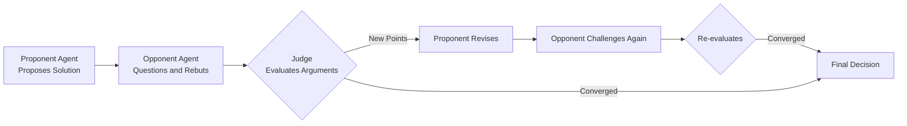
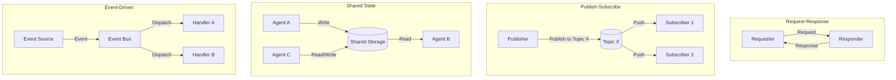

# Agent Collaboration and Communication

In 1973, Carl Hewitt of the MIT Artificial Intelligence Laboratory published a paper titled "[A Universal Modular ACTOR Formalism for Artificial Intelligence](https://dl.acm.org/doi/10.5555/1624775.1624804)," proposing that instead of having a single massive program handle everything, systems should be broken down into many independent computational entities, each knowing only its own business and collaborating through message passing. He called these entities Actors. At that time, mainstream AI research focused on building centralized reasoning systems, and this idea was almost heretical. But time proved its value. The Actor model directly influenced the concurrency model of the Erlang language, the design philosophy of the Akka framework, and remains one of the foundational ideas behind today's multi-agent systems.

Seven years later, in 1980, Randall Davis of MIT and Reid Smith of Stanford University proposed the Contract Net Protocol, providing the first systematic scheme for multi-agent collaboration. An agent manager decomposes a task and broadcasts it; capable agents bid for subtasks, and the manager selects the best bid. This "announcement-bidding-award" pattern closely resembles the contracting process in human society. It demonstrated for the first time that multiple computational entities could spontaneously organize to complete complex tasks without requiring an omniscient central brain. From Actors to Contract Nets, a consensus gradually took shape: having multiple small agents collaborate is often more flexible and robust than relying on a single large agent.

Placing both ideas in the context of today's large language models, they are not only not outdated but have become even more urgent. A single LLM agent is already remarkably capable, yet it remains constrained by its own knowledge range, context window size, and tool set precision. When you face a complete project requiring simultaneous expertise in frontend design, backend architecture, database optimization, and deployment operations, a multi-agent system becomes a far more appropriate engineering choice.

Multi-agent collaboration defines the organizational relationships and division of labor among agents, while communication provides the infrastructure for information exchange between these relationships. This chapter discusses both together, attempting to answer how multiple agents can be organized to complete complex tasks that a single agent cannot handle, through reasonable division of labor and reliable information exchange.

## Motivations for Multi-Agent

No matter how intelligent a single agent is, its knowledge comes from training data, and no model's training data can cover the full scope of human knowledge. An agent skilled at writing code may be at a loss when faced with UI color schemes and layouts; conversely, an agent that understands design language may not be able to write efficient backend query logic. Knowledge boundaries are a hard constraint; expanding model parameters can only alleviate this constraint, not eliminate it entirely. The tool set is another limitation restricting a single agent. Intuitively, equipping an agent with more tools enhances its capabilities, but when the number of available tools grows to dozens or even hundreds, the agent must select the right one from an overwhelming list at each step, and the probability of choosing incorrectly rises sharply as the list grows. Additionally, the context window has capacity limits. Even though today's LLMs support context windows of millions of tokens, the more information packed in, the more the model's attention is diluted across key details. When a task involves background information from dozens of subtasks, a single agent's context becomes a noisy meeting room where everyone is talking but no one can hear the main point. From an engineering perspective, a single agent inherently cannot avoid reliability issues. A single agent is a single point of failure; once it hallucinates or makes an erroneous inference, the entire process collapses. No one helps verify it, no one challenges its assumptions, no one proposes alternatives. In mission-critical scenarios (such as financial trading or medical diagnostic assistance), the cost of single-point failure is unacceptable.

Turning each of the above shortcomings of a single agent around reveals the strengths of a multi-agent system. Specialized division of labor lets each agent focus on its own area of expertise, drastically simplifying the tool set. A frontend agent only needs design tools and a UI component library; a database agent only needs an SQL executor and schema analysis tools. Fewer tools to choose from means less room for error, naturally improving decision accuracy. This principle aligns with the [Single Responsibility Principle](llm-to-agent.md#single-responsibility-and-composition) in agent design. Parallel processing is another benefit of multi-agent systems in the time dimension. Independent subtasks can be dispatched to different agents simultaneously; a frontend agent modifying components and a backend agent adjusting APIs need not wait for each other. Three agents working in parallel for one hour delivers a vastly better user experience than one agent working serially for three hours. Parallelism also naturally provides temporal redundancy — a slow agent does not hold back the progress of others. The engineering reliability issues of a single agent are also greatly mitigated by cross-validation in a multi-agent setup. When one agent asserts a bug, another agent can verify whether the judgment is sound. The probability of two agents reaching the same conclusion is far higher than that of one agent guessing in isolation. Conversely, if two agents reach contradictory conclusions, it serves as an alarm that something may be wrong. This built-in verification mechanism significantly reduces the impact of hallucination and reasoning errors on the final output.

## Agent Organization Methods

The collaboration architecture defines the hierarchical relationships and coordination mechanisms among agents, forming the underlying structure for the collaboration patterns discussed later. Understanding architectural choices is the first step in designing a multi-agent system.

### Centralized Architecture

A centralized architecture features a **central coordinator** (Orchestrator) that oversees the entire system. The coordinator does not perform specific tasks itself; its responsibilities are to receive tasks, decompose them, assign them, collect results, and ensure quality. The actual work is carried out by a group of worker agents, each focusing only on its assigned portion and returning results upon completion. This resembles the Master-Worker pattern in MapReduce, where the master splits a large dataset into smaller chunks for workers to process, the workers return intermediate results, and the master aggregates the final output.

The greatest appeal of a centralized collaboration architecture lies in its simplicity. With a single brain making decisions, the global state is clear at a glance, task assignments do not conflict, and result aggregation leaves nothing out. Consistency is also natural — consensus algorithms are unnecessary because the coordinator's judgment itself is the consensus. For developers, debugging a centralized system is relatively straightforward; you only need to monitor the coordinator — what decisions it made and when — to trace the vast majority of issues.

But the central coordinator in a centralized architecture is both its strength and its Achilles' heel. The coordinator itself is a single point of failure — if it goes down, the entire system stops. It is a throughput bottleneck; the computational cost of task decomposition and result aggregation grows with the number of workers, and the coordinator will eventually become overwhelmed. More subtly, a centralized architecture imposes implicit demands on the coordinator's capabilities. It must be intelligent enough to accurately assess each worker's abilities, decompose tasks reasonably, and detect and correct workers that go off course in time. If the coordinator itself is a layperson in a certain domain, it may make poor allocation decisions — for example, assigning an agent that is not good at writing tests to write unit tests for a critical module, with no one realizing the mistake until the results come in.

### Decentralized Architecture

A decentralized architecture takes the opposite approach. There is no central coordinator; agents have a peer-to-peer relationship, and task assignment and result integration are negotiated through direct communication between agents. Coordination in a decentralized architecture relies on a set of pre-agreed mechanisms. The most common is the market mechanism, where tasks are treated as auction items and capable agents bid for them — a direct continuation of the Contract Net Protocol idea from 1980. Other mechanisms include consensus mechanisms (agents vote on an issue, majority rules) and contract mechanisms (agents pre-agree on service protocols). Regardless of the mechanism, the underlying logic is to let order emerge spontaneously from local interactions rather than being imposed by a central brain.

The advantage of this architecture is the absence of a single point of failure — any agent can go down without affecting the whole. New agents can join the network at any time, and old agents can leave freely; the system is naturally suited for open environments. You do not need to know who each agent is — as long as they follow the communication protocol, they can participate in collaboration. The scenarios suited to a decentralized architecture are those without clear task boundaries, requiring multi-directional exploration. For instance, having multiple agents investigate an open-ended problem simultaneously, each gathering materials and forming perspectives from different angles, and finally converging on a conclusion through debate or voting. In such scenarios, the central coordinator itself may not know the optimal direction, so it is better to let each agent go its own way, using diversity to hedge against uncertainty.

The cost of a decentralized collaboration architecture is naturally not trivial. Consistency is the first issue to address. Without a central coordinator to make the final call, agents may arrive at vastly different judgments on the same matter. Reaching "unanimous agreement" itself requires support from consensus algorithms, and the complexity of consensus algorithms in asynchronous, unreliable networks is extremely high.

### Hierarchical Architecture

A hierarchical architecture is a compromise that stacks the global control of centralized approaches with the local autonomy of decentralized ones. It draws from the natural structure of human organizations: a company has a CEO for strategic decisions, department managers who break strategy into executable tactical tasks, and employees who carry out the specific work. In a multi-agent system, this translates to high-level manager agents responsible for setting direction and decomposing large tasks, mid-level coordinator agents managing a team of workers and handling scheduling and result aggregation within their domain, and bottom-level worker agents doing the actual work.

The elegance of a hierarchical architecture lies in its divide-and-conquer strategy. A large corporation cannot have the CEO directly manage every employee — that would make the CEO the bottleneck of the entire system. The solution is to introduce management layers: each manager oversees a few dozen people, and the CEO only needs to manage a few dozen managers. The same applies to multi-agent systems. When the number of workers grows beyond what a centralized coordinator can handle, inserting a middle layer — a high-level manager overseeing several mid-level coordinators, each managing its own team of workers — makes the system manageable again.

But this architecture also has its weaknesses. Information decays and distorts as it passes between layers; each layer summarizes and simplifies when reporting upward, and the details discarded may be critical signals needed for higher-level decision-making. Additionally, the deeper the hierarchy, the longer the decision cycle. High-level instructions must travel down layer by layer, and bottom-level feedback must travel up layer by layer; after a few round trips, the total latency becomes substantial.

These three collaboration architectures are not mutually exclusive. In a real system, you might well use centralized coordination within a hierarchical architecture (a star topology within each department), or allow some direct channels between workers within a centralized framework. The key to choosing is not which architecture is best overall, but what structure the task itself has. The more clearly layered the task, the more natural a centralized or hierarchical approach becomes; the more open-ended and uncertain the task, the more the advantages of decentralization shine.

## Agent Division of Labor

If the collaboration architecture is compared to a company's organizational chart (who reports to whom, who is at the same level), then the collaboration pattern is the organization's workflow — how tasks flow between roles, what happens at each step, and how the sequence is arranged. The relationship between architecture and collaboration patterns is loosely coupled: different collaboration patterns can run under the same architecture, and the same collaboration pattern can be built on different architectures.

### Sequential Collaboration

Sequential collaboration is the most intuitive and oldest form of division of labor. The task is cut into several stages with clear sequential dependencies; each agent is responsible for one stage, and the next stage starts only after the previous one completes. This aligns with the design philosophy of Unix pipes: `cat data.txt | grep error | wc -l` — each command does one thing, and the output of the previous command becomes the input of the next through the pipe.

The standard software development pipeline is also a textbook example of sequential collaboration. A requirements analysis agent understands what the user wants and produces a requirements document; a design agent draws the system architecture and interface design based on the requirements document; a coding agent writes code according to the design; a testing agent verifies the code; a deployment agent pushes the verified code to production. Each step depends on the output of the previous step. Skipping a step or reversing the order renders the entire process meaningless.

The advantage of sequential collaboration is clarity: who does what, when, what the inputs and outputs are — all are perfectly clear. The result of any step can be traced back to its upstream input; when problems arise, you simply follow the chain backward. The cost is speed and risk accumulation. Total latency equals the sum of each step's latency, and the slowest agent in the pipeline determines the overall system throughput. Moreover, errors propagate and amplify along the chain. A misunderstanding in the requirements analysis, after passing through design, coding, and testing, may be completely distorted by the time deployment comes around. This is known as the error propagation effect — in a sequential dependency chain, there is no "firewall" to stop upstream errors from contaminating downstream stages.

### Parallel Collaboration

Parallel collaboration attempts to solve the problems of sequential collaboration. Since sequential dependencies cause latency to accumulate, the idea is to have agents work simultaneously whenever possible. The prerequisite is that the task can be decomposed into independent subtasks that do not require real-time communication or shared mutable state between them — in this case, execution order does not matter. A typical parallel scenario is code refactoring. Adding a feature to each of five modules in a project where none of the modules depend on each other lets five agents work simultaneously, each modifying one module, with a final manual review of the results. Another example is multi-table queries in data analysis: three agents query the user table, order table, and product table respectively, collecting their results before aggregation.

The bottleneck of parallel collaboration is generally not the execution phase but the decomposition and aggregation phases. Decomposition must consider how to split the task so that each part remains independent while still providing complete coverage. Aggregation must handle conflicts between agent outputs. There is also resource contention management: when multiple agents read and write the same file or database table simultaneously, locking mechanisms are needed to prevent dirty writes, but locks themselves can introduce deadlocks and waiting. These issues have been discussed extensively in parallel programming; multi-agent parallel collaboration simply raises the same challenges to a higher level of abstraction.

### Debate-Based Collaboration

Debate-based collaboration is a pattern that emerged with LLM agents and differs fundamentally from the previous two. Both sequential and parallel collaboration assume that tasks are deterministic and decomposable. Debate-based collaboration, by contrast, is aimed precisely at uncertainty. When a problem has no standard answer, or when different agents arrive at different conclusions based on their respective perspectives, rather than letting a single agent decide, it is better to have multiple agents present their viewpoints and converge on a more reliable answer through debate.

The theoretical foundation of this pattern comes from a management concept called the Diversity Bonus: when the problem space is sufficiently complex, a group of individuals with diverse perspectives making decisions together often outperforms any one individual making the decision alone. An analogy is the jury system in human society: rather than letting a single judge decide, 12 jurors from different backgrounds each examine the evidence, express opinions, and debate with one another until consensus or a majority opinion is reached.

The typical flow of debate-based collaboration follows a triangular structure, as shown in the diagram below. A proponent agent proposes a solution along with its supporting arguments; an opponent agent scrutinizes the proposal carefully — whether the assumptions hold, whether there are logical leaps, what edge cases have been overlooked, and whether better alternatives exist. The proponent can rebut, revise the proposal, or acknowledge and incorporate the opponent's points. Finally, a judge agent synthesizes both sides' arguments and makes a decision. The judge does not have to be another agent; it could be a quantitative metric — for instance, running both proposals on a test set and letting the data decide the winner.

*Figure: Triangular flow of debate-based collaboration*

The greatest benefit of debate-based collaboration is the reduction of individual bias. When reasoning alone, an agent is prone to confirmation bias — seeking only evidence that supports its own conclusions while ignoring counterexamples. Debate introduces an adversarial perspective. Problems hidden in your reasoning may be invisible to you, but your opponent sees them clearly. This process forces each agent into deeper reasoning, and the resulting proposals are often more robust than a single agent's initial draft. The cost of debate, however, is high communication overhead. A single round of debate requires at least two or three agents to each perform a complete reasoning pass, and typically more than one round is needed — two or three back-and-forth cycles may be required to converge. Without a good termination mechanism (e.g., a maximum of three debate rounds, or termination when no new arguments appear for two consecutive rounds), the debate can degenerate into endless argumentation.

## Agent Information Exchange

If the collaboration architecture and collaboration patterns define the production relationships among agents — who directs whom and how labor is divided — then the communication protocol is the infrastructure that keeps these relationships running. It answers the questions of how messages are sent, who sends them to whom, and whether the sender waits for a response after sending. Without communication, the most elegant collaboration design remains nothing more than a blueprint on paper. In the daily operation of a multi-agent system, at least five different types of information flow through the system. Although they all manifest technically as "messages," their purposes and semantic requirements differ significantly, and mixing them together creates many problems.

- **Task assignment information** is the main channel through which a coordinator dispatches work to worker agents, typically containing the task description, input data, constraints, and expected output format.
- **Status synchronization information** is how worker agents report their current progress to the coordinator (or to peers), letting other agents know their status and avoiding duplicate work or blind waiting.
- **Result delivery information** carries the final product — an agent that has computed a result passes it on to the next agent that needs it.
- **Request and response information** handles service calls between agents, such as one agent querying a knowledge base maintained by another agent.
- **Control instruction information** covers system-level management signals — pause, cancel, retry — typically sent from the coordinator to workers.

These five types of information should be designed separately because their requirements for reliability and latency differ. Control instructions need high priority and acknowledgment mechanisms (a "cancel" message absolutely must not be lost), while status synchronization can tolerate some latency and loss (missing one progress report will not cause the entire task to fail). In practical system design, different channels or different QoS (Quality of Service) strategies are typically configured for different types of messages. These five types of information need to be carried by specific communication patterns. Next, we look at the four mainstream communication patterns in multi-agent systems and which types of information each is best suited to carry.

### Request-Response Pattern

The request-response pattern is the most basic communication pattern and the interaction style etched into every programmer's muscle memory by the HTTP protocol. The client sends a request, the server returns a response — one round trip. In multi-agent systems, this pattern is especially suitable for scenarios where a question is asked and an answer is expected. Depending on whether the sender waits for a response, request-response is divided into synchronous and asynchronous modes. In synchronous mode, the sender sends the request and waits in place until the response arrives before proceeding. This approach is simple to implement but has high latency because the sender's entire reasoning flow is blocked. If a worker needs to run a long task, the sender simply waits. Asynchronous mode solves this problem: the sender sends the request and continues with its own work, processing the response when it arrives (via callback, polling, or event notification). This reduces latency but makes the code more complex — the system must track which requests have been answered and which are still pending, significantly increasing state management overhead.

Timeout handling is an indispensable part of the request-response pattern. Workers may crash, networks may be interrupted, an LLM may loop infinitely at some step — a request may never receive a response. Without a timeout, the sender's request becomes a black hole: no answer and no idea how long to wait. Even with a timeout in place, how to handle a timed-out request requires careful consideration — whether to retry directly, fall back to a default plan, or escalate the exception to a higher-level coordinator — all of which must be agreed upon in advance based on the nature of the task.

### Publish-Subscribe Pattern

The publish-subscribe pattern breaks the prerequisite of the request-response pattern, which is that the sender must know who to send the message to. In the publish-subscribe model, the message sender does not directly specify a recipient; instead, it posts the message to a topic, and anyone subscribed to that topic automatically receives the message. This is a shift from "destination addressing" to "intent addressing" — you do not need to know which agents are currently online; you only need to broadcast about a certain topic, and interested parties will hear it.

This pattern is naturally suited for one-to-many notifications. For example, when a code commit event occurs, you do not need to know how many agents currently care about code commits (review agent, documentation agent, CI monitoring agent). You simply post a message saying "new commit on branch Y of repository X," and all agents subscribed to that topic respond accordingly. Event broadcasting, status announcements, and similar scenarios are all natural fits for the publish-subscribe pattern.

The two major pain points of the publish-subscribe pattern are message ordering and debuggability. In a distributed environment, messages may not arrive in the order they were sent — a "task completed" message could arrive before a "task started" message — and subscribers need to handle this out-of-order arrival. Additionally, publishers and subscribers are unaware of each other's existence, making it difficult to trace the flow of information. When something goes wrong, it becomes hard to reconstruct who sent what to whom and when.

### Event-Driven Pattern

The event-driven pattern is closely related to the publish-subscribe pattern but has a different emphasis. The core idea of event-driven design is that a state change triggers a notification. Whenever a state change occurs in the system (such as a task completing, a file being updated, or an agent joining), an event is emitted, and agents interested in that change automatically trigger corresponding response behaviors. Events and messages have a subtle semantic difference. A message tells a subscriber to do something — it carries an imperative tone, and the sender expects the receiver to take action. An event announces that something has happened — it is declarative. The sender merely states a fact; whether there will be a response, and who will respond, is of no concern to the sender. Understanding this distinction is important for designing communication semantics. If you use events to deliver task instructions, problems can arise because the declarative semantics of events provide no guarantee of who will take on the task.

The main risk of the event-driven pattern lies in scale. The concept of an event storm originated in microservice architecture but applies equally well to multi-agent systems. A seemingly harmless state change can trigger a chain of agent responses, which in turn generate new events, triggering more responses — forming an uncontrolled positive feedback loop. For example, a "file A modified" event triggers a review agent to produce a new review report, which triggers a documentation agent to update the documentation, which triggers a translation agent to start translating... the longer the chain, the more irrelevant activity in the system, drowning out the actual productive work. Suppressing event storms requires event governance strategies: limiting event propagation depth, merging high-frequency events, and setting propagation scopes for events.

### Shared State Pattern

The shared state pattern takes a completely different approach from sending messages. Agents do not communicate directly but collaborate indirectly through a shared data space. Agent A writes its result to shared storage, and Agent B reads from the same storage. It is like documents in a shared team folder — you do not need to send files to colleagues; everyone opens the same file and sees the latest version.

The most famous implementation of the shared state pattern is the Blackboard System, first proposed in the late 1970s for multiple expert systems to collaboratively solve complex signal understanding problems. On the blackboard, each agent can read and write to a common data structure, see others' intermediate results, and build upon those results for further reasoning. Agents do not need to know of each other's existence; they only need to know the blackboard's address and read-write rules.

The greatest benefit of shared state is asynchronous collaboration and temporal decoupling. Agent A can write results at 3:00 PM, and Agent B can read and use them at 5:00 PM — they do not need to be online simultaneously. State is naturally persistent, which provides excellent support for long-cycle tasks. The biggest challenge of shared state is concurrent write conflicts — what happens when two agents modify the same piece of the blackboard simultaneously? Who arbitrates? There is also the issue of state cleanup: intermediate results accumulate on the blackboard over time. When should they be deleted, and by whom? Not cleaning leads to space bloat; cleaning too fast may delete important data that other agents have not yet read.

### Choosing a Communication Pattern

The four communication patterns are not mutually exclusive. The request-response pattern is suited for point-to-point deterministic interactions, such as "please run unit tests for this function." The publish-subscribe pattern is suited for one-to-many broadcast notifications, such as "a new version has been released, please be aware." The shared state pattern is suited for loosely coupled asynchronous output accumulation, such as multiple agents collaboratively writing a technical proposal. The event-driven pattern is suited for scenarios requiring real-time awareness of state changes, such as automatic trigger chains in a CI pipeline. Real-world systems almost always mix these patterns — for instance, in a centralized architecture, the coordinator uses request-response to assign tasks, workers exchange intermediate results through shared state, and key state changes are broadcast globally through events.

*Figure: Interaction topology of the four communication patterns*

## Communication Reliability Guarantees

Communication is certainly not a matter of simply throwing out a message and calling it done. In a multi-agent system, network latency, agent crashes, and LLM response timeouts can all cause a message to vanish without a trace. And a single lost critical message — such as "cancel this task" — can trigger cascading failures. Reliability guarantees are not an optional add-on; they are an inseparable part of communication protocol design.

### Message Delivery Guarantees

Message delivery has three levels of guarantee, from lowest to highest: At-Most-Once, At-Least-Once, and Exactly-Once.

- **At-Most-Once** is the lowest level of guarantee. It promises that a message will not be delivered more than once, but does not guarantee that it will arrive at all. The message is sent; if it is lost, so be it. This level is suitable for low-value notification messages, such as periodic status synchronization — missing one update does not affect the overall task.

- **At-Least-Once** guarantees that a message will not be lost. If it cannot be delivered, the sender retries until it confirms receipt. The cost is possible duplication: during a network glitch, the sender may not receive an acknowledgment and retransmits, but both copies arrive, so the receiver gets two identical messages. This requires the receiver's processing logic to be **idempotent** — processing a message once and processing it twice must produce exactly the same effect. In multi-agent systems, at-least-once is the conventional choice; designing idempotent processing for receivers is typically less costly than implementing exactly-once semantics.

- **Exactly-Once** is the most ideal guarantee and the most expensive promise in distributed systems. It requires coordinating the state of both sender and receiver to ensure that, even with retries and network failures, the message is processed exactly once. Implementing exactly-once typically relies on an idempotent deduplication mechanism on the receiver side combined with at-least-once delivery. The sender can use a transaction log (writing the message and the business operation in the same atomic transaction) to ensure atomic commit of message and state changes, but this only guarantees at-least-once delivery; receiver-side deduplication is still needed to reach consistent commitment. The "inquire-prepare-send" handshake mechanism itself does not guarantee exactly-once semantics — if the receiver crashes after acknowledging readiness, the message is still lost, and if the sender retries on timeout without deduplication, duplicate processing occurs. In multi-agent communication, exactly-once should generally only be adopted for irreversible operations (such as debiting funds, permission changes, or releasing critical resources), because the implementation cost is high and often disproportionate to the business value of the task in most scenarios.

### Message Acknowledgment and Retransmission

The acknowledgment mechanism (ACK) is the basic means of guaranteeing at-least-once semantics. After successfully processing a message, the receiver sends an acknowledgment signal back to the sender. The sender starts a timer after sending the message; if it receives an ACK before the timer expires, the communication round is complete. If the timer expires without receiving an ACK, the sender retransmits. Fixed-interval retransmission is the simplest approach — retry every 5 seconds — but if the problem is network congestion, continuously retrying at a high frequency only worsens the congestion. **Exponential Backoff** is the classic solution to this problem. The first retry waits 1 second, the second waits 2 seconds, the third waits 4 seconds, doubling each time until a preset maximum is reached (typically set at around 30 seconds or 1 minute). A maximum retry count (e.g., 5 or 10 retries) is also set as a safety cap; beyond this, the message is marked as failed and transferred to the dead letter handling process.

In agent scenarios, setting the acknowledgment timeout requires special consideration. An agent processing a request may need to call external APIs, perform complex reasoning, or read and write the file system — completing a response may take anywhere from seconds to minutes. If the ACK timeout is set too short, many normal slow processes will be misjudged as failed requests, triggering a large number of unnecessary retransmissions. Therefore, the ACK timeout in agent communication should match the expected execution time of the task. The response time threshold for a data analysis agent could be set at the minute level, while a simple information query agent only needs a few seconds.

### Dead Letter Handling

Dead letters are messages that simply cannot be processed no matter what — invalid format, nonexistent receiver, repeated failures after countless retries, or messages created under conditions that will never be satisfied. Dead letters are not an independent problem; they are a signal of the system's health. Simply discarding dead letters is equivalent to covering up the problem. The standard practice is to introduce a dead letter queue — a dedicated storage area where messages that have failed processing are moved out of the normal processing channel. The purpose is not to leave them unattended but to isolate the problem so that the flow of normal messages is not blocked, while providing developers and operators with a window for post-hoc analysis. Each message in the dead letter queue should retain the failure reason and timestamp for traceability.

Several strategies are available for handling dead letters. **Retry** is the most direct: after fixing a formatting error or restarting a crashed receiver agent, re-queue the dead letter back into the normal channel. **Degraded processing** provides a fallback with a simplified workflow when fully correct processing is impossible — for example, if a message requests a report containing 20 metrics but the query for metric 7 times out, generate a report with 19 metrics and note the omission. **Alerting** notifies humans when the number or rate of dead letters becomes abnormal, because a large batch of dead letters typically indicates a systemic failure rather than a problem with individual messages. The dead letter rate itself is a system health metric that should be continuously monitored.

## Chapter Summary

From Hewitt's Actor model to Smith's Contract Net Protocol, the idea of multi-agent collaboration has moved from the academic fringe to the center of engineering practice over half a century. This chapter has laid out several trade-offs that must be faced when building a multi-agent system: the simplicity and controllability of a centralized architecture coexists with single-point vulnerability; the resilience of decentralization comes at the high cost of consensus and debugging. The clear workflow of sequential collaboration is constrained by error propagation, while the efficiency gains of parallel collaboration require decomposability as a prerequisite. And the reliability of message delivery is the foundation for all collaboration designs — no matter how exquisite the division of labor, if messages can be lost or duplicated, it is all just a castle in the air. Design is about finding balance within these tensions, not pursuing some absolute optimal solution.

## Exercises

1. A five-person development team uses GitHub Flow for collaboration: each person develops on their own branch, initiates code review through Pull Requests, and merges into the main branch after review. From the perspective of multi-agent collaboration, analyze which collaboration architectures, collaboration patterns, and communication protocols correspond to this workflow? What are the similarities and essential differences between team collaboration and agent collaboration?

   

   
Reference Answer

   The collaboration architecture is decentralized (no central scheduler; developers claim tasks on their own), but the PR review mechanism introduces centralized quality control (a localized centralized feature). The collaboration pattern involves both parallel (multiple people developing simultaneously) and sequential (code review → merge pipeline) elements, as well as iterative refinement (modifications → re-review). In terms of communication patterns, PR creation and comments are request-response; CI status notifications ("Build Passed") are event-driven, with some publish-subscribe characteristics (team members watching the repository).

   Similarities: both involve task decomposition, division of labor, communication, status synchronization, and quality assurance. Essential differences: human developers have implicit common sense and domain experience — they understand each other without needing an explicitly defined "shared ontology"; agents, on the other hand, require explicit role definitions, contracts, and communication protocols — all tacit knowledge must be translated into explicit specifications.

   

2. Suppose you have an LLM agent system consisting of the following four agents: Requirements Analyst, UI Designer, Backend Engineer, and Test Engineer. The average time for each agent to complete one full inference run is 10 seconds, 15 seconds, 20 seconds, and 8 seconds respectively. If the task must be executed strictly in the order "Requirements Analysis → UI Design → Backend Coding → Testing," can an alternative collaboration approach be used to reduce the total completion time? Under what circumstances can the order be changed, and under what circumstances can it not?

   

   
Reference Answer

   The total time for strict sequential execution is 10+15+20+8=53 seconds, accumulated by chaining the slowest stages together. If the dependencies can be decoupled, UI Design and Backend Coding can run in parallel after the requirements analysis is confirmed, then both feed into the testing phase. The total time would then be 10+max(15,20)+8=38 seconds, a savings of approximately 28%.

   When the dependency cannot be changed: UI Design must "see" the complete definition of the backend API to design the corresponding interactions (UI depends on backend), so the backend must execute before the UI. When it can be changed: the requirements analysis produces sufficiently clear interface specifications, allowing UI and backend to proceed independently based on the same specification — in this case, parallelism is feasible. The key is not "whether parallelism is theoretically possible" but whether the interface specification is complete and precise enough for both teams (or agents) to work independently.

   

