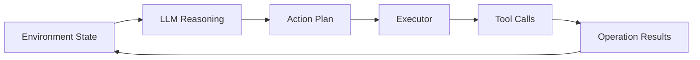
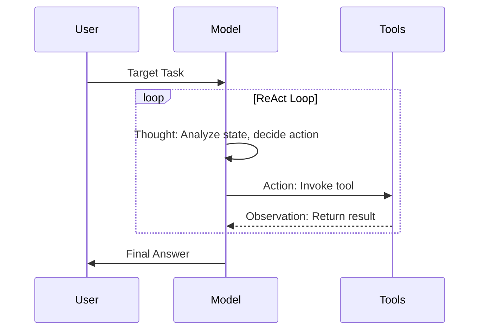
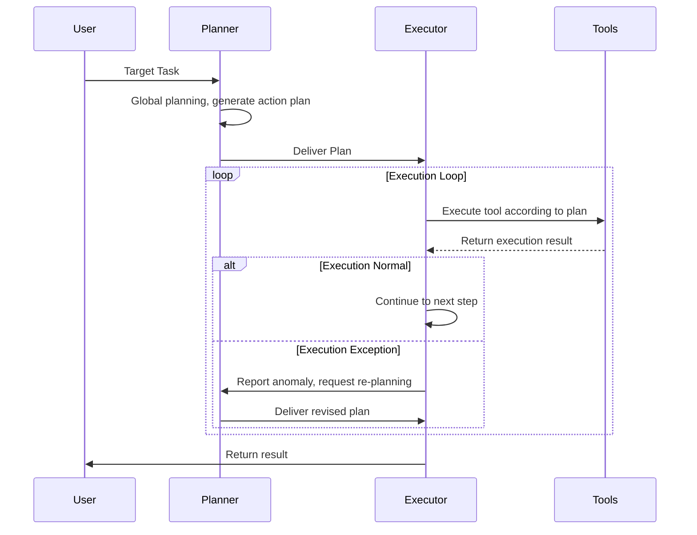
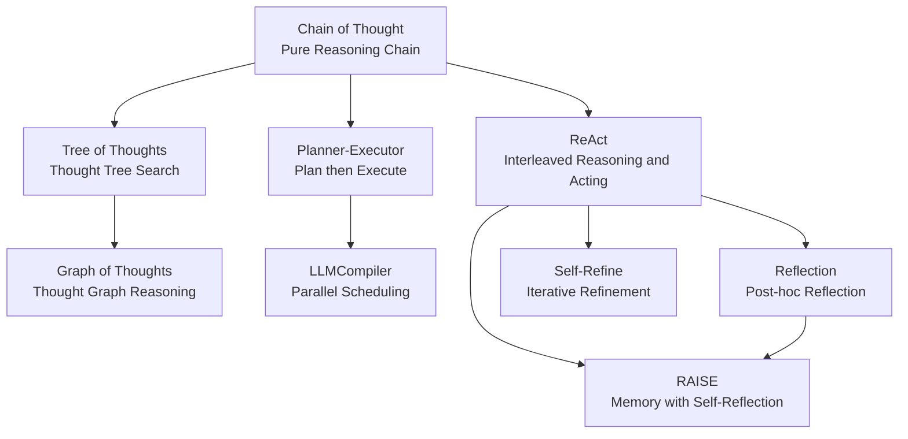

# From LLM to Agent

Language models excel at "talking," while agents excel at "doing." The leap from a text-generation system to one that can act autonomously is not a recent endeavor. As early as the dawn of AI research, researchers dreamed of building autonomous systems capable of perceiving their environment, formulating plans, and executing actions. In the 1970s, U.S. Air Force Colonel John Boyd proposed the OODA loop (Observe-Orient-Decide-Act) to describe fighter pilots' decision-making process in air combat: observing the enemy's position, orienting to the battlefield situation, deciding on a maneuvering strategy, acting on the decision, then restarting the cycle based on the new state. This framework was later adopted by the AI field and became an important reference for agent architecture design.

More than half a century later, the advent of large language models has opened a new path toward realizing the dream of autonomous agents. In 2022, Shunyu Yao and colleagues introduced the ReAct pattern in their paper "[ReAct: Synergizing Reasoning and Acting in Language Models](https://arxiv.org/abs/2210.03629)," interweaving the reasoning capabilities of language models with the action capabilities of external tools, systematically outlining the technical route from LLM to Agent. Subsequently, agent frameworks represented by AutoGPT and LangChain emerged en masse in 2023, marking the transition of LLM-based agents from academic concepts to engineering practice.

## The Capability Boundaries of LLMs

Before discussing agents, we must honestly examine what language models cannot do on their own. Understanding these boundaries is essential to grasping the rationale behind each component in an agent architecture. Imagine this scenario: you input "help me check the server status" to an LLM. The response might be a suggestion like "use the `top` command to check CPU usage," or it might generate a simulated server status text. But the model will not actually log into the server, execute a command, or read the output. This is the first limitation of language models: they are passive text generators. Both input and output are sequences of tokens, not operational instructions. This is not a design flaw — the design goal of language models is to focus on language understanding and generation; action capabilities should be supplemented through the agent's external mechanisms.

Beyond action constraints, as mentioned in the [RAG section](../vector-retrieval-rag/retrieval-augmented-generation.md), language models are also constrained by the timeliness of static knowledge. The model's information is frozen at the moment its training data baseline is set. Events occurring after training, records in private databases, and real-time sensor readings are all unknown to the model. This means that even if the model is capable of generating correct action instructions, it may make erroneous decisions due to outdated or incomplete information. This is the fundamental reason why agent architectures need to incorporate environment perception and information retrieval capabilities.

Having addressed action and information retrieval capabilities, the third hard constraint on language models is their limited context window. The size of the context window determines how much information the model can see in a single inference. Take a programming task as an example: a coding session lasting several hours quickly accumulates a vast amount of information — user requirements, multi-turn adjustment instructions, the content of multiple source files, terminal command output, debug logs, error stacks... Any of these pieces of information might be needed for subsequent decisions, but the physical capacity of the window cannot retain them all. Furthermore, the efficiency of context window usage itself degrades as length increases. The Lost in the Middle phenomenon reveals that the model's accuracy in retrieving information from the middle portion of the context decreases significantly. This means that simply expanding the context window does not fundamentally solve the problem and may instead introduce new reliability risks. Therefore, agent systems need external memory capabilities as a reliable supplement to the context window.

Finally, language models are optimized for textual probability coherence, not factual accuracy. When generating each token, the model's training objective is to maximize the statistically most probable next word, not the most correct one — because "correctness" cannot be quantified. This gives rise to the phenomenon of hallucination in language models. In a chat scenario, fabricating a restaurant that doesn't exist or a book that was never published is merely amusing. But in an agent scenario, the consequences of hallucination are far more severe. If an agent is tasked with securities trading or cloud server operations, a hallucinated piece of nonexistent information could trigger a cascade of erroneous decisions. Even seemingly minor, inconsequential hallucinations can snowball within the agent's decision loop, causing the entire task to go off course. The principles of language models dictate that hallucination cannot be completely eliminated. The pragmatic approach is to accept the possibility of hallucination, then use the agent's self-reflection mechanism to check for logical gaps in the reasoning chain, and perform independent fact-checking through cross-validation with external knowledge sources.

## Agent Design Patterns

Having understood the capability boundaries of LLMs, let us examine how agents compensate for these shortcomings one by one. Agent architecture design revolves around how to transform a passive text generator into an autonomous decision-making system.

### The Perceive-Decide-Act Loop

If we had to summarize an agent's mode of operation in a single word, it would be "loop." An agent is not a one-shot question-answering machine but a cyclic decision-making system that repeatedly goes through "observe, think, act." The intellectual origin of this loop can be traced back to John Boyd's OODA loop mentioned earlier. The agent inherits the basic framework of the OODA loop but gives new meaning to each phase. Within the loop, the LLM serves as the thinking and decision-making center: it receives a structured description of the environmental state, reasons about the current situation, and generates a plan for the next action. The executor then translates the action plan into concrete operations — calling APIs, reading and writing files, querying databases — and collects the results as new observations, feeding them back to the LLM for the next round of reasoning.

*Figure: Agent Loop*

The diagram above clearly shows the closed-loop structure of the agent cycle. The result of each action becomes the input for the next round of reasoning, forming a continuous flow of information. Each link in the diagram corresponds to a component in the architecture: the LLM reasoning module is responsible for decision-making, the executor is responsible for translating decisions into specific operations, and the toolset is the agent's interface with the external world.

From a broader perspective, the OODA loop is structurally consistent with the interaction pattern in [reinforcement learning](../../language-models/alignment/rlhf.md). The difference lies in the representation of interactions. Reinforcement learning uses numerical vectors (state vectors, action vectors, reward values) to guide optimization, while LLM agents use natural language text for both state description and action description. Language is far more expressive than numerical vectors, meaning LLM agents can handle far more complex and open-ended tasks than traditional reinforcement learning models. On the other hand, using natural language as the interaction medium also introduces new uncertainty through the ambiguity of linguistic descriptions.

### The ReAct Pattern

In 2022, Shunyu Yao from Princeton University introduced the ReAct pattern in the paper "[ReAct: Synergizing Reasoning and Acting in Language Models](https://arxiv.org/abs/2210.03629)," for the first time unifying reasoning and acting within a language model as an alternating process. In simple terms, ReAct lets the model "think" before acting, then "think" again based on the outcome, repeating this process. Each ReAct cycle consists of three phases: Thought, Action, and Observation:
- **Thought**: The model analyzes the current state in natural language and decides what to do next.
- **Action**: The model generates a tool invocation instruction, which is executed by an external system.
- **Observation**: The tool's execution result is appended to the context as text, becoming input for the next round of thinking.

This cycle of Thought → Action → Observation → Thought repeats until the model determines that the task is complete. The timing diagram of the ReAct pattern is shown below.

*Figure: ReAct Pattern*

Before the ReAct pattern was proposed, there were already two early design paradigms for agents. The pure reasoning mode (Chain-of-Thought, or CoT) lets the model reason step by step, achieving significant results on tasks such as mathematical problem-solving and commonsense question-answering. However, because it lacks the ability to use tools, the reasoning process never interacts with the external world. Once the model encounters a blind spot in its internal knowledge, the entire reasoning chain proceeds on incorrect information with no means of self-correction. The pure action mode (Act-Only, which was never advocated as an agent design paradigm and is generally used as a baseline for comparison) does the opposite: it lets the model invoke tools directly without performing explicit reasoning at intermediate steps, causing the model to act blindly when information is insufficient. ReAct combines the two: reasoning helps the model formulate more reasonable action plans, and action helps the model obtain real-time information needed for reasoning. For example, when an agent is asked "Which university is the 2023 Nobel Prize in Physics laureate affiliated with?", the ReAct thought process might look like this:

> - Thought: "I don't know who won the 2023 Nobel Prize in Physics; I need to look it up."
> - Action: Call the search tool to query "2023 Nobel Prize in Physics."
> - Observation: Search results return "Pierre Agostini, Ferenc Krausz, Anne L'Huillier."
> - Thought: "Now I need to check each person's institution."
> - Action: Query the information for each person individually...

This interleaving of thinking and acting allows the agent to think while doing, and do while thinking, much like a human. Of course, ReAct has its own limitations. Each round of the Thought-Action-Observation cycle consumes a significant amount of context space. In long tasks, early information may be pushed out of the window, and reasoning costs are also increased. These limitations are precisely what gave rise to the Planner-Executor separation pattern.

### The Planner-Executor Pattern

In the ReAct pattern, the model stops to think about the next step after every action. This pattern performs well in tasks with high uncertainty where information is gradually acquired. However, in tasks with clear steps and well-defined dependencies, re-evaluating the global strategy after every action is highly inefficient. The **Planner-Executor** separation pattern offers an alternative approach to agent design. In simple terms, it means "think it all through before acting." The Planner performs global planning of the entire task before any action begins, generating a structured action plan that includes sub-task decomposition, execution order, and dependency relationships. The Executor receives this plan and executes each step methodically, reporting to the Planner for re-planning only when an anomaly is encountered. The timing diagram of the Planner-Executor pattern is shown below.

*Figure: Planner-Executor Pattern*

ReAct and Planner-Executor represent different timings of decision-making. ReAct distributes decisions across every step, pursuing flexibility and real-time adjustment. Planner-Executor centralizes decisions at the initial stage, pursuing global optimality and reduced repetitive reasoning. They are not mutually exclusive; in practice, a hybrid strategy is more common: first using a planner to generate an overall plan as a roadmap, then triggering local re-planning when the executor encounters unexpected situations, without discarding the entire plan.

The benefit of separating Planner and Executor is that planning and execution can be optimized independently. The planner can use a more powerful model for global reasoning, while the executor can use a lighter-weight model to reduce per-step costs. The granularity of planning can also be adjusted based on task complexity: simple tasks only need a coarse-grained list of steps, while complex tasks may require structured plans with conditions and loops. Additionally, separation means the execution process can be externally monitored and interrupted, which is especially important for critical tasks requiring human oversight.

The separation of Planner and Executor also introduces additional costs. A clear communication protocol is needed between the planner and executor, such as the format of the plan, how anomalies are defined, and the trigger conditions for re-planning. These issues accumulate complexity over multiple rounds of interaction. A more fundamental problem is that the planner often has incomplete information when formulating the plan: it does not know what a particular tool call will return, nor what surprises will arise during execution. This means the initial plan has a high probability of requiring revision, and the revision itself may incur costs comparable to reasoning from scratch.

### Agent Design Pattern Landscape

ReAct and Planner-Executor represent two poles in the spectrum of agent design patterns: one distributes decisions across every step, the other centralizes decisions at the initial stage. Around these two main axes, academia and industry have evolved a series of variant patterns over the past few years. Understanding the evolutionary relationships between these patterns is more important than memorizing the definition of each one.

*Figure: Agent Design Pattern Landscape*

All LLM-based agents rely on the reasoning capabilities provided by the model. The various agent design patterns that exist today can be said to have emerged from addressing the shortcomings of the pure reasoning chain, CoT. CoT only advances along a single linear path of thought — no branching, no backtracking, no interaction with the external world. The three branches in the diagram above correspond to different improvement directions for these three flaws of CoT, each extending the capability boundaries of the pure reasoning chain from a different angle.

- The left branch (CoT → Tree of Thoughts → Graph of Thoughts): [Tree of Thoughts](../../language-models/reasoning/test-time-compute.md#tree-search) (ToT) breaks the constraint of CoT's linear thinking path. At key decision points in reasoning, it simultaneously explores multiple candidate ideas, branching out like a tree. It then prunes low-scoring branches and deepens high-scoring ones through an evaluation mechanism. Graph of Thoughts (GoT) further relaxes the tree structure constraint, allowing connections between any two thought nodes, supporting the merging of intermediate results from multiple reasoning branches, and even letting conclusions from one branch feed back into the reasoning of another. The contribution of this branch is to transform reasoning from a single line into a network, giving the model the ability to explore, compare, and backtrack, rather than committing to the first idea that comes to mind.

- The middle branch (CoT → Planner-Executor → LLMCompiler) addresses CoT's lack of a review and correction mechanism. Planner-Executor introduces high-level planning to construct a goal framework that can be referenced. As the executor proceeds, it continuously compares actual results against the planned expectations, with deviations triggering corrections. LLMCompiler extends this idea to parallel execution scenarios: using dependency analysis to decompose the plan into sub-task sets that can be scheduled in parallel, allowing different steps to proceed simultaneously and reducing end-to-end latency. The contribution of this branch is to introduce a review layer above reasoning itself, transforming the decision-making process from a one-shot one-way derivation into a structured workflow that can be inspected, adjusted, and parallelized.

- The right branch (CoT → ReAct → Reflection → Self-Refine → RAISE) solves the problem of pure reasoning not interacting with the external world. ReAct embeds tool invocations within the reasoning loop, allowing the model to obtain external information as fuel for reasoning during thinking breaks. In the subsequent evolution of this branch, Reflection and Self-Refine add a self-reflection layer on top of the ReAct loop, enabling the agent not only to obtain external feedback but also to perform post-hoc evaluation and iterative refinement of its own outputs. RAISE further combines self-reflection with external memory, moving the agent from single-round correction to cross-round continuous improvement. The contribution of this branch is to free reasoning from operating in a vacuum, maintaining information freshness and reasoning accuracy through repeated dialogue with the environment and itself.

These three branches are not independent of each other; they are complementary in the problems they solve. In real-world agent systems, multiple design patterns often operate together in an interwoven manner. For example, the search mechanism of Tree of Thoughts might be used together with Planner-Executor's re-planning that relies on external information feedback, and the self-reflection in the ReAct branch may also trigger a re-evaluation of previous reasoning paths.

## From Dialogue to Autonomous Action

When discussing agent autonomy, a common misconception is to treat autonomy as a binary value — either fully manual or fully autonomous. In reality, **autonomy** is a continuous value ranging from low to high, with different levels suited to different task scenarios and risk requirements. A 2025 paper from the University of Washington, "[Levels of Autonomy for AI Agents](https://arxiv.org/abs/2506.12469)," provides a hierarchical classification of agent autonomy:

- **Level 1 — Zero Autonomy**: At this level, the agent is merely a passive tool invoker. Humans issue detailed instructions for each step, the agent executes and returns results, making no autonomous decisions. The agent does not drive the decision process; the user always maintains full control over the workflow.
- **Level 2 — Advisory Autonomy**: The agent collaborates with the user in planning and executing tasks. Both parties can delegate work to each other, and the user can take over the agent's work at any time or directly modify the agent's output. This level is suitable for high-risk operations (such as database write operations or production environment changes), where humans retain final approval authority and the agent serves as an intelligent assistant rather than an independent decision-maker.
- **Level 3 — Supervised Autonomy**: The agent leads task planning and execution, proactively consulting the user when expertise, preference judgment, or directional guidance is needed. The user influences the agent's work indirectly through feedback and comments, rather than directly taking over control. Defining what constitutes an "uncertain situation" is critical — for instance, "the tool returned an unexpected error" qualifies, while "step 3 of the task is complete, preparing to execute step 4" does not. This level requires the agent to be capable of determining which situations exceed its own capabilities.
- **Level 4 — Conditional Autonomy**: The agent operates fully autonomously within preset boundaries, pausing only when those boundaries are exceeded. The paper describes L4 control mechanisms including: users pre-specifying which types of operations require approval, the agent requesting approval when encountering missing credentials or high-risk operations, and users being able to reject the agent's proposal and ask for alternatives.
- **Level 5 — Full Autonomy**: Humans only set the goal, and the agent autonomously completes all operations. This level is currently only applicable to low-risk, high-fault-tolerance scenarios, such as generating code in an isolated sandbox environment or running automated tests in a test environment. L5 agents do not provide mechanisms for user intervention (only an emergency stop switch); users can only monitor and audit through activity logs.

The primary considerations when choosing an autonomy level are fault tolerance and the severity of error consequences. A code-writing agent can operate at a higher autonomy level because code errors can be caught by compilers and tests. But a database management agent must operate at a lower autonomy level because a single accidental deletion may be unrecoverable. This asymmetry means that in practice, the same agent may operate at different autonomy levels for different types of operations: granting high autonomy for read operations while maintaining low autonomy for write operations.

## Agent Design Principles

The preceding sections have covered agent architecture and operational mechanisms. However, beyond architectural design, there are overarching engineering principles that run through all agent systems. These principles are not proprietary to any single agent framework but are general guidelines distilled and repeatedly validated through extensive engineering practice.

### Single Responsibility and Composition

In software engineering, the **Single Responsibility Principle** requires that a module be responsible for only one function. This principle applies equally, if not more so, to agent design. A "universal agent" that attempts to handle all tasks inevitably faces a complex decision space, difficult-to-debug behavior, and unpredictable failure modes. In contrast, a more viable path is to decompose the system into multiple agents with clear responsibilities — each focused on one type of task — and then compose them to handle complex scenarios. There are three basic forms of agent composition:

- **Sequential composition** is the simplest form: the output of Agent A serves directly as the input for Agent B, forming a processing pipeline. This approach is suitable for tasks with a clear sequential dependency, such as "analyze requirements → generate code → code review."
- **Parallel composition** allows multiple agents to process different sub-tasks simultaneously, then aggregates the results for final decision-making. This is suitable for scenarios where sub-tasks have no dependencies, such as searching multiple data sources simultaneously and merging results.
- **Hierarchical composition** introduces a manager agent responsible for decomposing high-level goals into sub-tasks, assigning them to worker agents, aggregating execution results, and making final decisions. The hierarchical structure is most common in large systems because it naturally enables layered management of task complexity.

### Principle of Least Privilege

The **Principle of Least Privilege** originates from operating system security design, where it stipulates that a process should only be granted the minimum set of permissions required to complete its task. This principle directly applies to controlling an agent's tool invocations. The more things an agent can do, the greater the potential damage when something goes wrong. If a user accidentally inputs "help me delete all temporary files" in a chat box, an agent without permission controls might actually carry out this destructive operation. Therefore, only the necessary set of tools should be exposed to the agent, and sensitive operations (file deletion, network requests, system configuration changes) require additional confirmation steps.

There is a trade-off between permissions and autonomy. The higher the autonomy granted to an agent (less human intervention), the more its permission scope needs to be tightened (narrower operational boundaries). Conversely, if an agent operates under strict permission constraints, its autonomy can be appropriately increased, because mistakes within a bounded safe perimeter will not cause serious consequences. This balance between permissions and autonomy is an important consideration when designing production-grade agent systems.

### Observability and Interruptibility

**Observability** requires that every step an agent takes be traceable, including the reasoning behind decisions, tool invocation parameters, and return results. This is not only a debugging requirement but also a security requirement. When an agent behaves abnormally, developers need to trace back which step's decision went wrong and what information led to the erroneous choice. Without adequate logging, an agent is an uninterpretable black box. In practice, observability logging typically includes multiple dimensions: decision logs recording the Thought content and chosen Action at each step, execution logs recording the specific input and output parameters of tool invocations, and state logs recording key internal state changes of the agent (such as context usage rate, remaining steps, number of corrections). These logs serve not only as a means of post-hoc investigation but can also be exposed to human supervisors in real time as a basis for interruptibility decisions.

**Interruptibility** is the safety baseline. Users should be able to pause or terminate the agent's execution at any time, regardless of the agent's current state. Implementing interruptibility is not technically trivial. The agent may be in a non-preemptible state while executing a tool call, requiring the design of interrupt signal pathways at the architecture level to ensure that interruption requests can be responded to in a timely manner. Good interruptibility design also requires that the agent be able to gracefully save its current state upon termination, so that execution can be resumed later rather than having to start from scratch.

### Graceful Degradation

The design philosophy of **Graceful Degradation** holds that when part of a system fails, it should continue operating in a degraded mode rather than crashing completely. This philosophy has been fully developed in distributed system design and is equally important in the agent context, because the external environment agents face is inherently uncertain. APIs may return rate-limiting errors, the file system may run out of space, and the LLM service itself may be temporarily unavailable.

The design of degradation strategies requires preparing fallback options for every possible point of failure. When a tool is unavailable, the agent can try functionally equivalent alternatives. If all alternatives are unavailable, the agent should clearly report the current boundaries of available capabilities to the user, rather than silently producing incomplete results. When the context window is approaching its limit, the agent can proactively compress history (replacing detailed logs with summaries) or offload some information to external memory. When the task scope is too large, the agent can split the task into multiple rounds of execution, completing one portion per round and passing state between rounds through external storage. Degraded behavior itself must be explicitly communicated to the user. A silently degrading agent — for instance, one that replaces a database query with a simple search without informing the user — may produce erroneous results that are difficult to detect. The agent should report to the user when degrading: what problem was encountered, what alternative solution was adopted, and what impact the alternative may have on the result.

## Summary

The leap from LLM to Agent is essentially about supplementing language models with four capabilities they inherently lack: perception (through continuous observation of environmental state), action (through tool invocation), memory (through external memory systems), and self-reflection (through cyclic checks). Understanding this framework allows one to see through the surface-level functional differences of various agent products on the market and recognize their shared architectural foundation.

## Exercises

1. What is the core difference between the ReAct pattern and the pure reasoning mode (Chain-of-Thought)? In what types of tasks does the "action" capability of ReAct provide a significant advantage?

   

   
Reference Answer

   The core difference is that ReAct allows the model to invoke external tools and interact with the real world during the reasoning process, while CoT performs reasoning entirely within the model's internal knowledge. When a task requires access to information beyond the model's training data — such as querying real-time data, calling APIs, or reading and writing files — ReAct's action capability provides a decisive advantage. For example, in a task like "check today's weather and suggest what to wear accordingly," CoT can only reason based on its internal knowledge and cannot obtain real-time or external information, while ReAct can actually query a weather API.

   

