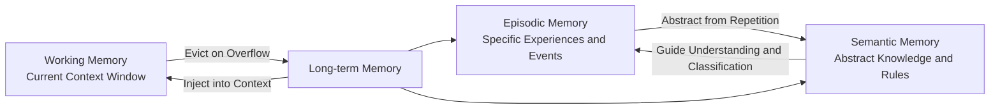
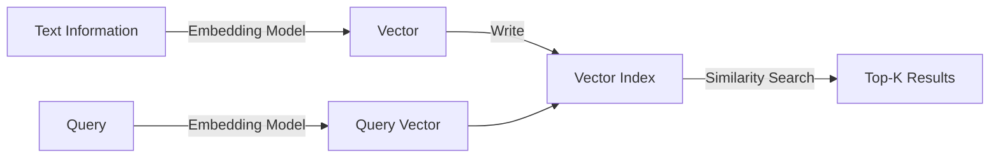
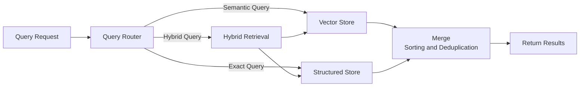

# Memory Systems

The context window of an LLM is limited, yet the tasks an Agent executes may last hours or even longer, generating far more information than the window can hold. Imagine a customer service Agent that has chatted with a user for 200 rounds, covering topics like return procedures, order inquiries, and coupon usage, while its context window only accommodates the most recent 10 rounds. When the user suddenly asks, "Can I still use that coupon I mentioned earlier?", the Agent needs a way to retrieve this information from past conversations, even though it has already scrolled out of the context window. How an Agent effectively stores, retrieves, and utilizes information beyond the context window is exactly the problem that **Memory Systems** aim to solve.

The concept of memory systems is not unique to LLM Agents. As early as 1968, Turing Award winners Allen Newell and Herbert Simon explored the hierarchical structure of human memory in their information processing theory, where short-term memory has limited capacity and requires active rehearsal to be maintained, while long-term memory has vast capacity and requires cues for retrieval. In 1972, Canadian psychologist Endel Tulving further distinguished between episodic memory and semantic memory, a classification that remains a foundational framework in cognitive science today. More than five decades later, LLM-driven Agents encounter problems similar to those in human cognitive science, and the solutions are evolving along paths analogous to biological memory.

## Memory Classification

Before diving into specific storage and retrieval techniques, let us first clarify the types of memory an Agent possesses. Different types of memory vary greatly in capacity, timeliness, and access methods. Understanding these differences is essential for choosing the right technical approach for each type.

### Working Memory

Imagine you are taking orders for a table at a restaurant, simultaneously holding in mind each person's dish, who has dietary restrictions (no spice or no seafood), and how many cold and hot dishes have already been ordered. But this information is only needed during the ordering process; once the order is placed, you can forget it. **Working Memory** is exactly this kind of information currently in use. For an Agent, working memory corresponds to the LLM's context window. Every message within the window — system prompts, user inputs, tool call results, conversation history — is part of working memory. Its maximum capacity is determined by the size of the context window. Working memory is fast to access, but once the conversation ends or the window overflows, this information is lost.

The challenge in managing working memory lies in the limited context window while the conversation continuously generates new information, meaning some old information must inevitably be evicted. The simplest strategy is FIFO (First In, First Out), where the earliest information in the window is the first to be removed, much like a queue. However, this is clearly not smart enough, as the user's name is far more worth retaining than pleasantries like "nice weather today." A more practical approach is to assign priority to each piece of information, preferentially evicting low-priority content when the window is full. Priority can be determined by weighing dimensions such as the importance of the information (whether it is directly relevant to the task), access frequency (whether it has been used recently), and timeliness (whether it is outdated). For important information that must nevertheless be evicted, a common approach is to compress it into a summary and re-inject it into the window. For instance, compressing 20 rounds of conversation history into a short summary that preserves key decisions and conclusions while discarding specific wording, thereby maintaining overall awareness of task progress with very few tokens.

### Long-term Memory

Working memory is only effective within the current session. Once a different task is initiated or the Agent is restarted, the previous working memory disappears. **Long-term Memory** addresses the need for information persistence, transferring important information from the volatile context window to persistent storage so that it can be reloaded into working memory when needed in the future.

There are many forms of long-term memory storage. Conversation history can be saved chronologically in documents. User preferences (such as "prefers dark theme" or "timezone set to UTC+8") are well suited for key-value storage. Factual knowledge (such as "a certain API has a rate limit of 60 requests per minute") can be stored in a relational database. Semantically ambiguous content (such as "best practices for handling timeouts") is more appropriate for [semantic retrieval](../vector-retrieval-rag/embedding-and-indexing.md#vector-indexing) using vector embeddings. The choice of storage form depends on the structure and query method of the information: use structured storage for exact matching, vector storage for semantic matching, and hybrid storage when both are needed.

The timing of writing to long-term memory requires careful consideration. Writing too frequently increases storage pressure and cost, while writing at too long intervals risks losing important information. Common write triggers include summarizing experiences and key decisions after task completion, recognizing noteworthy facts during a conversation, returning valuable intermediate results from tool calls, and the user actively asking to remember certain information. Among these, post-task summarization is the most common and reliable approach, as the Agent possesses complete context at task completion, yielding high-quality, low-noise insights.

From a programmer's perspective, working memory is like RAM — fast, limited in capacity, and volatile when power is lost. Long-term memory is like a hard drive — large capacity, persistent, but requiring explicit read operations to load data into working memory. The synergy between the two is the central challenge of memory system design.

### Episodic Memory and Semantic Memory

"I encountered a port conflict while deploying code yesterday afternoon because a Docker container was occupying port 3000" — this is a piece of **Episodic Memory**, recording a specific time, place, event, and outcome. "Node.js applications listen on port 3000 by default" — this is a piece of **Semantic Memory**, representing general knowledge unrelated to any specific experience.

The definitions of episodic and semantic memory proposed by Endel Tulving in 1972 remain valid in Agent memory systems. Episodic memory answers what happened: whether a particular tool call succeeded or failed, what special requests a user once made, or specific failure patterns the system experienced during traffic peaks last month. These memories are time-bound (occurring at a specific moment) and context-bound (occurring under specific conditions). Their value lies in providing rich contextual details that can serve as references when similar situations recur. Semantic memory answers what is known: the invocation format of a particular API, Python list comprehension syntax, or that Redis is suitable for caching while Kafka is suitable for message queues. These memories are not tied to specific times or places. They are characterized by stability and reusability, and do not become invalid with the passage of time.

There is a natural path of transformation between the two types of memory. When an Agent repeatedly experiences port conflicts causing deployment failures, it can abstract a piece of semantic knowledge: check whether the target port is occupied before deploying. This refinement from concrete experience to abstract rule is precisely the value of the Reflection mechanism. Conversely, semantic memory can help understand and classify new episodic memories. With the semantic concept of "port conflict", the Agent can quickly recognize that a similar problem is of the same type as before. The following diagram illustrates the transformation between different types of memory in the Agent's hierarchical memory model:

*Figure: Hierarchical memory model of an Agent*

## Memory Storage

Different types of information require different storage solutions, and retrieval efficiency depends on the design of the storage structure. This section discusses three mainstream approaches to long-term memory storage: vector storage, structured storage, and a hybrid architecture that combines both.

### Vector Storage and Semantic Retrieval

**Vector Storage** is the most common storage method in current Agent memory systems. It encodes text information into vectors in a high-dimensional space via an embedding model and stores them in a vector index. During retrieval, the query is similarly encoded into a vector, and the semantically closest memory entries are found through vector similarity.

*Figure: Write and retrieval flow of vector storage*

The advantage of vector storage lies in its semantic retrieval capability. Suppose the Agent's long-term memory contains an insight: when handling user order inquiries, first verify the user's identity before checking the order status. When the user asks, "How do I ensure that the person inquiring about an order is the account owner?", vector retrieval can match this insight, even though "verify identity" and "ensure it's the person" differ in wording but are close in semantic space. Traditional keyword search cannot achieve this, as there are no shared terms between the two.

However, vector storage also has notable limitations. Embedding quality depends directly on model capability; if the embedding model is unfamiliar with a certain domain (for example, performing poorly on medical terminology), retrieval quality suffers. More importantly, vector similarity does not equal actual relevance. "Cats are cute" and "Dogs are loyal" may be close in semantic space (both are positive statements about pets), but in the context of "recommending pets suitable for allergy sufferers," only the latter relates to information about hypoallergenic breeds. This is the common "nearby but irrelevant" problem in semantic retrieval.

### Structured Storage and Exact Queries

Vector storage excels at fuzzy matching, but not all memory retrieval requires fuzzy matching. When the user asks, "When was my last login?", we need an exact timestamp, not a semantic approximation like "sometime last week." This is where **Structured Storage** comes into play. Structured storage includes relational databases (e.g., PostgreSQL), key-value stores (e.g., Redis), and document databases (e.g., MongoDB), and is suitable for information with a clear schema. Each memory record has fixed fields (time, type, content, source, confidence, etc.), and queries locate targets through precise SQL conditions or key-value matching rather than semantic approximation. The advantages of this type of storage include deterministic query results, support for transactions and consistency guarantees, and the ability to efficiently perform aggregate queries.

User preferences (key-value pairs, such as `user:theme:dark`), task execution records (time-series tables containing task ID, start time, end time, result status), factual knowledge (typed entity-relation-entity triples), and tool call logs (structured records with timestamps, useful for auditing and debugging) — these are all well-suited to structured storage. Their common characteristic is that query requirements are predictable, the storage format is fixed, and no semantic fuzzy matching is needed.

### Hybrid Storage Architecture

In practical Agent systems, vector storage and structured storage typically work together, each playing to its strengths. A **Hybrid Storage Architecture** uses a unified query interface to mask the underlying storage differences, with a query routing layer automatically selecting (or combining) the appropriate storage backend based on query characteristics.

*Figure: Query flow of hybrid storage architecture*

A typical strategy for hybrid retrieval is semantic first, then exact: first use vector retrieval to narrow down a semantically relevant candidate set from a large pool of memories — for instance, filtering the most relevant 50 entries from 1 million memories — and then apply structured conditions for precise filtering on the candidate set, such as only retaining records "created within the last week" or "with a source confidence above 0.8." This approach leverages the semantic understanding capability of vector retrieval to narrow the search scope, while using structured conditions to ensure the precision and controllability of results.

However, hybrid architecture also brings data consistency issues. The same piece of information may exist simultaneously in both vector storage and structured storage. For example, a user preference may be stored both as a key-value pair in Redis and as a vector in the vector index. When information is updated, both locations need to be synchronized. Two common solutions exist. One is a strong consistency approach, encapsulating both updates within a single transaction at the cost of increased write latency. The other is an eventual consistency approach, accepting a brief window of inconsistency and using background tasks to periodically synchronize changes from structured storage to the vector index. In most Agent scenarios, eventual consistency is the more practical choice, since memory writes are infrequent and a few seconds of delayed consistency typically does not lead to serious consequences.

## Memory Retrieval

Storing memories in long-term storage is only the first step. What truly determines an Agent's performance is whether it can retrieve the right memory at the right moment. Memory retrieval involves a fundamental trade-off. Retrieval itself is an expensive operation — each invocation requires calling the embedding model and querying the vector index, adding latency and computational overhead. Yet an Agent that never performs retrieval may miss information essential to executing its task. The key to resolving this trade-off is to replace indiscriminate, frequent retrieval with precise retrieval at appropriate moments.

Retrieval triggers fall into two categories: passive and active. Passive retrieval is driven by predefined rules: automatically loading background knowledge related to the current task type at startup, retrieving relevant historical experience when specific keywords are detected, and triggering a memory scan when the conversation round count reaches a threshold to prevent context drift. The advantage of passive retrieval is that it is reliable and predictable, without consuming inference tokens to decide whether to retrieve. Active retrieval, on the other hand, is independently decided by the Agent. When the Agent encounters difficulties, faces critical decisions, or finds that current information is insufficient to answer the user's question, it can initiate a memory retrieval on its own. This approach is more flexible but places demands on the Agent's judgment. If the Agent is not good at judging timing, it may either waste resources by retrieving too frequently or degrade decision quality by forgetting to retrieve. In practice, passive and active retrieval are usually combined. Passive retrieval provides default, reliable coverage, ensuring key points are not missed. Active retrieval serves as a supplement, performing deeper searches when the Agent senses insufficient information. Together, they avoid both excessive and insufficient retrieval.

Once a batch of candidate memories has been retrieved, multi-dimensional sorting and filtering are needed before finalizing what enters the context. Semantic relevance is the most fundamental dimension, reflecting how well the memory content matches the current query, directly given by the vector similarity score. However, relying solely on semantic similarity is insufficient. An experience that is a perfect semantic match but comes from an unknown source may be more dangerous than a document that is only a rough semantic match but originates from a trustworthy plugin. Sorting must also consider timeliness and source reliability.

Filtering strategies determine which memories enter the context and which are discarded. The simplest hard filter sets a similarity threshold, discarding entries below it. A more refined approach is soft filtering, where memories with relatively low relevance but potentially still valuable are not directly discarded but compressed into brief summaries retained in the candidate set. Context-aware filtering goes a step further, dynamically adjusting filtering criteria based on the current conversation topic and progression. For instance, when the Agent is deeply discussing a specific technical detail, filtering criteria tighten to retain only highly relevant technical memories. When in an exploratory phase requiring broad awareness of various possibilities, filtering criteria relax to allow more diverse information in.

## Memory Update and Forgetting

A memory system is not a warehouse that only accepts new items. Information becomes outdated, new facts may conflict with old records, and endlessly accumulating memories slow down retrieval and introduce noise. This section discusses timeliness management, conflict detection and resolution, and the forgetting mechanism within memory systems.

### Memory Timeliness

"Node.js 18 will reach end-of-life in April 2025" — this memory was valuable in 2024, but becomes outdated by May 2025. Information has a shelf life, and the shelf life is particularly short for dynamic knowledge such as technical documentation, API specifications, and market data.

The basic approach to timeliness management is to attach timestamps to each memory record: creation time (when it was stored) and last verification time (when the information was last confirmed as still valid). When sorting retrieval results, timestamps serve as a weighting factor. Recently created or verified information receives higher weight, while the weight of information that has not been verified for a long time decays gradually. The decay curve can draw inspiration from the Ebbinghaus Forgetting Curve, where human memory decays quickly at first and then more slowly. Agent memory can simulate a similar decay pattern, but the decay rate can be adjusted by information type. For example, user preferences should decay more slowly (users' habits are not easily changed), while technical documentation should decay more quickly (versions update frequently).

Periodic verification is another important aspect of timeliness management. For memories that are important but have not been verified for a long time, the Agent can proactively verify their validity at appropriate moments. For instance, before invoking a particular API, the Agent can check whether the API parameters recorded in memory are still accurate. If the memory was stored a long time ago, it may be preferable to consult the latest documentation rather than relying directly on memory.

### Conflict Detection and Resolution

"The user prefers the light theme" — this memory records a fact. But in a recent conversation, the user said, "I prefer the dark theme now." The new user statement conflicts with the old memory record. If the Agent continues to act according to the old memory, the user experience will suffer. However, if every latest statement is unconditionally trusted, occasional slip-ups or context-dependent temporary preferences will overwrite long-standing valid records.

Conflict detection works by retrieving relevant existing memories and comparing them when new information is written. This comparison can be delegated to the LLM by placing both the old and new information into a prompt and asking the model to determine whether they contradict each other. However, this approach is costly. A lighter-weight method is to extract entities and relations from each memory and detect potential conflicts through structured matching, such as when different values are recorded for the same attribute of the same user.

Once a conflict is detected, a resolution must be made. The simplest strategy is time-priority: new information directly overwrites old information, assuming that the latest is always the most accurate. This assumption holds in most scenarios, but it has clear limitations — temporary preferences casually mentioned by the user should not override long-standing habits. A more robust approach is source-priority, where weight is determined by the reliability of the information source. Information explicitly stated by the user has higher credibility than information inferred by the Agent. Information verified multiple times has higher credibility than information that appears only once. Information from trusted tools (such as official API documentation) has higher credibility than information from informal channels. When both conflicting parties have high credibility, merging is a more cautious strategy: retain both records, mark them as conflicting, and select the more appropriate one based on context in subsequent tasks, or proactively ask the user for clarification.

### Forgetting Mechanism

If a memory system only ever adds and never removes anything, with every memory retained permanently, the retrieval index grows increasingly large, retrieval latency rises, and outdated, contradictory, or redundant memories degrade retrieval quality. **Forgetting** is not a defect; it is a necessary function for maintaining a healthy memory system.

Time-based forgetting is the most straightforward approach: set a time threshold or a decay curve, where memories that have not been accessed for a long time gradually lose weight. Once their weight falls below a certain level, they enter a forgetting candidate pool and can be reclaimed. Importance-based forgetting goes a step further: not all memories have equal retention value. The Agent can assess a memory's importance based on its usage frequency (how many times it has been retrieved and used) and its degree of association (how many other important memories it links to). Low-importance memories are prioritized for eviction when space is tight. Redundancy-based forgetting targets duplicate information. When multiple memories are highly repetitive (for example, recording the same lesson about port conflicts across three different tasks), only the most representative record is retained, and the rest are deleted.

Forgetting can be divided into two modes: soft and hard. Soft forgetting merely reduces a memory's weight or moves it out of the active index, but the data itself is not deleted. If it turns out to be needed later, it can be recovered through deep retrieval. Hard forgetting completely deletes the data, making it unrecoverable. Most Agent systems lean toward soft forgetting, because what seems unimportant now may not always be unnecessary in the future. In scenarios where storage cost is not a bottleneck, soft forgetting provides a safety net that allows forgetting decisions to be made more boldly.

## Chapter Summary

The essence of a memory system is to build a persistent, retrievable external information layer for the Agent beyond the limited context window. This chapter, inspired by the multi-layer memory model in cognitive science, has outlined the division of labor and synergy among working memory, long-term memory, episodic memory, and semantic memory. It then discussed the respective application scenarios of vector storage and structured storage, as well as the design trade-offs of hybrid architecture. The retrieval section emphasized the decisive impact of trigger timing, multi-dimensional sorting, and context-aware filtering on retrieval quality. Timeliness management, conflict resolution, and the forgetting mechanism together constitute the maintenance feedback loop necessary for the continuous healthy operation of the memory system. From storage to retrieval to update, every step answers the question of how to deliver the right information into the Agent's context at the right moment, enabling it to make better decisions with complete information.

## Exercises

1. What is the difference between working memory and long-term memory? Compare them from three perspectives: capacity, access speed, and persistence, and explain with reference to the specific technical implementation of an Agent.
   

   
Reference Answer

   
   Working memory corresponds to the LLM's context window, with capacity limited by the model's context window size (e.g., 128K tokens). It is extremely fast to access (the model "sees" the window content with every generation), but information is lost when the session ends or the window overflows. Long-term memory is stored in external systems (vector databases, relational databases, etc.), with virtually unlimited capacity, but access requires explicit retrieval operations with additional latency, and information is stored persistently. From a programmer's perspective, working memory is analogous to RAM, while long-term memory is analogous to a hard drive.
   
   

2. Vector storage supports semantic retrieval, but "semantically similar" is not the same as "actually relevant." Provide a specific Agent scenario illustrating a case where vector retrieval returns semantically similar but irrelevant results, and propose a strategy to mitigate this problem.
   

   
Reference Answer

   
   Example scenario: The Agent's memory stores both "Python's GIL limits the parallel performance of multi-threading" and "IronPython runtime does not have a GIL." If the query is "How to solve Python multi-threading performance issues," both results are highly semantically similar, but the IronPython approach is impractical in most scenarios.
   
   Mitigation strategy: Meta-data tags (such as applicable scenarios or technology stack constraints) can be stored with each memory, and structured conditions can be applied after retrieval to filter results (e.g., "only retain solutions applicable to CPython"). Alternatively, a "practicality score" dimension can be introduced during the sorting phase, allowing the LLM to judge the actual relevance of results in the current context.
   
   

3. Why does a memory system need a "forgetting" mechanism? What specific problems would arise if memory never forgets? Provide at least two problems from different levels and explain.
   

   
Reference Answer

   
   If memory never forgets, at least two problems would arise. At the retrieval efficiency level: as the number of memories grows without bound, even though vector indices support logarithmic O(log n) search, the value of log n continues to increase with n, leading to ever-longer retrieval latency. At the retrieval quality level: outdated information (such as deprecated API parameters) coexists in the index alongside currently valid information, and semantic retrieval may rank the outdated information higher, leading the Agent to make incorrect decisions. The forgetting mechanism maintains retrieval efficiency and quality by eliminating outdated, low-value, and redundant memories.
   
   

